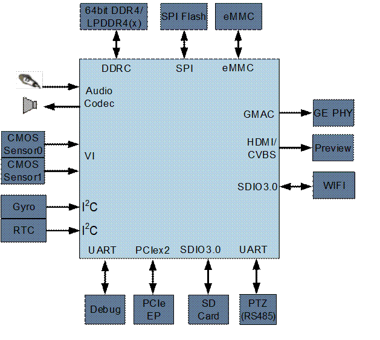
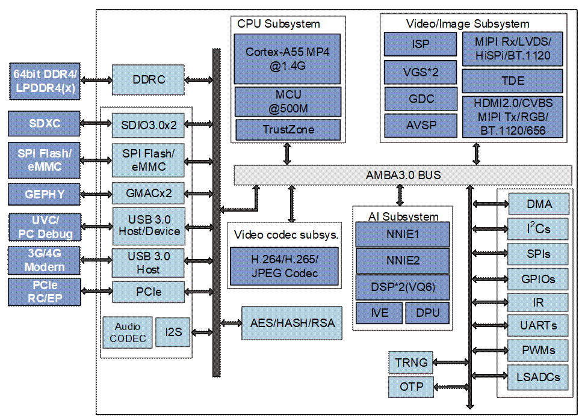

目 录

[1 产品概述 1-1](#_Toc236672815)

[1.1 概述 1-1](#_Toc236672816)

[1.2 应用场景 1-1](#_Toc236672817)

[1.2.1 Hi3403V100专业智能网络摄像机方案 1-1](#_Toc236672818)

[1.3 架构 1-2](#_Toc236672819)

[1.3.1 芯片逻辑框图 1-2](#_Toc236672820)

[1.3.2 处理器内核 1-3](#_Toc236672821)

[1.3.3 智能视频分析 1-3](#_Toc236672822)

[1.3.4 视频编解码 1-4](#_Toc236672823)

[1.3.5 视频输入接口 1-4](#_Toc236672824)

[1.3.6 ISP 1-5](#_Toc236672825)

[1.3.7 视频与图形处理 1-5](#_Toc236672826)

[1.3.8 视频输出 1-5](#_Toc236672827)

[1.3.9 音频接口与处理 1-6](#_Toc236672828)

[1.3.10 安全隔离与引擎 1-6](#_Toc236672829)

[1.3.11 网络接口 1-6](#_Toc236672830)

[1.3.12 外围接口 1-7](#_Toc236672831)

[1.3.13 外部存储器接口 1-7](#_Toc236672832)

[1.3.14 SDK 1-8](#_Toc236672833)

[1.3.15 芯片物理规格 1-8](#_Toc236672834)

[1.4 启动和升级模式 1-8](#_Toc236672835)

[1.4.1 概述 1-8](#_Toc236672836)

[1.4.2 启动介质和上电锁存值关系 1-9](#_Toc236672837)

[1.4.3 启动模式 1-10](#_Toc236672838)

[1.5 地址空间映射 1-11](#_Toc236672839)

插图目录

[图1-1 Hi3403V100专业智能网络摄像机方案 1-2](#_Toc236672840)

[图1-2 Hi3403V100芯片逻辑框图 1-3](#_Toc236672841)

表格目录

[表1-1 启动介质 1-10](#_Toc236672842)

[表1-2 启动模式 1-10](#_Toc236672843)

[表1-3 地址空间映射表 1-11](#_Toc236672844)

# 产品概述

## 概述

Hi3403V100是一颗面向市场推出的专业超高清智能网络录像机SoC。该芯片最高支持四路sensor输入，支持最高4K60的ISP图像处理能力，支持3F WDR、多级降噪、六轴防抖、硬件拼接等多种图像增强和处理算法，为用户提供了卓越的图像处理能力。

Hi3403V100内置四核A55，提供高效且丰富和灵活的CPU资源，以满足客户计算和控制需求。集成单核MCU，以满足某些低延时要求较高场景。

Hi3403V100集成了高效的图像分析工具推理单元，最高15.2Tops INT4或10.4Tops INT8，并支持业界主流的图像分析工具框架。并内置双核Vision DSP，以满足客户一些差异化的CV计算需求。

Hi3403V100采用先进的12nm低功耗工艺和0.65pitch封装，同时支持LPDDR4/LPDDR4x/DDR4颗粒，满足客户应用的产品小型化设计和快速量产。

Hi3403V100配套提供的稳定、易用的SDK设计，能够支撑客户快速产品量产。

## 应用场景

### Hi3403V100专业智能网络摄像机方案

Hi3403V100专业智能网络摄像机方案如图1-1所示。

Hi3403V100专业智能网络摄像机方案

## 架构

### 芯片逻辑框图

Hi3403V100芯片逻辑框图如图1-2所示。

Hi3403V100芯片逻辑框图

### 处理器内核

- 四核ARM Cortex A55@1.4GHz
- 32KB I-Cache，32KB D-Cache /512KB L3 cache
- 支持Neon加速，集成FPU处理单元
- 内置32bit MCU@500MHz

32KB I-Cache，32KB D-Cache /64KB TCM

- 支持TrustZone

### 智能视频分析

- *图像分析*加速引擎，高达15.2Tops@INT4或10.4Tops@INT8算力
- 双内核异构引擎
- 引擎1 支持9.6Tops@INT4或4.8Tops@INT8算力，支持INT4/INT8/FP16
- 引擎2 支持5.6Tops算力，支持INT8/INT16
- 支持完整的API和工具链，易于客户开发
- 双核Vision Q6 DSP

32K I-Cache /32K D-Cache /32K IRAM/320K DRAM

- 内置智能计算加速引擎
- 内置双目深度加速单元
- 内置矩阵计算加速单元

### 视频编解码

- H.264 BP/MP/HP
- H.265 Main Profile
- H.264/H.265编解码最大分辨率为8192 x 8192
- H.264/H.265 编码支持I/P帧
- H.264/H.265多码流编码能力：
- 3840 x 2160@60fps + 1280x720@30fps
- 7680 x 4320@15fps
- H.264/H.265/MPEG-4多码流解码能力：

3840 x 2160@60fps + 1920x1080@60fps

- 支持最多8个区域的编码前OSD叠加
- 支持CBR/VBR/AVBR/FIXQP/QPMAP等多种码率控制模式
- 输出码率最大值160Mbps
- 支持8个感兴趣区域（ROI）编码
- 支持JPEG Baseline编解码
- JPEG编解码最大分辨率16384x16384
- JPEG最大性能
- 编码：3840 x 2160@60fps(YUV420)
- 解码：3840 x 2160@75fps(YUV420)

### 视频输入接口

- 支持8-Lane image sensor串行输入，支持 MIPI/LVDS/Sub-LVDS/HiSPi多种接口
- 支持2x4-Lane或4x2-Lane等多种组合，最高支持4路sensor串行输入
- 最大分辨率8192 x 8192
- 支持8/10/12/14 Bit RGB Bayer DC时序视频输入，时钟频率最高150MHz
- 支持BT.601、BT.656、BT.1120视频输入接口
- 支持主流CMOS电平热成像传感器

### ISP

- ISP支持分时复用处理多路sensor输入视频
- 支持3A（AE/AWB/AF）功能，3A的控制用户可调节
- 支持去固定模式噪声（FPN）
- 支持坏点校正、镜头阴影校正
- 最高支持三帧WDR及Advanced Local Tone Mapping
- 支持多级3D去噪、图像边缘增强、去雾、动态对比度增强等处理功能
- 支持3D-LUT色彩调节
- 支持镜头畸变校正，支持鱼眼矫正
- 支持6-DoF数字防抖及Rolling-Shutter校正
- 支持图像Mirror、Flip、90度/270度旋转
- 提供 PC端ISP 调节工具
- 支持超感光去噪（HNR）

### 视频与图形处理

- 支持图形和图像1/15.5～16x缩放功能
- 支持多达4路视频全景拼接
- 输入2路3840x2160@30fps，输出4320x3840@30fps
- 输入4路2688x1520@30fps，输出6080x2688@30fps
- 支持视频层、图形层叠加
- 支持色彩空间转换

### 视频输出

- 支持HDMI2.0接口输出
- 支持4-Lane Mipi DSI/CSI接口输出，最高2.5Gbps/lane
- 内置模拟标清CVBS输出
- 支持8/16/24 bit RGB、BT.656、BT.1120等数字接口
- 同时支持2个独立高清视频输出
- 支持任意两种接口非同源输出
- 其中一路可支持PIP(Piture In Piture)
- 最大输出能力3840x2160@60fps + 1920x1080@60fps

### 音频接口与处理

- 内置Audio codec，支持16bit 语音输入和输出
- 支持I2S接口

支持多声道时分复用传输模式（TDM）

- 支持HDMI Audio输出
- 通过软件实现多协议语音编解码
- 支持音频3A（AEC/ANR/ALC）处理
- 支持G.711/G.726/AAC/等音频编码格式

### 安全隔离与引擎

- 支持安全启动
- 支持基于TrustZone的REE/TEE硬件隔离方案
- 硬件实现AES对称加密算法
- 硬件实现RSA2048/3072/4096签名校验算法
- 硬件实现基于HASH的SHA256/384/512、HMAC\_SHA256/384/512算法
- 硬件实现随机数发生器
- 集成30Kbit OTP存储空间供客户使用

### 网络接口

2个千兆以太网接口

- 支持RGMII、RMII两种接口模式
- 支持TSO、UFO、COE等加速单元

### 外围接口

- 支持上电复位（POR）和外部输入复位
- 集成4通道LSADC
- 多个UART、I2C、SPI、GPIO接口
- 2个SDIO3.0接口
- SDIO0支持SDXC卡，最大容量2TB
- SDIO1支持对接wifi模组
- 2个USB3.0/USB2.0接口
- USB0 仅Host接口
- USB1 Host/Device可切换
- 2-Lane PCIe2.0高速接口
- 支持RC/EP模式
- 可配置为2-Lane PCIe2.0
- 可配置为1-Lane PCIe2.0 + USB3.0

### 外部存储器接口

- DDR4/LPDDR4/LPDDR4x接口
- 支持4 x 16bit DDR4
- 支持2 x 32bit LPDDR4/LPDDR4x
- DDR4最高速率3200Mbps
- LPDDR4/LPDDR4x最高速率3733Mbps
- 最大容量8GB
- SPI Nor/SPI Nand Flash接口
- 支持1、2、4线模式
- SPI Nor Flash支持3Byte、4Byte 地址模式
- NAND Flash接口
- 支持SLC、MLC异步接口器件
- 支持2/4/8/16KB页大小
- 支持8/16/24/28/40/64bit ECC（以1KB为单位）
- eMMC5.1接口，最大容量2TB
- 可选择从eMMC、SPI Nor/SPI Nand Flash、NAND Flash或PCIe从片启动

### SDK

- Arm CPU支持Linux SMP
- DSP/MCU支持LiteOS

### 芯片物理规格

- 功耗

5.2W典型功耗(4K30 + 4Tops)

- 工作电压
- 内核电压为0.8V
- IO电压为1.8/3.3V
- DDR4/LPDDR4/LPDDR4x接口电压分别为1.2/1.1/0.6V
- 封装形式
- RoHS，FC-BGA 23mm x 23mm封装
- 管脚间距：0.65mm

## 启动和升级模式

### 概述

芯片中内置启动ROM（BOOTROM），芯片复位撤销后由BOOTROM开始执行启动引导程序。

#### 启动介质

芯片包含多种外设接口可用于启动介质接口：

- SPI Nand/Nor Flash存储接口。
- 并行Nand Flash存储接口。
- eMMC存储接口。

启动介质的选择由SFC\_EMMC\_BOOT\_MODE/BOOT\_SEL1/BOOT\_SEL0信号决定。

#### PCIe从启动

芯片还支持PCIe从片启动，此时芯片作为从片，通过PCIe接口与主片连接，主片可以通过PCIe接口将启动程序加载至从片并引导从片启动。

PCIe从片启动由PCIE\_SLV\_BOOT\_MODE信号的值决定。

#### 烧写（升级）

芯片通过SDIO0/USB3控制器1 Device/UART0来对启动介质进行烧写(升级)。SD卡、USB升级模式由UPDATE\_MODE\_N和OTP信号决定，UART烧写由FAST\_BOOT\_MODE信号的值决定。

### 启动介质和上电锁存值关系

启动/升级介质由PCIE\_SLV\_BOOT\_MODE/FAST\_BOOT\_MOD/SFC\_EMMC\_BOOT\_MODE/BOOT\_SEL1/BOOT\_SEL0和UPDATE\_MODE\_N信号来确定。

<strong><big>说明</big></strong>

- PCIE\_SLV\_BOOT\_MODE信号为SENSOR1\_VS管脚的上电锁存值；
- FAST\_BOOT\_MODE信号为RGMII0\_TXD0管脚的上电锁存值;
- SFC\_EMMC\_BOOT\_MODE信号为 RGMII0\_TXD1管脚的上电锁存值;
- BOOT\_SEL1信号为 RGMII0\_TXD2管脚的上电锁存值;
- BOOT\_SEL0信号为 RGMII0\_TXD3管脚的上电锁存值;
- UPDATE\_MODE\_N信号为系统启动时GPIO0\_0的状态，通常GPIO0\_0可设计成按键，按下时状态为0，表示升级；未按下时状态为1，表示非升级;
- 以上上电锁存值不受系统软复位影响；
- SFC\_EMMC\_BOOT\_MODE & BOOT\_SEL1 & BOOT\_SEL0决定了启动或者烧写的目标介质。
- FAST\_BOOT\_MODE用于选择是否进入串口烧写。
- PCIE\_SLV\_BOOT\_MODE用于是否进入PCIe从片启动。
- UPDATE\_MODE\_N用于选择是否进入SD/USB升级。

启动介质和这些信号的关系如表1-1所示：

启动介质

| PCIE\_SLV\_BOOT\_MODE | FAST\_BOOT\_MODE | BOOT\_SEL1 | BOOT\_SEL0 | 启动介质 |
| --- | --- | --- | --- | --- |
| 0 | 0 | 0 | 0 | 从SPI NOR Flash启动 |
| 0 | 0 | 0 | 1 | 从SPI NAND Flash启动 |
| 0 | 0 | 1 | 0 | 从Nand Flash启动 |
| 0 | 0 | 1 | 1 | 从EMMC启动 |
| 0 | 1 | 0 | 0 | 串口烧写模式，烧写SPI NOR Flash |
| 0 | 1 | 0 | 1 | 串口烧写模式，烧写SPI NAND Flash |
| 0 | 1 | 1 | 0 | 串口烧写模式，烧写NAND Flash |
| 0 | 1 | 1 | 1 | 串口烧写模式，烧写EMMC |
| 1 | X | X | X | PCIe从片启动 |

### 启动模式

芯片支持如下表所示启动模式，其中Secure\_Boot\_En和Quick\_Boot分别由寄存器的值来决定 (源于OTP中的启动模式标志位)。

启动模式

| Quick\_Boot[3:0] | Secure\_Boot\_En[7:0] | 启动模式 |
| --- | --- | --- |
| 非0x5 | 非0x42 | 安全启动模式  （对uBoot进行验签，若验签通过，则系统启动，验签不通过则系统不能启动） |
| 非0x5 | 0x42 | 非安全启动的普通模式  （对uBoot进行验签，验签结果不影响系统启动） |
| 0x5 | X | 非安全启动的快启模式  （不对uBoot进行验签） |

<strong><big>须知</big></strong>

推荐使用安全启动模式，以降低产品的安全风险。

## 地址空间映射

地址空间参见表1-3。

地址空间映射表

| 起始地址 | 结束地址 | 功能 | 大小 | 说明 |
| --- | --- | --- | --- | --- |
| 0x0\_0000\_0000 | 0x0\_03FF\_FFFF | 重映射时：启动地址空间BOOTROM  撤销重映射后：作为芯片内SRAM | 64MB | SRAM实际大小为64KB |
| 0x0\_0400\_0000 | 0x0\_0400\_FFFF | 保留 | - | - |
| 0x0\_0401\_0000 | 0x0\_0401\_FFFF | 重映射时：启动地址空间BOOTRAM0  撤销重映射后：作为芯片内SRAM | 64KB | - |
| 0x0\_0402\_0000 | 0x0\_0402\_FFFF | 重映射时：启动地址空间BOOTRAM1  撤销重映射后：作为芯片VGS0功能 | 64KB | 实际大小为40KB |
| 0x0\_0402\_0000 | 0x0\_0EFF\_FFFF | 保留 | - | - |
| 0x0\_0F00\_0000 | 0x0\_0FFF\_FFFF | FMC\_MEM空间 | 16MB | - |
| 0x0\_1000\_0000 | 0x0\_1000\_FFFF | FMC寄存器 | 64KB | - |
| 0x0\_1001\_0000 | 0x0\_1001\_FFFF | eMMC\_PHY寄存器 | 64KB | - |
| 0x0\_1002\_0000 | 0x0\_1002\_FFFF | eMMC\_CTRL寄存器 | 64KB | - |
| 0x0\_1003\_0000 | 0x0\_1003\_FFFF | SDIO0\_CTRL寄存器 | 64KB | - |
| 0x0\_1004\_0000 | 0x0\_1004\_FFFF | SDIO1\_CTRL寄存器 | 64KB | - |
| 0x0\_1005\_0000 | 0x0\_100F\_FFFF | 保留 | - | - |
| 0x0\_1010\_0000 | 0x0\_1010\_FFFF | SPACC寄存器 | 64KB | - |
| 0x0\_1011\_0000 | 0x0\_1011\_3FFF | 保留 | - | - |
| 0x0\_1011\_4000 | 0x0\_1011\_4FFF | TRNG寄存器 | 4KB | - |
| 0x0\_1011\_5000 | 0x0\_1011\_FFFF | 保留 | - | - |
| 0x0\_1012\_0000 | 0x0\_1012\_3FFF | OTP CTRL寄存器 | 16KB |  |
| 0x0\_1012\_4000 | 0x0\_1021\_FFFF | 保留 | - | - |
| 0x0\_1022\_0000 | 0x0\_1022\_FFFF | PCIE地址白名单寄存器 | 64KB |  |
| 0x0\_1023\_0000 | 0x0\_1023\_FFFF | IO0\_CFG寄存器 | 64KB | IO0管脚配置 |
| 0x0\_1024\_0000 | 0x0\_1027\_FFFF | 保留 | - | - |
| 0x0\_1028\_0000 | 0x0\_1028\_0FFF | DMAC寄存器 | 4KB |  |
| 0x0\_1028\_1000 | 0x0\_1028\_FFFF | 保留 | - | - |
| 0x0\_1029\_0000 | 0x0\_1029\_FFFF | GMAC0寄存器 | 64KB |  |
| 0x0\_102A\_0000 | 0x0\_102A\_FFFF | GMAC1寄存器 | 64KB |  |
| 0x0\_102B\_0000 | 0x0\_102C\_FFFF | 保留 | - | - |
| 0x0\_102E\_0000 | 0x0\_102E\_FFFF | MIPI\_TX\_CFG & SPI\_CFG & SDIO0 PWR\_SWITCH寄存器 | 64KB |  |
| 0x0\_102F\_0000 | 0x0\_102F\_FFFF | IO1\_CFG寄存器 | 64KB | IO1管脚配置 |
| 0x0\_1030\_0000 | 0x0\_1030\_FFFF | USB3\_CTRL\_0寄存器 | 64KB |  |
| 0x0\_1031\_0000 | 0x0\_1031\_FFFF | USB2\_PHY0寄存器 | 64KB |  |
| 0x0\_1032\_0000 | 0x0\_1032\_FFFF | USB3\_CTRL\_1寄存器 | 64KB |  |
| 0x0\_1033\_0000 | 0x0\_1033\_FFFF | USB2\_PHY1寄存器 | 64KB |  |
| 0x0\_1034\_A000 | 0x0\_103C\_FFFF | 保留 | - | - |
| 0x0\_103D\_0000 | 0x0\_103D\_FFFF | PCIE\_CTRL寄存器 | 64KB | - |
| 0x0\_103E\_0000 | 0x0\_10FF\_FFFF | 保留 | - | - |
| 0x0\_1100\_0000 | 0x0\_1100\_0FFF | TIMER0/1寄存器 | 4KB | - |
| 0x0\_1100\_1000 | 0x0\_1100\_1FFF | TIMER2/3寄存器 | 4KB | - |
| 0x0\_1100\_2000 | 0x0\_1100\_2FFF | TIMER4/5寄存器 | 4KB | - |
| 0x0\_1100\_3000 | 0x0\_1100\_3FFF | TIMER6/7寄存器 | 4KB | - |
| 0x0\_1100\_4000 | 0x0\_1100\_4FFF | TIMER8/9寄存器 | 4KB | - |
| 0x0\_1100\_5000 | 0x0\_1100\_5FFF | TIMER10/11寄存器 | 4KB | - |
| 0x0\_1100\_6000 | 0x0\_1100\_6FFF | TIMER12/13寄存器 | 4KB | - |
| 0x0\_1100\_7000 | 0x0\_1100\_7FFF | TIMER14/15寄存器 | 4KB | - |
| 0x0\_1100\_8000 | 0x0\_1100\_8FFF | SEC\_TIMER0/1寄存器 | 4KB | - |
| 0x0\_1100\_9000 | 0x0\_1100\_9FFF | SEC\_TIMER2/3寄存器 | 4KB | - |
| 0x0\_1100\_A000 | 0x0\_1100\_FFFF | 保留 | - | - |
| 0x0\_1101\_0000 | 0x0\_1101\_FFFF | CRG寄存器 | 64KB | - |
| 0x0\_1102\_0000 | 0x0\_1102\_3FFF | SYS CTRL寄存器 | 16KB | - |
| 0x0\_1102\_4000 | 0x0\_1102\_8FFF | SOC MISC寄存器 | 20KB |  |
| 0x0\_1102\_9000 | 0x0\_1102\_9FFF | SVB PWM寄存器 | 4KB | - |
| 0x0\_1102\_A000 | 0x0\_1102\_AFFF | 保留 | - | - |
| 0x0\_1102\_B000 | 0x0\_1102\_BFFF | HPM\_CTRL寄存器 | 4KB | - |
| 0x0\_1102\_C000 | 0x0\_1102\_CFFF | STOPWATCH寄存器 | 4KB | - |
| 0x0\_1102\_D000 | 0x0\_1102\_DFFF | PWM1寄存器 | 4KB | - |
| 0x0\_1102\_E000 | 0x0\_1102\_EFFF | Tsensor\_CTRL寄存器 | 4KB | - |
| 0x0\_1102\_F000 | 0x0\_1102\_FFFF | 保留 | - | - |
| 0x0\_1103\_0000 | 0x0\_1103\_0FFF | WDG寄存器 | 4KB | - |
| 0x0\_1103\_1000 | 0x0\_1103\_1FFF | IPC寄存器 | 4KB | - |
| 0x0\_1103\_2000 | 0x0\_1103\_2FFF | SEC\_IPC寄存器 | 4KB | - |
| 0x0\_1103\_3000 | 0x0\_1103\_FFFF | 保留 | - | - |
| 0x0\_1104\_0000 | 0x0\_1104\_0FFF | UART0寄存器 | 4KB | - |
| 0x0\_1104\_1000 | 0x0\_1104\_1FFF | UART1寄存器 | 4KB | - |
| 0x0\_1104\_2000 | 0x0\_1104\_2FFF | UART2寄存器 | 4KB | - |
| 0x0\_1104\_3000 | 0x0\_1104\_3FFF | UART3寄存器 | 4KB | - |
| 0x0\_1104\_4000 | 0x0\_1104\_4FFF | UART4寄存器 | 4KB | - |
| 0x0\_1104\_5000 | 0x0\_1104\_5FFF | UART5寄存器 | 4KB | - |
| 0x0\_1104\_6000 | 0x0\_1105\_FFFF | 保留 | - | - |
| 0x0\_1106\_0000 | 0x0\_1106\_0FFF | I2C0寄存器 | 4KB | - |
| 0x0\_1106\_1000 | 0x0\_1106\_1FFF | I2C1寄存器 | 4KB | - |
| 0x0\_1106\_2000 | 0x0\_1106\_2FFF | I2C2寄存器 | 4KB | - |
| 0x0\_1106\_3000 | 0x0\_1106\_3FFF | I2C3寄存器 | 4KB | - |
| 0x0\_1106\_4000 | 0x0\_1106\_4FFF | I2C4寄存器 | 4KB | - |
| 0x0\_1106\_5000 | 0x0\_1106\_5FFF | I2C5寄存器 | 4KB | - |
| 0x0\_1106\_6000 | 0x0\_1106\_FFFF | 保留 | - | - |
| 0x0\_1107\_0000 | 0x0\_1107\_0FFF | SPI0寄存器 | 4KB | - |
| 0x0\_1107\_1000 | 0x0\_1107\_1FFF | SPI1寄存器 | 4KB | - |
| 0x0\_1107\_2000 | 0x0\_1107\_2FFF | 3WIRE\_SPI寄存器 | 4KB | - |
| 0x0\_1107\_3000 | 0x0\_1107\_3FFF | SPI2寄存器 | 4KB | - |
| 0x0\_1107\_4000 | 0x0\_1107\_4FFF | SPI3寄存器 | 4KB | - |
| 0x0\_1107\_5000 | 0x0\_1107\_FFFF | 保留 | - | - |
| 0x0\_1108\_0000 | 0x0\_1108\_FFFF | LSADC寄存器 | 64KB | - |
| 0x0\_1109\_0000 | 0x0\_1109\_0FFF | GPIO0寄存器 | 4KB | - |
| 0x0\_1109\_1000 | 0x0\_1109\_1FFF | GPIO1寄存器 | 4KB | - |
| 0x0\_1109\_2000 | 0x0\_1109\_2FFF | GPIO2寄存器 | 4KB | - |
| 0x0\_1109\_3000 | 0x0\_1109\_3FFF | GPIO3寄存器 | 4KB | - |
| 0x0\_1109\_4000 | 0x0\_1109\_4FFF | GPIO4寄存器 | 4KB | - |
| 0x0\_1109\_5000 | 0x0\_1109\_5FFF | GPIO5寄存器 | 4KB | - |
| 0x0\_1109\_6000 | 0x0\_1109\_6FFF | GPIO6寄存器 | 4KB | - |
| 0x0\_1109\_7000 | 0x0\_1109\_7FFF | GPIO7寄存器 | 4KB | - |
| 0x0\_1109\_8000 | 0x0\_1109\_8FFF | GPIO8寄存器 | 4KB | - |
| 0x0\_1109\_9000 | 0x0\_1109\_9FFF | GPIO9寄存器 | 4KB | - |
| 0x0\_1109\_A000 | 0x0\_1109\_AFFF | GPIO10寄存器 | 4KB | - |
| 0x0\_1109\_B000 | 0x0\_1109\_BFFF | GPIO11寄存器 | 4KB | - |
| 0x0\_1109\_C000 | 0x0\_1109\_CFFF | GPIO12寄存器 | 4KB | - |
| 0x0\_1109\_D000 | 0x0\_1109\_DFFF | GPIO13寄存器 | 4KB | - |
| 0x0\_1109\_E000 | 0x0\_1109\_EFFF | GPIO14寄存器 | 4KB | - |
| 0x0\_1109\_F000 | 0x0\_1109\_FFFF | GPIO15寄存器 | 4KB | - |
| 0x0\_110A\_0000 | 0x0\_110A\_0FFF | GPIO16寄存器 | 4KB | - |
| 0x0\_110A\_1000 | 0x0\_110A\_1FFF | GPIO17寄存器 | 4KB | - |
| 0x0\_110A\_2000 | 0x0\_110A\_FFFF | 保留 | - | - |
| 0x0\_110B\_0000 | 0x0\_110B\_FFFF | PWM0寄存器 | 64KB | - |
| 0x0\_110C\_0000 | 0x0\_110C\_FFFF | 保留 | - | - |
| 0x0\_110D\_0000 | 0x0\_110D\_0FFF | MCU\_TIMER0/1寄存器 | 4KB | - |
| 0x0\_110D\_1000 | 0x0\_110D\_1FFF | MCU\_MTIME寄存器 | 4KB | - |
| 0x0\_110D\_2000 | 0x0\_110D\_2FFF | MCU\_MISC寄存器 | 4KB | - |
| 0x0\_110D\_3000 | 0x0\_110D\_3FFF | MCU\_WDG寄存器 | 4KB | - |
| 0x0\_110D\_4000 | 0x0\_110D\_4FFF | MCU\_DMAC寄存器 | 4KB | - |
| 0x0\_110D\_5000 | 0x0\_110E\_FFFF | 保留 | - | - |
| 0x0\_110F\_0000 | 0x0\_110F\_FFFF | IR寄存器 | 64KB | - |
| 0x0\_1110\_0000 | 0x0\_1113\_FFFF | 保留 | - | - |
| 0x0\_1114\_0000 | 0x0\_1115\_FFFF | DDRC\_SUBSYS寄存器 | 128KB | - |
| 0x0\_1116\_0000 | 0x0\_1116\_FFFF | DDRT0寄存器 | 64KB | - |
| 0x0\_1117\_0000 | 0x0\_1117\_FFFF | DDRT1寄存器 | 64KB | - |
| 0x0\_1118\_0000 | 0x0\_123F\_FFFF | 保留 | - | - |
| 0x0\_1240\_0000 | 0x0\_125F\_FFFF | GIC寄存器 | 2MB | - |
| 0x0\_1260\_0000 | 0x0\_12FF\_FFFF | 保留 | - | - |
| 0x0\_1300\_0000 | 0x0\_1301\_FFFF | MCU处理器寄存器 | 128KB | - |
| 0x0\_1302\_0000 | 0x0\_15FF\_FFFF | 保留 | - | - |
| 0x0\_1600\_0000 | 0x0\_1602\_7FFF | DSP0\_DRAM\_BANK0空间 | 160KB | - |
| 0x0\_1602\_8000 | 0x0\_1603\_FFFF | 保留 | - | - |
| 0x0\_1604\_0000 | 0x0\_1606\_7FFF | DSP0\_DRAM\_BANK1空间 | 160KB | - |
| 0x0\_1606\_8000 | 0x0\_160F\_FFFF | 保留 | - | - |
| 0x0\_1610\_0000 | 0x0\_1610\_7FFF | DSP0\_VQ6\_IRAM空间 | 32KB | - |
| 0x0\_1610\_8000 | 0x0\_1610\_FFFF | 保留 | - | - |
| 0x0\_1611\_0000 | 0x0\_1612\_FFFF | DSP0\_VQ6\_CFG寄存器 | 128KB | - |
| 0x0\_1613\_0000 | 0x0\_161F\_FFFF | 保留 | - | - |
| 0x0\_1620\_0000 | 0x0\_1622\_7FFF | DSP1\_VQ6\_DRAM\_BANK0空间 | 160KB | - |
| 0x0\_1622\_8000 | 0x0\_1623\_FFFF | 保留 | - | - |
| 0x0\_1624\_0000 | 0x0\_1626\_7FFF | DSP1\_VQ6\_DRAM\_BANK1空间 | 160KB | - |
| 0x0\_1628\_0000 | 0x0\_162F\_FFFF | 保留 | - | - |
| 0x0\_1630\_0000 | 0x0\_1630\_7FFF | DSP1\_VQ6\_IRAM空间 | 32KB | - |
| 0x0\_1630\_8000 | 0x0\_1630\_FFFF | 保留 | - | - |
| 0x0\_1631\_0000 | 0x0\_1632\_FFFF | DSP1\_VQ6\_CFG寄存器 | 128KB | - |
| 0x0\_1633\_0000 | 0x0\_16FF\_FFFF | 保留 | - | - |
| 0x0\_1700\_0000 | 0x0\_1700\_FFFF | IVE寄存器 | 64KB | - |
| 0x0\_1701\_0000 | 0x0\_1702\_FFFF | 保留 | - | - |
| 0x0\_1703\_0000 | 0x0\_1703\_FFFF | DPU寄存器 | 64KB | - |
| 0x0\_1704\_0000 | 0x0\_1704\_FFFF | 保留 | - | - |
| 0x0\_1705\_0000 | 0x0\_1705\_FFFF | GZIP寄存器 | 64KB | - |
| 0x0\_1706\_0000 | 0x0\_170F\_FFFF | 保留 | - | - |
| 0x0\_1710\_0000 | 0x0\_1710\_FFFF | VDH寄存器 | 64KB | - |
| 0x0\_1711\_0000 | 0x0\_1713\_FFFF | 保留 | - | - |
| 0x0\_1714\_0000 | 0x0\_1714\_FFFF | VEDU寄存器 | 64KB | - |
| 0x0\_1715\_0000 | 0x0\_1717\_FFFF | 保留 | 64KB | - |
| 0x0\_1718\_0000 | 0x0\_1718\_FFFF | JPGD寄存器 | 64KB | - |
| 0x0\_1719\_0000 | 0x0\_171B\_FFFF | 保留 | - | - |
| 0x0\_171C\_0000 | 0x0\_171C\_FFFF | JPGE寄存器 | 64KB | - |
| 0x0\_171D\_0000 | 0x0\_1723\_FFFF | 保留 | - | - |
| 0x0\_1724\_0000 | 0x0\_1724\_FFFF | VGS0寄存器 | 64KB | - |
| 0x0\_1725\_0000 | 0x0\_1725\_FFFF | VGS1寄存器 | 64KB | - |
| 0x0\_1726\_0000 | 0x0\_1727\_FFFF | 保留 | - | - |
| 0x0\_1728\_0000 | 0x0\_1728\_FFFF | TDE寄存器 | 64KB | - |
| 0x0\_1729\_0000 | 0x0\_172B\_FFFF | 保留 | - | - |
| 0x0\_172C\_0000 | 0x0\_172C\_FFFF | GDC寄存器 | 64KB | - |
| 0x0\_172D\_0000 | 0x0\_173B\_FFFF | 保留 | - | - |
| 0x0\_173C\_0000 | 0x0\_173C\_FFFF | MIPI\_RX寄存器 | 64KB | - |
| 0x0\_173D\_0000 | 0x0\_173D\_FFFF | 热成像控制器寄存器 | 64KB | - |
| 0x0\_173E\_0000 | 0x0\_173F\_FFFF | 保留 | - | - |
| 0x0\_1740\_0000 | 0x0\_175F\_FFFF | VICAP寄存器 | 2MB | - |
| 0x0\_1760\_0000 | 0x0\_177F\_FFFF | 保留 | - | - |
| 0x0\_1780\_0000 | 0x0\_1787\_FFFF | VIPROC寄存器 | 512KB | - |
| 0x0\_1788\_0000 | 0x0\_178F\_FFFF | 保留 | - | - |
| 0x0\_1790\_0000 | 0x0\_1790\_FFFF | VPSS寄存器 | 64KB | - |
| 0x0\_1791\_0000 | 0x0\_1791\_FFFF | 保留 | - | - |
| 0x0\_1792\_0000 | 0x0\_1792\_FFFF | VI\_MIPI模式寄存器 | 64KB | - |
| 0x0\_1793\_0000 | 0x0\_1793\_FFFF | AVSP寄存器 | 64KB | - |
| 0x0\_1794\_0000 | 0x0\_179F\_FFFF | 保留 | - | - |
| 0x0\_17A0\_0000 | 0x0\_17A3\_FFFF | VDP寄存器 | 256KB | - |
| 0x0\_17A4\_0000 | 0x0\_17A7\_FFFF | 保留 | - | - |
| 0x0\_17A8\_0000 | 0x0\_17A8\_FFFF | MIPI\_TX\_CTRL寄存器 | 64KB | - |
| 0x0\_17A9\_0000 | 0x0\_17B3\_FFFF | 保留 | - | - |
| 0x0\_17B4\_0000 | 0x0\_17B5\_FFFF | HDMI\_TX\_CTRL寄存器 | 128KB | - |
| 0x0\_17B6\_0000 | 0x0\_17BB\_FFFF | 保留 | - | - |
| 0x0\_17BC\_0000 | 0x0\_17BC\_FFFF | HDMI\_TX\_PHY寄存器 | 64KB | - |
| 0x0\_17BD\_0000 | 0x0\_17BF\_FFFF | 保留 | - | - |
| 0x0\_17C0\_0000 | 0x0\_17C0\_FFFF | AIAO寄存器 | 64KB | - |
| 0x0\_17C1\_0000 | 0x0\_17C3\_FFFF | 保留 | - | - |
| 0x0\_17C4\_0000 | 0x0\_17C4\_FFFF | Audio Codec寄存器 | 64KB | - |
| 0x0\_17C5\_0000 | 0x0\_1FFF\_FFFF | 保留 | - | - |
| 0x0\_2000\_0000 | 0x0\_2FFF\_FFFF | PCIE寄存器 | 256MB | PCIE配置事务地址空间 |
| 0x0\_3000\_0000 | 0x0\_3FFF\_FFFF | PCIE\_MEM空间 | 256MB | PCIE存储器事务地址空间 |
| 0x0\_4000\_0000 | 0x2\_FFFF\_FFFF | DDR空间 | 11264MB | - |
| 0x3\_0000\_0000 | 0x3\_FFFF\_FFFF | PCIE\_MEM\_ADD空间 | 4GB | 扩展存储器事务地址空间 |

