目 录

[10 智能加速引擎 10-1](#_Toc113615486)

[10.1 *图像分析引擎* 10-1](#_Toc113615487)

[10.1.1 概述 10-1](#_Toc113615488)

[10.1.2 特点 10-2](#_Toc113615489)

[10.2 DPU 10-3](#_Toc113615490)

[10.2.1 概述 10-3](#_Toc113615491)

[10.2.2 特点 10-3](#_Toc113615492)

[10.2.3 功能描述 10-4](#_Toc113615493)

[10.3 IVE 10-5](#_Toc113615494)

[10.3.1 概述 10-5](#_Toc113615495)

[10.3.2 功能描述 10-5](#_Toc113615496)

[10.3.3 工作方式 10-7](#_Toc113615497)

[10.4 DSP 10-23](#_Toc113615498)

[10.4.1 概述 10-23](#_Toc113615499)

[10.4.2 特点 10-23](#_Toc113615500)

[10.4.3 功能描述 10-23](#_Toc113615501)

[10.5 MAU 10-24](#_Toc113615502)

[10.5.1 概述 10-24](#_Toc113615503)

[10.5.2 特点 10-24](#_Toc113615504)

[10.5.3 功能描述 10-25](#_Toc113615505)

插图目录

[图10-1 *图像分析*加速引擎在系统中的位置 10-2](#_Toc113615506)

[图10-2 DPU在系统中的位置 10-4](#_Toc113615507)

[图10-3 IVE在系统中的位置 10-5](#_Toc113615508)

[图10-4 SP422存储格式 10-7](#_Toc113615509)

[图10-5 SP420存储格式 10-7](#_Toc113615510)

[图10-6 8bit单分量数据在Memory中的存储 10-8](#_Toc113615511)

[图10-7 Package存储格式 10-8](#_Toc113615512)

[图10-8 Plannar存储格式 10-9](#_Toc113615513)

[图10-9 16bit单分量数据在Memory中的存储 10-9](#_Toc113615514)

[图10-10 32bit单分量数据在Memory中的存储 10-10](#_Toc113615515)

[图10-11 64bit单分量数据在Memory中的存储 10-10](#_Toc113615516)

[图10-12 NCC输出数据在Memory中的存储 10-10](#_Toc113615517)

[图10-13 CCL统计信息在Memory中的存储（顺序存放） 10-10](#_Toc113615518)

[图10-14 16bit水平和垂直方向的间插数据在Memory中的存储 10-11](#_Toc113615519)

[图10-15 HOG输出格式1 10-11](#_Toc113615520)

[图10-16 HOG输出格式2 10-12](#_Toc113615521)

[图10-17 DSP在系统中的位置 10-24](#_Toc113615522)

[图10-18 MAU在系统中的位置 10-25](#_Toc113615523)

# 智能加速引擎

## *图像分析引擎*

### 概述

*图像分析引擎*是一款基于CNN、RCNN等*图像分析工具*结构的*图像分析方法*专用加速器，可用于图片分类、目标检测等应用场景。

*图像分析引擎*包含2个引擎*，*分别为*图像分析引擎*1和*图像分析引擎*2，它们在系统中的位置如图10-1所示。

*图像分析*加速引擎在系统中的位置

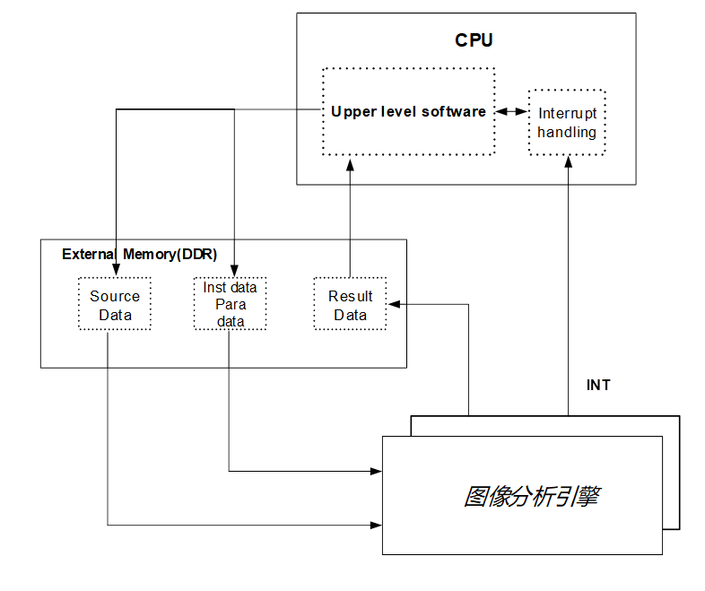

### 特点

1. *图像分析引擎*1
- 最高9.6Tops@INT4或4.8Tops@INT8的NN计算能力，兼容FP16计算。
- INT8计算下支持winograd加速。
- 支持feature map压缩解压和weight解压。
- 支持Y单分量、YUV、RGB、RAW等多种输入格式数据。
- 支持图像预处理(均值化和像素值缩放)。
- 支持图像批处理。
- 支持HWTS(Hardware Task Scheduler)任务管理调度。
- 支持2级页表的SMMU(System Memory Management Unit)，与ARM主CPU共页表。
- 支持安全与非安全等运行机制。
- 支持基于JTAG的静态调试功能。
1. *图像分析引擎*2
- 支持int8 \* int8下5.6Tops算力支持N \* M卷积
- 支持Pooling（Max和Average）
- 支持Stride（此处Stride特指神经网络专用术语）
- 支持Pad
- 支持激活函数（Relu、Sigmoid和TanH等）
- 支持LRN运算
- 支持BN(Batch Normalization)
- 支持向量与矩阵的乘加运算(Inner Product)
- 支持Concat
- 支持Eltwise
- 支持4bit/8bit/16bit的数据与参数模式
- 支持4bit/8bit的参数
- 支持featuremap压缩
- 支持输入图像为单通道（灰度图）和三通道（RGB格式）
- 支持图像预处理(均值化和像素值缩放)
- 支持图像批处理
- 支持中间层结果上报

## DPU

### 概述

DPU(Depth Process Unit)对输入的左图像和右图像经过校正和匹配计算得出深度图。

### 特点

DPU有如下主要规格点：

- 支持校正和匹配（支持单独或同时使用）；
- 支持左图和右图同时校正；
- 支持最大分辨率1080P；
- 支持最大搜索视差数目224；
- 支持起始视差可配置，范围0~64；
- 只支持Y单分量输入；
- 支持亚像素深度图输出；
- 只支持以右图为参考图像，左图作为搜索图像；
- 匹配支持左图宽度大于右图宽度；
- 校正支持左图和右图分辨率不同，输入输出分辨率不同。

### 功能描述

DPU在系统中的位置如图10-2所示。

DPU在系统中的位置

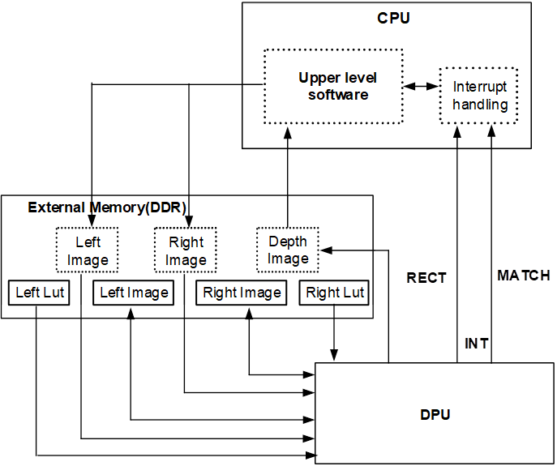

DPU的功能简要描述如下：

- 使用校正的功能时，输入是左图和左图查找表，右图和右图查找表，输出是校正后的左图和右图，上报的是RECT中断；
- 使用匹配的功能时，输入的是校正后的左图和右图，输出的是深度图，上报的是MATCH中断。

## IVE

### 概述

IVE (Intelligent Video Engine)模块提供智能分析算法中所用到的一系列基础运算功能，以及部分耗时较大的特殊功能，是智能分析系统中的硬件加速模块，IVE在系统中的位置如图10-3所示。

IVE在系统中的位置

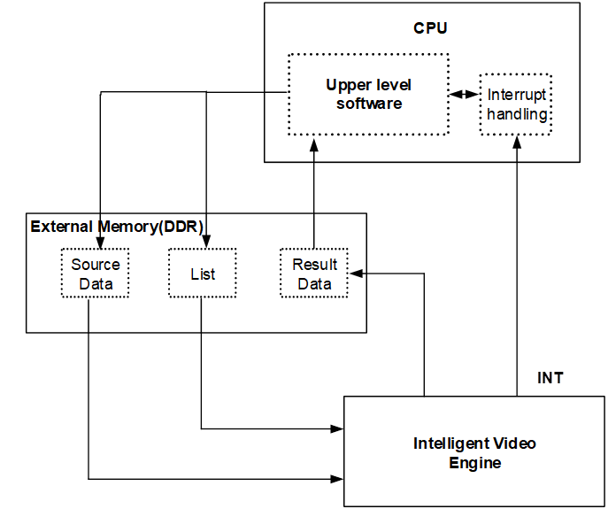

### 功能描述

IVE模块支持如下功能特点：

- DMA：支持直接拷贝、间隔拷贝、内存填充。
- Filter：支持5x5模板滤波。
- CSC：支持YUV2RGB、YUV2HSV、YUV2LAB、RGB2YUV颜色空间转换。
- FilterAndCSC：支持 5x5模板滤波和CSC的复合功能。
- Sobel：支持5x5模板Sobel-like梯度计算。
- MagAndAng\Canny：支持5x5模板梯度幅值和幅角计算、Canny边缘提取。
- Erode：支持5x5模板腐蚀。
- Dilate：支持5x5模板膨胀。
- Threshold\Threshold\_s16\Threshold\_u16：支持图像阈值化处理。
- And\Or\Xor：支持两幅图像相与、或、异或。
- Add\Sub：支持两幅图像相加权加、减。
- Integ：支持积分图计算。
- Hist：支持直方图统计。
- Map：支持对图像通过256级map映射赋值。
- 16BitTo8Bit：支持16bit数据到8bit数据线性转换。
- OrdStatFilter：支持顺序统计量滤波：中值滤波、最大值滤波、最小值滤波。
- NCC：支持两相同大小图像互相关系数计算。
- CCL：支持连通区域标记。
- LBP：支持简单局部二值模式计算。
- NormGrad：支持归一化梯度计算。
- LKOpticalFlowPyr：支持LK光流跟踪。
- STCorner：支持ShiTomasi角点检测。
- SAD：支持分块计算两幅图像对应像素差值绝对值的累加和。
- Resize：支持双线性、区域图像缩放。
- GMM2：支持灰度图、RGB图的快速混合高斯背景建模。
- PSP：支持nonreflective similiarity、similiarity、affine 三种变换。
- HOG：支持方向梯度直方图特征提取。
- KCF：支持对HOG特征进行核相关滤波。
- 支持单独进行软复位。
- 支持128bit AXI总线和32 bit APB总线。
- 支持链表级中断、节点级中断和超时中断。
- 支持SP400、SP420 (semi-plannar 420)、SP422 (semi-plannar 422)、package、planar等输入格式。
- 支持SP400、SP420、SP422、package、plannar等输出格式。
- 部分算子支持读写地址非16-byte对齐。

### 工作方式

#### 输入、输出数据格式

图10-4～图10-14中的w、h均指的是图像以像素为单位的宽、高。如无特别说明，数据存放顺序均是在小端系统（little endian）的内存存放顺序，为了方便描述，统一使用word作为存储单位进行描述，实际应用中不同的算子对数据存储对齐格式有特殊要求。10.3.3.2 中所描述的不同算子功能，对应的输入输出格式也不相同。

SP422存储格式

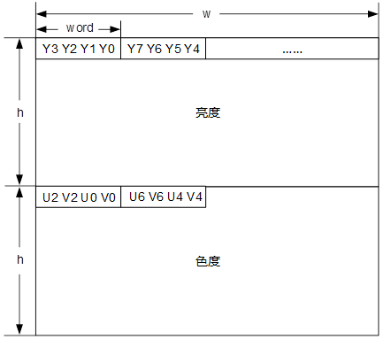

SP420存储格式

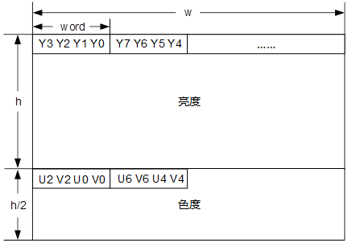

8bit单分量数据在Memory中的存储

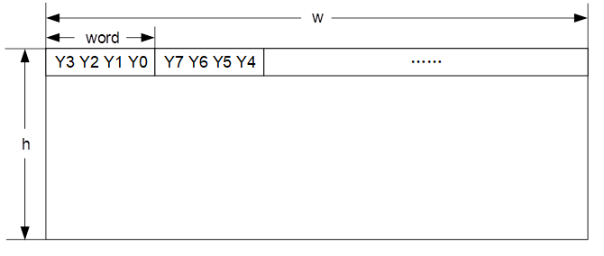

Package存储格式

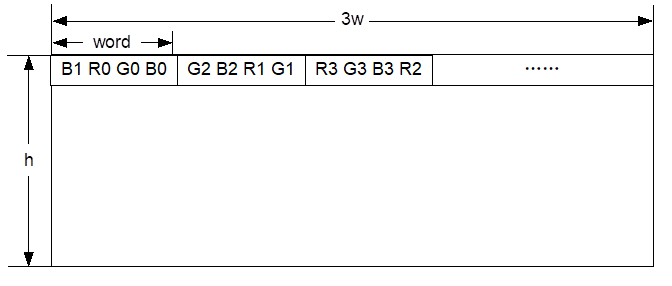

Plannar存储格式

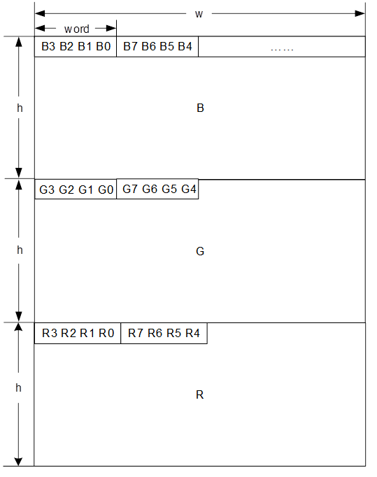

16bit单分量数据在Memory中的存储

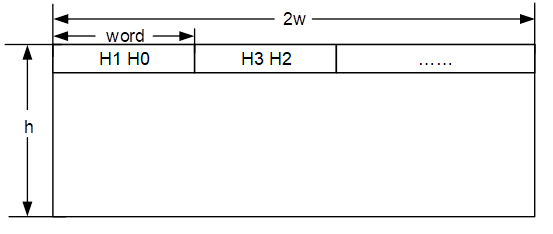

32bit单分量数据在Memory中的存储

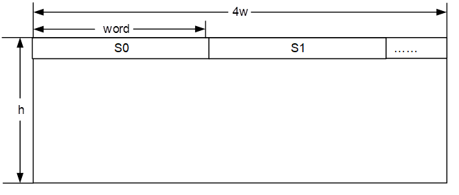

64bit单分量数据在Memory中的存储

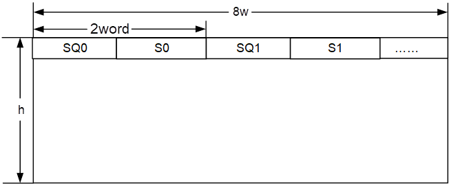

NCC输出数据在Memory中的存储

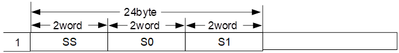

CCL统计信息在Memory中的存储（顺序存放）

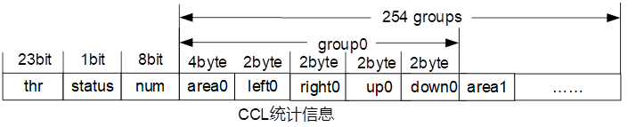

16bit水平和垂直方向的间插数据在Memory中的存储

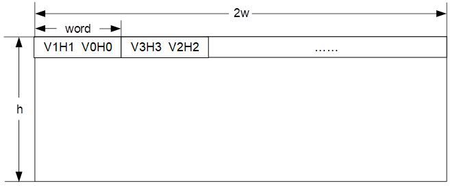

HOG输出格式1

HOG输出格式2

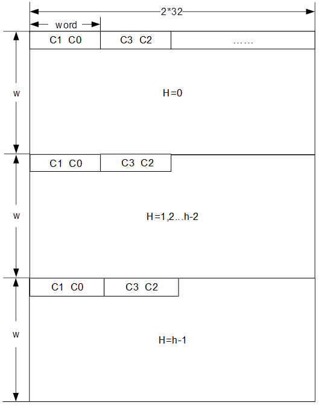

#### 支持的功能

<strong><big>说明</big></strong>

本章节描述的各算子的支持分辨率请参考《IVE API 参考》。

#### DMA

直接拷贝模式

实现矩形数据区域的快速搬移功能。源数据在此模式下将会直接通过IVE内部快速通路，搬移到目的区域，并直接覆盖目标区域数据。

- 地址对齐方式：输入输出地址都要求byte对齐，输入输出stride要求16byte对齐
- 输入输出格式：输入和输出都是8bit单分量数据，如图10-6所示

间隔拷贝模式

实现矩形区域的数据间隔搬移的功能。源数据在该模式下将在水平和垂直方向上都间隔给定的距离搬运固定大小数据到目的区域。

- 地址对齐方式：输入输出地址都要求byte对齐，输入输出stride要求16byte对齐
- 输入输出格式：输入和输出都是8bit单分量数据，如图10-6所示
- 其他：源数据宽width必须为distance的整数倍

3字节memset模式

实现矩形数据区域的memory set功能，以3字节为单位填充目的区域。

- 地址对齐方式：输入输出地址都要求byte对齐，输入输出stride要求16byte对齐
- 输入输出格式：无输入数据，输出8bit单分量数据，如图10-6所示

8字节memset模式

实现矩形数据区域的memory set功能，以8字节为单位填充目的区域。

- 地址对齐方式：输入输出地址都要求byte对齐，输入输出stride要求16byte对齐
- 输入输出格式：无输入数据，输出8bit单分量数据，如图10-6所示
#### Filter

将源图像以5x5模板作滤波后输出。

- 地址对齐方式：输入输出地址与stride都要求16-byte对齐，输出各分量配置相同stride
- 输入输出格式有3种不同情况：
- 输入和输出都是8bit单分量数据，如图10-6所示
- 输入和输出都是SP420数据，如图10-5所示
- 输入和输出都是SP422数据，如图10-4所示
#### CSC

颜色空间转换，支持YUV2RGB，YUV2HSV，YUV2LAB，RGB2YUV空间的转换。

- 地址对齐方式：输入输出地址与stride都要求16-byte对齐，输出各分量配置相同stride
- 输入输出格式：
- SP420 --> package；SP420 --> plannar
- SP422 --> package；SP422 --> plannar
- package-->SP420；package-->SP422
- plannar-->SP420；plannar-->SP422

SP420或SP422格式时，如图10-5和图10-4所示。

package格式时，如图10-7所示。

plannar格式时，如图10-8所示。

#### FilterAndCSC

将YUV SP420/SP422图像以5x5模板作滤波，然后再作YUV2RGB的颜色空间转换后输出。

- 地址对齐方式：输入输出地址与stride都要求16-byte对齐，输出各分量配置相同stride
- 输入输出格式：
- SP420 --> package；SP420 --> plannar
- SP422 --> package；SP422 --> plannar

SP420或SP422格式时，如图10-4和图10-5所示；package格式时，如图10-7所示；plannar格式时，如图10-8所示

#### Sobel

对垂直和水平方向做5x5模板的sobel滤波。

- 地址对齐方式：输入输出地址与stride都要求16-byte对齐，输出各分量配置相同stride
- 输入输出格式：
- 输入为8bit单分量图，如图10-6所示
- 只输出H或V时，如图10-9所示
- H和V都输出时，如图10-9所示
#### MagAndAng

计算图像梯度的幅值、幅角，支持对幅值图TO\_ZERO threshold操作。

- 地址对齐方式：输入输出地址与stride都要求16-byte对齐，输出各分量配置相同stride
- 输入输出格式：
- 输入为8bit单分量图，如图10-7所示
- 输出为16bit单分量幅值图，如图10-9所示
- 输出为8bit单分量幅角图，如图10-6所示
#### Dilate

二值图像5x5模板膨胀。

- 地址对齐方式：输入输出地址都要求16-byte对齐
- 输入输出格式：输入和输出都是8bit单分量数据，如图10-6所示
#### Erode

二值图像5x5模板腐蚀。

- 地址对齐方式：输入输出地址都要求16-byte对齐
- 输入输出格式：输入和输出都是8bit单分量数据，如图10-6所示
#### Threshold

使用固定阈值对图像进行阈值化操作，共有8种可配置模式。

- 地址对齐方式：输入输出地址都要求byte对齐，输入输出stride要求16byte对齐
- 输入输出格式：输入和输出都为8bit单分量数据，如图10-6所示
#### And

源2数据与源1数据进行与运算，并将结果输出到目的区域。

- 图像分辨率：要求输入的两图像分辨率相同
- 地址对齐方式：输入输出地址都要求byte对齐，输入输出stride要求16byte对齐
- 输入输出格式：
- 输入为源1 8bit单分量数据
- 输入为源2 8bit单分量数据
- 输出为运算后的结果数据，为8bit单分量数据，如图10-6所示
#### Sub

源2数据与源1数据进行减运算，并将结果输出到目的区域。

- 图像分辨率：要求输入的两图像分辨率相同
- 地址对齐方式：输入输出地址都要求byte对齐，输入输出stride要求16byte对齐
- 输入输出格式：
- 被减数8bit单分量
- 减数8bit单分量
- 结果数据8bit单分量，如图10-6所示
#### Or

源图2数据与源图1数据进行或运算，并将结果输出到目的区域。

- 图像分辨率：要求输入的两图像分辨率相同
- 地址对齐方式：输入输出地址都要求byte对齐，输入输出stride要求16byte对齐
- 输入输出格式：
- 输入两幅图都是8bit单分量图
- 输出8bit单分量图，如图10-6所示
#### Integral

对图像求积分图、平方和积分图，支持和积分图单独输出、平方和积分图单独输出、和积分图与平方和积分图拼在一起输出（分量累加和占低28比特，分量平方累加和占高36比特）。

- 地址对齐方式：输入输出地址与stride都要求16byte对齐
- 输入输出格式：
- 输入为8bit单分量图，如图10-6所示
- 和积分图单独输出时，输入为32bit单分量图，如图10-10所示；平方和积分图单独输出或者和积分图与平方和积分图拼在一起输出时，输出为64bit单分量图，如图10-11所示
#### Histogram

256级直方图统计，输入为单分量，输出为位宽为32bit的256级直方图统计值。

- 地址对齐方式：输入输出地址与stride都要求16byte对齐
- 输入输出格式：
- 输入为8bit单分量，如图10-6所示
- 输出统计结果32bit单分量数据，如图10-10所示
#### Threshold\_S16

Signed 16bit数据到8bit数据阈值化，支持4种比较模式。

- 地址对齐方式：输入输出地址与stride都要求16byte对齐
- 输入输出格式：
- 输入16bit单分量数据，如图10-9
- 输出转换后的8bit单分量数据，如图10-6
#### Threshold\_U16

Unsigned 16bit数据到unsigned 8bit数据阈值化，支持2种比较模式。

- 地址对齐方式：输入输出地址与stride都要求16byte对齐
- 输入输出格式：
- 输入16bit单分量数据，如图10-9所示
- 输出转换后的8bit单分量数据，如图10-6所示
#### 16BitTo8Bit

16bit数据到8bit的线性转化，支持4种比较模式。

- 地址对齐方式：输入输出地址与stride都要求16byte对齐
- 输入输出格式：
- 输入16bit数据，如图10-9所示
- 输出转换后的8bit数据，如图10-6所示
#### OrdStatFilter

3x3模板顺序统计量滤波，支持中值滤波、最大值、最小值。

- 地址对齐方式：输入输出地址与stride都要求16byte对齐
- 输入输出格式：输入和输出都为8bit单分量图，如图10-6所示
#### Map

数据映射赋值，将源数据通过用户配置的256级unsigned 8bit Map、unsigned 16bit Map或signed 16bit Map表赋予新的值输出。

- 地址对齐方式： 所有输入输出地址和stride都要求16byte对齐。
- 输入输出数据格式：
- 输入8bit单分量数据，如图10-6所示
- 输入8bit或16bit位宽的映射表，表项长度固定256项
- 输出映射后的8bit单分量或16bit数据。如图10-6和图10-9所示
#### Add

两幅灰度图像的加权和，可分别配置各自的权重。

- 图像分辨率：要求输入的两图像分辨率相同
- 地址对齐方式：输入输出地址都要求byte对齐，输入输出stride都要求16byte对齐
- 输入输出数据格式：
- 输入两幅8bit单分量图像数据，如图10-6所示
- 输出相加后的8bit单分量图像数据。如图10-6所示
#### Xor

两幅二值图像对应数据相异或。

- 图像分辨率：要求输入的两图像分辨率相同
- 地址对齐方式：输入输出地址都要求byte对齐，输入输出stride都要求16byte对齐
- 输入输出数据格式：
- 输入两幅8bit单分量图像数据如图10-6所示
- 输出异或后的8bit单分量图像数据，如图10-6所示
#### NCC

求取两相同分辨率灰度图像的归一化互相关系数。

- 图像分辨率：要求输入的两图像分辨率相同
- 地址对齐方式：输入地址都要求byte对齐，输出地址和输入输出stride都要求16byte对齐
- 输入输出数据格式：
- 输入两幅8bit单分量图像数据，如图10-6所示
- 输出共有3个数据，按先后顺序分别为两图像乘积累加值、图像1的平方和累加值、图像2的平方和累加值，如图10-12所示
#### CCL

二值图的8-连通/4-连通区域标记。

- 图像分辨率：widthxheight < 1024x1024
- 地址对齐方式：所有输入输出地址与stride都要求16byte对齐
- 输入输出数据格式：
- 输入8bit单分量图像，如图10-6所示，输出16bit数据表示输出的有效连通区域最小面积
- 输出8bit数据表示检测到的连通区域是否超出阈值；
- 输出各个连通区域的外接矩形坐标及面积，如图10-13所示，同时将原图改写为连通区域标记后的8bit单分量图像，如图10-6所示
#### CannyHysEdge

Canny边缘检测的磁滞阈值化、非极大抑制部分，输出强弱边缘图及强边缘坐标信息。

- 地址对齐方式：所有输入输出地址与stride都要求16byte对齐
- 输入输出数据格式：
- 输入8bit单分量幅角图，如图10-6所示
- 输入16bit单分量幅值图，如图10-9所示
- 输出8bit单分量边缘标记图，如图10-6所示
- 输出32bit单分量数据表示的栈，如图10-10所示
- 输出栈大小，用一个32bit数据表示
#### LBP

LBP局部二值模式，提取图像局部的纹理信息。

- 地址对齐方式：所有输入输出地址与stride都要求16byte对齐
- 输入数据格式：
- 输入8bit单分量数据
- 输出8bit单分量8bit结果数据，如图10-6所示
#### NormGrad

归一化梯度计算，梯度分量均归一化到8bit。

- 地址对齐方式：所有输入输出地址与stride都要求16byte对齐，要求输出各分量配置相同stride
- 输入输出数据格式：
- 输入8bit单分量数据，如图10-6所示
- 当out\_fmt为0x00、0x01或0x02时，输出为8bit单分量数据，如图10-6所示；当out\_fmt为0x03时，输出为16bit H和V间插数据，如图10-14所示
#### LKOpticalFlowPyr

LK光流运动估计，支持多层金字塔输入，1~4层可配，支持最多500个角点。

- 地址对齐方式：所有输入输出地址与stride都要求16byte对齐
- 输入输出数据格式：
- 输入前一帧8bit单分量 单/多层金字塔图像，每层图像如图10-6所示
- 输入当前帧8bit单分量 单/多层金字塔图像，每层图像如图10-6所示
- 输入前一帧角点坐标，每个坐标用两个32bit表示，分别表示水平坐标、垂直坐标，有效位[21:0]
- 当前帧角点坐标既作为输入（仅在使用初始光流情况下），也作为输出
- 输出模式可配，0为只输出当前帧角点坐标，1为输出当前帧角点坐标和status信息，2为输出当前帧角点坐标，status信息，err信息
#### STBoxFltAndEigCalc

Shi-tamosi-like角点计算过程中的盒子滤波、求取角点响应值及最大角点响应值。

- 地址对齐方式：所有输入输出地址与stride都要求16byte对齐
- 输入输出数据格式：
- 输入16bit水平与垂直方向间插数据，如图10-14所示
- 输出16bit单分量数据，如图10-9所示
- 输出16bit的maxEig
#### STCandiCorner

实现从Shi-Tomasi-like候选角点筛选出角点。

- 图像分辨率：要求输入两图像的分辨率相同
- 地址对齐方式：所有输入输出地址要求byte对齐，stride要求16byte对齐
- 输入输出数据格式：
- 输入为8bit单分量图像
- 输出为8bit单分量图像，如图10-6所示
#### SAD

分块计算两幅图像对应像素差值绝对值的累加和。

- 图像分辨率：宽高要求配置为块大小的整数倍
- 地址对齐方式：所有输入输出地址与stride都要求byte对齐
- 输入输出数据格式：
- 输入为2帧相同分辨率8bit单分量图像，如图10-6所示。
- dst1和dst2的结果取决于out\_fmt配置：

1. 当out\_fmt配置为0x00时，dst1为sad值，16bit单分量，如图10-9所示，dst2为二值化图，8bit单分量，如图10-6所示。
2. 当out\_fmt配置为0x01时，dst1为sad值，8bit单分量，如图10-6所示，dst2为二值化图，8bit单分量，如图10-6所示。
3. 当out\_fmt配置为0x02时，dst1为sad值，16bit单分量，如图10-9所示。
4. 当out\_fmt配置为0x03时，dst1为sad值，8bit单分量，如图10-6所示。
5. 当out\_fmt配置为0x04时，dst1为二值化结果，8bit单分量，如图10-6所示。
#### Resize

支持双线性插值(bilinear)和区域插值(area)缩放，支持最多64张图像输入，水平缩放倍数[1, 16]、垂直缩放倍数[1, 16]。

- 地址对齐方式：所有输入输出地址与stride都要求16byte对齐
- 输入输出数据格式：
- 输入8bit单分量图像或RGB Plannar图像，如图10-6和图10-8所示。
- 输出缩放后的图像，对应于输入图像格式。
- 缩放模式：
- 一次任务中的图像缩放模式必须相同
#### GMM2

GMM背景建模，支持灰度图、RGB package图像输入，Gauss模型个数支持1-5个。

- 地址对齐方式：所有输入输出地址与stride都要求16byte对齐
- 输入输出数据格式：
- 输入8bit单分量图像或RGB package图像，如图10-6和图10-7所示
- 输入16bit像素因子图，像素因子包含高8bit更新时长、低8bit 灵敏度sensitivity信息，如图10-9所示
- 输入模型数据
- 输出8bit单分量前景二值图，如图10-6所示
- 输出更新后的模型数据
- 输出背景图像，对应于输入图像类型
- 输出8bit模型命中信息，如图10-6所示，低1比特表示模型命中与否，高7bit表示命中模型索引；
#### PSP

投影校正，支持nonreflective、similarity、similarity affine三种变换。输入为点对以及

待校正的图像，输出为校正后的图像。

- 图像分辨率：输入分辨率：20x20~1024x1024；输出分辨率：20x20~256x256。
- 地址对齐方式：输入任意对齐，输出16byte对齐
- 输入输出数据格式：
- 8bit单分量—>8bit单分量；
- YUV SP420 —> YUV SP420 ;
- YUV SP420 —> RGB Package。

8bit单分量如图10-6， YUV SP420如图10-5，RGB Package如图10-7所示。

#### HOG

方向梯度直方图特征提取。输入为待求HOG特征的框信息，包括左上角坐标、框的宽和高。当框的宽和高超过136时，缩放到136。

- 框的分辨率：40x40~1024x1024。
- 地址对齐方式：输入任意对齐，输出16byte对齐
- 输入输出数据格式：
- YUV SP420 —> HOG输出格式1 ;
- YUV SP420 —> HOG输出格式2。

HOG输出格式1如图10-15，HOG输出格式2如图10-16所示。

#### KCF

核相关滤波。只支持本模块的HOG特征输入。输入限制参考HOG。

输出数据格式：

- 第一个word为水平方向偏移量dx。
- 第二个word为垂直方向偏移量dy。
- 第三个word为响应值。
- 第四个word为指示标志，1表示框完全移出图像，0 表示框未完全移出图像。

## DSP

### 概述

DSP(Digital signal Processor)是给视觉处理加速的专用处理器，具有可编程的能力，基于DSP既可以开发供智能分析算法用的一系列基础运算功能，也可以实现复杂的算法。Hi3403V100支持2个DSP。

### 特点

DSP有如下主要规格点：

- 支持标量定点和浮点运算；
- 支持矢量定点和（单精度）浮点运算；
- 支持直方图统计加速；
- 支持Gather/Scatter操作；
- 支持ICache大小为32KB，支持DCache大小为32KB；
- 支持32KB大小的IRAM;
- 支持总共320KB大小的DRAM，DRAM0和DRAM1各160KB;
- 支持32个电平触发中断；
- 支持内置IDMA用于在片上DRAM和DDR之间交换数据;
- 支持JTAG调试。

### 功能描述

DSP在系统中位置如图10-17所示。

DSP在系统中的位置

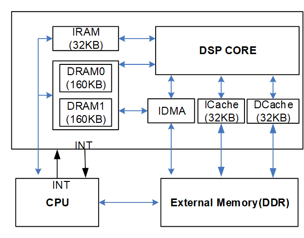

DSP的工作流程简要描述如下：首先由CPU加载DSP的程序到IRAM、DRAM和DDR里使其运行起来，然后CPU通过中断告诉DSP有任务要处理，最后DSP处理完后再用中断通知CPU任务完成的状态。

内置的IDMA负责将图像数据从DDR导入到DRAM，CORE从DRAM取数据去处理，处理结果写回DRAM，再用IDMA将数据导出到DDR。

## MAU

### 概述

MAU（Matrix Arithmetic Unit）是矩阵算术单元。用户基于MAU进行浮点矩阵运算，降低CPU占用。

### 特点

MAU主要功能如下：

- 支持矩阵运算 C = A \* B ;
- 支持对结果矩阵C的每一行求topN，topN最大为32；

MAU其他功能如下：

- 支持A和B的数据类型为FP16或者FP32；
- 支持最大分辨率

--FP16：A的行数100000，A的列数16384，B的列数100000；

--FP32：A的行数100000，A的列数8192，B的列数100000；

- 支持A和B矩阵为索引格式；
- 支持欧氏距离和余弦距离；

### 功能描述

MAU在系统中的位置如图10-18所示。

MAU在系统中的位置

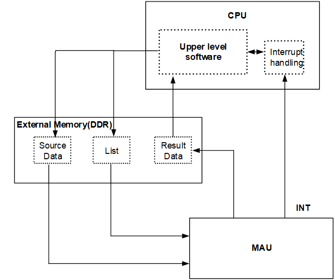

MAU的功能简要描述如下：

MAU根据链表中的节点信息进行核心运算C=A\*B；辅助运算对C求topN可选。

输出到DDR的结果可以是C，也可以是topN，或者两者。

