目 录

[11 视频接口 11-1](#_Toc118904174)

[11.1 VI 11-1](#_Toc118904175)

[11.1.1 概述 11-1](#_Toc118904176)

[11.1.2 特点 11-2](#_Toc118904177)

[11.1.3 模式功能描述 11-3](#_Toc118904178)

[11.1.4 工作方式 11-12](#_Toc118904179)

[11.1.5 VICAP寄存器概览 11-16](#_Toc118904180)

[11.1.6 VICAP寄存器描述 11-23](#_Toc118904181)

[11.2 VDP 11-74](#_Toc118904182)

[11.2.1 概述 11-74](#_Toc118904183)

[11.2.2 架构描述 11-74](#_Toc118904184)

[11.2.3 工作方式 11-76](#_Toc118904185)

[11.2.4 功能描述 11-77](#_Toc118904186)

[11.2.5 VDP寄存器概览 11-83](#_Toc118904187)

[11.2.6 VDP寄存器描述 11-85](#_Toc118904188)

[11.3 MIPI Rx 11-116](#_Toc118904189)

[11.3.1 概述 11-117](#_Toc118904190)

[11.3.2 特点 11-117](#_Toc118904191)

[11.3.3 功能描述 11-118](#_Toc118904192)

[11.3.4 MIPI Rx控制器工作方式 11-133](#_Toc118904193)

[11.3.5 MIPI Rx寄存器概览 11-135](#_Toc118904194)

[11.3.6 MIPI Rx寄存器描述 11-143](#_Toc118904195)

[11.4 MIPI Tx 11-220](#_Toc118904196)

[11.4.1 概述 11-220](#_Toc118904197)

[11.4.2 特点 11-220](#_Toc118904198)

[11.4.3 功能描述 11-221](#_Toc118904199)

[11.4.4 配置流程 11-230](#_Toc118904200)

[11.4.5 MIPI Tx寄存器概览 11-231](#_Toc118904201)

[11.4.6 MIPI Tx寄存器描述 11-234](#_Toc118904202)

[11.4.7 MIPI Tx PHY寄存器概览 11-271](#_Toc118904203)

[11.4.8 MIPI Tx PHY寄存器描述 11-273](#_Toc118904204)

[11.5 热成像接口 11-284](#_Toc118904205)

[11.5.1 概述 11-284](#_Toc118904206)

[11.5.2 特点 11-285](#_Toc118904207)

[11.5.3 功能描述 11-285](#_Toc118904208)

[11.5.4 工作方式 11-286](#_Toc118904209)

[11.5.5 热成像控制器寄存器概览 11-286](#_Toc118904210)

[11.5.6 热成像控制器寄存器描述 11-287](#_Toc118904211)

插图目录

[图11-1 VI功能框图 11-1](#_Toc118904212)

[图11-2 高清接口输入时序水平时序 11-4](#_Toc118904213)

[图11-3 高清接口输入时序垂直时序 11-5](#_Toc118904214)

[图11-4 720行视频系统垂直时序 11-6](#_Toc118904215)

[图11-5 ITU-R BT.601水平时序图 11-7](#_Toc118904216)

[图11-6 NTSC制式垂直同步时序图 11-7](#_Toc118904217)

[图11-7 PAL制式垂直同步时序图 11-8](#_Toc118904218)

[图11-8 数字*录像机*水平时序 11-9](#_Toc118904219)

[图11-9 数字*录像机*垂直时序脉冲方式 11-9](#_Toc118904220)

[图11-10 数字*录像机*垂直时序行有效方式 11-9](#_Toc118904221)

[图11-11 有效图像区域与水平垂直消隐关系图 11-10](#_Toc118904222)

[图11-12 YUV4:2:2的存储模式 11-11](#_Toc118904223)

[图11-13 RAW DATA的存储模式 11-12](#_Toc118904224)

[图11-14 little endian图像存储模式 11-12](#_Toc118904225)

[图11-15 VICAP的硬件工作流程 11-13](#_Toc118904226)

[图11-16 软件操作流程 11-14](#_Toc118904227)

[图11-17 VIPROC离线硬件工作流程 11-15](#_Toc118904228)

[图11-18 VIPROC离线模式软件工作流程 11-15](#_Toc118904229)

[图11-19 VDP总体框图 11-75](#_Toc118904230)

[图11-20 MIPI Rx功能框图及在系统中的位置 11-117](#_Toc118904231)

[图11-21 CSI-2数据包的传输机制 11-121](#_Toc118904232)

[图11-22 CSI-2长包的格式 11-121](#_Toc118904233)

[图11-23 CSI-2短包的格式 11-122](#_Toc118904234)

[图11-24 MIPI接口图像格式 11-122](#_Toc118904235)

[图11-25 MIPI接口宽动态数据传输（使用VC） 11-123](#_Toc118904236)

[图11-26 MIPI接口宽动态数据传输（使用DT） 11-124](#_Toc118904237)

[图11-27 MIPI DOL数据传输 11-124](#_Toc118904238)

[图11-28 LVDS同步码和图像传输模式 11-127](#_Toc118904239)

[图11-29 LVDS单个像素点时序 11-127](#_Toc118904240)

[图11-30 LVDS同步方式1 11-128](#_Toc118904241)

[图11-31 LVDS同步方式2 11-129](#_Toc118904242)

[图11-32 LVDS 宽动态模式1（2帧） 11-130](#_Toc118904243)

[图11-33 LVDS 宽动态模式2（2帧） 11-130](#_Toc118904244)

[图11-34 HiSPi Packetized-SP数据格式 11-131](#_Toc118904245)

[图11-35 HiSPi 宽动态模式 11-133](#_Toc118904246)

[图11-36 MIPI Tx功能框图及在系统中的位置 11-220](#_Toc118904247)

[图11-37 lane id配置方法举例，左图{lane0\_id,lane1\_id,lane2\_id,lane3\_id}={2,3,0,1},右图为{0,1,2,3} 11-222](#_Toc118904248)

[图11-38 RGB 16-bit格式 11-222](#_Toc118904249)

[图11-39 RGB 18-bit non-loosely格式 11-223](#_Toc118904250)

[图11-40 RGB 18-bit loosely格式 11-223](#_Toc118904251)

[图11-41 RGB 24-bit格式 11-224](#_Toc118904252)

[图11-42 YUV4:2:0 12-bit格式 11-224](#_Toc118904253)

[图11-43 YUV4:2:2 16-bit格式 11-224](#_Toc118904254)

[图11-44 YUV4:2:2 20-bit格式 11-225](#_Toc118904255)

[图11-45 Legacy YUV420 8-bit格式 11-225](#_Toc118904256)

[图11-46 YUV420 8-bit格式 11-226](#_Toc118904257)

[图11-47 YUV422 8-bit格式 11-226](#_Toc118904258)

[图11-48 CSI RAW8格式 11-227](#_Toc118904259)

[图11-49 CSI RAW10格式 11-227](#_Toc118904260)

[图11-50 CSI RAW12格式 11-227](#_Toc118904261)

[图11-51 CSI RAW14格式 11-227](#_Toc118904262)

[图11-52 CSI RAW16格式 11-227](#_Toc118904263)

[图11-53 CSI RGB888格式 11-228](#_Toc118904264)

[图11-54 Burst Mode 11-228](#_Toc118904265)

[图11-55 Non-Burst Mode with Sync Pulses 11-229](#_Toc118904266)

[图11-56 Non-Burst Mode with Sync Events 11-229](#_Toc118904267)

[图11-57 CSI-2帧时序 11-230](#_Toc118904268)

[图11-58 热成像接口功能框图及在系统中的位置 11-284](#_Toc118904269)

[图11-59 SmartData配置数据流 11-285](#_Toc118904270)

[图11-60 OOC校正数据流 11-285](#_Toc118904271)

[图11-61 热成像时序解析 11-286](#_Toc118904272)

表格目录

[表11-1 ITU-R BT.656 YUV4:2:2行数据格式 11-5](#_Toc118906253)

[表11-2 SAV/EAV格式 11-6](#_Toc118906254)

[表11-3 VICAP寄存器地址范围及分组 11-16](#_Toc118906255)

[表11-4 VICAP寄存器概览（基址：0x0\_1740\_0000） 11-16](#_Toc118906256)

[表11-5 VDP寄存器概览（基址：0x0\_17A0\_0000） 11-83](#_Toc118906257)

[表11-6 MIPI Rx 对接场景分类 11-118](#_Toc118906258)

[表11-7 MIPI Rx支持的接口类型 11-119](#_Toc118906259)

[表11-8 LVDS同步码格式 11-125](#_Toc118906260)

[表11-9 LVDS同步码第4个字段举例 11-126](#_Toc118906261)

[表11-10 HiSPi传输模式 11-132](#_Toc118906262)

[表11-11 MIPI Rx寄存器偏移地址变量表 11-135](#_Toc118906263)

[表11-12 MIPI Rx寄存器概览（基址：0x0\_173C\_0000） 11-136](#_Toc118906264)

[表11-13 MIPI Tx寄存器概览（基址：0x0\_17A8\_0000） 11-232](#_Toc118906265)

[表11-14 MIPI Tx PHY寄存器概览 11-271](#_Toc118906266)

[表11-15 热成像控制器寄存器概览（基址：0x0\_173D\_0000） 11-287](#_Toc118906267)

# 视频接口

## VI

### 概述

视频输入单元VI（Video Input），可以通过MIPI Rx（包含MIPI、LVDS、HiSPi）接口、BT.656/601、BT.1120接口和DC（Digital Camera）接收视频数据，存入指定的内存区域。VI内嵌ISP图像处理单元，可以直接对接外部原始数据（BAYER RGB数据），VI的功能框图如图11-1所示。

VI分成两个物理子模块：捕获子模块VICAP和处理子模块VIPROC组成。其中：

- VICAP完成多路视频输入的数据捕获功能，并将捕获的数据存放到DDR或者在线送给VIPROC。VIPROC用以支持离线模式（从DDR读取数据）或者在线模式（从VICAP接收在线）视频数据处理。
- VIPROC支持将处理数据写到DDR或者直接在线送给VPSS。

VI功能框图

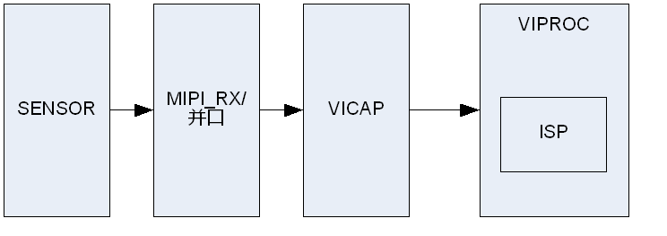

### 特点

VICAP子模块有以下特点：

<strong><big>说明</big></strong>

VICAP工作时钟请参见3.2.6 CRG寄存器章节。

- 输入最大宽度为8192，最大分辨率为8192 x 8192。
- 最大支持4路sensor数据输入。
- 接口0最大支持[4096 x2160@30fps](mailto:1920*1080@30fps)的3F-WDR RAW输入
- 接口1/2/3最大支持[4096 x 2160@60fps](mailto:1920*1080@30fps)的MIPI RAW时序输入
- 输入支持最大数据位宽为14bit。
- 支持逐行输入模式。
- 支持BT.656、BT.601、BT.1120和DC接口。

最高支持148.5MHz，只支持单沿采样

- 支持MIPI、LVDS、HiSPi接口。
- 支持MIPI接口输入YUV格式
- YUV422 semi-planner、YUV420 semi-planner、legacy YUV420格式
- 支持embed data采集
- 支持flash trigger
- 支持shutter trigger
- 支持sensor主模式和从模式
- 支持主流热成像sensor时序
- 支持RAW数据压缩
- 支持在线输出图像数据到VIPROC。
- 支持离线输出图像数据到DDR。
- 支持4个写出通道
- CH0(channel0)~CH3支持RAW格式写出
- CH0~CH3支持YUV格式写出
- CH0最大宽高为8192x8192
- CH1~CH3最大宽高为4096x4096
- 离线输出数据格式支持：
- Semi-planar YUV4:2:2模式
- Semi-planar YUV4:2:0模式
- Semi-planar YUV4:0:0模式
- RAW模式
- 支持安全特性（可开关）
- 寄存器仅支持安全CPU访问
- 支持各读写通道的安全属性独立可配

VIPROC子模块有以下特点：

- 支持在线模式（数据来自VICAP在线传输）。
- 支持离线模式处理（数据来自DDR）。
- 最大处理性能为[4096 x 2160@60fps](mailto:1920*1080@30fps)（WDR合成后）
- 内嵌ISP处理功能。
- 支持一个通道的视频输出。
- 支持数据压缩
- 支持输出图像数据到DDR。
- 输出数据格式支持：
- Semi-planar YUV4:2:2模式
- Semi-planar YUV4:2:0模式
- Semi-planar YUV4:0:0模式
- RAW模式
- 支持安全特性（可开关）
- 寄存器仅支持安全CPU访问
- 支持各读写通道的安全属性独立可配

### 模式功能描述

#### 典型应用

VI是一个支持多种时序输入的视频输入采集处理单元，系统可以配置不同的功能模式，使之可以灵活地适应不同的输入视频接口。

VI模块最多可以支持4路视频输入信号。

VI的典型输入有以下3种：

- 1路[4096 x 2160@30fps](mailto:2304*1296@20fps) 3F-WDR输入
- 2路3840 x 2160@30fps 2F-WDR输入
- 4路4M（2688x1520）@30fps RAW输入

#### 功能原理

#### BT.1120接口时序

VICAP支持Y/C分开输入的BT.1120接口时序，同步码和BT.656时序一致。此时需要用到16bit数据线，8bit用来传输亮度，另外8bit用来传输色度，如图11-2和图11-3所示。

高清接口输入时序水平时序

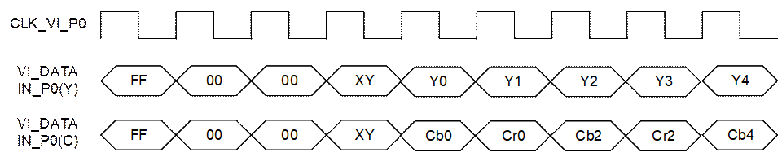

高清接口输入时序垂直时序

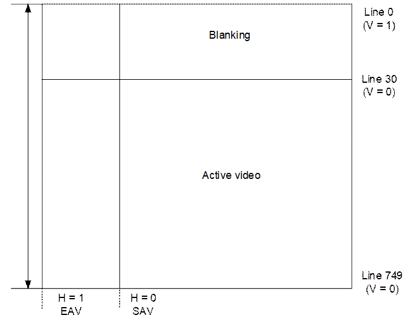

#### BT.656接口时序

VICAP支持以BT.656时序格式输入的逐行YUV422数据。

- 水平时序

在ITU-R BT.656协议中，同步信号集成在数据流中，在数据流中的特殊字节SAV和EAV分别表示有效行数据的开始和结束。在视频数据流中，由FF 00 00（FF、00为图像编码数据的保留值，为非图像数据）构成的定时基准码字的码头来标志紧接着的一个字节为SAV或者EAV，ITU-R BT. 656的行数据流格式如表11-1所示。

ITU-R BT.656 YUV4:2:2行数据格式

|  |  |  |  |  |  |  |  |  |  |  |  |  |  |  |  |  |  |  |  |
| --- | --- | --- | --- | --- | --- | --- | --- | --- | --- | --- | --- | --- | --- | --- | --- | --- | --- | --- | --- |
| 定时基准码 | | | | 行消隐区 | | | | | 定时基准码 | | | | 720有效像素YUV4:2:2 | | | | | | |
| FF | 00 | 00 | EAV | 80 | 10 | … | 80 | 10 | FF | 00 | 00 | SAV | U0 | Y0 | V0 | Y1 | … | V718 | Y719 |

SAV和EAV的相互区别由SAV/EAV的特殊比特位“H”区分，SAV/EAV还包含了垂直消隐位“V”和场指示位“F”。SAV/EAV的具体描述见表11-2所示。

SAV/EAV格式

|  |  |  |  |  |
| --- | --- | --- | --- | --- |
| bit[7] | bit[6](F) | bit[5](V) | bit[4](H) | bit[3:0](P3～P0) |
| 固定值1 | 场指示位  1st field：F=0  2nd field：F=1 | 垂直消隐位  VBI：V=1  Active video：V=0 | SAV：H=0  EAV：H=1 | 校验位 |

- 垂直时序

垂直时序也是通过定时基准码SAV/EAV的 “V”来实现，典型的720行的行视频系统垂直时序如图11-4所示。

720行视频系统垂直时序

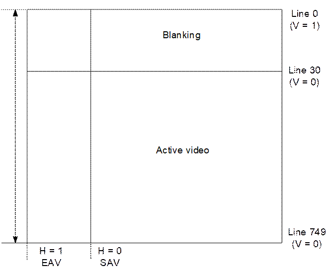

注：VICAP内部只根据SAV/EAV来识别垂直时序，不会限制具体在哪一行。

#### BT.601接口时序

VICAP支持以BT.601时序输入的YUV422逐行数据。

- 水平时序

水平脉冲表示新的一行开始如图11-5所示。经过hoff（可配，NTSC525行系统该值为244，PAL625行系统该值为264个时钟）后，行前消隐区结束，进入行有效数据区，经过act\_width（可配，典型值为720或704）个时钟后行有效区域结束，进入行后消隐区。水平同步极性可配。

ITU-R BT.601水平时序图

- 垂直时序

ITU-R BT.601建议：信号VSYNC作为垂直同步信号。VSYNC的脉冲标志帧的开始，VICAP支持以下2种垂直同步方法。

VICAP在NTSC制式（525行）和PAL制式（625行）的垂直时序关系图如图11-6和图11-7所示，其中VI\_HSYNC\_VD为水平同步脉冲，VI\_VSYNC\_FIELD在VSYNC=1时为垂直同步脉冲；在VSYNC=0时为场同步信号。

NTSC制式垂直同步时序图

<strong><big>须知</big></strong>

在NTSC隔行扫描制式下，第1场的垂直同步信号在第4行的起始位置变为低电平，持续3行低电平后，在第7行的起始位置变为高电平。VICAP接收从第22行开始到第261行结束的240行数据。第2场的垂直同步信号在第266行的中间位置变为低电平，持续3行低电平后，在第269行中间位置变为高电平。VICAP接收从第285行开始第524行结束的240行数据。

PAL制式垂直同步时序图

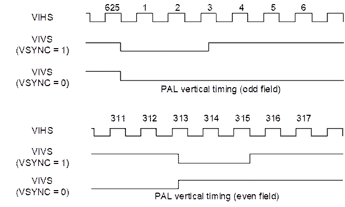

在PAL隔行扫描制式下，第1场的垂直同步信号在第1行起始位置变为低电平，持续2.5行低电平后，在第3行的中间位置变为高电平。VICAP接收从第24行开始到第310行结束的288行数据。第2场的垂直同步信号在第313行的中间位置变为低电平，持续2.5行低电平后，在第316行的起始位置变为高电平。VICAP接收从第336行开始到第623行结束的288行数据。

上面两种为典型的BT.601垂直时序，VICAP内部支持场开始到场有效行开始之间的行数可配，场有效行的行数可配，垂直同步的极性可配。

1. 数字*录像机*（DC）接口时序
- 水平时序

VICAP接数字*录像机*时，VI\_HSYNC\_VD表示数据有效信号，数据有效信号极性可配，水平时序如图11-8所示。

数字*录像机*水平时序

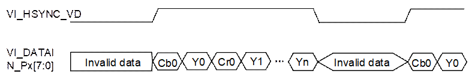

- 垂直时序

VICAP支持两种垂直时序脉冲方式和行有效方式，如图11-9和图11-10所示。垂直同步极性可配。

数字*录像机*垂直时序脉冲方式

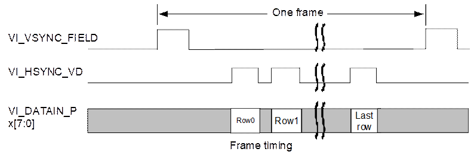

数字*录像机*垂直时序行有效方式

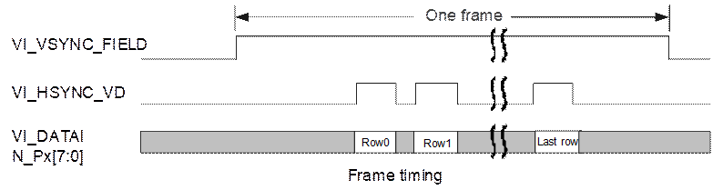

对于VICAP内部处理来说，这两种时序相同，VICAP内部检测到一个上升沿或下降沿，这认为是一帧的开始，然后检测数据有效信号，来判断当前数据是否有效。

#### 图像CROP

有效视频范围如图11-11所示。开始于水平消隐和垂直消隐之后。而实际显示的视图区域常常包含在有效视频范围之内。

有效图像区域与水平垂直消隐关系图

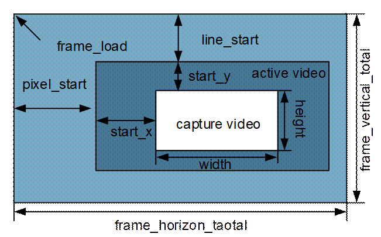

#### 图像存储模式

图像存储模式包括：

#### YUV数据存储

- semi-planar YUV存储。

系统设定了视图区域后，对读入数据按照semi-planar方式存储，即亮度分量和色度分量分别存储在DDR中的亮度存储空间和色度存储空间。

- 在1行内，亮度、色度分量各自连续存储。
- 连续2行之间的存储，可以通过系统定义的行首与行首之间的存储间隔参数stride定义。
- 亮度和色度分量在DDR中的存储位置由起始地址base\_addr来指示。VI捕获的YUV4:2:2数据的存储结构如图11-12所示。

YUV4:2:2的存储模式

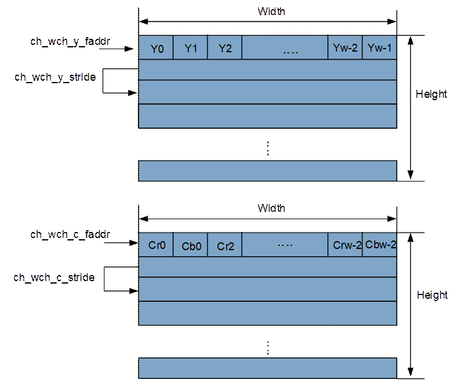

#### RAW数据存储

- 按单分量方式存储。
- 1行内，RAW数据连续存储。
- 连续2行之间的存储，可以通过系统定义的行首与行首之间的存储间隔参数stride定义。
- DDR中的存储位置由起始地址base\_addr来指示。

VI捕获的RAW数据的存储结构如图11-13所示。

RAW DATA的存储模式

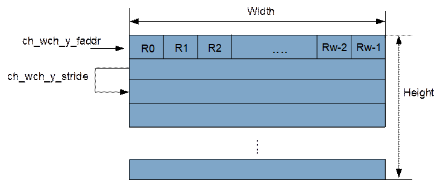

在DDR中，数据的存储是以word（32bit）为单位。由4个8bit像素组成一个32bit的word。如图11-14。

little endian图像存储模式

VICAP支持little endian方式存储数据到DDR，存储地址为16byte对齐。

### 工作方式

#### VICAP的reg\_newer功能

- 在软件使能VICAP通道之前，软件应该完成以下操作：
- 完成对VICAP的属性寄存器的配置操作。
- 写reg\_newer位为“1”，通知VICAP模块当前的寄存器已经准备就绪。
- 使能VICAP后，VICAP逻辑开始工作，当一帧到来的时候，则有：
- 如果reg\_newer为，则VICAP将不会接收数据，置硬件状态为SNOOZE（以下各硬件状态为图11-15所用），等待下一帧的数据的到来。
- 如果reg\_newer为1，则开始接收数据，同时给出寄存器更新中断(reg\_update\_int)，并设置硬件状态为busy。
- 当接收完毕当前数据后，清除硬件busy状态。等到下一帧到来的时候，则：
- 如果reg\_newer为0，则放弃下一帧数据的接收。
- 如果reg\_newer为1，则可以紧接着前一次数据继续接收下一帧的数据。

#### 在线模式硬件工作流程

VICAP的硬件工作流程如图11-15所示。

VICAP的硬件工作流程

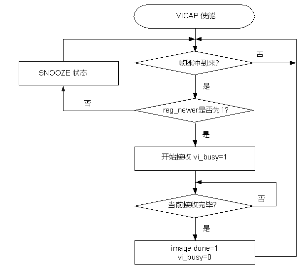

在VICAP工作时，每接收完一帧数据，在下一帧的到来时，VICAP将检测reg\_newer位。如果reg\_newer位为1（表示软件已经更新或者确认VICAP的寄存器），VICAP将自动load软件所配置的寄存器值到工作寄存器（工作寄存器软件不可访问），然后将reg\_newer位清0，并开始接收下一帧数据。否则，只有等到reg\_newer为1且新的一帧到来时开始接收数据。

#### 在线模式软件配置流程

在中断方式下，软件的操作流程如图11-16所示。

软件操作流程

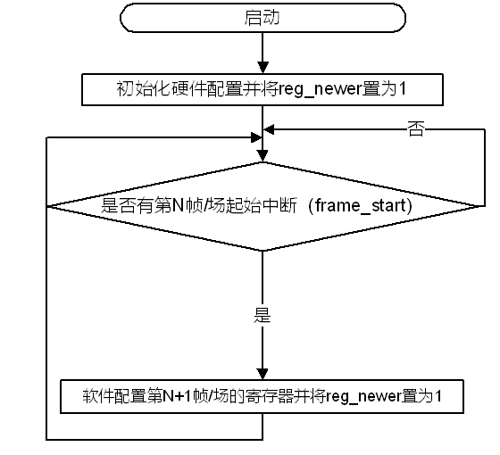

#### VIPROC离线模式硬件工作流程

VIPROC子模块支持离线模式，以时分复用的方式处理多路数据。如图11-17所示。

VIPROC离线硬件工作流程

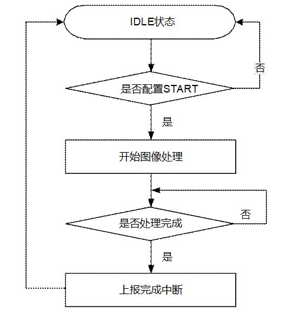

#### VIPROC离线模式软件配置流程

软件配置流程和如下图11-18所示。

VIPROC离线模式软件工作流程

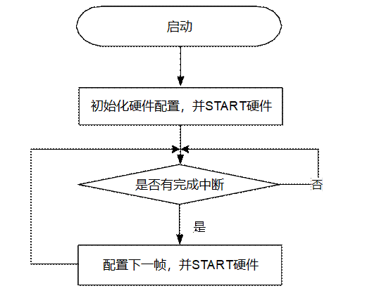

### VICAP寄存器概览

VICAP寄存器地址范围及分组如表11-3所示。

VICAP寄存器地址范围及分组

| 地址范围 | 寄存器分组 |
| --- | --- |
| 0x0000-0x00FC | VICAP全局寄存器 |
| 0x0000-0x01FC | VICAP SENSOR从模式配置寄存器 |
| 0x0200-0x02FC | 保留 |
| 0x1000-0x10FC | PROT0寄存器 |
| 0x1100-0x11FC | 保留 |
| 0x1200-0x11FC | 保留 |
| 0x1300-0x13FC | 保留 |
| 0x2000-0x21FC | 保留 |
| 0x4000-0x4FFC | 保留 |
| 0x10000-0x10FFC | CH0(channel0)寄存器 |
| 0x11000-0x11FFC | 保留 |
| 0x12000-0x12FFC | 保留 |
| 0x13000-0x13FFC | 保留 |

VICAP寄存器概览如表11-4所示。

VICAP寄存器概览（基址：0x0\_1740\_0000）

| 偏移地址 | 名称 | 描述 | 页码 |
| --- | --- | --- | --- |
| 0x0000 | WK\_MODE | 全局工作配置寄存器 | 11-23 |
| 0x0010 | AXI\_CFG | 总线配置寄存器 | 11-23 |
| 0x0050 | CMUX\_SEL | CMUX通路选择寄存器 | 11-24 |
| 0x0054 | CMUX\_ID\_CFG | CMUX帧ID选择寄存器 | 11-25 |
| 0x00F0 | VICAP\_INT | 中断指示寄存器 | 11-26 |
| 0x00F8 | VICAP\_INT\_MASK | 中断MASK配置寄存器 | 11-28 |
| 0x0100 | SLAVE0\_MODE\_CFG | SENSOR0从模式配置寄存器 | 11-30 |
| 0x0104 | SLAVE0\_MODE\_VS\_TIME\_H | SENSOR0从模式输出VSYNC的周期配置寄存器 | 11-32 |
| 0x0108 | SLAVE0\_MODE\_VS\_TIME\_L | SENSOR0从模式输出VSYNC的周期配置寄存器 | 11-32 |
| 0x010C | SLAVE0\_MODE\_HS\_TIME | SENSOR0从模式输出HSYNC的周期配置寄存器 | 11-32 |
| 0x0118 | SLAVE0\_MODE\_VS\_CYC\_H | SENSOR0从模式输出VSYNC脉冲有效信号持续时间配置寄存器 | 11-32 |
| 0x011C | SLAVE0\_MODE\_VS\_CYC\_L | SENSOR0从模式输出VSYNC脉冲有效信号持续时间配置寄存器 | 11-33 |
| 0x0120 | SLAVE0\_MODE\_HS\_CYC | SENSOR0从模式输出HSYNC脉冲有效信号持续时间配置寄存器 | 11-33 |
| 0x012C | SLAVE0\_MODE\_HS\_DLY\_CYC | SENSOR0从模式输出HSYNC脉冲输出相对VSYNC脉冲的延迟周期配置 | 11-33 |
| 0x0140 | SLAVE1\_MODE\_CFG | SENSOR1从模式配置寄存器 | 11-34 |
| 0x0144 | SLAVE1\_MODE\_VS\_TIME\_H | SENSOR1从模式输出VSYNC的周期配置寄存器 | 11-35 |
| 0x0148 | SLAVE1\_MODE\_VS\_TIME\_L | SENSOR1从模式输出VSYNC的周期配置寄存器 | 11-35 |
| 0x014C | SLAVE1\_MODE\_HS\_TIME | SENSOR1从模式输出HSYNC的周期配置寄存器 | 11-35 |
| 0x0158 | SLAVE1\_MODE\_VS\_CYC\_H | SENSOR1从模式输出VSYNC脉冲有效信号持续时间配置寄存器 | 11-35 |
| 0x015C | SLAVE1\_MODE\_VS\_CYC\_L | SENSOR1从模式输出VSYNC脉冲有效信号持续时间配置寄存器 | 11-36 |
| 0x0160 | SLAVE1\_MODE\_HS\_CYC | SENSOR1从模式输出HSYNC脉冲有效信号持续时间配置寄存器 | 11-36 |
| 0x016C | SLAVE1\_MODE\_HS\_DLY\_CYC | SENSOR1从模式输出HSYNC脉冲输出相对VSYNC脉冲的延迟周期配置 | 11-36 |
| 0x0180 | SLAVE2\_MODE\_CFG | SENSOR2从模式配置寄存器 | 11-37 |
| 0x0184 | SLAVE2\_MODE\_VS\_TIME\_H | SENSOR2从模式输出VSYNC的周期配置寄存器 | 11-38 |
| 0x0188 | SLAVE2\_MODE\_VS\_TIME\_L | SENSOR2从模式输出VSYNC的周期配置寄存器 | 11-38 |
| 0x018C | SLAVE2\_MODE\_HS\_TIME | SENSOR2从模式输出HSYNC的周期配置寄存器 | 11-38 |
| 0x0198 | SLAVE2\_MODE\_VS\_CYC\_H | SENSOR2从模式输出VSYNC脉冲有效信号持续时间配置寄存器 | 11-39 |
| 0x019C | SLAVE2\_MODE\_VS\_CYC\_L | SENSOR2从模式输出VSYNC脉冲有效信号持续时间配置寄存器 | 11-39 |
| 0x01A0 | SLAVE2\_MODE\_HS\_CYC | SENSOR2从模式输出HSYNC脉冲有效信号持续时间配置寄存器 | 11-39 |
| 0x01AC | SLAVE2\_MODE\_HS\_DLY\_CYC | SENSOR2从模式输出HSYNC脉冲输出相对VSYNC脉冲的延迟周期配置 | 11-39 |
| 0x01C0 | SLAVE3\_MODE\_CFG | SENSOR3从模式配置寄存器 | 11-40 |
| 0x01C4 | SLAVE3\_MODE\_VS\_TIME\_H | SENSOR3从模式输出VSYNC的周期配置寄存器 | 11-41 |
| 0x01C8 | SLAVE3\_MODE\_VS\_TIME\_L | SENSOR3从模式输出VSYNC的周期配置寄存器 | 11-41 |
| 0x01CC | SLAVE3\_MODE\_HS\_TIME | SENSOR3从模式输出HSYNC的周期配置寄存器 | 11-41 |
| 0x01D8 | SLAVE3\_MODE\_VS\_CYC\_H | SENSOR3从模式输出VSYNC脉冲有效信号持续时间配置寄存器 | 11-42 |
| 0x01DC | SLAVE3\_MODE\_VS\_CYC\_L | SENSOR3从模式输出VSYNC脉冲有效信号持续时间配置寄存器 | 11-42 |
| 0x01E0 | SLAVE3\_MODE\_HS\_CYC | SENSOR3从模式输出HSYNC脉冲有效信号持续时间配置寄存器 | 11-42 |
| 0x01EC | SLAVE3\_MODE\_HS\_DLY\_CYC | SENSOR3从模式输出HSYNC脉冲输出相对VSYNC脉冲的延迟周期配置 | 11-43 |
| 0x01F8 | SLAVE\_MODE\_TIME\_CFG\_SEL | SENSOR 从模式TIME 配置选择寄存器 | 11-43 |
| 0x01FC | SLAVE\_MODE\_SYN | SENSOR 同步信号，上升沿有效 | 11-44 |
| 0x1000 | PT\_INTF\_MOD | 接口模式寄存器 | 11-44 |
| 0x1010 | PT\_OFFSET0 | 0分量offset寄存器 | 11-45 |
| 0x1014 | PT\_OFFSET1 | 1分量offset寄存器 | 11-46 |
| 0x1018 | PT\_OFFSET2 | 2分量offset寄存器 | 11-46 |
| 0x1020 | PT\_BT656\_CFG | BT.656配置寄存器 | 11-46 |
| 0x102C | PT\_MIPI\_YUV\_CFG | MIPI YUV输入配置转换开关寄存器 | 11-47 |
| 0x1034 | PT\_MIPI\_YUV\_SIZE | MIPI YUV输入图像宽高寄存器 | 11-48 |
| 0x1038 | PT\_UNIFY\_TIMING\_CFG | 时序配置寄存器 | 11-48 |
| 0x103C | PT\_GEN\_TIMING\_CFG | 时序恢复模块配置寄存器 | 11-50 |
| 0x1040 | PT\_UNIFY\_DATA\_CFG | 数据配置寄存器 | 11-51 |
| 0x1050 | PT\_YUV444\_CFG | YUV444配置寄存器 | 11-52 |
| 0x1060 | PT\_FSTART\_DLY | 端口fstart中断延时寄存器 | 11-52 |
| 0x1064 | PT\_FSTART\_H\_DLY | 端口fstart中断行延时寄存器 | 11-52 |
| 0x1080 | PT\_INTF\_HFB | 水平前消隐区宽度寄存器 | 11-53 |
| 0x1084 | PT\_INTF\_HACT | 水平有效区宽度寄存器 | 11-53 |
| 0x1088 | PT\_INTF\_HBB | 水平后消隐区宽度寄存器 | 11-53 |
| 0x108C | PT\_INTF\_VFB | 垂直前消隐区宽度寄存器 | 11-54 |
| 0x1090 | PT\_INTF\_VACT | 垂直有效区宽度寄存器 | 11-54 |
| 0x1094 | PT\_INTF\_VBB | 垂直后消隐区宽度寄存器 | 11-54 |
| 0x1098 | PT\_INTF\_VBFB | 垂直底场前消隐区宽度寄存器 | 11-55 |
| 0x109C | PT\_INTF\_VBACT | 垂直底场有效区宽度寄存器 | 11-55 |
| 0x10A0 | PT\_INTF\_VBBB | 垂直底场后消隐区宽度寄存器 | 11-55 |
| 0x10C0 | PT\_FLASH\_CFG | 闪光灯配置寄存器 | 11-55 |
| 0x10C4 | PT\_FLASH\_CYC0 | 闪光灯时序0宽度寄存器 | 11-56 |
| 0x10C8 | PT\_FLASH\_CYC1 | 闪光灯时序1宽度寄存器 | 11-57 |
| 0x10D0 | PT\_SHUTTER\_CYC0 | 快门时序0宽度寄存器 | 11-57 |
| 0x10D4 | PT\_SHUTTER\_CYC1 | 快门时序1宽度寄存器 | 11-57 |
| 0x10D8 | PT\_SHUTTER\_CYC2 | 快门时序2宽度寄存器 | 11-57 |
| 0x10DC | PT\_SHUTTER\_CYC3 | 快门时序3宽度寄存器 | 11-58 |
| 0x10E0 | PT\_STATUS | 端口状态寄存器 | 11-58 |
| 0x10E4 | PT\_BT656\_STATUS | BT.656状态寄存器 | 11-58 |
| 0x10EC | PT\_SIZE | 输入图像有效区大小指示寄存器 | 11-59 |
| 0x10F0 | PT\_INT | 端口中断指示寄存器 | 11-59 |
| 0x10F4 | PT\_INT\_STATE | 端口中断状态寄存器 | 11-60 |
| 0x10F8 | PT\_INT\_MASK | 端口中断屏蔽寄存器 | 11-60 |
| 0x10000 | CH\_CTRL | 通道控制寄存器 | 11-61 |
| 0x10004 | CH\_REG\_NEWER | 采集控制寄存器 | 11-62 |
| 0x100F0 | CH\_INT | 通道原始中断寄存器 | 11-62 |
| 0x100F4 | CH\_INT\_STATE | 通道原始中断状态寄存器 | 11-64 |
| 0x100F8 | CH\_INT\_MASK | 通道中断屏蔽寄存器 | 11-65 |
| 0x10204 | CH\_WCH\_STT\_AE\_HIST\_ADDR\_H | ISP AE\_HIST统计信息存储基地址高32bit寄存器 | 11-67 |
| 0x10208 | CH\_WCH\_STT\_AE\_HIST\_ADDR\_L | ISP AE\_HIST统计信息存储基地址低32bit寄存器 | 11-67 |
| 0x1020C | CH\_WCH\_STT\_AE\_AVER\_R\_GR\_ADDR\_H | ISP AE\_AVER\_R\_GR统计信息存储基地址高32bit寄存器 | 11-67 |
| 0x10210 | CH\_WCH\_STT\_AE\_AVER\_R\_GR\_ADDR\_L | ISP AE\_AVER\_R\_GR统计信息存储基地址低32bit寄存器 | 11-68 |
| 0x10214 | CH\_WCH\_STT\_AE\_AVER\_GB\_B\_ADDR\_H | ISP AE\_AVER\_GB\_B统计信息存储基地址高32bit寄存器 | 11-68 |
| 0x10218 | CH\_WCH\_STT\_AE\_AVER\_GB\_B\_ADDR\_L | ISP AE\_AVER\_GB\_B统计信息存储基地址低32bit寄存器 | 11-68 |
| 0x1021C | CH\_WCH\_STT\_AF\_STAT\_H1\_ADDR\_H | ISP AF\_STAT\_H1统计信息存储基地址高32bit寄存器 | 11-69 |
| 0x10220 | CH\_WCH\_STT\_AF\_STAT\_H1\_ADDR\_L | ISP AF\_STAT\_H1统计信息存储基地址低32bit寄存器 | 11-69 |
| 0x10224 | CH\_WCH\_STT\_AF\_STAT\_H2\_ADDR\_H | ISP AF\_STAT\_H2统计信息存储基地址高32bit寄存器 | 11-69 |
| 0x10228 | CH\_WCH\_STT\_AF\_STAT\_H2\_ADDR\_L | ISP AF\_STAT\_H2统计信息存储基地址低32bit寄存器 | 11-69 |
| 0x1022C | CH\_WCH\_STT\_AF\_STAT\_V1\_ADDR\_H | ISP AF\_STAT\_V1统计信息存储基地址高32bit寄存器 | 11-70 |
| 0x10230 | CH\_WCH\_STT\_AF\_STAT\_V1\_ADDR\_L | ISP AF\_STAT\_V1统计信息存储基地低32bit寄存器 | 11-70 |
| 0x10234 | CH\_WCH\_STT\_AF\_STAT\_V2\_ADDR\_H | ISP AF\_STAT\_V2统计信息存储基地址高32bit寄存器 | 11-70 |
| 0x10238 | CH\_WCH\_STT\_AF\_STAT\_V2\_ADDR\_L | ISP AF\_STAT\_V2统计信息存储基地址低32bit寄存器 | 11-71 |
| 0x1023C | CH\_WCH\_STT\_AF\_STAT\_Y\_ADDR\_H | ISP AF\_STAT\_Y统计信息存储基地址高32bit寄存器 | 11-71 |
| 0x10240 | CH\_WCH\_STT\_AF\_STAT\_Y\_ADDR\_L | ISP AF\_STAT\_Y统计信息存储基地址低32bit寄存器 | 11-71 |
| 0x10244 | CH\_WCH\_STT\_AE\_IR\_HIST\_ADDR\_H | ISP AE\_IR\_HIST统计信息存储基地址高32bit寄存器 | 11-71 |
| 0x10248 | CH\_WCH\_STT\_AE\_IR\_HIST\_ADDR\_L | ISP AE\_IR\_HIST统计信息存储基地址低32bit寄存器 | 11-72 |
| 0x1024C | CH\_WCH\_STT\_AE\_IR\_AVER\_ADDR\_H | ISP AE\_IR\_AVER统计信息存储基地址高32bit寄存器 | 11-72 |
| 0x10250 | CH\_WCH\_STT\_AE\_IR\_AVER\_ADDR\_L | ISP AE\_IR\_AVER统计信息存储基地址低32bit寄存器 | 11-72 |
| 0x10280 | CH\_WCH\_EM\_CFG | Embedded Data写出配置寄存器 | 11-73 |
| 0x10284 | CH\_WCH\_EM\_SIZE | Embedded Data信息写出大小寄存器 | 11-73 |
| 0x10288 | CH\_WCH\_EM\_FADDR\_H | WCH模块Y分量存储基地址高32bit寄存器 | 11-74 |
| 0x1028C | CH\_WCH\_EM\_FADDR\_L | Embedded Data存储基地址低32bit寄存器 | 11-74 |

### VICAP寄存器描述

寄存器描述中的缩写与全称分别如下：

CH：Channel；SRC：Source；VS：Vsync；HS：Hsync；TUNL：Tunnel；STT：Statistics；EM：Embeded

#### WK\_MODE

WK\_MODE为全局工作配置寄存器。

Offset Address: 0x0000 Total Reset Value: 0x0000\_0003

| Bits | Access | Name | Description | Reset |
| --- | --- | --- | --- | --- |
| [31:2] | - | reserved | 保留。 | 0x00000000 |
| [1] | RW | axi\_clk\_en | AXI总线模块时钟开关控制(全在线模式可关闭总线模块时钟)  0：关闭；  1：打开。 | 0x1 |
| [0] | - | reserved | 保留。 | 0x1 |

#### AXI\_CFG

AXI\_CFG为总线配置寄存器。

Offset Address: 0x0010 Total Reset Value: 0x0000\_0770

|  |  |  |  |  |
| --- | --- | --- | --- | --- |
| Bits | Access | Name | Description | Reset |
| [31:12] | - | reserved | 保留。 | 0x000000 |
| [11:8] | RW | r\_outstanding | 读请求outstanding个数。  outstanding的取值范围为[0,15]。 | 0x7 |
| [7:4] | RW | w\_outstanding | 写请求outstanding个数。  outstanding的取值范围为[0, 7]。 | 0x7 |
| [3:0] | - | reserved | 保留。 | 0x0 |

#### CMUX\_SEL

CMUX\_SEL为CMUX通路选择寄存器。

Offset Address: 0x0050 Total Reset Value: 0x0000\_3210

| Bits | Access | Name | Description | Reset |
| --- | --- | --- | --- | --- |
| [31:16] | - | reserved | 保留。 | 0x0000 |
| [15:12] | RW | chn3\_sel | CH3选择配置寄存器。  0x0：端口0输入数据；  0x1：端口1输入数据；  0x2：端口2输入数据；  0x3：端口3输入数据；  0x8：BAS输入数据；  其余保留。 | 0x3 |
| [11:8] | RW | chn2\_sel | CH2选择配置寄存器。  0x0：端口0输入数据；  0x1：端口1输入数据；  0x2：端口2输入数据；  0x3：端口3输入数据；  0x8：BAS输入数据；  其余保留。 | 0x2 |
| [7:4] | RW | chn1\_sel | CH1选择配置寄存器。  0x0：端口0输入数据；  0x1：端口1输入数据；  0x2：端口2输入数据；  0x3：端口3输入数据；  0x8：BAS输入数据；  其余保留。 | 0x1 |
| [3:0] | RW | chn0\_sel | CH0选择配置寄存器。  0x0：端口0输入数据；  0x1：端口1输入数据；  0x2：端口2输入数据；  0x3：端口3输入数据；  0x8：BAS输入数据；  其余保留。 | 0x0 |

#### CMUX\_ID\_CFG

CMUX\_ID\_CFG为CMUX帧ID选择寄存器。

Offset Address: 0x0054 Total Reset Value: 0x0000\_FFFF

| Bits | Access | Name | Description | Reset |
| --- | --- | --- | --- | --- |
| [31:16] | - | reserved | 保留。 | 0x0000 |
| [15:12] | RW | chn3\_id | CH3 ID选择寄存器。  0：过滤该ID的数据；  1：接收该ID的数据。  bit[0]：通道接收ID为0的数据使能；  bit[1]：通道接收ID为1的数据使能；  bit[2]：通道接收ID为2的数据使能；  bit[3]：通道接收ID为3的数据使能。 | 0xF |
| [11:8] | RW | chn2\_id | CH2 ID选择寄存器。  0：过滤该ID的数据；  1：接收该ID的数据。  bit[0]：通道接收ID为0的数据使能；  bit[1]：通道接收ID为1的数据使能；  bit[2]：通道接收ID为2的数据使能；  bit[3]：通道接收ID为3的数据使能。 | 0xF |
| [7:4] | RW | chn1\_id | CH1 ID选择寄存器。  0：过滤该ID的数据；  1：接收该ID的数据。  bit[0]：通道接收ID为0的数据使能；  bit[1]：通道接收ID为1的数据使能；  bit[2]：通道接收ID为2的数据使能；  bit[3]：通道接收ID为3的数据使能。 | 0xF |
| [3:0] | RW | chn0\_id | CH0 ID选择寄存器。  0：过滤该ID的数据；  1：接收该ID的数据。  bit[0]：通道接收ID为0的数据使能；  bit[1]：通道接收ID为1的数据使能；  bit[2]：通道接收ID为2的数据使能；  bit[3]：通道接收ID为3的数据使能。 | 0xF |

#### VICAP\_INT

VICAP\_INT为中断指示寄存器。

Offset Address: 0x00F0 Total Reset Value: 0x0000\_0000

| Bits | Access | Name | Description | Reset |
| --- | --- | --- | --- | --- |
| [31:29] | - | reserved | 保留。 | 0x0 |
| [28] | RO | int\_bas0 | BAS0中断指示。  0：无中断；  1：有中断。 | 0x0 |
| [27] | - | reserved | 保留。 | 0x0 |
| [26] | RO | int\_dbg | 系统总线异常中断指示。  0：无中断；  1：有中断。 | 0x0 |
| [25] | RO | int\_wdr0 | 在线WDR0中断指示。  0：无中断；  1：有中断。 | 0x0 |
| [24] | RO | int\_src0 | SRC(Source)0中断指示。  0：无中断；  1：有中断。 | 0x0 |
| [23:20] | - | reserved | 保留。 | 0x0 |
| [19] | RO | int\_isp3 | ISP3中断指示。  0：无中断；  1：有中断。 | 0x0 |
| [18] | RO | int\_isp2 | ISP2中断指示。  0：无中断；  1：有中断。 | 0x0 |
| [17] | RO | int\_isp1 | ISP1中断指示。  0：无中断；  1：有中断。 | 0x0 |
| [16] | RO | int\_isp0 | ISP0中断指示。  0：无中断；  1：有中断。 | 0x0 |
| [15:12] | - | reserved | 保留。 | 0x0 |
| [11] | RO | int\_ch3 | 通道3中断指示。  0：无中断；  1：有中断。 | 0x0 |
| [10] | RO | int\_ch2 | 通道2中断指示。  0：无中断；  1：有中断。 | 0x0 |
| [9] | RO | int\_ch1 | 通道1中断指示。  0：无中断；  1：有中断。 | 0x0 |
| [8] | RO | int\_ch0 | 通道0中断指示。  0：无中断；  1：有中断。 | 0x0 |
| [7:4] | - | reserved | 保留。 | 0x0 |
| [3] | RO | int\_pt3 | 端口3中断指示。  0：无中断；  1：有中断。 | 0x0 |
| [2] | RO | int\_pt2 | 端口2中断指示。  0：无中断；  1：有中断。 | 0x0 |
| [1] | RO | int\_pt1 | 端口1中断指示。  0：无中断；  1：有中断。 | 0x0 |
| [0] | RO | int\_pt0 | 端口0中断指示。  0：无中断；  1：有中断。 | 0x0 |

#### VICAP\_INT\_MASK

VICAP\_INT\_MASK为中断MASK配置寄存器。

Offset Address: 0x00F8 Total Reset Value: 0x0000\_0000

| Bits | Access | Name | Description | Reset |
| --- | --- | --- | --- | --- |
| [31:29] | - | reserved | 保留。 | 0x0 |
| [28] | RW | mask\_bas0 | BAS0中断使能。  0：屏蔽中断；  1：使能中断。 | 0x0 |
| [27] | - | reserved | 保留。 | 0x0 |
| [26] | RW | mask\_dbg | 系统总线异常中断使能。  0：屏蔽中断；  1：使能中断。 | 0x0 |
| [25] | RW | mask\_wdr0 | 在线WDR0中断使能。  0：屏蔽中断；  1：使能中断。 | 0x0 |
| [24] | RW | mask\_src0 | SRC0中断使能。  0：屏蔽中断；  1：使能中断。 | 0x0 |
| [23:20] | - | reserved | 保留。 | 0x0 |
| [19] | RW | mask\_isp3 | ISP3中断使能。  0：屏蔽中断；  1：使能中断。 | 0x0 |
| [18] | RW | mask\_isp2 | ISP2中断使能。  0：屏蔽中断；  1：使能中断。 | 0x0 |
| [17] | RW | mask\_isp1 | ISP1中断使能。  0：屏蔽中断；  1：使能中断。 | 0x0 |
| [16] | RW | mask\_isp0 | ISP0中断使能。  0：屏蔽中断；  1：使能中断。 | 0x0 |
| [15:12] | - | reserved | 保留。 | 0x0 |
| [11] | RW | mask\_ch3 | 通道3中断使能。  0：屏蔽中断；  1：使能中断。 | 0x0 |
| [10] | RW | mask\_ch2 | 通道2中断使能。  0：屏蔽中断；  1：使能中断。 | 0x0 |
| [9] | RW | mask\_ch1 | 通道1中断使能。  0：屏蔽中断；  1：使能中断。 | 0x0 |
| [8] | RW | mask\_ch0 | 通道0中断使能。  0：屏蔽中断；  1：使能中断。 | 0x0 |
| [7:4] | - | reserved | 保留。 | 0x0 |
| [3] | RW | mask\_pt3 | 端口3中断使能。  0：屏蔽中断；  1：使能中断。 | 0x0 |
| [2] | RW | mask\_pt2 | 端口2中断使能。  0：屏蔽中断；  1：使能中断。 | 0x0 |
| [1] | RW | mask\_pt1 | 端口1中断使能。  0：屏蔽中断；  1：使能中断。 | 0x0 |
| [0] | RW | mask\_pt0 | 端口0中断使能。  0：屏蔽中断；  1：使能中断。 | 0x0 |

#### SLAVE0\_MODE\_CFG

SLAVE0\_MODE\_CFG为SENSOR0从模式配置寄存器。

Offset Address: 0x0100 Total Reset Value: 0x0000\_0000

| Bits | Access | Name | Description | Reset |
| --- | --- | --- | --- | --- |
| [31] | RW | slave0\_vs\_enable | VS(Vsync)输出使能。  0：关闭；  1：使能。 | 0x0 |
| [30] | RW | slave0\_hs\_enable | HS(Hsync)输出使能。  0：关闭；  1：使能。 | 0x0 |
| [29] | RW | slave0\_vs\_out\_enable | VS\_OUT输出使能。  0：关闭；  1：使能。 | 0x0 |
| [28:18] | - | reserved | 保留。 | 0x000 |
| [17] | RW | slave0\_vs\_inv | VS输出极性。  0：高有效；  1：低有效。 | 0x0 |
| [16] | RW | slave0\_hs\_inv | HS输出极性。  0：高有效；  1：低有效。 | 0x0 |
| [15] | RW | slave0\_vs\_out\_inv | VS\_OUT输出极性。  0：高有效；  1：低有效。 | 0x0 |
| [14] | RW | slave0\_vs\_mux | VS/VS\_OUT 输出信号切换控制。  0：VS/VS\_OUT输出保持不变；  1：VS/VS\_OUT输出切换。 | 0x0 |
| [13:1] | - | reserved | 保留。 | 0x0000 |
| [0] | RW | slave0\_update\_mode | 更新模式选择。  0：立即更新模式；  1：帧更新模式。 | 0x0 |

#### SLAVE0\_MODE\_VS\_TIME\_H

SLAVE0\_MODE\_VS\_TIME\_H为SENSOR0从模式输出VSYNC的周期配置寄存器。

Offset Address: 0x0104 Total Reset Value: 0x0000\_0000

|  |  |  |  |  |
| --- | --- | --- | --- | --- |
| Bits | Access | Name | Description | Reset |
| [31:0] | RW | slave0\_vs\_time\_h | VS输出周期配置(单位：SENSOR工作时钟周期)。 | 0x00000000 |

#### SLAVE0\_MODE\_VS\_TIME\_L

SLAVE0\_MODE\_VS\_TIME\_L为SENSOR0从模式输出VSYNC的周期配置寄存器。

Offset Address: 0x0108 Total Reset Value: 0x0000\_0000

|  |  |  |  |  |
| --- | --- | --- | --- | --- |
| Bits | Access | Name | Description | Reset |
| [31:0] | RW | slave0\_vs\_time\_l | VS输出周期配置(单位：SENSOR工作时钟周期)。 | 0x00000000 |

#### SLAVE0\_MODE\_HS\_TIME

SLAVE0\_MODE\_HS\_TIME为SENSOR0从模式输出HSYNC的周期配置寄存器。

Offset Address: 0x010C Total Reset Value: 0x0000\_0000

|  |  |  |  |  |
| --- | --- | --- | --- | --- |
| Bits | Access | Name | Description | Reset |
| [31:0] | RW | slave0\_hs\_time | HS输出周期配置(单位：SENSOR工作时钟周期)。 | 0x00000000 |

#### SLAVE0\_MODE\_VS\_CYC\_H

SLAVE0\_MODE\_VS\_CYC\_H为SENSOR0从模式输出VSYNC脉冲有效信号持续时间配置寄存器。

Offset Address: 0x0118 Total Reset Value: 0x0000\_0000

|  |  |  |  |  |
| --- | --- | --- | --- | --- |
| Bits | Access | Name | Description | Reset |
| [31:0] | RW | slave0\_vs\_cyc\_h | VS输出有效信号持续时间配置(单位：SENSOR工作时钟周期)。 | 0x00000000 |

#### SLAVE0\_MODE\_VS\_CYC\_L

SLAVE0\_MODE\_VS\_CYC\_L为SENSOR0从模式输出VSYNC脉冲有效信号持续时间配置寄存器。

Offset Address: 0x011C Total Reset Value: 0x0000\_0000

|  |  |  |  |  |
| --- | --- | --- | --- | --- |
| Bits | Access | Name | Description | Reset |
| [31:0] | RW | slave0\_vs\_cyc\_l | VS输出有效信号持续时间配置(单位：SENSOR工作时钟周期)。 | 0x00000000 |

#### SLAVE0\_MODE\_HS\_CYC

SLAVE0\_MODE\_HS\_CYC为SENSOR0从模式输出HSYNC脉冲有效信号持续时间配置寄存器。

Offset Address: 0x0120 Total Reset Value: 0x0000\_0000

|  |  |  |  |  |
| --- | --- | --- | --- | --- |
| Bits | Access | Name | Description | Reset |
| [31:0] | RW | slave0\_hs\_cyc | HS输出有效信号持续时间配置(单位：SENSOR工作时钟周期)。 | 0x00000000 |

#### SLAVE0\_MODE\_HS\_DLY\_CYC

SLAVE0\_MODE\_HS\_DLY\_CYC为SENSOR0从模式输出HSYNC脉冲输出相对VSYNC脉冲的延迟周期配置。

Offset Address: 0x012C Total Reset Value: 0x0000\_0000

|  |  |  |  |  |
| --- | --- | --- | --- | --- |
| Bits | Access | Name | Description | Reset |
| [31:0] | RW | slave0\_hs\_dly\_cyc | HSYNC脉冲输出相对VSYNC脉冲的延迟周期配置(单位：SENSOR工作时钟周期)。 | 0x00000000 |

#### SLAVE1\_MODE\_CFG

SLAVE1\_MODE\_CFG为SENSOR1从模式配置寄存器。

Offset Address: 0x0140 Total Reset Value: 0x0000\_0000

|  |  |  |  |  |
| --- | --- | --- | --- | --- |
| Bits | Access | Name | Description | Reset |
| [31] | RW | slave1\_vs\_enable | VS输出使能。  0：关闭；  1：使能。 | 0x0 |
| [30] | RW | slave1\_hs\_enable | HS输出使能。  0：关闭；  1：使能。 | 0x0 |
| [29] | RW | slave1\_vs\_out\_enable | VS\_OUT输出使能。  0：关闭；  1：使能。 | 0x0 |
| [28:18] | - | reserved | 保留。 | 0x000 |
| [17] | RW | slave1\_vs\_inv | VS输出极性。  0：高有效；  1：低有效。 | 0x0 |
| [16] | RW | slave1\_hs\_inv | HS输出极性。  0：高有效；  1：低有效。 | 0x0 |
| [15] | RW | slave1\_vs\_out\_inv | VS\_OUT输出极性。  0：高有效；  1：低有效。 | 0x0 |
| [14] | RW | slave1\_vs\_mux | VS/VS\_OUT 输出信号切换控制。  0：VS/VS\_OUT输出保持不变；  1：VS/VS\_OUT输出切换。 | 0x0 |
| [13:1] | - | reserved | 保留。 | 0x0000 |
| [0] | RW | slave1\_update\_mode | 更新模式选择。  0：立即更新模式；  1：帧更新模式。 | 0x0 |

#### SLAVE1\_MODE\_VS\_TIME\_H

SLAVE1\_MODE\_VS\_TIME\_H为SENSOR1从模式输出VSYNC的周期配置寄存器。

Offset Address: 0x0144 Total Reset Value: 0x0000\_0000

|  |  |  |  |  |
| --- | --- | --- | --- | --- |
| Bits | Access | Name | Description | Reset |
| [31:0] | RW | slave1\_vs\_time\_h | VS输出周期配置(单位：SENSOR工作时钟周期)。 | 0x00000000 |

#### SLAVE1\_MODE\_VS\_TIME\_L

SLAVE1\_MODE\_VS\_TIME\_L为SENSOR1从模式输出VSYNC的周期配置寄存器。

Offset Address: 0x0148 Total Reset Value: 0x0000\_0000

|  |  |  |  |  |
| --- | --- | --- | --- | --- |
| Bits | Access | Name | Description | Reset |
| [31:0] | RW | slave1\_vs\_time\_l | VS输出周期配置(单位：SENSOR工作时钟周期)。 | 0x00000000 |

#### SLAVE1\_MODE\_HS\_TIME

SLAVE1\_MODE\_HS\_TIME为SENSOR1从模式输出HSYNC的周期配置寄存器。

Offset Address: 0x014C Total Reset Value: 0x0000\_0000

|  |  |  |  |  |
| --- | --- | --- | --- | --- |
| Bits | Access | Name | Description | Reset |
| [31:0] | RW | slave1\_hs\_time | HS输出周期配置(单位：SENSOR工作时钟周期)。 | 0x00000000 |

#### SLAVE1\_MODE\_VS\_CYC\_H

SLAVE1\_MODE\_VS\_CYC\_H为SENSOR1从模式输出VSYNC脉冲有效信号持续时间配置寄存器。

Offset Address: 0x0158 Total Reset Value: 0x0000\_0000

|  |  |  |  |  |
| --- | --- | --- | --- | --- |
| Bits | Access | Name | Description | Reset |
| [31:0] | RW | slave1\_vs\_cyc\_h | VS输出有效信号持续时间配置(单位：SENSOR工作时钟周期)。 | 0x00000000 |

#### SLAVE1\_MODE\_VS\_CYC\_L

SLAVE1\_MODE\_VS\_CYC\_L为SENSOR1从模式输出VSYNC脉冲有效信号持续时间配置寄存器。

Offset Address: 0x015C Total Reset Value: 0x0000\_0000

|  |  |  |  |  |
| --- | --- | --- | --- | --- |
| Bits | Access | Name | Description | Reset |
| [31:0] | RW | slave1\_vs\_cyc\_l | VS输出有效信号持续时间配置(单位：SENSOR工作时钟周期)。 | 0x00000000 |

#### SLAVE1\_MODE\_HS\_CYC

SLAVE1\_MODE\_HS\_CYC为SENSOR1从模式输出HSYNC脉冲有效信号持续时间配置寄存器。

Offset Address: 0x0160 Total Reset Value: 0x0000\_0000

|  |  |  |  |  |
| --- | --- | --- | --- | --- |
| Bits | Access | Name | Description | Reset |
| [31:0] | RW | slave1\_hs\_cyc | HS输出有效信号持续时间配置(单位：SENSOR工作时钟周期)。 | 0x00000000 |

#### SLAVE1\_MODE\_HS\_DLY\_CYC

SLAVE1\_MODE\_HS\_DLY\_CYC为SENSOR1从模式输出HSYNC脉冲输出相对VSYNC脉冲的延迟周期配置。

Offset Address: 0x016C Total Reset Value: 0x0000\_0000

|  |  |  |  |  |
| --- | --- | --- | --- | --- |
| Bits | Access | Name | Description | Reset |
| [31:0] | RW | slave1\_hs\_dly\_cyc | HSYNC脉冲输出相对VSYNC脉冲的延迟周期配置(单位：SENSOR工作时钟周期)。 | 0x00000000 |

#### SLAVE2\_MODE\_CFG

SLAVE2\_MODE\_CFG为SENSOR2从模式配置寄存器。

Offset Address: 0x0180 Total Reset Value: 0x0000\_0000

|  |  |  |  |  |
| --- | --- | --- | --- | --- |
| Bits | Access | Name | Description | Reset |
| [31] | RW | slave2\_vs\_enable | VS输出使能。  0：关闭；  1：使能。 | 0x0 |
| [30] | RW | slave2\_hs\_enable | HS输出使能。  0：关闭；  1：使能。 | 0x0 |
| [29] | RW | slave2\_vs\_out\_enable | VS\_OUT输出使能。  0：关闭；  1：使能。 | 0x0 |
| [28:18] | - | reserved | 保留。 | 0x000 |
| [17] | RW | slave2\_vs\_inv | VS输出极性。  0：高有效；  1：低有效。 | 0x0 |
| [16] | RW | slave2\_hs\_inv | HS输出极性。  0：高有效；  1：低有效。 | 0x0 |
| [15] | RW | slave2\_vs\_out\_inv | VS\_OUT输出极性。  0：高有效；  1：低有效。 | 0x0 |
| [14] | RW | slave2\_vs\_mux | VS/VS\_OUT 输出信号切换控制。  0：VS/VS\_OUT输出保持不变；  1：VS/VS\_OUT输出切换。 | 0x0 |
| [13:1] | - | reserved | 保留。 | 0x0000 |
| [0] | RW | slave2\_update\_mode | 更新模式选择。  0：立即更新模式；  1：帧更新模式。 | 0x0 |

#### SLAVE2\_MODE\_VS\_TIME\_H

SLAVE2\_MODE\_VS\_TIME\_H为SENSOR2从模式输出VSYNC的周期配置寄存器。

Offset Address: 0x0184 Total Reset Value: 0x0000\_0000

|  |  |  |  |  |
| --- | --- | --- | --- | --- |
| Bits | Access | Name | Description | Reset |
| [31:0] | RW | slave2\_vs\_time\_h | VS输出周期配置(单位：SENSOR工作时钟周期)。 | 0x00000000 |

#### SLAVE2\_MODE\_VS\_TIME\_L

SLAVE2\_MODE\_VS\_TIME\_L为SENSOR2从模式输出VSYNC的周期配置寄存器。

Offset Address: 0x0188 Total Reset Value: 0x0000\_0000

|  |  |  |  |  |
| --- | --- | --- | --- | --- |
| Bits | Access | Name | Description | Reset |
| [31:0] | RW | slave2\_vs\_time\_l | VS输出周期配置(单位：SENSOR工作时钟周期)。 | 0x00000000 |

#### SLAVE2\_MODE\_HS\_TIME

SLAVE2\_MODE\_HS\_TIME为SENSOR2从模式输出HSYNC的周期配置寄存器。

Offset Address: 0x018C Total Reset Value: 0x0000\_0000

|  |  |  |  |  |
| --- | --- | --- | --- | --- |
| Bits | Access | Name | Description | Reset |
| [31:0] | RW | slave2\_hs\_time | HS输出周期配置(单位：SENSOR工作时钟周期)。 | 0x00000000 |

#### SLAVE2\_MODE\_VS\_CYC\_H

SLAVE2\_MODE\_VS\_CYC\_H为SENSOR2从模式输出VSYNC脉冲有效信号持续时间配置寄存器。

Offset Address: 0x0198 Total Reset Value: 0x0000\_0000

|  |  |  |  |  |
| --- | --- | --- | --- | --- |
| Bits | Access | Name | Description | Reset |
| [31:0] | RW | slave2\_vs\_cyc\_h | VS输出有效信号持续时间配置(单位：SENSOR工作时钟周期)。 | 0x00000000 |

#### SLAVE2\_MODE\_VS\_CYC\_L

SLAVE2\_MODE\_VS\_CYC\_L为SENSOR2从模式输出VSYNC脉冲有效信号持续时间配置寄存器。

Offset Address: 0x019C Total Reset Value: 0x0000\_0000

|  |  |  |  |  |
| --- | --- | --- | --- | --- |
| Bits | Access | Name | Description | Reset |
| [31:0] | RW | slave2\_vs\_cyc\_l | VS输出有效信号持续时间配置(单位：SENSOR工作时钟周期)。 | 0x00000000 |

#### SLAVE2\_MODE\_HS\_CYC

SLAVE2\_MODE\_HS\_CYC为SENSOR2从模式输出HSYNC脉冲有效信号持续时间配置寄存器。

Offset Address: 0x01A0 Total Reset Value: 0x0000\_0000

|  |  |  |  |  |
| --- | --- | --- | --- | --- |
| Bits | Access | Name | Description | Reset |
| [31:0] | RW | slave2\_hs\_cyc | HS输出有效信号持续时间配置(单位：SENSOR工作时钟周期)。 | 0x00000000 |

#### SLAVE2\_MODE\_HS\_DLY\_CYC

SLAVE2\_MODE\_HS\_DLY\_CYC为SENSOR2从模式输出HSYNC脉冲输出相对VSYNC脉冲的延迟周期配置。

Offset Address: 0x01AC Total Reset Value: 0x0000\_0000

|  |  |  |  |  |
| --- | --- | --- | --- | --- |
| Bits | Access | Name | Description | Reset |
| [31:0] | RW | slave2\_hs\_dly\_cyc | HSYNC脉冲输出相对VSYNC脉冲的延迟周期配置(单位：SENSOR工作时钟周期)。 | 0x00000000 |

#### SLAVE3\_MODE\_CFG

SLAVE3\_MODE\_CFG为SENSOR3从模式配置寄存器。

Offset Address: 0x01C0 Total Reset Value: 0x0000\_0000

|  |  |  |  |  |
| --- | --- | --- | --- | --- |
| Bits | Access | Name | Description | Reset |
| [31] | RW | slave3\_vs\_enable | VS输出使能。  0：关闭；  1：使能。 | 0x0 |
| [30] | RW | slave3\_hs\_enable | HS输出使能。  0：关闭；  1：使能。 | 0x0 |
| [29] | RW | slave3\_vs\_out\_enable | VS\_OUT输出使能。  0：关闭；  1：使能。 | 0x0 |
| [28:18] | - | reserved | 保留。 | 0x000 |
| [17] | RW | slave3\_vs\_inv | VS输出极性。  0：高有效；  1：低有效。 | 0x0 |
| [16] | RW | slave3\_hs\_inv | HS输出极性。  0：高有效；  1：低有效。 | 0x0 |
| [15] | RW | slave3\_vs\_out\_inv | VS\_OUT输出极性。  0：高有效；  1：低有效。 | 0x0 |
| [14] | RW | slave3\_vs\_mux | VS/VS\_OUT 输出信号切换控制。  0：VS/VS\_OUT输出保持不变；  1：VS/VS\_OUT输出切换。 | 0x0 |
| [13:1] | - | reserved | 保留。 | 0x0000 |
| [0] | RW | slave3\_update\_mode | 更新模式选择。  0：立即更新模式；  1：帧更新模式。 | 0x0 |

#### SLAVE3\_MODE\_VS\_TIME\_H

SLAVE3\_MODE\_VS\_TIME\_H为SENSOR3从模式输出VSYNC的周期配置寄存器。

Offset Address: 0x01C4 Total Reset Value: 0x0000\_0000

|  |  |  |  |  |
| --- | --- | --- | --- | --- |
| Bits | Access | Name | Description | Reset |
| [31:0] | RW | slave3\_vs\_time\_h | VS输出周期配置(单位：SENSOR工作时钟周期)。 | 0x00000000 |

#### SLAVE3\_MODE\_VS\_TIME\_L

SLAVE3\_MODE\_VS\_TIME\_L为SENSOR3从模式输出VSYNC的周期配置寄存器。

Offset Address: 0x01C8 Total Reset Value: 0x0000\_0000

|  |  |  |  |  |
| --- | --- | --- | --- | --- |
| Bits | Access | Name | Description | Reset |
| [31:0] | RW | slave3\_vs\_time\_l | VS输出周期配置(单位：SENSOR工作时钟周期)。 | 0x00000000 |

#### SLAVE3\_MODE\_HS\_TIME

SLAVE3\_MODE\_HS\_TIME为SENSOR3从模式输出HSYNC的周期配置寄存器。

Offset Address: 0x01CC Total Reset Value: 0x0000\_0000

|  |  |  |  |  |
| --- | --- | --- | --- | --- |
| Bits | Access | Name | Description | Reset |
| [31:0] | RW | slave3\_hs\_time | HS输出周期配置(单位：SENSOR工作时钟周期)。 | 0x00000000 |

#### SLAVE3\_MODE\_VS\_CYC\_H

SLAVE3\_MODE\_VS\_CYC\_H为SENSOR3从模式输出VSYNC脉冲有效信号持续时间配置寄存器。

Offset Address: 0x01D8 Total Reset Value: 0x0000\_0000

|  |  |  |  |  |
| --- | --- | --- | --- | --- |
| Bits | Access | Name | Description | Reset |
| [31:0] | RW | slave3\_vs\_cyc\_h | VS输出有效信号持续时间配置(单位：SENSOR工作时钟周期)。 | 0x00000000 |

#### SLAVE3\_MODE\_VS\_CYC\_L

SLAVE3\_MODE\_VS\_CYC\_L为SENSOR3从模式输出VSYNC脉冲有效信号持续时间配置寄存器。

Offset Address: 0x01DC Total Reset Value: 0x0000\_0000

|  |  |  |  |  |
| --- | --- | --- | --- | --- |
| Bits | Access | Name | Description | Reset |
| [31:0] | RW | slave3\_vs\_cyc\_l | VS输出有效信号持续时间配置(单位：SENSOR工作时钟周期)。 | 0x00000000 |

#### SLAVE3\_MODE\_HS\_CYC

SLAVE3\_MODE\_HS\_CYC为SENSOR3从模式输出HSYNC脉冲有效信号持续时间配置寄存器。

Offset Address: 0x01E0 Total Reset Value: 0x0000\_0000

|  |  |  |  |  |
| --- | --- | --- | --- | --- |
| Bits | Access | Name | Description | Reset |
| [31:0] | RW | slave3\_hs\_cyc | HS输出有效信号持续时间配置(单位：SENSOR工作时钟周期)。 | 0x00000000 |

#### SLAVE3\_MODE\_HS\_DLY\_CYC

SLAVE3\_MODE\_HS\_DLY\_CYC为SENSOR3从模式输出HSYNC脉冲输出相对VSYNC脉冲的延迟周期配置。

Offset Address: 0x01EC Total Reset Value: 0x0000\_0000

|  |  |  |  |  |
| --- | --- | --- | --- | --- |
| Bits | Access | Name | Description | Reset |
| [31:0] | RW | slave3\_hs\_dly\_cyc | HSYNC脉冲输出相对VSYNC脉冲的延迟周期配置(单位：SENSOR工作时钟周期)。 | 0x00000000 |

#### SLAVE\_MODE\_TIME\_CFG\_SEL

SLAVE\_MODE\_TIME\_CFG\_SEL为SENSOR 从模式TIME 配置选择寄存器。

Offset Address: 0x01F8 Total Reset Value: 0x0000\_0000

|  |  |  |  |  |
| --- | --- | --- | --- | --- |
| Bits | Access | Name | Description | Reset |
| [31:8] | - | reserved | 保留。 | 0x000000 |
| [7:6] | RW | sensor3\_time\_sel | SENOR3 TIME 选择。  00：选择SENSOR0 timing 配置；  01：选择SENSOR1 timing 配置；  10：选择SENSOR2 timing 配置；  11：选择SENSOR3 timing 配置。 | 0x0 |
| [5:4] | RW | sensor2\_time\_sel | SENOR2 TIME 选择。  00：选择SENSOR0 timing 配置；  01：选择SENSOR1 timing 配置；  10：选择SENSOR2 timing 配置；  11：选择SENSOR3 timing 配置。 | 0x0 |
| [3:2] | RW | sensor1\_time\_sel | SENOR1 TIME 选择。  00：选择SENSOR0 timing 配置；  01：选择SENSOR1 timing 配置；  10：选择SENSOR2 timing 配置；  11：选择SENSOR3 timing 配置。 | 0x0 |
| [1:0] | RW | sensor0\_time\_sel | SENOR0 TIME 选择。  00：选择SENSOR0 timing 配置；  01：选择SENSOR1 timing 配置；  10：选择SENSOR2 timing 配置；  11：选择SENSOR3 timing 配置。 | 0x0 |

#### SLAVE\_MODE\_SYN

SLAVE\_MODE\_SYN为SENSOR 同步信号，上升沿有效。

Offset Address: 0x01FC Total Reset Value: 0x0000\_0000

|  |  |  |  |  |
| --- | --- | --- | --- | --- |
| Bits | Access | Name | Description | Reset |
| [31:4] | - | reserved | 保留。 | 0x0000000 |
| [3] | RW | sensor3\_sync | SENSOR3 同步信号。 | 0x0 |
| [2] | RW | sensor2\_sync | SENSOR2 同步信号。 | 0x0 |
| [1] | RW | sensor1\_sync | SENSOR1 同步信号。 | 0x0 |
| [0] | RW | sensor0\_sync | SENSOR0 同步信号。 | 0x0 |

#### PT\_INTF\_MOD

PT\_INTF\_MOD为接口模式寄存器。

Offset Address: 0x1000 Total Reset Value: 0x0000\_0000

| Bits | Access | Name | Description | Reset |
| --- | --- | --- | --- | --- |
| [31] | RW | pt\_enable | 0x0\_1000～0x0\_10FF：端口0寄存器地址空间。  0x0\_1100～0x0\_11FF：端口1寄存器地址空间。  0x0\_1200～0x0\_12FF：端口2寄存器地址空间。  0x0\_1300～0x0\_13FF：端口3寄存器地址空间。  端口使能。  0：关闭；  1：使能。 | 0x0 |
| [30:6] | - | reserved | 保留。 | 0x0000000 |
| [5] | - | reserved | 保留。 | 0x0 |
| [4] | RW | pt\_p2\_en | 2pix/cycle性能工作模式使能。(仅端口0支持)  0：1pix/cycle模式；  1：2pix/cycle模式。 | 0x0 |
| [3:1] | - | reserved | 保留。 | 0x0 |
| [0] | RW | pt\_mode | 时序模式配置。  0：外同步；  1：内同步。 | 0x0 |

#### PT\_OFFSET0

PT\_OFFSET0为0分量offset寄存器。

Offset Address: 0x1010 Total Reset Value: 0xFFF0\_0000

| Bits | Access | Name | Description | Reset |
| --- | --- | --- | --- | --- |
| [31:16] | RW | offset0\_mask | 0分量mask。 | 0xFFF0 |
| [15] | RW | offset0\_rev | 数据线是否翻转。  0：不反转；  1：反转。 | 0x0 |
| [14:6] | - | reserved | 保留。 | 0x000 |
| [5:0] | RW | offset0 | 0分量偏移。 | 0x00 |

#### PT\_OFFSET1

PT\_OFFSET1为1分量offset寄存器。

Offset Address: 0x1014 Total Reset Value: 0xFFF0\_0010

|  |  |  |  |  |
| --- | --- | --- | --- | --- |
| Bits | Access | Name | Description | Reset |
| [31:16] | RW | offset1\_mask | 1分量mask。 | 0xFFF0 |
| [15] | RW | offset1\_rev | 数据线是否翻转。  0：不反转；  1：反转。 | 0x0 |
| [14:6] | - | reserved | 保留。 | 0x000 |
| [5:0] | RW | offset1 | 1分量偏移。 | 0x10 |

#### PT\_OFFSET2

PT\_OFFSET2为2分量offset寄存器。

Offset Address: 0x1018 Total Reset Value: 0xFFF0\_0020

|  |  |  |  |  |
| --- | --- | --- | --- | --- |
| Bits | Access | Name | Description | Reset |
| [31:16] | RW | offset2\_mask | 2分量mask。 | 0xFFF0 |
| [15] | RW | offset2\_rev | 数据线是否翻转。  0：不反转；  1：反转。 | 0x0 |
| [14:6] | - | reserved | 保留。 | 0x000 |
| [5:0] | RW | offset2 | 2分量偏移。 | 0x20 |

#### PT\_BT656\_CFG

PT\_BT656\_CFG为BT656配置寄存器。

Offset Address: 0x1020 Total Reset Value: 0x0000\_0303

| Bits | Access | Name | Description | Reset |
| --- | --- | --- | --- | --- |
| [31] | RW | bt656\_enable | BT.656使能寄存器。  0：关闭；  1：使能。 | 0x0 |
| [30:11] | - | reserved | 保留。 | 0x00000 |
| [10] | RW | bt656\_field\_inv | Field反向控制。  0：不反向；  1：反向。 | 0x0 |
| [9] | RW | bt656\_vsync\_inv | VS反向控制。  0：不反向；  1：反向。 | 0x1 |
| [8] | RW | bt656\_hsync\_inv | HS反向控制。  0：不反向；  1：反向。 | 0x1 |
| [7:4] | - | reserved | 保留。 | 0x0 |
| [3:0] | RW | bt656\_mode | 模式选择寄存器。  bt656\_mode[0]  0：hsync不作为有效信号；  1：hsync作为有效信号。  bt656\_mode[1]  0：hsync输出低有效；  1：hsync输出高有效。  bt656\_mode[3:2]  00：解析0分量；  01：解析1分量；  10：解析2分量；  11：保留。 | 0x3 |

#### PT\_MIPI\_YUV\_CFG

PT\_MIPI\_YUV\_CFG为MIPI YUV输入配置转换开关寄存器。

Offset Address: 0x102C Total Reset Value: 0x0000\_0000

|  |  |  |  |  |
| --- | --- | --- | --- | --- |
| Bits | Access | Name | Description | Reset |
| [31:3] | - | reserved | 保留。 | 0x00000000 |
| [2] | RW | yuv\_vu2uv | MIPI YUV420 UV奇偶行顺序。  0：U在前，V在后；  1：V在前，U在后。 | 0x0 |
| [1:0] | RW | yuv\_cfg | MIPI数据输入格式配置寄存器  00：MIPI RAW/YUV422格式(MIPI YUV时序解析功能关闭)；  01：MIPI YUV420，非legacy格式；  10：MIPI YUV420，legacy格式；  其余保留。 | 0x0 |

#### PT\_MIPI\_YUV\_SIZE

PT\_MIPI\_YUV\_SIZE为MIPI YUV输入图像宽高寄存器。

Offset Address: 0x1034 Total Reset Value: 0x0000\_0000

|  |  |  |  |  |
| --- | --- | --- | --- | --- |
| Bits | Access | Name | Description | Reset |
| [31:16] | RW | mipi\_yuv\_height | MIPI YUV实际输入高度减1。 | 0x0000 |
| [15:0] | RW | mipi\_yuv\_width | MIPI YUV实际宽度减1，一拍两像素按实际的宽度配入。 | 0x0000 |

#### PT\_UNIFY\_TIMING\_CFG

PT\_UNIFY\_TIMING\_CFG为时序配置寄存器。

Offset Address: 0x1038 Total Reset Value: 0x0000\_0000

| Bits | Access | Name | Description | Reset |
| --- | --- | --- | --- | --- |
| [31:27] | - | reserved | 保留。 | 0x00 |
| [26] | RW | unify\_field\_inv | field是否反相(field 第1级处理)。  0：不反相；  1：反相。 | 0x0 |
| [25:24] | RW | unify\_field\_sel | field来源选择 (field 第0级处理)。  00：输入field；  01：输入vsync；  10：跟据vsync和hsync的关系检测；  11：恒为0。 | 0x0 |
| [23:21] | - | reserved | 保留。 | 0x0 |
| [20:19] | RW | unify\_vsync\_mode | vsync处理模式(vsync 第2级处理)。  00：不处理；  01：取上升沿；  10：取上升沿和下降沿；  11：保留。 | 0x0 |
| [18] | RW | unify\_vsync\_inv | vsync是否反相(vsync 第1级处理)。  0：不反相；  1：反相。 | 0x0 |
| [17:16] | RW | unify\_vsync\_sel | vsync来源选择 (vsync 第0级处理)  00：输入vsync；  01：输入field；  10：恒为0；  11：保留。 | 0x0 |
| [15] | - | reserved | 保留。 | 0x0 |
| [14:13] | RW | unify\_hsync\_mode | hsync处理模式(hsync 第3级处理)。  0：不处理；  1：取上升沿。 | 0x0 |
| [12:11] | RW | unify\_hsync\_and | hsync是否与vsync第1级处理的结果进行运算(hsync 第2级处理)。  00：不处理；  01：相与；  10：异或；  11：保留。 | 0x0 |
| [10] | RW | unify\_hsync\_inv | hsync是否反相(hsync 第1级处理)。  0：不反相；  1：反相。 | 0x0 |
| [9:8] | RW | unify\_hsync\_sel | hsync来源选择 (hsync 第0级处理)。  00：输入hsync；  01：输入de；  10：恒为0；  11：保留。 | 0x0 |
| [7:3] | - | reserved | 保留。 | 0x00 |
| [2] | RW | unify\_de\_inv | de是否反相 (de 第1级处理)。  0：不反相；  1：反相。 | 0x0 |
| [1:0] | RW | unify\_de\_sel | de来源选择 (de 第0级处理)。  00：输入de；  01：hsync第2级处理的结果；  10：恒为1；  11：恒为0。 | 0x0 |

#### PT\_GEN\_TIMING\_CFG

PT\_GEN\_TIMING\_CFG为时序恢复模块配置寄存器。

Offset Address: 0x103C Total Reset Value: 0x4000\_0006

| Bits | Access | Name | Description | Reset |
| --- | --- | --- | --- | --- |
| [31] | RW | gen\_enable | 时序恢复使能，根据时序参数恢复时序。  0：关闭；  1：使能。 | 0x0 |
| [30] | RW | gen\_mode | 时序恢复模式，根据时序参数恢复时序。  0：依赖端口输入的Valid信号来产生时序；  1：内部自动计算产生时序。 | 0x1 |
| [29:3] | - | reserved | 保留。 | 0x0000000 |
| [2] | RW | gen\_vsync\_mode | 是否恢复vsync。  0：不恢复；  1：恢复。 | 0x1 |
| [1] | RW | gen\_hsync\_mode | 是否恢复hsync。  0：不恢复；  1：恢复。 | 0x1 |
| [0] | - | reserved | 保留。 | 0x0 |

#### PT\_UNIFY\_DATA\_CFG

PT\_UNIFY\_DATA\_CFG为数据配置寄存器。

Offset Address: 0x1040 Total Reset Value: 0x0000\_0000

| Bits | Access | Name | Description | Reset |
| --- | --- | --- | --- | --- |
| [31] | RW | unify\_data\_enable | 数据分离使能。  0：关闭；  1：使能。 | 0x0 |
| [30:4] | - | reserved | 保留。 | 0x0000000 |
| [3] | RW | unify\_data\_uv\_seq | CbCr顺序。  0：CbCr；  1：CrCb。 | 0x0 |
| [2] | RW | unify\_data\_yc\_seq | YC顺序。  0：CY；  1：YC。 | 0x0 |
| [1:0] | RW | unify\_data\_comp\_num | 数据分量选择。  00：1分量；  01：2分量；  10：3分量；  11：保留。 | 0x0 |

#### PT\_YUV444\_CFG

PT\_YUV444\_CFG为YUV444配置寄存器。

Offset Address: 0x1050 Total Reset Value: 0x0000\_0000

|  |  |  |  |  |
| --- | --- | --- | --- | --- |
| Bits | Access | Name | Description | Reset |
| [31] | RW | yuv44\_enable | YUV使能，将YUV422信号调整为YUV444信号。  0：关闭；  1：使能。 | 0x0 |
| [30:0] | - | reserved | 保留。 | 0x00000000 |

#### PT\_FSTART\_DLY

PT\_FSTART\_DLY为端口fstart中断延时寄存器。

Offset Address: 0x1060 Total Reset Value: 0x0000\_0000

|  |  |  |  |  |
| --- | --- | --- | --- | --- |
| Bits | Access | Name | Description | Reset |
| [31:0] | RW | pt\_fstart\_dly | fstart中断延时时间，以端口时钟为单位。 | 0x00000000 |

#### PT\_FSTART\_H\_DLY

PT\_FSTART\_H\_DLY为端口fstart中断行延时寄存器。

Offset Address: 0x1064 Total Reset Value: 0x0000\_0000

| Bits | Access | Name | Description | Reset |
| --- | --- | --- | --- | --- |
| [31:16] | RW | fstart\_h\_dly | fstart中断行延时时间，以为有效区行号为单位。 | 0x0000 |
| [15:4] | - | reserved | 保留。 | 0x000 |
| [3:0] | RW | fstart\_h\_dly\_id | 计数帧ID选择寄存器。  bit[0]：通过ID为0的时序触发计数；  bit[1]：通过ID为1的时序触发计数；  bit[2]：通过ID为2的时序触发计数；  bit[3]：通过ID为3的时序触发计数。 | 0x0 |

#### PT\_INTF\_HFB

PT\_INTF\_HFB为水平前消隐区宽度寄存器。

Offset Address: 0x1080 Total Reset Value: 0x0000\_0058

|  |  |  |  |  |
| --- | --- | --- | --- | --- |
| Bits | Access | Name | Description | Reset |
| [31:16] | - | reserved | 保留。 | 0x0000 |
| [15:0] | RW | hfb | 水平前消隐区宽度。 | 0x0058 |

#### PT\_INTF\_HACT

PT\_INTF\_HACT为水平有效区宽度寄存器。

Offset Address: 0x1084 Total Reset Value: 0x0000\_0780

|  |  |  |  |  |
| --- | --- | --- | --- | --- |
| Bits | Access | Name | Description | Reset |
| [31:0] | RW | hact | 水平有效区宽度(单位：时钟周期)。 | 0x00000780 |

#### PT\_INTF\_HBB

PT\_INTF\_HBB为水平后消隐区宽度寄存器。

Offset Address: 0x1088 Total Reset Value: 0x0000\_00C0

|  |  |  |  |  |
| --- | --- | --- | --- | --- |
| Bits | Access | Name | Description | Reset |
| [31:16] | - | reserved | 保留。 | 0x0000 |
| [15:0] | RW | hbb | 水平后消隐区宽度。 | 0x00C0 |

#### PT\_INTF\_VFB

PT\_INTF\_VFB为垂直前消隐区宽度寄存器。

Offset Address: 0x108C Total Reset Value: 0x0000\_0004

|  |  |  |  |  |
| --- | --- | --- | --- | --- |
| Bits | Access | Name | Description | Reset |
| [31:16] | - | reserved | 保留。 | 0x0000 |
| [15:0] | RW | vfb | 垂直前消隐区宽度。 | 0x0004 |

#### PT\_INTF\_VACT

PT\_INTF\_VACT为垂直有效区宽度寄存器。

Offset Address: 0x1090 Total Reset Value: 0x0000\_0438

|  |  |  |  |  |
| --- | --- | --- | --- | --- |
| Bits | Access | Name | Description | Reset |
| [31:16] | - | reserved | 保留。 | 0x0000 |
| [15:0] | RW | vact | 垂直有效区宽度。 | 0x0438 |

#### PT\_INTF\_VBB

PT\_INTF\_VBB为垂直后消隐区宽度寄存器。

Offset Address: 0x1094 Total Reset Value: 0x0000\_0029

|  |  |  |  |  |
| --- | --- | --- | --- | --- |
| Bits | Access | Name | Description | Reset |
| [31:16] | - | reserved | 保留。 | 0x0000 |
| [15:0] | RW | vbb | 垂直后消隐区宽度。 | 0x0029 |

#### PT\_INTF\_VBFB

PT\_INTF\_VBFB为垂直底场前消隐区宽度寄存器。

Offset Address: 0x1098 Total Reset Value: 0x0000\_0004

|  |  |  |  |  |
| --- | --- | --- | --- | --- |
| Bits | Access | Name | Description | Reset |
| [31:16] | - | reserved | 保留。 | 0x0000 |
| [15:0] | RW | vbfb | 垂直底场前消隐区宽度。 | 0x0004 |

#### PT\_INTF\_VBACT

PT\_INTF\_VBACT为垂直底场有效区宽度寄存器。

Offset Address: 0x109C Total Reset Value: 0x0000\_0438

|  |  |  |  |  |
| --- | --- | --- | --- | --- |
| Bits | Access | Name | Description | Reset |
| [31:16] | - | reserved | 保留。 | 0x0000 |
| [15:0] | RW | vbact | 垂直底场有效区宽度。 | 0x0438 |

#### PT\_INTF\_VBBB

PT\_INTF\_VBBB为垂直底场后消隐区宽度寄存器。

Offset Address: 0x10A0 Total Reset Value: 0x0000\_0029

|  |  |  |  |  |
| --- | --- | --- | --- | --- |
| Bits | Access | Name | Description | Reset |
| [31:16] | - | reserved | 保留。 | 0x0000 |
| [15:0] | RW | vbbb | 垂直底场后消隐区宽度。 | 0x0029 |

#### PT\_FLASH\_CFG

PT\_FLASH\_CFG为闪光灯配置寄存器。

Offset Address: 0x10C0 Total Reset Value: 0x1000\_0000

|  |  |  |  |  |
| --- | --- | --- | --- | --- |
| Bits | Access | Name | Description | Reset |
| [31:28] | RW | id\_sel | 触发帧ID选择寄存器。  0x1：通过ID为0的帧起始中断触发；  0x2：通过ID为1的帧起始中断触发；  0x4：通过ID为2的帧起始中断触发；  0x8：通过ID为3的帧起始中断触发。  其他：保留。 | 0x1 |
| [27:19] | - | reserved | 保留。 | 0x000 |
| [18] | RW | shutter\_times | 快门脉冲次数。  0：2次；  1：1次。 | 0x0 |
| [17] | RW | shutter\_phase | 快门信号是否反向。  0：不反向；  1：反向。 | 0x0 |
| [16] | WO | shutter\_en | 触发快门控制，自动清零。  0：关闭；  1：使能。 | 0x0 |
| [15:2] | - | reserved | 保留。 | 0x0000 |
| [1] | RW | flash\_phase | 闪光灯信号是否反向。  0：不反向；  1：反向。 | 0x0 |
| [0] | WO | flash\_en | 触发闪光灯控制，自动清零。  0：关闭；  1：使能。 | 0x0 |

#### PT\_FLASH\_CYC0

PT\_FLASH\_CYC0为闪光灯时序0宽度寄存器。

Offset Address: 0x10C4 Total Reset Value: 0x0000\_0000

|  |  |  |  |  |
| --- | --- | --- | --- | --- |
| Bits | Access | Name | Description | Reset |
| [31:0] | RW | pt\_flash\_cyc0 | 闪光灯时序0的时间，以端口时钟为单位，配置值为实际值减1。 | 0x00000000 |

#### PT\_FLASH\_CYC1

PT\_FLASH\_CYC1为闪光灯时序1宽度寄存器。

Offset Address: 0x10C8 Total Reset Value: 0x0000\_0000

|  |  |  |  |  |
| --- | --- | --- | --- | --- |
| Bits | Access | Name | Description | Reset |
| [31:0] | RW | pt\_flash\_cyc1 | 闪光灯时序1的时间，以端口时钟为单位，配置值为实际值减1。 | 0x00000000 |

#### PT\_SHUTTER\_CYC0

PT\_SHUTTER\_CYC0为快门时序0宽度寄存器。

Offset Address: 0x10D0 Total Reset Value: 0x0000\_0000

|  |  |  |  |  |
| --- | --- | --- | --- | --- |
| Bits | Access | Name | Description | Reset |
| [31:0] | RW | pt\_shutter\_cyc0 | 快门时序0的时间，以端口时钟为单位，配置值为实际值减1。 | 0x00000000 |

#### PT\_SHUTTER\_CYC1

PT\_SHUTTER\_CYC1为快门时序1宽度寄存器。

Offset Address: 0x10D4 Total Reset Value: 0x0000\_0000

|  |  |  |  |  |
| --- | --- | --- | --- | --- |
| Bits | Access | Name | Description | Reset |
| [31:0] | RW | pt\_shutter\_cyc1 | 快门时序1的时间，以端口时钟为单位，配置值为实际值减1。 | 0x00000000 |

#### PT\_SHUTTER\_CYC2

PT\_SHUTTER\_CYC2为快门时序2宽度寄存器。

Offset Address: 0x10D8 Total Reset Value: 0x0000\_0000

|  |  |  |  |  |
| --- | --- | --- | --- | --- |
| Bits | Access | Name | Description | Reset |
| [31:0] | RW | pt\_shutter\_cyc2 | 快门时序2的时间，以端口时钟为单位，配置值为实际值减1。 | 0x00000000 |

#### PT\_SHUTTER\_CYC3

PT\_SHUTTER\_CYC3为快门时序3宽度寄存器。

Offset Address: 0x10DC Total Reset Value: 0x0000\_0000

|  |  |  |  |  |
| --- | --- | --- | --- | --- |
| Bits | Access | Name | Description | Reset |
| [31:0] | RW | pt\_shutter\_cyc3 | 快门时序3的时间，以端口时钟为单位，配置值为实际值减1。 | 0x00000000 |

#### PT\_STATUS

PT\_STATUS为端口状态寄存器。

Offset Address: 0x10E0 Total Reset Value: 0x0000\_0000

|  |  |  |  |  |
| --- | --- | --- | --- | --- |
| Bits | Access | Name | Description | Reset |
| [31:6] | - | reserved | 保留。 | 0x0000000 |
| [5:4] | RO | pt\_status\_id | 端口输出的id。 | 0x0 |
| [3] | RO | pt\_status\_field | 端口输出的field。 | 0x0 |
| [2] | RO | pt\_status\_vsync | 端口输出的vsync。 | 0x0 |
| [1] | RO | pt\_status\_hsync | 端口输出的hsync。 | 0x0 |
| [0] | RO | pt\_status\_de | 端口输出的de。 | 0x0 |

#### PT\_BT656\_STATUS

PT\_BT656\_STATUS为BT656状态寄存器。

Offset Address: 0x10E4 Total Reset Value: 0x0000\_0000

|  |  |  |  |  |
| --- | --- | --- | --- | --- |
| Bits | Access | Name | Description | Reset |
| [31:16] | - | reserved | 保留。 | 0x0000 |
| [15:8] | RO | pt\_bt656\_seav | 同步码。 | 0x00 |
| [7:0] | - | reserved | 保留。 | 0x00 |

#### PT\_SIZE

PT\_SIZE为输入图像有效区大小指示寄存器。

Offset Address: 0x10EC Total Reset Value: 0x0000\_0000

|  |  |  |  |  |
| --- | --- | --- | --- | --- |
| Bits | Access | Name | Description | Reset |
| [31:16] | RO | pt\_height | 图像有效区高度。 | 0x0000 |
| [15:0] | RO | pt\_width | 图像有效区宽度。 | 0x0000 |

#### PT\_INT

PT\_INT为端口中断指示寄存器。

Offset Address: 0x10F0 Total Reset Value: 0x0000\_0000

| Bits | Access | Name | Description | Reset |
| --- | --- | --- | --- | --- |
| [31:4] | - | reserved | 保留。 | 0x0000000 |
| [3] | WC | pt\_fstart\_h\_dly | 帧/场起始行延时中断状态，写1清零。  0：无中断；  1：有中断。 | 0x0 |
| [2] | WC | pt\_height\_err | 图像高度变化中断状态，写1清零。  0：无中断；  1：有中断。 | 0x0 |
| [1] | WC | pt\_width\_err | 图像宽度变化中断状态，写1清零。  0：无中断；  1：有中断。 | 0x0 |
| [0] | WC | pt\_fstart | 帧/场起始中断状态，写1清零。  0：无中断；  1：有中断。 | 0x0 |

#### PT\_INT\_STATE

PT\_INT\_STATE为端口中断状态寄存器。

Offset Address: 0x10F4 Total Reset Value: 0x0000\_0000

|  |  |  |  |  |
| --- | --- | --- | --- | --- |
| Bits | Access | Name | Description | Reset |
| [31:4] | - | reserved | 保留。 | 0x0000000 |
| [3] | RO | pt\_fstart\_h\_dly\_masked | pt\_fstart\_h\_dly中断mask后的中断状态。 | 0x0 |
| [2] | RO | pt\_height\_err\_masked | pt\_height\_err中断mask后的中断状态。 | 0x0 |
| [1] | RO | pt\_width\_err\_masked | pt\_width\_err中断mask后的中断状态。 | 0x0 |
| [0] | RO | pt\_fstart\_masked | pt\_fstart中断mask后的中断状态。 | 0x0 |

#### PT\_INT\_MASK

PT\_INT\_MASK为端口中断屏蔽寄存器。

Offset Address: 0x10F8 Total Reset Value: 0x0000\_0000

| Bits | Access | Name | Description | Reset |
| --- | --- | --- | --- | --- |
| [31:4] | - | reserved | 保留。 | 0x0000000 |
| [3] | RW | pt\_mask\_fstart\_h\_dly | 帧/场起始行延时中断屏蔽使能。  0：屏蔽中断；  1：使能中断。 | 0x0 |
| [2] | RW | pt\_mask\_height\_err | 图像高度变化中断屏蔽使能。  0：屏蔽中断；  1：使能中断。 | 0x0 |
| [1] | RW | pt\_mask\_width\_err | 图像宽度变化中断屏蔽使能。  0：屏蔽中断；  1：使能中断。 | 0x0 |
| [0] | RW | pt\_mask\_fstart | 帧/场起始中断屏蔽使能。  0：屏蔽中断；  1：使能中断。 | 0x0 |

#### CH\_CTRL

CH\_CTRL为通道控制寄存器。

Offset Address: 0x10000 Total Reset Value: 0x0002\_0000

|  |  |  |  |  |
| --- | --- | --- | --- | --- |
| Bits | Access | Name | Description | Reset |
| [31] | RW | ch\_enable | 0x1\_0000～0x1\_0FFF：CH0寄存器地址空间。  0x1\_1000～0x1\_1FFF：CH1寄存器地址空间。  0x1\_2000～0x1\_2FFF：CH2寄存器地址空间。  0x1\_3000～0x1\_3FFF：CH3寄存器地址空间。  通道使能寄存器。  0：不使能；  1：使能。 | 0x0 |
| [30] | RW | ch\_reg\_newer\_mode | 使能模式控制寄存器。  0：reg\_new有效且模块使能时输出；  1：模块使能时输出。 | 0x0 |
| [29:18] | - | reserved | 保留。 | 0x000 |
| [17] | RW | ch\_finish\_mode | 完成中断上报时间点控制寄存器。  0：完成中断立即上报；  1：完成中断在下帧的帧起始上报。 | 0x1 |
| [16:3] | - | reserved | 保留。 | 0x0000 |
| [2] | RW | ch\_p2\_en | 2pix/cycle性能工作模式使能。  0：1pix/cycle模式；  1：2pix/cycle模式。 | 0x0 |
| [1:0] | - | reserved | 保留。 | 0x0 |

#### CH\_REG\_NEWER

CH\_REG\_NEWER为采集控制寄存器。

Offset Address: 0x10004 Total Reset Value: 0x0000\_0000

|  |  |  |  |  |
| --- | --- | --- | --- | --- |
| Bits | Access | Name | Description | Reset |
| [31:1] | - | reserved | 保留。 | 0x00000000 |
| [0] | RW | ch\_reg\_newer | 通道更新寄存器，每帧自动清0。 | 0x0 |

#### CH\_INT

CH\_INT为通道原始中断寄存器。

Offset Address: 0x100F0 Total Reset Value: 0x0000\_0000

|  |  |  |  |  |
| --- | --- | --- | --- | --- |
| Bits | Access | Name | Description | Reset |
| [31:22] | - | reserved | 保留。 | 0x000 |
| [21] | WC | ch\_tunl\_line\_int | 低延时水线中断状态，写1清零。  0：无中断；  1：有中断。 | 0x0 |
| [20] | WC | ch\_em\_int\_buf\_ovf | EM写出内部FIFO溢出错误中断状态，写1清零。  0：无中断；  1：有中断。 | 0x0 |
| [19] | WC | ch\_stt\_int\_buf\_ovf | STT写出内部FIFO溢出错误中断状态，写1清零。  0：无中断；  1：有中断。 | 0x0 |
| [18] | WC | ch\_stt\_em\_finish | EM信息完成中断状态，写1清零。  0：无中断；  1：有中断。 | 0x0 |
| [17] | WC | ch\_stt\_af\_finish | AF统计信息完成中断状态，写1清零。  0：无中断；  1：有中断。 | 0x0 |
| [16] | WC | ch\_stt\_ae\_finish | AE统计信息完成中断状态，写1清零。  0：无中断；  1：有中断。 | 0x0 |
| [15] | WC | ch\_int\_fstart\_dly | delay后的场/帧起始中断状态，写1清零。  0：无中断；  1：有中断。 | 0x0 |
| [14] | WC | ch\_int\_fstart\_dly1 | delay1后的场/帧起始中断状态，写1清零。  0：无中断；  1：有中断。 | 0x0 |
| [13:5] | - | reserved | 保留。 | 0x000 |
| [4] | WC | ch\_int\_update\_cfg | 寄存器更新中断状态，写1清零。  0：无中断；  1：有中断。 | 0x0 |
| [3] | WC | ch\_int\_field\_throw | 场/帧丢失中断状态，写1清零。  0：无中断；  1：有中断。 | 0x0 |
| [2] | WC | ch\_int\_buf\_ovf | 内部FIFO溢出错误中断状态，写1清零。  0：无中断；  1：有中断。 | 0x0 |
| [1] | WC | ch\_int\_cc\_int | 获取完毕中断状态，写1清零。  0：无中断；  1：有中断。 | 0x0 |
| [0] | WC | ch\_int\_fstart | 场/帧起始中断状态，写1清零。  0：无中断；  1：有中断。 | 0x0 |

#### CH\_INT\_STATE

CH\_INT\_STATE为通道原始中断状态寄存器。

Offset Address: 0x100F4 Total Reset Value: 0x0000\_0000

| Bits | Access | Name | Description | Reset |
| --- | --- | --- | --- | --- |
| [31:22] | - | reserved | 保留。 | 0x000 |
| [21] | RO | ch\_tunl\_line\_int\_masked | ch\_tunl\_line\_int中断mask后的中断状态 | 0x0 |
| [20] | RO | ch\_em\_int\_buf\_ovf\_masked | ch\_em\_int\_buf\_ovf中断mask后的中断状态 | 0x0 |
| [19] | RO | ch\_stt\_int\_buf\_ovf\_masked | ch\_stt\_int\_buf\_ovf中断mask后的中断状态 | 0x0 |
| [18] | RO | ch\_stt\_em\_finish\_masked | ch\_stt\_em\_finish中断mask后的中断状态 | 0x0 |
| [17] | RO | ch\_stt\_af\_finish\_masked | ch\_stt\_af\_finish中断mask后的中断状态 | 0x0 |
| [16] | RO | ch\_stt\_ae\_finish\_masked | ch\_stt\_ae\_finish中断mask后的中断状态 | 0x0 |
| [15] | RO | ch\_int\_fstart\_dly\_masked | ch\_int\_fstart\_dly中断mask后的中断状态 | 0x0 |
| [14] | RO | ch\_int\_fstart\_dly1\_masked | ch\_int\_fstart\_dly1中断mask后的中断状态 | 0x0 |
| [13:5] | - | reserved | 保留。 | 0x000 |
| [4] | RO | ch\_int\_update\_cfg\_masked | ch\_int\_update\_cfg中断mask后的中断状态 | 0x0 |
| [3] | RO | ch\_int\_field\_throw\_masked | ch\_int\_field\_throw中断mask后的中断状态 | 0x0 |
| [2] | RO | ch\_int\_buf\_ovf\_masked | ch\_int\_buf\_ovf中断mask后的中断状态 | 0x0 |
| [1] | RO | ch\_int\_cc\_int\_masked | ch\_int\_cc\_int中断mask后的中断状态 | 0x0 |
| [0] | RO | ch\_int\_fstart\_masked | ch\_int\_fstart中断mask后的中断状态 | 0x0 |

#### CH\_INT\_MASK

CH\_INT\_MASK为通道中断屏蔽寄存器。

Offset Address: 0x100F8 Total Reset Value: 0x0000\_0000

| Bits | Access | Name | Description | Reset |
| --- | --- | --- | --- | --- |
| [31:22] | - | reserved | 保留。 | 0x000 |
| [21] | RW | mask\_tunl\_line\_int | 低延时水线中断使能。  0：屏蔽中断；  1：使能中断。 | 0x0 |
| [20] | RW | mask\_em\_buf\_ovf | EM写出内部FIFO溢出错误中断使能。  0：屏蔽中断；  1：使能中断。 | 0x0 |
| [19] | RW | mask\_stt\_buf\_ovf | STT写出内部FIFO溢出错误中断使能。  0：屏蔽中断；  1：使能中断。 | 0x0 |
| [18] | RW | mask\_stt\_em\_finish | EM信息完成中断使能。  0：屏蔽中断；  1：使能中断。 | 0x0 |
| [17] | RW | mask\_stt\_af\_finish | AF统计信息完成中断使能。  0：屏蔽中断；  1：使能中断。 | 0x0 |
| [16] | RW | mask\_stt\_ae\_finish | AE统计信息完成中断使能。  0：屏蔽中断；  1：使能中断。 | 0x0 |
| [15] | RW | mask\_fstart\_dly | delay后的场/帧起始中断使能。  0：屏蔽中断；  1：使能中断。 | 0x0 |
| [14] | RW | mask\_fstart\_dly1 | delay1后的场/帧起始中断使能。  0：屏蔽中断；  1：使能中断。 | 0x0 |
| [13:5] | - | reserved | 保留。 | 0x000 |
| [4] | RW | mask\_update\_cfg | 寄存器更新中断使能。  0：屏蔽中断；  1：使能中断。 | 0x0 |
| [3] | RW | mask\_field\_throw | 场/帧丢失中断使能。  0：屏蔽中断；  1：使能中断。 | 0x0 |
| [2] | RW | mask\_buf\_ovf | 内部FIFO溢出错误中断使能。  0：屏蔽中断；  1：使能中断。 | 0x0 |
| [1] | RW | mask\_cc\_int | 获取完毕中断使能。  0：屏蔽中断；  1：使能中断。 | 0x0 |
| [0] | RW | mask\_fstart | 场/帧起始中断使能。  0：屏蔽中断；  1：使能中断。 | 0x0 |

#### CH\_WCH\_STT\_AE\_HIST\_ADDR\_H

CH\_WCH\_STT\_AE\_HIST\_ADDR\_H为ISP AE\_HIST统计信息存储基地址高32bit寄存器。

Offset Address: 0x10204 Total Reset Value: 0x0000\_0000

|  |  |  |  |  |
| --- | --- | --- | --- | --- |
| Bits | Access | Name | Description | Reset |
| [31:0] | RW | ch\_wch\_stt\_ae\_hist\_addr\_h | ISP AE\_HIST统计信息存储基地址高32bit。  (仅CH0/CH1/CH2/CH3支持) | 0x00000000 |

#### CH\_WCH\_STT\_AE\_HIST\_ADDR\_L

CH\_WCH\_STT\_AE\_HIST\_ADDR\_L为ISP AE\_HIST统计信息存储基地址低32bit寄存器。

Offset Address: 0x10208 Total Reset Value: 0x0000\_0000

|  |  |  |  |  |
| --- | --- | --- | --- | --- |
| Bits | Access | Name | Description | Reset |
| [31:0] | RW | ch\_wch\_stt\_ae\_hist\_addr\_l | ISP AE\_HIST统计信息存储基地址低32bit。  (仅CH0/CH1/CH2/CH3支持) | 0x00000000 |

#### CH\_WCH\_STT\_AE\_AVER\_R\_GR\_ADDR\_H

CH\_WCH\_STT\_AE\_AVER\_R\_GR\_ADDR\_H为ISP AE\_AVER\_R\_GR统计信息存储基地址高32bit寄存器。

Offset Address: 0x1020C Total Reset Value: 0x0000\_0000

| Bits | Access | Name | Description | Reset |
| --- | --- | --- | --- | --- |
| [31:0] | RW | ch\_wch\_stt\_ae\_aver\_r\_gr\_addr\_h | ISP AE\_AVER\_R\_GR统计信息存储基地址高32bit。  (仅CH0/CH1/CH2/CH3支持) | 0x00000000 |

#### CH\_WCH\_STT\_AE\_AVER\_R\_GR\_ADDR\_L

CH\_WCH\_STT\_AE\_AVER\_R\_GR\_ADDR\_L为ISP AE\_AVER\_R\_GR统计信息存储基地址低32bit寄存器。

Offset Address: 0x10210 Total Reset Value: 0x0000\_0000

|  |  |  |  |  |
| --- | --- | --- | --- | --- |
| Bits | Access | Name | Description | Reset |
| [31:0] | RW | ch\_wch\_stt\_ae\_aver\_r\_gr\_addr\_l | ISP AE\_AVER\_R\_GR统计信息存储基地址低32bit。  (仅CH0/CH1/CH2/CH3支持) | 0x00000000 |

#### CH\_WCH\_STT\_AE\_AVER\_GB\_B\_ADDR\_H

CH\_WCH\_STT\_AE\_AVER\_GB\_B\_ADDR\_H为ISP AE\_AVER\_GB\_B统计信息存储基地址高32bit寄存器。

Offset Address: 0x10214 Total Reset Value: 0x0000\_0000

|  |  |  |  |  |
| --- | --- | --- | --- | --- |
| Bits | Access | Name | Description | Reset |
| [31:0] | RW | ch\_wch\_stt\_ae\_aver\_gb\_b\_addr\_h | ISP AE\_AVER\_GB\_B统计信息存储基地址高32bit。(仅CH0/CH1/CH2/CH3支持) | 0x00000000 |

#### CH\_WCH\_STT\_AE\_AVER\_GB\_B\_ADDR\_L

CH\_WCH\_STT\_AE\_AVER\_GB\_B\_ADDR\_L为ISP AE\_AVER\_GB\_B统计信息存储基地址低32bit寄存器。

Offset Address: 0x10218 Total Reset Value: 0x0000\_0000

|  |  |  |  |  |
| --- | --- | --- | --- | --- |
| Bits | Access | Name | Description | Reset |
| [31:0] | RW | ch\_wch\_stt\_ae\_aver\_gb\_b\_addr\_l | ISP AE\_AVER\_GB\_B统计信息存储基地址低32bit。(仅CH0/CH1/CH2/CH3支持) | 0x00000000 |

#### CH\_WCH\_STT\_AF\_STAT\_H1\_ADDR\_H

CH\_WCH\_STT\_AF\_STAT\_H1\_ADDR\_H为ISP AF\_STAT\_H1统计信息存储基地址高32bit寄存器。

Offset Address: 0x1021C Total Reset Value: 0x0000\_0000

|  |  |  |  |  |
| --- | --- | --- | --- | --- |
| Bits | Access | Name | Description | Reset |
| [31:0] | RW | ch\_wch\_stt\_af\_stat\_h1\_addr\_h | ISP AF\_STAT\_H1统计信息存储基地址高32bit。(仅CH0支持) | 0x00000000 |

#### CH\_WCH\_STT\_AF\_STAT\_H1\_ADDR\_L

CH\_WCH\_STT\_AF\_STAT\_H1\_ADDR\_L为ISP AF\_STAT\_H1统计信息存储基地址低32bit寄存器。

Offset Address: 0x10220 Total Reset Value: 0x0000\_0000

|  |  |  |  |  |
| --- | --- | --- | --- | --- |
| Bits | Access | Name | Description | Reset |
| [31:0] | RW | ch\_wch\_stt\_af\_stat\_h1\_addr\_l | ISP AF\_STAT\_H1统计信息存储基地址低32bit。(仅CH0支持) | 0x00000000 |

#### CH\_WCH\_STT\_AF\_STAT\_H2\_ADDR\_H

CH\_WCH\_STT\_AF\_STAT\_H2\_ADDR\_H为ISP AF\_STAT\_H2统计信息存储基地址高32bit寄存器。

Offset Address: 0x10224 Total Reset Value: 0x0000\_0000

|  |  |  |  |  |
| --- | --- | --- | --- | --- |
| Bits | Access | Name | Description | Reset |
| [31:0] | RW | ch\_wch\_stt\_af\_stat\_h2\_addr\_h | ISP AF\_STAT\_H2统计信息存储基地址高32bit。(仅CH0支持) | 0x00000000 |

#### CH\_WCH\_STT\_AF\_STAT\_H2\_ADDR\_L

CH\_WCH\_STT\_AF\_STAT\_H2\_ADDR\_L为ISP AF\_STAT\_H2统计信息存储基地址低32bit寄存器。

Offset Address: 0x10228 Total Reset Value: 0x0000\_0000

|  |  |  |  |  |
| --- | --- | --- | --- | --- |
| Bits | Access | Name | Description | Reset |
| [31:0] | RW | ch\_wch\_stt\_af\_stat\_h2\_addr\_l | ISP AF\_STAT\_H2统计信息存储基地址低32bit。(仅CH0支持) | 0x00000000 |

#### CH\_WCH\_STT\_AF\_STAT\_V1\_ADDR\_H

CH\_WCH\_STT\_AF\_STAT\_V1\_ADDR\_H为ISP AF\_STAT\_V1统计信息存储基地址高32bit寄存器。

Offset Address: 0x1022C Total Reset Value: 0x0000\_0000

|  |  |  |  |  |
| --- | --- | --- | --- | --- |
| Bits | Access | Name | Description | Reset |
| [31:0] | RW | ch\_wch\_stt\_af\_stat\_v1\_addr\_h | ISP AF\_STAT\_V1统计信息存储基地址高32bit。(仅CH0支持) | 0x00000000 |

#### CH\_WCH\_STT\_AF\_STAT\_V1\_ADDR\_L

CH\_WCH\_STT\_AF\_STAT\_V1\_ADDR\_L为ISP AF\_STAT\_V1统计信息存储基地址低32bit寄存器。

Offset Address: 0x10230 Total Reset Value: 0x0000\_0000

|  |  |  |  |  |
| --- | --- | --- | --- | --- |
| Bits | Access | Name | Description | Reset |
| [31:0] | RW | ch\_wch\_stt\_af\_stat\_v1\_addr\_l | ISP AF\_STAT\_V1统计信息存储基地址低32bit。(仅CH0支持) | 0x00000000 |

#### CH\_WCH\_STT\_AF\_STAT\_V2\_ADDR\_H

CH\_WCH\_STT\_AF\_STAT\_V2\_ADDR\_H为ISP AF\_STAT\_V2统计信息存储基地址高32bit寄存器。

Offset Address: 0x10234 Total Reset Value: 0x0000\_0000

|  |  |  |  |  |
| --- | --- | --- | --- | --- |
| Bits | Access | Name | Description | Reset |
| [31:0] | RW | ch\_wch\_stt\_af\_stat\_v2\_addr\_h | ISP AF\_STAT\_V2统计信息存储基地址高32bit。(仅CH0支持) | 0x00000000 |

#### CH\_WCH\_STT\_AF\_STAT\_V2\_ADDR\_L

CH\_WCH\_STT\_AF\_STAT\_V2\_ADDR\_L为ISP AF\_STAT\_V2统计信息存储基地址低32bit寄存器。

Offset Address: 0x10238 Total Reset Value: 0x0000\_0000

|  |  |  |  |  |
| --- | --- | --- | --- | --- |
| Bits | Access | Name | Description | Reset |
| [31:0] | RW | ch\_wch\_stt\_af\_stat\_v2\_addr\_l | ISP AF\_STAT\_V2统计信息存储基地址低32bit。(仅CH0支持) | 0x00000000 |

#### CH\_WCH\_STT\_AF\_STAT\_Y\_ADDR\_H

CH\_WCH\_STT\_AF\_STAT\_Y\_ADDR\_H为ISP AF\_STAT\_Y统计信息存储基地址高32bit寄存器。

Offset Address: 0x1023C Total Reset Value: 0x0000\_0000

|  |  |  |  |  |
| --- | --- | --- | --- | --- |
| Bits | Access | Name | Description | Reset |
| [31:0] | RW | ch\_wch\_stt\_af\_stat\_y\_addr\_h | ISP AF\_STAT\_Y统计信息存储基地址高32bit。(仅CH0支持) | 0x00000000 |

#### CH\_WCH\_STT\_AF\_STAT\_Y\_ADDR\_L

CH\_WCH\_STT\_AF\_STAT\_Y\_ADDR\_L为ISP AF\_STAT\_Y统计信息存储基地址低32bit寄存器。

Offset Address: 0x10240 Total Reset Value: 0x0000\_0000

|  |  |  |  |  |
| --- | --- | --- | --- | --- |
| Bits | Access | Name | Description | Reset |
| [31:0] | RW | ch\_wch\_stt\_af\_stat\_y\_addr\_l | ISP AF\_STAT\_Y统计信息存储基地址低32bit。(仅CH0支持) | 0x00000000 |

#### CH\_WCH\_STT\_AE\_IR\_HIST\_ADDR\_H

CH\_WCH\_STT\_AE\_IR\_HIST\_ADDR\_H为ISP AE\_IR\_HIST统计信息存储基地址高32bit寄存器。

Offset Address: 0x10244 Total Reset Value: 0x0000\_0000

|  |  |  |  |  |
| --- | --- | --- | --- | --- |
| Bits | Access | Name | Description | Reset |
| [31:0] | RW | ch\_wch\_stt\_ae\_ir\_hist\_addr\_h | ISP AE IR\_HIST统计信息存储基地址高32bit。(仅CH0支持) | 0x00000000 |

#### CH\_WCH\_STT\_AE\_IR\_HIST\_ADDR\_L

CH\_WCH\_STT\_AE\_IR\_HIST\_ADDR\_L为ISP AE\_IR\_HIST统计信息存储基地址低32bit寄存器。

Offset Address: 0x10248 Total Reset Value: 0x0000\_0000

|  |  |  |  |  |
| --- | --- | --- | --- | --- |
| Bits | Access | Name | Description | Reset |
| [31:0] | RW | ch\_wch\_stt\_ae\_ir\_hist\_addr\_l | ISP AE IR\_HIST统计信息存储基地址低32bit。(仅CH0支持) | 0x00000000 |

#### CH\_WCH\_STT\_AE\_IR\_AVER\_ADDR\_H

CH\_WCH\_STT\_AE\_IR\_AVER\_ADDR\_H为ISP AE\_IR\_AVER统计信息存储基地址高32bit寄存器。

Offset Address: 0x1024C Total Reset Value: 0x0000\_0000

|  |  |  |  |  |
| --- | --- | --- | --- | --- |
| Bits | Access | Name | Description | Reset |
| [31:0] | RW | ch\_wch\_stt\_ae\_ir\_aver\_addr\_h | ISP AE IR\_AVER\_R\_GR统计信息存储基地址高32bit。(仅CH0支持) | 0x00000000 |

#### CH\_WCH\_STT\_AE\_IR\_AVER\_ADDR\_L

CH\_WCH\_STT\_AE\_IR\_AVER\_ADDR\_L为ISP AE\_IR\_AVER统计信息存储基地址低32bit寄存器。

Offset Address: 0x10250 Total Reset Value: 0x0000\_0000

|  |  |  |  |  |
| --- | --- | --- | --- | --- |
| Bits | Access | Name | Description | Reset |
| [31:0] | RW | ch\_wch\_stt\_ae\_ir\_aver\_addr\_l | ISP AE IR\_AVER\_R\_GR统计信息存储基地址低32bit。(仅CH0支持) | 0x00000000 |

#### CH\_WCH\_EM\_CFG

CH\_WCH\_EM\_CFG为Embedded Data写出配置寄存器。

Offset Address: 0x10280 Total Reset Value: 0x0002\_0010

| Bits | Access | Name | Description | Reset |
| --- | --- | --- | --- | --- |
| [31] | RW | ch\_wch\_enable | Embedded Data写出使能。  (仅CH0/CH1/CH2/CH3支持)  0：关闭；  1：使能。 | 0x0 |
| [30] | - | reserved | 保留。 | 0x0 |
| [29] | RW | ch\_wch\_em\_mode | Embedded Data模式。  0：在后消隐区；  1：在前消隐区。 | 0x0 |
| [28:18] | - | reserved | 保留。 | 0x000 |
| [17] | - | reserved | 保留。 | 0x1 |
| [16:6] | - | reserved | 保留 | 0x000 |
| [5:0] | RW | ch\_wch\_em\_bit\_width | 数据位宽。  0x10：16bit；  其他：保留。 | 0x10 |

#### CH\_WCH\_EM\_SIZE

CH\_WCH\_EM\_SIZE为Embedded Data信息写出大小寄存器。

Offset Address: 0x10284 Total Reset Value: 0x0000\_0000

|  |  |  |  |  |
| --- | --- | --- | --- | --- |
| Bits | Access | Name | Description | Reset |
| [31:16] | - | reserved | 保留。 | 0x0000 |
| [15:0] | RW | ch\_wch\_em\_size | Embedded Data写出大小。减一配置。 | 0x0000 |

#### CH\_WCH\_EM\_FADDR\_H

CH\_WCH\_EM\_FADDR\_H为WCH模块Y分量存储基地址高32bit寄存器。

Offset Address: 0x10288 Total Reset Value: 0x0000\_0000

|  |  |  |  |  |
| --- | --- | --- | --- | --- |
| Bits | Access | Name | Description | Reset |
| [31:0] | RW | ch\_wch\_em\_faddr\_h | EM信息存储基地址高32bit。 | 0x00000000 |

#### CH\_WCH\_EM\_FADDR\_L

CH\_WCH\_EM\_FADDR\_L为Embedded Data存储基地址低32bit寄存器。

Offset Address: 0x1028C Total Reset Value: 0x0000\_0000

|  |  |  |  |  |
| --- | --- | --- | --- | --- |
| Bits | Access | Name | Description | Reset |
| [31:0] | RW | ch\_wch\_em\_faddr\_l | Embedded Data存储基地址低32bit。 | 0x00000000 |

## VDP

### 概述

VDP（Video Display Processor）模块主动从内存相应位置读取视频和图形数据，将视频层和图形层数据叠加后通过显示通道送出。

### 架构描述

VDP的总体框图如图11-19所示。

VDP总体框图

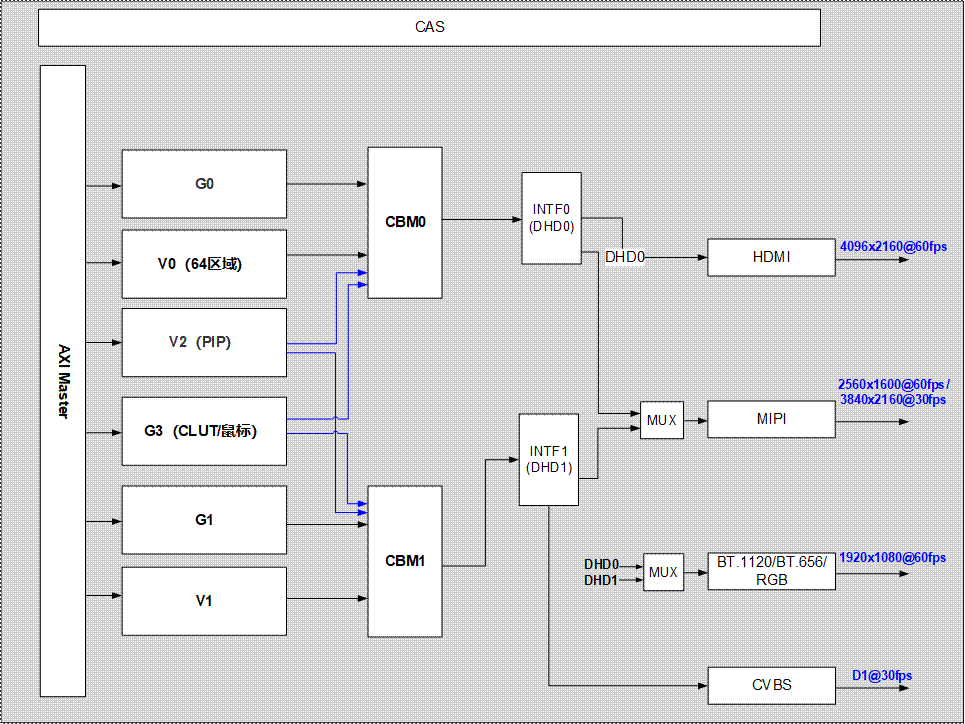

- Surface：总线输入的数据通路。其功能包括单个图层的总线数据读取、数据处理。Surface包括：视频层V0/V1/V2、图形层G0/G1/G3。
- Display Channel：显示通道。包括高清显示通道DHD0、高清显示通道DHD1。
- CBM（CrossBar and Mixer，选通叠加器）：视频层V0/视频层V2/图形层G0/图形层G3叠加CBM0；视频层V1/视频层V2/图形层G1/图形层G3叠加CBM1。
- CAS（Control And Status，控制和状态）：该模块主要是通过APB（Advanced Peripheral Bus，高级外围总线）总线完成对寄存器的配置，并且各模块的状态信息通过该模块上报给CPU。

VDP寄存器主要按照模块全局、Surface和Display Channel来分配：

- 模块全局寄存器

包括总线相关配置、中断。

- Surface寄存器

包括视频层、图形层配置寄存器。

- Display Channel寄存器

包括DHD0、DHD1配置寄存器。

VDP的特点如下：

- HDMI 2.0输出接口：最大支持3840x2160@60fps YCbCr输出。
- 4-lane MIPI-Tx输出接口（兼容数字1.8V LVCMOS），@2.5Gbps/lane。
- 数字输出接口：支持ITU-R BT.1120/BT.656/RGB输出。
- 标清CVBS输出接口，支持PAL/NTSC制式输出。
- 视频层（Video Surface）：V0、V1和V2层。
- 图形层（Graphics Surface）：G0、G1和G3层。
- 叠加特性：V0、V2、G0、G3叠加，V1、V2、G1、G3叠加。
- VDP包含2个显示通道，每个通道有1个垂直时序中断以及1个低带宽中断。

### 工作方式

#### 时钟配置

VDP的可配时钟寄存器有1个。

#### 复位

VDP的复位包括1个硬件复位、1个软件复位。

<strong><big>须知</big></strong>

在进行AXI总线复位之前：

- 将所有的层关闭。
- 在下一帧/场中断起来（到达更新点）后，再配置总线复位请求。

#### 输出接口

VDP支持以下四种接口输出：

- HDMI
- MIPI
- ITU-R BT.1120/BT.656/RGB
- CVBS

#### 中断

VDP中断分3类：

- 垂直时序中断
- 低带宽中断
#### 垂直时序中断

VDP支持垂直时序中断，中断产生位置可灵活配置：

- VDP包含2个显示通道，每个显示通道可生成3个垂直时序中断。
- 支持中断屏蔽可配。
- 支持垂直时序中断门限可配。
- 每个中断可清除，写1清0。
#### 低带宽中断

VDP支持以中断方式上报低带宽状态：

- VDP包含2个显示通道，每个显示通道可生成1个低带宽中断，标志帧的低带宽信息。
- 支持中断屏蔽可配。
- 每个中断可清除，写1清0。

### 功能描述

#### 视频层功能

1. 视频层V0特性
- 支持非压缩、压缩两种数据源。
- 支持的输入像素格式：semi-planar400、semi-planar420、semi-planar422。
- 最小输入分辨率32x32，最大输入分辨率为4096x2160(semi-planar420最大支持3840x2160)。
- 最小输出分辨率32x32，最大输出分辨率为4096x2160(semi-planar420最大支持3840x2160)。
- 支持64画面输入。
- 支持输入数据位宽：8bit。
- 输入的水平分辨率为2的倍数。
- 输入垂直分辨率为2的倍数。
- 支持垂直色度上采样功能CVFIR。
- 支持水平色度上采样。
- 支持色彩空间转换，支持亮度/对比度/色调/饱和度调节。
- 支持视频层BT.601、BT.709色域转换。

<strong><big>须知</big></strong>

- 多区域模式下，层在屏幕的起始坐标必须设置为（0,0）。
- 多区域模式下，不支持解压缩功能。
1. 视频层V1特性
- 支持非压缩数据源。
- 支持的输入像素格式：semi-planar400、semi-planar420、semi-planar422。
- 最小输入分辨率32x32，最大输入分辨率为1920x1080。
- 最小输出分辨率32x32，最大输出分辨率为1920x1080。
- 支持单画面输入。
- 支持输入数据位宽：8bit。
- 输入的水平分辨率为2的倍数。
- 输入垂直分辨率为2的倍数。
- 支持垂直色度上采样功能CVFIR。
- 支持水平色度上采样。
- 支持色彩空间转换，支持亮度/对比度/色调/饱和度调节。
- 支持视频层BT.601、BT.709色域转换。

<strong><big>须知</big></strong>

多区域模式下，层在屏幕的起始坐标必须设置为（0,0）。

1. 视频层V2特性
- 支持非压缩数据源。
- 支持的输入像素格式：semi-planar400、semi-planar420、semi-planar422。
- 最小输入分辨率32x32，最大输入分辨率为1920x1080。
- 最小输出分辨率32x32，最大输出分辨率为1920x1080。
- 支持输入数据位宽：8bit。
- 输入的水平分辨率为2的倍数。
- 输入垂直分辨率为2的倍数。
- 支持垂直色度复制。
- 支持水平色度上采样。
- 支持色彩空间转换，支持亮度/对比度/色调/饱和度调节。
- 支持视频层BT.601、BT.709色域转换。

#### 图形层功能

1. 图形层G0特性
- 支持非压缩、压缩两种数据源。
- 支持的输入像素格式：ARGB1555、ARGB4444、ARGB8888。
- 最小输入分辨率32x32，ARGB8888格式最大输入分辨率为1920x1080，其他格式最大输入分辨率为4096x2160。
- 最小输出分辨率32x32，最大输出分辨率为4096x2160。
- 输入水平垂直分辨率为2的倍数。
- 支持放大功能，水平、垂直放大范围均为[1x, 15x]，ARGB8888支持最大分辨率1920x1080，其他格式支持最大分辨率为3840x2160。
- 支持色彩空间转换。
- 支持显示位置可配：在屏幕的任意位置显示。
- 支持全局alpha可配置，配置范围[0, 255]。
- 支持colorkey处理。
- 支持预乘格式处理。

<strong><big>须知</big></strong>

2160P@60fps时序输出时，存在性能限制：G0层ARGB8888格式所支持的最大分辨率为1080P。建议此时G0层采用1080P分辨率（格式不限）、同时开启图形层放大功能，将G0层在线放大到2160P进行显示；或者采用2160P分辨率、ARGB1555或ARGB4444格式。

1. 图形层G1特性
- 支持非压缩数据源。
- 支持的输入像素格式：ARGB1555、ARGB4444、ARGB8888。
- 最小输入分辨率32x32，ARGB8888格式最大输入分辨率为1920x1080，其他格式最大输入分辨率为1920x1080。
- 最小输出分辨率32x32，最大输出分辨率为1920x1080。
- 输入水平垂直分辨率为2的倍数。
- 支持色彩空间转换。
- 支持显示位置可配：在屏幕的任意位置显示。
- 支持全局alpha可配置，配置范围[0, 255]。
- 支持colorkey处理。
- 支持预乘格式处理。
1. 图形层G3特性
- 支持的输入像素格式：ARGB1555、ARGB4444、ARGB8888、CLUT2、CLUT4。
- 最小输入分辨率32x32，ARGB格式最大输入分辨率为960x576，CLUT格式最大支持3840x2160。
- ARGB格式最小输出分辨率2x2，最大输入分辨率为960x576，CLUT格式最小输出分辨率32x32，最大支持3840x2160。
- 输入水平垂直分辨率为2的倍数。
- 支持色彩空间转换。
- 支持显示位置可配：在屏幕的任意位置显示。
- 支持全局alpha可配置，配置范围[0, 255]。
- 支持colorkey处理。
- 支持预乘格式处理。

#### 叠加处理

- 支持V0、V2、G0、G3叠加。
- 支持V1、V2、G1、G3叠加。
- 支持bottom-to-top的叠加方式。
- 叠加背景色可配。
- 叠加surface的优先级可配。

<strong><big>须知</big></strong>

同一时刻，V2、G3每个层各自只能选择一个叠加器叠加。

#### 显示通道

1. 显示通道特性
- DHD0可作为高清0的输出通道。
- DHD1可作为高清1的输出通道。
- DHD0支持以下典型输出时序：2160P@60fps、2160P@30fps、1080P@60fps、720P@60fps。
- DHD1支持以下典型输出时序：1080P@60fps、720P@60fps、PAL/NTSC。
#### 时序配置

VDP的输出接口支持配置各种典型及非典型时序，以适应不同的对接芯片接口。

<strong><big>须知</big></strong>

所有时序参数配置时，接口都应该关闭，配置完成后再打开接口。

VDP输出性能受输入数据带宽限制，视频SP420格式DHD0最大支持总共2160p@60fps输入，DHD1最大支持总共1080p@60fps输入。

#### 输出接口

1. HDMI 2.0特性
- 支持8bit输出。
- 时钟频率最高594MHz。
- 最大支持2160P@60fps YCbCr444/RGB 输出。
- 支持逐、隔行显示。
- 支持数据选择来自DHD0。
1. MIPI特性
- 最大支持2560x1600@60fps/3840x2160@30fps。
- 时钟频率最高297MHz
- 支持Raw8/10/12/14/16数据透传。
- 通过配置接口CSC实现RGB888输出。
- 支持数据选择来自DHD0或者DHD1。
1. BT.1120/BT.656显示接口特性
- 支持YUV422 8bit输出。
- 支持数据钳位的clip，根据接口协议，Y钳位范围16~235，C钳位范围16~240。
- 支持以下典型输出时序：720p@60fps、1080p@60fps、PAL/NTSC
- 支持dither处理。
- BT.1120支持16bit数据，默认Y在高位，C在低位，YC位置可互换。
- BT.656支持8bit 数据，不支持YC位置互换。
- 单沿时钟频率最大支持148.5MHz。
- 支持输出随路时钟反相。
- 支持数据选择来自DHD0或者DHD1。
1. RGB显示接口特性
- 支持RGB接口输出。
- 支持并行RGB565（16bit）、RGB888（24bit）并行输出，RGB/BGR顺序可选。
- 支持串行6bit、8bit输出，不支持分量互换。支持输出随路时钟反相。
- 支持数据选择来自DHD0或者DHD1
1. CVBS特性
- 支持以下典型输出时序：NTSC、PAL。
- 支持数据来自DHD1。
- 支持负载检测。

### VDP寄存器概览

VDP寄存器概览如表11-5所示。

VDP寄存器概览（基址：0x0\_17A0\_0000）

| 偏移地址 | 名称 | 描述 | 页码 |
| --- | --- | --- | --- |
| 0x0000 | VOCTRL | VDP控制寄存器 | 11-85 |
| 0x0004 | VOINTSTA | VDP中断状态，只读寄存器 | 11-86 |
| 0x0008 | VOMSKINTSTA | VDP经过Mask的中断状态寄存器 | 11-88 |
| 0x000C | VOINTMSK | VDP中断屏蔽寄存器 | 11-89 |
| 0x0014 | VOINTSTA1 | VDP中断状态1，只读寄存器 | 11-91 |
| 0x0018 | VOMSKINTSTA1 | VDP经过Mask的离线中断状态寄存器1 | 11-92 |
| 0x001C | VOINTMSK1 | VDP中断屏蔽寄存器1 | 11-94 |
| 0x0104 | VOMUX\_DAC | VO DAC输出接口复选寄存器 | 11-95 |
| 0x0120 | VO\_DAC\_CTRL | VO DAC控制寄存器 | 11-96 |
| 0x0124 | VO\_DAC\_OTP | VO DAC OTP控制寄存器 | 11-96 |
| 0x013C | VO\_DAC3\_CTRL | VO DAC3通道控制寄存器 | 11-97 |
| 0x0140 | VO\_DAC\_STAT0 | VO DAC状态0寄存器 | 11-98 |
| 0xD000 | DHD0\_CTRL | 显示通道的总体控制寄存器 | 11-98 |
| 0xD004 | DHD0\_VSYNC1 | 显示通道的垂直时序控制寄存器 | 11-99 |
| 0xD008 | DHD0\_VSYNC2 | 显示通道的垂直时序控制寄存器 | 11-100 |
| 0xD00C | DHD0\_HSYNC1 | 显示通道的水平时序控制1寄存器 | 11-100 |
| 0xD010 | DHD0\_HSYNC2 | 显示通道的水平时序控制2寄存器 | 11-100 |
| 0xD020 | DHD0\_VTTHD3 | 垂直时序门限值3（Vertical Timing Threshold），为即时寄存器 | 11-101 |
| 0xD024 | DHD0\_VTTHD | 垂直时序门限值（Vertical Timing Threshold），为即时寄存器 | 11-101 |
| 0xD02C | DHD0\_PRECHARGE\_THD | TCON预充电阈值寄存器 | 11-102 |
| 0xD030 | DHD0\_START\_POS | DHD0通道start信号起始位置寄存器 | 11-102 |
| 0xD044 | DHD0\_RGB\_FIX\_CTRL | INTF输出颜色固定寄存器 | 11-103 |
| 0xD090 | VO\_MUX | VDP输出接口复选寄存器 | 11-103 |
| 0xD108 | INTF\_HDMI\_SYNC\_INV | 外同步时序输出时，同步信号极性配置寄存器 | 11-104 |
| 0xD210 | BT\_CLIP0\_L | BT.1120 Clip处理最低门限值寄存器，为即时寄存器 | 11-105 |
| 0xD214 | BT\_CLIP0\_H | BT.1120 Clip处理最高门限值寄存器，为即时寄存器 | 11-106 |
| 0xD300 | INTF\_RGB\_CTRL | 接口通道配置寄存器 | 11-108 |
| 0xD304 | INTF\_RGB\_UPD | INTF\_RGB更新寄存器 | 11-109 |
| 0xE000 | DHD1\_CTRL | 显示通道的总体控制寄存器 | 11-109 |
| 0xE004 | DHD1\_VSYNC1 | 显示通道的垂直时序控制寄存器 | 11-110 |
| 0xE008 | DHD1\_VSYNC2 | 显示通道的垂直时序控制寄存器 | 11-111 |
| 0xE00C | DHD1\_HSYNC1 | 显示通道的水平时序控制1寄存器 | 11-111 |
| 0xE010 | DHD1\_HSYNC2 | 显示通道的水平时序控制2寄存器 | 11-111 |
| 0xE014 | DHD1\_VPLUS1 | 显示通道隔行输出的底场垂直时序控制寄存器 | 11-112 |
| 0xE018 | DHD1\_VPLUS2 | 显示通道隔行输出的底场垂直时序控制寄存器 | 11-112 |
| 0xE01C | DHD1\_PWR | 同步信号脉冲宽度寄存器，非即时寄存器 | 11-112 |
| 0xE020 | DHD1\_VTTHD3 | 垂直时序门限值（Vertical Timing Threshold），为即时寄存器 | 11-113 |
| 0xE024 | DHD1\_VTTHD | 垂直时序门限值（Vertical Timing Threshold），为即时寄存器 | 11-113 |
| 0xE02C | DHD1\_PRECHARGE\_THD | TCON预充电阈值寄存器 | 11-114 |
| 0xE030 | DHD1\_START\_POS | DHD0通道start信号起始位置寄存器 | 11-115 |
| 0xE044 | DHD1\_RGB\_FIX\_CTRL | INTF输出颜色固定寄存器 | 11-115 |
| 0x10000 | MAC\_OUTSTANDING | OUTSTANDING寄存器 | 11-115 |
| 0x10004 | MAC\_CTRL | MAC&MASTER控制寄存器 | 11-116 |

### VDP寄存器描述

#### VOCTRL

VOCTRL为VDP控制寄存器。

Offset Address: 0x0000 Total Reset Value: 0x8000\_0000

| Bits | Access | Name | Description | Reset |
| --- | --- | --- | --- | --- |
| [31] | RW | vo\_ck\_gt\_en | VDP时钟门控使能,既低功耗模式寄存器。  0：时钟门控关闭；  1：VDP的内部时钟门控打开。 | 0x1 |
| [30] | - | reserved | 保留。 | 0x0 |
| [29] | RW | v0\_ck\_gt\_en | V0层时钟门控使能,既低功耗模式寄存器。  0：V0层的时钟门控关闭；  1：V0层的时钟门控打开。 | 0x0 |
| [28] | RW | v1\_ck\_gt\_en | V1层时钟门控使能,既低功耗模式寄存器。  0：V1层的时钟门控关闭；  1：V1层的时钟门控打开。 | 0x0 |
| [27] | RW | g0\_ck\_gt\_en | V1层时钟门控使能,既低功耗模式寄存器。  0：G0层的时钟门控关闭；  1：G0层的时钟门控打开。 | 0x0 |
| [26] | RW | g1\_ck\_gt\_en | G1层时钟门控使能,既低功耗模式寄存器。  0：G1层的时钟门控关闭；  1：G1层的时钟门控打开。 | 0x0 |
| [25] | - | reserved | 保留。 | 0x0 |
| [24] | RW | v2\_ck\_gt\_en | V2层时钟门控使能,既低功耗模式寄存器。  0：V2层的时钟门控关闭；  1：V2层的时钟门控打开。 | 0x0 |
| [23] | RW | g3\_ck\_gt\_en | G3层时钟门控使能,既低功耗模式寄存器。  0：G3层的时钟门控关闭；  1：G3层的时钟门控打开。 | 0x0 |
| [22:0] | - | reserved | 保留。 | 0x000000 |

#### VOINTSTA

VOINTSTA为VDP中断状态，只读寄存器。

Offset Address: 0x0004 Total Reset Value: 0x0000\_0444

| Bits | Access | Name | Description | Reset |
| --- | --- | --- | --- | --- |
| [31:22] | - | reserved | 保留。 | 0x000 |
| [21] | RO | v1\_tunl\_int | V1低延时错误中断。  0：无中断；  1：上报中断。 | 0x0 |
| [20] | RO | v0\_tunl\_int | V0低延时错误中断。  0：无中断；  1：上报中断。 | 0x0 |
| [19] | RO | vdac3\_int | VDAC中断3。  0：无中断；  1：上报中断。 | 0x0 |
| [18:8] | - | reserved | 保留。 | 0x004 |
| [7] | RO | dhd1uf\_int | DHD1通道低带宽告警中断。  0：无中断；  1：上报中断。 | 0x0 |
| [6] | RO | dhd1vtthd3\_int | DHD1通道垂直时序中断3。  0：无中断；  1：上报中断。 | 0x1 |
| [5] | RO | dhd1vtthd2\_int | DHD1通道垂直时序中断2。  0：无中断；  1：上报中断。 | 0x0 |
| [4] | RO | dhd1vtthd1\_int | DHD1通道垂直时序中断1。  0：无中断；  1：上报中断。 | 0x0 |
| [3] | RO | dhd0uf\_int | DHD0通道低带宽告警中断。  0：无中断；  1：上报中断。 | 0x0 |
| [2] | RO | dhd0vtthd3\_int | DHD0通道垂直时序中断3。  0：无中断；  1：上报中断。 | 0x1 |
| [1] | RO | dhd0vtthd2\_int | DHD0通道垂直时序中断2。  0：无中断；  1：上报中断。 | 0x0 |
| [0] | RO | dhd0vtthd1\_int | DHD0通道垂直时序中断1。  0：无中断；  1：上报中断。 | 0x0 |

#### VOMSKINTSTA

VOMSKINTSTA为VDP经过Mask的中断状态寄存器。写1清零。

Offset Address: 0x0008 Total Reset Value: 0x0000\_0000

| Bits | Access | Name | Description | Reset |
| --- | --- | --- | --- | --- |
| [31:22] | - | reserved | 保留。 | 0x000 |
| [21] | WC | v1\_tunl\_clr | V1低延时错误中断。  0：无中断；  1：上报中断。 | 0x0 |
| [20] | WC | v0\_tunl\_clr | V0低延时错误中断。  0：无中断；  1：上报中断。 | 0x0 |
| [19] | WC | vdac3\_clr | VDAC中断3。  0：无中断；  1：上报中断。 | 0x0 |
| [18:8] | - | reserved | 保留。 | 0x000 |
| [7] | WC | dhd1uf\_clr | DHD1通道低带宽告警中断。  0：无中断；  1：上报中断。 | 0x0 |
| [6] | WC | dhd1vtthd3\_clr | DHD1通道垂直时序中断3。  0：无中断；  1：上报中断。 | 0x0 |
| [5] | WC | dhd1vtthd2\_clr | DHD1通道垂直时序中断2。  0：无中断；  1：上报中断。 | 0x0 |
| [4] | WC | dhd1vtthd1\_clr | DHD1通道垂直时序中断1。  0：无中断；  1：上报中断。 | 0x0 |
| [3] | WC | dhd0uf\_clr | DHD0通道低带宽告警中断。  0：无中断；  1：上报中断。 | 0x0 |
| [2] | WC | dhd0vtthd3\_clr | DHD0通道垂直时序中断3。  0：无中断；  1：上报中断。 | 0x0 |
| [1] | WC | dhd0vtthd2\_clr | DHD0通道垂直时序中断2。  0：无中断；  1：上报中断。 | 0x0 |
| [0] | WC | dhd0vtthd1\_clr | DHD0通道垂直时序中断1。  0：无中断；  1：上报中断。 | 0x0 |

#### VOINTMSK

VOINTMSK为VDP中断屏蔽寄存器。与VOINTSTA对应。相应比特为1表示中断打开，为0表示中断屏蔽。

Offset Address: 0x000C Total Reset Value: 0x0000\_0000

| Bits | Access | Name | Description | Reset |
| --- | --- | --- | --- | --- |
| [31:22] | - | reserved | 保留。 | 0x000 |
| [21] | RW | v1\_tunl\_intmask | V1低延时错误中断。  0: 中断屏蔽；  1: 中断使能。 | 0x0 |
| [20] | RW | v0\_tunl\_intmask | V0低延时错误中断。  0: 中断屏蔽；  1: 中断使能。 | 0x0 |
| [19] | RW | vdac3\_intmask | VDAC中断3。  0: 中断屏蔽；  1: 中断使能。 | 0x0 |
| [18:8] | - | reserved | 保留。 | 0x000 |
| [7] | RW | dhd1uf\_intmask | DHD1通道低带宽告警中断。  0: 中断屏蔽；  1: 中断使能。 | 0x0 |
| [6] | RW | dhd1vtthd3\_intmask | DHD1通道垂直时序中断3。  0: 中断屏蔽；  1: 中断使能。 | 0x0 |
| [5] | RW | dhd1vtthd2\_intmask | DHD1通道垂直时序中断2。  0: 中断屏蔽；  1: 中断使能。 | 0x0 |
| [4] | RW | dhd1vtthd1\_intmask | DHD1通道垂直时序中断1。  0: 中断屏蔽；  1: 中断使能。 | 0x0 |
| [3] | RW | dhd0uf\_intmask | DHD0通道低带宽告警中断。  0: 中断屏蔽；  1: 中断使能。 | 0x0 |
| [2] | RW | dhd0vtthd3\_intmask | DHD0通道垂直时序中断3。  0: 中断屏蔽；  1: 中断使能。 | 0x0 |
| [1] | RW | dhd0vtthd2\_intmask | DHD0通道垂直时序中断2。  0: 中断屏蔽；  1: 中断使能。 | 0x0 |
| [0] | RW | dhd0vtthd1\_intmask | DHD0通道垂直时序中断1。  0: 中断屏蔽；  1: 中断使能。 | 0x0 |

#### VOINTSTA1

VOINTSTA1为VDP中断状态1，只读寄存器。

Offset Address: 0x0014 Total Reset Value: 0x0000\_0444

| Bits | Access | Name | Description | Reset |
| --- | --- | --- | --- | --- |
| [31:22] | - | reserved | 保留。 | 0x000 |
| [21] | RO | v1\_tunl\_int | v1低延时错误中断。  0：无中断；  1：上报中断。 | 0x0 |
| [20] | RO | v0\_tunl\_int | v0低延时错误中断。  0：无中断；  1：上报中断。 | 0x0 |
| [19] | RO | vdac3\_int | vdac中断3。  0：无中断；  1：上报中断。 | 0x0 |
| [18:8] | - | reserved | 保留。 | 0x004 |
| [7] | RO | dhd1uf\_int | DHD1通道低带宽告警中断。  0：无中断；  1：上报中断。 | 0x0 |
| [6] | RO | dhd1vtthd3\_int | DHD1通道垂直时序中断3。  0：无中断；  1：上报中断。 | 0x1 |
| [5] | RO | dhd1vtthd2\_int | DHD1通道垂直时序中断2。  0：无中断；  1：上报中断。 | 0x0 |
| [4] | RO | dhd1vtthd1\_int | DHD1通道垂直时序中断1。  0：无中断；  1：上报中断。 | 0x0 |
| [3] | RO | dhd0uf\_int | DHD0通道低带宽告警中断。  0：无中断；  1：上报中断。 | 0x0 |
| [2] | RO | dhd0vtthd3\_int | DHD0通道垂直时序中断3。  0：无中断；  1：上报中断。 | 0x1 |
| [1] | RO | dhd0vtthd2\_int | DHD0通道垂直时序中断2。  0：无中断；  1：上报中断。 | 0x0 |
| [0] | RO | dhd0vtthd1\_int | DHD0通道垂直时序中断1。  0：无中断；  1：上报中断。 | 0x0 |

#### VOMSKINTSTA1

VOMSKINTSTA1为VDP经过Mask的离线中断状态寄存器1。写1清零。

Offset Address: 0x0018 Total Reset Value: 0x0000\_0000

| Bits | Access | Name | Description | Reset |
| --- | --- | --- | --- | --- |
| [31:22] | - | reserved | 保留。 | 0x000 |
| [21] | WC | v1\_tunl\_clr | v1低延时错误中断。  0：无中断；  1：上报中断。 | 0x0 |
| [20] | WC | v0\_tunl\_clr | v0低延时错误中断。  0：无中断；  1：上报中断。 | 0x0 |
| [19] | WC | vdac3\_clr | vdac中断3。  0：无中断；  1：上报中断。 | 0x0 |
| [18:8] | - | reserved | 保留。 | 0x000 |
| [7] | WC | dhd1uf\_clr | DHD1通道低带宽告警中断。  0：无中断；  1：上报中断。 | 0x0 |
| [6] | WC | dhd1vtthd3\_clr | DHD1通道垂直时序中断3。  0：无中断；  1：上报中断。 | 0x0 |
| [5] | WC | dhd1vtthd2\_clr | DHD1通道垂直时序中断2。  0：无中断；  1：上报中断。 | 0x0 |
| [4] | WC | dhd1vtthd1\_clr | DHD1通道垂直时序中断1。  0：无中断；  1：上报中断。 | 0x0 |
| [3] | WC | dhd0uf\_clr | DHD0通道低带宽告警中断。  0：无中断；  1：上报中断。 | 0x0 |
| [2] | WC | dhd0vtthd3\_clr | DHD0通道垂直时序中断3。  0：无中断；  1：上报中断。 | 0x0 |
| [1] | WC | dhd0vtthd2\_clr | DHD0通道垂直时序中断2。  0：无中断；  1：上报中断。 | 0x0 |
| [0] | WC | dhd0vtthd1\_clr | DHD0通道垂直时序中断1。  0：无中断；  1：上报中断。 | 0x0 |

#### VOINTMSK1

VOINTMSK1为VDP中断屏蔽寄存器1。与VOINTSTA对应。相应比特为1表示中断打开，为0表示中断屏蔽。

Offset Address: 0x001C Total Reset Value: 0x0000\_0000

| Bits | Access | Name | Description | Reset |
| --- | --- | --- | --- | --- |
| [31:22] | - | reserved | 保留。 | 0x000 |
| [21] | RW | v1\_tunl\_intmask | v1低延时错误中断。  0: 中断屏蔽；  1: 中断使能。 | 0x0 |
| [20] | RW | v0\_tunl\_intmask | v0低延时错误中断。  0: 中断屏蔽；  1: 中断使能。 | 0x0 |
| [19] | RW | vdac3\_intmask | vdac中断3。  0: 中断屏蔽；  1: 中断使能。 | 0x0 |
| [18:8] | - | reserved | 保留。 | 0x000 |
| [7] | RW | dhd1uf\_intmask | DHD1通道低带宽告警中断。  0: 中断屏蔽；  1: 中断使能。 | 0x0 |
| [6] | RW | dhd1vtthd3\_intmask | DHD1通道垂直时序中断3。  0: 中断屏蔽；  1: 中断使能。 | 0x0 |
| [5] | RW | dhd1vtthd2\_intmask | DHD1通道垂直时序中断2。  0: 中断屏蔽；  1: 中断使能。 | 0x0 |
| [4] | RW | dhd1vtthd1\_intmask | DHD1通道垂直时序中断1。  0: 中断屏蔽；  1: 中断使能。 | 0x0 |
| [3] | RW | dhd0uf\_intmask | DHD0通道低带宽告警中断。  0: 中断屏蔽；  1: 中断使能。 | 0x0 |
| [2] | RW | dhd0vtthd3\_intmask | DHD0通道垂直时序中断3。  0: 中断屏蔽；  1: 中断使能。 | 0x0 |
| [1] | RW | dhd0vtthd2\_intmask | DHD0通道垂直时序中断2。  0: 中断屏蔽；  1: 中断使能。 | 0x0 |
| [0] | RW | dhd0vtthd1\_intmask | DHD0通道垂直时序中断1。  0: 中断屏蔽；  1: 中断使能。 | 0x0 |

#### VOMUX\_DAC

VOMUX\_DAC为VO DAC输出接口复选寄存器。

Offset Address: 0x0104 Total Reset Value: 0x0000\_0987

| Bits | Access | Name | Description | Reset |
| --- | --- | --- | --- | --- |
| [31:16] | - | reserved | 保留。 | 0x0000 |
| [15:12] | RW | dac3\_sel | DAC3输出选择(默认0x0)。  0x0：DAC3输出CVBS视频(SDATE)；  其他：保留。 | 0x0 |
| [11:0] | - | reserved | 保留。 | 0x987 |

#### VO\_DAC\_CTRL

VO\_DAC\_CTRL为VO DAC控制寄存器。

Offset Address: 0x0120 Total Reset Value: 0x0000\_0000

|  |  |  |  |  |
| --- | --- | --- | --- | --- |
| Bits | Access | Name | Description | Reset |
| [31:23] | - | reserved | 保留。 | 0x000 |
| [22] | RW | envbg | VBG参考电压使能。  0：关闭；  1：打开。 | 0x0 |
| [21] | RW | pdchopper | VBG的Chopper使能。  0：开启chopper功能；  1：关闭chopper功能。 | 0x0 |
| [20] | RW | enextref | VBG的输出测试使能。  0：使用内部VBG，VBG不输出到测试管脚；  1：VBG输出到外部进行测试。 | 0x0 |
| [19:0] | - | reserved | 保留。 | 0x00000 |

#### VO\_DAC\_OTP

VO\_DAC\_OTP为VO DAC OTP控制寄存器。

Offset Address: 0x0124 Total Reset Value: 0x0000\_0000

|  |  |  |  |  |
| --- | --- | --- | --- | --- |
| Bits | Access | Name | Description | Reset |
| [31:16] | - | reserved | 保留。 | 0x0000 |
| [15:0] | RW | dac\_otp\_reg | 电阻修调值。 | 0x0000 |

#### VO\_DAC3\_CTRL

VO\_DAC3\_CTRL为VO DAC3通道控制寄存器。

Offset Address: 0x013C Total Reset Value: 0x0000\_0000

|  |  |  |  |  |
| --- | --- | --- | --- | --- |
| Bits | Access | Name | Description | Reset |
| [31] | RW | dac\_en | DAC使能端。  0：不使能；  1：使能。 | 0x0 |
| [30:10] | - | reserved | 保留。 | 0x000000 |
| [9:4] | RW | dacgc | DAC输出幅度控制寄存器。  满幅输出电压范围覆盖0.52-1.37V，输出幅度分成64阶调节，调节的精度为1%，计算公式为  Ifs=13.9+GAIN\*0.358(m A)：  000000：0.52V  …..  111111:1.37V | 0x00 |
| [3:2] | - | reserved | 保留。 | 0x0 |
| [1:0] | RW | cablectr | DAC的VREF\_CABLE参考电压调节。  00：默认正常；  01：-10%；  10：-20%；  11：+10%。 | 0x0 |

#### VO\_DAC\_STAT0

VO\_DAC\_STAT0为VO DAC状态0寄存器。

Offset Address: 0x0140 Total Reset Value: 0x0000\_0000

|  |  |  |  |  |
| --- | --- | --- | --- | --- |
| Bits | Access | Name | Description | Reset |
| [31:4] | - | reserved | 保留。 | 0x0000000 |
| [3] | RO | cableout3 | DAC3负载检测状态。 | 0x0 |
| [2:0] | - | reserved | 保留。 | 0x0 |

#### DHD0\_CTRL

DHD0\_CTRL为显示通道的总体控制寄存器。该寄存器的所有比特的配置必须不晚于DHD0\_CTRL.regup比特，否则配置无法生效。

Offset Address: 0xD000 Total Reset Value: 0x0000\_0000

| Bits | Access | Name | Description | Reset |
| --- | --- | --- | --- | --- |
| [31] | RW | intf\_en | 显示接口使能。  0：禁止；  1：使能。 | 0x0 |
| [30] | RW | cbar\_en | color bar使能。使能时，接口输出color bar。  0：禁止；  1：使能。 | 0x0 |
| [29] | RW | cbar\_sel | 输出color bar色彩空间选择信号，即时寄存器。  0：VGA；  1：YPbPr。 | 0x0 |
| [28:19] | - | reserved | 保留。 | 0x000 |
| [18] | RW | cbar\_mode | color bar模式选择。  0：水平color bar；  1：垂直color bar。 | 0x0 |
| [17] | - | reserved | 保留。 | 0x0 |
| [16] | RW | twochn\_en | 双通道处理使能寄存器。  0：双通道处理不使能；  1：双通道处理使能。 | 0x0 |
| [15] | RO | reserved | 保留。 | 0x0 |
| [14] | RW | hdmi\_mode | 输出HDMI数据色彩空间选择，非即时寄存器。  0：YUV；  1：RGB。 | 0x0 |
| [13:5] | - | reserved | 保留。 | 0x000 |
| [4] | RW | iop | 逐行或者隔行显示，非即时寄存器。  0：隔行显示；  1：逐行显示。 | 0x0 |
| [3:1] | RO | reserved | 保留。 | 0x0 |
| [0] | WC | regup | DHD0的寄存器更新。当软件配置完该层寄存器后写1更新，更新完成后，硬件自动清零。 | 0x0 |

#### DHD0\_VSYNC1

DHD0\_VSYNC1为显示通道的垂直时序控制寄存器。为隔行输出时，该寄存器表示顶场垂直同步时序；逐行输出时，该寄存器表示帧垂直同步时序。非即时寄存器。

Offset Address: 0xD004 Total Reset Value: 0x0028\_0437

| Bits | Access | Name | Description | Reset |
| --- | --- | --- | --- | --- |
| [31:16] | RW | vbb | 隔行输出时：顶场垂直消隐后肩；  逐行输出时：垂直消隐后肩加垂直脉冲的宽度。 | 0x0028 |
| [15:0] | RW | vact | 隔行输出时：顶场的活动图象的高度；  逐行输出时：一帧的活动图象的高度。该寄存器值为实际值减1。 | 0x0437 |

#### DHD0\_VSYNC2

DHD0\_VSYNC2为显示通道的垂直时序控制寄存器。为隔行输出时，该寄存器表示顶场垂直同步时序；逐行输出时，该寄存器表示帧垂直同步时序。非即时寄存器。

Offset Address: 0xD008 Total Reset Value: 0x0000\_0003

|  |  |  |  |  |
| --- | --- | --- | --- | --- |
| Bits | Access | Name | Description | Reset |
| [31:16] | - | reserved | 保留。 | 0x0000 |
| [15:0] | RW | vfb | 隔行输出时：顶场垂直消隐前肩；  逐行输出时：垂直消隐前肩。 | 0x0003 |

#### DHD0\_HSYNC1

DHD0\_HSYNC1为显示通道的水平时序控制1寄存器。隔行或逐行输出情况下，水平同步配置,非即时寄存器。

Offset Address: 0xD00C Total Reset Value: 0x00BF\_077F

|  |  |  |  |  |
| --- | --- | --- | --- | --- |
| Bits | Access | Name | Description | Reset |
| [31:16] | RW | hbb | 水平消隐后肩，单位为像素。 | 0x00BF |
| [15:0] | RW | hact | 活动区域水平像素数。 | 0x077F |

#### DHD0\_HSYNC2

DHD0\_HSYNC2为显示通道的水平时序控制2寄存器。隔行或逐行输出情况下，水平同步配置，非即时寄存器。

Offset Address: 0xD010 Total Reset Value: 0x0000\_0057

| Bits | Access | Name | Description | Reset |
| --- | --- | --- | --- | --- |
| [31:16] | RW | hmid | 底场垂直同步有效像素值(有效数据区)。 | 0x0000 |
| [15:0] | RW | hfb | 水平消隐前肩，单位为像素。 | 0x0057 |

#### DHD0\_VTTHD3

DHD0\_VTTHD3为垂直时序门限值3（Vertical Timing Threshold），为即时寄存器。该寄存器中包含两个门限配置，可以分别独立的产生两个中断。

Offset Address: 0xD020 Total Reset Value: 0x0000\_0000

|  |  |  |  |  |
| --- | --- | --- | --- | --- |
| Bits | Access | Name | Description | Reset |
| [31:16] | - | reserved | 保留。 | 0x0000 |
| [15] | RW | thd3\_mode | 门限3中断产生的模式。  0：帧模式，以帧为单位做门限计数；  1：场模式，在隔行显示时以场为单位做门限计数。 | 0x0 |
| [14:13] | - | reserved | 保留。 | 0x0 |
| [12:0] | RW | vtmgthd3 | 垂直时序门限值3，当垂直时序计数器到达该门限时触发VOINTSTA[dhdvtthd3\_int]中断。 | 0x0000 |

#### DHD0\_VTTHD

DHD0\_VTTHD为垂直时序门限值（Vertical Timing Threshold），为即时寄存器。该寄存器中包含两个门限配置，可以分别独立的产生两个中断。

Offset Address: 0xD024 Total Reset Value: 0x0001\_0001

| Bits | Access | Name | Description | Reset |
| --- | --- | --- | --- | --- |
| [31] | RW | thd2\_mode | 门限2中断产生的模式。  0：帧模式，以帧为单位做门限计数；  1：场模式，在隔行显示时以场为单位做门限计数。 | 0x0 |
| [30:29] | - | reserved | 保留。 | 0x0 |
| [28:16] | RW | vtmgthd2 | 垂直时序门限值2，当垂直时序计数器到达该门限时触发VOINTSTA[dhdvtthd2\_int]中断。 | 0x0001 |
| [15] | RW | thd1\_mode | 门限1中断产生的模式。  0：帧模式，以帧为单位做门限计数；  1：场模式，在隔行显示时以场为单位做门限计数。 | 0x0 |
| [14:13] | - | reserved | 保留。 | 0x0 |
| [12:0] | RW | vtmgthd1 | 垂直时序门限值1，当垂直时序计数器到达该门限时触发VOINTSTA[dhdvtthd\_int1]中断。 | 0x0001 |

#### DHD0\_PRECHARGE\_THD

DHD0\_PRECHARGE\_THD为TCON预充电阈值寄存器。

Offset Address: 0xD02C Total Reset Value: 0x0000\_0000

|  |  |  |  |  |
| --- | --- | --- | --- | --- |
| Bits | Access | Name | Description | Reset |
| [31:21] | - | reserved | 保留。 | 0x000 |
| [20] | RW | vsync\_te\_mode | 垂直时序从模式使能寄存器。  0：VFB(vertical front blanking)到VBB(vertical back blanking)的切换由时序配置控制；  1：VFB到VBB的切换由外部vsync信号控制。 | 0x0 |
| [19:0] | - | reserved | 保留。 | 0x00000 |

#### DHD0\_START\_POS

DHD0\_START\_POS为DHD0通道start信号起始位置寄存器。

Offset Address: 0xD030 Total Reset Value: 0x00A3\_030A

|  |  |  |  |  |
| --- | --- | --- | --- | --- |
| Bits | Access | Name | Description | Reset |
| [31:8] | - | reserved | 保留。 | 0x00A303 |
| [7:0] | RW | start\_pos | 表示从消隐区开始的的第几行产生该start信号。从0开始计数。 | 0x0A |

#### DHD0\_RGB\_FIX\_CTRL

DHD0\_RGB\_FIX\_CTRL为INTF输出颜色固定寄存器。

Offset Address: 0xD044 Total Reset Value: 0x0000\_0000

|  |  |  |  |  |
| --- | --- | --- | --- | --- |
| Bits | Access | Name | Description | Reset |
| [31] | - | reserved | 保留。 | 0x0 |
| [30] | RW | rgb\_fix\_mux | 输出颜色固定选择寄存器。  0：不固定；  1：固定颜色，可配。 | 0x0 |
| [29:20] | RW | fix\_r | 输出颜色R分量固定，可配。 | 0x000 |
| [19:10] | RW | fix\_g | 输出颜色G分量固定，可配。 | 0x000 |
| [9:0] | RW | fix\_b | 输出颜色B分量固定，可配。 | 0x000 |

#### VO\_MUX

VO\_MUX为VDP输出接口复选寄存器。

Offset Address: 0xD090 Total Reset Value: 0x0000\_0000

| Bits | Access | Name | Description | Reset |
| --- | --- | --- | --- | --- |
| [31:28] | RW | digital\_sel | digital接口数据选择。  0x0：BT.1120；  0x1：BT.656；  0x2：RGB；  其他：保留。 | 0x0 |
| [27:20] | - | reserved | 保留。 | 0x00 |
| [19:16] | RW | hdmi\_sel | HDMI数据选择(默认0)。  0x0：DHD0 HDMI；  0x1：DHD1 HDMI。  其他：保留。 | 0x0 |
| [15:12] | RW | sddate\_sel | SDDATE数据选择(默认0)。  0x0：DHD0 SDDATE；  0x1：DHD1 SDDATE；  其他：保留。 | 0x0 |
| [11:8] | RW | bt\_sel | BT.1120/656数据选择(默认0)。  0x0：DHD0 BT.1120/656；  0x1：DHD1 BT.1120/656。  其他：保留。 | 0x0 |
| [7:4] | RW | rgb\_sel | RGB数据选择(默认0)。  0x0：DHD0 RGB；  0x1：DHD1 RGB。  其他：保留。 | 0x0 |
| [3:0] | RW | mipi\_sel | MIPI数据选择。  0x0：DHD0 MIPI；  0x1：DHD1 MIPI；  0x2：DHD0 HDMI 420。  其他：保留。 | 0x0 |

#### INTF\_HDMI\_SYNC\_INV

INTF\_HDMI\_SYNC\_INV为外同步时序输出时，同步信号极性配置寄存器。该寄存器配置后立即生效，将马上影响到对应同步信号的极性。

Offset Address: 0xD108 Total Reset Value: 0x0000\_0000

|  |  |  |  |  |
| --- | --- | --- | --- | --- |
| Bits | Access | Name | Description | Reset |
| [31:4] | - | reserved | 保留。 | 0x0000000 |
| [3] | RW | f\_inv | 奇偶场指示信号输出反相使能，即时寄存器。  0：禁止；  1：使能。 | 0x0 |
| [2] | RW | vs\_inv | 垂直同步脉冲输出反相使能，即时寄存器。  0：禁止；  1：使能。 | 0x0 |
| [1] | RW | hs\_inv | 水平同步脉冲输出反相使能，即时寄存器。  0：禁止；  1：使能。 | 0x0 |
| [0] | RW | dv\_inv | 数据有效信号输出反相使能，即时寄存器。  0：禁止；  1：使能。 | 0x0 |

#### BT\_CLIP0\_L

BT\_CLIP0\_L为BT.1120 Clip处理最低门限值寄存器，为即时寄存器。

Offset Address: 0xD210 Total Reset Value: 0x0000\_0000

|  |  |  |  |  |
| --- | --- | --- | --- | --- |
| Bits | Access | Name | Description | Reset |
| [31] | RW | clip\_en | clip使能寄存器。  0：不使能；  1：使能。 | 0x0 |
| [30] | - | reserved | 保留。 | 0x0 |
| [29:20] | RW | clip\_cl2 | 分量2最低门限值Y/R，无符号整数。 | 0x000 |
| [19:10] | RW | clip\_cl1 | 分量1最低门限值Cb/G，无符号整数。 | 0x000 |
| [9:0] | RW | clip\_cl0 | 分量0最低门限值Cr/B，无符号整数。 | 0x000 |

#### BT\_CLIP0\_H

BT\_CLIP0\_H为BT.1120 Clip处理最高门限值寄存器，为即时寄存器。

Offset Address: 0xD214 Total Reset Value: 0x3FFF\_FFFF

|  |  |  |  |  |
| --- | --- | --- | --- | --- |
| Bits | Access | Name | Description | Reset |
| [31:30] | - | reserved | 保留。 | 0x0 |
| [29:20] | RW | clip\_ch2 | 分量2最高门限值Y/R，无符号整数。 | 0x3FF |
| [19:10] | RW | clip\_ch1 | 分量1最高门限值Cb/G，无符号整数。 | 0x3FF |
| [9:0] | RW | clip\_ch0 | 分量0最高门限值Cr/B，无符号整数。 | 0x3FF |

#### BT\_DITHER\_CTRL

BT\_DITHER\_CTRL为Dither控制寄存器。

Offset Address: 0xD280 Total Reset Value: 0x0000\_1600

| Bits | Access | Name | Description | Reset |
| --- | --- | --- | --- | --- |
| [31:13] | - | reserved | 保留。 | 0x00000 |
| [12:10] | RW | o\_data\_width\_dither | 输出像素数据位宽。  000：5；  001：6；  010：7；  011：8；  100：9；  101：10。  其他：保留。 | 0x5 |
| [9:7] | RW | i\_data\_width\_dither | 输入像素数据位宽。  000：8；  001：9；  010：10；  011：11；  100：12。  其他：保留。 | 0x4 |
| [6] | RW | dither\_round\_unlim | 不在门限范围内的像素四舍五入使能寄存器。  0：关闭；  1：使能。 | 0x0 |
| [5] | RW | dither\_en | Dither使能选择。  1：模块使能；  0：模块不使能，直接bypass。 | 0x0 |
| [4] | RW | dither\_mode | Dither输出模式选择。  0：12bits->10bits输出，丢低位；  1：12bits->8bits输出，丢低位。 | 0x0 |
| [3] | RW | dither\_round | Dither四舍五入使能寄存器。  0：关闭；  1：使能。 | 0x0 |
| [2] | RW | dither\_domain\_mode | Dither时域和空域模式寄存器。  0：空域；  1：时域和空域的组合。 | 0x0 |
| [1:0] | RW | dither\_tap\_mode | Dither周期配置。  00：周期为7；  01：周期为15；  10：周期为23；  11：周期为31。 | 0x0 |

#### BT\_DITHER\_THR

BT\_DITHER\_THR为Dither门限值寄存器。

Offset Address: 0xD2C4 Total Reset Value: 0x0000\_0000

|  |  |  |  |  |
| --- | --- | --- | --- | --- |
| Bits | Access | Name | Description | Reset |
| [31:16] | RW | dither\_thr\_max | 做dither处理的像素上限值。 | 0x0000 |
| [15:0] | RW | dither\_thr\_min | 做dither处理的像素下限值。 | 0x0000 |

#### INTF\_RGB\_CTRL

INTF\_RGB\_CTRL为接口通道配置寄存器。

Offset Address: 0xD300 Total Reset Value: 0x0000\_0000

|  |  |  |  |  |
| --- | --- | --- | --- | --- |
| Bits | Access | Name | Description | Reset |
| [31] | RO | reserved | 保留。 | 0x0 |
| [30] | RW | dfir\_en | dfir使能信号。  0：禁止；  1：使能。 | 0x0 |
| [29:27] | - | reserved | 保留。 | 0x0 |
| [26] | RW | rgb\_serial\_perd | RGB串行输出单像素时钟周期数。  0：3个周期；  1：4个周期。 | 0x0 |
| [25] | RW | rgb\_comp\_order | RGB并行输出顺序。  0：RGB；  1：BGR。 | 0x0 |
| [24] | RW | rgb\_bit\_inv | RGB输出bit反序。  0：正序；  1：反序。 | 0x0 |
| [23:20] | RW | rgb\_format | RGB 输出格式。  0x0：并行RGB888输出；  0x1：并行RGB565输出；  0x2：并行RGB666输出；  0x3：串行8bit输出；  0x4：串行6bit输出。 | 0x0 |
| [19:0] | - | reserved | 保留。 | 0x00000 |

#### INTF\_RGB\_UPD

INTF\_RGB\_UPD为INTF\_RGB更新寄存器。

Offset Address: 0xD304 Total Reset Value: 0x0000\_0000

|  |  |  |  |  |
| --- | --- | --- | --- | --- |
| Bits | Access | Name | Description | Reset |
| [31:1] | - | reserved | 保留。 | 0x00000000 |
| [0] | WC | regup | 更新寄存器。当软件配置完该层寄存器后写1更新，更新完成后，硬件自动清零。 | 0x0 |

#### DHD1\_CTRL

DHD1\_CTRL为显示通道的总体控制寄存器。该寄存器的所有比特的配置必须不晚于DHD0\_CTRL.regup比特，否则配置无法生效。

Offset Address: 0xE000 Total Reset Value: 0x0000\_0000

| Bits | Access | Name | Description | Reset |
| --- | --- | --- | --- | --- |
| [31] | RW | intf\_en | 显示接口使能。  0：禁止；  1：使能。 | 0x0 |
| [30] | RW | cbar\_en | color bar使能。使能时，接口输出color bar。  0：禁止；  1：使能。 | 0x0 |
| [29] | RW | cbar\_sel | 输出color bar色彩空间选择信号，即时寄存器。  0：VGA；  1：YPbPr。 | 0x0 |
| [28:19] | - | reserved | 保留。 | 0x000 |
| [18] | RW | cbar\_mode | color bar模式选择。  0：水平color bar；  1：垂直color bar。 | 0x0 |
| [17:15] | - | reserved | 保留。 | 0x0 |
| [14] | RW | hdmi\_mode | 输出HDMI数据色彩空间选择，非即时寄存器。  0：YUV；  1：RGB。 | 0x0 |
| [13:5] | - | reserved | 保留。 | 0x000 |
| [4] | RW | iop | 逐行或者隔行显示，非即时寄存器。  0：隔行显示；  1：逐行显示。 | 0x0 |
| [3:1] | RO | reserved | 保留。 | 0x0 |
| [0] | WC | regup | DHD0的寄存器更新。当软件配置完该层寄存器后写1更新，更新完成后，硬件自动清零。 | 0x0 |

#### DHD1\_VSYNC1

DHD1\_VSYNC1为显示通道的垂直时序控制寄存器。为隔行输出时，该寄存器表示顶场垂直同步时序；逐行输出时，该寄存器表示帧垂直同步时序。非即时寄存器。

Offset Address: 0xE004 Total Reset Value: 0x0028\_0437

|  |  |  |  |  |
| --- | --- | --- | --- | --- |
| Bits | Access | Name | Description | Reset |
| [31:16] | RW | vbb | 隔行输出时：顶场垂直消隐后肩；  逐行输出时：垂直消隐后肩加垂直脉冲的宽度。 | 0x0028 |
| [15:0] | RW | vact | 隔行输出时：顶场的活动图象的高度；  逐行输出时：一帧的活动图象的高度。该寄存器值为实际值减1。 | 0x0437 |

#### DHD1\_VSYNC2

DHD1\_VSYNC2为显示通道的垂直时序控制寄存器。为隔行输出时，该寄存器表示顶场垂直同步时序；逐行输出时，该寄存器表示帧垂直同步时序。非即时寄存器。

Offset Address: 0xE008 Total Reset Value: 0x0000\_0003

|  |  |  |  |  |
| --- | --- | --- | --- | --- |
| Bits | Access | Name | Description | Reset |
| [31:16] | - | reserved | 保留。 | 0x0000 |
| [15:0] | RW | vfb | 隔行输出时：顶场垂直消隐前肩；  逐行输出时：垂直消隐前肩。 | 0x0003 |

#### DHD1\_HSYNC1

DHD1\_HSYNC1为显示通道的水平时序控制1寄存器。隔行或逐行输出情况下，水平同步配置,非即时寄存器。

Offset Address: 0xE00C Total Reset Value: 0x00BF\_077F

|  |  |  |  |  |
| --- | --- | --- | --- | --- |
| Bits | Access | Name | Description | Reset |
| [31:16] | RW | hbb | 水平消隐后肩，单位为像素。 | 0x00BF |
| [15:0] | RW | hact | 活动区域水平像素数。 | 0x077F |

#### DHD1\_HSYNC2

DHD1\_HSYNC2为显示通道的水平时序控制2寄存器。隔行或逐行输出情况下，水平同步配置，非即时寄存器。

Offset Address: 0xE010 Total Reset Value: 0x0000\_0057

|  |  |  |  |  |
| --- | --- | --- | --- | --- |
| Bits | Access | Name | Description | Reset |
| [31:16] | RW | hmid | 底场垂直同步有效像素值(有效数据区)。 | 0x0000 |
| [15:0] | RW | hfb | 水平消隐前肩，单位为像素。 | 0x0057 |

#### DHD1\_VPLUS1

DHD1\_VPLUS1为显示通道隔行输出的底场垂直时序控制寄存器。隔行输出时，该寄存器表示底场垂直同步时序，非即时寄存器。

Offset Address: 0xE014 Total Reset Value: 0x0000\_0000

|  |  |  |  |  |
| --- | --- | --- | --- | --- |
| Bits | Access | Name | Description | Reset |
| [31:16] | RW | bvbb | 隔行输出时：底场垂直消隐后肩垂直脉冲的宽度。 | 0x0000 |
| [15:0] | RW | bvact | 隔行输出时：底场的活动图象的高度。  该寄存器值为实际值减1。 | 0x0000 |

#### DHD1\_VPLUS2

DHD1\_VPLUS2为显示通道隔行输出的底场垂直时序控制寄存器。隔行输出时，该寄存器表示底场垂直同步时序，非即时寄存器。

Offset Address: 0xE018 Total Reset Value: 0x0000\_0000

|  |  |  |  |  |
| --- | --- | --- | --- | --- |
| Bits | Access | Name | Description | Reset |
| [31:16] | - | reserved | 保留。 | 0x0000 |
| [15:0] | RW | bvfb | 隔行输出时：底场垂直消隐后肩垂直脉冲的宽度。 | 0x0000 |

#### DHD1\_PWR

DHD1\_PWR为同步信号脉冲宽度寄存器，非即时寄存器。

Offset Address: 0xE01C Total Reset Value: 0x0804\_002B

|  |  |  |  |  |
| --- | --- | --- | --- | --- |
| Bits | Access | Name | Description | Reset |
| [31:24] | - | reserved | 保留。 | 0x08 |
| [23:16] | RW | vpw | 垂直脉冲宽度减1。 | 0x04 |
| [15:0] | RW | hpw | 水平脉冲宽度减1。 | 0x002B |

#### DHD1\_VTTHD3

DHD1\_VTTHD3为垂直时序门限值（Vertical Timing Threshold），为即时寄存器。该寄存器中包含两个门限配置，可以分别独立的产生两个中断。

Offset Address: 0xE020 Total Reset Value: 0x0000\_0000

|  |  |  |  |  |
| --- | --- | --- | --- | --- |
| Bits | Access | Name | Description | Reset |
| [31:16] | - | reserved | 保留。 | 0x0000 |
| [15] | RW | thd3\_mode | 门限3中断产生的模式。  0：帧模式，以帧为单位做门限计数；  1：场模式，在隔行显示时以场为单位做门限计数。 | 0x0 |
| [14:13] | - | reserved | 保留。 | 0x0 |
| [12:0] | RW | vtmgthd3 | 垂直时序门限值3，当垂直时序计数器到达该门限时触发VOINTSTA[dhdvtthd3\_int]中断。 | 0x0000 |

#### DHD1\_VTTHD

DHD1\_VTTHD为垂直时序门限值（Vertical Timing Threshold），为即时寄存器。该寄存器中包含两个门限配置，可以分别独立的产生两个中断。

Offset Address: 0xE024 Total Reset Value: 0x0001\_0001

| Bits | Access | Name | Description | Reset |
| --- | --- | --- | --- | --- |
| [31] | RW | thd2\_mode | 门限2中断产生的模式。  0：帧模式，以帧为单位做门限计数；  1：场模式，在隔行显示时以场为单位做门限计数。 | 0x0 |
| [30:29] | - | reserved | 保留。 | 0x0 |
| [28:16] | RW | vtmgthd2 | 垂直时序门限值2，当垂直时序计数器到达该门限时触发VOINTSTA[dhdvtthd2\_int]中断。 | 0x0001 |
| [15] | RW | thd1\_mode | 门限1中断产生的模式。  0：帧模式，以帧为单位做门限计数；  1：场模式，在隔行显示时以场为单位做门限计数。 | 0x0 |
| [14:13] | - | reserved | 保留。 | 0x0 |
| [12:0] | RW | vtmgthd1 | 垂直时序门限值1，当垂直时序计数器到达该门限时触发VOINTSTA[dhdvtthd\_int1]中断。 | 0x0001 |

#### DHD1\_PRECHARGE\_THD

DHD1\_PRECHARGE\_THD为TCON预充电阈值寄存器。

Offset Address: 0xE02C Total Reset Value: 0x0000\_0000

|  |  |  |  |  |
| --- | --- | --- | --- | --- |
| Bits | Access | Name | Description | Reset |
| [31:21] | - | reserved | 保留。 | 0x000 |
| [20] | RW | vsync\_te\_mode | 垂直时序从模式使能寄存器。  0：VFB(vertical front blanking)到VBB(vertical back blanking)的切换由时序配置控制；  1：VFB到VBB的切换由外部vsync信号控制。 | 0x0 |
| [19:0] | - | reserved | 保留。 | 0x00000 |

#### DHD1\_START\_POS

DHD1\_START\_POS为DHD0通道start信号起始位置寄存器。

Offset Address: 0xE030 Total Reset Value: 0x00A3\_030A

|  |  |  |  |  |
| --- | --- | --- | --- | --- |
| Bits | Access | Name | Description | Reset |
| [31:8] | - | reserved | 保留。 | 0x00A303 |
| [7:0] | RW | start\_pos | 表示从消隐区开始的的第几行产生该start信号。从0开始计数。 | 0x0A |

#### DHD1\_RGB\_FIX\_CTRL

DHD1\_RGB\_FIX\_CTRL为INTF输出颜色固定寄存器。

Offset Address: 0xE044 Total Reset Value: 0x0000\_0000

|  |  |  |  |  |
| --- | --- | --- | --- | --- |
| Bits | Access | Name | Description | Reset |
| [31] | - | reserved | 保留。 | 0x0 |
| [30] | RW | rgb\_fix\_mux | 输出颜色固定选择寄存器。  0：不固定；  1：固定颜色，可配。 | 0x0 |
| [29:20] | RW | fix\_r | 输出颜色R分量固定，可配。 | 0x000 |
| [19:10] | RW | fix\_g | 输出颜色G分量固定，可配。 | 0x000 |
| [9:0] | RW | fix\_b | 输出颜色B分量固定，可配。 | 0x000 |

#### MAC\_OUTSTANDING

MAC\_OUTSTANDING为OUTSTANDING寄存器。

Offset Address: 0x10000 Total Reset Value: 0x0000\_777F

|  |  |  |  |  |
| --- | --- | --- | --- | --- |
| Bits | Access | Name | Description | Reset |
| [31:8] | - | reserved | 保留。 | 0x000077 |
| [7:4] | RW | mstr0\_woutstanding | master0写outstanding。 | 0x7 |
| [3:0] | RW | mstr0\_routstanding | master0读outstanding。 | 0xF |

#### MAC\_CTRL

MAC\_CTRL为MAC&MASTER控制寄存器。

Offset Address: 0x10004 Total Reset Value: 0x0000\_0101

|  |  |  |  |  |
| --- | --- | --- | --- | --- |
| Bits | Access | Name | Description | Reset |
| [31:9] | - | reserved | 保留。 | 0x000000 |
| [8] | RW | mid\_enable | 多ID模式。  0：单ID模式：  1：多ID模式； | 0x1 |
| [7:4] | RW | arb\_mode | ARB模式。  0x0：轮询模式：  0x1：仲裁连提模式；  其他：保留 | 0x0 |
| [3:0] | RW | split\_mode | 拆分模式。  0x0：128B 拆分；  0x1：256B 拆分；  0x2：1K拆分；  0x3：2K拆分；  0x4：4K拆分；  其他：4K拆分。 | 0x1 |

## MIPI Rx

### 概述

移动行业处理器接口MIPI Rx（Mobile Industry Processor Interface Receiver），通过低电压差分信号接收原始视频数据（BAYER RGB数据），并将其转化为DC（Digital Camera）时序后传递给下一级模块VICAP（Video Capture）。

MIPI Rx支持MIPI D-PHY、LVDS（Low-Voltage Differential Signal）、HiSPi（High-Speed Serial Pixel Interface）等串行视频信号输入，串行视频接口可以提供更高的传输带宽，增强传输的稳定性。

MIPI Rx包含combo-PHY和Controller两部分，功能框图及在系统中的位置如图11-20所示。

MIPI Rx功能框图及在系统中的位置

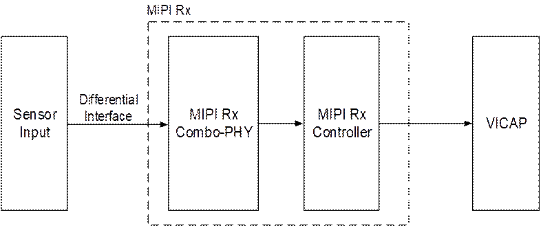

### 特点

<strong><big>说明</big></strong>

以下章节会多次出现Lane、Link、通道的概念。

- Lane指差分数据对，MIPI\_Rx最多有8条Lane。
- Link指Lane的分组，每个分组中包含4条Lane，MIPI\_Rx有2个Link。
- 通道指MIPI\_Rx内部的数据处理通道，对应连接到VICAP通道，每个通道单独处理一个Sensor的数据。

MIPI Rx有以下特点：

- 支持MIPI DPHY-ver1.2
- 可同时支持4路sensor输入
- 单路最多支持8-Lane MIPI D-PHY接口，最大支持2.5Gbps/Lane
- 单路最多支持8-Lane LVDS/ sub-LVDS /HiSPi接口，最大支持1.5Gbps/Lane
- 支持RAW8/ RAW10/ RAW12/ RAW14/ RAW16数据类型的解析
- 支持YUV420 8-bit legacy/ YUV420 8-bit non-legacy/ YUV422 8-bit/ 数据类型的解析,支持最大4路YUV virtual channel
- 最多支持3帧WDR，支持多种WDR时序
- 支持LVDS/HiSPi模式像素/同步码大小端配置
- 支持Lane数和Lane顺序可配置

### 功能描述

#### 典型应用

MIPI Rx是一个支持多种差分视频输入接口的采集单元，主要功能是接口时序的转换。通过不同的功能配置，MIPI Rx可以接收MIPI/LVDS/sub-LVDS/HiSPi接口的数据，并且支持多种速度和分辨率的传输需求，兼容多种图像传感器。

MIPI Rx包括2个D-PHY，每个PHY都有2对差分随路时钟，4对数据，每对时钟对应2对数据。因此MIPI Rx可以同时支持1~4路sensor输入。连接关系如表11-6所示。

MIPI Rx 对接场景分类

|  |  |  |  |  |
| --- | --- | --- | --- | --- |
| Mode | PHY0 | | PHY1 | |
| 0 | Sensor0(phy0clk0+lane0~lane7) | | | |
| 7 | Sensor0(phy0clk0+lane0~3) | | Sensor1(phy1clk0+lane4~7) | |
| 10 | Sensor0(phy0clk0+lane0~3) | | Sensor1(phy1clk0+lane4/6) | Sensor2(phy1clk1+lane5/7) |
| 11 | Sensor0(phy0clk0+lane0/2) | Sensor1(phy0clk1+lane1/3) | Sensor2(phy1clk0+lane4/6) | Sensor3(phy1clk1+lane5/7) |

- 当采用Mode0时，最大支持8Lane输入。

Sensor0的时钟对接到PHY0，该时钟会共享给PHY1。

- 当采用Mode7时，最大支持4Lane + 4Lane输入。
- Sensor0的时钟对接到PHY0的CLK0。
- Sensor1的时钟对接到PHY1的CLK0。
- 当采用Mode10时，最大支持4Lane + 2Lane + 2Lane输入。
- Sensor0的时钟对接到PHY0的CLK0。
- Sensor1的时钟对接到PHY1的CLK0。
- Sensor2的时钟对接到PHY1的CLK1。
- 当采用Mode11时，最大支持2Lane + 2Lane + 2Lane + 2Lane输入。
- Sensor0的时钟对接到PHY0的CLK0。
- Sensor1的时钟对接到PHY0的CLK1。
- Sensor2的时钟对接到PHY1的CLK0。
- Sensor3的时钟对接到PHY1的CLK1。

不同模式下，时钟的接法不同，时钟的共享方式也不同，可以通过寄存器配置时钟的来源与共享方式。

<strong><big>说明</big></strong>

MIPI/LVDS支持Lane数和Lane顺序可配置，但有一定的限制，Lane的乱序只能限制在同一个sensor的同一个PHY中，即不可在sensor之间乱序，也不可在同一个sensor的不同PHY之间乱序。

例如：对于Mode7中4Lane+4Lane的输入模式，sensor0与sensor1之间不可乱序，也不可在sensor0的两个PHY之间乱序（同sensor1）。乱序仅仅可发生在PHY0的Lane之间，或者PHY1的Lane之间（同sensor1）；对于Mode11中2Lane + 2Lane +2Lane + 2Lane的输入模式，乱序仅仅可发生在同一个sensor所涉及的Lane中，即PHY1的第0和2个Lane之间可以乱序，不可与其他的Lane之间乱序。

MIPI Rx支持的接口类型如表11-7所示。

MIPI Rx支持的接口类型

| Interface Type | Common mode voltage | Differential mode voltage | Maximum clock frequency | Maximum data rate per lane |
| --- | --- | --- | --- | --- |
| MIPI D-PHY | 200mV | 200mV | 1250MHz | 2.5Gbps |
| sub-LVDS | 900mV | 150mV | 750MHz | 1.5Gbps |
| LVDS | 1.25V | 350mV | 750MHz | 1.5Gbps |
| HiSPi(HiVCM) | 900mV | 280mV | 750MHz | 1.5Gbps |
| HiSPi(SLVS) | 200mV | 200mV | 750MHz | 1.5Gbps |

MIPI Rx只完成接口的时序转换，不处理图像的数据格式。在满足带宽的前提下可以支持任意分辨率和帧率。MIPI Rx的带宽有两部分限制：combo-PHY的接口数据率和内部处理速度。两路sensor输入都是接口最大支持2.5Gbps/Lane，内部处理速度最大600M\*2pixels/s。

<strong><big>说明</big></strong>

Combo-PHY 支持的最大速率为2.5Gbps/Lane，总共支持8 Lane同时传输。对于mipi\_rx控制器的来说，通道的最大工作时钟为600MHz。当配置为一拍一像素时最大通道带宽为600Mpixels/s，当配置为一拍双像素时最大通道带宽为1200Mpixels/s。

#### 功能原理

#### MIPI接口数据格式

MIPI规范由不同的工作组负责开发和维护，涵盖了不同的应用需求，分别面向不同领域的应用。MIPI Rx支持D-PHY和CSI-2（Camera Serial Interface）。D-PHY规定了物理层传输规范，CSI-2规定了Camera输出数据包的格式和协议。

- D-PHY

D-PHY是MIPI联盟发布的高速物理层标准，规定了主机和外设的物理层的物理特性及传输协议。D-PHY采用200mV源同步的低压差分信令技术，每个Lane的数据率范围为80~2500Mbps。D-PHY可以工作在低功耗（Low Power, LP）和高速（High Speed, HS）两种模式下。当传输速率介于1500Mbps~2500Mbps之间时，D-PHY支持相位自动校准功能。

- CSI-2

CSI-2是针对*录像机*的数据协议，规定了主机与外设通信的数据包格式。

CSI-2可以支持不同像素格式的图像应用，数据传输的最小粒度是字节。为增加CSI-2性能，可以选择数据Lane的数量，CSI-2协议规定了发送端将像素数据打包成字节的机制，并指明多个数据Lane分配和管理的方式。字节数据以数据包的形式组织，数据包在SoT和EoT之间传输。接收端根据协议解析相应的数据包，恢复出原始的像素数据。

MIPI Rx支持RAW8/RAW10/RAW12/RAW14/RAW16格式的像素数据解析。支持YUV420 8-bit/YUV422 8-bit/数据类型的解析。

CSI-2的数据包分为长包和短包两种，包含有校验码，能进行误码纠正和错误检测。

长包和短包都是在SoT和EoT之间传输，在数据传送的间隙，D-PHY处于LP模式。CSI-2数据包的传输机制如图11-21所示。PH和PF分别表示Packet Header和Packet Footer。

CSI-2数据包的传输机制

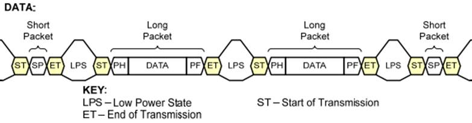

长包用于传输有效像素数据，分为五部分：Data ID, Word Count, ECC, PAYLOAD, Checksum。

Data ID包含Virtual Channel和Data Type。Virtual Channel控制传输所用的通道，可以指定通道的复用，让不同的通道传输不同的数据。Data Type指定数据的类型。

Word Count指示接收端需要接收到的数据量。

ECC是8位纠错码，可以纠正或检测Data Type和Word Count的误码。

Payload Data是需要传输的像素数据。

Checksum是利用线性反馈移位寄存器产生的校验和，用于Payload数据的校验。

长包的结构如图11-22所示。

CSI-2长包的格式

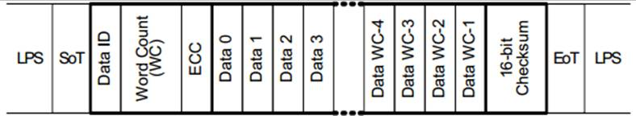

短包的作用是传输同步信息，包含Data ID, Word Count和 ECC三部分。其格式如图11-23所示。

CSI-2短包的格式

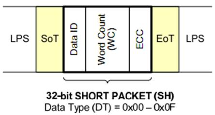

#### MIPI接口线性模式

MIPI接口的线性模式视频传输格式如图11-24所示。Frame Start(FS)表示帧起始，Frame End(FE)表示帧结束。每一行的数据包头是32-bit，包含当前行的Virtual Channel和Data Type等信息。

MIPI接口图像格式

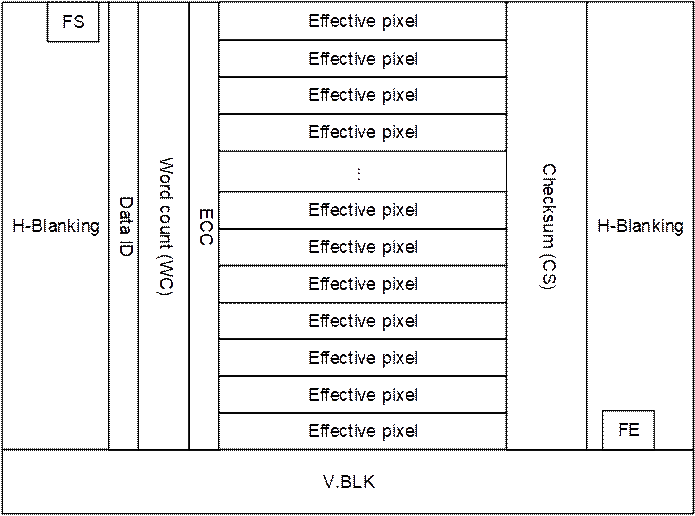

#### MIPI接口宽动态模式

MIPI Rx支持3种MIPI接口的宽动态（WDR）模式，分别为：

MIPI宽动态模式1：使用VC（Virtual Channel）区分长/短曝光数据。

MIPI宽动态模式2：使用DT（Data Type）区分长/短曝光数据。

MIPI宽动态模式3：DOL宽动态传输格式。

使用VC的WDR传输方式如图11-25所示，FS/FE短包和数据长包里都包含有VC信息。MIPI Rx控制器根据短包/长包里的VC值检测出长/短曝光数据，并把每一行数据都加上2-bit信号标识，伴随DC时序输出到VICAP，在VICAP内实现解复用。

MIPI接口宽动态数据传输（使用VC）

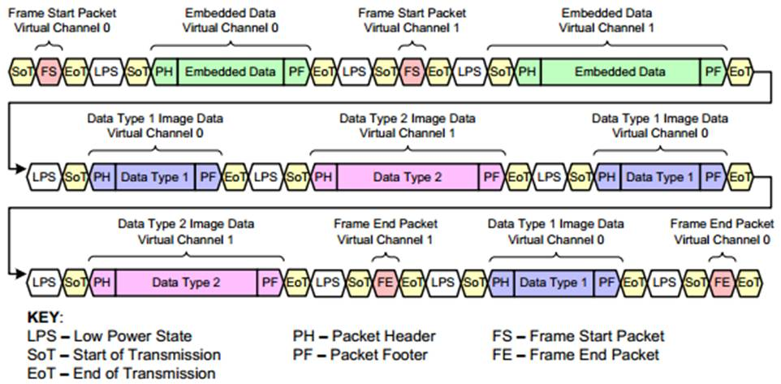

使用DT的WDR传输方式如图11-26所示，不同曝光长度的同一帧共用一组FS/FE短包，长包的包头有DT信息。DT0和DT1的RAW DATA位宽可以不同。MIPI Rx控制器根据DT值区分出长/短曝光数据，并把每一行数据都加上2-bit信号标识，伴随DC时序输出到VICAP，在VICAP内实现解复用。

MIPI接口宽动态数据传输（使用DT）

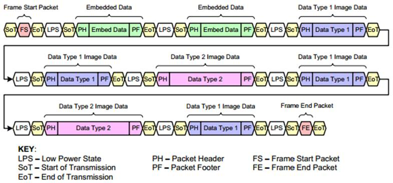

MIPI DOL宽动态传输格式如图11-27所示。长短曝光数据共用一组FS/FE短包，每行起始的4个像素点作为识别码（Identification Code）用于区分长/短曝光的数据。

MIPI DOL数据传输

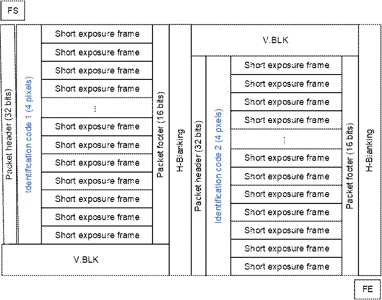

<strong><big>说明</big></strong>

图像传感器有两种宽动态模式，帧模式与行模式。帧模式的宽动态在时序和数据格式上与线性模式相同，这里的介绍的宽动态都是针对行模式。

#### LVDS接口数据格式

低电压差分信号LVDS（Low-Voltage Differential Signal）普遍应用于前端*录像机*。通过同步码区分消隐区和有效区的数据。

<strong><big>说明</big></strong>

LVDS只约束了电气传输规范，没有时序和数据格式方面的标准协议。sub-LVDS是一种超低压摆幅的差分信号技术，共模/差模电压比LVDS更低，更适合图像传感器的应用。可以把sub-LVDS看作是LVDS的一种，在此统称为LVDS。

MIPI Rx的combo-PHY将差分串行数据转换为并行数据，MIPI Rx控制器把并行数据拆分、拼接，然后提取同步码、解析出像素数据。

在LVDS传输模式中，行场同步信号集成在数据流中，在数据流中的特殊码型SOF和EOF分别表示帧的起始和结束，SOL和EOL分别表示行的起始和结束。在数据流中，SOF/EOF/SOL/EOL由4个字段构成，每个字段的位宽与像素数据保持一致，前3个字段为固定的基准码字，根据第4个字段来区分帧/行的起始或结束。LVDS同步码格式如表11-8所示。

LVDS同步码格式

| Field | Bit Width | Sync code | | | |
| --- | --- | --- | --- | --- | --- |
| SOL/SAV (Valid line) | EOL/EAV (Valid line) | SOF/SAV (Invalid line) | EOF/EAV (Invalid line) |
| 1st code | 8bit | FFh | FFh | FFh | FFh |
| 10bit | 3FFh | 3FFh | 3FFh | 3FFh |
| 12bit | FFFh | FFFh | FFFh | FFFh |
| 14bit | 3FFFh | 3FFFh | 3FFFh | 3FFFh |
| 16bit | FFFFh | FFFFh | FFFFh | FFFFh |
| 2nd code | 8bit | 00h | 00h | 00h | 00h |
| 10bit | 000h | 000h | 000h | 000h |
| 12bit | 000h | 000h | 000h | 000h |
| 14bit | 0000h | 0000h | 0000h | 0000h |
| 16bit | 0000h | 0000h | 0000h | 0000h |
| 3rd code | 8bit | 00h | 00h | 00h | 00h |
| 10bit | 000h | 000h | 000h | 000h |
| 12bit | 000h | 000h | 000h | 000h |
| 14bit | 0000h | 0000h | 0000h | 0000h |
| 16bit | 0000h | 0000h | 0000h | 0000h |
| 4th code | 8bit | XXh | XXh | XXh | XXh |
| 10bit | XXXh | XXXh | XXXh | XXXh |
| 12bit | XXXh | XXXh | XXXh | XXXh |
| 14bit | XXXXh | XXXXh | XXXXh | XXXXh |
| 16bit | XXXXh | XXXXh | XXXXh | XXXXh |

<strong><big>说明</big></strong>

同步码前三个字段固定，第4个字段标识行场的起始或结束。第4个字段的值由图像传感器厂商确定，不同的厂商会使用不同的数值。表11-9是其中一种实现方式。

LVDS同步码第4个字段举例

| Field | Bit Width | Sync code | | | |
| --- | --- | --- | --- | --- | --- |
| SAV(Valid line) | EAV(Valid line) | SAV(Invalid line) | EAV(Invalid line) |
| 4th code | 8bit | 80h | 9Dh | ABh | B6h |
| 10bit | 200h | 274h | 2ACh | 2D8h |
| 12bit | 800h | 9D0h | AB0h | B60h |
| 14bit | 2000h | 2740h | 2AC0h | 2D80h |
| 16bit | 8000h | 9D00h | AB00h | B600h |

以4个Lane为例，LVDS同步码和像素数据在各个Lane上传输方式如图11-28所示，图中H表示同步码，P表示像素，H和P的位宽与图像传感器输出单个像素的位宽一致。各个数据通道首先传输4个像素位宽的同步码，紧接着是像素数据，像素数据的分布与通道数有关。

LVDS同步码和图像传输模式

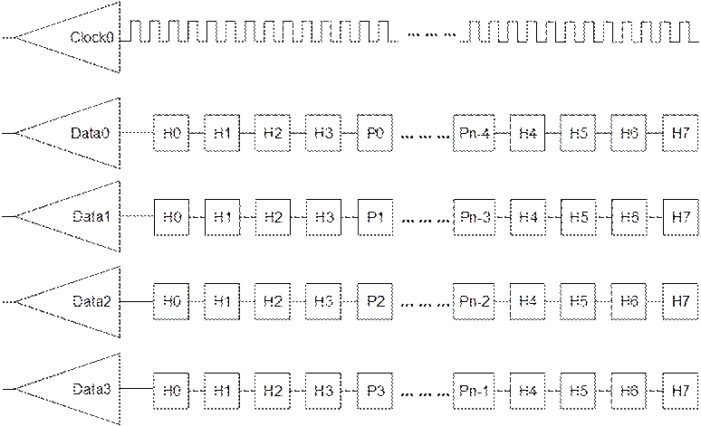

同步码和像素数据的传输是串行的，MIPI Rx支持数据的大小端可配置。以RAW12、大端模式为例，图像传感器输出单个像素点的时序如图11-29所示。

LVDS单个像素点时序

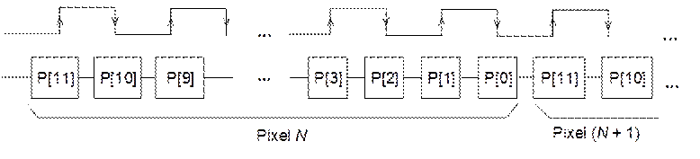

#### LVDS接口线性模式

LVDS有两种同步方式，其中一种用SAV(Invalid)和EAV(Invalid)标识消隐区的无效数据，使用SAV(Valid)和EAV(Valid)标识有效区像素数据，这种同步方式如图11-30所示。

LVDS同步方式1

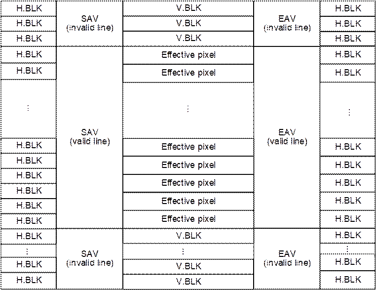

另一种同步方式用SOF标识有效区的第一行起始，用EOF标识有效区最后一行的结束，其他有效区分别用SOL和EOL作为起始和结束，这种同步方式如图11-31所示。

LVDS同步方式2

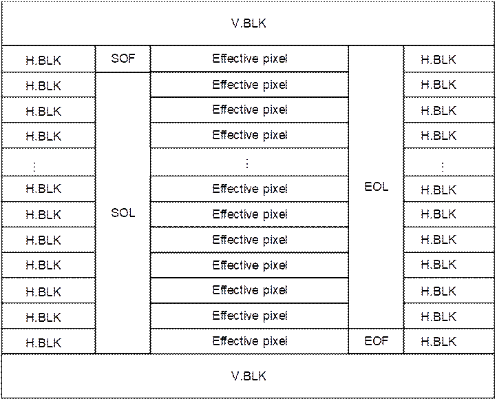

#### LVDS接口宽动态模式

MIPI Rx支持3种LVDS的宽动态传输模式，分别为：

LVDS 宽动态模式1：SOF-EOF标识，长短曝光帧有独立的同步码。

LVDS 宽动态模式2：SAV-EAV标识，DOL模式，四个字段的同步码，长短曝光帧有独立的同步码。

LVDS 宽动态模式3：SAV-EAV标识，DOL模式，五个字段的同步码，长短曝光帧有独立的同步码。

MIPI Rx根据不同的模式配置，将接收到的同步码的值与寄存器中的预设值比对，从而区分出接收到的图像属于长/短曝光并以特定的方式将其标识出，在VICAP内实现解复用。

LVDS 宽动态模式1如图11-32所示。长/短曝光视频数据同步码的码型不同，利用同步码区分不同曝光长度的数据。

LVDS 宽动态模式1（2帧）

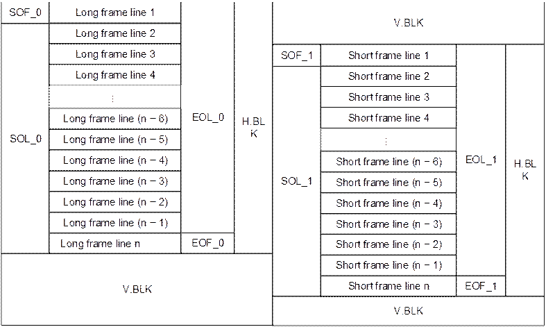

LVDS 宽动态模式2如图11-33所示。使用SAV-EAV作为同步方式，长短曝光有独立的同步码，第N帧和第N+1帧的同步码也不同。

LVDS 宽动态模式3与模式2基本相同，区别仅仅在于模式3的同步码为5个字段。

LVDS 宽动态模式2（2帧）

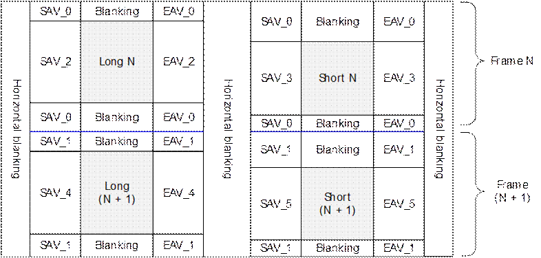

#### HiSPi接口数据格式

High-Speed Serial Pixel (HiSPi)协议包括两部分：HiSPi物理层协议和HiSPi规范。HiSPi物理层协议中规定了电气特性和时序等参数，HiSPi规范中规定了数据的打包方式。

HiSPi规范中包含两种物理层电气标准和四种不同的数据传输方式。电气标准分别为：HiVCM和SLVS；数据传输方式分别为：Packetized-SP、Streaming-SP、Streaming-S和ActiveStart-SP8。

MIPI Rx同时支持HiVCM和SLVS电气标准，支持Packetized-SP、ActiveStart-SP8和Streaming-SP数据传输方式。

#### HiSPi接口线性模式

Packetized-SP模式下，图像传感器用SOF标识图像有效区的第一行起始，用EOF标识有效区最后一行的结束，其他有效区分别用SOL和EOL作为起始和结束。这种同步方式与图11-31类似，区别在于Packetized-SP模式的数据包内可以添加CRC和FLR。其数据格式如图11-34所示。

MIPI Rx可以校验SOF-EOF、SOL-EOL的配对是否正常，但不处理CRC和FLR数据。

HiSPi Packetized-SP数据格式

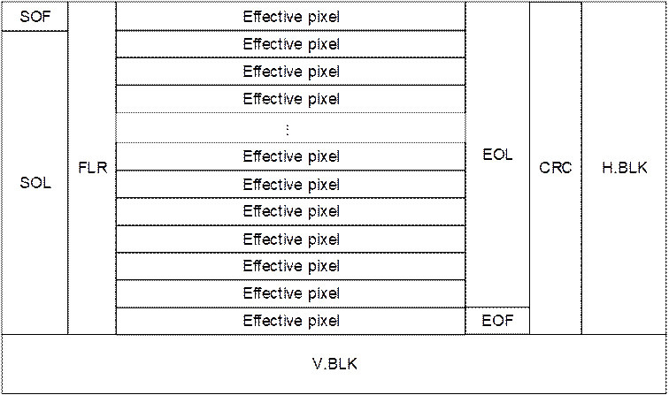

HiSPi另外2种模式（Streaming-SP, ActiveStart-SP8）的传输方式与Packetized-SP类似，区别在于同步码的标定方式不同。他们之间的区别如表11-10所示。其中，SOF和EOF分别表示图像有效区的帧起始和帧结束；SOL和EOL分别表示图像有效区的行起始和行结束；SAV表示图像消隐区的行起始。

HiSPi传输模式

| 同步码 | Packetized-SP | Streaming-SP | ActiveStart-SP8 |
| --- | --- | --- | --- |
| SOF | Required | Required | Required |
| SOL | Required | Required | Required |
| EOF | Required | Unsupported | Unsupported |
| EOL | Required | Unsupported | Unsupported |
| SAV | Unsupported | Required | Unsupported |

MIPI Rx可以支持以上3种模式，同时支持所有通道都传输4个字段的同步码（如图11-28）。

#### HiSPi接口宽动态模式

HiSPi接口宽动态模式的同步码与线性模式相同，长曝光与短曝光数据之间是消隐区。短曝光的起始几行不是有效像素区，而是以固定值填充。HiSPi接口宽动态模式的时序如所示。

HiSPi 宽动态模式

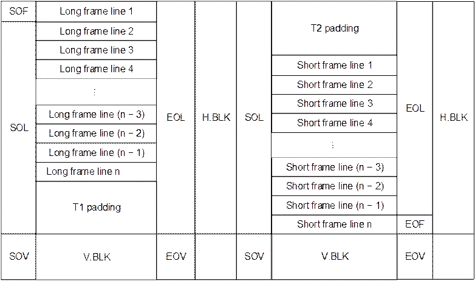

### MIPI Rx控制器工作方式

MIPI Rx控制器支持MIPI、LVDS和HiSPi模式，每种模式下的软件配置包含两部分：控制器和combo-PHY。

#### MIPI模式配置流程

MIPI模式下需要配置PHY的工作模式、数据传输所用的通道数、数据类型及宽动态模式。MIPI模式的帧/行同步信息包含于数据包中，由控制器完成数据包的解析，从而恢复出像素数据。MIPI模式软件操作流程如下。

上电启动。

根据使用场景将MIPI\_RX\_CFG寄存器中相应通道的mipi\_work\_mode配置为MIPI模式。

配置CRG寄存器中的PERI\_CRG8528，打开mipi\_bus\_clken、mipi\_cil\_clken以及对应通道的mipi\_pix\_clken。配置mipi总线软复位，撤销复位；配置对应通道pix\_core复位，撤销复位。

配置CRG寄存器中的PERI\_CRG8464~PERI\_CRG8488，配置sensor复位，撤销复位；打开sensor时钟门控，并配置时钟频率。

配置CRG寄存器中的PERI\_CRG9305~PERI\_CRG9329，选择MIPI\_Rx通道时钟频率。

配置MIPI\_Rx的Lane数（MIPI\_LANES\_NUM）和Lane ID (LANE\_ID\*\_CHN\*)。

配置接收数据类型、WDR模式等。

配置PHY的工作模式（PHY\_MODE\_LINK\*）、PHY通道延迟调节（PHY\_SKEW\_LINK\*）、PHY通道使能（PHY\_EN\_LINK\*）、PHY均衡调节（PHY\_EQ\_LINK\*）、PHY性能调节（PHY\_CFG\_LINK\*）。

配置系统控制寄存器。场景模式选择（HS\_MODE\_SELECT）、PHY\_EN、LANE\_EN，打开PHY\_CIL\_CTRL、选择PHYCFG\_MODE（对于MIPI模式，应选择0或者4）。

配置对应的PHYCFG\_EN。

配置sensor序列。

----结束

#### LVDS和HiSPi模式配置流程

LVDS/HiSPi模式下需要配置RAW DATA类型、数据大小端、同步方式、WDR类型和图像宽高等寄存器。LVDS模式依靠同步码识别帧/行同步信息，根据RAW DATA类型的不同，同步码可以为8/10/12/14/16-bit。

LVDS和HiSPi模式软件的操作流程如下。

上电启动。

根据使用场景将MIPI\_RX\_CFG寄存器中相应通道的mipi\_work\_mode配置为LVDS模式。

配置CRG寄存器中的PERI\_CRG8528，打开mipi\_bus\_clken、mipi\_cil\_clken以及对应通道的mipi\_pix\_clken。配置mipi总线软复位，撤销复位；配置对应通道pix\_core复位，撤销复位。

配置CRG寄存器中的PERI\_CRG8464~PERI\_CRG8488，配置sensor复位，撤销复位；打开sensor时钟门控，并配置时钟频率。

配置CRG寄存器中的PERI\_CRG9305~PERI\_CRG9329，选择MIP\_Rx通道时钟频率。

配置接收数据类型、WDR模式，图像宽高（LVDS模式下，配置的宽度是图像实际宽度除以Lane数-1）、同步头、Lane ID等信息。

配置PHY的工作模式（PHY\_MODE\_LINK\*）、PHY通道延迟调节（PHY\_SKEW\_LINK\*）、PHY通道使能（PHY\_EN\_LINK\*）、PHY均衡调节（PHY\_EQ\_LINK\*）、PHY性能调节（PHY\_CFG\_LINK\*）；配置LVDS模式Lane同步头信息（PHY\_SYNC\_CODE\*\_LINK\*）。

配置系统控制寄存器。场景模式选择（HS\_MODE\_SELECT）、PHY\_EN、LANE\_EN，打开PHY\_CIL\_CTRL、选择PHYCFG\_MODE（对于LVDS模式，应选择1）。

配置对应的PHYCFG\_EN。

配置sensor序列。

----结束

### MIPI Rx寄存器概览

MIPI Rx寄存器偏移地址中变量的取值范围和含义如表11-11所示。

MIPI Rx寄存器偏移地址变量表

| 变量名称 | 取值范围 | 描述 |
| --- | --- | --- |
| P | 0～1 | PHY序号 |
| N | 0～3 | 通道号 |
| M | 0～7 | Lane号  当N=0时，M取值：[0:7]  当N=1时，M取值：[0:1]  当N=2时，M取值：[0:3]  当N=3时，M取值：[0:1] |

MIPI Rx寄存器概览如表11-12所示。

MIPI Rx寄存器概览（基址：0x0\_173C\_0000）

| 偏移地址 | 名称 | 描述 | 页码 |
| --- | --- | --- | --- |
| 0x0000＋P×0x0200 | PHY\_MODE\_LINK(P) | Link(P) PHY工作模式寄存器 | 11-143 |
| 0x0004＋P×0x0200 | PHY\_SKEW\_LINK(P) | Link(P) PHY通道延迟调节寄存器 | 11-145 |
| 0x0008＋P×0x0200 | PHY\_LANE\_SI\_LINK(P) | Link(P) PHY通道LANE SI调节寄存器 | 11-146 |
| 0x000C＋P×0x0200 | PHY\_EN\_LINK(P) | Link(P) PHY通道使能寄存器 | 11-147 |
| 0x0018＋P×0x0200 | PHY\_DATA\_LINK(P) | Link(P) PHY输出的并行数据寄存器 | 11-148 |
| 0x001C＋P×0x0200 | PHY\_PH\_MIPI\_LINK(P) | Link(P) MIPI数据包头寄存器 | 11-148 |
| 0x0020＋P×0x0200 | PHY\_DATA\_MIPI\_LINK(P) | Link(P) MIPI模式数据寄存器 | 11-149 |
| 0x0024＋P×0x0200 | PHY\_SYNC\_DCT\_LINK(P) | Link(P) PHY LVDS模式同步头检测控制寄存器 | 11-149 |
| 0x0030＋P×0x0200 | PHY\_SYNC\_SOF0\_LINK(P) | Link(P) PHY LVDS模式Lane0同步头寄存器 | 11-151 |
| 0x0034＋P×0x0200 | PHY\_SYNC\_SOF1\_LINK(P) | Link(P) PHY LVDS模式Lane1同步头寄存器 | 11-151 |
| 0x0038＋P×0x0200 | PHY\_SYNC\_SOF2\_LINK(P) | Link(P) PHY LVDS模式Lane2同步头寄存器 | 11-152 |
| 0x003C＋P×0x0200 | PHY\_SYNC\_SOF3\_LINK(P) | Link(P) PHY LVDS模式Lane3同步头寄存器 | 11-152 |
| 0x0050＋P×0x0200 | PHY\_DESKEW\_CAL\_LINK(P) | Link(P) AUTO DESKEW控制寄存器 | 11-152 |
| 0x0150＋P×0x0200 | FREQ\_MEASURE(P) | Link(P) 时钟频率测量寄存器 | 11-153 |
| 0x01F0＋P×0x0200 | MIPI\_CIL\_INT\_RAW\_LINK(P) | Link(P) MIPI CIL原始中断状态寄存器 | 11-153 |
| 0x01F4＋P×0x0200 | MIPI\_CIL\_INT\_LINK(P) | Link(P) MIPI CIL中断状态寄存器 | 11-155 |
| 0x01F8＋P×0x0200 | MIPI\_CIL\_INT\_MSK\_LINK(P) | Link(P) MIPI CIL中断屏蔽寄存器 | 11-157 |
| 0x0800 | HS\_MODE\_SELECT | HS ID选择寄存器 | 11-159 |
| 0x0804 | D\_P\_SWAP | 差分信号的P/N端互换选择寄存器 | 11-159 |
| 0x0808 | PHY\_EN | PHY使能寄存器 | 11-161 |
| 0x080C | LANE\_EN | LANE\_EN使能寄存器 | 11-161 |
| 0x0810 | PHY\_CIL\_CTRL | PHY CIL控制寄存器 | 11-162 |
| 0x0818 | PHYCFG\_MODE | PHY配置模式寄存器 | 11-163 |
| 0x081C | PHYCFG\_EN | PHY配置使能寄存器 | 11-165 |
| 0x0820 | CHN0\_MEM\_CTRL | CHN0 MEMORY控制寄存器 | 11-165 |
| 0x0824 | CHN0\_CLR\_EN | CHN0强制置位使能寄存器 | 11-166 |
| 0x0828 | CHN1\_MEM\_CTRL | CHN1 MEMORY控制寄存器 | 11-166 |
| 0x082C | CHN1\_CLR\_EN | CHN1强制置位使能寄存器 | 11-166 |
| 0x0830 | CHN2\_MEM\_CTRL | CHN2 MEMORY控制寄存器 | 11-167 |
| 0x0834 | CHN2\_CLR\_EN | CHN2强制置位使能寄存器 | 11-167 |
| 0x0838 | CHN3\_MEM\_CTRL | CHN3 MEMORY控制寄存器 | 11-168 |
| 0x083C | CHN3\_CLR\_EN | CHN3强制置位使能寄存器 | 11-168 |
| 0x0880 | MIPI\_TEST\_PHY | BIST\_TEST\_PHY控制寄存器 | 11-169 |
| 0x0FF0 | MIPI\_INT\_RAW | MIPI系统原始中断状态寄存器 | 11-169 |
| 0x0FF4 | MIPI\_INT\_ST | MIPI系统中断状态寄存器 | 11-170 |
| 0x0FF8 | MIPI\_INT\_MSK | MIPI系统中断屏蔽寄存器 | 11-171 |
| 0x1020＋N×0x1000 | MIPI(N)\_CRC\_INTR\_RAW | MIPI(N) CSI原始中断状态寄存器 | 11-172 |
| 0x1024＋N×0x1000 | MIPI(N)\_CRC\_INTR\_ST | MIPI(N) CSI屏蔽后中断状态寄存器 | 11-175 |
| 0x1028＋N×0x1000 | MIPI(N)\_CRC\_INTR\_MSK | MIPI(N) CSI中断屏蔽寄存器 | 11-178 |
| 0x1100＋N×0x1000 | MIPI(N)\_USERDEF\_DT | MIPI(N)用户自定义data type  对应的像素位宽配置寄存器 | 11-180 |
| 0x1104＋N×0x1000 | MIPI(N)\_USER\_DEF | MIPI(N)用户自定义data type的类型使能配置寄存器 | 11-182 |
| 0x1108＋N×0x1000 | MIPI(N)\_CTRL\_MODE\_HS | MIPI(N)工作模式使能寄存器 | 11-183 |
| 0x1200＋N×0x1000 | MIPI(N)\_DOL\_ID\_CODE0 | MIPI(N) DOL模式帧识别0寄存器 | 11-183 |
| 0x1204＋N×0x1000 | MIPI(N)\_DOL\_ID\_CODE1 | MIPI(N) DOL模式帧识别1寄存器 | 11-184 |
| 0x1208＋N×0x1000 | MIPI(N)\_DOL\_ID\_CODE2 | MIPI(N) DOL模式帧识别2寄存器 | 11-184 |
| 0x1210＋N×0x1000 | MIPI(N)\_CROP\_START\_CHN0 | MIPI(N) CHN0 CROP宽高起始点寄存器 | 11-184 |
| 0x1214＋N×0x1000 | MIPI(N)\_CROP\_START\_CHN1 | MIPI(N) CHN1 CROP宽高起始点寄存器 | 11-184 |
| 0x1218＋N×0x1000 | MIPI(N)\_CROP\_START\_CHN2 | MIPI(N) CHN2 CROP宽高起始点寄存器 | 11-185 |
| 0x121C＋N×0x1000 | MIPI(N)\_CROP\_START\_CHN3 | MIPI(N) CHN3 CROP宽高起始点寄存器 | 11-185 |
| 0x1224＋N×0x1000 | MIPI(N)\_IMGSIZE | MIPI(N)图像宽高寄存器 | 11-185 |
| 0x1230＋N×0x1000 | MIPI(N)\_CTRL\_MODE\_PIXEL | MIPI(N)输出工作模式使能寄存器 | 11-186 |
| 0x1240＋N×0x1000 | MIPI(N)\_DUMMY\_PIX\_REG | MIPI(N) dummy行像素值寄存器 | 11-187 |
| 0x1250＋N×0x1000 | MIPI(N)\_IMGSIZE0\_STATIS | MIPI(N) VC0传输的图像宽高寄存器 | 11-187 |
| 0x1254＋N×0x1000 | MIPI(N)\_IMGSIZE1\_STATIS | MIPI(N) VC1传输的图像宽高寄存器 | 11-188 |
| 0x1258＋N×0x1000 | MIPI(N)\_IMGSIZE2\_STATIS | MIPI(N) VC2传输的图像宽高寄存器 | 11-188 |
| 0x125C＋N×0x1000 | MIPI(N)\_IMGSIZE3\_STATIS | MIPI(N) VC3传输的图像宽高寄存器 | 11-188 |
| 0x12F0＋N×0x1000 | MIPI(N)\_CTRL\_INT\_RAW | MIPI(N)读数据错误原始中断状态寄存器 | 11-189 |
| 0x12F4＋N×0x1000 | MIPI(N)\_CTRL\_INT | MIPI(N)读数据错误中断状态寄存器 | 11-190 |
| 0x12F8＋N×0x1000 | MIPI(N)\_CTRL\_INT\_MSK | MIPI(N)读数据错误中断屏蔽寄存器 | 11-191 |
| 0x1300＋N×0x1000 | LVDS(N)\_WDR | LVDS(N) WDR控制寄存器 | 11-191 |
| 0x1304＋N×0x1000 | LVDS(N)\_DOLSCD\_HBLK | LVDS(N) SCD控制寄存器 | 11-193 |
| 0x1308＋N×0x1000 | LVDS(N)\_CTRL | LVDS(N)控制寄存器 | 11-193 |
| 0x130C＋N×0x1000 | LVDS(N)\_IMGSIZE | LVDS(N)图像宽高寄存器 | 11-195 |
| 0x1310＋N×0x1000 | LVDS(N)\_CROP\_START0 | LVDS(N)第0帧裁剪寄存器 | 11-195 |
| 0x1314＋N×0x1000 | LVDS(N)\_CROP\_START1 | LVDS(N)第1帧裁剪寄存器 | 11-195 |
| 0x1318＋N×0x1000 | LVDS(N)\_CROP\_START2 | LVDS(N)第2帧裁剪寄存器 | 11-196 |
| 0x131C＋N×0x1000 | LVDS(N)\_CROP\_START3 | LVDS(N)第3帧裁剪寄存器 | 11-196 |
| 0x1320＋M×0x20＋N×0x1000 | LVDS(N)\_LANE(M)\_SOF\_01 | LVDS/HiSPi模式下，lane(M)帧起始同步码配置寄存器 | 11-196 |
| 0x1324＋M×0x20＋N×0x1000 | LVDS(N)\_LANE(M)\_SOF\_23 | LVDS/HiSPi模式下，lane(M)帧起始同步码配置寄存器 | 11-197 |
| 0x1328＋M×0x20＋N×0x1000 | LVDS(N)\_LANE(M)\_EOF\_01 | LVDS/HiSPi模式下，lane(M)帧结束同步码配置寄存器 | 11-197 |
| 0x132C＋M×0x20＋N×0x1000 | LVDS(N)\_LANE(M)\_EOF\_23 | LVDS/HiSPi模式下，lane(M)帧结束同步码配置寄存器 | 11-198 |
| 0x1330＋M×0x20＋N×0x1000 | LVDS(N)\_LANE(M)\_SOL\_01 | LVDS/HiSPi模式下，lane(M)行起始同步码配置寄存器 | 11-198 |
| 0x1334＋M×0x20＋N×0x1000 | LVDS(N)\_LANE(M)\_SOL\_23 | LVDS/HiSPi模式下，lane(M)行起始同步码配置寄存器 | 11-199 |
| 0x1338＋M×0x20＋N×0x1000 | LVDS(N)\_LANE(M)\_EOL\_01 | LVDS/HiSPi模式下，lane(M)行结束同步码配置寄存器 | 11-199 |
| 0x133C＋M×0x20＋N×0x1000 | LVDS(N)\_LANE(M)\_EOL\_23 | LVDS/HiSPi模式下，lane(M)行结束同步码配置寄存器 | 11-200 |
| 0x1520＋M×0x20＋N×0x1000 | LVDS(N)\_LANE(M)\_NXT\_SOF\_01 | LVDS/HiSPi模式下，第N+1帧lane(M)帧起始同步码配置寄存器 | 11-200 |
| 0x1524＋M×0x20＋N×0x1000 | LVDS(N)\_LANE(M)\_NXT\_SOF\_23 | LVDS/HiSPi模式下，第N+1帧lane(M)帧起始同步码配置寄存器 | 11-201 |
| 0x1528＋M×0x20＋N×0x1000 | LVDS(N)\_LANE(M)\_NXT\_EOF\_01 | LVDS/HiSPi模式下，第N+1帧lane(M)帧结束同步码配置寄存器 | 11-201 |
| 0x152C＋M×0x20＋N×0x1000 | LVDS(N)\_LANE(M)\_NXT\_EOF\_23 | LVDS/HiSPi模式下，第N+1帧lane(M)帧结束同步码配置寄存器 | 11-202 |
| 0x1530＋M×0x20＋N×0x1000 | LVDS(N)\_LANE(M)\_NXT\_SOL\_01 | LVDS/HiSPi模式下，第N+1帧lane(M)行起始同步码配置寄存器 | 11-202 |
| 0x1534＋M×0x20＋N×0x1000 | LVDS(N)\_LANE(M)\_NXT\_SOL\_23 | LVDS/HiSPi模式下，第N+1帧lane(M)行起始同步码配置寄存器 | 11-203 |
| 0x1538＋M×0x20＋N×0x1000 | LVDS(N)\_LANE(M)\_NXT\_EOL\_01 | LVDS/HiSPi模式下，第N+1帧lane(M)行结束同步码配置寄存器 | 11-203 |
| 0x153C＋M×0x20＋N×0x1000 | LVDS(N)\_LANE(M)\_NXT\_EOL\_23 | LVDS/HiSPi模式下，第N+1帧lane(M)行结束同步码配置寄存器 | 11-204 |
| 0x1720＋N×0x1000 | LVDS(N)\_LI\_WORD0 | LVDS DOL模式第0帧LI寄存器 | 11-204 |
| 0x1724＋N×0x1000 | LVDS(N)\_LI\_WORD1 | LVDS DOL模式第1帧LI寄存器 | 11-204 |
| 0x1728＋N×0x1000 | LVDS(N)\_LI\_WORD2 | LVDS DOL模式第2帧LI寄存器 | 11-205 |
| 0x172C＋N×0x1000 | LVDS(N)\_LI\_WORD3 | LVDS DOL模式第3帧LI寄存器 | 11-205 |
| 0x1780＋N×0x1000 | LVDS(N)\_IMGSIZE0\_STATIS | LVDS LEF图像宽高统计寄存器 | 11-205 |
| 0x1784＋N×0x1000 | LVDS(N)\_IMGSIZE1\_STATIS | LVDS SEF1图像宽高统计寄存器 | 11-206 |
| 0x1788＋N×0x1000 | LVDS(N)\_IMGSIZE2\_STATIS | LVDS SEF2图像宽高统计寄存器 | 11-206 |
| 0x178C＋N×0x1000 | LVDS(N)\_IMGSIZE3\_STATIS | LVDS SEF3图像宽高统计寄存器 | 11-206 |
| 0x17A0＋N×0x1000 | LVDS(N)\_OUTPUT\_PIX\_NUM | LVDS输出像素位宽选择寄存器 | 11-207 |
| 0x17A4＋N×0x1000 | LVDS(N)\_16to14\_EN | LVDS 16bit转14bit时序使能寄存器 | 11-207 |
| 0x17F0＋N×0x1000 | LVDS(N)\_CTRL\_INT\_RAW | LVDS读数据原始中断状态寄存器 | 11-207 |
| 0x17F4＋N×0x1000 | LVDS(N)\_CTRL\_INT | LVDS读数据中断状态寄存器 | 11-209 |
| 0x17F8＋N×0x1000 | LVDS(N)\_CTRL\_INT\_MSK | LVDS读数据中断屏蔽寄存器 | 11-211 |
| 0x1800＋N×0x1000 | LANE\_ID0\_CHN(N) | LANE优先级配置寄存器0 | 11-213 |
| 0x1804＋N×0x1000 | LANE\_ID1\_CHN(N) | LANE优先级配置寄存器1 | 11-213 |
| 0x18F0＋N×0x1000 | ALIGN(N)\_INT\_RAW | MIPI\_ALIGN原始中断状态寄存器 | 11-214 |
| 0x18F4＋N×0x1000 | ALIGN(N)\_INT | MIPI\_ALIGN中断状态寄存器 | 11-215 |
| 0x18F8＋N×0x1000 | ALIGN(N)\_INT\_MSK | MIPI\_ALIGN中断屏蔽寄存器 | 11-216 |
| 0x1FF0＋N×0x1000 | CHN(N)\_INT\_RAW | 通道(N)原始中断状态寄存器 | 11-218 |
| 0x1FF4＋N×0x1000 | CHN(N)\_INT | 通道(N)中断状态寄存器 | 11-218 |
| 0x1FF8＋N×0x1000 | CHN(N)\_INT\_MASK | 通道(N)中断屏蔽寄存器 | 11-219 |

### MIPI Rx寄存器描述

#### PHY\_MODE\_LINK(P)

PHY\_MODE\_LINK(P)为Link(P) PHY工作模式寄存器。

Offset Address: 0x0000＋P×0x0200 Total Reset Value: 0x0003\_0000

| Bits | Access | Name | Description | Reset |
| --- | --- | --- | --- | --- |
| [31:26] | - | reserved | 保留。 | 0x00 |
| [25] | RW | phy\_rg\_mipi\_mode2 | 第二路MIPI/LVDS 输入模式选择。当PHY工作于LVDS模式且Common voltage 大于等于1.2V时设置为0。  0：Common voltage在1.2V以上；  1：Common voltage在1.2V或以下。 | 0x0 |
| [24] | RW | phy\_rg\_mipi\_mode | 第一路MIPI/LVDS 输入模式选择。当PHY工作于LVDS模式且Common voltage 大于等于1.2V时设置为0。  0：Common voltage在1.2V以上；  1：Common voltage在1.2V或以下。 | 0x0 |
| [23:18] | - | reserved | 保留。 | 0x00 |
| [17] | RW | phy\_rg\_drveclk2\_enz | 外部时钟cloclk2源。  0：使用外部时钟源；  1：不使用外部时钟源。 | 0x1 |
| [16] | RW | phy\_rg\_drveclk\_enz | 外部时钟cloclk源。  0：使用外部时钟源；  1：不使用外部时钟源。 | 0x1 |
| [15] | RO | reserved | 保留。 | 0x0 |
| [14] | RW | phy\_rg\_ext\_en | MIPI 8L 应用场景使能，CLKP/N源于LINK0。  0：禁止；  1：使能。 | 0x0 |
| [13] | RW | phy\_rg\_ext2\_en | MIPI 4L 应用场景使能，CLKP/N源于LINK0/LINK2。  0：禁止；  1：使能。 | 0x0 |
| [12] | RW | phy\_rg\_int\_en | MIPI 2L 应用场景使能，CLKP/N源于每个LINK自身  0：禁止；  1：使能。 | 0x0 |
| [11] | RW | phy\_rg\_da\_en\_cmos\_tx | CMOS模式输出使能。  0：禁止；  1：使能。 | 0x0 |
| [10] | RW | phy\_rg\_en\_mipi2lcmos1\_swap | clk0/d0/d2工作在CMOS模式使能。  0：禁止；  1：使能。 | 0x0 |
| [9] | RW | phy\_rg\_en\_mipi2lcmos | clk2/d1/d3工作在CMOS模式使能。  0：禁止；  1：使能。 | 0x0 |
| [8] | RW | phy\_rg\_en\_cmos | 各个lane都工作在CMOS模式使能。  0：禁止；  1：使能。 | 0x0 |
| [7:6] | - | reserved | 保留。 | 0x0 |
| [5] | RW | phy\_rg\_en\_clk2 | Clock1 Lane使能。  0：禁止；  1：使能。 | 0x0 |
| [4] | RW | phy\_rg\_en\_clk | Clock0 Lane使能。  0：禁止；  1：使能。 | 0x0 |
| [3:0] | RW | phy\_rg\_en\_d | Data Lane使能。  0：禁止；  1：使能。 | 0x0 |

#### PHY\_SKEW\_LINK(P)

PHY\_SKEW\_LINK(P)为Link(P) PHY通道延迟调节寄存器。

Offset Address: 0x0004＋P×0x0200 Total Reset Value: 0x0000\_0000

| Bits | Access | Name | Description | Reset |
| --- | --- | --- | --- | --- |
| [31:24] | - | reserved | 保留。 | 0x00 |
| [23:20] | RW | phy\_rg\_ah\_ds | Lane3~0 延迟自动设置，手动调整clock与data skew控制，搭配RG\_AADH\_DS使用。   - 设置RG\_AH\_DS=1且RG\_AADH\_DS=1时，进入手动调整deskew模式； - 设置RG\_AH\_DS=1且RG\_AADH\_DS=0时，进入工程测试模式。 | 0x0 |
| [19:16] | RW | phy\_rg\_adv12 | 当进入工程测试模式使用  0：clock向右移动一阶相位差；  1：clock向右移动二阶相位差。 | 0x0 |
| [15:12] | RW | phy\_rg\_aadh\_ds | 搭配RG\_AH\_DS使用，设定参考RG\_AH\_DS说明  [3:0]分别表示四个data lane。 | 0x0 |
| [11:8] | RW | phy\_rg\_dirbi | Lane3~0 用户设定延迟方向。  0：时钟相位向右移动；  1：数据相位向右移动。 | 0x0 |
| [7:4] | RW | phy\_rg\_deskew | Lane3~0 自动调整相位机制模式，采样窗口控制  0：采样窗口为3级延迟(约80ps)；  1：采样窗口为4级延迟(约108ps)。 | 0x0 |
| [3:0] | RO | reserved | 保留。 | 0x0 |

#### PHY\_LANE\_SI\_LINK(P)

PHY\_LANE\_SI\_LINK(P)为Link(P) PHY通道LANE SI调节寄存器。

Offset Address: 0x0008＋P×0x0200 Total Reset Value: 0x0000\_0000

|  |  |  |  |  |
| --- | --- | --- | --- | --- |
| Bits | Access | Name | Description | Reset |
| [31:24] | RW | phy\_rg\_lane3\_si | Lane3数据延迟设置。 | 0x00 |
| [23:16] | RW | phy\_rg\_lane2\_si | Lane2数据延迟设置。 | 0x00 |
| [15:8] | RW | phy\_rg\_lane1\_si | Lane1数据延迟设置。 | 0x00 |
| [7:0] | RW | phy\_rg\_lane0\_si | Lane0数据延迟设置。 | 0x00 |

#### PHY\_EN\_LINK(P)

PHY\_EN\_LINK(P)为Link(P) PHY通道使能寄存器。

Offset Address: 0x000C＋P×0x0200 Total Reset Value: 0x0000\_00F0

| Bits | Access | Name | Description | Reset |
| --- | --- | --- | --- | --- |
| [31:14] | - | reserved | 保留。 | 0x00000 |
| [13] | RW | phy\_clk1\_term\_en | Clock1 Lane终接匹配阻抗使能。  0：关闭内部匹配电阻；  1：打开内部匹配电阻。 | 0x0 |
| [12] | RW | phy\_clk0\_term\_en | Clock0 Lane终接匹配阻抗使能。  0：关闭内部匹配电阻；  1：打开内部匹配电阻。 | 0x0 |
| [11] | RW | phy\_d3\_term\_en | Data lane3终接匹配阻抗使能。  0：关闭内部匹配电阻；  1：打开内部匹配电阻。 | 0x0 |
| [10] | RW | phy\_d2\_term\_en | Data lane2终接匹配阻抗使能。  0：关闭内部匹配电阻；  1：打开内部匹配电阻。 | 0x0 |
| [9] | RW | phy\_d1\_term\_en | Data lane1终接匹配阻抗使能。  0：关闭内部匹配电阻；  1：打开内部匹配电阻。 | 0x0 |
| [8] | RW | phy\_d0\_term\_en | Data lane0终接匹配阻抗使能。  0：关闭内部匹配电阻；  1：打开内部匹配电阻。 | 0x0 |
| [7:4] | RW | phy\_da\_d\_valid\_inv | Data valid控制使能，与phy\_da\_dx\_valid(x=0~3)配合使用。  0：关闭；  1：使能。 | 0xF |
| [3] | RW | phy\_da\_d3\_valid | Data lane3高速模式使能。  0：高速模式关闭；  1：高速模式使能。 | 0x0 |
| [2] | RW | phy\_da\_d2\_valid | Data lane2高速模式使能。  0：高速模式关闭；  1：高速模式使能。 | 0x0 |
| [1] | RW | phy\_da\_d1\_valid | Data lane1高速模式使能。  0：高速模式关闭；  1：高速模式使能。 | 0x0 |
| [0] | RW | phy\_da\_d0\_valid | Data lane0高速模式使能。  0：高速模式关闭；  1：高速模式使能。 | 0x0 |

#### PHY\_DATA\_LINK(P)

PHY\_DATA\_LINK(P)为Link(P) PHY输出的并行数据寄存器。

Offset Address: 0x0018＋P×0x0200 Total Reset Value: 0x0000\_0000

|  |  |  |  |  |
| --- | --- | --- | --- | --- |
| Bits | Access | Name | Description | Reset |
| [31:24] | RO | phy\_data3\_mipi | Data Lane3接收到的数据。 | 0x00 |
| [23:16] | RO | phy\_data2\_mipi | Data Lane2接收到的数据。 | 0x00 |
| [15:8] | RO | phy\_data1\_mipi | Data Lane1接收到的数据。 | 0x00 |
| [7:0] | RO | phy\_data0\_mipi | Data Lane0接收到的数据。 | 0x00 |

#### PHY\_PH\_MIPI\_LINK(P)

PHY\_PH\_MIPI\_LINK(P)为Link(P) MIPI数据包头寄存器。

Offset Address: 0x001C＋P×0x0200 Total Reset Value: 0x0000\_0000

|  |  |  |  |  |
| --- | --- | --- | --- | --- |
| Bits | Access | Name | Description | Reset |
| [31:24] | RO | phy\_ph3\_mipi | Data Lane3接收到的数据包头。 | 0x00 |
| [23:16] | RO | phy\_ph2\_mipi | Data Lane2接收到的数据包头。 | 0x00 |
| [15:8] | RO | phy\_ph1\_mipi | Data Lane1接收到的数据包头。 | 0x00 |
| [7:0] | RO | phy\_ph0\_mipi | Data Lane0接收到的数据包头。 | 0x00 |

#### PHY\_DATA\_MIPI\_LINK(P)

PHY\_DATA\_MIPI\_LINK(P)为Link(P) MIPI模式数据寄存器。

Offset Address: 0x0020＋P×0x0200 Total Reset Value: 0x0000\_0000

|  |  |  |  |  |
| --- | --- | --- | --- | --- |
| Bits | Access | Name | Description | Reset |
| [31:24] | RO | phy\_data3\_mipi\_hs | Data Lane3 MIPI格式的数据。 | 0x00 |
| [23:16] | RO | phy\_data2\_mipi\_hs | Data Lane2 MIPI格式的数据。 | 0x00 |
| [15:8] | RO | phy\_data1\_mipi\_hs | Data Lane1 MIPI格式的数据。 | 0x00 |
| [7:0] | RO | phy\_data0\_mipi\_hs | Data Lane0 MIPI格式的数据。 | 0x00 |

#### PHY\_SYNC\_DCT\_LINK(P)

PHY\_SYNC\_DCT\_LINK(P)为Link(P) PHY LVDS模式同步头检测控制寄存器。

Offset Address: 0x0024＋P×0x0200 Total Reset Value: 0x0010\_1101

| Bits | Access | Name | Description | Reset |
| --- | --- | --- | --- | --- |
| [31:26] | - | reserved | 保留。 | 0x00 |
| [25] | RW | cil\_sync\_det\_mode | LVDS/HiSPi 同步模式选择。  0：检测到SOF后一直有效；  1：同时检查SOF/EOF/SOL/EOL。 | 0x0 |
| [24] | - | reserved | 保留。 | 0x0 |
| [23:21] | - | reserved | 保留。 | 0x0 |
| [20] | RW | cil\_code\_big\_endian1 | LVDS/HiSPi模式下，传输的RAW data同步码(sync\_code)的串行比特位传输顺序1。  0：LSB，低比特先传，实际收到的同步码(sync\_code)串行数据顺序为bit0，bit1，…bit11；  1：MSB，高比特先传，实际收到的同步码(sync\_code)串行数据顺序为bit11，bit10，…bit0。 | 0x1 |
| [19] | - | reserved | 保留。 | 0x0 |
| [18:16] | - | reserved | 保留。 | 0x0 |
| [15] | - | reserved | 保留。 | 0x0 |
| [14:12] | RW | cil\_raw\_type1 | LVDS/HiSPi模式下，传输的RAW data type1。  001：Raw 8bit；  010：Raw 10bit；  011：Raw 12bit；  100：Raw 14bit；  101：Raw 16bit。 | 0x1 |
| [11:9] | - | reserved | 保留。 | 0x0 |
| [8] | RW | cil\_code\_big\_endian0 | LVDS/HiSPi模式下，传输的RAW data同步码(sync\_code)的串行比特位传输顺序0。  0：LSB，低比特先传，实际收到的同步码(sync\_code)串行数据顺序为bit0，bit1，…bit11；  1：MSB，高比特先传，实际收到的同步码(sync\_code)串行数据顺序为bit11，bit10，…bit0。 | 0x1 |
| [7] | - | reserved | 保留。 | 0x0 |
| [6:4] | - | reserved | 保留。 | 0x0 |
| [3] | - | reserved | 保留。 | 0x0 |
| [2:0] | RW | cil\_raw\_type0 | LVDS/HiSPi模式下，传输的RAW data type0。  001：Raw 8bit；  010：Raw 10bit；  011：Raw 12bit；  100：Raw 14bit；  101：Raw 16bit。  其他：保留。 | 0x1 |

#### PHY\_SYNC\_SOF0\_LINK(P)

PHY\_SYNC\_SOF0\_LINK(P)为Link(P) PHY LVDS模式Lane0同步头寄存器。

Offset Address: 0x0030＋P×0x0200 Total Reset Value: 0x0000\_0000

|  |  |  |  |  |
| --- | --- | --- | --- | --- |
| Bits | Access | Name | Description | Reset |
| [31:16] | RW | cil\_sof1\_word4\_0 | Lane0帧起始同步码(N+1 Frame)。 | 0x0000 |
| [15:0] | RW | cil\_sof0\_word4\_0 | Lane0帧起始同步码(N Frame)。 | 0x0000 |

#### PHY\_SYNC\_SOF1\_LINK(P)

PHY\_SYNC\_SOF1\_LINK(P)为Link(P) PHY LVDS模式Lane1同步头寄存器。

Offset Address: 0x0034＋P×0x0200 Total Reset Value: 0x0000\_0000

| Bits | Access | Name | Description | Reset |
| --- | --- | --- | --- | --- |
| [31:16] | RW | cil\_sof1\_word4\_1 | Lane1帧起始同步码(N+1 Frame)。 | 0x0000 |
| [15:0] | RW | cil\_sof0\_word4\_1 | Lane1帧起始同步码(N Frame)。 | 0x0000 |

#### PHY\_SYNC\_SOF2\_LINK(P)

PHY\_SYNC\_SOF2\_LINK(P)为Link(P) PHY LVDS模式Lane2同步头寄存器。

Offset Address: 0x0038＋P×0x0200 Total Reset Value: 0x0000\_0000

|  |  |  |  |  |
| --- | --- | --- | --- | --- |
| Bits | Access | Name | Description | Reset |
| [31:16] | RW | cil\_sof1\_word4\_2 | Lane2帧起始同步码(N+1 Frame)。 | 0x0000 |
| [15:0] | RW | cil\_sof0\_word4\_2 | Lane2帧起始同步码(N Frame)。 | 0x0000 |

#### PHY\_SYNC\_SOF3\_LINK(P)

PHY\_SYNC\_SOF3\_LINK(P)为Link(P) PHY LVDS模式Lane3同步头寄存器。

Offset Address: 0x003C＋P×0x0200 Total Reset Value: 0x0000\_0000

|  |  |  |  |  |
| --- | --- | --- | --- | --- |
| Bits | Access | Name | Description | Reset |
| [31:16] | RW | cil\_sof1\_word4\_3 | Lane3帧起始同步码(N+1 Frame)。 | 0x0000 |
| [15:0] | RW | cil\_sof0\_word4\_3 | Lane3帧起始同步码(N Frame)。 | 0x0000 |

#### PHY\_DESKEW\_CAL\_LINK(P)

PHY\_DESKEW\_CAL\_LINK(P)为Link(P) AUTO DESKEW控制寄存器。

Offset Address: 0x0050＋P×0x0200 Total Reset Value: 0x0000\_FFFF

| Bits | Access | Name | Description | Reset |
| --- | --- | --- | --- | --- |
| [31:28] | RW | deskew\_cal\_8b1 | tranning检测8个1后就自动打开phy\_da\_en\_deskew。 | 0x0 |
| [27:24] | RW | deskew\_cal\_sot\_bypass | tranning时跳过SOT检测开关，[3:0]对应lane3~lane0。 | 0x0 |
| [23:20] | RW | deskew\_cal\_rstn\_en | 自动tranning每帧清0开关，[3:0]对应lane3~lane0。 | 0x0 |
| [19:16] | RW | deskew\_cal\_en | 自动tranning使能开关，[3:0]对应lane3~lane0。 | 0x0 |
| [15:0] | RW | deskew\_cal\_cycle | 自动tranning校正时间，单位(cycle)。 | 0xFFFF |

#### FREQ\_MEASURE(P)

FREQ\_MEASURE(P)为Link(P) 时钟频率测量寄存器。

Offset Address: 0x0150＋P×0x0200 Total Reset Value: 0x0000\_0000

|  |  |  |  |  |
| --- | --- | --- | --- | --- |
| Bits | Access | Name | Description | Reset |
| [31:16] | RO | hs\_cnt | hs时钟域计数值。 | 0x0000 |
| [15:0] | RO | cil\_cnt | cil时钟域计数值。 | 0x0000 |

#### MIPI\_CIL\_INT\_RAW\_LINK(P)

MIPI\_CIL\_INT\_RAW\_LINK(P)为Link(P) MIPI CIL原始中断状态寄存器。

Offset Address: 0x01F0＋P×0x0200 Total Reset Value: 0x0000\_0000

| Bits | Access | Name | Description | Reset |
| --- | --- | --- | --- | --- |
| [31:20] | - | reserved | 保留。 | 0x000 |
| [19] | WC | sot\_detc\_d3\_raw | Data Lane3在deskew pattern中检测到sot序列原始中断状态。  0：无原始中断；  1：有原始中断。 | 0x0 |
| [18] | WC | sot\_detc\_d2\_raw | Data Lane2在deskew pattern中检测到sot序列原始中断状态。  0：无原始中断；  1：有原始中断。 | 0x0 |
| [17] | WC | sot\_detc\_d1\_raw | Data Lane1在deskew pattern中检测到sot序列原始中断状态。  0：无原始中断；  1：有原始中断。 | 0x0 |
| [16] | WC | sot\_detc\_d0\_raw | Data Lane0在deskew pattern中检测到sot序列原始中断状态。  0：无原始中断；  1：有原始中断。 | 0x0 |
| [15:13] | - | reserved | 保留。 | 0x0 |
| [12] | WC | err\_timeout\_ck\_raw | Clock Lane FSM timeout原始中断状态。  0：无原始中断；  1：有原始中断。 | 0x0 |
| [11] | WC | err\_timeout\_d3\_raw | Data Lane3 FSM timeout原始中断状态。  0：无原始中断；  1：有原始中断。 | 0x0 |
| [10] | WC | err\_timeout\_d2\_raw | Data Lane2 FSM timeout原始中断状态。  0：无原始中断；  1：有原始中断。 | 0x0 |
| [9] | WC | err\_timeout\_d1\_raw | Data Lane1 FSM timeout原始中断状态。  0：无原始中断；  1：有原始中断。 | 0x0 |
| [8] | WC | err\_timeout\_d0\_raw | Data Lane0 FSM timeout原始中断状态。  0：无原始中断；  1：有原始中断。 | 0x0 |
| [7:5] | - | reserved | 保留。 | 0x0 |
| [4] | WC | err\_escape\_ck\_raw | Clock Lane escape序列原始中断状态。  0：无原始中断；  1：有原始中断。 | 0x0 |
| [3] | WC | err\_escape\_d3\_raw | Data Lane3 escape序列原始中断状态。  0：无原始中断；  1：有原始中断。 | 0x0 |
| [2] | WC | err\_escape\_d2\_raw | Data Lane2 escape序列原始中断状态。  0：无原始中断；  1：有原始中断。 | 0x0 |
| [1] | WC | err\_escape\_d1\_raw | Data Lane1 escape序列原始中断状态。  0：无原始中断；  1：有原始中断。 | 0x0 |
| [0] | WC | err\_escape\_d0\_raw | Data Lane0 escape序列原始中断状态。  0：无原始中断；  1：有原始中断。 | 0x0 |

#### MIPI\_CIL\_INT\_LINK(P)

MIPI\_CIL\_INT\_LINK(P)为Link(P) MIPI CIL中断状态寄存器。

Offset Address: 0x01F4＋P×0x0200 Total Reset Value: 0x0000\_0000

| Bits | Access | Name | Description | Reset |
| --- | --- | --- | --- | --- |
| [31:20] | - | reserved | 保留。 | 0x000 |
| [19] | RO | sot\_detc\_d3\_st | Data Lane3在deskew pattern中检测到sot序列中断状态。  0：无中断；  1：有中断。 | 0x0 |
| [18] | RO | sot\_detc\_d2\_st | Data Lane2在deskew pattern中检测到sot序列中断状态。  0：无中断；  1：有中断。 | 0x0 |
| [17] | RO | sot\_detc\_d1\_st | Data Lane1在deskew pattern中检测到sot序列中断状态。  0：无中断；  1：有中断。 | 0x0 |
| [16] | RO | sot\_detc\_d0\_st | Data Lane0在deskew pattern中检测到sot序列中断状态。  0：无中断；  1：有中断。 | 0x0 |
| [15:13] | - | reserved | 保留。 | 0x0 |
| [12] | RO | err\_timeout\_ck\_st | Clock Lane FSM timeout中断状态。  0：无中断；  1：有中断。 | 0x0 |
| [11] | RO | err\_timeout\_d3\_st | Data Lane3 FSM timeout中断状态。  0：无中断；  1：有中断。 | 0x0 |
| [10] | RO | err\_timeout\_d2\_st | Data Lane2 FSM timeout中断状态。  0：无中断；  1：有中断。 | 0x0 |
| [9] | RO | err\_timeout\_d1\_st | Data Lane1 FSM timeout中断状态。  0：无中断；  1：有中断。 | 0x0 |
| [8] | RO | err\_timeout\_d0\_st | Data Lane0 FSM timeout中断状态。  0：无中断；  1：有中断。 | 0x0 |
| [7:5] | - | reserved | 保留。 | 0x0 |
| [4] | RO | err\_escape\_ck\_st | Clock Lane escape序列中断状态。  0：无中断；  1：有中断。 | 0x0 |
| [3] | RO | err\_escape\_d3\_st | Data Lane3 escape序列中断状态。  0：无中断；  1：有中断。 | 0x0 |
| [2] | RO | err\_escape\_d2\_st | Data Lane2 escape序列中断状态。  0：无中断；  1：有中断。 | 0x0 |
| [1] | RO | err\_escape\_d1\_st | Data Lane1 escape序列中断状态。  0：无中断；  1：有中断。 | 0x0 |
| [0] | RO | err\_escape\_d0\_st | Data Lane0 escape序列中断状态。  0：无中断；  1：有中断。 | 0x0 |

#### MIPI\_CIL\_INT\_MSK\_LINK(P)

MIPI\_CIL\_INT\_MSK\_LINK(P)为Link(P) MIPI CIL中断屏蔽寄存器。

Offset Address: 0x01F8＋P×0x0200 Total Reset Value: 0x0000\_0000

| Bits | Access | Name | Description | Reset |
| --- | --- | --- | --- | --- |
| [31:20] | - | reserved | 保留。 | 0x000 |
| [19] | RO | sot\_detc\_d3\_msk | Data Lane3在deskew pattern中检测到sot序列中断状态使能。  0：屏蔽中断；  1：使能中断。 | 0x0 |
| [18] | RO | sot\_detc\_d2\_msk | Data Lane2在deskew pattern中检测到sot序列中断状态使能。  0：屏蔽中断；  1：使能中断。 | 0x0 |
| [17] | RO | sot\_detc\_d1\_msk | Data Lane1在deskew pattern中检测到sot序列中断状态使能。  0：屏蔽中断；  1：使能中断。 | 0x0 |
| [16] | RO | sot\_detc\_d0\_msk | Data Lane0在deskew pattern中检测到sot序列中断状态使能。  0：屏蔽中断；  1：使能中断。 | 0x0 |
| [15:13] | - | reserved | 保留。 | 0x0 |
| [12] | RW | err\_timeout\_ck\_msk | Clock Lane FSM timeout中断状态使能。  0：屏蔽中断；  1：使能中断。 | 0x0 |
| [11] | RW | err\_timeout\_d3\_msk | Data Lane3 FSM timeout中断状态使能。  0：屏蔽中断；  1：使能中断。 | 0x0 |
| [10] | RW | err\_timeout\_d2\_msk | Data Lane2 FSM timeout中断状态使能。  0：屏蔽中断；  1：使能中断。 | 0x0 |
| [9] | RW | err\_timeout\_d1\_msk | Data Lane1 FSM timeout中断状态使能。  0：屏蔽中断；  1：使能中断。 | 0x0 |
| [8] | RW | err\_timeout\_d0\_msk | Data Lane0 FSM timeout中断状态使能。  0：屏蔽中断；  1：使能中断。 | 0x0 |
| [7:5] | - | reserved | 保留。 | 0x0 |
| [4] | RW | err\_escape\_ck\_msk | Clock Lane escape序列中断状态使能。  0：屏蔽中断；  1：使能中断。 | 0x0 |
| [3] | RW | err\_escape\_d3\_msk | Data Lane3 escape序列中断状态使能。  0：屏蔽中断；  1：使能中断。 | 0x0 |
| [2] | RW | err\_escape\_d2\_msk | Data Lane2 escape序列中断状态使能。  0：屏蔽中断；  1：使能中断。 | 0x0 |
| [1] | RW | err\_escape\_d1\_msk | Data Lane1 escape序列中断状态使能。  0：屏蔽中断；  1：使能中断。 | 0x0 |
| [0] | RW | err\_escape\_d0\_msk | Data Lane0 escape序列中断状态使能。  0：屏蔽中断；  1：使能中断。 | 0x0 |

#### HS\_MODE\_SELECT

HS\_MODE\_SELECT为HS ID选择寄存器。

Offset Address: 0x0800 Total Reset Value: 0x0000\_0000

|  |  |  |  |  |
| --- | --- | --- | --- | --- |
| Bits | Access | Name | Description | Reset |
| [31:4] | - | reserved | 保留。 | 0x0000000 |
| [3:0] | RW | hs\_mode | 场景模式选择。  0x0：8Lane；  0x7：4Lane+4Lane；  0xA：4Lane+2Lane+2Lane；  0xB：2Lane+2Lane+2Lane+2Lane；  其它：保留。 | 0x0 |

#### D\_P\_SWAP

D\_P\_SWAP为差分信号的P/N端互换选择寄存器。

Offset Address: 0x0804 Total Reset Value: 0x0000\_0000

| Bits | Access | Name | Description | Reset |
| --- | --- | --- | --- | --- |
| [31:12] | - | reserved | 保留。 | 0x00000 |
| [11] | RW | phy1\_d3\_swap | PHY1的DATA3 P/N互换使能。  0：禁止；  1：使能。 | 0x0 |
| [10] | RW | phy1\_d2\_swap | PHY1的DATA2 P/N互换使能。  0：禁止；  1：使能。 | 0x0 |
| [9] | RW | phy1\_d1\_swap | PHY1的DATA1 P/N互换使能。  0：禁止；  1：使能。 | 0x0 |
| [8] | RW | phy1\_d0\_swap | PHY1的DATA0 P/N互换使能。  0：禁止；  1：使能。 | 0x0 |
| [7:4] | - | reserved | 保留。 | 0x0 |
| [3] | RW | phy0\_d3\_swap | PHY0的DATA3 P/N互换使能。  0：禁止；  1：使能。 | 0x0 |
| [2] | RW | phy0\_d2\_swap | PHY0的DATA2 P/N互换使能。  0：禁止；  1：使能。 | 0x0 |
| [1] | RW | phy0\_d1\_swap | PHY0的DATA1 P/N互换使能。  0：禁止；  1：使能。 | 0x0 |
| [0] | RW | phy0\_d0\_swap | PHY0的DATA0 P/N互换使能。  0：禁止；  1：使能。 | 0x0 |

#### PHY\_EN

PHY\_EN为PHY使能寄存器。

Offset Address: 0x0808 Total Reset Value: 0x0000\_0000

| Bits | Access | Name | Description | Reset |
| --- | --- | --- | --- | --- |
| [31:2] | - | reserved | 保留。 | 0x0000000 |
| [1] | RW | phy1\_en | PHY1使能控制。  0：禁止；  1：使能。 | 0x0 |
| [0] | RW | phy0\_en | PHY0使能控制。  0：禁止；  1：使能。 | 0x0 |

#### LANE\_EN

LANE\_EN为LANE\_EN使能寄存器。

Offset Address: 0x080C Total Reset Value: 0x0000\_0000

| Bits | Access | Name | Description | Reset |
| --- | --- | --- | --- | --- |
| [31:8] | - | reserved | 保留。 | 0x0000 |
| [7] | RW | lane7\_en | Lane7工作使能。  0：禁止；  1：使能。 | 0x0 |
| [6] | RW | lane6\_en | Lane6工作使能。  0：禁止；  1：使能。 | 0x0 |
| [5] | RW | lane5\_en | Lane5工作使能。  0：禁止；  1：使能。 | 0x0 |
| [4] | RW | lane4\_en | Lane4工作使能。  0：禁止；  1：使能。 | 0x0 |
| [3] | RW | lane3\_en | Lane3工作使能。  0：禁止；  1：使能。 | 0x0 |
| [2] | RW | lane2\_en | Lane2工作使能。  0：禁止；  1：使能。 | 0x0 |
| [1] | RW | lane1\_en | Lane1工作使能。  0：禁止；  1：使能。 | 0x0 |
| [0] | RW | lane0\_en | Lane0工作使能。  0：禁止；  1：使能。 | 0x0 |

#### PHY\_CIL\_CTRL

PHY\_CIL\_CTRL为PHY CIL控制寄存器。

Offset Address: 0x0810 Total Reset Value: 0x0000\_0000

| Bits | Access | Name | Description | Reset |
| --- | --- | --- | --- | --- |
| [31:10] | - | reserved | 保留。 | 0x00000 |
| [9] | RW | cil1\_rst\_req | CIL1复位。  0：撤掉复位；  1：复位。 | 0x0 |
| [8] | RW | cil0\_rst\_req | CIL0复位。  0：撤掉复位；  1：复位。 | 0x0 |
| [7:2] | - | reserved | 保留。 | 0x0 |
| [1] | RW | phycil1\_cken | PHYCIL1时钟门控。  0：关闭时钟；  1：打开时钟。 | 0x0 |
| [0] | RW | phycil0\_cken | PHYCIL0时钟门控。  0：关闭时钟；  1：打开时钟。 | 0x0 |

#### PHYCFG\_MODE

PHYCFG\_MODE为PHY配置模式寄存器。

Offset Address: 0x0818 Total Reset Value: 0x0000\_0000

| Bits | Access | Name | Description | Reset |
| --- | --- | --- | --- | --- |
| [31:15] | - | reserved | 保留。 | 0x0 |
| [14:12] | RW | phycil1\_1\_cfg\_mode | PHY1 Lane1/Lane3配置模式。  000：PHY的配置受控于PHYCFG\_EN和FSM；(mipi)  001：PHY的配置受控于PHYCFG\_EN；(lvds)  010：PHY的配置直接受控于寄存器的值；  011：PHY的配置受控于PHYCFG\_EN和FSM，时钟通道的使能受控于PHYCFG\_EN。  其他：保留。 | 0x0 |
| [11] | RW | phycil1\_cfg\_mode\_sel | PHY1 配置模式。  0：受控于PHYCFG\_EN；  1：受控于寄存器的值。(cmos) | 0x0 |
| [10:8] | RW | phycil1\_0\_cfg\_mode | PHY1 Lane0/Lane2配置模式。  000：PHY的配置受控于PHYCFG\_EN和FSM；(mipi)  001：PHY的配置受控于PHYCFG\_EN；(lvds)  010：PHY的配置直接受控于寄存器的值；  011：PHY的配置受控于PHYCFG\_EN和FSM，时钟通道的使能受控于PHYCFG\_EN。  其他：保留。 | 0x0 |
| [7] | - | reserved | 保留。 | 0x0 |
| [6:4] | RW | phycil0\_1\_cfg\_mode | PHY0 Lane1/Lane3配置模式。  000：PHY的配置受控于PHYCFG\_EN和FSM；(mipi)  001：PHY的配置受控于PHYCFG\_EN；(lvds)  010：PHY的配置直接受控于寄存器的值；  011：PHY的配置受控于PHYCFG\_EN和FSM，时钟通道的使能受控于PHYCFG\_EN。  其他：保留。 | 0x0 |
| [3] | RW | phycil0\_cfg\_mode\_sel | PHY0 配置模式。  0：受控于PHYCFG\_EN；  1：受控于寄存器的值。(CMOS) | 0x0 |
| [2:0] | RW | phycil0\_0\_cfg\_mode | PHY0 Lane0/Lane2配置模式。  000：PHY的配置受控于PHYCFG\_EN和FSM；(mipi)  001：PHY的配置受控于PHYCFG\_EN；(lvds)  010：PHY的配置直接受控于寄存器的值；  011：PHY的配置受控于PHYCFG\_EN和FSM，时钟通道的使能受控于PHYCFG\_EN。  其他：保留。 | 0x0 |

#### PHYCFG\_EN

PHYCFG\_EN为PHY配置使能寄存器。

Offset Address: 0x081C Total Reset Value: 0x0000\_0000

| Bits | Access | Name | Description | Reset |
| --- | --- | --- | --- | --- |
| [31:2] | - | reserved | 保留。 | 0x0000000 |
| [1] | WO | phycil1\_cfg\_en | PHY1配置使能寄存器。  0：不使能PHY的配置；  1：使能PHY的配置。 | 0x0 |
| [0] | WO | phycil0\_cfg\_en | PHY0配置使能寄存器。  0：不使能PHY的配置；  1：使能PHY的配置。 | 0x0 |

#### CHN0\_MEM\_CTRL

CHN0\_MEM\_CTRL为CHN0 MEMORY控制寄存器。

Offset Address: 0x0820 Total Reset Value: 0x0000\_2020

|  |  |  |  |  |
| --- | --- | --- | --- | --- |
| Bits | Access | Name | Description | Reset |
| [31:1] | - | reserved | 保留。 | 0x00000010 |
| [0] | RW | chn0\_mem\_ck\_gt | CHN0 MEMORY 时钟门控端口。  0：关闭memory时钟；  1：打开memory时钟。 | 0x0 |

#### CHN0\_CLR\_EN

CHN0\_CLR\_EN为CHN0强制置位使能寄存器。

Offset Address: 0x0824 Total Reset Value: 0x0000\_0000

|  |  |  |  |  |
| --- | --- | --- | --- | --- |
| Bits | Access | Name | Description | Reset |
| [31:2] | - | reserved | 保留。 | 0x00000000 |
| [1] | RW | chn0\_clr\_en\_align | CHN0 ALIGN模块的强制置位控制。  0：关闭CHN0 ALIGN的置位请求；  1：使能CHN0 ALIGN的置位请求。 | 0x0 |
| [0] | RW | chn0\_clr\_en\_lvds | CHN0 LVDS\_CTRL模块的强制置位控制。  0：关闭CHN0 LVDS\_CTRL的置位请求；  1：使能CHN0 LVDS\_CTRL的置位请求。 | 0x0 |

#### CHN1\_MEM\_CTRL

CHN1\_MEM\_CTRL为CHN1 MEMORY控制寄存器。

Offset Address: 0x0828 Total Reset Value: 0x0000\_2020

|  |  |  |  |  |
| --- | --- | --- | --- | --- |
| Bits | Access | Name | Description | Reset |
| [31:1] | - | reserved | 保留。 | 0x00000010 |
| [0] | RW | chn1\_mem\_ck\_gt | CHN1 MEMORY 时钟门控端口。  0：关闭memory时钟；  1：打开memory时钟。 | 0x0 |

#### CHN1\_CLR\_EN

CHN1\_CLR\_EN为CHN1强制置位使能寄存器。

Offset Address: 0x082C Total Reset Value: 0x0000\_0000

|  |  |  |  |  |
| --- | --- | --- | --- | --- |
| Bits | Access | Name | Description | Reset |
| [31:2] | - | reserved | 保留。 | 0x00000000 |
| [1] | RW | chn1\_clr\_en\_align | CHN1 ALIGN模块的强制置位控制。  0：关闭CHN1 ALIGN的置位请求；  1：使能CHN1 ALIGN的置位请求。 | 0x0 |
| [0] | RW | chn1\_clr\_en\_lvds | CHN1 LVDS\_CTRL模块的强制置位控制。  0：关闭CHN1 LVDS\_CTRL的置位请求；  1：使能CHN1 LVDS\_CTRL的置位请求。 | 0x0 |

#### CHN2\_MEM\_CTRL

CHN2\_MEM\_CTRL为CHN2 MEMORY控制寄存器。

Offset Address: 0x0830 Total Reset Value: 0x0000\_2020

|  |  |  |  |  |
| --- | --- | --- | --- | --- |
| Bits | Access | Name | Description | Reset |
| [31:1] | - | reserved | 保留。 | 0x00000010 |
| [0] | RW | chn2\_mem\_ck\_gt | CHN2 MEMORY 时钟门控端口。  0：关闭memory时钟  1：打开memory时钟 | 0x0 |

#### CHN2\_CLR\_EN

CHN2\_CLR\_EN为CHN2强制置位使能寄存器。

Offset Address: 0x0834 Total Reset Value: 0x0000\_0000

|  |  |  |  |  |
| --- | --- | --- | --- | --- |
| Bits | Access | Name | Description | Reset |
| [31:2] | - | reserved | 保留。 | 0x00000000 |
| [1] | RW | chn2\_clr\_en\_align | CHN2 ALIGN模块的强制置位控制。  0：关闭CHN2 ALIGN的置位请求；  1：使能CHN2 ALIGN的置位请求。 | 0x0 |
| [0] | RW | chn2\_clr\_en\_lvds | CHN2 LVDS\_CTRL模块的强制置位控制。  0：关闭CHN2 LVDS\_CTRL的置位请求；  1：使能CHN2 LVDS\_CTRL的置位请求。 | 0x0 |

#### CHN3\_MEM\_CTRL

CHN3\_MEM\_CTRL为CHN3 MEMORY控制寄存器。

Offset Address: 0x0838 Total Reset Value: 0x0000\_2020

|  |  |  |  |  |
| --- | --- | --- | --- | --- |
| Bits | Access | Name | Description | Reset |
| [31:1] | - | reserved | 保留。 | 0x00000010 |
| [0] | RW | chn3\_mem\_ck\_gt | CHN3 MEMORY 时钟门控端口。  0：关闭memory时钟；  1：打开memory时钟。 | 0x0 |

#### CHN3\_CLR\_EN

CHN3\_CLR\_EN为CHN3强制置位使能寄存器。

Offset Address: 0x083C Total Reset Value: 0x0000\_0000

|  |  |  |  |  |
| --- | --- | --- | --- | --- |
| Bits | Access | Name | Description | Reset |
| [31:2] | - | reserved | 保留。 | 0x00000000 |
| [1] | RW | chn3\_clr\_en\_align | CHN3 ALIGN模块的强制置位控制。  0：关闭CHN3 ALIGN的置位请求；  1：使能CHN3 ALIGN的置位请求。 | 0x0 |
| [0] | RW | chn3\_clr\_en\_lvds | CHN3 LVDS\_CTRL模块的强制置位控制。  0：关闭CHN3 LVDS\_CTRL的置位请求；  1：使能CHN3 LVDS\_CTRL的置位请求。 | 0x0 |

#### MIPI\_TEST\_PHY

MIPI\_TEST\_PHY为BIST\_TEST\_PHY控制寄存器。

Offset Address: 0x0880 Total Reset Value: 0x0000\_0000

|  |  |  |  |  |
| --- | --- | --- | --- | --- |
| Bits | Access | Name | Description | Reset |
| [31:5] | - | reserved | 保留。 | 0x0000000 |
| [4] | RW | test\_phy\_srst\_req | bist模块复位请求。  0：撤销复位；  1：复位。 | 0x0 |
| [3:1] | - | reserved | 保留。 | 0x0 |
| [0] | RW | test\_phy\_en | test\_phy 使能信号。  0：关闭；  1：使能。 | 0x0 |

#### MIPI\_INT\_RAW

MIPI\_INT\_RAW为MIPI系统原始中断状态寄存器。

Offset Address: 0x0FF0 Total Reset Value: 0x0000\_0000

| Bits | Access | Name | Description | Reset |
| --- | --- | --- | --- | --- |
| [31:8] | - | reserved | 保留。 | 0x000000 |
| [7] | WC | int\_chn3\_raw | 通道3原始中断状态。  0：无原始中断；  1：有原始中断。 | 0x0 |
| [6] | WC | int\_chn2\_raw | 通道2原始中断状态。  0：无原始中断；  1：有原始中断。 | 0x0 |
| [5] | WC | int\_chn1\_raw | 通道1原始中断状态。  0：无原始中断；  1：有原始中断。 | 0x0 |
| [4] | WC | int\_chn0\_raw | 通道0原始中断状态。  0：无原始中断；  1：有原始中断。 | 0x0 |
| [3:2] | - | reserved | 保留。 | 0x0 |
| [1] | WC | int\_phycil1\_raw | PHYCIL1原始中断状态。  0：无原始中断；  1：有原始中断。 | 0x0 |
| [0] | WC | int\_phycil0\_raw | PHYCIL0原始中断状态。  0：无原始中断；  1：有原始中断。 | 0x0 |

#### MIPI\_INT\_ST

MIPI\_INT\_ST为MIPI系统中断状态寄存器。

Offset Address: 0x0FF4 Total Reset Value: 0x0000\_0000

| Bits | Access | Name | Description | Reset |
| --- | --- | --- | --- | --- |
| [31:8] | - | reserved | 保留。 | 0x000000 |
| [7] | RO | int\_chn3\_st | 通道3中断状态。  0：无中断；  1：有中断。 | 0x0 |
| [6] | RO | int\_chn2\_st | 通道2中断状态。  0：无中断；  1：有中断。 | 0x0 |
| [5] | RO | int\_chn1\_st | 通道1中断状态。  0：无中断；  1：有中断。 | 0x0 |
| [4] | RO | int\_chn0\_st | 通道0中断状态。  0：无中断；  1：有中断。 | 0x0 |
| [3:2] | - | reserved | 保留。 | 0x0 |
| [1] | RO | int\_phycil1\_st | PHYCIL1中断状态。  0：无中断；  1：有中断。 | 0x0 |
| [0] | RO | int\_phycil0\_st | PHYCIL0中断状态。  0：无中断；  1：有中断。 | 0x0 |

#### MIPI\_INT\_MSK

MIPI\_INT\_MSK为MIPI系统中断屏蔽寄存器。

Offset Address: 0x0FF8 Total Reset Value: 0x0000\_0000

| Bits | Access | Name | Description | Reset |
| --- | --- | --- | --- | --- |
| [31:8] | - | reserved | 保留。 | 0x000000 |
| [7] | RW | int\_chn3\_mask | 通道3中断状态使能。  0：屏蔽中断；  1：使能中断。 | 0x0 |
| [6] | RW | int\_chn2\_mask | 通道2中断状态使能。  0：屏蔽中断；  1：使能中断。 | 0x0 |
| [5] | RW | int\_chn1\_mask | 通道1中断状态使能。  0：屏蔽中断；  1：使能中断。 | 0x0 |
| [4] | RW | int\_chn0\_mask | 通道0中断状态使能。  0：屏蔽中断；  1：使能中断。 | 0x0 |
| [3:2] | - | reserved | 保留。 | 0x0 |
| [1] | RW | int\_phycil1\_mask | PHYCIL1中断状态使能。  0：屏蔽中断；  1：使能中断。 | 0x0 |
| [0] | RW | int\_phycil0\_mask | PHYCIL0中断状态使能。  0：屏蔽中断；  1：使能中断。 | 0x0 |

#### MIPI(N)\_CRC\_INTR\_RAW

MIPI(N)\_CRC\_INTR\_RAW为MIPI(N) CSI原始中断状态寄存器。

Offset Address: 0x1020＋N×0x1000 Total Reset Value: 0x0000\_0000

| Bits | Access | Name | Description | Reset |
| --- | --- | --- | --- | --- |
| [31:24] | - | reserved | 保留。 | 0x00 |
| [23] | RO | frame\_s\_e\_num\_mismatch\_vc3\_raw | virtual channel3的帧起始序号和帧结束序号不匹配原始中断状态。写1清零。  0：无中断；  1：有中断。 | 0x0 |
| [22] | RO | frame\_s\_e\_num\_mismatch\_vc2\_raw | virtual channel2的帧起始序号和帧结束序号不匹配原始中断状态。写1清零。  0：无中断；  1：有中断。 | 0x0 |
| [21] | RO | frame\_s\_e\_num\_mismatch\_vc1\_raw | virtual channel1的帧起始序号和帧结束序号不匹配原始中断状态。写1清零。  0：无中断；  1：有中断。 | 0x0 |
| [20] | RO | frame\_s\_e\_num\_mismatch\_vc0\_raw | virtual channel0的帧起始序号和帧结束序号不匹配原始中断状态。写1清零。  0：无中断；  1：有中断。 | 0x0 |
| [19] | RO | frame\_num\_err\_vc3\_raw | virtual channel3的帧序号出错原始中断状态，可能发生了丢帧。写1清零。  0：无中断；  1：有中断。 | 0x0 |
| [18] | RO | frame\_num\_err\_vc2\_raw | virtual channel2的帧序号出错原始中断状态，可能发生了丢帧。写1清零。  0：无中断；  1：有中断。 | 0x0 |
| [17] | RO | frame\_num\_err\_vc1\_raw | virtual channel1的帧序号出错原始中断状态，可能发生了丢帧。写1清零。  0：无中断；  1：有中断。 | 0x0 |
| [16] | RO | frame\_num\_err\_vc0\_raw | virtual channel0的帧序号出错原始中断状态，可能发生了丢帧。写1清零。  0：无中断；  1：有中断。 | 0x0 |
| [15:9] | - | reserved | 保留。 | 0x00 |
| [8] | RO | ecc\_err\_mult\_raw | 包ECC校验原始中断状态，至少2个错误，ECC无法纠正。写1清零。  0：无中断；  1：有中断。 | 0x0 |
| [7] | RO | ecc\_err\_vc3\_raw | virtual channel3有1位ECC校验错误原始中断状态，，ECC已纠正。写1清零。  0：无中断；  1：有中断。 | 0x0 |
| [6] | RO | ecc\_err\_vc2\_raw | virtual channel2有1位ECC校验错误原始中断状态，，ECC已纠正。写1清零。  0：无中断；  1：有中断。 | 0x0 |
| [5] | RO | ecc\_err\_vc1\_raw | virtual channel1有1位ECC校验错误原始中断状态，，ECC已纠正。写1清零。  0：无中断；  1：有中断。 | 0x0 |
| [4] | RO | ecc\_err\_vc0\_raw | virtual channel0有1位ECC校验错误原始中断状态，，ECC已纠正。写1清零。  0：无中断；  1：有中断。 | 0x0 |
| [3] | RO | crc\_err\_vc3\_raw | virtual channel3数据CRC错误原始中断状态。写1清零。  0：无中断；  1：有中断。 | 0x0 |
| [2] | RO | crc\_err\_vc2\_raw | virtual channel2数据CRC错误原始中断状态。写1清零。  0：无中断；  1：有中断。 | 0x0 |
| [1] | RO | crc\_err\_vc1\_raw | virtual channel1数据CRC错误原始中断状态。写1清零。  0：无中断；  1：有中断。 | 0x0 |
| [0] | RO | crc\_err\_vc0\_raw | virtual channel0数据CRC错误原始中断状态。写1清零。  0：无中断；  1：有中断。 | 0x0 |

#### MIPI(N)\_CRC\_INTR\_ST

MIPI(N)\_CRC\_INTR\_ST为MIPI(N) CSI屏蔽后中断状态寄存器。

Offset Address: 0x1024＋N×0x1000 Total Reset Value: 0x0000\_0000

| Bits | Access | Name | Description | Reset |
| --- | --- | --- | --- | --- |
| [31:24] | - | reserved | 保留。 | 0x00 |
| [23] | RO | frame\_s\_e\_num\_mismatch\_vc3\_st | virtual channel3的帧起始序号和帧结束序号不匹配，经中断屏蔽寄存器处理后的中断状态。  0：无中断；  1：有中断。 | 0x0 |
| [22] | RO | frame\_s\_e\_num\_mismatch\_vc2\_st | virtual channel2的帧起始序号和帧结束序号不匹配，经中断屏蔽寄存器处理后的中断状态。  0：无中断；  1：有中断。 | 0x0 |
| [21] | RO | frame\_s\_e\_num\_mismatch\_vc1\_st | virtual channel1的帧起始序号和帧结束序号不匹配，经中断屏蔽寄存器处理后的中断状态。  0：无中断；  1：有中断。 | 0x0 |
| [20] | RO | frame\_s\_e\_num\_mismatch\_vc0\_st | virtual channel0的帧起始序号和帧结束序号不匹配，经中断屏蔽寄存器处理后的中断状态。  0：无中断；  1：有中断。 | 0x0 |
| [19] | RO | frame\_num\_err\_vc3\_st | virtual channel3的帧序号出错，经中断屏蔽寄存器处理后的中断状态，可能发生了丢帧。  0：无中断；  1：有中断。 | 0x0 |
| [18] | RO | frame\_num\_err\_vc2\_st | virtual channel2的帧序号出错，经中断屏蔽寄存器处理后的中断状态，可能发生了丢帧。  0：无中断；  1：有中断。 | 0x0 |
| [17] | RO | frame\_num\_err\_vc1\_st | virtual channel1的帧序号出错，经中断屏蔽寄存器处理后的中断状态，可能发生了丢帧。  0：无中断；  1：有中断。 | 0x0 |
| [16] | RO | frame\_num\_err\_vc0\_st | virtual channel0的帧序号出错，经中断屏蔽寄存器处理后的中断状态，可能发生了丢帧。  0：无中断；  1：有中断。 | 0x0 |
| [15:9] | - | reserved | 保留。 | 0x00 |
| [8] | RO | ecc\_err\_mult\_st | 包ECC校验至少2个错误，ECC无法纠正，经中断屏蔽寄存器处理后的中断状态。  0：无中断；  1：有中断。 | 0x0 |
| [7] | RO | ecc\_err\_vc3\_st | virtual channel3有1位ECC校验错误，ECC已纠正，经中断屏蔽寄存器处理后的中断状态。  0：无中断；  1：有中断。 | 0x0 |
| [6] | RO | ecc\_err\_vc2\_st | virtual channel2有1位ECC校验错误，ECC已纠正，经中断屏蔽寄存器处理后的中断状态。  0：无中断；  1：有中断。 | 0x0 |
| [5] | RO | ecc\_err\_vc1\_st | virtual channel1有1位ECC校验错误，ECC已纠正，经中断屏蔽寄存器处理后的中断状态。  0：无中断；  1：有中断。 | 0x0 |
| [4] | RO | ecc\_err\_vc0\_st | virtual channel0有1位ECC校验错误，ECC已纠正，经中断屏蔽寄存器处理后的中断状态。  0：无中断；  1：有中断。 | 0x0 |
| [3] | RO | crc\_err\_vc3\_st | virtual channel3数据CRC错误，经中断屏蔽寄存器处理后的中断状态。  0：无中断；  1：有中断。 | 0x0 |
| [2] | RO | crc\_err\_vc2\_st | virtual channel2数据CRC错误，经中断屏蔽寄存器处理后的中断状态。  0：无中断；  1：有中断。 | 0x0 |
| [1] | RO | crc\_err\_vc1\_st | virtual channel1数据CRC错误，经中断屏蔽寄存器处理后的中断状态。  0：无中断；  1：有中断。 | 0x0 |
| [0] | RO | crc\_err\_vc0\_st | virtual channel0数据CRC错误，经中断屏蔽寄存器处理后的中断状态。  0：无中断；  1：有中断。 | 0x0 |

#### MIPI(N)\_CRC\_INTR\_MSK

MIPI(N)\_CRC\_INTR\_MSK为MIPI(N) CSI中断屏蔽寄存器。

Offset Address: 0x1028＋N×0x1000 Total Reset Value: 0x0000\_0000

| Bits | Access | Name | Description | Reset |
| --- | --- | --- | --- | --- |
| [31:24] | - | reserved | 保留。 | 0x00 |
| [23] | RW | frame\_s\_e\_num\_mismatch\_vc3\_msk | frame\_s\_e\_num\_mismatch\_vc3\_raw中断屏蔽寄存器。  0：屏蔽中断；  1：使能中断。 | 0x0 |
| [22] | RW | frame\_s\_e\_num\_mismatch\_vc2\_msk | frame\_s\_e\_num\_mismatch\_vc2\_raw中断屏蔽寄存器。  0：屏蔽中断；  1：使能中断。 | 0x0 |
| [21] | RW | frame\_s\_e\_num\_mismatch\_vc1\_msk | frame\_s\_e\_num\_mismatch\_vc1\_raw中断屏蔽寄存器。  0：屏蔽中断；  1：使能中断。 | 0x0 |
| [20] | RW | frame\_s\_e\_num\_mismatch\_vc0\_msk | frame\_s\_e\_num\_mismatch\_vc0\_raw中断屏蔽寄存器。  0：屏蔽中断；  1：使能中断。 | 0x0 |
| [19] | RW | frame\_num\_err\_vc3\_msk | frame\_num\_err\_vc3\_raw中断屏蔽寄存器。  0：屏蔽中断；  1：使能中断。 | 0x0 |
| [18] | RW | frame\_num\_err\_vc2\_msk | frame\_num\_err\_vc2\_raw中断屏蔽寄存器。  0：屏蔽中断；  1：使能中断。 | 0x0 |
| [17] | RW | frame\_num\_err\_vc1\_msk | frame\_num\_err\_vc1\_raw中断屏蔽寄存器。  0：屏蔽中断；  1：使能中断。 | 0x0 |
| [16] | RW | frame\_num\_err\_vc0\_msk | frame\_num\_err\_vc0\_raw中断屏蔽寄存器。  0：屏蔽中断；  1：使能中断。 | 0x0 |
| [15:9] | - | reserved | 保留。 | 0x00 |
| [8] | RW | ecc\_err\_mult\_msk | ecc\_err\_mult\_raw中断屏蔽寄存器。  0：屏蔽中断；  1：使能中断。 | 0x0 |
| [7] | RW | ecc\_err\_vc3\_msk | ecc\_err\_vc3\_raw中断屏蔽寄存器。  0：屏蔽中断；  1：使能中断。 | 0x0 |
| [6] | RW | ecc\_err\_vc2\_msk | ecc\_err\_vc2\_raw中断屏蔽寄存器。  0：屏蔽中断；  1：使能中断。 | 0x0 |
| [5] | RW | ecc\_err\_vc1\_msk | ecc\_err\_vc1\_raw中断屏蔽寄存器。  0：屏蔽中断；  1：使能中断。 | 0x0 |
| [4] | RW | ecc\_err\_vc0\_msk | ecc\_err\_vc0\_raw中断屏蔽寄存器。  0：屏蔽中断；  1：使能中断。 | 0x0 |
| [3] | RW | crc\_err\_vc3\_msk | crc\_err\_vc3\_raw中断屏蔽寄存器。  0：屏蔽中断；  1：使能中断。 | 0x0 |
| [2] | RW | crc\_err\_vc2\_msk | crc\_err\_vc2\_raw中断屏蔽寄存器。  0：屏蔽中断；  1：使能中断。 | 0x0 |
| [1] | RW | crc\_err\_vc1\_msk | crc\_err\_vc1\_raw中断屏蔽寄存器。  0：屏蔽中断；  1：使能中断。 | 0x0 |
| [0] | RW | crc\_err\_vc0\_msk | crc\_err\_vc0\_raw中断屏蔽寄存器。  0：屏蔽中断；  1：使能中断。 | 0x0 |

#### MIPI(N)\_USERDEF\_DT

MIPI(N)\_USERDEF\_DT为MIPI(N)用户自定义data type

对应的像素位宽配置寄存器。

Offset Address: 0x1100＋N×0x1000 Total Reset Value: 0x0000\_0000

| Bits | Access | Name | Description | Reset |
| --- | --- | --- | --- | --- |
| [31:15] | - | reserved | 保留。 | 0x00000 |
| [14:12] | RW | user\_def3\_dt | data type为user\_def3时传输的像素位宽。  000:8bit；  001:10bit；  010:12bit；  011:14bit；  100:16bit；  其他：embeded格式。 | 0x0 |
| [11] | - | reserved | 保留 | 0x0 |
| [10:8] | RW | user\_def2\_dt | data type为user\_def2时传输的像素位宽。  000:8bit；  001:10bit；  010:12bit；  011:14bit；  100:16bit；  其他：embeded格式。 | 0x0 |
| [7] | - | reserved | 保留 | 0x0 |
| [6:4] | RW | user\_def1\_dt | data type为user\_def1时传输的像素位宽：  000:8bit  001:10bit  010:12bit  011:14bit  100:16bit  其他：embeded格式。 | 0x0 |
| [3] | - | reserved | 保留 | 0x0 |
| [2:0] | RW | user\_def0\_dt | data type为user\_def0时传输的像素位宽。  000:8bit；  001:10bit；  010:12bit；  011:14bit；  100:16bit；  其他：embeded格式。 | 0x0 |

#### MIPI(N)\_USER\_DEF

MIPI(N)\_USER\_DEF为MIPI(N)用户自定义data type的类型使能配置寄存器。

Offset Address: 0x1104＋N×0x1000 Total Reset Value: 0x1036\_3534

| Bits | Access | Name | Description | Reset |
| --- | --- | --- | --- | --- |
| [31:30] | - | reserved | 保留。 | 0x0 |
| [29:24] | RW | user\_def3 | 用户自定义数据类型3。  此寄存器的值用于匹配传感器输出的数据类型，与MIPI(N)\_USERDEF\_DT.user\_def3\_dt配合使用。 | 0x10 |
| [23:22] | - | reserved | 保留。 | 0x0 |
| [21:16] | RW | user\_def2 | 用户自定义数据类型2。  此寄存器的值用于匹配传感器输出的数据类型，与MIPI(N)\_USERDEF\_DT.user\_def2\_dt配合使用。 | 0x36 |
| [15:14] | - | reserved | 保留。 | 0x0 |
| [13:8] | RW | user\_def1 | 用户自定义数据类型1。  此寄存器的值用于匹配传感器输出的数据类型，与MIPI(N)\_USERDEF\_DT.user\_def1\_dt配合使用。 | 0x35 |
| [7:6] | - | reserved | 保留。 | 0x0 |
| [5:0] | RW | user\_def0 | 用户自定义数据类型0。  此寄存器的值用于匹配传感器输出的数据类型，与MIPI(N)\_USERDEF\_DT.user\_def0\_dt配合使用。 | 0x34 |

#### MIPI(N)\_CTRL\_MODE\_HS

MIPI(N)\_CTRL\_MODE\_HS为MIPI(N)工作模式使能寄存器。

Offset Address: 0x1108＋N×0x1000 Total Reset Value: 0x0000\_0000

| Bits | Access | Name | Description | Reset |
| --- | --- | --- | --- | --- |
| [31:9] | - | reserved | 保留。 | 0x00000 |
| [8] | RW | user\_def\_en | user define模式使能。  0：禁止；  1：使能。 | 0x0 |
| [7:5] | - | reserved | 保留。 | 0x0 |
| [4] | RW | vc\_mode | 当使用Virtual Channel区分不同曝光长度的数据时，Share Vsync模式使能。  0：禁止；  1：使能。 | 0x0 |
| [3:1] | - | reserved | 保留。 | 0x0 |
| [0] | RW | hdr\_mode | 使能Data Type区分不同曝光长度的数据。  0：禁止；  1：使能。 | 0x0 |

#### MIPI(N)\_DOL\_ID\_CODE0

MIPI(N)\_DOL\_ID\_CODE0为MIPI(N) DOL模式帧识别0寄存器。

Offset Address: 0x1200＋N×0x1000 Total Reset Value: 0x0242\_0241

|  |  |  |  |  |
| --- | --- | --- | --- | --- |
| Bits | Access | Name | Description | Reset |
| [31:16] | RW | id\_code\_reg1 | mipi dol模式第N帧SEF1帧ID码。 | 0x0242 |
| [15:0] | RW | id\_code\_reg0 | mipi dol模式第N帧LEF帧ID码。 | 0x0241 |

#### MIPI(N)\_DOL\_ID\_CODE1

MIPI(N)\_DOL\_ID\_CODE1为MIPI(N) DOL模式帧识别1寄存器。

Offset Address: 0x1204＋N×0x1000 Total Reset Value: 0x0251\_0244

|  |  |  |  |  |
| --- | --- | --- | --- | --- |
| Bits | Access | Name | Description | Reset |
| [31:16] | RW | id\_code\_reg3 | mipi dol模式第N+1帧LEF帧ID码。 | 0x0251 |
| [15:0] | RW | id\_code\_reg2 | mipi dol模式第N帧SEF2帧ID码。 | 0x0244 |

#### MIPI(N)\_DOL\_ID\_CODE2

MIPI(N)\_DOL\_ID\_CODE2为MIPI(N) DOL模式帧识别2寄存器。

Offset Address: 0x1208＋N×0x1000 Total Reset Value: 0x0254\_0252

|  |  |  |  |  |
| --- | --- | --- | --- | --- |
| Bits | Access | Name | Description | Reset |
| [31:16] | RW | id\_code\_reg5 | mipi dol模式第N+1帧SEF2帧ID码。 | 0x0254 |
| [15:0] | RW | id\_code\_reg4 | mipi dol模式第N+1帧SEF1帧ID码。 | 0x0252 |

#### MIPI(N)\_CROP\_START\_CHN0

MIPI(N)\_CROP\_START\_CHN0为MIPI(N) CHN0 CROP宽高起始点寄存器。

Offset Address: 0x1210＋N×0x1000 Total Reset Value: 0x0000\_0000

|  |  |  |  |  |
| --- | --- | --- | --- | --- |
| Bits | Access | Name | Description | Reset |
| [31:16] | RW | mipi\_start\_y\_chn0 | vitual chn0裁剪起始点高度。 | 0x0000 |
| [15:0] | RW | mipi\_start\_x\_chn0 | vitual chn0裁剪起始点宽度。 | 0x0000 |

#### MIPI(N)\_CROP\_START\_CHN1

MIPI(N)\_CROP\_START\_CHN1为MIPI(N) CHN1 CROP宽高起始点寄存器。

Offset Address: 0x1214＋N×0x1000 Total Reset Value: 0x0000\_0000

|  |  |  |  |  |
| --- | --- | --- | --- | --- |
| Bits | Access | Name | Description | Reset |
| [31:16] | RW | mipi\_start\_y\_chn1 | vitual chn1裁剪起始点高度。 | 0x0000 |
| [15:0] | RW | mipi\_start\_x\_chn1 | vitual chn1裁剪起始点宽度。 | 0x0000 |

#### MIPI(N)\_CROP\_START\_CHN2

MIPI(N)\_CROP\_START\_CHN2为MIPI(N) CHN2 CROP宽高起始点寄存器。

Offset Address: 0x1218＋N×0x1000 Total Reset Value: 0x0000\_0000

|  |  |  |  |  |
| --- | --- | --- | --- | --- |
| Bits | Access | Name | Description | Reset |
| [31:16] | RW | mipi\_start\_y\_chn2 | vitual chn2裁剪起始点高度。 | 0x0000 |
| [15:0] | RW | mipi\_start\_x\_chn2 | vitual chn2裁剪起始点宽度。 | 0x0000 |

#### MIPI(N)\_CROP\_START\_CHN3

MIPI(N)\_CROP\_START\_CHN3为MIPI(N) CHN3 CROP宽高起始点寄存器。

Offset Address: 0x121C＋N×0x1000 Total Reset Value: 0x0000\_0000

|  |  |  |  |  |
| --- | --- | --- | --- | --- |
| Bits | Access | Name | Description | Reset |
| [31:16] | RW | mipi\_start\_y\_chn3 | vitual chn3裁剪起始点高度。 | 0x0000 |
| [15:0] | RW | mipi\_start\_x\_chn3 | vitual chn3裁剪起始点宽度。 | 0x0000 |

#### MIPI(N)\_IMGSIZE

MIPI(N)\_IMGSIZE为MIPI(N)图像宽高寄存器。

Offset Address: 0x1224＋N×0x1000 Total Reset Value: 0x0000\_0000

|  |  |  |  |  |
| --- | --- | --- | --- | --- |
| Bits | Access | Name | Description | Reset |
| [31:16] | RW | mipi\_imgheight | 图像高度，配置值为图像的实际高度减1。 | 0x0000 |
| [15:0] | RW | mipi\_imgwidth | 图像宽度，配置值为图像的实际宽度减1。 | 0x0000 |

#### MIPI(N)\_CTRL\_MODE\_PIXEL

MIPI(N)\_CTRL\_MODE\_PIXEL为MIPI(N)输出工作模式使能寄存器。

Offset Address: 0x1230＋N×0x1000 Total Reset Value: 0x0000\_0000

| Bits | Access | Name | Description | Reset |
| --- | --- | --- | --- | --- |
| [31:21] | - | reserved | 保留。 | 0x000 |
| [20] | RW | mipi\_yuv\_420\_legacy\_en | YUV420 Legacy使能。  0：禁止；  1：使能。 | 0x0 |
| [19] | RW | mipi\_yuv\_420\_nolegacy\_en | YUV420 NO Legacy使能。  0：禁止；  1：使能。 | 0x0 |
| [18] | RW | mipi\_yuv\_422\_en | YUV422使能。  0：禁止；  1：使能。 | 0x0 |
| [17] | RW | mipi\_double\_yuv\_en | MIPI模式输出YUV位宽选择。  0：一拍一像素；  1：一拍双像素。 | 0x0 |
| [16] | RW | mipi\_double\_pix\_en | MIPI模式输出像素位宽选择。  0：一拍一像素；  1：一拍双像素。 | 0x0 |
| [15] | RO | reserved | 保留。 | 0x0 |
| [14:13] | RW | stagger\_frm\_num | stagger hdr mode帧数。  01：两帧 hdr；  10：三帧 hdr；  其他：保留。 | 0x0 |
| [12] | RW | stagger\_hdr\_mode | omnivision stagger hdr mode模式使能。  0：禁止；  1：使能。 | 0x0 |
| [11] | RW | sync\_clear\_en | 帧结束自清使能。  0：禁止；  1：使能。 | 0x0 |
| [10:5] | - | reserved | 保留。 | 0x0 |
| [4] | RW | mipi\_dol\_mode | MIPI DOL模式使能。  0：禁止；  1：使能。 | 0x0 |
| [3] | - | reserved | 保留。 | 0x0 |
| [2:1] | - | reserved | 保留。 | 0x0 |
| [0] | RW | crop\_en | 裁剪使能。  0：禁止；  1：使能。 | 0x0 |

#### MIPI(N)\_DUMMY\_PIX\_REG

MIPI(N)\_DUMMY\_PIX\_REG为MIPI(N) dummy行像素值寄存器。

Offset Address: 0x1240＋N×0x1000 Total Reset Value: 0x0000\_0000

|  |  |  |  |  |
| --- | --- | --- | --- | --- |
| Bits | Access | Name | Description | Reset |
| [31:16] | - | reserved | 保留。 | 0x0000 |
| [15:0] | RW | dummy\_pix\_reg | stagger hdr模式dummy行像素值。 | 0x0000 |

#### MIPI(N)\_IMGSIZE0\_STATIS

MIPI(N)\_IMGSIZE0\_STATIS为MIPI(N) VC0传输的图像宽高寄存器。

Offset Address: 0x1250＋N×0x1000 Total Reset Value: 0x0000\_0000

|  |  |  |  |  |
| --- | --- | --- | --- | --- |
| Bits | Access | Name | Description | Reset |
| [31:16] | RO | imgheight\_statis\_vc0 | MIPI模式下，virtual channel0传输的上一帧图像高度。 | 0x0000 |
| [15:0] | RO | imgwidth\_statis\_vc0 | MIPI模式下，virtual channel0传输的上一帧图像宽度。 | 0x0000 |

#### MIPI(N)\_IMGSIZE1\_STATIS

MIPI(N)\_IMGSIZE1\_STATIS为MIPI(N) VC1传输的图像宽高寄存器。

Offset Address: 0x1254＋N×0x1000 Total Reset Value: 0x0000\_0000

|  |  |  |  |  |
| --- | --- | --- | --- | --- |
| Bits | Access | Name | Description | Reset |
| [31:16] | RO | imgheight\_statis\_vc1 | MIPI模式下，virtual channel1传输的上一帧图像高度。 | 0x0000 |
| [15:0] | RO | imgwidth\_statis\_vc1 | MIPI模式下，virtual channel1传输的上一帧图像宽度。 | 0x0000 |

#### MIPI(N)\_IMGSIZE2\_STATIS

MIPI(N)\_IMGSIZE2\_STATIS为MIPI(N) VC2传输的图像宽高寄存器。

Offset Address: 0x1258＋N×0x1000 Total Reset Value: 0x0000\_0000

|  |  |  |  |  |
| --- | --- | --- | --- | --- |
| Bits | Access | Name | Description | Reset |
| [31:16] | RO | imgheight\_statis\_vc2 | MIPI模式下，virtual channel2传输的上一帧图像高度。 | 0x0000 |
| [15:0] | RO | imgwidth\_statis\_vc2 | MIPI模式下，virtual channel2传输的上一帧图像宽度。 | 0x0000 |

#### MIPI(N)\_IMGSIZE3\_STATIS

MIPI(N)\_IMGSIZE3\_STATIS为MIPI(N) VC3传输的图像宽高寄存器。

Offset Address: 0x125C＋N×0x1000 Total Reset Value: 0x0000\_0000

|  |  |  |  |  |
| --- | --- | --- | --- | --- |
| Bits | Access | Name | Description | Reset |
| [31:16] | RO | imgheight\_statis\_vc3 | MIPI模式下，virtual channel3传输的上一帧图像高度。 | 0x0000 |
| [15:0] | RO | imgwidth\_statis\_vc3 | MIPI模式下，virtual channel3传输的上一帧图像宽度。 | 0x0000 |

#### MIPI(N)\_CTRL\_INT\_RAW

MIPI(N)\_CTRL\_INT\_RAW为MIPI(N)读数据错误原始中断状态寄存器。

Offset Address: 0x12F0＋N×0x1000 Total Reset Value: 0x0000\_0000

| Bits | Access | Name | Description | Reset |
| --- | --- | --- | --- | --- |
| [31:18] | - | reserved | 保留。 | 0x0000 |
| [17] | WC | int\_dfifo\_rderr\_raw | MIPI CTRL读数据FIFO原始中断状态。  0：无原始中断；  1：有原始中断。 | 0x0 |
| [16] | WC | int\_cfifo\_rderr\_raw | MIPI CTRL读命令FIFO原始中断状态。  0：无原始中断；  1：有原始中断。 | 0x0 |
| [15:5] | - | reserved | 保留。 | 0x00 |
| [4] | WC | int\_vsync\_raw | MIPI CTR vsync原始中断状态。  0：无原始中断；  1：有原始中断。 | 0x0 |
| [3:2] | - | reserved | 保留。 | 0x0 |
| [1] | WC | int\_dfifo\_wrerr\_raw | MIPI CTRL写数据FIFO原始中断状态。  0：无原始中断；  1：有原始中断。 | 0x0 |
| [0] | WC | int\_cfifo\_wrerr\_raw | MIPI CTRL写命令FIFO原始中断状态。  0：无原始中断；  1：有原始中断。 | 0x0 |

#### MIPI(N)\_CTRL\_INT

MIPI(N)\_CTRL\_INT为MIPI(N)读数据错误中断状态寄存器。

Offset Address: 0x12F4＋N×0x1000 Total Reset Value: 0x0000\_0000

| Bits | Access | Name | Description | Reset |
| --- | --- | --- | --- | --- |
| [31:18] | - | reserved | 保留。 | 0x0000 |
| [17] | RO | int\_dfifo\_rderr\_st | MIPI CTRL读数据FIFO中断状态。  0：无中断；  1：有中断。 | 0x0 |
| [16] | RO | int\_cfifo\_rderr\_st | MIPI CTRL读命令FIFO中断状态。  0：无中断；  1：有中断。 | 0x0 |
| [15:5] | - | reserved | 保留。 | 0x000 |
| [4] | RO | int\_vsync\_st | MIPI CTR vsync中断状态。  0：无中断；  1：有中断。 | 0x0 |
| [3:2] | - | reserved | 保留。 | 0x0 |
| [1] | RO | int\_dfifo\_wrerr\_st | MIPI CTRL写数据FIFO中断状态。  0：无中断；  1：有中断。 | 0x0 |
| [0] | RO | int\_cfifo\_wrerr\_st | MIPI CTRL写命令FIFO中断状态。  0：无中断；  1：有中断。 | 0x0 |

#### MIPI(N)\_CTRL\_INT\_MSK

MIPI(N)\_CTRL\_INT\_MSK为MIPI(N)读数据错误中断屏蔽寄存器。

Offset Address: 0x12F8＋N×0x1000 Total Reset Value: 0x0000\_0000

| Bits | Access | Name | Description | Reset |
| --- | --- | --- | --- | --- |
| [31:18] | - | reserved | 保留。 | 0x0000 |
| [17] | RW | int\_dfifo\_rderr\_msk | MIPI CTRL读数据FIFO中断使能。  0：屏蔽中断；  1：使能中断。 | 0x0 |
| [16] | RW | int\_cfifo\_rderr\_msk | MIPI CTRL读命令FIFO中断使能。  0：屏蔽中断；  1：使能中断。 | 0x0 |
| [15:5] | - | reserved | 保留。 | 0x000 |
| [4] | RW | int\_vsync\_msk | MIPI CTR vsync中断使能。  0：屏蔽中断；  1：使能中断。 | 0x0 |
| [3:2] | - | reserved | 保留。 | 0x0 |
| [1] | RW | int\_dfifo\_wrerr\_msk | MIPI CTRL写数据FIFO中断使能。  0：屏蔽中断；  1：使能中断。 | 0x0 |
| [0] | RW | int\_cfifo\_wrerr\_msk | MIPI CTRL写命令FIFO中断使能。  0：屏蔽中断；  1：使能中断。 | 0x0 |

#### LVDS(N)\_WDR

LVDS(N)\_WDR为LVDS(N) WDR控制寄存器。

Offset Address: 0x1300＋N×0x1000 Total Reset Value: 0x0000\_0000

| Bits | Access | Name | Description | Reset |
| --- | --- | --- | --- | --- |
| [31:16] | - | reserved | 保留。 | 0x0000 |
| [15:12] | RW | lvds\_wdr\_id\_shift | IMX136 Frame ID标识移位寄存器，标识向右移动多少位使Frame ID为第0位。 | 0x0 |
| [11:8] | RW | lvds\_wdr\_mode | LVDS WDR模式选择。  0000：SOF-EOF标识的WDR，长短曝光都有独立的同步码；  0010：HiSPi接口的WDR模式，长短曝光共用一对SOF-EOF标识，短曝光的起始几行用0x04填充；  0100：SONY DOL模式，4个字段的同步码，SAV-EAV标识方式，长短曝光有独立的同步码；  0101：SONY DOL模式，4个字段的同步码，SAV-EAV标识方式，长短曝光共用一组同步码，长短曝光之间是消隐区；  0110：SONY DOL模式，5个字段的同步码，第5个字段标识长短帧；  1000：SONY IMX136模式，帧WDR模式，不要打开WDR\_EN；  1001：SHARP 长短曝光两行交错方式，长帧在前短帧在后；  1010：SHARP 长短曝光两行交错方式，短帧在前长帧在后；  其它：保留。 | 0x0 |
| [7:6] | - | reserved | 保留。 | 0x0 |
| [5:4] | RW | lvds\_wdr\_num | WDR模式配置信号。  01：2帧WDR；  10：3帧WDR；  其他：保留。 | 0x0 |
| [3:1] | - | reserved | 保留。 | 0x0 |
| [0] | RW | lvds\_wdr\_en | WDR使能信号。  0：Linear模式；  1：WDR模式。 | 0x0 |

#### LVDS(N)\_DOLSCD\_HBLK

LVDS(N)\_DOLSCD\_HBLK为LVDS(N) SCD控制寄存器。

Offset Address: 0x1304＋N×0x1000 Total Reset Value: 0x0000\_0000

|  |  |  |  |  |
| --- | --- | --- | --- | --- |
| Bits | Access | Name | Description | Reset |
| [31:16] | RW | dol\_hblank2 | DOL 模式时HBLANK2的值。 | 0x0000 |
| [15:0] | RW | dol\_hblank1 | DOL 模式时HBLANK1的值。 | 0x0000 |

#### LVDS(N)\_CTRL

LVDS(N)\_CTRL为LVDS(N)控制寄存器。

Offset Address: 0x1308＋N×0x1000 Total Reset Value: 0x0000\_0330

| Bits | Access | Name | Description | Reset |
| --- | --- | --- | --- | --- |
| [31:19] | - | reserved | 保留。 | 0x0000 |
| [18:16] | - | reserved | 保留。 | 0x0 |
| [15:13] | - | reserved | 保留。 | 0x0 |
| [12] | RW | lvds\_crop\_en | LVDS/HiSPi图像裁剪使能。  0：不使能；  1：使能。 | 0x0 |
| [11:10] | - | reserved | 保留。 | 0x0 |
| [9] | RW | lvds\_code\_big\_endian | LVDS/HiSPi模式下，传输的RAW data同步码(sync\_code)的串行比特位传输顺序。  0：LSB，低比特先传，实际收到的同步码(sync\_code)串行数据顺序为bit0，bit1，…bit11；  1：MSB，高比特先传，实际收到的同步码(sync\_code)串行数据顺序为bit11，bit10，…bit0。 | 0x1 |
| [8] | RW | lvds\_pix\_big\_endian | LVDS/HiSPi模式下，传输的RAW data有效像素pixel的串行比特位的传输顺序。  0：LSB，低比特先传，实际收到的有效像素pixel串行数据顺序为bit0，bit1，…bit11；  1：MSB，高比特先传，实际收到有效像素pixel串行数据顺序为bit11，bit10，…bit0。 | 0x1 |
| [7] | - | reserved | 保留。 | 0x0 |
| [6:4] | RW | lvds\_raw\_type | LVDS/HiSPi模式下，传输的RAW data type。  001：Raw 8bit；  010：Raw 10bit；  011：Raw 12bit；  100：Raw 14bit；  101：Raw 16bit；  其它：保留。 | 0x3 |
| [3:1] | - | reserved | 保留。 | 0x0 |
| [0] | RW | lvds\_sync\_mode | LVDS模式下，帧/行同步模式。  0：同步方式为SOF/EOF/SOL/EOL模式；SOF标识有效区的第一行起始，用EOF标识有效区最后一行的结束，其他有效区分别用SOL和EOL作为起始和结束；  1：同步方式为SAV/EAV模式；用SAV(Invalid)和EAV(Invalid)标识消隐区的无效数据，使用SAV(Valid)和EAV(Valid)标识有效区像素数据。 | 0x0 |

#### LVDS(N)\_IMGSIZE

LVDS(N)\_IMGSIZE为LVDS(N)图像宽高寄存器。

Offset Address: 0x130C＋N×0x1000 Total Reset Value: 0x0000\_0000

|  |  |  |  |  |
| --- | --- | --- | --- | --- |
| Bits | Access | Name | Description | Reset |
| [31:16] | RW | lvds\_imgheight | 图像高度减1。 | 0x0000 |
| [15:0] | RW | lvds\_imgwidth\_lane | 每个通道传输的图像宽度减1。 | 0x0000 |

#### LVDS(N)\_CROP\_START0

LVDS(N)\_CROP\_START0为LVDS(N)第0帧裁剪寄存器。

Offset Address: 0x1310＋N×0x1000 Total Reset Value: 0x0000\_0000

|  |  |  |  |  |
| --- | --- | --- | --- | --- |
| Bits | Access | Name | Description | Reset |
| [31:16] | RW | lvds\_start\_y0 | 第0帧裁剪起始点高度。 | 0x0000 |
| [15:0] | RW | lvds\_start\_x0\_lane | 第0帧裁剪起始点宽度。配置值为需要裁剪的起始像素点除以通道数。 | 0x0000 |

#### LVDS(N)\_CROP\_START1

LVDS(N)\_CROP\_START1为LVDS(N)第1帧裁剪寄存器。

Offset Address: 0x1314＋N×0x1000 Total Reset Value: 0x0000\_0000

|  |  |  |  |  |
| --- | --- | --- | --- | --- |
| Bits | Access | Name | Description | Reset |
| [31:16] | RW | lvds\_start\_y1 | 第1帧裁剪起始点高度。 | 0x0000 |
| [15:0] | RW | lvds\_start\_x1\_lane | 第1帧裁剪起始点宽度。配置值为需要裁剪的起始像素点除以通道数。 | 0x0000 |

#### LVDS(N)\_CROP\_START2

LVDS(N)\_CROP\_START2为LVDS(N)第2帧裁剪寄存器。

Offset Address: 0x1318＋N×0x1000 Total Reset Value: 0x0000\_0000

|  |  |  |  |  |
| --- | --- | --- | --- | --- |
| Bits | Access | Name | Description | Reset |
| [31:16] | RW | lvds\_start\_y2 | 第2帧裁剪起始点高度。 | 0x0000 |
| [15:0] | RW | lvds\_start\_x2\_lane | 第2帧裁剪起始点宽度。配置值为需要裁剪的起始像素点除以通道数。 | 0x0000 |

#### LVDS(N)\_CROP\_START3

LVDS(N)\_CROP\_START3为LVDS(N)第3帧裁剪寄存器。

Offset Address: 0x131C＋N×0x1000 Total Reset Value: 0x0000\_0000

|  |  |  |  |  |
| --- | --- | --- | --- | --- |
| Bits | Access | Name | Description | Reset |
| [31:16] | RW | lvds\_start\_y3 | 第3帧裁剪起始点高度。 | 0x0000 |
| [15:0] | RW | lvds\_start\_x3\_lane | 第3帧裁剪起始点宽度。配置值为需要裁剪的起始像素点除以通道数。 | 0x0000 |

#### LVDS(N)\_LANE(M)\_SOF\_01

LVDS(N)\_LANE(M)\_SOF\_01为LVDS/HiSPi模式下，lane(M)帧起始同步码配置寄存器。

Offset Address: 0x1320＋M×0x20＋N×0x1000 Total Reset Value: 0x0000\_0000

| Bits | Access | Name | Description | Reset |
| --- | --- | --- | --- | --- |
| [31:16] | RW | lane(m)\_sof\_1 | LVDS、HiSPi模式下帧1的帧起始同步码，lane(M) SOF of frame1；  仅在WDR模式下可配置，linear模式下配置无效。 | 0x0000 |
| [15:0] | RW | lane(m)\_sof\_0 | LVDS、HiSPi模式下帧0的帧起始同步码，lane(M) SOF of frame0；  WDR模式下为第0帧SOF，linear模式下为SOF。 | 0x0000 |

#### LVDS(N)\_LANE(M)\_SOF\_23

LVDS(N)\_LANE(M)\_SOF\_23为LVDS/HiSPi模式下，lane(M)帧起始同步码配置寄存器。

Offset Address: 0x1324＋M×0x20＋N×0x1000 Total Reset Value: 0x0000\_0000

|  |  |  |  |  |
| --- | --- | --- | --- | --- |
| Bits | Access | Name | Description | Reset |
| [31:16] | RW | lane(m)\_sof\_3 | LVDS、HiSPi模式下帧3的帧起始同步码；  仅在WDR模式下可配置，linear模式下配置无效。 | 0x0000 |
| [15:0] | RW | lane(m)\_sof\_2 | LVDS、HiSPi模式下帧2的帧起始同步码；  仅在WDR模式下可配置，linear模式下配置无效。 | 0x0000 |

#### LVDS(N)\_LANE(M)\_EOF\_01

LVDS(N)\_LANE(M)\_EOF\_01为LVDS/HiSPi模式下，lane(M)帧结束同步码配置寄存器。

Offset Address: 0x1328＋M×0x20＋N×0x1000 Total Reset Value: 0x0000\_0000

| Bits | Access | Name | Description | Reset |
| --- | --- | --- | --- | --- |
| [31:16] | RW | lane(m)\_eof\_1 | LVDS、HiSPi模式下帧1的帧结束同步码；  仅在WDR模式下可配置，linear模式下配置无效。 | 0x0000 |
| [15:0] | RW | lane(m)\_eof\_0 | LVDS、HiSPi模式下帧0的0帧结束同步码；  WDR模式下为第0帧EOF，linear模式下为EOF。 | 0x0000 |

#### LVDS(N)\_LANE(M)\_EOF\_23

LVDS(N)\_LANE(M)\_EOF\_23为LVDS/HiSPi模式下，lane(M)帧结束同步码配置寄存器。

Offset Address: 0x132C＋M×0x20＋N×0x1000 Total Reset Value: 0x0000\_0000

|  |  |  |  |  |
| --- | --- | --- | --- | --- |
| Bits | Access | Name | Description | Reset |
| [31:16] | RW | lane(m)\_eof\_3 | LVDS、HiSPi模式下帧3的帧结束同步码；  仅在WDR模式下可配置，linear模式下配置无效。 | 0x0000 |
| [15:0] | RW | lane(m)\_eof\_2 | LVDS、HiSPi模式下帧2的帧结束同步码；  仅在WDR模式下可配置，linear模式下配置无效。 | 0x0000 |

#### LVDS(N)\_LANE(M)\_SOL\_01

LVDS(N)\_LANE(M)\_SOL\_01为LVDS/HiSPi模式下，lane(M)行起始同步码配置寄存器。

Offset Address: 0x1330＋M×0x20＋N×0x1000 Total Reset Value: 0x0000\_0000

|  |  |  |  |  |
| --- | --- | --- | --- | --- |
| Bits | Access | Name | Description | Reset |
| [31:16] | RW | lane(m)\_sol\_1 | LVDS、HiSPi模式下帧1的行起始同步码；  仅在WDR模式下可配置，linear模式下配置无效。 | 0x0000 |
| [15:0] | RW | lane(m)\_sol\_0 | LVDS、HiSPi模式下帧0的行起始同步码；  WDR模式下为第0帧SOL，linear模式下为SOL。 | 0x0000 |

#### LVDS(N)\_LANE(M)\_SOL\_23

LVDS(N)\_LANE(M)\_SOL\_23为LVDS/HiSPi模式下，lane(M)行起始同步码配置寄存器。

Offset Address: 0x1334＋M×0x20＋N×0x1000 Total Reset Value: 0x0000\_0000

|  |  |  |  |  |
| --- | --- | --- | --- | --- |
| Bits | Access | Name | Description | Reset |
| [31:16] | RW | lane(m)\_sol\_3 | LVDS、HiSPi模式下帧3的行起始同步码；  仅在WDR模式下可配置，linear模式下配置无效。 | 0x0000 |
| [15:0] | RW | lane(m)\_sol\_2 | LVDS、HiSPi模式下帧2的行起始同步码；  仅在WDR模式下可配置，linear模式下配置无效。 | 0x0000 |

#### LVDS(N)\_LANE(M)\_EOL\_01

LVDS(N)\_LANE(M)\_EOL\_01为LVDS/HiSPi模式下，lane(M)行结束同步码配置寄存器。

Offset Address: 0x1338＋M×0x20＋N×0x1000 Total Reset Value: 0x0000\_0000

|  |  |  |  |  |
| --- | --- | --- | --- | --- |
| Bits | Access | Name | Description | Reset |
| [31:16] | RW | lane(m)\_eol\_1 | LVDS、HiSPi模式下帧1的行结束同步码；  仅在WDR模式下可配置，linear模式下配置无效。 | 0x0000 |
| [15:0] | RW | lane(m)\_eol\_0 | LVDS、HiSPi模式下帧0的行结束同步码；  WDR模式下为第0帧EOL，linear模式下为EOL。 | 0x0000 |

#### LVDS(N)\_LANE(M)\_EOL\_23

LVDS(N)\_LANE(M)\_EOL\_23为LVDS/HiSPi模式下，lane(M)行结束同步码配置寄存器。

Offset Address: 0x133C＋M×0x20＋N×0x1000 Total Reset Value: 0x0000\_0000

|  |  |  |  |  |
| --- | --- | --- | --- | --- |
| Bits | Access | Name | Description | Reset |
| [31:16] | RW | lane(m)\_eol\_3 | LVDS、HiSPi模式下帧3的行结束同步码；  仅在WDR模式下可配置，linear模式下配置无效。 | 0x0000 |
| [15:0] | RW | lane(m)\_eol\_2 | LVDS、HiSPi模式下帧2的行结束同步码；  仅在WDR模式下可配置，linear模式下配置无效。 | 0x0000 |

#### LVDS(N)\_LANE(M)\_NXT\_SOF\_01

LVDS(N)\_LANE(M)\_NXT\_SOF\_01为LVDS/HiSPi模式下，第N+1帧lane(M)帧起始同步码配置寄存器。

Offset Address: 0x1520＋M×0x20＋N×0x1000 Total Reset Value: 0x0000\_0000

|  |  |  |  |  |
| --- | --- | --- | --- | --- |
| Bits | Access | Name | Description | Reset |
| [31:16] | RW | lane(m)\_nxt\_sof\_1 | LVDS、HiSPi模式下帧1的帧起始同步码；  仅在WDR模式下可配置，linear模式下配置无效。 | 0x0000 |
| [15:0] | RW | lane(m)\_nxt\_sof\_0 | LVDS、HiSPi模式下帧0的帧起始同步码；  WDR模式下为第0帧SOF，linear模式下为SOF。 | 0x0000 |

#### LVDS(N)\_LANE(M)\_NXT\_SOF\_23

LVDS(N)\_LANE(M)\_NXT\_SOF\_23为LVDS/HiSPi模式下，第N+1帧lane(M)帧起始同步码配置寄存器。

Offset Address: 0x1524＋M×0x20＋N×0x1000 Total Reset Value: 0x0000\_0000

| Bits | Access | Name | Description | Reset |
| --- | --- | --- | --- | --- |
| [31:16] | RW | lane(m)\_nxt\_sof\_3 | LVDS、HiSPi模式下帧3的帧起始同步码；  仅在WDR模式下可配置，linear模式下配置无效。 | 0x0000 |
| [15:0] | RW | lane(m)\_nxt\_sof\_2 | LVDS、HiSPi模式下帧2的帧起始同步码；  仅在WDR模式下可配置，linear模式下配置无效。 | 0x0000 |

#### LVDS(N)\_LANE(M)\_NXT\_EOF\_01

LVDS(N)\_LANE(M)\_NXT\_EOF\_01为LVDS/HiSPi模式下，第N+1帧lane(M)帧结束同步码配置寄存器。

Offset Address: 0x1528＋M×0x20＋N×0x1000 Total Reset Value: 0x0000\_0000

|  |  |  |  |  |
| --- | --- | --- | --- | --- |
| Bits | Access | Name | Description | Reset |
| [31:16] | RW | lane(m)\_nxt\_eof\_1 | LVDS、HiSPi模式下帧1的帧结束同步码；  仅在WDR模式下可配置，linear模式下配置无效。 | 0x0000 |
| [15:0] | RW | lane(m)\_nxt\_eof\_0 | LVDS、HiSPi模式下帧0的0帧结束同步码；  WDR模式下为第0帧EOF，linear模式下为EOF。 | 0x0000 |

#### LVDS(N)\_LANE(M)\_NXT\_EOF\_23

LVDS(N)\_LANE(M)\_NXT\_EOF\_23为LVDS/HiSPi模式下，第N+1帧lane(M)帧结束同步码配置寄存器。

Offset Address: 0x152C＋M×0x20＋N×0x1000 Total Reset Value: 0x0000\_0000

| Bits | Access | Name | Description | Reset |
| --- | --- | --- | --- | --- |
| [31:16] | RW | lane(m)\_nxt\_eof\_3 | LVDS、HiSPi模式下帧3的帧结束同步码；  仅在WDR模式下可配置，linear模式下配置无效。 | 0x0000 |
| [15:0] | RW | lane(m)\_nxt\_eof\_2 | LVDS、HiSPi模式下帧2的帧结束同步码；  仅在WDR模式下可配置，linear模式下配置无效。 | 0x0000 |

#### LVDS(N)\_LANE(M)\_NXT\_SOL\_01

LVDS(N)\_LANE(M)\_NXT\_SOL\_01为LVDS/HiSPi模式下，第N+1帧lane(M)行起始同步码配置寄存器。

Offset Address: 0x1530＋M×0x20＋N×0x1000 Total Reset Value: 0x0000\_0000

|  |  |  |  |  |
| --- | --- | --- | --- | --- |
| Bits | Access | Name | Description | Reset |
| [31:16] | RW | lane(m)\_nxt\_sol\_1 | LVDS、HiSPi模式下帧1的行起始同步码；  仅在WDR模式下可配置，linear模式下配置无效。 | 0x0000 |
| [15:0] | RW | lane(m)\_nxt\_sol\_0 | LVDS、HiSPi模式下帧0的行起始同步码；  WDR模式下为第0帧SOL，linear模式下为SOL。 | 0x0000 |

#### LVDS(N)\_LANE(M)\_NXT\_SOL\_23

LVDS(N)\_LANE(M)\_NXT\_SOL\_23为LVDS/HiSPi模式下，第N+1帧lane(M)行起始同步码配置寄存器。

Offset Address: 0x1534＋M×0x20＋N×0x1000 Total Reset Value: 0x0000\_0000

|  |  |  |  |  |
| --- | --- | --- | --- | --- |
| Bits | Access | Name | Description | Reset |
| [31:16] | RW | lane(m)\_nxt\_sol\_3 | LVDS、HiSPi模式下帧3的行起始同步码；  仅在WDR模式下可配置，linear模式下配置无效。 | 0x0000 |
| [15:0] | RW | lane(m)\_nxt\_sol\_2 | LVDS、HiSPi模式下帧2的行起始同步码；  仅在WDR模式下可配置，linear模式下配置无效。 | 0x0000 |

#### LVDS(N)\_LANE(M)\_NXT\_EOL\_01

LVDS(N)\_LANE(M)\_NXT\_EOL\_01为LVDS/HiSPi模式下，第N+1帧lane(M)行结束同步码配置寄存器。

Offset Address: 0x1538＋M×0x20＋N×0x1000 Total Reset Value: 0x0000\_0000

| Bits | Access | Name | Description | Reset |
| --- | --- | --- | --- | --- |
| [31:16] | RW | lane(m)\_nxt\_eol\_1 | LVDS、HiSPi模式下帧1的行结束同步码；  仅在WDR模式下可配置，linear模式下配置无效。 | 0x0000 |
| [15:0] | RW | lane(m)\_nxt\_eol\_0 | LVDS、HiSPi模式下帧0的行结束同步码；  WDR模式下为第0帧EOL，linear模式下为EOL。 | 0x0000 |

#### LVDS(N)\_LANE(M)\_NXT\_EOL\_23

LVDS(N)\_LANE(M)\_NXT\_EOL\_23为LVDS/HiSPi模式下，第N+1帧lane(M)行结束同步码配置寄存器。

Offset Address: 0x153C＋M×0x20＋N×0x1000 Total Reset Value: 0x0000\_0000

|  |  |  |  |  |
| --- | --- | --- | --- | --- |
| Bits | Access | Name | Description | Reset |
| [31:16] | RW | lane(m)\_nxt\_eol\_3 | LVDS、HiSPi模式下帧3的行结束同步码；  仅在WDR模式下可配置，linear模式下配置无效。 | 0x0000 |
| [15:0] | RW | lane(m)\_nxt\_eol\_2 | LVDS、HiSPi模式下帧2的行结束同步码；  仅在WDR模式下可配置，linear模式下配置无效。 | 0x0000 |

#### LVDS(N)\_LI\_WORD0

LVDS(N)\_LI\_WORD0为LVDS DOL模式第0帧LI寄存器。

Offset Address: 0x1720＋N×0x1000 Total Reset Value: 0x0211\_0201

|  |  |  |  |  |
| --- | --- | --- | --- | --- |
| Bits | Access | Name | Description | Reset |
| [31:16] | RW | li\_word0\_1 | DOL模式LEF的Line Information 的值(N+1 Frame)。 | 0x0211 |
| [15:0] | RW | li\_word0\_0 | DOL模式LEF的Line Information 的值(N Frame)。 | 0x0201 |

#### LVDS(N)\_LI\_WORD1

LVDS(N)\_LI\_WORD1为LVDS DOL模式第1帧LI寄存器。

Offset Address: 0x1724＋N×0x1000 Total Reset Value: 0x0212\_0202

|  |  |  |  |  |
| --- | --- | --- | --- | --- |
| Bits | Access | Name | Description | Reset |
| [31:16] | RW | li\_word1\_1 | DOL模式SEF1的Line Information 的值(N+1 Frame)。 | 0x0212 |
| [15:0] | RW | li\_word1\_0 | DOL模式SEF1的Line Information 的值(N Frame)。 | 0x0202 |

#### LVDS(N)\_LI\_WORD2

LVDS(N)\_LI\_WORD2为LVDS DOL模式第2帧LI寄存器。

Offset Address: 0x1728＋N×0x1000 Total Reset Value: 0x0214\_0204

|  |  |  |  |  |
| --- | --- | --- | --- | --- |
| Bits | Access | Name | Description | Reset |
| [31:16] | RW | li\_word2\_1 | DOL模式SEF2的Line Information 的值(N+1 Frame)。 | 0x0214 |
| [15:0] | RW | li\_word2\_0 | DOL模式SEF2的Line Information 的值(N Frame)。 | 0x0204 |

#### LVDS(N)\_LI\_WORD3

LVDS(N)\_LI\_WORD3为LVDS DOL模式第3帧LI寄存器。

Offset Address: 0x172C＋N×0x1000 Total Reset Value: 0x0218\_0208

|  |  |  |  |  |
| --- | --- | --- | --- | --- |
| Bits | Access | Name | Description | Reset |
| [31:16] | RW | li\_word3\_1 | DOL模式SEF3的Line Information 的值(N+1 Frame)。 | 0x0218 |
| [15:0] | RW | li\_word3\_0 | DOL模式SEF3的Line Information 的值(N Frame)。 | 0x0208 |

#### LVDS(N)\_IMGSIZE0\_STATIS

LVDS(N)\_IMGSIZE0\_STATIS为LVDS LEF图像宽高统计寄存器。

Offset Address: 0x1780＋N×0x1000 Total Reset Value: 0x0000\_0000

|  |  |  |  |  |
| --- | --- | --- | --- | --- |
| Bits | Access | Name | Description | Reset |
| [31:16] | RO | lvds\_imgheight0 | LVDS/HiSPi模式下，virtual channel0传输的图像高度。 | 0x0000 |
| [15:0] | RO | lvds\_imgwidth0 | LVDS/HiSPi模式下，virtual channel0传输的图像宽度。 | 0x0000 |

#### LVDS(N)\_IMGSIZE1\_STATIS

LVDS(N)\_IMGSIZE1\_STATIS为LVDS SEF1图像宽高统计寄存器。

Offset Address: 0x1784＋N×0x1000 Total Reset Value: 0x0000\_0000

|  |  |  |  |  |
| --- | --- | --- | --- | --- |
| Bits | Access | Name | Description | Reset |
| [31:16] | RO | lvds\_imgheight1 | LVDS/HiSPi模式下，virtual channel1传输的图像高度。 | 0x0000 |
| [15:0] | RO | lvds\_imgwidth1 | LVDS/HiSPi模式下，virtual channel1传输的图像宽度。 | 0x0000 |

#### LVDS(N)\_IMGSIZE2\_STATIS

LVDS(N)\_IMGSIZE2\_STATIS为LVDS SEF2图像宽高统计寄存器。

Offset Address: 0x1788＋N×0x1000 Total Reset Value: 0x0000\_0000

|  |  |  |  |  |
| --- | --- | --- | --- | --- |
| Bits | Access | Name | Description | Reset |
| [31:16] | RO | lvds\_imgheight2 | LVDS/HiSPi模式下，virtual channel2传输的图像高度。 | 0x0000 |
| [15:0] | RO | lvds\_imgwidth2 | LVDS/HiSPi模式下，virtual channel2传输的图像宽度。 | 0x0000 |

#### LVDS(N)\_IMGSIZE3\_STATIS

LVDS(N)\_IMGSIZE3\_STATIS为LVDS SEF3图像宽高统计寄存器。

Offset Address: 0x178C＋N×0x1000 Total Reset Value: 0x0000\_0000

|  |  |  |  |  |
| --- | --- | --- | --- | --- |
| Bits | Access | Name | Description | Reset |
| [31:16] | RO | lvds\_imgheight3 | LVDS/HiSPi模式下，virtual channel3传输的图像高度。 | 0x0000 |
| [15:0] | RO | lvds\_imgwidth3 | LVDS/HiSPi模式下，virtual channel3传输的图像宽度。 | 0x0000 |

#### LVDS(N)\_OUTPUT\_PIX\_NUM

LVDS(N)\_OUTPUT\_PIX\_NUM为LVDS输出像素位宽选择寄存器。

Offset Address: 0x17A0＋N×0x1000 Total Reset Value: 0x0000\_0000

|  |  |  |  |  |
| --- | --- | --- | --- | --- |
| Bits | Access | Name | Description | Reset |
| [31:1] | - | reserved | 保留。 | 0x00000000 |
| [0] | RW | lvds\_double\_pix\_en | LVDS模式输出像素位宽选择。  0：一拍一像素；  1：一拍双像素。 | 0x0 |

#### LVDS(N)\_16to14\_EN

LVDS(N)\_16to14\_EN为LVDS 16转14时序使能寄存器。

Offset Address: 0x17A4＋N×0x1000 Total Reset Value: 0x0000\_0000

|  |  |  |  |  |
| --- | --- | --- | --- | --- |
| Bits | Access | Name | Description | Reset |
| [31:1] | - | reserved | 保留。 | 0x00000000 |
| [0] | RW | lvds\_16to14\_en | LVDS 16转14时序使能。  0：不使能；  1：使能。 | 0x0 |

#### LVDS(N)\_CTRL\_INT\_RAW

LVDS(N)\_CTRL\_INT\_RAW为LVDS读数据原始中断状态寄存器。

Offset Address: 0x17F0＋N×0x1000 Total Reset Value: 0x0000\_0000

| Bits | Access | Name | Description | Reset |
| --- | --- | --- | --- | --- |
| [31:29] | - | reserved | 保留。 | 0x0 |
| [28] | WC | lvds\_vsync\_raw | LVDS vsync原始中断状态。  0：无原始中断；  1：有原始中断。 | 0x0 |
| [27:25] | - | reserved | 保留。 | 0x0 |
| [24] | WC | lvds\_state\_err\_raw | LVDS各lane同步错误原始中断状态。  0：无原始中断；  1：有原始中断。 | 0x0 |
| [23:21] | - | reserved | 保留。 | 0x0 |
| [20] | WC | data\_rd\_err\_raw | 读FIFO错误原始中断状态。  0：无原始中断；  1：有原始中断。 | 0x0 |
| [19:17] | - | reserved | 保留。 | 0x0 |
| [16] | WC | data\_wr\_err\_raw | 写FIFO错误原始中断状态。  0：无原始中断；  1：有原始中断。 | 0x0 |
| [15:8] | - | reserved | 保留。 | 0x00 |
| [7] | WC | lane7\_sync\_err\_raw | Lane7同步错误原始中断状态。  0：无原始中断；  1：有原始中断。 | 0x0 |
| [6] | WC | lane6\_sync\_err\_raw | Lane6同步错误原始中断状态。  0：无原始中断；  1：有原始中断。 | 0x0 |
| [5] | WC | lane5\_sync\_err\_raw | Lane5同步错误原始中断状态。  0：无原始中断；  1：有原始中断。 | 0x0 |
| [4] | WC | lane4\_sync\_err\_raw | Lane4同步错误原始中断状态。  0：无原始中断；  1：有原始中断。 | 0x0 |
| [3] | WC | lane3\_sync\_err\_raw | Lane3同步错误原始中断状态。  0：无原始中断；  1：有原始中断。 | 0x0 |
| [2] | WC | lane2\_sync\_err\_raw | Lane2同步错误原始中断状态。  0：无原始中断；  1：有原始中断。 | 0x0 |
| [1] | WC | lane1\_sync\_err\_raw | Lane1同步错误原始中断状态。  0：无原始中断；  1：有原始中断。 | 0x0 |
| [0] | WC | lane0\_sync\_err\_raw | Lane0同步错误原始中断状态。  0：无原始中断；  1：有原始中断。 | 0x0 |

#### LVDS(N)\_CTRL\_INT

LVDS(N)\_CTRL\_INT为LVDS读数据中断状态寄存器。

Offset Address: 0x17F4＋N×0x1000 Total Reset Value: 0x0000\_0000

| Bits | Access | Name | Description | Reset |
| --- | --- | --- | --- | --- |
| [31:29] | - | reserved | 保留。 | 0x0 |
| [28] | RO | lvds\_vsync\_st | LVDS vsync中断状态。  0：无中断；  1：有中断。 | 0x0 |
| [27:25] | - | reserved | 保留。 | 0x0 |
| [24] | RO | lvds\_state\_err\_st | LVDS各lane同步错误中断状态。  0：无中断；  1：有中断。 | 0x0 |
| [23:21] | - | reserved | 保留。 | 0x0 |
| [20] | RO | data\_rd\_err\_st | 读FIFO错误中断状态。  0：无中断；  1：有中断。 | 0x0 |
| [19:17] | - | reserved | 保留。 | 0x0 |
| [16] | RO | data\_wr\_err\_st | 写FIFO错误中断状态。  0：无中断；  1：有中断。 | 0x0 |
| [15:8] | - | reserved | 保留。 | 0x0 |
| [7] | RO | lane7\_sync\_err\_st | Lane7同步错误中断状态。  0：无中断；  1：有中断。 | 0x0 |
| [6] | RO | lane6\_sync\_err\_st | Lane6同步错误中断状态。  0：无中断；  1：有中断。 | 0x0 |
| [5] | RO | lane5\_sync\_err\_st | Lane5同步错误中断状态。  0：无中断；  1：有中断。 | 0x0 |
| [4] | RO | lane4\_sync\_err\_st | Lane4同步错误中断状态。  0：无中断；  1：有中断。 | 0x0 |
| [3] | RO | lane3\_sync\_err\_st | Lane3同步错误中断状态。  0：无中断；  1：有中断。 | 0x0 |
| [2] | RO | lane2\_sync\_err\_st | Lane2同步错误中断状态。  0：无中断；  1：有中断。 | 0x0 |
| [1] | RO | lane1\_sync\_err\_st | Lane1同步错误中断状态。  0：无中断；  1：有中断。 | 0x0 |
| [0] | RO | lane0\_sync\_err\_st | Lane0同步错误中断状态。  0：无中断；  1：有中断。 | 0x0 |

#### LVDS(N)\_CTRL\_INT\_MSK

LVDS(N)\_CTRL\_INT\_MSK为LVDS读数据中断屏蔽寄存器。

Offset Address: 0x17F8＋N×0x1000 Total Reset Value: 0x0000\_0000

| Bits | Access | Name | Description | Reset |
| --- | --- | --- | --- | --- |
| [31:29] | - | reserved | 保留。 | 0x0 |
| [28] | RW | lvds\_vsync\_msk | LVDS vsync中断状态使能。  0：屏蔽中断；  1：使能中断。 | 0x0 |
| [27:25] | - | reserved | 保留。 | 0x0 |
| [24] | RW | lvds\_state\_err\_msk | LVDS各lane同步错误中断状态使能。  0：屏蔽中断；  1：使能中断。 | 0x0 |
| [23:21] | - | reserved | 保留。 | 0x0 |
| [20] | RW | data\_rd\_err\_msk | 读FIFO错误中断状态使能。  0：屏蔽中断；  1：使能中断。 | 0x0 |
| [19:17] | - | reserved | 保留。 | 0x0 |
| [16] | RW | data\_wr\_err\_msk | 写FIFO错误中断状态使能。  0：无原始中断；  1：有原始中断。 | 0x0 |
| [15:8] | - | reserved | 保留。 | 0x0 |
| [7] | RW | lane7\_sync\_err\_msk | Lane7同步错误中断状态使能。  0：屏蔽中断；  1：使能中断。 | 0x0 |
| [6] | RW | lane6\_sync\_err\_msk | Lane6同步错误中断状态使能。  0：屏蔽中断；  1：使能中断。 | 0x0 |
| [5] | RW | lane5\_sync\_err\_msk | Lane5同步错误中断状态使能。  0：屏蔽中断；  1：使能中断。 | 0x0 |
| [4] | RW | lane4\_sync\_err\_msk | Lane4同步错误中断状态使能。  0：屏蔽中断；  1：使能中断。 | 0x0 |
| [3] | RW | lane3\_sync\_err\_msk | Lane3同步错误中断状态使能。  0：屏蔽中断；  1：使能中断。 | 0x0 |
| [2] | RW | lane2\_sync\_err\_msk | Lane2同步错误中断状态使能。  0：屏蔽中断；  1：使能中断。 | 0x0 |
| [1] | RW | lane1\_sync\_err\_msk | Lane1同步错误中断状态使能。  0：屏蔽中断；  1：使能中断。 | 0x0 |
| [0] | RW | lane0\_sync\_err\_msk | Lane0同步错误中断状态使能。  0：屏蔽中断；  1：使能中断。 | 0x0 |

#### LANE\_ID0\_CHN(N)

LANE\_ID0\_CHN(N)为LANE优先级配置寄存器0。

Offset Address: 0x1800＋N×0x1000 Total Reset Value: 0x0000\_3210

| Bits | Access | Name | Description | Reset |
| --- | --- | --- | --- | --- |
| [31:16] | - | reserved | 保留。 | 0x0000 |
| [15:12] | RW | lane3\_id | 指示Lane3的通道号，取值范围为[0, 7]。  取值表示为连接到Lane3的图像传感器的实际通道号。 | 0x3 |
| [11:8] | RW | lane2\_id | 指示Lane2的通道号，取值范围为[0, 7]。  取值表示为连接到Lane2的图像传感器的实际通道号。 | 0x2 |
| [7:4] | RW | lane1\_id | 指示Lane1的通道号，取值范围为[0, 7]。  取值表示为连接到Lane1的图像传感器的实际通道号。 | 0x1 |
| [3:0] | RW | lane0\_id | 指示Lane0的通道号，取值范围为[0, 7]。  取值表示为连接到Lane0的图像传感器的实际通道号。 | 0x0 |

#### LANE\_ID1\_CHN(N)

LANE\_ID1\_CHN(N)为LANE优先级配置寄存器1。

Offset Address: 0x1804＋N×0x1000 Total Reset Value: 0x0000\_7654

| Bits | Access | Name | Description | Reset |
| --- | --- | --- | --- | --- |
| [31:16] | - | reserved | 保留。 | 0x0000 |
| [15:12] | RW | lane7\_id | 指示Lane7的通道号，取值范围为[0, 7]。  取值表示为连接到Lane7的图像传感器的实际通道号。 | 0x7 |
| [11:8] | RW | lane6\_id | 指示Lane6的通道号，取值范围为[0, 7]。  取值表示为连接到Lane6的图像传感器的实际通道号。 | 0x6 |
| [7:4] | RW | lane5\_id | 指示Lane5的通道号，取值范围为[0, 7]。  取值表示为连接到Lane5的图像传感器的实际通道号。 | 0x5 |
| [3:0] | RW | lane4\_id | 指示Lane4的通道号，取值范围为[0, 7]。  取值表示为连接到Lane4的图像传感器的实际通道号。 | 0x4 |

#### ALIGN(N)\_INT\_RAW

ALIGN(N)\_INT\_RAW为MIPI\_ALIGN原始中断状态寄存器。

Offset Address: 0x18F0＋N×0x1000 Total Reset Value: 0x0000\_0000

| Bits | Access | Name | Description | Reset |
| --- | --- | --- | --- | --- |
| [31:9] | - | reserved | 保留。 | 0x000000 |
| [8] | WC | err\_lane7\_raw | ALIGN lane7原始中断状态。  0：无原始中断；  1：有原始中断。 | 0x0 |
| [7] | WC | err\_lane6\_raw | ALIGN lane6原始中断状态。  0：无原始中断；  1：有原始中断。 | 0x0 |
| [6] | WC | err\_lane5\_raw | ALIGN lane5原始中断状态。  0：无原始中断；  1：有原始中断。 | 0x0 |
| [5] | WC | err\_lane4\_raw | ALIGN lane4原始中断状态。  0：无原始中断；  1：有原始中断。 | 0x0 |
| [4] | WC | err\_lane3\_raw | ALIGN lane3原始中断状态。  0：无原始中断；  1：有原始中断。 | 0x0 |
| [3] | WC | err\_lane2\_raw | ALIGN lane2原始中断状态。  0：无原始中断；  1：有原始中断。 | 0x0 |
| [2] | WC | err\_lane1\_raw | ALIGN lane1原始中断状态。  0：无原始中断；  1：有原始中断。 | 0x0 |
| [1] | WC | err\_lane0\_raw | ALIGN lane0原始中断状态。  0：无原始中断；  1：有原始中断。 | 0x0 |
| [0] | WC | err\_full\_raw | ALIGN FIFO 原始中断状态。  0：无原始中断；  1：有原始中断。 | 0x0 |

#### ALIGN(N)\_INT

ALIGN(N)\_INT为MIPI\_ALIGN中断状态寄存器。

Offset Address: 0x18F4＋N×0x1000 Total Reset Value: 0x0000\_0000

| Bits | Access | Name | Description | Reset |
| --- | --- | --- | --- | --- |
| [31:9] | - | reserved | 保留。 | 0x000000 |
| [8] | RO | err\_lane7\_st | ALIGN lane7中断状态。  0：无中断；  1：有中断。 | 0x0 |
| [7] | RO | err\_lane6\_st | ALIGN lane6中断状态。  0：无中断；  1：有中断。 | 0x0 |
| [6] | RO | err\_lane5\_st | ALIGN lane5中断状态。  0：无中断；  1：有中断。 | 0x0 |
| [5] | RO | err\_lane4\_st | ALIGN lane4中断状态。  0：无中断；  1：有中断。 | 0x0 |
| [4] | RO | err\_lane3\_st | ALIGN lane3中断状态。  0：无中断；  1：有中断。 | 0x0 |
| [3] | RO | err\_lane2\_st | ALIGN lane2中断状态。  0：无中断；  1：有中断。 | 0x0 |
| [2] | RO | err\_lane1\_st | ALIGN lane1中断状态。  0：无中断；  1：有中断。 | 0x0 |
| [1] | RO | err\_lane0\_st | ALIGN lane0中断状态。  0：无中断；  1：有中断。 | 0x0 |
| [0] | RO | err\_full\_st | ALIGN FIFO 中断状态。  0：无中断；  1：有中断。 | 0x0 |

#### ALIGN(N)\_INT\_MSK

ALIGN(N)\_INT\_MSK为MIPI\_ALIGN中断屏蔽寄存器。

Offset Address: 0x18F8＋N×0x1000 Total Reset Value: 0x0000\_0000

| Bits | Access | Name | Description | Reset |
| --- | --- | --- | --- | --- |
| [31:9] | - | reserved | 保留。 | 0x000000 |
| [8] | RW | err\_lane7\_mask | ALIGN lane7中断状态使能。  0：屏蔽中断；  1：使能中断。 | 0x0 |
| [7] | RW | err\_lane6\_mask | ALIGN lane6中断状态使能。  0：屏蔽中断；  1：使能中断。 | 0x0 |
| [6] | RW | err\_lane5\_mask | ALIGN lane5中断状态使能。  0：屏蔽中断；  1：使能中断。 | 0x0 |
| [5] | RW | err\_lane4\_mask | ALIGN lane4中断状态使能。  0：屏蔽中断；  1：使能中断。 | 0x0 |
| [4] | RW | err\_lane3\_mask | ALIGN lane3中断状态使能。  0：屏蔽中断；  1：使能中断。 | 0x0 |
| [3] | RW | err\_lane2\_mask | ALIGN lane2中断状态使能。  0：屏蔽中断；  1：使能中断。 | 0x0 |
| [2] | RW | err\_lane1\_mask | ALIGN lane1中断状态使能。  0：屏蔽中断；  1：使能中断。 | 0x0 |
| [1] | RW | err\_lane0\_mask | ALIGN lane0中断状态使能。  0：屏蔽中断；  1：使能中断。 | 0x0 |
| [0] | RW | err\_full\_mask | ALIGN FIFO 中断状态使能。  0：屏蔽中断；  1：使能中断。 | 0x0 |

#### CHN(N)\_INT\_RAW

CHN(N)\_INT\_RAW为通道(N)原始中断状态寄存器。

Offset Address: 0x1FF0＋N×0x1000 Total Reset Value: 0x0000\_0000

|  |  |  |  |  |
| --- | --- | --- | --- | --- |
| Bits | Access | Name | Description | Reset |
| [31:4] | - | reserved | 保留。 | 0x0000000 |
| [3] | WC | int\_data\_align\_raw | DATA\_ALIGN原始中断状态。  0：无原始中断；  1：有原始中断。 | 0x0 |
| [2] | WC | int\_mipi\_ctrl\_raw | MIPI\_CTRL原始中断状态。  0：无原始中断；  1：有原始中断。 | 0x0 |
| [1] | WC | int\_mipi\_csi\_raw | MIPI\_CSI原始中断状态。  0：无原始中断；  1：有原始中断。 | 0x0 |
| [0] | WC | int\_lvds\_ctrl\_raw | LVDS\_CTRL原始中断状态。  0：无原始中断；  1：有原始中断。 | 0x0 |

#### CHN(N)\_INT

CHN(N)\_INT为通道(N)中断状态寄存器。

Offset Address: 0x1FF4＋N×0x1000 Total Reset Value: 0x0000\_0000

|  |  |  |  |  |
| --- | --- | --- | --- | --- |
| Bits | Access | Name | Description | Reset |
| [31:4] | - | reserved | 保留。 | 0x0000000 |
| [3] | RO | int\_data\_align\_st | DATA\_ALIGN中断状态。  0：无中断；  1：有中断。 | 0x0 |
| [2] | RO | int\_mipi\_ctrl\_st | MIPI\_CTRL中断状态。  0：无中断；  1：有中断。 | 0x0 |
| [1] | RO | int\_mipi\_csi\_st | MIPI\_CSI中断状态。  0：无中断；  1：有中断。 | 0x0 |
| [0] | RO | int\_lvds\_ctrl\_st | LVDS\_CTRL中断状态。  0：无中断；  1：有中断。 | 0x0 |

#### CHN(N)\_INT\_MASK

CHN(N)\_INT\_MASK为通道(N)中断屏蔽寄存器。

Offset Address: 0x1FF8＋N×0x1000 Total Reset Value: 0x0000\_0000

| Bits | Access | Name | Description | Reset |
| --- | --- | --- | --- | --- |
| [31:4] | - | reserved | 保留。 | 0x0000000 |
| [3] | RW | int\_data\_align\_mask | DATA\_ALIGN中断状态使能。  0：屏蔽中断；  1：使能中断。 | 0x0 |
| [2] | RW | int\_mipi\_ctrl\_mask | MIPI\_CTRL中断状态使能。  0：屏蔽中断；  1：使能中断。 | 0x0 |
| [1] | RW | int\_mipi\_csi\_mask | MIPI\_CSI中断状态使能。  0：屏蔽中断；  1：使能中断。 | 0x0 |
| [0] | RW | int\_lvds\_ctrl\_mask | LVDS\_CTRL中断状态使能。  0：屏蔽中断；  1：使能中断。 | 0x0 |

## MIPI Tx

### 概述

The Display Serial Interface（DSI）接口是移动行业处理器接口联盟（Mobile Industry Processor Interface alliance, MIPI联盟）定义的一种高速串行接口，主要用于处理器和显示模块之间的连接。Camera Serial Interface 2（CSI-2）是MIPI联盟定义的另一种高速接口，主要用于图像采集模块和处理器之间的连接。Mipi Tx 接口的应用层支持Mipi DSI、Mipi CSI-2协议的发送，物理层支持Mipi D-PHY-V1.2串行输出。

MIPI Tx包含模拟PHY和Controller两部分，功能框图及在系统中的位置如图11-36所示。

MIPI Tx功能框图及在系统中的位置

<strong><big>说明</big></strong>

### 特点

MIPI Tx有以下特点：

- 最多支持4-Lane MIPI D-PHY接口，支持Data Lane个数，顺序可配置
- 高速模式最大支持2500Mbps/Lane
- 仅Data Lane0支持低速的发送和接收，Bus Turn-Around功能。低速模式速率最高10Mbps
- 支持DSI RGB 16-bit/18-bit/24-bit和YUV4:2:0 12-bit/YUV 4:2:2 16-bit/YUV4:2:2 20-bit数据类型的输出
- 支持DSI video mode和command mode，video mode支持Burst mode、Non-burst Mode with Sync Pulses和Non-burst Mode with Sync Events，command mode支持TE信号输入
- 支持CSI-2 Legacy YUV420 8-bit/YUV420 8-bit/YUV422 8-bit/RAW8/RAW10/RAW12/RAW14/RAW16/RGB888数据类型的输出

### 功能描述

MIPI Tx包括Tx D-PHY和Tx Controller两部分。

- Tx D-PHY支持MIPI D-PHY ver1.2协议，主要实现了物理层的传输规范。
- Tx Controller根据MIPI DSI和CSI-2协议要求对数据格式进行封装。

#### Tx D-PHY

Tx D-PHY可以工作在低速和高速（High Speed, HS）两种模式下：

- video mode/CSI-2的数据通过高速模式传输，
- command mode的数据可以通过高速或者低速模式来传输。

高速模式每个通道（lane）的数据速率范围为80~2500Mbps，低速模式的速率最大为10Mbps。

高速模式最大支持4个data lane，实际使用的data lane个数可以配置，data lane顺序可以配置，默认情况下当仅使用一个data lane时，data lane0有效；当使用2个data lane时，data lane0和data lane1有效；当使用3个data lane时，data lane0、data lane1和data lane2有效；当使用4个data lane时，data lane0、data lane1、data lane2和data lane3有效。当需要改变data lane顺序时，需要配置lane id寄存器，lane id的值表示连接到该lane的设备端的lane号，用法参考图11-37；lane id只能取值0/1/2/3，而且各个lane的id值不能配置一样，不管当前使能了多少lane。仅id号配为0的lane支持低速的发送、接收和Bus Turn-Around。不管使用几条lane，都必须从id号为0开始连续配置使用，每条通道支持initial和periodic calibration sequence的发送。

lane id配置方法举例，左图{lane0\_id,lane1\_id,lane2\_id,lane3\_id}={2,3,0,1},右图为{0,1,2,3}

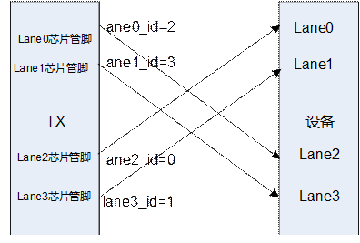

#### Tx Controller

#### 数据包的发送

当多个数据包需要发送时，控制器会根据间隔时间自动进行HS和LP模式的切换。控制器支持EoT包（End of Transmission，EoTp）发送的使能和关闭，具体配置寄存器PCKHDL\_CFG bit[0]，可以在每个HS传输结束时发送一个EoT包，也可以不发送。

#### 数据类型

控制器支持DSI RGB 16-bit/18-bit/24-bit和YUV4:2:0 12-bit/YUV4:2:2 16-bit/YUV4:2:2 20-bit的发送，支持CSI-2 Legacy YUV420 8-bit/YUV420 8-bit/YUV422 8-bit/RAW8/RAW10/RAW12/RAW14/RAW16/RGB888的发送，各种数据类型的数据组成格式如图11-38~图11-53所示。

DSI RGB 16-bit，每两个字节包含一个像素。

RGB 16-bit格式

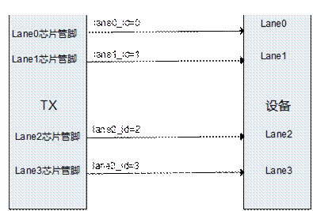

DSI RGB 18-bit，分为两种时序，一种是连续排列的（non-loosely），每4个pixel占用9个字节，每个数据包的pixel数是4的倍数，如图11-39所示。另一种是每个分量占用一个字节（loosely），一个像素占用3个字节，每个字节的低两bit是无效的，如图11-40所示。

RGB 18-bit non-loosely格式

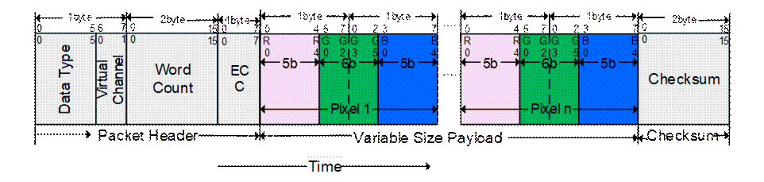

RGB 18-bit loosely格式

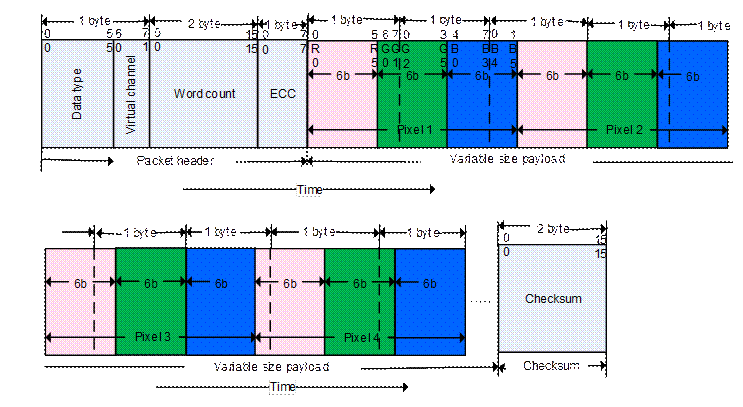

DSI RGB 24-bit，一个分量占用一个字节，一个pixel占用3个字节。

RGB 24-bit格式

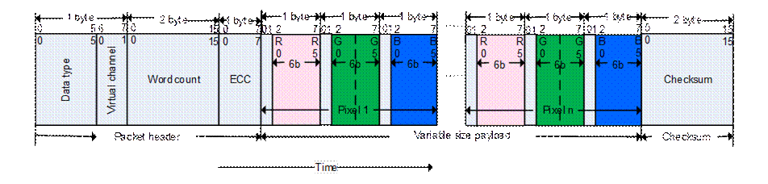

DSI YUV4:2:0 12-bit，奇数行发Cb和Y分量，偶数行发Cr和Y分量。每个数据包的像素个数是2的倍数。

YUV4:2:0 12-bit格式

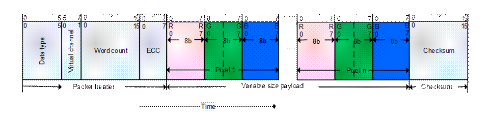

DSI YUV4:2:2 16-bit，每行的Cb和Cr分量交替传输。每个数据包的像素个数是2的倍数。

YUV4:2:2 16-bit格式

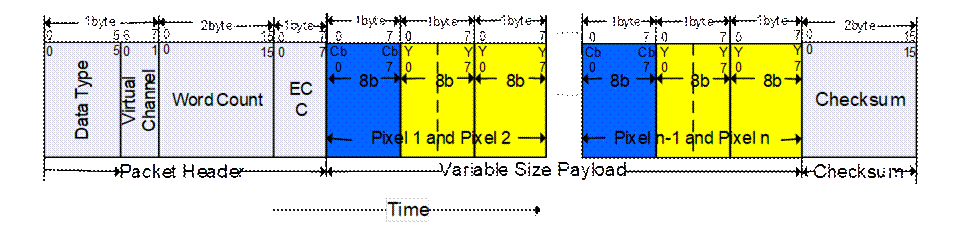

DSI YUV4:2:2 20-bit，每行的Cb和Cr分量交替传输。每个10bit的有效分量之间插入2bit的0。每个数据包的像素个数是2的倍数。

YUV4:2:2 20-bit格式

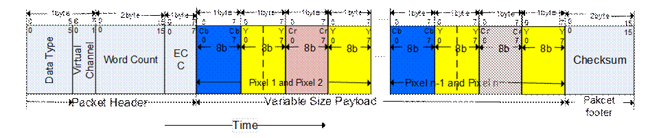

CSI-2 Legacy YUV420 8-bit，奇数行发U和Y分量，偶数行发V和Y分量。每个数据包的像素个数是2的倍数。

Legacy YUV420 8-bit格式

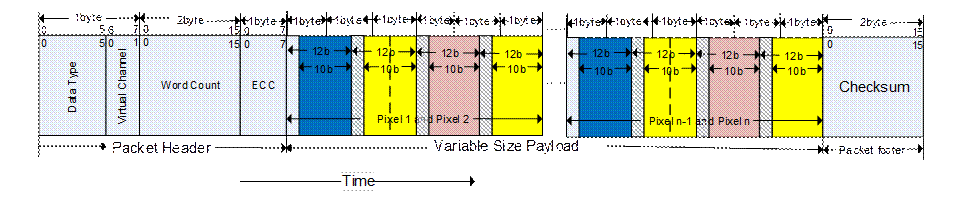

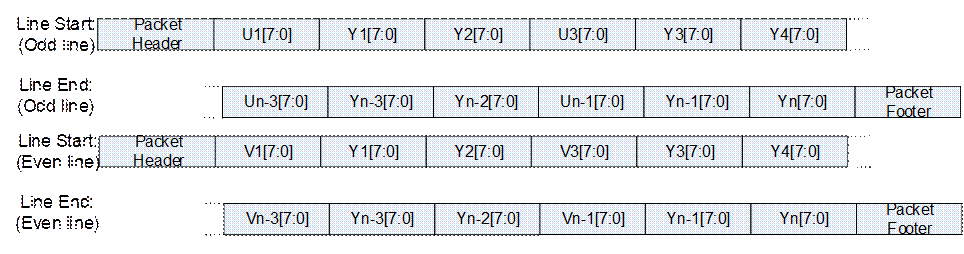

CSI-2 YUV420 8-bit，奇数行只发Y分量，偶数行发U、V和Y分量，奇数行的有效数据是偶数行的有效数据的一半。每个数据包的像素个数是2的倍数。

YUV420 8-bit格式

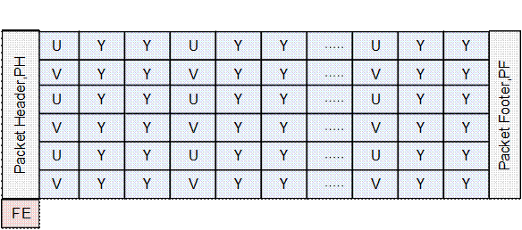

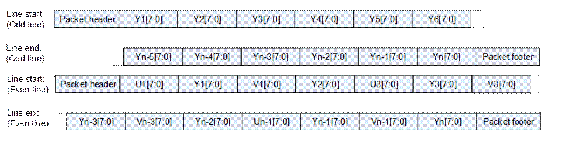

CSI-2 YUV422 8-bit，每行的U和V分量交替传输。每个数据包的像素个数是2的倍数。

YUV422 8-bit格式

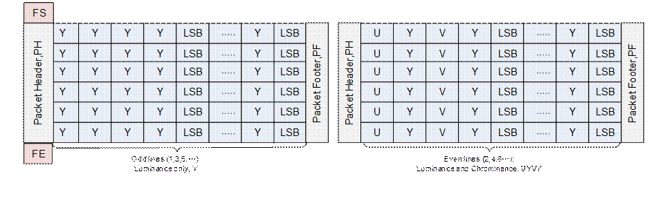

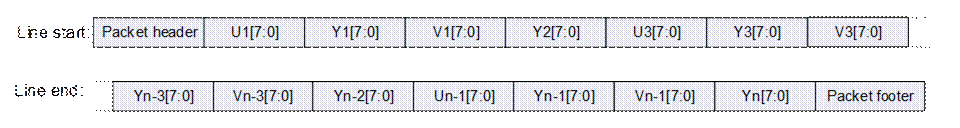

CSI RAW8格式

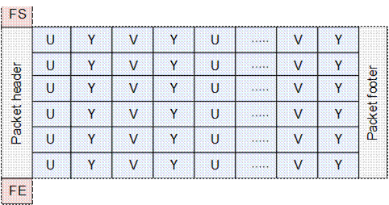

CSI RAW10格式

CSI RAW12格式

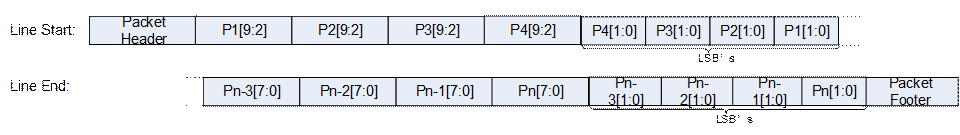

CSI RAW14格式

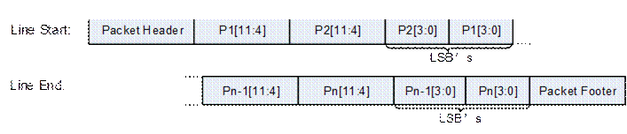

CSI RAW16格式

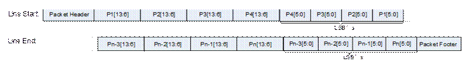

CSI RGB888格式

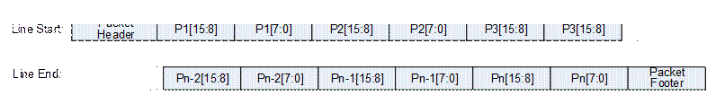

#### 接口时序

Video mode的Burst Mode时序如图11-54所示，一帧图像包含VSA（vertical sync active），VBP（vertical back porch），VACT（vertical active lines）和VFP（vertical front porch）四部分，VSA是帧sync active行，VBP是帧后消隐行，VACT是有效数据行，VFP是帧前消隐行。有效数据行包括行sync start，行后消隐区，行有效区，BLLP（Blanking or Low-Power Interval），行前消隐区五部分，无效数据行只包含行sync start和BLLP。使用Burst Mode传输数据可以充分利用带宽，在有效数据行可以进入BLLP区，此时PHY处于LP模式，降低功耗。

Burst Mode

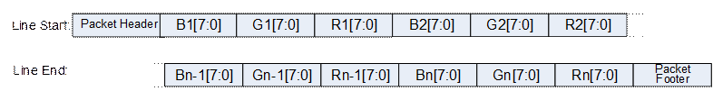

Video mode的Non-Burst Mode with Sync Pulses时序如图11-55所示，一帧图像包含VSA，VBP，VACT和VFP四部分。有效数据行包括行sync start，行start active区，行sync end，行后消隐区，行有效区，行前消隐区六部分，无效数据行包含行sync start，行start active区，行sync end和BLLP。

Non-Burst Mode with Sync Pulses

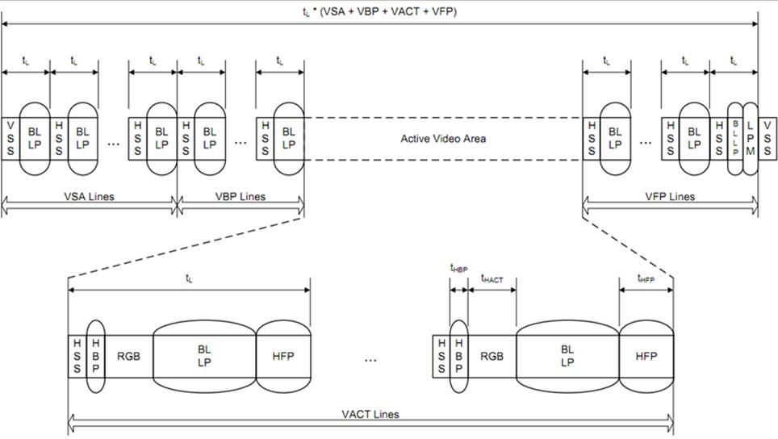

Video mode的Non-Burst Mode with Sync Events时序如图11-56所示，一帧图像包含VSA，VBP，VACT和VFP四部分。有效数据行包括行sync start，行后消隐区，行有效区，行前消隐区四部分，无效数据行只包含行sync start和BLLP。

Non-Burst Mode with Sync Events

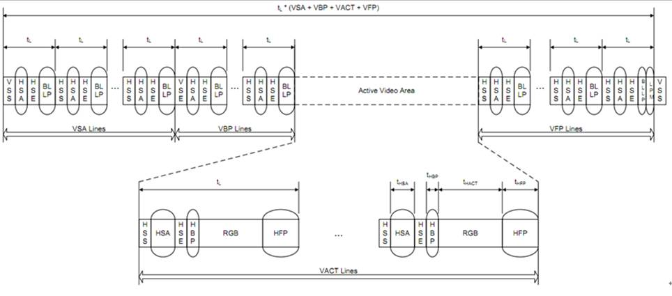

CSI-2发送的帧时序如图11-57所示，FS包和有效像素的长包之间是后消隐区，后消隐区大小可配，最小是1行。FE包可以在VACT区结束后的第一行发送，也可以在帧前消隐区VFP的最后发送。

CSI-2帧时序

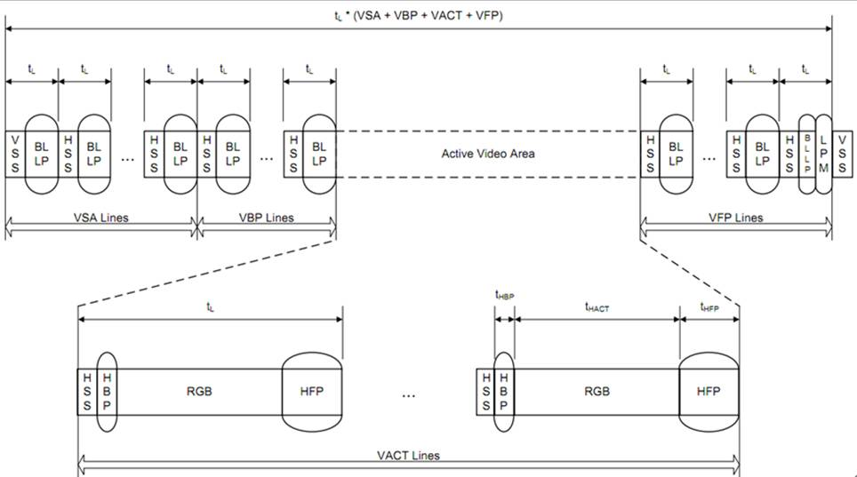

### 配置流程

软件操作流程如下：

打开时钟门控，配置PHY的参考时钟，输出时钟频率，时间参数，Lane个数。

PHY的输出时间参数需要配置PHY的寄存器。

PHY的寄存器配置通过控制器的寄存器来完成，配置方法为（这里为一个PHY寄存器的配置方法，当需要配置多个寄存器时，每个寄存器的配置方法类似）：

PHY\_REG\_CFG1 = 0x100XX（XX为PHY的寄存器地址）

PHY\_REG\_CFG0 = 0x2

PHY\_REG\_CFG0 = 0x0

PHY\_REG\_CFG1 = 0xYY（YY为PHY的寄存器XX的配置值）

PHY\_REG\_CFG0 = 0x2

PHY\_REG\_CFG0 = 0x0

当需要读PHY的寄存器时，方法为执行下面的配置后，读PHY\_REG\_CFG1寄存器的值，该寄存器的bit15~bit8即是PHY XX寄存器的值（这里为一个PHY寄存器的读方法，当需要读多个寄存器时，每个寄存器的读方法类似）：

PHY\_REG\_CFG1 = 0x100XX（XX为PHY的寄存器地址）

PHY\_REG\_CFG0 = 0x2

PHY\_REG\_CFG0 = 0x0

应该根据不同的场景来配置，寄存器具体描述请参考11.4.6 MIPI Tx寄存器描述章节。

PHY输出的时钟频率通过配置PHY的PLL来完成，输出数据的速率范围是80Mbps~2500Mbps。

如果对接设备需要控制器配置属性，配置设备属性。

DSI接口的设备，设备属性一般也是由D-PHY接口配置，配置命令可通过高速和低速模式完成。此时要把控制器配置成command模式。

配置方法：配置命令写入寄存器COMMAND\_HEADER，长包的配置数据写入寄存器COMMAND\_PAYLOAD。先写配置数据，再写配置命令。

举例：用generic long write（data type：29h）写6个字节数据：

COMMAND\_PAYLOAD =32’h04030201；COMMAND\_PAYLOAD =32’h00000605；COMMAND\_HEADER =32’h00000629；

用DCS Short WRITE，1parameter（data type：15h）写数据35h：COMMAND\_HEADER =32’h00003515；

当用读命令获取设备信息时，读操作完成后，通过COMMAND\_PAYLOAD获取读回的信息，当获取的设备信息大于4字节时，每读取一次COMMAND\_PAYLOAD返回4字节。

配置控制器工作模式，分辨率。

应注意各参数的单位，详细参考寄存器描述。

配置前面模块（VDP），给TX输入视频内容。

----结束

### MIPI Tx寄存器概览

MIPI Tx寄存器概览如表11-13所示。

MIPI Tx寄存器概览（基址：0x0\_17A8\_0000）

| 偏移地址 | 名称 | 描述 | 页码 |
| --- | --- | --- | --- |
| 0x0000 | CTRL\_RESET | 复位寄存器 | 11-234 |
| 0x0008 | CRG\_CFG | 时钟分频寄存器 | 11-234 |
| 0x000C | VIDEO\_VC | 视频数据virtual channel ID配置寄存器 | 11-235 |
| 0x0010 | DATA\_TYPE | 数据格式配置寄存器 | 11-235 |
| 0x0018 | LP\_CMD\_BYTE | video模式LP命令可用时间配置寄存器 | 11-237 |
| 0x002C | PCK\_EN | 特定包使能寄存器 | 11-237 |
| 0x0030 | GEN\_VC | Generic接口virtual channel ID配置寄存器 | 11-238 |
| 0x0034 | MODE\_CFG | 模式配置寄存器 | 11-238 |
| 0x0038 | VIDEO\_LP\_EN | video模式LP使能寄存器 | 11-239 |
| 0x003C | VIDEOM\_PKT\_SIZE | VIDEO模式packet大小配置寄存器 | 11-240 |
| 0x0040 | VIDEOM\_NUM\_CHUNKS | 一行chunks个数配置寄存器 | 11-241 |
| 0x0044 | VIDEOM\_NULL\_SIZE | null packet大小配置寄存器 | 11-241 |
| 0x0048 | VIDEOM\_HSA\_SIZE | HSA长度配置寄存器 | 11-241 |
| 0x004C | VIDEOM\_HBP\_SIZE | HBP长度配置寄存器 | 11-242 |
| 0x0050 | VIDEOM\_HLINE\_SIZE | HLINE长度配置寄存器 | 11-242 |
| 0x0054 | VIDEOM\_VSA\_LINES | VSA行数配置寄存器 | 11-242 |
| 0x0058 | VIDEOM\_VBP\_LINES | VBP行数配置寄存器 | 11-243 |
| 0x005C | VIDEOM\_VFP\_LINES | VFP行数配置寄存器 | 11-243 |
| 0x0060 | VIDEOM\_VACTIVE\_LINES | VACTIVE行数配置寄存器 | 11-243 |
| 0x0064 | COMMAND\_PKT\_SIZE | COMMAND模式packet大小配置寄存器 | 11-243 |
| 0x0068 | COMMAND\_TRAN\_MODE | 命令传输模式配置寄存器 | 11-244 |
| 0x006C | COMMAND\_HEADER | 命令header设置寄存器 | 11-245 |
| 0x0070 | COMMAND\_PAYLOAD | 命令发送的数据寄存器 | 11-246 |
| 0x0074 | COMMAND\_STATUS | 命令状态寄存器 | 11-246 |
| 0x0088 | LPWR\_TO\_SET | LP写超时配置寄存器 | 11-247 |
| 0x008C | BTA\_TO\_SET | BTA回复超时配置寄存器 | 11-248 |
| 0x0094 | CLKLANE\_CTRL | clklane控制寄存器 | 11-248 |
| 0x0098 | CLKLANE\_TIME | clklane HS和LP切换时间配置寄存器 | 11-248 |
| 0x009C | DATALANE\_TIME | datalane HS和LP切换时间配置寄存器 | 11-249 |
| 0x00A0 | PHY\_CTRL | PHY PLL和复位配置寄存器 | 11-249 |
| 0x00A4 | LANE\_NUM | PHY接口配置寄存器 | 11-250 |
| 0x00A8 | ULPS\_CTRL | PHY的ULPS状态配置寄存器 | 11-250 |
| 0x00B0 | PPI\_STATUS | PHY状态寄存器 | 11-251 |
| 0x00B4 | PHY\_REG\_CFG0 | PHY配置控制0寄存器 | 11-253 |
| 0x00B8 | PHY\_REG\_CFG1 | PHY配置接口1寄存器 | 11-253 |
| 0x00BC | INT0\_STATUS | 中断0状态寄存器 | 11-254 |
| 0x00C0 | INT1\_STATUS | 中断1状态寄存器 | 11-257 |
| 0x00C4 | INT0\_MASK | 中断0屏蔽寄存器 | 11-260 |
| 0x00C8 | INT1\_MASK | 中断1屏蔽寄存器 | 11-263 |
| 0x00CC | PHY\_CAL | PHY calibration使能寄存器 | 11-266 |
| 0x01B0 | POLARITY\_CTRL | 前级模块输入控制信号极性控制寄存器 | 11-266 |
| 0x024C | GINT\_MSK | 总中断屏蔽配置寄存器 | 11-267 |
| 0x0308 | OPERATION\_MODE | 工作模式控制寄存器 | 11-267 |
| 0x0330 | DATATYPE0 | datatype配置寄存器0 | 11-269 |
| 0x0338 | CSI\_CTRL | CSI时序配置寄存器 | 11-269 |
| 0x033C | SKEW\_BEGIN | period skew开始发送位置寄存器 | 11-269 |
| 0x0340 | SKEW\_END | period skew结束发送位置寄存器 | 11-270 |
| 0x0350 | LANE\_ID | lane id配置寄存器 | 11-270 |

### MIPI Tx寄存器描述

<strong><big>说明</big></strong>

寄存器描述中的hsclk period=1/(Date Rate/8)。

#### CTRL\_RESET

CTRL\_RESET为复位寄存器。

Offset Address: 0x0000 Total Reset Value: 0x0000\_0000

|  |  |  |  |  |
| --- | --- | --- | --- | --- |
| Bits | Access | Name | Description | Reset |
| [31:1] | - | reserved | 保留。 | 0x00000000 |
| [0] | RW | ctrl\_reset | 控制逻辑复位使能，不影响寄存器配置值。  0：复位；  1：撤销复位。 | 0x0 |

#### CRG\_CFG

CRG\_CFG为时钟分频寄存器。

Offset Address: 0x0008 Total Reset Value: 0x0000\_0000

|  |  |  |  |  |
| --- | --- | --- | --- | --- |
| Bits | Access | Name | Description | Reset |
| [31:8] | - | reserved | 保留。 | 0x0000 |
| [7:0] | RW | txescclk\_div | TX escape clock分频倍数，时钟源为hsclk，配0和1将不会产生时钟。(本模块中hsclk频率为Data Rate/8) | 0x00 |

#### VIDEO\_VC

VIDEO\_VC为视频数据virtual channel ID配置寄存器。

Offset Address: 0x000C Total Reset Value: 0x0000\_0000

|  |  |  |  |  |
| --- | --- | --- | --- | --- |
| Bits | Access | Name | Description | Reset |
| [31:5] | - | reserved | 保留。 | 0x0000000 |
| [4] | RW | vcid\_sel | 视频数据virtual channel ID来源选择。  0：来自寄存器vcid；  1：来自前级模块。 | 0x0 |
| [3:2] | - | reserved | 保留。 | 0x0 |
| [1:0] | RW | vcid | 视频数据virtual channel ID配置值。 | 0x0 |

#### DATA\_TYPE

DATA\_TYPE为数据格式配置寄存器。

Offset Address: 0x0010 Total Reset Value: 0x0000\_0000

| Bits | Access | Name | Description | Reset |
| --- | --- | --- | --- | --- |
| [31:8] | - | reserved | 保留。 | 0x000000 |
| [7:0] | RW | data\_type | video模式：  0x00：DSI RGB16-bit；  0x03：DSI RGB18-bit；  0x04：DSI RGB18-bit loosely；  0x05：DSI RGB24-bit；  0x06：DSI YCbCr422 20-bit；  0x08：DSI YCbCr422 16-bit；  0x09：DSI RGB30-bit；  0x0A：DSI RGB36-bit；  0x0B：DSI YCbCr420 12-bit；  0x0F：DSC24 compressed Data；  0x10：CSI YUV422 8-bit；  0x11：CSI YUV422 10-bit；  0x12：CSI legacy YUV420 8-bit；  0x13：CSI YUV420 8-bit；  0x14：CSI YUV420 10-bit；  0x15：CSI RGB888；  0x16：CSI RGB666；  0x17：CSI RGB565；  0x18：CSI RGB555；  0x19：CSI RGB444；  0x1A：CSI RAW8；  0x1B：CSI RAW10；  0x1C：CSI RAW12；  0x1D：CSI RAW14；  0x1E：CSI RAW16；  其他：保留。  command模式：  0x00：DSI RGB16-bit；  0x03：DSI RGB18-bit；  0x04：DSI RGB18-bit loosely；  0x05: DSI RGB24-bit；  0x09：DSI RGB30-bit；  0x0A：DSI RGB36-bit；  0x0F：DSC24 compressed Data；  其他：保留。 | 0x00 |

#### LP\_CMD\_BYTE

LP\_CMD\_BYTE为video模式LP(Low Power)命令可用时间配置寄存器。

Offset Address: 0x0018 Total Reset Value: 0x0000\_0000

|  |  |  |  |  |
| --- | --- | --- | --- | --- |
| Bits | Access | Name | Description | Reset |
| [31:24] | - | reserved | 保留。 | 0x00 |
| [23:16] | RW | outvact\_lpcmd\_byte | VSA(vertical sync active),VBP(vertical back porch)和VFP(vertical front porch)区域可以发送的LP命令的最大字节数。 | 0x00 |
| [15:8] | - | reserved | 保留。 | 0x00 |
| [7:0] | RW | invact\_lpcmd\_byte | VACT(vertical active lines)区域可以发送的LP命令的最大字节数。 | 0x00 |

#### PCK\_EN

PCK\_EN为特定包使能寄存器。

Offset Address: 0x002C Total Reset Value: 0x0000\_0000

| Bits | Access | Name | Description | Reset |
| --- | --- | --- | --- | --- |
| [31:8] | - | reserved | 保留。 | 0x000000 |
| [7] | RW | frame\_ack\_en | 帧结束ACK回复请求使能。  0：不使能；  1：使能。 | 0x0 |
| [6] | - | reserved | 保留。 | 0x0 |
| [5] | - | reserved | 保留。 | 0x0 |
| [4] | RW | bta\_en | Bus Turn-Around请求。  0：不使能；  1：使能。 | 0x0 |
| [3] | RW | ecc\_rx\_en | ECC接收使能。  0：不使能；  1：使能。 | 0x0 |
| [2] | RW | crc\_rx\_en | CRC接收使能。  0：不使能；  1：使能。 | 0x0 |
| [1] | RW | eotp\_rx\_en | EoTp接收使能。  0：不使能；  1：使能。 | 0x0 |
| [0] | RW | eotp\_tx\_en | EoTp发送使能。  0：不使能；  1：使能。 | 0x0 |

#### GEN\_VC

GEN\_VC为Generic接口virtual channel ID配置寄存器。

Offset Address: 0x0030 Total Reset Value: 0x0000\_0000

| Bits | Access | Name | Description | Reset |
| --- | --- | --- | --- | --- |
| [31:2] | - | reserved | 保留。 | 0x00000000 |
| [1:0] | RW | gen\_vcid | Generic接口virtual channel ID值。 | 0x0 |

#### MODE\_CFG

MODE\_CFG为模式配置寄存器。

Offset Address: 0x0034 Total Reset Value: 0x0000\_0000

| Bits | Access | Name | Description | Reset |
| --- | --- | --- | --- | --- |
| [31:10] | - | reserved | 保留。 | 0x000 |
| [9:8] | RW | video\_mode\_type | video模式传输类型选择。  00：Non-burst with sync pulse；  01：Non-burst with sync events；  其他：Burst mode。 | 0x0 |
| [7:5] | - | reserved | 保留。 | 0x0 |
| [4] | RW | cmd\_mode\_tran\_type | 在video模式时，命令发送的方式：  0：高速模式；  1：低速模式。 | 0x0 |
| [3:1] | - | reserved | 保留。 | 0x0 |
| [0] | RW | cmd\_video\_mode | video和command模式选择。  0：video模式；  1：command模式。 | 0x0 |

#### VIDEO\_LP\_EN

VIDEO\_LP\_EN为video模式LP使能寄存器。

Offset Address: 0x0038 Total Reset Value: 0x0000\_0000

| Bits | Access | Name | Description | Reset |
| --- | --- | --- | --- | --- |
| [31:6] | - | reserved | 保留。 | 0x0000000 |
| [5] | RW | hfp\_lp\_en | 如果时间足够，HFP区域返回low-power状态使能。如果不使能，该区域将总是处于High speed状态。  0：不使能；  1：使能。 | 0x0 |
| [4] | RW | hbp\_lp\_en | 如果时间足够，HBP(horizontal back porch)区域返回low-power状态使能。如果不使能，该区域将总是处于High speed状态。  0：不使能；  1：使能。 | 0x0 |
| [3] | RW | vact\_lp\_en | 如果时间足够，VACT区域返回low-power状态使能。如果不使能，该区域将总是处于High speed状态。  0：不使能；  1：使能。 | 0x0 |
| [2] | RW | vfp\_lp\_en | 如果时间足够，VFP区域返回low-power状态使能。如果不使能，该区域将总是处于High speed状态。  0：不使能；  1：使能。 | 0x0 |
| [1] | RW | vbp\_lp\_en | 如果时间足够，VBP区域返回low-power状态使能。如果不使能，该区域将总是处于High speed状态。  0：不使能；  1：使能。 | 0x0 |
| [0] | RW | vsa\_lp\_en | 如果时间足够，VSA区域返回low-power状态使能。如果不使能，该区域将总是处于High speed状态。  0：不使能；  1：使能。 | 0x0 |

#### VIDEOM\_PKT\_SIZE

VIDEOM\_PKT\_SIZE为VIDEO模式packet大小配置寄存器。

Offset Address: 0x003C Total Reset Value: 0x0000\_0000

| Bits | Access | Name | Description | Reset |
| --- | --- | --- | --- | --- |
| [31:14] | - | reserved | 保留。 | 0x00000 |
| [13:0] | RW | videom\_pkt\_size | video模式packet大小，单位pixel。 | 0x0000 |

#### VIDEOM\_NUM\_CHUNKS

VIDEOM\_NUM\_CHUNKS为一行chunks个数配置寄存器。

Offset Address: 0x0040 Total Reset Value: 0x0000\_0000

|  |  |  |  |  |
| --- | --- | --- | --- | --- |
| Bits | Access | Name | Description | Reset |
| [31:13] | - | reserved | 保留。 | 0x00000 |
| [12:0] | RW | videom\_num\_chunks | video模式一行的chunks个数，一个chunks包括一个数据packet和一个null packet。如果为0，一行只有一个数据packet；如果为1，一行为一个数据packet+一个null packet(如果vid\_null\_size>0)。 | 0x0000 |

#### VIDEOM\_NULL\_SIZE

VIDEOM\_NULL\_SIZE为null packet大小配置寄存器。

Offset Address: 0x0044 Total Reset Value: 0x0000\_0000

|  |  |  |  |  |
| --- | --- | --- | --- | --- |
| Bits | Access | Name | Description | Reset |
| [31:13] | - | reserved | 保留。 | 0x00000 |
| [12:0] | RW | videom\_null\_size | video模式null packet大小，单位字节。如果为0，不发送null packet。 | 0x0000 |

#### VIDEOM\_HSA\_SIZE

VIDEOM\_HSA\_SIZE为HSA长度配置寄存器。

Offset Address: 0x0048 Total Reset Value: 0x0000\_0000

| Bits | Access | Name | Description | Reset |
| --- | --- | --- | --- | --- |
| [31:12] | - | reserved | 保留。 | 0x00000 |
| [11:0] | RW | videom\_hsa\_size | HSA(horizontal sync active)长度，单位hsclk周期。 | 0x000 |

#### VIDEOM\_HBP\_SIZE

VIDEOM\_HBP\_SIZE为HBP长度配置寄存器。

Offset Address: 0x004C Total Reset Value: 0x0000\_0000

|  |  |  |  |  |
| --- | --- | --- | --- | --- |
| Bits | Access | Name | Description | Reset |
| [31:12] | - | reserved | 保留。 | 0x00000 |
| [11:0] | RW | videom\_hbp\_size | HBP(horizontal back porch)长度，单位hsclk周期。 | 0x000 |

#### VIDEOM\_HLINE\_SIZE

VIDEOM\_HLINE\_SIZE为HLINE(Horizontal Line)长度配置寄存器。

Offset Address: 0x0050 Total Reset Value: 0x0000\_0000

|  |  |  |  |  |
| --- | --- | --- | --- | --- |
| Bits | Access | Name | Description | Reset |
| [31:15] | - | reserved | 保留。 | 0x00000 |
| [14:0] | RW | video\_hline\_size | 一行总长度(HSA+HBP+HACT+HFP)，单位hsclk周期。 | 0x0000 |

#### VIDEOM\_VSA\_LINES

VIDEOM\_VSA\_LINES为VSA行数配置寄存器。

Offset Address: 0x0054 Total Reset Value: 0x0000\_0000

|  |  |  |  |  |
| --- | --- | --- | --- | --- |
| Bits | Access | Name | Description | Reset |
| [31:10] | - | reserved | 保留。 | 0x000000 |
| [9:0] | RW | vsa\_lines | VSA行数。 | 0x000 |

#### VIDEOM\_VBP\_LINES

VIDEOM\_VBP\_LINES为VBP行数配置寄存器。

Offset Address: 0x0058 Total Reset Value: 0x0000\_0000

|  |  |  |  |  |
| --- | --- | --- | --- | --- |
| Bits | Access | Name | Description | Reset |
| [31:10] | - | reserved | 保留。 | 0x000000 |
| [9:0] | RW | vbp\_lines | VBP行数。 | 0x000 |

#### VIDEOM\_VFP\_LINES

VIDEOM\_VFP\_LINES为VFP行数配置寄存器。

Offset Address: 0x005C Total Reset Value: 0x0000\_0000

|  |  |  |  |  |
| --- | --- | --- | --- | --- |
| Bits | Access | Name | Description | Reset |
| [31:10] | - | reserved | 保留。 | 0x000000 |
| [9:0] | RW | vfp\_lines | VFP行数。 | 0x000 |

#### VIDEOM\_VACTIVE\_LINES

VIDEOM\_VACTIVE\_LINES为VACTIVE行数配置寄存器。

Offset Address: 0x0060 Total Reset Value: 0x0000\_0000

|  |  |  |  |  |
| --- | --- | --- | --- | --- |
| Bits | Access | Name | Description | Reset |
| [31:14] | - | reserved | 保留。 | 0x00000 |
| [13:0] | RW | v\_active\_lines | VACTIVE行数。 | 0x0000 |

#### COMMAND\_PKT\_SIZE

COMMAND\_PKT\_SIZE为COMMAND模式packet大小配置寄存器。

Offset Address: 0x0064 Total Reset Value: 0x0000\_0000

| Bits | Access | Name | Description | Reset |
| --- | --- | --- | --- | --- |
| [31:16] | - | reserved | 保留。 | 0x0000 |
| [15:0] | RW | cmd\_pkt\_size | command模式packet大小，单位pixel。 | 0x0000 |

#### COMMAND\_TRAN\_MODE

COMMAND\_TRAN\_MODE为命令传输模式配置寄存器。

Offset Address: 0x0068 Total Reset Value: 0x0000\_0000

| Bits | Access | Name | Description | Reset |
| --- | --- | --- | --- | --- |
| [31:12] | - | reserved | 保留。 | 0x00000 |
| [11] | RW | dcs\_lw | DCS(Display Command Set) long write packet command传输方式。  0：high-speed；  1：low-power。 | 0x0 |
| [10] | RW | dcs\_sr\_0p | DCS short read packet with zero parameter command传输方式。  0：high-speed；  1：low-power。 | 0x0 |
| [9] | RW | dcs\_sw\_1p | DCS short write packet with one parameter command传输方式。  0：high-speed；  1：low-power。 | 0x0 |
| [8] | RW | dcs\_sw\_0p | DCS short write packet with zero parameter command传输方式。  0：high-speed；  1：low-power。 | 0x0 |
| [7] | RW | gen\_lw | Generic long write packet command传输方式。  0：high-speed；  1：low-power。 | 0x0 |
| [6] | RW | gen\_sr\_2p | Generic short read packet with two parameters command传输方式。  0：high-speed；  1：low-power。 | 0x0 |
| [5] | RW | gen\_sr\_1p | Generic short read packet with one parameters command传输方式。  0：high-speed；  1：low-power。 | 0x0 |
| [4] | RW | gen\_sr\_0p | Generic short read packet with zero parameters command传输方式。  0：high-speed；  1：low-power。 | 0x0 |
| [3] | RW | gen\_sw\_2p | Generic short write packet with two parameters command传输方式。  0：high-speed；  1：low-power。 | 0x0 |
| [2] | RW | gen\_sw\_1p | Generic short write packet with one parameters command传输方式。  0：high-speed；  1：low-power。 | 0x0 |
| [1] | RW | gen\_sw\_0p | Generic short write packet with zero parameters command传输方式。  0：high-speed；  1：low-power。 | 0x0 |
| [0] | RW | max\_rd\_pkt\_size\_tran | maximun read packet size command传输方式。  0：high-speed；  1：low-power。 | 0x0 |

#### COMMAND\_HEADER

COMMAND\_HEADER为命令header设置寄存器。

Offset Address: 0x006C Total Reset Value: 0x0000\_0000

|  |  |  |  |  |
| --- | --- | --- | --- | --- |
| Bits | Access | Name | Description | Reset |
| [31:24] | - | reserved | 保留。 | 0x00 |
| [23:16] | RW | command\_wordcount\_hi | 长包长度高字节，或者短包的data 1。 | 0x00 |
| [15:8] | RW | command\_wordcount\_low | 长包长度低字节，或者短包的data 0。 | 0x00 |
| [7:6] | RW | command\_virtualchannel | 命令包的virtual channel。 | 0x0 |
| [5:0] | RW | command\_datatype | 命令包的data type。 | 0x00 |

#### COMMAND\_PAYLOAD

COMMAND\_PAYLOAD为命令发送的数据寄存器。

Offset Address: 0x0070 Total Reset Value: 0x0000\_0000

|  |  |  |  |  |
| --- | --- | --- | --- | --- |
| Bits | Access | Name | Description | Reset |
| [31:24] | RW | command\_pld\_b4 | 命令包数据的第4字节。 | 0x00 |
| [23:16] | RW | command\_pld\_b3 | 命令包数据的第3字节。 | 0x00 |
| [15:8] | RW | command\_pld\_b2 | 命令包数据的第2字节。 | 0x00 |
| [7:0] | RW | command\_pld\_b1 | 命令包数据的第1字节。 | 0x00 |

#### COMMAND\_STATUS

COMMAND\_STATUS为命令状态寄存器。

Offset Address: 0x0074 Total Reset Value: 0x0000\_0095

| Bits | Access | Name | Description | Reset |
| --- | --- | --- | --- | --- |
| [31:8] | - | reserved | 保留。 | 0x000000 |
| [7] | RO | command\_idle | 命令idle状态指示。  0：不处于idle状态；  1：处于idle状态。 | 0x1 |
| [6] | RW | rd\_cmd\_busy | 读命令忙标志。  0：空闲；  1：忙。 | 0x0 |
| [5] | RW | pld\_read\_full | 存储读命令返回数据的FIFO满标志。  0：不满；  1：满。 | 0x0 |
| [4] | RW | pld\_read\_empty | 存储读命令返回数据的FIFO空标志。  0：不空；  1：空。 | 0x1 |
| [3] | RW | pld\_write\_full | 存储写命令发送数据的FIFO满标志。  0：不满；  1：满。 | 0x0 |
| [2] | RW | pld\_write\_empty | 存储写命令发送数据的FIFO空标志。  0：不空；  1：空。 | 0x1 |
| [1] | RW | command\_full | 存储命令的FIFO满标志。  0：不满；  1：满。 | 0x0 |
| [0] | RW | command\_empty | 存储命令的FIFO空标志。  0：不空；  1：空。 | 0x1 |

#### LPWR\_TO\_SET

LPWR\_TO\_SET为LP(Low Power)写超时配置寄存器。

Offset Address: 0x0088 Total Reset Value: 0x0000\_0000

| Bits | Access | Name | Description | Reset |
| --- | --- | --- | --- | --- |
| [31:16] | - | reserved | 保留。 | 0x0000 |
| [15:0] | RW | lpwr\_to\_set | LP发送写命令后等待时间，单位为hsclk。 | 0x0000 |

#### BTA\_TO\_SET

BTA\_TO\_SET为BTA回复超时配置寄存器。

Offset Address: 0x008C Total Reset Value: 0x0000\_0000

|  |  |  |  |  |
| --- | --- | --- | --- | --- |
| Bits | Access | Name | Description | Reset |
| [31:16] | - | reserved | 保留。 | 0x0000 |
| [15:0] | RW | bta\_to\_set | Bus Turn-Around后host等待时间，单位为hsclk。 | 0x0000 |

#### CLKLANE\_CTRL

CLKLANE\_CTRL为clklane控制寄存器。

Offset Address: 0x0094 Total Reset Value: 0x0000\_0002

|  |  |  |  |  |
| --- | --- | --- | --- | --- |
| Bits | Access | Name | Description | Reset |
| [31:2] | - | reserved | 保留。 | 0x00000000 |
| [1] | RW | clklane\_continue | clklane空闲时间时钟自动关断使能。  0：不使能；  1：使能。 | 0x1 |
| [0] | RW | txrequesthsclk | hsclk请求使能。  0：不使能；  1：使能。 | 0x0 |

#### CLKLANE\_TIME

CLKLANE\_TIME为clklane HS(High Speed)和LP(Low Power)切换时间配置寄存器。

Offset Address: 0x0098 Total Reset Value: 0x0000\_0000

| Bits | Access | Name | Description | Reset |
| --- | --- | --- | --- | --- |
| [31:26] | - | reserved | 保留。 | 0x00 |
| [25:16] | RW | clklane\_hs2lp\_time | clklane hs转换到lp模式需要的时间，单位hsclk。 | 0x000 |
| [15:10] | - | reserved | 保留。 | 0x00 |
| [9:0] | RW | clklane\_lp2hs\_time | clklane lp转换到hs模式需要的时间，单位hsclk。 | 0x000 |

#### DATALANE\_TIME

DATALANE\_TIME为datalane HS和LP切换时间配置寄存器。

Offset Address: 0x009C Total Reset Value: 0x0000\_0000

|  |  |  |  |  |
| --- | --- | --- | --- | --- |
| Bits | Access | Name | Description | Reset |
| [31:26] | - | reserved | 保留。 | 0x00 |
| [25:16] | RW | datalane\_hs2lp\_time | datalane hs转换到lp模式需要的时间，单位hsclk。 | 0x000 |
| [15:10] | - | reserved | 保留。 | 0x00 |
| [9:0] | RW | datalane\_lp2hs\_time | datalane lp转换到hs模式需要的时间，单位hsclk。 | 0x000 |

#### PHY\_CTRL

PHY\_CTRL为PHY PLL和复位配置寄存器。

Offset Address: 0x00A0 Total Reset Value: 0x0000\_0000

| Bits | Access | Name | Description | Reset |
| --- | --- | --- | --- | --- |
| [31:4] | - | reserved | 保留。 | 0x0000000 |
| [3] | RW | forcepll | PHY PLL处于有效状态使能。  0：不使能；  1：使能。 | 0x0 |
| [2] | RW | enableclk | PHY clklane使能。  0：不使能；  1：使能。 | 0x0 |
| [1] | RW | rstz | PHY数字电路复位使能。  0：复位；  1：撤销复位。 | 0x0 |
| [0] | RW | shutdownz | PHY整体powerdown使能。  0：power down；  1：power up。 | 0x0 |

#### LANE\_NUM

LANE\_NUM为PHY接口配置寄存器。

Offset Address: 0x00A4 Total Reset Value: 0x0000\_0000

|  |  |  |  |  |
| --- | --- | --- | --- | --- |
| Bits | Access | Name | Description | Reset |
| [31:16] | - | reserved | 保留。 | 0x0000 |
| [15:8] | RW | stopstate\_time | 进入stopstate到发起HS传输的最小等待时间。 | 0x00 |
| [7:2] | - | reserved | 保留。 | 0x00 |
| [1:0] | RW | lane\_num | datalane个数配置。  00:1lane；  01:2lanes；  10:3lanes；  11:4lanes。 | 0x0 |

#### ULPS\_CTRL

ULPS\_CTRL为PHY的ULPS(Ultra Low Power State)状态配置寄存器。

Offset Address: 0x00A8 Total Reset Value: 0x0000\_0000

| Bits | Access | Name | Description | Reset |
| --- | --- | --- | --- | --- |
| [31:4] | - | reserved | 保留。 | 0x0000000 |
| [3] | RW | txulpsexitdatalane | datalanes退出ULPS模式使能。  0：不使能；  1：使能。 | 0x0 |
| [2] | RW | txulpsdatalane | datalanes进入ULPS模式请求使能。  0：不使能；  1：使能。 | 0x0 |
| [1] | RW | txulpsexitclklane | clklane退出ULPS模式使能。  0：不使能；  1：使能。 | 0x0 |
| [0] | RW | txulpsclklane | clklane进入ULPS模式请求使能。  0：不使能；  1：使能。 | 0x0 |

#### PPI\_STATUS

PPI\_STATUS为PHY状态寄存器。

Offset Address: 0x00B0 Total Reset Value: 0x0000\_0000

| Bits | Access | Name | Description | Reset |
| --- | --- | --- | --- | --- |
| [31:13] | - | reserved | 保留。 | 0x00000 |
| [12] | RO | ulpsactivenot3lane | PHY lane3 ulps状态指示信号。  0：处于ulps状态；  1：不处于ulps状态。 | 0x0 |
| [11] | RO | stopstate3lane | PHY lane3 stopstate状态指示信号。  0：不处于stopstate状态；  1：处于stopstate状态。 | 0x0 |
| [10] | RO | ulpsactivenot2lane | PHY lane2 ulps状态指示信号。  0：处于ulps状态；  1：不处于ulps状态。 | 0x0 |
| [9] | RO | stopstate2lane | PHY lane2 stopstate状态指示信号。  0：不处于stopstate状态；  1：处于stopstate状态。 | 0x0 |
| [8] | RO | ulpsactivenot1lane | PHY lane1 ulps状态指示信号。  0：处于ulps状态；  1：不处于ulps状态。 | 0x0 |
| [7] | RO | stopstate1lane | PHY lane1 stopstate状态指示信号。  0：不处于stopstate状态；  1：处于stopstate状态。 | 0x0 |
| [6] | RO | rxulpsesc0lane | PHY lane0 rxulps状态指示信号。  0：处于ulps状态；  1：不处于ulps状态。 | 0x0 |
| [5] | RO | ulpsactivenot0lane | PHY lane0 ulps状态指示信号。  0：处于ulps状态；  1：不处于ulps状态。 | 0x0 |
| [4] | RO | stopstate0lane | PHY lane0 stopstate状态指示信号。  0：不处于stopstate状态；  1：处于stopstate状态。 | 0x0 |
| [3] | RO | ulpsactivenotclk | PHY clklane ulps状态指示信号。  0：处于ulps状态；  1：不处于ulps状态。 | 0x0 |
| [2] | RO | stopstateclklane | PHY clklane stopstate状态指示信号。  0：不处于stopstate状态；  1：处于stopstate状态。 | 0x0 |
| [1] | RO | phy\_tran\_direction | PHY direction信号状态。  0：发送状态；  1：接收状态。 | 0x0 |
| [0] | RO | phy\_pll\_lock | PHY PLL lock信号状态。  0：PHY PLL lock无效；  1：PHY PLL lock有效。 | 0x0 |

#### PHY\_REG\_CFG0

PHY\_REG\_CFG0为PHY配置控制0寄存器。

Offset Address: 0x00B4 Total Reset Value: 0x0000\_0000

|  |  |  |  |  |
| --- | --- | --- | --- | --- |
| Bits | Access | Name | Description | Reset |
| [31:2] | - | reserved | 保留。 | 0x00000000 |
| [1] | RW | testclk | PHY寄存器配置接口时钟控制位。  0：低电平；  1：高电平。 | 0x0 |
| [0] | RW | testclr | 配置清除。  0：不清除；  1：清除。 | 0x0 |

#### PHY\_REG\_CFG1

PHY\_REG\_CFG1为PHY配置接口1寄存器。

Offset Address: 0x00B8 Total Reset Value: 0x0000\_0000

| Bits | Access | Name | Description | Reset |
| --- | --- | --- | --- | --- |
| [31:17] | - | reserved | 保留。 | 0x0000 |
| [16] | RW | testen | testen信号控制。  0：在testclk的上升沿采集数据；  1：在testclk的下降沿采集地址。 | 0x0 |
| [15:8] | RO | testdout | PHY配置接口输出数据。 | 0x00 |
| [7:0] | RW | testdin | PHY配置接口输入数据。 | 0x00 |

#### INT0\_STATUS

INT0\_STATUS为中断0状态寄存器。

Offset Address: 0x00BC Total Reset Value: 0x0000\_0000

| Bits | Access | Name | Description | Reset |
| --- | --- | --- | --- | --- |
| [31:21] | - | reserved | 保留。 | 0x000 |
| [20] | RC | errcontentionlp1 | Lane0 LP1 contention错误中断，读清零。  0：无中断；  1：有中断。 | 0x0 |
| [19] | RC | errcontentionlp0 | Lane0 LP0 contention错误，读清零。  0：无中断；  1：有中断。 | 0x0 |
| [18] | RC | errcontrol | 错误状态序列检测中断，读清零。  0：无中断；  1：有中断。 | 0x0 |
| [17] | RC | errsyncesc | LP数据传输同步中断，如果数据bit个数不是8的倍数，报中断，读清零。  0：无中断；  1：有中断。 | 0x0 |
| [16] | RC | errescentry | Escape Entry错误中断，如果接收到未定义命令时报中断，读清零。  0：无中断；  1：有中断。 | 0x0 |
| [15] | RC | error\_report\_15 | 设备错误报告(Error Reporting)中的protocol violation中断，当预期的EoTp或者读命令后的BTA序列没有接收到时，设备报告错误，读清零。  0：无中断；  1：有中断。 | 0x0 |
| [14] | RC | error\_report\_14 | 设备错误报告(Error Reporting)中的Reserved位，读清零。 | 0x0 |
| [13] | RC | error\_report\_13 | 设备错误报告(Error Reporting)中的invalid transmission length位，当设备接收到的数据长度和预期不符时，报错误，读清零。  0：无中断；  1：有中断。 | 0x0 |
| [12] | RC | error\_report\_12 | 设备错误报告(Error Reporting)中的DSI VC ID Invalid位，当设备接收到不能识别的ID号时报错误，读清零。  0：无中断；  1：有中断。 | 0x0 |
| [11] | RC | error\_report\_11 | 设备错误报告(Error Reporting)中的DSI Data Type Not Recognized位，当设备接收到不能识别的数据类型时报错误，读清零。  0：无中断；  1：有中断。 | 0x0 |
| [10] | RC | error\_report\_10 | 设备错误报告(Error Reporting)中的Checksum Error位，当设备接收到的数据有CRC错误时报错误，读清零。  0：无中断；  1：有中断。 | 0x0 |
| [9] | RC | error\_report\_9 | 设备错误报告(Error Reporting)中的ECC Error，multi-bit位，当设备接收到的数据有多位ECC错误时报错误，读清零。  0：无中断；  1：有中断。 | 0x0 |
| [8] | RC | error\_report\_8 | 设备错误报告(Error Reporting)中的ECC Error，single-bit位，当设备接收到的数据有1位ECC错误时报错误，读清零。  0：无中断；  1：有中断。 | 0x0 |
| [7] | RC | error\_report\_7 | 设备错误报告(Error Reporting)中的Contention Detected位，当设备有LP contention时报错误，读清零。  0：无中断；  1：有中断。 | 0x0 |
| [6] | RC | error\_report\_6 | 设备错误报告(Error Reporting)中的False Control Error，当设备接收到错误状态序列时报错误，读清零。  0：无中断；  1：有中断。 | 0x0 |
| [5] | RC | error\_report\_5 | 设备错误报告(Error Reporting)中的Peripheral Timeout Error位，设备发生超时时报错误，读清零。  0：无中断；  1：有中断。 | 0x0 |
| [4] | RC | error\_report\_4 | 设备错误报告(Error Reporting)中的Low-Power Transmit Sync Error位，LP传输时如果设备接收到的bit数不是8的倍数时报错误，读清零。  0：无中断；  1：有中断。 | 0x0 |
| [3] | RC | error\_report\_3 | 设备错误报告(Error Reporting)中的Escape Mode Entry Commnad Error位，设备接收到错误的ESC命令时报错误，读清零。  0：无中断；  1：有中断。 | 0x0 |
| [2] | RC | error\_report\_2 | 设备错误报告(Error Reporting)中的EoT Sync Error位，设备接收到错误的EoT序列时报错误，读清零。  0：无中断；  1：有中断。 | 0x0 |
| [1] | RC | error\_report\_1 | 设备错误报告(Error Reporting)中的SoT Sync Error位，设备接收到错误的SoT序列时报错误，读清零。  0：无中断；  1：有中断。 | 0x0 |
| [0] | RC | error\_report\_0 | 设备错误报告(Error Reporting)中的SoT Error位，设备接收到错误的EoT序列但仍能接收到正确的同步信息时报错误，读清零。  0：无中断；  1：有中断。 | 0x0 |

#### INT1\_STATUS

INT1\_STATUS为中断1状态寄存器。

Offset Address: 0x00C0 Total Reset Value: 0x0000\_0000

| Bits | Access | Name | Description | Reset |
| --- | --- | --- | --- | --- |
| [31:28] | - | reserved | 保留。 | 0x0 |
| [27] | RW | rxtrigger3 | 01100010 trigger中断，读清零。  0：无中断；  1：有中断。 | 0x0 |
| [26] | RW | rxtrigger2 | 01011101 trigger中断，读清零。  0：无中断；  1：有中断。 | 0x0 |
| [25] | RW | rxtrigger1 | 00100001 trigger中断，读清零。  0：无中断；  1：有中断。 | 0x0 |
| [24] | RW | rxtrigger0 | 10100000 trigger中断，读清零。  0：无中断；  1：有中断。 | 0x0 |
| [23:21] | - | reserved | 保留。 | 0x0 |
| [20] | RC | vss | 帧起始中断，读清零。  0：无中断；  1：有中断。 | 0x0 |
| [19] | - | reserved | 保留。 | 0x0 |
| [18] | RC | fifo\_nempty\_when\_vsync | vsync有效时数据fifo不空。  0：无中断；  1：有中断。 | 0x0 |
| [17] | RC | hss\_abnormal | hss包紧接着hs模式发送，读清零。  0：无中断；  1：有中断。 | 0x0 |
| [16] | RC | line\_length\_change | 行长度变化中断。  0：没有中断；  1：有中断。 | 0x0 |
| [15] | RC | cmd\_tran\_end | 命令发送完成标志。  0：发送中；  1：发送完成。 | 0x0 |
| [14] | RC | phy\_pll\_lock\_err | phy pll在设定的时间内无法lock中断，时间由phy\_pll\_start\_time\_qst设定。  0：无中断；  1：有中断。 | 0x0 |
| [13] | RC | to\_hs\_tx | HS发送超时错误中断，读清零。  0：无中断；  1：有中断。 | 0x0 |
| [12] | RC | to\_lp\_rx | LP接收超时错误中断，读清零。  0：无中断；  1：有中断。 | 0x0 |
| [11] | RC | rxpld\_wr\_err | 接收数据fifo满写错误中断，读清零。  0：无中断；  1：有中断。 | 0x0 |
| [10] | RC | rxpld\_rd\_err | 接收数据fifo空读错误中断，读清零。  0：无中断；  1：有中断。 | 0x0 |
| [9] | RC | cmd\_pld\_rd\_err | 命令的发送数据fifo空读错误中断，读清零。  0：无中断；  1：有中断。 | 0x0 |
| [8] | RC | cmd\_pld\_wr\_err | 命令的发送数据fifo满写错误中断，读清零。  0：无中断；  1：有中断。 | 0x0 |
| [7] | RC | cmd\_wr\_err | 命令fifo满写错误中断，读清零。  0：无中断；  1：有中断。 | 0x0 |
| [6] | RC | pld\_rd\_err | 视频数据fifo空读错误中断，读清零。  0：无中断；  1：有中断。 | 0x0 |
| [5] | RC | pld\_wr\_err | 视频数据fifo满写错误中断，读清零。  0：无中断；  1：有中断。 | 0x0 |
| [4] | RC | rxecc\_multi\_err | 接收数据ECC多位错误中断，读清零。  0：无中断；  1：有中断。 | 0x0 |
| [3] | RC | rxecc\_single\_err | 接收数据ECC单bit错误中断，读清零。  0：无中断；  1：有中断。 | 0x0 |
| [2] | RC | rxcrc\_err | 接收数据CRC错误中断，读清零。  0：无中断；  1：有中断。 | 0x0 |
| [1] | RC | rxpkt\_size\_err | 包大小接收错误中断，读清零。  0：无中断；  1：有中断。 | 0x0 |
| [0] | RC | eotp\_rx\_err | EoTp接收错误中断，读清零。  0：无中断；  1：有中断。 | 0x0 |

#### INT0\_MASK

INT0\_MASK为中断0屏蔽寄存器。

Offset Address: 0x00C4 Total Reset Value: 0x0000\_0000

| Bits | Access | Name | Description | Reset |
| --- | --- | --- | --- | --- |
| [31:21] | - | reserved | 保留。 | 0x000 |
| [20] | RW | mask\_errcontentionlp1 | errcontentionlp1中断状态使能。  0：屏蔽；  1：使能。 | 0x0 |
| [19] | RW | mask\_errcontentionlp0 | errcontentionlp0中断状态使能。  0：屏蔽；  1：使能。 | 0x0 |
| [18] | RW | mask\_errcontrol | errcontrol中断状态使能。  0：屏蔽；  1：使能。 | 0x0 |
| [17] | RW | mask\_errsyncesc | errsyncesc中断状态使能。  0：屏蔽；  1：使能。 | 0x0 |
| [16] | RW | mask\_errescentry | errescentry中断状态使能。  0：屏蔽；  1：使能。 | 0x0 |
| [15] | RW | mask\_error\_report\_15 | error\_report\_15中断状态使能。  0：屏蔽；  1：使能。 | 0x0 |
| [14] | RW | mask\_error\_report\_14 | error\_report\_14中断状态使能。  0：屏蔽；  1：使能。 | 0x0 |
| [13] | RW | mask\_error\_report\_13 | error\_report\_13中断状态使能。  0：屏蔽；  1：使能。 | 0x0 |
| [12] | RW | mask\_error\_report\_12 | error\_report\_12中断状态使能。  0：屏蔽；  1：使能。 | 0x0 |
| [11] | RW | mask\_error\_report\_11 | error\_report\_11中断状态使能。  0：屏蔽；  1：使能。 | 0x0 |
| [10] | RW | mask\_error\_report\_10 | error\_report\_10中断状态使能。  0：屏蔽；  1：使能。 | 0x0 |
| [9] | RW | mask\_error\_report\_9 | error\_report\_9中断状态使能。  0：屏蔽；  1：使能。 | 0x0 |
| [8] | RW | mask\_error\_report\_8 | error\_report\_8中断状态使能。  0：屏蔽；  1：使能。 | 0x0 |
| [7] | RW | mask\_error\_report\_7 | error\_report\_7中断状态使能。  0：屏蔽；  1：使能。 | 0x0 |
| [6] | RW | mask\_error\_report\_6 | error\_report\_6中断状态使能。  0：屏蔽；  1：使能。 | 0x0 |
| [5] | RW | mask\_error\_report\_5 | error\_report\_5中断状态使能。  0：屏蔽；  1：使能。 | 0x0 |
| [4] | RW | mask\_error\_report\_4 | error\_report\_4中断状态使能。  0：屏蔽；  1：使能。 | 0x0 |
| [3] | RW | mask\_error\_report\_3 | error\_report\_3中断状态使能。  0：屏蔽；  1：使能。 | 0x0 |
| [2] | RW | mask\_error\_report\_2 | error\_report\_2中断状态使能。  0：屏蔽；  1：使能。 | 0x0 |
| [1] | RW | mask\_error\_report\_1 | error\_report\_1中断状态使能。  0：屏蔽；  1：使能。 | 0x0 |
| [0] | RW | mask\_error\_report\_0 | error\_report\_0中断状态使能。  0：屏蔽；  1：使能。 | 0x0 |

#### INT1\_MASK

INT1\_MASK为中断1屏蔽寄存器。

Offset Address: 0x00C8 Total Reset Value: 0x0000\_0000

| Bits | Access | Name | Description | Reset |
| --- | --- | --- | --- | --- |
| [31:28] | - | reserved | 保留。 | 0x0 |
| [27] | RW | mask\_rxtrigger3 | 01100010 trigger中断屏蔽使能。  0：屏蔽；  1：使能。 | 0x0 |
| [26] | RW | mask\_rxtrigger2 | 01011101 trigger中断屏蔽使能。  0：屏蔽；  1：使能。 | 0x0 |
| [25] | RW | mask\_rxtrigger1 | 00100001 trigger中断屏蔽使能。  0：屏蔽；  1：使能。 | 0x0 |
| [24] | RW | mask\_rxtrigger0 | 10100000 trigger中断屏蔽使能。  0：屏蔽；  1：使能。 | 0x0 |
| [23:21] | - | reserved | 保留。 | 0x0 |
| [20] | RW | mask\_vss | 帧起始中断屏蔽使能。  0：屏蔽；  1：使能。 | 0x0 |
| [19] | - | reserved | 保留。 | 0x0 |
| [18] | RW | mask\_fifo\_nempty\_when\_vsync | fifo\_nempty\_when\_vsync中断屏蔽使能。  0：屏蔽；  1：使能。 | 0x0 |
| [17] | RW | mask\_hss\_abnormal | hss\_abnormal中断屏蔽使能。  0：屏蔽；  1：使能。 | 0x0 |
| [16] | RW | mask\_line\_length\_change | line\_length\_change中断屏蔽使能。  0：屏蔽；  1：使能。 | 0x0 |
| [15] | RW | mask\_cmd\_tran\_end | cmd\_tran\_end中断屏蔽使能。  0：屏蔽；  1：使能。 | 0x0 |
| [14] | RW | mask\_phy\_pll\_lock\_err | phy\_pll\_lock\_err中断屏蔽使能。  0：屏蔽；  1：使能。 | 0x0 |
| [13] | RW | mask\_to\_hs\_tx | to\_hs\_tx中断屏蔽使能。  0：屏蔽；  1：使能。 | 0x0 |
| [12] | RW | mask\_to\_lp\_rx | to\_lp\_rx中断屏蔽使能。  0：屏蔽；  1：使能。 | 0x0 |
| [11] | RW | mask\_rxpld\_wr\_err | rxpld\_wr\_err中断屏蔽使能。  0：屏蔽；  1：使能。 | 0x0 |
| [10] | RW | mask\_rxpld\_rd\_err | rxpld\_rd\_err中断屏蔽使能。  0：屏蔽；  1：使能。 | 0x0 |
| [9] | RW | mask\_cmd\_pld\_rd\_err | cmd\_pld\_rd\_err中断屏蔽使能。  0：屏蔽；  1：使能。 | 0x0 |
| [8] | RW | mask\_cmd\_pld\_wr\_err | cmd\_pld\_wr\_err中断屏蔽使能。  0：屏蔽；  1：使能。 | 0x0 |
| [7] | RW | mask\_cmd\_wr\_err | cmd\_wr\_err中断屏蔽使能。  0：屏蔽；  1：使能。 | 0x0 |
| [6] | RW | mask\_pld\_rd\_err | pld\_rd\_err中断屏蔽使能。  0：屏蔽；  1：使能。 | 0x0 |
| [5] | RW | mask\_pld\_wr\_err | pld\_wr\_err中断屏蔽使能。  0：屏蔽；  1：使能。 | 0x0 |
| [4] | RW | mask\_rxecc\_multi\_err | rxecc\_multi\_err中断屏蔽使能。  0：屏蔽；  1：使能。 | 0x0 |
| [3] | RW | mask\_rxecc\_single\_err | rxecc\_single\_err中断屏蔽使能。  0：屏蔽；  1：使能。 | 0x0 |
| [2] | RW | mask\_rxcrc\_err | rxcrc\_err中断屏蔽使能。  0：屏蔽；  1：使能。 | 0x0 |
| [1] | RW | mask\_rxpkt\_size\_err | rxpkt\_size\_err中断屏蔽使能。  0：屏蔽；  1：使能。 | 0x0 |
| [0] | RW | mask\_eotp\_rx\_err | eotp\_rx\_err中断屏蔽使能。  0：屏蔽；  1：使能。 | 0x0 |

#### PHY\_CAL

PHY\_CAL为PHY calibration使能寄存器。

Offset Address: 0x00CC Total Reset Value: 0x0000\_0000

|  |  |  |  |  |
| --- | --- | --- | --- | --- |
| Bits | Access | Name | Description | Reset |
| [31:1] | - | reserved | 保留。 | 0x00000000 |
| [0] | RW | txskewcalhs | HS skew calibration使能。  0：屏蔽；  1：使能。 | 0x0 |

#### POLARITY\_CTRL

POLARITY\_CTRL为前级模块输入控制信号极性控制寄存器。

Offset Address: 0x01B0 Total Reset Value: 0x0000\_0000

| Bits | Access | Name | Description | Reset |
| --- | --- | --- | --- | --- |
| [31:4] | - | reserved | 保留。 | 0x0000000 |
| [3] | RW | data\_en\_plr | data valid极性选择。  0：高有效；  1：低有效。 | 0x0 |
| [2] | - | reserved | 保留。 | 0x0 |
| [1] | RW | hsync\_plr | 行同步信号极性选择。  0：高有效；  1：低有效。 | 0x0 |
| [0] | RW | vsync\_plr | 帧同步信号极性选择。  0：高有效；  1：低有效。 | 0x0 |

#### GINT\_MSK

GINT\_MSK为总中断屏蔽配置寄存器。

Offset Address: 0x024C Total Reset Value: 0x0000\_0000

| Bits | Access | Name | Description | Reset |
| --- | --- | --- | --- | --- |
| [31:0] | RW | int\_msk | 总中断屏蔽配置寄存器。固定配置成0x1FFFF。 | 0x00000000 |

#### OPERATION\_MODE

OPERATION\_MODE为工作模式控制寄存器。

Offset Address: 0x0308 Total Reset Value: 0x0000\_0002

| Bits | Access | Name | Description | Reset |
| --- | --- | --- | --- | --- |
| [31] | RW | input\_en | 前级模块输入数据有效使能。  0：不使能；  1：使能。 | 0x0 |
| [30:22] | - | reserved | 保留。 | 0x00 |
| [21] | RW | rxesc\_buf\_en | rxesc数据打拍使能。  0：不使能；  1：使能。 | 0x0 |
| [20] | RW | hss\_abnormal\_rst | hss包不在包起始阶段发送,自动纠正使能。  0：不使能；  1：使能。 | 0x0 |
| [19] | - | reserved | 保留。 | 0x0 |
| [18] | RW | buf\_clr\_en | buf每帧清除使能。  0：不使能；  1：使能。 | 0x0 |
| [17] | RO | reserved | 保留。 | 0x0 |
| [16] | RW | read\_empty\_vsync\_en | fifo每帧读空使能。  0：不使能；  1：使能。 | 0x0 |
| [15:7] | - | reserved | 保留。 | 0x0 |
| [6] | RW | period\_skew\_en | period skew使能。  0：不使能；  1：使能。 | 0x0 |
| [5] | RW | init\_skew\_en | initial skew使能。  0：不使能；  1：使能。 | 0x0 |
| [4:2] | - | reserved | 保留。 | 0x0 |
| [1] | RW | mem\_ck\_en | memory门控使能信号。  0：memory门控一直打开；  1：memory门控在对memory读写的时候打开，空闲时关闭。 | 0x1 |
| [0] | - | reserved | 保留。 | 0x0 |

#### DATATYPE0

DATATYPE0为datatype配置寄存器0。

Offset Address: 0x0330 Total Reset Value: 0x0111\_213D

|  |  |  |  |  |
| --- | --- | --- | --- | --- |
| Bits | Access | Name | Description | Reset |
| [31:30] | - | reserved | 保留。 | 0x0 |
| [29:24] | RW | dt\_vss | 帧起始datatype。 | 0x01 |
| [23:22] | - | reserved | 保留。 | 0x0 |
| [21:16] | RW | dt\_vse | 帧结束datatype。 | 0x11 |
| [15:14] | - | reserved | 保留。 | 0x0 |
| [13:8] | RW | dt\_hss | 行起始datatype。 | 0x21 |
| [7:6] | - | reserved | 保留。 | 0x0 |
| [5:0] | - | reserved | 保留。 | 0x3D |

#### CSI\_CTRL

CSI\_CTRL为CSI(Cmaera Serial Interface)时序配置寄存器。

Offset Address: 0x0338 Total Reset Value: 0x0001\_0100

|  |  |  |  |  |
| --- | --- | --- | --- | --- |
| Bits | Access | Name | Description | Reset |
| [31:16] | - | reserved | 保留。 | 0x0001 |
| [15:1] | - | reserved | 保留。 | 0x0080 |
| [0] | RW | csi\_en | CSI时序使能。  0：不使能；  1：使能。 | 0x0 |

#### SKEW\_BEGIN

SKEW\_BEGIN为period skew开始发送位置寄存器。

Offset Address: 0x033C Total Reset Value: 0x0000\_0030

|  |  |  |  |  |
| --- | --- | --- | --- | --- |
| Bits | Access | Name | Description | Reset |
| [31:0] | RW | skew\_begin | period skew开始发送的位置，从最后一行的header发送开始计算。 | 0x00000030 |

#### SKEW\_END

SKEW\_END为period skew结束发送位置寄存器。

Offset Address: 0x0340 Total Reset Value: 0x0000\_00B0

|  |  |  |  |  |
| --- | --- | --- | --- | --- |
| Bits | Access | Name | Description | Reset |
| [31:0] | RW | skew\_end | period skew结束发送的位置，从最后一行的header发送开始计算。 | 0x000000B0 |

#### LANE\_ID

LANE\_ID为lane id配置寄存器。

Offset Address: 0x0350 Total Reset Value: 0x0000\_3210

| Bits | Access | Name | Description | Reset |
| --- | --- | --- | --- | --- |
| [31:14] | - | reserved | 保留。 | 0x00000 |
| [13:12] | RW | lane3\_id | lane3的id号，表示phy的lane3实际对接的设备的lane号。 | 0x3 |
| [11:10] | - | reserved | 保留。 | 0x0 |
| [9:8] | RW | lane2\_id | lane2的id号，表示phy的lane2实际对接的设备的lane号。 | 0x2 |
| [7:6] | - | reserved | 保留。 | 0x0 |
| [5:4] | RW | lane1\_id | lane1的id号，表示phy的lane1实际对接的设备的lane号。 | 0x1 |
| [3:2] | - | reserved | 保留。 | 0x0 |
| [1:0] | RW | lane0\_id | lane0的id号，表示phy的lane0实际对接的设备的lane号。 | 0x0 |

### MIPI Tx PHY寄存器概览

MIPI Tx PHY寄存器概览如表11-14所示。

MIPI Tx PHY寄存器概览

| 偏移地址 | 名称 | 描述 | 页码 |
| --- | --- | --- | --- |
| 0x10 | TLPX\_CLK | clocklane Tlpx时间配置寄存器 | 11-274 |
| 0x11 | TCK\_PREPARE | clocklane Tck-prepare时间配置寄存器 | 11-274 |
| 0x12 | TCLK\_ZERO | clocklane Tclk-zero时间配置寄存器 | 11-274 |
| 0x13 | TCLK\_TRAIL | clocklane Tclk-trail时间配置寄存器 | 11-274 |
| 0x17 | PRE\_DELAY\_HSCLK | HS时钟有效延时配置寄存器 | 11-274 |
| 0x18 | POST\_DELAY\_HSCLK | HS时钟无效延时配置寄存器 | 11-275 |
| 0x20 | TLPX\_D0 | data lane0 Tlpx时间配置寄存器 | 11-275 |
| 0x21 | THS\_PREPARE\_D0 | data lane0 Ths-prepare时间配置寄存器 | 11-275 |
| 0x22 | THS\_ZERO\_D0 | data lane0 Ths-zero时间配置寄存器 | 11-275 |
| 0x23 | THS\_TRAIL\_D0 | data lane0 Ths-trail时间配置寄存器 | 11-276 |
| 0x24 | TTA\_GO\_D0 | data lane0 Tta-go时间配置寄存器 | 11-276 |
| 0x25 | TTA\_GET\_D0 | data lane0 Tta-get时间配置寄存器 | 11-276 |
| 0x26 | TWAKEUP\_D0 | data lane0 Twakeup时间配置寄存器 | 11-277 |
| 0x28 | PRE\_DELAY\_D0HS | data lane0 HS有效延时配置寄存器 | 11-277 |
| 0x29 | POST\_DELAY\_D0HS | data lane0 HS无效延时配置寄存器 | 11-277 |
| 0x30 | TLPX\_D1 | data lane1 Tlpx时间配置寄存器 | 11-277 |
| 0x31 | THS\_PREPARE\_D1 | data lane1 Ths-prepare时间配置寄存器 | 11-278 |
| 0x32 | THS\_ZERO\_D1 | data lane1 Ths-zero时间配置寄存器 | 11-278 |
| 0x33 | THS\_TRAIL\_D1 | data lane1 Ths-trail时间配置寄存器 | 11-278 |
| 0x34 | TTA\_GO\_D1 | data lane1 Tta-go时间配置寄存器 | 11-278 |
| 0x35 | TTA\_GET\_D1 | data lane1 Tta-get时间配置寄存器 | 11-279 |
| 0x36 | TWAKEUP\_D1 | data lane1 Twakeup时间配置寄存器 | 11-279 |
| 0x38 | PRE\_DELAY\_D1HS | data lane1 HS有效延时配置寄存器 | 11-279 |
| 0x39 | POST\_DELAY\_D1HS | data lane1 HS无效延时配置寄存器 | 11-279 |
| 0x40 | TLPX\_D2 | data lane2 Tlpx时间配置寄存器 | 11-280 |
| 0x41 | THS\_PREPARE\_D2 | data lane2 Ths-prepare时间配置寄存器 | 11-280 |
| 0x42 | THS\_ZERO\_D2 | data lane2 Ths-zero时间配置寄存器 | 11-280 |
| 0x43 | THS\_TRAIL\_D2 | data lane2 Ths-trail时间配置寄存器 | 11-280 |
| 0x44 | TTA\_GO\_D2 | data lane2 Tta-go时间配置寄存器 | 11-281 |
| 0x45 | TTA\_GET\_D2 | data lane2 Tta-get时间配置寄存器 | 11-281 |
| 0x46 | TWAKEUP\_D2 | data lane2 Twakeup时间配置寄存器 | 11-281 |
| 0x48 | PRE\_DELAY\_D2HS | data lane2 HS有效延时配置寄存器 | 11-281 |
| 0x49 | POST\_DELAY\_D2HS | data lane2 HS无效延时配置寄存器 | 11-282 |
| 0x50 | TLPX\_D3 | data lane3 Tlpx时间配置寄存器 | 11-282 |
| 0x51 | THS\_PREPARE\_D3 | data lane3 Ths-prepare时间配置寄存器 | 11-282 |
| 0x52 | THS\_ZERO\_D3 | data lane3 Ths-zero时间配置寄存器 | 11-282 |
| 0x53 | THS\_TRAIL\_D3 | data lane3 Ths-trail时间配置寄存器 | 11-283 |
| 0x54 | TTA\_GO\_D3 | data lane3 Tta-go时间配置寄存器 | 11-283 |
| 0x55 | TTA\_GET\_D3 | data lane3 Tta-get时间配置寄存器 | 11-283 |
| 0x56 | TWAKEUP\_D3 | data lane3 Twakeup时间配置寄存器 | 11-283 |
| 0x58 | PRE\_DELAY\_D3HS | data lane3 HS有效延时配置寄存器 | 11-284 |
| 0x59 | POST\_DELAY\_D3HS | data lane3 HS无效延时配置寄存器 | 11-284 |

### MIPI Tx PHY寄存器描述

<strong><big>说明</big></strong>

寄存器描述中的hsclk period=1/(Date Rate/8)。

#### TLPX\_CLK

TLPX\_CLK为clocklane Tlpx时间配置寄存器。

Offset Address: 0x10 Total Reset Value: 0x01

|  |  |  |  |  |
| --- | --- | --- | --- | --- |
| Bits | Access | Name | Description | Reset |
| [7:0] | RW | Tlpx\_clk | clocklane Tlpx时间，单位hsclk周期。 | 0x01 |

#### TCK\_PREPARE

TCK\_PREPARE为clocklane Tck\_prepare时间配置寄存器。

Offset Address: 0x11 Total Reset Value: 0x00

|  |  |  |  |  |
| --- | --- | --- | --- | --- |
| Bits | Access | Name | Description | Reset |
| [7:0] | RW | Tck\_prepare | clocklane Tck\_prepare时间，单位hsclk周期。 | 0x00 |

#### TCLK\_ZERO

TCLK\_ZERO为clocklane Tclk\_zero时间配置寄存器。

Offset Address: 0x12 Total Reset Value: 0x00

|  |  |  |  |  |
| --- | --- | --- | --- | --- |
| Bits | Access | Name | Description | Reset |
| [7:0] | RW | Tclk\_zero | clocklane Tclk\_zero时间，单位hsclk周期。 | 0x00 |

#### TCLK\_TRAIL

TCLK\_TRAIL为clocklane Tclk\_trail时间配置寄存器。

Offset Address: 0x13 Total Reset Value: 0x0A

|  |  |  |  |  |
| --- | --- | --- | --- | --- |
| Bits | Access | Name | Description | Reset |
| [7:0] | RW | Tclk\_trail | clocklane Tclk\_trail时间，单位hsclk周期。 | 0x0A |

#### PRE\_DELAY\_HSCLK

PRE\_DELAY\_HSCLK为HS时钟有效延时配置寄存器。

Offset Address: 0x17 Total Reset Value: 0x00

|  |  |  |  |  |
| --- | --- | --- | --- | --- |
| Bits | Access | Name | Description | Reset |
| [7:0] | RW | pre\_delay\_hsclk | clock lane从txrequesthsclk有效到进入HS模式的延时时间，单位hsclk周期。 | 0x00 |

#### POST\_DELAY\_HSCLK

POST\_DELAY\_HSCLK为HS时钟无效延时配置寄存器。

Offset Address: 0x18 Total Reset Value: 0x20

|  |  |  |  |  |
| --- | --- | --- | --- | --- |
| Bits | Access | Name | Description | Reset |
| [7:0] | RW | post\_delay\_hsclk | clock lane从txrequesthsclk无效到退出HS模式的延时时间，单位hsclk周期。 | 0x20 |

#### TLPX\_D0

TLPX\_D0为data lane0 Tlpx时间配置寄存器。

Offset Address: 0x20 Total Reset Value: 0x01

|  |  |  |  |  |
| --- | --- | --- | --- | --- |
| Bits | Access | Name | Description | Reset |
| [7:0] | RW | Tlpx\_d0 | data lane0 Tlpx时间，单位hsclk周期。 | 0x01 |

#### THS\_PREPARE\_D0

THS\_PREPARE\_D0为data lane0 Ths\_prepare时间配置寄存器。

Offset Address: 0x21 Total Reset Value: 0x00

|  |  |  |  |  |
| --- | --- | --- | --- | --- |
| Bits | Access | Name | Description | Reset |
| [7:0] | RW | Ths\_prepare\_d0 | data lane0 Ths\_prepare时间，单位hsclk周期。 | 0x00 |

#### THS\_ZERO\_D0

THS\_ZERO\_D0为data lane0 Ths\_zero时间配置寄存器。

Offset Address: 0x22 Total Reset Value: 0x00

|  |  |  |  |  |
| --- | --- | --- | --- | --- |
| Bits | Access | Name | Description | Reset |
| [7:0] | RW | Ths\_zero\_d0 | data lane0 Ths\_zero时间，单位hsclk周期。 | 0x00 |

#### THS\_TRAIL\_D0

THS\_TRAIL\_D0为data lane0 Ths\_trail时间配置寄存器。

Offset Address: 0x23 Total Reset Value: 0x08

|  |  |  |  |  |
| --- | --- | --- | --- | --- |
| Bits | Access | Name | Description | Reset |
| [7:0] | RW | Ths\_trail\_d0 | data lane0 Ths\_trail时间，单位hsclk周期。 | 0x08 |

#### TTA\_GO\_D0

TTA\_GO\_D0为data lane0 Tta\_go时间配置寄存器。

Offset Address: 0x24 Total Reset Value: 0x03

|  |  |  |  |  |
| --- | --- | --- | --- | --- |
| Bits | Access | Name | Description | Reset |
| [7:0] | RW | Tta\_go\_d0 | data lane0 Tta\_go时间，单位txclkesc周期。 | 0x03 |

#### TTA\_GET\_D0

TTA\_GET\_D0为data lane0 Tta\_get时间配置寄存器。

Offset Address: 0x25 Total Reset Value: 0x04

|  |  |  |  |  |
| --- | --- | --- | --- | --- |
| Bits | Access | Name | Description | Reset |
| [7:0] | RW | Tta\_get\_d0 | data lane0 Tta\_get时间，单位txclkesc周期。 | 0x04 |

#### TWAKEUP\_D0

TWAKEUP\_D0为data lane0 Twakeup时间配置寄存器。

Offset Address: 0x26 Total Reset Value: 0x20

|  |  |  |  |  |
| --- | --- | --- | --- | --- |
| Bits | Access | Name | Description | Reset |
| [7:0] | RW | Twakeup\_d0 | data lane0 Twakeup时间，单位8\*cfg\_clk周期。 | 0x20 |

#### PRE\_DELAY\_D0HS

PRE\_DELAY\_D0HS为data lane0 HS有效延时配置寄存器。

Offset Address: 0x28 Total Reset Value: 0x10

|  |  |  |  |  |
| --- | --- | --- | --- | --- |
| Bits | Access | Name | Description | Reset |
| [7:0] | RW | pre\_delay\_d0hs | data lane0从txrequesths\_lane0有效到进入HS模式的延时时间，单位hsclk周期。 | 0x10 |

#### POST\_DELAY\_D0HS

POST\_DELAY\_D0HS为data lane0 HS无效延时配置寄存器。

Offset Address: 0x29 Total Reset Value: 0x00

| Bits | Access | Name | Description | Reset |
| --- | --- | --- | --- | --- |
| [7:0] | RW | post\_delay\_d0hs | data lane0从txrequesths\_lane0无效到退出HS模式的延时时间，单位hsclk周期。 | 0x00 |

#### TLPX\_D1

TLPX\_D1为data lane1 Tlpx时间配置寄存器。

Offset Address: 0x30 Total Reset Value: 0x01

|  |  |  |  |  |
| --- | --- | --- | --- | --- |
| Bits | Access | Name | Description | Reset |
| [7:0] | RW | Tlpx\_d1 | data lane1 Tlpx时间，单位hsclk周期。 | 0x01 |

#### THS\_PREPARE\_D1

THS\_PREPARE\_D1为data lane1 Ths\_prepare时间配置寄存器。

Offset Address: 0x31 Total Reset Value: 0x00

|  |  |  |  |  |
| --- | --- | --- | --- | --- |
| Bits | Access | Name | Description | Reset |
| [7:0] | RW | Ths\_prepare\_d1 | data lane1 Ths\_prepare时间，单位hsclk周期。 | 0x00 |

#### THS\_ZERO\_D1

THS\_ZERO\_D1为data lane1 Ths\_zero时间配置寄存器。

Offset Address: 0x32 Total Reset Value: 0x00

|  |  |  |  |  |
| --- | --- | --- | --- | --- |
| Bits | Access | Name | Description | Reset |
| [7:0] | RW | Ths\_zero\_d1 | data lane1 Ths\_zero时间，单位hsclk周期。 | 0x00 |

#### THS\_TRAIL\_D1

THS\_TRAIL\_D1为data lane1 Ths\_trail时间配置寄存器。

Offset Address: 0x33 Total Reset Value: 0x08

|  |  |  |  |  |
| --- | --- | --- | --- | --- |
| Bits | Access | Name | Description | Reset |
| [7:0] | RW | Ths\_trail\_d1 | data lane1 Ths\_trail时间，单位hsclk周期。 | 0x08 |

#### TTA\_GO\_D1

TTA\_GO\_D1为data lane1 Tta\_go时间配置寄存器。

Offset Address: 0x34 Total Reset Value: 0x03

|  |  |  |  |  |
| --- | --- | --- | --- | --- |
| Bits | Access | Name | Description | Reset |
| [7:0] | RW | Tta\_go\_d1 | data lane1 Tta\_go时间，单位txclkesc周期。 | 0x03 |

#### TTA\_GET\_D1

TTA\_GET\_D1为data lane1 Tta\_get时间配置寄存器。

Offset Address: 0x35 Total Reset Value: 0x04

|  |  |  |  |  |
| --- | --- | --- | --- | --- |
| Bits | Access | Name | Description | Reset |
| [7:0] | RW | Tta\_get\_d1 | data lane1 Tta\_get时间，单位txclkesc周期。 | 0x04 |

#### TWAKEUP\_D1

TWAKEUP\_D1为data lane1 Twakeup时间配置寄存器。

Offset Address: 0x36 Total Reset Value: 0x20

|  |  |  |  |  |
| --- | --- | --- | --- | --- |
| Bits | Access | Name | Description | Reset |
| [7:0] | RW | Twakeup\_d1 | data lane1 Twakeup时间，单位8\*cfg\_clk周期。 | 0x20 |

#### PRE\_DELAY\_D1HS

PRE\_DELAY\_D1HS为data lane1 HS有效延时配置寄存器。

Offset Address: 0x38 Total Reset Value: 0x10

|  |  |  |  |  |
| --- | --- | --- | --- | --- |
| Bits | Access | Name | Description | Reset |
| [7:0] | RW | pre\_delay\_d1hs | data lane1从txrequesths\_lane1有效到进入HS模式的延时时间，单位hsclk周期。 | 0x10 |

#### POST\_DELAY\_D1HS

POST\_DELAY\_D1HS为data lane1 HS无效延时配置寄存器。

Offset Address: 0x39 Total Reset Value: 0x00

|  |  |  |  |  |
| --- | --- | --- | --- | --- |
| Bits | Access | Name | Description | Reset |
| [7:0] | RW | post\_delay\_d1hs | data lane1从txrequesths\_lane1无效到退出HS模式的延时时间，单位hsclk周期。 | 0x00 |

#### TLPX\_D2

TLPX\_D2为data lane2 Tlpx时间配置寄存器。

Offset Address: 0x40 Total Reset Value: 0x01

|  |  |  |  |  |
| --- | --- | --- | --- | --- |
| Bits | Access | Name | Description | Reset |
| [7:0] | RW | Tlpx\_d2 | data lane2 Tlpx时间，单位hsclk周期。 | 0x01 |

#### THS\_PREPARE\_D2

THS\_PREPARE\_D2为data lane2 Ths\_prepare时间配置寄存器。

Offset Address: 0x41 Total Reset Value: 0x00

|  |  |  |  |  |
| --- | --- | --- | --- | --- |
| Bits | Access | Name | Description | Reset |
| [7:0] | RW | Ths\_prepare\_d2 | data lane2 Tck\_prepare时间，单位hsclk周期。 | 0x00 |

#### THS\_ZERO\_D2

THS\_ZERO\_D2为data lane2 Ths\_zero时间配置寄存器。

Offset Address: 0x42 Total Reset Value: 0x00

|  |  |  |  |  |
| --- | --- | --- | --- | --- |
| Bits | Access | Name | Description | Reset |
| [7:0] | RW | Ths\_zero\_d2 | data lane2 Ths\_zero时间，单位hsclk周期。 | 0x00 |

#### THS\_TRAIL\_D2

THS\_TRAIL\_D2为data lane2 Ths\_trail时间配置寄存器。

Offset Address: 0x43 Total Reset Value: 0x08

|  |  |  |  |  |
| --- | --- | --- | --- | --- |
| Bits | Access | Name | Description | Reset |
| [7:0] | RW | Ths\_trail\_d2 | data lane2 Ths\_trail时间，单位hsclk周期。 | 0x08 |

#### TTA\_GO\_D2

TTA\_GO\_D2为data lane2 Tta\_go时间配置寄存器。

Offset Address: 0x44 Total Reset Value: 0x03

|  |  |  |  |  |
| --- | --- | --- | --- | --- |
| Bits | Access | Name | Description | Reset |
| [7:0] | RW | Tta\_go\_d2 | data lane2 Tta\_go时间，单位txclkesc周期。 | 0x03 |

#### TTA\_GET\_D2

TTA\_GET\_D2为data lane2 Tta\_get时间配置寄存器。

Offset Address: 0x45 Total Reset Value: 0x04

|  |  |  |  |  |
| --- | --- | --- | --- | --- |
| Bits | Access | Name | Description | Reset |
| [7:0] | RW | Tta\_get\_d2 | data lane2 Tta\_get时间，单位txclkesc周期。 | 0x04 |

#### TWAKEUP\_D2

TWAKEUP\_D2为data lane2 Twakeup时间配置寄存器。

Offset Address: 0x46 Total Reset Value: 0x20

|  |  |  |  |  |
| --- | --- | --- | --- | --- |
| Bits | Access | Name | Description | Reset |
| [7:0] | RW | Twakeup\_d2 | data lane2 Twakeup时间，单位8\*cfg\_clk周期。 | 0x20 |

#### PRE\_DELAY\_D2HS

PRE\_DELAY\_D2HS为data lane2 HS有效延时配置寄存器。

Offset Address: 0x48 Total Reset Value: 0x10

|  |  |  |  |  |
| --- | --- | --- | --- | --- |
| Bits | Access | Name | Description | Reset |
| [7:0] | RW | pre\_delay\_d2hs | data lane2从txrequesths\_lane2有效到进入HS模式的延时时间，单位hsclk周期。 | 0x10 |

#### POST\_DELAY\_D2HS

POST\_DELAY\_D2HS为data lane2 HS无效延时配置寄存器。

Offset Address: 0x49 Total Reset Value: 0x00

|  |  |  |  |  |
| --- | --- | --- | --- | --- |
| Bits | Access | Name | Description | Reset |
| [7:0] | RW | post\_delay\_d2hs | data lane2从txrequesths\_lane2无效到退出HS模式的延时时间，单位hsclk周期。 | 0x00 |

#### TLPX\_D3

TLPX\_D3为data lane3 Tlpx时间配置寄存器。

Offset Address: 0x50 Total Reset Value: 0x01

|  |  |  |  |  |
| --- | --- | --- | --- | --- |
| Bits | Access | Name | Description | Reset |
| [7:0] | RW | Tlpx\_d3 | data lane3Tlpx时间，单位hsclk周期。 | 0x01 |

#### THS\_PREPARE\_D3

THS\_PREPARE\_D3为data lane3 Ths-prepare时间配置寄存器。

Offset Address: 0x51 Total Reset Value: 0x00

|  |  |  |  |  |
| --- | --- | --- | --- | --- |
| Bits | Access | Name | Description | Reset |
| [7:0] | RW | Ths\_prepare\_d3 | data lane3 Ths\_prepare时间，单位hsclk周期。 | 0x00 |

#### THS\_ZERO\_D3

THS\_ZERO\_D3为data lane3 Ths\_zero时间配置寄存器。

Offset Address: 0x52 Total Reset Value: 0x00

|  |  |  |  |  |
| --- | --- | --- | --- | --- |
| Bits | Access | Name | Description | Reset |
| [7:0] | RW | Ths\_zero\_d3 | data lane3 Ths\_zero时间，单位hsclk周期。 | 0x00 |

#### THS\_TRAIL\_D3

THS\_TRAIL\_D3为data lane3 Ths\_trail时间配置寄存器。

Offset Address: 0x53 Total Reset Value: 0x08

|  |  |  |  |  |
| --- | --- | --- | --- | --- |
| Bits | Access | Name | Description | Reset |
| [7:0] | RW | Ths\_trail\_d3 | data lane3 Ths\_trail时间，单位hsclk周期。 | 0x08 |

#### TTA\_GO\_D3

TTA\_GO\_D3为data lane3 Tta\_go时间配置寄存器。

Offset Address: 0x54 Total Reset Value: 0x03

|  |  |  |  |  |
| --- | --- | --- | --- | --- |
| Bits | Access | Name | Description | Reset |
| [7:0] | RW | Tta\_go\_d3 | data lane3 Tta\_go时间，单位txclkesc周期。 | 0x03 |

#### TTA\_GET\_D3

TTA\_GET\_D3为data lane3 Tta\_get时间配置寄存器。

Offset Address: 0x55 Total Reset Value: 0x04

|  |  |  |  |  |
| --- | --- | --- | --- | --- |
| Bits | Access | Name | Description | Reset |
| [7:0] | RW | Tta\_get\_d3 | data lane3 Tta\_get时间，单位txclkesc周期。 | 0x04 |

#### TWAKEUP\_D3

TWAKEUP\_D3为data lane3 Twakeup时间配置寄存器。

Offset Address: 0x56 Total Reset Value: 0x20

|  |  |  |  |  |
| --- | --- | --- | --- | --- |
| Bits | Access | Name | Description | Reset |
| [7:0] | RW | Twakeup\_d3 | data lane3 Twakeup时间，单位8\*cfg\_clk周期。 | 0x20 |

#### PRE\_DELAY\_D3HS

PRE\_DELAY\_D3HS为data lane3 HS有效延时配置寄存器。

Offset Address: 0x58 Total Reset Value: 0x10

|  |  |  |  |  |
| --- | --- | --- | --- | --- |
| Bits | Access | Name | Description | Reset |
| [7:0] | RW | pre\_delay\_d3hs | data lane3从txrequesths\_lane3有效到进入HS模式的延时时间，单位hsclk周期。 | 0x10 |

#### POST\_DELAY\_D3HS

POST\_DELAY\_D3HS为data lane3 HS无效延时配置寄存器。

Offset Address: 0x59 Total Reset Value: 0x00

| Bits | Access | Name | Description | Reset |
| --- | --- | --- | --- | --- |
| [7:0] | RW | post\_delay\_d3hs | data lane3从txrequesths\_lane3无效到退出HS模式的延时时间，单位hsclk周期。 | 0x00 |

## 热成像接口

### 概述

热成像接口可以将热成像探测器的CMOS电平数据输出时序转化为DC（Digital Camera）时序后传递给到下一级模块VICAP（Video Capture），热成像接口也支持将VICAP提供的SmartData和OOC(On-the-chip Output Correction)校正数据按照特定时序发送给热成像探测器。

热成像接口功能框图及在系统中的位置

### 特点

热成像接口有以下特点：

- 仅支持CMOS电平输入输出。
- 最多同时支持1路视频输入。
- 支持SmartData配置和OOC校正功能。
- 支持14bit数据类型的解析。
- 热成像接口输出管脚支持乱序。
- 热成像接口数据输入管脚支持高低位反序。

### 功能描述

#### SmartData配置

SmartData的配置值按照一定格式写入VICAP的寄存器，配置SmartData时VICAP把配置值发送给热成像接口，热成像接口按照特定时序发送给热成像探测器。

SmartData配置数据流

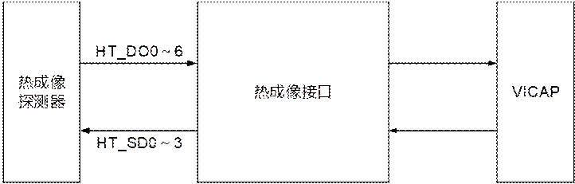

#### OOC校正

每个像素对应的OOC值先按照一定格式存储在DDR，VICAP从DDR读取后发送给热成像接口，热成像接口按照特定时序发送给热成像探测器。

OOC校正数据流

#### 热成像时序解析

热成像接口将特定时序转换成DC时序发送给VICAP。

热成像时序解析

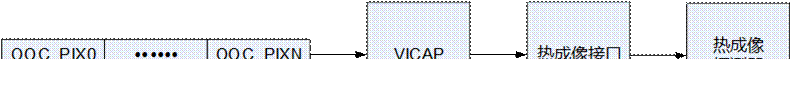

### 工作方式

#### 配置流程

上电启动。

根据使用场景配置相应的管脚复用。

配置CRG寄存器中的PERI\_CRG4496，打开热成像时钟门控。配置热成像接口软复位，撤销复位。

配置CRG寄存器中的PERI\_CRG4498，配置热成像主时钟频率。配置热成像APB总线，VI侧热成像控制器软复位，撤销复位。

配置VI侧热成像控制器相关寄存器。

VI port1的视频源配置为热成像。

根据使用场景配置热成像接口模块相关寄存器。

配置热成像探测器序列。

---结束

### 热成像控制器寄存器概览

热成像寄存器控制器概览如表11-15所示。

热成像控制器寄存器概览（基址：0x0\_173D\_0000）

| 偏移地址 | 名称 | 描述 | 页码 |
| --- | --- | --- | --- |
| 0x0100 | THERMO\_WIDTH\_CFG | 宽度配置寄存器。 | 11-287 |
| 0x0170 | THERMO\_IMGSIZE | 图像宽高统计寄存器。 | 11-287 |
| 0x0300 | THERMO\_OUTPUT\_MUX | 热成像控制器4个输出管脚功能选择寄存器。 | 11-287 |

### 热成像控制器寄存器描述

#### THERMO\_WIDTH\_CFG

THERMO\_WIDTH\_CFG为宽度配置寄存器。

Offset Address: 0x0100 Total Reset Value: 0x0000\_0100

|  |  |  |  |  |
| --- | --- | --- | --- | --- |
| Bits | Access | Name | Description | Reset |
| [31:16] | - | reserved | 保留。 | 0x0000 |
| [15:0] | RW | T0\_cfg\_width | 对接T0模式探测器时配置的宽度(配置值为实际宽度的一半)。 | 0x0100 |

#### THERMO\_IMGSIZE

THERMO\_IMGSIZE为T0模式探测器图像宽高统计寄存器。

Offset Address: 0x0170 Total Reset Value: 0x0000\_0000

| Bits | Access | Name | Description | Reset |
| --- | --- | --- | --- | --- |
| [31:16] | RO | reserved | 保留。 | 0x0000 |
| [15:0] | RO | imgwidth\_statis | 图像宽度统计。 | 0x0000 |

#### THERMO\_OUTPUT\_MUX

THERMO\_OUTPUT\_MUX为热成像控制器4个输出管脚功能选择寄存器。

Offset Address: 0x0300 Total Reset Value: 0x0000\_8810

| Bits | Access | Name | Description | Reset |
| --- | --- | --- | --- | --- |
| [31:16] | RO | reserved | 保留。 | 0x0000 |
| [15:12] | RW | sd3\_mux | SD3管脚功能选择。  0x0：T0\_sd0  0x1：T0\_sd1  0x2：T1\_sda  0x3：T1\_fs  0x4：T2\_sda0/T3\_sda0  0x5：T2\_sda1/T3\_sda1  0x6：T2\_sda2/T3\_sda2  0x7：T2\_fs  0x8：输出固定为0  其他：保留。 | 0x8 |
| [11:8] | RW | sd2\_mux | SD2管脚功能选择。  0x0：T0\_sd0  0x1：T0\_sd1  0x2：T1\_sda  0x3：T1\_fs  0x4：T2\_sda0/T3\_sda0  0x5：T2\_sda1/T3\_sda1  0x6：T2\_sda2/T3\_sda2  0x7：T2\_fs  0x8：输出固定为0  其他：保留。 | 0x8 |
| [7:4] | RW | sd1\_mux | SD1管脚功能选择。  0x0：T0\_sd0  0x1：T0\_sd1  0x2：T1\_sda  0x3：T1\_fs  0x4：T2\_sda0/T3\_sda0  0x5：T2\_sda1/T3\_sda1  0x6：T2\_sda2/T3\_sda2  0x7：T2\_fs  0x8：输出固定为0  其他：保留。 | 0x1 |
| [3:0] | RW | sd0\_mux | SD0管脚功能选择。  0x0：T0\_sd0  0x1：T0\_sd1  0x2：T1\_sda  0x3：T1\_fs  0x4：T2\_sda0/T3\_sda0  0x5：T2\_sda1/T3\_sda1  0x6：T2\_sda2/T3\_sda2  0x7：T2\_fs  0x8：输出固定为0  其他：保留。 | 0x0 |

