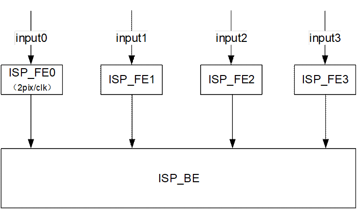
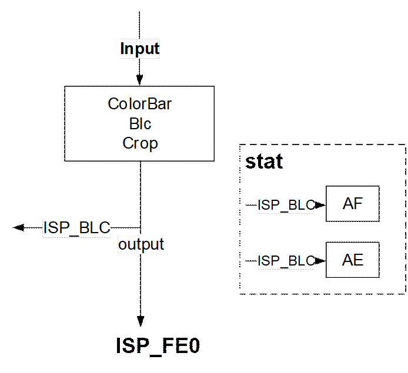
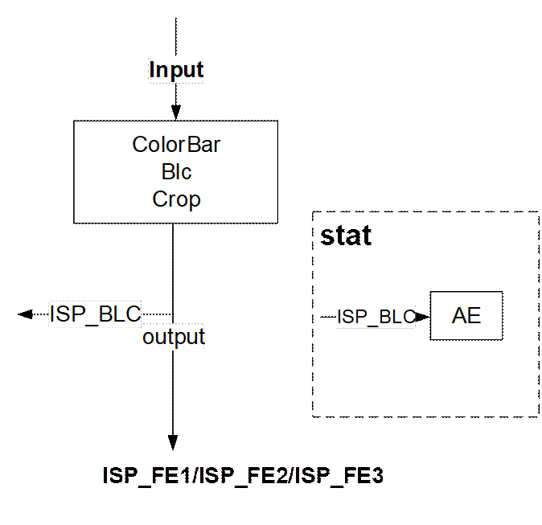
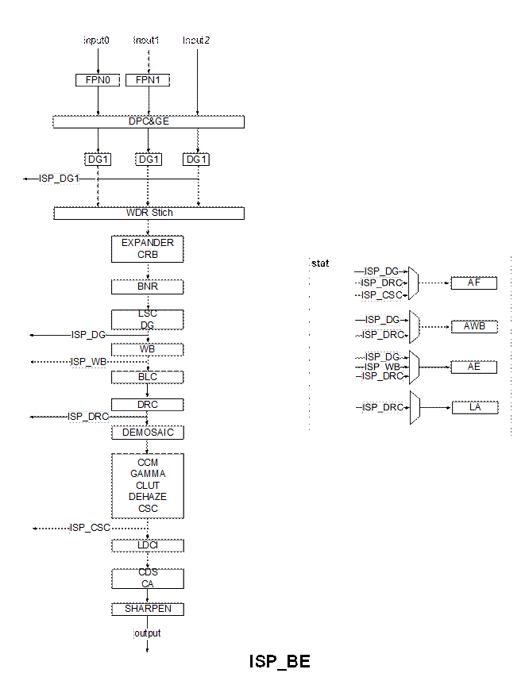
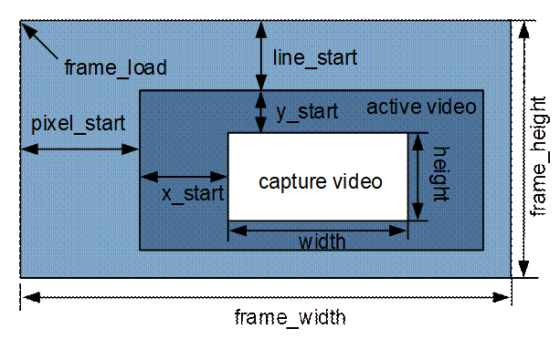
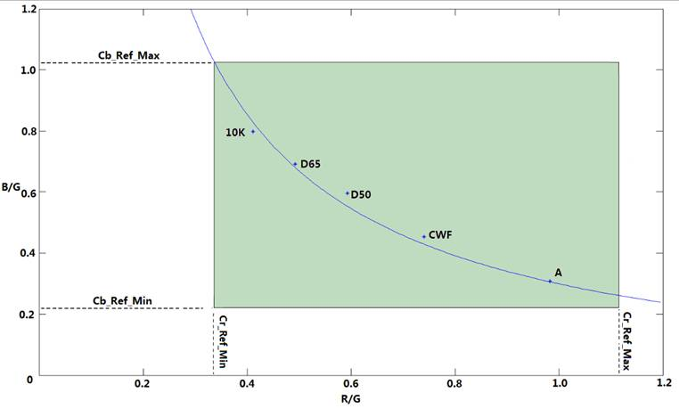
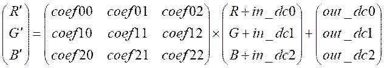
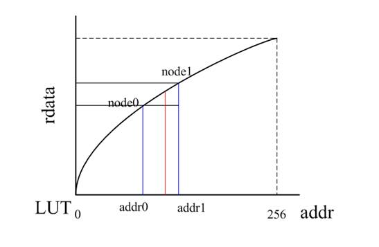
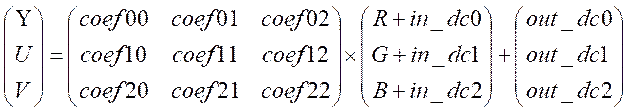
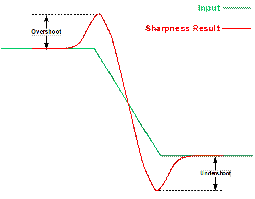

目 录

[12 ISP 12-1](#_Toc110602509)

[12.1 功能简介 12-1](#_Toc110602510)

[12.2 总体概要 12-2](#_Toc110602511)

[12.3 工作模式 12-5](#_Toc110602512)

[12.4 ISP中断系统 12-7](#_Toc110602513)

[12.5 模块功能 12-9](#_Toc110602514)

插图目录

[图12-1 ISP 整体结构图 12-3](#_Toc110602524)

[图12-2 ISP\_FE 结构图 12-3](#_Toc110602525)

[图12-3 ISP\_BE 结构图 12-5](#_Toc110602526)

[图12-4 中断时序示意图 12-8](#_Toc110602527)

[图12-5 有效图像区域与水平垂直消隐关系图 12-9](#_Toc110602528)

[图12-6 AWB有效像素颜色空间 12-14](#_Toc110602529)

[图12-7 Gamma曲线 12-16](#_Toc110602530)

[图12-8 锐化、过冲说明 12-17](#_Toc110602531)

表格目录

[表12-1 外接ISP关键参数 12-6](#_Toc110602532)

[表12-2 位置可调模块关键参数 12-6](#_Toc110602533)

[表12-3 中断指示寄存器 12-7](#_Toc110602534)

[表12-4 中断时序 12-8](#_Toc110602535)

[表12-5 AE区域统计信息 12-11](#_Toc110602536)

[表12-6 AE直方图统计信息 12-12](#_Toc110602537)

[表12-7 AWB区域统计方式A信息 12-14](#_Toc110602538)

# ISP

## 功能简介

ISP 模块支持标准的Sensor图像数据处理，包括自动白平衡、自动曝光、Demosaic、坏点矫正及镜头阴影矫正等基本功能，也支持WDR(Wide Dynamic Range)、DRC(Dynamic Range Compression)、降噪等高级处理功能。 ISP主要支持的图像处理功能如下：

- 支持黑电平校正BLC(Black Level Correction)
- 支持静态以及动态坏点校正，坏点簇矫正
- 支持固定噪声消除
- 支持Bayer降噪
- 支持Demosaic处理
- 支持紫边校正CAC（Chromatic aberration correction）
- 支持Gamma校正
- 支持动态范围压缩DRC（Dynamic Range Compression）
- 支持Sensor内部合成宽动态功能（Sensor Built-in WDR）
- 最大支持3合1 宽动态功能WDR
- 支持自动白平衡AWB(Automatic White Balance)
- 支持自动曝光AE(Automatic Exposure)
- 支持3A相关统计信息输出
- 支持镜头阴影校正LSC(Lens shading correction)
- 支持图像锐化
- 支持自动去雾处理
- 支持颜色三维查找表增强
- 支持局部对比度增强
- 支持色彩自适应CA（Chroma Adjust）
- 支持3D降噪

处理能力以及其他功能：

- 最大支持14 bit bayer数据输入
- Built-in WDR最大支持16 bit bayer数据输入
- 支持最大图像分辨率4096x8192（不分块），8192 x8192（分块）
- 支持最小图像分辨率120x 120
- 最小水平消隐区64像素
- 最小垂直消隐区40行(DRC打开时最小64行)
- 最大性能：3840×2160@60fps

## 总体概要

#### 功能框图

ISP的功能结构图如图12-1、图12-2、图12-3所示。此图与本文中提到的ISP\_FE(ISP Front End)均代指ISP pipeline中FPN（不包含）之前的部分，ISP\_BE(ISP Back End)均代指ISP pipeline中FPN（包含）之后的部分。

<strong><big>说明</big></strong>

本文中ISP采用U\*.\*、S\*.\*表示无符号数和有符号数。如：U8.8表示数据类型为无符号数，整数部分8bit，小数部分8bit；同理，S8.8表示数据类型为有符号数，整数部分8bit（包括1bit符号位），小数部分8bit。

ISP 整体结构图

ISP\_FE 结构图

ISP\_BE 结构图

## 工作模式

- **支持最大14bit bayer 数据输入**

当输入数据位宽小于14bit，自动对输入图像数据进行高位对齐、低位补零处理。此模式下支持任意RGrGbB顺序。

- **支持Sensor Bulit-in WDR**

Sensor Bulit-in WDR模式下，支持最大 16bit bayer 数据输入。

- **支持3合1 WDR**
- **支持亮度单分量模式**

支持丢弃C（U、V）分量，只输出Y分量图像数据。

- ISP\_BE**支持分时复用**

分时复用应用场景举例如下：

例1：4路ISP\_FE输入，ISP\_FE0/ISP\_FE1/ISP\_FE2/ISP\_FE3时钟频率300MHz。ISP\_BE 可以分时处理ISP\_FE0 - ISP\_FE3 4路数据。

<strong><big>说明</big></strong>

ISP\_FE/ISP\_BE频率可分别配置，请参考3.2.6 CRG小节的寄存器。

- **支持外接ISP**

支持外接ISP模式，关键参数如下：

外接ISP关键参数

|  |  |
| --- | --- |
| 参数名称 | 描述 |
| ISP\_BE\_INPUT\_MUX[16] | ISP数据输入选择。  0：RAW输入；  1：YUV输入。 |

- **支持模块位置可调**

AE、AWB、AF、CLUT支持位置可调。

位置可调模块关键参数

| 参数名称 | 参数说明 |
| --- | --- |
| ISP\_BE\_MODULE\_POS[5:4] | AF位置调节寄存器。  00：AF在DG后面；  01：AF在DRC Dither后面；  10：AF在CSC之后； |
| ISP\_BE\_MODULE\_POS[3:2] | AWB位置调节寄存器。  00：AWB在DG后面；  10：AWB在DRC Dither后面； |
| ISP\_BE\_MODULE\_POS[14:12] | AE位置调节寄存器。  000：AE在DG后面；  001：AE在WB后面；  010：AE在DRC Dither后面。 |
| ISP\_BE\_MODULE\_POS[7] | CLUT位置调节寄存器。  0：CLUT在SQRT1后面；  1：CLUT在Demosaic后面。 |

## ISP中断系统

#### 功能描述

现ISP有34个硬件中断事件，详细见表12-3所示。

中断指示寄存器

| 偏移地址 | 32bit | 描述（写1清零，0：无中断1：有中断） |
| --- | --- | --- |
| 0x200F0+FE\_N\*0x20000 | bit[6] | AF统计完成中断。(仅FE0支持) |
| bit[5] | 动态 BLC统计完成中断。 |
| bit[4] | AE统计完成中断。 |
| bit[3] | ISP FE触发位置可配中断。可支持输入图像有效区以行为单位的任意位置触发。 |
| bit[2] | ISP FE寄存器配置丢失中断。 |
| bit[1] | ISP FE寄存器更新中断。 |
| bit[0] | ISP FE帧起始中断。 |
| 0x00310 | bit[28] | LA统计完成中断。 |
| bit[26] | DEHAZE统计完成中断。 |
| bit[25] | LDCI统计完成中断。 |
| bit[22] | AF统计完成中断。 |
| bit[21] | AWB统计完成中断。 |
| bit[20] | AE统计完成中断。 |
| bit[18] | ISP BE寄存器配置丢失中断。 |
| bit[17] | ISP BE寄存器更新中断。 |
| bit[16] | ISP BE帧起始中断。 |

<strong><big>说明</big></strong>

\* FE\_N, 分别对应ISP整体架构图中FE0~FE3，分别对应配置FE0~FE3的寄存器，基址是0x1740\_0000。

#### 中断时序

很多中断的位置是由ISP模块开关、寄存器配置决定。图12-4为各个中断位置的示意图，注意图中中断位置是以一帧内时间前后关系排列。表12-4为图12-4中断序号与中断事件的对应表格。

中断时序示意图

<strong><big>须知</big></strong>

中断时序

| 序号 | 中断事件 |
| --- | --- |
| 1 | fstart(ISP\_FE)/fstart(ISP\_BE) |
| 2 | cfg\_loss(ISP\_FE)/cfg\_loss(ISP\_BE)  update\_cfg(ISP\_FE) /update\_cfg(ISP\_BE) |
| 3 | fstart\_delay(ISP\_FE) |
| 4 | ae\_int |
| 5 | af\_int |
| 6 | LA 统计完成中断  DEHAZE 统计完成中断  LDCI 统计完成中断 |

## 模块功能

#### Crop

该模块实现对输入图像裁剪的功能。实际显示的视图区域常常包含在有效视频范围之内，相对有效视频的边界有若干像素缩小。如图12-5所示。

有效图像区域与水平垂直消隐关系图

#### FPN

FPN(Fixed Pattern Noise)通过标定的黑帧或黑行对Sensor输入的图像进行校正，达到去除Sensor FPN的目的。

FPN支持帧模式的标定和校正。在对接FPN比较明显的Sensor需要开启，Sensor如果FPN不明显，则不需要开。

#### BLC

BLC(Black Level Correction)提供Sensor相关的黑电平校正。分别提供4个分量（R，Gr，Gb，B）的偏移量设置。

#### DPC

DPC(Defect Pixel Correction)提供对静态坏点和动态坏点的检测和校正功能。

- 对于静态坏点，用户可在软件和硬件配合下对Sensor的静态坏点进行检测，将全部坏点坐标保存在外部存储器，ISP工作时根据坐标位置对坏点进行校正处理。
- 对于动态坏点，本模块可根据用户设置的阈值进行自动检测并实时校正，本模块支持单通道2像素以内的坏点簇校正。
#### GE

GE模块校正Gr与Gb两个通道的失衡，提高部分场景的图像质量。

#### WDR

WDR(Wide Dynamic Range)提供多帧合成宽动态功能。在动态范围较大的场景仍然可以看到亮区和暗区细节。

#### CRB

CRB(Color Rebalance) 在WDR模式下改善暗区偏红的问题。

#### Expander

将sensor内部压缩的数据，进行解压缩。

#### Bayer NR

该模块在Bayer domain中实现对图像的去噪，目的是去除噪声的同时，保留细节。该模块可根据用户提供的噪声模型有针对性的对Sensor进行噪声消除。

#### LSC

LSC(Lens shading correction)用于镜头阴影校正。由于镜头的光学特性，会导致Sensor影像边缘区域接收的光强比中心小，因此需要根据像素的位置做一个增益的补偿。

LSC可以提供4个分量（R，Gr，Gb，B）的增益，每个增益的精度可调（由meshScale控制）。通过对整幅图像进行上下左右对称分窗（分窗数为32x32），并提供窗口顶点增益，其余的点通过插值得到。插值求得的增益与对应的像素点值相乘输出补偿后的图像数据。

#### DG

DG(Digital Gain)提供数字增益。分别提供4个分量（R，Gr，Gb，B）的增益设置，精度为U8.8。

#### LA

LA(Luma Average)模块统计DRC后分块均值，与AE统计分块均值相比，可以得出分块均值增益最大值。LA统计信息包含8bit精度分块R/Gr/Gb/B均值统计，分块最大支持17\*15。

#### AE

AE(Automatic Exposure)实现自动曝光信息的统计，软件根据统计信息调节Sensor可实现自动曝光的功能。AE统计信息包含分区间的R/Gr/Gb/B均值统计、带权重的全局R/Gr/Gb/B均值、1024段直方图信息。

- AE 区域统计信息

AE最大支持17×15分块，最小支持1×1分块，每个分块均可以输出R，Gr，Gb，B均值（Average R/Gr/Gb/B）。区块的统计信息读取地址与数据的对应关系如表12-5所示。m表示水平分区个数，n表示垂直分区个数。

AE区域统计信息

| 存储器地址 | Zone | 存储器读数据 | | | |
| --- | --- | --- | --- | --- | --- |
| MEM\_AVER\_R\_GR [31:16] | MEM\_AVER\_R\_GR [15:0] | \_MEM\_AVER\_GB\_B [31:16] | \_MEM\_AVER\_GB\_B [15:0] |
| 0 | 0 | Average R | Average Gr | Average Gb | Average B |
| 1 | 1 | Average R | Average Gr | Average Gb | Average B |
| 2 | 2 | Average R | Average Gr | Average Gb | Average B |
| 3 | 3 | Average R | Average Gr | Average Gb | Average B |
| …………………… | | | | | |
| m\*n-3 | m\*n-3 | Average R | Average Gr | Average Gb | Average B |
| m\*n-2 | m\*n-2 | Average R | Average Gr | Average Gb | Average B |
| m\*n-1 | m\*n-1 | Average R | Average Gr | Average Gb | Average B |

- 带权重的AE全局统计信息

与AE的区域统计信息基本一致，对于整幅图像，AE也提供了4个全局统计信息。其物理意义与分块统计一致。

- 带权重的AE直方图信息

AE提供1024阶直方图统计0-1023，直方图信息读取地址与数据的对应关系如表12-6所示。

AE直方图统计信息

| 存储器地址 | Zone | 存储器读数据 | |
| --- | --- | --- | --- |
| [31:29] | [28:0] |
| 0 | 0 | 0 | Pixel Value为0的个数 |
| 1 | 1 | 0 | Pixel Value为1的个数 |
| 2 | 2 | 0 | Pixel Value为2的个数 |
| 3 | 3 | 0 | Pixel Value为3的个数 |
| …………………… | | | |
| 1022 | 1022 | 0 | Pixel Value为1022的个数 |
| 1023 | 1023 | 0 | Pixel Value为1023的个数 |

#### AF统计信息

AF(Auto Focus)支持图像清晰度评价信息统计。图像区块数目可配，区块个数最大17×15，区块宽高最小32×32，区块宽高最大1023×1023，每个区域分别提供清晰度评价信息。

#### AWB

AWB(Auto White Balance Correction)统计信息包含全局统计信息和区域统计信息。

- 全局统计信息：整幅图像的R，G，B均值，以及有效统计点的个数。
- 区域统计信息的分块统计方式：
- 支持最大区块个数32×32，每个分块均可以输出RGB均值，以及有效统计点的个数。
- 有效统计点定义：亮度要满足配置的RGB上限与下限要求，颜色需要满足配置的有效像素颜色空间限制要求。

AWB有效像素颜色空间

- AWB 区域统计信息：

AWB中最大支持图像的32×32分块，每个分块均可以输出RGB均值（Average R/G/B）。其中统计的像素点均为16bit，分块内统计点的个数统计值为有效点个数Count All。点数统计值均已根据图像大小做了归一化处理，归一化到16bit。区块的统计信息读取地址与数据的对应关系如表12-7所示。

AWB区域统计方式A信息

| 存储器地址 | Zone | 存储器读数据 | |
| --- | --- | --- | --- |
| [31:16] | [15:0] |
| 0 | 0 | Average G | Average R |
| 1 | 0 | Count All | Average B |
| 2 | 1 | Average G | Average R |
| …………………… | | | |
| 2046 | 1023 | Average G | Average R |
| 2047 | 1023 | Count All | Average B |

- AWB 全局统计信息：

与AWB的区域统计信息基本一致，对于整幅图像，AWB也提供了四个全局统计信息。其物理意义与分块统计一致。

#### WB

WB(White Balance)提供白平衡功能。分别提供4个分量（R，Gr，Gb，B）的增益设置，精度为U4.8。

#### DRC

DRC(Dynamic Range Compression)用于图像动态范围进行压缩。用于调整图像的显示动态范围，使之在显示设备上的显示效果与人眼感知一致。

#### CAC

CAC(Chromatic aberration correction)模块用来校正由镜头引入的轴向色差（紫边）与横向色差（物体相对两侧带有不同颜色的彩色边缘）。

#### DEMOSAIC

Demosaic模块将Bayer格式的Raw图像转换到RGB图像。

该模块可以分析图像内部边缘特征，利用像素相关性插值，在保证较高分辨率和清晰度的同时，有效抑制伪色彩的产生。

#### BAYERSHARP

BayerSharp模块在bayer域实现图像细节增强，提高图像的整体清晰度。

#### CCM

CCM(Color Correction Matrix)通过标准3×3的矩阵和矢量偏移量可完成颜色空间的线性校正。

利用预先计算出的几组CCM系数，Firmware根据图像色温动态计算出当前图像的CCM系数。Firmware也可根据当前图像的亮度情况，利用CCM矩阵动态调整饱和度。

R、G、B是输入数据，coef是一个3×3的可配置矩阵系数。系数均为15bit，格式S5.10。

#### GAMMA

Gamma/preGamma模块应用于rgb/bayer阈，输出Gamma/Pregamma调节结果。该模块根据伽马曲线调整亮度。颜色通道都会根据伽马曲线调整。

Gamma曲线

Gamma曲线由257个节点组成，即0…256，每个节点对应的曲线值为12bit无符号数, 两个节点之间的点通过线性插值得到。gamma[0]= 0、gamma[256]= 0xFFF。

#### DEHAZE

本模块提供强大的分区域去雾能力以改善雾霾场景下视频的对比度和清晰度。

模块对区域内的图像特性进行分析，得到各区域内的对比度指标，然后对区域内的像素进行增强处理，每个像素的增强强度取决于本区域以及周边区域的对比度指标。

#### CSC

CSC(Color Space Conversion)通过标准3×3的矩阵和矢量偏移量将输入{R，G，B}转换为{Y，U，V}。

可根据对转换格式的需求改变参数。

#### SHARPEN

Sharpen模块实现图像的锐化，提高图像的清晰度。通过控制参数edge\_amt和sharp\_amt，可以调节锐化强度，但是太强的锐化可能会放大噪声。软件根据ISO值调整参数配置，达到清晰度和抑制噪声的平衡，提升图像的视觉效果。

锐化、过冲说明

另外，锐化可能造成边沿正向、负向增幅过大，出现白边和黑边现象，如图12-8。通过调整overshoot和undershoot控制参数，能够抑制白边、黑边现象。

#### CDS

CDS(Chroma Down Sample)模块实现YUV444转换到YUV422或YUV420。CDS对色度水平方向进行多阶滤波，当需要输出YUV420时，CDS对色度垂直方向进行平均下采样。通过配置合适的滤波参数，使图像转换的视觉损失最小。

#### CA

CA(Chroma Adjust)提供饱和度调整功能。

#### CLUT

COLOR\_3D\_LUT是利用17x17x17大小的3D LUT实现复杂的颜色调整操作，比如亮度的调整，饱和度的调整，阴影区域，中间亮度区域，高亮区域分别调整。

#### LDCI

LDCI(Local Dynamic Contrast Improvement)基于局域直方图均衡的方法来增强局部的对比度，提升暗区细节，同时对图像中高频进行一定的增强，提升对比度。

