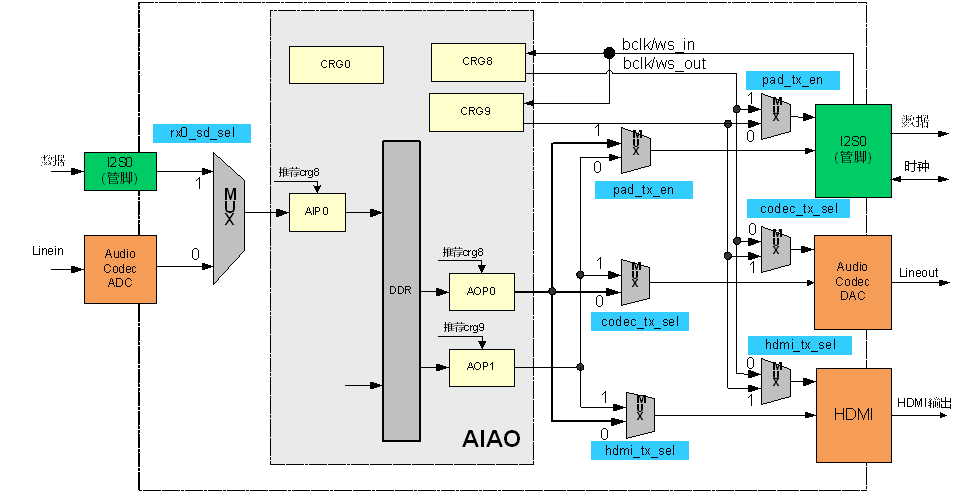
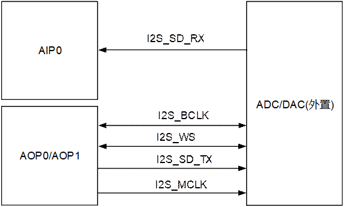
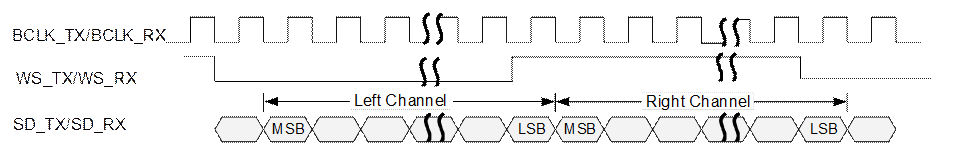
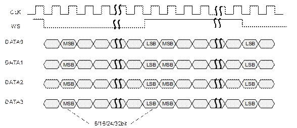
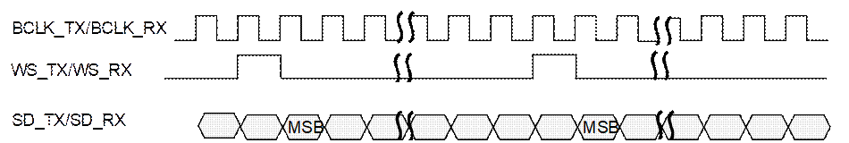
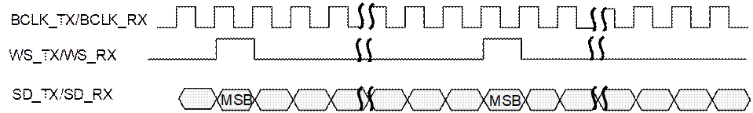
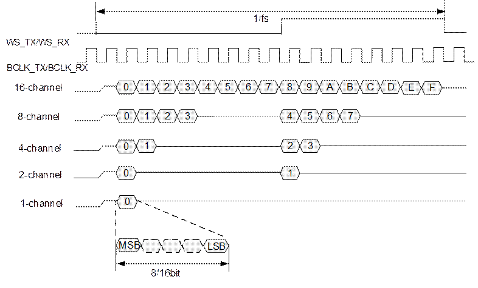

目 录

[13 音频接口 13-1](#_Toc118904304)

[13.1 AIAO 13-1](#_Toc118904305)

[13.1.1 概述 13-1](#_Toc118904306)

[13.1.2 特点 13-2](#_Toc118904307)

[13.1.3 功能描述 13-3](#_Toc118904308)

[13.1.4 工作方式 13-6](#_Toc118904309)

[13.1.5 AIAO寄存器概览 13-7](#_Toc118904310)

[13.1.6 AIAO寄存器描述 13-10](#_Toc118904311)

[13.2 Audio Codec 13-45](#_Toc118904312)

[13.2.1 概述 13-45](#_Toc118904313)

[13.2.2 特点 13-46](#_Toc118904314)

[13.2.3 Audio Codec寄存器概览 13-46](#_Toc118904315)

[13.2.4 Audio Codec寄存器描述 13-47](#_Toc118904316)

插图目录

[图13-1 芯片 AIAO 框图 13-1](#_Toc118904317)

[图13-2 AIP0与AOP0/AOP1通过I2S/PCM接口主/从模式对接外置ADC/DAC示意图 13-3](#_Toc118904318)

[图13-3 I2S接口时序 13-4](#_Toc118904319)

[图13-4 I2S多线模式的时序 13-4](#_Toc118904320)

[图13-5 PCM接口标准模式时序 13-4](#_Toc118904321)

[图13-6 PCM接口自定义模式时序 13-5](#_Toc118904322)

[图13-7 I2S 1/2/4/8/16路接收 13-5](#_Toc118904323)

[图13-8 PCM 1/2/4/8/16路接收，在256fs，offset=1时的示例 13-6](#_Toc118904324)

表格目录

[表13-1 各模块的寄存器偏移地址变量表 13-7](#_Toc118906522)

[表13-2 AIAO寄存器概览（基址：0x0\_17C0\_0000） 13-7](#_Toc118906523)

[表13-3 Audio Codec寄存器概览（基址：0x0\_17C4\_0000） 13-46](#_Toc118906524)

# 音频接口

## AIAO

### 概述

音频输入输出接口AIAO（Audio Input/Audio Output），用于和片内或片外Audio Codec对接，完成音频数据的输入和输出，以实现录音、对讲、回放等功能。芯片内置1个AIAO，包含1个AIP（Audio Input Port）和2个AOP（Audio Output Port），支持立体声输入输出。AOP0和AOP1通过MUX选择输出实现与I2S管脚、内置Codec、HDMI在芯片内部对接，基本模块框图如图13-1所示。

芯片 AIAO 框图

<strong><big>说明</big></strong>

- 橙色表示模拟PHY
- 绿色表示管脚
- 蓝色表示AIAO\_MUX\_SEL寄存器

### 特点

AIAO接口支持I2S和PCM（Pulse Code Modulation）两种模式和外置Codec对接。

- AIAO接口支持I2S模式和内置Codec对接，内置Codec的寄存器配置参考13.2 Audio Codec章节。
- AIAO接口支持I2S模式和内置的HDMI TX对接。

接收（AIP0）和发送（AOP0/AOP1）均采用DMA操作，通过软件开辟的循环缓冲区存取数据，循环缓冲区大小和水线可调。

#### PCM模式

PCM模式有如下特点：

- 支持主模式/从模式。
- 支持1路8bit/16bit数据的发送。
- 支持1/2/4/8/16路8/16 bit数据的接收。
- 支持8KHz～96KHz采样率。
- PCM模式帧同步信号仅支持短脉冲同步信号（同步信号的持续时间为1个时钟周期），支持标准和自定义两种模式。
- 接收（AIP0）和发送（AOP0/AOP1）相互独立，可以单独使能或关闭。
#### I2S模式

i2s模式有如下特点：

- 支持主模式/从模式。
- AIP0既支持非时分复用模式下1路16bit/24bit数据的接收，也支持时分复用模式下2/4/8/16路8/16bit数据的接收。
- AOP0和AOP1均既支持时分复用模式下8路 16/24bit数据的发送，也支持非时分复用模式下的1/2/8路16/24bit数据的发送。
- 支持8KHz～96KHz采样率。
- 接收（AIP0）和发送（AOP0/AOP1）相互独立，可以单独使能或关闭。

### 功能描述

#### 典型应用

芯片内置1个AIP和2个AOP，其中：

- AIP0/AOP 0/AOP 1对接内置Audio Codec时，仅支持I2S主模式
- AIP0支持I2S/PCM主/从模式对接外置Audio Codec
- AOP0/AOP1支持I2S/PCM主/从模式对接外置Audio Codec。
- AOP0/AOP1对接内置HDMI时，仅支持I2S主模式。

AIP0与AOP0/AOP1通过I2S/PCM接口主/从模式对接外置ADC/DAC示意图

#### 功能原理

AIP0通过I2S接收对接外置ADC或内置的Audio Codec进行AD（Analog-to-Digital）转换后的音频数据，存入为AIP0开辟的循环缓冲区，然后由CPU取走并存储，从而完成录音功能。

AOP0/1从循环缓冲区中读取音频数据，然后按照设定的采样率，把音频数据通过I2S或PCM接口传送给外置DAC或内置的Audio Codec进行DA（Digital-to-Analog）转换内置；或者把音频数据通过I2S接口发送给对接内置的HDMI，通过HDMI接口进行声音播放。

对接外部i2s接口时，支持的I2S时序如图13-3。

I2S接口时序

I2S多线模式的时序

I2S采用MSB FIRST方式传输，数据与WS信号使用BCLK的下降沿发出，在BCLK的上升沿采样。数据相对WS信号延迟一个BCLK周期。

对接外部PCM接口时，支持PCM标准时序和数据左对齐时序。标准时序如图13-5。

PCM接口标准模式时序

PCM模式采用MSB FIRST方式传输，数据与WS信号使用BCLK上升沿发出，在BCLK下降沿被采样。标准模式中数据相对于WS信号延迟一个BCLK周期。

PCM自定义模式时序如图13-6所示。

PCM接口自定义模式时序

自定义模式时，数据与WS脉冲同拍开始发出。

I2S进行多路（2/4/8/16路8/16bit）接收时，数据分别放于I2S时序的左右声道，如图13-7所示。

I2S 1/2/4/8/16路接收

注：1-channel模式仅在非时分复用时支持。

PCM模式下的多路接收，如图13-8所示。支持PCM标准和自定义两种模式，AIAO可以选择数据采样时刻（上升沿或下降沿）接收。图13-8中以上升沿为例。

PCM 1/2/4/8/16路接收，在256fs，offset=1时的示例

<strong><big>须知</big></strong>

注：1-channel模式仅在非时分复用时支持。

### 工作方式

#### 时钟门控及时钟配置

在使能AIAO进行录音或播放时，必须先打开AIAO中对应通道（AIP/AOP）的时钟门控。具体步骤如下：

在系统PERI\_CRG10784寄存器中aiao\_pll\_cksel配置为1，选择786.432MHz时钟源。

在系统PERI\_CRG10784寄存器中，配置aiao\_srst\_req寄存器为0，解除AIAO复位，配置aiao\_pll\_cken寄存器为1，打开时钟门控。

在AIAO中AIAO\_MUX\_SEL寄存器中，配置时钟和数据的MUX关系。

配置分频系数。

配置AIAO寄存器的I2S\_CRG\_CFG0\_00、I2S\_CRG\_CFG1\_00 /I2S\_CRG\_CFG0\_08、I2S\_CRG\_CFG1\_08/I2S\_CRG\_CFG0\_09、I2S\_CRG\_CFG1\_09。选择合适的分频系数。CRG和AIP、AOP的对应关系见AIAO 框图。

----结束

#### 软复位

AIAO内部的3个通道（AIP0、AOP0、AOP1）支持独立的软复位，当复位AIAO模块时，3条通道同时复位。

### AIAO寄存器概览

各模块的寄存器偏移地址中变量的取值范围和含义如表13-1所示。

各模块的寄存器偏移地址变量表

| 变量名称 | 取值范围 | 描述 |
| --- | --- | --- |
| m | 0～1 | 发送通道号。 |
| n | 0 | 接收通道号 |

AIAO寄存器概览如表13-2所示。

AIAO寄存器概览（基址：0x0\_17C0\_0000）

| 偏移地址 | 名称 | 描述 | 页码 |
| --- | --- | --- | --- |
| 0x0000 | AIAO\_INT\_ENA | AIAO模块中断使能寄存器 | 13-10 |
| 0x0004 | AIAO\_INT\_STATUS | AIAO模块中断状态寄存器 | 13-11 |
| 0x0008 | AIAO\_INT\_RAW | AIAO模块原始中断寄存器 | 13-12 |
| 0x0028 | AIAO\_SWITCH\_RX\_BCLK | AIAO I2S RX BCLK SWITCH 配置寄存器 | 13-13 |
| 0x002C | AIAO\_SWITCH\_TX\_BCLK | AIAO I2S TX BCLK SWITCH 配置寄存器 | 13-13 |
| 0x0034 | VHB\_OUTSTANDING | VHB\_OUTSTANDING配置寄存器 | 13-14 |
| 0x006C | AIAO\_MUX\_SEL | I2S通路选择控制寄存器 | 13-14 |
| 0x0100 | I2S\_CRG\_CFG0\_00 | I2S00 CRG 配置0号寄存器 | 13-15 |
| 0x0104 | I2S\_CRG\_CFG1\_00 | I2S00 CRG 配置1号寄存器 | 13-16 |
| 0x0140 | I2S\_CRG\_CFG0\_08 | I2S08 CRG 配置0号寄存器 | 13-18 |
| 0x0144 | I2S\_CRG\_CFG1\_08 | I2S08 CRG 配置1号寄存器 | 13-18 |
| 0x0148 | I2S\_CRG\_CFG0\_09 | I2S09 CRG 配置0号寄存器 | 13-20 |
| 0x014C | I2S\_CRG\_CFG1\_09 | I2S09 CRG 配置1号寄存器 | 13-20 |
| 0x1000＋0x100×n | RX\_IF\_ATTRI | 接收通道的接口属性设置寄存器 | 13-22 |
| 0x1004＋0x100×n | RX\_DSP\_CTRL | 接收处理通道的控制寄存器 | 13-25 |
| 0x107C＋0x100×n | RX\_BUFF\_SADDR\_HI | 接收通道的DDR缓存起始地址寄存器高32bit | 13-25 |
| 0x1080＋0x100×n | RX\_BUFF\_SADDR\_LOW | 接收通道的DDR缓存起始地址寄存器低32bit | 13-26 |
| 0x1084＋0x100×n | RX\_BUFF\_SIZE | 接收通道的DDR缓存大小寄存器 | 13-26 |
| 0x1088＋0x100×n | RX\_BUFF\_WPTR | 接收通道的DDR缓存写地址寄存器 | 13-26 |
| 0x108C＋0x100×n | RX\_BUFF\_RPTR | 接收通道的DDR缓存读地址寄存器 | 13-27 |
| 0x1090＋0x100×n | RX\_BUFF\_ALFULL\_TH | 接收通道的DDR缓存几乎满水线寄存器 | 13-27 |
| 0x1094＋0x100×n | RX\_TRANS\_SIZE | 接收通道的数据传输长度寄存器 | 13-28 |
| 0x1098＋0x100×n | RX\_WPTR\_TMP | 上报传输完成中断时，保存接收通道的写地址寄存器 | 13-28 |
| 0x10A0＋0x100×n | RX\_INT\_ENA | 接收通道的中断使能寄存器 | 13-28 |
| 0x10A4＋0x100×n | RX\_INT\_RAW | 接收通道的原始中断寄存器 | 13-29 |
| 0x10A8＋0x100×n | RX\_INT\_STATUS | 接收通道的中断状态寄存器 | 13-30 |
| 0x10AC＋0x100×n | RX\_INT\_CLR | 接收通道的中断清除寄存器 | 13-31 |
| 0x2000＋0x100×m | TX\_IF\_ATTRI | 发送通道的接口属性设置寄存器 | 13-32 |
| 0x2004＋0x100×m | TX\_DSP\_CTRL | 发送处理通道的控制寄存器 | 13-36 |
| 0x207C＋0x100×m | TX\_BUFF\_SADDR\_HI | 发送通道的DDR缓存起始地址寄存器高32bit | 13-38 |
| 0x2080＋0x100×m | TX\_BUFF\_SADDR\_LOW | 发送通道的DDR缓存起始地址寄存器低32bit | 13-38 |
| 0x2084＋0x100×m | TX\_BUFF\_SIZE | 发送通道的DDR缓存大小寄存器 | 13-38 |
| 0x2088＋0x100×m | TX\_BUFF\_WPTR | 发送通道的DDR缓存写地址寄存器 | 13-39 |
| 0x208C＋0x100×m | TX\_BUFF\_RPTR | 发送通道的DDR缓存读地址寄存器 | 13-39 |
| 0x2090＋0x100×m | TX\_BUFF\_ALEMPTY\_TH | 发送通道的DDR缓存几乎空水线寄存器 | 13-40 |
| 0x2094＋0x100×m | TX\_TRANS\_SIZE | 发送通道的数据传输长度寄存器 | 13-40 |
| 0x2098＋0x100×m | TX\_RPTR\_TMP | 上报传输完成中断时，保存发送通道的读地址寄存器 | 13-40 |
| 0x20A0＋0x100×m | TX\_INT\_ENA | 发送通道的中断使能寄存器 | 13-41 |
| 0x20A4＋0x100×m | TX\_INT\_RAW | 发送通道的原始中断寄存器 | 13-42 |
| 0x20A8＋0x100×m | TX\_INT\_STATUS | 发送通道的中断状态寄存器 | 13-43 |
| 0x20AC＋0x100×m | TX\_INT\_CLR | 发送通道的中断清除寄存器 | 13-44 |

### AIAO寄存器描述

<strong><big>说明</big></strong>

寄存器描述中的BCLK是位时钟；MCLK是主时钟；FSCLK是采样时钟。

#### AIAO\_INT\_ENA

AIAO\_INT\_ENA为AIAO模块中断使能寄存器。

Offset Address: 0x0000 Total Reset Value: 0x0000\_0000

| Bits | Access | Name | Description | Reset |
| --- | --- | --- | --- | --- |
| [31:29] | - | reserved | 保留。 | 0x0 |
| [28] | RW | timer1\_int\_ena | TIMER1中断使能，若使能则timer1开始计数，timer1用于计数多少个I2S7采样率时钟上升沿数。  0：不使能；  1：使能。 | 0x0 |
| [27] | RW | timer0\_int\_ena | TIMER0中断使能，若使能则timer0开始计数，timer0用于计数多少个I2S6采样率时钟上升沿数。  0：不使能；  1：使能。 | 0x0 |
| [26:18] | - | reserved | 保留。 | 0x000 |
| [17] | RW | tx\_ch1\_int\_ena | 发送通道1的中断使能。  0：不使能；  1：使能。 | 0x0 |
| [16] | RW | tx\_ch0\_int\_ena | 发送通道0的中断使能。  0：不使能；  1：使能。 | 0x0 |
| [15:1] | - | reserved | 保留。 | 0x0000 |
| [0] | RW | rx\_ch0\_int\_ena | 接收通道0的中断使能。  0：不使能；  1：使能。 | 0x0 |

#### AIAO\_INT\_STATUS

AIAO\_INT\_STATUS为AIAO模块中断状态寄存器。

Offset Address: 0x0004 Total Reset Value: 0x0000\_0000

| Bits | Access | Name | Description | Reset |
| --- | --- | --- | --- | --- |
| [31:29] | - | reserved | 保留。 | 0x0 |
| [28] | RO | timer1\_int\_status | TIMER1的中断状态。  0：无中断状态；  1：有中断状态。 | 0x0 |
| [27] | RO | timer0\_int\_status | TIMER0的中断状态。  0：无中断状态；  1：有中断状态。 | 0x0 |
| [26:18] | - | reserved | 保留。 | 0x000 |
| [17] | RO | tx\_ch1\_int\_status | 发送通道1的中断状态。  0：无中断状态；  1：有中断状态。 | 0x0 |
| [16] | RO | tx\_ch0\_int\_status | 发送通道0的中断状态。  0：无中断状态；  1：有中断状态。 | 0x0 |
| [15:1] | - | reserved | 保留。 | 0x0000 |
| [0] | RO | rx\_ch0\_int\_status | 接收通道0的中断状态。  0：无中断状态；  1：有中断状态。 | 0x0 |

#### AIAO\_INT\_RAW

AIAO\_INT\_RAW为AIAO模块原始中断寄存器。

Offset Address: 0x0008 Total Reset Value: 0x0000\_0000

| Bits | Access | Name | Description | Reset |
| --- | --- | --- | --- | --- |
| [31:29] | - | reserved | 保留。 | 0x0 |
| [28] | RO | timer1\_int\_raw | TIMER1的原始中断。  0：无原始中断；  1：有原始中断。 | 0x0 |
| [27] | RO | timer0\_int\_raw | TIMER0的原始中断。  0：无原始中断；  1：有原始中断。 | 0x0 |
| [26:18] | - | reserved | 保留。 | 0x000 |
| [17] | RO | tx\_ch1\_int\_raw | 发送通道1的原始中断。  0：无原始中断；  1：有原始中断。 | 0x0 |
| [16] | RO | tx\_ch0\_int\_raw | 发送通道0的原始中断。  0：无原始中断；  1：有原始中断。 | 0x0 |
| [15:1] | - | reserved | 保留。 | 0x0000 |
| [0] | RO | rx\_ch0\_int\_raw | 接收通道0的原始中断。  0：无原始中断；  1：有原始中断。 | 0x0 |

#### AIAO\_SWITCH\_RX\_BCLK

AIAO\_SWITCH\_RX\_BCLK为AIAO I2S RX BCLK SWITCH 配置寄存器。

Offset Address: 0x0028 Total Reset Value: 0x7654\_3210

|  |  |  |  |  |
| --- | --- | --- | --- | --- |
| Bits | Access | Name | Description | Reset |
| [31:4] | - | reserved | 保留。 | 0x7654321 |
| [3:0] | RW | inner\_bclk\_ws\_sel\_rx\_00 | 接收通道0内部BCLK选择。  0x0：选择BCLK0；  0x8：选择BCLK8；  0x9：选择BCLK9；  其他：保留。 | 0x0 |

#### AIAO\_SWITCH\_TX\_BCLK

AIAO\_SWITCH\_TX\_BCLK为AIAO I2S TX BCLK SWITCH 配置寄存器。

Offset Address: 0x002C Total Reset Value: 0xFEDC\_BA98

| Bits | Access | Name | Description | Reset |
| --- | --- | --- | --- | --- |
| [31:8] | - | reserved | 保留。 | 0xFEDCBA |
| [7:4] | RW | inner\_bclk\_ws\_sel\_tx\_01 | 发送通道1内部BCLK选择。  0x0：选择BCLK0；  0x8：选择BCLK8；  0x9：选择BCLK9；  其他：保留。 | 0x9 |
| [3:0] | RW | inner\_bclk\_ws\_sel\_tx\_00 | 发送通道0内部BCLK选择。  0x0：选择BCLK0；  0x8：选择BCLK8；  0x9：选择BCLK9；  其他：保留。 | 0x8 |

#### VHB\_OUTSTANDING

VHB\_OUTSTANDING为VHB\_OUTSTANDING配置寄存器。

Offset Address: 0x0034 Total Reset Value: 0x0000\_0000

|  |  |  |  |  |
| --- | --- | --- | --- | --- |
| Bits | Access | Name | Description | Reset |
| [31:3] | - | reserved | 保留。 | 0x00000000 |
| [2:0] | RW | vhb\_outst\_num | VHB OUTSTANDING的个数。  推荐3。 | 0x0 |

#### AIAO\_MUX\_SEL

AIAO\_MUX\_SEL为I2S通路选择控制寄存器。

Offset Address: 0x006C Total Reset Value: 0x0000\_0000

| Bits | Access | Name | Description | Reset |
| --- | --- | --- | --- | --- |
| [31:6] | - | reserved | 保留。 | 0x0000000 |
| [5] | RW | hdmi\_tx\_sel | HDMI输入数据和时钟选择控制。  0：选择AOP0输出，也对应着选择crg8；  1：选择AOP1输出，也对应着选择crg9。 | 0x0 |
| [4] | RW | codec\_tx\_sel | DAC输入数据和时钟选择控制。  0：选择AOP0输出，也对应着选择crg8；  1：选择AOP1输出，也对应着选择crg9。 | 0x0 |
| [3] | RW | audio\_mclk\_sel | 内置Codec\_ADC的mclk选择控制。  0：选择crg0的时钟；  1： 选择crg8或crg9的时钟，具体选crg8或者crg9要通过codec\_tx\_sel来配合选择。 | 0x0 |
| [2] | RW | rx\_sd\_sel | AIP0数据源选择控制。  0：I2S管脚；  1：内置codec\_ADC的输出。 | 0x0 |
| [1] | RW | audio\_rx\_bclk\_sel | 内置Codec\_ADC的bclk/fsclk选择控制。  0：选择crg0的时钟  1：选择crg8或者crg9的时钟，这种情况下，adc和dac共时钟，具体选crg8或crg9要通过codec\_tx\_sel来配合选择。 | 0x0 |
| [0] | RW | pad\_tx\_en | I2S输出管脚数据和时钟选择控制。  0：选择AOP1输出，也对应着选择crg9；  1：选择AOP0输出，也对应着选择crg8。 | 0x0 |

#### I2S\_CRG\_CFG0\_00

I2S\_CRG\_CFG0\_00为I2S00 CRG 配置0号寄存器。

Offset Address: 0x0100 Total Reset Value: 0x00AA\_AAAA

| Bits | Access | Name | Description | Reset |
| --- | --- | --- | --- | --- |
| [31:27] | - | reserved | 保留。 | 0x0 |
| [26:0] | RW | aiao\_mclk\_div | MCLK的分频时钟配置值，配置值为(MCLK/PLL时钟源头频率) × 2^27。 | 0x0AAAAAA |

#### I2S\_CRG\_CFG1\_00

I2S\_CRG\_CFG1\_00为I2S00 CRG 配置1号寄存器。

Offset Address: 0x0104 Total Reset Value: 0x0000\_0131

| Bits | Access | Name | Description | Reset |
| --- | --- | --- | --- | --- |
| [31:16] | - | reserved | 保留。 | 0x0000 |
| [15] | RW | aiao\_ws\_en | WS使能。  0：不使能；  1：使能。 | 0x0 |
| [14] | RW | aiao\_bclk\_en | BCLK使能。  0：不使能；  1：使能。 | 0x0 |
| [13] | RW | aiao\_bclkout\_pctrl | BCLKOUT的极性控制。  0：正向；  1：反向。 | 0x0 |
| [12] | RW | aiao\_bclkin\_pctrl | BCLKIN的极性控制。  0：正向；  1：反向。 | 0x0 |
| [11] | RW | aiao\_bclk\_sel | BCLK/FSCLK选择。  0：时钟从内部产生；  1：时钟从外部输入。 | 0x0 |
| [10] | RW | aiao\_bclk\_oen | BCLK/FSCLK IO oen控制。  0：BCLK/FSCLK IO 为输出；  1：BCLK/FSCLK IO 为输入。  注意：需要和aiao\_bclk\_sel配对使用，实现I2S接口主从模式选择。 | 0x0 |
| [9] | RW | aiao\_srst\_req | 软复位请求。  0：撤消复位；  1：复位。 | 0x0 |
| [8] | RW | aiao\_cken | 时钟状态。  0：关闭；  1：打开。 | 0x1 |
| [7] | - | reserved | 保留。 | 0x0 |
| [6:4] | RW | aiao\_fsclk\_div | 位时钟BCLK与采样时钟FSCLK的分频关系。  000：FSCLK是BCLK的16分频；  001：FSCLK是BCLK的32分频；  010：FSCLK是BCLK的48分频；  011：FSCLK是BCLK的64分频；  100：FSCLK是BCLK的128分频；  101：FSCLK是BCLK的256分频；  其他：FSCLK是BCLK的8分频。 | 0x3 |
| [3:0] | RW | aiao\_bclk\_div | 主时钟MCLK与位时钟BCLK分频关系。  0x0：BCLK是MCLK的1分频；  0x1：BCLK是MCLK的3分频；  0x2：BCLK是MCLK的2分频；  0x3：BCLK是MCLK的4分频；  0x4：BCLK是MCLK的6分频；  0x5：BCLK是MCLK的8分频；  0x6：BCLK是MCLK的12分频；  0x7：BCLK是MCLK的16分频；  0x8：BCLK是MCLK的24分频；  0x9：BCLK是MCLK的32分频；  0xA：BCLK是MCLK的48分频；  0xB：BCLK是MCLK的64分频；  其他：BCLK是MCLK的8分频。 | 0x1 |

#### I2S\_CRG\_CFG0\_08

I2S\_CRG\_CFG0\_08为I2S08 CRG 配置0号寄存器。

Offset Address: 0x0140 Total Reset Value: 0x00AA\_AAAA

|  |  |  |  |  |
| --- | --- | --- | --- | --- |
| Bits | Access | Name | Description | Reset |
| [31:27] | - | reserved | 保留。 | 0x0 |
| [26:0] | RW | aiao\_mclk\_div | MCLK的分频时钟配置值，配置值为(MCLK/PLL时钟源头频率) × 2^27。 | 0x0AAAAAA |

#### I2S\_CRG\_CFG1\_08

I2S\_CRG\_CFG1\_08为I2S08 CRG 配置1号寄存器。

Offset Address: 0x0144 Total Reset Value: 0x0000\_0131

| Bits | Access | Name | Description | Reset |
| --- | --- | --- | --- | --- |
| [31:16] | - | reserved | 保留。 | 0x0000 |
| [15] | RW | aiao\_ws\_en | WS使能。  0：不使能；  1：使能。 | 0x0 |
| [14] | RW | aiao\_bclk\_en | BCLK使能。  0：不使能；  1：使能。 | 0x0 |
| [13] | RW | aiao\_bclkout\_pctrl | BCLKOUT的极性控制。  0：正向；  1：反向。 | 0x0 |
| [12] | RW | aiao\_bclkin\_pctrl | BCLKIN的极性控制。  0：正向；  1：反向。 | 0x0 |
| [11] | RW | aiao\_bclk\_sel | BCLK/FSCLK选择。  0：时钟从内部产生；  1：时钟从外部输入。 | 0x0 |
| [10] | RW | aiao\_bclk\_oen | BCLK/FSCLK IO oen控制。  0 ：BCLK/FSCLK IO 为输出；  1 ：BCLK/FSCLK IO 为输入。  注意：需要和aiao\_bclk\_sel配对使用，实现I2S接口主从模式选择。 | 0x0 |
| [9] | RW | aiao\_srst\_req | 软复位请求。  0：撤消复位；  1：复位。 | 0x0 |
| [8] | RW | aiao\_cken | 时钟状态。  0：关闭；  1：打开。 | 0x1 |
| [7] | - | reserved | 保留。 | 0x0 |
| [6:4] | RW | aiao\_fsclk\_div | 位时钟BCLK与采样时钟FSCLK的分频关系。  000：FSCLK是BCLK的16分频；  001：FSCLK是BCLK的32分频；  010：FSCLK是BCLK的48分频；  011：FSCLK是BCLK的64分频；  100：FSCLK是BCLK的128分频；  101：FSCLK是BCLK的256分频；  其他：FSCLK是BCLK的8分频。 | 0x3 |
| [3:0] | RW | aiao\_bclk\_div | 主时钟MCLK与位时钟BCLK分频关系。  0x0：BCLK是MCLK的1分频；  0x1：BCLK是MCLK的3分频；  0x2：BCLK是MCLK的2分频；  0x3：BCLK是MCLK的4分频；  0x4：BCLK是MCLK的6分频；  0x5：BCLK是MCLK的8分频；  0x6：BCLK是MCLK的12分频；  0x7：BCLK是MCLK的16分频；  0x8：BCLK是MCLK的24分频；  0x9：BCLK是MCLK的32分频；  0xA：BCLK是MCLK的48分频；  0xB：BCLK是MCLK的64分频；  其他：BCLK是MCLK的8分频。 | 0x1 |

#### I2S\_CRG\_CFG0\_09

I2S\_CRG\_CFG0\_09为I2S09 CRG 配置0号寄存器。

Offset Address: 0x0148 Total Reset Value: 0x00AA\_AAAA

|  |  |  |  |  |
| --- | --- | --- | --- | --- |
| Bits | Access | Name | Description | Reset |
| [31:27] | - | reserved | 保留。 | 0x0 |
| [26:0] | RW | aiao\_mclk\_div | MCLK的分频时钟配置值，配置值为(MCLK/PLL时钟源头频率) × 2^27。 | 0x0AAAAAA |

#### I2S\_CRG\_CFG1\_09

I2S\_CRG\_CFG1\_09为I2S09 CRG 配置1号寄存器。

Offset Address: 0x014C Total Reset Value: 0x0000\_0131

| Bits | Access | Name | Description | Reset |
| --- | --- | --- | --- | --- |
| [31:16] | - | reserved | 保留。 | 0x0000 |
| [15] | RW | aiao\_ws\_en | WS使能。  0：不使能；  1：使能。 | 0x0 |
| [14] | RW | aiao\_bclk\_en | BCLK使能。  0：不使能；  1：使能。 | 0x0 |
| [13] | RW | aiao\_bclkout\_pctrl | BCLKOUT的极性控制。  0：正向；  1：反向。 | 0x0 |
| [12] | RW | aiao\_bclkin\_pctrl | BCLKIN的极性控制。  0：正向；  1：反向。 | 0x0 |
| [11] | RW | aiao\_bclk\_sel | BCLK/FSCLK选择。  0：时钟从内部产生；  1：时钟从外部输入。 | 0x0 |
| [10] | RW | aiao\_bclk\_oen | BCLK/FSCLK IO oen控制。  0 ：BCLK/FSCLK IO 为输出；  1 ：BCLK/FSCLK IO 为输入。  注意：需要和aiao\_bclk\_sel配对使用，实现I2S接口主从模式选择。 | 0x0 |
| [9] | RW | aiao\_srst\_req | 软复位请求。  0：撤消复位；  1：复位。 | 0x0 |
| [8] | RW | aiao\_cken | 时钟状态。  0：关闭；  1：打开。 | 0x1 |
| [7] | - | reserved | 保留。 | 0x0 |
| [6:4] | RW | aiao\_fsclk\_div | 位时钟BCLK与采样时钟FSCLK的分频关系。  000：FSCLK是BCLK的16分频；  001：FSCLK是BCLK的32分频；  010：FSCLK是BCLK的48分频；  011：FSCLK是BCLK的64分频；  100：FSCLK是BCLK的128分频；  101：FSCLK是BCLK的256分频；  其他：FSCLK是BCLK的8分频。 | 0x3 |
| [3:0] | RW | aiao\_bclk\_div | 主时钟MCLK与位时钟BCLK分频关系。  0x0：BCLK是MCLK的1分频；  0x1：BCLK是MCLK的3分频；  0x2：BCLK是MCLK的2分频；  0x3：BCLK是MCLK的4分频；  0x4：BCLK是MCLK的6分频；  0x5：BCLK是MCLK的8分频；  0x6：BCLK是MCLK的12分频；  0x7：BCLK是MCLK的16分频；  0x8：BCLK是MCLK的24分频；  0x9：BCLK是MCLK的32分频；  0xA：BCLK是MCLK的48分频；  0xB：BCLK是MCLK的64分频；  其他：BCLK是MCLK的8分频。 | 0x1 |

#### RX\_IF\_ATTRI

RX\_IF\_ATTRI为接收通道的接口属性设置寄存器。

Offset Address: 0x1000＋0x100×n Total Reset Value: 0xE408\_0004

| Bits | Access | Name | Description | Reset |
| --- | --- | --- | --- | --- |
| [31:30] | - | reserved | 保留。 | 0x3 |
| [29:28] | - | reserved | 保留。 | 0x2 |
| [27:26] | - | reserved | 保留。 | 0x1 |
| [25:24] | - | reserved | 保留。 | 0x0 |
| [23:20] | RW | rx\_sd\_source\_sel | 接收通道的输入接口源选择。  0x0：I2S TX0接口；  0x1：I2S TX1接口；  0x8：I2S RX0接口；  其他：保留。 | 0x0 |
| [19] | - | reserved | 保留。 | 0x1 |
| [18:16] | RW | rx\_trackmode | 非时分复用的I2S模式下，左右声道模式控制。  000：不做处理；  001：两个声道全部为左声道声音；  010：两个声道全部为右声道声音；  011：两个声道互换；  100：左右两个声道输出为左右声道相加；  101：左声道静音，右声道播放原右声道声音；  110：右声道静音，左声道播放原左声道声音；  111：左右声道静音。  注意：单声道接收时，trackmode仍然有效。 | 0x0 |
| [15:8] | RW | rx\_sd\_offset | PCM模式下，数据相对帧同步信号延迟n个BCLK周期。  00000000：0 bit clocks；  00000001：1 bit clocks；  00000010：2 bit clocks；  …  11111110：254 bit clocks；  11111111：255 bit clocks。 | 0x00 |
| [7] | RW | rx\_multislot\_en | 时分复用有效指示位。  0：时分复用模式无效，属于正常模式；  1：时分复用模式有效。 | 0x0 |
| [6] | - | reserved | 保留。 | 0x0 |
| [5:4] | RW | rx\_ch\_num | 接收的路数选择。  rx\_multislot\_en = 0  00：1路(ch)接收；(sd0数据线)  01：2路(ch)接收；(sd0数据线)  其他：保留。  rx\_multislot\_en = 1  时分复用方式下，接收的路数选择。  00：2路接收；(sd0数据线)  01：4路接收；(sd0数据线)  10：8路接收；(sd0数据线)  11：16路接收。(sd0数据线)  注意：多路接收时，只用第0根数据线sd0。 | 0x0 |
| [3:2] | RW | rx\_i2s\_precision | 数据采样精度配置位。  rx\_multislot\_en = 0  I2S正常模式：  00：保留；  01：16bit；  10：24bit；  11：保留。  PCM正常模式：  00：8bit；  01：16bit；  rx\_multislot\_en = 1  I2S/PCM模式：  00：8bit；  01：16bit；  其他：保留。 | 0x1 |
| [1:0] | RW | rx\_mode | 接收通道的接口模式选择。  00：I2S模式；  01：PCM模式；  其他：保留。 | 0x0 |

#### RX\_DSP\_CTRL

RX\_DSP\_CTRL为接收处理通道的控制寄存器。

Offset Address: 0x1004＋0x100×n Total Reset Value: 0x2000\_0000

|  |  |  |  |  |
| --- | --- | --- | --- | --- |
| Bits | Access | Name | Description | Reset |
| [31:30] | - | reserved | 保留。 | 0x0 |
| [29] | RO | rx\_disable\_done | 接收通道的停止完成标识位。  0：disable未完成；  1：disable完成。 | 0x1 |
| [28] | RW | rx\_enable | 接收通道的启动、停止指示位。  0：停止；  1：启动。 | 0x0 |
| [27] | RW | bypass\_en | 运算处理bypass，控制功能仍然生效制。  0：bypass功能关闭；  1：bypass功能打开；trackmode功能被bypass | 0x0 |
| [26:0] | - | reserved | 保留。 | 0x0000000 |

#### RX\_BUFF\_SADDR\_HI

RX\_BUFF\_SADDR\_HI为接收通道的DDR缓存起始地址寄存器高32bit。

Offset Address: 0x107C＋0x100×n Total Reset Value: 0x0000\_0000

|  |  |  |  |  |
| --- | --- | --- | --- | --- |
| Bits | Access | Name | Description | Reset |
| [31:0] | RW | rx\_buff\_saddr\_hi | 起始地址的高32bit。 | 0x00000000 |

#### RX\_BUFF\_SADDR\_LOW

RX\_BUFF\_SADDR\_LOW为接收通道的DDR缓存起始地址寄存器低32bit。

Offset Address: 0x1080＋0x100×n Total Reset Value: 0x0000\_0000

|  |  |  |  |  |
| --- | --- | --- | --- | --- |
| Bits | Access | Name | Description | Reset |
| [31:0] | RW | rx\_buff\_saddr\_low | 起始地址的低32bit。 | 0x00000000 |

#### RX\_BUFF\_SIZE

RX\_BUFF\_SIZE为接收通道的DDR缓存大小寄存器。

Offset Address: 0x1084＋0x100×n Total Reset Value: 0x0000\_0032

|  |  |  |  |  |
| --- | --- | --- | --- | --- |
| Bits | Access | Name | Description | Reset |
| [31:24] | - | reserved | 保留。 | 0x00 |
| [23:0] | RW | rx\_buff\_size | 接收通道的DDR缓存大小，以字节为单位。  注意：要求rx\_buff\_size是32字节的整数倍。 | 0x000032 |

#### RX\_BUFF\_WPTR

RX\_BUFF\_WPTR为接收通道的DDR缓存写地址寄存器。

Offset Address: 0x1088＋0x100×n Total Reset Value: 0x0000\_0000

|  |  |  |  |  |
| --- | --- | --- | --- | --- |
| Bits | Access | Name | Description | Reset |
| [31:24] | - | reserved | 保留。 | 0x00 |
| [23:0] | RW | rx\_buff\_wptr | 接收通道的DDR缓存写地址，以字节为单位。  注意：接收方向的写地址由逻辑维护，是相对于DDR缓存起始地址的偏移地址。要求128×2比特对齐。 | 0x000000 |

#### RX\_BUFF\_RPTR

RX\_BUFF\_RPTR为接收通道的DDR缓存读地址寄存器。

Offset Address: 0x108C＋0x100×n Total Reset Value: 0x0000\_0000

|  |  |  |  |  |
| --- | --- | --- | --- | --- |
| Bits | Access | Name | Description | Reset |
| [31:24] | - | reserved | 保留。 | 0x00 |
| [23:0] | RW | rx\_buff\_rptr | 接收通道的DDR缓存读地址，以字节为单位。  注意：接收方向的读地址由软件维护，是相对于DDR缓存起始地址的偏移地址。软件按照字节为单位，硬件内部按照32字节对齐操作。 | 0x000000 |

#### RX\_BUFF\_ALFULL\_TH

RX\_BUFF\_ALFULL\_TH为接收通道的DDR缓存几乎满水线寄存器。

Offset Address: 0x1090＋0x100×n Total Reset Value: 0x0000\_0000

|  |  |  |  |  |
| --- | --- | --- | --- | --- |
| Bits | Access | Name | Description | Reset |
| [31:24] | - | reserved | 保留。 | 0x00 |
| [23:0] | RW | rx\_buff\_alfull\_th | 接收通道的DDR缓存几乎满水线，以字节为单位。当DDR缓存可写空间小于几乎满水线时，产生几乎满原始中断。  注意：如果使用rx\_alfull\_int中断，要求rx\_buff\_alfull\_th配置为16字节的整数倍，且大于或等于0x40。 | 0x000000 |

#### RX\_TRANS\_SIZE

RX\_TRANS\_SIZE为接收通道的数据传输长度寄存器。

Offset Address: 0x1094＋0x100×n Total Reset Value: 0x0000\_0000

|  |  |  |  |  |
| --- | --- | --- | --- | --- |
| Bits | Access | Name | Description | Reset |
| [31:24] | - | reserved | 保留。 | 0x00 |
| [23:0] | RW | rx\_trans\_size | 接收通道，当完成rx\_trans\_size长度(以字节为单位)的音频数据接收时，产生传输完成中断。 | 0x000000 |

#### RX\_WPTR\_TMP

RX\_WPTR\_TMP为上报传输完成中断时，保存接收通道的写地址寄存器。

Offset Address: 0x1098＋0x100×n Total Reset Value: 0x0000\_0000

|  |  |  |  |  |
| --- | --- | --- | --- | --- |
| Bits | Access | Name | Description | Reset |
| [31:24] | - | reserved | 保留。 | 0x00 |
| [23:0] | RO | rx\_wptr\_tmp | 上报传输完成中断时，保存接收通道的写地址，以字节为单位。 | 0x000000 |

#### RX\_INT\_ENA

RX\_INT\_ENA为接收通道的中断使能寄存器。

Offset Address: 0x10A0＋0x100×n Total Reset Value: 0x0000\_0000

|  |  |  |  |  |
| --- | --- | --- | --- | --- |
| Bits | Access | Name | Description | Reset |
| [31:8] | - | reserved | 保留。 | 0x000000 |
| [7] | RW | rx\_if\_full\_lost\_int\_ena | 接收通道的接口数据满,导致数据丢失的原始中断使能。  0：不使能；  1：使能。 | 0x0 |
| [6] | - | reserved | 保留。 | 0x0 |
| [5] | RW | rx\_stop\_int\_ena | 接收通道的停止中断使能。  0：不使能；  1：使能。 | 0x0 |
| [4] | RW | rx\_ififo\_full\_int\_ena | 接收通道的接口fifo上溢中断使能。  0：不使能；  1：使能。 | 0x0 |
| [3] | RW | rx\_bfifo\_full\_int\_ena | 接收通道的总线fifo上溢中断使能。  0：不使能；  1：使能。 | 0x0 |
| [2] | RW | rx\_alfull\_int\_ena | 接收通道的DDR缓存几乎满中断使能。  0：不使能；  1：使能。 | 0x0 |
| [1] | RW | rx\_full\_int\_ena | 接收通道的DDR缓存满中断使能。  0：不使能；  1：使能。 | 0x0 |
| [0] | RW | rx\_trans\_int\_ena | 接收通道的传输完成中断使能。  0：不使能；  1：使能。 | 0x0 |

#### RX\_INT\_RAW

RX\_INT\_RAW为接收通道的原始中断寄存器。

Offset Address: 0x10A4＋0x100×n Total Reset Value: 0x0000\_0020

|  |  |  |  |  |
| --- | --- | --- | --- | --- |
| Bits | Access | Name | Description | Reset |
| [31:8] | - | reserved | 保留。 | 0x000000 |
| [7] | RO | rx\_if\_full\_lost\_int\_raw | 接收通道的接口数据满,导致数据丢失的原始中断。  0：无原始中断；  1：有原始中断。 | 0x0 |
| [6] | - | reserved | 保留。 | 0x0 |
| [5] | RO | rx\_stop\_int\_raw | 接收通道的停止原始中断。  0：无原始中断；  1：有原始中断。 | 0x1 |
| [4] | - | reserved | 保留。 | 0x0 |
| [3] | RO | rx\_fifo\_full\_int\_raw | 接收通道的总线fifo上溢原始中断。  0：无原始中断；  1：有原始中断。 | 0x0 |
| [2] | RO | rx\_alfull\_int\_raw | 接收通道的DDR缓存几乎满原始中断。  0：无原始中断；  1：有原始中断。 | 0x0 |
| [1] | RO | rx\_full\_int\_raw | 接收通道的DDR缓存满原始中断。  0：无原始中断；  1：有原始中断。 | 0x0 |
| [0] | RO | rx\_trans\_int\_raw | 接收通道的传输完成原始中断。  0：无原始中断；  1：有原始中断。 | 0x0 |

#### RX\_INT\_STATUS

RX\_INT\_STATUS为接收通道的中断状态寄存器。

Offset Address: 0x10A8＋0x100×n Total Reset Value: 0x0000\_0000

| Bits | Access | Name | Description | Reset |
| --- | --- | --- | --- | --- |
| [31:8] | - | reserved | 保留。 | 0x000000 |
| [7] | RO | tx\_if\_full\_lost\_int\_status | 接收通道的接口数据满,导致数据丢失的中断状态。  0：无中断状态；  1：有中断状态。 | 0x0 |
| [6] | - | reserved | 保留。 | 0x0 |
| [5] | RO | rx\_stop\_int\_status | 接收通道的停止中断状态。  0：无中断状态；  1：有中断状态。 | 0x0 |
| [4] | RO | rx\_ififo\_full\_int\_status | 接收通道的接口fifo上溢中断状态。  0：无中断状态；  1：有中断状态。 | 0x0 |
| [3] | RO | rx\_bfifo\_full\_int\_status | 接收通道的总线fifo上溢中断状态。  0：无中断状态；  1：有中断状态。 | 0x0 |
| [2] | RO | rx\_alfull\_int\_status | 接收通道的DDR缓存几乎满中断状态。  0：无中断状态；  1：有中断状态。 | 0x0 |
| [1] | RO | rx\_full\_int\_status | 接收通道的DDR缓存满中断状态。  0：无中断状态；  1：有中断状态。 | 0x0 |
| [0] | RO | rx\_trans\_int\_status | 接收通道的传输完成中断状态。  0：无中断状态；  1：有中断状态。 | 0x0 |

#### RX\_INT\_CLR

RX\_INT\_CLR为接收通道的中断清除寄存器。

Offset Address: 0x10AC＋0x100×n Total Reset Value: 0x0000\_0000

| Bits | Access | Name | Description | Reset |
| --- | --- | --- | --- | --- |
| [31:8] | - | reserved | 保留。 | 0x000000 |
| [7] | RW | rx\_if\_full\_lost\_int\_clear | 接收通道的接口数据满丢失中断清除。  0：不清除；  1：清除停止中断。 | 0x0 |
| [6] | - | reserved | 保留。 | 0x0 |
| [5] | RW | rx\_stop\_int\_clear | 接收通道的停止中断清除位。  0：不清除；  1：清除停止中断。 | 0x0 |
| [4] | RW | rx\_ififo\_full\_int\_clear | 接收通道的接口fifo上溢中断清除位。  0：不清除；  1：清除fifo上溢中断。 | 0x0 |
| [3] | RW | rx\_bfifo\_full\_int\_clear | 接收通道的总线fifo上溢中断清除位。  0：不清除；  1：清除fifo上溢中断。 | 0x0 |
| [2] | RW | rx\_alfull\_int\_clear | 接收通道的DDR缓存几乎满中断清除位。  0：不清除；  1：清除DDR缓存几乎满中断。 | 0x0 |
| [1] | RW | rx\_full\_int\_clear | 接收通道的DDR缓存满中断清除位。  0：不清除；  1：清除DDR缓存满中断。 | 0x0 |
| [0] | WO | rx\_trans\_int\_clear | 接收通道的传输完成中断清除位。  0：不清除；  1：清除传输完成中断。 | 0x0 |

#### TX\_IF\_ATTRI

TX\_IF\_ATTRI为发送通道的接口属性设置寄存器。

Offset Address: 0x2000＋0x100×m Total Reset Value: 0xE400\_0004

| Bits | Access | Name | Description | Reset |
| --- | --- | --- | --- | --- |
| [31:30] | RW | tx\_sd3\_sel | 发送通道SD线第3bit位连接接收通道SD线的bit位选择。  00：SD0；  01：SD1；  10：SD2；  11：SD3。  注意：先选择通道，然后选择数据线。 | 0x3 |
| [29:28] | RW | tx\_sd2\_sel | 发送通道SD线第2bit位连接接收通道SD线的bit位选择。  00：SD0；  01：SD1；  10：SD2；  11：SD3。  注意：先选择通道，然后选择数据线 | 0x2 |
| [27:26] | RW | tx\_sd1\_sel | 发送通道SD线第1bit位连接接收通道SD线的bit位选择。  00：SD0；  01：SD1；  10：SD2；  11：SD3。  注意：先选择通道，然后选择数据线 | 0x1 |
| [25:24] | RW | tx\_sd0\_sel | 发送通道SD线第0bit位连接接收通道SD线的bit位选择。  00：SD0；  01：SD1；  10：SD2；  11：SD3。  注意：先选择通道，然后选择数据线 | 0x0 |
| [23:20] | RW | tx\_sd\_source\_sel | TX接口的数据源选择。  0x0：I2S TX0接口；  0x1：I2S TX1接口；  0x8：I2S RX0接口；  其他：保留。 | 0x0 |
| [19] | - | reserved | 保留。 | 0x0 |
| [18:16] | RW | tx\_trackmode | 非时分复用的I2S模式下，左右声道模式控制。  000：不做处理；  001：两个声道全部为左声道声音；  010：两个声道全部为右声道声音；  011：两个声道互换；  100：左右两个声道输出为左右声道相加；  101：左声道静音，右声道播放原右声道声音；  110：右声道静音，左声道播放原左声道声音；  111：左右声道静音。  注意：单声道接收时，trackmode仍然有效。 | 0x0 |
| [15:8] | RW | tx\_sd\_offset | PCM模式下，数据相对帧同步信号延迟n个BCLK周期。  0x00：0 bit clocks；  0x01：1 bit clock；  0x02：2 bit clocks；  …  0xFE：254 bitclocks；  0xFF：255 bitclocks。 | 0x00 |
| [7] | RW | tx\_multislot\_en | 时分复用使能控制位。  0：非时分复用，即：正常模式；  1：时分复用模式； | 0x0 |
| [6] | RW | tx\_underflow\_ctrl | 欠载时AIAO的输出值。  0：输出0值；  1：输出最后一个数据值。 | 0x0 |
| [5:4] | RW | tx\_ch\_num | 发送路数选择。  tx\_multislot\_en = 0  00：1路发送；  01：2路发送；  10：6路发送；  11：8路发送。  其他：保留  tx\_multislot\_en = 1  分时复用方式下，发送的路数选择。  00：保留；  01：保留；  10：保留；  11：8路发送。  注意：多路发送时，只用第0根数据线sd0。 | 0x0 |
| [3:2] | RW | tx\_i2s\_precision | 数据采样精度配置位。  I2S正常模式：  00：保留；  01：16bit；  10：24bit；  11：保留。  PCM正常模式：  00：8bit；  01：16bit；  时分复用下(I2S)：  00：保留；  01：16bit；  10：24bit；  11：保留。 | 0x1 |
| [1:0] | RW | tx\_mode | 发送通道的接口模式选择。  00：I2S模式；  01：PCM模式；  其他：保留。 | 0x0 |

#### TX\_DSP\_CTRL

TX\_DSP\_CTRL为发送处理通道的控制寄存器。

Offset Address: 0x2004＋0x100×m Total Reset Value: 0x2000\_0000

| Bits | Access | Name | Description | Reset |
| --- | --- | --- | --- | --- |
| [31:30] | - | reserved | 保留。 | 0x0 |
| [29] | RO | tx\_disable\_done | 发送通道的停止完成标识。  0：未完成；  1：完成。 | 0x1 |
| [28] | RW | tx\_enable | 发送通道的启动、停止指示位。  0：停止；  1：启动。 | 0x0 |
| [27] | RW | bypass\_en | 运算处理bypass，控制功能仍然生效制。  0：bypass功能关闭；  1：bypass功能打开；音量控制，trackmode，淡入淡出，等功能被bypass | 0x0 |
| [26:24] | - | reserved | 保留。 | 0x0 |
| [23:20] | RW | fade\_out\_rate | 淡出速度。  0x0：1 个采样点改变一次；  0x1：2 个采样点改变一次；  0x2：4 个采样点改变一次；  0x3：8 个采样点改变一次；  0x4：16个采样点改变一次；  0x5：32个采样点改变一次；  0x6：64个采样点改变一次；  0x7：128个采样点改变一次；  其他：保留 | 0x0 |
| [19:16] | RW | fade\_in\_rate | 淡入速度。  0x0：1 个采样点改变一次；  0x1：2 个采样点改变一次；  0x2：4 个采样点改变一次；  0x3：8 个采样点改变一次；  0x4：16个采样点改变一次；  0x5：32个采样点改变一次；  0x6：64个采样点改变一次；  0x7：128个采样点改变一次；  其他：保留 | 0x0 |
| [15] | - | reserved | 保留。 | 0x0 |
| [14:8] | RW | volume | 音量。  0x00～0x28：静音；  0x29：–80dB ；  ……  0x7E：+5dB；  0x7F：+6dB。 | 0x00 |
| [7:2] | - | reserved | 保留。 | 0x00 |
| [1] | RW | mute\_fade\_en | 静音淡入淡出控制。  0：淡入淡出功能关闭；  1：淡入淡出功能打开； | 0x0 |
| [0] | RW | mute\_en | 静音控制。  0：静音撤销；  1：静音使能； | 0x0 |

#### TX\_BUFF\_SADDR\_HI

TX\_BUFF\_SADDR\_HI为发送通道的DDR缓存起始地址寄存器高32bit。

Offset Address: 0x207C＋0x100×m Total Reset Value: 0x0000\_0000

|  |  |  |  |  |
| --- | --- | --- | --- | --- |
| Bits | Access | Name | Description | Reset |
| [31:0] | RW | tx\_buff\_saddr\_hi | 发送通道的DDR缓存起始地址，以字节为单位。  注意：DDR缓存起始地址要求128×2比特对齐。 | 0x00000000 |

#### TX\_BUFF\_SADDR\_LOW

TX\_BUFF\_SADDR\_LOW为发送通道的DDR缓存起始地址寄存器低32bit。

Offset Address: 0x2080＋0x100×m Total Reset Value: 0x0000\_0000

|  |  |  |  |  |
| --- | --- | --- | --- | --- |
| Bits | Access | Name | Description | Reset |
| [31:0] | RW | tx\_buff\_saddr\_low | 发送通道的DDR缓存起始地址，以字节为单位。  注意：DDR缓存起始地址要求128×2比特对齐。 | 0x00000000 |

#### TX\_BUFF\_SIZE

TX\_BUFF\_SIZE为发送通道的DDR缓存大小寄存器。

Offset Address: 0x2084＋0x100×m Total Reset Value: 0x0000\_0000

|  |  |  |  |  |
| --- | --- | --- | --- | --- |
| Bits | Access | Name | Description | Reset |
| [31:24] | - | reserved | 保留。 | 0x00 |
| [23:0] | RW | tx\_buff\_size | 发送通道的DDR缓存大小，以字节为单位。  注意：要求tx\_buff\_size是32字节的整数倍 | 0x000000 |

#### TX\_BUFF\_WPTR

TX\_BUFF\_WPTR为发送通道的DDR缓存写地址寄存器。

Offset Address: 0x2088＋0x100×m Total Reset Value: 0x0000\_0000

| Bits | Access | Name | Description | Reset |
| --- | --- | --- | --- | --- |
| [31:24] | - | reserved | 保留。 | 0x00 |
| [23:0] | RW | tx\_buff\_wptr | 发送通道的DDR缓存写地址。  注意：发送方向的写地址由软件维护，是相对于DDR缓存起始地址的偏移地址。  1. 软件必须保证TX\_BUF空闲空间不小于32字节。  2. 软件按照字节为单位，硬件内部按照32字节对齐操作。 | 0x000000 |

#### TX\_BUFF\_RPTR

TX\_BUFF\_RPTR为发送通道的DDR缓存读地址寄存器。

Offset Address: 0x208C＋0x100×m Total Reset Value: 0x0000\_0000

|  |  |  |  |  |
| --- | --- | --- | --- | --- |
| Bits | Access | Name | Description | Reset |
| [31:24] | - | reserved | 保留。 | 0x00 |
| [23:0] | RW | tx\_buff\_rptr | 发送通道的DDR缓存读地址。  注意：发送方向的读地址由逻辑维护，是相对于DDR缓存起始地址的偏移地址。要求128×2比特对齐。 | 0x000000 |

#### TX\_BUFF\_ALEMPTY\_TH

TX\_BUFF\_ALEMPTY\_TH为发送通道的DDR缓存几乎空水线寄存器。

Offset Address: 0x2090＋0x100×m Total Reset Value: 0x0000\_0000

|  |  |  |  |  |
| --- | --- | --- | --- | --- |
| Bits | Access | Name | Description | Reset |
| [31:24] | - | reserved | 保留。 | 0x00 |
| [23:0] | RW | tx\_buff\_alempty\_th | 发送通道的DDR缓存几乎空水线，以字节为单位。当DDR缓存可读空间小于几乎空水线时，产生几乎空原始中断。  注意：如果使用tx\_alempty\_int中断，要求tx\_buff\_alempty\_th配置为16字节的整数倍，且大于或等于0x20。 | 0x000000 |

#### TX\_TRANS\_SIZE

TX\_TRANS\_SIZE为发送通道的数据传输长度寄存器。

Offset Address: 0x2094＋0x100×m Total Reset Value: 0x0000\_0000

|  |  |  |  |  |
| --- | --- | --- | --- | --- |
| Bits | Access | Name | Description | Reset |
| [31:24] | - | reserved | 保留。 | 0x00 |
| [23:0] | RW | tx\_trans\_size | 发送通道，当完成tx\_trans\_size长度(以字节为单位)的音频数据发送时，产生传输完成中断。 | 0x000000 |

#### TX\_RPTR\_TMP

TX\_RPTR\_TMP为上报传输完成中断时，保存发送通道的读地址寄存器。

Offset Address: 0x2098＋0x100×m Total Reset Value: 0x0000\_0000

|  |  |  |  |  |
| --- | --- | --- | --- | --- |
| Bits | Access | Name | Description | Reset |
| [31:24] | - | reserved | 保留。 | 0x00 |
| [23:0] | RO | tx\_rptr\_tmp | 上报传输完成中断时，保存发送通道的读地址，以字节为单位。 | 0x000000 |

#### TX\_INT\_ENA

TX\_INT\_ENA为发送通道的中断使能寄存器。

Offset Address: 0x20A0＋0x100×m Total Reset Value: 0x0000\_0000

| Bits | Access | Name | Description | Reset |
| --- | --- | --- | --- | --- |
| [31:8] | - | reserved | 保留。 | 0x000000 |
| [7] | RW | tx\_dat\_break\_int\_ena | 发送通道的接口数据断流中断使能。  0：不使能；  1：使能。 | 0x0 |
| [6] | RW | tx\_mfade\_int\_ena | 发送通道的静音淡入淡出完成中断使能。  0：不使能；  1：使能。 | 0x0 |
| [5] | RW | tx\_stop\_int\_ena | 发送通道的停止中断使能。  0：不使能；  1：使能。 | 0x0 |
| [4] | RW | tx\_ififo\_empty\_int\_ena | 发送通道的接口fifo下溢中断使能。  0：不使能；  1：使能。 | 0x0 |
| [3] | RW | tx\_bfifo\_empty\_int\_ena | 发送通道的总线fifo下溢中断使能。  0：不使能；  1：使能。 | 0x0 |
| [2] | RW | tx\_alempty\_int\_ena | 发送通道的DDR缓存几乎空中断使能。  0：不使能；  1：使能。 | 0x0 |
| [1] | RW | tx\_empty\_int\_ena | 发送通道的DDR缓存空中断使能。  0：不使能；  1：使能。 | 0x0 |
| [0] | RW | tx\_trans\_int\_ena | 发送通道的传输完成中断使能。  0：不使能；  1：使能。 | 0x0 |

#### TX\_INT\_RAW

TX\_INT\_RAW为发送通道的原始中断寄存器。

Offset Address: 0x20A4＋0x100×m Total Reset Value: 0x0000\_0000

| Bits | Access | Name | Description | Reset |
| --- | --- | --- | --- | --- |
| [31:8] | - | reserved | 保留。 | 0x000000 |
| [7] | RO | tx\_dat\_break\_int\_raw | 发送通道的接口数据断流原始中断。  0：无原始中断；  1：有原始中断。 | 0x0 |
| [6] | RO | tx\_mfade\_int\_raw | 发送通道的静音淡入淡出完成原始中断。  0：无原始中断；  1：有原始中断。 | 0x0 |
| [5] | RO | tx\_stop\_int\_raw | 发送通道的停止原始中断。  0：无原始中断；  1：有原始中断。 | 0x0 |
| [4] | RO | tx\_ififo\_empty\_int\_raw | 发送通道的接口fifo下溢原始中断。  0：无原始中断；  1：有原始中断。 | 0x0 |
| [3] | RO | tx\_bfifo\_empty\_int\_raw | 发送通道的总线fifo下溢原始中断。  0：无原始中断；  1：有原始中断。 | 0x0 |
| [2] | RO | tx\_alempty\_int\_raw | 发送通道的DDR缓存几乎空原始中断。  0：无原始中断；  1：有原始中断。 | 0x0 |
| [1] | RO | tx\_empty\_int\_raw | 发送通道的DDR缓存空原始中断。  0：无原始中断；  1：有原始中断。 | 0x0 |
| [0] | RO | tx\_trans\_int\_raw | 发送通道的传输完成原始中断。  0：无原始中断；  1：有原始中断。 | 0x0 |

#### TX\_INT\_STATUS

TX\_INT\_STATUS为发送通道的中断状态寄存器。

Offset Address: 0x20A8＋0x100×m Total Reset Value: 0x0000\_0000

| Bits | Access | Name | Description | Reset |
| --- | --- | --- | --- | --- |
| [31:8] | - | reserved | 保留。 | 0x000000 |
| [7] | RO | tx\_dat\_break\_int\_status | 发送通道的接口数据断流中断状态。  0：无中断状态；  1：有中断状态。 | 0x0 |
| [6] | RO | tx\_mfade\_int\_status | 发送通道的静音淡入淡出完成中断状态位。  0：无中断状态；  1：有中断状态。 | 0x0 |
| [5] | RO | tx\_stop\_int\_status | 发送通道的停止中断状态。  0：无中断状态；  1：有中断状态。 | 0x0 |
| [4] | RO | tx\_ififo\_empty\_int\_status | 发送通道的接口fifo下溢中断状态。  0：无中断状态；  1：有中断状态。 | 0x0 |
| [3] | RO | tx\_bfifo\_empty\_int\_status | 发送通道的总线fifo下溢中断状态。  0：无中断状态；  1：有中断状态。 | 0x0 |
| [2] | RO | tx\_alempty\_int\_status | 发送通道的DDR缓存几乎空中断状态。  0：无中断状态；  1：有中断状态。 | 0x0 |
| [1] | RO | tx\_empty\_int\_status | 发送通道的DDR缓存空中断状态。  0：无中断状态；  1：有中断状态。 | 0x0 |
| [0] | RO | tx\_trans\_int\_status | 发送通道的传输完成中断状态。  0：无中断状态；  1：有中断状态。 | 0x0 |

#### TX\_INT\_CLR

TX\_INT\_CLR为发送通道的中断清除寄存器。

Offset Address: 0x20AC＋0x100×m Total Reset Value: 0x0000\_0000

| Bits | Access | Name | Description | Reset |
| --- | --- | --- | --- | --- |
| [31:8] | - | reserved | 保留。 | 0x000000 |
| [7] | RW | tx\_dat\_break\_int\_clear | 发送通道的接口数据断流中断清除。  0：不清除；  1：清除原始中断。 | 0x0 |
| [6] | RW | tx\_mfade\_int\_clear | 发送通道的静音淡入淡出完成中断清除位。  0：不清除；  1：清除停止中断。 | 0x0 |
| [5] | RW | tx\_stop\_int\_clear | 发送通道的停止中断清除位。0：不清除；  1：清除停止中断。 | 0x0 |
| [4] | RW | tx\_ififo\_empty\_int\_clear | 发送通道的接口fifo下溢中断清除位。  0：不清除；  1：清除fifo下溢中断。 | 0x0 |
| [3] | RW | tx\_bfifo\_empty\_int\_clear | 发送通道的总线fifo下溢中断清除位。  0：不清除；  1：清除fifo下溢中断。 | 0x0 |
| [2] | RW | tx\_alempty\_int\_clear | 发送通道的DDR缓存几乎空中断清除位。  0：不清除；  1：清除DDR缓存几乎空中断。 | 0x0 |
| [1] | RW | tx\_empty\_int\_clear | 发送通道的DDR缓存空中断清除位。  0：不清除；  1：清除DDR缓存空中断。 | 0x0 |
| [0] | RW | tx\_trans\_int\_clear | 发送通道的传输完成中断清除位。  0：不清除；  1：清除传输完成中断。 | 0x0 |

## Audio Codec

### 概述

芯片集成高性能的Audio Codec，包括高品质回放DAC（93dB DR A-Weighted），支持1路立体声lineout输出；高品质录音ADC（93dB DR A-Weighted），支持2路单端输入或1路单声道差分输入，麦克风输入支持0~36dB，3dB 步长的增益控制，另外一档Boost gain为20dB。I2S数据接口，支持8kHz到96kHz的标准采样率。

### 特点

Audio Codec模块有如下特点：

- 93dBA DR DAC, 支持1路立体声lineout输出
- DAC数字音量控制范围：-121dB～6dB，1dB步长
- 93dBA DR ADC, 支持2路单端输入或1路单声道差分输入
- ADC通路模拟音量控制范围：0~36dB，3dB 步长，另外一档Boost gain为20dB
- 提供内部麦克风偏置
- 音频采样率：支持48kHz、44.1kHz、32kHz三个系列的采样率。其中各系列采样率情况如下：
- 32kHz系列采样率包括8kHz、16kHz、32kHz、64kHz；
- 44.1kHz系列采样率包括11.025kHz、22.05kHz、44.1kHz；
- 48kHz系列采样率包括12kHz、24kHz、48kHz、96kHz。

### Audio Codec寄存器概览

Audio Codec寄存器概览如表13-3所示。

Audio Codec寄存器概览（基址：0x0\_17C4\_0000）

| 偏移地址 | 名称 | 描述 | 页码 |
| --- | --- | --- | --- |
| 0x0000 | AUDIO\_ANA\_CTRL\_0 | Audio Codec ANA寄存器0 | 13-47 |
| 0x0004 | AUDIO\_ANA\_CTRL\_1 | Audio Codec ANA寄存器1 | 13-50 |
| 0x0008 | AUDIO\_ANA\_CTRL\_2 | Audio Codec ANA寄存器2 | 13-51 |
| 0x000C | AUDIO\_ANA\_CTRL\_3 | Audio Codec ANA寄存器3 | 13-52 |
| 0x0010 | AUDIO\_ANA\_CTRL\_4 | Audio Codec ANA寄存器4 | 13-54 |
| 0x00CC | AUDIO\_CTRL\_REG\_1 | Audio Codec DIG控制寄存器0 | 13-54 |
| 0x00D0 | AUDIO\_DAC\_REG\_0 | Audio Codec DIG控制寄存器1 | 13-56 |
| 0x00D4 | AUDIO\_DAC\_REG\_1 | Audio Codec DIG控制寄存器2 | 13-58 |
| 0x00D8 | AUDIO\_ADC\_REG\_0 | Audio Codec DIG控制寄存器3 | 13-60 |
| 0x00DC | AUDIO\_ADC\_REG\_1 | Audio Codec DIG控制寄存器4 | 13-61 |

### Audio Codec寄存器描述

#### AUDIO\_ANA\_CTRL\_0

AUDIO\_ANA\_CTRL\_0为Audio Codec ANA寄存器0。

Offset Address: 0x0000 Total Reset Value: 0xC080\_DEFF

| Bits | Access | Name | Description | Reset |
| --- | --- | --- | --- | --- |
| [31] | RW | MUTE\_LINEIN\_R | 右通路输入PGA静音控制。  0：正常工作；  1：信号MUTE。 | 0x1 |
| [30] | RW | PD\_CTCM\_RX | 上行通路CTCM\_BUFFER的上下电控制。  0：正常工作；  1：下电。 | 0x1 |
| [29] | RW | ADCR\_GAIN\_BOOST | 右通道ADC Boost开关控制。  0：不开Boost；  1：打开Boost=20dB。 | 0x0 |
| [28:24] | RW | LINEIN\_R\_GAIN | 右通路输入PGA增益控制。  00000：0dB；  00001：3dB；  00010：6dB；  … …  01100：36dB。 | 0x00 |
| [23] | RW | MUTE\_LINEIN\_L | 左通路输入PGA静音控制。  0：正常工作；  1：信号MUTE。 | 0x1 |
| [22] | RW | ADC\_DWA\_BYPS | ADC的DWA功能控制。  0：打开DWA；  1：关闭DWA。 | 0x0 |
| [21] | RW | ADCL\_GAIN\_BOOST | 左通路ADC Boost开关控制。  0：不开Boost；  1：打开Boost=20dB。 | 0x0 |
| [20:16] | RW | LINEIN\_L\_GAIN | 左通路输入PGA增益控制。  00000：0dB；  00001：3dB；  00010：6dB；  … …  01100：36dB。 | 0x00 |
| [15] | RW | PD\_BIAS\_S | 偏置电流产生电路上下电控制。  0：正常工作；  1：下电。 | 0x1 |
| [14] | RW | PD\_CTCM | CTCM\_BUFFER的上下电控制。  0：正常工作；  1：下电。 | 0x1 |
| [13] | RW | PDB\_CTCM\_IBIAS | CTCM\_BUFFER的偏置电流开关控制  0：无外部偏置电流；  1：正常偏置。 | 0x0 |
| [12] | RW | PD\_DAC\_VREF\_S | DAC\_VREF上下电控制。  0：正常工作；  1：下电。 | 0x1 |
| [11] | RW | PD\_DACR | 右通路DAC上下电控制。  0：正常工作；  1：下电。 | 0x1 |
| [10] | RW | PD\_DACL | 左通路DAC上下电控制。  0：正常工作；  1：下电。 | 0x1 |
| [9] | RW | ANA\_LOOP | 模拟环回使能控制。  0：ADC TO DAC Turn Off；  1: ADC TO DAC Turn On。 | 0x1 |
| [8] | - | reserved | 保留。 | 0x0 |
| [7] | - | reserved | 保留。 | 0x1 |
| [6] | RW | PD\_MICBIAS1 | MICBIAS1上下电控制。  0：正常工作；  1：下电。 | 0x1 |
| [5] | RW | PD\_LINEIN\_R | 右通路输入PGA上下电控制。  0：正常工作；  1：下电。 | 0x1 |
| [4] | RW | PD\_LINEIN\_L | 左通路输入PGA上下电控制。  0：正常工作；  1：下电。 | 0x1 |
| [3] | RW | PD\_ADCR | 右通路ADC上下电控制。  0：正常工作；  1：下电。 | 0x1 |
| [2] | RW | PD\_ADCL | 左通路ADC上下电控制。  0：正常工作；  1：下电。 | 0x1 |
| [1] | RW | PD\_RCTUNE | ADC的RC系数校正电路上下电控制。  0：正常工作；  1：下电。 | 0x1 |
| [0] | RW | PD\_VREF\_S | VREF上下电控制。  0：正常工作；  1：下电。 | 0x1 |

#### AUDIO\_ANA\_CTRL\_1

AUDIO\_ANA\_CTRL\_1为Audio Codec ANA寄存器1。

Offset Address: 0x0004 Total Reset Value: 0x0ECE\_2900

| Bits | Access | Name | Description | Reset |
| --- | --- | --- | --- | --- |
| [31] | RW | PU\_POP\_PULLB\_REG\_S | 冷上电POP音抑制电路输出节点下拉使能(低电平使能)  0：输出节点下拉到AGND；  1：输出节点下拉释放。  注：此信号需要时钟触发，建议上电完成后，配置流程为：首先配置pop\_pu\_pullb=1，然后供时钟。 | 0x0 |
| [30:24] | - | reserved | 保留。 | 0x0E |
| [23] | RW | MUTE\_DACR | 右通路DAC静音控制。  0：正常工作；  1：信号MUTE。 | 0x1 |
| [22] | RW | MUTE\_DACL | 左通路DAC静音控制。  0：正常工作；  1：信号MUTE。 | 0x1 |
| [21] | RW | ADC\_RCTUNE\_EN | ADC的RC系数校正电路使能控制。  0：不使能；  1：正常工作。  此寄存器为一上升沿触发信号，需要RC校正电路工作时应先配置0，再配置1，系统检测到一个上升沿之后触发RC校正电路工作。 | 0x0 |
| [20:16] | - | reserved | 保留。 | 0x0E |
| [15:14] | - | reserved | 保留。 | 0x0 |
| [13] | RW | ADC\_CLK\_EDGE\_INV\_SEL | ADC数据输出时钟沿选择。  0：ADC工作时钟上升沿输出数据；  1：ADC工作时钟下降沿输出数据。 | 0x1 |
| [12:8] | - | reserved | 保留。 | 0x09 |
| [7:4] | RW | LINEIN\_R\_SEL | 右通路输入PGA输入通道选择。  0101：LINEIN差分输入。  其他：保留。 | 0x0 |
| [3:0] | RW | LINEIN\_L\_SEL | 左通路输入PGA输入通道选择。  0101：LINEIN差分输入。  其他：保留。 | 0x0 |

#### AUDIO\_ANA\_CTRL\_2

AUDIO\_ANA\_CTRL\_2为Audio Codec ANA寄存器2。

Offset Address: 0x0008 Total Reset Value: 0x4055\_0076

| Bits | Access | Name | Description | Reset |
| --- | --- | --- | --- | --- |
| [31:16] | - | reserved | 保留。 | 0x4055 |
| [15] | RW | CTRL\_CLK\_ADC\_PH | ADC的工作时钟沿选择(主时钟二分频)。  0：上升沿工作；  1：下降沿工作。 | 0x0 |
| [14] | RW | CTRL\_CLK\_DAC\_PH | DAC的工作时钟沿选择(主时钟二分频)。  0：上升沿工作；  1：下降沿工作。 | 0x0 |
| [13] | RW | CTRL\_MCLK\_PH | IP的工作时钟沿选择(主时钟)。  0：IP使用主时钟的下降沿；  1：IP使用主时钟的上升沿。 | 0x0 |
| [12:0] | - | reserved | 保留。 | 0x0076 |

#### AUDIO\_ANA\_CTRL\_3

AUDIO\_ANA\_CTRL\_3为Audio Codec ANA寄存器3。

Offset Address: 0x000C Total Reset Value: 0x3584\_B555

| Bits | Access | Name | Description | Reset |
| --- | --- | --- | --- | --- |
| [31:29] | - | reserved | 保留。 | 0x1 |
| [28] | RW | LINEOUTL\_PD\_ORG\_08 | Lineout左通路上下电控制。  0：正常工作；  1：下电。 | 0x1 |
| [27] | - | reserved | 保留。 | 0x0 |
| [26] | RW | LINEOUTR\_PD\_ORG | Lineout右通路上下电控制。  0：正常工作；  1：下电。 | 0x1 |
| [25:16] | - | reserved | 保留。 | 0x184 |
| [15] | RW | RST | ADC输出和DAC输入的复位控制信号。  0：正常工作；  1：复位。 | 0x1 |
| [14] | - | reserved | 保留。 | 0x0 |
| [13:12] | RW | MICBIAS\_ADJ | MICBIAS 输出电压选择。  00：1.3V；  01：1.4V；  10：1.5V；  11：1.6V。 | 0x3 |
| [11:10] | RW | IBADJ\_DAC\_VREF | DAC\_VREF的偏置电流调节。  00：3uA；  01：5uA；  10：7uA；  11：10uA。 | 0x1 |
| [9:8] | RW | IBADJ\_LINEIN | Linein的偏置电流调节。  00：3uA；  01：5uA；  10：7uA；  11：10uA。 | 0x1 |
| [7:6] | RW | IBADJ\_ADC | ADC的偏置电流调节。  00：3uA；  01：5uA；  10：7uA；  11：10uA。 | 0x1 |
| [5:4] | RW | IBADJ\_DAC | Lineout的偏置电流调节。  00：3uA；  01：5uA；  10：7uA；  11：10uA。 | 0x1 |
| [3:2] | RW | IBADJ\_CTCM | CTCM\_BUFFER的偏置电流调节。  00：3uA；  01：5uA；  10：7uA；  11：10uA。 | 0x1 |
| [1:0] | RW | IBADJ\_MICBIAS | MICBIAS的偏置电流调节。  00：3uA；  01：5uA；  10：7uA；  11：10uA。 | 0x1 |

#### AUDIO\_ANA\_CTRL\_4

AUDIO\_ANA\_CTRL\_4为Audio Codec ANA寄存器4。

Offset Address: 0x0010 Total Reset Value: 0x8AFF\_0000

|  |  |  |  |  |
| --- | --- | --- | --- | --- |
| Bits | Access | Name | Description | Reset |
| [31:30] | - | reserved | 保留。 | 0x2 |
| [29] | RW | RSTB\_DAC | DAC输入的复位控制信号。  0：复位；  1：正常工作。 | 0x0 |
| [28] | RW | PDB\_DAC\_CLK | DAC时钟开关控制。  0：关闭；  1：打开。 | 0x0 |
| [27:0] | - | reserved | 保留。 | 0xAFF0000 |

#### AUDIO\_CTRL\_REG\_1

AUDIO\_CTRL\_REG\_1为Audio Codec DIG控制寄存器0。

Offset Address: 0x00CC Total Reset Value: 0x00F3\_5A4A

| Bits | Access | Name | Description | Reset |
| --- | --- | --- | --- | --- |
| [31] | RW | dacl\_rst\_n | DACL复位信号。  0：复位有效；  1：复位无效。 | 0x0 |
| [30] | RW | dacr\_rst\_n | DACR复位信号。  0：复位有效；  1：复位无效。 | 0x0 |
| [29] | RW | adcl\_rst\_n | ADCL复位信号。  0：复位有效；  1：复位无效。 | 0x0 |
| [28] | RW | adcr\_rst\_n | ADCR复位信号。  0：复位有效；  1：复位无效。 | 0x0 |
| [27] | RW | dacl\_en | DACL使能信号。  0：不使能；  1：使能。 | 0x0 |
| [26] | RW | dacr\_en | DACR使能信号。  0：不使能；  1：使能。 | 0x0 |
| [25] | RW | adcl\_en | ADCL使能信号。  0：不使能；  1：使能。 | 0x0 |
| [24] | RW | adcr\_en | ADCR使能信号。  0：不使能；  1：使能。 | 0x0 |
| [23:22] | RW | i2s1\_data\_bits | I2S通道数据接口宽度。  00：16bit；  01：保留；  10：保留；  11：24bit。 | 0x3 |
| [21:20] | - | reserved | 保留。 | 0x3 |
| [19] | RW | dig\_bypass | 数字部分旁路控制，用于模拟测试模式。  0：数字部分正常工作；  1：数字部分被旁路。 | 0x0 |
| [18] | RW | dig\_loop | 数字环回控制信号。  0：数字环回无效；  1：数字环回有效。 | 0x0 |
| [17:13] | RW | i2s1\_fs\_sel | I2S通道采样率选择。  11000：mclk/512/2；  11001：mclk/256/2；  11010：mclk/128/2；  11011：mclk/64/2；  111xx：mclk/32/2。 | 0x1A |
| [12:0] | - | reserved | 保留。 | 0x1A4A |

#### AUDIO\_DAC\_REG\_0

AUDIO\_DAC\_REG\_0为Audio Codec DIG控制寄存器1。

Offset Address: 0x00D0 Total Reset Value: 0x0000\_0001

| Bits | Access | Name | Description | Reset |
| --- | --- | --- | --- | --- |
| [31] | RW | smutel | DACL soft-mute控制位。  0：关闭soft-mute；  1：开启soft-mute。 | 0x0 |
| [30] | RW | smuter | DACR soft-mute控制位。  0：关闭soft-mute；  1：开启soft-mute。 | 0x0 |
| [29] | RW | sunmutel | DACL soft-unmute控制位。  0：关闭soft-unmute；  1：开启soft-unmute。 | 0x0 |
| [28] | RW | sunmuter | DACR soft-unmute控制位。  0：关闭soft-unmute；  1：开启soft-unmute。 | 0x0 |
| [27] | RW | dacvu | DAC音量更新控制位。  0：不更新音量；  1：更新音量。 | 0x0 |
| [26:25] | RW | mutel\_rate | DACL soft-mute速率控制位。  00：fs/2；  01：fs/8；  10：fs/32；  11：fs/64。 | 0x0 |
| [24:23] | RW | muter\_rate | DACR soft-mute速率控制位。  00：fs/2；  01：fs/8；  10：fs/32；  11：fs/64。 | 0x0 |
| [22:21] | RW | dacl\_deemph | DACL 去加重控制信号。  00：none；  01：32kHz；  10: 44kHz；  11: 48kHz。 | 0x0 |
| [20:19] | RW | dacr\_deemph | DACR 去加重控制信号。  00：none；  01：32kHz；  10: 44kHz；  11: 48kHz。 | 0x0 |
| [18:4] | - | reserved | 保留。 | 0x0000 |
| [3] | RW | dal\_i2ssel | DACL I2S接口选择。  0：选择I2S；  1：保留。 | 0x0 |
| [2] | RW | dacl\_lrsel | DACL左右声道数据选择。  0：选择左声道；  1：选择右声道。 | 0x0 |
| [1] | RW | dacr\_i2ssel | DACR I2S接口选择。  0：选择I2S；  1：保留。 | 0x0 |
| [0] | RW | dacr\_lrsel | DACR左右声道数据选择。  0：选择左声道；  1：选择右声道。 | 0x1 |

#### AUDIO\_DAC\_REG\_1

AUDIO\_DAC\_REG\_1为Audio Codec DIG控制寄存器2。

Offset Address: 0x00D4 Total Reset Value: 0x0606\_2424

| Bits | Access | Name | Description | Reset |
| --- | --- | --- | --- | --- |
| [31] | RW | dacl\_mute | DACL数字静音控制。  0：正常工作；  1：静音。 | 0x0 |
| [30:24] | RW | dacl\_vol | DACL数字音量控制。  计算公式为：(6-dacl\_vol\*1)db。  当dacl\_vol为0x7F时，DACL数字静音。  0x00: 6dB  0x01: 5dB  0x02: 4dB  …  0x7E：-120dB  0x7F：mute | 0x06 |
| [23] | RW | dacr\_mute | DACR数字静音控制。  0：正常工作；  1：静音。 | 0x0 |
| [22:16] | RW | dacr\_vol | DACR数字音量控制。  计算公式为：(6-dacr\_vol\*1)db。  当dacr\_vol为0x7F时，DACR数字静音。  0x00: 6dB  0x01: 5dB  0x02: 4dB  …  0x7E：-120dB  0x7F：mute | 0x06 |
| [15] | RW | dacr2dacl\_en | DACR2DACL mixer控制信号。  0：关闭；  1：打开。 | 0x0 |
| [14:8] | RW | dacr2dacl\_vol | DACR to DACL 音量控制位  计算公式为：(36-dacr2dacl\_vol\*1)db。  00：36dB  01：35dB  02：34dB  …  7E: -90dB  7F: -91dB | 0x24 |
| [7] | RW | dacl2dacr\_en | DACL to DACR mixer控制信号。  0：关闭；  1：打开。 | 0x0 |
| [6:0] | RW | dacl2dacr\_vol | DACL to DACR 音量控制位  计算公式为：(36-dacl2dacr\_vol\*1)db。  00：36dB  01：35dB  02：34dB  …  7E：-90dB  7F：-91dB | 0x24 |

#### AUDIO\_ADC\_REG\_0

AUDIO\_ADC\_REG\_0为Audio Codec DIG控制寄存器3。

Offset Address: 0x00D8 Total Reset Value: 0x1E1E\_0001

| Bits | Access | Name | Description | Reset |
| --- | --- | --- | --- | --- |
| [31] | RW | adcl\_mute | ADCL数字静音控制位。  0：ADCL unmute；  1：ADCL mute。 | 0x0 |
| [30:24] | RW | adcl\_vol | ADCL 音量控制位。  计算公式：(30-adcl\_vol\*1)db。  0x00：30dB；  0x01：29dB；  0x02：28dB；  …  0x7E：-96dB；  0x7F：-97dB。 | 0x1E |
| [23] | RW | adcr\_mute | ADCR数字静音控制位。  0：ADCR不静音；  1：ADCR静音。 | 0x0 |
| [22:16] | RW | adcr\_vol | ADCR 音量控制位。  计算公式：(30-adcr\_vol\*1)db。  0x00：30dB；  0x01：29dB；  0x02：28dB；  0x…  0x7E：-96dB；  0x7F：-97dB。 | 0x1E |
| [15] | RW | adcl\_hpf\_en | ADCL高通滤波器使能控制。  0：关闭高通滤波器；  1：使能高通滤波器。 | 0x0 |
| [14] | RW | adcr\_hpf\_en | ADCR高通滤波器使能控制。  0：关闭高通滤波器；  1：使能高通滤波器。 | 0x0 |
| [13:4] | - | reserved | 保留。 | 0x000 |
| [3] | RW | adcl\_i2ssel | ADCL I2S接口选择(高优先级)。  0：选择I2S；  1：保留。 | 0x0 |
| [2] | RW | adcl\_lrsel | ADCL 左右声道数据选择。  0：选择左声道；  1：选择右声道。 | 0x0 |
| [1] | RW | adcr\_i2ssel | ADCR I2S接口选择(低优先级)。  0：选择I2S；  1：保留。 | 0x0 |
| [0] | RW | adcr\_lrsel | ADCR 左右声道数据选择。  0：选择左声道；  1：选择右声道。 | 0x1 |

#### AUDIO\_ADC\_REG\_1

AUDIO\_ADC\_REG\_1为Audio Codec DIG控制寄存器4。

Offset Address: 0x00DC Total Reset Value: 0x2424\_2424

| Bits | Access | Name | Description | Reset |
| --- | --- | --- | --- | --- |
| [31] | RW | adcl2dacl\_en | ADCL to DACL mixer控制信号。  0：关闭；  1：打开。 | 0x0 |
| [30:24] | RW | adcl2dacl\_vol | ADCL to DACL 音量控制位。  计算公式为：(36-adcl2dacl\_vol\*1)db。  00：36dB；  01：35dB；  02：34dB；  …  7E：-90dB；  7F：-91dB。 | 0x24 |
| [23] | RW | adcr2dacl\_en | ADCR to DACL mixer控制信号。  0：关闭；  1：打开。 | 0x0 |
| [22:16] | RW | adcr2dacl\_vol | ADCR to DACL 音量控制位。  计算公式为：(36-adcr2dacl\_vol\*1)db。  00：36dB；  01：35dB；  02：34dB；  …  7E：-90dB；  7F：-91dB。 | 0x24 |
| [15] | RW | adcl2dacr\_en | ADCL to DACR mixer控制信号。  0：关闭；  1：打开。 | 0x0 |
| [14:8] | RW | adcl2dacr\_vol | ADCL to DACR 音量控制位。  计算公式为：(36-adcl2dacr\_vol\*1)db。  00：36dB；  01：35dB；  02：34dB；  …  7E：-90dB；  7F：-91dB。 | 0x24 |
| [7] | RW | adcr2dacr\_en | ADCR to DACR mixer控制信号。  0：关闭；  1：打开。 | 0x0 |
| [6:0] | RW | adcr2dacr\_vol | ADCR to DACR 音量控制位。  计算公式为：(36-adcr2dacr\_vol\*1)db。  00：36dB；  01：35dB；  02：34dB；  …  7E：-90dB；  7F：-91dB。 | 0x24 |

