目 录

[14 外围设备 14-1](#_Toc148453283)

[14.1 I2C 14-1](#_Toc148453284)

[14.1.1 概述 14-1](#_Toc148453285)

[14.1.2 功能描述 14-1](#_Toc148453286)

[14.1.3 功能框图 14-2](#_Toc148453287)

[14.1.4 时序描述原理 14-2](#_Toc148453288)

[14.1.5 工作方式 14-11](#_Toc148453289)

[14.1.6 I2C寄存器概览 14-15](#_Toc148453290)

[14.1.7 I2C寄存器描述 14-16](#_Toc148453291)

[14.2 UART 14-31](#_Toc148453292)

[14.2.1 概述 14-31](#_Toc148453293)

[14.2.2 特点 14-31](#_Toc148453294)

[14.2.3 功能描述 14-32](#_Toc148453295)

[14.2.4 工作方式 14-33](#_Toc148453296)

[14.2.5 UART寄存器概览 14-36](#_Toc148453297)

[14.2.6 UART寄存器描述 14-37](#_Toc148453298)

[14.3 SPI 14-51](#_Toc148453299)

[14.3.1 概述 14-51](#_Toc148453300)

[14.3.2 特点 14-51](#_Toc148453301)

[14.3.3 功能描述 14-52](#_Toc148453302)

[14.3.4 三种外设总线时序 14-53](#_Toc148453303)

[14.3.5 工作方式 14-60](#_Toc148453304)

[14.3.6 寄存器概览 14-63](#_Toc148453305)

[14.3.7 寄存器描述 14-64](#_Toc148453306)

[14.4 3WIRE SPI 14-73](#_Toc148453307)

[14.4.1 概述 14-73](#_Toc148453308)

[14.4.2 工作方式 14-73](#_Toc148453309)

[14.4.3 spi\_3wire 寄存器概览 14-73](#_Toc148453310)

[14.4.4 spi\_3wire寄存器描述 14-74](#_Toc148453311)

[14.5 eMMC/SD/SDIO控制器 14-75](#_Toc148453312)

[14.5.1 功能描述 14-75](#_Toc148453313)

[14.5.2 应用说明 14-84](#_Toc148453314)

[14.5.3 寄存器概览 14-87](#_Toc148453315)

[14.5.4 寄存器描述 14-91](#_Toc148453316)

[14.6 红外接口 14-137](#_Toc148453317)

[14.6.1 概述 14-137](#_Toc148453318)

[14.6.2 特点 14-138](#_Toc148453319)

[14.6.3 功能描述 14-138](#_Toc148453320)

[14.6.4 工作方式 14-147](#_Toc148453321)

[14.6.5 IR寄存器概览 14-149](#_Toc148453322)

[14.6.6 IR寄存器描述 14-150](#_Toc148453323)

[14.7 GPIO 14-166](#_Toc148453324)

[14.7.1 概述 14-166](#_Toc148453325)

[14.7.2 特点 14-168](#_Toc148453326)

[14.7.3 工作方式 14-168](#_Toc148453327)

[14.7.4 GPIO寄存器概览 14-170](#_Toc148453328)

[14.7.5 GPIO寄存器描述 14-171](#_Toc148453329)

[14.8 PCI Express 14-175](#_Toc148453330)

[14.8.1 概述 14-175](#_Toc148453331)

[14.8.2 特点 14-175](#_Toc148453332)

[14.8.3 信号描述 14-175](#_Toc148453333)

[14.8.4 功能描述 14-177](#_Toc148453334)

[14.8.5 工作方式 14-179](#_Toc148453335)

[14.8.6 PCI Express控制器寄存器 14-197](#_Toc148453336)

[14.9 USB3.0 14-233](#_Toc148453337)

[14.9.1 概述 14-233](#_Toc148453338)

[14.9.2 功能描述 14-233](#_Toc148453339)

[14.9.3 工作方式 14-235](#_Toc148453340)

[14.9.4 USB2.0 PHY寄存器概览 14-237](#_Toc148453341)

[14.9.5 USB2.0 PHY寄存器描述 14-237](#_Toc148453342)

[14.9.6 USB3.0寄存器概览 14-238](#_Toc148453343)

[14.9.7 USB3.0寄存器描述 14-241](#_Toc148453344)

[14.10 LSADC 14-280](#_Toc148453345)

[14.10.1 概述 14-280](#_Toc148453346)

[14.10.2 特点 14-281](#_Toc148453347)

[14.10.3 工作方式 14-281](#_Toc148453348)

[14.10.4 LSADC寄存器概览 14-284](#_Toc148453349)

[14.10.5 LSADC寄存器描述 14-285](#_Toc148453350)

[14.11 PWM 14-293](#_Toc148453351)

[14.11.1 概述 14-293](#_Toc148453352)

[14.11.2 特点 14-293](#_Toc148453353)

[14.11.3 工作方式 14-294](#_Toc148453354)

[14.11.4 寄存器偏移地址变量表寄存器概览 14-303](#_Toc148453355)

[14.11.5 PWM寄存器概览 14-304](#_Toc148453356)

[14.11.6 PWM寄存器描述 14-306](#_Toc148453357)

插图目录

[图14-1 控制器的功能框图 14-2](#_Toc148453358)

[图14-2 7bit寻址，写操作时序图 14-5](#_Toc148453359)

[图14-3 7bit寻址，直接读时序图 14-6](#_Toc148453360)

[图14-4 10bit寻址，写操作时序图 14-7](#_Toc148453361)

[图14-5 10bit寻址，组合读时序图 14-8](#_Toc148453362)

[图14-6 非标准时序图 14-10](#_Toc148453363)

[图14-7 UART的典型应用框图 14-32](#_Toc148453364)

[图14-8 UART帧格式 14-33](#_Toc148453365)

[图14-9 SPI接Slave时的应用 14-53](#_Toc148453366)

[图14-10 SPI单帧帧格式（SPO=0、SPH=0） 14-53](#_Toc148453367)

[图14-11 SPI连续帧帧格式（SPO=0、SPH=0） 14-54](#_Toc148453368)

[图14-12 SPI单帧帧格式（SPO=0、SPH=1） 14-54](#_Toc148453369)

[图14-13 SPI连续帧帧格式（SPO=0、SPH=1） 14-55](#_Toc148453370)

[图14-14 SPI单帧帧格式（SPO=1、SPH=0） 14-55](#_Toc148453371)

[图14-15 SPI连续帧帧格式（SPO=1、SPH=0） 14-56](#_Toc148453372)

[图14-16 SPI单帧帧格式（SPO=1、SPH=1） 14-56](#_Toc148453373)

[图14-17 SPI连续帧帧格式（SPO=1、SPH=1） 14-57](#_Toc148453374)

[图14-18 SPI接口时序图 14-58](#_Toc148453375)

[图14-19 TI同步串行单帧帧格式 14-58](#_Toc148453376)

[图14-20 TI同步串行连续帧帧格式 14-58](#_Toc148453377)

[图14-21 National Semiconductor Microwire单帧帧格式 14-59](#_Toc148453378)

[图14-22 National Semiconductor Microwire连续帧帧格式 14-59](#_Toc148453379)

[图14-23 MMC功能框图 14-77](#_Toc148453380)

[图14-24 MMC典型应用图 14-78](#_Toc148453381)

[图14-25 MMC指令格式 14-79](#_Toc148453382)

[图14-26 MMC指令响应格式 14-79](#_Toc148453383)

[图14-27 MMC非数据指令操作 14-80](#_Toc148453384)

[图14-28 单块与多块读操作 14-81](#_Toc148453385)

[图14-29 单块与多块写操作 14-82](#_Toc148453386)

[图14-30 1bit数据线传输模式下的块数据格式 14-82](#_Toc148453387)

[图14-31 4bit数据线传输模式下的块数据格式 14-83](#_Toc148453388)

[图14-32 发送单个NEC with simple repeat code码的帧格式 14-141](#_Toc148453389)

[图14-33 持续按键连续发送NEC with simple repeat code码的帧格式 14-141](#_Toc148453390)

[图14-34 NEC with simple repeat code码bit0和bit1定义 14-142](#_Toc148453391)

[图14-35 NEC with simple repeat code码单发代码格式 14-142](#_Toc148453392)

[图14-36 NEC with simple repeat code码连发代码格式 14-142](#_Toc148453393)

[图14-37 发送单个NEC with full repeat code码的帧格式 14-143](#_Toc148453394)

[图14-38 持续按键连续发送NEC with full repeat code码的帧格式 14-143](#_Toc148453395)

[图14-39 NEC with full repeat code码bit0和bit1定义 14-143](#_Toc148453396)

[图14-40 NEC with full repeat code码单发代码格式 14-143](#_Toc148453397)

[图14-41 发送单个TC9012码的帧格式 14-144](#_Toc148453398)

[图14-42 持续按键连续发送TC9012码的帧格式 14-144](#_Toc148453399)

[图14-43 TC9012码bit0和bit1定义 14-145](#_Toc148453400)

[图14-44 TC9012码单发代码格式 14-145](#_Toc148453401)

[图14-45 TC9012码连发代码格式（C0＝1） 14-145](#_Toc148453402)

[图14-46 TC9012码连发代码格式（C0＝0） 14-145](#_Toc148453403)

[图14-47 发送单个SONY帧格式 14-146](#_Toc148453404)

[图14-48 持续按键连续发送SONY码帧格式 14-146](#_Toc148453405)

[图14-49 bit0和bit1定义 14-146](#_Toc148453406)

[图14-50 IR模块初始化操作流程 14-147](#_Toc148453407)

[图14-51 读取解码数据的操作流程 14-148](#_Toc148453408)

[图14-52 PCIe与USB3差分管脚复用示意图 14-176](#_Toc148453409)

[图14-53 PCIe 控制器应用框图（RC模式外接EP设备） 14-177](#_Toc148453410)

[图14-54 PCIe控制器与PCIe switch设备连接应用框图（RC模式） 14-177](#_Toc148453411)

[图14-55 芯片与RC设备连接应用框图（EP模式） 14-178](#_Toc148453412)

[图14-56 PCIe控制器配置事务本地地址字段定义 14-181](#_Toc148453413)

[图14-57 CPU在本地总线上发起读/写请求，且总线地址各字段组成如图14-57和图14-58配置，就可由PCIe控制器发起存储器读/写事务。PCIe控制器存储器事务本地地址字段定义 14-182](#_Toc148453414)

[图14-58 PCIe控制器扩展存储器事务本地地址字段定义 14-182](#_Toc148453415)

[图14-59 发送方向地址转换单元功能示例 14-188](#_Toc148453416)

[图14-60 接收方向地址转换单元功能示例 14-189](#_Toc148453417)

[图14-61 RC访问EP ATU设置示意图 14-190](#_Toc148453418)

[图14-62 MSI报文结构与MSI Capability寄存器 14-194](#_Toc148453419)

[图14-63 USB 3.0逻辑框图 14-234](#_Toc148453420)

[图14-64 单次扫描处理流程 14-281](#_Toc148453421)

[图14-65 连续扫描模式下通道轮询扫描示意图 14-282](#_Toc148453422)

[图14-66 连续扫描处理流程 14-282](#_Toc148453423)

[图14-67 16次平均算法处理流程 14-283](#_Toc148453424)

[图14-68 左对齐输出波形 14-294](#_Toc148453425)

[图14-69 右对齐输出波形 14-295](#_Toc148453426)

[图14-70 中间对齐输出波形 14-296](#_Toc148453427)

[图14-71 三对互补信号输出波形 14-297](#_Toc148453428)

[图14-72 三对互补信号中间对齐时输出波形 14-298](#_Toc148453429)

[图14-73 死区控制输出波形 14-299](#_Toc148453430)

[图14-74 同步模式输出波形 14-300](#_Toc148453431)

表格目录

[表14-1 时序命令 14-3](#_Toc148453432)

[表14-2 7bit寻址，写操作对应的时序描述配置 14-5](#_Toc148453433)

[表14-3 7bit寻址，直接读操作的时序描述配置 14-6](#_Toc148453434)

[表14-4 10bit寻址，写操作对应的时序描述配置 14-7](#_Toc148453435)

[表14-5 10bit寻址，组合读对应的时序描述配置 14-9](#_Toc148453436)

[表14-6 非标准时序对应时序描述配置 14-10](#_Toc148453437)

[表14-7 I2C寄存器偏移地址变量表 14-15](#_Toc148453438)

[表14-8 I2C寄存器概览 14-15](#_Toc148453439)

[表14-9 UART寄存器概览 14-37](#_Toc148453440)

[表14-10 SPI寄存器概览 14-64](#_Toc148453441)

[表14-11 spi\_3wire寄存器概览（基地址0x0\_1107\_2000） 14-74](#_Toc148453442)

[表14-12 芯片中3个MMC控制器对应的功能信号和管脚名 14-76](#_Toc148453443)

[表14-13 传输模式表 14-83](#_Toc148453444)

[表14-14 传输模式表 14-83](#_Toc148453445)

[表14-15 传输模式表 14-84](#_Toc148453446)

[表14-16 MMC寄存器概览（eMMC基地址是0x0\_1002\_0000；SDIO0基址是0x0\_1003\_0000；SDIO1基地址是0x0\_1004\_0000） 14-88](#_Toc148453447)

[表14-17 红外接收数据码型的统计表（NEC with simple repeat code） 14-139](#_Toc148453448)

[表14-18 红外接收数据码型的统计表（NEC with full repeat code） 14-139](#_Toc148453449)

[表14-19 红外接收数据码型的统计表（TC9012和SONY码） 14-140](#_Toc148453450)

[表14-20 IR寄存器概览（基址是0x0\_110F\_0000） 14-149](#_Toc148453451)

[表14-21 芯片GPIO寄存器对应的基地址 14-170](#_Toc148453452)

[表14-22 GPIO寄存器概览 14-171](#_Toc148453453)

[表14-23 PCI Express接口信号描述 14-176](#_Toc148453454)

[表14-24 PCIe控制器相关地址空间 14-186](#_Toc148453455)

[表14-25 PCIe\_iATU寄存器概览（基址是0x0\_103D\_0000） 14-202](#_Toc148453456)

[表14-26 PCIe\_DMA寄存器概览（基址是0x0\_103D\_0000） 14-210](#_Toc148453457)

[表14-27 寄存器偏移地址变量表 14-226](#_Toc148453458)

[表14-28 PCIe\_MSI中断管理单元寄存器概览（基址0x0\_103D\_0000） 14-227](#_Toc148453459)

[表14-29 PCIe内部系统控制寄存器概览（基址是0x0\_103D\_0000） 14-230](#_Toc148453460)

[表14-30 USB2.0 PHY寄存器概览（PHY0基址是0x0\_1031\_0000；PHY1基址是0x0\_1033\_0000） 14-237](#_Toc148453461)

[表14-31 USB3.0寄存器概览（USB3.0 HOST基址是0x0\_1030\_0000，USB3.0 DRD基地址是0x0\_1032\_0000） 14-238](#_Toc148453462)

[表14-32 LSADC寄存器概览（基地址：0x0\_1108\_0000） 14-284](#_Toc148453463)

[表14-33 各模块的寄存器偏移地址变量表 14-304](#_Toc148453464)

[表14-34 PWM寄存器概览 14-304](#_Toc148453465)

# 外围设备

## I2C

### 概述

I2C(Inter-Integrated Circuit)控制器为Master接口，完成CPU对I2C总线上连接的从设备的读写访问。

芯片共有6个I2C控制器。6个控制器的工作时钟由相应CRG寄存器的i2c\_cksel选择。

### 功能描述

I2C控制器具有以下功能特点：

- 芯片的I2C是Master接口，支持标准时序和非标准时序。
- 支持多主设备时的总线仲裁。
- 支持Clock synchronization和Bit and Byte waiting。
- 支持标准地址（7bit）和扩展地址（10bit）。
- 传输速率支持标准模式（100kbit/s）和快速模式（400kbit/s）。
- 支持General Call和Start Byte功能。
- 不支持CBUS器件。
- 支持DMA操作。
- 支持64 x 8bit的TX FIFO和64 x 8bit的RX FIFO。

### 功能框图

控制器的功能框图

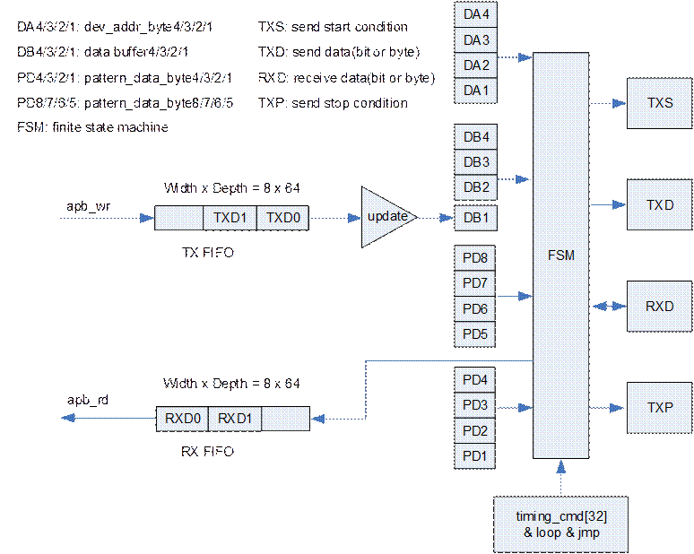

### 时序描述原理

时序描述包括时序格式描述和时序数据准备两部分。时序格式描述通过配置I2C\_TIMING\_CMD、I2C\_LOOP1、I2C\_DST1、I2C\_LOOP2、I2C\_DST2、I2C\_LOOP3、I2C\_DST3实现，既能配置出标准时序也能配置出非标准时序。

- 时序数据准备通过配置I2C\_DEV\_ADDR、I2C\_DATA\_BUF、I2C\_PATTERN\_DATA1、I2C\_PATTERN\_DATA2、I2C\_TX\_FIFO实现，配置的数值都是需要发送到从设备的。
- 在时序格式描述时，I2C\_TIMING\_CMD配置的是时序命令信息，I2C\_LOOP1、I2C\_DST1、I2C\_LOOP2、I2C\_DST2、I2C\_LOOP3、I2C\_DST3配置的是跳转控制信息。I2C\_TIMING\_CMD可以配置的时序命令信息如表14-1所示。

时序命令

| 时序命令编号 | 时序命令代号 | 时序命令含义 |
| --- | --- | --- |
| 0x00 | EXIT | 结束，用于控制器退出 |
| 0x01 | S | 总线START |
| 0x02 | SDA4 | 发送dev\_addr\_byte4 |
| 0x03 | SDA3 | 发送dev\_addr\_byte3 |
| 0x04 | SDA2 | 发送dev\_addr\_byte2 |
| 0x05 | SDA1 | 发送dev\_addr\_byte1 |
| 0x06 | SDB4 | 发送data\_buf\_byte4 |
| 0x07 | SDB3 | 发送data\_buf\_byte3 |
| 0x08 | SDB2 | 发送data\_buf\_byte2 |
| 0x09 | SDB1 | 发送data\_buf\_byte1 |
| 0x0A | SPD8 | 发送pattern\_data\_byte8 |
| 0x0B | SPD7 | 发送pattern\_data\_byte7 |
| 0x0C | SPD6 | 发送pattern\_data\_byte6 |
| 0x0D | SPD5 | 发送pattern\_data\_byte5 |
| 0x0E | SPD4 | 发送pattern\_data\_byte4 |
| 0x0F | SPD3 | 发送pattern\_data\_byte3 |
| 0x10 | SPD2 | 发送pattern\_data\_byte2 |
| 0x11 | SPD1 | 发送pattern\_data\_byte1 |
| 0x12 | RD | 接收1字节数据  **注意：执行RD命令时，若RX FIFO满了，则控制器会等待直到RX FIFO有空位；等待期间控制器不会改变I**2**C总线的状态。** |
| 0x13 | RACK | 接收低电平应答 |
| 0x14 | RNACK | 接收高电平非应答 |
| 0x15 | RNC | 接收应答，高电平低电平都无所谓 |
| 0x16 | SACK | 发送低电平应答 |
| 0x17 | SNACK | 发送高电平非应答 |
| 0x18 | JMPN1 | 有限次数跳转，目的由DST1寄存器指出,次数由LOOP1寄存器指出 |
| 0x19 | JMPN2 | 有限次数跳转，目的由DST2寄存器指出,次数由LOOP2寄存器指出 |
| 0x1A | JMPN3 | 有限次数跳转，目的由DST3寄存器指出,次数由LOOP3寄存器指出 |
| 0x1B | UNDEF | 未定义 |
| 0x1C | UNDEF | 未定义 |
| 0x1D | UDB1 | 从TX FIFO 更新数据到 data\_buf\_byte1  **注意：执行UDB1命令时，若TX FIFO为空，则控制器会等待直到TX FIFO有数据；等待期间控制器不会改变**I2C**总线的状态。** |
| 0x1E | SR | 总线repeated START |
| 0x1F | P | 总线STOP |

#### 标准时序----7bit寻址，写操作

7bit寻址，写操作时序图

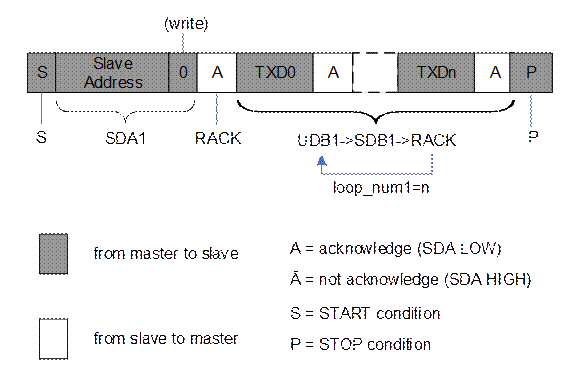

图14-2对应的时序描述配置如表14-2所示。

7bit寻址，写操作对应的时序描述配置

| 类型 | 寄存器 | 配置 |
| --- | --- | --- |
| 时序格式描述 | I2C\_TIMING\_CMD[0] | S |
| I2C\_TIMING\_CMD[1] | SDA1 |
| I2C\_TIMING\_CMD[2] | RACK |
| I2C\_TIMING\_CMD[3] | UDB1 |
| I2C\_TIMING\_CMD[4] | SDB1 |
| I2C\_TIMING\_CMD[5] | RACK |
| I2C\_TIMING\_CMD[6] | JMPN1 |
| I2C\_TIMING\_CMD[7] | P |
| I2C\_TIMING\_CMD[8] | EXIT |
| I2C\_LOOP1 | n |
| I2C\_DST1 | 3 |
| 时序数据准备 | I2C\_DEV\_ADDR | （Slave Address+‘0’）共8bit |
| I2C\_TX\_FIFO | TXD0、TXD1、…TXDn依次写入。 |

#### 标准时序----7bit寻址，直接读操作

7bit寻址，直接读时序图

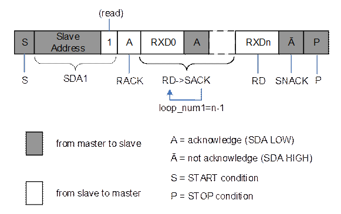

图14-3对应的时序描述配置如表14-3所示。

7bit寻址，直接读操作的时序描述配置

| 类型 | 寄存器 | 配置 |
| --- | --- | --- |
| 时序格式描述 | I2C\_TIMING\_CMD[0] | S |
| I2C\_TIMING\_CMD[1] | SDA1 |
| I2C\_TIMING\_CMD[2] | RACK |
| I2C\_TIMING\_CMD[3] | RD |
| I2C\_TIMING\_CMD[4] | SACK |
| I2C\_TIMING\_CMD[5] | JMPN1 |
| I2C\_TIMING\_CMD[6] | RD |
| I2C\_TIMING\_CMD[7] | SNACK |
| I2C\_TIMING\_CMD[8] | P |
| I2C\_TIMING\_CMD[9] | EXIT |
| I2C\_LOOP1 | n-1 |
| I2C\_DST1 | 3 |
| 时序数据准备 | I2C\_DEV\_ADDR | （Slave Address+‘1’）共8bit |

<strong><big>说明</big></strong>

读回的数据RXD0、RXD1、… RXDn依次填入I2C\_RX\_FIFO。

#### 标准时序----10bit寻址，写操作

10bit寻址，写操作时序图

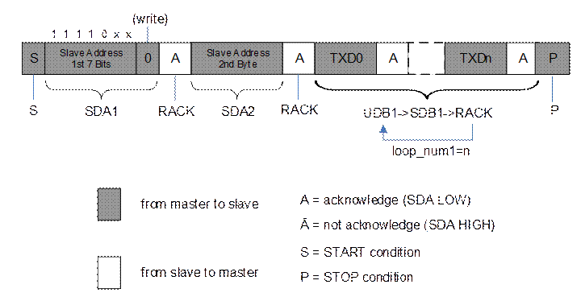

图14-4对应的时序描述配置如表14-4所示。

10bit寻址，写操作对应的时序描述配置

| 类型 | 寄存器 | 配置 |
| --- | --- | --- |
| 时序格式描述 | I2C\_TIMING\_CMD[0] | S |
| I2C\_TIMING\_CMD[1] | SDA1 |
| I2C\_TIMING\_CMD[2] | RACK |
| I2C\_TIMING\_CMD[3] | SDA2 |
| I2C\_TIMING\_CMD[4] | RACK |
| I2C\_TIMING\_CMD[5] | UDB1 |
| I2C\_TIMING\_CMD[6] | WDB1 |
| I2C\_TIMING\_CMD[7] | RACK |
| I2C\_TIMING\_CMD[8] | JMPN1 |
| I2C\_TIMING\_CMD[9] | P |
| I2C\_TIMING\_CMD[10] | EXIT |
| I2C\_LOOP1 | n |
| I2C\_DST1 | 5 |
| 时序数据准备 | I2C\_DEV\_ADDR | (Slave Address 1st 7Bits +‘0’) 共8bit写入dev\_addr\_byte1；  (Slave Address 2nd Byte) 写入dev\_addr\_byte2。 |
| I2C\_TX\_FIFO | TXD0、TXD1、…TXDn依次写入。 |

#### 标准时序----10bit寻址，组合读操作

10bit寻址，组合读时序图

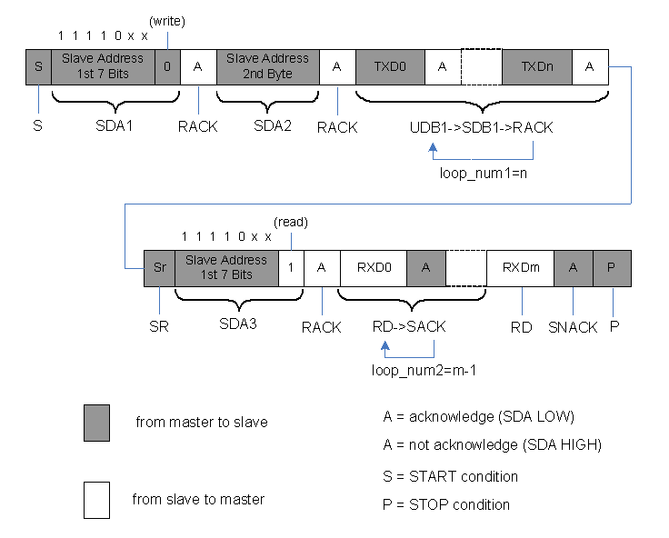

图14-5对应的时序描述配置如表14-5所示。

10bit寻址，组合读对应的时序描述配置

| 类型 | 寄存器 | 配置 |
| --- | --- | --- |
| 时序格式描述 | I2C\_TIMING\_CMD[0] | S |
| I2C\_TIMING\_CMD[1] | SDA1 |
| I2C\_TIMING\_CMD[2] | RACK |
| I2C\_TIMING\_CMD[3] | SDA2 |
| I2C\_TIMING\_CMD[4] | RACK |
| I2C\_TIMING\_CMD[5] | UDB1 |
| I2C\_TIMING\_CMD[6] | WDB1 |
| I2C\_TIMING\_CMD[7] | RACK |
| I2C\_TIMING\_CMD[8] | JMPN1 |
| I2C\_TIMING\_CMD[9] | SR |
| I2C\_TIMING\_CMD[10] | SDA3 |
| I2C\_TIMING\_CMD[11] | RACK |
| I2C\_TIMING\_CMD[12] | RD |
| I2C\_TIMING\_CMD[13] | SACK |
| I2C\_TIMING\_CMD[14] | JMPN2 |
| I2C\_TIMING\_CMD[15] | RD |
| I2C\_TIMING\_CMD[16] | SNACK |
| I2C\_TIMING\_CMD[17] | P |
| I2C\_TIMING\_CMD[18] | EXIT |
| I2C\_LOOP1 | n |
| I2C\_DST1 | 5 |
| I2C\_LOOP2 | m-1 |
| I2C\_DST2 | 12 |
| 时序数据准备 | I2C\_DEV\_ADDR | (Slave Address 1st 7Bits +‘0’) 共8bit写入dev\_addr\_byte1；  (Slave Address 2nd Byte) 写入dev\_addr\_byte2；(Slave Address 1st 7Bits +‘1’) 共8bit写入dev\_addr\_byte3。 |
| I2C\_TX\_FIFO | TXD0、TXD1、…TXDn依次写入。 |

<strong><big>说明</big></strong>

读回的数据RXD0、RXD1、… RXDm依次填入I2C\_RX\_FIFO

非标准时序举例

非标准时序为非I2C标准协议，图14-6为一个非标准时序，此时序连续向从设备发送64Byte数据才接收一个应答。

非标准时序图

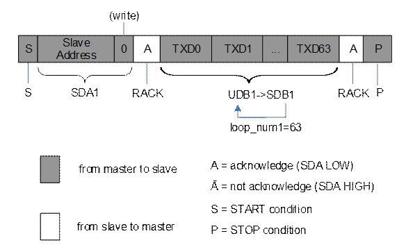

图14-6对应的时序描述配置如表14-6所示。

非标准时序对应时序描述配置

| 类型 | 寄存器 | 配置 |
| --- | --- | --- |
| 时序格式描述 | I2C\_TIMING\_CMD[0] | S |
| I2C\_TIMING\_CMD[1] | SDA1 |
| I2C\_TIMING\_CMD[2] | RACK |
| I2C\_TIMING\_CMD[3] | UDB1 |
| I2C\_TIMING\_CMD[4] | SDB1 |
| I2C\_TIMING\_CMD[5] | JMPN1 |
| I2C\_TIMING\_CMD[6] | RACK |
| I2C\_TIMING\_CMD[7] | P |
| I2C\_TIMING\_CMD[8] | EXIT |
| I2C\_LOOP1 | 63 |
| I2C\_DST1 | 3 |
| 时序数据准备 | I2C\_DEV\_ADDR | （Slave Address+‘0’）共8bit |
| I2C\_TX\_FIFO | TXD0、TXD1、…TXD63依次写入。 |

### 工作方式

#### 非DMA方式下的数据传输(中断方式写操作)

请遵循以下步骤：

配置I2C\_HCNT和I2C\_LCNT，使控制器工作在正确的模式下。

配置I2C\_TX\_WATERMARK为0x20。

配置I2C\_GLB，使能控制器。

根据实际时序，参考14.1.4 时序描述原理完成时序配置。

配置I2C\_CTRL1为0x1，启动控制器。

配置I2C\_INTR\_EN为0x811。

在中断服务程序里，查询I2C\_INTR\_STAT，若arb\_lost或ack\_bit\_unmatch为1，则认为是异常，否则，若tx\_lt\_watermark为1中断，此时可往TX FIFO里填入多达32个待写数据。

- 如果还有待写数据，则配置I2C\_INTR\_RAW为0x10，清除触发本次中断处理的tx\_lt\_watermark中断，然后等待下一次中断服务程序被触发。
- 如果已经没有待写数据，则配置I2C\_INTR\_EN为0x1801，然后等待all\_cmd\_done中断，收到all\_cmd\_done中断时，表示所有数据都已经写到从设备端。

配置I2C\_INTR\_EN为0x0，I2C\_INTR\_RAW为0x1fff，清除中断并且禁止中断上报，为不同工作方式之间的切换做好清理工作。

----结束

#### 非DMA方式下的数据传输(查询方式写操作)

请遵循以下步骤：

配置I2C\_HCNT和I2C\_LCNT，使控制器工作在正确的模式下。

配置I2C\_GLB，使能控制器。

根据实际时序，参考14.1.4 时序描述原理完成时序配置。

配置I2C\_CTRL1为0x1，启动控制器。

不断查询I2C\_FIFO\_STAT [tx\_fifo\_not\_full]，查到为1后，将1Byte待写数据写入TX FIFO。当所有待写数据都写入TX FIFO后，执行下一步骤。

不断查询I2C\_INTR\_RAW，查到arb\_lost\_raw 或者ack\_bit\_unmatch\_raw为1则认为是异常，查到all\_cmd\_done\_raw为1则表示所有时序已经完成。

配置I2C\_INTR\_EN为0x0，I2C\_INTR\_RAW为0x1fff，清除中断并且禁止中断上报，为不同工作方式之间的切换做好清理工作。

----结束

#### 非DMA方式下的数据传输(中断方式读操作)

请遵循以下步骤：

配置I2C\_HCNT和I2C\_LCNT，使控制器工作在正确的模式下。

配置I2C\_RX\_WATERMARK为0x20。

配置I2C\_GLB，使能控制器。

根据实际时序，参考14.1.4 时序描述原理完成时序配置。

配置I2C\_CTRL1为0x1，启动控制器。

配置I2C\_INTR\_EN为0x1805。

在中断服务程序里，查询I2C\_INTR\_STAT，当arb\_lost 或ack\_bit\_unmatch为1则认为异常，如无异常，all\_cmd\_done为1说明所有数据都已经读回。如无异常同时all\_cmd\_done为0说明rx\_gt\_watermark中断，此时可以从RX FIFO里读出32个已读回的数据。读走32个数据后配置I2C\_INTR\_RAW为0x4，清除触发本次中断处理的rx\_gt\_watermark中断，然后等待下一次中断服务程序被触发。

配置I2C\_INTR\_EN为0x0，I2C\_INTR\_RAW为0x1fff，清除中断并且禁止中断上报，为不同工作方式之间的切换做好清理工作。

----结束

#### 非DMA方式下的数据传输(查询方式读操作)

请遵循以下步骤：

配置I2C\_HCNT和I2C\_LCNT，使控制器工作在正确的模式下。

配置I2C\_GLB，使能控制器。

根据实际时序，参考14.1.4 时序描述原理完成时序配置。

配置I2C\_CTRL1为0x1，启动控制器。

不断查询I2C\_FIFO\_STAT [rx\_fifo\_not\_empty]，查到为1后，从RX FIFO中读出1Byte数据。当所有数据都已读回，执行下一步骤。

不断查询I2C\_INTR\_RAW，查到arb\_lost\_raw或者ack\_bit\_unmatch\_raw为1则认为是异常，查到all\_cmd\_done\_raw为1则表示所有时序已经完成。

配置I2C\_INTR\_EN为0x0，I2C\_INTR\_RAW为0x1fff，清除中断并且禁止中断上报，为不同工作方式之间的切换做好清理工作。

----结束

#### DMA方式下的数据传输(写操作)

请遵循以下步骤：

获取一个DMAC通道。

完成DMAC通道的设置并启动。

配置I2C\_HCNT和I2C\_LCNT，使控制器工作在正确的模式下。

配置I2C\_TX\_WATERMARK为0x10（该值仅为示例，具体配置值应根据实际使用决定）。

配置I2C\_GLB，使能控制器。

根据实际时序，参考14.1.4 时序描述原理完成时序配置。

配置I2C\_CTRL1为0x201，启动控制器。

等待DMAC完成中断。

不断查询I2C\_INTR\_RAW，查到arb\_lost\_raw或者ack\_bit\_unmatch\_raw为1则认为是异常，查到all\_cmd\_done\_raw为1则表示所有时序已经完成。

配置I2C\_INTR\_EN为0x0，I2C\_INTR\_RAW为0x1fff，清除中断并且禁止中断上报，为不同工作方式之间的切换做好清理工作。

----结束

#### DMA方式下的数据传输(读操作)

请遵循以下步骤：

获取一个DMAC通道。

完成DMAC通道的设置并启动。

配置I2C\_HCNT和I2C\_LCNT，使控制器工作在正确的模式下。

配置I2C\_RX\_WATERMARK为0x10（该值仅为示例，具体配置值应根据实际使用决定）。

配置I2C\_GLB，使能控制器。

根据实际时序，参考14.1.4 时序描述原理完成时序配置。

配置I2C\_CTRL1为0x301，启动控制器。

等待DMAC完成中断。

不断查询I2C\_INTR\_RAW，查到arb\_lost\_raw或者ack\_bit\_unmatch\_raw为1则认为是异常，查到all\_cmd\_done\_raw为1则表示所有时序已经完成。

配置I2C\_INTR\_EN为0x0，I2C\_INTR\_RAW为0x1fff，清除中断并且禁止中断上报，为不同工作方式之间的切换做好清理工作。

----结束

#### 异常处理流程

请遵循以下步骤：

配置I2C\_GLB [i2c\_enable] 为0，禁止控制器。

配置I2C\_INTR\_EN为0x0，I2C\_INTR\_RAW为0x1fff，清除中断并且禁止中断上报，为不同工作方式之间的切换做好清理工作。

----结束

### I2C寄存器概览

I2C基地址如下：

- I2C0寄存器基地址：0x0\_1106\_0000
- I2C1寄存器基地址：0x0\_1106\_1000
- I2C2寄存器基地址：0x0\_1106\_2000
- I2C3寄存器基地址：0x0\_1106\_3000
- I2C4寄存器基地址：0x0\_1106\_4000
- I2C5寄存器基地址：0x0\_1106\_5000

I2C寄存器偏移地址中变量的取值范围和含义如表14-7所示。

I2C寄存器偏移地址变量表

| 变量名称 | 取值范围 | 描述 |
| --- | --- | --- |
| n | 0～31 | I2C时序命令，最多支持32个时序命令 |

I2C寄存器概览

| 偏移地址 | 名称 | 描述 | 页码 |
| --- | --- | --- | --- |
| 0x0000 | I2C\_GLB | I2C全局配置寄存器 | 14-16 |
| 0x0004 | I2C\_HCNT | I2C高电平时长寄存器 | 14-17 |
| 0x0008 | I2C\_LCNT | I2C低电平时长寄存器 | 14-18 |
| 0x0010 | I2C\_DEV\_ADDR | I2C器件地址寄存器 | 14-18 |
| 0x0014 | I2C\_DATA\_BUF | I2C数据buf寄存器 | 14-19 |
| 0x0018 | I2C\_PATTERN\_DATA1 | I2C PATTERN数据1寄存器 | 14-19 |
| 0x001C | I2C\_PATTERN\_DATA2 | I2C PATTERN数据2寄存器 | 14-19 |
| 0x0020 | I2C\_TX\_FIFO | I2C TX FIFO数据寄存器 | 14-20 |
| 0x0024 | I2C\_RX\_FIFO | I2C RX FIFO数据寄存器 | 14-20 |
| 0x0030＋n x 4 | I2C\_TIMING\_CMD | I2C时序命令寄存器 | 14-20 |
| 0x00B0 | I2C\_LOOP1 | I2C循环次数1寄存器 | 14-22 |
| 0x00B4 | I2C\_DST1 | I2C跳转目的1寄存器 | 14-22 |
| 0x00B8 | I2C\_LOOP2 | I2C循环次数2寄存器 | 14-23 |
| 0x00BC | I2C\_DST2 | I2C跳转目的2寄存器 | 14-23 |
| 0x00C0 | I2C\_LOOP3 | I2C循环次数3寄存器 | 14-23 |
| 0x00C4 | I2C\_DST3 | I2C跳转目的3寄存器 | 14-23 |
| 0x00C8 | I2C\_TX\_WATERMARK | I2C TX FIFO水线寄存器 | 14-24 |
| 0x00CC | I2C\_RX\_WATERMARK | I2C RX FIFO水线寄存器 | 14-24 |
| 0x00D0 | I2C\_CTRL1 | I2C控制寄存器1 | 14-24 |
| 0x00D4 | I2C\_CTRL2 | I2C控制寄存器2 | 14-25 |
| 0x00D8 | I2C\_FIFO\_STAT | I2C FIFO状态寄存器 | 14-26 |
| 0x00E0 | I2C\_INTR\_RAW | I2C原始中断寄存器 | 14-27 |
| 0x00E4 | I2C\_INTR\_EN | I2C中断使能寄存器 | 14-28 |
| 0x00E8 | I2C\_INTR\_STAT | I2C中断状态寄存器 | 14-30 |

### I2C寄存器描述

#### I2C\_GLB

I2C\_GLB为I2C全局配置寄存器。

Offset Address: 0x0000 Total Reset Value: 0x0000\_0000

| Bits | Access | Name | Description | Reset |
| --- | --- | --- | --- | --- |
| [31:24] | - | reserved | 保留。 | 0x00 |
| [23:8] | RW | sda\_hold\_duration | SDA hold time时长。建议配置为0xa。  **注意：只能控制从主机发往从设备的数据的hold time时长。** | 0x0000 |
| [7:1] | - | reserved | 保留。 | 0x00 |
| [0] | RW | i2c\_enable | I2C使能控制。  0：禁止；此时会清空TX FIFO和RX FIFO。  1：使能。  **注意：若出现时序异常，请先禁止控制器，然后再使能，以防TX FIFO和RX FIFO有上次操作的残留数据。** | 0x0 |

#### I2C\_HCNT

I2C\_HCNT为I2C高电平时长寄存器。

Offset Address: 0x0004 Total Reset Value: 0x0000\_0000

| Bits | Access | Name | Description | Reset |
| --- | --- | --- | --- | --- |
| [31:16] | - | reserved | 保留 | 0x0000 |
| [15:0] | RW | i2c\_high\_duration | SCL 高电平时长。  建议在标准模式下为SCL周期的1/2，快速模式下为SCL周期的0.36。  标准模式下：  i2c\_high\_duration = (FI2C\_CLK/FSCL) x 0.5  快速模式下：  i2c\_high\_duration = (FI2C\_CLK/FSCL) x 0.36 (FSCL为SCL总线的频率)  以参考时钟为50MHz且工作在快速模式下(FSCL = 400kHz)为例，i2c\_high\_duration =(50MHz / 400kHz) x 0.36=45。 | 0x0000 |

#### I2C\_LCNT

I2C\_LCNT为I2C低电平时长寄存器。

Offset Address: 0x0008 Total Reset Value: 0x0000\_0000

| Bits | Access | Name | Description | Reset |
| --- | --- | --- | --- | --- |
| [31:16] | - | reserved | 保留。 | 0x0000 |
| [15:0] | RW | i2c\_low\_duration | SCL低电平时长。  建议在标准模式下为SCL周期的1/2，快速模式下为SCL周期的0.64。  标准模式下：  i2c\_low\_duration = (FI2C\_CLK/FSCL) x 0.5  快速模式下：  i2c\_low\_duration = (FI2C\_CLK/FSCL) x 0.64 (FSCL为SCL总线的频率)  以参考时钟为50MHz且工作在快速模式下(FSCL = 400 kHz)为例，i2c\_low\_duration=(50MHz / 400kHz) x 0.64=80。 | 0x0000 |

#### I2C\_DEV\_ADDR

I2C\_DEV\_ADDR为I2C器件地址寄存器。

Offset Address: 0x0010 Total Reset Value: 0x0000\_0000

|  |  |  |  |  |
| --- | --- | --- | --- | --- |
| Bits | Access | Name | Description | Reset |
| [31:24] | RW | dev\_addr\_byte4 | 器件地址字节4。 | 0x00 |
| [23:16] | RW | dev\_addr\_byte3 | 器件地址字节3。 | 0x00 |
| [15:8] | RW | dev\_addr\_byte2 | 器件地址字节2。 | 0x00 |
| [7:0] | RW | dev\_addr\_byte1 | 器件地址字节1。 | 0x00 |

#### I2C\_DATA\_BUF

I2C\_DATA\_BUF为I2C数据buf寄存器。

Offset Address: 0x0014 Total Reset Value: 0x0000\_0000

|  |  |  |  |  |
| --- | --- | --- | --- | --- |
| Bits | Access | Name | Description | Reset |
| [31:24] | RW | data\_buf\_byte4 | 数据buf字节4。 | 0x00 |
| [23:16] | RW | data\_buf\_byte3 | 数据buf字节3。 | 0x00 |
| [15:8] | RW | data\_buf\_byte2 | 数据buf字节2。 | 0x00 |
| [7:0] | RW | data\_buf\_byte1 | 数据buf字节1。 | 0x00 |

#### I2C\_PATTERN\_DATA1

I2C\_PATTERN\_DATA1为I2C PATTERN数据1寄存器。

Offset Address: 0x0018 Total Reset Value: 0x0000\_0000

| Bits | Access | Name | Description | Reset |
| --- | --- | --- | --- | --- |
| [31:24] | RW | pattern\_data\_byte4 | PATTERN数据字节4。 | 0x00 |
| [23:16] | RW | pattern\_data\_byte3 | PATTERN数据字节3。 | 0x00 |
| [15:8] | RW | pattern\_data\_byte2 | PATTERN数据字节2。 | 0x00 |
| [7:0] | RW | pattern\_data\_byte1 | PATTERN数据字节1。 | 0x00 |

#### I2C\_PATTERN\_DATA2

I2C\_PATTERN\_DATA2为I2C PATTERN数据2寄存器。

Offset Address: 0x001C Total Reset Value: 0x0000\_0000

|  |  |  |  |  |
| --- | --- | --- | --- | --- |
| Bits | Access | Name | Description | Reset |
| [31:24] | RW | pattern\_data\_byte8 | PATTERN数据字节8。 | 0x00 |
| [23:16] | RW | pattern\_data\_byte7 | PATTERN数据字节7。 | 0x00 |
| [15:8] | RW | pattern\_data\_byte6 | PATTERN数据字节6。 | 0x00 |
| [7:0] | RW | pattern\_data\_byte5 | PATTERN数据字节5。 | 0x00 |

#### I2C\_TX\_FIFO

I2C\_TX\_FIFO为I2C TX FIFO数据寄存器。

Offset Address: 0x0020 Total Reset Value: 0x0000\_0000

|  |  |  |  |  |
| --- | --- | --- | --- | --- |
| Bits | Access | Name | Description | Reset |
| [31:8] | - | reserved | 保留。 | 0x000000 |
| [7:0] | WO | tx\_fifo | TX FIFO入口。  写入的数据是待发送出去的数据。 | 0x00 |

#### I2C\_RX\_FIFO

I2C\_RX\_FIFO为I2C RX FIFO数据寄存器。

Offset Address: 0x0024 Total Reset Value: 0x0000\_0000

| Bits | Access | Name | Description | Reset |
| --- | --- | --- | --- | --- |
| [31:8] | - | reserved | 保留。 | 0x000000 |
| [7:0] | RO | rx\_fifo | RX FIFO出口。  读出的数据是I2C总线上收到的数据。 | 0x00 |

#### I2C\_TIMING\_CMD

I2C\_TIMING\_CMD为I2C时序命令寄存器。

Offset Address: 0x0030+n x 4 Total Reset Value: 0x0000\_0000

| Bits | Access | Name | Description | Reset |
| --- | --- | --- | --- | --- |
| [31:5] | - | reserved | 保留。 | 0x0000000 |
| [4:0] | RW | timing\_cmd | 时序命令。n = 0，1,2，… 31.  0x00：EXIT(结束，用于逻辑退出)；  0x01：S (总线START)；  0x02：WDA4 (发送dev\_addr\_byte4)；  0x03：WDA3 (发送dev\_addr\_byte3)；  0x04：WDA2 (发送dev\_addr\_byte2)；  0x05：WDA1 (发送dev\_addr\_byte1)；  0x06：WDB4 (发送data\_buf\_byte4)；  0x07：WDB3 (发送data\_buf\_byte3)；  0x08：WDB2 (发送data\_buf\_byte2)；  0x09：WDB1 (发送data\_buf\_byte1)；  0x0A：WPD8 (发送pattern\_data\_byte8)；  0x0B：WPD7 (发送pattern\_data\_byte7)；  0x0C：WPD6 (发送pattern\_data\_byte6)；  0x0D：WPD5 (发送pattern\_data\_byte5)；  0x0E：WPD4 (发送pattern\_data\_byte4)；  0x0F：WPD3 (发送pattern\_data\_byte3)；  0x10：WPD2 (发送pattern\_data\_byte2)；  0x11：WPD1 (发送pattern\_data\_byte1)；  0x12：RD (接收1字节数据)；  0x13：RACK (接收低电平应答)；  0x14：RNACK (接收高电平非应答)；  0x15：RNC (接收应答，高低电平都无所谓)；  0x16：SACK (发送低电平应答)；  0x17：SNACK (发送高电平非应答)；  0x18：JMPN1(有限次数跳转，目的由DST1寄存器指出,次数由LOOP1寄存器指出)；  0x19：JMPN2(有限次数跳转，目的由DST2寄存器指出,次数由LOOP2寄存器指出)；  0x1A：JMPN3(有限次数跳转，目的由DST3寄存器指出,次数由LOOP3寄存器指出)；  0x1B：UNDEF (未定义)；  0x1C：UNDEF (未定义)；  0x1D：UDB1 (从TX FIFO 更新数据到 data\_buf\_byte1)；  0x1E：SR (总线repeated START)；  0x1F：P(总线STOP)。  **注意：**  **执行UDB1命令时，若TX FIFO为空，则控制器会等待直到TX FIFO有数据；等待期间控制器不会改变I**2**C总线的状态。**  **执行RD命令时，若RX FIFO满了，则控制器会等待直到RX FIFO有空位；等待期间控制器不会改变I2C总线的状态。** | 0x00 |

#### I2C\_LOOP1

I2C\_LOOP1为I2C循环次数1寄存器。

Offset Address: 0x00B0 Total Reset Value: 0x0000\_0000

|  |  |  |  |  |
| --- | --- | --- | --- | --- |
| Bits | Access | Name | Description | Reset |
| [31:0] | RW | loop\_num1 | 指定循环次数。 | 0x00000000 |

#### I2C\_DST1

I2C\_DST1为I2C跳转目的1寄存器。

Offset Address: 0x00B4 Total Reset Value: 0x0000\_0000

|  |  |  |  |  |
| --- | --- | --- | --- | --- |
| Bits | Access | Name | Description | Reset |
| [31:5] | RW | reserved | 保留。 | 0x0000000 |
| [4:0] | RW | dst\_timing\_cmd1 | 指定跳转到哪个时序命令寄存器。 | 0x00 |

#### I2C\_LOOP2

I2C\_LOOP2为I2C循环次数2寄存器。

Offset Address: 0x00B8 Total Reset Value: 0x0000\_0000

|  |  |  |  |  |
| --- | --- | --- | --- | --- |
| Bits | Access | Name | Description | Reset |
| [31:0] | RW | loop\_num2 | 指定循环次数。 | 0x00000000 |

#### I2C\_DST2

I2C\_DST2为I2C跳转目的2寄存器。

Offset Address: 0x00BC Total Reset Value: 0x0000\_0000

|  |  |  |  |  |
| --- | --- | --- | --- | --- |
| Bits | Access | Name | Description | Reset |
| [31:5] | RW | reserved | 保留。 | 0x0000000 |
| [4:0] | RW | dst\_timing\_cmd2 | 指定跳转到哪个时序命令寄存器。 | 0x00 |

#### I2C\_LOOP3

I2C\_LOOP3为I2C循环次数3寄存器。

Offset Address: 0x00C0 Total Reset Value: 0x0000\_0000

|  |  |  |  |  |
| --- | --- | --- | --- | --- |
| Bits | Access | Name | Description | Reset |
| [31:0] | RW | loop\_num3 | 指定循环次数。 | 0x00000000 |

#### I2C\_DST3

I2C\_DST3为I2C跳转目的3寄存器。

Offset Address: 0x00C4 Total Reset Value: 0x0000\_0000

|  |  |  |  |  |
| --- | --- | --- | --- | --- |
| Bits | Access | Name | Description | Reset |
| [31:5] | RW | reserved | 保留。 | 0x0000000 |
| [4:0] | RW | dst\_timing\_cmd3 | 指定跳转到哪个时序命令寄存器。 | 0x00 |

#### I2C\_TX\_WATERMARK

I2C\_TX\_WATERMARK为I2C TX FIFO水线寄存器。

Offset Address: 0x00C8 Total Reset Value: 0x0000\_0000

| Bits | Access | Name | Description | Reset |
| --- | --- | --- | --- | --- |
| [31:6] | RO | reserved | 保留。 | 0x0000000 |
| [5:0] | RW | tx\_watermark | TX FIFO水线。当TX FIFO里的数据数目比tx\_watermark小时，tx\_lt\_watermark\_raw原始中断会被置1。 | 0x00 |

#### I2C\_RX\_WATERMARK

I2C\_RX\_WATERMARK为I2C RX FIFO水线寄存器。

Offset Address: 0x00CC Total Reset Value: 0x0000\_0000

|  |  |  |  |  |
| --- | --- | --- | --- | --- |
| Bits | Access | Name | Description | Reset |
| [31:6] | - | reserved | 保留。 | 0x0000000 |
| [5:0] | RW | rx\_watermark | RX FIFO水线。当RX FIFO里的数据数目比rx\_watermark大时，rx\_gt\_watermark\_raw原始中断会被置1。 | 0x00 |

#### I2C\_CTRL1

I2C\_CTRL1为I2C控制寄存器1。

Offset Address: 0x00D0 Total Reset Value: 0x0000\_0000

| Bits | Access | Name | Description | Reset |
| --- | --- | --- | --- | --- |
| [31:10] | - | reserved | 保留。 | 0x000000 |
| [9:8] | RW | dma\_operation | DMA操作控制。  00：非DMA方式；  01：保留；  10：DMA写方式；  11：DMA读方式。 | 0x0 |
| [7:1] | - | reserved | 保留。 | 0x00 |
| [0] | RW | start | 启动控制。写1会启动控制器内部的状态机去执行时序命令序列，执行完毕或者异常后逻辑会反向把此位清0。  0：不启动；  1：启动。 | 0x0 |

#### I2C\_CTRL2

I2C\_CTRL2为I2C控制寄存器2。

Offset Address: 0x00D4 Total Reset Value: 0x11110011

| Bits | Access | Name | Description | Reset |
| --- | --- | --- | --- | --- |
| [31:29] | - | reserved | 保留。 | 0x0 |
| [28] | RO | i2c\_scl\_oen | 监测内部I2C的SDA输出电平。  0：SDA输出低电平；  1：SDA输出高电平。 | 0x1 |
| [27:25] | - | reserved | 保留。 | 0x0 |
| [24] | RO | i2c\_sda\_oen | 监测内部I2C的SCL输出电平。  0：SCL输出低电平；  1：SCL输出高电平。 | 0x1 |
| [23:21] | - | reserved | 保留。 | 0x0 |
| [20] | RO | i2c\_scl\_in | 监测外部I2C总线SCL的电平。  0：总线上SCL为低电平；  1：总线上SCL为高电平。 | 0x1 |
| [19:17] | - | reserved | 保留。 | 0x0 |
| [16] | RO | i2c\_sda\_in | 监测外部I2C总线SDA的电平。  0：总线上SDA为低电平；  1：总线上SDA为高电平。 | 0x1 |
| [15:9] | - | reserved | 保留。 | 0x00 |
| [8] | RW | gpio\_mode | 将I2C的SCL和SDA管脚配置成gpio模式，管脚电平由force\_scl\_oe\_n和force\_sda\_oe\_n决定。  0：禁止；  1：使能。 | 0x0 |
| [7:5] | - | reserved | 保留。 | 0x0 |
| [4] | RW | force\_scl\_oen | 在gpio\_mode有效时控制SCL管脚电平。  0：SCL管脚为低电平；  1：SCL管脚为高电平。 | 0x1 |
| [3:1] | - | reserved | 保留。 | 0x0 |
| [0] | RW | force\_sda\_oen | 在gpio\_mode有效时控制SDA管脚电平。  0：SDA管脚为低电平；  1：SDA管脚为高电平。 | 0x1 |

#### I2C\_FIFO\_STAT

I2C\_FIFO\_STAT为I2C FIFO状态寄存器。

Offset Address: 0x00D8 Total Reset Value: 0x000A\_0000

| Bits | Access | Name | Description | Reset |
| --- | --- | --- | --- | --- |
| [31:20] | - | reserved | 保留 | 0x000 |
| [19] | RO | tx\_fifo\_not\_full | TX FIFO非满指示。  0：满；  1：非满。 | 0x1 |
| [18] | RO | tx\_fifo\_not\_empty | TX FIFO非空指示。  0：空；  1：非空。 | 0x0 |
| [17] | RO | rx\_fifo\_not\_full | RX FIFO非满指示。  0：满；  1：非满。 | 0x1 |
| [16] | RO | rx\_fifo\_not\_empty | RX FIFO非空指示。  0：空；  1：非空。 | 0x0 |
| [15] | - | reserved | 保留。 | 0x0 |
| [14:8] | RO | tx\_fifo\_vld\_num | TX FIFO里的有效数目。 | 0x00 |
| [7] | - | reserved | 保留。 | 0x0 |
| [6:0] | RO | rx\_fifo\_vld\_num | RX FIFO里的有效数目。 | 0x00 |

#### I2C\_INTR\_RAW

I2C\_INTR\_RAW为I2C原始中断寄存器。

Offset Address: 0x00E0 Total Reset Value: 0x0000\_0000

| Bits | Access | Name | Description | Reset |
| --- | --- | --- | --- | --- |
| [31:13] | - | reserved | 保留。 | 0x00000 |
| [12] | RWC | all\_cmd\_done\_raw | 时序命令序列执行到EXIT命令时产生此中断。  0：无中断；  1：有中断。 | 0x0 |
| [11] | RWC | arb\_lost\_raw | 仲裁丢失。  0：无中断；  1：有中断。 | 0x0 |
| [10] | RWC | start\_det\_raw | 检查到START。  0：无中断；  1：有中断。 | 0x0 |
| [9] | RWC | stop\_det\_raw | 检查到STOP。  0：无中断；  1：有中断。 | 0x0 |
| [8:5] | - | reserved | 保留。 | 0x0 |
| [4] | RWC | tx\_lt\_watermark\_raw | 发送数据时，TX FIFO里的数据数目低于水线。  0：无中断；  1：有中断。 | 0x0 |
| [3] | - | reserved | 保留。 | 0x0 |
| [2] | RWC | rx\_gt\_watermark\_raw | 接收数据时，RX FIFO里的数据数目高于水线。  0：无中断；  1：有中断。 | 0x0 |
| [1] | - | reserved | 保留。 | 0x0 |
| [0] | RWC | ack\_bit\_unmatch\_raw | 应答位不符合预期。  0：无中断；  1：有中断。 | 0x0 |

#### I2C\_INTR\_EN

I2C\_INTR\_EN为I2C中断使能寄存器。

Offset Address: 0x00E4 Total Reset Value: 0x0000\_0000

| Bits | Access | Name | Description | Reset |
| --- | --- | --- | --- | --- |
| [31:13] | - | reserved | 保留。 | 0x00000 |
| [12] | RW | all\_cmd\_done\_en | all\_cmd\_done中断使能。  0：不使能；  1：使能。 | 0x0 |
| [11] | RW | arb\_lost\_en | arb\_lost中断使能。  0：不使能；  1：使能。 | 0x0 |
| [10] | RW | start\_det\_en | start\_det中断使能。  0：不使能；  1：使能。 | 0x0 |
| [9] | RW | stop\_det\_en | STOP中断使能。  0：不使能；  1：使能。 | 0x0 |
| [8:5] | - | reserved | 保留。 | 0x0 |
| [4] | RW | tx\_lt\_watermark\_en | tx\_lt\_watermark中断使能。  0：不使能；  1：使能。 | 0x0 |
| [3] | - | reserved | 保留。 | 0x0 |
| [2] | RW | rx\_gt\_watermark\_en | rx\_gt\_watermark中断使能。  0：不使能；  1：使能。 | 0x0 |
| [1] | - | reserved | 保留。 | 0x0 |
| [0] | RW | ack\_bit\_unmatch\_en | ack\_bit\_unmatch中断使能。  0：不使能；  1：使能。 | 0x0 |

#### I2C\_INTR\_STAT

I2C\_INTR\_STAT为I2C中断状态寄存器。

Offset Address: 0x00E8 Total Reset Value: 0x0000\_0000

| Bits | Access | Name | Description | Reset |
| --- | --- | --- | --- | --- |
| [31:13] | - | reserved | 保留。 | 0x00000 |
| [12] | RO | all\_cmd\_done | 所有时序命令正常完成。  0：无中断；  1：有中断。 | 0x0 |
| [11] | RO | arb\_lost | 仲裁丢失。  0：无中断；  1：有中断。 | 0x0 |
| [10] | RO | start\_det | 检查到START。  0：无中断；  1：有中断。 | 0x0 |
| [9] | RO | stop\_det | 检查到STOP。  0：无中断；  1：有中断。 | 0x0 |
| [8:5] | - | reserved | 保留。 | 0x0 |
| [4] | RO | tx\_lt\_watermark | 发送数据时，TX FIFO里的数据数目低于水线。  0：无中断；  1：有中断。 | 0x0 |
| [3] | - | reserved | 保留。 | 0x0 |
| [2] | RO | rx\_gt\_watermark | 接收数据时，RX FIFO里的数据数目高于水线。  0：无中断；  1：有中断。 | 0x0 |
| [1] | - | reserved | 保留。 | 0x0 |
| [0] | RO | ack\_bit\_unmatch | 应答位不符合预期。  0：无中断；  1：有中断。 | 0x0 |

## UART

### 概述

通用异步收发器UART（Universal Asynchronous Receiver Transmitter）是一个异步串行的通信接口，主要功能是将来自外围设备的数据进行串并转换之后传入内部总线，以及将数据进行并串转换之后输出到外部设备。UART的主要功能是和外部芯片的UART进行对接，从而实现两芯片间的通信。

芯片供6个UART控制器：

- UART0：2线UART，主要用于调试。
- UART1/2/5：4线UART。
- UART3/4：2线UART。

<strong><big>须知</big></strong>

当使用UART功能时，需要在UART初始化前对RXD管脚配置为上拉使能。具体的配置寄存器请参考Hi3403V100\_PINOUT\_CN.xlsx。

例如：当使用系统的UART0时，需要配置iocfg\_reg95的bit[8]为高。

### 特点

UART模块有以下特点：

- 支持256 x 8bit的发送FIFO和256 x 12bit的接收FIFO。
- 支持数据位和停止位的位宽可编程。数据位可通过编程设定为5/6/7/8比特；停止位可通过编程设定为1bit或2bit。
- 支持奇、偶校验方式或者无校验。
- 支持传输速率可编程。
- 支持接收FIFO中断、发送FIFO中断、接收超时中断、错误中断。
- 支持初始中断状态查询和屏蔽后中断状态查询。
- 支持通过编程禁止UART模块或者UART发送/接收功能以降低功耗。
- 支持关断UART时钟以节省功耗。
- 支持DMA操作。

### 功能描述

#### 应用框图

UART的典型应用框图如图14-7所示。

UART的典型应用框图

<strong><big>须知</big></strong>

UART是一种异步双向串行总线，它提供了一种简单有效的数据传输方式，只需要两根数据线互相对接。

#### 功能原理

UART的一次帧传输主要包括起始信号、数据、校验位和结束信号，如图14-8所示。数据帧从某一UART的TXD端输出，从另一个UART的RXD端输入。

UART帧格式

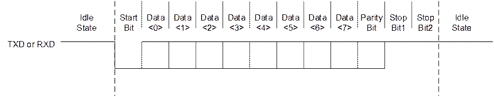

起始信号、数据、校验位和结束信号的含义如下：

- 起始信号（start bit）

一个数据帧开始的标志，UART协议规定TXD信号出现一个低电平就表示一个数据帧的开始。在UART不传输数据时，应该保持高电平。

- 数据信号（data bit）

数据位宽可以根据不同的应用要求进行调整，可以配置成5bit/6bit/7bit/8bit数据位宽。

- 校验位（parity bit）

校验位是1比特纠错信号，UART的校验位有奇校验、偶校验和固定校验位，同时支持校验位的使能和禁止，详细描述请见UART\_LCR\_H寄存器。

- 结束信号（stop bit）

结束信号即数据帧的停止位，支持1比特和2比特停止位两种配置。数据帧的结束信号就是把TXD拉成高电平。

### 工作方式

#### 波特率配置

通过配置寄存器UART\_IBRD和UART\_FBRD可以设置UART工作的波特率，波特率计算公式为：

当前波特率=UART参考时钟频率（100MHz、50MHz、24MHz或3MHZ）/（16 x 分频系数）

分频系数有整数和小数两部分组成，分别对应寄存器UART\_IBRD和UART\_FBRD。

例如：UART参考时钟频率为24MHz，如果配置UART\_IBRD为0x1E，UART\_FBRD为0x00，按照波特率计算公式，则当前的波特率为24/（16 x 30）=0.05Mbit/s。

UART波特率配置的典型值为：9,600bit/s、14,400bit/s、19,200bit/s、38,400bit/s、57,600bit/s、76,800bit/s、115,200bit/s、230,400bit/s、460,800bit/s。

分频系数值的计算以及分频系数寄存器的配置举例如下：

如果要求波特率为230,400bit/s，并且UART参考时钟频率为24MHz，那么分频系数为（24 x 106）/（16 x 230400）= 6.5104，因此IBRD（整数部分）为6，FBRD（小数部分）为0.5104。

计算6bitUART\_FBRD寄存器中的数值：根据m=integer（FBRDx2n+0.5）（n=UART\_FBRD寄存器的宽度），计算出m=integer（0.5104x26+0.5）=33，在UART\_IBRD寄存器中配置0x0006，UART\_FBRD寄存器中配置0x21。

当分频系数小数部分配置成33时，波特率除数的实际数值为6+33/26=6.5156，产生的波特率为（24 x 106）/（16 x 6.5156）=230216.7107，误差率为（230216.7107–230400）/230400x100=-0.07956%。

使用6bitUART\_FBRD寄存器最大的误差率为1/26 x 100=1.56%，当m=1时会出现，误差率累计超过64个时钟周期。

#### 软复位

<strong><big>说明</big></strong>

复位寄存器请参考3.2.6 CRG寄存器描述。

复位后各配置寄存器的值均为默认值，因此复位后需要重新对这些寄存器进行初始化配置。

#### 中断或查询方式下的数据传输

#### 初始化

初始化步骤如下：

向UART\_CR bit[0]写0，使UART处于禁止状态。

写相应的配置值到UART\_IBRD、UART\_FBRD寄存器，配置传输速率。

配置UART\_CR、UART\_LCR\_H，设定相应的UART工作模式。

配置UART\_IFLS设定相应的发送及接收FIFO阈值。

如果驱动程序采用中断方式则需设定UART\_IMSC，使能相应中断信号；采用查询方式时应禁止产生相应中断信号。

向UART\_CR bit[0]写1，使能UART，完成初始化配置。

----结束

#### 数据发送

数据发送步骤如下：

将发送数据写入UART\_DR，启动数据发送。

查询方式下，进行连续数据发送时通过读取UART\_FR bit[5]检测TX\_FIFO状态，根据TX\_FIFO的状态决定是否向TX\_FIFO中发送数据；中断方式下，则根据相应中断状态位检测；决定是否向TX\_FIFO中发送数据。

通过检测UART\_FR bit[7]是否为1，判断UART是否完成全部数据发送。

----结束

#### 数据接收

数据接收的处理方式如下：

- 查询方式下，进行数据接收时通过读取UART\_FR [rxfe]检测RX\_FIFO状态，根据RX\_FIFO的状态决定是否读取RX\_FIFO中的数据。
- 中断方式下，则根据相应中断状态位检测决定是否读取RX\_FIFO中的数据。

#### DMA方式下的数据传输

#### 初始化

初始化步骤如下：

向UART\_CR[uarten]写0，使UART处于禁止状态。

写相应的配置值到UART\_IBRD、UART\_FBRD寄存器，配置传输速率。

配置UART\_CR、UART\_LCR\_H，设定相应的UART工作模式。

配置UART\_IFLS设定相应的发送及接收FIFO阈值。

如果驱动程序采用中断方式则需设定UART\_IMSC，使能相应中断信号；采用查询方式时应禁止产生相应中断信号。

向UART\_CR [uarten]写1，使能UART，完成初始化配置。

----结束

#### 数据发送

数据发送（以DMA模式为例）步骤如下：

配置DMA数据通道，包括数据传输源和目的地址、数据传输个数、传输类型等参数。具体配置时请参见“直接存储器存取控制器”的相关描述。

配置UART\_DMACR为0x2，使能UART的DMA发送功能。

通过DMA中断上报，判断数据是否发送完成，如果完成则关闭UART的DMA发送功能。

----结束

#### 数据接收

数据接收（以DMA模式为例）步骤如下：

配置DMA数据通道，包括数据传输源和目的地址、数据接收区地址、数据传输个数、传输类型等参数。

配置UART\_DMACR为0x1，使能UART的DMA接收功能。

通过DMA状态查询，判断数据是否接收完成，如果完成则关闭UART的DMA接收功能。

----结束

### UART寄存器概览

地址空间内：

- UART0寄存器基地址：0x0\_1104\_0000
- UART1寄存器基地址：0x0\_1104\_1000
- UART2寄存器基地址：0x0\_1104\_2000
- UART3寄存器基地址：0x0\_1104\_3000
- UART4寄存器基地址：0x0\_1104\_4000
- UART5寄存器基地址：0x0\_1104\_5000

UART寄存器概览如表14-9所示。

UART寄存器概览

| 偏移地址 | 名称 | 描述 | 页码 |
| --- | --- | --- | --- |
| 0x000 | UART\_DR | 数据寄存器 | 14-37 |
| 0x004 | UART\_RSR | 接收状态寄存器/错误清除寄存器 | 14-38 |
| 0x018 | UART\_FR | 标志寄存器 | 14-39 |
| 0x024 | UART\_IBRD | 整数波特率寄存器 | 14-41 |
| 0x028 | UART\_FBRD | 小数波特率寄存器 | 14-41 |
| 0x02C | UART\_LCR\_H | 线控寄存器 | 14-42 |
| 0x030 | UART\_CR | 控制寄存器 | 14-43 |
| 0x034 | UART\_IFLS | 中断FIFO阈值选择寄存器 | 14-45 |
| 0x038 | UART\_IMSC | 中断屏蔽寄存器 | 14-46 |
| 0x03C | UART\_RIS | 原始中断状态寄存器 | 14-47 |
| 0x040 | UART\_MIS | 屏蔽后中断状态寄存器 | 14-48 |
| 0x044 | UART\_ICR | 中断清除寄存器 | 14-49 |
| 0x048 | UART\_DMACR | DMA控制寄存器 | 14-50 |

### UART寄存器描述

#### UART\_DR

UART\_DR为UART数据寄存器，存放接收数据和发送数据，同时可以从该寄存器中读出接收状态。

Offset Address: 0x000 Total Reset Value: 0x0000

| Bits | Access | Name | Description | Reset |
| --- | --- | --- | --- | --- |
| [15:12] | - | reserved | 保留。 | 0x0 |
| [11] | RO | oe | 溢出错误。  0：无溢出错误；  1：有溢出错误，接收FIFO满后接收到了数据。 | 0x0 |
| [10] | RO | be | Break错误。  0：无break错误；  1：有break错误，即接收数据的输入保持低的时间比一个全字传输(包括start、data、parity、stop bit)还要长。 | 0x0 |
| [9] | RO | pe | 校验错误。  0：无校验错误；  1：有校验错误。 | 0x0 |
| [8] | RO | fe | 帧错误。  0：无帧错误；  1：有帧错误(错误的停止位)。 | 0x0 |
| [7:0] | RW | data | 接收数据和发送数据。 | 0x00 |

#### UART\_RSR

UART\_RSR为接收状态寄存器/错误清除寄存器。

- 寄存器读时作为接收状态寄存器。
- 寄存器写时作为错误清除寄存器。

接收状态也可以从UART\_DR中读出。从UART\_DR中读出的break、frame、parity的状态信息要比从UART\_RSR读出的信息优先级高（即UART\_DR中的状态变化比UART\_RSR更快）。

对UART\_RSR寄存器的任何写操作都会对UART\_RSR寄存器进行复位。

Offset Address: 0x004 Total Reset Value: 0x00

| Bits | Access | Name | Description | Reset |
| --- | --- | --- | --- | --- |
| [7:4] | - | reserved | 保留。 | 0x0 |
| [3] | RW | oe | 溢出错误。  0：无溢出错误；  1：溢出错误。  当FIFO满时，FIFO中的内容保持有效，因为不会有下一个数据写到FIFO中，只是移位寄存器会溢出。CPU必须立刻读数据以腾空FIFO。 | 0x0 |
| [2] | RW | be | Break错误。  0：无break错误；  1：break错误。  Break的条件：接收数据的输入保持低的时间比一个全字传输(定义了start、data、parity、stop bit)还要长。 | 0x0 |
| [1] | RW | pe | 校验错误。  0：无校验错误；  1：接收数据的校验错误。  FIFO模式下，该错误与FIFO顶部的数据相关联。 | 0x0 |
| [0] | RW | fe | 帧错误。  0：无帧错误；  1：接收到的数据的停止位错误(有效的停止位为1)。 | 0x0 |

#### UART\_FR

UART\_FR为UART标志寄存器。

Offset Address: 0x018 Total Reset Value: 0x0096

| Bits | Access | Name | Description | Reset |
| --- | --- | --- | --- | --- |
| [15:8] | - | reserved | 保留。 | 0x00 |
| [7] | RO | txfe | 该位的含义由UART\_LCR\_H[fen]的状态决定。   - 如果UART\_LCR\_H[fen]为0，则当发送holding register空时该位置1； - 如果UART\_LCR\_H[fen]为1，则当发送FIFO为空时该位置1。 | 0x1 |
| [6] | RO | rxff | 该位的含义由UART\_LCR\_H[fen]的状态决定。   - 如果UART\_LCR\_H[fen]为0，则当接收holding register满时该位置1； - 如果UART\_LCR\_H[fen]为1，则当接收FIFO为满时该位置1。 | 0x0 |
| [5] | RO | txff | 该位的含义由UART\_LCR\_H[fen]的状态决定。   - 如果UART\_LCR\_H[fen]为0，则当发送holding register满时该位置1； - 如果UART\_LCR\_H[fen]为1，当发送FIFO为满时该位置1。 | 0x0 |
| [4] | RO | rxfe | 该位的含义由UART\_LCR\_H[fen]的状态决定。   - 如果UART\_LCR\_H[fen]为0，则当接收holding register空时该bit置1； - 如果UART\_LCR\_H[fen]为1，则当接收FIFO为空时该位就置1。 | 0x1 |
| [3] | RO | busy | UART忙闲状态位。  0：UART空闲或者完成发送数据；  1：UART正忙于发送数据。  该位一旦置位，该状态一直保持到整个字节(包括所有的停止位)完全从移位寄存器中发送出去。  一旦发送FIFO非空该位就置位，不管UART使能与否。 | 0x0 |
| [2:0] | - | reserved | 保留。 | 0x6 |

#### UART\_IBRD

UART\_IBRD为整数波特率寄存器。

Offset Address: 0x024 Total Reset Value: 0x0000

|  |  |  |  |  |
| --- | --- | --- | --- | --- |
| Bits | Access | Name | Description | Reset |
| [15:0] | RW | baud divint | 整数波特率分频值。复位时全部清0。 | 0x0000 |

#### UART\_FBRD

UART\_FBRD为小数波特率寄存器。

<strong><big>须知</big></strong>

- 整数波特率寄存器和小数波特率寄存器的值必须等到当前数据发送和接收完毕才能更新。
- 最小的分频值为1，最大的分频值为65535（216 - 1）。即UART\_IBRD=0是无效的，而此时UART\_FBRD将被忽略。同样，如果UART\_IBRD=65535（0xFFFF），UART\_FBRD就只能是0，如果比0大，则会导致发送和接收的失败。

Offset Address: 0x028 Total Reset Value: 0x00

|  |  |  |  |  |
| --- | --- | --- | --- | --- |
| Bits | Access | Name | Description | Reset |
| [7:6] | - | reserved | 保留。 | 0x0 |
| [5:0] | RW | baud divfrac | 小数波特率分频值。复位时全部清0。 | 0x00 |

#### UART\_LCR\_H

UART\_LCR\_H为线控寄存器，UART\_LCR\_H、UART\_IBRD、UART\_FBRD组成一个30bit宽的寄存器。如果更新UART\_IBRD和UART\_FBRD的内容，必须同时更新UART\_LCR\_H。

Offset Address: 0x02C Total Reset Value: 0x0000

| Bits | Access | Name | Description | Reset |
| --- | --- | --- | --- | --- |
| [15:8] | - | reserved | 保留。 | 0x00 |
| [7] | RW | sps | stick parity选择。   - 当本寄存器的bit[1]、bit[2]、bit[7]被置位时，校验位就会作为0发送和检测； - 当本寄存器的bit[1]、bit[7]被置位，bit[2]为0时，校验位就会作为1发送和检测。 - 当本寄存器的bit[7]为0时，stick parity禁止。   因为按照现在的说法，其功能应该是检验被禁止，而该bit只与stick parity相关。。 | 0x0 |
| [6:5] | RW | wlen | 指示发送和接收一个帧里数据比特的数目。  00：5bit；  01：6bit；  10：7bit；  11：8bit。 | 0x0 |
| [4] | RW | fen | 发送和接收FIFO使能控制。  0：不使能发送和接收FIFO；  1：发送和接收FIFO使能。 | 0x0 |
| [3] | RW | stp2 | 发送帧尾2bit停止位判断。  0：发送的帧尾没有2bit停止位；  1：发送的帧尾有2bit停止位。  接收逻辑在接收时不检查2bit的停止位。 | 0x0 |
| [2] | RW | eps | 发送和接收过程中的奇偶校验选择。  0：在发送和接收过程中生成奇校验或检查奇校验；  1：在发送和接收过程中生成偶校验或检查偶校验。  当UART\_LCR\_H[pen]为0时，该位不起作用。 | 0x0 |
| [1] | RW | pen | 校验选择位。  0：不作校验；  1：发送方向产生校验，接收方向作校验检查。 | 0x0 |
| [0] | RW | brk | 发送break。  0：无效；  1：在完成当前数据的发送后，UTXD连续输出低电平。  注意：  要正确的执行break命令，软件将该位置1的时间必须超过2个完整帧；在正常使用中，该位必须清0。 | 0x0 |

#### UART\_CR

UART\_CR为UART控制寄存器。

配置UART\_CR遵循以下步骤：

向UART\_CR[uarten]写0，禁止UART。

等待当前数据发送或接收结束。

将UART\_LCR\_H[fen]清0。

配置UART\_CR。

向UART\_CR[uarten]写1，使能UART。

----结束

Offset Address: 0x030 Total Reset Value: 0x0300

| Bits | Access | Name | Description | Reset |
| --- | --- | --- | --- | --- |
| [15] | RW | ctsen | CTS硬件流控使能。  0：不使能CTS硬件流控；  1：使能CTS硬件流控，只有当nUARTCTS信号有效时才发送数据。 | 0x0 |
| [14] | RW | rtsen | RTS硬件流控使能。  0：不使能RTS硬件流控；  1：使能RTS硬件流控，只有当接收FIFO有空间时才请求接收数据。 | 0x0 |
| [13:12] | - | reserved | 保留。 | 0x0 |
| [11] | RW | rts | 请求发送。  该bit为UART modem状态输出信号nUARTRTS的取反。  0：输出信号不变；  1：即该bit配置为1，则输出信号为0。 | 0x0 |
| [10] | RW | dtr | 数据发送准备。  该bit为UART modem状态输出信号nUARTDTR的取反。  0：输出信号不变；  1：即该bit配置为1，则输出信号为0。 | 0x0 |
| [9] | RW | rxe | UART接收使能。  0：禁止；  1：使能。  在接收的过程中如果UART被禁止，则当前数据的接收就会在正常停止之前结束。 | 0x1 |
| [8] | RW | txe | UART发送使能。  0：禁止；  1：使能。  在发送的过程中如果UART被禁止，则当前数据的发送就会在正常停止之前结束。 | 0x1 |
| [7] | RW | lbe | 环回使能。  0：禁止；  1：UARTTXD输出环回到UARTRXD。 | 0x0 |
| [6:1] | - | reserved | 保留。 | 0x00 |
| [0] | RW | uarten | UART使能。  0：禁止；  1：使能。  如果在发送和接收过程中将UART禁止，则会在正常停止之前结束当前数据的传送。 | 0x0 |

#### UART\_IFLS

UART\_IFLS为中断FIFO阈值选择寄存器，用于设置FIFO的中断（UART\_TXINTR或UART\_RXINTR）触发线。

Offset Address: 0x034 Total Reset Value: 0x0012

| Bits | Access | Name | Description | Reset |
| --- | --- | --- | --- | --- |
| [15:6] | - | reserved | 保留。 | 0x000 |
| [5:3] | RW | rxiflsel | 接收中断FIFO的阈值选择，接收中断的触发点如下。  000：接收FIFO≥1/8full；  001：接收FIFO≥1/4full；  010：接收FIFO≥1/2full；  011：接收FIFO≥3/4full；  100：接收FIFO≥7/8full；  101：接收FIFO≥1/16full  110：接收FIFO≥1/32full  111：保留。 | 0x2 |
| [2:0] | RW | txiflsel | 发送中断FIFO的阈值选择，发送中断的触发点如下。  000：发送FIFO≤1/8full；  001：发送FIFO≤1/4full；  010：发送FIFO≤1/2full；  011：发送FIFO≤3/4full；  100：发送FIFO≤7/8full；  101：发送FIFO≤15/16full；  110：发送FIFO≤31/32full；  111：保留。 | 0x2 |

#### UART\_IMSC

UART\_IMSC为中断屏蔽寄存器，用于屏蔽中断。

Offset Address: 0x038 Total Reset Value: 0x0000

| Bits | Access | Name | Description | Reset |
| --- | --- | --- | --- | --- |
| [15:11] | - | reserved | 保留。 | 0x00 |
| [10] | RW | oeim | 溢出错误中断的屏蔽状态。  0：屏蔽该中断；  1：不屏蔽该中断。 | 0x0 |
| [9] | RW | beim | break错误中断的屏蔽状态。  0：屏蔽该中断；  1：不屏蔽该中断。 | 0x0 |
| [8] | RW | peim | 校验中断的屏蔽状态。  0：屏蔽该中断；  1：不屏蔽该中断。 | 0x0 |
| [7] | RW | feim | 帧错误中断的屏蔽状态。  0：屏蔽该中断；  1：不屏蔽该中断。 | 0x0 |
| [6] | RW | rtim | 接收超时中断的屏蔽状态。  0：屏蔽该中断；  1：不屏蔽该中断。 | 0x0 |
| [5] | RW | txim | 发送中断的屏蔽状态。  0：屏蔽该中断；  1：不屏蔽该中断。 | 0x0 |
| [4] | RW | rxim | 接收中断的屏蔽状态。  0：屏蔽该中断；  1：不屏蔽该中断。 | 0x0 |
| [3:0] | - | reserved | 保留。 | 0x0 |

#### UART\_RIS

UART\_RIS为原始中断状态寄存器，其内容不受中断屏蔽寄存器的影响。

Offset Address: 0x03C Total Reset Value: 0x0002

| Bits | Access | Name | Description | Reset |
| --- | --- | --- | --- | --- |
| [15:11] | - | reserved | 保留。 | 0x00 |
| [10] | RO | oeris | 原始的溢出错误中断状态。  0：未产生中断；  1：已产生中断。 | 0x0 |
| [9] | RO | beris | 原始的break错误中断状态。  0：未产生中断；  1：已产生中断。 | 0x0 |
| [8] | RO | peris | 原始的校验中断状态。  0：未产生中断；  1：已产生中断。 | 0x0 |
| [7] | RO | feris | 原始的错误中断状态。  0：未产生中断；  1：已产生中断。 | 0x0 |
| [6] | RO | rtris | 原始的接收超时中断状态。  0：未产生中断；  1：已产生中断。 | 0x0 |
| [5] | RO | txris | 原始的发送中断状态。  0：未产生中断；  1：已产生中断。 | 0x0 |
| [4] | RO | rxris | 原始的接收中断状态。  0：未产生中断；  1：已产生中断。 | 0x0 |
| [3:0] | - | reserved | 保留。 | 0x2 |

#### UART\_MIS

UART\_MIS为屏蔽后中断状态寄存器，其内容为原始中断状态和中断屏蔽进行“与”操作后的结果。

Offset Address: 0x040 Total Reset Value: 0x0000

| Bits | Access | Name | Description | Reset |
| --- | --- | --- | --- | --- |
| [15:11] | - | reserved | 保留。 | 0x00 |
| [10] | RO | oemis | 屏蔽后的溢出错误中断状态。  0：未产生中断；  1：已产生中断。 | 0x0 |
| [9] | RO | bemis | 屏蔽后的break错误中断状态。  0：未产生中断；  1：已产生中断。 | 0x0 |
| [8] | RO | pemis | 屏蔽后的校验中断状态。  0：未产生中断；  1：已产生中断。 | 0x0 |
| [7] | RO | femis | 屏蔽后的错误中断状态。  0：未产生中断；  1：已产生中断。 | 0x0 |
| [6] | RO | rtmis | 屏蔽后的接收超时中断状态。  0：未产生中断；  1：已产生中断。 | 0x0 |
| [5] | RO | txmis | 屏蔽后的发送中断状态。  0：未产生中断；  1：已产生中断。 | 0x0 |
| [4] | RO | rxmis | 屏蔽后的接收中断状态。  0：未产生中断；  1：已产生中断。 | 0x0 |
| [3:0] | - | reserved | 保留。 | 0x0 |

#### UART\_ICR

UART\_ICR为中断清除寄存器，写1时相应的中断被清除，写0则不起作用。

Offset Address: 0x044 Total Reset Value: 0x0000

| Bits | Access | Name | Description | Reset |
| --- | --- | --- | --- | --- |
| [15:11] | - | reserved | 保留。 | 0x00 |
| [10] | WO | oeic | 清除溢出错误中断。  0：无效；  1：清除中断。 | 0x0 |
| [9] | WO | beic | 清除break错误中断。  0：无效；  1：清除中断。 | 0x0 |
| [8] | WO | peic | 清除校验中断。  0：无效；  1：清除中断。 | 0x0 |
| [7] | WO | feic | 清除错误中断。  0：无效；  1：清除中断。 | 0x0 |
| [6] | WO | rtic | 清除接收超时中断。  0：无效；  1：清除中断。 | 0x0 |
| [5] | WO | txic | 清除发送中断。  0：无效；  1：清除中断。 | 0x0 |
| [4] | WO | rxic | 清除接收中断。  0：无效；  1：清除中断。 | 0x0 |
| [3:0] | - | reserved | 保留。 | 0x0 |

#### UART\_DMACR

UART\_DMACR为DMA控制寄存器，用于配置发送FIFO和接收FIFO的DMA使能。

Offset Address: 0x048 Total Reset Value: 0x0000

|  |  |  |  |  |
| --- | --- | --- | --- | --- |
| Bits | Access | Name | Description | Reset |
| [15:4] | - | reserved | 保留。 | 0x0000 |
| [3] | RW | rxlastsreq\_en | UART RX DMA支持最后一笔数据的REQ使能。使能打开后，传输最后一笔数据时会发出LASTREQ给DMA控制器。  0：禁止； 1：使能。 | 0x0 |
| [2] | RW | dmaonerr | UART错误中断(UARTEINTR)出现时的接收通道DMA使能控制。  0：当UART错误中断(UARTEINTR)有效时，接收通道DMA的请求输出(UARTRXDMASREQ或UARRTXDMABREQ)有效；  1：当UART错误中断(UARTEINTR)有效时，接收通道DMA的请求输出(UARTRXDMASREQ或UARRTXDMABREQ)无效。 | 0x0 |
| [1] | RW | txdmae | 发送FIFO的DMA使能控制。  0：禁止；  1：使能。 | 0x0 |
| [0] | RW | rxdmae | 接收FIFO的DMA使能控制。  0：禁止；  1：使能。 | 0x0 |

## SPI

### 概述

SPI控制器实现数据的串并、并串转换，可以作为Master与外部设备进行同步串行通信。支持Motorola SPI接口、TI串行同步接口和National Semiconductor MicroWire接口三种外设接口协议。

### 特点

<strong><big>须知</big></strong>

- 芯片总共有4组SPI接口。
- 工作参考时钟为99MHz。SPI0/1/2/3主模式输出的SPI\_CLK最大支持25MHz，SPI0/1/2/3从模式输入的SPI\_CLK最大支持12.5MHz。

SPI的功能特点有：

- 接口时钟频率可编程。
- 4组SPI接口都支持主模式和从模式。
- SPI1支持双片选，其他组SPI只支持单片选。片选信号支持极性可配。
- 接收FIFO的宽度为16bit、深度为256。
- 发送FIFO的宽度为16bit、深度为256。
- 串行数据帧长度可编程：4bit～16bit。
- 内部提供环回测试模式。
- 支持DMA操作。
- 支持Motorola SPI、TI同步串行、National Semiconductor MicroWire三种接口，支持单帧和连续帧格式。
- 支持SPI全双工工作模式，时钟极性、相位可配置。
- 支持MicroWire半双工工作模式。
- 支持TI同步串行接口全双工工作模式。

### 功能描述

典型应用

SPI接Slave时的应用框图如图14-9所示。

SPI接Slave时的应用

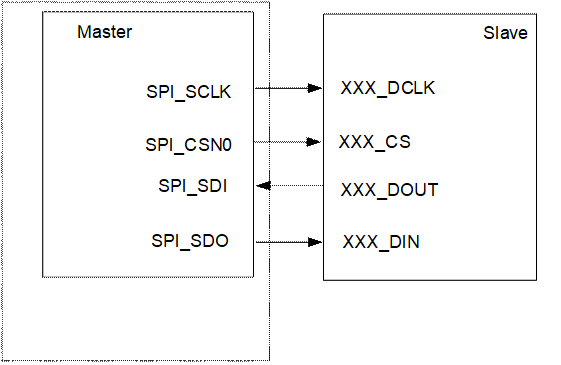

### 三种外设总线时序

图14-10～图14-17中的缩略语含义为：

- MSB：Most Significant Bit
- LSB：Least Significant Bit
- Q：Q is an undefined signal

Motorola SPI接口

<strong><big>说明</big></strong>

SPO表示SPICLKOUT极性，SPH表示SPICLKOUT相位。它们是寄存器SPICR0 bit[7:6]。

SPO=0、SPH=0

SPI单帧帧格式如图14-10所示。

SPI单帧帧格式（SPO=0、SPH=0）

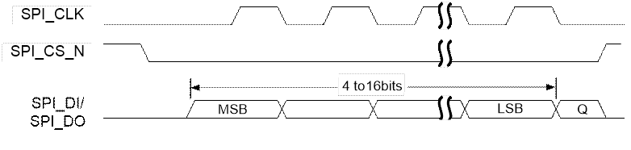

SPI连续帧帧格式如图14-11所示。

SPI连续帧帧格式（SPO=0、SPH=0）

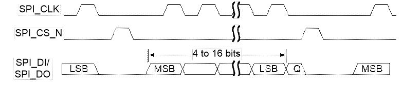

在该模式下，当SPI处于空闲状态时：

- SPI\_CLK信号设置为低
- SPI\_CS\_N信号设置为高
- 发送数据线SPI\_DO强制为低

当SPI处于使能状态，而且发送FIFO内存在有效数据时，设置SPI\_CS\_N信号为低，表示开始传输数据。来自Slave的数据立刻发送到Master的接收数据线SPI\_DI。半个SPI\_CLK时钟周期之后，有效的Master数据传输到SPI\_DO。此时Master和Slave数据都已经有效，SPI\_CLK管脚在接下来的半个SPI\_CLK时钟周期之后变为高电平。数据在SPI\_CLK时钟的上升沿被捕获，在时钟的下降沿被传送。

如果传输单个word，当捕捉到最后1bit数据时，SPI\_CS\_N在接下来的1个SPI\_CLK时钟周期之后恢复为高电平。

如果是连续的传输，SPI\_CS\_N信号在每个word传输之间必须将SPI\_CLK时钟拉高一个时钟周期。这是因为SPH为0时，Salve选择管脚会固定其内部串行设备寄存器的数据，使它不会变化。因此在连续传输时，主设备必须在每个word传输之间将SPI\_CS\_N信号拉高。连续传输结束时，SPI\_CS\_N在捕获到最后1bit之后的1个SPI\_CLK时钟周期之后恢复为高电平。

SPO=0、SPH=1

SPI单帧帧格式如图14-12所示。

SPI单帧帧格式（SPO=0、SPH=1）

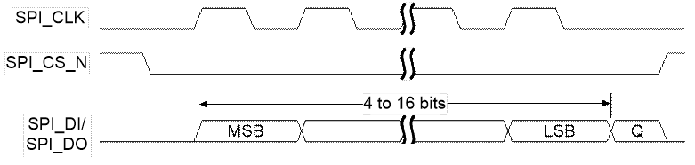

SPI连续帧帧格式如图14-13所示。

SPI连续帧帧格式（SPO=0、SPH=1）

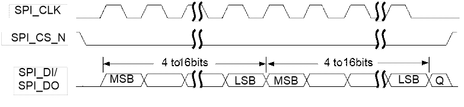

在该模式下，当SPI处于空闲状态时：

- SPI\_CLK信号设置为低
- SPI\_CS\_N设置为高
- 发送数据线SPI\_DO强制为低

当SPI为使能状态，而且发送FIFO内有有效数据时，设置SPI\_CS\_N信号为低表示开始传输数据。半个SPI\_CLK时钟周期之后，Master和Slave的有效数据分别在各自的传输线上有效。同时，SPI\_CLK从第一个上升沿开始有效。数据在SPI\_CLK时钟的下降沿被捕获，在时钟的上升沿被传送。

如果传输单个word，当捕捉到最后1bit数据时，SPI\_CS\_N在接下来的1个SPI\_CLK时钟之后恢复为高电平。

当连续传输时，在传输数据word之间SPI\_CS\_N保持为低。连续传输结束时，SP\_CS\_N在最后1bit捕获之后的1个SPI\_CLK时钟之后恢复为高电平。

SPO=1、SPH=0

SPI单帧帧格式如图14-14所示。

SPI单帧帧格式（SPO=1、SPH=0）

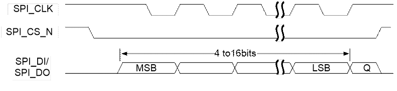

SPI连续帧帧格式如图14-15所示。

SPI连续帧帧格式（SPO=1、SPH=0）

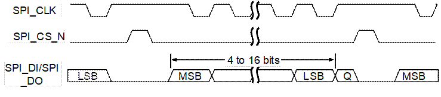

在该配置下，当SPI处于空闲状态时：

- SPI\_CLK信号设置为高
- SPI\_CS\_N信号设置为高
- 发送数据线SPI\_DO强制为低

当SPI为使能状态，而且发送FIFO内有有效数据时，设置SPI\_CS\_N信号为低表示开始传输数据。此时Slave的数据立刻发送到Master的接收数据线SPI\_DI。半个SPI\_CLK周期之后，Master的有效数据传送到SPI\_DO。再过半个SPI\_CLK时钟周期之后，SPI\_CLK Master管脚设置为低。这表示数据在SPI\_CLK时钟的下降沿被捕获，在SPI\_CLK时钟的上升沿被传送。

如果传输单个word，当捕捉到最后1bit数据时，SPI\_CS\_N在接下来的1个SPI\_CLK时钟之后恢复为高电平。

如果是连续的传输，SPI\_CS\_N信号在每个word传输之间必须拉高。这是因为当SPH为0时，Salve选择管脚固定其内部串行设备寄存器的数据，使它不会变化。SPI\_CS\_N在捕获到最后1bit数据之后的1个SPI\_CLK时钟周期之后恢复为高电平。

SPO=1、SPH=1

SPI单帧帧格式如图14-16所示。

SPI单帧帧格式（SPO=1、SPH=1）

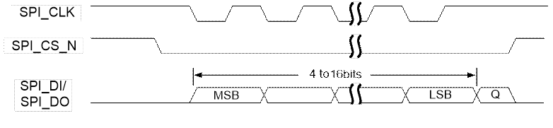

SPI连续帧帧格式如图14-17所示。

SPI连续帧帧格式（SPO=1、SPH=1）

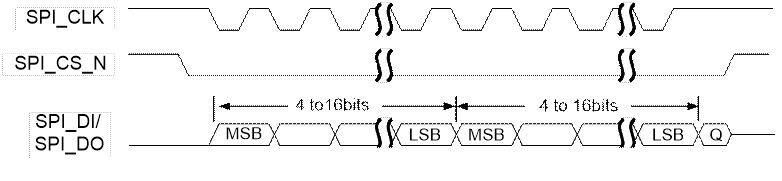

在该模式下，当SPI处于空闲状态时：

- SPI\_CLK信号设置为高
- SPI\_CS\_N信号设置为高
- 发送数据线SPI\_DO强制为低

当SPI为使能状态，而且发送FIFO内有有效数据时，设置SPI\_CS\_N Master信号为低表示开始传输数据。半个SPI\_CLK时钟周期后，Master和Slave数据在各自的传输线上有效。同时，时钟SPI\_CLK从1个下降沿开始有效。数据在SPI\_CLK时钟的上升沿被捕获，在时钟的下降沿被传送。当传输单个word时，SPI\_CS\_N在传输的最后1bit捕获之后的1个SPI\_CLK时钟周期之后恢复为高电平。

如果是连续传输，SPI\_CS\_N信号始终保持为低。SPI\_CS\_N在捕获到最后1bit之后的1个SPI\_CLK时钟周期之后恢复到高状态。对于连续传输来说，SPI\_CS\_N在传输过程中一直保持为低，结束方式与单个传输方式相同。

**（5）接口时序**

SPI接口时序图

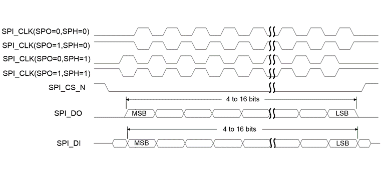

TI同步串行接口

TI同步串行单帧帧格式如图14-19所示。

TI同步串行单帧帧格式

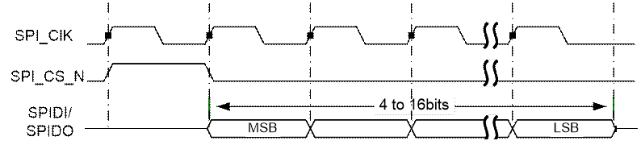

TI同步串行连续帧帧格式如图14-20所示。

TI同步串行连续帧帧格式

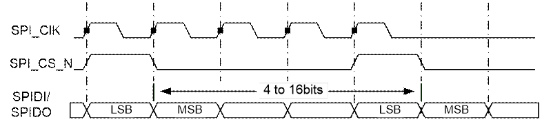

在该模式下，当SPI处于空闲状态时：

- SPI\_CK为低电平。
- SPI\_CS\_N为低电平。
- 传输数据线SPIDO保持为高阻。

一旦发送FIFO有数据，SPICSN就会产生一个SPICK时钟周期的高电平脉冲，将被发送的数据就会从发送FIFO传送到发送逻辑串行移位寄存器。在SPICK时钟的下一个上升沿，4bit～16bit数据帧的MSB就会从SPIDO移位输出。同样，从外部串行slave设备接收数据的MSB会从SPIDI管脚移位输入。

SPI和片外串行设备在SPICK时钟的下降沿将数据存入串行移位寄存器。接收串行寄存器在接收到LSB之后的第一个SPICK时钟上升沿将数据送给接收FIFO。

National Semiconductor Microwire接口

National Semiconductor Microwire单帧帧格式如图14-21所示。

National Semiconductor Microwire单帧帧格式

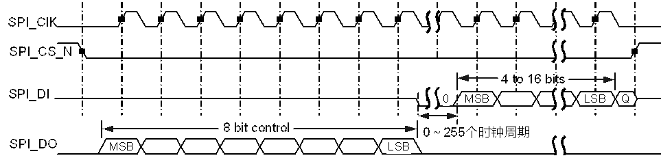

在SPIDO LSB结束和SPIDI MSB开始之间可以延迟0～255个时钟周期。

National Semiconductor Microwire连续帧帧格式如图14-22所示。

National Semiconductor Microwire连续帧帧格式

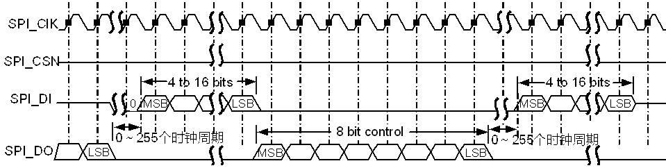

在SPI\_DO LSB结束和SPI\_DI MSB开始之间可以延迟0～255个时钟周期。

Microwire的格式与SPI的格式非常相近，使用master-slave信息的传输技术，只不过SPI是全双工通信，而Microwire半双工通信。在SPI向外部芯片发送串行数据的时候，都要先加8bit控制字。在这个过程中，SPI没有接收到任何数据。传输完毕之后，片外芯片对接收到的数据进行解码，在与8bit控制信息间隔一个时钟周期之后，slave开始响应所需求的数据。返回的数据长度为4bit～16bit，使得整个帧的长度为13bit～25bit。

在该模式下，当SPI处于空闲状态时：

- SPI\_CLK信号设置为低电平。
- SPI\_CS\_N设置为高电平。
- 发送数据线SPI\_DO强制为低电平。

向发送FIFO内部写进一个控制字节开始一次传送。SPI\_CS\_N的下降沿引发数据的传输，发送FIFO的数据被发送到串行移位寄存器，8bit控制帧的MSB被发送到发送管脚SPIDO。在帧的传送过程中，SPI\_CS\_N保持为低。SPI\_DI在这个传送过程中保持为高阻。

片外的串行从设备在SPI\_CLK时钟的每一个上升沿将数据锁存到串行移位寄存器中。当从设备锁存完最后1个bit的数据之后，在接下来的1个时钟周期的等待时间里，对接收到的数据开始解码，然后从设备反馈给SPI所要求的数据。每1个bit都是在SPICK时钟的下降沿写到SPI\_DI的。对单个数据传送来说，在帧的结尾，SPI\_CS\_N在最后1个bit写到接收串行寄存器之后的1个时钟周期后拉高，这样就使接收到的数据传送到接收FIFO。

对于连续的传送来说，数据传送的开始和结束都和单个数据的传送方式相同。在这个传送过程中，信号SPI\_CS\_N时一直保持为低的，传送的数据也是连续的。下一帧的控制字直接和上一帧的LSB相邻。当帧的LSB锁存到SPI之后，接收到的每一个数值都是在SPI\_CLK时钟的下降沿取自接收移位寄存器。

### 工作方式

工作模式

SPI的工作模式分为中断或查询方式下的数据传输和DMA方式下的数据传输。

时钟与复位

输出SPI时钟频率计算方式如下：

Fsspclkout = Fsspclk / (CPSDVSR x (1+SCR））

Fsspclk：SPI的工作参考时钟100MHz。

CPSDVSR、SCR请查询SPICPSR、SPICR0。

支持独立软复位和时钟门控，具体请参见3.2.6 CRG寄存器描述章节。

中断处理

SPI有5个中断，其中前4个是独立中断源、可屏蔽、高电平有效。

- SPIRXINTR

接收FIFO中断请求。当接收FIFO中有4个或更多的有效数据时，该中断置位。

- SPITXINTR

发送FIFO中断请求。当发送FIFO中有4个或更少的有效数据时，该中断置位。

- SPIRORINTR

接收overrun中断请求。当FIFO已满，且又有新的数据需要写入FIFO时，会引起FIFO overrun，该中断置位。此时数据被写入接收移位寄存器，而不是FIFO。

- SPIRTINTR

接收time out中断请求。当接收FIFO非空，且SPI处于idle态超过一个固定的32bit周期，该中断置位。

此时表明接收FIFO中仍有数据需要传输。如果接收FIFO被读空或者当有新的数据被接收到SPIRXD中，该中断解除置位。也可以通过写寄存器SPIICR[RTIC]清除该中断。

- SPIINTR

组合中断，为以上4个中断经过“或”运算后的结果。如果上述4个独立中断中任意一个置位且使能，该中断置位。

SPI的中断SPIINTR请参见中断处理章节。

初始化

初始化步骤如下：

向寄存器SPICR1 [sse]写“0”，禁止SPI。

写寄存器SPICR0，配置帧格式及传输数据位宽等参数。

配置寄存器SPICPSR，设定时钟分频因子。

中断方式下，设置寄存器SPIIMSC，使能相应中断信号；查询、DMA方式下，应禁止产生相应中断信号。

中断或DMA方式，设置SPITXFIFOCR和SPIRXFIFOCR。

DMA方式下，配置寄存器SPIDMACR，使能SPI的DMA功能。

----结束

查询方式下的数据传输

具体步骤如下：

向寄存器SPICR1 [sse]写“1”，使能SPI。

将需发送的数据连续写到寄存器SPIDR。

轮询寄存器SPISR，直到[BSY]=0（表示总线不忙）、[TFE]=1（表示发送FIFO已空）、[RNE]=1（表示接收FIFO非空）。

读出数据，需保证读空接收FIFO（可通过查询SPISR [RNE]得到）。

<strong><big>须知</big></strong>

Motorola SPI/TI同步串行接口的全双工特性，每发一个数据就接收一个数据，即使只需发送数据，也需要清空接收FIFO。

向寄存器SPICR1 [sse]写“0”，禁止SPI。

----结束

中断方式下的数据传输

具体步骤如下：

向寄存器SPICR1 [sse]写“1”，使能SPI。

将需发送的数据连续写到寄存器SPIDR。

等待中断SPIRXINTR，读出数据。循环直到读出所有数据。

<strong><big>须知</big></strong>

Motorola SPI/TI同步串行接口的全双工特性，每发一个数据就接收一个数据，即使只需发送数据，也需要清空接收FIFO。

向寄存器SPICR1 [sse]写“0”，禁止SPI。

----结束

DMA方式下的数据传输

具体步骤如下：

获取一个DMAC通道。

向寄存器SPICR1 [sse]写“1”，使能SPI。

发送数据

配置该DMAC通道的配置寄存器和控制寄存器中的相关参数。

启动DMAC，响应SPI发送FIFO的DMA请求进行数据传输。

通过DMA中断上报，判断数据是否发送完成，如果完成则关闭SPI的DMA功能。

接收数据

配置该DMAC通道的配置寄存器和控制寄存器中的相关参数。

启动DMAC，响应SPI接收FIFO的DMA请求进行数据传输。

通过DMA中断上报，判断数据是否接收完成，如果完成则关闭SPI的DMA功能。

向寄存器SPICR1 [sse]写“0”，禁止SPI。

----结束

### 寄存器概览

SPI寄存器概览如表14-10所示。

- SPI0寄存器基地址：0x0\_1107\_0000
- SPI1寄存器基地址：0x0\_1107\_1000
- SPI2寄存器基地址：0x0\_1107\_3000
- SPI3寄存器基地址：0x0\_1107\_4000

SPI寄存器概览

| 偏移地址 | 名称 | 描述 | 页码 |
| --- | --- | --- | --- |
| 0x000 | SPICR0 | 控制寄存器0 | 14-64 |
| 0x004 | SPICR1 | 控制寄存器1 | 14-66 |
| 0x008 | SPIDR | 数据寄存器 | 14-67 |
| 0x00C | SPISR | 状态寄存器 | 14-67 |
| 0x010 | SPICPSR | 时钟分频寄存器 | 14-68 |
| 0x014 | SPIIMSC | 中断屏蔽寄存器 | 14-68 |
| 0x018 | SPIRIS | 原始中断状态寄存器 | 14-69 |
| 0x01C | SPIMIS | 屏蔽后中断状态寄存器 | 14-69 |
| 0x020 | SPIICR | 中断清除寄存器 | 14-70 |
| 0x024 | SPIDMACR | DMA控制寄存器 | 14-70 |
| 0x028 | SPITXFIFOCR | 发送FIFO控制寄存器 | 14-71 |
| 0x02C | SPIRXFIFOCR | 接收FIFO控制寄存器 | 14-72 |

### 寄存器描述

#### SPICR0

SPICR0为控制寄存器0。

Offset Address: 0x000 Total Reset Value: 0x0000

| Bits | Access | Name | Description | Reset |
| --- | --- | --- | --- | --- |
| [15:8] | RW | SCR | 串行时钟率，取值范围0～255。SCR的值用来产生SPI发送和接收的比特率，公式为Fsspclk / (CPSDVSR x (1+SCR)）。  CPSDVSR是一个2～254之间的偶数，由寄存器SPICPSR配置。 | 0x00 |
| [7] | RW | SPH | SPICLKOUT相位，具体含义请参见“14.3.4 三种外设总线时序”的SPI帧格式。 | 0x0 |
| [6] | RW | SPO | SPICLKOUT极性，具体含义请参见“14.3.4 三种外设总线时序”的SPI帧格式。 | 0x0 |
| [5:4] | RW | FRF | 帧格式选择。  00：Motorola SPI帧格式；  01：TI同步串行帧格式；  10：National Microwire帧格式；  11：保留。 | 0x0 |
| [3:0] | RW | DSS | 设置数据位宽。  0011：4bit；  0100：5bit；  0101：6bit；  0110：7bit；  0111：8bit；  1000：9bit；  1001：10bit；  1010：11bit；  1011：12bit；  1100：13bit；  1101：14bit；  1110：15bit；  1111：16bit；  其他：保留。 | 0x0 |

#### SPICR1

SPICR1为控制寄存器1。

Offset Address: 0x004 Total Reset Value: 0x7F00

| Bits | Access | Name | Description | Reset |
| --- | --- | --- | --- | --- |
| [15] | RW | WaitEn | 等待使能，当SPICR0寄存器的FRF配置为National Microwire帧格式时有效。  0：不使能；  1：使能。 | 0x0 |
| [14:8] | RW | WaitVal | National Microwire帧格式时，写和读之间的等待拍数。当WaitEn 为1并且帧格式为National Microwire时有效。 | 0x7F |
| [7] | - | reserved | 保留。 | 0x0 |
| [6] | RW | mode\_altasens | 0：片选信号由芯片逻辑根据所选时序自动产生  1：当采用Motorola SPI帧格式时，片选CS信号由SPI使能信号控制，使能后，片选拉低，否则片选拉高。 | 0x0 |
| [5] | - | reserved | 保留。 | 0x0 |
| [4] | RW | BitEnd | 数据正反序控制位。  0：数据顺序为MSB到LSB；  1：数据顺序为LSB 到MSB。 | 0x0 |
| [3] | - | reserved | 保留。 | 0x0 |
| [2] | RW | MS | 设置Master或者Slave模式，此位只能在SPI被禁止时改变。  0：Master模式；  1：Slave模式。 | 0x0 |
| [1] | RW | SSE | 设置SPI使能。  0：不使能；  1：使能。 | 0x0 |
| [0] | RW | LBM | 设置环回模式。  0：正常的串行接口操作使能；  1：发送串行移位寄存器的输出在内部连接到接收串行移位寄存器的输入上。 | 0x0 |

#### SPIDR

SPIDR为数据寄存器。

Offset Address: 0x008 Total Reset Value: 0x0000

|  |  |  |  |  |
| --- | --- | --- | --- | --- |
| Bits | Access | Name | Description | Reset |
| [15:0] | RW | DATA | 发送/接收FIFO。  读：接收FIFO；  写：发送FIFO。  如果数据比特数少于16则必须右对齐。发送逻辑将忽略高位未使用的比特位，接收逻辑则自动将数据右对齐。 | 0x0000 |

#### SPISR

SPISR为状态寄存器。

Offset Address: 0x00C Total Reset Value: 0x0003

| Bits | Access | Name | Description | Reset |
| --- | --- | --- | --- | --- |
| [15:5] | - | reserved | 保留。 | 0x000 |
| [4] | RO | BSY | SPI忙标记。  0：空闲；  1：忙。 | 0x0 |
| [3] | RO | RFF | 接收FIFO是否已满。  0：未满；  1：已满。 | 0x0 |
| [2] | RO | RNE | 接收FIFO是否未空。  0：已空；  1：未空。 | 0x0 |
| [1] | RO | TNF | 发送FIFO是否未满。  0：已满；  1：未满。 | 0x1 |
| [0] | RO | TFE | 发送FIFO是否已空。  0：未空；  1：已空。 | 0x1 |

#### SPICPSR

SPICPSR为时钟分频寄存器。

Offset Address: 0x010 Total Reset Value: 0x0000

|  |  |  |  |  |
| --- | --- | --- | --- | --- |
| Bits | Access | Name | Description | Reset |
| [15:8] | - | reserved | 保留。 | 0x00 |
| [7:0] | RW | CPSDVSR | 时钟分频因子。此值必须是2～254之间的偶数，取决于输入时钟SPICLK的频率。最低位读作“0”。 | 0x00 |

#### SPIIMSC

SPIIMSC为中断屏蔽寄存器。

Offset Address: 0x014 Total Reset Value: 0x0000

| Bits | Access | Name | Description | Reset |
| --- | --- | --- | --- | --- |
| [15:4] | - | reserved | 保留。 | 0x000 |
| [3] | RW | TXIM | 发送FIFO中断屏蔽。  0：半空或更少情况下中断被屏蔽；  1：半空或更少情况下中断未被屏蔽。 | 0x0 |
| [2] | RW | RXIM | 接收FIFO中断屏蔽。  0：半空或更少情况下中断被屏蔽；  1：半空或更少情况下中断未被屏蔽。 | 0x0 |
| [1] | RW | RTIM | 接收超时中断。  0：接收超时中断屏蔽；  1：接收超时中断不屏蔽。 | 0x0 |
| [0] | RW | RORIM | 接收溢出中断屏蔽。  0：接收FIFO溢出中断屏蔽；  1：接收FIFO溢出中断不屏蔽。  值为“1”时使能硬件流控功能，即接收FIFO满后SPI停止发送数据。 | 0x0 |

#### SPIRIS

SPIRIS为原始中断状态寄存器。值“0”表示无中断，值“1”表示有中断。

Offset Address: 0x018 Total Reset Value: 0x0008

|  |  |  |  |  |
| --- | --- | --- | --- | --- |
| Bits | Access | Name | Description | Reset |
| [15:4] | - | reserved | 保留。 | 0x000 |
| [3] | RO | TXRIS | 发送FIFO中断的原始中断状态。 | 0x1 |
| [2] | RO | RXRIS | 接收FIFO中断的原始中断状态。 | 0x0 |
| [1] | RO | RTRIS | 接收超时中断的原始中断状态。 | 0x0 |
| [0] | RO | RORRIS | 接收溢出中断的原始中断状态。 | 0x0 |

#### SPIMIS

SPIMIS为屏蔽后中断状态寄存器。值“0”表示无中断，值“1”表示有中断。

Offset Address: 0x01C Total Reset Value: 0x0000

| Bits | Access | Name | Description | Reset |
| --- | --- | --- | --- | --- |
| [15:4] | - | reserved | 保留。 | 0x000 |
| [3] | RO | TXMIS | 发送FIFO中断屏蔽后的状态。 | 0x0 |
| [2] | RO | RXMIS | 接收FIFO中断屏蔽后的状态。 | 0x0 |
| [1] | RO | RTMIS | 接收超时中断屏蔽后的状态。 | 0x0 |
| [0] | RO | RORMIS | 接收溢出中断屏蔽后的状态。 | 0x0 |

#### SPIICR

SPIICR为中断清除寄存器。写“1”清除中断，写“0”无影响。

Offset Address: 0x020 Total Reset Value: 0x0000

|  |  |  |  |  |
| --- | --- | --- | --- | --- |
| Bits | Access | Name | Description | Reset |
| [15:2] | - | reserved | 保留。 | 0x0000 |
| [1] | WC | RTIC | 清除接收超时中断。 | 0x0 |
| [0] | WC | RORIC | 清除接收溢出中断。 | 0x0 |

#### SPIDMACR

SPIDMACR为DMA控制寄存器。

Offset Address: 0x024 Total Reset Value: 0x0000

| Bits | Access | Name | Description | Reset |
| --- | --- | --- | --- | --- |
| [15:2] | - | reserved | 保留位。 | 0x0000 |
| [1] | RW | TXDMAE | DMA发送FIFO使能寄存器。  0：禁止；  1：使能。 | 0x0 |
| [0] | RW | RXDMAE | DMA接收FIFO使能寄存器。  0：禁止；  1：使能。 | 0x0 |

#### SPITXFIFOCR

SPITXFIFOCR为发送FIFO控制寄存器。

Offset Address: 0x028 Total Reset Value: 0x0009

| Bits | Access | Name | Description | Reset |
| --- | --- | --- | --- | --- |
| [15:6] | - | reserved | 保留。 | 0x000 |
| [5:3] | RW | TXINTSize | 配置发送FIFO请求中断的水线。即，发送FIFO中数据数目小于或等于TXINTSize所配置的字数时，TXRIS有效。  000：1；  001：4；  010：8；  011：16；  100：32；  101：64；  110：128；  111：128。 | 0x1 |
| [2:0] | RW | DMATXBRSize | 配置发送FIFO请求DMA进行burst传输的水线。即，发送FIFO中数据数目小于或等于（256-DMATXBRSize）所配置的字数时，DMATXBREQ有效，此处字长是16位。  000：1；  001：4；  010：8；  011：16；  100：32；  101：64；  110：64；  111：64。 | 0x1 |

#### SPIRXFIFOCR

SPIRXFIFOCR为接收FIFO控制寄存器。

Offset Address: 0x02C Total Reset Value: 0x0009

| Bits | Access | Name | Description | Reset |
| --- | --- | --- | --- | --- |
| [15:6] | - | reserved | 保留。 | 0x000 |
| [5:3] | RW | RXINTSize | 配置接收FIFO请求中断的水线。即，接收FIFO中数据数目大于或等于（256-RXINTSize）所配置的字数时，RXRIS有效，此处字长是16位。  000：1；  001：4；  010：8；  011：16；  100：32；  101：64；  110：128；  111：192。 | 0x1 |
| [2:0] | RW | DMARXBRSize | 配置接收FIFO请求DMA进行burst传输的水线。即，接收FIFO中数据数目大于或等于DMARXBRSize所配置的字数时，DMARXBREQ有效。  000：1；  001：4；  010：8；  011：16；  100：32；  101：64；  110：96；  111：128。 | 0x1 |

## 3WIRE SPI

### 概述

芯片提供1个3线SPI接口。

### 工作方式

3线SPI内部工作于APB总线时钟。初始化步骤如下：

根据需要计算出SPI接口时钟,把配置写入寄存器SPI\_3WIRE\_COEF0。

例如：需要SPI接口时钟为1MHz，spi\_clk\_div 应该配置为(100MHz/1MHz)/2 -1 =49,所以配置spi\_clk\_div为0x31。

读操作步骤如下：

把读寄存器的地址写入SPI\_3WIRE\_COEF1 [spi\_add], SPI\_3WIRE\_COEF1 [spi\_rw]写1。

向SPI\_3WIRE\_COEF2 [start]写1,启动读操作。

查询SPI\_3WIRE\_COEF2 [spi\_busy],直到该状态位为0。

从SPI\_3WIRE\_COEF2 [spi\_rdata]读取需要的数据。

----结束

写操作步骤如下：

把写寄存器的地址和数据写入SPI\_3WIRE\_COEF1 [spi\_add]和SPI\_3WIRE\_COEF1 [spi\_wdata], SPI\_3WIRE\_COEF1 [spi\_rw]写0。

向SPI\_3WIRE\_COEF2 [start]写1,启动写操作。

查询SPI\_3WIRE\_COEF2 [spi\_busy],直到该状态位为0。

----结束

### spi\_3wire 寄存器概览

spi\_3wire寄存器概览如表14-11所示。

spi\_3wire寄存器概览（基地址0x0\_1107\_2000）

| 偏移地址 | 名称 | 描述 | 页码 |
| --- | --- | --- | --- |
| 0x0000 | SPI\_3WIRE\_COEF0 | 3线SPI配置寄存器0 | 14-74 |
| 0x0004 | SPI\_3WIRE\_COEF1 | 3线SPI配置寄存器1 | 14-74 |
| 0x0008 | SPI\_3WIRE\_COEF2 | 3线SPI配置寄存器2 | 14-75 |

### spi\_3wire寄存器描述

#### SPI\_3WIRE\_COEF0

SPI\_3WIRE\_COEF0为3线SPI配置寄存器0。

Offset Address: 0x0000 Total Reset Value: 0x0000\_0000

|  |  |  |  |  |
| --- | --- | --- | --- | --- |
| Bits | Access | Name | Description | Reset |
| [31:8] | RO | reserved | 保留。 | 0x000000 |
| [7:0] | RW | spi\_clk\_div | SPI接口的时钟率。取值范围为 [1, 255]。spi\_clk\_div 的值用来产生SPI时钟，公式为FSPICLK=FAPBCLK/(2x(spi\_clk\_div+1))。其中 FAPBCLK为APB总线的时钟频率。例如，APB总线时钟为50MHz，期望 SPI的时钟为1MHz，则 spi\_clk\_div 应该配置为(50MHz/1MHz)/2 -1 =24。 | 0x00 |

#### SPI\_3WIRE\_COEF1

SPI\_3WIRE\_COEF1为3线SPI配置寄存器1。

Offset Address: 0x0004 Total Reset Value: 0x0000\_0000

| Bits | Access | Name | Description | Reset |
| --- | --- | --- | --- | --- |
| [31] | RW | spi\_rw | SPI读写操作选择。  0：写；  1：读。 | 0x0 |
| [30:16] | RW | spi\_add | SPI操作地址。 | 0x0000 |
| [15:0] | RW | spi\_wdata | SPI写数据。 | 0x0000 |

#### SPI\_3WIRE\_COEF2

SPI\_3WIRE\_COEF2为3线SPI配置寄存器2。

Offset Address: 0x0008 Total Reset Value: 0x0000\_0000

|  |  |  |  |  |
| --- | --- | --- | --- | --- |
| Bits | Access | Name | Description | Reset |
| [31:18] | RO | reserved | 保留。 | 0x00000 |
| [17] | RO | spi\_busy | SPI操作状态位。  1：SPI总线上有操作；  0：SPI总线处于IDLE。 | 0x0 |
| [16] | RW | start | 启动SPI读写操作。只有spi\_busy为0时才能启动，回读值为0，无意义。 | 0x0 |
| [15:0] | RO | spi\_rdata | SPI回读数据。 | 0x0000 |

## eMMC/SD/SDIO控制器

### 功能描述

#### 功能框图

eMMC/SD/SDIO控制器（以下简称MMC）用于处理对SD卡、eMMC器件的读写等操作，并通过SDIO协议实现对扩展外设（如蓝牙、WiFi等）的支持。芯片提供3个MMC控制器。

芯片中3个MMC控制器对应的功能信号和管脚名，如下表14-12所示。

芯片中3个MMC控制器对应的功能信号和管脚名

| MMC控制器 | 功能信号 | 管脚名 |
| --- | --- | --- |
| eMMC | EMMC\_DS | EMMC\_DS |
| EMMC\_CLK | EMMC\_CLK |
| EMMC\_CMD | EMMC\_CMD |
| EMMC\_DATA0 | EMMC\_DATA0 |
| EMMC\_DATA1 | EMMC\_DATA1 |
| EMMC\_DATA2 | EMMC\_DATA2 |
| EMMC\_DATA3 | EMMC\_DATA3 |
| EMMC\_DATA4 | EMMC\_DATA4 |
| EMMC\_DATA5 | EMMC\_DATA5 |
| EMMC\_DATA6 | EMMC\_DATA6 |
| EMMC\_DATA7 | EMMC\_DATA7 |
| EMMC\_RST\_N | EMMC\_RST\_N |
| SDIO0 | SDIO0\_CCLK\_OUT | SDIO0\_CCLK\_OUT |
| SDIO0\_CARD\_POWER\_EN\_N | SDIO0\_CARD\_POWER\_EN\_N |
| SDIO0\_CARD\_DETECT | SDIO0\_CARD\_DETECT |
| SDIO0\_CCMD | SDIO0\_CCMD |
| SDIO0\_CDATA0 | SDIO0\_CDATA0 |
| SDIO0\_CDATA1 | SDIO0\_CDATA1 |
| SDIO0\_CDATA2 | SDIO0\_CDATA2 |
| SDIO0\_CDATA3 | SDIO0\_CDATA3 |
| DVDD3318\_SDIO\_VOUT | DVDD3318\_SDIO\_VOUT |
| SDIO1 | SDIO1\_CCLK\_OUT | SDIO1\_CCLK\_OUT |
| SDIO1\_CCMD | SDIO1\_CCMD |
| SDIO1\_CDATA0 | SDIO1\_CDATA0 |
| SDIO1\_CDATA1 | SDIO1\_CDATA1 |
| SDIO1\_CDATA2 | SDIO1\_CDATA2 |
| SDIO1\_CDATA3 | SDIO1\_CDATA3 |

- eMMC支持符合以下协议的设备：

MultiMediaCard（eMMC-version 5.0）

MultiMediaCard（eMMC-version 5.1）

- SDIO0支持符合以下协议的设备：

Secure Digital Memory（SD Card 2.0）

Secure Digital Memory（SD Card3.0）

Secure Digital I/O（SDIO WIFI 2.0）

Secure Digital I/O（SDIO WIFI 3.0）

- SDIO1支持符合以下协议的设备：

Secure Digital I/O（SDIO WIFI 2.0）

Secure Digital I/O（SDIO WIFI 3.0）

MultiMediaCard（eMMC-version 4.5）

MMC的功能框图如图14-23所示。

MMC功能框图

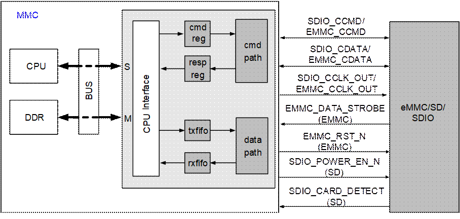

注：S：slave接口；M：master接口。

MMC通过内部总线与系统连接，由以下单元构成：

- 命令通道

完成指令的发送与响应的接收。

- 数据通道

配合命令通道完成数据读写操作。

- 接口时钟控制单元

控制接口时钟的关闭与开启,以及接口方向时钟相位调节。

MMC的功能特点有：

- 最大可支持2TB容量的SD卡和eMMC器件。
- 支持non-DMA、SDMA、ADMA2的数据传输。
- 支持命令与数据的CRC生成与校验。
- 数据位宽支持1bit、4bit、8bit，可根据对接器件选择。
- 支持1byte～65535byte的块数据读写操作。
- SD支持Default Speed(DS)/High Speed(HS)/ SDR12/SDR25/SDR50/SDR104模式。
- eMMC支持DS/HS/HS200/HS400模式，支持boot功能。
- 支持从Boot1、Boot2或User Data分区（取决于Device）boot启动
- 支持eMMC Command Queuing（CQ）功能。
- 支持Enhanced data strobe功能。
#### 典型应用

MMC的典型应用如图14-24所示。

MMC典型应用图

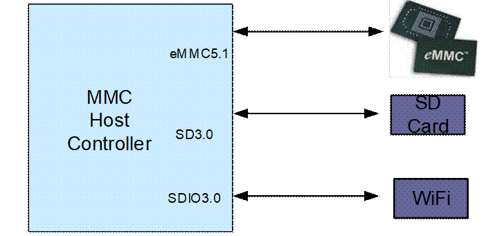

#### 指令与响应

MMC与卡设备之间的所有交互操作均通过指令完成，包括卡初始化、寄存器读写、状态查询、数据传输等。

MMC指令为48bit的串行数据，由起始位、传输位、指令序号、指令参数、CRC校验位和终止位组成。卡收到指令后，会根据指令类型返回48bit或136bit的响应。

MMC指令格式

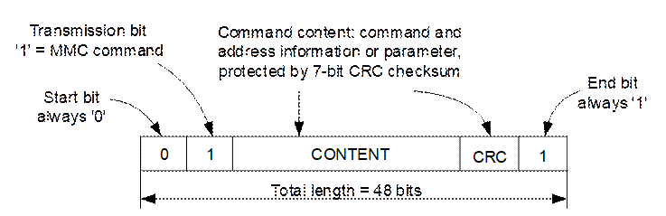

MMC指令响应格式

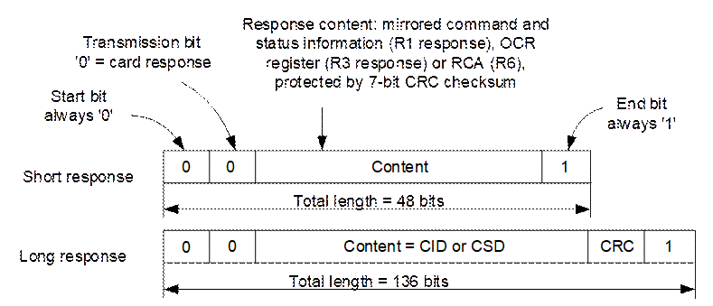

根据是否有数据传输，指令分为以下2种：

- 非数据传输指令

基于指令信号线CMD，MMC与卡采用串行方式进行指令发送与响应接收。

- 数据传输指令

除指令线上的交互外，还有数据线DAT0～DAT3上的数据传输。

（1）非数据传输指令

MMC与卡设备之间的非数据传输指令操作如图14-27所示。

MMC非数据指令操作

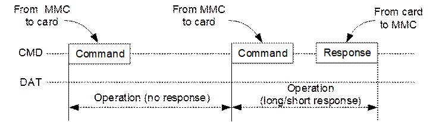

（2）数据传输指令

MMC卡支持以下数据传输指令：

- 流数据读写指令

仅MMC卡支持，只使用1根数据线（即DAT0）进行数据传输，无CRC校验。

- 单块数据读写指令

一次传输完成一个块大小的数据，不需要使用停止命令结束一次数据传输。

- 多块数据读写指令
- predefined block count方式

在多块读写指令前，发送块数量指令指定待传输的数据量。

- open ended方式

发送读写指令后，在数据传输末尾，需使用停止指令来结束一次数据传输。

SDIO设备的多块读写指令，不同于上述2种方式，在发送读写指令时，指令参数中包含待传输的数据量。

根据响应的类型，指令分为以下3种：

- 无响应指令

如卡复位指令。

- 短响应指令

数据传输指令、卡状态查询等均属于这类指令。

- 长响应指令

仅用于读取卡的寄存器CID和CSD信息。

#### 数据传输

单块读写和多块读写为较常用的数据传输方式。通常SD卡、eMMC器件数据传输的一个块大小为512byte，而SDIO设备可根据应用自定义。

<strong><big>说明</big></strong>

以块读写指令方式进行数据传输时，传输数据总量必须为块大小的整数倍。

数据传输指令均为短响应指令，并伴随着数据线上的数据传输。指令、响应及数据线上的时序配合关系如图14-28和图14-29所示。

（1）单块与多块读操作

单块与多块读操作

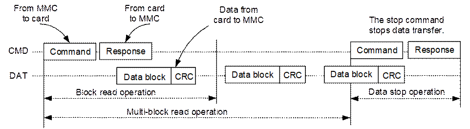

MMC向卡发送单块或多块读指令。在接收响应的过程中，接收以块为单位的数据，其中每块数据中均包含有CRC校验位，以保证数据传输的完整性。

单块读指令操作时，MMC在接收一块数据后完成一次数据传输；多块读指令操作时，MMC在接收多块数据后，需发送一条停止指令结束本次数据传输（仅open ended多块读指令）。

（2）单块与多块写操作

单块与多块写操作

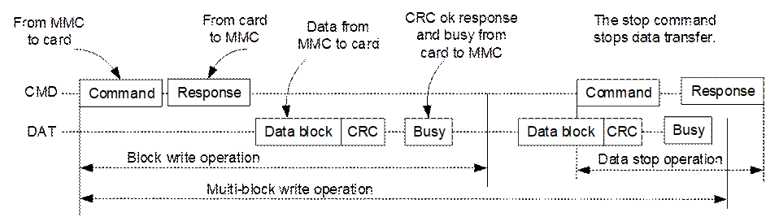

MMC往卡发送单块或多块写指令。在接收到响应后，往卡发送以块为单位的数据，其中每块数据中均包含有CRC校验位，卡会对每块数据进行CRC校验，并反馈CRC状态以确认数据传输的正确性。

单块写指令操作时，MMC在发送一块数据后完成一次数据传输；多块写指令操作时，MMC在发送多块数据后，需发送一条停止指令完成本次数据传输（仅open ended多块读指令）。写操作结束后，卡可能会因为编程Flash而处于繁忙状态，MMC需查询DAT0状态，以确认卡脱离繁忙状态后才能对卡进行下一步操作。

（3）数据传输格式

块方式读写中，MMC与卡之间可采用1bit或4bit数据线方式进行数据传输。在发送数据传输指令之前，应分别设置MMC与卡的数据传输位宽模式（1bit或4bit），使它们保持一致。MMC的数据位宽通过寄存器HOST1\_PWR\_BGAP\_WUP\_CTRL\_R设置，卡的数据位宽则通过发送相应的指令进行设置。

1bit和4bit模式下的数据传输格式如图14-30和图14-31所示。

1bit数据线传输模式下的块数据格式

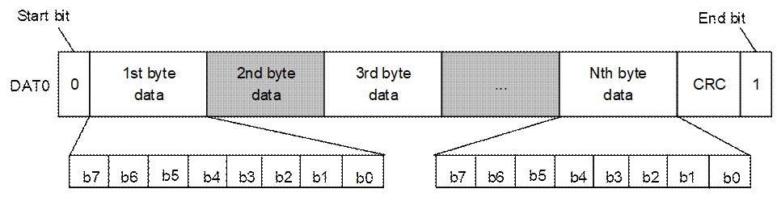

4bit数据线传输模式下的块数据格式

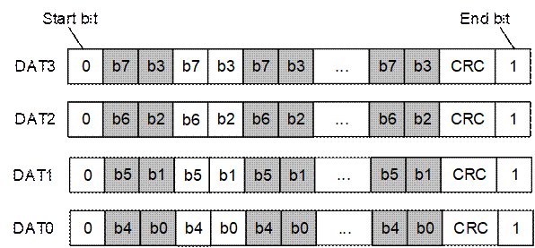

#### SD3.0支持的速度模式及电压切换

控制器支持SD3.0 Ultra High Speed(UHS-I)，在SD-mode模式下支持电压切换，各传输模式如表14-13所示。

传输模式表

| 模式 | 支持的输入时钟（MHz） | 卡侧时钟 | 最大数据位宽 | 电压 |
| --- | --- | --- | --- | --- |
| SDR104 | 196.58MHz | 196.5MHz | 4bit | 1.8V |
| SDR50 | 99MHz | 99MHz | 4bit | 1.8V |
| SDR25 | 49.5MHz | 49.5MHz | 4bit | 1.8V |
| SDR12 | 4.75MHz | 24.75 | 4bit | 1.8V |
| HS | 49.5MHz | 49.5MHz | 4bit | 3.3V |
| DS | 24.75MHz | 24.75MHz | 4bit | 3.3V |

#### eMMC支持的速度模式及电压

控制器在eMMC-mode模式下支持的各传输模式如表14-14所示。

传输模式表

|  |  |  |  |  |
| --- | --- | --- | --- | --- |
| 模式 | 支持的输入时钟（MHz） | 卡侧时钟 | 最大数据位宽 | 电压 |
| HS400 | 196.5MHz | 196.5MHz | 8bit | 1.8V |
| HS200 | 196.5MHz | 196.5MHz | 8bit | 1.8V |
| HS\_SDR | 49.5MHz | 49.5MHz | 8bit | 1.8V |
| Backwards Compatibility with legacy MMC card | 24.75MHz | 24.75MHz | 8bit | 1.8V |

#### SDIO3.0支持的速度模式及电压切换

控制器支持SDIO3.0 WIFI，在SDIO-mode模式下支持电压切换，各传输模式如表14-15所示。

传输模式表

| 模式 | 支持的输入时钟（MHz） | 卡侧时钟 | 最大数据位宽 | 电压 |
| --- | --- | --- | --- | --- |
| SDR104 | 196.5MHz | 196.5MHz | 4bit | 1.8V |
| SDR50 | 99MHz | 99MHz | 4bit | 1.8V |
| SDR25 | 49.5MHz | 49.5MHz | 4bit | 1.8V |
| SDR12 | 24.75MHz | 24.75MHz | 4bit | 1.8V |
| HS | 49.5MHz | 49.5MHz | 4bit | 3.3V |
| DS | 24.75MHz | 24.75MHz | 4bit | 3.3V |

### 应用说明

<strong><big>说明</big></strong>

时钟复位寄存器请参考3.2.6 "CRG寄存器描述"。

#### 软复位

在数据传输出现异常而导致MMC无法回到空闲状态时：

- CRG寄存器PERI\_CRG3376 bit[16]写“1”对eMMC模块进行软复位；
- CRG寄存器PERI\_CRG3440 bit[16]写“1”对SDIO0模块进行软复位；
- CRG寄存器PERI\_CRG3504 bit[16]写“1”对SDIO1模块进行软复位；

**建议在使用MMC之前和热插拔卡后，软复位MMC。**

#### 接口时钟配置

遵从不同协议版本的MMC卡，以及MMC卡处于不同的状态时，均使用不同的时钟频率。

- eMMC通过CRG寄存器PERI\_CRG3376 bit[26:24]配置；
- SDIO0通过CRG寄存器PERI\_CRG3440 bit[26:24]配置；
- SDIO1通过CRG寄存器PERI\_CRG3504 bit[26:24]配置；

在改变MMC卡的时钟频率之前，必须保证没有数据或指令正在传输。为了避免输出到MMC卡的时钟产生毛刺，在改变MMC卡的时钟频率时应该遵照以下步骤：

关闭接口时钟。

将寄存器CLK\_CTRL\_Rbit[2]置“0”。

设置接口时钟频率。

根据不同的MMC配置对应的CRG寄存器，选择接口时钟频率。

重新使能接口时钟。

将寄存器CLK\_CTRL\_Rbit[2]置“1”。

----结束

#### MMC初始化

与卡进行命令和数据的交互前，需要初始化控制器，步骤如下：

清中断。将寄存器NORMAL\_INT\_STAT\_R bit[15:0] 和ERROR\_INT\_STAT\_R bit[15:0]所有位置“1”，清除原始中断状态位。

关闭中断信号使能。将寄存器NORMAL\_INT\_SIGNAL\_EN\_Rbit[15:0] 和ERROR\_INT\_SIGNAL\_EN\_R bit[15:0]所有位置“0”。

设置超时计数。配置寄存器TOUT\_CTRL\_R bit[3:0]。

如果为eMMC，将寄存器EMMC\_CTRL\_R bit[0] 置“1”，同时初始化eMMC PHY，否则置“0”。

开启power\_on。将寄存器PWR\_CTRL\_R bit[0] 置“1”。

打开时钟。配置寄存器CLK\_CTRL\_R bit[3]、[2]和[0] 为“1”。

打开中断状态使能。配置寄存器NORMAL\_INT\_STAT\_EN\_R bit[15:0]和ERROR\_INT\_STAT\_R bit[15:0]。

打开中断信号使能。配置寄存器NORMAL\_INT\_SIGNAL\_EN\_R bit[15:0]和ERROR\_INT\_SIGNAL\_EN\_R bit[15:0]。

----结束

完成以上步骤后，配置接口时钟以后，就可以往卡发送指令了。

#### 非数据传输指令

发送非数据传输指令的步骤如下：

在寄存器ARGUMENT\_R中设置相应的指令内容。

在寄存器XFER\_MODE\_R和CMD\_R中设置相应指令参数。

等待指令被MMC执行。

检查寄存器NORMAL\_INT\_STAT\_R bit[0]是否产生指令完成中断。

检查寄存器ERROR\_INT\_STAT\_Rbit[15:0]是否有异常响应中断，必要时可读取响应值。

----结束

#### 单块或多块读数据

读取单块或多块数据的步骤如下：

清除中断寄存器NORMAL\_INT\_STAT\_R和ERROR\_INT\_STAT\_R中的中断。

向寄存器BLOCKSIZE\_R和BLOCKCOUNT\_R bit[11:0]写入块的大小。

向寄存器SDMASA\_R写入块的个数。

向寄存器ARGUMENT\_R写入读取数据的起始地址。

配置寄存器XFER\_MODE\_R和CMD\_R，设置数据传输参数。

对于SD卡、eMMC器件，分别使用指令CMD17/CMD18进行单块/多块读操作；对于SDIO卡，使用指令CMD53进行单块/多块读操作。

一旦寄存器CMD\_R被写入，MMC就执行指令；当指令被送到总线上以后，产生cmd\_done中断。

Non\_DMA方式读取数据。检查寄存器NORMAL\_INT\_STAT\_R bit[5]，如果为1，则从寄存器BUF\_DATA\_R读取FIFO中的数据，以便MMC接收后面的数据；同时检查数据错误中断，即寄存器ERROR\_INT\_STAT\_R bit[4]、bit[5]、bit[6]。此时，程序可以发送一个停止指令中止数据的传输。

当寄存器NORMAL\_INT\_STAT\_R bit[1]为1时，数据传输完成，从寄存器BUF\_DATA\_R中读取残留在FIFO中的数据。

----结束

#### 单块与多块写数据

写入单块或多块数据的步骤如下：

清除中断寄存器NORMAL\_INT\_STAT\_R和ERROR\_INT\_STAT\_R中的中断。

向寄存器BLOCKSIZE\_R和BLOCKCOUNT\_R bit[11:0]写入块的大小。

向寄存器SDMASA\_R写入块的个数。

向寄存器ARGUMENT\_R写入要写数据的起始地址。

配置寄存器XFER\_MODE\_R和CMD\_R，设置数据传输参数。

对于SD卡、eMMC器件，分别使用指令CMD24/CMD25进行单块/多块写操作；对于SDIO卡，使用指令CMD53进行单块/多块写操作。

Non\_DMA方式写数据。将数据写入FIFO，即写寄存器BUF\_DATA\_R。

检查寄存器NORMAL\_INT\_STAT\_R bit[4]，如果为1，则向寄存器BUF\_DATA\_R写入要填充到FIFO中的数据，以便MMC发送后面的数据；同时检查数据错误中断，即寄存器ERROR\_INT\_STAT\_R bit[4]、bit[5]、bit[6]。此时，程序可以发送一个停止指令中止数据的传输。

当寄存器NORMAL\_INT\_STAT\_R bit[1]为1时，数据传输完成。

----结束

### 寄存器概览

MMC寄存器概览如表14-16所示。

MMC寄存器概览（eMMC基地址是0x0\_1002\_0000；SDIO0基址是0x0\_1003\_0000；SDIO1基地址是0x0\_1004\_0000）

| 偏移地址 | 名称 | 描述 | 页码 |
| --- | --- | --- | --- |
| 0x0000 | SDMASA\_R | SDMA系统地址寄存器 | 14-91 |
| 0x0004 | BLOCKSIZE\_R | BLOCK SIZE寄存器 | 14-91 |
| 0x0006 | BLOCKCOUNT\_R | BLOCK CNT寄存器 | 14-92 |
| 0x0008 | ARGUMENT\_R | SD/eMMC命令内容寄存器 | 14-93 |
| 0x000c | XFER\_MODE\_R | Transfer模式寄存器 | 14-93 |
| 0x000e | CMD\_R | 命令寄存器 | 14-94 |
| 0x0010 | RESP01\_R | RESP01寄存器 | 14-95 |
| 0x0014 | RESP23\_R | RESP23寄存器 | 14-96 |
| 0x0018 | RESP45\_R | RESP45寄存器 | 14-96 |
| 0x001c | RESP67\_R | RESP67寄存器 | 14-96 |
| 0x0020 | BUF\_DATA\_R | Buffer数据寄存器 | 14-96 |
| 0x0024 | PSTATE\_R | 当前状态寄存器 | 14-97 |
| 0x0028 | HOST\_CTRL1\_R | HOST控制1寄存器 | 14-98 |
| 0x0029 | PWR\_CTRL\_R | 上电控制寄存器 | 14-99 |
| 0x002c | CLK\_CTRL\_R | 时钟控制寄存器 | 14-100 |
| 0x002e | TOUT\_CTRL\_R | 超时控制寄存器 | 14-100 |
| 0x002f | SW\_RST\_R | 软复位控制寄存器 | 14-101 |
| 0x0030 | NORMAL\_INT\_STAT\_R | 普通中断状态寄存器 | 14-101 |
| 0x0032 | ERROR\_INT\_STAT\_R | 错误中断状态寄存器 | 14-103 |
| 0x0034 | NORMAL\_INT\_STAT\_EN\_R | 普通中断状态使能寄存器 | 14-105 |
| 0x0036 | ERROR\_INT\_STAT\_EN\_R | 错误中断状态使能寄存器 | 14-107 |
| 0x0038 | NORMAL\_INT\_SIGNAL\_EN\_R | 普通中断信号使能寄存器 | 14-109 |
| 0x003a | ERROR\_INT\_SIGNAL\_EN\_R | 错误中断信号使能寄存器 | 14-111 |
| 0x003c | AUTO\_CMD\_STAT\_R | Auto命令状态寄存器 | 14-113 |
| 0x003e | HOST\_CTRL2\_R | HOST控制2寄存器 | 14-114 |
| 0x0040 | CAPABILITIES1\_R | 能力1寄存器 | 14-115 |
| 0x0044 | CAPABILITIES2\_R | 能力2寄存器 | 14-118 |
| 0x0054 | ADMA\_ERR\_STAT\_R | ADMA错误状态寄存器 | 14-119 |
| 0x0058 | ADMA\_SA\_LOW\_R | ADMA系统地址低32bit寄存器 | 14-120 |
| 0x005c | ADMA\_SA\_HIGH\_R | ADMA系统地址高32bit寄存器 | 14-120 |
| 0x0078 | ADMA\_ID\_LOW\_R | ADMA Intergrated 描述子地址低32bit寄存器 | 14-120 |
| 0x007c | ADMA\_ID\_HIGH\_R | ADMA Intergrated 描述子地址高32bit寄存器 | 14-121 |
| 0x0180 | CQVER | 命令队列版本寄存器 | 14-121 |
| 0x0184 | CQCAP | 命令队列机制性能寄存器 | 14-121 |
| 0x0188 | CQCFG | 命令队列配置寄存器 | 14-122 |
| 0x018c | CQCTL | 命令队列控制寄存器 | 14-123 |
| 0x0190 | CQIS | 命令队列中断状态寄存器 | 14-123 |
| 0x0194 | CQISE | 命令队列中断状态使能寄存器 | 14-124 |
| 0x0198 | CQISGE | 命令队列中断信号使能寄存器 | 14-125 |
| 0x019c | CQIC | 命令队列中断聚合寄存器 | 14-125 |
| 0x01a0 | CQTDLBA | 命令队列任务描述子列表基地址寄存器 | 14-128 |
| 0x01a4 | CQTDLBAU | 命令队列任务描述子列表基地址高位寄存器 | 14-128 |
| 0x01a8 | CQTDBR | CommandQ DoorBell寄存器 | 14-128 |
| 0x01ac | CQTCN | CommandQ 任务完成通知寄存器 | 14-129 |
| 0x01b0 | CQDQS | 器件队列状态寄存器 | 14-129 |
| 0x01b4 | CQDPT | 器件队列等待任务寄存器 | 14-129 |
| 0x01b8 | CQTCLR | CommandQ 任务清除寄存器 | 14-129 |
| 0x01c0 | CQSSC1 | 发送状态1寄存器 | 14-130 |
| 0x01c4 | CQSSC2 | 发送状态2寄存器 | 14-130 |
| 0x01c8 | CQCRDCT | DCMD response寄存器 | 14-130 |
| 0x01d0 | CQRMEM | response错误掩码寄存器 | 14-131 |
| 0x01d4 | CQTERRI | CommandQ任务错误信息寄存器 | 14-131 |
| 0x01d8 | CQCRI | CommandQ response序号寄存器 | 14-132 |
| 0x01dc | CQCRA | CommandQ response内容寄存器 | 14-132 |
| 0x0500 | MSHC\_VER\_ID\_R | 控制器版本ID寄存器 | 14-132 |
| 0x0504 | MSHC\_VER\_TYPE\_R | 控制器版本类型寄存器 | 14-133 |
| 0x0510 | AXI\_MBIIU\_CTRL | AXI总线模块配置寄存器 | 14-133 |
| 0x052c | EMMC\_CTRL\_R | eMMC控制寄存器 | 14-134 |
| 0x052e | BOOT\_CTRL\_R | BOOT 控制寄存器 | 14-135 |
| 0x0534 | GP\_OUT\_R | eMMC复位和GPIO寄存器 | 14-136 |
| 0x0540 | AT\_CTRL\_R | Tuning控制寄存器 | 14-136 |
| 0x0544 | AT\_STAT\_R | Tuning状态寄存器 | 14-137 |

### 寄存器描述

#### SDMASA\_R

SDMASA\_R为SDMA系统地址寄存器。

Offset Address: 0x0000 Total Reset Value: 0x0000\_0000

| Bits | Access | Name | Description | Reset |
| --- | --- | --- | --- | --- |
| [31:0] | RW | blockcnt\_sdmasa | 根据Host Control 2寄存器中的Host Version 4 Enable位配置32bit块计数或SDMA系统地址。  Host Version Enable=0，表示SDMA 32bit寻址模式下一次SDMA传输的系统Memory地址。  Host Version Enable=1，表示Block Count。  0xFFFF\_FFFF：4G-1 Blocks  ......  0x0000\_0002：2 Blocks  0x0000\_0001：1 Block  0x0000\_0000：Stop Count | 0x00000000 |

#### BLOCKSIZE\_R

BLOCKSIZE\_R为BLOCK SIZE寄存器。

Offset Address: 0x0004 Total Reset Value: 0x0000

| Bits | Access | Name | Description | Reset |
| --- | --- | --- | --- | --- |
| [15] | - | reserved | 保留。 | 0x0 |
| [14:12] | RW | sdma\_buf\_bdary | SDMA Buffer Boundary  这些位指定系统内存中的连续缓冲区的大小。SDMA传输在每个由这些字段指定的边界处等待，并且主机控制器产生DMA中断来请求主机驱动程序更新SDMA系统地址寄存器。  0x0：4K bytes；  0x1：8K bytes；  ……  0x7：512K bytes | 0x0 |
| [11:0] | RW | xfer\_block\_size | 传输块大小。  0x1：1 byte  0x2：2 bytes  0x3：3 bytes  ......  0x1FF：511 byte  0x200：512 bytes  ......  0x800：2048 bytes | 0x000 |

#### BLOCKCOUNT\_R

BLOCKCOUNT\_R为BLOCK COUNT寄存器。

Offset Address: 0x0006 Total Reset Value: 0x0000

| Bits | Access | Name | Description | Reset |
| --- | --- | --- | --- | --- |
| [15:0] | RW | block\_cnt | 如果Host Version 4 Enable = 0或者16位块计数寄存器设置为非零，则选择16位块计数寄存器。  如果Host Version 4 Enable = 1，并且16位块计数寄存器设置为0，则选择32位块计数寄存器。  注意：当Host Version 4 Enable = 0时，在编程非DMA和ADMA模式下Auto CMD23使能时32bit块计数寄存器之前，必须将该寄存器配置为0000h。 | 0x0000 |

#### ARGUMENT\_R

ARGUMENT\_R为SD/eMMC命令内容寄存器。

Offset Address: 0x0008 Total Reset Value: 0x0000\_0000

|  |  |  |  |  |
| --- | --- | --- | --- | --- |
| Bits | Access | Name | Description | Reset |
| [31:0] | RW | argument | 32bit命令内容值。 | 0x00000000 |

#### XFER\_MODE\_R

XFER\_MODE\_R为Transfer模式命令寄存器。

Offset Address: 0x000c Total Reset Value: 0x0000

| Bits | Access | Name | Description | Reset |
| --- | --- | --- | --- | --- |
| [15:9] | - | reserved | 保留。 | 0x00 |
| [8] | RW | resp\_int\_disable | response中断关闭。  0：使能；  1：关闭。 | 0x0 |
| [7] | RW | resp\_err\_chk\_enable | response错误检查使能。  0：不使能；  1：使能。 | 0x0 |
| [6] | RW | resp\_type | response R1/R5类型。  0：R1；  1：R5。 | 0x0 |
| [5] | RW | multi\_blk\_sel | multiple/single block选择。  0：single block；  1：multiple block。 | 0x0 |
| [4] | RW | data\_xfer\_dir | Data Transfer 方向。  0：控制器到卡；  1：卡到控制器。 | 0x0 |
| [3:2] | RW | auto\_cmd\_enable | Auto Command Enable。  00：关闭；  01：Auto CMD12 Enable；  10：Auto CMD23 Enable；  11：Auto CMD Auto Select。  (SDIO中固定为0) | 0x0 |
| [1] | RW | block\_count\_enable | Block count 使能。  0：关闭；  1：使能。 | 0x0 |
| [0] | RW | dma\_enable | DMA 使能。  0：无数据传输或者非DMA数据传输；  1：DMA数据传输。 | 0x0 |

#### CMD\_R

CMD\_R为Transfer模式命令寄存器。

Offset Address: 0x000e Total Reset Value: 0x0000

| Bits | Access | Name | Description | Reset |
| --- | --- | --- | --- | --- |
| [15:14] | - | reserved | 保留。 | 0x0 |
| [13:8] | RW | cmd\_index | 命令编号。 | 0x00 |
| [7:6] | RW | cmd\_type | 命令类型。  00：Normal命令；  01：Suspend命令；  10：Resume命令；  11：Abort命令。 | 0x0 |
| [5] | RW | data\_present\_sel | 当前是否为数据传输。  0：无数据传输；  1：有数据传输。 | 0x0 |
| [4] | RW | cmd\_idx\_chk\_enable | 命令编号检查使能。  0：关闭；  1：使能。 | 0x0 |
| [3] | RW | cmd\_crc\_chk\_enable | 命令CRC检查使能。  0：关闭；  1：使能。 | 0x0 |
| [2] | RW | sub\_cmd\_flag | 子命令标识。  0：Main；  1：Sub Command。 | 0x0 |
| [1:0] | RW | resp\_type\_select | response 类型。  00：无response；  01：response Length 136；  10：response length 48；  11：response length 48 check。 | 0x0 |

#### RESP01\_R

RESP01\_R为RESP01寄存器。

Offset Address: 0x0010 Total Reset Value: 0x0000\_0000

|  |  |  |  |  |
| --- | --- | --- | --- | --- |
| Bits | Access | Name | Description | Reset |
| [31:0] | RO | resp01 | RESP01寄存器。存放控制器发送命令的response bit[39:8]bits内容。 | 0x00000000 |

#### RESP23\_R

RESP23\_R为RESP23寄存器。

Offset Address: 0x0014 Total Reset Value: 0x0000\_0000

|  |  |  |  |  |
| --- | --- | --- | --- | --- |
| Bits | Access | Name | Description | Reset |
| [31:0] | RO | resp01 | RESP23寄存器。存放控制器发送命令的response bit[71:40]内容。 | 0x00000000 |

#### RESP45\_R

RESP45\_R为RESP45寄存器。

Offset Address: 0x0018 Total Reset Value: 0x0000\_0000

|  |  |  |  |  |
| --- | --- | --- | --- | --- |
| Bits | Access | Name | Description | Reset |
| [31:0] | RO | resp01 | RESP45寄存器。存放控制器发送命令的response bit[103:72]内容。 | 0x00000000 |

#### RESP67\_R

RESP67\_R为RESP67寄存器。

Offset Address: 0x001c Total Reset Value: 0x0000\_0000

|  |  |  |  |  |
| --- | --- | --- | --- | --- |
| Bits | Access | Name | Description | Reset |
| [31:0] | RO | resp01 | RESP67寄存器。存放控制器发送命令的response bit[135:104]内容。 | 0x00000000 |

#### BUF\_DATA\_R

BUF\_DATA\_R为Buffer数据寄存器。

Offset Address: 0x0020 Total Reset Value: 0x0000\_0000

|  |  |  |  |  |
| --- | --- | --- | --- | --- |
| Bits | Access | Name | Description | Reset |
| [31:0] | RW | buf\_data | 控制器中存放接收发送数据的Buffer，在Slave方式下通过不断写这个寄存器来写数据到卡中，通过不断读这个寄存器来获取卡中的数据。 | 0x00000000 |

#### PASTATE\_R

PASTATE\_R为当前状态寄存器。

Offset Address: 0x0024 Total Reset Value: 0x0000\_0000

| Bits | Access | Name | Description | Reset |
| --- | --- | --- | --- | --- |
| [31:28] | - | reserved | 保留。 | 0x0 |
| [27] | RO | cmd\_issue\_err | 命令发送出错状态。  0：发送命令无错；  1：命令不能被发送出去。 | 0x0 |
| [26:25] | - | reserved | 保留。 | 0x0 |
| [24] | RO | cmd\_line\_lvl | Cmd管脚状态。  0：cmd管脚为低电平；  1：cmd管脚为高电平。 | 0x0 |
| [23:20] | RO | sd\_dat\_in[3:0] | Data[3:0]管脚状态，每个bit含义。  0：Data管脚为低电平；  1：Data管脚为高电平。 | 0x0 |
| [19] | - | reserved | 保留。 | 0x0 |
| [18] | RO | Card\_detect\_pin\_lvl | Card\_detect\_n管脚状态。  0：Card\_detect\_n管脚为低电平；  1：Card\_detect\_n管脚为高电平。 | 0x0 |
| [17:12] | - | reserved | 保留。 | 0x0 |
| [11] | RO | buf\_rd\_enable | Buffer读使能。  0：不使能；  1：使能。 | 0x0 |
| [10] | RO | buf\_wr\_enable | Buffer写使能。  0：不使能；  1：使能。 | 0x0 |
| [9] | RO | Rd\_xfer\_active | 读transfer有效。  0：空闲状态；  1：正在读数据。 | 0x0 |
| [8] | RO | Wr\_xfer\_active | 写transfer有效。  0：空闲状态；  1：正在写数据。 | 0x0 |
| [7:4] | RO | sd\_dat\_in[7:4] | Data[7:4]管脚状态，每个bit含义。  0：Data管脚为低电平；  1：Data管脚为高电平。 | 0x0 |
| [3] | - | reserved | 保留。 | 0x0 |
| [2] | RO | Dat\_line\_active | 数据线有效。  0：空闲状态；  1：正在数据传输。 | 0x0 |
| [1] | RO | cmd\_inhibit\_dat | 带数据的命令有效。  0：空闲状态，可以发送带数据的命令；  1：数据线正在传输或者读操作有效中。 | 0x0 |
| [0] | RO | cmd\_inhibit | 数据线有效。  0：空闲状态，控制器可以发送命令；  1：忙状态，控制器不可以发送命令。 | 0x0 |

#### HOST\_CTRL1\_R

HOST\_CTRL1\_R为HOST控制1寄存器。

Offset Address: 0x0028 Total Reset Value: 0x00

| Bits | Access | Name | Description | Reset |
| --- | --- | --- | --- | --- |
| [7] | RW | card\_detect\_sig\_lvl | 卡检测信号。 | 0x0 |
| [6] | RW | card\_detect\_test\_lvl | 卡插入检测。  0：无卡；  1：有卡插入。 | 0x0 |
| [5] | RW | ext\_data\_xfer | 扩展数据位宽。  0：由dat\_xfer\_width寄存器控制；  1：8bit Bus width。 | 0x0 |
| [4:3] | RW | dma\_sel | DMA 选择。  00：SDMA；  01：保留；  10：ADMA2；  11：ADMA2或者ADMA3。 | 0x0 |
| [2] | RW | high\_speed\_en | 高速使能。  0：Normal Speed；  1：High Speed。 | 0x0 |
| [1] | RW | dat\_xfer\_width | 传输数据位宽。  0：1bit；  1：4bit。 | 0x0 |
| [0] | - | reserved | 保留。 | 0x0 |

#### PWR\_CTRL\_R

PWR\_CTRL\_R为HOST基础配置控制寄存器。

Offset Address: 0x0029 Total Reset Value: 0x00

| Bits | Access | Name | Description | Reset |
| --- | --- | --- | --- | --- |
| [7:1] | - | reserved | 保留。 | 0x00 |
| [0] | RW | sd\_bus\_pwr\_vdd1 | VDD2 Power使能。  0：Power off；  1：Power on。 | 0x0 |

#### CLK\_CTRL\_R

CLK\_CTRL\_R为时钟控制寄存器。

Offset Address: 0x002c Total Reset Value: 0x0000

| Bits | Access | Name | Description | Reset |
| --- | --- | --- | --- | --- |
| [15:3] | - | reserved | 保留。 | 0x000 |
| [2] | RW | sd\_clk\_en | SD/eMMC时钟使能。  0：关闭；  1：打开。 | 0x0 |
| [1] | RO | internal\_clk\_statable | 内部时钟状态。  0：不稳定；  1：稳定。 | 0x0 |
| [0] | RW | internal\_clk\_en | 内部时钟使能。  0：不使能；  1：使能。 | 0x0 |

#### TOUT\_CTRL\_R

TOUT\_CTRL\_R为超时控制寄存器。

Offset Address: 0x002e Total Reset Value: 0x00

| Bits | Access | Name | Description | Reset |
| --- | --- | --- | --- | --- |
| [7:4] | - | reserved | 保留。 | 0x0 |
| [3:0] | RW | tout\_cnt | 数据超时计数值。  0x0：1us x 2^13；  0xe：1us x 2^27；  其他：保留。 | 0x0 |

#### SW\_RST\_R

SW\_RST\_R为软复位控制寄存器。

Offset Address: 0x002f Total Reset Value: 0x00

| Bits | Access | Name | Description | Reset |
| --- | --- | --- | --- | --- |
| [7:3] | - | reserved | 保留。 | 0x00 |
| [2] | RW | sw\_rst\_dat | 软复位数据线请求。  0：不复位；  1：复位。 | 0x0 |
| [1] | RW | sw\_rst\_cmd | 软复位命令线请求。  0：不复位；  1：复位。 | 0x0 |
| [0] | RW | sw\_rst\_all | 软复位控制器请求。  0：不复位；  1：复位。 | 0x0 |

#### NORMAL\_INT\_STAT\_R

NORMAL\_INT\_STAT\_R为普通中断状态寄存器。

Offset Address: 0x0030 Total Reset Value: 0x0000

| Bits | Access | Name | Description | Reset |
| --- | --- | --- | --- | --- |
| [15] | RO | err\_interrupt | 汇总错误中断状态。  0：无中断；  1：有中断。 | 0x0 |
| [14] | WC | cqe\_event | CMD事件中断状态。  0：无中断；  1：有中断。 | 0x0 |
| [13] | RO | fx\_event | TX事件中断状态。  0：无中断；  1：有中断。 | 0x0 |
| [12] | RO | re\_tune\_event | Retuning事件中断状态。  0：无中断；  1：有中断。 | 0x0 |
| [11] | RO | int\_c | INT\_C中断状态。  0：无中断；  1：有中断。 | 0x0 |
| [10] | RO | int\_b | INT\_B中断状态。  0：无中断；  1：有中断。 | 0x0 |
| [9] | RO | int\_a | INT\_A中断状态。  0：无中断；  1：有中断。 | 0x0 |
| [8] | RO | card\_interrupt | 卡中断中断状态。  0：无中断；  1：有中断。 | 0x0 |
| [7] | WC | card\_removal | 卡移除中断状态。  0：无中断；  1：有中断。 | 0x0 |
| [6] | WC | card\_insertion | 卡插入中断状态。  0：无中断；  1：有中断。 | 0x0 |
| [5] | WC | buf\_rd\_ready | Buffer读ready中断状态。  0：无中断；  1：有中断。 | 0x0 |
| [4] | WC | buf\_wr\_ready | Buffer写ready中断状态。  0：无中断；  1：有中断。 | 0x0 |
| [3] | WC | dma\_interrupt | DMA中断状态。  0：无中断；  1：有中断。 | 0x0 |
| [2] | WC | bgap\_event | 因停止请求发生Block Gap事件中断状态。  0：无中断；  1：有中断。 | 0x0 |
| [1] | WC | xfer\_comlete | 读/写 transfer完成中断状态。  0：无中断；  1：有中断。 | 0x0 |
| [0] | WC | cmd\_complete | 命令完成中断状态。  0：无中断；  1：有中断。 | 0x0 |

#### ERROR\_INT\_STAT\_R

ERROR\_INT\_STAT\_R为错误中断状态寄存器。

Offset Address: 0x0032 Total Reset Value: 0x0000

| Bits | Access | Name | Description | Reset |
| --- | --- | --- | --- | --- |
| [15:13] | - | reserved | 保留。 | 0x0 |
| [12] | WC | boot\_ack\_err | Boot Ack错误中断，仅用于eMMC。  0：无中断；  1：有中断。 | 0x0 |
| [11] | WC | resp\_err | response错误中断，仅用于SD模式。  0：无中断；  1：有中断。 | 0x0 |
| [10] | WC | tuning\_err | Tuning错误中断。  0：无中断；  1：有中断。 | 0x0 |
| [9] | WC | adma\_err | ADMA错误中断，系统总线错误response，或者ADMA2/3描述子无效，或者CQE描述子无效。  0：无中断；  1：有中断。 | 0x0 |
| [8] | WC | auto\_cmd\_err | Auto CMD错误中断状态。  0：无中断；  1：有中断。 | 0x0 |
| [7] | WC | cur\_lmt\_err | Current limit错误中断状态。  0：无中断；  1：有中断。 | 0x0 |
| [6] | WC | data\_end\_bit\_err | 数据endbit错误中断状态。  0：无中断；  1：有中断。 | 0x0 |
| [5] | WC | data\_crc\_err | 数据CRC错误中断状态。  0：无中断；  1：有中断。 | 0x0 |
| [4] | WC | data\_tout\_err | 数据超时错误中断状态。  0：无中断；  1：有中断。 | 0x0 |
| [3] | WC | cmd\_idx\_err | 命令Index错误中断状态。  0：无中断；  1：有中断。 | 0x0 |
| [2] | WC | cmd\_end\_bit\_err | 命令endbit错误中断状态。  0：无中断；  1：有中断。 | 0x0 |
| [1] | WC | cmd\_crc\_err | 命令CRC错误中断状态。  0：无中断；  1：有中断。 | 0x0 |
| [0] | WC | cmd\_tout\_err | 命令超时错误中断状态。  0：无中断；  1：有中断。 | 0x0 |

#### NORMAL\_INT\_STAT\_EN\_R

NORMAL\_INT\_STAT\_EN\_R为普通中断状态使能寄存器。

Offset Address: 0x0034 Total Reset Value: 0x0000

| Bits | Access | Name | Description | Reset |
| --- | --- | --- | --- | --- |
| [15] | - | reserved | 保留。 | 0x0 |
| [14] | RW | cqe\_event\_stat\_en | CMD事件中断状态使能。  0：不使能；  1：使能。 | 0x0 |
| [13] | RW | fx\_event\_stat\_en | TX事件中断状态使能。  0：不使能；  1：使能。 | 0x0 |
| [12] | RW | re\_tune\_event\_stat\_en | Retuning事件中断状态使能。  0：不使能；  1：使能。 | 0x0 |
| [11] | RW | int\_c\_stat\_en | INT\_C中断状态使能。  0：不使能；  1：使能。 | 0x0 |
| [10] | RW | int\_b\_stat\_en | INT\_B中断状态使能。  0：不使能；  1：使能。 | 0x0 |
| [9] | RW | int\_a\_stat\_en | INT\_A中断状态使能。  0：不使能；  1：使能。 | 0x0 |
| [8] | RW | card\_interrupt\_stat\_en | 卡中断状态使能。  0：不使能；  1：使能。 | 0x0 |
| [7] | RW | card\_removal\_stat\_en | 卡移除中断使能。  0：不使能；  1：使能。 | 0x0 |
| [6] | RW | card\_insertion\_stat\_en | 卡插入中断使能。  0：不使能；  1：使能。 | 0x0 |
| [5] | RW | buf\_rd\_ready\_stat\_en | Buffer读ready中断使能。  0：不使能；  1：使能。 | 0x0 |
| [4] | RW | buf\_wr\_ready\_stat\_en | Buffer写ready中断使能。  0：不使能；  1：使能。 | 0x0 |
| [3] | RW | dma\_interrupt\_stat\_en | DMA中断使能。  0：不使能；  1：使能。 | 0x0 |
| [2] | RW | bgap\_event\_stat\_en | 因停止请求发生Block Gap事件中断使能。  0：不使能；  1：使能。 | 0x0 |
| [1] | RW | xfer\_comlete\_stat\_en | 读/写 transfer完成中断状态使能。  0：不使能；  1：使能。 | 0x0 |
| [0] | RW | cmd\_complete\_stat\_en | 命令完成中断状态使能。  0：不使能；  1：使能。 | 0x0 |

#### ERROR\_INT\_STAT\_EN\_R

ERROR\_INT\_STAT\_EN\_R为错误中断状态使能寄存器。

Offset Address: 0x0036 Total Reset Value: 0x0000

| Bits | Access | Name | Description | Reset |
| --- | --- | --- | --- | --- |
| [15:13] | - | reserved | 保留。 | 0x0 |
| [12] | RW | boot\_ack\_err\_stat\_en | Boot Ack错误中断状态使能，仅用于eMMC。  0：不使能；  1：使能。 | 0x0 |
| [11] | RW | resp\_err\_stat\_en | response错误中断状态使能，仅用于SD模式。  0：不使能；  1：使能。 | 0x0 |
| [10] | RW | tuning\_err\_stat\_en | Tuning错误中断状态使能。  0：不使能；  1：使能。 | 0x0 |
| [9] | RW | adma\_err\_stat\_en | ADMA错误中断状态使能。  系统总线错误response，或者ADMA2/3描述子无效，或者CQE描述子无效  0：不使能；  1：使能。 | 0x0 |
| [8] | RW | auto\_cmd\_err\_stat\_en | Auto CMD错误中断状态使能。  0：不使能；  1：使能。 | 0x0 |
| [7] | RW | cur\_lmt\_err\_stat\_en | Current limit错误中断状态使能。  0：不使能；  1：使能。 | 0x0 |
| [6] | RW | data\_end\_bit\_err\_stat\_en | 数据endbit错误中断状态使能。  0：不使能；  1：使能。 | 0x0 |
| [5] | RW | data\_crc\_err\_stat\_en | 数据CRC错误中断状态使能。  0：不使能；  1：使能。 | 0x0 |
| [4] | RW | data\_tout\_err\_stat\_en | 数据超时错误中断状态使能。  0：不使能；  1：使能。 | 0x0 |
| [3] | RW | cmd\_idx\_err\_stat\_en | 命令Index错误中断状态使能。  0：不使能；  1：使能。 | 0x0 |
| [2] | RW | cmd\_end\_bit\_err\_stat\_en | 命令endbit错误中断状态使能。  0：不使能；  1：使能。 | 0x0 |
| [1] | RW | cmd\_crc\_err\_stat\_en | 命令CRC错误中断状态使能。  0：不使能；  1：使能。 | 0x0 |
| [0] | RW | cmd\_tout\_err\_stat\_en | 命令超时错误中断状态使能。  0：不使能；  1：使能。 | 0x0 |

#### NORMAL\_INT\_SIGNAL\_EN\_R

NORMAL\_INT\_SIGNAL\_EN\_R为普通中断信号使能寄存器。

Offset Address: 0x0038 Total Reset Value: 0x0000

| Bits | Access | Name | Description | Reset |
| --- | --- | --- | --- | --- |
| [15] | - | reserved | 保留 | 0x0 |
| [14] | RW | cqe\_event\_signal\_en | CMD事件中断信号使能。  0：不使能；  1：使能。 | 0x0 |
| [13] | RW | fx\_event\_signal\_en | TX事件中断信号使能。  0：不使能；  1：使能。 | 0x0 |
| [12] | RW | re\_tune\_event\_signal\_en | Retuning事件中断信号使能。  0：不使能；  1：使能。 | 0x0 |
| [11] | RW | int\_c\_signal\_en | INT\_C中断信号使能。  0：不使能；  1：使能。 | 0x0 |
| [10] | RW | int\_b\_signal\_en | INT\_B中断信号使能。  0：不使能；  1：使能。 | 0x0 |
| [9] | RW | int\_a\_signal\_en | INT\_A中断信号使能。  0：不使能；  1：使能。 | 0x0 |
| [8] | RW | card\_interrupt\_signal\_en | 卡中断信号使能。  0：不使能；  1：使能。 | 0x0 |
| [7] | RW | card\_removal\_signal\_en | 卡移除中断信号使能。  0：不使能；  1：使能。 | 0x0 |
| [6] | RW | card\_insertion\_signal\_en | 卡插入中断信号使能。  0：不使能；  1：使能。 | 0x0 |
| [5] | RW | buf\_rd\_ready\_signal\_en | Buffer读ready信号使能。  0：不使能；  1：使能。 | 0x0 |
| [4] | RW | buf\_wr\_ready\_signal\_en | Buffer写ready信号使能。  0：不使能；  1：使能。 | 0x0 |
| [3] | RW | dma\_interrupt\_signal\_en | DMA中断信号使能。  0：不使能；  1：使能。 | 0x0 |
| [2] | RW | bgap\_event\_signal\_en | 因停止请求发生Block Gap事件中断信号使能。  0：不使能；  1：使能。 | 0x0 |
| [1] | RW | xfer\_comlete\_signal\_en | 读/写 transfer完成中断信号使能。  0：不使能；  1：使能。 | 0x0 |
| [0] | RW | cmd\_complete\_signal\_en | 命令完成中断信号使能。  0：不使能；  1：使能。 | 0x0 |

#### ERROR\_INT\_SIGNAL\_EN\_R

ERROR\_INT\_SIGNAL\_EN\_R为错误中断信号使能寄存器。

Offset Address: 0x003a Total Reset Value: 0x0000

| Bits | Access | Name | Description | Reset |
| --- | --- | --- | --- | --- |
| [15:13] | RW | reseverd | 保留。 | 0x0 |
| [12] | RW | boot\_ack\_err\_signal\_en | Boot Ack错误中断信号使能，仅用于eMMC。  0：不使能；  1：使能。 | 0x0 |
| [11] | RW | resp\_err\_signal\_en | response错误中断信号使能，仅用于SD模式。  0：不使能；  1：使能。 | 0x0 |
| [10] | RW | tuning\_err\_signal\_en | Tuning错误中断信号使能。  0：不使能；  1：使能。 | 0x0 |
| [9] | RW | adma\_err\_signal\_en | ADMA错误中断信号使能，系统总线错误response，或者ADMA2/3描述子无效，或者CQE描述子无效  0：不使能；  1：使能。 | 0x0 |
| [8] | RW | auto\_cmd\_err\_signal\_en | Auto CMD错误中断信号使能。  0：不使能；  1：使能。 | 0x0 |
| [7] | RW | cur\_lmt\_err\_signal\_en | Current limit错误中断信号使能。  0：不使能；  1：使能。 | 0x0 |
| [6] | RW | data\_end\_bit\_err\_signal\_en | 数据endbit错误中断信号使能。  0：不使能；  1：使能。 | 0x0 |
| [5] | RW | data\_crc\_err\_signal\_en | 数据CRC错误中断信号使能。  0：不使能；  1：使能。 | 0x0 |
| [4] | RW | data\_tout\_err\_signal\_en | 数据超时错误中断信号使能。  0：不使能；  1：使能。 | 0x0 |
| [3] | RW | cmd\_idx\_err\_signal\_en | 命令Index错误中断信号使能。  0：不使能；  1：使能。 | 0x0 |
| [2] | RW | cmd\_end\_bit\_err\_signal\_en | 命令endbit错误中断信号使能。  0：不使能；  1：使能。 | 0x0 |
| [1] | RW | cmd\_crc\_err\_signal\_en | 命令CRC错误中断信号使能。  0：不使能；  1：使能。 | 0x0 |
| [0] | RW | cmd\_tout\_err\_signal\_en | 命令超时错误中断信号使能。  0：不使能；  1：使能。 | 0x0 |

#### AUTO\_CMD\_STAT\_R

AUTO\_CMD\_STAT\_R为Auto命令状态寄存器。

Offset Address: 0x003c Total Reset Value: 0x0000

| Bits | Access | Name | Description | Reset |
| --- | --- | --- | --- | --- |
| [15:8] | - | reserved | 保留。 | 0x00 |
| [7] | RO | cmd\_not\_issued\_auto\_cmd12 | 有Auto CMD12错误时发送后续命令状态。  0：无错误；  1：还没有通过数据线发送CMD。 | 0x0 |
| [6] | - | reserved | 保留。 | 0x0 |
| [5] | RO | auto\_cmd\_resp\_err | Auto CMD response状态。  0：无错；  1：错。 | 0x0 |
| [4] | RO | auto\_cmd\_idx\_err | Auto CMD Index状态。  0：无错；  1：错。 | 0x0 |
| [3] | RO | auto\_cmd\_endbit\_err | Auto CMD Endbit状态。  0：无错；  1：错。 | 0x0 |
| [2] | RO | auto\_cmd\_crc\_err | Auto CMD CRC状态。  0：无错；  1：错。 | 0x0 |
| [1] | RO | auto\_cmd\_tout\_err | Auto CMD 超时状态。  0：无错；  1：错。 | 0x0 |
| [0] | RO | auto\_cmd12\_not\_exec | Auto CMD12 执行状态。  0：执行；  1：没有执行。 | 0x0 |

#### HOST\_CTRL2\_R

HOST\_CTRL2\_R为控制器2寄存器。

Offset Address: 0x003e Total Reset Value: 0x0000

| Bits | Access | Name | Description | Reset |
| --- | --- | --- | --- | --- |
| [15] | RW | preset\_val\_enable | 预设值自动选择使能。  0：不使能，SDCLK和驱动能力由驱动控制；  1：使能。 | 0x0 |
| [14] | RW | async\_int\_enable | 异步中断使能。  0：关闭；  1：打开。 | 0x0 |
| [13] | RW | addressing | 总线64bit地址使能。  0：不使能，使用32bit地址；  1：使能，使用64bit地址。 | 0x0 |
| [12] | RW | host\_ver4\_enable | 控制器版本4使能。  0：3.0版本；  1：4.0版本。 | 0x0 |
| [11] | RW | cmd23\_enable | CMD23使能。  0：Auto CMD23关闭；  1：Auto CMD23使能。 | 0x0 |
| [10] | RW | adma2\_len\_mode | ADMA2长度。  0：16bit数据长度；  1：26bit数据长度。 | 0x0 |
| [9:8] | - | reserved | 保留。 | 0x0 |
| [7] | RW | sample\_clk\_sel | sample时钟选择。  0：选择fixed时钟采数据；  1：选tuned时钟采数据。 | 0x0 |
| [6] | RW | exec\_tuning | 执行tuning,完成后自动清0。  0：没做tuning或者tuning完成；  1：执行tuning。 | 0x0 |
| [5:4] | - | reserved | 保留。 | 0x0 |
| [3] | RW | signaling\_en | 信号电平选择。  0：3.3V信号；  1：1.8V信号(SDR模式必须置1)。 | 0x0 |
| [2:0] | RW | uhs\_mode\_sel | UHS模式：  000：SDR12；  001：SDR25；  010：SDR50；  011：SDR104；  100—111：保留。  eMM模式：  000：Legacy；  001：High Speed SDR；  010：保留；  011：HS200；  100—110：保留；  111：HS400。 | 0x0 |

#### CAPABILITIES1\_R

CAPABILITIES1\_R为能力1寄存器。

Offset Address: 0x0040 Total Reset Value: 0x3F6E\_0181

| Bits | Access | Name | Description | Reset |
| --- | --- | --- | --- | --- |
| [31:30] | RO | slot\_type\_r | Slot类型。  00：可移除卡Slot；  01：Embedded Slot；  10：共享总线Slot(SD模式下使用)；  11：保留。 | 0x0 |
| [29] | RO | async\_int\_support | 同步中断是否支持。  0：不支持；  1：支持。 | 0x1 |
| [28] | RO | sys\_addr\_64\_v3 | 64bit系统地址用于V3版本。  0：不支持；  1：支持。 | 0x1 |
| [27] | RO | sys\_addr\_64\_v4 | 64bit系统地址用于V4版本。  0：不支持；  1：支持。 | 0x1 |
| [26] | RO | volt\_18 | 电压支持1.8V。  0：不支持；  1：支持。 | 0x1 |
| [25] | RO | volt\_30 | 电压支持3.0V。  0：不支持；  1：支持。 | 0x1 |
| [24] | RO | volt\_33 | 电压支持3.3V。  0：不支持；  1：支持。 | 0x1 |
| [23] | RO | sus\_res\_support | 暂停、恢复支持。  0：不支持；  1：支持。 | 0x0 |
| [22] | RO | sdma\_support | SDMA支持。  0：不支持；  1：支持。 | 0x1 |
| [21] | RO | high\_speed\_support | 是否支持High Speed。  0：不支持；  1：支持。 | 0x1 |
| [20] | - | reserved | 保留。 | 0x0 |
| [19] | RO | adma2\_support | 是否支持ADMA2。  0：不支持；  1：支持。 | 0x1 |
| [18] | RO | embedded\_8\_bit | 是否支持Embedded器件8bit。  0：不支持；  1：支持。 | 0x1 |
| [17:16] | RO | max\_blk\_len | 最大block 长度。  0x0：512Byte；  0x1：1024Byte；  0x2：2048Byte；  0x3：保留。 | 0x2 |
| [15:8] | RO | base\_clk\_freq | SD时钟基础频率。  0x0：1MHz；  0x3f：63MHz；  0x40~0xff：不支持。 | 0x01 |
| [7] | RO | tout\_clk\_unit | 超时时钟单位。  0：KHz；  1：MHz。 | 0x1 |
| [6] | - | reserved | 保留。 | 0x0 |
| [5:0] | RO | tout\_clk\_freq | 超时频率。  0x1：1KHz/1MHz；  0x2：2KHz/2MHz；  ……  0x3f：63KHz/63MHz。 | 0x01 |

#### CAPABILITIES2\_R

CAPABILITIES2\_R为能力2寄存器。

Offset Address: 0x0044 Total Reset Value: 0x0800\_2077

| Bits | Access | Name | Description | Reset |
| --- | --- | --- | --- | --- |
| [31:29] | - | reserved | 保留。 | 0x0 |
| [28] | RO | vdd2\_18v\_support | 是否支持1.8V VDDR。  0：不支持；  1：支持。 | 0x0 |
| [27] | RO | adma3\_support | 是否支持ADMA3。  0：不支持；  1：支持。 | 0x1 |
| [26:16] | - | reserved | 保留。 | 0x000 |
| [15:14] | RO | re\_tuning\_modes | retuning模式。  00：MODE1,Timer；  01：MODE2,Timer和ReTuning请求；  10：MODE3,Auto retuning Timer和Retuning请求；  11：保留。 | 0x0 |
| [13] | RO | use\_tuning\_ser50 | SDR50使用Tuning。  0：不使用；  1：使用。 | 0x1 |
| [12] | - | reserved | 保留。 | 0x0 |
| [11:8] | RO | retune\_cnt | Retuning计数。  0x1：1秒；  0x3：4秒；  其他：保留。 | 0x0 |
| [7] | - | reserved | 保留。 | 0x0 |
| [6] | RO | drv\_typed | 是否支持TYPED。  0：不支持；  1：支持。 | 0x1 |
| [5] | RO | drv\_typec | 是否支持TYPEC。  0：不支持；  1：支持。 | 0x1 |
| [4] | RO | drv\_typea | 是否支持TYPEA。  0：不支持；  1：支持。 | 0x1 |
| [3] | RO | uhs2\_support | 是否支持UHS2。  0：不支持；  1：支持。 | 0x0 |
| [2] | RO | ddr50\_support | 是否支持DDR50。  0：不支持；  1：支持。 | 0x1 |
| [1] | RO | sdr104\_support | 是否支持SDR104。  0：不支持；  1：支持。 | 0x1 |
| [0] | RO | sdr50\_support | 是否支持SDR50。  0：不支持；  1：支持。 | 0x1 |

#### ADMA\_ERR\_STAT\_R

ADMA\_ERR\_STAT\_R为ADMA错误状态寄存器。

Offset Address: 0x0054 Total Reset Value: 0x00

|  |  |  |  |  |
| --- | --- | --- | --- | --- |
| Bits | Access | Name | Description | Reset |
| [7:3] | - | reserved | 保留。 | 0x00 |
| [2] | RO | adma\_len\_err | ADMA长度不匹配错误状态。  0：无错；  1：有错。 | 0x0 |
| [1:0] | RO | adma\_err\_states | ADMA错误状态。  00：ST\_STOP；  01：ST\_FDS；  10：ST\_UNUSED；  11：ST\_TFR。 | 0x0 |

#### ADMA\_SA\_LOW\_R

ADMA\_SA\_LOW\_R为ADMA系统地址低32bit寄存器。

Offset Address: 0x0058 Total Reset Value: 0x0000\_0000

|  |  |  |  |  |
| --- | --- | --- | --- | --- |
| Bits | Access | Name | Description | Reset |
| [31:0] | RW | adma\_sa\_low | ADMA系统地址低32bit。 | 0x00000000 |

#### ADMA\_SA\_HIGH\_R

ADMA\_SA\_HIGH\_R为ADMA系统地址高32bit寄存器。

Offset Address: 0x005c Total Reset Value: 0x0000\_0000

|  |  |  |  |  |
| --- | --- | --- | --- | --- |
| Bits | Access | Name | Description | Reset |
| [31:0] | RW | adma\_sa\_high | ADMA系统地址高32bit。 | 0x00000000 |

#### ADMA\_ID\_LOW\_R

ADMA\_ID\_LOW\_R为ADMA Intergrated 描述子地址低32bit寄存器。

Offset Address: 0x0078 Total Reset Value: 0x0000\_0000

|  |  |  |  |  |
| --- | --- | --- | --- | --- |
| Bits | Access | Name | Description | Reset |
| [31:0] | RW | adma\_id\_low | ADMA Intergrated 描述子地址低32bit。 | 0x00000000 |

#### ADMA\_ID\_HIGH\_R

ADMA\_ID\_HIGH\_R为ADMA Intergrated 描述子地址高32bit寄存器。

Offset Address: 0x007c Total Reset Value: 0x0000\_0000

|  |  |  |  |  |
| --- | --- | --- | --- | --- |
| Bits | Access | Name | Description | Reset |
| [31:0] | RW | adma\_id\_high | ADMA Intergrated 描述子地址高32bit。 | 0x00000000 |

#### CQVER

CQVER为命令队列版本寄存器。

Offset Address: 0x0180 Total Reset Value: 0x0000\_0510

|  |  |  |  |  |
| --- | --- | --- | --- | --- |
| Bits | Access | Name | Description | Reset |
| [31:12] | RO | emmc\_ver\_rsvd | 保留。 | 0x00000 |
| [11:8] | RO | emmc\_ver\_major | eMMC主版本(小数点左边的第一个数字)，BCD格式。 | 0x5 |
| [7:4] | RO | emmc\_ver\_minor | eMMC次版本(小数点右边的第一个数字)，BCD格式。 | 0x1 |
| [3:0] | RO | emmc\_ver\_suffix | eMMC版本后缀(小数点右边的第二个数字)，BCD格式。 | 0x0 |

#### CQCAP

CQCAP为命令队列机制性能寄存器。

Offset Address: 0x0184 Total Reset Value: 0x0000\_30C8

| Bits | Access | Name | Description | Reset |
| --- | --- | --- | --- | --- |
| [31:16] | RO | cqccap\_rsvd2 | 保留。 | 0x0000 |
| [15:12] | RO | itcfmul | CommandQ中断聚合计数器单位值。  000：1KHz；  001：10KHz；  010：100KHz；  011：1MHz；  100：10MHz；  其他：保留。 | 0x3 |
| [11:0] | RO | cqccap\_rsvd1 | 保留。 | 0x0C8 |

#### CQCFG

CQCFG为命令队列配置寄存器。

Offset Address: 0x0188 Total Reset Value: 0x0000\_0000

| Bits | Access | Name | Description | Reset |
| --- | --- | --- | --- | --- |
| [31:13] | RO | cqccfg\_rsvd3 | 保留。 | 0x00000 |
| [12] | RW | dcmd\_en | 指示TDL中的slot31任务描述子是数据传输描述子还是DCMD描述子。  0：是数据传输任务描述子；  1：是DCMD任务描述子。 | 0x0 |
| [11:9] | RO | cqccfg\_rsvd2 | 保留。 | 0x0 |
| [8] | RW | task\_desc\_size | 内存中任务描述子大小。此bit只能在命令队列使能关闭情况下才能配置。  0：64bits；  1：128bits。 | 0x0 |
| [7:1] | RO | cqccfg\_rsvd1 | 保留。 | 0x00 |
| [0] | RW | cq\_en | CQE使能。  0：关闭；  1：使能。 | 0x0 |

#### CQCTL

CQCTL为命令队列控制寄存器。

Offset Address: 0x018c Total Reset Value: 0x0000\_0000

|  |  |  |  |  |
| --- | --- | --- | --- | --- |
| Bits | Access | Name | Description | Reset |
| [31:9] | RO | cqctl\_rsvd2 | 保留。 | 0x000000 |
| [8] | RW | clr\_all\_tasks | 清除所有任务。只有当控制器暂停情况下 才可以配置该bit。软件可以通过CMDQ\_TASK\_MGMT命令清除device中的队列。  0：无影响；  1：清除控制器中所有任务。 | 0x0 |
| [7:1] | RO | cqctl\_rsvd1 | 保留。 | 0x00 |
| [0] | RW | halt | 暂停状态。  0：退出Halt状态，恢复CQE活动；  1：通过eMMC总线获取软件控制并且关闭CQE在总线上处理命令。 | 0x0 |

#### CQIS

CQIS为命令队列中断状态寄存器。

Offset Address: 0x0190 Total Reset Value: 0x0000\_0000

| Bits | Access | Name | Description | Reset |
| --- | --- | --- | --- | --- |
| [31:4] | RO | cqis\_rsvd1 | 保留。 | 0x0000000 |
| [3] | WC | tcl | 任务清除中断。当任务清除操作完成之后，bit为1。完成操作可以是一个单独的任务完成清除(CQTCLR)或者是清除所有任务(通过写CQCTL)。 | 0x0 |
| [2] | WC | red | response错误检测中断。当收到device状态域错误response，bit为1。配置CQRMEM寄存器去识别device状态位，可以触发被mask掉的中断 | 0x0 |
| [1] | WC | tcc | 任务完成中断。至少满足下列一个条件：  任务完成并且任务描述子设置了INT bit；  中断聚合逻辑由于超时产生的中断；  中断聚合逻辑达到了配置的阈值。 | 0x0 |
| [0] | WC | hac | 暂停完成中断。  当CQCTL寄存器中的halt位从0变到1证明控制器已经完成了当前的任务，并进入Halt状态，该bit为1。 | 0x0 |

#### CQISE

CQISE为命令队列中断状态使能寄存器。

Offset Address: 0x0194 Total Reset Value: 0x0000\_0000

|  |  |  |  |  |
| --- | --- | --- | --- | --- |
| Bits | Access | Name | Description | Reset |
| [31:4] | RO | cqise\_rsvd1 | 保留 | 0x0000000 |
| [3] | RW | tcl\_ste | 任务清除中断状态使能。  0：不使能；  1：使能。 | 0x0 |
| [2] | RW | red\_ste | response错误检测中断状态使能。  0：不使能；  1：使能。 | 0x0 |
| [1] | RW | tcc\_ste | 任务完成中断使能。  0：不使能；  1：使能。 | 0x0 |
| [0] | RW | hac\_ste | Halt完成中断状态使能。  0：不使能；  1：使能。 | 0x0 |

#### CQISGE

CQISGE为命令队列中断信号使能寄存器。

Offset Address: 0x0198 Total Reset Value: 0x0000\_0000

| Bits | Access | Name | Description | Reset |
| --- | --- | --- | --- | --- |
| [31:4] | RW | cqisge\_rsvd1 | 保留。 | 0x0000000 |
| [3] | RW | tcl\_sge | 任务清除中断信号使能。  0：不使能；  1：使能。 | 0x0 |
| [2] | RW | red\_sge | response错误检测中断信号使能。  0：不使能；  1：使能。 | 0x0 |
| [1] | RW | tcc\_sge | 任务完成中断信号使能。  0：不使能；  1：使能。 | 0x0 |
| [0] | RW | hac\_sge | Halt完成中断信号使能。  0：不使能；  1：使能。 | 0x0 |

#### CQIC

CQIC为命令队列中断聚合寄存器。

Offset Address: 0x019c Total Reset Value: 0x0000\_0000

| Bits | Access | Name | Description | Reset |
| --- | --- | --- | --- | --- |
| [31] | RW | intc\_en | 中断聚合使能位。  0：中断聚合机制关闭；  1：中断聚合机制开启。中断被计数并且计时。聚合中断产生。 | 0x0 |
| [30:21] | RO | cqic\_rsvd3 | 保留 | 0x000 |
| [20] | RW | intc\_stat | 中断聚合状态位，告知软件是否有任务(INT=0)完成，并且计数到中断聚合。(只有当INTC计数器>0置位)  0：从最后一个计数器复位，任务还没有完成(INTC counter==0)；  1：至少一个任务完成被计数(INTC计数器>0)。 | 0x0 |
| [19:17] | RO | cqic\_rsvd2 | 保留。 | 0x0 |
| [16] | WO | intc\_rst | 计数器和计时器复位。  0：无影响；  1：中断聚合超时和多包计数被复位。 | 0x0 |
| [15] | WO | intc\_th\_wen | intc\_th值更新使能。 0：不使能；  1：使能。 | 0x0 |
| [14:13] | RO | cqic\_rsvd1 | 保留。 | 0x0 |
| [12:8] | RW | intc\_th | 中断聚合计数器阈值域。配置任务完成的数目(只能是任务描述子中INT=0的任务)，用来计数生成中断。计数器操作：当数据传输任务(INT=0)完成，这些任务就会被CQE计数。计数器在中断服务程序过程中被复位。当达到INTC\_TH中配置的值，计数器停止计数并生成中断。  0x0：中断聚合特性关闭。  0x1：1个task(INT=0)完成之后中断聚合中断生成  0x2：2个task(INT=0)完成之后中断聚合中断生成  0x3：3个task(INT=0)完成之后中断聚合中断生成  ……  0x31：31个task(INT=0)完成之后中断聚合中断生成  为了写这一片区域，INTC\_TH\_WEN位在同一个写操作中一定要配置 | 0x00 |
| [7] | RW | tout\_val\_wen | tout\_val值更新使能。 0：不使能；  1：使能。 | 0x0 |
| [6:0] | RW | tout\_val | 中断聚合超时值。配置一个任务完成到产生中断的最大的时间。  计时器操作：计时器在中断服务程序过程中被复位。计时器复位后，当第一个数据传输任务(INT=0)完成开始工作。当计时器达到ICTOVAL域的值，生成中断并停止计时。  计时器的单位是1024个时钟周期，周期是CQCAP寄存器中的内部计时器时钟频率域的周期。  0x0：计时器关闭。基于超时的中断不会生成。  0x1：01x1024个计时器时钟频率的周期后超时  0x2：01x1024个计时器时钟频率的周期后超时  ……  0x7f：127x1024个计时器时钟频率的周期后超时  为了写这个域，TOUT\_VAL\_WEN位在同一个写操作中一定要配置 | 0x00 |

#### CQTDLBA

CQTDLBA为命令队列任务描述子列表基地址寄存器。

Offset Address: 0x01a0 Total Reset Value: 0x0000\_0000

|  |  |  |  |  |
| --- | --- | --- | --- | --- |
| Bits | Access | Name | Description | Reset |
| [31:0] | RW | tdlba | 储存系统存储中任务队列描述子的起始地址[31:0]。以字节为单位。 | 0x00000000 |

#### CQTDLBAU

CQTDLBAU为命令队列任务描述子列表基地址高位寄存器。

Offset Address: 0x01a4 Total Reset Value: 0x0000\_0000

|  |  |  |  |  |
| --- | --- | --- | --- | --- |
| Bits | Access | Name | Description | Reset |
| [31:0] | RW | tdlbau | 储存系统存储中任务队列描述子的起始地址[63:32]，以字节为单位。  任务描述子列表的大小是32\*(任务描述子大小+传输描述子大小)，通过控制器驱动配置。地址要设置成1KB边界。寄存器的低10bits要配成0.并且在CQE中被忽略。使用32-bit地址模式，这个寄存器为保留。 | 0x00000000 |

#### CQTDBR

CQTDBR为CommandQ DoorBell寄存器。

Offset Address: 0x01a8 Total Reset Value: 0x0000\_0000

|  |  |  |  |  |
| --- | --- | --- | --- | --- |
| Bits | Access | Name | Description | Reset |
| [31:0] | RW | dbr | DBR寄存器，每个bit对应一个slot。 | 0x00000000 |

#### CQTCN

CQTCN为CommandQ 任务完成通知寄存器。

Offset Address: 0x01ac Total Reset Value: 0x0000\_0000

|  |  |  |  |  |
| --- | --- | --- | --- | --- |
| Bits | Access | Name | Description | Reset |
| [31:0] | WC | tcn | Task 完成通告寄存器，每个bit对应一个slot。 | 0x00000000 |

#### CQDQS

CQDQS为器件队列状态寄存器。

Offset Address: 0x01b0 Total Reset Value: 0x0000\_0000

|  |  |  |  |  |
| --- | --- | --- | --- | --- |
| Bits | Access | Name | Description | Reset |
| [31:0] | RO | dqs | 器件上队列状态寄存器，每个bit对应一个任务。 | 0x00000000 |

#### CQDPT

CQDPT为器件队列等待任务寄存器。

Offset Address: 0x01b4 Total Reset Value: 0x0000\_0000

|  |  |  |  |  |
| --- | --- | --- | --- | --- |
| Bits | Access | Name | Description | Reset |
| [31:0] | RO | dpt | 器件上队列pending寄存器，每个bit对应一个任务。 | 0x00000000 |

#### CQTCLR

CQTCLR为CommandQ 任务清除寄存器。

Offset Address: 0x01b8 Total Reset Value: 0x0000\_0000

|  |  |  |  |  |
| --- | --- | --- | --- | --- |
| Bits | Access | Name | Description | Reset |
| [31:0] | RW | cqtclr | CommandQ 任务寄存器，每个bit对应一个任务。 | 0x00000000 |

#### CQSSC1

CQSSC1为发送状态1寄存器。

Offset Address: 0x01c0 Total Reset Value: 0x0000\_1000

|  |  |  |  |  |
| --- | --- | --- | --- | --- |
| Bits | Access | Name | Description | Reset |
| [31:20] | - | reserved | 保留。 | 0x000 |
| [19:16] | RW | sqscmd\_blk\_cnt | 是否应在数据发送过程中发送SQS CMD。  0：不发送，SQS CMD仅在数据线是idle的时候发送；  1：发送，SQS CMD可以在数据最后一个block时候发送。 | 0x0 |
| [15:0] | RW | sqscmd\_idle\_tmr | 配置轮询周期来发送CMD13。 | 0x1000 |

#### CQSSC2

CQSSC2为发送状态2寄存器。

Offset Address: 0x01c4 Total Reset Value: 0x0000\_0000

|  |  |  |  |  |
| --- | --- | --- | --- | --- |
| Bits | Access | Name | Description | Reset |
| [31:16] | - | reserved | 保留 | 0x0000 |
| [15:0] | RW | sqscmd\_rca | CMD13需要的16bit RCA。 | 0x0000 |

#### CQCRDCT

CQCRDCT为DCMD response寄存器。

Offset Address: 0x01c8 Total Reset Value: 0x0000\_0000

|  |  |  |  |  |
| --- | --- | --- | --- | --- |
| Bits | Access | Name | Description | Reset |
| [31:0] | RO | dcmd\_resp | DMCD response内容寄存器。 | 0x00000000 |

#### CQRMEM

CQRMEM为response错误掩码寄存器。

Offset Address: 0x01d0 Total Reset Value: 0x0000\_0000

|  |  |  |  |  |
| --- | --- | --- | --- | --- |
| Bits | Access | Name | Description | Reset |
| [31:0] | RW | resp\_err\_mask | 控制response错误检测中断的产生，掩码寄存器。  0：不能产生RED中断，被屏蔽；  1：可以产生RED中断。 | 0x00000000 |

#### CQTERRI

CQTERRI为CommandQ任务错误信息寄存器。

Offset Address: 0x01d4 Total Reset Value: 0x0000\_0000

| Bits | Access | Name | Description | Reset |
| --- | --- | --- | --- | --- |
| [31] | RO | trans\_err\_fields\_valid | 发送命令错误状态。  0：无错误；  1：有相关错误，请参见trans\_err\_taskid和trans\_err\_cmd\_index内容。 | 0x0 |
| [30:29] | - | reserved | 保留。 | 0x0 |
| [28:24] | RO | trans\_err\_taskid | 传输报错的TASKID。 | 0x00 |
| [23:22] | - | reserved | 保留。 | 0x0 |
| [21:16] | RO | trans\_err\_cmd\_index | 传输报错的命令的index。 | 0x00 |
| [15] | RO | resp\_err\_fields\_valid | 命令response错误状态。  0：无错误；  1：有response相关错误，请检查resp\_err\_taskid和resp\_err\_cmd\_index内容。 | 0x0 |
| [14:13] | - | reserved | 保留。 | 0x0 |
| [12:8] | RO | resp\_err\_taskid | response报错的TASKID。 | 0x00 |
| [7:6] | - | reserved | 保留。 | 0x0 |
| [5:0] | RO | resp\_err\_cmd\_indx | response报错的命令的index。 | 0x00 |

#### CQCRI

CQCRI为CommandQ response序号寄存器。

Offset Address: 0x01d8 Total Reset Value: 0x0000\_0000

|  |  |  |  |  |
| --- | --- | --- | --- | --- |
| Bits | Access | Name | Description | Reset |
| [31:6] | - | reserved | 保留 | 0x0000000 |
| [5:0] | RO | cmd\_resp\_indx | 最后一个命令response的序号。 | 0x00 |

#### CQCRA

CQCRA为CommandQ response内容寄存器。

Offset Address: 0x01dc Total Reset Value: 0x0000\_0000

|  |  |  |  |  |
| --- | --- | --- | --- | --- |
| Bits | Access | Name | Description | Reset |
| [31:0] | RO | cmd\_resp\_arg | 最后一个命令response的内容。 | 0x00000000 |

#### MSHC\_VER\_ID\_R

MSHC\_VER\_ID\_R为控制器版本ID寄存器。

Offset Address: 0x0500 Total Reset Value: 0x3137\_302A

|  |  |  |  |  |
| --- | --- | --- | --- | --- |
| Bits | Access | Name | Description | Reset |
| [31:0] | RO | mshc\_ver\_id | 控制器版本ID寄存器。 | 0x3137302A |

#### MSHC\_VER\_TYPE\_R

MSHC\_VER\_TYPE\_R为控制器版本类型寄存器。

Offset Address: 0x0504 Total Reset Value: 0x6761\_2A2A

|  |  |  |  |  |
| --- | --- | --- | --- | --- |
| Bits | Access | Name | Description | Reset |
| [31:0] | RO | mshc\_ver\_id | 控制器版本类型寄存器。 | 0x67612A2A |

#### AXI\_MBIU\_CTRL

AXI\_MBIU\_CTRL为AXI总线模块配置寄存器。

Offset Address: 0x0510 Total Reset Value: 0x0707\_000F

| Bits | Access | Name | Description | Reset |
| --- | --- | --- | --- | --- |
| [31:27] | - | reserved | 保留。 | 0x00 |
| [26:24] | RW | gm\_write\_osrc\_lmt | 写总线操作outstanding值。  等于此寄存器值加1。 | 0x7 |
| [23:19] | - | reserved | 保留。 | 0x00 |
| [18:16] | RW | gm\_read\_osrc\_lmt | 读总线操作outstanding值。  等于此寄存器值加1。 | 0x7 |
| [15:10] | - | reserved | 保留。 | 0x00 |
| [9] | RW | gm\_onerequestonly | outstanding配置生效使能。  0：outstanding按gm\_write\_osrc\_lmt /read\_osrc\_lmt生效；  1：outstanding固定为1。 | 0x0 |
| [8] | RW | gm\_axi\_1k\_en | AXI总线跨1K边界读写功能使能。  0：不使能；  1：使能； | 0x0 |
| [7:4] | - | reserved | 保留。 | 0x0 |
| [3] | RW | gm\_enburst16 | 16burst使能。  0：关闭16burst；  1；使能16burst； | 0x1 |
| [2] | RW | gm\_enburst8 | 8burst使能。  0：关闭8burst；  1；打开8burst； | 0x1 |
| [1] | RW | gm\_enburst4 | 4burst使能。  0：关闭4burst；  1；打开4burst； | 0x1 |
| [0] | RW | gm\_enburst\_undef | burst配置生效使能。  0：按下面三种配置gm\_enburst4/8/16产生固定burst；  1：按实际数据长度产生对应burst； | 0x1 |

#### EMMC\_CTRL\_R

EMMC\_CTRL\_R为eMMC控制寄存器。

Offset Address: 0x052c Total Reset Value: 0x0000

| Bits | Access | Name | Description | Reset |
| --- | --- | --- | --- | --- |
| [15:11] | - | reserved | 保留 | 0x0 |
| [10] | RW | cqe\_prefetch\_disable | 关闭CommandQ预取功能使能。  0：数据预取使能；  1：数据预取关闭。 | 0x0 |
| [9] | RW | cqe\_algo\_sel | 任务排列算法选择。  0：高优先级的任务先执行，同等优先级的按先来先执行；  1：先来先执行。 | 0x0 |
| [8] | RW | enh\_strobe\_enable | Enhanced Strobe使能。  此寄存器域指示在HS400模式下控制器使用data Strobe来采集CMD线。 0：HS400模式下，用cclk\_rx采样CMD线； 1：HS400模式下，用data strobe采样CMD线。 | 0x0 |
| [7:2] | - | reserved | 保留。 | 0x0 |
| [1] | RW | disable\_data\_crc\_chk | 关闭数据CRC检查。  0：数据CRC检查使能；  1：数据CRC检查关闭。 | 0x00 |
| [0] | RW | card\_is\_emmc | 连接的卡类型。  0：非emmc卡；  1：emmc卡。 | 0x0 |

#### BOOT\_CTRL\_R

BOOT\_CTRL\_R为BOOT控制寄存器。

Offset Address: 0x052e Total Reset Value: 0x0000

| Bits | Access | Name | Description | Reset |
| --- | --- | --- | --- | --- |
| [15:12] | RW | boot\_tout\_cnt | boot ack超时计数。  0x0: 1us x 2^13；  0x1: 1us x 2^14；  ……  0xE: 1us x 2^27；  其他：保留。 | 0x00 |
| [11:9] | - | reserved | 保留。 | 0x0 |
| [8] | RW | boot\_ack\_enable | boot ack使能。  0：关闭；  1：使能。 | 0x0 |
| [7] | WO | validate\_boot | 强制boot有效使能。  0：无影响；  1：boot使能有效。 | 0x0 |
| [6:1] | - | reserved | 保留。 | 0x00 |
| [0] | RW | man\_boot\_en | 强制boot使能，要和validate\_boot一起配置，boot传输完成后，这个bit会自清  0：无影响；  1：boot使能有效。 | 0x0 |

#### GP\_OUT\_R

GP\_OUT\_R为eMMC复位和GPIO寄存器。

Offset Address: 0x0534 Total Reset Value: 0x0000\_0000

|  |  |  |  |  |
| --- | --- | --- | --- | --- |
| Bits | Access | Name | Description | Reset |
| [31:1] | - | reserved | 保留。 | 0x000000 |
| [0] | RW | emmc\_rst\_n | eMMC卡复位信号。  0：复位；  1：不复位。 | 0x0 |

#### AT\_CTRL\_R

AT\_CTRL\_R为tuning控制寄存器。

Offset Address: 0x0540 Total Reset Value: 0x0000\_0000

| Bits | Access | Name | Description | Reset |
| --- | --- | --- | --- | --- |
| [31:5] | - | reserved | 保留。 | 0x000000 |
| [4] | RW | sw\_tuning\_en | 软件配置SAMPLE相位调整使能  0：不能使  1：使能 | 0x00 |
| [3:0] | - | reserved | 保留。 | 0x0 |

#### AT\_STAT\_R

AT\_STAT\_R为tuning状态寄存器。

Offset Address: 0x0544 Total Reset Value: 0x0000\_0000

|  |  |  |  |  |
| --- | --- | --- | --- | --- |
| Bits | Access | Name | Description | Reset |
| [31:8] | - | reserved | 保留。 | 0x000000 |
| [7:0] | RW | sw\_ph\_sel\_code | 软件配置SAMPLE相位选择。  0：0 x 0°  4：1 x 45°  8：2 x 45°  12：3 x 45°  ……  28：7 x 45°  注意：100M以下取用以上配置值，100M软件算法计算。 | 0x0 |

## 红外接口

### 概述

红外遥控接收单元IR（Infrared Remoter）通过红外接口接收红外数据。

### 特点

IR模块具有以下特点：

- 软件可配置关闭红外遥控接收模块。
- 支持2种工作模式：
- 模式0：支持NEC with simple repeat code、NEC with full repeat code、SONY和TC9012四种数据格式解码，及接收数据错误检测和红外遥控唤醒等功能。
- 模式1：支持任意数据格式的symbol电平宽度检测。
- 模式0时，支持接收数据帧溢出中断、接收数据帧格式错误中断、接收数据帧中断、按键释放的中断、各种中断构成的组合中断。
- 模式1时，支持接收symbol溢出中断、接收到symbol中断、symbol超时中断、各种中断构成的组合中断。
- 支持初始中断状态查询和屏蔽后中断状态查询。
- 支持中断清除和屏蔽（写清）。
- 支持红外遥控唤醒。
- 支持参考时钟频率1MHz～128MHz可选，软件可编程控制分频因子使工作时钟预分频到1MHz。

### 功能描述

当IR模块接收到红外遥控器发射的红外信号时，便对其进行解码，然后传送给ARM系统。ARM系统再根据接收到的码的不同进行相应的操作，实现期望的功能。IR模块连接在ARM子系统内的APB总线上，当芯片处于低功耗状态时（CPU处于低频模式），IR模块会在接收一个完整的帧数据后，产生中断信号送给CPU，实现红外遥控唤醒功能。

通过对多种红外遥控器发出的信号进行分析，发现在不同的遥控器发出的红外指令中，引导码各不相同，而且后面的控制指令也有较大差别，甚至指令码的位数也不相同，这是因为这些红外遥控器的设计没有遵循统一的红外遥控标准。尽管遵循的标准不同，但是基本的编码思想是相同的，都是采用不同的周期和不同占空比的脉冲分别表示0和1。不同遥控器占空比可能不同，且脉冲周期也不相同。根据这些不同，对一些码型类似的红外数据进行分类：NEC with simple repeat code的数据格式、NEC with full repeat code的数据格式、TC9012的数据格式和SONY的数据格式。

红外接收数据码型统计情况如表14-17～表14-19所示。

<strong><big>说明</big></strong>

此统计表以芯片实测为准，表格上的数据只是以前的测量值，并不完全正确。

红外接收数据码型的统计表（NEC with simple repeat code）

| 数据格式 | | NEC with simple repeat code | | | |
| --- | --- | --- | --- | --- | --- |
| uPD6121G | D6121/BU5777/D1913 | LC7461M-C13 | AEHA |
| 引导码（10μs） | LEAD\_S | 900 | 900 | 900 | 337.6 |
| LEAD\_E | 450 | 450 | 450 | 168.8 |
| bit0（10μs） | B0\_L | 56 | 56 | 56 | 42.2 |
| B0\_H | 56 | 56 | 56 | 42.2 |
| bit1（10μs） | B1\_L | 56 | 56 | 56 | 42.2 |
| B1\_H | 169 | 169 | 169 | 126.6 |
| simple repeat code  （10μs） | SLEAD\_S | 900 | 900 | 900 | 337.6 |
| SLEAD\_E | 225 | 225 | 225 | 337.6 |
| burst（10μs） | | 55 | 55 | 55 | 42.2 |
| 帧长（10μs） | | 10800 | 10800 | 10800 | 8777.6～12828.8 |
| 有效数据位 | | 32 | 32 | 42 | 48 |

红外接收数据码型的统计表（NEC with full repeat code）

| 数据格式 | | NEC with full repeat code | | | | | | |
| --- | --- | --- | --- | --- | --- | --- | --- | --- |
| uPD6121G | LC7461M-C13 | MN6024-C5D6 | MN6014-C6D6 | MATNEW | MN6030 | PANASONIC |
| 引导码  （10μs） | LEAD\_S | 900 | 900 | 337.6 | 349.2 | 348.8 | 349 | 352 |
| LEAD\_E | 450 | 450 | 337.6 | 349.2 | 374.4 | 349 | 352 |
| bit0  （10μs） | B0\_L | 56 | 56 | 84.4 | 87.3 | 43.6 | 87.3 | 88 |
| B0\_H | 56 | 56 | 84.4 | 87.3 | 43.6 | 87.3 | 88 |
| bit1  （10μs） | B1\_L | 56 | 56 | 84.4 | 87.3 | 43.6 | 87.3 | 88 |
| B1\_H | 169 | 169 | 253.2 | 174.6 | 130.8 | 261.9 | 264 |
| simple repeat code  （10μs） | SLEAD\_S | 无 | 无 | 无 | 无 | 无 | 无 | 无 |
| SLEAD\_E |
| burst（10μs） | | 55 | 55 | 84.4 | 87.3 | 43.6 | 87.3 | 88 |
| 帧长（10μs） | | 10800 | 10800 | 10130 | 10470 | 12413.6～16594.4 | 10500 | 10400 |
| 有效数据位 | | 32 | 42 | 22 | 24 | 48 | 22 | 22 |

红外接收数据码型的统计表（TC9012和SONY码）

| 数据格式 | | TC9012 | SONY | | | |
| --- | --- | --- | --- | --- | --- | --- |
| TC9012F/9243 | SONY-D7C5 | SONY-D7C6 | SONY-D7C8 | SONY-D7C13 |
| 引导码  （10μs） | LEAD\_S | 450 | 240 | 240 | 240 | 240 |
| LEAD\_E | 450 | 60 | 60 | 60 | 60 |
| bit0  （10μs） | B0\_L | 56 | 60 | 60 | 60 | 60 |
| B0\_H | 56 | 60 | 60 | 60 | 60 |
| bit1  （10μs） | B1\_L | 56 | 120 | 120 | 120 | 120 |
| B1\_H | 169 | 60 | 60 | 60 | 60 |
| simple repeat code  （10μs） | SLEAD\_S | 无 | 无 | 无 | 无 | 无 |
| SLEAD\_E |
| burst（10μs） | | 56 | 无 | 无 | 无 | 无 |
| 帧长（10μs） | | 10800 | 4500 | 4500 | 4500 | 4500 |
| 有效数据位 | | 32 | 12 | 13 | 15 | 20 |

#### NEC with simple repeat code数据格式

#### 帧格式

NEC with simple repeat code数据格式是由START（引导码）、数据码和burst三部分组成，其中START是由一个起始码（低电平），一个结束码（高电平）组成；数据码的有效位数以及某位表示的含义由具体的码型而定，它是按照LSB first的顺序接收的；burst信号用于接收最后一个数据码位。

发送单个NEC with simple repeat code的帧格式如图14-32所示。

发送单个NEC with simple repeat code码的帧格式

如果按键时间持续超过一帧的时间，则在收到完整数据帧后，接下来收到的数据帧仅由简化的引导码和burst信号组成。引导码也是由起始码（低电平）和结束码（高电平）组成，持续按键连续发送NEC with simple repeat code码的帧格式如图14-33所示。

持续按键连续发送NEC with simple repeat code码的帧格式

#### 码格式

NEC with simple repeat code的bit0或bit1定义如图14-34所示。

NEC with simple repeat code码bit0和bit1定义

NEC simple repeat code单发代码格式和连发代码格式分别如图14-35和图14-36所示。

NEC with simple repeat code码单发代码格式

NEC with simple repeat code码连发代码格式

注1：图中高低电平脉宽的宽度以及帧长均有各个具体码型决定，请参见表14-17～表14-19。

注2：帧长不能大于160ms，否则无法识别简化引导码。

#### NEC with full repeat code数据格式

#### 帧格式

NEC with full repeat code的数据格式是由START（引导码）、数据码和burst三部分组成。START是由一个起始码（低电平）和一个结束码（高电平）组成；数据码的有效位数以及某位表示的含义由具体的码型而定，它是按照LSB first的顺序接收的；burst信号用于接收最后一个数据码位。发送单个NEC with full repeat code帧格式如图14-37所示。

发送单个NEC with full repeat code码的帧格式

如果按键时间持续超过一帧的时间，则在收到完整数据帧（第一帧）后，接下来收到的数据帧还是一个完整的数据帧格式（即按照帧间隔重复发送第一帧数据），持续按键连续发送NEC with full repeat code码的帧格式如图14-38所示。

持续按键连续发送NEC with full repeat code码的帧格式

通过图14-37和图14-38可以看出：NEC with simple repeat code与NEC with full repeat code唯一不同之处就是重复帧的格式，NEC with simple repeat code发送的是简化的引导码，而NEC with full repeat code发送的是完整帧格式，第一帧和重复帧完全相同。

#### 码格式

NEC with full repeat code码bit0或bit1定义如图14-39所示。

NEC with full repeat code码bit0和bit1定义

<strong><big>说明</big></strong>

NEC with full repeat code码单发代码格式如图14-40所示。

NEC with full repeat code码单发代码格式

注：图中高低电平的脉宽宽度以及帧长均有各个具体码型决定，请参见表14-17～表14-19。

#### TC9012数据格式

#### 帧格式

<strong><big>须知</big></strong>

根据TC9012码的数据格式特点，所有按键编码的第一位都必须全是1或者全是0，否则会产生不需要的持续按键帧。

TC9012的数据格式是由START（引导码）、数据码和burst三部分组成，其中START是由一个起始码（低电平），一个结束码（高电平）组成；数据码的有效位数以及某位表示的含义由具体的码型而定，其是按照LSB first的顺序接收的；burst信号用于接收最后一个数据码位。发送单个TC9012码的帧格式如图14-41所示。

发送单个TC9012码的帧格式

如果按键时间持续超过一帧的时间，则在收到完整数据帧后，接下来收到的数据帧由引导码、一个数据位和burst信号三部分组成。引导码也是由起始码（低电平）和结束码（高电平）组成；该数据位是上一帧接收的第一个数据位（C0）的反码。发送连续TC9012码的帧格式如图14-42所示。

持续按键连续发送TC9012码的帧格式

#### 码格式

TC9012码bit0或bit1定义如图14-43所示。

TC9012码bit0和bit1定义

TC9012码单发代码格式如图14-44所示。

TC9012码单发代码格式

C0=1时，TC9012码连发代码格式如图14-45所示。

TC9012码连发代码格式（C0＝1）

C0=0时，TC9012码连发代码格式如图14-46所示。

TC9012码连发代码格式（C0＝0）

注：图中高低电平的脉宽宽度以及帧长均有各个具体码型决定。请参见表14-17～表14-19。另外值得注意的是帧长不能大于160ms，否则无法识别重复帧。

#### SONY的数据格式

#### 帧格式

SONY码数据格式是由START（引导码）和数据码两部分组成。其中START由一个起始码（低电平），一个结束码（高电平）组成；数据码的有效位数以及某位表示的含义由具体的码型而定，其是按照LSB first的顺序接收的。发送单个SONY码帧格式如图14-47所示。

发送单个SONY帧格式

如果按键时间持续超过一帧的时间，则再收到完整数据帧后，接下来收到的数据帧还是一个完整的数据帧格式。持续按键连续发送SONY码帧格式如图14-48所示。

持续按键连续发送SONY码帧格式

#### 码格式

SONY码bit0或bit1定义如图14-49所示。

bit0和bit1定义

注：图中高低电平的脉宽宽度以及帧长均有各个具体码型决定。请参见表14-17～表14-19。

### 工作方式

#### 软复位

配置CRG寄存器PERI\_CRG4496[ir\_cken]为1，打开IR模块的时钟门控。配置CRG寄存器PERI\_CRG4496 [ir\_srst\_req]为1，对IR模块单独软复位。复位后各配置寄存器的值均复位为默认值，因此复位后需要重新对这些寄存器进行初始化配置。

#### 寄存器配置实例

IR模块初始化操作流程如图14-50所示。

IR模块初始化操作流程

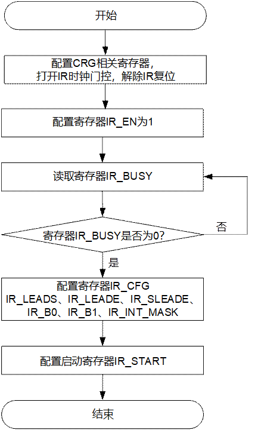

IR模块初始化操作流程如下：

配置CRG相关寄存器，打开IR时钟门控，解除IR复位。

选中IR模块地址空间，开始IR初始化配置操作。

配置IR\_EN bit[0]为1，打开IR接收模块。

读IR\_BUSY，判断IR模块配置的当前状态。

- 若读取的值为1，表明IR模块处于配置忙状态，则继续查询IR\_BUSY（**注意：此时软件不要对IR模块的其他控制寄存器进行配置，否则配置无效**）。
- 若读取的值为0，表明IR模块处于配置空闲状态，则执行步骤 5。

配置IR\_CFG、IR\_LEADS、IR\_LEADE、IR\_SLEADE、IR\_B0、IR\_B1、IR\_INT\_MASK。**注意：用户可以根据需要更新相应寄存器，如果不更新，则寄存器保持原值。**

配置IR\_START。必须要等所有的IR控制寄存器都配置完成后，才能配置IR\_START，因为它被用来产生启动信号，只要对其进行配置，IR模块就会根据控制寄存器的值进行红外数据接收。

----结束

读取解码数据的操作流程

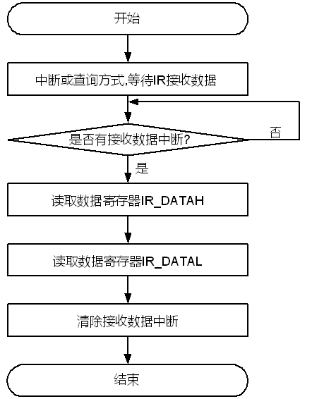

读取解码数据的操作流程如下：

选中IR模块地址空间。

中断或查询方式等待接收数据帧。

- 中断方式下，当CPU接收到IR模块的中断请求信号时，查询IR\_INT\_STATUS[intms\_rcv]的值。若读取的值为1表明IR模块接收到一个数据帧，执行步骤 4；若读取的值为0，重新执行步骤 3，继续等待中断。
- 查询方式下，软件不停（或每间隔一定时间）读取IR\_INT\_STATUS[intrs\_rcv]的值，若读取的值为1表明IR模块接收到一个数据帧，执行步骤 4；若读取的值为0时，表明IR模块尚未接收到数据帧，重新执行步骤 3，继续查询。

读取数据寄存器IR\_DATAH。（如果一帧内的数据位数不大于32位，可以省略此步骤）

读取数据寄存器IR\_DATAL。

清除接收数据中断。

----结束

### IR寄存器概览

IR寄存器概览如表14-20所示。

IR寄存器概览（基址是0x0\_110F\_0000）

| 偏移地址 | 名称 | 描述 | 页码 |
| --- | --- | --- | --- |
| 0x000 | IR\_EN | IR接收使能控制寄存器 | 14-150 |
| 0x004 | IR\_CFG | IR配置寄存器 | 14-151 |
| 0x008 | IR\_LEADS | 引导码起始位裕量配置寄存器（只在IR\_CFG [ir\_mode]=0时使用） | 14-153 |
| 0x00C | IR\_LEADE | 引导码结束位裕量配置寄存器（只在IR\_CFG [ir\_mode]=0时使用） | 14-154 |
| 0x010 | IR\_SLEADE | 简化引导码结束位裕量配置寄存器（只在IR\_CFG [ir\_mode]=0时使用） | 14-155 |
| 0x014 | IR\_B0 | 数据0的判断电平裕量配置寄存器（只在IR\_CFG [ir\_mode]=0时使用） | 14-156 |
| 0x018 | IR\_B1 | 数据1的判断电平裕量配置寄存器（只在IR\_CFG [ir\_mode]=0时使用） | 14-157 |
| 0x01C | IR\_BUSY | 配置忙标志寄存器 | 14-158 |
| 0x020 | IR\_DATAH | IR接收解码数据的高16位寄存器（当IR\_CFG[ir\_mode]=0时）或symbol FIFO中的symbol个数寄存器（当IR\_CFG[ir\_mode]=1时） | 14-158 |
| 0x024 | IR\_DATAL | IR接收解码数据的低32位寄存器（当IR\_CFG[ir\_mode]=0时）或IR模块接收到的symbol宽度寄存器（当IR\_CFG[ir\_mode]=1时） | 14-159 |
| 0x028 | IR\_INT\_MASK | IR中断屏蔽寄存器 | 14-160 |
| 0x02C | IR\_INT\_STATUS | IR中断状态寄存器 | 14-162 |
| 0x030 | IR\_INT\_CLR | IR中断清除寄存器 | 14-164 |
| 0x034 | IR\_START | IR启动配置寄存器 | 14-166 |

### IR寄存器描述

#### IR\_EN

IR\_EN为IR接收使能控制寄存器。

<strong><big>须知</big></strong>

软件必须先配置寄存器IR\_EN[ir\_en]=1，才能配置其他寄存器，否则配置无效。当寄存器IR\_EN[ir\_en]=0时，其他寄存器只可读不可写，且读出值为寄存器的复位值。

Offset Address: 0x000 Total Reset Value: 0x0000\_0000

| Bits | Access | Name | Description | Reset |
| --- | --- | --- | --- | --- |
| [31:1] | RO | reserved | 保留。 | 0x00000000 |
| [0] | RW | ir\_en | IR接收模块的使能。  0：关闭IR接收模块；  1：打开IR接收模块。 | 0x0 |

#### IR\_CFG

IR\_CFG为IR配置寄存器。

<strong><big>须知</big></strong>

必须在确保IR\_BUSY[ir\_busy]=0并且IR\_EN[ir\_en]=1时，才能配置此寄存器，否则配置无效，寄存器保持原值。

IR支持的参考时钟频率为1MHz～128MHz，其与分频因子ir\_freq的对应关系是：

- 当参考时钟频率为1MHz时，分频因子ir\_freq需配置为0x00。
- 当参考时钟频率为128MHz时，分频因子ir\_freq需配置为0x7F。
- 当IR的参考时钟为1MHz～128MHz内的非整数倍频率时，选用四舍五入的方法选择相应的分频因子。举例：参考时钟为12.1MHz，选用分频因子为0x0B；参考时钟为12.8MHz，选用分频因子为0x0C。

Offset Address: 0x004 Total Reset Value: 0x3E80\_1F0B

| Bits | Access | Name | Description | Reset |
| --- | --- | --- | --- | --- |
| [31:16] | RW | ir\_max\_level\_width | 当IR\_CFG [ir\_mode]=0时，无效；  当IR\_CFG [ir\_mode]=1时，表示symbol的最大电平宽度（单位10μs），用以确定一个symbol stream结束。 | 0x3E80 |
| [15:14] | RW | ir\_format | 当IR\_CFG [ir\_mode]=0时，表示数据码型。  00：NEC with simple repeat code的数据格式；  01：TC9012的数据格式；  10：NEC with full repeat code的数据格式；  11：SONY的数据格式。  关于具体码型属于哪类码族，请参见表14-17～表14-19。  当IR\_CFG [ir\_mode]=1时，表示symbol格式。  bit[15]：保留；  bit[14]的含义如下：  0：symbol的格式为先低后高，symbol stream结束在高电平；  1：symbol的格式为先高后低，symbol stream结束在低电平。 | 0x0 |
| [13:8] | RW | ir\_bits | 当IR\_CFG [ir\_mode]=0时，表示一帧内的数据位数。  0x00～0x2F：分别对应一帧内包含1～48个数据位；  0x30～0x3F：保留。  如果软件对该域配置0x30～0x3F范围内的值，则配置无效，ir\_bits保持原值不变。  当IR\_CFG [ir\_mode]=1时，表示接收到symbol的中断水线。  bit[13]：保留；  bit[12:8]：0x0～0x1F：分别对应FIFO中至少有1～32个symbol时报中断。 | 0x1F |
| [7] | RW | ir\_mode | IR工作模式。  0：输出解码后的完整数据帧；  1：只输出symbol宽度。 | 0x0 |
| [6:0] | RW | ir\_freq | 工作时钟分频因子。  0x00～0x7F分别对应工作时钟分频因子1～128。 | 0xB |

#### IR\_LEADS

IR\_LEADS为引导码起始位裕量配置寄存器（只在IR\_CFG [ir\_mode]=0时使用）。

<strong><big>须知</big></strong>

必须在确保IR\_BUSY[ir\_busy]=0并且IR\_EN[ir\_en]=1时，才能配置此寄存器，否则配置无效，寄存器保持原值；另外寄存器保留值配置无效，仍然保持原值不变。

为了准确判断引导码的起始位，需要在具体码型的典型值左右考虑一定的裕量，具体码型的典型值请参见表14-17～表14-19中LEAD\_S的值。

- 对于典型值不小于400（其精度为10μs）的脉宽，建议裕量范围设为典型值的8%。举例说明：D6121码型，其LEAD\_S的典型值为900，那么相应的cnt\_leads\_min=900 x 92%＝828＝0x33C，cnt\_leads\_max=900 x 108%=972=0x3CC。
- 对于典型值小于400（其精度为10μs）的脉宽，建议裕量范围设为典型值的20%。举例说明：SONY-D7C5码型，其LEAD\_S的典型值为240，那么相应的cnt\_leads\_min=240 x 80%＝192＝0xC0，cnt\_leads\_max=240 x 120%=288=0x120。

基本的配置原则：cnt\_leads\_max不小于cnt\_leads\_min，并且cnt\_leads\_min大于cnt0\_b\_max和cnt1\_b\_max

Offset Address: 0x008 Total Reset Value: 0x033C\_03CC

| Bits | Access | Name | Description | Reset |
| --- | --- | --- | --- | --- |
| [31:26] | RO | reserved | 保留。 | 0x00 |
| [25:16] | RW | cnt\_leads\_min | 引导码起始位的最小脉宽。  0x000～0x007：保留。 | 0x33C |
| [15:10] | RO | reserved | 保留。 | 0x00 |
| [9:0] | RW | cnt\_leads\_max | 引导码起始位的最大脉宽。  0x000～0x007：保留。 | 0x3CC |

#### IR\_LEADE

IR\_LEADE为引导码结束位裕量配置寄存器（只在IR\_CFG [ir\_mode]=0时使用）。

<strong><big>须知</big></strong>

必须在确保IR\_BUSY [ir\_busy]=0并且IR\_EN [ir\_en]=1时，才能配置此寄存器，否则配置无效，寄存器保持原值；另外寄存器保留值配置无效，仍然保持原值不变。

对于NEC with simple repeat code的码族，其cnt\_sleade的裕量范围和cnt\_leade的裕量范围设置不能重合，否则当实际计数值落入重合范围内时，无法识别简化引导码，会导致帧格式错误。

为了准确判断引导码的结束位，需要在具体码型的典型值左右考虑一定的裕量，裕量范围约为典型值的8%。具体码型的典型值请参见表14-17～表14-19中LEAD\_E的值。

- 对于典型值不小于400（其精度为10μs）的脉宽，建议裕量范围设为典型值的8％。举例说明：D6121码型，其LEAD\_E的典型值为450，那么相应的cnt\_leade\_min=450 x 92%＝414＝0x19E，cnt\_leade\_max=450 x 108%=486=0x1E6。
- 对于典型值小于400（其精度为10μs）的脉宽，建议裕量范围设为典型值的20%。举例说明：SONY-D7C5码型，其LEAD\_E的典型值为60，那么相应的cnt\_leade\_min=60 x 80%＝48＝0x030，cnt\_leade\_max=60 x 120%=72=0x048。

基本的配置原则是：cnt\_leade\_max不小于cnt\_leade\_min的值。

Offset Address: 0x00C Total Reset Value: 0x019E\_01E6

| Bits | Access | Name | Description | Reset |
| --- | --- | --- | --- | --- |
| [31:25] | RO | reserved | 保留。 | 0x00 |
| [24:16] | RW | cnt\_leade\_min | 引导码结束位的最小脉宽。  0x000～0x007：保留。 | 0x19E |
| [15:9] | RO | reserved | 保留。 | 0x00 |
| [8:0] | RW | cnt\_leade\_max | 引导码结束位的最大脉宽。  0x000～0x007：保留。 | 0x1E6 |

#### IR\_SLEADE

IR\_SLEADE为简化引导码结束位裕量配置寄存器（只在IR\_CFG [ir\_mode]=0时使用）。

<strong><big>须知</big></strong>

必须在确保IR\_BUSY [ir\_busy]=0并且IR\_EN [ir\_en]=1时，才能配置此寄存器，否则配置无效，寄存器保持原值；另外寄存器保留值配置无效，仍然保持原值不变。

- 对于NEC with simple repeat code的码族，cnt\_sleade的裕量范围和cnt\_leade的裕量范围设置不能重合，否则当实际计数值落入重合范围内时，无法识别简化引导码，会导致帧格式错误。
- 对于NEC with simple repeat code的数据格式，才需配置此寄存器；对于其他格式，无需配置此寄存器。

为了准确判断简化引导码的结束位，需要在具体码型的典型值左右考虑一定的裕量。具体码型的典型值请参见表14-17～表14-19中SLEAD\_E的值。

- 对于典型值不小于225（其精度为10μs）的脉宽，建议裕量范围设为典型值的8%。举例说明：D6121码型，其SLEAD\_E的典型值为225，那么相应的cnt\_sleade\_min=225 x 92%＝207＝0xCF，cnt\_sleade\_max=225 x 108%=243=0xF3。
- 对于典型值小于225（其精度为10μs）的脉宽，建议裕量范围设为典型值的20%。举例说明：比如某种码型其SLEAD\_E的典型值为60，那么相应的cnt\_sleade\_min=60 x 80%＝48＝0x30，cnt\_sleade\_max=60 x 120%=72=0x48。

基本的配置原则是：cnt\_sleade\_max不小于cnt\_sleade\_min的值。

Offset Address: 0x010 Total Reset Value: 0x00CF\_00F3

| Bits | Access | Name | Description | Reset |
| --- | --- | --- | --- | --- |
| [31:25] | RO | reserved | 保留。 | 0x00 |
| [24:16] | RW | cnt\_sleade\_min | 简化引导码结束位的最小脉宽。  0x000～0x007：保留。 | 0x0CF |
| [15:9] | RO | reserved | 保留。 | 0x00 |
| [8:0] | RW | cnt\_sleade\_max | 简化引导码起始位的最大脉宽。  0x000～0x007：保留。 | 0x0F3 |

#### IR\_B0

IR\_B0为数据0的判断电平裕量配置寄存器（只在IR\_CFG [ir\_mode]=0时使用）。

<strong><big>须知</big></strong>

必须在确保IR\_BUSY [ir\_busy]=0并且IR\_EN [ir\_en]=1时，才能配置此寄存器，否则配置无效，寄存器保持原值；另外寄存器保留值配置无效，仍然保持原值不变。

对于四类码型，bit0判断电平裕量范围和bit1判断电平范围设置不能重合，否则当实际计数值落入重合范围内时，无法识别bit1，只能被误解接收到bit0。

为了准确判断bit0，需要在具体码型的典型值左右考虑一定的裕量，裕量范围约为典型值的20％。

对于NEC with simple repeat code、NEC with full repeat code和TC9012这三类码型，其包含的具体码型的典型值请参见表14-17～表14-19中B0\_H的值。举例说明：D6121码型，其B0\_H的典型值为56（其精度为10μs），那么相应的cnt0\_b\_min=56 x 80%＝45＝0x2D，cnt0\_b\_max=56 x 120%=67=0x43。

对于SONY的数据格式，其包含的具体码型的典型值请参见表14-17～表14-19中B0\_L的值。举例说明：SONY-D7C5码型，其B0\_L的典型值为60（其精度为10μs），那么相应的cnt0\_b\_min=60 x 80%＝48＝0x30，cnt0\_b\_max=60 x 120%=72=0x48。

基本的配置原则是：cnt0\_b\_max不小于cnt0\_b\_min的值。

Offset Address: 0x014 Total Reset Value: 0x002D\_0043

| Bits | Access | Name | Description | Reset |
| --- | --- | --- | --- | --- |
| [31:25] | RO | reserved | 保留。 | 0x00 |
| [24:16] | RW | cnt0\_b\_min | bit0判断电平的最小脉宽。  0x000～0x007：保留。 | 0x02D |
| [15:9] | RO | reserved | 保留。 | 0x00 |
| [8:0] | RW | cnt0\_b\_max | bit0判断电平的最大脉宽。  0x000～0x007：保留。 | 0x043 |

#### IR\_B1

IR\_B1为数据1的判断电平裕量配置寄存器（只在IR\_CFG [ir\_mode]=0时使用）。

<strong><big>须知</big></strong>

必须在确保IR\_BUSY [0]=0并且IR\_EN [0]=1时，才能配置此寄存器，否则配置无效，寄存器保持原值；另外寄存器保留值配置无效，仍然保持原值不变。

对于四类码型，bit0判断电平裕量范围和bit1判断电平范围设置不能重合，否则当实际计数值落入重合范围内时，无法识别bit1，只能被误解接收到bit0。

为了准确判断bit1，需要在具体码型的典型值左右考虑一定的裕量，裕量范围约为典型值的20％。

对于NEC with simple repeat code、NEC with full repeat code和TC9012这三类码族，其包含的具体码型的典型值请参见表14-17～表14-19中B1\_H的值。举例说明：D6121码型，其B1\_H的典型值为169（其精度为10μs），那么相应的cnt1\_b\_min=169 x 80%＝135＝0x87，cnt1\_b\_max=169 x 120%=203=0xCB。

对于SONY的数据格式，其包含的具体码型的典型值请参见表14-17～表14-19中B1\_L的值。举例说明：SONY-D7C5码型，其B1\_L的典型值为120（其精度为10μs），那么相应的cnt1\_b\_min=120 x 80%=96=0x60，cnt1\_b\_max=120 x 120%=144=0x90。

基本的配置原则是：cnt1\_b\_max不小于cnt1\_b\_min的值。

Offset Address: 0x018 Total Reset Value: 0x0087\_00CB

|  |  |  |  |  |
| --- | --- | --- | --- | --- |
| Bits | Access | Name | Description | Reset |
| [31:25] | RO | reserved | 保留。 | 0x00 |
| [24:16] | RW | cnt1\_b\_min | bit1判断电平的最小脉宽。  0x000～0x007：保留。 | 0x087 |
| [15:9] | RO | reserved | 保留。 | 0x00 |
| [8:0] | RW | cnt1\_b\_max | bit1判断电平的最大脉宽。  0x000～0x007：保留。 | 0x0CB |

#### IR\_BUSY

IR\_BUSY为配置忙标志寄存器。

Offset Address: 0x01C Total Reset Value: 0x0000\_0000

|  |  |  |  |  |
| --- | --- | --- | --- | --- |
| Bits | Access | Name | Description | Reset |
| [31:1] | RO | reserved | 保留。 | 0x00000000 |
| [0] | RO | ir\_busy | 忙状态标志。  0：空闲状态，软件可以配置数据；  1：忙状态，软件不可以配置数据。 | 0x0 |

#### IR\_DATAH

IR\_DATAH为IR接收解码数据的高16位寄存器（当IR\_CFG [ir\_mode]=0时）或symbol FIFO中的symbol个数寄存器（当IR\_CFG [ir\_mode]=1时）。

IR\_DATAH是接收到的解码数据的高16位，IR\_DATAL是接收到的解码数据的低32位。具体哪些数据位有效取决于具体码型一帧内包含的有效数据位数，请参见表14-17～表14-19的有效数据位。

数据存储原则：按照由高到低的顺序存储在IR\_DATAH和IR\_DATAL中（MSB……LSB），先存满IR\_DATAL，然后再存放IR\_DATAH，未用到的高位作为保留位。软件读取数据的顺序必须是：先读IR\_DATAH，然后再读IR\_DATAL。

对于具体每个数据位表示的含义，硬件不做判断，仅负责接收所有数据位，最终由软件统一处理。

Offset Address: 0x020 Total Reset Value: 0x0000\_0000

| Bits | Access | Name | Description | Reset |
| --- | --- | --- | --- | --- |
| [31:16] | RO | reserved | 保留。 | 0x0000 |
| [15:0] | RO | ir\_datah | 当IR\_CFG [ir\_mode]=0时，表示接收到的解码数据的高16位数据。  当IR\_CFG [ir\_mode]=1时，表示symbol FIFO中的symbol个数。  bit[15:6]：保留；  bit[5:0]：symbol FIFO中的symbol个数。 | 0x0000 |

#### IR\_DATAL

IR\_DATAL为IR接收解码数据的低32位寄存器（当IR\_CFG [ir\_mode]=0时）或，IR模块接收到的symbol宽度寄存器（当IR\_CFG [ir\_mode]=1时）。

Offset Address: 0x024 Total Reset Value: 0x0000\_0000

| Bits | Access | Name | Description | Reset |
| --- | --- | --- | --- | --- |
| [31:0] | RO | ir\_datal | 当IR\_CFG [ir\_mode]=0时，表示接收到的解码数据的低32位数据。  当IR\_CFG [ir\_mode]=1时，表示IR模块接收到的symbol宽度。  bit[31:16]的含义如下：   - symbol的格式为先低后高时，表示接收到的symbol的高电平宽度（单位是10μs）； - symbol的格式为先高后低时，表示接收到的symbol的低电平宽度（单位是10μs）。   bit[15:0]的含义如下：   - symbol的格式为先低后高时，表示接收到的symbol的低电平宽度（单位是10μs）； - symbol的格式为先高后低时，表示接收到的symbol的高电平宽度（单位是10μs）。 | 0x0000\_0000 |

#### IR\_INT\_MASK

IR\_INT\_MASK为IR中断屏蔽寄存器。

<strong><big>须知</big></strong>

必须在确保IR\_EN [ir\_en]=1时，才能配置此寄存器，否则配置无效，寄存器保持原值。

如果中断全部屏蔽后，无法支持红外遥控唤醒功能。

- IR\_CFG [ir\_mode]=0时，IR\_INT\_MASK bit[3:0]有效；
- IR\_CFG [ir\_mode]=1时，IR\_INT\_MASK bit[18:16]有效。

涉及到的中断定义如下：

- 接收数据溢出中断

如果CPU没有及时响应取走当前帧的数据，而下一帧数据也已经收到的情况，下一帧数据将会覆盖当前帧数据，同时上报屏蔽前接收数据溢出错中断请求。

- 接收数据帧格式错误中断

如果接收到的数据帧不完整以及数据脉宽不满足裕量范围，则会上报屏蔽前的接收帧格式错误中断请求。

- 接收到数据帧中断

当接收到一个完整的帧数据后，则会上报屏蔽前接收到数据帧中断请求。

- 支持按键释放的检测中断

对于NEC with simple repeat code和TC9012码族的数据格式，在检测到一个有效起始同步码之后的160ms内，如果没有再次检测到起始同步码，或者检测到非简化引导码而是有效数据帧时，则会上报屏蔽前遥控器按键释放中断。对于NEC with full repeat code和SONY两种码制不支持按键释放中断。

- 接收symbol溢出中断

如果CPU没有及时响应取走数据，导致symbol FIFO满，而下一个symbol已经收到，则会上报屏蔽前接收symbol溢出错中断请求。

- 接收到symbol中断

当接收到一个完整的symbol后，且symbol FIFO中的symbol个数超过IR\_CFG [ir\_bits]设置的水线，则会上报屏蔽前接收到symbol中断请求。

- symbol超时中断

在接收到一个有效的symbol后，IR\_CFG [ir\_max\_level\_width]设置的时间内没有再接收到新的symbol的中断请求，则会上报屏蔽前symbol超时中断请求。

硬件没有中断优先级仲裁，任何一个或多个屏蔽后的中断源有效，都会产生中断。

Offset Address: 0x028 Total Reset Value: 0x0000\_0000

| Bits | Access | Name | Description | Reset |
| --- | --- | --- | --- | --- |
| [31:19] | RO | reserved | 保留。 | 0x0000 |
| [18] | RW | intm\_overrun | 当IR\_CFG [ir\_mode]=1时，symbol溢出中断屏蔽。  0：不屏蔽；  1：屏蔽。 | 0x0 |
| [17] | RW | intm\_time\_out | 当IR\_CFG [ir\_mode]=1时，symbol超时中断屏蔽。  0：不屏蔽；  1：屏蔽。 | 0x0 |
| [16] | RW | intm\_symb\_rcv | 当IR\_CFG [ir\_mode]=1时，接收到N个symbol中断屏蔽。  0：不屏蔽；  1：屏蔽。 | 0x0 |
| [15:4] | RO | reserved | 保留。 | 0x0000 |
| [3] | RW | intm\_release | 当IR\_CFG [ir\_mode]=0时，按键释放中断屏蔽。  0：不屏蔽；  1：屏蔽。 | 0x0 |
| [2] | RW | intm\_overflow | 当IR\_CFG [ir\_mode]=0时，接收数据溢出中断屏蔽。  0：不屏蔽；  1：屏蔽。 | 0x0 |
| [1] | RW | intm\_frame | 当IR\_CFG [ir\_mode]=0时，接收数据帧格式错误中断屏蔽。  0：不屏蔽；  1：屏蔽。 | 0x0 |
| [0] | RW | intm\_rcv | 当IR\_CFG [ir\_mode]=0时，接收到数据帧中断屏蔽。  0：不屏蔽；  1：屏蔽。 | 0x0 |

#### IR\_INT\_STATUS

IR\_INT\_STATUS为IR中断状态寄存器。

<strong><big>须知</big></strong>

- IR\_CFG [ir\_mode]=0时，IR\_INT\_STATUS bit[3:0]和IR\_INT\_STATUS bit[19:16]有效；
- IR\_CFG [ir\_mode]=1时，IR\_INT\_STATUS bit[10:8]和IR\_INT\_STATUS bit[26:24]有效。

Offset Address: 0x02C Total Reset Value: 0x0000\_0000

| Bits | Access | Name | Description | Reset |
| --- | --- | --- | --- | --- |
| [31:27] | RO | reserved | 保留。 | 0x00 |
| [26] | RO | intms\_overrun | 当IR\_CFG [ir\_mode]=1时，屏蔽后的symbol溢出中断状态。  0：无中断；  1：有中断。 | 0x0 |
| [25] | RO | intms\_time\_out | 当IR\_CFG [ir\_mode]=1时，屏蔽后的symbol超时中断状态。  0：无中断；  1：有中断。 | 0x0 |
| [24] | RO | intms\_symb\_rcv | 当IR\_CFG [ir\_mode]=1时，屏蔽后的接收到symbol的中断状态。  0：无中断；  1：有中断。 | 0x0 |
| [23:20] | RO | reserved | 保留。 | 0x0 |
| [19] | RO | intms\_release | 当IR\_CFG [ir\_mode]=0时，屏蔽后的按键释放的中断状态。  0：无中断；  1：有中断。 | 0x0 |
| [18] | RO | intms\_overflow | 当IR\_CFG [ir\_mode]=0时，屏蔽后的接收数据溢出错中断状态。  0：无中断；  1：有中断。 | 0x0 |
| [17] | RO | intms\_framerr | 当IR\_CFG [ir\_mode]=0时，屏蔽后的接收数据帧格式错误中断状态。  0：无中断；  1：有中断。 | 0x0 |
| [16] | RO | intms\_rcv | 当IR\_CFG [ir\_mode]=0时，屏蔽后的接收到数据帧中断状态。  0：无中断；  1：有中断。 | 0x0 |
| [15:11] | RO | reserved | 保留。 | 0x0 |
| [10] | RO | intrs\_overrun | 当IR\_CFG [ir\_mode]=1时，屏蔽前的symbol溢出中断状态。  0：无中断；  1：有中断。 | 0x0 |
| [9] | RO | intrs\_time\_out | 当IR\_CFG [ir\_mode]=1时，屏蔽前的symbol超时中断状态。  0：无中断；  1：有中断。 | 0x0 |
| [8] | RO | intrs\_symb\_rcv | 当IR\_CFG [ir\_mode]=1时，屏蔽前的接收到symbol的中断状态。  0：无中断；  1：有中断。 | 0x0 |
| [7:4] | RO | reserved | 保留。 | 0x0 |
| [3] | RO | intrs\_release | 当IR\_CFG [ir\_mode]=0时，屏蔽前的按键释放的中断状态。  0：无中断；  1：有中断。 | 0x0 |
| [2] | RO | intrs\_overflow | 当IR\_CFG [ir\_mode]=0时，屏蔽前的接收数据溢出错中断状态。  0：无中断；  1：有中断。 | 0x0 |
| [1] | RO | intrs\_framerr | 当IR\_CFG [ir\_mode]=0时，屏蔽前的接收数据帧格式错误中断状态。  0：无中断；  1：有中断。 | 0x0 |
| [0] | RO | intrs\_rcv | 当IR\_CFG [ir\_mode]=0时，屏蔽前的接收到数据帧中断状态。  0：无中断；  1：有中断。 | 0x0 |

#### IR\_INT\_CLR

IR\_INT\_CLR为IR中断清除寄存器。

<strong><big>须知</big></strong>

IR\_CFG [ir\_mode]=0时，IR\_INT\_CLR bit[3:0]有效；

IR\_CFG [ir\_mode]=1时，IR\_INT\_CLR bit[18:16]有效。

Offset Address: 0x030 Total Reset Value: 0x0000\_0000

| Bits | Access | Name | Description | Reset |
| --- | --- | --- | --- | --- |
| [31:19] | RO | reserved | 保留。 | 0x0 |
| [18] | WC | intc\_overrun | IR\_CFG [ir\_mode]=1时，清除symbol溢出中断请求。  0：无影响；  1：清除。 | 0x0 |
| [17] | WC | intc\_time\_out | IR\_CFG [ir\_mode]=1时，清除symbol超时中断请求。  0：无影响；  1：清除。 | 0x0 |
| [16] | WC | intc\_symb\_rcv | IR\_CFG [ir\_mode]=1时，清除接收到symbol中断请求。  0：无影响；  1：清除。 | 0x0 |
| [15:4] | RO | reserved | 保留。 | 0x0000 |
| [3] | WC | intc\_release | IR\_CFG [ir\_mode]=0时，清除遥控器按键释放中断请求。  0：无影响；  1：清除。 | 0x0 |
| [2] | WC | intc\_overflow | IR\_CFG [ir\_mode]=0时，清除接收数据溢出错中断请求。  0：无影响；  1：清除。 | 0x0 |
| [1] | WC | intc\_framerr | IR\_CFG [ir\_mode]=0时，清除接收数据帧格式错误中断请求。  0：无影响；  1：清除。 | 0x0 |
| [0] | WC | intc\_rcv | IR\_CFG [ir\_mode]=0时，清除接收到数据帧中断请求。  0：无影响；  1：清除。  如果接收数据帧中断请求产生后，软件未读走IR\_DATAL中的数据就直接对本位进行写1操作，无法清除该中断请求。 | 0x0 |

#### IR\_START

IR\_START为IR启动配置寄存器。

在其他寄存器的值配置完成后，启动IR模块时，只要往该地址进行一次写操作（写操作数可以为任意值），就可以启动配置寄存器。

Offset Address: 0x034 Total Reset Value: 0x0000\_0000

|  |  |  |  |  |
| --- | --- | --- | --- | --- |
| Bits | Access | Name | Description | Reset |
| [31:1] | RO | reserved | 保留。 | 0x00000000 |
| [0] | WO | ir\_start | IR启动配置寄存器。 | 0x0 |

## GPIO

### 概述

芯片支持18组GPIO（General Purpose Input/Output），即GPIO0～GPIO17。每组GPIO提供8个可编程的输入输出管脚（GPIO17只有1个，即bit0，GPIO11只有7个，即bit0~4和bit6~7）。

每个管脚可以配置为输入或者输出。这些管脚用于生成特定应用的输出信号或采集特定应用的输入信号。作为输入管脚时，GPIO可作为中断源；作为输出管脚时，每个GPIO都可以独立地清0或置1。

GPIO可以根据电平或跳变值产生可屏蔽的中断。GPIOINTR（General Purpose Input Output Interrupt）信号给中断控制器一个指示，表示有中断发生。

<strong><big>须知</big></strong>

- GPIO具体管脚个数、管脚与其他管脚复用及相关复用控制的说明请参见 Hi3403V100\_PINOUT\_CN.xlsx。
- 对于默认是输出信号的管脚上复用的GPIO，请注意对接芯片和器件的管脚必须是输入。
- 由于管脚SDIO0\_CCMD、SDIO0\_CDATA0~3和SDIO0\_CCLK\_OUT（对应GPIO6\_6、GPIO6\_7、GPIO7\_0~GPIO7\_3）是由芯片内部的powerswitch供电，所以当这些管脚用于GPIO功能时，需要把powerswitch的控制配置由PWR\_SWITCH寄存器控制，即配置PWR\_SWITCH[sdio0\_pwr\_ctrl\_by\_user]为0x1，PWR\_SWITCH[sdio0\_pwr\_en\_by\_misc]为0x1。对于这些管脚，若要支持的电压为3.3V，则需要配置PWR\_SWITCH[sdio0\_io\_mode\_sel1\_from\_misc]为0x0，PWR\_SWITCH[sdio0\_pwr\_sw\_sel\_by\_misc]为0x0；若要支持的电压为1.8V，则需要配置PWR\_SWITCH[sdio0\_io\_mode\_sel1\_from\_misc]为0x1，PWR\_SWITCH[sdio0\_pwr\_sw\_sel\_by\_misc]为0x1。
- 由于管脚RGMII0\_RXD0~3、RGMII0\_RXDV、RGMII0\_RXCK、RGMII0\_TXD0~3、RGMII0\_TXEN、RGMII0\_TXCKOUT、EPHY0\_CLK、EPHY0\_RSTN、MDCK0、MDIO0（对应GPIO2\_6、GPIO2\_7、GPIO3\_0~GPIO3\_7、GPIO4\_0~GPIO4\_5）的供电电压由上电锁存寄存器RGMII0\_IO\_VDD3318\_SEL（对应管脚为PWM0\_OUT0\_P）控制选择。对于这些管脚用于GPIO功能时，若要支持的电压为3.3V，则需要管脚PWM0\_OUT0\_P（即RGMII0\_IO\_VDD3318\_SEL）外接下拉电阻；若要支持的电压为1.8V，则需要管脚PWM0\_OUT0\_P（即RGMII0\_IO\_VDD3318\_SEL）外接上拉电阻。
- 由于管脚SDIO1\_CDATA0~4、SDIO1\_CCLK\_OUT、SDIO1\_CCMD、GPIO0\_0和GPIO0\_1（对应GPIO4\_6、GPIO4\_7、GPIO5\_0~GPIO5\_3、GPIO0\_0、GPIO0\_1）的供电电压由上电锁存寄存器SDIO1\_IO\_VDD3318\_SEL（对应管脚为PWM0\_OUT1\_P）控制选择。对于这些管脚用于GPIO功能时，若要支持的电压为3.3V，则需要管脚PWM0\_OUT1\_P（即SDIO1\_IO\_VDD3318\_SEL）外接下拉电阻；若要支持的电压为1.8V，则需要管脚PWM0\_OUT1\_P（即SDIO1\_IO\_VDD3318\_SEL）外接上拉电阻。
- 由于管脚UART1\_RXD、UART1\_TXD、UART1\_RTSN、UART1\_CTSN、UART2\_RXD、UART2\_TXD、UART2\_RTSN、UART2\_CTSN、SDIO0\_CARD\_DETECT、SDIO0\_CARD\_POWER\_EN\_N（对应GPIO5\_4~GPIO5\_7、GPIO6\_0~GPIO6\_5）的供电电压由上电锁存寄存器UART1\_2\_IO\_VDD3318\_SEL（对应管脚为GPIO0\_3）外接上下拉电阻控制选择。对于这些管脚用于GPIO功能时，若要支持的电压为3.3V，则需要管脚GPIO0\_3（即UART1\_2\_IO\_VDD3318\_SEL）外接下拉电阻；若要支持的电压为1.8V，则需要管脚GPIO0\_3（即UART1\_2\_IO\_VDD3318\_SEL）外接上拉电阻。

### 特点

每个GPIO管脚均可配置为输入、输出。

- 作为输入管脚时，可作为中断源。
- 作为输出管脚时，每个GPIO管脚都可以独立地清0或置1。

### 工作方式

#### 接口复位

在芯片上电复位或系统复位时，GPIO模块同时被复位，GPIO管脚在复位之后处于输入状态。

#### 通用输入输出

每个管脚可以配置为输入或者输出，具体步骤如下：

参考“管脚复用控制寄存器”配置管脚的相应位，使能需要使用的GPIO管脚功能。

配置寄存器GPIO\_DIR，选择GPIO是作为输入还是输出。

当配置成输入管脚时，读取GPIO\_DATA寄存器可查看输入信号值；当配置成输出管脚时，通过向GPIO\_DATA寄存器写入输出值可控制GPIO管脚输出电平。

----结束

<strong><big>须知</big></strong>

当GPIO用作输出时，应不使能GPIO的中断功能，否则当输出信号符合中断产生条件时，会产生GPIO中断。

#### 中断操作

GPIO的中断通过GPIO\_IS等7个寄存器进行控制。通过这些寄存器可以选择中断源、极性以及边沿特性。GPIO对应的中断号请参见“3.3 中断系统”。

当有多个中断同时发生时，将会统一汇集成一个中断进行上报，GPIO的中断映射关系请参见“3.3 中断系统”。

GPIO\_IS、GPIO\_IBE、GPIO\_IEV三个寄存器共同决定了中断源的特性和中断触发类别。

通过GPIO\_RIS和GPIO\_MIS分别读取中断的原始状态和屏蔽后的状态。通过GPIO\_IE可以控制中断的最终上报情况。此外还提供了单独的GPIO\_IC用于对中断状态进行清除控制。

每个GPIO管脚都可以配置成中断模式，配置步骤如下：

配置GPIO\_IS，选择边沿触发或电平触发。

配置GPIO\_IEV，选择下降沿/上升沿触发和高电平/低电平触发。

如果选择边沿触发，需配置GPIO\_IBE，选择单沿或双沿触发方式。

向寄存器GPIO\_IC写0xFF，清中断。

配置GPIO\_IE为1，使能中断。

----结束

<strong><big>须知</big></strong>

初始化过程中GPIO管脚上数据需保持稳定，以免产生假中断。

GPIO的中断设置由7个寄存器控制。当有一个或多个GPIO管脚产生中断，一个组合中断会输送到中断控制器。边沿触发和电平触发有以下不同：

- 边沿触发的中断：软件必需清除该中断以使能更深的中断。
- 电平触发的中断：外部中断源应该保持该电平直到处理器识别到该中断。

### GPIO寄存器概览

芯片的GPIO基地址如表14-21所示。

芯片GPIO寄存器对应的基地址

| GPIO控制器 | 基地址 |
| --- | --- |
| GPIO17 | 0x0\_110A\_1000 |
| GPIO16 | 0x0\_110A\_0000 |
| GPIO15 | 0x0\_1109\_F000 |
| GPIO14 | 0x0\_1109\_E000 |
| GPIO13 | 0x0\_1109\_D000 |
| GPIO12 | 0x0\_1109\_C000 |
| GPIO11 | 0x0\_1109\_B000 |
| GPIO10 | 0x0\_1109\_A000 |
| GPIO9 | 0x0\_1109\_9000 |
| GPIO8 | 0x0\_1109\_8000 |
| GPIO7 | 0x0\_1109\_7000 |
| GPIO6 | 0x0\_1109\_6000 |
| GPIO5 | 0x0\_1109\_5000 |
| GPIO4 | 0x0\_1109\_4000 |
| GPIO3 | 0x0\_1109\_3000 |
| GPIO2 | 0x0\_1109\_2000 |
| GPIO1 | 0x0\_1109\_1000 |
| GPIO0 | 0x0\_1109\_0000 |

<strong><big>说明</big></strong>

GPIOn对应的寄存器地址为：GPIOn基地址+该寄存器偏移地址。

表14-22是单组GPIO内部寄存器的偏移地址以及定义，GPIO0～GPIOn具有相同的寄存器组。

GPIO寄存器概览

| 偏移地址 | 名称 | 描述 | 页码 |
| --- | --- | --- | --- |
| 0x000～0x3FC | GPIO\_DATA | GPIO数据寄存器 | 14-171 |
| 0x400 | GPIO\_DIR | GPIO方向控制寄存器 | 14-172 |
| 0x404 | GPIO\_IS | GPIO中断触发寄存器 | 14-172 |
| 0x408 | GPIO\_IBE | GPIO双沿触发中断寄存器 | 14-173 |
| 0x40C | GPIO\_IEV | GPIO触发中断条件寄存器 | 14-173 |
| 0x410 | GPIO\_IE | GPIO中断屏蔽寄存器 | 14-173 |
| 0x414 | GPIO\_RIS | GPIO原始中断状态寄存器 | 14-174 |
| 0x418 | GPIO\_MIS | GPIO屏蔽状态中断寄存器 | 14-174 |
| 0x41C | GPIO\_IC | GPIO中断清除寄存器 | 14-174 |

### GPIO寄存器描述

#### GPIO\_DATA

GPIO\_DATA为GPIO数据寄存器。用来对输入或输出数据进行缓存。

当配置GPIO\_DIR中对应位为输出时，写入GPIO\_DATA寄存器的值将会输出到相应的管脚（注意需要配置正确的管脚复用）；如果配置为输入时，将会读取相应输入管脚的值。

<strong><big>须知</big></strong>

当GPIO\_DIR相应的比特配置为输入时，有效读取的结果将返回管脚的值；当配置为输出的时候，有效读取的结果将返回写入的值。

GPIO\_DATA寄存器利用PADDR[9:2]实现了读写寄存器比特的屏蔽操作。该寄存器对应256个地址空间。PADDR[9:2]分别对应GPIO\_DATA[7:0]，当相应的bit为高时，则可以对相应的位进行读写操作；反之，若对应bit为低则不能进行操作。例如：

- 若地址为0x3FC（0b11\_1111\_1100），则对GPIO\_DATA[7:0]这8bit操作全部有效。

若地址为0x200（0b10\_0000\_0000），则仅对GPIO\_DATA[7]的操作有效。

Offset Address: 0x000～0x3FC Total Reset Value: 0x00

|  |  |  |  |  |
| --- | --- | --- | --- | --- |
| Bits | Access | Name | Description | Reset |
| [7:0] | RW | gpio\_data | 当GPIO配置为输入模式时，为GPIO输入数据；当GPIO配置为输出模式时，为输出数据。各比特均可独立控制。与GPIO\_DIR配合使用。 | 0x00 |

#### GPIO\_DIR

GPIO\_DIR为GPIO方向控制寄存器。用来配置GPIO管脚方向。

Offset Address: 0x400 Total Reset Value: 0x00

|  |  |  |  |  |
| --- | --- | --- | --- | --- |
| Bits | Access | Name | Description | Reset |
| [7:0] | RW | gpio\_dir | GPIO方向控制寄存器。bit[7:0]分别对应GPIO\_DATA[7:0]，各比特可独立控制。  0：输入；  1：输出。 | 0x00 |

#### GPIO\_IS

GPIO\_IS为GPIO中断触发寄存器。用来配置GPIO管脚触发电平方式。

Offset Address: 0x404 Total Reset Value: 0x00

|  |  |  |  |  |
| --- | --- | --- | --- | --- |
| Bits | Access | Name | Description | Reset |
| [7:0] | RW | gpio\_is | GPIO中断触发控制寄存器，bit[7:0]分别对应GPIO\_DATA[7:0]，各比特独立控制。  0：边沿触发中断；  1：电平触发中断。 | 0x00 |

#### GPIO\_IBE

GPIO\_IBE为GPIO双沿触发中断寄存器。用来配置GPIO管脚沿触发方式。

Offset Address: 0x408 Total Reset Value: 0x00

|  |  |  |  |  |
| --- | --- | --- | --- | --- |
| Bits | Access | Name | Description | Reset |
| [7:0] | RW | gpio\_ibe | GPIO中断沿触发控制寄存器，bit[7:0]分别对应GPIO\_DATA[7:0]，各比特独立控制。  0：单边沿触发中断，具体是上升沿还是下降沿触发由GPIO\_IEV控制；  1：双边触发中断。 | 0x00 |

#### GPIO\_IEV

GPIO\_IEV为GPIO触发中断条件寄存器。用来配置GPIO管脚触发中断条件。

Offset Address: 0x40C Total Reset Value: 0x00

|  |  |  |  |  |
| --- | --- | --- | --- | --- |
| Bits | Access | Name | Description | Reset |
| [7:0] | RW | gpio\_iev | GPIO触发中断条件寄存器，bit[7:0]分别对应GPIO\_DATA[7:0]，各比特独立控制。  0：下降沿或低电平触发中断；  1：上升沿或高电平触发中断。 | 0x00 |

#### GPIO\_IE

GPIO\_IE为GPIO中断屏蔽寄存器。用来屏蔽GPIO管脚中断。

Offset Address: 0x410 Total Reset Value: 0x00

|  |  |  |  |  |
| --- | --- | --- | --- | --- |
| Bits | Access | Name | Description | Reset |
| [7:0] | RW | gpio\_ie | GPIO中断屏蔽寄存器，bit[7:0]分别对应GPIO\_DATA[7:0]，各比特独立控制。  0：屏蔽中断；  1：不屏蔽中断。 | 0x00 |

#### GPIO\_RIS

GPIO\_RIS为GPIO原始中断状态寄存器。用来查询GPIO管脚原始中断状态。

Offset Address: 0x414 Total Reset Value: 0x00

|  |  |  |  |  |
| --- | --- | --- | --- | --- |
| Bits | Access | Name | Description | Reset |
| [7:0] | RO | gpio\_ris | GPIO原始中断寄存器，bit[7:0]分别对应GPIO\_DATA[7:0]，指示未屏蔽的中断状态。该状态不受GPIO\_IE寄存器屏蔽控制。  0：未发生中断；  1：已发生中断。 | 0x00 |

#### GPIO\_MIS

GPIO\_MIS为GPIO屏蔽状态中断寄存器。用来查询GPIO管脚屏蔽后的中断状态。

Offset Address: 0x418 Total Reset Value: 0x00

|  |  |  |  |  |
| --- | --- | --- | --- | --- |
| Bits | Access | Name | Description | Reset |
| [7:0] | RO | gpio\_mis | GPIO屏蔽后中断寄存器，bit[7:0]分别对应GPIO\_DATA [7:0]，指示经屏蔽后的中断状态。该状态受GPIO\_IE寄存器屏蔽控制。  0：中断无效；  1：中断有效。 | 0x00 |

#### GPIO\_IC

GPIO\_IC为GPIO中断清除寄存器。用来清除GPIO管脚产生的中断，同时清除GPIO\_RIS寄存器和GPIO\_MIS寄存器。

Offset Address: 0x41C Total Reset Value: 0x00

| Bits | Access | Name | Description | Reset |
| --- | --- | --- | --- | --- |
| [7:0] | WC | gpio\_ic | GPIO中断清除寄存器，bit[7:0]分别对应GPIO\_DATA [7:0]，各比特可独立控制。  0：无影响；  1：清除中断。 | 0x00 |

## PCI Express

### 概述

PCI Express（或简称PCIe）主要应用于PCIe外扩SATA、网口、WiFi以及片间级联等。芯片支持一个PCI Express Gen2 X2控制器。

### 特点

芯片中PCI Express控制器具有以下特点：

- 支持Gen2，向下兼容Gen1。
- 支持最大Lane数为X2，向下兼容X1。
- 支持1 VC，1 TC。
- 支持RC模式。
- 支持EP模式。
- 支持DMA功能。
- 支持INTx中断机制。
- 支持MSI中断机制。

<strong><big>须知</big></strong>

EP模式时，支持6个BAR，大小依次为BAR0：8MB，BAR1：64KB，BAR2：1MB，BAR3：1MB，BAR4：64KB，BAR5：4KB，其中BAR5固定映射到“PCIe内部系统控制寄存器空间”，不可用作其他用途。

### 信号描述

芯片中PCI Express接口信号描述如下：

PCI Express接口信号描述

| 信号名称 | 方向 | 描述 | 对应管脚 |
| --- | --- | --- | --- |
| Pcie\_refclk\_m | B | PCIe参考时钟管脚负极 | PCIE\_REFCLKM |
| Pcie\_refclk\_p | B | PCIe参考时钟管脚正极 | PCIE\_REFCLKP |
| Pcie\_rx0\_m | I | PCIe lane0接收差分信号负极 | USB3\_PCIE\_RXM0 |
| Pcie\_rx0\_p | I | PCIe lane0接收差分信号正极 | USB3\_PCIE\_RXP0 |
| Pcie\_tx0\_m | O | PCIe lane0发送差分信号负极 | USB3\_PCIE\_TXM0 |
| Pcie\_tx0\_p | O | PCIe lane0发送差分信号正极 | USB3\_PCIE\_TXP0 |
| Pcie\_rx1\_m | I | PCIe lane1接收差分信号负极 | USB3\_PCIE\_RXM1 |
| Pcie\_rx1\_p | I | PCIe lane1接收差分信号正极 | USB3\_PCIE\_RXP1 |
| Pcie\_tx1\_m | O | PCIe lane1发送差分信号负极 | USB3\_PCIE\_TXM1 |
| Pcie\_tx1\_p | O | PCIe lane1发送差分信号正极 | USB3\_PCIE\_TXP1 |

PCIe与USB3差分管脚复用示意图

<strong><big>须知</big></strong>

在芯片中，PCIE与USB3.0接口信号是复用的，应用时需要根据场景选择复用模式。复用模式由UPS\_MODE0、UPS\_MODE1（与SENSOR0\_CLK、SENSOR0\_HS复用）管脚上电时的上下拉决定。请参考Hi3403V100\_PINOUT\_CN.xlsx中管脚信息表页面。

### 功能描述

#### RC（Root-Complex）模式

PCIe接口在RC模式下可与其它PCIe EP设备进行对接以实现功能扩展。

PCIe控制器RC模式下的应用框图如图14-53所示。

PCIe 控制器应用框图（RC模式外接EP设备）

PCIe控制器还可以连接SWITCH设备，实现更多数量的功能扩展，RC模式下与SWITCH设备连接应用框图如图14-54所示。

PCIe控制器与PCIe switch设备连接应用框图（RC模式）

#### EP（End-Point）模式

芯片中的PCIe接口可以设置为EP模式，以实现与PCIe RC或SWITCH设备对接。

芯片与RC设备连接应用框图（EP模式）

#### DMA功能

PCIe控制器内含一个DMA控制器，DMA控制器包含有两个DMA通道（一个DMA读通道和一个DMA写通道）。PCIe控制器内包含的DMA控制器用于大数据量存储器读写事务，以提高数据搬移的效率。

DMA控制器可以实现如下的存储器读写事务：

- DMA写：将一块数据从本地内存空间搬移至对端设备的内存空间。
- DMA读：将一块数据从对端设备的内存空间搬移至本地内存空间。
#### INTx功能

PCIe控制器支持基于消息（Message）的INTx中断机制。

- PCIe控制器工作在EP模式时，可通过Assert\_INTA和Dessert\_INTA的消息的方式，上报INTA中断给RC。
- PCIe控制器工作在RC模式时，可接收下游设备上报的Assert\_INTx和Dessert\_INTx的消息，并产生PCIE\_INTA、PCIE\_INTB、PCIE\_INTC或PCIE\_INTD中断。
#### MSI（Message Signaled Interrupts）功能

PCIe控制器支持MSI中断机制。

- PCIe控制器工作在EP模式时，支持MSI报文产生，并上报中断给RC设备。
- PCIe控制器工作在RC模式时，支持MSI中断管理单元，负责处理EP上报的MSI报文，并产生PCIE\_MSI\_INT中断。

### 工作方式

#### 时钟和复位

#### PHY时钟设置

此参考时钟有两个来源：

- 芯片内部CRG配置以下寄存器和信号，PCIe PHY将采用芯片内部提供的100MHz时钟作为参考时钟。
- PCIE\_REFCLK\_SEL信号下拉。
- CRG控制寄存器PERI\_CRG\_PLL3734 [12]设置为1’b0，选择PHY参考时钟为100MHz；
- CRG控制寄存器PERI\_CRG\_PLL3734 [1]设置为1’b0，撤销PHY的test接口的复位；
- CRG控制寄存器PERI\_CRG\_PLL3734 [0]设置为1’b0，撤销PHY Core的复位；

当 PCIe采用内部CRG提供参考时钟时，PCIE\_REFCLK\_P/PCIE\_REFCLK\_M管脚可以设置为输出模式，用来给外部PCIe设备提供参考时钟。

- 配置以下寄存器可以由PCIE\_REFCLK\_P/PCIE\_REFCLK\_M输出PCIe参考时钟：
- CRG控制寄存器PERI\_CRG3730 [2:0]设置为3’b000，从PCIE\_REFCLK\_P/PCIE\_REFCLK\_M管脚输出PCIe参考时钟。
- 外部PCIe差分时钟管脚输入
- 配置PCIE\_REFCLK\_SEL管脚上拉，PCIe PHY将采用PCIE\_REFCLK\_P/PCIE\_REFCLK\_M管脚的差分输入时钟作为PCIe PHY的参考时钟。

**注意：当通过PCIE\_REFCLK\_P/PCIE\_REFCLK\_M输入参考时钟时，外供参考时钟源须保证频偏在±300ppm内。**

#### PCIe控制器软复位控制

软件可通过 CRG寄存器中的PERI\_CRG\_PLL3728寄存器来控制PCIe复位，请参考CRG寄存器中关于PERI\_CRG\_PLL3728寄存器的描述。

#### 使能PCIe控制器

按如下步骤使能PCIe控制器：

通过向PCIe内部系统控制寄存器PCIE\_SYS\_CTRL7[pcie\_app\_ltssm\_enable]写入0，关闭PCIe控制器。

通过PCIE\_REFCLK\_SEL管脚的上下拉状态及CRG寄存器PERI\_CRG\_PLL3734设置COMBPHY的时钟。

通过CRG寄存器PERI\_CRG\_PLL3728设置打开 PCIe控制器的时钟。

通过PCIe内部系统控制寄存器中的PCIE\_SYS\_CTRL0[pcie\_device\_type] 寄存器设置PCIe控制器的工作模式(RC模式/EP模式)。

通过CRG寄存器PERI\_CRG\_PLL3728复位 PCIe控制器。

- 设置PERI\_CRG\_PLL3728[25:24] 为2’b00，设置对应COMBPHY的复位由PCIe控制器控制；
- 设置PERI\_CRG\_PLL3728 [2:0]为3’b111，复位PCIe控制器；

通过CRG寄存器PERI\_CRG\_PLL3728 [2:0]配置为3’b000，撤销 PCIe控制器的复位。

当工作在RC模式时，需要配置控制器的类代码寄存器（CLASS Code Register）为0x060400（对应为PCI到PCI桥设备）。PCIe控制器的类代码寄存器位于PCIe配置寄存器空间内。

通过向PCIe内部系统控制寄存器PCIE\_SYS\_CTRL7[pcie\_app\_ltssm\_enable]写入1，使能PCIe控制器。PCIe控制器使能后，PCIe控制器开始链路建立过程。

----结束

<strong><big>须知</big></strong>

在没有初始化好相关的PCIe内部系统控制寄存器之前不要使能PCIe控制器。

链路初始化和定向是配置和初始化设备物理层、端口和相关链路的物理层的过程，使链路可以传输正常的数据包流量。链路的建立均是由硬件自动完成的，完成PCIe控制器的初始化和使能后，PCIe链路的建立自动发起，无需软件参与。

PCIe控制器与对端设备之间的连接未建立，不可向对端设备发起任何PCIe事务（软件不可访问PCIe对端设备）。

软件通过查询PCIe内部系统控制寄存器PERI\_PCIE\_STAT[pcie\_rdlh\_link\_up]可以确定PCIe控制器是否已与对端设备建立连接。

请参考PCIe内部系统控制器中关于PERI\_PCIE\_STAT寄存器的定义。

#### 发起PCIe事务

通过本地总线接口，可以由CPU发起总线读写操作，经地址转换单元转换为对应的PCIe事务。

#### 配置事务

只有在RC模式下才可以发起配置事务。

由13.7.5.5 地址转换一节中可知，PCIe控制器的配置事务地址空间为0x20000000～0x2FFFFFFF。

PCIe控制器的地址转换单元负责将在0x20000000～0x2FFFFFFF地址范围内的本地总线操作转换为对应的PCIe配置事务。

CPU在本地总线上发起总线读/写请求，且总线地址各字段组成如图14-56配置，就可由PCIe 控制器发出配置读/写事务。

PCIe控制器配置事务本地地址字段定义

其中：

- BUS\_ID：配置事务的目标总线号。
- DEV\_ID：配置事务的目标设备号。
- FUN\_ID：配置事务的目标功能号。
- REG\_NUM：配置事务的目标寄存器号

<strong><big>须知</big></strong>

PCIe控制器中的ATU应该实现类型0和类型1配置事务转换区(CFG TYPE0 & CFG TYPE 1)，以实现发起类型0和类型1的配置事务。设置参考如下：

假设PCIe控制器的总线号为I,下一级设备总线号为J(J=I+1),总线号为J的总线下一级总线号为K(K=I+2）。

按照PCIe协议，由PCIe控制器对总线号为J的总线发起的配置操作为类型0的配置事务，对总线号大于J的总线发起的配置操作为类型1的操作。

因此需创建一个地址转换区，实现由本地总线地址0x20J00000～0x20JFFFFF转换为类型0配置操作的地址转换区域；同时创建一个地址转换区，实现由本地总线地址0x20K00000～0x2FFFFFFF转换为类型1配置事务的地址转换区域。

#### 存储器事务

RC和EP模式下，CPU在存储器事务地址空间内发起的总线读/写操作将转化为PCIe总线上的PCIe存储器读/写事务。PCIe控制器增加扩展存储器事务本地地址空间，支持本地地址空间映射为PCIe协议所定义的存储器事务的地址空间。

CPU在本地总线上发起读/写请求，且总线地址各字段组成如图14-57和图14-58配置，就可由PCIe控制器发起存储器读/写事务。PCIe控制器存储器事务本地地址字段定义

PCIe控制器扩展存储器事务本地地址字段定义

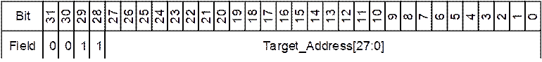

#### 使用DMA传输

PCIe控制器内含一个DMA控制器，DMA控制器包含有两个DMA通道（一个DMA读通道和一个DMA写通道）。PCIe控制器内包含的DMA控制器用于大数据量存储器读写事务，以提高数据搬移的效率。

通过配置DMA控制寄存器能够实现DMA读通道和DMA写通道的全双工工作，即DMA读操作和DMA写操作可以同时进行。

#### DMA控制寄存器

软件可通过DMA控制寄存器来配置DMA传输，也可以通过DMA控制寄存器启动和停止DMA传输。DMA控制寄存器位于PCIe控制器的配置寄存器空间内，DMA控制寄存器的定义请参考本章的PCIe寄存器描述。

<strong><big>须知</big></strong>

为了减少DMA控制寄存器占用的配置寄存器空间，部分DMA控制寄存器地址是DMA读通道和DMA写通道共用。当需要配置这部分寄存器时，软件需要先通过配置DMA通道索引寄存器（DMA\_CH\_INDEX）以表明后续对这些寄存器的操作对象是写通道控制寄存器还是读通道控制寄存器。

这部分DMA控制寄存器包含：

1．DMA\_CH\_CTRL寄存器

2．DMA\_TRANS\_SIZE寄存器

3．DMA\_SAR\_LOW和DMA\_SAR\_HIGH寄存器

4．DMA\_DAR\_LOW和DMA\_DAR\_HIGH寄存器

例如：软件要设置DMA读通道的DMA传输长度为1024Byte，需按如下顺序操作：

软件设置DMA\_CH\_INDEX [ch\_dir]=1，表明后续操作目标寄存器为读通道控制寄存器。

软件设置DMA\_TRANS\_SIZE=0x400，表明传输长度为1024Byte。

#### DMA读写通道使能

DMA通道在系统复位后默认是没有使能的，要使用PCIe的DMA通道，需使能DMA的读写通道。

- 通过设置DMA\_RD\_ENGINE\_EN [dma\_rd\_engine\_en]为1，使能DMA读通道。
- 通过设置DMA\_WR\_ENGINE\_EN [dma\_wr\_engine\_en]为1，使能DMA写通道。
#### DMA源地址和目标地址

DMA写：源地址(SAR)为本地内存空间，目标地址(DAR)为对端设备内存空间。

DMA读：源地址(SAR)为对端设备内存空间，目标地址(DAR)为本地内存空间。

配置DMA读或写通道的DMA\_SAR\_LOW和DMA\_SAR\_HIGH寄存器可以指定DMA传输的源地址，配置DMA读或写通道的DMA\_DAR\_LOW和DMA\_DAR\_HIGH寄存器可以指定DMA传输的目的地址。DMA源地址和目的地址寄存器请参看PCIe DMA控制寄存器定义。

DMA传输过程中，源地址和目的地址寄存器随着传输过程而递增。可以通过读取源地址和目的地址寄存器的值来确定DMA当前传输所获取数据的源地址和当前所写数据的目标地址。

DMA源地址和DMA目的地址都是双字节对齐的，因此最低两比特都必须设置为0。在传输过程中此最低两比特也一直为0。

#### DMA传输长度

DMA读或写操作的传输长度由DMA读或写通道的DMA\_TRANS\_SIZE寄存器来指定。该寄存器的值表示DMA请求传输的数据的字节数。在DMA传输过程，此寄存器的值会随着传输过程递减，可以通过读取此寄存器确定当前还有多少字节未传输。传输成功结束后此寄存器值应该为0。

DMA传输长度取值范围为：最小为1个字节，最大4G字节。

#### 启动DMA传输

在配置好DMA读通道的控制寄存器之后，通过向DMA\_RD\_DOORBELL [rd\_doorbell\_num]写入0，启动DMA读传输。

在配置好DMA写通道的控制寄存器之后，通过向DMA\_WR\_DOORBELL [wr\_doorbell\_num]写入0，启动DMA写传输。

#### 停止DMA传输

在DMA传输过程中如果需要停止DMA传输，可以通过如下寄存器控制来手动停止DMA读或者DMA写传输：

- 通过向DMA\_RD\_DOORBELL [dma\_rd\_stop]写入1，停止DMA读传输。
- 通过向 DMA\_WR\_DOORBELL [dma\_wr\_stop]写入1，停止DMA写传输。

如果DMA传输过程中没有发生错误，DMA传输将在所有的数据传输完成后自动停止。

#### DMA中断

DMA通道产生两种中断：

- 完成中断：表明DMA成功的完成了一次DMA传输。
- 中止中断：表明DMA传输不成功，或者传输过程中出现了错误。

DMA读和DMA写通道共用同一个中断，CPU接收到PCIe DMA本地中断后，通过查询DMA\_RD\_INT\_STAT和DMA\_WR\_INT\_STAT寄存器来确定是DMA读通道中断还是DMA写通道中断，以及是DMA完成中断还是DMA中止中断。请参考PCIe DMA寄存器中关于DMA\_RD\_INT\_STAT和DMA\_WR\_INT\_STAT的描述。

通过DMA\_RD\_INT\_STAT和DMA\_WR\_INT\_STAT寄存器，可以清除对应读或写通道的完成或中止中断。请参考寄存器DMA\_RD\_INT\_CLR和DMA\_WR\_INT\_CLR的描述。

#### 地址转换

#### 地址空间

芯片中PCIe控制器使用四个地址空间：

- PCIe内部配置寄存器空间：CPU通过此空间可以访问PCIe控制器的配置寄存器。
- PCIe内部系统控制寄存器空间：CPU通过此空间可以访问PCIe控制器的系统控制寄存器。
- 配置事务地址空间：CPU通过此空间可发起PCIe配置读写事务。
- 存储器事务地址空间：CPU通过此空间可发起PCIe存储器或IO事务。

PCIe控制器使用的四个地址空间如表14-24所示。

PCIe控制器相关地址空间

| 地址空间类型 | 大小 | 起始地址 | 结束地址 | 说明 |
| --- | --- | --- | --- | --- |
| PCIe内部配置寄存器空间 | 3K | 0x103D0000 | 0x103D0BFF | 此空间为PCI Express协议所定义的配置寄存器空间和PCIe 内部系统控制寄存器空间。 |
| PCIe内部系统控制寄存器空间 | 1K | 0x103D0C00 | 0x103D0FFF | 此空间为PCI Express 内部系统控制寄存器空间。 |
| 配置事务地址空间 | 256M | 0x020000000 | 0x02FFFFFFF | 在此空间内的读写操作将在PCIe链路上转化为PCIe协议所定义的类型0配置事务或者类型1配置事务（需地址转换功能配合，地址转换功能请参考地址转换单元ATU(Address Translation Unit )）。 |
| 存储器事务地址空间 | 256M | 0x030000000 | 0x03FFFFFFF | 在此空间内的读写操作将在PCIe链路上转换为PCIe协议所定义的存储器读写事务（需地址转换功能配合，地址转换功能请参考地地址转换单元ATU(Address Translation Unit )）。 |
| 扩展存储器事务地址空间 | 4G | 0x300000000 | 0x3FFFFFFFF | 支持大地址空间扩展为PCIe存储器事务地址空间。在此空间内的读写操作将在PCIe链路上转换为PCIe协议所定义的存储器读写事务（需地址转换功能配合，地址转换功能请参考地址转换单元ATU(Address Translation Unit )）。 |

在上述地址空间中，所有的地址空间都是指本地总线地址。

CPU对上述地址空间的访问，除了“PCIe内部配置寄存器空间”和“PCIe内部系统控制寄存器空间”是针对的PCIe控制器自身，对其余地址空间的访问都是针对的与PCIe控制器建立连接的对端设备。对与PCIe控制器建立连接的对端设备的访问可以通过地址转换单元（ATU）实现事务转换和地址转换的功能，具体见“地址转换单元ATU(Address Translation Unit )”章节。

此外，在需要PCIe控制器发起IO事务的时候，“配置事务地址空间”和“存储器事务地址空间”中未被使用的地址都可以通过地址转换单元的配合，发起PCIe IO事务。

#### 地址转换单元ATU(Address Translation Unit )

芯片中提供了地址转换单元（ATU）用来实现事务转换和地址转换的功能。

在系统上电复位之后，ATU功能未启用，不能实现事务转换和地址转换的功能。此时PCIe控制器采用默认设置，将本地总线上的发起的地址在配置事务空间或存储器事务空间内的操作都转换为PCIe总线上相同地址值的存储器事务，PCIe控制器无法发起配置事务或者IO事务，也无法实现地址转换的功能。

要使PCIe控制器能够发出配置事务或者IO事务，或者实现地址转换功能，必须通过ATU配置寄存器设置地址转换区域，具体可见“ATU控制寄存器”章节。

地址转换单元按发送方向和接收方向各提供了8个地址转换区，每一个区可单独实现某一种事务类型和地址转换功能。其中，发送方向用于将对本地总线地址上的读写操作转换为PCIe总线地址上的PCIe事务，接收方向用于将PCIe总线地址上的PCIe事务转换为本地总线地址上的读写操作。

发送方向地址转换单元（outbound ATU）的功能示例如图14-59所示，本地总线地址（即Original address）如果在地址转换区Region A的范围内，则地址转换单元将对此本地总线地址的访问转换为PCIe总线地址(即Translated Address)上的PCIe事务（如CFG事务，MEM事务）。

发送方向地址转换单元功能示例

接收方向地址转换单元（inbound ATU）的功能示例如图14-60所示，接收方向接收到的PCIe事务经地址转换区A或B转换后，可将对应的PCIe事务转换为对本地总线地址Translated Address 1或Translated Address 2的访问，比如，假设Translated Address 1为本地DDR内存地址，则可将从PCIe总线上接收到的满足地址转换区域条件的PCIe事务转化为对本地DDR的访问。

接收方向地址转换单元功能示例

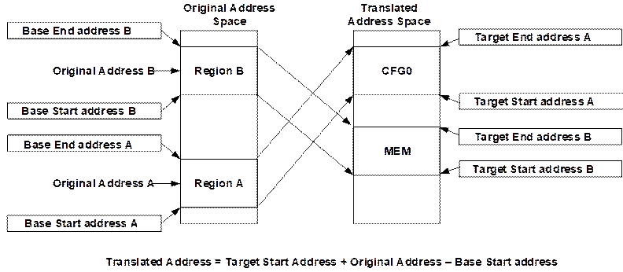

#### ATU控制寄存器

地址转换单元在系统复位后默认是未使能的，因此在系统复位后，需根据需要对地址转换单元进行配置。在PCIe内部配置寄存器空间提供了一系列寄存器接口用以配置地址转换单元（ATU）。通过这一组寄存器，可以实现对发送方向和接收方向的各8个地址转换区的配置。

ATU配置步骤如下：

设置ATU\_VIEWPORT，选择地址转换区编号和转换方向。

设置ATU\_BASE\_LOW和 ATU\_BASE\_HIGH。

设置 ATU\_LIMIT。

设置 ATU\_TARGET\_LOW和 ATU\_TARGET\_HIGH。

设置ATU\_REGION\_CTRL1。

设置ATU\_REGION\_CTRL2，使能此ATU Region。

----结束

<strong><big>须知</big></strong>

为了减少ATU控制寄存器占用的配置寄存器空间，发送方向和接收方向的各8个ATU区域都是由同一组寄存器来配置，当需要对其中一个ATU区域进行配置时，必须先设置ATU\_VIEWPORT寄存器选择转换区域编号，以表明后续对ATU寄存器的操作是针对哪一个ATU区域的ATU控制寄存器。

例如：当需要将发送方向的ATU区域3设置为一个地址转换区域并使之有效，需按如下步骤设置：

1．设置ATU\_VIEWPORT [atu\_reg\_region\_dir]=0x0，表明操作对象是发送方向的ATU区域寄存器。

2．设置ATU\_VIEWPORT [atu\_reg\_region\_index]=0x3，表明操作对象是发送方向的ATU区域3。

3．按此ATU区域特性设置其他的ATU寄存器。

**ATU设置示例如下：**

假设两片芯片通过PCIe连接，一片做RC，另一片做EP。RC端的CPU对当地总线地址0x28000000~0x2800FFFF的访问，经过PCIe后，变成对EP端DDR 地址0x90000000~0x9000FFFF的访问。要求：

- 对应PCIe事务为地址0x50000000~0x5000FFFF上的存储器事务；
- 存储器事务在EP端做BAR匹配，且BAR编号为4。

整个访问流程如图14-61所示。

RC访问EP ATU设置示意图

- RC端寄存器的配置直接由RC端CPU发起总线操作完成，EP端寄存器的配置由RC端CPU发起总线操作，经RC转换为PCIe配置事务完成，所以RC端需要首先设置一个转换区域，将RC端CPU发起的总线操作转换成PCIe配置事务。
- RC端需要设置发送方向地址转换区域，将当地总线地址0x28000000~0x2800FFFF上的操作转换成PCIe总线地址0x50000000~0x5000FFFF上的存储器事务。
- EP端需要设置接收方向地址转换区域，将PCIe总线地址0x50000000~0x5000FFFF上的存储器事务转换成对EP端DDR地址0x90000000~0x9000FFFF的访问。

**具体寄存器配置流程如下所述**：

RC端发送方向配置事务转换区域设置，直接由RC端CPU发起总线操作完成。由于两片芯片直接连接，故RC对EP的配置需发起总线号为1的类型0配置事务。根据13.7.5.3，可选取的RC端总线侧起始地址为0x20100000，假设选取转换区域0，具体的寄存器配置如下：

向ATU\_VIEWPORT寄存器写入0x00000000，选择区域号为0，方向为输出；

向ATU\_BASE\_LOW寄存器写入0x20100000，ATU\_BASE\_HIGH寄存器写入0x00000000，ATU\_LIMIT寄存器写入0x201FFFFF，设置总线侧地址转换范围为0x20100000~0x201FFFFF；

向ATU\_REGION\_CTRL1寄存器写入0x00000004，设置事务转换类型为类型0配置事务；

向ATU\_REGION\_CTRL2寄存器写入0x90000000，使能配置事务移位功能，将未转换的地址的bit[27:12]赋值给转换后地址的bit[31:16]，并使能该地址转换区域。

通过以上配置，RC端0x20100000~0x201FFFFF地址上的本地总线访问就可以转换成总线号为1的类型0配置事务，可以访问EP端的PCIe内部配置寄存器。

RC端发送方向存储器事务转换区域设置，直接由RC端CPU发起总线操作完成。将RC端CPU对本地总线地址0x28000000~0x2800FFFF的访问转换成PCIe总线0x50000000~0x5000FFFF地址上的PCIe存储器事务，假设选取转换区域1，具体的寄存器配置如下：

向ATU\_VIEWPORT寄存器写入0x00000001，选择区域号为1，方向为输出；

向ATU\_BASE\_LOW寄存器写入0x28000000，ATU\_BASE\_HIGH寄存器写入0x00000000，ATU\_LIMIT寄存器写入0x2800FFFF，设置总线侧地址转换范围为0x28000000~0x2800FFFF；

向ATU\_TARGET\_LOW寄存器写入0x50000000，ATU\_TARGET\_HIGH寄存器写入0x00000000，设置地址转换目标地址为0x50000000；

向ATU\_REGION\_CTRL1寄存器写入0x00000000，设置事务转换类型为存储器事务；

向ATU\_REGION\_CTRL2寄存器写入0x80000000，使能该地址转换区域。

EP端接收方向转换区域设置，由RC端CPU发起总线操作，经RC转换为PCIe配置事务完成。将0x50000000～0x5000FFFF地址范围内的的存储器事务转换成EP端0x90000000~0x9000FFFF地址上的本地总线访问， PCIe事务地址匹配BAR4（需提前由RC通过PCIe配置事务向EP的BAR4写入0x50000000），假设选取转换区域2，具体的寄存器配置如下：

向ATU\_VIEWPORT寄存器写入0x80000002，选择区域号为2，方向为输入；

向ATU\_TARGET\_LOW寄存器写入0x90000000，ATU\_TARGET\_HIGH寄存器写入0x00000000，设置地址转换目标地址为0x90000000；

向ATU\_REGION\_CTRL1寄存器写入0x00000000，设置事务转换类型为存储器事务；

向ATU\_REGION\_CTRL2寄存器写入0xC0000400，设置为BAR匹配模式，BAR编号为4，并使能该地址转换区域。

----结束

通过以上配置，PCIe总线上0x50000000～0x5000FFFF地址范围内的的存储器事务就可以转换成EP端0x90000000~0x9000FFFF地址上的本地总线访问。

#### INTx中断机制

PCIe控制器支持基于消息（Message）的INTx中断机制。

PCIe控制器作为EP时，只支持INTA的中断上报。

- 将PCIE\_SYS\_CTRL7[pcie\_sys\_int]寄存器从0配置为1时，EP向RC发送Assert\_INTA的消息，触发RC产生INTx中断（PCIE\_INTA、PCIE\_INTB、PCIE\_INTC或PCIE\_INTD）
- 将PCIE\_SYS\_CTRL7[pcie\_sys\_int]寄存器从1配置为0时，EP向RC发送Deassert\_INTA的消息，触发RC清除INTx中断（PCIE\_INTA、PCIE\_INTB、PCIE\_INTC或PCIE\_INTD）

<strong><big>须知</big></strong>

- PCIe控制器作为EP时，只能产生INTA的中断。PCIe控制器作为RC时，可以接收触发INTA、INTB、INTC和INTD四种中断。
- PCIe EP的INTx消息经过PCIe桥设备向上一级设备传递时，PCIe桥设备会根据消息的Request ID，重新映射INTx消息。

#### MSI中断机制

PCIe协议规定了MSI中断机制，EP设备通过向RC发送一个特定的MEM写事务。该MEM写事务的TLP报文，具有指定地址（Message Address）和特定数据（Message Data）。RC只要检测到MSI事务的特定报文，就会触发PCIE\_MSI\_INT中断上报CPU。

MSI中断机制通过EP的MEM写事务，实现了EP向RC上报中断。

#### MSI报文产生

PCIe控制器作为EP时，产生MSI报文，并上报RC进行处理。MSI报文的本质也是一个具有指定地址（Message Address）和特定数据（Message Data）的Memory Write报文。

<strong><big>须知</big></strong>

PCIe协议标准寄存器定义了**MSI Capability**寄存器，用于存放Message Address和Message Data。协议标准寄存器具体含义请参考《PCI Express Base Specification 3.0》章节7和《PCI Local Bus Specification, Revision 3.0》章节6，此处不做详细描述。

PCIe控制器支持两种MSI报文发送方式：MEM写事务发送MSI报文和快速MSI报文发送。

- MEM写事务发送MSI报文，使用MEM写事务发送MSI报文是最基本的方式。

首先CPU获取MSI Capability寄存器中的Message Address和Message Data信息。之后CPU发起一次对Message Address的MEM写操作，写入数据为Message Data。这样，PCIe总线上会发出一个MSI报文。MSI报文结构如图14-62所示。

MSI报文结构与MSI Capability寄存器

- 快速MSI报文发送，PCIe控制器支持快速MSI报文发送方式。
- 配置PCIE\_SYS\_CTRL2[pcie\_ven\_msi\_vector]设置发送的MSI中断向量。
- 配置PCIE\_SYS\_CTRL2[pcie\_ven\_msi\_req]为1时，发送一次MSI报文

<strong><big>须知</big></strong>

Message Address定义的地址是PCIe域的地址。如果CPU直接发起MEM写事务，需要将CPU域的地址转换为PCIe域的地址。关于CPU域地址到PCIe域地址转换的设置，参考PCIe地址转换章节。

使用快速MSI报文发送的方式，配置PCIE\_SYS\_CTRL2[pcie\_ven\_msi\_req]为1发送一次MSI报文后。如果需要第二次发送MSI报文，必须先将PCIE\_SYS\_CTRL2[pcie\_ven\_msi\_req]配置为0，再写为1时，才能再次发送MSI报文。

快速MSI报文发送的方式，只要将PCIE\_SYS\_CTRL2[pcie\_ven\_msi\_req]配置1就会立刻发送MSI报文，优先于其他的MEM写事务。这种方式仅适用于MSI事务与其他MEM写事务之间不需要严格保序的情况。

#### MSI中断管理

PCIe控制器作为RC时，提供了一个MSI中断管理单元，负责处理接收到的MSI报文，并产生MSI中断（EP模式下，MSI中断管理单元不生效）。

MSI中断管理单元中包含8个EP节点的中断管理子单元，每个EP最多支持32个中断向量。MSI中断管理单元会解析收到TLP报文中的Data Payload（包括Address和Data），以确定该TLP报文是否是MSI报文，及该MSI报文属于哪一个EP和对应的中断向量。

- 当RC需要接收EP发送的MSI报文（MEM写事务）时，需要配置PCIe协议标准寄存器Command[MEM\_SPACE\_EN]，使能Memory空间访问。
- 使能PCIe控制器的MSI中断管理单元，用于管理接收到的MSI报文。MSI中断管理单元检测收到的TLP报文，并检查到报文的地址与设定的Message Address匹配及满足其他匹配时，则会产生一个MSI中断。该报文被MSI中断管理单元处理后，不会再向PCIe控制器外的系统总线发送，仅用于PCIe控制器内部触发MSI中断。

软件可通过MSI中断管理单元寄存器来配置MSI中断管理，管理上报的MSI报文，MSI中断管理单元寄存器的定义请参考本章的PCIe寄存器描述。

<strong><big>须知</big></strong>

PCIe协议仅规定了EP的MSI报文上报方式，并未对RC的MSI中断管理作出规定。Message Address由RC统一分配管理，并且需要保证EP的Message Address和RC的MSI中断管理单元MSI\_CTRL\_ADDR\_LOW和MSI\_CTRL\_ADDR\_HIGH寄存器中设置的地址保持一致。Message Data用于表征对应的EP信息及中断向量，并与子单元及子单元的中断使能bit位、中断掩码bit位进行匹配。

**MSI中断管理示例如下：**

- 初始化RC MSI中断管理单元，配置Message Address、中断使能bit位、中断掩码bit位；
- MSI中断管理单元自动解析报文，并识别MSI报文。当检测到MSI报文时，产生PCIE\_MIS\_INT中断；
- CPU检测到PCIe控制器上报的PCIE\_MSI\_INT中断，读取MSI中断管理单元的MSI\_CTRL\_INT\_STATUS寄存器，查询中断并作相应的中断处理；
- CPU处理完中断后，写MSI中断管理单元的MSI\_CTRL\_INT\_STATUS寄存器，清除PCIE\_MSI\_INT中断。
#### MSI多中断向量

PCIe控制器作为RC时，支持对8×32个中断向量进行管理；PCIe控制器作为EP时，每个EP设备最多支持32个中断向量。

- RC的MSI中断管理单元中包含8个EP节点的中断管理子单元，每个EP最多支持32个中断向量。MSI中断管理单元，通过解析MSI报文的MSI Message Data。使用MSI Message Data[7:5]指示对应的EP信息，对应MSI中断管理单元下的8个不同MSI中断管理子单元。使用MSI Message Data[4:0]指示MSI中断向量，分别对应一个MSI中断管理子单元中MSI\_CTRL\_INT\_EN、MSI\_CTRL\_INT\_MASK、MSI\_CTRL\_INT\_STATUS的32bit。
- EP的MSI Capability寄存器定义了多中断向量的能力。通过读取MSI Capability寄存器的Message Control[Multiple Message Capable]获取EP支持的MSI多中断向量的能力信息，并配置Message Control[Multiple Message Enable]使能MSI多中断特性。

EP使能Multiple Message Enable功能后，Message Data寄存器[4:0]需要写0。使用PCIE\_SYS\_CTRL2[pcie\_ven\_msi\_vector]指示中断向量。Message Data寄存器[7:5]指示对应的EP信息。发送的MSI消息中的MSI Message Data={Message Data[15:5]，PCIE\_SYS\_CTRL2[pcie\_ven\_msi\_vector]}组合而成。

**MSI多中断向量示例**

配置EP多中断向量，步骤如下：

<strong><big>说明</big></strong>

Message Control请参考MSI报文产生中注意内容。

EP读取Message Control[Multiple Message Capable]返回值为0x5，即支持32个中断向量。

EP配置Message Control[Multiple Message Enable]为0x5，即使能32个中断向量。

EP配置Message Address为0x90000000和Message Upper Address为0x0，即分配MSI地址为0x90000000。

EP配置Message Data为0x1220，其中[4:0]bit为0x0，[7:5]bit为0x1，即分配的EP编号为1。

EP配置Message Control[Message Enable]为1，即EP使能MSI中断。

**----结束**

配置RC使能MSI中断管理单元，步骤如下：

RC配置MSI中断管理单元，配置MSI\_CTRL\_ADDR\_LOW为0x90000000和MSI\_CTRL\_ADDR\_HIGH为0x0，即MSI中断管理单元的MSI地址为0x90000000。

RC配置MSI中断管理子单元，由于EP编号为1，MSI\_CTRL\_INT\_EN和MSI\_CTRL\_INT\_MASK对应的偏移地址为0x834和0x838。配置MSI\_CTRL\_INT\_EN为全1，配合MSI\_CTRL\_INT\_MASK为全0。即使能MSI中断管理编号为1子单元，中断使能，并且不屏蔽中断。

**----结束**

EP产生MSI报文的两种方法：

- EP发起MEM写事务，向0x90000000（PCIe域的地址）写入0x1234，即发送MSI报文，MSI中断向量为0x14，EP编号为1；
- EP配置PCIE\_SYS\_CTRL2[pcie\_ven\_msi\_vector]为0x14，即中断向量为0x14，并向PCIE\_SYS\_CTRL2[pcie\_ven\_msi\_req]写入1，快速发送MSI报文。

RC MSI中断上报：

- RC触发PCIE\_MSI\_INT中断上报CPU，读取MSI中断管理编号为1子单元的0x83C的MSI\_CTRL\_INT\_STATUS，其中[20]bit为1，即RC端收到编号为1的EP设备，中断向量为0x14的MSI中断。
- RC向0x83C的MSI\_CTRL\_INT\_STATUS[20]bit写入1，清除PCIE\_MSI\_INT中断。

### PCI Express控制器寄存器

PCIE寄存器包括协议标准寄存器和厂商自定义寄存器。

- PCIE做EP时，协议标准寄存器（TYPE0）地址分配如下（PCIe基址是0x0\_103D\_0000）：

| bit[31:24] | bit[23:16] | bit[15:8] | bit[7:0] | BYTE\_OFFSET |
| --- | --- | --- | --- | --- |
| Device ID | | Vendor ID | | 0x0 |
| Status | | Command | | 0x4 |
| Class Code | | | Revision ID | 0x8 |
| BIST | Header Type | Master Latency Timer | Cache Line Size | 0xC |
| Base Address Register 0(BAR0) | | | | 0x10 |
| Base Address Register 1(BAR1) | | | | 0x14 |
| Base Address Register 2(BAR2) | | | | 0x18 |
| Base Address Register 3(BAR3) | | | | 0x1C |
| Base Address Register 4(BAR4) | | | | 0x20 |
| Base Address Register 5(BAR5) | | | | 0x24 |
| Cardbus CIS Pointer | | | | 0x28 |
| Subsystem ID | | Subsystem Vendor ID | | 0x2C |
| Expansion ROM Base Address | | | | 0x30 |
| Reserved | | | Capabilities Pointer | 0x34 |
| Reserved | | | | 0x38 |
| Reserved | | Interrupt Pin | Interrupt Line | 0x3C |
| Power Management Capabilities | | Next Capability Pointer | Capability ID(PM) | 0x40 |
| Power Management Status/Control Register | | | | 0x44 |
| Reserved | | | | 0x48 |
| Reserved | | | | 0x4C |
| Message Control | | Next Capability Pointer | Capability ID(MSI) | 0x50 |
| Message Address | | | | 0x54 |
| Message Upper Address | | | | 0x58 |
| Reserved | | Message Data | | 0x5C |
| Reserved | | | | 0x60 |
| Reserved | | | | 0x64 |
| Reserved | | | | 0x68 |
| Reserved | | | | 0x6C |
| PCIE Capabilities Register | | Next Capability Pointer | Capability ID(Capability) | 0x70 |
| Device Capabilities | | | | 0x74 |
| Device Status | | Device Control | | 0x78 |
| Link Capabilities | | | | 0x7C |
| Link Status | | Link Control | | 0x80 |
| Reserved | | | | 0x84 |
| Reserved | | | | 0x88 |
| Reserved | | | | 0x8C |
| Reserved | | | | 0x90 |
| Device Capabilities 2 | | | | 0x94 |
| Device Status 2 | | Device Control 2 | | 0x98 |
| Link Capabilities 2 | | | | 0x9C |
| Link Status 2 | | Link Control 2 | | 0xA0 |
| Advanced Error Reporting Extended Capability Header | | | | 0x100 |
| Uncorrectable Error Status Register | | | | 0x104 |
| Uncorrectable Error Mask Register | | | | 0x108 |
| Uncorrectable Error Severity Register | | | | 0x10C |
| Correctable Error Status Register | | | | 0x110 |
| Correctable Error Mask Register | | | | 0x114 |
| Advanced Error Capabilities and Control Register | | | | 0x118 |
| Header Log Register | | | | 0x11C |
| 0x120 |
| 0x124 |
| 0x128 |
| Reserved | | | | 0x12C |
| Reserved | | | | 0x130 |
| Reserved | | | | 0x134 |
| TLP Prefix Log Register | | | | 0x138 |

- PCIE做RC时，协议标准寄存器（TYPE1）地址分配如下（PCIe基址是0x0\_103D\_0000）：

| bit[31:24] | bit[23:16] | bit[15:8] | bit[7:0] | BYTE\_OFFSET |
| --- | --- | --- | --- | --- |
| Device ID | | Vendor ID | | 0x0 |
| Status | | Command | | 0x4 |
| Class Code | | | Revision ID | 0x8 |
| BIST | Header Type | Master Latency Timer | Cache Line Size | 0xC |
| Reserved | | | | 0x10 |
| Reserved | | | | 0x14 |
| Secondary Latency Timer | Subordinate Bus Number | Secondary Bus Number | Primary Bus Number | 0x18 |
| Secondary Status | | I/O Limit | I/O Base | 0x1C |
| Memory Limit | | Memory Base | | 0x20 |
| Prefetchable Memory Limit | | Prefetchable Memory Base | | 0x24 |
| Prefetchable Base Upper 32 Bits | | | | 0x28 |
| Prefetchable Limit Upper 32 Bits | | | | 0x2C |
| I/O Limit Upper 16 Bits | | I/O Base Upper 16 Bits | | 0x30 |
| Reserved | | | Capabilities Pointer | 0x34 |
| Expansion ROM Base Address | | | | 0x38 |
| Bridge Control | | Interrupt Pin | Interrupt Line | 0x3C |
| Power Management Capabilities | | Next Capability Pointer | Capability ID(PM) | 0x40 |
| Power Management Status/Control Register | | | | 0x44 |
| Reserved | | | | 0x48 |
| Reserved | | | | 0x4C |
| Message Control | | Next Capability Pointer | Capability ID(MSI) | 0x50 |
| Message Address | | | | 0x54 |
| Message Upper Address | | | | 0x58 |
| Reserved | | Message Data | | 0x5C |
| Reserved | | | | 0x60 |
| Reserved | | | | 0x64 |
| Reserved | | | | 0x68 |
| Reserved | | | | 0x6C |
| PCIE Capabilities Register | | Next Capability Pointer | Capability ID(Capability) | 0x70 |
| Device Capabilities | | | | 0x74 |
| Device Status | | Device Control | | 0x78 |
| Link Capabilities | | | | 0x7C |
| Link Status | | Link Control | | 0x80 |
| Slot Capabilities | | | | 0x84 |
| Slot Status | | Slot Control | | 0x88 |
| Root Capabilities | | Root Control | | 0x8C |
| Root Status | | | | 0x90 |
| Device Capabilities 2 | | | | 0x94 |
| Device Status 2 | | Device Control 2 | | 0x98 |
| Link Capabilities 2 | | | | 0x9C |
| Link Status 2 | | Link Control 2 | | 0xa0 |
| Advanced Error Reporting Extended Capability Header | | | | 0x100 |
| Uncorrectable Error Status Register | | | | 0x104 |
| Uncorrectable Error Mask Register | | | | 0x108 |
| Uncorrectable Error Severity Register | | | | 0x10C |
| Correctable Error Status Register | | | | 0x110 |
| Correctable Error Mask Register | | | | 0x114 |
| Advanced Error Capabilities and Control Register | | | | 0x118 |
| Header Log Register | | | | 0x11C |
| 0x120 |
| 0x124 |
| 0x128 |
| Root Error Command | | | | 0x12C |
| Root Error Status | | | | 0x130 |
| Error Source Identification Register | | Correctable Error Source Identification Register | | 0x134 |
| TLP Prefix Log Register | | | | 0x138 |

协议标准寄存器具体含义请参考《PCI Express Base Specification 3.0》章节7，此处不做详细描述。

下面只针对芯片中厂商定义的寄存器做详细描述。

#### PCIe\_iATU寄存器概览

PCIe\_iATU寄存器概览如表14-25所示。

PCIe\_iATU寄存器概览（基址是0x0\_103D\_0000）

| 偏移地址 | 名称 | 描述 | 页码 |
| --- | --- | --- | --- |
| 0x0900 | ATU\_VIEWPORT | ATU区域号寄存器 | 14-202 |
| 0x0904 | ATU\_REGION\_CTRL1 | ATU区域控制寄存器 | 14-203 |
| 0x0908 | ATU\_REGION\_CTRL2 | ATU区域控制寄存器 | 14-205 |
| 0x090C | ATU\_BASE\_LOW | ATU基地址低位寄存器 | 14-208 |
| 0x0910 | ATU\_BASE\_HIGH | ATU基地址高位寄存器 | 14-209 |
| 0x0914 | ATU\_LIMIT | ATU地址界限寄存器 | 14-209 |
| 0x0918 | ATU\_TARGET\_LOW | ATU目标地址低位寄存器 | 14-209 |
| 0x091C | ATU\_TARGET\_HIGH | ATU目标地址高位寄存器 | 14-210 |

#### PCIe\_iATU寄存器描述

#### ATU\_VIEWPORT

ATU\_VIEWPORT为ATU区域号寄存器。

Offset Address: 0x0900 Total Reset Value: 0x0000\_0000

|  |  |  |  |  |
| --- | --- | --- | --- | --- |
| Bits | Access | Name | Description | Reset |
| [31] | RW | atu\_reg\_region\_dir | 区域方向。  表明是发送还是接收地址转换区域，与区域号配合使用以确定操作的具体ATU区域。  0：输出地址转换区域；  1：输入地址转换区域。 | 0x0 |
| [30:4] | RO | reserved | 保留。 | 0x0000000 |
| [3:0] | RW | atu\_reg\_region\_index | 区域编号。  表明地址转换控制寄存器操作对应的区域号。  区域号赋值范围为0～7。 | 0x0 |

#### ATU\_REGION\_CTRL1

ATU\_REGION\_CTRL1为ATU区域控制寄存器。

Offset Address: 0x0904 Total Reset Value: 0x0000\_0000

| Bits | Access | Name | Description | Reset |
| --- | --- | --- | --- | --- |
| [31:23] | RO | reserved | 保留。 | 0x000 |
| [22:20] | RW | atu\_reg\_func\_num | 功能号。  发送(Outbound)：当发送的TLP（transaction layer packet）属于本ATU区域范围，则将该TLP数据包中功能号字段换成此寄存器的值。  接收(Inbound)：当接收到的TLP包中与此寄存器值相对应的功能号的BAR地址匹配时，则对此接收的TLP做地址转换处理(仅当接收区域匹配模式为BAR地址匹配时)。 | 0x0 |
| [19:18] | RO | reserved | 保留。 | 0x0 |
| [17:16] | RW | atu\_reg\_at | AT字段。  发送(Outbound)：当发送的TLP属于本ATU区域范围，则将该TLP数据包中AT字段换成此寄存器的值。  接收(Inbound)：当接收到的TLP包中AT字段与此寄存器匹配，则对此接收的TLP做地址转换处理。 | 0x0 |
| [15:11] | RO | reserved | 保留。 | 0x00 |
| [10:9] | RW | atu\_reg\_attr | ATTR字段。  发送(Outbound)：当发送的TLP属于本ATU区域范围，则将该TLP数据包中ATTR字段换成此寄存器的值。  接收(Inbound)：当接收到的TLP包中ATTR字段与此寄存器匹配，则对此接收的TLP做地址转换处理。 | 0x0 |
| [8] | RW | atu\_reg\_td | TD字段。  发送(Outbound)：当发送的TLP属于本ATU区域范围，则将该TLP数据包中TD字段换成此寄存器的值。  接收(Inbound)：当接收到的TLP包中TD字段与此寄存器匹配，则对此接收的TLP做地址转换处理。 | 0x0 |
| [7:5] | RW | atu\_reg\_tc | TC字段。  发送(Outbound)：当发送的TLP属于本ATU区域范围，则将该TLP数据包中TC字段换成此寄存器的值。  接收(Inbound)：当接收到的TLP包中TC字段与此寄存器匹配，则对此接收的TLP做地址转换处理。 | 0x0 |
| [4:0] | RW | atu\_reg\_type | TYPE字段。  发送(Outbound)：当发送的TLP属于本ATU区域范围，则将该TLP数据包中TYPE字段换成此寄存器的值。  接收(Inbound)：当接收到的TLP包中TYPE字段与此寄存器匹配，则对此接收的TLP做地址转换处理。 | 0x00 |

#### ATU\_REGION\_CTRL2

ATU\_REGION\_CTRL2为ATU区域控制寄存器。

Offset Address: 0x0908 Total Reset Value: 0x0000\_0000

| Bits | Access | Name | Description | Reset |
| --- | --- | --- | --- | --- |
| [31] | RW | atu\_reg\_region\_enable | ATU区域使能。  0：不使能。  1：使能。 | 0x0 |
| [30] | RW | atu\_reg\_in\_bar\_match | 接收ATU匹配模式选择。  发送(Outbound)：无作用。  接收(Inbound)：选择接收MEM/IO数据包的匹配模式。  0：地址匹配模式：当接收到的MEM/IO TLP（transaction layer packet）地址在ATU\_BASE\_LOW/ ATU\_BASE\_HIGH与ATU\_LIMIT范围内，则做地址转换。  1：BAR匹配模式：当接收到的MEM/IO TLP地址与BAR地址相匹配时，则做地址转换。 | 0x0 |
| [29] | RO | reserved | 保留。 | 0x0 |
| [28] | RW | atu\_reg\_shift | 配置事务移位功能。  此寄存器在做配置类型转换时使能，能实现操作地址和总线号、设备号、功能号的转换(以实现用256M地址空间访问所有配置空间的功能。)。  发送(Outbound)：将未转换的地址的27～12比特赋值给转换后地址的31～16比特。  接收(Inbound)：将接收到的配置事务的未转换的地址的31～16比特赋值给转换后地址的27～12比特。  0：不使能；  1：使能。 | 0x0 |
| [27] | RW | atu\_reg\_fuzzy | 模糊类型匹配模式。  若使能，则使能事务类型模糊匹配模式。  0：不使能；  1：使能。 | 0x0 |
| [26] | RO | reserved | 保留。 | 0x0 |
| [25:24] | RW | atu\_reg\_rsp\_code | 完成状态代码：  必须设置为0。 | 0x0 |
| [23:22] | RO | reserved | 保留。 | 0x0 |
| [21] | RW | atu\_reg\_msgcode\_match\_en | 消息代码匹配使能。  发送(Outbound)：未使用。  接收(Inbound)：当使能时，则将接收到的TLP中的消息代码与ATU\_REGION\_CTRL2中的atu\_reg\_msg\_code做匹配。  0：不使能；  1：使能。 | 0x0 |
| [20] | RO | reserved | 保留。 | 0x0 |
| [19] | RW | atu\_reg\_func\_match\_en | 功能号匹配使能。  发送(Outbound)：未使用。  接收(Inbound)：当使能时，则将接收到的TLP中的功能号与ATU\_REGION\_CTRL1中的atu\_reg\_func\_num做匹配。  0：不使能；  1：使能。 | 0x0 |
| [18] | RW | atu\_reg\_at\_match\_en | AT字段匹配使能。  发送(Outbound)：未使用。  接收(Inbound)：当使能时，则将接收到的TLP中的AT字段与ATU\_REGION\_CTRL1中的atu\_reg\_at做匹配。  0：不使能；  1：使能。 | 0x0 |
| [17] | RO | reserved | 保留。 | 0x0 |
| [16] | RW | atu\_reg\_attr\_match\_en | ATTR字段匹配使能。  发送(Outbound)：未使用。  接收(Inbound)：当使能时，则将接收到的TLP中的ATTR字段与ATU\_REGION\_CTRL1中的atu\_reg\_attr做匹配。  0：不使能；  1：使能。 | 0x0 |
| [15] | RW | atu\_reg\_td\_match\_en | TD字段匹配使能。  发送(Outbound)：未使用。  接收(Inbound)：当使能时，则将接收到的TLP中的TD字段与ATU\_REGION\_CTRL1中的atu\_reg\_td做匹配。  0：不使能；  1：使能。 | 0x0 |
| [14] | RW | atu\_reg\_tc\_match\_en | TC字段匹配使能。  发送(Outbound)：未使用。  接收(Inbound)：当使能时，则将接收到的TLP中的TC字段与ATU\_REGION\_CTRL1中的atu\_reg\_tc做匹配。  0：不使能；  1：使能。 | 0x0 |
| [13:11] | RO | reserved | 保留。 | 0x0 |
| [10:8] | RW | atu\_reg\_bar\_num | BAR编号。  发送(Outbound)：未使用。  接收(Inbound)：当接收到的TLP中的地址与此寄存器对应的BAR地址相匹配时，则对此TLP做地址转换处理。  000：BAR#0；  001：BAR#1；  010：BAR#2；  011：BAR#3；  100：BAR#4；  101：BAR#5；  其他：保留。 | 0x0 |
| [7:0] | RW | atu\_reg\_msg\_code | 消息代码。  发送(Outbound)：当发送的TLP地址与此区域匹配，且ATU\_REGION\_CTRL1中atu\_reg\_type字段为MSG,则将转换后的TLP中MSP字段设置为此寄存器的值。  接收(Inbound)：当ATU\_REGION\_CTRL2中的atu\_reg\_msgcode\_match\_en使能时，且接收到的消息事务中消息代码与此寄存器值相匹配时，则对此事务包做地址转换处理。 | 0x00 |

#### ATU\_BASE\_LOW

ATU\_BASE\_LOW为ATU基地址低位寄存器。

Offset Address: 0x090C Total Reset Value: 0x0000\_0000

|  |  |  |  |  |
| --- | --- | --- | --- | --- |
| Bits | Access | Name | Description | Reset |
| [31:12] | RW | atu\_reg\_base\_low | 表示此区域的起始地址中的31～12比特，当未转换的地址位于起始地址和地址界限范围内时，则满足地址匹配条件。ATU\_BASE\_LOW和ATU\_BASE\_HIGH共同组成基地址。 | 0x000 |
| [11:0] | RO | reserved | 保留。 | 0x0000 |

#### ATU\_BASE\_HIGH

ATU\_BASE\_HIGH为ATU基地址高位寄存器。

Offset Address: 0x0910 Total Reset Value: 0x0000\_0000

|  |  |  |  |  |
| --- | --- | --- | --- | --- |
| Bits | Access | Name | Description | Reset |
| [31:0] | RW | atu\_reg\_base\_high | 基地址高32位。  此区域的起始地址的63-32比特，当未转换的地址位于起始地址和地址界限范围内时，则满足地址匹配条件。(此寄存器只在64比特地址下有效，32比特地址模式下需设置为0。)  ATU\_BASE\_LOW和ATU\_BASE\_HIGH共同组成基地址。 | 0x00000000 |

#### ATU\_LIMIT

ATU\_LIMIT为ATU地址界限寄存器。

Offset Address: 0x0914 Total Reset Value: 0x0000\_FFFF

|  |  |  |  |  |
| --- | --- | --- | --- | --- |
| Bits | Access | Name | Description | Reset |
| [31:12] | RW | atu\_reg\_limit | 地址界限。  此区域的界限地址的中的31～12比特，当未转换的地址位于起始地址和地址界限范围内时，则满足地址匹配条件。 | 0x0000F |
| [11:0] | RO | reserved | 保留。 | 0xFFF |

#### ATU\_TARGET\_LOW

ATU\_TARGET\_LOW为ATU目标地址低位寄存器。

Offset Address: 0x0918 Total Reset Value: 0x0000\_0000

|  |  |  |  |  |
| --- | --- | --- | --- | --- |
| Bits | Access | Name | Description | Reset |
| [31:12] | RW | atu\_reg\_trgt\_low | 当做地址转换时，转换后的地址的31～12比特。ATU\_TARGET\_LOW和ATU\_TARGET\_HIGH共同组成目标地址。  地址转换公式为：  转换后的地址=转换地址-基地址+目标地址。  转换后的地址=转换地址-基地址+目标地址。 | 0x0000\_0000 |
| [11:0] | RO | reserved | 保留。 |  |

#### ATU\_TARGET\_HIGH

ATU\_TARGET\_HIGH为ATU目标地址高位寄存器。

Offset Address: 0x091C Total Reset Value: 0x0000\_0000

|  |  |  |  |  |
| --- | --- | --- | --- | --- |
| Bits | Access | Name | Description | Reset |
| [31:0] | RW | atu\_reg\_trgt\_high | 目标地址高32位。  当做地址转换时，转换后的地址的63～32比特。ATU\_TARGET\_LOW和ATU\_TARGET\_HIGH共同组成目标地址。 | 0x0000\_0000 |

#### PCIe\_DMA寄存器概览

PCIe\_DMA寄存器概览如表14-26所示。

PCIe\_DMA寄存器概览（基址是0x0\_103D\_0000）

| 偏移地址 | 名称 | 描述 | 页码 |
| --- | --- | --- | --- |
| 0x097C | DMA\_WR\_ENGINE\_EN | DMA写通道使能寄存器 | 14-212 |
| 0x0980 | DMA\_WR\_DOORBELL | DMA写操作启动和停止控制寄存器 | 14-212 |
| 0x099C | DMA\_RD\_ENGINE\_EN | DMA读通道使能寄存器 | 14-213 |
| 0x09A0 | DMA\_RD\_DOORBELL | DMA读操作启动和停止控制寄存器 | 14-213 |
| 0x09BC | DMA\_WR\_INT\_STAT | DMA写操作中断状态寄存器 | 14-214 |
| 0x09C4 | DMA\_WR\_INT\_MASK | DMA写操作中断掩码寄存器 | 14-215 |
| 0x09C8 | DMA\_WR\_INT\_CLR | DMA写操作中断清除寄存器 | 14-215 |
| 0x09CC | DMA\_WR\_ERR\_STAT | DMA写操作错误状态寄存器 | 14-216 |
| 0x09D0 | DMA\_WR\_DONE\_IMWR\_ADDR\_LOW | DMA写完成消息中断地址低位寄存器 | 14-216 |
| 0x09D4 | DMA\_WR\_DONE\_IMWR\_ADDR\_HIGH | DMA写完成消息中断地址高位寄存器 | 14-217 |
| 0x09D8 | DMA\_WR\_ABORT\_IMWR\_ADDR\_LOW | DMA写中止消息中断地址低位寄存器 | 14-217 |
| 0x09DC | DMA\_WR\_ABORT\_IMWR\_ADDR\_HIGH | DMA写中止消息中断地址高位寄存器 | 14-217 |
| 0x09E0 | DMA\_WR\_IMWR\_DATA\_0 | DMA写操作消息中断数据寄存器 | 14-217 |
| 0x0A10 | DMA\_RD\_INT\_STAT | DMA读操作中断状态寄存器 | 14-218 |
| 0x0A18 | DMA\_RD\_INT\_MASK | DMA读操作中断掩码寄存器 | 14-218 |
| 0x0A1C | DMA\_RD\_INT\_CLR | DMA读操作中断清除寄存器 | 14-219 |
| 0x0A24 | DMA\_RD\_ERR\_STAT\_LOW | DMA读操作错误状态低位寄存器 | 14-220 |
| 0x0A28 | DMA\_RD\_ERR\_STAT\_HIGH | DMA读操作错误状态高位寄存器 | 14-220 |
| 0x0A3C | DMA\_RD\_DONE\_IMWR\_ADDR\_LOW | DMA读完成消息中断地址低位寄存器 | 14-221 |
| 0x0A40 | DMA\_RD\_DONE\_IMWR\_ADDR\_HIGH | DMA读完成消息中断地址高位寄存器 | 14-221 |
| 0x0A44 | DMA\_RD\_ABORT\_IMWR\_ADDR\_LOW | DMA读中止消息中断地址低位寄存器 | 14-221 |
| 0x0A48 | DMA\_RD\_ABORT\_IMWR\_ADDR\_HIGH | DMA读中止消息中断地址高位寄存器 | 14-222 |
| 0x0A4C | DMA\_RD\_IMWR\_DATA | DMA读操作消息中断数据寄存器 | 14-222 |
| 0x0A6C | DMA\_CH\_INDEX | DMA通道索引寄存器 | 14-222 |
| 0x0A70 | DMA\_CH\_CTRL | DMA通道控制寄存器 | 14-223 |
| 0x0A78 | DMA\_TRANS\_SIZE | DMA传输长度寄存器寄存器 | 14-224 |
| 0x0A7C | DMA\_SAR\_LOW | DMA数据源地址低位寄存器 | 14-225 |
| 0x0A80 | DMA\_SAR\_HIGH | DMA数据源地址高位寄存器 | 14-225 |
| 0x0A84 | DMA\_DAR\_LOW | DMA目标地址低位寄存器 | 14-225 |
| 0x0A88 | DMA\_DAR\_HIGH | DMA目标地址高位寄存器 | 14-226 |

#### PCIe\_DMA寄存器描述

#### DMA\_WR\_ENGINE\_EN

DMA\_WR\_ENGINE\_EN为DMA写通道使能寄存器。

Offset Address: 0x097C Total Reset Value: 0x0000\_0000

|  |  |  |  |  |
| --- | --- | --- | --- | --- |
| Bits | Access | Name | Description | Reset |
| [31:1] | RO | reserved | 保留。 | 0x00000000 |
| [0] | RW | dma\_wr\_engine\_en | DMA写通道使能。  0：不使能DMA写通道。  1：使能DMA写通道。 | 0x0 |

#### DMA\_WR\_DOORBELL

DMA\_WR\_DOORBELL为DMA写操作启动和停止控制寄存器。

Offset Address: 0x0980 Total Reset Value: 0x0000\_0000

|  |  |  |  |  |
| --- | --- | --- | --- | --- |
| Bits | Access | Name | Description | Reset |
| [31] | RW | dma\_wr\_stop | DMA写通道停止。  与wr\_doorbell\_num配合使用，停止对应的DMA写通道数据传输。  0：无影响。  1：停止当前DMA传输。 | 0x0 |
| [30:3] | RO | reserved | 保留。 | 0x0000000 |
| [2:0] | RW | wr\_doorbell\_num | DMA写通道启动。  通过写入0启动DMA写传输(DMA引擎检测到对此寄存器的写操作即启动对应写通道的DMA操作。由于目前PCIe控制器只支持一个写通道，因此此寄存器必须写0)。 | 0x0 |

#### DMA\_RD\_ENGINE\_EN

DMA\_RD\_ENGINE\_EN为DMA读通道使能寄存器。

Offset Address: 0x099C Total Reset Value: 0x0000\_0000

|  |  |  |  |  |
| --- | --- | --- | --- | --- |
| Bits | Access | Name | Description | Reset |
| [31:1] | RO | reserved | 保留。 | 0x00000000 |
| [0] | RW | dma\_rd\_engine\_en | DMA读通道使能。  0：不使能DMA读通道。  1：使能DMA读通道。 | 0x0 |

#### DMA\_RD\_DOORBELL

DMA\_RD\_DOORBELL为DMA读操作启动和停止控制寄存器。

Offset Address: 0x09A0 Total Reset Value: 0x0000\_0000

| Bits | Access | Name | Description | Reset |
| --- | --- | --- | --- | --- |
| [31] | RW | dma\_rd\_stop | DMA读通道停止。  与rd\_doorbell\_num配合使用，停止对应的DMA读通道数据传输。  0：无影响。  1：停止当前DMA传输。 | 0x0 |
| [30:3] | RO | reserved | 保留。 | 0x0000000 |
| [2:0] | RW | rd\_doorbell\_num | DMA读通道启动。  通过写入0启动DMA读传输(DMA引擎检测到对此寄存器的写操作即启动对应读通道的DMA操作。由于目前PCIe控制器只支持一个读通道，因此此寄存器必须写0)。 | 0x0 |

#### DMA\_WR\_INT\_STAT

DMA\_WR\_INT\_STAT为DMA写操作中断状态寄存器。

Offset Address: 0x09BC Total Reset Value: 0x0000\_0000

| Bits | Access | Name | Description | Reset |
| --- | --- | --- | --- | --- |
| [31:17] | RO | reserved | 保留。 | 0x0000 |
| [16] | RO | dma\_wr\_abort\_int\_stat | DMA写操作中止中断状态。  表明DMA写通道检测到错误或者手动停止DMA写操作。  0：无效。  1：有效。 | 0x0 |
| [15:1] | RO | reserved | 保留。 | 0x0000 |
| [0] | RO | dma\_wr\_done\_int\_stat | DMA写操作完成中断状态。  表明已成功完成一次DMA写操作。  0：无效。  1：有效。 | 0x0 |

#### DMA\_WR\_INT\_MASK

DMA\_WR\_INT\_MASK为DMA写操作中断掩码寄存器。

Offset Address: 0x09C4 Total Reset Value: 0x0000\_0000

| Bits | Access | Name | Description | Reset |
| --- | --- | --- | --- | --- |
| [31:17] | RO | reserved | 保留。 | 0x0000 |
| [16] | RW | dma\_wr\_abort\_int\_mask | DMA写操作中止中断掩码。  0：DMA\_WR\_INT\_STAT[dma\_wr\_abort\_int\_stat]产生edma\_int中断。  1：DMA\_WR\_INT\_STAT[dma\_wr\_abort\_int\_stat]不产生edma\_int中断。 | 0x0 |
| [15:1] | RO | reserved | 保留。 | 0x0000 |
| [0] | RW | dma\_wr\_done\_int\_mask | DMA写操作完成中断掩码。  0：DMA\_WR\_INT\_STAT[dma\_wr\_done\_int\_stat]产生edma\_int中断。  1：DMA\_WR\_INT\_STAT[dma\_wr\_done\_int\_stat]不产生edma\_int中断。 | 0x0 |

#### DMA\_WR\_INT\_CLR

DMA\_WR\_INT\_CLR为DMA写操作中断清除寄存器。

Offset Address: 0x09C8 Total Reset Value: 0x0000\_0000

| Bits | Access | Name | Description | Reset |
| --- | --- | --- | --- | --- |
| [31:17] | RO | reserved | 保留。 | 0x0000 |
| [16] | RW | dma\_wr\_abort\_int\_clr | DMA写操作中止中断清除。  向此位写入1将清除DMA\_WR\_INT\_STAT寄存器中的dma\_wr\_abort\_int\_stat中断状态，读取此bit总是返回0。 | 0x0 |
| [15:1] | RO | reserved | 保留。 | 0x0000 |
| [0] | RW | dma\_wr\_done\_int\_clr | DMA写操作完成中断清除。  向此位写入1将清除DMA\_WR\_INT\_STAT寄存器中的dma\_wr\_done\_int\_stat中断状态，读取此bit总是返回0。 | 0x0 |

#### DMA\_WR\_ERR\_STAT

DMA\_WR\_ERR\_STAT为DMA写操作错误状态寄存器。

Offset Address: 0x09CC Total Reset Value: 0x0000\_0000

|  |  |  |  |  |
| --- | --- | --- | --- | --- |
| Bits | Access | Name | Description | Reset |
| [31:17] | RO | reserved | 保留。 | 0x0000 |
| [16] | RW | linked\_list\_fetch\_err\_det | DMA写通道从内存读取链表时检测到AXI总线错误响应。  0：无错误  1：错误 | 0x0 |
| [15:1] | RO | reserved | 保留。 | 0x0000 |
| [0] | RW | app\_rd\_err\_det | DMA写通道从内存读取数据时检测到AXI总线错误响应。  0：无错误  1：错误 | 0x0 |

#### DMA\_WR\_DONE\_IMWR\_ADDR\_LOW

DMA\_WR\_DONE\_IMWR\_ADDR\_LOW为DMA写完成消息中断地址低位寄存器。

Offset Address: 0x09D0 Total Reset Value: 0x0000\_0000

|  |  |  |  |  |
| --- | --- | --- | --- | --- |
| Bits | Access | Name | Description | Reset |
| [31:0] | RW | dma\_wr\_done\_imwr\_addr\_low | DMA写完成中断消息地址低32位。 | 0x00000000 |

#### DMA\_WR\_DONE\_IMWR\_ADDR\_HIGH

DMA\_WR\_DONE\_IMWR\_ADDR\_HIGH为DMA写完成消息中断地址高位寄存器。

Offset Address: 0x09D4 Total Reset Value: 0x0000\_0000

|  |  |  |  |  |
| --- | --- | --- | --- | --- |
| Bits | Access | Name | Description | Reset |
| [31:0] | RW | dma\_wr\_done\_imwr\_addr\_high | DMA写完成中断消息地址高32位。 | 0x00000000 |

#### DMA\_WR\_ABORT\_IMWR\_ADDR\_LOW

DMA\_WR\_ABORT\_IMWR\_ADDR\_LOW为DMA写中止消息中断地址低位寄存器。

Offset Address: 0x09D8 Total Reset Value: 0x0000\_0000

|  |  |  |  |  |
| --- | --- | --- | --- | --- |
| Bits | Access | Name | Description | Reset |
| [31:0] | RW | dma\_wr\_abort\_imwr\_addr\_low | DMA写中止中断消息地址低32位。 | 0x00000000 |

#### DMA\_WR\_ABORT\_IMWR\_ADDR\_HIGH

DMA\_WR\_ABORT\_IMWR\_ADDR\_HIGH为DMA写中止消息中断地址高位寄存器。

Offset Address: 0x09DC Total Reset Value: 0x0000\_0000

|  |  |  |  |  |
| --- | --- | --- | --- | --- |
| Bits | Access | Name | Description | Reset |
| [31:0] | RW | dma\_wr\_abort\_imwr\_addr\_high | DMA写中止中断消息地址高32位。 | 0x00000000 |

#### DMA\_WR\_IMWR\_DATA\_0

DMA\_WR\_IMWR\_DATA\_0为DMA写操作消息中断数据寄存器。

Offset Address: 0x09E0 Total Reset Value: 0x0000\_0000

|  |  |  |  |  |
| --- | --- | --- | --- | --- |
| Bits | Access | Name | Description | Reset |
| [31:16] | RO | reserved | 保留。 | 0x0000 |
| [15:0] | RW | dma\_wr\_imwr\_data\_0 | DMA写通道0的中断消息数据。 | 0x0000 |

#### DMA\_RD\_INT\_STAT

DMA\_RD\_INT\_STAT为DMA读操作中断状态寄存器。

Offset Address: 0x0A10 Total Reset Value: 0x0000\_0000

| Bits | Access | Name | Description | Reset |
| --- | --- | --- | --- | --- |
| [31:17] | RO | reserved | 保留。 | 0x0000 |
| [16] | RO | dma\_rd\_abort\_int\_stat | DMA读操作中止中断状态。  表明DMA读通道检测到错误或者手动停止DMA写操作。  0：无效。  1：有效。 | 0x0 |
| [15:1] | RO | reserved | 保留。 | 0x0000 |
| [0] | RO | dma\_rd\_done\_int\_stat | DMA读操作完成中断状态。  表明已成功完成一次DMA读操作。  0：无效。  1：有效。 | 0x0 |

#### DMA\_RD\_INT\_MASK

DMA\_RD\_INT\_MASK为DMA读操作中断掩码寄存器。

Offset Address: 0x0A18 Total Reset Value: 0x0000\_0000

|  |  |  |  |  |
| --- | --- | --- | --- | --- |
| Bits | Access | Name | Description | Reset |
| [31:17] | RO | reserved | 保留。 | 0x0000 |
| [16] | RW | dma\_rd\_abort\_int\_mask | DMA读操作中止中断掩码。  0：DMA\_RD\_INT\_STAT[dma\_rd\_abort\_int\_stat]产生edma\_int中断。  1：DMA\_RD\_INT\_STAT[dma\_rd\_abort\_int\_stat]不产生edma\_int中断。 | 0x0 |
| [15:1] | RO | reserved | 保留。 | 0x0000 |
| [0] | RW | dma\_rd\_done\_int\_mask | DMA读操作完成中断掩码。  0：DMA\_RD\_INT\_STAT[dma\_rd\_done\_int\_stat]产生edma\_int中断。  1：DMA\_RD\_INT\_STAT[dma\_rd\_done\_int\_stat]不产生edma\_int中断。 | 0x0 |

#### DMA\_RD\_INT\_CLR

DMA\_RD\_INT\_CLR为DMA读操作中断清除寄存器。

Offset Address: 0x0A1C Total Reset Value: 0x0000\_0000

| Bits | Access | Name | Description | Reset |
| --- | --- | --- | --- | --- |
| [31:17] | RO | reserved | 保留。 | 0x0000 |
| [16] | RW | dma\_rd\_abort\_int\_clr | DMA读操作中止中断清除。  向此位写入1将清除DMA\_RD\_INT\_STAT寄存器中的dma\_rd\_abort\_int\_stat中断状态，读取此bit总是返回0。 | 0x0 |
| [15:1] | RO | reserved | 保留。 | 0x0000 |
| [0] | RW | dma\_rd\_done\_int\_clr | DMA读操作中止中断清除。  向此位写入1将清除DMA\_RD\_INT\_STAT寄存器中的dma\_rd\_done\_int\_stat中断状态，读取此bit总是返回0。 | 0x0 |

#### DMA\_RD\_ERR\_STAT\_LOW

DMA\_RD\_ERR\_STAT\_LOW为DMA读操作错误状态低位寄存器。

Offset Address: 0x0A24 Total Reset Value: 0x0000\_0000

|  |  |  |  |  |
| --- | --- | --- | --- | --- |
| Bits | Access | Name | Description | Reset |
| [31:17] | RO | linked\_list\_fetch\_err\_det | DMA读通道从内存读取链表时检测到AXI总线错误响应。  0：无错误  1：错误 | 0x0000 |
| [16] | RW | reserved | 保留。 | 0x0 |
| [15:1] | RO | reserved | 保留。 | 0x0000 |
| [0] | RW | app\_wr\_err\_det | DMA读通道向内存写入数据时检测到AXI总线错误响应。  0：无错误  1：错误 | 0x0 |

#### DMA\_RD\_ERR\_STAT\_HIGH

DMA\_RD\_ERR\_STAT\_HIGH为DMA读操作错误状态高位寄存器。

Offset Address: 0x0A28 Total Reset Value: 0x0000\_0000

| Bits | Access | Name | Description | Reset |
| --- | --- | --- | --- | --- |
| [31:25] | RO | reserved | 保留。 | 0x00 |
| [24] | RW | dp\_err | DMA读通道检测到来自对端设备的中毒数据。  0：无效  1：有效。 | 0x0 |
| [23:17] | RO | reserved | 保留。 | 0x00 |
| [16] | RW | to\_err | DMA读通道读操作超时。  0：无效  1：有效。 | 0x0 |
| [15:9] | RO | reserved | 保留。 | 0x00 |
| [8] | RW | ca\_err | DMA读通道检测到来自对端设备的CA(Completion Abort)完成包。  0：无效  1：有效。 | 0x0 |
| [7:1] | RO | reserved | 保留。 | 0x00 |
| [0] | RW | ur\_err | DMA读通道检测到来自对端设备的UR(Unsupported Request)完成包。  0：无效  1：有效。 | 0x0 |

#### DMA\_RD\_DONE\_IMWR\_ADDR\_LOW

DMA\_RD\_DONE\_IMWR\_ADDR\_LOW为DMA读完成消息中断地址低位寄存器。

Offset Address: 0x0A3C Total Reset Value: 0x0000\_0000

|  |  |  |  |  |
| --- | --- | --- | --- | --- |
| Bits | Access | Name | Description | Reset |
| [31:0] | RW | dma\_rd\_done\_imwr\_addr\_low | DMA读完成中断消息地址低32位。 | 0x00000000 |

#### DMA\_RD\_DONE\_IMWR\_ADDR\_HIGH

DMA\_RD\_DONE\_IMWR\_ADDR\_HIGH为DMA读完成消息中断地址高位寄存器。

Offset Address: 0x0A40 Total Reset Value: 0x0000\_0000

|  |  |  |  |  |
| --- | --- | --- | --- | --- |
| Bits | Access | Name | Description | Reset |
| [31:0] | RW | dma\_rd\_done\_imwr\_addr\_high | DMA读完成中断消息地址高32位。 | 0x00000000 |

#### DMA\_RD\_ABORT\_IMWR\_ADDR\_LOW

DMA\_RD\_ABORT\_IMWR\_ADDR\_LOW为DMA读中止消息中断地址低位寄存器。

Offset Address: 0x0A44 Total Reset Value: 0x0000\_0000

|  |  |  |  |  |
| --- | --- | --- | --- | --- |
| Bits | Access | Name | Description | Reset |
| [31:0] | RW | dma\_rd\_abort\_imwr\_addr\_low | DMA读中止中断消息地址低32位。 | 0x00000000 |

#### DMA\_RD\_ABORT\_IMWR\_ADDR\_HIGH

DMA\_RD\_ABORT\_IMWR\_ADDR\_HIGH为DMA读中止消息中断地址高位寄存器。

Offset Address: 0x0A48 Total Reset Value: 0x0000\_0000

|  |  |  |  |  |
| --- | --- | --- | --- | --- |
| Bits | Access | Name | Description | Reset |
| [31:0] | RW | dma\_rd\_abort\_imwr\_addr\_high | DMA读中止中断消息地址高32位。 | 0x00000000 |

#### DMA\_RD\_IMWR\_DATA

DMA\_RD\_IMWR\_DATA为DMA读操作消息中断数据寄存器。

Offset Address: 0x0A4C Total Reset Value: 0x0000\_0000

|  |  |  |  |  |
| --- | --- | --- | --- | --- |
| Bits | Access | Name | Description | Reset |
| [31:16] | RO | reserved | 保留。 | 0x0000 |
| [15:0] | RW | dma\_rd\_imwr\_data | DMA读通道的中断消息数据。 | 0x0000 |

#### DMA\_CH\_INDEX

DMA\_CH\_INDEX为DMA通道索引寄存器。

Offset Address: 0x0A6C Total Reset Value: 0x0000\_0000

| Bits | Access | Name | Description | Reset |
| --- | --- | --- | --- | --- |
| [31] | RW | ch\_dir | 通道方向。  通过此位选择要配置的寄存器属于读通道还是写通道。  0：写通道。  1：读通道。 | 0x0 |
| [30:3] | RO | reserved | 保留。 | 0x0000000 |
| [2:0] | RW | reserved | 保留，必须设置为0。 | 0x0 |

#### DMA\_CH\_CTRL

DMA\_CH\_CTRL为DMA通道控制寄存器。

Offset Address: 0x0A70 Total Reset Value: 0x0000\_0000

| Bits | Access | Name | Description | Reset |
| --- | --- | --- | --- | --- |
| [31:30] | RW | addr\_trans | PCIe事务AT位。  DMA发起的PCIe存储器读写事务包中的的AT位将由此成员值代替。 | 0x0 |
| [29:27] | RW | traffic\_class | PCIe事务TC位。  DMA发起的PCIe存储器读写事务包中的的TC位将由此成员值代替。 | 0x0 |
| [26] | RW | traffic\_digest | PCIe事务TD位。  DMA发起的PCIe存储器读写事务包中的的TD位将由此成员值代替。 | 0x0 |
| [25] | RW | relaxed\_order | PCIe事务RO位。  DMA发起的PCIe存储器读写事务包中的的RO位将由此成员值代替。 | 0x0 |
| [24] | RW | no\_snoop | PCIe事务NS位。  DMA发起的PCIe存储器读写事务包中的的NS位将由此成员值代替。 | 0x0 |
| [23:17] | RO | reserved | 保留。 | 0x00 |
| [16:12] | RW | fun\_num | PCIe事务fun\_num位。  DMA发起的PCIe存储器读写事务包中的的功能号将由此成员值代替。 | 0x00 |
| [11:10] | RO | reserved | 保留。 | 0x0 |
| [9] | RO | reserved | 保留。 | 0x0 |
| [8] | RO | reserved | 保留。 | 0x0 |
| [7] | RO | reserved | 保留。 | 0x0 |
| [6:5] | RO | ch\_status | 通道状态。  表明通道所处的工作状态。  00：保留。  01：正在进行DMA传输。  10：运行错误。  11：通道成功完成DMA传输或通道被手动停止传输。 | 0x0 |
| [4] | RO | reserved | 保留。 | 0x0 |
| [3] | RW | local\_int\_enable | 本地DMA中断使能。  设置此位有效，则可以在DMA传输完成或失败时发出DMA本地中断。  0：不使能DMA本地中断；  1：使能DMA本地中断。 | 0x0 |
| [2] | RO | reserved | 保留。 | 0x0 |
| [1] | RO | reserved | 保留。 | 0x0 |
| [0] | RO | reserved | 保留。 | 0x0 |

#### DMA\_TRANS\_SIZE

DMA\_TRANS\_SIZE为DMA传输长度寄存器寄存器。

Offset Address: 0x0A78 Total Reset Value: 0x0000\_0000

|  |  |  |  |  |
| --- | --- | --- | --- | --- |
| Bits | Access | Name | Description | Reset |
| [31:0] | RW | dma\_trans\_size | DMA传输长度。  在DMA传输之前将需要传输的数据长度写入此寄存器，最小传输长度是1个字节，最大4G字节。  在DMA传输过程中，此寄存器值会自动递减。寄存器的值为未传输的字节数，传输成功结束后此寄存器为0。 | 0x00000000 |

#### DMA\_SAR\_LOW

DMA\_SAR\_LOW为DMA数据源地址低位寄存器。

Offset Address: 0x0A7C Total Reset Value: 0x0000\_0000

|  |  |  |  |  |
| --- | --- | --- | --- | --- |
| Bits | Access | Name | Description | Reset |
| [31:0] | RW | dma\_sar\_low | DMA传输数据的源地址(低32位)。  在DMA传输之前将源数据的起始地址写入此寄存器，DMA通道将从此地址获取将要传输的数据。  在DMA传输过程中，此寄存器的值会自动递增。  此寄存器低2比特必须为0。 | 0x00000000 |

#### DMA\_SAR\_HIGH

DMA\_SAR\_HIGH为DMA数据源地址高位寄存器。

Offset Address: 0x0A80 Total Reset Value: 0x0000\_0000

|  |  |  |  |  |
| --- | --- | --- | --- | --- |
| Bits | Access | Name | Description | Reset |
| [31:0] | RW | dma\_sar\_high | DMA传输数据的源地址(高32位)。  32位地址模式下必须为0。  64位地址模式下与DMA\_SAR\_LOW组成64位的源地址。 | 0x00000000 |

#### DMA\_DAR\_LOW

DMA\_DAR\_LOW为DMA目标地址低位寄存器。

Offset Address: 0x0A84 Total Reset Value: 0x0000\_0000

|  |  |  |  |  |
| --- | --- | --- | --- | --- |
| Bits | Access | Name | Description | Reset |
| [31:0] | RW | dma\_dar\_low | DMA传输数据的目标地址(低32位)。  在DMA传输之前将目标地址写入此寄存器，DMA通道将从源地址获取的数据写入目标地址内。  在DMA传输过程中，此寄存器的值会自动递增。  此寄存器低2比特必须为0。 | 0x00000000 |

#### DMA\_DAR\_HIGH

DMA\_DAR\_HIGH为DMA目标地址高位寄存器。

Offset Address: 0x0A88 Total Reset Value: 0x0000\_0000

|  |  |  |  |  |
| --- | --- | --- | --- | --- |
| Bits | Access | Name | Description | Reset |
| [31:0] | RW | dma\_dar\_high | DMA传输数据的目标地址(高32位)。  32位地址模式下必须为0。  64位地址模式下与DMA\_DAR\_LOW组成64位的目标地址。 | 0x00000000 |

#### PCIe\_MSI中断管理单元寄存器概览

寄存器偏移地址中变量的取值范围和含义如表14-27所示。

寄存器偏移地址变量表

| 变量名称 | 取值范围 | 描述 |
| --- | --- | --- |
| n | 0～7 | PCIe MSI中断管理单元支持8个MSI中断管理子单元。对8个EP节点上报的中断进行管理。n（0~7）分别指示不同MSI中断管理子单元。 |

PCIe\_MSI中断管理单元寄存器概览如表14-28所示。

PCIe\_MSI中断管理单元寄存器概览（基址0x0\_103D\_0000）

| 偏移地址 | 名称 | 描述 | 页码 |
| --- | --- | --- | --- |
| 0x820 | MSI\_CTRL\_ADDR\_LOW | PCIe Message Address低位寄存器 | 14-227 |
| 0x824 | MSI\_CTRL\_ADDR\_HIGH | PCIe Message Address高位寄存器 | 14-227 |
| 0x828+n×0xC | MSI\_CTRL\_INT\_EN | PCIe MSI中断使能寄存器 | 14-228 |
| 0x82C+ n×0xC | MSI\_CTRL\_INT\_MASK | PCIe MSI中断掩码寄存器 | 14-229 |
| 0x830+ n×0xC | MSI\_CTRL\_INT\_STATUS | PCIe MSI中断状态寄存器 | 14-229 |

#### PCIe MSI中断管理单元寄存器描述

#### MSI\_CTRL\_ADDR\_LOW

MSI\_CTRL\_ADDR\_LOW为PCIe Message Address低位寄存器。

Offset Address: 0x820 Total Reset Value: 0x0000\_0000

| Bits | Access | Name | Description | Reset |
| --- | --- | --- | --- | --- |
| [31:0] | RW | msi\_ctrl\_addr\_low | PCIe Message Address低32bit。  系统指定一个Message Address。用于匹配MEM写事务是否是MSI报文。  控制器收到一个MEM写请求，会检测MEM写请求的目标地址是否与MSI\_CTRL\_ADDR匹配，并检查是否满足MSI中断请求的定义。  当满足条件时，MEM写请求会被标记为MSI请求。 | 0x00000000 |

#### MSI\_CTRL\_ADDR\_HIGH

MSI\_CTRL\_ADDR\_HIGH为PCIe Message Address高位寄存器。

Offset Address: 0x824 Total Reset Value: 0x0000\_0000

| Bits | Access | Name | Description | Reset |
| --- | --- | --- | --- | --- |
| [31:0] | RW | msi\_ctrl\_addr\_high | PCIe Message Address高32bit。  系统指定一个Message Address。用于匹配MEM 写事务是否是MSI报文。  控制器收到一个MEM写请求，会检测MEM写请求的目标地址是否与MSI\_CTRL\_ADDR匹配，并检查是否满足MSI中断请求的定义。  当满足条件时，MEM写请求会被标记为MSI请求。  当Message Address是64bit地址时，需要配置MSI\_CTRL\_ADDR\_HIGH；当Message Address是32bit地址时，该寄存器设置为0。 | 0x00000000 |

#### MSI\_CTRL\_INT\_EN

MSI\_CTRL\_INT\_EN为PCIe MSI中断使能寄存器。

Offset Address: 0x828+n×0xC Total Reset Value: 0x0000\_0000

| Bits | Access | Name | Description | Reset |
| --- | --- | --- | --- | --- |
| [31:0] | RW | msi\_ctrl\_int\_en | PCIe MSI中断使能。  PCIe MSI中断管理单元支持对8个EP节点上报的中断进行管理。n（0~7）分别指示不同MSI中断管理子单元。  每个EP节点最多支持32个中断向量。  该寄存器的每个bit对应一个MSI中断向量使能位。  0：不使能。  1：使能。 | 0x00000000 |

#### MSI\_CTRL\_INT\_MASK

MSI\_CTRL\_INT\_MASK为PCIe MSI中断掩码寄存器。

Offset Address: 0x82C+n×0xC Total Reset Value: 0x0000\_0000

| Bits | Access | Name | Description | Reset |
| --- | --- | --- | --- | --- |
| [31:0] | RW | msi\_ctrl\_int\_mask | PCIe MSI中断掩码。  PCIe MSI中断管理单元支持对8个EP节点上报的中断进行管理。n（0~7）分别指示不同MSI中断管理子单元。  每个EP节点最多支持32个中断向量。  该寄存器的每个bit对应一个MSI中断向量中断掩码位。  0：不屏蔽。收到MSI中断时，对应中断状态寄存器记录原始中断，并上报PCIE\_MSI\_INT中断。  1：收到MSI中断时，对应中断状态寄存器记录原始中断，并不产生PCIE\_MSI\_INT中断。 | 0x00000000 |

#### MSI\_CTRL\_INT\_STATUS

MSI\_CTRL\_INT\_STATUS为PCIe MSI中断状态寄存器。

Offset Address: 0x830+n×0xC Total Reset Value: 0x0000\_0000

| Bits | Access | Name | Description | Reset |
| --- | --- | --- | --- | --- |
| [31:0] | RWC | msi\_ctrl\_int\_status | PCIe MSI中断状态。  PCIe MSI中断管理单元支持对8个EP节点上报的中断进行管理。n（0~7）分别指示不同MSI中断管理子单元。  每个EP节点最多支持32个中断向量。  该寄存器的每个bit对应一个MSI的原始中断状态。  0：对应中断向量位，未收到MSI中断（原始中断）  1：对应中断向量位，收到MSI中断（原始中断）  该寄存器为写1清寄存器。向对应bit位写入1，将清除MSI\_CTRL\_INT\_STATUS寄存器对应中断向量的中断状态 | 0x00000000 |

#### PCIe内部系统控制寄存器概览

PCIe内部系统控制寄存器概览如表14-29所示。

PCIe内部系统控制寄存器概览（基址是0x0\_103D\_0000）

| 偏移地址 | 名称 | 描述 | 页码 |
| --- | --- | --- | --- |
| 0xC00 | PCIE\_SYS\_CTRL0 | PCIE内部系统控制寄存器0 | 14-230 |
| 0xC04 | PCIE\_SYS\_CTRL1 | PCIE内部系统控制寄存器1 | 14-231 |
| 0xC08 | PCIE\_SYS\_CTRL2 | PCIE内部系统控制寄存器2 | 14-231 |
| 0xC1C | PCIE\_SYS\_CTRL7 | PCIE内部系统控制寄存器7 | 14-232 |
| 0xF00 | PERI\_PCIE\_STAT | PCIE内部系统控制状态寄存器0 | 14-232 |

#### PCIe内部系统控制寄存器描述

#### PCIE\_SYS\_CTRL0

PCIE\_SYS\_CTRL0为PCIE内部系统控制寄存器0。

Offset Address: 0xC00 Total Reset Value: 0x0000\_0000

| Bits | Access | Name | Description | Reset |
| --- | --- | --- | --- | --- |
| [31:28] | RW | pcie\_device\_type | PCIe控制器的模式。  0x0：PCI Express EP设备；  0x1：Legacy PCI Express设备；  0x4：PCI Express RC设备；  其他：保留。 | 0x0 |
| [27:0] | RO | reserved | 保留。 | 0x0000000 |

#### PCIE\_SYS\_CTRL1

PCIE\_SYS\_CTRL1为PCIE内部系统控制寄存器1。

Offset Address: 0xC04 Total Reset Value: 0x0000\_0004

|  |  |  |  |  |
| --- | --- | --- | --- | --- |
| Bits | Access | Name | Description | Reset |
| [31:24] | RO | reserved | 保留。 | 0x00 |
| [23] | RW | pcie\_app\_clk\_req\_n | PCIe控制器应用层时钟请求。  0：申请时钟；  1：不申请时钟。 | 0x0 |
| [22:0] | RO | reserved | 保留。 | 0x000004 |

#### PCIE\_SYS\_CTRL2

PCIE\_SYS\_CTRL2为PCIE内部系统控制寄存器2。

Offset Address: 0xC08 Total Reset Value: 0x0000\_0000

| Bits | Access | Name | Description | Reset |
| --- | --- | --- | --- | --- |
| [31:27] | RW | pcie\_ven\_msi\_vector | PCIe控制器MSI数据调整控制寄存器。  当PCIe控制器发起MSI报文请求时，此寄存器域与MSI数据寄存器 （PCIe配置空间标准寄存器）的低5bit进行或运算得到新的MSI数据。 | 0x00 |
| [26] | RW | pcie\_ven\_msi\_req | 指示PCIe控制器是否请求发送消息中断(MSI)。  0：无请求；  1：请求。 | 0x0 |
| [25:0] | RO | reserved | 保留。 | 0x0000000 |

#### PCIE\_SYS\_CTRL7

PCIE\_SYS\_CTRL7为PCIE内部系统控制寄存器2。

Offset Address: 0xC1C Total Reset Value: 0x001F\_F800

|  |  |  |  |  |
| --- | --- | --- | --- | --- |
| Bits | Access | Name | Description | Reset |
| [31:12] | RO | reserved | 保留。 | x001FF |
| [11] | RW | pcie\_app\_ltssm\_enable | PCIe控制器使能。  0：不使能PCIe控制器；  1：使能PCIe控制器。 | 0x1 |
| [10:6] | - | reserved | 保留。 | 0x00 |
| [5] | RW | pcie\_sys\_int | PCIe控制器中断请求。   - 此寄存器值由0变为1时，PCIe控制器产生一个Assert\_INTx消息； - 此寄存器值由1变为0时，PCIe控制器产生一个Deassert\_INTx消息。 | 0x0 |
| [4:0] | - | reserved | 保留。 | 0x00 |

#### PERI\_PCIE\_STAT

PERI\_PCIE\_STAT为PCIE状态寄存器0。

Offset Address: 0xF00 Total Reset Value: 0x0000\_0000

| Bits | Access | Name | Description | Reset |
| --- | --- | --- | --- | --- |
| [31:16] | RO | reserved | 保留。 | 0x0000 |
| [15] | RO | pcie\_xmlh\_link\_up | PCIe PHY链路连接状态。  0：连接已断开；  1：连接已建立。 | 0x0 |
| [14:6] | RO | reserved | 保留。 | 0x000 |
| [5] | RO | pcie\_rdlh\_link\_up | PCIe控制器数据链路层连接状态指示。  0：连接已断开；  1：连接已建立。 | 0x0 |
| [4:0] | RO | reserved | 保留。 | 0x00 |

## USB3.0

### 概述

该系统支持1个USB3.0 HOST模块和1个USB3.0 DRD(Dule Role Device)模块，USB3.0 DRD支持USB3.0 host 和 USB3.0 device 的静态切换，即只需要配置相关寄存器就能使该模块工作在USB3.0 host 或者 USB3.0 device 模式。

两个模块支持USB3.0协议规定的5Gbit/s 传输速率以及向后兼容USB2.0 协议规定的480Mbit/s传输速率；完全支持XHCI 1.0 协议；支持超速传输的PIPE接口协议以及兼容高速传输的UTMI接口协议；两个USB3.0 控制器均可以完成。

- 对传输的控制和处理
- 对数据包的解析和打包
- 对USB传输信号的编码和解码
- 为驱动程序提供了中断向量等接口

### 功能描述

#### 逻辑框图

USB 3.0逻辑框图如图14-63所示。

USB 3.0逻辑框图

UTMI：USB2.0 Transceiver Macrocell Interface

XHCI：eXtensible Host Controller Interface

#### 功能特点

USB3.0 HOST和USB 3.0 DRD具有以下功能特点：

- 完全兼容USB3.0 以及向下兼容USB 2.0。
- 完全符合 XHCI 1.0。
- USB3.0 DRD可单独工作在Host 或者 Device 模式。
- 可以支持Super-speed、High-speed、Full-speed、Low-speed四种设备。
- 支持USB 2.0低功耗的解决方案 和 USB3.0的 U0、U1、U2、U3四种功耗状态。
- 支持Host工作模式下Control Transfer、Bulk Transfer、Isochronous Transfer、Interrupt Transfer四种基本数据传输类型。
- USB3.0 DRD支持Device 工作模式下的Control Transfer、Bulk Transfer、Isochronous Transfer、Interrupt Transfer四种基本数据传输类型。
- 支持内部DMA控制器。
- 可以通过连接USB Hub，连接最多64个设备。
#### 工作原理

USB3.0 HOST和USB 3.0 DRD工作于Host 模式时，支持以下4种标准的传输方式：

- Control Transfer（控制传输）

主要用于USB Host与USB Device端点0之间的传输，某些特定型号的USB设备的控制传输可能用到其他的端点。控制传输是双向传输，数据量通常较小，可以传输8byte、16byte、32byte或64byte的数据，依赖于设备和传输速度。

- Bulk Transfer（批量传输）

主要用于没有带宽和间隔时间要求的情况下发送和接收大量的数据，这种类型的设备适合于传输非常慢和大量被延迟的传输，可以等到所有其他类型的数据的传送完成之后再传送和接收数据。它的特点是以错误检测和重传的方式保证USB Host与USB Device的数据被无差错地发送。

- Isochronous Transfer（同步传输）

主要用于时间严格并具有较强容错性的流数据传输，或者用于数据传输速率恒定的即时应用中。同步传输提供了确定的带宽和间隔时间。

- Interrupt Transfer（中断传输）

主要用于少量、分散、不可预测的数据的传输。中断传输方式下，定时查询设备是否有中断数据要发送。设备的端点模式器的结构决定了它的查询频率为1ms～255ms。典型的中断方式传输是单向的，并且对于USB Host来说只有输入的方式。

### 工作方式

#### USB3.0 HOST时钟复位

在初始化控制器之前，对时钟复位寄存器做相应的配置。

关断时钟的步骤如下：

向PERI\_CRG3632[4]写入0x1，打开U2PHY0的参考时钟门控。

向PERI\_CRG3632[0]、[1]写入0x0，撤离U2PHY0的总复位和数字复位。

向PERI\_CRG3665[4]写入0x1，打开COMPHY0参考时钟门控。

向PERI\_CRG3665[0]写入0x0，撤离COMPHY0的总复位。

向PERI\_CRG3664[12]、[8]、[6]、[5]、[4]写入0x1，打开控制器的PIPE、UTMI、SUSPEND、REF和总线等工作时钟门控。

#### PERI\_CRGUSB3.0 DRD时钟复位

在初始化控制器之前，对时钟复位寄存器做相应的配置。

关断时钟的步骤如下：

向PERI\_CRG3640[4]写入0x1，打开U2PHY1的参考时钟门控。

向PERI\_CRG3640[0]、[1]写入0x0，撤离U2PHY1的总复位和数字复位。

向PERI\_CRG3673[4]写入0x1，打开COMPHY1参考时钟门控。

向PERI\_CRG3673[0]写入0x0，撤离COMPHY1的总复位。

向PERI\_CRG3672 [12]、[8]、[6]、[5]、[4]写入0x1，打开控制器的PIPE、UTMI、SUSPEND、REF和总线等工作时钟门控。

向PERI\_CRG3672[0]写入0x0，撤离U3 DRD控制器的复位。

----结束

#### USB3.0 DRD Host/device 工作模式切换

切换操作如下：

- 向PERI\_USB3\_GCTL [prtcapdir] 写入2’b01，DRD控制器将工作于Host模式。
- 向PERI\_USB3\_GCTL [prtcapdir] 写入2’b10，DRD控制器将工作于Device模式。

<strong><big>须知</big></strong>

Host/Device工作模式切换只支持静态切换，不支持动态切换。

### USB2.0 PHY寄存器概览

USB2.0 PHY寄存器概览如表14-30所示。

<strong><big>说明</big></strong>

- USB3\_0端口对应PHY0，USB3\_1端口对应PHY1，基地址不同，偏移地址相同。
- 调节PHY的参数时，需注意只改动对应控制比特位的值，其他比特位的值保持不变。

USB2.0 PHY寄存器概览（PHY0基址是0x0\_1031\_0000；PHY1基址是0x0\_1033\_0000）

| 偏移地址 | 名称 | 描述 | 页码 |
| --- | --- | --- | --- |
| 0x0000 | USB2\_PHY0\_ANA\_CFG0 | USB2.0 PHY0 pre-drive调节寄存器 | 14-237 |
| 0x0010 | USB2\_PHY0\_ANA\_CFG4 | USB2.0 PHY0高速眼图幅度配置寄存器 | 14-237 |

### USB2.0 PHY寄存器描述

#### USB2\_PHY0\_ANA\_CFG0

USB2\_PHY0\_ANA\_CFG0为USB2 PHY0 pre-drive调节寄存器。

Offset Address: 0x0000 Total Reset Value: 0x0A33\_CC2B

| Bits | Access | Name | Description | Reset |
| --- | --- | --- | --- | --- |
| [31:28] | - | Reserved | 保留。 | 0x0 |
| [27:24] | RW | usb2\_phy0\_rg\_hstx\_pdrv\_p | 配置Pre-drive强度的档位：bit<0>\*1+bit<1>\*2+bit<2>\*4+bit<3>\*8 | 0xA |
| [23:0] | - | Reserved | 保留。 | 0x33CCCB |

#### USB2\_PHY0\_ANA\_CFG4

USB2\_PHY0\_ANA\_CFG4为USB2 PHY0高速眼图幅度配置寄存器。

Offset Address: 0x0010 Total Reset Value: 0x10643

| Bits | Access | Name | Description | Reset |
| --- | --- | --- | --- | --- |
| [31:7] | - | Reserved | 保留。 | 0x000020C |
| [6:4] | RW | usb2\_phy0\_rg\_vtxref\_sel | 配置HS眼图幅度的参考值(仅代表调节趋势，不代表精确值)：  000：380mv  001：390mv  010：400mv  011：410mv  100：420mv  101：430mv  110：440mv  111：460mv | 0x4 |
| [3:0] | - | Reserved | 保留。 | 0x3 |

### USB3.0寄存器概览

USB3.0寄存器概览如表14-31所示。

USB3.0寄存器概览（USB3.0 HOST基址是0x0\_1030\_0000，USB3.0 DRD基地址是0x0\_1032\_0000）

| 偏移地址 | 名称 | 描述 | 页码 |
| --- | --- | --- | --- |
| 0xC100 | PERI\_USB3\_GSBUSCFG0 | 全局SOC总线配置寄存器0 | 14-241 |
| 0xC104 | PERI\_USB3\_GSBUSCFG1 | 全局SOC总线配置寄存器1 | 14-242 |
| 0xC108 | PERI\_USB3\_GTXTHRCFG | 全局发送门限控制寄存器 | 14-243 |
| 0xC10C | PERI\_USB3\_GRXTHRCFG | 全局接收门限控制寄存器 | 14-244 |
| 0xC110 | PERI\_USB3\_GCTL | 全局core控制寄存器 | 14-245 |
| 0xC118 | PERI\_USB3\_GSTS | 全局状态寄存器 | 14-249 |
| 0xC11C | PERI\_USB3\_GUCTL1 | 全局用户控制寄存器1 | 14-250 |
| 0xC124 | PERI\_USB3\_GGPIO | 全局GPIO 寄存器 | 14-251 |
| 0xC128 | PERI\_USB3\_GUID | 全局用户ID寄存器 | 14-251 |
| 0xC12C | PERI\_USB3\_GUCTL | 全局用户控制寄存器 | 14-251 |
| 0xC130 | PERI\_USB3\_GBUSERRADDR\_HI | 全局总线错误地址高32位寄存器 | 14-253 |
| 0xC134 | PERI\_USB3\_GBUSERRADDR\_LO | 全局总线错误地址低32位寄存器 | 14-254 |
| 0xC138 | PERI\_USB3\_GPRTBIMAP\_HI | 超速端口-总线映射高32位寄存器 | 14-254 |
| 0xC13C | PERI\_USB3\_GPRTBIMAP\_LO | 超速端口-总线映射低32位寄存器 | 14-254 |
| 0xC180 | PERI\_USB3\_GPRTBIMAP\_HS\_HI | 高速端口-总线映射高32位寄存器 | 14-255 |
| 0xC184 | PERI\_USB3\_GPRTBIMAP\_HS\_LO | 高速端口-总线映射低32位寄存器 | 14-255 |
| 0xC188 | PERI\_USB3\_GPRTBIMAP\_FS\_HI | 全速端口-总线映射高32位寄存器 | 14-255 |
| 0xC18C | PERI\_USB3\_GPRTBIMAP\_FS | 全速端口-总线映射低32位寄存器 | 14-255 |
| 0xC200 | PERI\_USB3\_GUSB2PHYCFGN | 全局USB2.0 PHY配置寄存器 | 14-256 |
| 0xC2C0 | PERI\_USB3\_GUSB3PIPECTLN | 全局USB3.0 PIPE控制寄存器 | 14-258 |
| 0xC304 | PERI\_USB3\_GTXFIFOSIZN | 全局发送FIFO大小寄存器 | 14-262 |
| 0xC384 | PERI\_USB3\_GRXFIFOSIZN | 全局接收FIFO大小寄存器 | 14-263 |
| 0xC410 | PERI\_USB3\_GEVNTADRN\_HI | 全局event buffer的地址高32位寄存器 | 14-263 |
| 0xC414 | PERI\_USB3\_GEVNTADRN\_LO | 全局event buffer的地址低32位寄存器 | 14-263 |
| 0xC418 | PERI\_USB3\_GEVNTSIZN | 全局event buffer的大小寄存器 | 14-263 |
| 0xC41C | PERI\_USB3\_GEVNTCOUNTN | 全局event buffer的计数寄存器 | 14-264 |
| 0xC610 | PERI\_USB3\_GTXFIFOPRIDEV | 外设的全局TX FIFO DMA优先寄存器 | 14-264 |
| 0xC618 | PERI\_USB3\_GTXFIFOPRIHST | host的全局TX FIFO DMA优先寄存器 | 14-264 |
| 0xC61C | PERI\_USB3\_GRXFIFOPRIHST | host的全局RX FIFO DMA优先寄存器 | 14-265 |
| 0xC620 | PERI\_USB3\_GFIFOPRIDBC | host的全局 Debug 性能时DMA优先寄存器 | 14-265 |
| 0xC624 | PERI\_USB3\_GDMAHLRATIO | host的全局 FIFO DMA高、低优先权比例寄存器 | 14-265 |
| 0xC630 | PERI\_USB3\_GFLADJ | GFLADJ为全局帧长度调整寄存器 | 14-266 |
| 0xC700 | PERI\_USB3\_DCFG | 外设配置寄存器 | 14-267 |
| 0xC704 | PERI\_USB3\_DCTL | 外设控制寄存器 | 14-268 |
| 0xC708 | PERI\_USB3\_DEVTEN | 外设事件使能寄存器 | 14-272 |
| 0xC70C | PERI\_USB3\_DSTS | 外设状态寄存器 | 14-273 |
| 0xC710 | PERI\_USB3\_DGCMDPAR | 外设类命令参数寄存器 | 14-276 |
| 0xC714 | PERI\_USB3\_DGCMD | 外设类命令寄存器 | 14-276 |
| 0xC718 | PERI\_USB3\_DALEPENA | 外设USB端点使能寄存器 | 14-277 |
| 0xC810 | PERI\_USB3\_DEPCMDPAR2N | 外设端点命令参数寄存器2 | 14-278 |
| 0xC814 | PERI\_USB3\_DEPCMDPAR1N | 外设端点命令参数寄存器1 | 14-278 |
| 0xC818 | PERI\_USB3\_DEPCMDPAR0N | 外设端点命令参数寄存器0 | 14-278 |
| 0xC81C | PERI\_USB3\_DEPCMDN | 外设物理端点命令寄存器 | 14-279 |

### USB3.0寄存器描述

#### PERI\_USB3\_GSBUSCFG0

PERI\_USB3\_GSBUSCFG0为全局SOC总线配置寄存器0。

Offset Address: 0xC100 Total Reset Value: 0x0000\_0000

| Bits | Access | Name | Description | Reset |
| --- | --- | --- | --- | --- |
| [31:28] | RW | datrdreqinfo | AHB-prot/AXI-cache/OCP-ReqInfo读数据的请求。 | 0x0 |
| [27:24] | RW | desrdreqinfo | AHB-prot/AXI-cache/OCP-ReqInfo读链表请求。 | 0x0 |
| [23:20] | RW | datwrreqinfo | AHB-prot/AXI-cache/OCP-ReqInfo写数据请求。 | 0x0 |
| [19:16] | RW | deswrreqinfo | AHB-prot/AXI-cache/OCP-ReqInfo写链表请求。 | 0x0 |
| [15:12] | RW | reserved | 保留。 | 0x0 |
| [11] | RW | datbigend | 数据存取大小端选择。  0：小端；  1：大端。 | 0x0 |
| [10] | RW | descbigend | 链表存取大小端选择。  0：小端；  1：大端。 | 0x0 |
| [9:8] | RO | reserved | 保留。 | 0x0 |
| [7] | RW | incr256brstena | AHB master INCR 进行128 beat burst 传输使能信号。  0：不使能；  1：使能。 | 0x0 |
| [6] | RW | incr128brstena | AHB master INCR 进行128 beat burst 传输使能信号。  0：不使能；  1：使能。 | 0x0 |
| [5] | RW | incr64brstena | AHB master INCR 进行64 beat burst 传输使能信号。  0：不使能；  1：使能。 | 0x0 |
| [4] | RW | incr32brstena | AHB master INCR 进行32 beat burst 传输使能信号。  0：不使能；  1：使能。 | 0x0 |
| [3] | RW | incr16brstena | AHB master INCR 进行16 beat burst 传输使能信号。  0：不使能；  1：使能。 | 0x0 |
| [2] | RW | incr8brstena | AHB master INCR 进行8 beat burst 传输使能信号。  0：不使能；  1：使能。 | 0x0 |
| [1] | RW | incr4brstena | AHB master INCR 进行4 beat burst 传输使能信号。  0：不使能；  1：使能。 | 0x0 |
| [0] | RW | incrbrstena | AHB master INCR 进行1 beat burst 传输使能信号。  0：不使能；  1：使能。 | 0x0 |

#### PERI\_USB3\_GSBUSCFG1

PERI\_USB3\_GSBUSCFG1为全局SOC总线配置寄存器1。

Offset Address: 0xC104 Total Reset Value: 0x0000\_0000

|  |  |  |  |  |
| --- | --- | --- | --- | --- |
| Bits | Access | Name | Description | Reset |
| [31:13] | RO | reserved | 保留。 | 0x00000 |
| [12] | RW | en1kpage | 1K Byte边界选择。  0：4K Byte 边界；  1：1K Byte 边界。 | 0x0 |
| [11:8] | RW | pipetranslimit | AXI master outstanding请求数目。  0x0：1个请求；  0x1：2个请求；  0x2：3个请求；  0x3：4个请求；  …  0xF：16个请求。 | 0x0 |
| [7:0] | RO | reserved | 保留。 | 0x00 |

#### PERI\_USB3\_GTXTHRCFG

PERI\_USB3\_GTXTHRCFG为全局发送门限控制寄存器。

Offset Address: 0xC108 Total Reset Value: 0x0000\_0000

| Bits | Access | Name | Description | Reset |
| --- | --- | --- | --- | --- |
| [31:30] | RO | reserved | 保留。 | 0x0 |
| [29] | RW | usbtxpktcntsel | USB TXFIFO门限选择，仅在SuperSpeed时有效。  0：USB 只在 全部的包被读取到既定的TXFIFO后，才开始进行传输；  1：USB 只在 设定的包被读取到既定的TXFIFO后，才开始进行传输。 | 0x0 |
| [28] | RO | reserved | 保留。 | 0x0 |
| [27:24] | RW | usbtxpktcnt | TXFIFO 门限值设置，有效值在1-15 以内。 | 0x0 |
| [23:16] | RW | usbmaxtxburstsize | 发送 burst 的最大值，仅在host模式下 SuperSpeed的bulk，Isochronous和Interrupt传输的Out 端点时有效，有效值在1-16之间。 | 0x00 |
| [15:0] | RO | reserved | 保留。 | 0x0000 |

#### PERI\_USB3\_GRXTHRCFG

PERI\_USB3\_GRXTHRCFG为全局接收门限控制寄存器。

Offset Address: 0xC10C Total Reset Value: 0x0000\_0000

|  |  |  |  |  |
| --- | --- | --- | --- | --- |
| Bits | Access | Name | Description | Reset |
| [31:30] | RO | reserved | 保留。 | 0x0 |
| [29] | RW | usbtxpktcntsel | USB RXFIFO门限选择，仅在SuperSpeed时有效。  0：USB 只在 全部的包被读取到既定的RXFIFO后，才开始进行传输；  1：USB 只在 设定的包被读取到既定的RXFIFO后，才开始进行传输。 | 0x0 |
| [28] | RO | reserved | 保留。 | 0x0 |
| [27:24] | RW | usbtxpktcnt | RXFIFO 门限值设置，有效值在1-15 以内。 | 0x0 |
| [23:19] | RO | usbmaxtxburstsize | 接收 burst 的最大值，仅在host模式下 SuperSpeed的bulk，Isochronous和Interrupt传输的IN 端点时有效，有效值在1-16之间。 | 0x00 |
| [18:0] | RO | reserved | 保留。 | 0x00000 |

#### PERI\_USB3\_GCTL

PERI\_USB3\_GCTL为全局core控制寄存器。

Offset Address: 0xC110 Total Reset Value: 0x0000\_0000

| Bits | Access | Name | Description | Reset |
| --- | --- | --- | --- | --- |
| [31:19] | RW | pwrdnscale | Suspend\_clk设置，GCTL[31:19] \* 16K = Suspend\_clk  说明：32kHz<Suspend\_clk<125MHz。 | 0x0000 |
| [18] | RW | masterfiltbypass | 滤波功能选择。  0：当DWC\_USB3\_EN\_BUS\_FILTERS值为1时，选择滤波功能；  1：无论当DWC\_USB3\_EN\_BUS\_FILTERS值为多少，关闭滤波功能。 | 0x0 |
| [17] | RW | bypssetaddr | Device 模式下 SetAddress命令选择。  0：Host 正常发送SetAddress命令给Device；  1：Host 不发送SetAddress命令给Device，Device读取DCFG[DevAddress]比特位的值作为Address的值。  说明：只在仿真时设置此bit位。 | 0x0 |
| [16] | RW | u2rstecn | 超时连接选择。  0：当超速连接失败时，设备处于HS模式；  1：当超速连接失败时，Devcie将花费大于3个cycle的时间等待连接。  说明：此比特位仅在Device模式下有效。 | 0x0 |
| [15:14] | RW | frmscldwn | SOF/USOF/ITP时间间隔选择。对于SS/HS模式： 00：125us；  01：62.5us；  10：31.25us；  11：15.625us；  其他：保留。  对于FS模式，将上述值\*8 即可。  当选择xHCI Debug 模式时，可配置仿真时bulk in 和 bulkout传输的MaxPacketSize，  00：1024 bytes；  01：512 bytes；  10：256 bytes；  11：128bytes；  其他：保留。 | 0x0 |
| [13:12] | RW | prtcapdir | 端口配置类型。  00：保留；  01：Host配置；  10：Device 配置；  11：保留。 | 0x0 |
| [11] | RW | coresoftreset | Core 软复位选择。  0：不进行软复位；  1：对core软复位。  说明：当对core进行软复位操作时，将清掉中断及初下列寄存器以外的所有中断：  -GCTL  -GUCTL  -GSTS  -GSNPSID  -GGPIO  -GUID  -GUSB2PHYCFGn  -GUSB3PIPECTLn  -DCFG  -DCTL  -DEVTEN  -DSTS | 0x0 |
| [10] | RW | sofitpsync | 0：UTMI/ULPI PHY 的第一个端口都将处于非挂起状态，不管是否有其他的SS端口不处于Rx.Detect, SS.Disable 和 U3状态；  1：UTMI/ULPI PHY 的第一个端口都将处于非挂起状态，不管是否有其他的非SS 端口不处于非挂起状态。  说明：此bit只在控制器工作于Host模式时有效。 | 0x0 |
| [9] | RW | u1u2timerscale | U1/U2 timer scaledown选择。  0：不关闭；  1：如果PERI\_USB3\_GCTL[5:4] (ScaleDown) = X1，则关闭U1/U2的反应时间的scaledown。 | 0x0 |
| [8] | RW | debugattach | Debug Attach 信号  当此位被置1时  -当DCTL寄存器里的Ru/Stop位被置位后，SS 控制器将直接进入Polling link 状态而不需要检测远程设备的连接  -Link LFPS polling 的超时 时间有限  -TS1 的Polling 超时时间有限。 | 0x0 |
| [7:6] | RW | ramclksel | RAM Clock 选择。  00：bus clock；  01：pipe clock；  10：pipe/2 clock；  11：reserved。  说明：当处于host 模式时，硬件将置此2位为00，即将ram\_clk 接bus\_clk，因为当  SS port处于P3 状态时，pipe\_clk会被关闭，USB2.0 port将不会工作。 | 0x0 |
| [5:4] | RW | scaledown | scale-down timing选择。  HS/FS/LS模式下：  00：关闭掉所有的scale-down timing，使用实际的timing进行仿真；  01：启用除以下功能外地所有的scale-down timing：  -speed enumeration  -HNP/SRP  -Host 模式 的suspend 和 resume；  10：仅仅开启device 模式时suspend 和 resume 功能时的scale-down timing；  11：打开所有的scale-down timing。  SS模式下  HS/FS/LS模式下  00：关闭掉所有的scale-down timing，使用实际的timing进行仿真；  01：开启SS的 scale-dowm timing，包括：  -减少TxEq training sequences 到8  -减少LFPS polling burst time 到100ns  -减少LFPS warm reset receive 到 30us  10：不发送TxEq training sequences；  11：打开所有的scale-down timing。 | 0x0 |
| [3] | RW | disscramble | 关闭加扰功能。  1：关闭；  0：不关闭。 | 0x0 |
| [2] | RW | u2exit\_lfps | U2状态退出信号。  0：link将把248ns的LFPS信号当做有效的U2退出状态信号；  1：link层在检测到有效的U2退出信号前等待8us。 | 0x0 |
| [1] | RW | gblhibernationen | 休眠使能。  0：关闭全局休眠功能，pmu接收D0->D3或者D3->D0的状态切换，core内部的状态将不会保存或者恢复；  1：打开全局休眠功能。 | 0x0 |
| [0] | RW | dsblclkgtng | 内部Clock Gating选择。  0：选择内部clock gating；  1：当core处于lpm模式时，关闭掉内部clock gating。  说明：上电复位后可将此bit置为1 | 0x0 |

#### PERI\_USB3\_GSTS

PERI\_USB3\_GSTS为全局状态寄存器。

Offset Address: 0xC118 Total Reset Value: 0x0000\_0000

| Bits | Access | Name | Description | Reset |
| --- | --- | --- | --- | --- |
| [31:20] | RO | cbelt | 指示在Host模式下，所有接收到的device BELT value的最小值，以及Set Latency Tolerance Value 命令设置的 BELT值。 | 0x000 |
| [19:10] | - | reserved | 保留。 | 0x000 |
| [9] | RO | bc\_ip | 指示BCEVT寄存器中有一个与BC有关的中断等待处理。  0：无指示；  1：有指示。 | 0x0 |
| [8] | RO | adp\_ip | 指示ADPEVT寄存器中有一个与ADP有关的中断等待处理。  0：无指示；  1：有指示。 | 0x0 |
| [7] | RO | host\_ip | 指示Host event queue 中有一个与xHCI有关的中断等待处理。  0：无指示；  1：有指示。 | 0x0 |
| [6] | RO | device\_ip | 指示Device event queue 中有一个与xHCI有关的中断等待处理。  0：无指示；  1：有指示。 | 0x0 |
| [5] | RO | csrtimeout | 指示软件访问寄存器的时间超出了DWC\_USB3\_CSR\_ACCESS\_TIMEOUT定义的时间。  0：无指示；  1：有指示。 | 0x0 |
| [4] | RO | buserraddrvld | 指示GBUSERRADDR寄存器是否有效并指出发生错误的首地址。  0：无指示；  1：有指示。 | 0x0 |
| [3:2] | RO | reserved | 保留。 | 0x0 |
| [1:0] | RO | curmod | 当前的工作模式：  00：Device模式；  01：Host 模式；  其他：保留。 | 0x0 |

#### PERI\_USB3\_GUCTL1

PERI\_USB3\_GUCTL1为全局用户控制寄存器1。

Offset Address: 0xC11C Total Reset Value: 0x0000\_0000

| Bits | Access | Name | Description | Reset |
| --- | --- | --- | --- | --- |
| [31:2] | RO | reserved | 保留。 | 0x00000000 |
| [1] | RW | ovrld\_l1\_susp\_com | 如果此位写1，utmi\_l1\_suspend\_com\_n信号将会被utmi\_sleep\_n替代。此位一般会在当PHY进入L1 sleep模式下停止提供时钟的情况下置起。 | 0x0 |
| [0] | RW | loa\_filter\_en | 检测端口的关闭状态，当此位置1时，在端口关闭之前，controller将发送三个连续的cycle检查端口的状态。 | 0x0 |

#### PERI\_USB3\_GGPIO

PERI\_USB3\_GGPIO为全局GPIO 寄存器。

Offset Address: 0xC124 Total Reset Value: 0x0000\_0000

|  |  |  |  |  |
| --- | --- | --- | --- | --- |
| Bits | Access | Name | Description | Reset |
| [31:16] | RW | gpo | 驱动gp\_o[15:0]的值。 | 0x0000 |
| [15:0] | RO | gpi | 读取gp\_i[15:0]的值。 | 0x0000 |

#### PERI\_USB3\_GUID

PERI\_USB3\_GUID为全局用户ID寄存器。

Offset Address: 0xC128 Total Reset Value: 0x0000\_0000

|  |  |  |  |  |
| --- | --- | --- | --- | --- |
| Bits | Access | Name | Description | Reset |
| [31:0] | RO | reserved | 用户信息，包括：  系统版本；  硬件配置。 | 0x00000000 |

#### PERI\_USB3\_GUCTL

PERI\_USB3\_GUCTL为全局用户控制寄存器。

Offset Address: 0xC12C Total Reset Value: 0x0000\_0000

| Bits | Access | Name | Description | Reset |
| --- | --- | --- | --- | --- |
| [31:22] | RW | refclkper | 参考时钟ref\_clk用ns表示  例如：ref\_clk=125MHz,则此处为1/125MHz=8ns。 | 0x000 |
| [21] | RW | noextrdl\_ | SOF 包和第一个包之间的额外延时选择。  0：Host 在SOF包之后等待2ms 再发送第一个包；  1：Host 在SOF之后不延时直接发送第一个包。 | 0x0 |
| [20:18] | RW | psqextrressp | 保留 | 0x0 |
| [17] | RW | sprsctrltransen | 分散控制传输使能。  0：禁止；  1：使能。  一些Device对控制传输的响应很慢，在1帧/微帧内进行多次传输的话会导致Device行为紊乱。当此位被置1时，host控制器将把一个控制传输分散在不同的帧或者微帧中。 | 0x0 |
| [16] | RW | resbwhseps | 保留85%的带宽给高速周期性端点，只在HOST模式或者DRD模式下的Host操作模式下有效。 | 0x0 |
| [15] | RW | cmdevaddr | Device地址的模式。  1：根据每个设备分配地址命令递增；  0：设备地址等于Slot ID。 | 0x0 |
| [14] | RW | usbhstlnautoretryen | Host 输入传输自动重传使能。  0：自动重传功能关闭；  如果host 的输入传输发生错误，host变自动回复给device 一个终结的ACK(Retry = 1 and NumP = 0)；  1：自动重传功能开启。  当自动重传功能开启后，如果host 的输入传输发生错误，host变自动回复给device 一个不是终结的ACK(Retry = 1 and NumP != 0)。 | 0x0 |
| [13] | RW | enoverlapchk | LFPS叠加信号检测使能。  0：不检测LFPS叠加信号；  1：检测LFPS叠加信号避免毛刺影响。 | 0x0 |
| [12] | RW | extcapsupten | 保留 | 0x0 |
| [11] | RW | csr | 在全速BULKOUT传输之间插入额外的延时。  0：不插入；  1：插入。 | 0x0 |
| [10:9] | RW | dtct | Device响应 Host 的Timeout粗略时间，若此位置0，则timeout时间由DTFT定义，若此位为非0，则：  00：0us；  01：500us；  10：1.5ms；  11：6.5ms。 | 0x0 |
| [8:0] | RW | dtft | Device响应 Host 的Timeout精确时间，DTCT为0的时候有效，  T=DTFT\*256\*8 us。 | 0x000 |

#### PERI\_USB3\_GBUSERRADDR\_HI

PERI\_USB3\_GBUSERRADDR\_HI为全局总线错误地址高32位寄存器。

Offset Address: 0xC130 Total Reset Value: 0x0000\_0000

|  |  |  |  |  |
| --- | --- | --- | --- | --- |
| Bits | Access | Name | Description | Reset |
| [31:0] | RO | busaddrhi | 发生错误的高32位地址。  说明：只在GSTS.BusErrAddrVld为1时有效  只在复位时清0，只支持AHB和AXI的总线配置。 | 0x00000000 |

#### PERI\_USB3\_GBUSERRADDR\_LO

PERI\_USB3\_GBUSERRADDR\_LO为全局总线错误地址低32位寄存器。

Offset Address: 0xC134 Total Reset Value: 0x0000\_0000

|  |  |  |  |  |
| --- | --- | --- | --- | --- |
| Bits | Access | Name | Description | Reset |
| [31:0] | RO | busaddrlo | 发生错误的低32位地址。  说明：只在GSTS.BusErrAddrVld为1时有效  只在复位时清0，只支持AHB和AXI的总线配置。 | 0x00000000 |

#### PERI\_USB3\_GPRTBIMAP\_HI

PERI\_USB3\_GPRTBIMAP\_HI为超速端口-总线映射高32位寄存器。

Offset Address: 0xC138 Total Reset Value: 0x0000\_0000

|  |  |  |  |  |
| --- | --- | --- | --- | --- |
| Bits | Access | Name | Description | Reset |
| [31:0] | RW | reserved | 保留 | 0x00000000 |

#### PERI\_USB3\_GPRTBIMAP\_LO

PERI\_USB3\_GPRTBIMAP\_LO为超速端口-总线映射低32位寄存器。

Offset Address: 0xC13C Total Reset Value: 0x0000\_0000

|  |  |  |  |  |
| --- | --- | --- | --- | --- |
| Bits | Access | Name | Description | Reset |
| [31:4] | RO | reserved | 保留。 | 0x0000000 |
| [3:0] | RW | binumn | 指示当前连接的superspeed的总线号。 | 0x0 |

#### PERI\_USB3\_GPRTBIMAP\_HS\_HI

PERI\_USB3\_GPRTBIMAP\_HS\_HI为高速端口-总线映射高32位寄存器。

Offset Address: 0xC180 Total Reset Value: 0x0000\_0000

|  |  |  |  |  |
| --- | --- | --- | --- | --- |
| Bits | Access | Name | Description | Reset |
| [31:0] | RW | reserved | 保留。 | 0x00000000 |

#### PERI\_USB3\_GPRTBIMAP\_HS\_LO

PERI\_USB3\_GPRTBIMAP\_HS\_LO为高速端口-总线映射低32位寄存器。

Offset Address: 0xC184 Total Reset Value: 0x0000\_0000

|  |  |  |  |  |
| --- | --- | --- | --- | --- |
| Bits | Access | Name | Description | Reset |
| [31:4] | RO | reserved | 保留。 | 0x0000000 |
| [3:0] | RW | binumn | 指示当前连接的highspeed的总线号。 | 0x0 |

#### PERI\_USB3\_GPRTBIMAP\_FS\_HI

PERI\_USB3\_GPRTBIMAP\_FS\_HI为全速端口-总线映射高32位寄存器。

Offset Address: 0xC188 Total Reset Value: 0x0000\_0000

|  |  |  |  |  |
| --- | --- | --- | --- | --- |
| Bits | Access | Name | Description | Reset |
| [31:0] | RW | reserved | 保留。 | 0x00000000 |

#### PERI\_USB3\_GPRTBIMAP\_FS

PERI\_USB3\_GPRTBIMAP\_FS为全速端口-总线映射低32位寄存器。

Offset Address: 0xC18C Total Reset Value: 0x0000\_0000

|  |  |  |  |  |
| --- | --- | --- | --- | --- |
| Bits | Access | Name | Description | Reset |
| [31:4] | RO | reserved | 保留。 | 0x0000000 |
| [3:0] | RW | binumn | 指示当前连接的fullspeed的总线号。 | 0x0 |

#### PERI\_USB3\_GUSB2PHYCFGN

PERI\_USB3\_GUSB2PHYCFGN为全局USB2.0 PHY配置寄存器。

Offset Address: 0xC200 Total Reset Value: 0x0000\_0000

| Bits | Access | Name | Description | Reset |
| --- | --- | --- | --- | --- |
| [31] | RW | phy\_soft\_rst | 触发usb2phy\_reset信号对UTMI PHY 进行软复位。此处不对ULPI PHY进行复位，因为ULPIPHY是通过FunctionControl.Reset 寄存器进行复位的，当core复位的时候，core自动配置如下寄存器进行复位：vcc\_reset\_n, 小xHCI\_USBCMD[hcrst], PERI\_USB3\_DCTL[SoftReset]or  PERI\_USB3\_GCTL[SoftReset]。 | 0x0 |
| [30] | RW | u2\_freeclk\_exists | USB2 PHY是否提供free\_clk。  0：不提供free clock；  1：提供free clock。 | 0x0 |
| [29:19] | RO | reserved | 保留。 | 0x000 |
| [18] | RW | ulpi\_ext\_vbus\_indicator | ULPI接口外部Vbus指示。  0：PHY使用内部Vbus作为比较电压；  1：PHY使用外部Vbus作为比较电压。 | 0x0 |
| [17] | RW | ulpi\_ext\_vbus\_drv | ULPI 外Vbus 驱动。  0：PHY 用内部VBUS 电压驱动；  1：PHY用外部VBUS 电压驱动。 | 0x0 |
| [16] | RO | reserved | 保留。 | 0x0 |
| [15] | RW | ulpi\_auto\_res | ULPI 自动唤醒。  0：PHY不启用自动唤醒功能；  1：PHY启用自动唤醒功能。 | 0x0 |
| [14] | RO | reserved | 保留。 | 0x0 |
| [13:10] | RW | usbtrdtim | USB2 周转时间(Turnround Time)，指MAC 请求Packet FIFO Controller (PFC)从 DFIFO (SPRAM)取回数据的响应时间.  当16-bit UTMI+ 时：0x5  当8-bit UTMI+/ULPI接口时：0x9。 | 0x0 |
| [9] | RW | xcvrdly | 收发延时选择,当此位置1时，在Transceiver Select 被置为00(高速)和 TxValid 被拉为0之间加上2.5us的延时，用于发送chirp-K 握手信号。 | 0x0 |
| [8] | RW | enblslpm | utmi\_sleep\_n 和 utmi\_l1\_suspend\_n信号使能。  0：utmi\_sleep\_n和utmi\_l1\_suspend\_n  信号不接PHY；  1：utmi\_sleep\_n和utmi\_l1\_suspend\_n  信号接PHY。 | 0x0 |
| [7] | RW | physel | PHY的接口类型选择。  0：USB2.0高速 UTMI+ 或者 ULPI PHY；  1：USB1.1全速串行接口；  当作为只写时，此bit为1。 | 0x0 |
| [6] | RW | susphy | USB2.0 HS/FS/LS PHY 挂起选择。  0：不挂起；  1：挂起。  说明：DRD 模式时，core初始化完毕后再将此bit置1。 | 0x0 |
| [5] | RW | fsintf | 全速PHY 串行接口类型选择。  0：6-pin 单向全速串行传输接口；  1：3-pin 双向全速串行传输接口。  当作为只读时，返回值为0。 | 0x0 |
| [4] | RW | ulpi\_utmi\_sel | 高速PHY 接口类型选择。  0：UTMI+ ；  1：ULPI。 | 0x0 |
| [3] | RW | phyif | UTMI 接口数据位宽选择。  0：8bits；  1：16bits。 | 0x0 |
| [2:0] | RW | toutcal | HS/FS Timeout 校准。  每个PHY clock加上相应的bit time  High-speed 模式：  One 30-MHz PHY clock = 16 bit times  One 60-MHz PHY clock = 8 bit times  Full-speed 模式：  One 30-MHz PHY clock = 0.4 bit times  One 60-MHz PHY clock = 0.2 bit times  One 48-MHz PHY clock = 0.25 bit times | 0x0 |

#### PERI\_USB3\_GUSB3PIPECTLN

PERI\_USB3\_GUSB3PIPECTLN为全局USB3.0 PIPE控制寄存器

Offset Address: 0xC2C0 Total Reset Value: 0x0000\_0000

| Bits | Access | Name | Description | Reset |
| --- | --- | --- | --- | --- |
| [31] | RW | phy\_soft\_rst | USB3.0 软复位。  0：不复位；  1：复位。 | 0x0 |
| [30] | RW | hstprtcmpl | 保留。 | 0x0 |
| [29] | RW | u2ssinactp3ok | U2/SSInactive 状态时 PHY 的状态选择。  0：PHY进入P2状态；  1：PHY进入P3状态。 | 0x0 |
| [28] | RW | disrxdetp3 | p3状态接收检测使能。  0：如果PHY处于P3状态，并且core需要接收检测，则core会在P3状态下进行接收检测；  1：如果PHY处于P3状态，并且core需要接收检测，则Core会将PHY的状态转变为P2,再进行接收检测，在检测完毕后，core再将PHY的状态转换回P2。 | 0x0 |
| [27] | RW | ux\_exit\_in\_px | core状态切换时，PHY的状态选择。  0：core退出U1/U2/U3状态时处于PHY的P0状态；  1：core退出U1/u2/u3状态时处于PHY的相对应的P1/P2/P3状态。 | 0x0 |
| [26] | RW | ping\_enhancement\_en | 下行端口 U1 的ping命令的timeout从500ms变为300ms。  0：不变化；  1：变化。 | 0x0 |
| [25] | RW | u1u2exitfail\_to\_recov | P2状态下退出P3的信号选择。  当此位被置1时，core会在发出退出U3的握手信号之前，将PHY的状态置为P2。 | 0x0 |
| [24] | RW | request\_p1p2p3 | 当core从状态U0切换到U1/U2/U3时，core总是会请求PHY从状态P0切换到P1/P2/P3  0：不切换；  1：切换。 | 0x0 |
| [23] | RW | startrxdetu3rxdet | 需固定为0。 | 0x0 |
| [22] | RW | disrxdetu3rxdet | 需固定为0。 | 0x0 |
| [21:19] | RW | delayp1p2p3 | P0到P1/P2/P3状态的延时  当core进入U1/U2/U3状态时，延长P0进入P1/P2/P3的时间，直到Pipe3\_RxValid 被拉为0，或者发生8B10B的错误。  说明：第18bit必须被置为1时才有效。 | 0x0 |
| [18] | RW | delay\_phy\_powerchange | PHY 状态切换延时寄存器。  0：当core从U0进入U1/U2/U3状态时，PHY直接进入P1/P2/P3状态，不需要查看Pipe3\_RxElecIlde和 pipe3\_RxValid 的值；  1：当core从U0进入U1/U2/U3状态时，PHY到P1/P2/P3的状态将会被延时，直到Pipe3\_RxElecIlde 为1 和 pipe3\_RxValid 为0。 | 0x0 |
| [17] | RW | suspend\_en | USB3.0 PHY挂起使能。  0：不挂起；  1：挂起。  说明：DRD 模式时，core初始化完毕后再将此bit置1。 | 0x0 |
| [16:15] | RW | datwidth | PIPE接口的数据位宽。  00：32 bits；  01：16 bits；  10：8 bits；  其他：保留。 | 0x0 |
| [14] | RW | abortrxdetinu2 | 取消U2状态下的Rx Detect。  0：不取消；  1：取消。  当此位被置1并且连接状态时U2时，core接收到远端连接设备发送的U2退出信号时，将不会采取接收检测。 | 0x0 |
| [13] | RW | skiprxdet | 跳过 Rx Detect状态。  0：不跳过；  1：跳过。  如果此位被置1，当pipe3\_RxElecIdle被拉低时，将跳过Rx Detection。 | 0x0 |
| [12] | RW | lfps\_p0\_align | 控制器退出U1/U2/U3状态时在请求PHY P0的信号的时钟边沿终止发送LFPS，否则LFPS信号将早一个cycle之前发送  当PHY从P1或P2状态切换到P0状态时，在PHY设置PhyStatus以后2个时钟周期，控制器请求传输。 | 0x0 |
| [11] | RW | p3p2\_tran\_ok | P3/P2状态直接切换。  0：PHY 每次进行P2P3质检的切换都需要经过中间状态P0；  1：PHY的双胎直接从P2切换到P3，或者直接从P3切换到P2，不需要经过中间状态P0。 | 0x0 |
| [10] | RW | p3exsigp2 | P3退出状态选择。  当此位为1时，当core从U3退出时，PHY的状态一定是从P3退出到P2，否则可从P3退出到p1或者P0。 | 0x0 |
| [9] | RW | lfps\_filter | LFPS 过滤。  0：不过滤；  1：过滤。  当此位置1时，控制器将过滤来自PHY的LFPS信号除非pipe3\_Rxelecidle 和 pipe3\_RxValid被撤销。 | 0x0 |
| [8] | RW | polling\_lfps\_control | RX\_DETECT 到Polling.LFPS 控制。  0：(默认值)RX\_DETECT后延时400us开始Polling LFPS；  1：RX\_DETECT后不加延时直接开始Polling LFPS。 | 0x0 |
| [7] | RO | reserved | 保留。 | 0x0 |
| [6] | RW | txswing | PIPE接口发送摆幅。  0：Full swing；  1：Low swing。 | 0x0 |
| [5:3] | RW | txmargin | PIPE接口发送端余量。  000：Normal；  001：800-1200mV Full Swing/400-700mV Half Swing；  101-111：200-400mV Full Swing/100-200mV Half Swing。 | 0x0 |
| [2:1] | RW | txdeemphasis | PIPE接口发送端预加重。  00：-6Db；  01：-3.5Db；  10：No Deemphesis；  11：保留。 | 0x0 |
| [0] | RW | elastic\_buffer\_mode | 弹性buffer模式选择使能。  0：禁止；  1：使能。 | 0x0 |

#### PERI\_USB3\_GTXFIFOSIZN

PERI\_USB3\_GTXFIFOSIZN为全局发送FIFO大小寄存器。

Offset Address: 0xC304 Total Reset Value: 0x0000\_0000

|  |  |  |  |  |
| --- | --- | --- | --- | --- |
| Bits | Access | Name | Description | Reset |
| [31:16] | RW | txfstaddr\_n | Transmit FIFOn RAM 在memory 中的起始地址。 | 0x0000 |
| [15:0] | RW | txfdep\_n | Transmit FIFO 深度。  最小：32 MDWIDTH-bit words；  最大：32768 MDWIDTH-bit words。 | 0x0000 |

#### PERI\_USB3\_GRXFIFOSIZN

PERI\_USB3\_GRXFIFOSIZN为全局接收FIFO大小寄存器。

Offset Address: 0xC384 Total Reset Value: 0x0000\_0000

|  |  |  |  |  |
| --- | --- | --- | --- | --- |
| Bits | Access | Name | Description | Reset |
| [31:16] | RW | rxfstaddr\_n | Receive FIFOn RAM 在memory 中的起始地址。 | 0x0000 |
| [15:0] | RW | rxfdep\_n | Receive FIFO 深度。  最小：32 MDWIDTH-bit words；  最大：32768 MDWIDTH-bit words。 | 0x0000 |

#### PERI\_USB3\_GEVNTADRN\_HI

PERI\_USB3\_GEVNTADRN\_HI为全局event buffer的地址高32位寄存器。

Offset Address: 0xC410 Total Reset Value: 0x0000\_0000

|  |  |  |  |  |
| --- | --- | --- | --- | --- |
| Bits | Access | Name | Description | Reset |
| [31:0] | RWSC | evntadrhi | Event Buffer 高32位地址。 | 0x00000000 |

#### PERI\_USB3\_GEVNTADRN\_LO

PERI\_USB3\_GEVNTADRN\_LO为全局event buffer的地址低32位寄存器。

Offset Address: 0xC414 Total Reset Value: 0x0000\_0000

|  |  |  |  |  |
| --- | --- | --- | --- | --- |
| Bits | Access | Name | Description | Reset |
| [31:0] | RWSC | evntadrlo | Event Buffer 低32位地址。 | 0x00000000 |

#### PERI\_USB3\_GEVNTSIZN

PERI\_USB3\_GEVNTSIZN为全局event buffer的大小寄存器。

Offset Address: 0xC418 Total Reset Value: 0x0000\_0000

|  |  |  |  |  |
| --- | --- | --- | --- | --- |
| Bits | Access | Name | Description | Reset |
| [31] | RW | evntintmask | Event 中断 Mask。 | 0x0 |
| [30:16] | RO | reserved | 保留。 | 0x0000 |
| [15:0] | RW | evntsiz | Event Buffer 大小(byte)。 | 0x0000 |

#### PERI\_USB3\_GEVNTCOUNTN

PERI\_USB3\_GEVNTCOUNTN为全局event buffer的计数寄存器。

Offset Address: 0xC41C Total Reset Value: 0x0000\_0000

|  |  |  |  |  |
| --- | --- | --- | --- | --- |
| Bits | Access | Name | Description | Reset |
| [31:16] | RO | reserved | 保留。 | 0x0000 |
| [15:0] | RWSC | evntcount | 当读此寄存器的时候,返回Event Buffer中有效的event数；当写此寄存器的时候，硬件将自减写入的count数。 | 0x0000 |

#### PERI\_USB3\_GTXFIFOPRIDEV

PERI\_USB3\_GTXFIFOPRIDEV为外设的全局TX FIFO DMA优先寄存器。

Offset Address: 0xC610 Total Reset Value: 0x0000\_0000

|  |  |  |  |  |
| --- | --- | --- | --- | --- |
| Bits | Access | Name | Description | Reset |
| [31:1] | RO | reserved | 保留。 | 0x00000000 |
| [0] | RW | device\_txfifo\_priority | Device TXFIFO 优先级。  0：low；  1：high。 | 0x0 |

#### PERI\_USB3\_GTXFIFOPRIHST

PERI\_USB3\_GTXFIFOPRIHST为Host的全局TX FIFO DMA优先寄存器。

Offset Address: 0xC618 Total Reset Value: 0x0000\_0000

|  |  |  |  |  |
| --- | --- | --- | --- | --- |
| Bits | Access | Name | Description | Reset |
| [31:1] | RO | reserved | 保留。 | 0x00000000 |
| [0] | RW | host\_txfifo\_priority | Host TXFIFO 优先级。  0：low；  1：high。 | 0x0 |

#### PERI\_USB3\_GRXFIFOPRIHST

PERI\_USB3\_GRXFIFOPRIHST为Host的全局RX FIFO DMA优先寄存器。

Offset Address: 0xC61C Total Reset Value: 0x0000\_0000

|  |  |  |  |  |
| --- | --- | --- | --- | --- |
| Bits | Access | Name | Description | Reset |
| [31:1] | RO | reserved | 保留。 | 0x00000000 |
| [0] | RW | host\_rxfifo\_priority | Host RXFIFO 优先级。  0：low；  1：high。 | 0x0 |

#### PERI\_USB3\_GFIFOPRIDBC

PERI\_USB3\_GFIFOPRIDBC为host的全局 Debug 性能时DMA优先寄存器。

Offset Address: 0xC620 Total Reset Value: 0x0000\_0000

|  |  |  |  |  |
| --- | --- | --- | --- | --- |
| Bits | Access | Name | Description | Reset |
| [31:2] | RO | reserved | 保留。 | 0x00000000 |
| [1:0] | RW | host\_dbc\_dma\_priority | Host DbC DMA 优先级。  00：Low；  01：Normal；  10：High；  其他：保留。 | 0x0 |

#### PERI\_USB3\_GDMAHLRATIO

PERI\_USB3\_GDMAHLRATIO为host的全局 FIFO DMA高、低优先权比例寄存器。

Offset Address: 0xC624 Total Reset Value: 0x0000\_0000

| Bits | Access | Name | Description | Reset |
| --- | --- | --- | --- | --- |
| [31:13] | RO | reserved | 保留。 | 0x00000 |
| [12:8] | RW | hst\_rxfifo\_dma\_hilo\_priority\_ratio | Host RXFIFO DMA 高-低 优先级 比例。 | 0x00 |
| [7:5] | RO | reserved | 保留。 | 0x0 |
| [4:0] | RW | hst\_txfifo\_dma\_hilo\_priority\_ratio | Host TXFIFO DMA 高-低 优先级 比例。 | 0x00 |

#### PERI\_USB3\_GFLADJ

PERI\_USB3\_GFLADJ为GFLADJ为全局帧长度调整寄存器。

Offset Address: 0xC630 Total Reset Value: 0x0000\_0000

|  |  |  |  |  |
| --- | --- | --- | --- | --- |
| Bits | Access | Name | Description | Reset |
| [31] | RW | gfladj\_refclk\_240mhzdecr\_pls1 | GFLADJ\_REFCLK\_240MHZ\_DECR/ref\_frequency的精度调整。  0：余数小于0.5；  1：余数大于等于0.5。 | 0x0 |
| [30:24] | RW | gfladj\_refclk\_240mhz\_decr | 以240/ref\_clk\_frequency计算得出的计数器值：  GFLADJ\_REFCLK\_240MHZ\_DECR = 240/ref\_clk\_frequency。 | 0x00 |
| [23] | RW | gfladj\_refclk\_lpm\_sel | SOF/ITP计数时钟选择。  若此位被置1，则SOF/ITP已ref\_clk为时钟计数。 | 0x0 |
| [22] | RO | reserved | 保留 | 0x0 |
| [21:8] | RW | gfladj\_refclk\_fladj | 当bit[23]为1时，SOF/ITP校准值  FLADJ\_REF\_CLK\_FLADJ=((125000/ref\_clk\_period\_integer)-(125000/ref\_clk\_period)) \* ref\_clk\_period。 | 0x0000 |
| [7] | RW | gfladj\_30mhz\_reg\_sel | SOF/ITP校准选择信号。  0：控制器用 fladj\_30mhz\_reg 的值来对SOF/ITP进行校准；  1：控制器用 GFLADJ.GFLADJ\_30MHZ 的值来对SOF/ITP进行校准。 | 0x0 |
| [6] | RO | reserved | 保留。 | 0x0 |
| [5:0] | RW | gfladj\_30mhz | 当第bit[7]为1且SOF/ITP以UTMI/ULPI为时钟计数时，控制器用 此域的值来对SOF/ITP进行校准。 | 0x00 |

#### PERI\_USB3\_DCFG

PERI\_USB3\_DCFG为外设配置寄存器。

Offset Address: 0xC700 Total Reset Value: 0x0008\_0004

|  |  |  |  |  |
| --- | --- | --- | --- | --- |
| Bits | Access | Name | Description | Reset |
| [31:24] | RO | reserved | 保留。 | 0x00 |
| [23] | RW | ignore\_stream\_pp | 忽略Packet Pending 比特位。  0:不忽略；  1：忽略。 | 0x0 |
| [22] | RW | lpm\_capable | LPM功能选择。  0：LPM功能开启；  1：LPM功能关闭。 | 0x0 |
| [21:17] | RW | number\_of\_receive\_buffers | 接收Buffer号。  指示ACK TP中返回的接收buffer号。 | 0x04 |
| [16:12] | RW | interrupt\_number | 中断号指示。  指示设备产生的非端点中断的中断号。 | 0x00 |
| [11:10] | RO | reserved | 保留。 | 0x0 |
| [9:3] | RW | device\_address | 设备地址。  每当Device接收到SetAddress命令，对此处配置device的地址。USB复位后，此处清0。 | 0x00 |
| [2:0] | RW | device\_speed | Device 传输速率选择。  000：高速；  001：全速；  100：超速；  其他：保留。 | 0x4 |

#### PERI\_USB3\_DCTL

PERI\_USB3\_DCTL为外设控制寄存器。

Offset Address: 0xC704 Total Reset Value: 0x0000\_0000

| Bits | Access | Name | Description | Reset |
| --- | --- | --- | --- | --- |
| [31] | RW | run\_stop | 设备开启/停止选择。  软件写1开启device的操作；如果要停止device操作，先停止一切的正在进行的传输，在往此bit写0。  Run/stop比特的必须在如下的情况下操作：  1.上电复位后，软件必须给此位写1以初始化device控制器，否则device controller 将不会知会host 已经连接上；  2.如果软件要在软断开或者检测到断开事件后重新启动连接，则需要往此比特写1之前将DCTL[8：5]设置成5；  3.当USB处于低功耗状态并且USB是双电源域配置，软件对此比特写0意味着将关闭core电源域。在软件重启core 电源域和device控制器后，将此比特置1。 | 0x0 |
| [30] | RWSC | soft\_core\_reset | core 软复位。  将对所有时钟域的中断和寄存器做如下操作：  1：清除所有中断和复位出一下寄存器以外的所有寄存器；  - GCTL  - GUCTL  - GSTS  - GSNPSID  - GGPIO  - GUID  - GUSB2PHYCFGn registers  - GUSB3PIPECTLn registers  - DCFG  - DCTL  - DEVTEN  - DSTS  2：所有状态机将回归IDLE状态，所有的FIFO将清0；  3：SoC总线上的所有传输将立刻终止。 | 0x0 |
| [29] | RO | reserved | 保留。 | 0x0 |
| [28:24] | RW | hird\_threshold | HIRD 门限值  core将在满足以下的条件下产生utmi\_l1\_suspend\_n 和 utmi\_sleep\_n信号。  1.当满足下面的条件时，core在L1状态产生utmi\_l1\_suspend\_n ，将PHY切换到深度Low-Power：  -HIRD的值大于或者等于DCTL.HIRD\_Thres[3:0]  -HIRD\_Thres[4]的值为1  2.当满足以下条件时，core在L1状态将产生utmi\_sleep\_n：  -HIRD的值小于HIRD\_Thres[3:0]  -HIRD\_Thres[4]的值为0 | 0x00 |
| [23] | RW | appl1res | LPM 响应配置。  当PERI\_USB3\_DCFG[lpm\_capable]为 0：core没有响应；  当PERI\_USB3\_DCFG[lpm\_capable]为 1：  0：当满足下面的条件时，LPM收发成功后将返回ACK  -没有校验错误  -接收到有效的bLinkState = 0001B (L1)  -发送FIFO中没有存留数据并且OUT端点没有处于flow controlled state (NYET除外)  1：当满足下面的条件时，LPM收发成功后将返回ACK  -没有校验错误  -接收到有效的bLinkState = 0001B (L1)。 | 0x0 |
| [22:20] | RO | reserved | 保留。 | 0x0 |
| [19] | RW | keepconnect | 保持连接状态。  如果此位被置1时，当runStop =0时，所有涉及模型将得到保存或被恢复。同时，当link进入U3或者L2时，将使能Hibernation Request Event。 | 0x0 |
| [18] | RW | l1\_hibernation\_en | 当keepconnect为1，并且此位为1，如果L1 被使能 并且HIRD的值大于PERI\_USB3\_DCTL[hird\_ threshold] 中配置的门限值，device core将产生一个Hibernation Request Event。 | 0x0 |
| [17] | RW | controller\_restore\_state | 控制器恢复状态。  当软件对此比特写1时，控制器立即将DSTS.RSS置1，当控制器完成恢复以后，将PERI\_USB3\_DSTS[rss]置0。  说明：当读此比特的时候，返回0。 | 0x0 |
| [16] | RW | controller\_save\_state | 控制器保存状态。  当软件对此比特写1时，控制器立即将DSTS.SSS置1，当控制器保存以后，将PERI\_USB3\_DSTS[sss]置0。  说明：当读此比特的时候，返回0。 | 0x0 |
| [15:13] | RO | reserved | 保留。 | 0x0 |
| [12] | RW | initiate\_u2\_enable | 初始化U2使能寄存器。  0：不初始化U2；  1：初始化U2。 | 0x0 |
| [11] | RW | accept\_u2\_enable | U2状态使能。  0：core拒绝进入U1状态除非；Force\_LinkPM\_Accep 为1  1：如果用户端没有任何设备在等待，则core可以接受允许进入U2状态。  说明：USB复位后，硬件自动清除此比特位。 | 0x0 |
| [10] | RW | initiate\_u1\_enable | 初始化U1使能寄存器。  0：不初始化U1；  1：初始化U1。 | 0x0 |
| [9] | RW | accept\_u1\_enable | U1状态使能。  0：core拒绝进入U1状态除非；Force\_LinkPM\_Accep 为1；  1：如果用户端没有任何设备在等待，则core可以接受允许进入U1状态  说明：USB复位后，硬件自动清除此比特位。 | 0x0 |
| [8:5] | WO | ulstchngraq | USB/Link 状态切换请求。  软件对配置此处发起相应的状态切换请求  SS模式：  0x0：No Action；  0x4：SS.Disabled；  0x5：Rx.Detect；  0x6：SS.Inactive；  0x8：Recovery；  0xA：Compliance；  其他：保留。  HS/FS/LS模式：  0x8：Remote wakeup request；  其他：保留。 | 0x0 |
| [4:1] | RW | test\_control | 测试控制。  0x0：Test mode 关闭；  0x1：Test\_J mode；  0x2：Test\_K mode；  0x3：Test\_SE0\_NAK mode；  0x4：Test\_Packet mode；  0x5：Test\_Force\_Enable；  其他：保留。 | 0x0 |
| [0] | RO | reserved | 保留。 | 0x0 |

#### PERI\_USB3\_DEVTEN

PERI\_USB3\_DEVTEN为外设事件使能寄存器。

Offset Address: 0xC708 Total Reset Value: 0x0000\_0000

| Bits | Access | Name | Description | Reset |
| --- | --- | --- | --- | --- |
| [31:10] | - | reserved | 保留。 | 0x000000 |
| [9] | RW | erratic\_error\_event\_enable | 不规则错误事件使能。  0：禁止；  1：使能。 | 0x0 |
| [8] | RO | reserved | 保留。 | 0x0 |
| [7] | RW | sof\_en | SOF包使能。  0：禁止；  1：使能。 | 0x0 |
| [6] | RW | u3l2l1\_susp\_en | U3/L2-L1挂起事件使能。  0：禁止；  1：使能。 | 0x0 |
| [5] | RW | hibernation\_req\_evt\_en | 休眠请求使能。  0：禁止；  1：使能。 | 0x0 |
| [4] | RW | wkup\_evt\_en | 恢复/远程唤醒检测事件使能。  0：禁止；  1：使能。 | 0x0 |
| [3] | RW | ulst\_cng\_en | USB/LINk 状态切换事件使能。  0：禁止；  1：使能。 | 0x0 |
| [2] | RW | connect\_done\_en | 连接完成使能。  0：禁止；  1：使能。 | 0x0 |
| [1] | RW | usbrst\_en | USB复位使能。  0：禁止；  1：使能。 | 0x0 |
| [0] | RW | disconn\_evt\_en | 断开检测使能。  0：禁止；  1：使能。 | 0x0 |

#### PERI\_USB3\_DSTS

PERI\_USB3\_DSTS为外设状态寄存器。

Offset Address: 0xC70C Total Reset Value: 0x0012\_0004

| Bits | Access | Name | Description | Reset |
| --- | --- | --- | --- | --- |
| [31:30] | RO | reserved | 保留。 | 0x0 |
| [29] | RO | dcnrd | Device控制器未准备好。  指示控制器从休眠状态退出后，正在进行状态转换。 | 0x0 |
| [28:26] | RO | reserved | 保留。 | 0x0 |
| [25] | RO | rss | 恢复状态。  当控制器完成恢复的操作后，将此位置0。 | 0x0 |
| [24] | RO | sss | 保存状态。  当控制器完成保存的操作后，将此位置0。 | 0x0 |
| [23] | RO | core\_idle | core 空闲状态。  指示core完成了所有RxFIFO的数据向系统memory的传输，完成所有链表的输出，所有事件计数器归0。 | 0x0 |
| [22] | RO | devctrlhlt | Device 控制器挂起。  当PERI\_USB3\_DCTL[run\_stop]为1的时候，此位置0；  当软件向PERI\_USB3\_DCTL[run\_stop]写0后，并且core处于空闲状态以及更下一层完成断开的操作，core将对此位写1。 | 0x0 |
| [21:18] | RO | usb\_lnk\_st | USB/Link 状态。  SS 模式：  0x0：U0；  0x1：U1；  0x2：U2；  0x3：U3；  0x4：SS\_DIS；  0x5：RX\_DET；  0x6：SS\_INACT；  0x7：POLL；  0x8：RECOV；  0x9：HRESET；  0xa：CMPLY；  0xb：LPBK；  0xf：Resume/Reset；  其他：保留。  HS/FS/LS 模式：  0x0： On 状态；  0x2： Sleep (L1) 状态；  0x3： Suspend (L2) 状态；  0x4： Disconnected 状态 (默认状态)；  0x5： Early Suspend 状态(仅当休眠功能关闭是有效)；  0xe： Reset (仅当休眠功能开启时有效)；  0xf： Resume (仅当休眠功能开启时有效)；  其他：保留。 | 0x4 |
| [17] | RO | reserved | 保留。 | 0x1 |
| [16:3] | RO | soffn | SOF帧/微帧数目：  HS模式  [16:6]指示帧数目  [5:3]指示微帧数目  全速模式  [16:14]不用  [13:3]指帧数目 | 0x0000 |
| [2:0] | RO | connect\_spd | 连接速度指示。  000：高速(PHY clock工作在30 或者60MHz)；  001：全速(PHY clock工作在30 或者60MHz)；  010：低速 (PHY clock工作在6MHz)；  010：低速 (PHY clock工作在48MHz)100：超速(PHY clock工作在125 或者250MHz)。 | 0x4 |

#### PERI\_USB3\_DGCMDPAR

PERI\_USB3\_DGCMDPAR为外设类命令参数寄存器。

Offset Address: 0xC710 Total Reset Value: 0x0000\_0000

|  |  |  |  |  |
| --- | --- | --- | --- | --- |
| Bits | Access | Name | Description | Reset |
| [31:0] | RW | parameter31\_0 | 配置外设类命令参数寄存器。 | 0x00000000 |

#### PERI\_USB3\_DGCMD

PERI\_USB3\_DGCMD为外设类命令寄存器。

Offset Address: 0xC714 Total Reset Value: 0x0000\_0000

| Bits | Access | Name | Description | Reset |
| --- | --- | --- | --- | --- |
| [31:16] | RO | reserved | 保留。 | 0x0000 |
| [15] | RO | cmd\_status | 命令状态。  0：Device 控制器处理命令成功；  1：Device 控制器处理命令时遇到错误。 | 0x0 |
| [14:11] | RO | reserved | 保留。 | 0x0 |
| [10] | RWSC | cmdact | 软件设置此位为1，使能Device控制器执行产生的命令  控制器执行完命令后将此位置0。 | 0x0 |
| [9] | RO | reserved | 保留。 | 0x0 |
| [8] | WO | cmdloc | 命令完成中断。  说明：PERI\_USB3\_DCTL[run\_stop] 为0时，此位为1。 | 0x0 |
| [7:4] | RO | reserved | 保留。 | 0x0 |
| [3:0] | RW | cmdtyp | 命令类型。  0x0：保留；  0x1：设置端点的配置；  0x2：设置端点传输源配置；  0x3：获取端点状态；  0x4：设置挂起；  0x5：清除挂起；  0x6：开始传输；  0x7：跟新传输；  0x8：结束传输；  0x9：开始新的配置；  其他：保留。 | 0x0 |

#### PERI\_USB3\_DALEPENA

PERI\_USB3\_DALEPENA为外设USB端点使能寄存器。

Offset Address: 0xC718 Total Reset Value: 0x0000\_0000

|  |  |  |  |  |
| --- | --- | --- | --- | --- |
| Bits | Access | Name | Description | Reset |
| [31:0] | RW | usbactep | 指示了在当前的配置和接口下，USB的端口是否有效。对于USB输入端点0-15和输出端点0-15，所有32个端点每个通过1bit来控制，偶数位控制输出端点，奇数位控制输入端点。例：  Bit[0]：USB输出端点0  Bit[1]：USB输入端点0  Bit[2]：USB输出端点1  Bit[3]：USB输入端点1  对该寄存器操作时必须设置bit0和bit1，这样USBReset后才会使能物理端点中的控制端点。  当探测到USB reset时，应用软件会清除除了输出端点0/输入端点0其他所有端点对应的位。当收到设置配置和设置接口要求时，应用程序相应的设置端点寄存器以及本寄存器的这些位。 | 0x00000000 |

#### PERI\_USB3\_DEPCMDPAR2N

PERI\_USB3\_DEPCMDPAR2N为外设端点命令参数寄存器2。

Offset Address: 0xC810 Total Reset Value: 0x0000\_0000

|  |  |  |  |  |
| --- | --- | --- | --- | --- |
| Bits | Access | Name | Description | Reset |
| [31:0] | RW | parameter2 | 外设的物理端点命令参数寄存器2，该寄存器必须在执行命令之前进行配置。 | 0x00000000 |

#### PERI\_USB3\_DEPCMDPAR1N

PERI\_USB3\_DEPCMDPAR1N为外设端点命令参数寄存器1。

Offset Address: 0xC814 Total Reset Value: 0x0000\_0000

|  |  |  |  |  |
| --- | --- | --- | --- | --- |
| Bits | Access | Name | Description | Reset |
| [31:0] | RW | parameter1 | 外设的物理端点命令参数寄存器1，该寄存器必须在执行命令之前进行配置。 | 0x00000000 |

#### PERI\_USB3\_DEPCMDPAR0N

PERI\_USB3\_DEPCMDPAR0N为外设端点命令参数寄存器0。

Offset Address: 0xC818 Total Reset Value: 0x0000\_0000

|  |  |  |  |  |
| --- | --- | --- | --- | --- |
| Bits | Access | Name | Description | Reset |
| [31:0] | RW | parameter0 | 外设的物理端点命令参数寄存器0，该寄存器必须在命令之前或者伴随着进行配置。因为命令仅仅需要32bit的参数，所以该寄存器必须随着命令寄存器进行配置。 | 0x00000000 |

#### PERI\_USB3\_DEPCMDN

PERI\_USB3\_DEPCMDN为外设物理端点命令寄存器。

Offset Address: 0xC81C Total Reset Value: 0x0000\_0000

|  |  |  |  |  |
| --- | --- | --- | --- | --- |
| Bits | Access | Name | Description | Reset |
| [31:16] | RW | command\_parameters | 这些bit表示命令的参数，往寄存器写相关值其意义如下：  对于开始传输命令：  [31：16]：表示为本次传输申明的USB StreamID。  对于实时端点的开始传输命令：  [31：16]：表示首个TRB应用时的微帧(帧)的数目。  对于更新传输、结束传输和开始新的配置命令：  [22：16]：传输资源索引(XferRscIdx)。硬件为传输申明传输资源索引，其返回后来响应开始传输命令；应用软件为开始新的配置命令声明传输资源索引。 | 0x0000 |
| [15:12] | RW | cmd\_status | 命令完成状态：这些位保存了已完成命令的额外信息。这些信息与端点命令完成事件的bit[15：12]完全相同。 | 0x0 |
| [11] | RW | hipri\_forcerm | HighPriority：仅在开始传输命令才有效。  ForceRM：仅在结束传输命令才有效。 | 0x0 |
| [10] | RW | cmd\_act | 软件设置该bit为1来使能外设端点控制器执行类命令。  当本寄存器的CmdStatus有效，同时端点已经准备好来接收另一个命令时，外设控制器将会设置该bit为0。但是这并不能表明先前发送的命令都已实现。 | 0x0 |
| [9] | RO | reserved | 保留。 | 0x0 |
| [8] | RW | cmdloc | 命令完成中断：当该bit设置为1时，表明执行命令后，外设控制器产生了一个通用的端点命令完成事件。  说明：当PERI\_USB3\_DCTL[run\_stop]=0时，该bit不能设置为1。 | 0x0 |
| [7:4] | RO | reserved | 保留。 | 0x0 |
| [3:0] | RW | cmdtyp | 定义了驱动要求core去执行的命令类型。  0x0：保留；  0x1：设置端点配置(64或96bit参数)；  0x2：设置端点传输资源配置(32bit参数)；  0x3：得到端点状态(不需要参数)；  0x4：设置Stall(不需要参数)；  0x5：清除Stall(不需要参数)；  0x6：开始传输(64bit参数)；  0x7：更新传输(不需要参数)；  0x8：结束传输(不需要参数)；  0x9：开始新的配置(不需要参数)；  其他：保留。 | 0x0 |

## LSADC

### 概述

LSADC(Low Speed ADC)实现对外部模拟信号转换成一定比例的数字值，从而实现对模拟信号的测量，可应用于电量检测，按键检测等。

芯片提供1个LSADC，4个独立通道；

### 特点

LSADC具有以下特点：

- 电源电压1.8V；
- 扫描频率不能高于200K/s；
- 10bit采样精度，4个独立通道；
- 支持单次扫描和连续扫描模式；
- 支持16次平均算法模式和32次平均算法模式；
- 扫描完成自动上报中断。

### 工作方式

单次扫描处理流程

在单次读取模式（LSADC\_CTRL0 [model\_sel]=0），CPU配置扫描通道号（仅且只能配置一个通道）、扫描模式、键值映射表信息，启动LSADC完成一次通道扫描。通道扫描完成后，通过中断通知系统扫描完成，CPU可以获取转换结果。

单次扫描处理流程

连续扫描处理流程

在连续读取模式（LSADC\_CTRL0 [model\_sel]=1），CPU根据应用场景设置连续扫描的时间间隔Tscan、毛刺宽度（Tglitch）、有效通道号（ch\_vld），启动LSADC。LSADC在一个时间间隔Tscan内完成一个有效通道（配置LSADC\_CTRL0通道是否有效指示位为有效）的扫描。在下一个扫描时刻到来时，启动对下一个有效通道的扫描。待完成对所有有效通道的扫描后，启动下一轮对有效通道的扫描。

以使能通道0、1为例，连续扫描模式下通道轮询扫描示意图如图14-65所示。

连续扫描模式下通道轮询扫描示意图

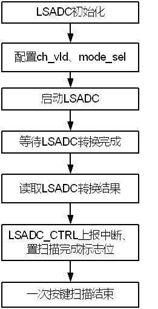

连续扫描处理流程

滤毛刺流程

滤毛刺电路采用多数判决算法。在滤毛刺窗口Tglitch中，如果出现多数次的ADC采样值value，且value不为空按键时ADC采样值，则认为value为一次有效的按键值，否则认为是一个毛刺信号。

- 在单次读取模式，不进行滤毛刺操作。
- 在连续扫描模式下，使能虑毛刺功能，需要设置合适的虑毛刺时间窗口Tglitch。请参考LSADC\_CTRL1寄存器的描述。

采样精度设置

通过LSADC\_CTRL9 [9:0]可以设置采样精度，可以根据应用需要设置对应的采样精度。

- 当采样精度设置成10bit时，采样结果10bit全部有效。
- 当采样精度设置小于10bit时，对应的采样结果高位有效，例如：当采样精度设置成8bit时，采样结果的高8bit才有效。

平均算法设置

通过LSADC\_CTRL9 [12]可以选择通道采样的平均算法模式，可以根据应用需要设置对应的平均算法模式。请参考LSADC\_CTRL0寄存器的描述。

- 单次读取模式，不支持采样平均算法操作。
- 连续扫描模式，可选择16次或32次平均算法。

以使能16次平均算法模式为例，连续扫描模式下通道平均算法示意图如图14-67所示。

16次平均算法处理流程

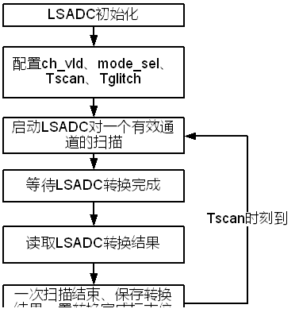

### LSADC寄存器概览

LSADC寄存器概览如表14-32所示。

LSADC寄存器概览（基地址：0x0\_1108\_0000）

| 偏移地址 | 名称 | 描述 | 页码 |
| --- | --- | --- | --- |
| 0x0000 | LSADC\_CTRL0 | LSADC配置寄存器 | 14-285 |
| 0x0004 | LSADC\_CTRL1 | 滤毛刺配置寄存器 | 14-286 |
| 0x0008 | LSADC\_CTRL2 | 扫描间隔配置寄存器 | 14-287 |
| 0x0010 | LSADC\_CTRL4 | 中断使能寄存器 | 14-287 |
| 0x0014 | LSADC\_CTRL5 | 中断状态寄存器 | 14-287 |
| 0x0018 | LSADC\_CTRL6 | 中断清除寄存器 | 14-288 |
| 0x001C | LSADC\_CTRL7 | Start配置寄存器 | 14-289 |
| 0x0020 | LSADC\_CTRL8 | Stop配置寄存器 | 14-289 |
| 0x0024 | LSADC\_CTRL9 | 转换结果精度寄存器 | 14-289 |
| 0x0028 | LSADC\_CTRL10 | LSADC\_ZERO寄存器 | 14-290 |
| 0x002C | LSADC\_CTRL11 | LSADC通道0数据寄存器 | 14-290 |
| 0x0030 | LSADC\_CTRL12 | LSADC通道1数据寄存器 | 14-290 |
| 0x0034 | LSADC\_CTRL13 | LSADC通道2数据寄存器 | 14-291 |
| 0x0038 | LSADC\_CTRL14 | LSADC通道3数据寄存器 | 14-291 |
| 0x0050 | LSADC\_CTRL20 | LSADC通道0平均算法数据寄存器 | 14-291 |
| 0x0054 | LSADC\_CTRL21 | LSADC通道1平均算法数据寄存器 | 14-292 |
| 0x0058 | LSADC\_CTRL22 | LSADC通道2平均算法数据寄存器 | 14-292 |
| 0x005C | LSADC\_CTRL23 | LSADC通道3平均算法数据寄存器 | 14-293 |

### LSADC寄存器描述

#### LSADC\_CTRL0

LSADC\_CTRL0为LSADC配置寄存器。

Offset Address: 0x0000 Total Reset Value: 0x0000\_800F

| Bits | Access | Name | Description | Reset |
| --- | --- | --- | --- | --- |
| [31:24] | - | reserved | 保留。 | 0x00 |
| [23:20] | RW | lsadc\_data\_delta | LSADC转换结果误差范围(在连续扫描模式下使用，使用确定两次转换结果间的误差范围，在误差范围内，则认定两次转换结果相同)。 | 0x0 |
| [19:18] | - | reserved | 保留。 | 0x0 |
| [17] | RW | deglitch\_bypass | 滤毛刺功能bypass。(此功能在连续扫描模式下使用)  0：使能滤毛刺功能；  1：bypass。 | 0x0 |
| [16] | - | reserved | 保留。 | 0x0 |
| [15] | RW | lsadc\_reset | 设置LSADC是否进入复位状态。  1：进入复位状态；  0：退出复位状态。 | 0x1 |
| [14] | - | reserved | 保留。 | 0x0 |
| [13] | RW | model\_sel | LSADC扫描模式选择。  0：单次扫描模式；  1：连续扫描模式。 | 0x0 |
| [12] | RW | equ\_model\_sel | LSADC平均算法模式选择。  0：16次平均算法模式；  1：32次平均算法模式。 | 0x0 |
| [11] | RW | ch\_3\_vld | LSADC通道3是否有效。  0：无效；  1：有效。 | 0x0 |
| [10] | RW | ch\_2\_vld | LSADC通道2是否有效。  0：无效；  1：有效。 | 0x0 |
| [9] | RW | ch\_1\_vld | LSADC通道1是否有效。  0：无效；  1：有效。 | 0x0 |
| [8] | RW | ch\_0\_vld | LSADC通道0是否有效。  0：无效；  1：有效。 | 0x0 |
| [7:4] | - | reserved | 保留。 | 0x3F |
| [3] | RW | ch\_3\_ eq\_enable | LSADC通道3采样平均算法是否有效。  0：无效；  1：有效。 | 0x1 |
| [2] | RW | ch\_2\_ eq\_enable | LSADC通道2采样平均算法是否有效。  0：无效；  1：有效。 | 0x1 |
| [1] | RW | ch\_1\_ eq\_enable | LSADC通道1采样平均算法是否有效。  0：无效；  1：有效。 | 0x1 |
| [0] | RW | ch\_0\_ eq\_enable | LSADC通道0采样平均算法是否有效。  0：无效；  1：有效。 | 0x1 |

#### LSADC\_CTRL1

LSADC\_CTRL1为滤毛刺配置寄存器。

Offset Address: 0x0004 Total Reset Value: 0x0000\_0000

|  |  |  |  |  |
| --- | --- | --- | --- | --- |
| Bits | Access | Name | Description | Reset |
| [31:0] | RW | glitch\_sample | 滤毛刺时间窗口(当LSADC的转换结果在此时间窗口内保持不变时，则认为此转换结果为有效值，否则则认为是毛刺，此窗口值一般设为ms级，在连续扫描模式下不能配置为0)。 | 0x00000000 |

#### LSADC\_CTRL2

LSADC\_CTRL2为扫描间隔配置寄存器。

Offset Address: 0x0008 Total Reset Value: 0x0000\_0000

|  |  |  |  |  |
| --- | --- | --- | --- | --- |
| Bits | Access | Name | Description | Reset |
| [31:0] | RW | time\_scan | 在连续扫描模式下，两个扫描通道之间连续扫描的时间间隔。时间间隔为 Tscan=time\_scan\*0.333us(连续扫描时间间隔应该大于LSADC的转换时间，即配置值不能少于0x20)。 | 0x00000000 |

#### LSADC\_CTRL4

LSADC\_CTRL4为中断使能寄存器。

Offset Address: 0x0010 Total Reset Value: 0x0000\_0000

|  |  |  |  |  |
| --- | --- | --- | --- | --- |
| Bits | Access | Name | Description | Reset |
| [31:1] | - | reserved | 保留。 | 0x00000000 |
| [0] | RW | int\_enable | 扫描值有效中断使能位。  0：不使能；  1：使能。 | 0x0 |

#### LSADC\_CTRL5

LSADC\_CTRL5为中断状态寄存器。

Offset Address: 0x0014 Total Reset Value: 0x0000\_0000

| Bits | Access | Name | Description | Reset |
| --- | --- | --- | --- | --- |
| [31:5] | - | reserved | 保留。  写无效，读为0。 | 0x00000000 |
| [4] | RO | lsadc\_auto\_busy | 在自动扫描模式下，LSADC busy状态指示。  0：IDLE；  1：BUSY。 | 0x0 |
| [3] | RO | int\_flag\_in3 | 通道3扫描值有效中断标志位。  0：无中断；  1：有中断。 | 0x0 |
| [2] | RO | int\_flag\_in2 | 通道2扫描值有效中断标志位。  0：无中断；  1：有中断。 | 0x0 |
| [1] | RO | int\_flag\_in1 | 通道1扫描值有效中断标志位。  0：无中断；  1：有中断。 | 0x0 |
| [0] | RO | int\_flag\_in0 | 通道0扫描值有效中断标志位。  0：无中断；  1：有中断。 | 0x0 |

#### LSADC\_CTRL6

LSADC\_CTRL6为中断清除寄存器。

Offset Address: 0x0018 Total Reset Value: 0x0000\_0000

|  |  |  |  |  |
| --- | --- | --- | --- | --- |
| Bits | Access | Name | Description | Reset |
| [31:4] | - | reserved | 保留。 | 0x0000000- |
| [3] | WO | clr\_int\_flag\_in3 | 通道3中断清除寄存器。  0：不清除；  1：清除中断。 | 0x0 |
| [2] | WO | clr\_int\_flag\_in2 | 通道2中断清除寄存器。  0：不清除；  1：清除中断。 | 0x0 |
| [1] | WO | clr\_int\_flag\_in1 | 通道1中断清除寄存器。  0：不清除；  1：清除中断。 | 0x0 |
| [0] | WO | clr\_int\_flag\_in0 | 通道0中断清除寄存器。  0：不清除；  1：清除中断。 | 0x0 |

#### LSADC\_CTRL7

LSADC\_CTRL7为Start配置寄存器。

Offset Address: 0x001C Total Reset Value: 0x0000\_0000

|  |  |  |  |  |
| --- | --- | --- | --- | --- |
| Bits | Access | Name | Description | Reset |
| [31:0] | WO | start | LSADC启动信号(向此寄存器写任意值都可以启动LSADC)。 | 0x00000000 |

#### LSADC\_CTRL8

LSADC\_CTRL8为Stop配置寄存器。

Offset Address: 0x0020 Total Reset Value: 0x0000\_0000

|  |  |  |  |  |
| --- | --- | --- | --- | --- |
| Bits | Access | Name | Description | Reset |
| [31:0] | WO | stop | 停止自动扫描(在自动扫描模式下，向此寄存器写任意值都可以停止LSADC的自动扫描功能，需再写使能start才可以重新启动自动扫描) | 0x00000000 |

#### LSADC\_CTRL9

LSADC\_CTRL9为转换结果精度寄存器。

Offset Address: 0x0024 Total Reset Value: 0x0000\_03FF

| Bits | Access | Name | Description | Reset |
| --- | --- | --- | --- | --- |
| [31:10] | - | reserved | 保留。 | 0x000000 |
| [9:0] | RW | lsadc\_active\_bit | LSADC转换结果精度。  10'b1111111111表示10比特精度；  10'b1111111110表示9比特精度；  ……  10'b1000000000表示1比特精度 | 0x3FF |

#### LSADC\_CTRL10

LSADC\_CTRL10为LSADC\_ZERO寄存器。

Offset Address: 0x0028 Total Reset Value: 0x0000\_0000

|  |  |  |  |  |
| --- | --- | --- | --- | --- |
| Bits | Access | Name | Description | Reset |
| [31:10] | - | reserved | 保留。 | 0x000000 |
| [9:0] | RW | lsadc\_zero | 键盘无键按下时LSADC的值。 | 0x000 |

#### LSADC\_CTRL11

LSADC\_CTRL11为LSADC通道0数据寄存器。

Offset Address: 0x002C Total Reset Value: 0x0000\_0000

|  |  |  |  |  |
| --- | --- | --- | --- | --- |
| Bits | Access | Name | Description | Reset |
| [31:10] | - | reserved | 保留。 | 0x000000 |
| [9:0] | RO | lsadc\_data\_in0 | LSADC通道0扫描值。 | 0x000 |

#### LSADC\_CTRL12

LSADC\_CTRL12为LSADC通道1数据寄存器。

Offset Address: 0x0030 Total Reset Value: 0x0000\_0000

|  |  |  |  |  |
| --- | --- | --- | --- | --- |
| Bits | Access | Name | Description | Reset |
| [31:10] | - | reserved | 保留。 | 0x000000 |
| [9:0] | RO | lsadc\_data\_in1 | LSADC 通道1扫描值。 | 0x000 |

#### LSADC\_CTRL13

LSADC\_CTRL13为LSADC通道2数据寄存器。

Offset Address: 0x0034 Total Reset Value: 0x0000\_0000

|  |  |  |  |  |
| --- | --- | --- | --- | --- |
| Bits | Access | Name | Description | Reset |
| [31:10] | - | reserved | 保留。 | 0x000000 |
| [9:0] | RO | lsadc\_data\_in0 | LSADC通道2扫描值。 | 0x000 |

#### LSADC\_CTRL14

LSADC\_CTRL14为LSADC通道3数据寄存器。

Offset Address: 0x0038 Total Reset Value: 0x0000\_0000

|  |  |  |  |  |
| --- | --- | --- | --- | --- |
| Bits | Access | Name | Description | Reset |
| [31:10] | - | reserved | 保留。 | 0x000000 |
| [9:0] | RO | lsadc\_data\_in0 | LSADC通道3扫描值。 | 0x000 |

#### LSADC\_CTRL20

LSADC\_CTRL20为LSADC通道0平均算法数据寄存器。

Offset Address: 0x0050 Total Reset Value: 0x0000\_0000

|  |  |  |  |  |
| --- | --- | --- | --- | --- |
| Bits | Access | Name | Description | Reset |
| [31:16] | - | reserved | 保留。 | 0x0000 |
| [15] | RO | lsadc\_equ\_value\_valid\_0 | LSADC通道0采样平均算法结果有效指示。  0：无效；  1：有效。 | 0x0 |
| [11:10] | - | reserved | 保留。 | 0x0 |
| [9:0] | RO | lsadc\_equ\_value\_0 | LSADC 通道0采样平均算法结果。 | 0x000 |

#### LSADC\_CTRL21

LSADC\_CTRL21为LSADC通道1平均算法数据。

Offset Address: 0x0054 Total Reset Value: 0x0000\_0000

|  |  |  |  |  |
| --- | --- | --- | --- | --- |
| Bits | Access | Name | Description | Reset |
| [31:16] | - | reserved | 保留。 | 0x0000 |
| [15] | RO | lsadc\_equ\_value\_valid\_1 | LSADC通道1采样平均算法结果有效指示。  0：无效；  1：有效。 | 0x0 |
| [11:10] | - | reserved | 保留。 | 0x0 |
| [9:0] | RO | lsadc\_equ\_value\_1 | LSADC 通道1采样平均算法结果。 | 0x000 |

#### LSADC\_CTRL22

LSADC\_CTRL22为LSADC通道2平均算法数据寄存器。

Offset Address: 0x0058 Total Reset Value: 0x0000\_0000

|  |  |  |  |  |
| --- | --- | --- | --- | --- |
| Bits | Access | Name | Description | Reset |
| [31:16] | - | reserved | 保留。 | 0x0000 |
| [15] | RO | lsadc\_equ\_value\_valid\_2 | LSADC通道2采样平均算法结果有效指示。  0：无效；  1：有效。 | 0x0 |
| [11:10] | - | reserved | 保留。 | 0x0 |
| [9:0] | RO | lsadc\_equ\_value\_2 | LSADC 通道2采样平均算法结果。 | 0x000 |

#### LSADC\_CTRL23

LSADC\_CTRL23为LSADC通道3平均算法数据寄存器。

Offset Address: 0x005C Total Reset Value: 0x0000\_0000

|  |  |  |  |  |
| --- | --- | --- | --- | --- |
| Bits | Access | Name | Description | Reset |
| [31:16] | - | reserved | 保留。 | 0x0000 |
| [15] | RO | lsadc\_equ\_value\_valid\_3 | LSADC通道3采样平均算法结果有效指示。  0：无效；  1：有效。 | 0x0 |
| [11:10] | - | reserved | 保留。 | 0x0 |
| [9:0] | RO | lsadc\_equ\_value\_3 | LSADC 通道3采样平均算法结果。 | 0x000 |

## PWM

### 概述

PWM为脉冲宽度调节信号模块，用来输出周期性脉冲信号。

芯片提供3组PWM控制器：

- PWM0：最多提供16路脉冲宽度调制信号输出。其中PWM0\_OUT15支持三对互补信号输出。
- PWM1：最多提供16路脉冲宽度调制信号输出。其中 PWM1\_OUT0/PWM1\_OUT1这两路各支持三对互补信号输出。
- SVB\_PWM：最多提供3路脉冲宽度调制信号输出。

### 特点

对于每组PWM控制器：

- 工作时钟
- PWM0支持200MHz/Sensor clk0~3(详见3.2.6章节PERI\_CRG4450)切换。
- PWM1/SVB\_PWM固定200MHz。
- 支持预分频，分频比可配，最大支持256分频。
- 每路PWM输出支持独立使能。
- 支持周期方波输出模式，周期可配。
- 支持固定数目方波输出模式，方波数目可配。
- 支持脉冲信号左对齐、右对齐、中间对齐。
- 支持脉冲信号极性可控。
- 支持周期、占空比、对齐模式、极性等配置动态更新。
- 支持多路PWM信号同步输出，支持单次同步输出和循环输出两种同步模式。
- 支持占空比配置范围：0%~100%（占空比0%一直是低电平，占空比100%一直是高电平，配置流程如14.11.3.5 章节所示）。
- 支持周期配置范围：1Hz~10MHz。

### 工作方式

#### 对齐模式

PWM输出的脉冲信号支持三种模式：左对齐，右对齐和中间对齐。可以通过配置PWM(x)\_ctrl. pwm(x)\_align\_mode\_cfg来设置每路PWM输出的脉冲对齐模式。

#### 左对齐模式

左对齐输出波形

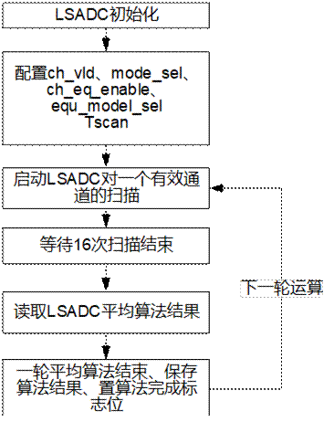

将PWM(x)\_ctrl. pwm(x)\_align\_mode\_cfg 配置为 1。左对齐模式。

该模式下，PWM先根据占空比配置输出有效信号电平，再输出无效信号电平直到配置的周期输出完成。

有效信号电平默认为高，并可以通过配置PWM(x)\_ctrl.pwm(x)\_inv\_cfg来控制。当PWM(x)\_ctrl.pwm(x)\_inv\_cfg配置为1时，有效信号电平为低，对应的波形为PWM\_INV。

#### 右对齐模式

右对齐输出波形

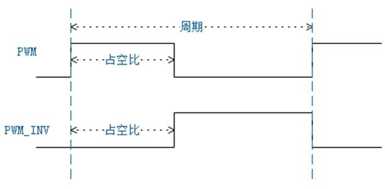

将PWM(x)\_ctrl.pwm(x)\_align\_mode\_cfg配置为0，PWM输出为右对齐模式。该模式下，PWM先输出无效信号电平，再根据占空比配置输出有效信号电平。

有效信号电平默认为高，并可以通过配置PWM(x)\_ctrl.pwm(x)\_inv\_cfg来控制。当PWM(x)\_ctrl.pwm(x)\_inv\_cfg配置为1时，有效信号电平为低，对应的波形为PWM\_INV。

#### 中间对齐模式

<strong><big>须知</big></strong>

中间对齐模式下仅支持占空比和周期数为偶数。

中间对齐输出波形

将PWM(x)\_ctrl.pwm(x)\_align\_mode\_cfg配置为2，PWM输出为中间对齐模式。

PWM先输出无效信号电平，再按占空比配置输出有效信号电平，最后再输出无效信号电平。整个周期中，有效信号电平位于中央。

有效信号电平默认为高，并可以通过配置PWM(x)\_ctrl.pwm(x)\_inv\_cfg来控制。当PWM(x)\_ctrl.pwm(x)\_inv\_cfg配置为1时，有效信号电平为低，对应的波形为PWM\_INV。

#### 互补输出

每路PWM最多可以支持三对互补信号输出，信号为PWM\_OUT(x)\_0\_P/ PWM\_OUT(x)\_0\_N/ PWM\_OUT(x)\_1\_P/ PWM\_OUT(x)\_1\_P/ PWM\_OUT(x)\_2\_P/ PWM\_OUT(x)\_2\_N。其中P/N为互补信号，互为反相输出。

三对互补信号共用一个脉冲周期配置，通过PWM(x)\_period\_cfg来配置。每对信号的占空比支持各自独立配置，分别通过 PWM(x)\_duty0\_cfg、PWM(x)\_duty1\_cfg、PWM(x)\_duty2\_cfg来控制。

其输出波形如图14-71：

三对互补信号输出波形

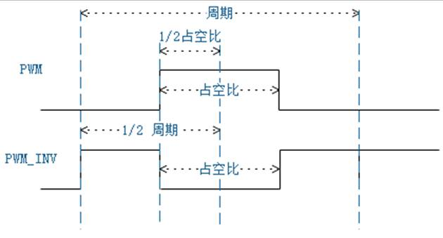

同时也可以支持与对齐模式的配置组合，如配置成中间对齐模式的时候，输出波形如图14-72：

三对互补信号中间对齐时输出波形

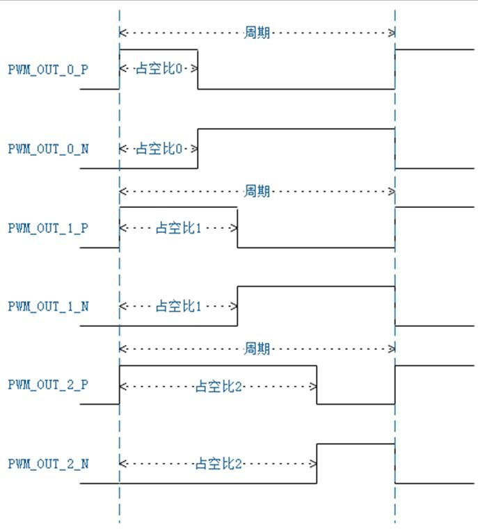

#### 死区控制

互补信号输出模式还支持死区控制。即当输出信号从无效状态转变成有效状态时，延时若干个时钟周期后生效。

每路PWM提供两组死区延时时间配置寄存器（PWM(x)\_dt\_value\_cfg.PWM(x)\_dt\_a\_cfg/PWM(x)\_dt\_value\_cfg.PWM(x)\_dt\_b\_cfg）。当死区时间配置为0时，即无死区延时。每一个PWM信号都可以通过寄存器PWM(x)\_dt\_ctrl\_cfg配置来选择各自的死区时间。

死区控制打开后的互补信号输出的波形请参考图14-73。

死区控制输出波形

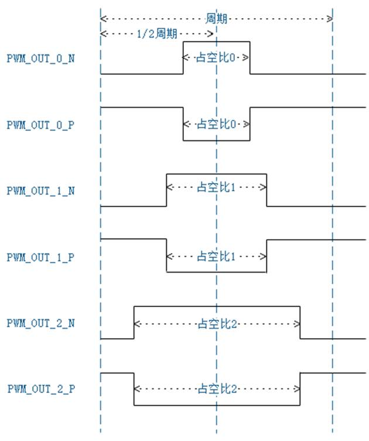

#### 同步模式

<strong><big>须知</big></strong>

同步工作模式不支持预分频功能；即寄存器PWM(x)\_ctrl中pwm(x)\_pre\_div\_sel\_cfg必须设置为0x0。

每个PWM控制器提供的多路PWM信号进行同步输出，各路的同步延时独立可配，如图14-74所示。

同步模式输出波形

从起始点START开始，各路PWM根据PWM(x)\_sync\_delay\_cfg寄存器配置来延时启动各自的PWM。每路PWM的周期，占空比，对齐方式等可以独立配置。

PWM同步模式下支持触发模式和循环输出两种模式。

- 触发模式（适用于输出若干个脉冲信号）

每路PWM输出信号完成配置脉冲输出信号数目后，则停止输出。直到下一次START启动为止。

注：触发模式需要把PWM(x)\_sync\_cfg.pwm(x)\_sync\_mux同步源头设置为非工作状态的PWM输出。

- 循环模式（周期性输出脉冲信号）

每路PWM通过PWM(x)\_sync\_cfg.pwm(x)\_sync\_mux来配置同步源头，当同步源头对应的PWM信号完成所配置PWM输出后，相关同步每一路PWM都会进行一次重载，重新进行START状态，以此实现周期性的输出。

注：循环模式设置同步延时(PWM(x)\_sync\_delay\_cfg)的情况下，需要保证PWM(x)\_sync\_cfg.pwm(x)\_sync\_mux同步源头的延时值最小。

### 配置流程

#### 通用模式

配置流程如下：

配置对应的CRG寄存器（PERI\_CRG4448/PERI\_CRG4450/PERI\_CRG4452），打开时钟门控。

选择合适的预分频比，并写入寄存器PWM(x)\_ctrl[11:8]。

通过计算得到需要的周期数和高电平拍数，并写入寄存器PWM(x)\_duty0\_cfg/PWM(x)\_duty1\_cfg/PWM(x)\_duty2\_cfg、PWM(x)\_period。

如果需要周期性输出脉冲信号，将寄存器PWM(x)\_ctrl[2]位域配置为1。如果需要输出固定个数脉冲信号，将寄存器PWM(x)\_ctrl[2]配置为0，并将脉冲个数写入寄存器PWM(x)\_num\_cfg。

根据是否需要死区控制，配置寄存器PWM(x)\_dt\_value\_cfg和PWM(x)\_dt\_ctrl\_cfg。

根据输出脉冲信号对齐方式配置寄存器PWM(x)\_ctrl[5:4]。

根据输出脉冲信号极性需求配置寄存器PWM(x)\_ctrl[1]。

配置脉冲使能寄存器PWM(x)\_ctrl[0]，写入1，使能PWM输出。

---结束

例如：需要输出1个频率为4KHz，高电平占72.5%（即占空比），脉冲个数为10的波形，脉冲右对齐。

选择预分频系数为2分频，周期数配置为200MHz/2\*1/4KHz=25000，四舍五入后为25000，十六进制为0x00061A8。高电平数配置为25000（周期数）x 72.5%（占空比）=18125，四舍五入后为18125，十六进制为0x00046CD。

按如下步骤进行寄存器操作，即可输出所需要的波形：

配置对应的CRG寄存器（如PERI\_CRG4450[4]）写入0x1，打开PWM时钟。

配置PWM(x)\_ctrl寄存器为0x100。

向PWM(x)\_period\_cfg写入0x00061A7。

向PWM(x)\_duty0\_cfg写入0x00046CC。

向PWM(x)\_num\_cfg 写入0x9。

向PWM(x)\_ctrl写入0x101（仅更新bit[0]）。

读取PWM(x)\_ctrl\_st bit[0]，等待bit0位为1（表示PWM正在输出方波）

读取PWM(x)\_period和0x00061A7进行校验。

读取PWM(x)\_duty0和0x00046CC进行校验。

读取PWM(x)\_num bit[15:0]和0x09进行校验(当PWM(x)\_ctrl\_st bit[0]为1时表示PWM正在输出方波，当该位为0时表示已经输出完设定的方波数目)。

----结束

#### 占空比0%和100%配置方法

#### 占空比100%配置流程

例如：需要输出1个高电平。

选择预分频系数为2分频，周期数配置为200MHz/2\*1/4KHz=25000，四舍五入后为25000，十六进制为0x00061A8。高电平数配置为25000（周期数）x100%（占空比）=25000，四舍五入后为25000，十六进制为0x00061A8。

按如下步骤进行寄存器操作，即可输出所需要的波形：

配置对应的CRG寄存器（如PERI\_CRG4450[4]）写入0x1，打开PWM时钟。

配置PWM(x)\_ctrl寄存器为0x104。

向PWM(x)\_period\_cfg写入0x00061A7。

向PWM(x)\_duty0\_cfg写入0x00061A7。

向PWM(x)\_ctrl写入0x105（仅更新bit[0]）。

----结束

#### 占空比0%配置流程

例如：需要输出1个低电平。

选择预分频系数为2分频，周期数配置为200MHz/2\*1/4KHz=25000，四舍五入后为25000，十六进制为0x00061A8。低电平数配置为25000（周期数）x100%（占空比）=25000，四舍五入后为25000，十六进制为0x00061A8。

按如下步骤进行寄存器操作，即可输出所需要的波形：

配置对应的CRG寄存器（如PERI\_CRG4450[4]）写入0x1，打开PWM时钟。

配置PWM(x)\_ctrl寄存器为0x106。（配置PWM正相输出占空比为100%，即PWM反相输出占空比为0%。这里配置pwm(x)\_inv\_cfg寄存器为1，PWM输出反相）

向PWM(x)\_period\_cfg写入0x00061A7。

向PWM(x)\_duty0\_cfg写入0x00061A7。

向PWM(x)\_ctrl写入0x107（仅更新bit[0]）。

----结束

#### 同步模式

同步模式配置流程如下：

配置PWM同步模式，PWM(x)\_sync\_cfg bit[5]配置为0x1。

根据触发模式或循环模式配置寄存器。

触发模式：PWM(x)\_sync\_cfg bit[4]配置为0。

注：触发模式需要把PWM(x)\_sync\_cfg.pwm(x)\_sync\_mux同步源头设置为非工作状态的PWM输出。

循环模式：PWM(x)\_sync\_cfg bit[5]配置为1。并根据需要配置PWM重载信号源头，配置PWM(x)\_sync\_cfg bit[3:0]

注：循环模式设置同步延时(PWM(x)\_sync\_delay\_cfg)的情况下，需要保证PWM(x)\_sync\_cfg.pwm(x)\_sync\_mux同步源头的延时值最小。

配置PWM信号的模式（同通用模式的步骤1~8）

配置PWM\_sync\_start寄存器的对应bit启动PWM。

例如：需要同步启动PWM0、PMW1、PMW5，则在PWM\_sync\_start寄存器写入0x23。

----结束

### 寄存器偏移地址变量表寄存器概览

PWM0寄存器基地址：0x0\_110B\_0000

PWM1寄存器基地址：0x0\_1102\_D000

SVB\_PWM寄存器基地址：0x0\_1102\_9000

各模块的寄存器偏移地址中变量的取值范围和含义如表14-33所示。

各模块的寄存器偏移地址变量表

| 变量名称 | 取值范围 | 描述 |
| --- | --- | --- |
| x | 0～15 | PWM模块的16个通道 |

### PWM寄存器概览

PWM寄存器概览如表14-34所示。

PWM寄存器概览

| 偏移地址 | 名称 | 描述 | 页码 |
| --- | --- | --- | --- |
| 0x0000＋0x100×x | PWM(x)\_period\_cfg | PWM(x)周期配置寄存器 | 14-306 |
| 0x0004＋0x100×x | PWM(x)\_duty0\_cfg | PWM(x)占空比0配置寄存器 | 14-306 |
| 0x0008＋0x100×x | PWM(x)\_duty1\_cfg | PWM(x)占空比1配置寄存器 | 14-306 |
| 0x000C＋0x100×x | PWM(x)\_duty2\_cfg | PWM(x)占空比2配置寄存器 | 14-306 |
| 0x0010＋0x100×x | PWM(x)\_num\_cfg | PWM(x)输出方波数目配置寄存器 | 14-307 |
| 0x0014＋0x100×x | PWM(x)\_ctrl | PWM(x)工作模式配置寄存器 | 14-307 |
| 0x0020＋0x100×x | PWM(x)\_dt\_value\_cfg | PWM(x)死区时间配置寄存器 | 14-308 |
| 0x0024＋0x100×x | PWM(x) \_dt\_ctrl\_cfg | PWM(x)死区时间选择配置寄存器 | 14-309 |
| 0x0030＋0x100×x | PWM(x)\_sync\_cfg | PWM(x)同步模式配置寄存器 | 14-309 |
| 0x0034＋0x100×x | PWM(x)\_sync\_delay\_cfg | PWM(x)同步延时配置寄存器 | 14-311 |
| 0x0040＋0x100×x | PWM(x)\_period | PWM(x)实时周期回读寄存器 | 14-311 |
| 0x0044＋0x100×x | PWM(x)\_duty0 | PWM(x)实时占空比0回读寄存器 | 14-311 |
| 0x0048＋0x100×x | PWM(x)\_duty1 | PWM(x)实时占空比1回读寄存器 | 14-311 |
| 0x004C＋0x100×x | PWM(x)\_duty2 | PWM(x)实时占空比2回读寄存器 | 14-312 |
| 0x0050＋0x100×x | PWM(x)\_num | PWM(x)方波数量实时回读寄存器。 | 14-312 |
| 0x0054＋0x100×x | PWM(x)\_ctrl\_st | PWM(x)实时工作状态回读寄存器 | 14-312 |
| 0x0060＋0x100×x | PWM(x)\_dt\_value | PWM(x)实时死区时间回读寄存器 | 14-313 |
| 0x0064＋0x100×x | PWM(x) \_dt\_ctrl | PWM(x)实时死区时间选择回读寄存器 | 14-314 |
| 0x0074＋0x100×x | PWM(x)\_sync\_delay | PWM(x)实时同步延时配置回读寄存器 | 14-315 |
| 0xFF0 | PWM\_sync\_start | PWM同步启动使能寄存器 | 14-315 |

### PWM寄存器描述

#### PWM(x)\_period\_cfg

PWM(x)\_period\_cfg为PWM(x)周期配置寄存器。

Offset Address: 0x0000＋0x100×x Total Reset Value: 0x0000\_0000

|  |  |  |  |  |
| --- | --- | --- | --- | --- |
| Bits | Access | Name | Description | Reset |
| [31:0] | RW | pwm(x)\_period\_cfg | PWM x 周期配置。单位：时钟周期，实际值减一配置。 | 0x00000000 |

#### PWM(x)\_duty0\_cfg

PWM(x)\_duty0\_cfg为PWM(x)占空比0配置寄存器。

Offset Address: 0x0004＋0x100×x Total Reset Value: 0x0000\_0000

|  |  |  |  |  |
| --- | --- | --- | --- | --- |
| Bits | Access | Name | Description | Reset |
| [31:0] | RW | pwm(x)\_duty0\_cfg | PWM x 有效信号占空比0配置。单位：时钟周期，实际值减一配置。 | 0x00000000 |

#### PWM(x)\_duty1\_cfg

PWM(x)\_duty1\_cfg为PWM(x)占空比1配置寄存器。

Offset Address: 0x0008＋0x100×x Total Reset Value: 0x0000\_0000

|  |  |  |  |  |
| --- | --- | --- | --- | --- |
| Bits | Access | Name | Description | Reset |
| [31:0] | RW | pwm(x)\_duty1\_cfg | PWM x 有效信号占空比1配置。单位：时钟周期，实际值减一配置。 | 0x00000000 |

#### PWM(x)\_duty2\_cfg

PWM(x)\_duty2\_cfg为PWM(x)占空比2配置寄存器。

Offset Address: 0x000C＋0x100×x Total Reset Value: 0x0000\_0000

|  |  |  |  |  |
| --- | --- | --- | --- | --- |
| Bits | Access | Name | Description | Reset |
| [31:0] | RW | pwm(x)\_duty2\_cfg | PWM x 有效信号占空比2配置。单位：时钟周期，实际值减一配置。 | 0x00000000 |

#### PWM(x)\_num\_cfg

PWM(x)\_num\_cfg为PWM(x)输出方波数目配置寄存器。

Offset Address: 0x0010＋0x100×x Total Reset Value: 0x0000\_0000

|  |  |  |  |  |
| --- | --- | --- | --- | --- |
| Bits | Access | Name | Description | Reset |
| [31:16] | - | reserved | 保留。 | 0x0000 |
| [15:0] | RW | pwm(x)\_num\_cfg | PWM x 输出方波的数目配置。实际值减一配置。  只在pwm(x)\_keep配置为0时才生效。 | 0x0000 |

#### PWM(x)\_ctrl

PWM(x)\_ctrl为PWM(x)工作模式配置寄存器。

Offset Address: 0x0014＋0x100×x Total Reset Value: 0x0000\_0000

| Bits | Access | Name | Description | Reset |
| --- | --- | --- | --- | --- |
| [31:12] | - | reserved | 保留。 | 0x00000 |
| [11:8] | RW | pwm(x)\_pre\_div\_sel\_cfg | PWM x预分频控制。  0x0：不分频；  0x1：2分频；  0x2：4分频；  0x3：8分频；  0x4：16分频；  0x5：32分频；  0x6：64分频；  0x7：128分频；  0x8：256分频；  其他：不分频。 | 0x0 |
| [7:6] | - | reserved | 保留。 | 0x0 |
| [5:4] | RW | pwm(x)\_align\_mode\_cfg | PWM x对齐模式控制。  00：右对齐模式；  01：左对齐模式；  10：中间对齐模式；  其他：保留。 | 0x0 |
| [3] | - | reserved | 保留。 | 0x0 |
| [2] | RW | pwm(x)\_keep\_cfg | PWM x输出模式控制。  0：输出pwm(x)\_num个方波；  1：一直输出方波。 | 0x0 |
| [1] | RW | pwm(x)\_inv\_cfg | PWM x输出正反相控制。  0：正常；  1：反相。 | 0x0 |
| [0] | RW | pwm(x)\_enable | PWM x使能控制。  0：关闭；  1：使能。 | 0x0 |

#### PWM(x)\_dt\_value\_cfg

PWM(x)\_dt\_value\_cfg为PWM(x) 死区时间配置寄存器。

Offset Address: 0x0020＋0x100×x Total Reset Value: 0x0000\_0000

|  |  |  |  |  |
| --- | --- | --- | --- | --- |
| Bits | Access | Name | Description | Reset |
| [31:16] | RW | pwm(x)\_dt\_b\_cfg | PWM x死区时间B，单位周期。0代表无死区。 | 0x0000 |
| [15:0] | RW | pwm(x)\_dt\_a\_cfg | PWM x死区时间A，单位周期。0代表无死区。 | 0x0000 |

#### PWM(x)\_dt\_ctrl\_cfg

PWM(x)\_dt\_ctrl\_cfg为PWM(x) 死区时间选择配置寄存器。

Offset Address: 0x0024＋0x100×x Total Reset Value: 0x0000\_0000

| Bits | Access | Name | Description | Reset |
| --- | --- | --- | --- | --- |
| [31:6] | - | reserved | 保留。 | 0x0000000 |
| [5] | RW | pwm(x)\_dts\_out\_2n\_cfg | PWM\_OUT(x)\_2\_N死区时间选择控制：  0：选择死区时间A；  1：选择死区时间B。 | 0x0 |
| [4] | RW | pwm(x)\_dts\_out\_2p\_cfg | PWM\_OUT(x)\_2\_P死区时间选择控制：  0：选择死区时间A；  1：选择死区时间B。 | 0x0 |
| [3] | RW | pwm(x)\_dts\_out\_1n\_cfg | PWM\_OUT(x)\_1\_N死区时间选择控制：  0：选择死区时间A；  1：选择死区时间B。 | 0x0 |
| [2] | RW | pwm(x)\_dts\_out\_1p\_cfg | PWM\_OUT(x)\_1\_P死区时间选择控制：  0：选择死区时间A；  1：选择死区时间B。 | 0x0 |
| [1] | RW | pwm(x)\_dts\_out\_0n\_cfg | PWM\_OUT(x)\_0\_N死区时间选择控制：  0：选择死区时间A；  1：选择死区时间B。 | 0x0 |
| [0] | RW | pwm(x)\_dts\_out\_0p\_cfg | PWM\_OUT(x)\_0\_P死区时间选择控制：  0：选择死区时间A；  1：选择死区时间B。 | 0x0 |

#### PWM(x)\_sync\_cfg

PWM(x)\_sync\_cfg为PWM(x)同步模式配置寄存器。

Offset Address: 0x0030＋0x100×x Total Reset Value: 0x0000\_0000

| Bits | Access | Name | Description | Reset |
| --- | --- | --- | --- | --- |
| [31:6] | - | reserved | 保留。 | 0x0000000 |
| [5] | RW | pwm(x)\_sync\_enable | PWM同步工作模式使能。  0：普通模式；  1：开启同步工作模式，由PWM\_SYNC\_START启动PWM功能。 | 0x0 |
| [4] | RW | pwm(x)\_sync\_mode | PWM同步模式选择。  0：触发模式；  1：循环模式。 | 0x0 |
| [3:0] | RW | pwm(x)\_sync\_mux | 循环模式的重载信号源头选择。  0x0：来自PWM0 完成信号；  0x1：来自PWM1完成信号；  0x2：来自PWM2完成信号；  0x3：来自PWM3完成信号；  0x4：来自PWM4完成信号；  0x5：来自PWM5完成信号；  0x6：来自PWM6完成信号；  0x7：来自PWM7完成信号；  0x8：来自PWM8完成信号；  0x9：来自PWM9完成信号；  0xa：来自PWM10完成信号；  0xb：来自PWM11完成信号；  0xc：来自PWM12完成信号；  0xd：来自PWM13完成信号；  0xe：来自PWM14完成信号；  0xf：来自PWM15完成信号。 | 0x0 |

#### PWM(x)\_sync\_delay\_cfg

PWM(x)\_sync\_delay\_cfg为PWM(x)同步延时配置寄存器。

Offset Address: 0x0034＋0x100×x Total Reset Value: 0x0000\_0000

|  |  |  |  |  |
| --- | --- | --- | --- | --- |
| Bits | Access | Name | Description | Reset |
| [31:0] | RW | pwm(x)\_sync\_delay\_cfg | PWM x同步模式启动延时配置寄存器。单位：周期，实际减一配置。 | 0x00000000 |

#### PWM(x)\_period

PWM(x)\_period为PWM(x)实时周期回读寄存器。

Offset Address: 0x0040＋0x100×x Total Reset Value: 0x0000\_0000

|  |  |  |  |  |
| --- | --- | --- | --- | --- |
| Bits | Access | Name | Description | Reset |
| [31:0] | RO | pwm(x)\_period | PWM x 周期生效值。 | 0x00000000 |

#### PWM(x)\_duty0

PWM(x)\_duty0为PWM(x)实时占空比0回读寄存器。

Offset Address: 0x0044＋0x100×x Total Reset Value: 0x0000\_0000

|  |  |  |  |  |
| --- | --- | --- | --- | --- |
| Bits | Access | Name | Description | Reset |
| [31:0] | RO | pwm(x)\_duty0 | PWM x 占空比0生效值。 | 0x00000000 |

#### PWM(x)\_duty1

PWM(x)\_duty1为PWM(x)实时占空比1回读寄存器。

Offset Address: 0x0048＋0x100×x Total Reset Value: 0x0000\_0000

|  |  |  |  |  |
| --- | --- | --- | --- | --- |
| Bits | Access | Name | Description | Reset |
| [31:0] | RO | pwm(x)\_duty1 | PWM x 占空比1生效值。 | 0x00000000 |

#### PWM(x)\_duty2

PWM(x)\_duty2为PWM(x)实时占空比2回读寄存器。

Offset Address: 0x004C＋0x100×x Total Reset Value: 0x0000\_0000

|  |  |  |  |  |
| --- | --- | --- | --- | --- |
| Bits | Access | Name | Description | Reset |
| [31:0] | RO | pwm(x)\_duty2 | PWM x 占空比2生效值。 | 0x00000000 |

#### PWM(x)\_num

PWM(x)\_num为PWM(x)方波数量实时回读寄存器。

Offset Address: 0x0050＋0x100×x Total Reset Value: 0x0000\_0000

|  |  |  |  |  |
| --- | --- | --- | --- | --- |
| Bits | Access | Name | Description | Reset |
| [31:16] | RO | pwm(x)\_num\_cnt | PWM x 还需要输出的方波数目。  只有当pwm(x)\_busy为1且pwm(x)\_keep为0时才有意义。 | 0x0000 |
| [15:0] | RO | pwm(x)\_num | PWM x 输出方波的数目生效值。 | 0x0000 |

#### PWM(x)\_ctrl\_st

PWM(x)\_ctrl\_st为PWM(x)实时工作状态回读寄存器。

Offset Address: 0x0054＋0x100×x Total Reset Value: 0x0000\_0000

| Bits | Access | Name | Description | Reset |
| --- | --- | --- | --- | --- |
| [31:12] | - | reserved | 保留。 | 0x00000 |
| [11:8] | RO | pwm(x)\_pre\_div\_sel | PWM x预分频生效值。  0x0：不分频；  0x1：2分频；  0x2：4分频；  0x3：8分频；  0x4：16分频；  0x5：32分频；  0x6：64分频；  0x7：128分频；  0x8：256分频；  其它：不分频。 | 0x0 |
| [7:6] | - | reserved | 保留。 | 0x0 |
| [5:4] | RO | pwm(x)\_align\_mode | PWM x对齐模式生效值。  0：右对齐模式；  1：左对齐模式；  2：中间对齐模式；  保留 | 0x0 |
| [3] | - | reserved | 保留。 | 0x0 |
| [2] | RO | pwm(x)\_keep | PWM x输出模式生效值。  0：输出PWM(x)\_num个方波；  1：一直输出方波。 | 0x0 |
| [1] | RO | pwm(x)\_inv | PWM x输出正反相生效值。  0：正常；  1：反相。 | 0x0 |
| [0] | RO | pwm(x)\_busy | PWM x工作状态。  0：空闲；  1：工作。 | 0x0 |

#### PWM(x)\_dt\_value

PWM(x)\_dt\_value为PWM(x) 实时死区时间回读寄存器。

Offset Address: 0x0060＋0x100×x Total Reset Value: 0x0000\_0000

|  |  |  |  |  |
| --- | --- | --- | --- | --- |
| Bits | Access | Name | Description | Reset |
| [31:16] | RO | pwm(x)\_dt\_b | PWM x死区时间B生效值。 | 0x0000 |
| [15:0] | RO | pwm(x)\_dt\_a | PWM x死区时间A生效值。 | 0x0000 |

#### PWM(x)\_dt\_ctrl

PWM(x)\_dt\_ctrl为PWM(x) 实时死区时间选择回读寄存器。

Offset Address: 0x0064＋0x100×x Total Reset Value: 0x0000\_0000

| Bits | Access | Name | Description | Reset |
| --- | --- | --- | --- | --- |
| [31:6] | - | reserved | 保留。 | 0x0000000 |
| [5] | RO | pwm(x)\_dts\_out\_2n | PWM\_OUT(x) \_2\_N死区时间生效状态：  0：选择死区时间A；  1：选择死区时间B。 | 0x0 |
| [4] | RO | pwm(x)\_dts\_out\_2p | PWM\_OUT(x)\_2\_P死区时间生效状态：  0：选择死区时间A；  1：选择死区时间B。 | 0x0 |
| [3] | RO | pwm(x)\_dts\_out\_1n | PWM\_out(x) \_1\_n死区时间生效状态：  0：选择死区时间A；  1：选择死区时间B。 | 0x0 |
| [2] | RO | pwm(x)\_dts\_out\_1p | PWM\_OUT(x)\_1\_P死区时间生效状态：  0：选择死区时间A；  1：选择死区时间B。 | 0x0 |
| [1] | RO | pwm(x)\_dts\_out\_0n | PWM\_OUT (x)\_0\_N死区时间生效状态：  0：选择死区时间A；  1：选择死区时间B。 | 0x0 |
| [0] | RO | pwm(x)\_dts\_out\_0p | PWM\_OUT(x)\_0\_P死区时间生效状态：  0：选择死区时间A；  1：选择死区时间B。 | 0x0 |

#### PWM(x)\_sync\_delay

PWM(x)\_sync\_delay为PWM(x)实时同步延时配置回读寄存器。

Offset Address: 0x0074＋0x100×x Total Reset Value: 0x0000\_0000

|  |  |  |  |  |
| --- | --- | --- | --- | --- |
| Bits | Access | Name | Description | Reset |
| [31:0] | RO | pwm(x)\_sync\_delay | PWM x同步模式启动延时配置生效值。 | 0x00000000 |

#### PWM\_sync\_start

PWM\_sync\_start为PWM同步启动使能寄存器。

Offset Address: 0xFF0 Total Reset Value: 0x0000\_0000

| Bits | Access | Name | Description | Reset |
| --- | --- | --- | --- | --- |
| [31:16] | - | resverd | 保留。 | 0x0000 |
| [15] | WO | pwm15\_sync\_start | PWM15启动配置寄存器，写1启动。 | 0x0 |
| [14] | WO | pwm14\_sync\_start | PWM14启动配置寄存器，写1启动。 | 0x0 |
| [13] | WO | pwm13\_sync\_start | PWM13启动配置寄存器，写1启动。 | 0x0 |
| [12] | WO | pwm12\_sync\_start | PWM12启动配置寄存器，写1启动。 | 0x0 |
| [11] | WO | pwm11\_sync\_start | PWM11启动配置寄存器，写1启动。 | 0x0 |
| [10] | WO | pwm10\_sync\_start | PWM10启动配置寄存器，写1启动。 | 0x0 |
| [9] | WO | pwm9\_sync\_start | PWM9启动配置寄存器，写1启动。 | 0x0 |
| [8] | WO | pwm8\_sync\_start | PWM8启动配置寄存器，写1启动。 | 0x0 |
| [7] | WO | pwm7\_sync\_start | PWM7启动配置寄存器，写1启动。 | 0x0 |
| [6] | WO | pwm6\_sync\_start | PWM6启动配置寄存器，写1启动。 | 0x0 |
| [5] | WO | pwm5\_sync\_start | PWM5启动配置寄存器，写1启动。 | 0x0 |
| [4] | WO | pwm4\_sync\_start | PWM4启动配置寄存器，写1启动。 | 0x0 |
| [3] | WO | pwm3\_sync\_start | PWM3启动配置寄存器，写1启动。 | 0x0 |
| [2] | WO | pwm2\_sync\_start | PWM2启动配置寄存器，写1启动。 | 0x0 |
| [1] | WO | pwm1\_sync\_start | PWM1启动配置寄存器，写1启动。 | 0x0 |
| [0] | WO | pwm0\_sync\_start | PWM0启动配置寄存器，写1启动。 | 0x0 |

