目 录

[2 硬件特性 2-1](#_Toc120364474)

[2.1 封装与管脚分布 2-1](#_Toc120364475)

[2.1.1 封装 2-1](#_Toc120364476)

[2.1.2 管脚分布 2-5](#_Toc120364477)

[2.2 管脚信息描述 2-6](#_Toc120364478)

[2.3 焊接工艺建议 2-6](#_Toc120364479)

[2.3.1 无铅回流焊工艺参数要求 2-6](#_Toc120364480)

[2.3.2 混合回流焊工艺参数要求 2-9](#_Toc120364481)

[2.4 潮敏参数 2-10](#_Toc120364482)

[2.4.1 产品防潮包装 2-11](#_Toc120364483)

[2.4.2 存放与使用 2-12](#_Toc120364484)

[2.4.3 重新烘烤 2-12](#_Toc120364485)

[2.5 电性能参数 2-13](#_Toc120364486)

[2.5.1 功耗参数 2-13](#_Toc120364487)

[2.5.2 温度和热阻参数 2-17](#_Toc120364488)

[2.5.3 工作条件 2-18](#_Toc120364489)

[2.5.4 上下电顺序 2-21](#_Toc120364490)

[2.5.5 DC/AC电气参数 2-21](#_Toc120364491)

[2.5.6 MIPI/LVDS Rx 电气参数 2-37](#_Toc120364492)

[2.5.7 MIPI Tx电气参数 2-40](#_Toc120364493)

[2.5.8 AUDIO CODEC电气参数 2-42](#_Toc120364494)

[2.5.9 PCIe 电气参数 2-43](#_Toc120364495)

[2.6 接口时序 2-43](#_Toc120364496)

[2.6.1 DDR接口时序 2-43](#_Toc120364497)

[2.6.2 NANDC接口时序 2-48](#_Toc120364498)

[2.6.3 SPI FLASH接口时序 2-51](#_Toc120364499)

[2.6.4 Ethernet MAC接口时序 2-53](#_Toc120364500)

[2.6.5 VI接口时序 2-57](#_Toc120364501)

[2.6.6 VO接口时序 2-58](#_Toc120364502)

[2.6.7 AIAO接口时序 2-59](#_Toc120364503)

[2.6.8 I2C时序 2-61](#_Toc120364504)

[2.6.9 SPI接口时序 2-62](#_Toc120364505)

[2.6.10 MIPI Rx接口时序 2-66](#_Toc120364506)

[2.6.11 MIPI Tx接口时序 2-67](#_Toc120364507)

[2.6.12 SDIO/MMC接口时序 2-69](#_Toc120364508)

插图目录

[图2-1 芯片封装顶视图 2-2](#_Toc120364509)

[图2-2 芯片封装底视图 2-3](#_Toc120364510)

[图2-3 芯片封装侧视图 2-3](#_Toc120364511)

[图2-4 Detail A放大图 2-4](#_Toc120364512)

[图2-5 凸台尺寸图 2-4](#_Toc120364513)

[图2-6 无铅回流焊接工艺曲线 2-7](#_Toc120364514)

[图2-7 封装体测温示意图 2-9](#_Toc120364515)

[图2-8 干燥真空包装材料示意图 2-11](#_Toc120364516)

[图2-9 DDR4/LPDDR4/LPDDR4X命令和地址相对于CK的写操作时序图 2-44](#_Toc120364517)

[图2-10 DDR4/LPDDR4/LPDDR4X DQS相对于CK的写操作时序图 2-44](#_Toc120364518)

[图2-11 DDR4 CK相对于DQS的读操作时序图 2-45](#_Toc120364519)

[图2-12 LPDDR4/LPDDR4X CK相对于DQS的读操作时序图 2-45](#_Toc120364520)

[图2-13 DDR4/LPDDR4/LPDDR4X DQS相对于DQ的读操作时序图 2-46](#_Toc120364521)

[图2-14 NANDC命令周期时序图 2-48](#_Toc120364522)

[图2-15 NANDC地址周期时序图 2-49](#_Toc120364523)

[图2-16 NANDC写数据时序图 2-50](#_Toc120364524)

[图2-17 NANDC读数据时序图 2-51](#_Toc120364525)

[图2-18 SPI FLASH输入方向时序图-SDR模式 2-51](#_Toc120364526)

[图2-19 SPI FLASH输入方向时序图-DDR模式 2-52](#_Toc120364527)

[图2-20 SPI FLASH输出方向时序图-SDR模式 2-52](#_Toc120364528)

[图2-21 SPI FLASH输出方向时序图-DDR模式 2-52](#_Toc120364529)

[图2-22 RMII接口100Mbit/s接收时序 2-53](#_Toc120364530)

[图2-23 RMII接口100Mbit/s发送时序 2-53](#_Toc120364531)

[图2-24 RMII接口10Mbit/s接收时序 2-54](#_Toc120364532)

[图2-25 RMII接口10Mbit/s发送时序 2-54](#_Toc120364533)

[图2-26 RMII接口时序参数 2-54](#_Toc120364534)

[图2-27 RGMII接口1000Mbit/s接收时序 2-55](#_Toc120364535)

[图2-28 RGMII接口1000Mbit/s发送时序 2-55](#_Toc120364536)

[图2-29 MDIO接口读时序 2-56](#_Toc120364537)

[图2-30 MDIO接口写时序 2-56](#_Toc120364538)

[图2-31 MDIO接口接收时序参数 2-57](#_Toc120364539)

[图2-32 VI接口时序图 2-57](#_Toc120364540)

[图2-33 BT.656接口时序 2-58](#_Toc120364541)

[图2-34 RGB接口时序 2-58](#_Toc120364542)

[图2-35 BT.1120接口时序 2-59](#_Toc120364543)

[图2-36 I2S接口接收时序图 2-59](#_Toc120364544)

[图2-37 I2S接口发送时序图 2-60](#_Toc120364545)

[图2-38 PCM接口接收时序图 2-60](#_Toc120364546)

[图2-39 PCM接口发送时序图 2-61](#_Toc120364547)

[图2-40 I2C传输时序图 2-61](#_Toc120364548)

[图2-41 SPICK时序 2-63](#_Toc120364549)

[图2-42 SPI主模式下接口时序（sph=1） 2-63](#_Toc120364550)

[图2-43 SPI主模式下接口时序（sph=0） 2-63](#_Toc120364551)

[图2-44 MIPI Rx DPHY/Sub-lvds/LVDS/HiSPi接口时钟数据时序图 2-66](#_Toc120364552)

[图2-45 MIPI Tx接口时钟数据时序图 2-68](#_Toc120364553)

[图2-46 eMMC DS/HS模式CMD/DATA输入/输出方向时序图 2-69](#_Toc120364554)

[图2-47 HS200模式的CMD/DATA输入输出方向时序图 2-71](#_Toc120364555)

[图2-48 HS400模式DATA输出方向时序图 2-72](#_Toc120364556)

[图2-49 HS400模式DATA输入方向时序图 2-73](#_Toc120364557)

[图2-50 HS400（Enhanced data strobe mode）模式CMD输入方向时序图 2-74](#_Toc120364558)

[图2-51 SDIO DS模式CMD/DATA输出方向时序图 2-75](#_Toc120364559)

[图2-52 SDIO DS模式CMD/DATA输入方向时序图 2-75](#_Toc120364560)

[图2-53 SDIO HS/SDR12/SDR25/SDR50/SDR104模式CMD/DATA输出方向时序图 2-76](#_Toc120364561)

[图2-54 SDIO HS/SDR12/SDR25/SDR50/SDR104模式CMD/DATA输入方向时序图 2-76](#_Toc120364562)

表格目录

[表2-1 封装参数说明 2-5](#_Toc120364641)

[表2-2 Hi3403V100管脚数目统计表 2-6](#_Toc120364642)

[表2-3 无铅回流焊工艺参数 2-7](#_Toc120364643)

[表2-4 IPC/JEDEC 020D中的无铅器件封装体耐温标准 2-8](#_Toc120364644)

[表2-5 混装回流焊工艺参数表 2-9](#_Toc120364645)

[表2-6 有铅器件封装体耐温标准 2-10](#_Toc120364646)

[表2-7 floor life参照表 2-12](#_Toc120364647)

[表2-8 重新烘烤参考表 2-13](#_Toc120364648)

[表2-9 各场景的功耗参数 2-14](#_Toc120364649)

[表2-10 各场景具体配置表 2-15](#_Toc120364650)

[表2-11 工作环境参数 2-18](#_Toc120364651)

[表2-12 Hi3403V100结温参数 2-18](#_Toc120364652)

[表2-14 使用SVB方案时，电源工作条件 2-19](#_Toc120364653)

[表2-15 常压电源工作条件 2-19](#_Toc120364654)

[表2-16 破坏性电压值 2-20](#_Toc120364655)

[表2-17 DC电气参数表(DVDD33=3.3V，IO5\_2) 2-21](#_Toc120364656)

[表2-18 DC电气参数表（DVDD18=1.8V，IO5\_2） 2-23](#_Toc120364657)

[表2-19 DC电气参数表（DVDD33=3.3V，IO5\_1） 2-25](#_Toc120364658)

[表2-20 DC电气参数表（DVDD18=1.8V，IO2/IO3/IO5\_1） 2-27](#_Toc120364659)

[表2-21 DC电气参数表（DVDD18=1.8V，IO4） 2-31](#_Toc120364660)

[表2-22 DC电气参数表（DVDD18=1.8V，IO6\_2） 2-32](#_Toc120364661)

[表2-23 DC电气参数表（DVDD18=1.8V，IO7\_1） 2-33](#_Toc120364662)

[表2-24 DC电气参数表（DVDD18=1.8V，IO7\_2） 2-34](#_Toc120364663)

[表2-25 AC和DC电气参数表-数据线（VDDIO\_DDR =1.2V，DDR4模式） 2-34](#_Toc120364664)

[表2-26 AC和DC电气参数表-地址/命令线（VDDIO\_DDR =1.2V，DDR4模式） 2-35](#_Toc120364665)

[表2-27 AC和DC电气参数表-数据线（VDDIO\_DDR =1.1V，LPDDR4模式） 2-35](#_Toc120364666)

[表2-28 AC和DC电气参数表CKE/RESET（VDDIO\_DDR =1.1V，LPDDR4模式） 2-36](#_Toc120364667)

[表2-29 AC和DC电气参数表-数据线（VDDIO\_DDR =0.6V，LPDDR4X模式） 2-36](#_Toc120364668)

[表2-30 AC和DC电气参数表CKE/RESET（VDDIO\_DDR =0.6V，LPDDR4X模式） 2-37](#_Toc120364669)

[表2-31 差分DC电气参数表 2-38](#_Toc120364670)

[表2-32 MIPI DPHY HS（High Speed）DC 参数表 2-39](#_Toc120364671)

[表2-33 MIPI DPHY HS（High Speed）AC 参数表 2-39](#_Toc120364672)

[表2-34 MIPI DPHY LP（Low Power）DC 参数表 2-39](#_Toc120364673)

[表2-35 MIPI DPHY LP（Low Power）AC 参数表 2-40](#_Toc120364674)

[表2-36 MIPI Tx LP DC 参数表 2-40](#_Toc120364675)

[表2-37 MIPI Tx LP AC 参数表 2-40](#_Toc120364676)

[表2-38 MIPI Tx HS DC 参数表 2-41](#_Toc120364677)

[表2-39 MIPI Tx HS AC 参数表 2-42](#_Toc120364678)

[表2-40 总体指标表 2-42](#_Toc120364679)

[表2-41 DAC主要指标表 2-42](#_Toc120364680)

[表2-42 ADC主要指标表 2-42](#_Toc120364681)

[表2-43 MICBIAS主要指标表 2-43](#_Toc120364682)

[表2-44 MICPGA主要指标 2-43](#_Toc120364683)

[表2-45 DDR4时钟参数表 2-46](#_Toc120364684)

[表2-46 LPDDR4/LPDDR4X时钟参数表 2-46](#_Toc120364685)

[表2-47 DDR4 SDRAM存储器参数表（DDR4-3200） 2-47](#_Toc120364686)

[表2-48 LPDDR4/LPDDR4X SDRAM存储器参数表（LPDDR4/LPDDR4X-3733） 2-47](#_Toc120364687)

[表2-49 NANDC命令周期时序参数表 2-48](#_Toc120364688)

[表2-50 NANDC地址周期时序参数表 2-49](#_Toc120364689)

[表2-51 NANDC写数据时序参数表 2-50](#_Toc120364690)

[表2-52 NANDC读数据时序参数表 2-51](#_Toc120364691)

[表2-53 SPI FLASH输入方向时序参数表 2-52](#_Toc120364692)

[表2-54 SPI FLASH输出方向时序参数表 2-53](#_Toc120364693)

[表2-55 RMII接口时序参数说明 2-54](#_Toc120364694)

[表2-56 RGMII接口时序参数说明 2-56](#_Toc120364695)

[表2-57 MDIO接口时序参数 2-57](#_Toc120364696)

[表2-58 VI接口时序参数表 2-58](#_Toc120364697)

[表2-59 BT.656接口时序参数表 2-58](#_Toc120364698)

[表2-60 RGB接口时序参数表 2-59](#_Toc120364699)

[表2-61 BT.1120接口时序参数表 2-59](#_Toc120364700)

[表2-62 I2S接口时序参数表 2-60](#_Toc120364701)

[表2-63 PCM接口时序参数表 2-61](#_Toc120364702)

[表2-64 I2C接口时序参数表 2-62](#_Toc120364703)

[表2-65 SPI接口时序参数 2-64](#_Toc120364704)

[表2-66 MIPI Rx DPHY/Sub-lvds/LVDS/HiSPi时序参数表 2-66](#_Toc120364705)

[表2-67 MIPI Tx DATA-CLOCK 时序参数表 2-68](#_Toc120364706)

[表2-68 eMMC DS模式CMD/DATA输入/输出时序参数表 2-70](#_Toc120364707)

[表2-69 eMMC HS模式CMD/DATA输入/输出时序参数表 2-70](#_Toc120364708)

[表2-70 HS200模式CMD/DATA输入/输出时钟时序参数表 2-71](#_Toc120364709)

[表2-71 HS400模式DATA输出时钟时序参数表 2-72](#_Toc120364710)

[表2-72 HS400模式DATA输入时序参数表 2-73](#_Toc120364711)

[表2-73 HS400（Enhanced data strobe mode）模式CMD输入时序参数表 2-74](#_Toc120364712)

[表2-74 SDIO DS模式输入/输出时序参数表 2-76](#_Toc120364713)

[表2-75 SDIO HS模式CMD/DATA输入/输出时钟时序参数表 2-77](#_Toc120364714)

[表2-76 SDIO SDR12模式CMD/DATA输入/输出时钟时序参数表 2-77](#_Toc120364715)

[表2-77 SDIO SDR25模式CMD/DATA输入/输出时钟时序参数表 2-78](#_Toc120364716)

[表2-78 SDIO SDR50模式CMD/DATA输入/输出时钟时序参数表 2-78](#_Toc120364717)

[表2-79 SDIO SDR104模式CMD/DATA输入/输出时钟时序参数表 2-79](#_Toc120364718)

# 硬件特性

## 封装与管脚分布

### 封装

Hi3403V100芯片采用FCBGA封装，封装尺寸为23mmx23mm，管脚间距为0.65mm。管脚总数为997个。

详细封装请参见图2-1～图2-5，封装尺寸参数请参见表2-1。

芯片封装顶视图

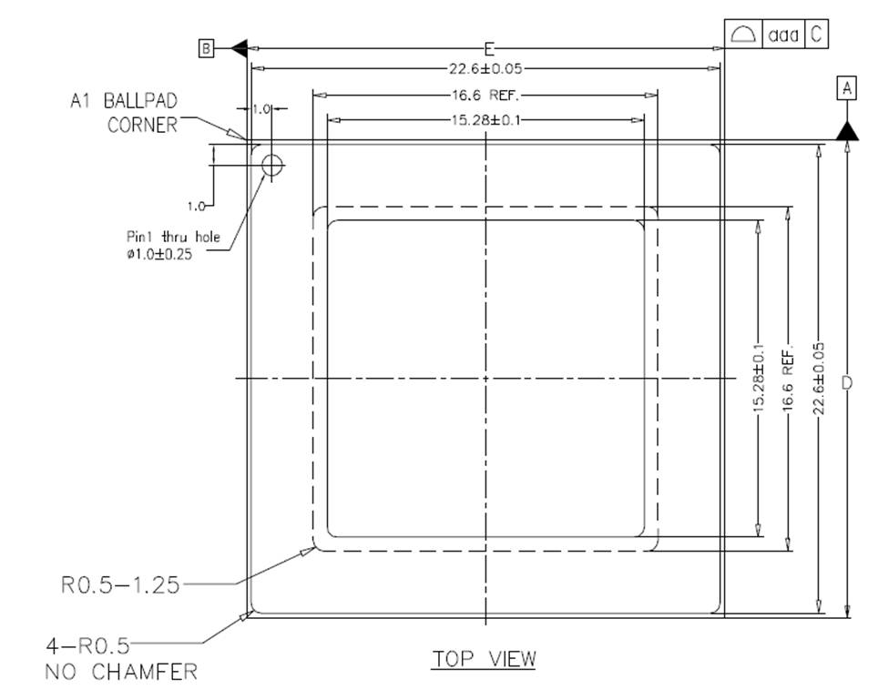

芯片封装底视图

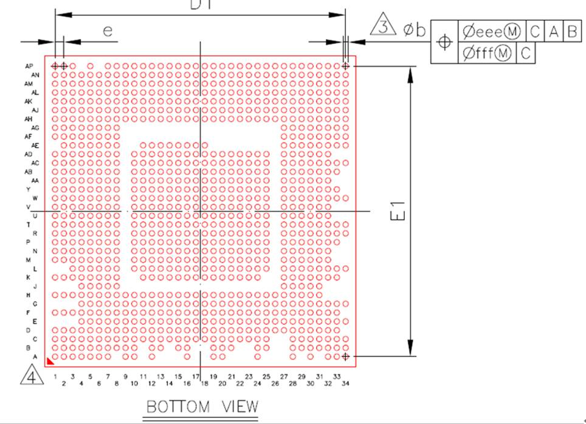

芯片封装侧视图

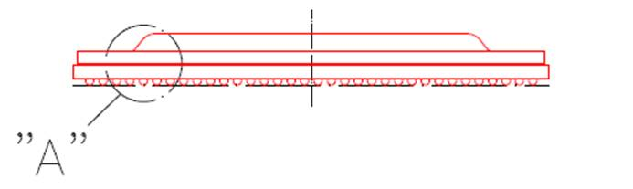

Detail A放大图

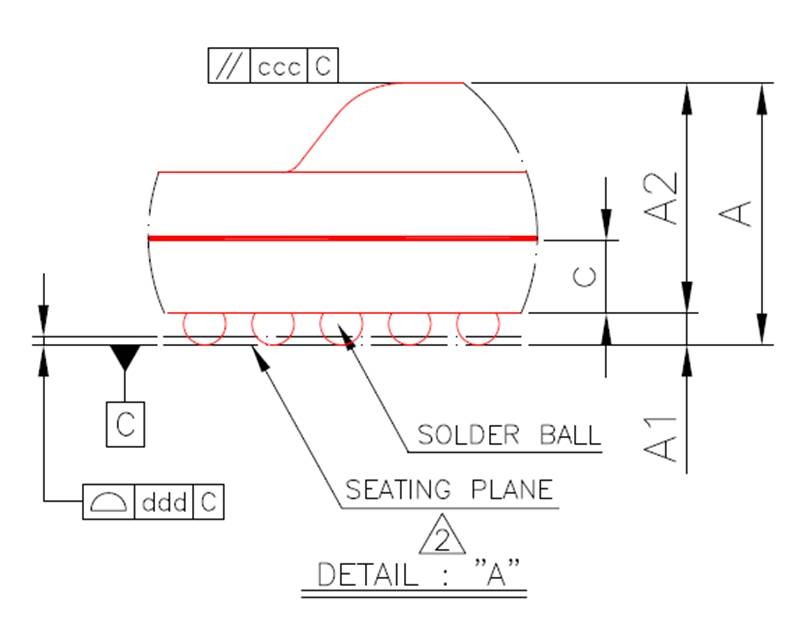

凸台尺寸图

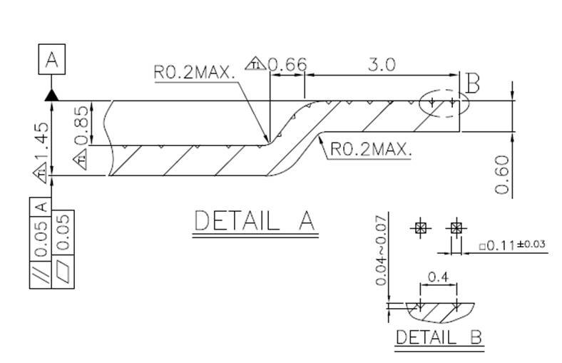

封装参数说明

| Symbol | Dimension in mm | | | Dimension in inch | | |
| --- | --- | --- | --- | --- | --- | --- |
| MIN | NOM | MAX | MIN | NOM | MAX |
| A | 2.332 | 2.490 | 2.648 | 0.092 | 0.098 | 0.104 |
| A1 | 0.250 | 0.300 | 0.350 | 0.010 | 0.012 | 0.014 |
| A2 | 2.040 | 2.190 | 2.340 | 0.080 | 0.086 | 0.092 |
| c | 0.590 | 0.690 | 0.790 | 0.023 | 0.027 | 0.031 |
| D | 22.80 | 23.00 | 23.20 | 0.898 | 0.906 | 0.913 |
| E | 22.80 | 23.00 | 23.20 | 0.898 | 0.906 | 0.913 |
| D1 | --- | 21.45 | --- | --- | 0.844 | --- |
| E1 | --- | 21.45 | --- | --- | 0.844 | --- |
| e | --- | 0.65 | --- | --- | 0.026 | --- |
| b | 0.35 | 0.40 | 0.45 | 0.014 | 0.016 | 0.018 |
| aaa | 0.20 | | | 0.008 | | |
| ccc | 0.35 | | | 0.014 | | |
| ddd | 0.10 | | | 0.004 | | |
| eee | 0.20 | | | 0.008 | | |
| fff | 0.08 | | | 0.003 | | |
| MD/ME | 34/34 | | | | | |

NOTE:

#### Controlling dimension: millimeter.

2. Primary datum c and seation plane are defined by the spherical crowns of the solder balls.

3. Dimension b is measured at the maximum solder ball diameter, parallel to primary datum c.

4. The pattern of pin 1 fiducial is for reference only.

5. b is solder ball diameter = 0.40 mm (before reflow) bga pad solder mask opening = 0.35 mm pkg ball diameter = 0.41 mm (after reflow)

6. Special characteristics c class: a, ddd.

### 管脚分布

Hi3403V100的管脚有997个，管脚数目统计表如表2-2所示。

Hi3403V100管脚数目统计表

| 管脚类别 | 数量 |
| --- | --- |
| I/O | 329 |
| 数字电源 | 132 |
| 数字地 | 401 |
| 其他/模拟电源 | 20 |
| 其他/模拟地 | 115 |
| DDR参考电源（VREF） | 0 |
| 总计 | 997 |

## 管脚信息描述

芯片管脚信息、管脚电源域信息、数字管脚默认状态描述请参考文档：《Hi3403V100\_PINOUT\_CN》。

## 焊接工艺建议

### 无铅回流焊工艺参数要求

无铅回流焊接工艺曲线如图2-6所示。

无铅回流焊接工艺曲线

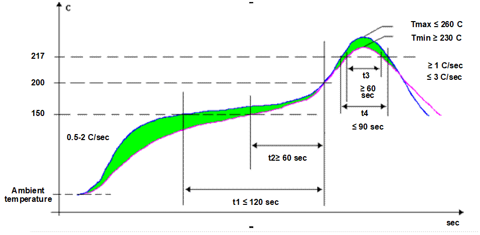

无铅回流焊工艺参数如表2-3所示。

无铅回流焊工艺参数

|  |  |  |  |  |
| --- | --- | --- | --- | --- |
| 区域 | 时间 | 升温速率 | 峰值温度 | 降温速率 |
| 预热区（40～150℃） | 60～150s | ≤2.0℃/s | - | - |
| 均温区（150～200℃） | 60～120s | ＜1.0℃/s | - | - |
| 回流区（＞217℃） | 60～90s | - | 230-260℃ | - |
| 冷却区（Tmax～180℃） | - | - | - | 1.0℃/s≤Slope≤4.0℃/s |

<strong><big>说明</big></strong>

- 预热区：温度由40℃～150℃，温度上升速率控制在2℃/s左右，该温区时间为60～150s。
- 均温区：温度由150℃～200℃，稳定缓慢升温，温度上升速率小于1℃/s，且该区域时间控制在60~120s**（注意：该区域一定缓慢受热，否则易导致焊接不良）**。
- 回流区：温度由217℃～Tmax～217℃，整个区间时间控制在60～90s。
- 冷却区：温度由Tmax～180℃，温度下降速率最大不能超过4℃/s。
- 温度从室温25℃升温到250℃时间不应该超过6分钟。
- 该回流焊曲线仅为推荐值，客户端需根据实际生产情况做相应调整。
- 回流时间以60～90s为目标，对于一些热容较大无法满足时间要求的单板可将回流时间放宽至120s。封装体耐温标准参考IPC/JEDEC J-STD-020D标准，封装体测温方法参考JEP 140标准。

IPC/JEDEC J-STD-020D标准，封装体测温方法按照JEP 140标准要求：IPC/JEDEC 020D中的无铅器件封装体耐温标准如表2-4所示。

IPC/JEDEC 020D中的无铅器件封装体耐温标准

|  |  |  |  |
| --- | --- | --- | --- |
| Package  Thickness | Volume mm3  ＜350 | Volume mm3  350~2000 | Volume mm3  ＞2000 |
| ＜1.6mm | 260℃ | 260℃ | 260℃ |
| 1.6mm～2.5mm | 260℃ | 250℃ | 245℃ |
| ＞2.5mm | 250℃ | 245℃ | 245℃ |

体积计算中不计入器件焊端（焊球，引脚）和外部散热片。

回流焊接工艺曲线测量方法：

JEP140推荐：对于厚度较小的器件，测量封装体温度时，直接将热电偶贴放在器件表面，对于厚度较大的器件，在器件表面钻孔埋入热电偶进行测量。由于量化器件厚度的要求，推荐全部采用在封装体表面钻孔埋入热电偶的方式（特别薄器件，无法钻孔除外），如图2-7所示。

封装体测温示意图

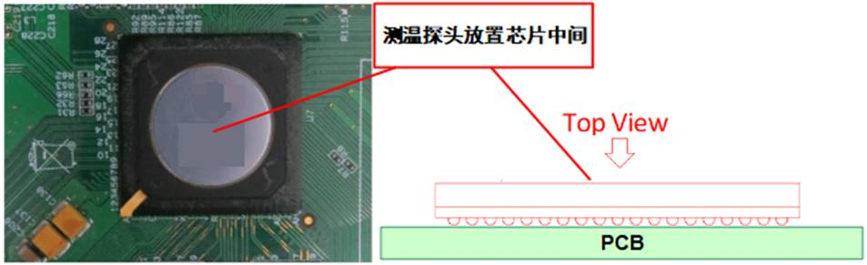

如果是QFP封装的芯片，直接将测温探头放在管脚处即可。

### 混合回流焊工艺参数要求

回流焊接过程中，如果出现器件混装现象，应首先保证无铅器件的正常焊接。具体要求如表2-5所示：

混装回流焊工艺参数表

|  |  |  |  |  |
| --- | --- | --- | --- | --- |
| 数值要求 | | 有铅BGA | 无铅BGA | 其他器件 |
| 预热区（40~150℃） | 时间 | 60-150Sec | | |
| 升温斜率 | ＜2.5℃/Sec | | |
| 均温区（150~183℃） | 时间 | 30-90Sec | | |
| 升温斜率 | ＜1.0℃/Sec | | |
| 回流区（＞183℃） | 峰值温度 | 210~240℃ | 220~240℃ | 210~245℃ |
| 时间 | 30~120s | 60~120s | 30~120s |
| 冷却区（Tmax－150℃） | 降温斜率 | 1.0℃/Sec≤Slope≤4.0℃/Sec | | |

<strong><big>须知</big></strong>

以上工艺参数要求均针对焊点温度。单板上焊点最热点和最冷点均需要满足以上规范要求。

曲线调制中，还需要满足单板上元器件的封装体耐温要求。封装体耐温标准按照IPC/JEDEC J-STD-020D标准，封装体测温方法按照JEP 140标准。

IPC/JEDEC 020D中的有铅器件封装体耐温标准如表2-6。

有铅器件封装体耐温标准

|  |  |  |
| --- | --- | --- |
| Package Thickness | Temperature 1 (Package Volume < 350 mm3 or 0.02 in.3) | Temperature 1 (Package Volume ≥ 350 mm3 or 0.02 in.3) |
| < 2.5 mm (0.10 in.) | 235°C (455°F) | 220°C (428°F) |
| ≥ 2.5 mm (0.10 in.) | 220°C (428°F) | 220°C (428°F) |

体积计算中不计入器件焊端（焊球，引脚）和外部散热片。

JEP140标准规定测量封装体温度方法同无铅工艺，请参考2.3.1 无铅回流焊工艺参数要求详细说明。

## 潮敏参数

本章节规定了IC（潮敏产品）的使用原则，涉及到的术语解释如下：

- Floor life：本产品允许在车间保留的最长时间（环境<30℃/60% RH，在拆开防潮包装到reflow之前）
- Desiccant(干燥剂)：一种用于吸附潮气而保持干燥的材料
- Humidity Indicator Card (HIC)：湿度指示卡
- Moisture Sensitivity level(MSL)：潮敏等级。
- Moisture Barrier Bag (MBB)：防潮包装袋
- Solder Reflow：回流焊
- Shelf Life：防潮包装后正常存储时间

【潮敏参数】

潮敏等级为4级。

### 产品防潮包装

#### 包装信息

干燥真空包装材料包含：

- 湿度指示卡（HIC）
- 防潮袋（MBB）
- 干燥剂

干燥真空包装材料示意图

<strong><big>须知</big></strong>

#### 潮敏产品进料检验

在生产使用（SMT）之前，打开真空袋子后：

- 如果HIC的最大指示点已经变化（不是蓝色或土黄色），产品必须参照表2-8进行rebake。
- 如果HIC中10%RH dot是蓝色或土黄色的，表示产品很干燥，可以仅仅更换防潮剂后真空封装。
- 如果HIC中10%RH dot不是蓝色或土黄色，5%RH dot已经变红色或浅绿色，表示产品已经受潮，参考表2-8进行rebake。

### 存放与使用

**【**存放环境】

建议产品真空包装存放，存放在<30°C/60% RH下。

**【**shelf life】（防潮包装后正常存储时间）

存放环境<30°C/60% RH下，真空包装存放，shelf life（存储期限）不少于12个月。

**【**floor life】

在环境条件<30°C/60%下，floor life参照表2-7如下。

floor life参照表

| MSL | Floor life(out of bag) at factory ambient≦30℃/60% RH or as stated |
| --- | --- |
| 1 | Unlimited at ≦30℃/85% RH |
| 2 | 1 year |
| 2a | 4 weeks |
| 3 | 168 hours |
| 4 | 72 hours |
| 5 | 48 hours |
| 5a | 24 hours |
| 6 | Mandatory bake before use, must be reflowed within the time limit specified on the label |

**【**潮敏产品的使用】

- 产品在≦30℃/60%RH下连续或累计暴露超过2个小时，建议进行rebake后再真空干燥包装。
- 产品在≦30℃/60%RH下暴露累计没有超过2个小时，可以不用rebake，但要更换新的干燥剂，进行真空干燥包装。

本文没有提到的存储及使用原则，请直接参考***JEDEC J-STD-033A***。

### 重新烘烤

【使用范围】

需要重新烘烤的IC（潮敏产品）

【重新烘烤参考表】

重新烘烤参考表

| Body thickness | level | bake@125℃ | bake@90℃≦5% RH | bake@40℃≦5% RH |
| --- | --- | --- | --- | --- |
| ≦1.4mm | 2a | 3 hours | 11 hours | 5 days |
| 3 | 7hours | 23 hours | 9 days |
| 4 | 7 hours | 23 hours | 9 days |
| 5 | 7 hours | 24 hours | 10 days |
| 5a | 10 hours | 24 hours | 10 days |
| ≦2.0mm | 2a | 16 hours | 2 days | 22 days |
| 3 | 17 hours | 2 days | 23 days |
| 4 | 20 hours | 3 days | 28 days |
| 5 | 25 hours | 4 days | 35 days |
| 5a | 40 hours | 6 days | 56 days |
| ≦4.5mm | 2a | 48 hours | 7 days | 67 days |
| 3 | 48 hours | 8 days | 67 days |
| 4 | 48 hours | 10 days | 67 days |
| 5 | 48 hours | 10 days | 67 days |
| 5a | 48 hours | 10 days | 67 days |

<strong><big>说明</big></strong>

- 表2-8显示的均是受潮后，必须的最小的烘烤时间。
- 重新烘烤优先选择低温烘烤。
- 详细情况请参考JEDEC。

## 电性能参数

### 功耗参数

Hi3403V100的功耗参数如表2-9所示。

<strong><big>须知</big></strong>

单板电源设计必须参照《XXXX硬件设计用户指南》

各场景的功耗参数

| 符号 | 参数 | 典型值 | | | | | 最大值 | 单位 |
| --- | --- | --- | --- | --- | --- | --- | --- | --- |
| 场景1 | 场景2 | 场景3 | 场景4 | 场景5 |
| DVDD\_CORE | DVDD内核电源 | 2339 | 2424 | 2332 | 2371 | 2321 | 3311 | mW |
| DVDD\_MEDIA | MEDIA内核电源 | 1613 | 1361 | 867 | 842 | 1598 | 2229 | mW |
| DVDD\_NPU | *图像分析引擎*内核电源 | 929 | 979 | 949 | 1034 | 907 | 1356 | mW |
| VDDIO\_DDR | DDR IO电源 | 101 | 105 | 94 | 92 | 113 | 118 | mW |
| DVDD18 | I/O电源 | 258 | 256 | 283 | 253 | 251 | 297 | mW |
| DVDD33 | I/O电源 | 47 | 47 | 56 | 47 | 46 | 56 | mW |

<strong><big>说明</big></strong>

以上功耗测试数据基于DMEB单板测试，实际应用中，不可能出现所有电源域都是最大值的场景，各场景具体配置如表2-10所示。功耗参数详情请见《Hi3403V100功耗测试报告》。

各场景具体配置表

|  | 业务描述 |
| --- | --- |
| 场景1 | (sensor 4k@30fps)\*1->MIPI：  开六轴防抖/LDC, 开超感光，一路送VPSS(开3DNR,8个osd, 4个mosaic),vpss再送VENC进行编码{Normal\_P/H264:1x4k@60fps(12Mbps) +1x1080P@30fps (4Mbps) + 1 x4K@1fps JPEG};vpss 送VO进行HDMI 1080P60 显示，叠加GFBG (1080p@10fps)；  网络：1x4K@60fps@12Mbps；  智能：VGG16 循环处理图片；  DSP: DSP0+DSP1开启，采用bilateral filter算法处理 1920x1080 yuv数据中的Y分量。 |
| 场景2 | (sensor 4k@60fps)\*1->MIPI：  一路vi 4k@30fps 开六轴防抖/LDC/WDR,送VPSS(开3DNR,8个osd, 4个mosaic),再送VENC进行编码{Normal\_P/H264:2x4k@30fps(12Mbps)+1x720P@30fps(2Mbps)+1x4K@1fps JPEG};另一路vi 4k@30fps 开六轴防抖/LDC, 送VPSS(开3DNR),送VO进行HDMI 1080P60 显示叠加GFBG(1080p@10fps)；  网络：1x4K@30fps@12Mbps；  智能：VGG16 循环处理图片；  DSP: DSP0+DSP1开启，采用bilateral filter算法处理 1920x1080 yuv数据中的Y分量。 |
| 场景3 | (sensor 4k@90fps)\*1->MIPI:  一路vi 4k@30fps，开六轴防抖/LDC/WDR, 送VPSS(开3DNR,8个osd, 4个mosaic),再送VENC进行编码{smart\_P/H264:1x 4k@30fps(12Mbps) + 1x1080P@30fps(4Mbps)+1x720P@30fps (2Mbps) + 1 x4K@1fps JPEG};VPSS送一路1080p30送VO进行显示；  音频：1路采集16kHz mono + 1路编解码 + 1路输出 mono 重采样到32kHz +1路ai开AGC/ANR；  网络：1x4K@30fps@12Mbps；  智能：VGG16 循环处理图片；  DSP: DSP0+DSP1开启，采用bilateral filter算法处理 1920x1080 yuv数据中的Y分量。 |
| 场景4 | (sensor 4k@60fps)\*1 ->MIPI:  一路vi 4k@30fps 开六轴防抖/LDC/WDR, 送VPSS(开3DNR,8个osd, 4个mosaic),  再送VENC进行编码{smart\_P/H264:1x 4k@30fps(12Mbps) + 1x1080P@30fps (4Mbps)+ 1x720P@30fps (2Mbps) + 1 x4K@1fps JPEG};VPSS送一路1080p30送VO进行显示；  音频：1路采集16kHz mono + 1路编解码 + 1路输出 mono 重采样到32kHz +1路ai开AGC/ANR;  网络：1x4K@30fps@12Mbps；  智能：VGG16 循环处理图片；  DSP: DSP0+DSP1开启，采用bilateral filter算法处理 1920x1080 yuv数据中的Y分量。 |
| 场景5 | (sensor 4k@30fps)\*2 ->MIPI:  VI 采集两路sensor 4k@30fps分别作为枪机和球机的通路输入，两路都开启2to1 WDR，其中枪机通路开LDC，球机通路路开6轴防抖；  枪机通路送VPSS（开3DNR），然后送venc进行编码（4K@30fps h264 smartp + 1080P@30fps h264 smartp + 4K@1fps jpeg）；  球机通路送VPSS（开3DNR），然后送venc进行编码（4K@30fps h264 smartp + 4K@1fps jpeg）；  音频：1路采集16kHz mono + 1路编解码 + 1路输出 mono 重采样到32kHz +1路ai开AGC/ANR；  网络：2x 4K30fps@12Mbps；  智能：VGG16 循环处理图片；  DSP: DSP0+DSP1开启，采用bilateral filter算法处理 1920x1080 yuv数据中的Y分量。 |

### 温度和热阻参数

温度和热阻参数如表2-11、表2-12和表2-13所示。

<strong><big>说明</big></strong>

- 热阻基于JEDEC JESD51系列标准给出，应用时的系统设计及环境可能与JEDEC JESD51系列标准不同，需要根据应用条件作出分析。
- θJA请参考JESD 51-2标准
- θJB请参考JESD 51-8标准
- θJC请参考：

**(**1) MIL-STD 883 1012.1

(2) SEMI G30-88

- 芯片结温和芯片功耗成正比关系，需要考虑将芯片结温控制在合理范围内，以匹配供电电源规格。

工作环境参数

| 芯片 | 工作环境温度（TA） | |
| --- | --- | --- |
| 最小值（℃） | 最大值（℃） |
| Hi3403V100 | 0 | 70 |

Hi3403V100结温参数

| 芯片 | 工作结温（TJ） | | 破坏性结温（℃） |
| --- | --- | --- | --- |
| 最小值（℃） | 最大值（℃） |
| Hi3403V100 | 0 | 110 | 125 |

<strong><big>须知</big></strong>

- 在任何条件下芯片的结温都不能大于表2-12中的“破坏性结温”。若芯片结温超过该极限值，可能导致芯片物理损坏。
- 在正常工作条件下芯片的结温必须在工作结温范围内且芯片工作的环境温度必须在工作环境温度范围内。

Hi3403V100热阻参数如表2-13所示。

热阻参数

| 参数 | 符号 | 典型值 | 单位 |
| --- | --- | --- | --- |
| Junction-to-ambient thermal resistance | θJA | 8.8 | ℃/W |
| Junction-to-board thermal resistance | θJB | 1.9 | ℃/W |
| Junction-to-case thermal resistance | θJC | 0.7 | ℃/W |

### 工作条件

Hi3403V100的工作条件如表2-14和表2-15所示。

<strong><big>须知</big></strong>

- 在使用SVB技术时，内核电源电压范围的前提条件是：客户单板必须使用SVB电路，且SVB电路的阻容参数必须完全拷贝《XXXXXX 硬件设计用户指南》中的相关RC参数。
- 必须验证SVB电路的准确性，参考文档《XXXXXX SVB电压和寄存器对应关系》

使用SVB方案时，电源工作条件

| 符号 | 描述 | SVB电压范围 | | | 单位 |
| --- | --- | --- | --- | --- | --- |
| 最小值 | 最大值 | 容忍的误差范围 |
| DVDD\_CORE | DVDD\_CORE内核电源 | 0.76 | 0.85 | ±0.03 | V |
| DVDD\_NPU | *图像分析引擎*内核电源 | 0.73 | 0.81 | ±0.03 | V |
| DVDD\_MEDIA | MEDIA内核电源 | 0.69 | 0.77 | ±0.03 | V |

常压电源工作条件

| 符号 | 描述 | 最小值 | 典型值 | 最大值 | 单位 |
| --- | --- | --- | --- | --- | --- |
| DVDD18 | 1.8V数字信号电源 | 1.71 | 1.8 | 1.89 | V |
| DVDD33 | 3.3V数字信号电源 | 3.135 | 3.3 | 3.465 | V |
| DVDD3318\_RGMII0 | RGMII0 3.3V/1.8V电源 | 3.135/1.71 | 3.3/1.8 | 3.465/1.89 | V |
| DVDD3318\_SDIO1 | SDIO1 3.3V/1.8V电源 | 3.135/1.71 | 3.3/1.8 | 3.465/1.89 | V |
| DVDD3318\_UART1\_2 | UART 3.3V/1.8V电源 | 3.135/1.71 | 3.3/1.8 | 3.465/1.89 | V |
| DVDD18\_RGMII0\_SDIO1\_UART | RGMII0/SDIO1/UART偏置电源 | 1.71 | 1.8 | 1.89 | V |
| AVDD18\_EMMC | EMMC 1.8V电源 | 1.71 | 1.8 | 1.89 | V |
| AVDD18\_MIPIRX | MIPIRX 1.8V 模拟电源 | 1.71 | 1.8 | 1.89 | V |
| AVDD18\_LSADC | LSADC 1.8V电源 | 1.71 | 1.8 | 1.89 | V |
| AVDD18\_VDAC | VDAC 1.8V模拟电源 | 1.71 | 1.8 | 1.89 | V |
| AVDD18\_AC | Audio Codec模拟电源 | 1.71 | 1.8 | 1.89 | V |
| AVDD18\_MIPITX | MIPITX1.8V模拟电源 | 1.71 | 1.8 | 1.89 | V |
| AVDD18\_PLL | PLL 1.8V模拟电源 | 1.71 | 1.8 | 1.89 | V |
| AVDD08\_PLL | PLL 0.8V模拟电源 | 0.72 | 0.8 | 0.88 | V |
| AVDD33\_USB2 | USB2 3.3V模拟电源 | 3.135 | 3.3 | 3.465 | V |
| AVDD18\_USB2 | USB2 1.8V模拟电源 | 1.71 | 1.8 | 1.89 | V |
| AVDD18\_USB3\_PCIE | USB3\_PCIE 1.8V模拟电源 | 1.71 | 1.8 | 1.89 | V |
| AVDD08\_USB3\_PCIE | USB3\_PCIE 0.8V模拟电源 | 0.72 | 0.8 | 0.88 | V |
| AVDD18\_HDMITX | HDMI 1.8V模拟电源 | 1.71 | 1.8 | 1.89 | V |
| AVDD08\_HDMITX | HDMI 0.8V模拟电源 | 0.72 | 0.8 | 0.88 | V |
| AVDD18\_DDRPLL | DDRPLL 1.8V模拟电源 | 1.71 | 1.8 | 1.89 | V |
| VDDIO\_CK\_DDR | DDR4/LPDDR4/LPDDR4x CLK IO电源 | 1.14/1.06/0.57 | 1.2/1.1/0.6 | 1.26/1.17/0.65 | V |
| VDDIO\_DDR | DDR4/LPDDR4/LPDDR4x IO电源 | 1.14/1.06/0.57 | 1.2/1.1/0.6 | 1.26/1.17/0.65 | V |

破坏性电压值

| 参数描述 | 电源管脚名称 | 最小值（V） | 最大值（V） |
| --- | --- | --- | --- |
| core电源供电电压 | DVDD\_CORE/DVDD\_MEDIA/DVDD\_NPU/AVDD08\_USB3\_PCIE/AVDD08\_HDMITX/AVDD08\_PLL | -0.2 | 1.12 |
| DDR IO电源供电电压 | VDDIO\_DDR/VDDIO\_DDR0\_CK/VDDIO\_DDR1\_CK | -0.2 | 1.44 (DDR4)  1.32 (LPDDR4)  0.72 (LPDDR4X) |
| 1.8V IO电源供电电压 | DVDD18/AVDD18\_DDR0\_PLL/AVDD18\_MIPITX/AVDD18\_DDR1\_PLL/AVDD18\_PLL/AVDD18\_HDMITX/AVDD18\_USB3\_PCIEAVDD18\_LSADCAVDD18\_MIPIRX/AVDD18\_USB2/AVDD18\_AC/AVDD18\_VDAC | -0.2 | 2.16 |
| 3.3V IO电源供电电压 | DVDD33/AVDD33\_USB2 | -0.2 | 3.96 |

<strong><big>须知</big></strong>

- 只要芯片供电电压超出破坏性电压值范围，就可能造成芯片的物理功能永久性损坏。
- 芯片供电电压必须在电源工作条件范围内，否则质量无法保证。

### 上下电顺序

请参考《XXXXXX 硬件设计用户指南》上下电时序章节。

### DC/AC电气参数

<strong><big>说明</big></strong>

以下表中涉及的IO5\_1/IO5\_2/IO2/IO3/IO4/IO6\_2/IO7\_1/IO7\_2与接口的对应关系请参见《Hi3403V100\_PINOUT\_CN》。

Hi3403V100数字接口DC电气参数如表2-17~表2-24所示。

DC电气参数表(DVDD33=3.3V，IO5\_2)

| 符号 | 参数 | 最小值 | 典型值 | 最大值 | 单位 | 说明 |
| --- | --- | --- | --- | --- | --- | --- |
| DVDD33 | 接口电压 | 3.135 | 3.3 | 3.465 | V | - |
| VIH | 高电平输入电压 | 2 | - | - | V | 接口不兼容5V输入 |
| VIL | 低电平输入电压 | - | - | 0.8 | V | - |
| IL | 输入漏电流 | - | - | ±10 | µA | - |
| IOZ | 三态输出漏电流 | - | - | ±10 | µA | - |
| VOH | 高电平输出电压 | 2.4 | - | - | V | - |
| VOL | 低电平输出电压 | - | - | 0.4 | V | - |
| IOH | 高电平输出电流 | 4.3 | - | - | mA | IO5\_2\_档位1 |
| 6.5 | - | - | mA | IO5\_2\_档位2 |
| 8.7 | - | - | mA | IO5\_2\_档位3 |
| 10.9 | - | - | mA | IO5\_2\_档位4 |
| 13.09 | - | - | mA | IO5\_2\_档位5 |
| 15.25 | - | - | mA | IO5\_2\_档位6 |
| 17.43 | - | - | mA | IO5\_2\_档位7 |
| 19.96 | - | - | mA | IO5\_2\_档位8 |
| 21.77 | - | - | mA | IO5\_2\_档位9 |
| 23.94 | - | - | mA | IO5\_2\_档位10 |
| 26.11 | - | - | mA | IO5\_2\_档位11 |
| 28.27 | - | - | mA | IO5\_2\_档位12 |
| 30.43 | - | - | mA | IO5\_2\_档位13 |
| 32.59 | - | - | mA | IO5\_2\_档位14 |
| 34.75 | - | - | mA | IO5\_2\_档位15 |
| 36.91 | - | - | mA | IO5\_2\_档位16 |
| IOL | 低电平输出电流 | 3.06 | - | - | mA | IO5\_2\_档位1 |
| 4.59 | - | - | mA | IO5\_2\_档位2 |
| 6.12 | - | - | mA | IO5\_2\_档位3 |
| 7.64 | - | - | mA | IO5\_2\_档位4 |
| 9.17 | - | - | mA | IO5\_2\_档位5 |
| 10.69 | - | - | mA | IO5\_2\_档位6 |
| 12.21 | - | - | mA | IO5\_2\_档位7 |
| 13.72 | - | - | mA | IO5\_2\_档位8 |
| 15.24 | - | - | mA | IO5\_2\_档位9 |
| 16.76 | - | - | mA | IO5\_2\_档位10 |
| 18.28 | - | - | mA | IO5\_2\_档位11 |
| 19.79 | - | - | mA | IO5\_2\_档位12 |
| 21.3 | - | - | mA | IO5\_2\_档位13 |
| 22.81 | - | - | mA | IO5\_2\_档位14 |
| 24.32 | - | - | mA | IO5\_2\_档位15 |
| 25.82 | - | - | mA | IO5\_2\_档位16 |
| RPU3 | 内部上拉电阻 | 21 | 29.5 | 41 | kΩ | IO5\_2 |
| RPD3 | 内部下拉电阻 | 20 | 28 | 40 | kΩ | IO5\_2 |

DC电气参数表（DVDD18=1.8V，IO5\_2）

| 符号 | 参数 | 最小值 | 典型值 | 最大值 | 单位 | 说明 |
| --- | --- | --- | --- | --- | --- | --- |
| DVDD18 | 接口电压 | 1.71 | 1.8 | 1.89 | V | - |
| VIH | 高电平输入电压 | 1.27 | - | - | V | 接口不兼容5V输入 |
| VIL | 低电平输入电压 | - | - | 0.58 | V | - |
| IL | 输入漏电流 | - | - | ±10 | µA | - |
| IOZ | 三态输出漏电流 | - | - | ±10 | µA | - |
| VOH | 高电平输出电压 | 1.35 | - | - | V | - |
| VOL | 低电平输出电压 | - | - | 0.45 | V | - |
| IOH | 高电平输出电流 | 2.1 | - | - | mA | IO5\_2\_档位1 |
| 3.15 | - | - | mA | IO5\_2\_档位2 |
| 4.21 | - | - | mA | IO5\_2\_档位3 |
| 5.25 | - | - | mA | IO5\_2\_档位4 |
| 6.3 | - | - | mA | IO5\_2\_档位5 |
| 7.35 | - | - | mA | IO5\_2\_档位6 |
| 8.39 | - | - | mA | IO5\_2\_档位7 |
| 9.42 | - | - | mA | IO5\_2\_档位8 |
| 10.47 | - | - | mA | IO5\_2\_档位9 |
| 11.51 | - | - | mA | IO5\_2\_档位10 |
| 12.55 | - | - | mA | IO5\_2\_档位11 |
| 13.58 | - | - | mA | IO5\_2\_档位12 |
| 14.61 | - | - | mA | IO5\_2\_档位13 |
| 15.65 | - | - | mA | IO5\_2\_档位14 |
| 16.68 | - | - | mA | IO5\_2\_档位15 |
| 17.7 | - | - | mA | IO5\_2\_档位16 |
| IOL | 低电平输出电流 | 3.49 | - | - | mA | IO5\_2\_档位1 |
| 5.23 | - | - | mA | IO5\_2\_档位2 |
| 6.97 | - | - | mA | IO5\_2\_档位3 |
| 8.7 | - | - | mA | IO5\_2\_档位4 |
| 10.45 | - | - | mA | IO5\_2\_档位5 |
| 12.18 | - | - | mA | IO5\_2\_档位6 |
| 13.91 | - | - | mA | IO5\_2\_档位7 |
| 15.64 | - | - | mA | IO5\_2\_档位8 |
| 17.37 | - | - | mA | IO5\_2\_档位9 |
| 19.1 | - | - | mA | IO5\_2\_档位10 |
| 20.83 | - | - | mA | IO5\_2\_档位11 |
| 22.55 | - | - | mA | IO5\_2\_档位12 |
| 24.27 | - | - | mA | IO5\_2\_档位13 |
| 25.99 | - | - | mA | IO5\_2\_档位14 |
| 27.71 | - | - | mA | IO5\_2\_档位15 |
| 29.42 | - | - | mA | IO5\_2\_档位16 |
| RPU3 | 内部上拉电阻 | 21 | 29.5 | 41 | kΩ | IO5\_2 |
| RPD3 | 内部下拉电阻 | 20 | 28 | 40 | kΩ | IO5\_2 |

DC电气参数表（DVDD33=3.3V，IO5\_1）

| 符号 | 参数 | 最小值 | 典型值 | 最大值 | 单位 | 说明 |
| --- | --- | --- | --- | --- | --- | --- |
| DVDD33 | 接口电压 | 3.135 | 3.3 | 3.465 | V | - |
| VIH | 高电平输入电压 | 2 | - | DVDD33+0.3 | V | 接口不兼容5V输入 |
| VIL | 低电平输入电压 | –0.3 | - | 0.8 | V | - |
| IL | 输入漏电流 | - | - | ±10 | µA | - |
| IOZ | 三态输出漏电流 | - | - | ±10 | µA | - |
| VOH | 高电平输出电压 | 2.4 | - | - | V | - |
| VOL | 低电平输出电压 | - | - | 0.4 | V | - |
| IOH | 高电平输出电流 | 2.368 | - | - | mA | IO5\_1\_档位1 |
| 4.736 | - | - | mA | IO5\_1\_档位2 |
| 7.104 | - | - | mA | IO5\_1\_档位3 |
| 9.472 | - | - | mA | IO5\_1\_档位4 |
| 11.84 | - | - | mA | IO5\_1\_档位5 |
| 14.21 | - | - | mA | IO5\_1\_档位6 |
| 16.58 | - | - | mA | IO5\_1\_档位7 |
| 18.94 | - | - | mA | IO5\_1\_档位8 |
| 21.31 | - | - | mA | IO5\_1\_档位9 |
| 23.68 | - | - | mA | IO5\_1\_档位10 |
| 26.05 | - | - | mA | IO5\_1\_档位11 |
| 28.42 | - | - | mA | IO5\_1\_档位12 |
| 30.78 | - | - | mA | IO5\_1\_档位13 |
| 33.15 | - | - | mA | IO5\_1\_档位14 |
| 35.52 | - | - | mA | IO5\_1\_档位15 |
| 37.89 | - | - | mA | IO5\_1\_档位16 |
| IOL | 低电平输出电流 | 2.209 | - | - | mA | IO5\_1\_档位1 |
| 4.418 | - | - | mA | IO5\_1\_档位2 |
| 6.627 | - | - | mA | IO5\_1\_档位3 |
| 8.837 | - | - | mA | IO5\_1\_档位4 |
| 11.05 | - | - | mA | IO5\_1\_档位5 |
| 13.26 | - | - | mA | IO5\_1\_档位6 |
| 15.46 | - | - | mA | IO5\_1\_档位7 |
| 17.67 | - | - | mA | IO5\_1\_档位8 |
| 19.88 | - | - | mA | IO5\_1\_档位9 |
| 22.09 | - | - | mA | IO5\_1\_档位10 |
| 24.3 | - | - | mA | IO5\_1\_档位11 |
| 26.51 | - | - | mA | IO5\_1\_档位12 |
| 28.72 | - | - | mA | IO5\_1\_档位13 |
| 30.93 | - | - | mA | IO5\_1\_档位14 |
| 33.14 | - | - | mA | IO5\_1\_档位15 |
| 35.35 | - | - | mA | IO5\_1\_档位16 |
| RPU2 | 内部上拉电阻 | 23 | 31 | 40 | kΩ | IO5\_1 |
| RPD2 | 内部下拉电阻 | 22 | 29 | 36 | kΩ | IO5\_1 |

DC电气参数表（DVDD18=1.8V，IO2/IO3/IO5\_1）

| 符号 | 参数 | 最小值 | 典型值 | 最大值 | 单位 | 说明 |
| --- | --- | --- | --- | --- | --- | --- |
| DVDD18 | 接口电压 | 1.71 | 1.8 | 1.89 | V | - |
| VIH | 高电平输入电压 | 0.65\*DVDD18 | - | DVDD18+0.3 | V | 接口不兼容5V输入 |
| VIL | 低电平输入电压 | –0.3 | - | 0.35\*DVDD18 | V | - |
| IL | 输入漏电流 | - | - | ±10 | µA | - |
| IOZ | 三态输出漏电流 | - | - | ±10 | µA | - |
| VOH | 高电平输出电压 | DVDD18-0.45 | - | - | V | - |
| VOL | 低电平输出电压 | - | - | 0.45 | V | - |
| IOH | 高电平输出电流 | 1.02 | - | - | mA | IO2/IO3\_档位1 |
| 2.03 | - | - | mA | IO2/IO3\_档位2 |
| 3.05 | - | - | mA | IO2/IO3\_档位3 |
| 4.05 | - | - | mA | IO2/IO3\_档位4 |
| 5.24 | - | - | mA | IO2/IO3\_档位5 |
| 6.25 | - | - | mA | IO2/IO3\_档位6 |
| 7.27 | - | - | mA | IO2/IO3\_档位7 |
| 8.26 | - | - | mA | IO2/IO3\_档位8 |
| 10.35 | - | - | mA | IO2/IO3\_档位9 |
| 12.36 | - | - | mA | IO2/IO3\_档位10 |
| 16.37 | - | - | mA | IO2/IO3\_档位11 |
| 21.89 | - | - | mA | IO2/IO3\_档位12 |
| 14.36 | - | - | mA | IO2/IO3\_档位13 |
| 18.74 | - | - | mA | IO2/IO3\_档位14 |
| 24.7 | - | - | mA | IO2/IO3\_档位15 |
| 28.65 | - | - | mA | IO2/IO3\_档位16 |
| IOL | 低电平输出电流 | 0.97 | - | - | mA | IO2/IO3\_档位1 |
| 1.93 | - | - | mA | IO2/IO3\_档位2 |
| 2.9 | - | - | mA | IO2/IO3\_档位3 |
| 3.86 | - | - | mA | IO2/IO3\_档位4 |
| 5.02 | - | - | mA | IO2/IO3\_档位5 |
| 5.98 | - | - | mA | IO2/IO3\_档位6 |
| 6.94 | - | - | mA | IO2/IO3\_档位7 |
| 7.89 | - | - | mA | IO2/IO3\_档位8 |
| 10.04 | - | - | mA | IO2/IO3\_档位9 |
| 11.93 | - | - | mA | IO2/IO3\_档位10 |
| 15.89 | - | - | mA | IO2/IO3\_档位11 |
| 21.18 | - | - | mA | IO2/IO3\_档位12 |
| 14.02 | - | - | mA | IO2/IO3\_档位13 |
| 18.15 | - | - | mA | IO2/IO3\_档位14 |
| 23.93 | - | - | mA | IO2/IO3\_档位15 |
| 27.79 | - | - | mA | IO2/IO3\_档位16 |
| IOH | 高电平输出电流 | 2.412 | - | - | mA | IO5\_1\_档位1 |
| 4.824 | - | - | mA | IO5\_1\_档位2 |
| 7.237 | - | - | mA | IO5\_1\_档位3 |
| 9.649 | - | - | mA | IO5\_1\_档位4 |
| 12.06 | - | - | mA | IO5\_1\_档位5 |
| 14.47 | - | - | mA | IO5\_1\_档位6 |
| 16.89 | - | - | mA | IO5\_1\_档位7 |
| 19.3 | - | - | mA | IO5\_1\_档位8 |
| 21.71 | - | - | mA | IO5\_1\_档位9 |
| 24.12 | - | - | mA | IO5\_1\_档位10 |
| 26.53 | - | - | mA | IO5\_1\_档位11 |
| 28.95 | - | - | mA | IO5\_1\_档位12 |
| 31.36 | - | - | mA | IO5\_1\_档位13 |
| 33.77 | - | - | mA | IO5\_1\_档位14 |
| 36.18 | - | - | mA | IO5\_1\_档位15 |
| 38.6 | - | - | mA | IO5\_1\_档位16 |
| IOL | 低电平输出电流 | 2.233 | - | - | mA | IO5\_1\_档位1 |
| 4.466 | - | - | mA | IO5\_1\_档位2 |
| 6.698 | - | - | mA | IO5\_1\_档位3 |
| 8.931 | - | - | mA | IO5\_1\_档位4 |
| 11.16 | - | - | mA | IO5\_1\_档位5 |
| 13.4 | - | - | mA | IO5\_1\_档位6 |
| 15.63 | - | - | mA | IO5\_1\_档位7 |
| 17.86 | - | - | mA | IO5\_1\_档位8 |
| 20.09 | - | - | mA | IO5\_1\_档位9 |
| 22.33 | - | - | mA | IO5\_1\_档位10 |
| 24.56 | - | - | mA | IO5\_1\_档位11 |
| 26.79 | - | - | mA | IO5\_1\_档位12 |
| 29.03 | - | - | mA | IO5\_1\_档位13 |
| 21.26 | - | - | mA | IO5\_1\_档位14 |
| 33.49 | - | - | mA | IO5\_1\_档位15 |
| 35.72 | - | - | mA | IO5\_1\_档位16 |
| RPU1 | 内部上拉电阻 | 28 | 33 | 39 | kΩ | IO2/IO3 |
| RPD1 | 内部下拉电阻 | 28 | 33 | 38 | kΩ | IO2/IO3 |
| RPU2 | 内部上拉电阻 | 21 | 28 | 35 | kΩ | IO5\_1 |
| RPD2 | 内部下拉电阻 | 22 | 29 | 36 | kΩ | IO5\_1 |

DC电气参数表（DVDD18=1.8V，IO4）

| 符号 | 参数 | 最小值 | 典型值 | 最大值 | 单位 | 说明 |
| --- | --- | --- | --- | --- | --- | --- |
| DVDD18 | 接口电压 | 1.71 | 1.8 | 1.89 | V | - |
| VIH | 高电平输入电压 | 0.65\*DVDD18 | - | DVDD18+0.3 | V | 接口不兼容5V输入 |
| VIL | 低电平输入电压 | –0.3 | - | 0.35\*DVDD18 | V | - |
| IL | 输入漏电流 | - | - | ±10 | µA | - |
| IOZ | 三态输出漏电流 | - | - | ±10 | µA | - |
| VOH | 高电平输出电压 | DVDD18-0.45 | - | - | V | - |
| VOL | 低电平输出电压 | - | - | 0.45 | V | - |
| IOH | 高电平输出驱动 | 200 | - | - | Ω | IO4\_档位1 |
| 100 | - | - | Ω | IO4\_档位2 |
| 66 | - | - | Ω | IO4\_档位3 |
| 50 | - | - | Ω | IO4\_档位4 |
| 50 | - | - | Ω | IO4\_档位5 |
| 40 | - | - | Ω | IO4\_档位6 |
| 33 | - | - | Ω | IO4\_档位7 |
| 28 | - | - | Ω | IO4\_档位8 |
| IOL | 低电平输出驱动 | 200 | - | - | Ω | IO4\_档位1 |
| 100 | - | - | Ω | IO4\_档位2 |
| 66 | - | - | Ω | IO4\_档位3 |
| 50 | - | - | Ω | IO4\_档位4 |
| 50 | - | - | Ω | IO4\_档位5 |
| 40 | - | - | Ω | IO4\_档位6 |
| 33 | - | - | Ω | IO4\_档位7 |
| 28 | - | - | Ω | IO4\_档位8 |
| RPU4 | 内部上拉电阻 | 17 | 20 | 23 | kΩ | IO4 |
| RPD4 | 内部下拉电阻 | 17 | 20 | 23 | kΩ | IO4 |

DC电气参数表（DVDD18=1.8V，IO6\_2）

| 符号 | 参数 | 最小值 | 典型值 | 最大值 | 单位 | 说明 |
| --- | --- | --- | --- | --- | --- | --- |
| DVDD18 | 接口电压 | 1.71 | 1.8 | 1.89 | V | - |
| VDDod1 | 外部上拉电压1.8V | 1.71 | 1.8 | 1.89 | V | - |
| VDDod2 | 外部上拉电压3.3V | 2.97 | 3.3 | 3.63 | V | - |
| VDDod3 | 外部上拉电压5V | 4.5 | 5 | 5.5 | V | - |
| VIH1 | 高电平输入电压ForVDDod1 | 1.7 | - | VDDod1+0.5 | V | - |
| VIL1 | 高电平输入电压ForVDDod1 | -0.5 | - | 1.1 | V | - |
| VIH2 | 高电平输入电压ForVDDod2或VDDod3 | 2.5 | - | 5.5 | V | - |
| VIL2 | 高电平输入电压ForVDDod2或VDDod3 | -0.5 | - | 1.5 | V | - |
| IL | 输入漏电流 | - | - | ±10 | µA | - |
| VOL | 低电平输出电压 | - | - | 0.4 | V | - |
| IOL | 低电平输出电流 | 2.2 | - | - | mA | IO6\_2\_档位1 |
| 4.3 | - | - | mA | IO6\_2\_档位2 |
| 6.4 | - | - | mA | IO6\_2\_档位3 |
| 8.4 | - | - | mA | IO6\_2\_档位4 |

DC电气参数表（DVDD18=1.8V，IO7\_1）

| 符号 | 参数 | 最小值 | 典型值 | 最大值 | 单位 | 说明 |
| --- | --- | --- | --- | --- | --- | --- |
| DVDD18 | 接口电压 | 1.71 | 1.8 | 1.89 | V | - |
| VIH | 高电平输入电压 | 1.32 | - | - | V | 接口不兼容5V输入 |
| VIL | 低电平输入电压 | - | - | 0.72 | V | - |
| IL | 输入漏电流 | - | - | ±10 | µA | - |
| IOZ | 三态输出漏电流 | - | - | ±10 | µA | - |
| VOH | 高电平输出电压 | DVDD18-0.45 | - | - | V | - |
| VOL | 低电平输出电压 | - | - | 0.45 | V | - |
| IOH | 高电平输出电流 | 4 | - | - | mA | IO7\_1\_档位1 |
| 6 | - | - | mA | IO7\_1\_档位2 |
| 8 | - | - | mA | IO7\_1\_档位3 |
| 12 | - | - | mA | IO7\_1\_档位4 |
| IOL | 低电平输出电流 | 4 | - | - | mA | IO7\_1\_档位1 |
| 6 | - | - | mA | IO7\_1\_档位2 |
| 8 | - | - | mA | IO7\_1\_档位3 |
| 12 | - | - | mA | IO7\_1\_档位4 |

DC电气参数表（DVDD18=1.8V，IO7\_2）

| 符号 | 参数 | 最小值 | 典型值 | 最大值 | 单位 | 说明 |
| --- | --- | --- | --- | --- | --- | --- |
| DVDD18 | 接口电压 | 1.71 | 1.8 | 1.89 | V | - |
| VIH | 高电平输入电压 | 1.32 | - | - | V | 接口不兼容5V输入 |
| VIL | 低电平输入电压 | - | - | 0.72 | V | - |
| IL | 输入漏电流 | - | - | ±10 | µA | - |
| IOZ | 三态输出漏电流 | - | - | ±10 | µA | - |
| VOH | 高电平输出电压 | DVDD18-0.45 | - | - | V | - |
| VOL | 低电平输出电压 | - | - | 0.45 | V | - |
| IOH | 高电平输出电流 | 4.12 | - | - | mA | IO7\_2\_档位1 |
| IOL | 低电平输出电流 | 3.95 | - | - | mA | IO7\_2\_档位1 |

DDR模式下，AC和DC电气参数如表2-25~表2-30所示。

AC和DC电气参数表-数据线（VDDIO\_DDR =1.2V，DDR4模式）

|  |  |  |  |  |  |  |
| --- | --- | --- | --- | --- | --- | --- |
| 符号 | 参数 | 最小值 | 典型值 | 最大值 | 单位 | 说明 |
| VDDIO\_DDR | 接口电压 | 1.14 | 1.2 | 1.26 | V | - |
| Vref | 参考电压 | 0.4 \* VDDIO\_DDR | 0.5 \* VDDIO\_DDR | 0.8 \* VDDIO\_DDR | V | - |
| VOH(DC) | 高电平输出电压 | - | 0.9 \* VDDIO\_DDR | - | V | 基于ODT=60Ω |
| VOL(DC) | 低电平输出电压 | - | 0.5\* VDDIO\_DDR | - | V |
| VOH(AC) | 高电平输出电压 | - | 1.1 \* VDDIO\_DDR | - | V |
| VOL(AC) | 低电平输出电压 | - | 0.3\* VDDIO\_DDR | - | V |
| RON | 输出阻抗 | 40 | - | 240 | Ω | - |

AC和DC电气参数表-地址/命令线（VDDIO\_DDR =1.2V，DDR4模式）

| 符号 | 参数 | 最小值 | 典型值 | 最大值 | 单位 | 说明 |
| --- | --- | --- | --- | --- | --- | --- |
| VDDIO\_DDR | 接口电压 | 1.14 | 1.2 | 1.26 | V | - |
| Vref | 参考电压 | 0.49 \* VDDIO\_DDR | 0.5 \* VDDIO\_DDR | 0.51 \* VDDIO\_DDR | V | - |
| VIH(DC65) | 高电平输入电压 | Vref + 0.065 | - | VDDIO\_DDR | V | - |
| VIL(DC65) | 低电平输入电压 | 0 | - | Vref -0.065 | V | - |
| VIH(AC90) | 高电平输入电压 | Vref + 0.09 | - | VDDIO\_DDR | V | - |
| VIL(AC90) | 低电平输入电压 | 0 | - | Vref -0.09 | V | - |
| VOH(DC) | 高电平输出电压 | - | 0.9 \* VDDIO\_DDR | - | V | 基于ODT=60Ω |
| VOL(DC) | 低电平输出电压 | - | 0.5\* VDDIO\_DDR | - | V |
| VOH(AC) | 高电平输出电压 | - | 1.1 \* VDDIO\_DDR | - | V |
| VOL(AC) | 低电平输出电压 | - | 0.3\* VDDIO\_DDR | - | V |
| RON | 输出阻抗 | 40 | - | 240 | Ω | - |

AC和DC电气参数表-数据线（VDDIO\_DDR =1.1V，LPDDR4模式）

| 符号 | 参数 | 最小值 | 典型值 | 最大值 | 单位 | 说明 |
| --- | --- | --- | --- | --- | --- | --- |
| VDDIO\_DDR | 接口电压 | 1.06 | 1.1 | 1.17 | V | - |
| Vref | 参考电压 | 0.1 \* VDDIO\_DDR | 0.272 \* VDDIO\_DDR | 0.42 \* VDDIO\_DDR | V | - |
| VIH | 高电平输入摆幅 | Vref+0.07 | - | - | mV | - |
| VIL | 低电平输入摆幅 | 0 | - | Vref-0.07 | mV | - |
| VOH(DC) | 高电平输出电压 | - | 0.3\*VDDIO\_DDR | - | V | 基于ODT=60Ω |
| VOL(DC) | 低电平输出电压 | - | 0.1\*VDDIO\_DDR | - | V |
| VOH(AC) | 高电平输出电压 | - | 0.5\*VDDIO\_DDR | - | V |
| VOL(AC) | 低电平输出电压 | - | -0.1\*VDDIO\_DDR | - | V |
| RON | 输出阻抗 | 40 | - | 240 | Ω | - |

AC和DC电气参数表CKE/RESET（VDDIO\_DDR =1.1V，LPDDR4模式）

|  |  |  |  |  |  |  |
| --- | --- | --- | --- | --- | --- | --- |
| 符号 | 参数 | 最小值 | 典型值 | 最大值 | 单位 | 说明 |
| VDDIO\_DDR | 接口电压 | 1.06 | 1.1 | 1.17 | V | - |
| VOH(AC) | 高电平输出电压 | 0.75\*VDDIO\_DDR | - | VDDIO\_DDR+0.2 | V | - |
| VOL(AC) | 低电平输出电压 | -0.2 | - | 0.25\*VDDIO\_DDR | V | - |
| VOH(DC) | 高电平输出电压 | 0.65\*VDDIO\_DDR | - | VDDIO\_DDR+0.2 | V | - |
| VOL(DC) | 低电平输出电压 | -0.2 | 0 | 0.35\*VDDIO\_DDR | V | - |
| RON | 输出阻抗 | 40 | - | 240 | Ω | - |

AC和DC电气参数表-数据线（VDDIO\_DDR =0.6V，LPDDR4X模式）

| 符号 | 参数 | 最小值 | 典型值 | 最大值 | 单位 | 说明 |
| --- | --- | --- | --- | --- | --- | --- |
| VDDIO\_DDR | 接口电压 | 0.57 | 0.6 | 0.65 | V | - |
| Vref | 参考电压 | 0.15 \* VDDIO\_DDR | - | 0.449\* VDDIO\_DDR | - | - |
| VIH | 高电平输入电压 | Vref + 0.07 | - | VDDIO\_DDR | V | - |
| VIL | 低电平输入电压 | 0 | - | Vref -0.07 | V | - |
| VOH(DC) | 高电平输出电压 | - | 0.5\*VDDIO\_DDR | - | V | 基于ODT=60Ω |
| VOL(DC) | 低电平输出电压 | - | 0.15\*VDDIO\_DDR | - | V |
| VOH(AC) | 高电平输出电压 | - | 0.8\*VDDIO\_DDR | - | V |
| VOL(AC) | 低电平输出电压 | - | -0.1\*VDDIO\_DDR | - | V |
| RON | 输出阻抗 | 40 | - | 240 | Ω | - |

AC和DC电气参数表CKE/RESET（VDDIO\_DDR =0.6V，LPDDR4X模式）

|  |  |  |  |  |  |  |
| --- | --- | --- | --- | --- | --- | --- |
| 符号 | 参数 | 最小值 | 典型值 | 最大值 | 单位 | 说明 |
| VDDIO\_DDR | 接口电压 | 0.57 | 0.6 | 0.65 | V | - |
| VOH(AC) | 高电平输出电压 | 0.75\*VDDIO\_DDR | - | VDDIO\_DDR+0.2 | V | - |
| VOL(AC) | 低电平输出电压 | -0.2 | - | 0.25\*VDDIO\_DDR | V | - |
| VOH(DC) | 高电平输出电压 | 0.65\*VDDIO\_DDR | - | VDDIO\_DDR+0.2 | V | - |
| VOL(DC) | 低电平输出电压 | -0.2 | 0 | 0.35\*VDDIO\_DDR | V | - |
| RON | 输出阻抗 | 40 | - | 240 | Ω | - |

### MIPI/LVDS Rx 电气参数

DPHY/HiSPi/Sub-LVDS/LVDS差分DC电气参数如表2-31所示。

差分DC电气参数表

| 符号 | 参数 | | 最小值 | 典型值 | 最大值 | 单位 |
| --- | --- | --- | --- | --- | --- | --- |
| VIDTH(SL) | Differential Input Threshold Voltage |(VP－VM)| | Sub-LVDS | 70 | - | - | mV |
| VIDTH(HS) | HiSPi(SLVS) | 70 | - | - |
| VIDTH(HiVCM) | HiSPi(HiVCM) | 100 | - | - |
| VIDTH(DP) | D-PHY HS | 70 | - | - |
| VIDTH(LV) | LVDS | 100 | - | - |
| VIDTH(ML) | Mini-LVDS | 100 | - | - |
| VCM(SL) | Common Mode Voltage Range (VP+VM)/2 | Sub-LVDS | 0.5 | 0.9 | 1.3 | V |
| VCM(HS) | HiSPi(SLVS) | 0.07 | 0.2 | 0.35 |
| VCM(HiVCM) | HiSPi(HiVCM) | 0.66 | 0.90 | 1.17 |
| VCM(DP) | D-PHY HS | 0.07 | 0.2 | 0.33 |
| VCM(LV) | LVDS | 0.925 | 1.2 | 1.475 |
| VCM(ML) | Mini-LVDS | 1.025 | 1.2 | 1.375 |
| VISVR (SL) | Single-ended Input Voltage Range  VP,VM | Sub-LVDS | 0.4 |  | 1.4 | V |
| VCM(HS) | HiSPi(SLVS) | -0.04 |  | 0.49 |
| VCM(HiVCM) | HiSPi(HiVCM) | 0.55 |  | 1.35 |
| VCM(DP) | D-PHY HS | -0.04 |  | 0.46 |
| VCM(LV) | LVDS | 0 |  | 1.8 |
| VCM(ML) | Mini-LVDS | 0.825 |  | 1.575 |
| ZID(SL) | Internal Termination Resister Value | Sub-LVDS | 80 | 100 | 125 | Ω |
| ZID(HS) | HiSPi(SLVS) | 125 |
| ZID(HiVCM) | HiSPi(HiVCM) | 125 |
| ZID(LV) | LVDS | 120 |
| ZID(ML) | Mini-LVDS | 120 |
| ZID(DP) | D-PHY HS | 125 |

MIPI 参数如表2-32~表2-35所示。

MIPI DPHY HS（High Speed）DC 参数表

| 符号 | 参数 | 最小值 | 典型值 | 最大值 | 单位 |
| --- | --- | --- | --- | --- | --- |
| VTERM-EN | Single-ended threshold for HS termination enable | - | - | 450 | mV |

MIPI DPHY HS（High Speed）AC 参数表

| 符号 | 参数 | 最小值 | 典型值 | 最大值 | 单位 |
| --- | --- | --- | --- | --- | --- |
| ΔVCMRX(HF) | Common-mode interface beyond 450MHz when datarate <=1.5Gbps | - | - | 100 | mV |
| Common-mode interface beyond 450MHz when datarate >1.5Gbps | 50 |
| ΔVCMRX(LF) | Common-mode interface 50MHz-450MHz when datarate <=1.5Gbps | -50 | - | 50 | mV |
| Common-mode interface 50MHz-450MHz when datarate >1.5Gbps | -25 | 25 |
| CCM | Common-mode termination | - | - | 60 | pF |

MIPI DPHY LP（Low Power）DC 参数表

| 符号 | 参数 | 最小值 | 典型值 | 最大值 | 单位 |
| --- | --- | --- | --- | --- | --- |
| VIHLP | Logic 1 input voltage when datarate <=1.5Gbps | 880 | - | - | mV |
| Logic 1 input voltage when datarate >1.5Gbps | 740 |
| VILLP | Logic 0 input voltage | - | - | 550 |
| VHYST | Input hysteresis | 25 | - | - |
| VOH | Thevenin output high level | 1.1 | 1.2 | 1.3 | V |

MIPI DPHY LP（Low Power）AC 参数表

| 符号 | 参数 | 最小值 | 典型值 | 最大值 | 单位 |
| --- | --- | --- | --- | --- | --- |
| eSPIKE | Input pulse rejection | - | - | 300 | V·ps |
| TMIN-RX | Minimun pulse rejection | 20 | - | - | ns |
| VINT | Peak interference amplitude | - | - | 200 | mV |
| fINT | Interference frequency | 450 | - | - | MHz |

### MIPI Tx电气参数

下面各表给出了MIPI Tx DPHY的电气参数，各参数的具体含义请参考MIPI联盟的《Specification for D-PHY Version 1.2》。

MIPI Tx LP DC参数如表2-36所示。

MIPI Tx LP DC 参数表

| 符号 | 参数 | 最小值 | 典型值 | 最大值 | 单位 |
| --- | --- | --- | --- | --- | --- |
| VOH | Thevenin output high level | 1.1 | 1.2 | 1.3 | V |
| VOL | Thevenin output low level | -50 | - | 50 | mV |
| ZOLP | Output impedance of LP transmitter | 110 | - | - | Ω |
| VIH | Logic 1 input voltage | 880 | - | - | mV |
| VIL | Logic 0 input voltage | - | - | 550 | mV |
| VHYST | Input hysteresis | 25 | - | - | mV |

MIPI Tx LP AC参数如表2-37所示。

MIPI Tx LP AC 参数表

| 符号 | 参数 | 最小值 | 典型值 | 最大值 | 单位 |
| --- | --- | --- | --- | --- | --- |
| TRLP | 15%-85% rise time，CL<70pF | - | - | 25 | ns |
| TFLP | 15%-85% fall time，CL<70pF | - | - | 25 | ns |
| TREOT | 30%-85% rise time and fall time，CL<70pF | - | - | 35 | ns |
| CLOAD | Load capacitance | 0 | - | 70 | pF |
| δ V/ δtSR | 15% to 85%，CL<70pF | - | - | 150 | mV/ns |
| eSPIKE | Input pulse rejection | - | - | 300 | V·ps |
| TMIN-RX | Minimum pulse width response | 20 | - | - | ns |
| VINT | Peak interference amplitude | - | - | 200 | mV |
| FINT | Interference frequency | 450 | - | - | MHz |

MIPI Tx HS DC参数如表2-38所示。

MIPI Tx HS DC 参数表

| 符号 | 参数 | 最小值 | 典型值 | 最大值 | 单位 |
| --- | --- | --- | --- | --- | --- |
| VCMTX | HS transmit static common mode voltage | 150 | 200 | 250 | mV |
| |△VCMTX (1,0)| | Vcmtx mismatch when output is differential-1 or differential-0 | - | - | 5 | mV |
| |VOD| | HS transmit differential voltage | 140 | 200 | 270 | mV |
| |△VOD| | Vod mismatch when output is differential-1 or differential-0 | - | - | 14 | mV |
| VOHHS | HS output high voltage | - | - | 360 | mV |
| △Zos | single ended output impedance mismatch | - | - | 10% |  |
| Zos | single ended output impedance | 40 | 50 | 62.5 | Ω |

MIPI Tx HS AC参数如表2-39所示。

MIPI Tx HS AC 参数表

| 符号 | 参数 | 最小值 | 典型值 | 最大值 | 单位 |
| --- | --- | --- | --- | --- | --- |
| △VCMTX(HF) | common-level variations above 450Mhz | - | - | 20 | mV |
| △VCMTX(LF) | common-level variations between 50-450Mhz | - | - | 25 | mV |
| tR and tF | 20%-80% rise time and fall time when datarate <= 1Gbps | 0.15 | - | 0.3UI | ns |
| 20%-80% rise time and fall time when datarate > 1Gbps | 0.1 | 0.35UI |

### AUDIO CODEC电气参数

Audio Code电性能参数如表2-40、表2-41、表2-42、表2-43和表2-44所示。

总体指标表

| 参数 | 最小值 | 典型值 | 最大值 | 单位 | 说明 |
| --- | --- | --- | --- | --- | --- |
| 模拟电路电源AVDD | 1.71 | 1.8 | 1.89 | V | 相对于AGND |
| VREF | - | AVDD/2 | - | V | 相对于AGND |

DAC主要指标表

| 参数 | 最小值 | 典型值 | 最大值 | 单位 | 说明 |
| --- | --- | --- | --- | --- | --- |
| 满幅输出幅度 | - | 0.5 | - | Vrms | 最大输出信号摆幅 |

ADC主要指标表

| 参数 | 最小值 | 典型值 | 最大值 | 单位 | 说明 |
| --- | --- | --- | --- | --- | --- |
| 最大输入幅度 | - | 0.5 | - | Vrms | ADC最大输入信号摆幅 |

MICBIAS主要指标表

| 参数 | 最小值 | 典型值 | 最大值 | 单位 | 说明 |
| --- | --- | --- | --- | --- | --- |
| 偏置电压 | 1.3×AVDD/1.8 | - | 1.6×AVDD/1.8 | V | 麦克风偏置电压 |
| 最大输出电流 | - | - | 3 | mA | - |

MICPGA主要指标

| 参数 | 最小值 | 典型值 | 最大值 | 单位 | 说明 |
| --- | --- | --- | --- | --- | --- |
| 输入电压范围 | - | 0.5 | - | Vrms | 最大输入信号摆幅 |
| 输入阻抗 | 12 | 15 | 18 | kΩ | MICPGA的输入阻抗 |

### PCIe 电气参数

PCIe标准电气特性请参考标准协议《PCI Express Base Specification Revision 2.1 》中4.3章节，协议下载链接 <https://members.pcisig.com/wg/PCI-SIG/document/9307>。

<strong><big>说明</big></strong>

电气特性完全符合PCIe版本特性规范要求。

## 接口时序

### DDR接口时序

#### 写操作时序

#### 命令和地址相对于CK的写操作时序

对于DDR命令和地址相对于CK的写操作时序，tIS为命令和地址到CK上升沿的建立时间，tIH为CK上升沿到命令和地址的保持时间。DDR4/LPDDR4/LPDDR4X命令和地址相对于CK的写操作时序如图2-9所示。

DDR4/LPDDR4/LPDDR4X命令和地址相对于CK的写操作时序图

#### DQS相对于CK的写操作时序

对于DDR4/LPDDR4/LPDDR4X DQS相对于CK的写操作时序，tDSH为CK上升沿到DQS下降沿的保持时间，tDSS为DQS下降沿到CK上升沿的建立时间。DQS相对于CK的写操作时序如图2-10所示。

DDR4/LPDDR4/LPDDR4X DQS相对于CK的写操作时序图

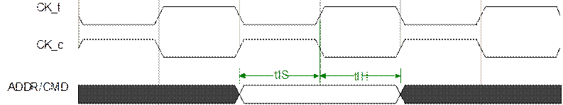

#### 读操作时序

#### 命令和地址相对于CK的读操作时序

“命令和地址相对于CK的读操作时序”与“命令和地址相对于CK的写操作时序”相同。

#### CK相对于DQS的读操作时序

对于DDR4，CK相对于DQS的读操作时序，tDQSCK为有效DQS相对于CK的偏斜。DDR4 CK相对于DQS的读操作时序如图2-11所示。

DDR4 CK相对于DQS的读操作时序图

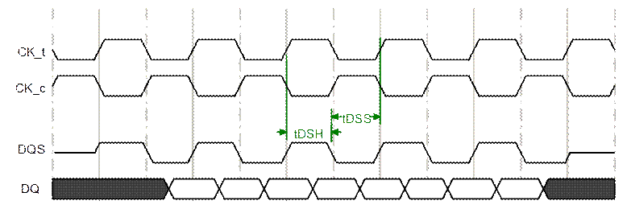

对于LPDDR4/LPDDR4X，tDQSCK允许的偏斜值更大。LPDDR4/LPDDR4X CK相对于DQS的读操作时序如图2-12所示。

LPDDR4/LPDDR4X CK相对于DQS的读操作时序图

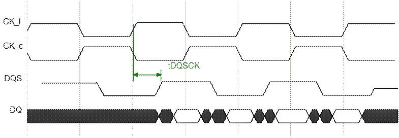

#### DQS相对于DQ的读操作时序

对于DDR4/LPDDR4/LPDDR4X DQS相对于DQ的读操作时序，tQH是最早无效的DQ相对于DQS的抖动。DDR4/LPDDR4/LPDDR4X DQS相对于DQ的读操作时序如图2-13所示。

DDR4/LPDDR4/LPDDR4X DQS相对于DQ的读操作时序图

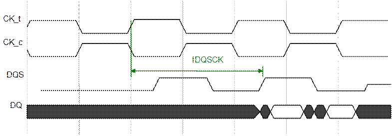

#### 时序参数

DDR接口时序满足JEDEC标准协议，本文中描述的时序都是DDR PHY侧输出的时序。

时钟参数如表2-45和表2-46，DDR4-3200 SDRAM存储器参数如表2-47所示，LPDDR4/LPDDR4X-3733 SDRAM存储器参数如表2-48所示。

DDR4时钟参数表

| 参数 | 最小值 | 典型值 | 最大值 | 单位 |
| --- | --- | --- | --- | --- |
| 存储器时钟频率 | - | - | 1600 | MHz |
| 锁相环抖动tJIT(cc) | - | - | 62 | ps |
| 锁相环抖动tJIT(per) | - | - | 32 | ps |
| 锁相环占空比 | 45.000 | 50.000 | 55.000 | % |

LPDDR4/LPDDR4X时钟参数表

| 参数 | 最小值 | 典型值 | 最大值 | 单位 |
| --- | --- | --- | --- | --- |
| 存储器时钟频率 | - | - | 1866 | MHz |
| 锁相环抖动tJIT(cc) | - | - | 75 | ps |
| 锁相环抖动tJIT(per) | - | - | 38 | ps |
| 锁相环占空比 | - | 45.000 | 55.000 | % |

DDR4 SDRAM存储器参数表（DDR4-3200）

| 参数 | 符号 | 最小值 | 最大值 | 单位 |
| --- | --- | --- | --- | --- |
| DQS下降沿相对DDR时钟的建立时间 | tDSS | 0.18 | - | tCK |
| DQS下降沿相对DDR时钟的保持时间 | tDSH | 0.18 | - | tCK |
| DQS与DQ的偏斜 | tDQSQ | - | 0.2 | tCK |
| 参考Vih(ac) / Vil(ac)电平的地址和命令相对DDR时钟的建立时间 | tIS(base) | 40 | - | ps |
| 参考Vref电平的地址和命令相对DDR时钟的建立时间 | tIS(Vref) | 130 | - | ps |
| tIH(Vref) | tIH(base) | 65 | - | - |
| 参考vref电平地址和命令相对DDR时钟的保持时间 | tIH(Vref) | 130 | - | - |
| DQS输出时相对DDR时钟的偏斜 | tDQSCK | -160 | 160 | ps |

LPDDR4/LPDDR4X SDRAM存储器参数表（LPDDR4/LPDDR4X-3733）

| 参数 | 符号 | 最小值 | 最大值 | 单位 |
| --- | --- | --- | --- | --- |
| DQS下降沿相对DDR时钟的建立时间 | tDSS | 0.2 | - | tCK |
| DQS下降沿相对DDR时钟的保持时间 | tDSH | 0.2 | - | tCK |
| DQS与DQ的偏斜 | tDQSQ | - | 0.18 | tCK |
| DQS输出时相对DDR时钟的偏斜 | tDQSCK | 1500 | 3500 | ps |

### NANDC接口时序

#### 命令周期时序

NANDC命令周期时序如图2-14所示。

NANDC命令周期时序图

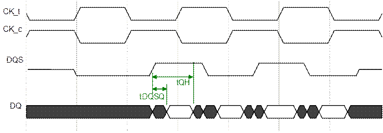

<strong><big>说明</big></strong>

NAND\_WE\_N和NAND\_RE\_N的高电平宽度和低电平宽度是可以通过NAND Flash控制器的NF\_PULSE\_WIDTH寄存器设置的，因此，NANDC接口时序图中的部分参数会随着该寄存器的设置不同而改变。在本节的参数表中，统一以“可以配置”表示。

NANDC命令周期时序参数如表2-49所示。

NANDC命令周期时序参数表

| 参数 | 符号 | 最小值 | 最大值 | 单位 | 说明 |
| --- | --- | --- | --- | --- | --- |
| NAND\_CLE建立时间 | tCLS | 15 | - | ns | - |
| NAND\_CLE保持时间 | tCLH | 10 | - | ns | - |
| NAND\_CE\_N建立时间 | tCS | 15 | - | ns | 可以配置 |
| NAND\_CE\_N保持时间 | tCH | 10 | - | ns | 可以配置 |
| NAND\_WE\_N脉冲宽度 | tWP | 15 | - | ns | 可以配置 |
| 数据建立时间 | tDS | 10 | - | ns | 可以配置 |
| 数据保持时间 | tDH | 10 | - | ns | 可以配置 |

#### 地址周期时序

NANDC地址周期时序如图2-15所示。

NANDC地址周期时序图

NANDC地址周期时序参数如表2-50所示。

NANDC地址周期时序参数表

| 参数 | 符号 | 最小值 | 最大值 | 单位 | 说明 |
| --- | --- | --- | --- | --- | --- |
| NAND\_CE\_N建立时间 | tCS | 15 | - | ns | 可以配置 |
| NAND\_WE\_N脉冲宽度 | tWP | 15 | - | ns | 可以配置 |
| NAND\_ALE建立时间 | tALS | 15 | - | ns | - |
| NAND\_ALE保持时间 | tALH | 10 | - | ns | - |
| 数据建立时间 | tDS | 10 | - | ns | 可以配置 |
| 数据保持时间 | tDH | 10 | - | ns | 可以配置 |

#### 写数据时序

NANDC写数据时序如图2-16所示。

NANDC写数据时序图

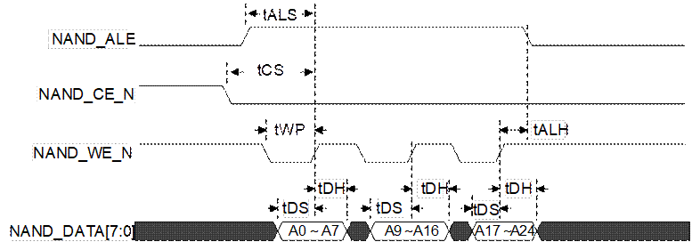

NANDC写数据时序参数如表2-51所示。

NANDC写数据时序参数表

| 参数 | 符号 | 最小值 | 最大值 | 单位 | 说明 |
| --- | --- | --- | --- | --- | --- |
| NAND\_CE\_N保持时间 | tCH | 10 | - | ns | 可以配置 |
| NAND\_WE\_N脉冲宽度 | tWP | 15 | - | ns | 可以配置 |
| NAND\_ALE建立时间 | tALS | 15 | - | ns | 可以配置 |
| 数据建立时间 | tDS | 10 | - | ns | 可以配置 |
| 数据保持时间 | tDH | 10 | - | ns | 可以配置 |
| NAND\_WE\_N高电平保持时间 | tWH | 15 | - | ns | 可以配置 |

#### 读数据时序

NANDC读数据时序如图2-17所示。

NANDC读数据时序图

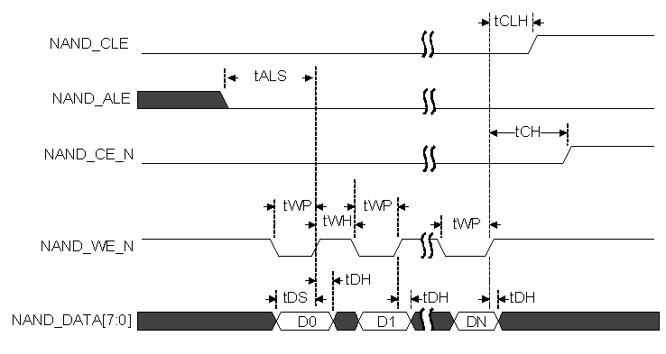

NANDC读数据时序参数如表2-52所示。

NANDC读数据时序参数表

|  |  |  |  |  |  |
| --- | --- | --- | --- | --- | --- |
| 参数 | 符号 | 最小值 | 最大值 | 单位 | 说明 |
| NAND\_RE\_N变低等待时间 | tRR | 15 | - | ns | 可以配置 |
| NAND\_RE\_N脉冲宽度 | tRP | 15 | - | ns | 可以配置 |
| NAND\_RE\_N高电平宽度 | tREH | 15 | - | ns | 可以配置 |

注：tRR延时可以配置。

### SPI FLASH接口时序

SPI FLASH输入方向时序如图2-18和图2-19所示。

SPI FLASH输入方向时序图-SDR模式

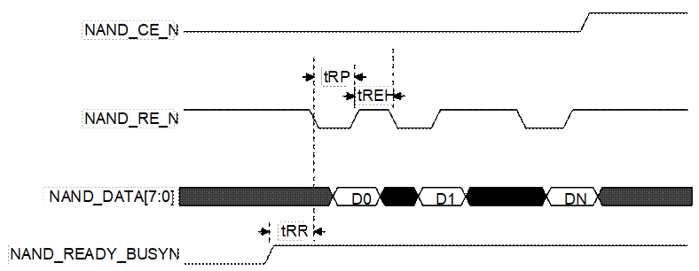

SPI FLASH输入方向时序图-DDR模式

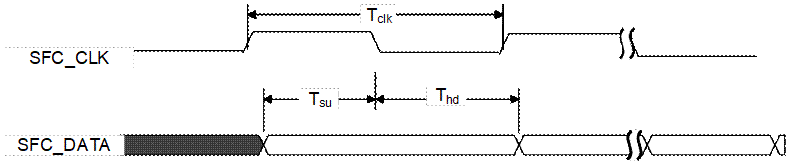

SPI FLASH输入方向时序参数如表2-53所示。

SPI FLASH输入方向时序参数表

| 参数 | 符号 | 最小值 | 典型值 | 最大值 | 单位 |
| --- | --- | --- | --- | --- | --- |
| SFC\_CLK时钟周期（SDR） | Tclk | 10.1 | - | 83.2 | ns |
| SFC\_CLK时钟周期（DDR） | Tclk | 10.1 | - | 83.2 | ns |
| SFC\_CLK时钟占空比 (DDR) | Duty | 45 | - | 55 | % |
| 输入信号建立时间要求(SDR) | Tsu | 2 | - | - | ns |
| 输入信号保持时间要求(SDR) | Thd | 1.2 | - | - | ns |
| 输入信号有效时间要求(DDR) | Valid | 3 | - | - | ns |

SPI FLASH输出方向时序如图2-20和图2-21所示。

SPI FLASH输出方向时序图-SDR模式

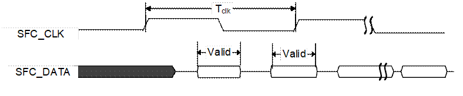

SPI FLASH输出方向时序图-DDR模式

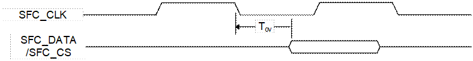

SPI FLASH输出方向时序参数如表2-54所示。

SPI FLASH输出方向时序参数表

| 参数 | 符号 | 最小值 | 典型值 | 最大值 | 单位 |
| --- | --- | --- | --- | --- | --- |
| SFCCLK时钟周期（SDR） | T | 10.1 | - | 83.2 | ns |
| SFCCLK时钟周期（DDR） | T | 10.1 | - | 83.2 | ns |
| 输出信号延时(SDR) | Tov | -1 | - | 3 | ns |
| 输出信号延时(DDR) | Tov | - | - | T/2-1.5 | ns |
| 输出信号保持时间(DDR) | Tho | 1.5 | - | - | ns |

### Ethernet MAC接口时序

#### RMII接口时序

RMII接口100Mbit/s接收时序如图2-22所示。

RMII接口100Mbit/s接收时序

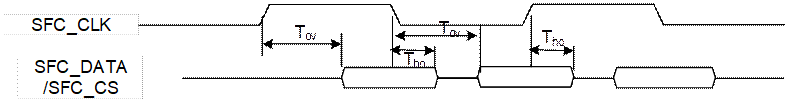

RMII接口100Mbit/s发送时序如图2-23所示。

RMII接口100Mbit/s发送时序

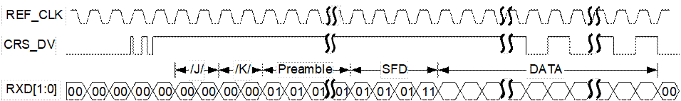

RMII接口10Mbit/s接收时序如图2-24所示。

RMII接口10Mbit/s接收时序

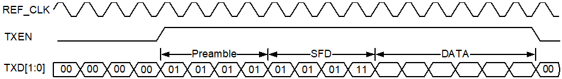

RMII接口10Mbit/s发送时序如图2-25所示。

RMII接口10Mbit/s发送时序

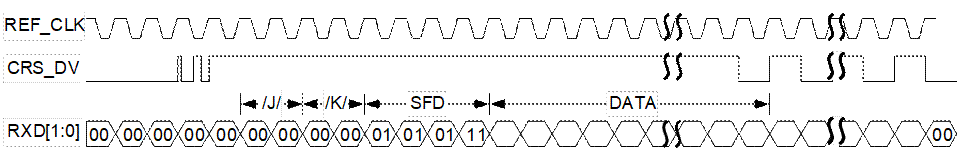

RMII接口时序参数如图2-26所示。

RMII接口时序参数

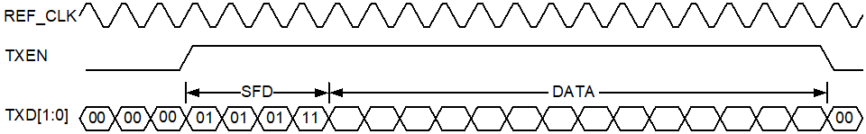

RMII接口时序参数说明如表2-55所示。

RMII接口时序参数说明

| 参数 | 符号 | 信号 | 最小值 | 典型值 | 最大值 | 单位 |
| --- | --- | --- | --- | --- | --- | --- |
| RMII时钟周期 | T | REF\_CLK | - | 20 | - | ns |
| RMII信号建立时间 | Tsu（RX） | CRS\_DV/RXD[1:0] | 4 | - | - | ns |
| RMII信号保持时间 | Thd（RX） | CRS\_DV/RXD[1:0] | 2 | - | - | ns |
| RMII输出信号延时 | Tov（TX） | TXEN/TXD[1:0] | 3 | - | 16 | ns |

#### RGMII接口时序

RGMII接口1000Mbit/s接收时序如图2-27所示。

RGMII接口1000Mbit/s接收时序

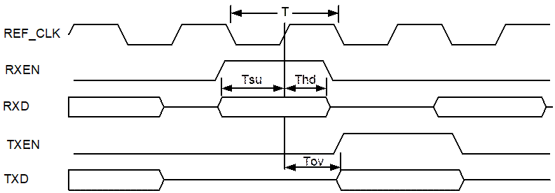

RGMII接口1000Mbit/s发送时序如图2-28所示。

RGMII接口1000Mbit/s发送时序

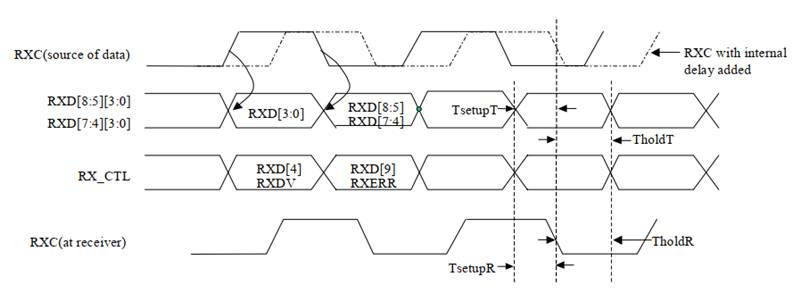

RGMII接口时序参数说明如表2-56所示。

RGMII接口时序参数说明

| 参数 | 符号 | 信号 | 最小值 | 典型值 | 最大值 | 单位 |
| --- | --- | --- | --- | --- | --- | --- |
| RGMII时钟周期 | T | RXCK、TXCK | - | 8 | - | ns |
| RGMII信号建立时间 | Tsu（RX） | RXER、RXDV、RXD[3:0] | 1 | - | - | ns |
| RGMII信号保持时间 | Thd（RX） | RXER、RXDV、RXD[3:0] | 1 | - | - | ns |
| RGMII输出信号延时 | Tov（TX） | TXD[3:0]、TXEN | -0.5 | - | 0.5 | ns |

#### MDIO接口时序

MDIO接口读时序如图2-29所示。

MDIO接口读时序

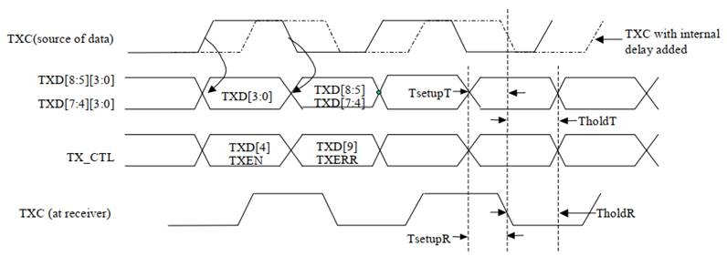

MDIO接口写时序如图2-30所示。

MDIO接口写时序

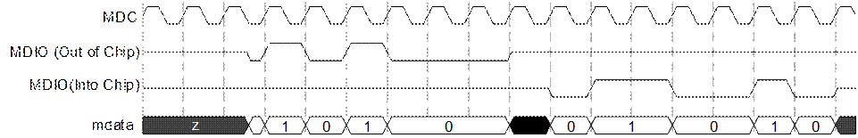

MDIO接口时序参数如图2-31所示。

MDIO接口接收时序参数

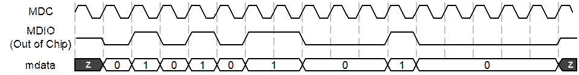

MDIO接口时序参数说明如表2-57所示。

MDIO接口时序参数

| 参数 | 符号 | 信号 | 最小值 | 最大值 | 单位 |
| --- | --- | --- | --- | --- | --- |
| MDIO接收数据延迟时间 | Tov | MDIO | - | 300 | ns |
| MDIO时钟周期 | Tp | MDCK | - | 400 | ns |
| MDIO发送数据建立时间 | Tsu | MDIO | 10 | - | ns |
| MDIO发送数据保持时间 | Thd | MDIO | 10 | - | ns |

### VI接口时序

VI接口CMOS模式时序如图2-32所示。

VI接口时序图

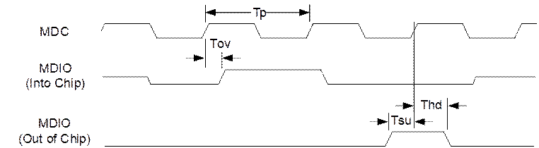

VI接口时序参数如表2-58所示。

VI接口时序参数表

|  |  |  |  |  |  |
| --- | --- | --- | --- | --- | --- |
| 参数 | 符号 | 最小值 | 典型值 | 最大值 | 单位 |
| VICLK时钟周期 | T | 6.73 | - | - | ns |
| 输入信号建立时间要求 | Tsu | 1.93 | - | - | ns |
| 输入信号保持时间要求 | Thd | 0.8 | - | - | ns |

### VO接口时序

BT.656接口时序如图2-33所示。

BT.656接口时序

BT.656接口时序参数如表2-59所示。

BT.656接口时序参数表

| 参数 | 符号 | 最小值 | 典型值 | 最大值 | 单位 |
| --- | --- | --- | --- | --- | --- |
| VOUCLK时钟周期 | T | - | 37 | - | ns |
| 输出信号延时 | Tov | T/2-1.5 | - | T/2+1.5 | ns |

RGB接口时序如图2-34所示。

RGB接口时序

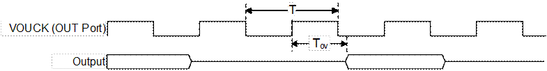

RGB接口时序参数如表2-60所示。

RGB接口时序参数表

| 参数 | 符号 | 最小值 | 典型值 | 最大值 | 单位 |
| --- | --- | --- | --- | --- | --- |
| VOUCLK时钟周期 | T | 6.75 | - | 500 | ns |
| 输出信号延时 | Tov | T/2-2 | - | T/2+2 | ns |

BT.1120接口时序如图2-35所示。

BT.1120接口时序

BT.1120接口时序参数如表2-61所示。

BT.1120接口时序参数表

| 参数 | 符号 | 最小值 | 典型值 | 最大值 | 单位 |
| --- | --- | --- | --- | --- | --- |
| VOUCLK时钟周期 | T | - | 6.75 | 13.48 | ns |
| 输出信号延时 | Tov | T/2-1.7 | - | T/2+1.7 | ns |

### AIAO接口时序

#### I2S接口时序

I2S接口接收时序如图2-36所示。

I2S接口接收时序图

I2S接口发送时序如图2-37所示。

I2S接口发送时序图

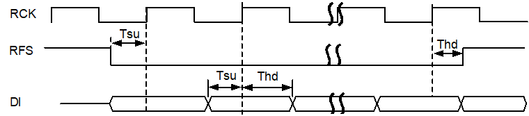

I2S接口时序参数如表2-62所示。

I2S接口时序参数表

| 参数 | 符号 | 最小值 | 典型值 | 最大值 | 单位 |
| --- | --- | --- | --- | --- | --- |
| 输入信号建立时间 | Tsu | 10 | - | - | ns |
| 输入信号保持时间 | Thd | 10 | - | - | ns |
| 输出信号延时 | Td | 0 | - | 8 | ns |

#### PCM模式接口时序

PCM接口接收时序如图2-38所示。

PCM接口接收时序图

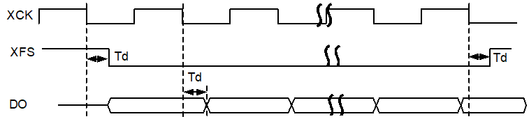

PCM接口发送时序如图2-39所示。

PCM接口发送时序图

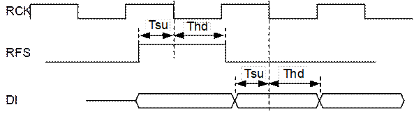

PCM接口时序参数如表2-63所示。

PCM接口时序参数表

| 参数 | 符号 | 最小值 | 典型值 | 最大值 | 单位 |
| --- | --- | --- | --- | --- | --- |
| 输入信号建立时间 | Tsu | 10 | - | - | ns |
| 输入信号保持时间 | Thd | 10 | - | - | ns |
| 输出信号延时 | Td | 0 | - | 8 | ns |

### I2C时序

I2C传输时序如图2-40所示。

I2C传输时序图

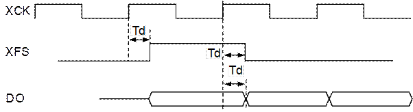

I2C接口时序参数如表2-64所示。

I2C接口时序参数表

| 参数 | 符号 | 标准模式 | | 快速模式 | | 单位 |
| --- | --- | --- | --- | --- | --- | --- |
| 最小值 | 最大值 | 最小值 | 最大值 |
| SCL时钟频率 | fSCL | 0 | 100 | 0 | 400 | kHz |
| 启动保持时间 | tHD;STA | 4.0 | - | 0.6 | - | μs |
| SCL低电平周期 | tLOW | 4.7 | - | 1.3 | - | μs |
| SCL高电平周期 | tHIGH | 4.0 | - | 0.6 | - | μs |
| 启动建立时间 | tSU;STA | 4.7 | - | 0.6 | - | μs |
| 数据保持时间 | tHD;DAT | 0 | 3.45 | 0 | 0.9 | μs |
| 数据建立时间 | tSU;DAT | 250 | - | 100 | - | ns |
| SDA、SCL上升时间 | tr | - | 1000 | 20+0.1Cb | 300 | ns |
| SDA、SCL下降时间 | tf | - | 300 | 20+0.1Cb | 300 | ns |
| 结束建立时间 | tSU;STO | 4.0 | - | 0.6 | - | μs |
| 开始与结束之间的总线释放时间 | tBUF | 4.7 | - | 1.3 | - | μs |
| 总线负载 | Cb | - | 400 | - | 400 | pF |

### SPI接口时序

<strong><big>说明</big></strong>

图2-41～图2-43中，以下缩略语或字母意义不变：

- MSB:Most Significant Bit
- LSB:Least Significant Bit
- SPI\_CK(0):spo=0
- SPI\_CK(1):spo=1

SPI接口时钟时序如图2-41所示。

SPICK时序

<strong><big>说明</big></strong>

SPI主模式下接口时序分别如图2-42和图2-43所示。

SPI主模式下接口时序（sph=1）

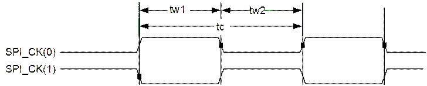

SPI主模式下接口时序（sph=0）

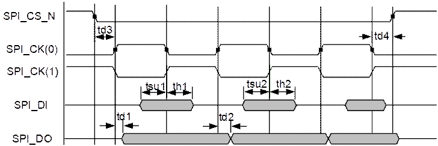

SPI接口时序参数如表2-65所示。

SPI接口时序参数

| 参数 | 符号 | 最小值 | 典型值 | 最大值 | 单位 | 备注 |
| --- | --- | --- | --- | --- | --- | --- |
| Cycle time, SPI\_CK | tc | 4000/Fsspclk | - | 65024000/Fsspclk | ns | Fsspclk以MHz为单位。  Fsspclk频率值具体请参考本文档《外围设备》章节 |
| Pulse duration, SPI\_CK high (All Master Modes) | tw1 | - | 1/2 tc | - | ns |  |
| Pulse duration. SPI\_CK low (All Master Modes) | tw2 |  | 1/2 tc | - | ns |  |
| Setup time, SPI\_DI (input) valid before SPI\_CK (output)  falling edge | tsu1 | spi0: 23  spi1: 23  spi2: 8  spi3: 12 | - | - | ns |  |
| Setup time, SPI\_DI (in put) valid before SPICK (output)  rising edge | tsu2 | spi0: 23  spi1: 23  spi2: 8  spi3: 12 | - | - | ns |  |
| Hold time, SPI\_DI (input) valid after SPI\_CK (output) falling edge | th1 | 0 | - | - | ns |  |
| Hold time, SPI\_DI (input) valid after SPI\_CK (output) rising edge | th2 | 0 | - | - | ns |  |
| Delay time, SPI\_CK (output) rising edge to SPI\_DO (output) transition | td1 | spi0: 10  spi1: 8  spi2: 2.5  spi3: 5 | - | - | ns |  |
| Delay time, SPI\_CK (output) falling edge to SPI\_DO (output) transition | td2 | spi0: -10  spi1: -8  spi2: -2.5  spi3: -5 | - | - | ns |  |
| Delay time, SPI\_CS\_N (output) falling edge to first SPI\_CK (output) rising or falling edge | td3 | - | tc | - | ns |  |
| Delay time, SPI\_CK (output) rising or falling edge to SPI\_CS\_N (output)  rising edge | td4 | - | 1/2 tc | - | ns |  |
| Setup time, SPI\_DI (input) valid before SPI\_CK (output) rising edge | tsu3 | spi0: 23  spi1: 23  spi2: 8  spi3: 12 | - | - | ns |  |
| Setup time, SPI\_DI (in put) valid before SPI\_CK (output) falling edge | tsu4 | spi0: 23  spi1: 23  spi2: 8  spi3: 12 | - | - | ns |  |
| Hold time, SPI\_DI (input) valid after SPI\_CK (output) rising edge | th3 | 0 | - | - | ns |  |
| Hold time, SPI\_DI (input) valid after SPI\_CK (output) falling edge | th4 | 0 | - | - | ns |  |
| Delay time, SPI\_CK (output) falling edge to SPI\_DO  (output) transition | td5 | spi0: 10  spi1: 8  spi2: 2.5  spi3: 5 | - | - | ns |  |
| Delay time, SPI\_CK (output) rising edge to SPI\_DO (output) transition | td6 | spi0: -10  spi1: -8  spi2: -2.5  spi3: -5 | - | - | ns |  |
| Delay time, SPI\_CS\_N (output) falling edge to first SPI\_CK (output) rising or falling edge | td7 | - | 1/2 tc | - | ns |  |
| Delay time, SPI\_CK (output) rising or falling edge to SPI\_CS\_N (output) rising edge | td8 | - | tc | - | ns |  |

### MIPI Rx接口时序

MIPI Rx DPHY/Sub-lvds/LVDS/HiSPi接口时钟时序如图2-44所示。

MIPI Rx DPHY/Sub-lvds/LVDS/HiSPi接口时钟数据时序图

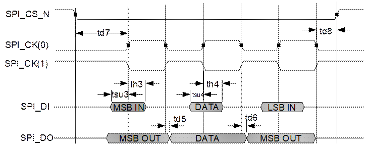

图中的Tskew包括Tdynamic\_skew和Tstatic\_skew

MIPI Rx DPHY/Sub-lvds/LVDS/HiSPi时序参数如表2-66所示。

MIPI Rx DPHY/Sub-lvds/LVDS/HiSPi时序参数表

| 符号 | 参数 | 最小值 | 典型值 | 最大值 | 单位 |
| --- | --- | --- | --- | --- | --- |
| FMAX | 数据率 | - | - | 2.5G | bps |
| Tclk | 差分时钟周期 | 0.8 | T | - | ns |
| Tstatic\_skew | 静态skew时间（1.5Gbps <datarate<=2.5Gbps） | 0.2\*UI | - | - | ns |
| Tdynamic\_skew | 动态skew时间（Tsetup+Thold）（1.5Gbps <datarate<=2.5Gbps） | 0.5\*UI | - | - | ns |
| Tsetup | 差分时钟建立时间 | 0.15\*UI（80Mbps <datarate<=1.0Gbps） | - | - | ns |
| 0.2\*UI（1.0Gbps <datarate<=1.5Gbps） |
| Thold | 差分时钟保持时间 | 0.15\*UI（80Mbps <datarate<=1.0Gbps） | - | - | ns |
| 0.2\*UI（1.0Gbps <datarate<=1.5Gbps） |

<strong><big>说明</big></strong>

UI is equal to T/2.

### MIPI Tx接口时序

MIPI Tx接口时钟时序如图2-45所示。

MIPI Tx接口时钟数据时序图

<strong><big>说明</big></strong>

图中的Tskew包括Tdynamic\_skew和Tstatic\_skew

MIPI Tx DATA-CLOCK 时序参数如表2-67所示。

MIPI Tx DATA-CLOCK 时序参数表

| 符号 | 参数 | 最小值 | 典型值 | 最大值 | 单位 |
| --- | --- | --- | --- | --- | --- |
| Tstatic\_skew | 静态skew时间（1.5Gbps <datarate<=2.5Gbps） | 0.2\*UI | - | - | ns |
| Tdynamic\_skew | 动态skew时间（Tsetup+Thold）（1.5Gbps <datarate<=2.5Gbps） | 0.5\*UI | - | - | ns |
| Tsetup | 差分时钟建立时间 | 0.15\*UI（80Mbps <datarate<=1.0Gbps） | - | - | ns |
| 0.2\*UI（1.0Gbps <datarate<=1.5Gbps） |
| Thold | 差分时钟保持时间 | 0.15\*UI（80Mbps <datarate<=1.0Gbps） | - | - | ns |
| 0.2\*UI（1.0Gbps <datarate<=1.5Gbps） |

### SDIO/MMC接口时序

#### eMMC接口时序

eMMC DS/HS模式CMD/DATA输入/输出方向时序如图2-46所示。

eMMC DS/HS模式CMD/DATA输入/输出方向时序图

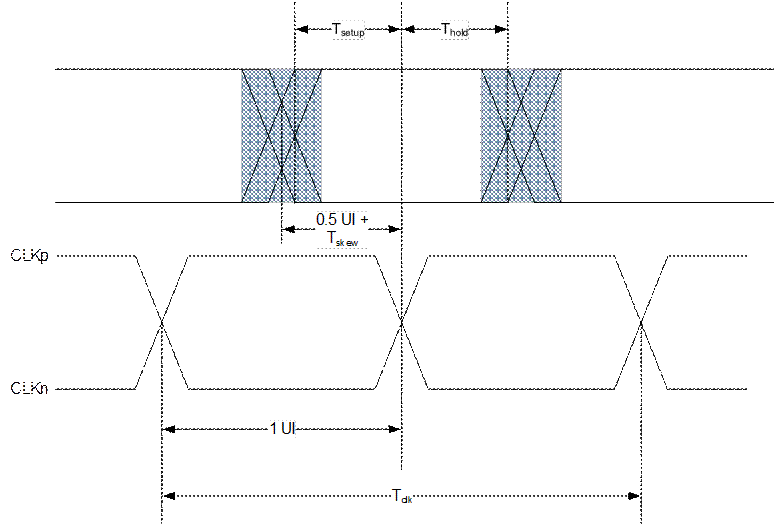

eMMC DS模式CMD/DATA输入/输出方向时序参数如表2-68所示。

eMMC DS模式CMD/DATA输入/输出时序参数表

| 符号 | 参数 | 最小值 | 典型值 | 最大值 | 单位 | 备注 |
| --- | --- | --- | --- | --- | --- | --- |
| **Clock CLK** | | | | | | |
| tpp | Cycle time data transfer mode | 38.5 | 40.4 | - | ns | - |
| tWH | Clock high time | 10 | 18 | - | ns | - |
| tWL | Clock low time | 10 | 18 | - | ns | - |
| **Outputs DAT** (referenced to CLK) | | | | | | |
| tOSU | Output set-up time | 5 | 18 | - | ns | - |
| tOH | Output hold time | 5 | 18 | - | ns | - |
| **Inputs DAT** (referenced to CLK) | | | | | | |
| tISU | Input set-up time | 11.7 | - | - | ns | - |
| tIH | Input hold time | 8.3 | - | - | ns | - |

eMMC HS模式CMD/DATA输入/输出方向时序参数如表2-69所示。

eMMC HS模式CMD/DATA输入/输出时序参数表

| 符号 | 参数 | 最小值 | 典型值 | 最大值 | 单位 | 备注 |
| --- | --- | --- | --- | --- | --- | --- |
| **Clock CLK** | | | | | | |
| tpp | Cycle time data transfer mode | 19.2 | 20.2 | - | ns | - |
| tWH | Clock high time | 6.5 | 9 | - | ns | - |
| tWL | Clock low time | 6.5 | 8 | - | ns | - |
| **Outputs DAT** (referenced to CLK) | | | | | | |
| tOSU | Output set-up time | 5 | 7.2 | - | ns | - |
| tOH | Output hold time | 5 | 9 | - | ns | - |
| **Inputs CMD, DAT** (referenced to CLK) | | | | | | |
| tIDLY | Input delay time during data transfer | - | - | 13.7 | ns |  |
| tIH | Input hold time | 2.5 | - | - | ns |  |

eMMC HS200模式CMD/DATA输入输出方向时序如图2-47所示。

HS200模式的CMD/DATA输入输出方向时序图

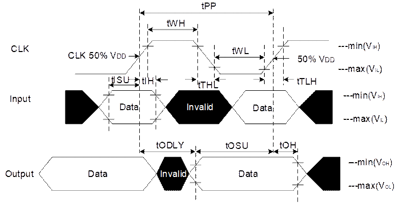

eMMC HS200模式CMD/DATA输入/输出方向时序参数如表2-70所示。

HS200模式CMD/DATA输入/输出时钟时序参数表

| 符号 | 参数 | 最小值 | 典型值 | 最大值 | 单位 | 备注 |
| --- | --- | --- | --- | --- | --- | --- |
| **Clock CLK** | | | | | | |
| tPERIOD | Cycle time data transfer mode | 5 | 5.08 | - | ns | - |
| Duty Cycle | Clock duty cycle | 30 | 50 | 70 | % | - |
| **Outputs DAT** (referenced to CLK) | | | | | | |
| tOSU | Output set-up time | 2.525 | 2.707 | - | ns |  |
| tOH | Output hold time | 1.793 | 2.038 | - | ns |  |
| **Inputs CMD, DAT** (referenced to CLK) | | | | | | |
| tPH | 器件输出CMD/DA与接收CLK相位差 | 0 | - | 2 | UI | UI是单位标称时间，例如196.5MHz 时UI=5.08ns。 |
| tVW | Input valid data window | 0.575 | - | - | UI | 1196.5MHz时tVW = 2.92ns |

eMMC HS400模式DATA输出方向时序如图2-48所示。

HS400模式DATA输出方向时序图

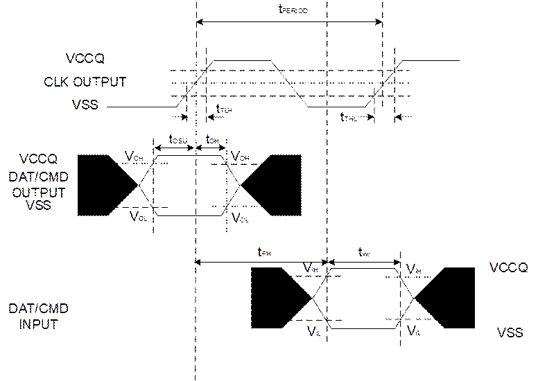

eMMC HS400模式DATA输出方向时序参数如表2-71所示。

HS400模式DATA输出时钟时序参数表

| 符号 | 参数 | 最小值 | 典型值 | 最大值 | 单位 | 备注 |
| --- | --- | --- | --- | --- | --- | --- |
| Clock CLK | | | | | | |
| tPERIOD | Cycle time data transfer mode | 5 | 5.08 | - | ns | - |
| tCKMPW | Minimum pulse width | 2.2 | 2.54 | - | ns | - |
| Output DAT (referenced to CLK) | | | | | | |
| tOSUddr | Output set-up time | 0.612 | 0.926 | - | ns |  |
| tOHddr | Output hold time | 0.9 | 1.029 | - | ns |  |

eMMC HS400模式DATA输入方向时序如图2-49所示。

HS400模式DATA输入方向时序图

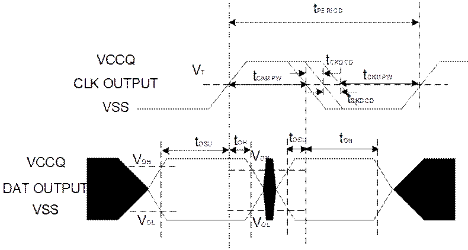

eMMC HS400模式DATA输入方向时序参数如表2-72所示。

HS400模式DATA输入时序参数表

| 符号 | 参数 | 最小值 | 典型值 | 最大值 | 单位 |
| --- | --- | --- | --- | --- | --- |
| Data Strobe | | | | | |
| tPERIOD | Cycle time data transfer mode | 5 | - | - | - |
| tDSDCD | Duty cycle distortion | 0.0 | - | 0.2 | ns |
| tDSMPW | Minimum pulse width | 2.0 | - | - | ns |
| Input DAT (referenced to Data Strobe) | | | | | |
| tRQ | Input skew | - | - | 0.4 | ns |
| tRQH | Input hold skew | - | - | 0.4 | ns |

eMMC HS400模式CMD输入/输出方向时序同HS200模式，HS400（Enhanced data strobe mode）模式CMD输入方向时序如图2-50所示。

HS400（Enhanced data strobe mode）模式CMD输入方向时序图

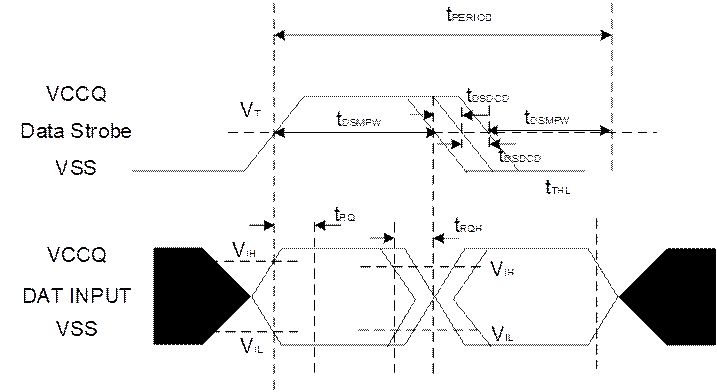

eMMC HS400（Enhanced data strobe mode）模式CMD输入方向时序参数如表2-73所示。

HS400（Enhanced data strobe mode）模式CMD输入时序参数表

| 符号 | 参数 | 最小值 | 典型值 | 最大值 | 单位 |
| --- | --- | --- | --- | --- | --- |
| Data Strobe | | | | | |
| tPERIOD | Cycle time data transfer mode | 5 | - | - | - |
| tDSDCD | Duty cycle distortion | 0.0 | - | 0.2 | ns |
| tDSMPW | Minimum pulse width | 2.0 | - | - | ns |
| Input CMD (referenced to Data Strobe) | | | | | |
| tRQ\_CMD | Input skew(CMD) | - | - | 0.4 | ns |
| tRQH\_CMD | Input hold skew(CMD) | - | - | 0.4 | ns |

#### SDIO接口时序

SDIO DS模式CMD/DATA输出方向时序如图2-51所示，DS模式CMD/DATA输入方向时序如图2-52所示，HS/SDR12/SDR25/SDR50/SDR104模式CMD/DATA输出方向时序如图2-53所示, HS/SDR12/SDR25/SDR50/SDR104模式CMD/DATA输入方向时序如图2-54所示。

SDIO DS模式CMD/DATA输出方向时序图

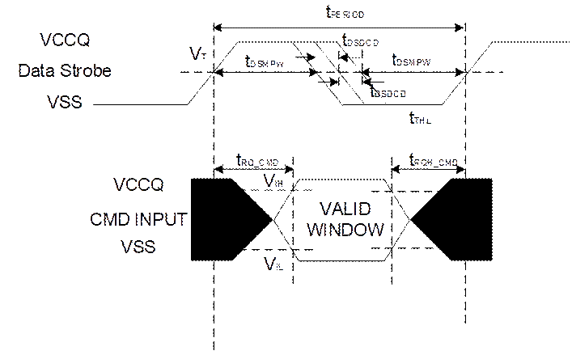

SDIO DS模式CMD/DATA输入方向时序图

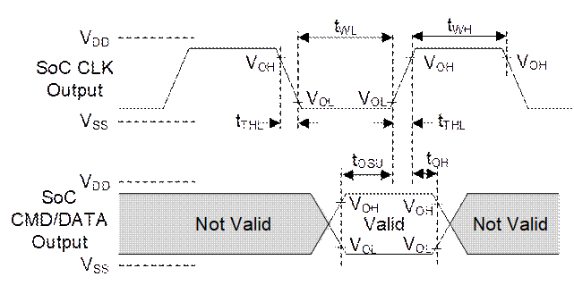

SDIO HS/SDR12/SDR25/SDR50/SDR104模式CMD/DATA输出方向时序图

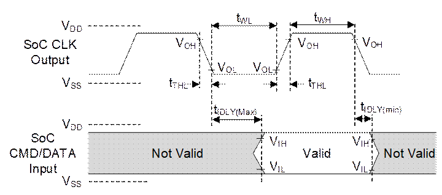

SDIO HS/SDR12/SDR25/SDR50/SDR104模式CMD/DATA输入方向时序图

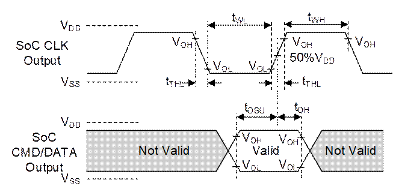

SDIO DS模式CMD/DATA输入/输出时序参数如表2-74所示。

SDIO DS模式输入/输出时序参数表

| 符号 | 参数 | 最小值 | 典型值 | 最大值 | 单位 | 备注 |
| --- | --- | --- | --- | --- | --- | --- |
| **Clock CLK** | | | | | | |
| tCLK | Cycle time data transfer mode | 40 | 40.4 | - | ns | - |
| tWH | Clock high time | 10 | 19 | - | ns | - |
| tWL | Clock low time | 10 | 19 | - | ns | - |
| **Outputs CMD/DAT** (referenced to CLK) | | | | | | |
| tOSU | Output set-up time | 5 | 18 | - | ns | - |
| tOH | Output hold time | 5 | 18 | - | ns | - |
| **Inputs CMD/DAT** (referenced to CLK) | | | | | | |
| tIDLY | Input Delay time during Data Transfer Mode | 0 | - | 14 | ns | - |
| tIDLY | Input Delay time during Identificaction Mode | 0 | - | 50 | ns | - |

SDIO HS模式CMD/DATA输入/输出方向时序参数如表2-75所示。

SDIO HS模式CMD/DATA输入/输出时钟时序参数表

| 符号 | 参数 | 最小值 | 典型值 | 最大值 | 单位 | 备注 |
| --- | --- | --- | --- | --- | --- | --- |
| **Clock CLK** | | | | | | |
| tCLK | Cycle time data transfer mode | 20 | 20.2 | - | ns | - |
| tWH | Clock high time | 7 | 7.89 | - | ns | - |
| tWL | Clock low time | 7 | 7.89 | - | ns | - |
| **Outputs CMD/DAT** (referenced to CLK) | | | | | | |
| tOSU | Output set-up time | 6 | 8 | - | ns | - |
| tOH | Output hold time | 2 | 9 | - | ns | - |
| **Inputs CMD/DAT** (referenced to CLK) | | | | | | |
| tIDLY | Input Delay time during Data Transfer Mode | - | - | 14 | ns | - |
| tIH | Input Hold time | 2.5 | - | - | ns | - |

SDIO SDR12模式CMD/DATA输入/输出时钟时序参数表

| 符号 | 参数 | 最小值 | 典型值 | 最大值 | 单位 | 备注 |
| --- | --- | --- | --- | --- | --- | --- |
| **Clock CLK** | | | | | | |
| tCLK | Cycle time data transfer mode | 40 | 40.4 | - | ns | - |
| Duty Cycle | Clock duty cycle | 30 | 50 | 70 | % | - |
| **Outputs CMD/DAT** (referenced to CLK) | | | | | | |
| tOSU | Output set-up time | 5 | 18 | - | ns | - |
| tOH | Output hold time | 5 | 18 | - | ns | - |
| **Inputs CMD/DAT** (referenced to CLK) | | | | | | |
| tIDLY | Input Delay time during Data Transfer Mode | 0 | - | 14 | ns | - |
| tIH | Input Hold time | 1.5 | - | - | ns | - |

SDIO SDR25模式CMD/DATA输入/输出时钟时序参数表

| 符号 | 参数 | 最小值 | 典型值 | 最大值 | 单位 | 备注 |
| --- | --- | --- | --- | --- | --- | --- |
| **Clock CLK** | | | | | | |
| tCLK | Cycle time data transfer mode | 20 | 20.2 | - | ns | - |
| Duty Cycle | Clock duty cycle | 30 | 50 | 70 | % | - |
| **Outputs CMD/DAT** (referenced to CLK) | | | | | | |
| tOSU | Output set-up time | 6 | 8 | - | ns | - |
| tOH | Output hold time | 2 | 9 | - | ns | - |
| **Inputs CMD/DAT** (referenced to CLK) | | | | | | |
| tIDLY | Input Delay time during Data Transfer Mode | - | - | 14 | ns | - |
| tIH | Input Hold time | 2.5 | - | - | ns | - |

SDIO SDR50模式CMD/DATA输入/输出时钟时序参数表

| 符号 | 参数 | 最小值 | 典型值 | 最大值 | 单位 | 备注 |
| --- | --- | --- | --- | --- | --- | --- |
| **Clock CLK** | | | | | | |
| tCLK | Cycle time data transfer mode | 10 | 10.1 | - | ns | - |
| Duty Cycle | Clock duty cycle | 30 | 50 | 70 | % | - |
| **Outputs CMD/DAT** (referenced to CLK) | | | | | | |
| tOSU | Output set-up time | 3.0 | 4.0 | - | ns | - |
| tOH | Output hold time | 1.0 | 4.5 | - | ns | - |
| **Inputs CMD/DAT** (referenced to CLK) | | | | | | |
| tIDLY | Input Delay time during Data Transfer Mode | - | - | 14 | ns | - |
| tIH | Input Hold time | 1.5 | - | - | ns | - |

SDIO SDR104模式CMD/DATA输入/输出时钟时序参数表

| 符号 | 参数 | 最小值 | 典型值 | 最大值 | 单位 | 备注 |
| --- | --- | --- | --- | --- | --- | --- |
| **Clock CLK** | | | | | | |
| tCLK | Cycle time data transfer mode | 4.8 | 4.9 | - | ns | - |
| Duty Cycle | Clock duty cycle | 30 | 50 | 70 | % | - |
| **Outputs CMD/DAT** (referenced to CLK) | | | | | | |
| tOSU | Output set-up time | 1.4 | 1.6 | - | ns | - |
| tOH | Output hold time | 0.8 | 1.6 | - | ns | - |
| **Inputs CMD/DAT** (referenced to CLK) | | | | | | |
| tIDLY | Input Delay time during Data Transfer Mode | - | - | 7.5 | ns | - |
| tIH | Input Hold time | 1.5 | - | - | ns | - |

