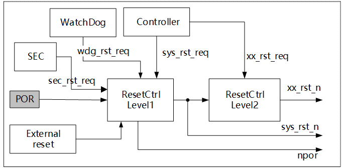
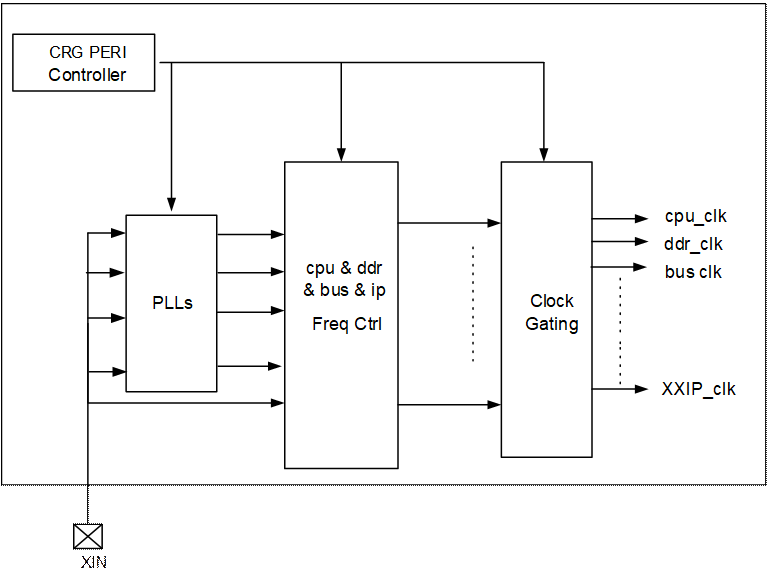
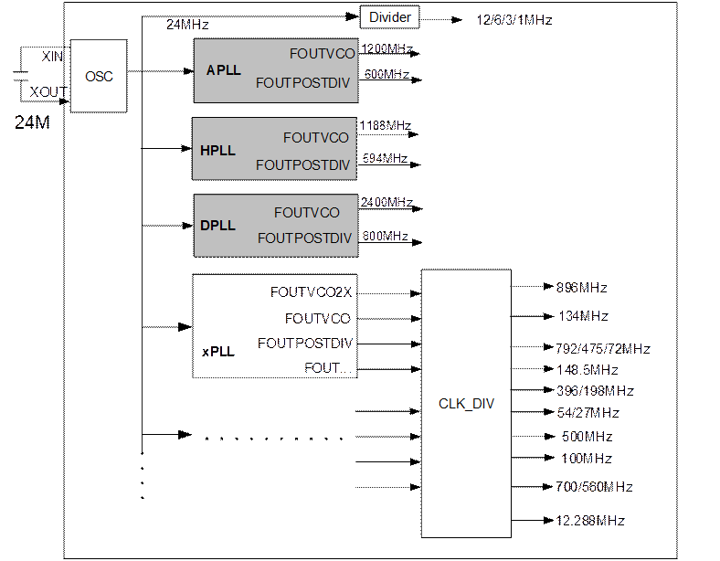
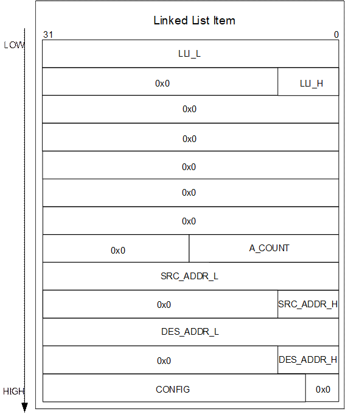
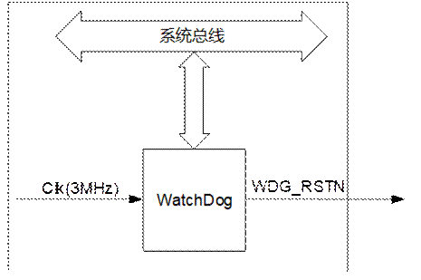
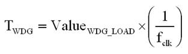

目 录

[3 系统 3-1](#_Toc118984758)

[3.1 复位 3-1](#_Toc118984759)

[3.1.1 概述 3-1](#_Toc118984760)

[3.1.2 复位控制 3-1](#_Toc118984761)

[3.1.3 复位配置 3-3](#_Toc118984762)

[3.2 时钟 3-3](#_Toc118984763)

[3.2.1 概述 3-3](#_Toc118984764)

[3.2.2 功能框图 3-4](#_Toc118984765)

[3.2.3 时钟资源分布 3-4](#_Toc118984766)

[3.2.4 PLL配置 3-9](#_Toc118984767)

[3.2.5 CRG寄存器概览 3-11](#_Toc118984768)

[3.2.6 CRG寄存器描述 3-18](#_Toc118984769)

[3.3 处理器子系统 3-129](#_Toc118984770)

[3.4 中断系统 3-129](#_Toc118984771)

[3.5 核间通信 3-133](#_Toc118984772)

[3.5.1 概述 3-133](#_Toc118984773)

[3.5.2 核间通信模块特点 3-133](#_Toc118984774)

[3.6 系统控制器 3-134](#_Toc118984775)

[3.6.1 概述 3-134](#_Toc118984776)

[3.6.2 特点 3-134](#_Toc118984777)

[3.6.3 功能描述 3-134](#_Toc118984778)

[3.6.4 系统控制器寄存器 3-135](#_Toc118984779)

[3.6.5 SOC MISC寄存器 3-151](#_Toc118984780)

[3.6.6 PCIE地址白名单寄存器 3-171](#_Toc118984781)

[3.6.7 SPI\_CFG寄存器 3-200](#_Toc118984782)

[3.6.8 DMA\_PERI\_CHANNEL\_REQ\_SEL寄存器 3-201](#_Toc118984783)

[3.7 DMA控制器 3-201](#_Toc118984784)

[3.7.1 概述 3-201](#_Toc118984785)

[3.7.2 特点 3-202](#_Toc118984786)

[3.7.3 功能描述 3-202](#_Toc118984787)

[3.7.4 工作方式 3-211](#_Toc118984788)

[3.7.5 DMAC寄存器概览 3-219](#_Toc118984789)

[3.7.6 DMAC寄存器描述 3-221](#_Toc118984790)

[3.8 定时器 3-239](#_Toc118984791)

[3.8.1 概述 3-239](#_Toc118984792)

[3.8.2 特点 3-239](#_Toc118984793)

[3.8.3 功能描述 3-239](#_Toc118984794)

[3.8.4 工作方式 3-240](#_Toc118984795)

[3.8.5 Timer寄存器概览 3-241](#_Toc118984796)

[3.8.6 Timer寄存器描述 3-242](#_Toc118984797)

[3.9 WatchDog 3-246](#_Toc118984798)

[3.9.1 概述 3-246](#_Toc118984799)

[3.9.2 特点 3-246](#_Toc118984800)

[3.9.3 功能描述 3-247](#_Toc118984801)

[3.9.4 工作方式 3-248](#_Toc118984802)

[3.9.5 WDG寄存器概览 3-249](#_Toc118984803)

[3.9.6 WDG寄存器描述 3-250](#_Toc118984804)

[3.10 电源管理与低功耗模式控制 3-253](#_Toc118984805)

[3.10.1 概述 3-253](#_Toc118984806)

[3.10.2 时钟门控和时钟频率调整 3-253](#_Toc118984807)

[3.10.3 模块级低功耗控制 3-254](#_Toc118984808)

[3.10.4 DDR低功耗控制 3-254](#_Toc118984809)

[3.10.5 功能描述 3-254](#_Toc118984810)

[3.10.6 Tsensor\_CTRL内部寄存器概览 3-256](#_Toc118984811)

[3.10.7 Tsensor\_CTRL寄存器描述 3-256](#_Toc118984812)

[3.11 MCU子系统 3-261](#_Toc118984813)

[3.11.1 概述 3-261](#_Toc118984814)

[3.11.2 功能描述 3-261](#_Toc118984815)

[3.11.3 中断系统 3-262](#_Toc118984816)

[3.11.4 MCU子系统控制器 3-263](#_Toc118984817)

[3.11.5 DMA控制器 3-267](#_Toc118984818)

[3.11.6 TIMER 3-267](#_Toc118984819)

[3.11.7 RV\_MTIME 3-267](#_Toc118984820)

插图目录

[图3-1 复位信号控制图 3-2](#_Toc110268939)

[图3-2 时钟管理模块功能框图 3-4](#_Toc110268940)

[图3-3 时钟资源分布框图 3-5](#_Toc110268941)

[图3-4 链表在DDR内存放的格式示意图 3-209](#_Toc110268942)

[图3-5 WatchDog应用框图 3-246](#_Toc110268943)

表格目录

[表3-1 复位信号分类表 3-2](#_Toc119071339)

[表3-2 主要模块可选时钟列表 3-5](#_Toc119071340)

[表3-3 PLL对应的配置寄存器 3-9](#_Toc119071341)

[表3-4 PLL频率计算方法 3-9](#_Toc119071342)

[表3-5 CRG寄存器概览（基地址：0x0\_1101\_0000） 3-11](#_Toc119071343)

[表3-6 中断源分配表 3-129](#_Toc119071344)

[表3-7 系统控制器寄存器概览（基地址：0x0\_1102\_0000） 3-135](#_Toc119071345)

[表3-8 SOC MISC寄存器概览（基地址：0x0\_1102\_4000） 3-151](#_Toc119071346)

[表3-9 PCIE地址白名单寄存器概览（基地址：0x0\_1022\_0000） 3-171](#_Toc119071347)

[表3-10 SPI\_CFG\_REG寄存器概览（基地址：0x0\_102E\_0000） 3-200](#_Toc119071348)

[表3-11 DMA\_PERI\_CHANNEL\_REQ\_SEL\_REG寄存器概览 (基地址：0x0\_102E\_0000) 3-201](#_Toc119071349)

[表3-12 DMAC外设Single和Burst硬件请求线编号说明 3-202](#_Toc119071350)

[表3-13 DMAC外设接收 Last Single硬件请求线编号说明 3-205](#_Toc119071351)

[表3-14 DMAC访问空间说明 3-207](#_Toc119071352)

[表3-15 各模块的寄存器偏移地址变量表 3-219](#_Toc119071353)

[表3-16 DMAC寄存器概览 3-219](#_Toc119071354)

[表3-17 Timer寄存器概览 3-242](#_Toc119071355)

[表3-18 WatchDog寄存器概览 3-250](#_Toc119071356)

[表3-19 各模块的寄存器偏移地址变量表 3-256](#_Toc119071357)

[表3-20 Tsensor\_CTRL寄存器概览（基地址：0x0\_1102\_E000） 3-256](#_Toc119071358)

[表3-21 MCU子系统中断源分配表 3-263](#_Toc119071359)

[表3-22 MCU子系统控制寄存器概览（基地址：0x0\_110D\_2000） 3-264](#_Toc119071360)

[表3-23 RV\_MTIME寄存器概览(基地址：0x0\_110D\_1000) 3-268](#_Toc119071361)

# 系统

## 复位

### 概述

复位管理模块对整个芯片的复位、各功能模块的复位进行统一的管理，包括：

- 上电复位的管理和控制
- 外部复位的管理和控制
- WatchDog复位管理和控制
- 安全系统复位管理和控制
- 系统软复位、功能模块单独软复位控制
- 复位信号同步到各模块对应时钟域
- 生成芯片内部各功能模块的复位信号

### 复位控制

复位信号控制如图3-1所示。

复位信号控制图

|  |  |
| --- | --- |
| POR | 芯片内部上电复位（Power-On-Reset）模块。 |
| wdg\_rst\_req | WatchDog复位请求。 |
| sec\_rst\_req | 安全系统复位请求 |
| sys\_rst\_req | 全局软复位请求信号，源自系统控制器。 |
| xx\_rst\_req | 子模块单独软复位请求信号，源自CRG控制寄存器。 |
| xx\_rst\_n、sys\_rst\_n、npor | 复位信号。 |

复位信号分类如表3-1所示。

复位信号分类表

| 复位信号类型 | 产生方式 | 用途 |
| --- | --- | --- |
| 全局硬复位  npor | 外部复位和内部上电复位POR模块 | 对SOC系统进行全局复位。 |
| 全局软复位sys\_rst\_n | 软件配置系统控制器的全局软复位寄存器 | 复位SOC系统中的所有模块，除了时钟复位电路，测试电路和部分不会被软复位的寄存器。 |
| 子模块复位xx\_rst\_n | 软件配置CRG控制寄存器的子模块复位控制寄存器 | SOC系统各子模块的单独复位。 |

### 复位配置

#### 上电复位

完成上电复位过程必须同时满足以下条件：

- 内部POR模块产生一个低电平脉冲；且低电平维持时间大于12个XIN晶振时钟周期。
- 晶振时钟输入管脚XIN输入的时钟稳定。

#### 系统复位

实现系统复位有以下途径：

- 上电复位。
- 外部复位。
- WatchDog复位。
- 安全系统复位。
- 全局软复位，通过系统控制器控制。

#### 模块软复位

软复位控制通过配置相应的CRG控制器来实现，具体配置请参见每个模块的复位寄存器描述。

<strong><big>须知</big></strong>

- 系统软复位请求发出后，整芯片必须等待至少约35ms才完成复位撤消。在这35ms内不能再发系统软复位请求，否则系统状态混乱，可能无法完成复位操作。
- 各模块单独软复位不会自动撤消，例如某模块的复位是配置1时，模块处于复位状态，必须再配置为0，该模块复位才会撤消。

## 时钟

### 概述

时钟管理模块对芯片时钟输入、时钟生成和控制进行统一的管理，包括：

- 时钟输入的管理和控制
- 时钟分频和控制
- 生成各模块的工作时钟

### 功能框图

时钟管理模块功能框图如图3-2所示。

时钟管理模块功能框图

注：图中XIN为PLL输入时钟，固定连接24MHz晶体。

### 时钟资源分布

时钟管理模块对源自芯片管脚的输入时钟和内部PLL进行配置、控制和管理，产生各模块所需的时钟资源，具体分布示意如图3-3所示。

时钟资源分布框图

主要模块可选时钟列表，如表3-2所示。（具体配置请参考各模块的时钟选择寄存器描述）

主要模块可选时钟列表

| 模块 | 默认频点 | 所有频点 | 备注 |
| --- | --- | --- | --- |
| A55 | 24MHz | 24MHz | - |
| 1188MHz |
| APLL\_POSTDIV |
| A55\_FCM | 24MHz | 24MHz | - |
| 896MHz |
| DDR | 24MHz | 24MHz | - |
| 672MHz |
| 750MHz |
| DPLL\_POSTDIV |
| HPAXI | 24MHz | 24MHz | PCIE、USB3和GZIP的总线接口频点 |
| 396MHz |
| 475MHz |
| DDR AXI | 24MHz | 24MHz | 高性能媒体模块的总线接口频点 |
| 500MHz |
| 672MHz |
| 750MHz |
| CFG APB | 24MHz | 24MHz | - |
| 99MHz |
| DATA AXI | 24MHz | 24MHz | SEC(安全)、FMC、EMMC、SDIO、GMAC、DMAC的总线接口频点 |
| 198MHz |
| 297MHz |
| 396MHz |
| MIPI RX CTRL0/1/2/3/4 | 100MHz | 100MHz | MIPI RX CTRL 0/1/2/3/4独立可选 |
| 150MHz |
| 200MHz |
| 250MHz |
| 300MHz |
| 396MHz |
| 475MHz |
| 600MHz |
| VICAP PPC | 150MHz | 150MHz | Pixel Process Clock |
| 300MHz |
| 396MHz |
| 475MHz |
| 600MHz |
| ISP0/1/2/3 | 150MHz | 150MHz | - |
| 300MHz |
| 396MHz |
| 475MHz |
| 600MHz |
| VIPROC | 150MHz | 150MHz | - |
| 300MHz |
| 396MHz |
| 475MHz |
| 600MHz |
| 150MHz | ISP0 | 在线 |
| VPSS | 150MHz | 150MHz | - |
| 300MHz |
| 396MHz |
| 475MHz |
| 600MHz |
| 150MHz | VIPROC | 在线 |
| AIAO | 1188MHz | 1188MHz | 实际工作频率为此时钟的分频 |
| 786.432MHz |
| FMC | 24MHz | 24MHz | - |
| 99MHz |
| 148.5MHz |
| 198MHz |
| 250MHz |
| 297MHz |
| 396MHz |
| SDIO0/1 | 1600KHz | 1600KHz | - |
| 99MHz |
| 198MHz |
| 396MHz |
| 594MHz |
| 750MHz |
| 786MHz |
| eMMC | 1600KHz | 1600KHz | - |
| 99MHz |
| 198MHz |
| 396MHz |
| 594MHz |
| 750MHz |
| 786MHz |
| VDP DHD0 | 594MHz | HPLL\_POSTDIV | 通道源时钟，专用PLL |
| VDP DHD1 | 148.5MHz | 148.5MHz | 通道源时钟 |
| 134MHz |
| 108MHz |
| 74.25MHz |
| 64MHz |
| 54MHz |
| 37.125MHz |
| 13.5MHz |
| RGB分频器时钟 |
| sensor0/1/2/3 | 74.25MHz | 74.25MHz | SOC系统输出给sensor的参考时钟 |
| 72MHz |
| 54MHz |
| 50MHz |
| 24MHz |
| 37MHz |
| 36MHz |
| 27MHz |
| 25MHz |
| 12MHz |

### PLL配置

芯片内部使用了3个可配置的PLL，每个PLL使用两组配置寄存器，对应关系如表3-3所示。

PLL对应的配置寄存器

| PLL | 配置寄存器0 | 配置寄存器1 |
| --- | --- | --- |
| APLL | PERI\_CRG\_PLL0 | PERI\_CRG\_PLL1 |
| DPLL | PERI\_CRG\_PLL96 | PERI\_CRG\_PLL97 |
| HPLL | PERI\_CRG\_PLL224 | PERI\_CRG\_PLL225 |

PLL均采用管脚XIN输入的晶振时钟作为输入时钟，PLL输出频率配置方法如表3-4所示。

PLL频率计算方法

| PLL Pin | 计算方法描述 | 注意事项 |
| --- | --- | --- |
| FREF | PLL输入参考时钟 | 芯片要求固定输入24MHz |
| FOUTVCO | FREF x ( fbdiv + frac/ 224) / refdiv | PLL工作频率，要求大于等于800MHz，且小于等于3.2GHz |
| FOUTVCO2X | FOUTVCO \* 2 | - |
| FOUTPOSTDIV | FOUTVCO / (pstdiv1 x pstdiv2) | pstdiv1 >= pstdiv2 |
| FOUT1PH0 | FOUTVCO / (pstdiv1 x pstdiv2 x 2) | - |
| FOUT2 | FOUTVCO / (pstdiv1 x pstdiv2 x 4) | - |
| FOUT3 | FOUTVCO / (pstdiv1 x pstdiv2 x 6) | - |
| FOUT4 | FOUTVCO / (pstdiv1 x pstdiv2 x 8) | - |
| 备注：  Fbdiv：倍频系数的整数部分；  frac：倍频系数的小数部分；  refdiv：参考时钟分频系数；  pstdiv1：第一级输出分频系数；  pstdiv2：第二级输出分频系数。  各PLL的配置系数请参见表3-3对应配置寄存器的相应Bit位。 | | |

注：考虑PLL抗噪能力和更小的时钟Jitter，推荐refdiv固定配置为1。

例如，需要配置APLL FOUTVCO输出1200MHz，FOUTPOSTDIV输出频率为FOUTVCO的一半，计算过程如下：

- 配置FOUTPOSTDIV输出频率为FOUTVCO的一半。根据FOUTPOSTDIV=FOUTVCO / (pstdiv1 x pstdiv2)，取postdiv2＝1，postdiv1＝2
- 配置FOUTVCO输出1200MHz，根据FREF x ( fbdiv + frac/224) / refdiv =1200MHz，其中FREF=24MHz，若取refdiv=1，计算出fbdiv=50，frac=0

#### 注意事项

配置PLL需要按照以下步骤：

切换时钟，选择非PLL时钟，或者其他PLL时钟，或者关闭业务时钟门控。

PowerDown PLL。

更改PLL配置。

PowerUp PLL。

等待0.1ms后观测对应PLL寄存器的LOCK状态位。

如果PLLLOCK寄存器为LOCK状态，PLL配置完成，否则回到步骤2，直到PLLLOCK寄存器为LOCK状态。

----结束

### CRG寄存器概览

CRG寄存器概览如表3-5所示。

CRG寄存器概览（基地址：0x0\_1101\_0000）

| 偏移地址 | 名称 | 描述 | 页码 |
| --- | --- | --- | --- |
| 0x0000 | PERI\_CRG\_PLL0 | APLL配置寄存器0 | 3-17 |
| 0x0004 | PERI\_CRG\_PLL1 | APLL配置寄存器1 | 3-18 |
| 0x0038 | PERI\_CRG\_PLL14 | APLL LOCK状态寄存器 | 3-19 |
| 0x0068 | PERI\_CRG26 | APLL REE侧写权限控制寄存器 | 3-19 |
| 0x0180 | PERI\_CRG\_PLL96 | DPLL配置寄存器0 | 3-20 |
| 0x0184 | PERI\_CRG\_PLL97 | DPLL配置寄存器1 | 3-20 |
| 0x0190 | PERI\_CRG100 | DPLL 展频配置寄存器 | 3-21 |
| 0x0198 | PERI\_CRG102 | DPLL硬件微调电路LOCK状态寄存器 | 3-23 |
| 0x019C | PERI\_CRG103 | DPLL1时钟微调电路配置寄存器 | 3-23 |
| 0x01A0 | PERI\_CRG104 | DPLL2时钟微调电路配置寄存器 | 3-24 |
| 0x01A4 | PERI\_CRG105 | DPLL3时钟微调电路配置寄存器 | 3-25 |
| 0x01A8 | PERI\_CRG106 | DPLL4时钟微调电路配置寄存器 | 3-25 |
| 0x01B8 | PERI\_CRG\_PLL110 | DPLL LOCK状态寄存器 | 3-26 |
| 0x01E8 | PERI\_CRG122 | DPLL REE侧写权限控制寄存器 | 3-26 |
| 0x0380 | PERI\_CRG\_PLL224 | HPLL配置寄存器0 | 3-26 |
| 0x0384 | PERI\_CRG\_PLL225 | HPLL配置寄存器1 | 3-27 |
| 0x03B8 | PERI\_CRG\_PLL238 | HPLL LOCK状态寄存器 | 3-28 |
| 0x03E8 | PERI\_CRG250 | HPLL REE侧写权限控制寄存器 | 3-28 |
| 0x2000 | PERI\_CRG2048 | SOC频率配置寄存器 | 3-29 |
| 0x2020 | PERI\_CRG2056 | SOC频率指示寄存器 | 3-30 |
| 0x2040 | PERI\_CRG2064 | CPU\_SUBSYS时钟复位配置寄存器 | 3-31 |
| 0x2044 | PERI\_CRG2065 | CPU\_SUBSYS频率指示寄存器 | 3-32 |
| 0x2048 | PERI\_CRG2066 | CPU CORE0时钟复位配置寄存器 | 3-33 |
| 0x204C | PERI\_CRG2067 | CPU CORE1时钟复位配置寄存器 | 3-34 |
| 0x2050 | PERI\_CRG2068 | CPU CORE2时钟复位配置寄存器 | 3-34 |
| 0x2054 | PERI\_CRG2069 | CPU CORE3时钟复位配置寄存器 | 3-35 |
| 0x2058 | PERI\_CRG2070 | CPU REE侧写权限控制寄存器 | 3-35 |
| 0x2240 | PERI\_CRG2192 | CPU Debug (Coresight)时钟配置寄存器 | 3-36 |
| 0x2280 | PERI\_CRG2208 | DDR时钟复位配置寄存器 | 3-36 |
| 0x2284 | PERI\_CRG2209 | DDR频率指示寄存器 | 3-37 |
| 0x2288 | PERI\_CRG2210 | DDR HIPACK0时钟复位配置寄存器 | 3-38 |
| 0x228C | PERI\_CRG2211 | DDR HIPACK1时钟复位配置寄存器 | 3-38 |
| 0x2A80 | PERI\_CRG2720 | DMAC相关的时钟及软复位控制寄存器 | 3-39 |
| 0x2A84 | PERI\_CRG2721 | MCU DMAC相关的时钟及软复位控制寄存器 | 3-39 |
| 0x34C0 | PERI\_CRG3376 | eMMC接口时钟复位控制寄存器 | 3-40 |
| 0x34C4 | PERI\_CRG3377 | eMMC p4 DLL控制寄存器 | 3-41 |
| 0x34C8 | PERI\_CRG3378 | eMMC DRV DLL控制寄存器 | 3-42 |
| 0x34CC | PERI\_CRG3379 | eMMC SAM DLL控制寄存器 | 3-43 |
| 0x34D0 | PERI\_CRG3380 | eMMC DS DLL控制寄存器 | 3-44 |
| 0x34D4 | PERI\_CRG3381 | eMMC边沿检测时钟相位选择寄存器 | 3-46 |
| 0x34D8 | PERI\_CRG3382 | eMMC状态寄存器 | 3-46 |
| 0x35C0 | PERI\_CRG3440 | SDIO0接口时钟复位控制寄存器 | 3-47 |
| 0x35C4 | PERI\_CRG3441 | SDIO0 p4 DLL控制寄存器 | 3-48 |
| 0x35C8 | PERI\_CRG3442 | SDIO0 DRV DLL控制寄存器 | 3-49 |
| 0x35CC | PERI\_CRG3443 | SDIO0 SAM DLL控制寄存器 | 3-51 |
| 0x35D4 | PERI\_CRG3445 | SDIO0边沿检测时钟相位选择寄存器 | 3-52 |
| 0x35D8 | PERI\_CRG3446 | SDIO0状态寄存器 | 3-52 |
| 0x36C0 | PERI\_CRG3504 | SDIO1接口时钟复位控制寄存器 | 3-53 |
| 0x36C4 | PERI\_CRG3505 | SDIO1 p4 DLL控制寄存器 | 3-54 |
| 0x36C8 | PERI\_CRG3506 | SDIO1 DRV DLL控制寄存器 | 3-55 |
| 0x36CC | PERI\_CRG3507 | SDIO1 SAM DLL控制寄存器 | 3-56 |
| 0x36D4 | PERI\_CRG3509 | SDIO1边沿检测时钟相位选择寄存器 | 3-58 |
| 0x36D8 | PERI\_CRG3510 | SDIO1状态寄存器 | 3-58 |
| 0x37C0 | PERI\_CRG3568 | 网络0时钟及软复位控制寄存器 | 3-59 |
| 0x37C4 | PERI\_CRG3569 | GMAC0时钟及软复位控制寄存器 | 3-60 |
| 0x37CC | PERI\_CRG3571 | FEPHY0时钟及软复位控制寄存器 | 3-60 |
| 0x3800 | PERI\_CRG3584 | 网络1时钟及软复位控制寄存器 | 3-61 |
| 0x3804 | PERI\_CRG3585 | GMAC1时钟及软复位控制寄存器 | 3-61 |
| 0x380C | PERI\_CRG3587 | FEPHY1时钟及软复位控制寄存器 | 3-62 |
| 0x38C0 | PERI\_CRG3632 | USB2.0 PHY0时钟及软复位控制寄存器 | 3-62 |
| 0x38E0 | PERI\_CRG3640 | USB2.0 PHY1时钟及软复位控制寄存器 | 3-63 |
| 0x3940 | PERI\_CRG3664 | USB3.0兼容(USB2.0) CTRL0时钟及软复位控制寄存器 | 3-64 |
| 0x3944 | PERI\_CRG3665 | USB3.0 PHY0时钟及软复位控制寄存器 | 3-66 |
| 0x3960 | PERI\_CRG3672 | USB3.0(兼容USB2.0) CTRL1时钟及软复位控制寄存器 | 3-66 |
| 0x3964 | PERI\_CRG3673 | USB3.0 PHY1时钟及软复位控制寄存器 | 3-68 |
| 0x3A40 | PERI\_CRG\_PLL3728 | PCIE时钟及软复位控制寄存器 | 3-69 |
| 0x3A48 | PERI\_CRG3730 | PCIE输出时钟控制寄存器 | 3-70 |
| 0x3A58 | PERI\_CRG\_PLL3734 | PCIE PHY时钟及软复位控制寄存器 | 3-71 |
| 0x3F40 | PERI\_CRG4048 | FMC相关的时钟及软复位控制寄存器 | 3-71 |
| 0x3F44 | PERI\_CRG4049 | FMC频率指示寄存器 | 3-72 |
| 0x4180 | PERI\_CRG4192 | UART0时钟及复位控制寄存器 | 3-73 |
| 0x4188 | PERI\_CRG4194 | UART1时钟及复位控制寄存器 | 3-74 |
| 0x4190 | PERI\_CRG4196 | UART2时钟及复位控制寄存器 | 3-74 |
| 0x4198 | PERI\_CRG4198 | UART3时钟及复位控制寄存器 | 3-75 |
| 0x41A0 | PERI\_CRG4200 | UART4时钟及复位控制寄存器 | 3-76 |
| 0x41A8 | PERI\_CRG4202 | UART5时钟及复位控制寄存器 | 3-77 |
| 0x4280 | PERI\_CRG4256 | I2C0时钟及复位控制寄存器 | 3-77 |
| 0x4288 | PERI\_CRG4258 | I2C1时钟及复位控制寄存器 | 3-78 |
| 0x4290 | PERI\_CRG4260 | I2C2时钟及复位控制寄存器 | 3-79 |
| 0x4298 | PERI\_CRG4262 | I2C3时钟及复位控制寄存器 | 3-79 |
| 0x42A0 | PERI\_CRG4264 | I2C4时钟及复位控制寄存器 | 3-80 |
| 0x42A8 | PERI\_CRG4266 | I2C5时钟及复位控制寄存器 | 3-80 |
| 0x4480 | PERI\_CRG4384 | SPI0时钟及复位控制寄存器 | 3-81 |
| 0x4488 | PERI\_CRG4386 | SPI1时钟及复位控制寄存器 | 3-82 |
| 0x4490 | PERI\_CRG4388 | SPI2时钟及复位控制寄存器 | 3-82 |
| 0x4498 | PERI\_CRG4390 | SPI3时钟及复位控制寄存器 | 3-83 |
| 0x44A0 | PERI\_CRG4392 | SPI 3wire时钟及复位控制寄存器 | 3-83 |
| 0x4580 | PERI\_CRG4448 | SVB PWM时钟软复位控制寄存器 | 3-84 |
| 0x4588 | PERI\_CRG4450 | PWM0时钟软复位控制寄存器 | 3-84 |
| 0x4590 | PERI\_CRG4452 | PWM1时钟软复位控制寄存器 | 3-85 |
| 0x4640 | PERI\_CRG4496 | IR时钟软复位控制寄存器 | 3-86 |
| 0x4648 | PERI\_CRG4498 | VI 热成像时钟软复位控制寄存器 | 3-86 |
| 0x46C0 | PERI\_CRG4528 | LSADC时钟软复位控制寄存器 | 3-88 |
| 0x6400 | PERI\_CRG6400 | MCU时钟及软复位控制寄存器 | 3-88 |
| 0x6404 | PERI\_CRG6401 | MCU频率指示寄存器 | 3-89 |
| 0x6508 | PERI\_CRG6466 | DSP0 REE侧写权限控制寄存器 | 3-90 |
| 0x6520 | PERI\_CRG6472 | DSP1 REE侧写权限控制寄存器 | 3-90 |
| 0x668C | PERI\_CRG6563 | NPU REE侧写权限控制寄存器 | 3-91 |
| 0x7F40 | PERI\_CRG8144 | HDMITX CTRL时钟及复位控制寄存器 | 3-91 |
| 0x7F60 | PERI\_CRG8152 | HDMITX PHY时钟及复位控制寄存器 | 3-92 |
| 0x8140 | PERI\_CRG8272 | MIPITX时钟及软复位控制寄存器 | 3-93 |
| 0x8240 | PERI\_CRG8336 | VDP工作时钟及复位控制寄存器 | 3-94 |
| 0x8248 | PERI\_CRG8338 | VDP BT(BT.656/HT.1120)输出时钟相位配置寄存器 | 3-95 |
| 0x8250 | PERI\_CRG8340 | VDP DHD0时钟分频系数及时钟相位 | 3-95 |
| 0x8254 | PERI\_CRG8341 | VDP DHD1时钟分频系数及时钟相位 | 3-97 |
| 0x8258 | PERI\_CRG8342 | VDP SD时钟门控及时钟选择控制寄存器 | 3-98 |
| 0x8268 | PERI\_CRG8346 | VDP RGB时钟配置寄存器 | 3-98 |
| 0x8270 | PERI\_CRG8348 | VDP BT(BT.656/HT.1120)时钟门控及时钟选择控制寄存器 | 3-99 |
| 0x8278 | PERI\_CRG8350 | VDP SD DAC时钟分频系数及时钟相位 | 3-100 |
| 0x827C | PERI\_CRG8351 | HDMI PIXEL时钟控制寄存器 | 3-100 |
| 0x8280 | PERI\_CRG8352 | MIPITX PIXEL时钟控制寄存器 | 3-101 |
| 0x8440 | PERI\_CRG8464 | SENSOR0时钟复位配置寄存器 | 3-101 |
| 0x8460 | PERI\_CRG8472 | SENSOR1时钟复位配置寄存器 | 3-102 |
| 0x8480 | PERI\_CRG8480 | SENSOR2时钟复位配置寄存器 | 3-104 |
| 0x84A0 | PERI\_CRG8488 | SENSOR3时钟复位配置寄存器 | 3-105 |
| 0x8540 | PERI\_CRG8528 | MIPI\_RX CTRL时钟复位配置寄存器 | 3-106 |
| 0x8560 | PERI\_CRG8536 | MIPI\_RX PIX0时钟复位配置寄存器 | 3-107 |
| 0x8580 | PERI\_CRG8544 | MIPI\_RX PIX1时钟复位配置寄存器 | 3-107 |
| 0x85A0 | PERI\_CRG8552 | MIPI\_RX PIX2时钟复位配置寄存器 | 3-108 |
| 0x85C0 | PERI\_CRG8560 | MIPI\_RX PIX3时钟复位配置寄存器 | 3-108 |
| 0x9140 | PERI\_CRG9296 | VICAP时钟及复位控制寄存器 | 3-109 |
| 0x9144 | PERI\_CRG9297 | VICAP复位状态寄存器 | 3-110 |
| 0x9148 | PERI\_CRG9298 | VI CH和PORT时钟控制寄存器 | 3-110 |
| 0x9150 | PERI\_CRG9300 | VI ISP0时钟及复位控制寄存器 | 3-111 |
| 0x9154 | PERI\_CRG9301 | VI ISP1时钟及复位控制寄存器 | 3-112 |
| 0x9158 | PERI\_CRG9302 | VI ISP2时钟及复位控制寄存器 | 3-113 |
| 0x915C | PERI\_CRG9303 | VI ISP3时钟及复位控制寄存器 | 3-114 |
| 0x9160 | PERI\_CRG9304 | VI COMS0时钟及复位控制寄存器 | 3-115 |
| 0x9164 | PERI\_CRG9305 | VI PORT0时钟及复位控制寄存器 | 3-115 |
| 0x9184 | PERI\_CRG9313 | VI PORT1时钟及复位控制寄存器 | 3-116 |
| 0x91A4 | PERI\_CRG9321 | VI PORT2时钟及复位控制寄存器 | 3-117 |
| 0x91C4 | PERI\_CRG9329 | VI PORT3时钟及复位控制寄存器 | 3-117 |
| 0x9740 | PERI\_CRG9680 | VIPROC时钟及复位配置寄存器 | 3-118 |
| 0x9744 | PERI\_CRG9681 | VIPROC复位状态寄存器 | 3-119 |
| 0x9B40 | PERI\_CRG9936 | VPSS时钟及软复位控制寄存器 | 3-120 |
| 0x9B44 | PERI\_CRG9937 | VPSS复位状态寄存器 | 3-121 |
| 0x9D40 | PERI\_CRG10064 | TDE时钟及软复位控制寄存器 | 3-121 |
| 0x9D44 | PERI\_CRG10065 | TDE复位状态寄存器 | 3-122 |
| 0x9E40 | PERI\_CRG10128 | GDC时钟及软复位控制寄存器 | 3-122 |
| 0x9E44 | PERI\_CRG10129 | GDC复位状态寄存器 | 3-123 |
| 0x9EC0 | PERI\_CRG10160 | VGS0时钟及软复位控制寄存器 | 3-123 |
| 0x9EC4 | PERI\_CRG10161 | VGS0复位状态寄存器 | 3-124 |
| 0x9EE0 | PERI\_CRG10168 | VGS1时钟及软复位控制寄存器 | 3-124 |
| 0x9EE4 | PERI\_CRG10169 | VGS1复位状态寄存器 | 3-125 |
| 0xA040 | PERI\_CRG10256 | AVSP时钟及软复位控制寄存器 | 3-125 |
| 0xA044 | PERI\_CRG10257 | AVSP复位状态寄存器 | 3-126 |
| 0xA880 | PERI\_CRG10784 | AIAO时钟复位控制寄存器 | 3-126 |
| 0xAA80 | PERI\_CRG10912 | AUDIO CODEC时钟复位控制寄存器 | 3-127 |

### CRG寄存器描述

#### PERI\_CRG\_PLL0

PERI\_CRG\_PLL0为APLL配置寄存器0。

Offset Address: 0x0000 Total Reset Value: 0x1200\_0000

| Bits | Access | Name | Description | Reset |
| --- | --- | --- | --- | --- |
| [31] | - | reserved | 保留。 | 0x0 |
| [30:28] | RW | apll\_postdiv2 | APLL第二级输出分频系数。 | 0x1 |
| [27] | - | reserved | 保留。 | 0x0 |
| [26:24] | RW | apll\_postdiv1 | APLL第一级输出分频系数。 | 0x2 |
| [23:0] | RW | apll\_frac | APLL倍频系数小数部分。 | 0x000000 |

#### PERI\_CRG\_PLL1

PERI\_CRG\_PLL1为APLL配置寄存器1。

Offset Address: 0x0004 Total Reset Value: 0x0200\_1032

| Bits | Access | Name | Description | Reset |
| --- | --- | --- | --- | --- |
| [31:27] | - | reserved | 保留。 | 0x00 |
| [26] | RW | apll\_bypass | APLL时钟分频旁路(bypass)控制。  0：非旁路；  1：旁路。 | 0x0 |
| [25] | RW | apll\_dsmpd | APLL 小数分频控制。  0：小数模式；  1：整数模式。 | 0x1 |
| [24] | RW | apll\_dacpd | APLL 测试信号控制。  0：正常工作状态；  1：power down工作状态。 | 0x0 |
| [23] | RW | apll\_postdivpd | APLL POSTDIV输出Power Down控制。  0：正常时钟输出；  1：不输出时钟。 | 0x0 |
| [22] | RW | apll\_fout4phasepd | APLL FOUT输出Power Down控制。  0：正常时钟输出；  1：不输出时钟。 | 0x0 |
| [21] | RW | apll\_foutvcopd | APLL VCO输出Power Down控制。  0：正常输出时钟；  1：不输出时钟。 | 0x0 |
| [20] | RW | apll\_pd | APLL Power Down控制。  0：正常工作状态；  1：power down工作状态。 | 0x0 |
| [19:18] | - | reserved | 保留。 | 0x0 |
| [17:12] | RW | apll\_refdiv | APLL参考时钟分频系数。 | 0x01 |
| [11:0] | RW | apll\_fbdiv | APLL倍频系数整数部分。 | 0x032 |

#### PERI\_CRG\_PLL14

PERI\_CRG\_PLL14为APLL LOCK状态寄存器。

Offset Address: 0x0038 Total Reset Value: 0x0000\_0000

|  |  |  |  |  |
| --- | --- | --- | --- | --- |
| Bits | Access | Name | Description | Reset |
| [31:1] | - | reserved | 保留。 | 0x00000000 |
| [0] | RO | apll\_lock | APLL LOCK状态。  0：Unlock；  1：Locked。 | 0x0 |

#### PERI\_CRG26

PERI\_CRG26为APLL REE侧写权限控制寄存器。

Offset Address: 0x0068 Total Reset Value: 0x0000\_000A

|  |  |  |  |  |
| --- | --- | --- | --- | --- |
| Bits | Access | Name | Description | Reset |
| [31:4] | - | reserved | 保留。 | 0x0000000 |
| [3:0] | RW | apll\_cfg\_nonsec\_wr\_disable | APLL REE侧写权限配置信号。  0xA： 允许REE写；  其他：不允许REE写。 | 0xA |

#### PERI\_CRG\_PLL96

PERI\_CRG\_PLL96为DPLL配置寄存器0。

Offset Address: 0x0180 Total Reset Value: 0x1300\_0000

|  |  |  |  |  |
| --- | --- | --- | --- | --- |
| Bits | Access | Name | Description | Reset |
| [31] | - | reserved | 保留。 | 0x0 |
| [30:28] | RW | dpll\_postdiv2 | DPLL第二级输出分频系数。 | 0x1 |
| [27] | - | reserved | 保留。 | 0x0 |
| [26:24] | RW | dpll\_postdiv1 | DPLL第一级输出分频系数。 | 0x3 |
| [23:0] | RW | dpll\_frac | DPLL倍频系数小数部分。 | 0x000000 |

#### PERI\_CRG\_PLL97

PERI\_CRG\_PLL97为DPLL配置寄存器1。

Offset Address: 0x0184 Total Reset Value: 0x0200\_1064

| Bits | Access | Name | Description | Reset |
| --- | --- | --- | --- | --- |
| [31:27] | - | reserved | 保留。 | 0x00 |
| [26] | RW | dpll\_bypass | DPLL时钟分频旁路(bypass)控制。  0：非旁路；  1：旁路。 | 0x0 |
| [25] | RW | dpll\_dsmpd | DPLL 小数分频控制。  0：小数模式；  1：整数模式。 | 0x1 |
| [24] | RW | dpll\_dacpd | DPLL 测试信号控制。  0：正常工作状态；  1：power down工作状态。 | 0x0 |
| [23] | RW | dpll\_postdivpd | DPLL POSTDIV输出Power Down控制。  0：正常时钟输出；  1：不输出时钟。 | 0x0 |
| [22] | RW | dpll\_fout4phasepd | DPLL FOUT输出Power Down控制。  0：正常时钟输出；  1：不输出时钟。 | 0x0 |
| [21] | RW | dpll\_foutvcopd | DPLL VCO输出Power Down控制。  0：正常输出时钟；  1：不输出时钟。 | 0x0 |
| [20] | RW | dpll\_pd | DPLL Power Down控制。  0：正常工作状态；  1：power down工作状态。 | 0x0 |
| [19:18] | - | reserved | 保留。 | 0x0 |
| [17:12] | RW | dpll\_refdiv | DPLL参考时钟分频系数。 | 0x01 |
| [11:0] | RW | dpll\_fbdiv | DPLL倍频系数整数部分。 | 0x064 |

#### PERI\_CRG100

PERI\_CRG100为DPLL 展频配置寄存器。

Offset Address: 0x0190 Total Reset Value: 0x0001\_0004

| Bits | Access | Name | Description | Reset |
| --- | --- | --- | --- | --- |
| [31:17] | - | reserved | 保留。 | 0x0000 |
| [16:0] | RW | dpll\_ssmod\_cfg | ssmod\_dynamic\_bypass [16]：BYPASS控制  0x1: bypass；  0x0: 不bypass。  ssmod divval[13：9]：SSMOD divval控制。  0x0：不分频；  0x1：不分频；  0x2：2分频；  0x3：3分频；  ……；  0x1F：31分频。  ssmod spread[8:4]  SSMOD spread控制。  0：0；  1：0.1%；  2：0.2%  3：0.3%；  4：0.4%；  5：0.5%；  6：0.6%；  7：0.7%。  ...  31：3.1%  ssmod downspread[3]  SSMOD downspread控制。  0：中间展频；  1：向下展频。  ssmod\_disable[2]  SSMOD disable控制。  0：enable；  1：disable。  ssmod\_rst\_req [1]  SSMOD复位控制。  0：不复位；  1：复位。  ssmod\_cken [0]  SSMOD时钟门控配置,默认关闭。  0：关闭；  1：打开。 | 0x10004 |

#### PERI\_CRG102

PERI\_CRG102为DPLL硬件微调电路LOCK状态寄存器。

Offset Address: 0x0198 Total Reset Value: 0x0000\_0000

|  |  |  |  |  |
| --- | --- | --- | --- | --- |
| Bits | Access | Name | Description | Reset |
| [31:1] | - | reserved | 保留。 | 0x00000000 |
| [0] | RO | dpll\_hard\_ajust\_lock | DPLL 硬件微调电路lock指示信号。  0：Unlocked；  1：Locked。 | 0x0 |

#### PERI\_CRG103

PERI\_CRG103为DPLL1时钟微调电路配置寄存器。

Offset Address: 0x019C Total Reset Value: 0x0000\_0000

| Bits | Access | Name | Description | Reset |
| --- | --- | --- | --- | --- |
| [31:21] | - | reserved | 保留。 | 0x00 |
| [20] | RW | dpll\_sample\_old\_config | DPLL 时钟微调电路开始load进旧的配置系数。  0：不load；  1：load进FBDIV，FRAC的配置系数。 | 0x0 |
| [19:17] | - | reserved | 保留。 | 0x0 |
| [16] | RW | dpll\_freq\_config\_end | DPLL 系数配置完成指示信号，微调期间要保持为1。  0：未完成；  1：完成FBDIV，FRAC的配置。 | 0x0 |
| [15:12] | RW | reserved | 保留。 | 0x0 |
| [11:8] | RW | dpll\_soft\_ajust\_clk\_divval | DPLL 时钟软件微调电路的工作时钟分频比。  0x0：不分频；  0x1：不分频；  0x2：2分频；  0x3：3分频；  ……；  0xF：15分频。 | 0x0 |
| [7:4] | - | reserved | 保留。 | 0x0 |
| [3:0] | RW | dpll\_hard\_ajust\_clk\_divval | DPLL 时钟硬件微调电路的工作时钟分频比。  0x0：不分频；  0x1：不分频；  0x2：2分频；  0x3：3分频；  ……；  0xF：15分频。 | 0x0 |

#### PERI\_CRG104

PERI\_CRG104为DPLL2时钟微调电路配置寄存器。

Offset Address: 0x01A0 Total Reset Value: 0x0000\_0010

| Bits | Access | Name | Description | Reset |
| --- | --- | --- | --- | --- |
| [31:10] | - | reserved | 保留。 | 0x00000 |
| [9:8] | RW | dpll\_freq\_mode | DPLL 时钟配置系数的选择。  00：配置寄存器直接送过来的配置系数；  01：硬件微调电路调制之后的配置系数；  1X：软件微调电路调制之后的配置系数。 | 0x0 |
| [7:5] | - | reserved | 保留。 | 0x0 |
| [4] | RW | dpll\_ajust\_srst\_req | DPLL 时钟软件和硬件微调电路的软复位请求。  0：不复位；  1：复位。 | 0x1 |
| [3:1] | - | reserved | 保留。 | 0x0 |
| [0] | RW | dpll\_ajust\_cken | DPLL 时钟软件和硬件微调电路时钟门控配置寄存器。  0：关闭时钟；  1：打开时钟。 | 0x0 |

#### PERI\_CRG105

PERI\_CRG105为DPLL3时钟微调电路配置寄存器。

Offset Address: 0x01A4 Total Reset Value: 0x0000\_0000

|  |  |  |  |  |
| --- | --- | --- | --- | --- |
| Bits | Access | Name | Description | Reset |
| [31:12] | - | reserved | 保留。 | 0x00000 |
| [11:0] | RW | dpll\_step\_int | DPLL 时钟硬件微调电路的整数部分步长。 | 0x000 |

#### PERI\_CRG106

PERI\_CRG106为DPLL4时钟微调电路配置寄存器。

Offset Address: 0x01A8 Total Reset Value: 0x0000\_0000

|  |  |  |  |  |
| --- | --- | --- | --- | --- |
| Bits | Access | Name | Description | Reset |
| [31:24] | - | reserved | 保留。 | 0x00 |
| [23:0] | RW | dpll\_step\_frac | DPLL 时钟硬件微调电路的小数部分步长。 | 0x000000 |

#### PERI\_CRG\_PLL110

PERI\_CRG\_PLL110为DPLL LOCK状态寄存器。

Offset Address: 0x01B8 Total Reset Value: 0x0000\_0000

|  |  |  |  |  |
| --- | --- | --- | --- | --- |
| Bits | Access | Name | Description | Reset |
| [31:1] | - | reserved | 保留。 | 0x00000000 |
| [0] | RO | dpll\_lock | DPLL LOCK状态。  0：Unlock；  1：Locked。 | 0x0 |

#### PERI\_CRG122

PERI\_CRG122为DPLL REE侧写权限控制寄存器。

Offset Address: 0x01E8 Total Reset Value: 0x0000\_000A

|  |  |  |  |  |
| --- | --- | --- | --- | --- |
| Bits | Access | Name | Description | Reset |
| [31:4] | - | reserved | 保留。 | 0x0000000 |
| [3:0] | RW | dpll\_cfg\_nonsec\_wr\_disable | DPLL REE侧写权限配置信号。  0xA： 允许REE写；  其他：不允许REE写。 | 0xA |

#### PERI\_CRG\_PLL224

PERI\_CRG\_PLL224为HPLL配置寄存器0。

Offset Address: 0x0380 Total Reset Value: 0x1200\_0000

| Bits | Access | Name | Description | Reset |
| --- | --- | --- | --- | --- |
| [31] | - | reserved | 保留。 | 0x0 |
| [30:28] | RW | hpll\_postdiv2 | HPLL第二级输出分频系数。 | 0x1 |
| [27] | - | reserved | 保留。 | 0x0 |
| [26:24] | RW | hpll\_postdiv1 | HPLL第一级输出分频系数。 | 0x2 |
| [23:0] | RW | hpll\_frac | HPLL倍频系数小数部分。 | 0x000000 |

#### PERI\_CRG\_PLL225

PERI\_CRG\_PLL225为HPLL配置寄存器1。

Offset Address: 0x0384 Total Reset Value: 0x0200\_1032

| Bits | Access | Name | Description | Reset |
| --- | --- | --- | --- | --- |
| [31:27] | - | reserved | 保留。 | 0x00 |
| [26] | RW | hpll\_bypass | HPLL时钟分频旁路(bypass)控制。  0：非旁路；  1：旁路。 | 0x0 |
| [25] | RW | hpll\_dsmpd | HPLL 小数分频控制。  0：小数模式；  1：整数模式。 | 0x1 |
| [24] | RW | hpll\_dacpd | HPLL 测试信号控制。  0：正常工作状态；  1：power down工作状态。 | 0x0 |
| [23] | RW | hpll\_postdivpd | HPLL POSTDIV输出Power Down控制。  0：正常时钟输出；  1：不输出时钟。 | 0x0 |
| [22] | RW | hpll\_fout4phasepd | HPLL FOUT输出Power Down控制。  0：正常时钟输出；  1：不输出时钟。 | 0x0 |
| [21] | RW | hpll\_foutvcopd | HPLL VCO输出Power Down控制。  0：正常输出时钟；  1：不输出时钟。 | 0x0 |
| [20] | RW | hpll\_pd | HPLL Power Down控制。  0：正常工作状态；  1：power down工作状态。 | 0x0 |
| [19:18] | - | reserved | 保留。 | 0x0 |
| [17:12] | RW | hpll\_refdiv | HPLL参考时钟分频系数。 | 0x01 |
| [11:0] | RW | hpll\_fbdiv | HPLL倍频系数整数部分。 | 0x032 |

#### PERI\_CRG\_PLL238

PERI\_CRG\_PLL238为HPLL LOCK状态寄存器。

Offset Address: 0x03B8 Total Reset Value: 0x0000\_0000

|  |  |  |  |  |
| --- | --- | --- | --- | --- |
| Bits | Access | Name | Description | Reset |
| [31:1] | - | reserved | 保留。 | 0x00000000 |
| [0] | RO | hpll\_lock | HPLL LOCK状态。  0：Unlock；  1：Locked。 | 0x0 |

#### PERI\_CRG250

PERI\_CRG250为HPLL REE侧写权限控制寄存器。

Offset Address: 0x03E8 Total Reset Value: 0x0000\_000A

|  |  |  |  |  |
| --- | --- | --- | --- | --- |
| Bits | Access | Name | Description | Reset |
| [31:4] | - | reserved | 保留。 | 0x0000000 |
| [3:0] | RW | hpll\_cfg\_nonsec\_wr\_disable | HPLL REE侧写权限配置信号。  0xA：允许REE写；  其他：不允许REE写。 | 0xA |

#### PERI\_CRG2048

PERI\_CRG2048为SOC频率配置寄存器。

Offset Address: 0x2000 Total Reset Value: 0x0000\_0000

| Bits | Access | Name | Description | Reset |
| --- | --- | --- | --- | --- |
| [31:18] | - | reserved | 保留。 | 0x0000 |
| [17:16] | RW | hpaxi\_cksel | HP AXI时钟选择。  00：24MHz；  01：396MHz；  10：475MHz；  11: 保留。 | 0x0 |
| [15:14] | - | reserved | 保留。 | 0x0 |
| [13:12] | RW | ddraxi\_cksel | DDR AXI时钟选择。  00：24MHz；  01：500MHz；  10：672MHz；  11：750MHz。 | 0x0 |
| [11:10] | - | reserved | 保留。 | 0x0 |
| [9:8] | RW | cfgapb\_cksel | CFG APB时钟选择。  00：24MHz；  01：99MHz；  其他：保留。 | 0x0 |
| [7:6] | - | reserved | 保留。 | 0x0 |
| [5:4] | RW | dataaxi\_cksel | DATA AXI时钟选择。  00：24MHz；  01：198MHz；  10：297MHz；  11：396MHz。 | 0x0 |
| [3:2] | - | reserved | 保留。 | 0x0 |
| [1:0] | RW | periaxi\_cksel | PERI AXI时钟选择。  00：24MHz；  01：99MHz。  10：198MHz；  11：297MHz。 | 0x0 |

#### PERI\_CRG2056

PERI\_CRG2056为SOC频率指示寄存器。

Offset Address: 0x2020 Total Reset Value: 0x0000\_0000

| Bits | Access | Name | Description | Reset |
| --- | --- | --- | --- | --- |
| [31:18] | - | reserved | 保留。 | 0x0000 |
| [17:16] | RO | hpaxi\_sc\_seled | HP AXI时钟切换完成指示信号。  00：24MHz；  01：396MHz。  10：475MHz；  11：保留。 | 0x0 |
| [15:14] | - | reserved | 保留。 | 0x0 |
| [13:12] | RO | ddraxi\_sc\_seled | DDR AXI时钟切换完成指示信号。  00：24MHz；  01：500M；  10：672MHz；  11：750MHz。 | 0x0 |
| [11:10] | - | reserved | 保留。 | 0x0 |
| [9:8] | RO | cfgapb\_sc\_seled | CFG APB时钟切换完成指示信号。  00：24MHz；  01：99MHz；  其他：保留。 | 0x0 |
| [7:6] | - | reserved | 保留。 | 0x0 |
| [5:4] | RO | dataaxi\_sc\_seled | DATA AXI时钟切换完成指示信号。  00：24MHz；  01：198MHz；  10：297MHz；  11：396MHz。 | 0x0 |
| [3:2] | - | reserved | 保留。 | 0x0 |
| [1:0] | RO | periaxi\_sc\_seled | PERI AXI时钟切换完成指示信号。  00：24MHz；  01：99MHz；  10：198MHz；  11：297MHz。 | 0x0 |

#### PERI\_CRG2064

PERI\_CRG2064为CPU\_SUBSYS时钟复位配置寄存器。

Offset Address: 0x2040 Total Reset Value: 0x0000\_0000

| Bits | Access | Name | Description | Reset |
| --- | --- | --- | --- | --- |
| [31:12] | - | reserved | 保留。 | 0x00000 |
| [11:10] | RW | a55\_fcm\_cksel | A55 FCM时钟选择。  00：24MHz时钟；  01：896MHz；  其他：保留。 | 0x0 |
| [9:8] | RW | a55\_cksel | A55 Core时钟选择。  00：24MHz；  01：APLL POSTDIV；  10：1188MHz；  其他：保留。 | 0x0 |
| [7:5] | - | reserved | 保留。 | 0x0 |
| [4] | RW | srst\_req\_peri | PERI 软复位请求。  0：不复位；  1：复位。 | 0x0 |
| [3] | RW | srst\_req\_l3\_noras | L3 noras 软复位请求。  0：不复位；  1：复位。 | 0x0 |
| [2] | RW | srst\_req\_l3 | L3 软复位请求。  0：不复位；  1：复位。 | 0x0 |
| [1] | RW | srst\_req\_gic | GIC 软复位请求。  0：不复位；  1：复位。 | 0x0 |
| [0] | - | reserved | 保留。 | 0x0 |

#### PERI\_CRG2065

PERI\_CRG2065为CPU\_SUBSYS频率指示寄存器。

Offset Address: 0x2044 Total Reset Value: 0x0000\_0000

| Bits | Access | Name | Description | Reset |
| --- | --- | --- | --- | --- |
| [31:10] | - | reserved | 保留。 | 0x000000 |
| [9:8] | RO | a55\_fcm\_sc\_seled | A55 FCM时钟切换完成指示信号。  00：24MHz时钟；  01：896MHz；  其他：保留。 | 0x0 |
| [7:2] | - | reserved | 保留。 | 0x00 |
| [1:0] | RO | a55\_sc\_seled | A55时钟切换完成指示信号。  00：24MHz；  01：APLL POSTDIV；  10：1188MHz；  其他：保留。 | 0x0 |

#### PERI\_CRG2066

PERI\_CRG2066为CPU CORE0时钟复位配置寄存器。

Offset Address: 0x2048 Total Reset Value: 0x0000\_0010

|  |  |  |  |  |
| --- | --- | --- | --- | --- |
| Bits | Access | Name | Description | Reset |
| [31:5] | - | reserved | 保留。 | 0x0000000 |
| [4] | RW | core0\_cken | CORE0全局门控请求。  0：禁止；  1：使能。 | 0x1 |
| [3:2] | - | reserved | 保留。 | 0x0 |
| [1] | RW | core0\_srst\_req | CORE0除debug外逻辑软复位请求。  0：不复位；  1：复位。 | 0x0 |
| [0] | RW | core0\_po\_srst\_req | CORE0上电(全局)软复位请求。  0：不复位；  1：复位。 | 0x0 |

#### PERI\_CRG2067

PERI\_CRG2067为CPU CORE1时钟复位配置寄存器。

Offset Address: 0x204C Total Reset Value: 0x0000\_0003

| Bits | Access | Name | Description | Reset |
| --- | --- | --- | --- | --- |
| [31:5] | - | reserved | 保留。 | 0x0000000 |
| [4] | RW | core1\_cken | CORE1全局门控请求。  0：禁止；  1：使能。 | 0x0 |
| [3:2] | - | reserved | 保留。 | 0x0 |
| [1] | RW | core1\_srst\_req | CORE1除debug外逻辑软复位请求。  0：不复位；  1：复位。 | 0x1 |
| [0] | RW | core1\_po\_srst\_req | CORE1上电(全局)软复位请求。  0：不复位；  1：复位。 | 0x1 |

#### PERI\_CRG2068

PERI\_CRG2068为CPU CORE2时钟复位配置寄存器。

Offset Address: 0x2050 Total Reset Value: 0x0000\_0003

| Bits | Access | Name | Description | Reset |
| --- | --- | --- | --- | --- |
| [31:5] | - | reserved | 保留。 | 0x0000000 |
| [4] | RW | core2\_cken | CORE2全局门控请求。  0：禁止；  1：使能。 | 0x0 |
| [3:2] | - | reserved | 保留。 | 0x0 |
| [1] | RW | core2\_srst\_req | CORE2除debug外逻辑软复位请求。  0：不复位；  1：复位。 | 0x1 |
| [0] | RW | core2\_po\_srst\_req | CORE2上电(全局)软复位请求。  0：不复位；  1：复位。 | 0x1 |

#### PERI\_CRG2069

PERI\_CRG2069为CPU CORE3时钟复位配置寄存器。

Offset Address: 0x2054 Total Reset Value: 0x0000\_0003

|  |  |  |  |  |
| --- | --- | --- | --- | --- |
| Bits | Access | Name | Description | Reset |
| [31:5] | - | reserved | 保留。 | 0x0000000 |
| [4] | RW | core3\_cken | CORE3全局门控请求。  0：禁止；  1：使能。 | 0x0 |
| [3:2] | - | reserved | 保留。 | 0x0 |
| [1] | RW | core3\_srst\_req | CORE3除debug外逻辑软复位请求。  0：不复位；  1：复位。 | 0x1 |
| [0] | RW | core3\_po\_srst\_req | CORE3上电(全局)软复位请求。  0：不复位；  1：复位。 | 0x1 |

#### PERI\_CRG2070

PERI\_CRG2070为CPU REE侧写权限控制寄存器。

Offset Address: 0x2058 Total Reset Value: 0x0000\_000A

| Bits | Access | Name | Description | Reset |
| --- | --- | --- | --- | --- |
| [31:4] | - | reserved | 保留。 | 0x0000000 |
| [3:0] | RW | cpu\_cfg\_nonsec\_wr\_disable | CPU REE侧写权限配置信号。  0xA：允许REE写；  其他：不允许REE写。 | 0xA |

#### PERI\_CRG2192

PERI\_CRG2192为CPU Debug (Coresight)时钟配置寄存器。

Offset Address: 0x2240 Total Reset Value: 0x0100\_0000

|  |  |  |  |  |
| --- | --- | --- | --- | --- |
| Bits | Access | Name | Description | Reset |
| [31:25] | - | reserved | 保留。 | 0x00 |
| [24] | RW | soc\_cs\_ckgate\_bypass | 调试通路SOC全局门控。  0：不旁路；  1：旁路自动门控(默认)。 | 0x1 |
| [23:0] | - | reserved | 保留。 | 0x000000 |

#### PERI\_CRG2208

PERI\_CRG2208为DDR时钟复位配置寄存器。

Offset Address: 0x2280 Total Reset Value: 0x0000\_0110

| Bits | Access | Name | Description | Reset |
| --- | --- | --- | --- | --- |
| [31:14] | - | reserved | 保留。 | 0x00000 |
| [13:12] | RW | dfi\_cksel | DDR DFI(DDR PHY Interface)时钟选择。  00：24MHz时钟；  01：DPLL\_POSTDIV；  10：672MHz；  11：750MHz。 | 0x0 |
| [11:9] | - | reserved | 保留。 | 0x0 |
| [8] | RW | ddr\_apb\_cken | DDR APB门控配置寄存器。  0：关闭时钟；  1：打开时钟。 | 0x1 |
| [7:5] | - | reserved | 保留。 | 0x0 |
| [4] | RW | ddr\_cken | DDR门控配置寄存器。  0：关闭时钟；  1：打开时钟。 | 0x1 |
| [3] | - | reserved | 保留。 | 0x0 |
| [2] | RW | ddr\_apb\_srst\_req | DDR APB软复位请求。  0：撤消复位；  1：复位。 | 0x0 |
| [1:0] | - | reserved | 保留。 | 0x0 |

#### PERI\_CRG2209

PERI\_CRG2209为DDR频率指示寄存器。

Offset Address: 0x2284 Total Reset Value: 0x0000\_0000

|  |  |  |  |  |
| --- | --- | --- | --- | --- |
| Bits | Access | Name | Description | Reset |
| [31:10] | - | reserved | 保留。 | 0x000000 |
| [9:8] | RO | dfi\_sc\_seled | DDR DFI (DDR PHY Interface)时钟切换完成指示信号。  00：24MHz时钟；  01：DPLL POSTDIV；  10：672MHz；  11：750MHz。 | 0x0 |
| [7:0] | - | reserved | 保留。 | 0x00 |

#### PERI\_CRG2210

PERI\_CRG2210为DDR HIPACK0时钟复位配置寄存器。

Offset Address: 0x2288 Total Reset Value: 0x0000\_0010

| Bits | Access | Name | Description | Reset |
| --- | --- | --- | --- | --- |
| [31:5] | - | reserved | 保留。 | 0x0000000 |
| [4] | RW | ddr\_hipack0\_cken | DDR HiPACK0门控配置寄存器。  0：关闭时钟；  1：打开时钟。 | 0x1 |
| [3:1] | - | reserved | 保留。 | 0x0 |
| [0] | RW | ddr\_hipack0\_srst\_req | DDR HiPACK0软复位请求。  0：撤消复位；  1：复位。 | 0x0 |

#### PERI\_CRG2211

PERI\_CRG2211为DDR HIPACK1时钟复位配置寄存器。

Offset Address: 0x228C Total Reset Value: 0x0000\_0010

|  |  |  |  |  |
| --- | --- | --- | --- | --- |
| Bits | Access | Name | Description | Reset |
| [31:5] | - | reserved | 保留。 | 0x0000000 |
| [4] | RW | ddr\_hipack1\_cken | DDR HiPACK1门控配置寄存器。  0：关闭时钟；  1：打开时钟。 | 0x1 |
| [3:1] | - | reserved | 保留。 | 0x0 |
| [0] | RW | ddr\_hipack1\_srst\_req | DDR HiPACK1软复位请求。  0：撤消复位；  1：复位。 | 0x0 |

#### PERI\_CRG2720

PERI\_CRG2720为DMAC相关的时钟及软复位控制寄存器。

Offset Address: 0x2A80 Total Reset Value: 0x0000\_0000

| Bits | Access | Name | Description | Reset |
| --- | --- | --- | --- | --- |
| [31:6] | - | reserved | 保留。 | 0x0000000 |
| [5] | RW | edma\_axi\_cken | DMAC AXI时钟门控配置寄存器。  0：关闭时钟；  1：打开时钟。 | 0x0 |
| [4] | RW | edma\_apb\_cken | DMAC APB时钟门控配置寄存器。  0：关闭时钟；  1：打开时钟。 | 0x0 |
| [3:1] | - | reserved | 保留。 | 0x0 |
| [0] | RW | edma\_srst\_req | DMAC的软复位请求。  0：不复位；  1：复位。 | 0x0 |

#### PERI\_CRG2721

PERI\_CRG2721为MCU DMAC相关的时钟及软复位控制寄存器。

Offset Address: 0x2A84 Total Reset Value: 0x0000\_0000

| Bits | Access | Name | Description | Reset |
| --- | --- | --- | --- | --- |
| [31:6] | - | reserved | 保留。 | 0x0000000 |
| [5] | RW | mcu\_edma\_axi\_cken | MCU DMAC AXI时钟门控配置寄存器。  0：关闭时钟；  1：打开时钟。 | 0x0 |
| [4] | RW | mcu\_edma\_apb\_cken | MCU DMAC APB时钟门控配置寄存器。  0：关闭时钟；  1：打开时钟。 | 0x0 |
| [3:1] | - | reserved | 保留。 | 0x0 |
| [0] | RW | mcu\_edma\_srst\_req | MCU DMAC的软复位请求。  0：不复位；  1：复位。 | 0x0 |

#### PERI\_CRG3376

PERI\_CRG3376为eMMC接口时钟复位控制寄存器。

Offset Address: 0x34C0 Total Reset Value: 0x0000\_0003

| Bits | Access | Name | Description | Reset |
| --- | --- | --- | --- | --- |
| [31:27] | - | reserved | 保留。 | 0x00 |
| [26:24] | RW | emmc\_clk\_sel | eMMC 4X时钟选择，接口时钟是这个时钟的4分频。  000：1.6MHz；  001：99MHz；  010：198MHz；  011：396MHz；  100：594MHz；  101：750MHz；  110：786MHz；  111：保留。 | 0x0 |
| [23:19] | - | reserved | 保留。 | 0x00 |
| [18] | RW | emmc\_mmc\_tx\_srst\_req | eMMC TX 方向软复位请求。  0：不复位；  1：复位。 | 0x0 |
| [17] | RW | emmc\_mmc\_rx\_srst\_req | eMMC RX 方向软复位请求。  0：不复位；  1：复位。 | 0x0 |
| [16] | RW | emmc\_mmc\_srst\_req | eMMC 的软复位请求。  0：不复位；  1：复位。 | 0x0 |
| [15:2] | - | reserved | 保留。 | 0x0000 |
| [1] | RW | emmc\_mmc\_ahb\_cken | eMMC 总线时钟门控配置。  0：关闭；  1：打开。 | 0x1 |
| [0] | RW | emmc\_mmc\_cken | eMMC 时钟门控配置。  0：关闭；  1：打开。 | 0x1 |

#### PERI\_CRG3377

PERI\_CRG3377为eMMC p4 DLL控制寄存器。

Offset Address: 0x34C4 Total Reset Value: 0x0000\_0001

|  |  |  |  |  |
| --- | --- | --- | --- | --- |
| Bits | Access | Name | Description | Reset |
| [31:2] | - | reserved | 保留。 | 0x00000000 |
| [1] | RW | emmc\_mmc\_dll\_srst\_req | eMMC DLL(Master和Slave)软复位请求。  0：不复位；  1：复位。 | 0x0 |
| [0] | RW | emmc\_p4\_dll\_stop | DLL Master持续动态跟踪检测的使能信号。  0：动态检测，并根据检测参数实时校准相位；  1：Lock后停止动态检测，即DLL初始化后只检测一次。 | 0x1 |

#### PERI\_CRG3378

PERI\_CRG3378为eMMC DRV DLL控制寄存器。

Offset Address: 0x34C8 Total Reset Value: 0x0008\_0400

| Bits | Access | Name | Description | Reset |
| --- | --- | --- | --- | --- |
| [31:20] | - | reserved | 保留。 | 0x000 |
| [19:15] | RW | emmc\_drv\_clk\_phase\_sel | eMMC DRV 时钟相位配置。默认180º  0x00：0º；  0x01：11.25º；  0x02：22.5º；  …  0x1E：337.5º；  0x1F：348.75º。 | 0x10 |
| [14:11] | RW | emmc\_drv\_dll\_tune | eMMC DRV DLL 时钟相位微调信号：  0x0：不校准；  0x1：增加1级delay；  0x2：增加2级delay；  0x3：增加3级delay；  ...  0x7：增加7级delay；  0x8：不校准；  0x9：减少1级delay；  0xA：减少2级delay；  0xB：减少3级delay；  ...  0xF：减少7级delay。 | 0x0 |
| [10] | RW | emmc\_drv\_dll\_slave\_en | eMMC DRV DLL Slave使能信号。  0：不使能DLL Slave；  1：使能DLL Slave。 | 0x1 |
| [9] | RW | emmc\_drv\_dll\_bypass | eMMC DRV DLL Slave 旁路选择信号。  0：正常模式，输出时钟相对输入时钟移相，具体移相度数由SDIO控制器相关寄存器配置；  1：旁路掉DRV DLL Slave。 | 0x0 |
| [8] | RW | emmc\_drv\_dll\_mode | eMMC DRV DLL Slave模式选择信号。  0：正常模式；  1：由drv\_dll\_sel控制drv slave line级数。 | 0x0 |
| [7:0] | RW | emmc\_drv\_dll\_ssel | eMMC DRV DLL Slave line级数选择。  其中bit[7:6]保留。  0x00：DLL slave设置1级delay cell；  0x01：DLL slave设置1级delay cell；  0x02：DLL slave设置2级delay cell；  ……  0x3F：DLL slave设置63级delay cell。 | 0x00 |

#### PERI\_CRG3379

PERI\_CRG3379为eMMC SAM DLL控制寄存器。

Offset Address: 0x34CC Total Reset Value: 0x0000\_0400

| Bits | Access | Name | Description | Reset |
| --- | --- | --- | --- | --- |
| [31:15] | - | reserved | 保留。 | 0x00000 |
| [14:11] | RW | emmc\_sam\_dll\_tune | eMMC SAM DLL 时钟相位微调信号。  0x0：不校准；  0x1：增加1级delay；  0x2：增加2级delay；  0x3：增加3级delay；  ...  0x7：增加7级delay；  0x8：不校准；  0x9：减少1级delay；  0xA：减少2级delay；  0xB：减少3级delay；  ...  0xF：减少7级delay。 | 0x0 |
| [10] | RW | emmc\_sam\_dll\_slave\_en | eMMC sam DLL Slave使能信号。  0：不使能DLL Slave；  1：使能DLL Slave。 | 0x1 |
| [9] | - | reserved | 保留。 | 0x0 |
| [8] | RW | emmc\_sam\_dll\_mode | eMMC SAM DLL Slave模式选择信号。  0：正常模式；  1：由sam\_dll\_ssel控制sam slave line级数。 | 0x0 |
| [7:0] | RW | emmc\_sam\_dll\_ssel | eMMC SAM DLL Slave line级数选择。  其中bit[7:6]保留。  0x00：DLL slave设置1级delay cell；  0x01：DLL slave设置1级delay cell；  0x02：DLL slave设置2级delay cell；  ……  0x3F：DLL slave设置63级delay cell。 | 0x00 |

#### PERI\_CRG3380

PERI\_CRG3380为eMMC DS DLL控制寄存器。

Offset Address: 0x34D0 Total Reset Value: 0x0000\_0400

| Bits | Access | Name | Description | Reset |
| --- | --- | --- | --- | --- |
| [31:15] | - | reserved | 保留。 | 0x00000 |
| [14:11] | RW | emmc\_ds\_dll\_tune | eMMC ds DLL 时钟相位微调信号。  0x0：不校准；  0x1：增加1级delay；  0x2：增加2级delay；  0x3：增加3级delay；  ...  0x7：增加7级delay；  0x8：不校准；  0x9：减少1级delay；  0xA：减少2级delay；  0xB：减少3级delay；  ...  0xF：减少7级delay。 | 0x0 |
| [10] | RW | emmc\_ds\_dll\_slave\_en | eMMC ds DLL Slave使能信号。  0：不使能DLL Slave；  1：使能DLL Slave。 | 0x1 |
| [9] | RW | emmc\_ds\_dll\_bypass | eMMC ds DLL Slave 旁路选择信号。  0：正常模式，输出时钟相对输入时钟移相，具体移相度数由SDIO控制器相关寄存器配置；  1：旁路掉DRV DLL Slave。 | 0x0 |
| [8] | RW | emmc\_ds\_dll\_mode | eMMC ds DLL Slave模式选择信号。  0：正常模式；  1：由ds\_dll\_ssel控制ds slave line级数。 | 0x0 |
| [7:0] | RW | emmc\_ds\_dll\_ssel | eMMC ds DLL Slave line级数选择。  其中bit[7]保留。  0x00：DLL slave设置1级delay cell；  0x01：DLL slave设置1级delay cell；  0x02：DLL slave设置2级delay cell；  ……  0x3F：DLL slave设置63级delay cell。  …… | 0x00 |

#### PERI\_CRG3381

PERI\_CRG3381为eMMC边沿检测时钟相位选择寄存器。

Offset Address: 0x34D4 Total Reset Value: 0x0000\_0008

| Bits | Access | Name | Description | Reset |
| --- | --- | --- | --- | --- |
| [31:5] | - | reserved | 保留。 | 0x0000000 |
| [4:0] | RW | emmc\_sample\_b\_cclk\_sel | 边沿检测时钟相位(相对于sample时钟)选择信号：  0x04：45º；  0x08：90º(上电默认值)；  ……  0x1C：315º。  注意：bit[1:0] 必须为2’b00。 | 0x08 |

#### PERI\_CRG3382

PERI\_CRG3382为eMMC状态寄存器。

Offset Address: 0x34D8 Total Reset Value: 0x0000\_0000

| Bits | Access | Name | Description | Reset |
| --- | --- | --- | --- | --- |
| [31:13] | - | reserved | 保留。 | 0x00000 |
| [12] | RO | emmc\_sam\_dll\_ready | eMMC sam DLL ready信号。  0：DLL SLAVE not ready；  1：DLL SLAVE ready。 | 0x0 |
| [11] | RO | emmc\_drv\_dll\_ready | eMMC drv DLL ready信号。  0：DLL SLAVE not ready；  1：DLL SLAVE ready。 | 0x0 |
| [10] | RO | emmc\_ds\_dll\_ready | eMMC DS DLL ready信号。  0：DLL SLAVE not ready；  1：DLL SLAVE ready。 | 0x0 |
| [9] | RO | emmc\_p4\_dll\_locked | eMMC P4 DLL lock信号。  0：DLL MASTER unlock；  1：DLL MASTER locked。 | 0x0 |
| [8] | RO | emmc\_p4\_dll\_overflow | eMMC P4 DLL overflow信号。  0：DLL MASTER unoverflow；  1：DLL MASTER overflow。 | 0x0 |
| [7:0] | RO | emmc\_p4\_dll\_mdly\_tap | eMMC P4 DLL mdly\_tap信号。  DLL MASTER LINE tap值。 | 0x00 |

#### PERI\_CRG3440

PERI\_CRG3440为SDIO0接口时钟复位控制寄存器。

Offset Address: 0x35C0 Total Reset Value: 0x0000\_0003

| Bits | Access | Name | Description | Reset |
| --- | --- | --- | --- | --- |
| [31:27] | - | reserved | 保留。 | 0x00 |
| [26:24] | RW | sdio0\_clk\_sel | SDIO0 4X时钟选择，接口时钟是这个时钟的4分频。  000：1.6MHz；  001：99MHz；  010：198MHz；  011：396MHz；  100：594MHz；  101：750MHz；  110：786MHz；  111：保留。 | 0x0 |
| [23:19] | - | reserved | 保留。 | 0x00 |
| [18] | RW | sdio0\_mmc\_tx\_srst\_req | SDIO0 TX 方向软复位请求。  0：不复位；  1：复位。 | 0x0 |
| [17] | RW | sdio0\_mmc\_rx\_srst\_req | SDIO0 RX 方向软复位请求。  0：不复位；  1：复位。 | 0x0 |
| [16] | RW | sdio0\_mmc\_srst\_req | SDIO0 的软复位请求。  0：不复位；  1：复位。 | 0x0 |
| [15:2] | - | reserved | 保留。 | 0x0000 |
| [1] | RW | sdio0\_mmc\_ahb\_cken | SDIO0 总线时钟门控配置。  0：关闭；  1：打开。 | 0x1 |
| [0] | RW | sdio0\_mmc\_cken | SDIO0 时钟门控配置。  0：关闭；  1：打开。 | 0x1 |

#### PERI\_CRG3441

PERI\_CRG3441为SDIO0 p4 DLL控制寄存器。

Offset Address: 0x35C4 Total Reset Value: 0x0000\_0001

| Bits | Access | Name | Description | Reset |
| --- | --- | --- | --- | --- |
| [31:2] | - | reserved | 保留。 | 0x00000000 |
| [1] | RW | sdio0\_mmc\_dll\_srst\_req | SDIO0 DLL(Master和Slave)软复位请求。  0：不复位；  1：复位。 | 0x0 |
| [0] | RW | sdio0\_p4\_dll\_stop | DLL Master持续动态跟踪检测的使能信号。  0：动态检测，并根据检测参数实时校准相位；  1：Lock后停止动态检测，即DLL初始化后只检测一次。 | 0x1 |

#### PERI\_CRG3442

PERI\_CRG3442为SDIO0 DRV DLL控制寄存器。

Offset Address: 0x35C8 Total Reset Value: 0x0008\_0400

| Bits | Access | Name | Description | Reset |
| --- | --- | --- | --- | --- |
| [31:20] | - | reserved | 保留。 | 0x000 |
| [19:15] | RW | sdio0\_drv\_clk\_phase\_sel | SDIO0 DRV 时钟相位配置。默认180º  0x00：0º；  0x01：11.25º；  0x02：22.5º；  …  0x1E：337.5º；  0x1F：348.75º。 | 0x10 |
| [14:11] | RW | sdio0\_drv\_dll\_tune | SDIO0 DRV DLL 时钟相位微调信号。  0x0：不校准；  0x1：增加1级delay；  0x2：增加2级delay；  0x3：增加3级delay；  ...  0x7：增加7级delay；  0x8：不校准；  0x9：减少1级delay；  0xA：减少2级delay；  0xB：减少3级delay；  ...  0xF：减少7级delay。 | 0x0 |
| [10] | RW | sdio0\_drv\_dll\_slave\_en | SDIO0 DRV DLL Slave使能信号。  0：不使能DLL Slave；  1：使能DLL Slave。 | 0x1 |
| [9] | RW | sdio0\_drv\_dll\_bypass | SDIO0 DRV DLL Slave 旁路选择信号。  0：正常模式，输出时钟相对输入时钟移相，具体移相度数由SDIO0控制器相关寄存器配置；  1：旁路掉DRV DLL Slave。 | 0x0 |
| [8] | RW | sdio0\_drv\_dll\_mode | SDIO0 DRV DLL Slave模式选择信号。  0：正常模式；  1：由drv\_dll\_sel控制drv slave line级数。 | 0x0 |
| [7:0] | RW | sdio0\_drv\_dll\_ssel | SDIO0 DRV DLL Slave line级数选择。  其中[7:6]保留。  0x00：DLL slave设置1级delay cell；  0x01：DLL slave设置1级delay cell；  0x02：DLL slave设置2级delay cell；  ……  0x3F：DLL slave设置63级delay cell。 | 0x00 |

#### PERI\_CRG3443

PERI\_CRG3443为SDIO0 SAM DLL控制寄存器。

Offset Address: 0x35CC Total Reset Value: 0x0000\_0400

| Bits | Access | Name | Description | Reset |
| --- | --- | --- | --- | --- |
| [31:15] | - | reserved | 保留。 | 0x00000 |
| [14:11] | RW | sdio0\_sam\_dll\_tune | SDIO0 SAM DLL 时钟相位微调信号。  0x0：不校准；  0x1：增加1级delay；  0x2：增加2级delay；  0x3：增加3级delay；  ...  0x7：增加7级delay；  0x8：不校准；  0x9：减少1级delay；  0xA：减少2级delay；  0xB：减少3级delay；  ...  0xF：减少7级delay。 | 0x0 |
| [10] | RW | sdio0\_sam\_dll\_slave\_en | SDIO0 sam DLL Slave使能信号。  0：不使能DLL Slave；  1：使能DLL Slave。 | 0x1 |
| [9] | - | reserved | 保留。 | 0x0 |
| [8] | RW | sdio0\_sam\_dll\_mode | SDIO0 SAM DLL Slave模式选择信号。  0：正常模式；  1：由sam\_dll\_ssel控制sam slave line级数。 | 0x0 |
| [7:0] | RW | sdio0\_sam\_dll\_ssel | SDIO0 SAM DLL Slave line级数选择。  其中bit[7:6]保留。  0x00：DLL slave设置1级delay cell；  0x01：DLL slave设置1级delay cell；  0x02：DLL slave设置2级delay cell；  ……  0x3F：DLL slave设置63级delay cell。 | 0x00 |

#### PERI\_CRG3445

PERI\_CRG3445为SDIO0边沿检测时钟相位选择寄存器。

Offset Address: 0x35D4 Total Reset Value: 0x0000\_0008

| Bits | Access | Name | Description | Reset |
| --- | --- | --- | --- | --- |
| [31:5] | - | reserved | 保留。 | 0x0000000 |
| [4:0] | RW | sdio0\_sample\_b\_cclk\_sel | 边沿检测时钟相位(相对于sample时钟)选择信号：  0x04：45º；  0x08：90º(上电默认值)；  ……  0x1C：315º。  注意：bit[1:0] 必须为2’b00。 | 0x08 |

#### PERI\_CRG3446

PERI\_CRG3446为SDIO0状态寄存器。

Offset Address: 0x35D8 Total Reset Value: 0x0000\_0000

| Bits | Access | Name | Description | Reset |
| --- | --- | --- | --- | --- |
| [31:13] | - | reserved | 保留。 | 0x00000 |
| [12] | RO | sdio0\_sam\_dll\_ready | SDIO0 sam DLL ready信号。  0：DLL SLAVE not ready；  1：DLL SLAVE ready。 | 0x0 |
| [11] | RO | sdio0\_drv\_dll\_ready | SDIO0 drv DLL ready信号。  0：DLL SLAVE not ready；  1：DLL SLAVE ready。 | 0x0 |
| [10] | - | reserved | 保留。 | 0x0 |
| [9] | RO | sdio0\_p4\_dll\_locked | SDIO0 P4 DLL lock信号。  0：DLL MASTER unlock；  1：DLL MASTER locked。 | 0x0 |
| [8] | RO | sdio0\_p4\_dll\_overflow | SDIO0 P4 DLL overflow信号。  0：DLL MASTER unoverflow；  1：DLL MASTER overflow。 | 0x0 |
| [7:0] | RO | sdio0\_p4\_dll\_mdly\_tap | SDIO0 P4 DLL mdly\_tap信号。  DLL MASTER LINE tap值。 | 0x00 |

#### PERI\_CRG3504

PERI\_CRG3504为SDIO1接口时钟复位控制寄存器。

Offset Address: 0x36C0 Total Reset Value: 0x0000\_0003

| Bits | Access | Name | Description | Reset |
| --- | --- | --- | --- | --- |
| [31:27] | - | reserved | 保留。 | 0x00 |
| [26:24] | RW | sdio1\_clk\_sel | SDIO1 4X时钟选择，接口时钟是这个时钟的4分频。  000：1.6MHz；  001：99MHz；  010：198MHz；  011：396MHz；  100：594MHz；  101：750MHz；  110：786MHz；  111：保留。 | 0x0 |
| [23:19] | - | reserved | 保留。 | 0x00 |
| [18] | RW | sdio1\_mmc\_tx\_srst\_req | SDIO1 TX 方向软复位请求。  0：不复位；  1：复位。 | 0x0 |
| [17] | RW | sdio1\_mmc\_rx\_srst\_req | SDIO1 RX 方向软复位请求。  0：不复位；  1：复位。 | 0x0 |
| [16] | RW | sdio1\_mmc\_srst\_req | SDIO1 的软复位请求。  0：不复位；  1：复位。 | 0x0 |
| [15:2] | - | reserved | 保留。 | 0x0000 |
| [1] | RW | sdio1\_mmc\_ahb\_cken | SDIO1 总线时钟门控配置。  0：关闭；  1：打开。 | 0x1 |
| [0] | RW | sdio1\_mmc\_cken | SDIO1 时钟门控配置。  0：关闭；  1：打开。 | 0x1 |

#### PERI\_CRG3505

PERI\_CRG3505为SDIO1 p4 DLL控制寄存器。

Offset Address: 0x36C4 Total Reset Value: 0x0000\_0001

| Bits | Access | Name | Description | Reset |
| --- | --- | --- | --- | --- |
| [31:2] | - | reserved | 保留。 | 0x00000000 |
| [1] | RW | sdio1\_mmc\_dll\_srst\_req | SDIO1 DLL(Master和Slave)软复位请求。  0：不复位；  1：复位。 | 0x0 |
| [0] | RW | sdio1\_p4\_dll\_stop | DLL Master持续动态跟踪检测的使能信号.  0：动态检测，并根据检测参数实时校准相位；  1：Lock后停止动态检测，即DLL初始化后只检测一次。 | 0x1 |

#### PERI\_CRG3506

PERI\_CRG3506为SDIO1 DRV DLL控制寄存器。

Offset Address: 0x36C8 Total Reset Value: 0x0008\_0400

| Bits | Access | Name | Description | Reset |
| --- | --- | --- | --- | --- |
| [31:20] | - | reserved | 保留。 | 0x000 |
| [19:15] | RW | sdio1\_drv\_clk\_phase\_sel | SDIO1 DRV 时钟相位配置。默认180º。  0x00：0º；  0x01：11.25º；  0x02：22.5º；  …  0x1E：337.5º；  0x1F：348.75º。 | 0x10 |
| [14:11] | RW | sdio1\_drv\_dll\_tune | SDIO1 DRV DLL 时钟相位微调信号。  0x0：不校准；  0x1：增加1级delay；  0x2：增加2级delay；  0x3：增加3级delay；  ...  0x7：增加7级delay；  0x8：不校准；  0x9：减少1级delay；  0xA：减少2级delay；  0xB：减少3级delay；  ...  0xF：减少7级delay。 | 0x0 |
| [10] | RW | sdio1\_drv\_dll\_slave\_en | SDIO1 DRV DLL Slave使能信号。  0：不使能DLL Slave；  1：使能DLL Slave。 | 0x1 |
| [9] | RW | sdio1\_drv\_dll\_bypass | SDIO1 DRV DLL Slave 旁路选择信号。  0：正常模式，输出时钟相对输入时钟移相，具体移相度数由SDIO1控制器相关寄存器配置；  1：旁路掉DRV DLL Slave。 | 0x0 |
| [8] | RW | sdio1\_drv\_dll\_mode | SDIO1 DRV DLL Slave模式选择信号。  0：正常模式；  1：由drv\_dll\_sel控制drv slave line级数。 | 0x0 |
| [7:0] | RW | sdio1\_drv\_dll\_ssel | SDIO1 DRV DLL Slave line级数选择。  其中bit[7:6]保留。  0x00：DLL slave设置1级delay cell；  0x01：DLL slave设置1级delay cell；  0x02：DLL slave设置2级delay cell；  ……  0x3F：DLL slave设置63级delay cell。 | 0x00 |

#### PERI\_CRG3507

PERI\_CRG3507为SDIO1 SAM DLL控制寄存器。

Offset Address: 0x36CC Total Reset Value: 0x0000\_0400

| Bits | Access | Name | Description | Reset |
| --- | --- | --- | --- | --- |
| [31:15] | - | reserved | 保留。 | 0x00000 |
| [14:11] | RW | sdio1\_sam\_dll\_tune | SDIO1 SAM DLL 时钟相位微调信号。  0x0：不校准；  0x1：增加1级delay；  0x2：增加2级delay；  0x3：增加3级delay；  ...  0x7：增加7级delay；  0x8：不校准；  0x9：减少1级delay；  0xA：减少2级delay；  0xB：减少3级delay；  ...  0xF：减少7级delay。 | 0x0 |
| [10] | RW | sdio1\_sam\_dll\_slave\_en | SDIO1 sam DLL Slave使能信号。  0：不使能DLL Slave；  1：使能DLL Slave。 | 0x1 |
| [9] | - | reserved | 保留。 | 0x0 |
| [8] | RW | sdio1\_sam\_dll\_mode | SDIO1 SAM DLL Slave模式选择信号。  0：正常模式；  1：由sam\_dll\_ssel控制sam slave line级数。 | 0x0 |
| [7:0] | RW | sdio1\_sam\_dll\_ssel | SDIO1 SAM DLL Slave line级数选择。  其中bit[7:6]保留。  0x00：DLL slave设置1级delay cell；  0x01：DLL slave设置1级delay cell；  0x02：DLL slave设置2级delay cell；  ……  0x3F：DLL slave设置63级delay cell。 | 0x00 |

#### PERI\_CRG3509

PERI\_CRG3509为SDIO1边沿检测时钟相位选择寄存器。

Offset Address: 0x36D4 Total Reset Value: 0x0000\_0008

|  |  |  |  |  |
| --- | --- | --- | --- | --- |
| Bits | Access | Name | Description | Reset |
| [31:5] | - | reserved | 保留。 | 0x0000000 |
| [4:0] | RW | sdio1\_sample\_b\_cclk\_sel | 边沿检测时钟相位(相对于sample时钟)选择信号。  0x04：45º  0x08：90º(上电默认值)  ……  0x1C：315º  注意：bit[1:0] 必须为2’b00。 | 0x08 |

#### PERI\_CRG3510

PERI\_CRG3510为SDIO1状态寄存器。

Offset Address: 0x36D8 Total Reset Value: 0x0000\_0000

| Bits | Access | Name | Description | Reset |
| --- | --- | --- | --- | --- |
| [31:13] | - | reserved | 保留。 | 0x00000 |
| [12] | RO | sdio1\_sam\_dll\_ready | SDIO1 sam DLL ready信号。  0：DLL SLAVE not ready；  1：DLL SLAVE ready。 | 0x0 |
| [11] | RO | sdio1\_drv\_dll\_ready | SDIO1 drv DLL ready信号。  0：DLL SLAVE not ready；  1：DLL SLAVE ready。 | 0x0 |
| [10] | - | reserved | 保留。 | 0x0 |
| [9] | RO | sdio1\_p4\_dll\_locked | SDIO1 P4 DLL lock信号。  0：DLL MASTER unlock；  1：DLL MASTER locked。 | 0x0 |
| [8] | RO | sdio1\_p4\_dll\_overflow | SDIO1 P4 DLL overflow信号。  0：DLL MASTER unoverflow；  1：DLL MASTER overflow。 | 0x0 |
| [7:0] | RO | sdio1\_p4\_dll\_mdly\_tap | SDIO1 P4 DLL mdly\_tap信号。  DLL MASTER LINE tap值。 | 0x00 |

#### PERI\_CRG3568

PERI\_CRG3568为网络0时钟及软复位控制寄存器。

Offset Address: 0x37C0 Total Reset Value: 0x0000\_0000

| Bits | Access | Name | Description | Reset |
| --- | --- | --- | --- | --- |
| [31:13] | - | reserved | 保留。 | 0x00000 |
| [12] | RW | rmii0\_cksel | RMII0 时钟选择。  0：选择CRG时钟；  1：选择PAD输入。 | 0x0 |
| [11:5] | - | reserved | 保留。 | 0x00 |
| [4] | RW | gmac0\_if\_cken | MAC0\_IF 时钟门控配置寄存器。  0：关闭时钟；  1：打开时钟。 | 0x0 |
| [3:1] | - | reserved | 保留。 | 0x0 |
| [0] | RW | gmac0\_if\_srst\_req | MAC0\_IF 的软复位请求。  0：撤消复位；  1：复位。 | 0x0 |

#### PERI\_CRG3569

PERI\_CRG3569为GMAC 0时钟及软复位控制寄存器。

Offset Address: 0x37C4 Total Reset Value: 0x0000\_0000

| Bits | Access | Name | Description | Reset |
| --- | --- | --- | --- | --- |
| [31:5] | - | reserved | 保留。 | 0x0000000 |
| [4] | RW | gmac0\_cken | GMAC0时钟门控配置寄存器。  0：关闭时钟；  1：打开时钟。 | 0x0 |
| [3:1] | - | reserved | 保留。 | 0x0 |
| [0] | RW | gmac 0\_srst\_req | GMAC 0的软复位请求。  0：撤消复位；  1：复位。 | 0x0 |

#### PERI\_CRG3571

PERI\_CRG3571为FE PHY0时钟及软复位控制寄存器。

Offset Address: 0x37CC Total Reset Value: 0x0000\_0000

|  |  |  |  |  |
| --- | --- | --- | --- | --- |
| Bits | Access | Name | Description | Reset |
| [31:14] | - | reserved | 保留。 | 0x00000 |
| [13:12] | RW | ext\_fephy0\_cksel | 外接FE PHY0时钟选择。  00：25MHz；  01：50MHz；  其他：保留。 | 0x0 |
| [11:1] | - | reserved | 保留。 | 0x000 |
| [0] | RW | ext\_fephy0\_srst\_req | 外接FE PHY0 的软复位请求。  0：撤消复位；  1：复位。 | 0x0 |

#### PERI\_CRG3584

PERI\_CRG3584为网络1时钟及软复位控制寄存器。

Offset Address: 0x3800 Total Reset Value: 0x0000\_0000

| Bits | Access | Name | Description | Reset |
| --- | --- | --- | --- | --- |
| [31:13] | - | reserved | 保留。 | 0x00000 |
| [12] | RW | rmii1\_cksel | RMII1 时钟选择。  0：选择CRG时钟；  1：选择PAD输入。 | 0x0 |
| [11:5] | - | reserved | 保留。 | 0x00 |
| [4] | RW | gmac1\_if\_cken | MAC1\_IF 时钟门控配置寄存器。  0：关闭时钟；  1：打开时钟。 | 0x0 |
| [3:1] | - | reserved | 保留。 | 0x0 |
| [0] | RW | gmac1\_if\_srst\_req | MAC1\_IF 的软复位请求。  0：撤消复位；  1：复位。 | 0x0 |

#### PERI\_CRG3585

PERI\_CRG3585为GMAC 1时钟及软复位控制寄存器。

Offset Address: 0x3804 Total Reset Value: 0x0000\_0000

|  |  |  |  |  |
| --- | --- | --- | --- | --- |
| Bits | Access | Name | Description | Reset |
| [31:5] | - | reserved | 保留。 | 0x0000000 |
| [4] | RW | gmac 1\_cken | GMAC 1时钟门控配置寄存器。  0：关闭时钟；  1：打开时钟。 | 0x0 |
| [3:1] | - | reserved | 保留。 | 0x0 |
| [0] | RW | gmac 1\_srst\_req | GMAC 1的软复位请求。  0：撤消复位；  1：复位。 | 0x0 |

#### PERI\_CRG3587

PERI\_CRG3587为FE PHY1时钟及软复位控制寄存器。

Offset Address: 0x380C Total Reset Value: 0x0000\_0000

| Bits | Access | Name | Description | Reset |
| --- | --- | --- | --- | --- |
| [31:14] | - | reserved | 保留。 | 0x00000 |
| [13:12] | RW | ext\_fephy1\_cksel | 外接FE PHY1时钟选择。  00：25MHz；  01：50MHz；  其他：保留。 | 0x0 |
| [11:1] | - | reserved | 保留。 | 0x000 |
| [0] | RW | ext\_fephy1\_srst\_req | 外接FE PHY1 的软复位请求。  0：撤消复位；  1：复位。 | 0x0 |

#### PERI\_CRG3632

PERI\_CRG3632为USB2.0 PHY0时钟及软复位控制寄存器。

Offset Address: 0x38C0 Total Reset Value: 0x0000\_0057

| Bits | Access | Name | Description | Reset |
| --- | --- | --- | --- | --- |
| [31:7] | - | reserved | 保留。 | 0x000000 |
| [6] | RW | usb2\_phy0\_apb\_cken | USB2.0 PHY0 APB时钟门控。  0：关闭时钟；  1：打开时钟。 | 0x1 |
| [5] | - | reserved | 保留。 | 0x0 |
| [4] | RW | usb2\_phy0\_xtal\_cken | USB2.0 PHY0晶振参考时钟门控  0：关闭时钟；  1：打开时钟。 | 0x1 |
| [3] | - | reserved | 保留。 | 0x0 |
| [2] | RW | usb2\_phy0\_apb\_srst\_req | USB2.0 PHY0 APB软复位请求。  0：不复位；  1：复位。 | 0x1 |
| [1] | RW | usb2\_phy0\_treq | USB2.0 PHY0 TPOR软复位请求。  0：不复位；  1：复位。 | 0x1 |
| [0] | RW | usb2\_phy0\_req | USB2.0 PHY0 POR软复位请求。  0：不复位；  1：复位。 | 0x1 |

#### PERI\_CRG3640

PERI\_CRG3640为USB2.0 PHY1时钟及软复位控制寄存器。

Offset Address: 0x38E0 Total Reset Value: 0x0000\_0057

| Bits | Access | Name | Description | Reset |
| --- | --- | --- | --- | --- |
| [31:10] | - | reserved | 保留。 | 0x000000 |
| [9:8] | RW | usb2\_phy1\_pll\_cksel | USB2.0 PHY1 PLL参考时钟源选择。  00：保留；  01：60MHz；  10：30MHz；  11：20MHz。 | 0x0 |
| [7] | - | reserved | 保留。 | 0x0 |
| [6] | RW | usb2\_phy1\_apb\_cken | USB2.0 PHY1 APB时钟门控。  0：关闭时钟；  1：打开时钟。 | 0x1 |
| [5] | - | reserved | 保留。 | 0x0 |
| [4] | RW | usb2\_phy1\_xtal\_cken | USB2.0 PHY1晶振参考时钟门控。  0：关闭时钟；  1：打开时钟。 | 0x1 |
| [3] | - | reserved | 保留。 | 0x0 |
| [2] | RW | usb2\_phy1\_apb\_srst\_req | USB2.0 PHY1 APB软复位请求。  0：不复位；  1：复位。 | 0x1 |
| [1] | RW | usb2\_phy1\_treq | USB2.0 PHY1 TPOR软复位请求。  0：不复位；  1：复位。 | 0x1 |
| [0] | RW | usb2\_phy1\_req | USB2.0 PHY1 POR软复位请求。  0：不复位；  1：复位。 | 0x1 |

#### PERI\_CRG3664

PERI\_CRG3664为USB3.0兼容(USB2.0) CTRL0时钟及软复位控制寄存器。

Offset Address: 0x3940 Total Reset Value: 0x0003\_0001

| Bits | Access | Name | Description | Reset |
| --- | --- | --- | --- | --- |
| [31:22] | - | reserved | 保留。 | 0x000 |
| [21] | RW | usb3\_0\_phy\_clk\_pctrl | USB3.0\_0 PHY PIPE时钟相位控制。默认正向。  0：时钟不取反；  1：时钟取反。 | 0x0 |
| [20:19] | - | reserved | 保留。 | 0x0 |
| [18] | RW | usb3\_0\_pclk\_occ\_sel | USB3.0\_0 时钟源选择。  0：选择PHY时钟；  1：选择内部CRG 输出时钟。 | 0x0 |
| [17] | - | reserved | 保留。 | 0x1 |
| [16] | RW | usb3\_0\_freeclk\_cksel | USB3.0\_0 控制器时钟源选择。  0：选择USB2.0 PHY0 UTMI时钟；  1：选择USB2.0 PHY0 FREECLK时钟。 | 0x1 |
| [15:13] | - | reserved | 保留。 | 0x0 |
| [12] | RW | usb3\_0\_pipe\_cken | USB3.0\_0控制器PIPE时钟门控。  0：关闭时钟；  1：打开时钟。 | 0x0 |
| [11:9] | - | reserved | 保留。 | 0x0 |
| [8] | RW | usb3\_0\_utmi\_cken | USB3.0\_0控制器 UTMI时钟门控。  0：关闭时钟；  1：打开时钟。 | 0x0 |
| [7] | - | reserved | 保留。 | 0x0 |
| [6] | RW | usb3\_0\_suspend\_cken | USB3.0\_0控制器SUSPEND时钟门控。  0：关闭时钟；  1：打开时钟。 | 0x0 |
| [5] | RW | usb3\_0\_ref\_cken | USB3.0\_0控制器REF时钟门控。  0：关闭时钟；  1：打开时钟。 | 0x0 |
| [4] | RW | usb3\_0\_bus\_cken | USB3.0\_0控制器总线时钟门控。  0：关闭时钟；  1：打开时钟。 | 0x0 |
| [3:1] | - | reserved | 保留。 | 0x0 |
| [0] | RW | usb3\_0\_srst\_req | USB3.0\_0控制器软复位请求。  0：不复位；  1：复位。 | 0x1 |

#### PERI\_CRG3665

PERI\_CRG3665为USB3.0 PHY0时钟及软复位控制寄存器。

Offset Address: 0x3944 Total Reset Value: 0x0000\_0013

| Bits | Access | Name | Description | Reset |
| --- | --- | --- | --- | --- |
| [31:13] | - | reserved | 保留。 | 0x00000 |
| [12] | RW | usb3phy0\_refclk\_sel | USB3.0 PHY0参考时钟源选择。  0：100MHz；  1：25MHz。 | 0x0 |
| [11:5] | - | reserved | 保留。 | 0x00 |
| [4] | - | reserved | 保留。 | 0x1 |
| [3:2] | - | reserved | 保留。 | 0x0 |
| [1] | RW | usb3phy0\_test\_srst\_req | USB3.0 PHY0 TEST软复位请求。  0：不复位；  1：复位。 | 0x1 |
| [0] | RW | usb3phy0\_srst\_req | USB3.0 PHY0 端口软复位请求。  0：不复位；  1：复位。 | 0x1 |

#### PERI\_CRG3672

PERI\_CRG3672为USB3.0(兼容USB2.0) CTRL1时钟及软复位控制寄存器。

Offset Address: 0x3960 Total Reset Value: 0x0003\_0001

| Bits | Access | Name | Description | Reset |
| --- | --- | --- | --- | --- |
| [31:22] | - | reserved | 保留。 | 0x000 |
| [21] | RW | usb3\_1\_phy\_clk\_pctrl | USB3.0\_1 PHY PIPE时钟相位控制。默认正向。  0：时钟不取反；  1：时钟取反。 | 0x0 |
| [20:19] | - | reserved | 保留。 | 0x0 |
| [18] | RW | usb3\_1\_pclk\_occ\_sel | USB3.0\_1 时钟源选择。  0：选择PHY时钟；  1：选择内部CRG输出时钟 。 | 0x0 |
| [17] | - | reserved | 保留。 | 0x1 |
| [16] | RW | usb3\_1\_freeclk\_cksel | USB3.0\_1 控制器时钟源选择。  0：选择USB2.0 PHY1 UTMI时钟；  1：选择USB2.0 PHY1 FREECLK时钟。 | 0x1 |
| [15:13] | - | reserved | 保留。 | 0x0 |
| [12] | RW | usb3\_1\_pipe\_cken | USB3.0\_1控制器PIPE时钟门控。  0：关闭时钟；  1：打开时钟。 | 0x0 |
| [11:9] | - | reserved | 保留。 | 0x0 |
| [8] | RW | usb3\_1\_utmi\_cken | USB3.0\_1控制器 UTMI时钟门控。  0：关闭时钟；  1：打开时钟。 | 0x0 |
| [7] | - | reserved | 保留。 | 0x0 |
| [6] | RW | usb3\_1\_suspend\_cken | USB3.0\_1控制器SUSPEND时钟门控。  0：关闭时钟；  1：打开时钟。 | 0x0 |
| [5] | RW | usb3\_1\_ref\_cken | USB3.0\_1控制器REF时钟门控。  0：关闭时钟；  1：打开时钟。 | 0x0 |
| [4] | RW | usb3\_1\_bus\_cken | USB3.0\_1控制器总线时钟门控。  0：关闭时钟；  1：打开时钟。 | 0x0 |
| [3:1] | - | reserved | 保留。 | 0x0 |
| [0] | RW | usb3\_1\_srst\_req | USB3.0\_1控制器软复位请求。  0：不复位；  1：复位。 | 0x1 |

#### PERI\_CRG3673

PERI\_CRG3673为USB3.0 PHY1时钟及软复位控制寄存器。

Offset Address: 0x3964 Total Reset Value: 0x0000\_0013

| Bits | Access | Name | Description | Reset |
| --- | --- | --- | --- | --- |
| [31:13] | - | reserved | 保留。 | 0x00000 |
| [12] | RW | usb3phy1\_refclk\_sel | USB3.0 PHY1参考时钟源选择。  0：100MHz；  1：25MHz。 | 0x0 |
| [11:5] | - | reserved | 保留。 | 0x00 |
| [4] | - | reserved | 保留。 | 0x1 |
| [3:2] | - | reserved | 保留。 | 0x0 |
| [1] | RW | usb3phy1\_test\_srst\_req | USB3.0 PHY1 TEST软复位请求。  0：不复位；  1：复位。 | 0x1 |
| [0] | RW | usb3phy1\_srst\_req | USB3.0 PHY1 端口软复位请求。  0：不复位；  1：复位。 | 0x1 |

#### PERI\_CRG\_PLL3728

PERI\_CRG\_PLL3728为PCIE时钟及软复位控制寄存器。

Offset Address: 0x3A40 Total Reset Value: 0x0000\_00F7

| Bits | Access | Name | Description | Reset |
| --- | --- | --- | --- | --- |
| [31:26] | - | reserved | 保留。 | 0x00 |
| [25] | RW | pcie\_test\_srst\_req\_sel | PCIE PHY TEST上电复位源头选择。  0：PCIE CTRL输出；  1：CRG输出。 | 0x0 |
| [24] | RW | pcie\_srst\_req\_sel | PCIE PHY 上电复位源头选择。  0：PCIE CTRL输出；  1：CRG输出。 | 0x0 |
| [23:21] | - | reserved | 保留。 | 0x0 |
| [20] | RW | pciephy\_clk\_pctrl | PCIE PHY时钟相位控制，默认正向。  0：正向时钟；  1：反向时钟。 | 0x0 |
| [19:13] | - | reserved | 保留。 | 0x00 |
| [12] | RW | pcie\_io\_crgclk\_sel | PCIE IO时钟源头选择。  0：自PCIE PHY；  1：自系统PLL。 | 0x0 |
| [11:8] | - | reserved | 保留。 | 0x0 |
| [7] | RW | pcie\_aux\_cken | PCIE CTRL AUX时钟门控。  0：关闭时钟；  1：打开时钟。 | 0x1 |
| [6] | RW | pcie\_pipe\_cken | PCIE CTRL PIPE时钟门控。  0：关闭时钟；  1：打开时钟。 | 0x1 |
| [5] | RW | pcie\_sys\_cken | PCIE CTRL SYS时钟门控。  0：关闭时钟；  1：打开时钟。 | 0x1 |
| [4] | RW | pcie\_bus\_cken | PCIE CTRL 总线时钟门控。  0：关闭时钟；  1：打开时钟。 | 0x1 |
| [3] | - | reserved | 保留。 | 0x0 |
| [2] | RW | pcie\_srst\_req | PCIE CTRL 软复位请求。  0：撤销复位；  1：复位。 | 0x1 |
| [1] | RW | pcie\_sys\_srst\_req | PCIE CTRL SYS软复位请求。  0：撤销复位；  1：复位。 | 0x1 |
| [0] | RW | pcie\_bus\_srst\_req | PCIE CTRL 总线软复位请求。  0：撤销复位；  1：复位。 | 0x1 |

#### PERI\_CRG3730

PERI\_CRG3730为PCIE输出时钟控制寄存器。

Offset Address: 0x3A48 Total Reset Value: 0x0000\_0000

|  |  |  |  |  |
| --- | --- | --- | --- | --- |
| Bits | Access | Name | Description | Reset |
| [31:3] | - | reserved | 保留。 | 0x00000000 |
| [2:0] | RW | pcie\_ clk\_ctrl | PCIE输出差分时钟PAD OE控制方式。  000：强制打开；  001：强制关闭；  其他：保留。 | 0x0 |

#### PERI\_CRG\_PLL3734

PERI\_CRG\_PLL3734为PCIE PHY时钟及软复位控制寄存器。

Offset Address: 0x3A58 Total Reset Value: 0x0000\_0013

| Bits | Access | Name | Description | Reset |
| --- | --- | --- | --- | --- |
| [31:13] | - | reserved | 保留。 | 0x00000 |
| [12] | RW | pciephy\_refclk\_sel | PCIE PHY参考时钟内部模式时钟源选择。(选择PCIE\_IO供时钟时该bit无效)  0：100MHz；  1：25MHz。 | 0x0 |
| [11:5] | - | reserved | 保留。 | 0x00 |
| [4] | - | reserved | 保留。 | 0x1 |
| [3:2] | - | reserved | 保留。 | 0x0 |
| [1] | RW | pciephy\_test\_srst\_req | PCIE PHY TEST软复位请求。  0：不复位；  1：复位。 | 0x1 |
| [0] | RW | pciephy\_srst\_req | PCIE PHY 端口软复位请求。  0：不复位；  1：复位。 | 0x1 |

#### PERI\_CRG4048

PERI\_CRG4048为FMC相关的时钟及软复位控制寄存器。

Offset Address: 0x3F40 Total Reset Value: 0x0000\_0010

| Bits | Access | Name | Description | Reset |
| --- | --- | --- | --- | --- |
| [31:15] | - | reserved | 保留。 | 0x00000 |
| [14:12] | RW | fmc\_cksel | FMC 时钟源选择。(SDR模式下，接口时钟为以下时钟的2分频；DDR模式下，接口时钟为以下时钟的4分频)  000：24MHz；  001：99MHz；  010：148.5MHz；  011：198MHz；  100：250MHz(仅DDR模式可选)；  101：297MHz(仅DDR模式可选)；  110：396MHz(仅DDR模式可选)；  111：保留。 | 0x0 |
| [11:5] | - | reserved | 保留。 | 0x00 |
| [4] | RW | fmc\_cken | FMC时钟门控配置寄存器。  0：关闭时钟；  1：打开时钟。 | 0x1 |
| [3:1] | - | reserved | 保留。 | 0x0 |
| [0] | RW | fmc\_srst\_req | FMC的软复位请求。  0：撤消复位；  1：复位。 | 0x0 |

#### PERI\_CRG4049

PERI\_CRG4049为FMC频率指示寄存器。

Offset Address: 0x3F44 Total Reset Value: 0x0000\_0000

| Bits | Access | Name | Description | Reset |
| --- | --- | --- | --- | --- |
| [31:11] | - | reserved | 保留。 | 0x000000 |
| [10:8] | RO | fmc\_sc\_seled | FMC 时钟切换完成指示信号。  000：24MHz；  001：99MHz；  010：148.5MHz；  011：198MHz；  100：250MHz(仅DDR模式可选)；  101：297MHz(仅DDR模式可选)；  110：396MHz(仅DDR模式可选)；  111：保留。 | 0x0 |
| [7:0] | - | reserved | 保留。 | 0x00 |

#### PERI\_CRG4192

PERI\_CRG4192为UART0时钟及复位控制寄存器。

Offset Address: 0x4180 Total Reset Value: 0x0000\_1010

| Bits | Access | Name | Description | Reset |
| --- | --- | --- | --- | --- |
| [31:14] | - | reserved | 保留。 | 0x00000 |
| [13:12] | RW | uart0\_cksel | UART0 时钟选择。  00：50MHz；  01：24MHz；  10：3MHz；  11：100MHz。 | 0x1 |
| [11:5] | - | reserved | 保留。 | 0x00 |
| [4] | RW | uart0\_cken | UART0时钟门控配置寄存器。  0：关闭时钟；  1：打开时钟。 | 0x1 |
| [3:1] | - | reserved | 保留。 | 0x0 |
| [0] | RW | uart0\_srst\_req | UART0的软复位请求。  0：撤消复位；  1：复位。 | 0x0 |

#### PERI\_CRG4194

PERI\_CRG4194为UART1时钟及复位控制寄存器。

Offset Address: 0x4188 Total Reset Value: 0x0000\_0000

| Bits | Access | Name | Description | Reset |
| --- | --- | --- | --- | --- |
| [31:14] | - | reserved | 保留。 | 0x00000 |
| [13:12] | RW | uart1\_cksel | UART1 时钟选择。  00：50MHz；  01：24MHz；  10：3MHz；  11：100MHz。 | 0x0 |
| [11:5] | - | reserved | 保留。 | 0x00 |
| [4] | RW | uart1\_cken | UART1时钟门控配置寄存器。  0：关闭时钟；  1：打开时钟。 | 0x0 |
| [3:1] | - | reserved | 保留。 | 0x0 |
| [0] | RW | uart1\_srst\_req | UART1的软复位请求。  0：撤消复位；  1：复位。 | 0x0 |

#### PERI\_CRG4196

PERI\_CRG4196为UART2时钟及复位控制寄存器。

Offset Address: 0x4190 Total Reset Value: 0x0000\_0000

| Bits | Access | Name | Description | Reset |
| --- | --- | --- | --- | --- |
| [31:14] | - | reserved | 保留。 | 0x00000 |
| [13:12] | RW | uart2\_cksel | UART2 时钟选择。  00：50MHz；  01：24MHz；  10：3MHz；  11：100MHz。 | 0x0 |
| [11:5] | - | reserved | 保留。 | 0x00 |
| [4] | RW | uart2\_cken | UART2时钟门控配置寄存器。  0：关闭时钟；  1：打开时钟。 | 0x0 |
| [3:1] | - | reserved | 保留。 | 0x0 |
| [0] | RW | uart2\_srst\_req | UART2的软复位请求。  0：撤消复位；  1：复位。 | 0x0 |

#### PERI\_CRG4198

PERI\_CRG4198为UART3时钟及复位控制寄存器。

Offset Address: 0x4198 Total Reset Value: 0x0000\_0000

| Bits | Access | Name | Description | Reset |
| --- | --- | --- | --- | --- |
| [31:14] | - | reserved | 保留。 | 0x00000 |
| [13:12] | RW | uart3\_cksel | UART3 时钟选择。  00：50MHz；  01：24MHz；  10：3MHz；  11：100MHz。 | 0x0 |
| [11:5] | - | reserved | 保留。 | 0x00 |
| [4] | RW | uart3\_cken | UART3时钟门控配置寄存器。  0：关闭时钟；  1：打开时钟。 | 0x0 |
| [3:1] | - | reserved | 保留。 | 0x0 |
| [0] | RW | uart3\_srst\_req | UART3的软复位请求。  0：撤消复位；  1：复位。 | 0x0 |

#### PERI\_CRG4200

PERI\_CRG4200为UART4时钟及复位控制寄存器。

Offset Address: 0x41A0 Total Reset Value: 0x0000\_0000

|  |  |  |  |  |
| --- | --- | --- | --- | --- |
| Bits | Access | Name | Description | Reset |
| [31:14] | - | reserved | 保留。 | 0x00000 |
| [13:12] | RW | uart4\_cksel | UART4 时钟选择。  00：50MHz；  01：24MHz；  10：3MHz；  11：100MHz。 | 0x0 |
| [11:5] | - | reserved | 保留。 | 0x00 |
| [4] | RW | uart4\_cken | UART4时钟门控配置寄存器。  0：关闭时钟；  1：打开时钟。 | 0x0 |
| [3:1] | - | reserved | 保留。 | 0x0 |
| [0] | RW | uart4\_srst\_req | UART4的软复位请求。  0：撤消复位；  1：复位。 | 0x0 |

#### PERI\_CRG4202

PERI\_CRG4202为UART5时钟及复位控制寄存器。

Offset Address: 0x41A8 Total Reset Value: 0x0000\_0000

| Bits | Access | Name | Description | Reset |
| --- | --- | --- | --- | --- |
| [31:14] | - | reserved | 保留。 | 0x00000 |
| [13:12] | RW | uart5\_cksel | UART5 时钟选择。  00：50MHz；  01：24MHz；  10：3MHz；  11：100MHz。 | 0x0 |
| [11:5] | - | reserved | 保留。 | 0x00 |
| [4] | RW | uart5\_cken | UART5时钟门控配置寄存器。  0：关闭时钟；  1：打开时钟。 | 0x0 |
| [3:1] | - | reserved | 保留。 | 0x0 |
| [0] | RW | uart5\_srst\_req | UART5的软复位请求。  0：撤消复位；  1：复位。 | 0x0 |

#### PERI\_CRG4256

PERI\_CRG4256为I2C0时钟及复位控制寄存器。

Offset Address: 0x4280 Total Reset Value: 0x0000\_0000

| Bits | Access | Name | Description | Reset |
| --- | --- | --- | --- | --- |
| [31:13] | - | reserved | 保留。 | 0x00000 |
| [12] | RW | i2c0\_cksel | I2C0 时钟选择。  0：50MHz；  1：100MHz。 | 0x0 |
| [11:5] | - | reserved | 保留。 | 0x00 |
| [4] | RW | i2c0\_cken | I2C0时钟门控配置寄存器。  0：关闭时钟；  1：打开时钟。 | 0x0 |
| [3:1] | - | reserved | 保留。 | 0x0 |
| [0] | RW | i2c0\_srst\_req | I2C0的软复位请求。  0：不复位；  1：复位。 | 0x0 |

#### PERI\_CRG4258

PERI\_CRG4258为I2C1时钟及复位控制寄存器。

Offset Address: 0x4288 Total Reset Value: 0x0000\_0000

| Bits | Access | Name | Description | Reset |
| --- | --- | --- | --- | --- |
| [31:13] | - | reserved | 保留。 | 0x00000 |
| [12] | RW | i2c1\_cksel | I2C1 时钟选择。  0：50MHz；  1：100MHz。 | 0x0 |
| [11:5] | - | reserved | 保留。 | 0x00 |
| [4] | RW | i2c1\_cken | I2C1时钟门控配置寄存器。  0：关闭时钟；  1：打开时钟。 | 0x0 |
| [3:1] | - | reserved | 保留。 | 0x0 |
| [0] | RW | i2c1\_srst\_req | I2C1的软复位请求。  0：不复位；  1：复位。 | 0x0 |

#### PERI\_CRG4260

PERI\_CRG4260为I2C2时钟及复位控制寄存器。

Offset Address: 0x4290 Total Reset Value: 0x0000\_0000

| Bits | Access | Name | Description | Reset |
| --- | --- | --- | --- | --- |
| [31:13] | - | reserved | 保留。 | 0x00000 |
| [12] | RW | i2c2\_cksel | I2C2 时钟选择。  0：50MHz；  1：100MHz。 | 0x0 |
| [11:5] | - | reserved | 保留。 | 0x00 |
| [4] | RW | i2c2\_cken | I2C2时钟门控配置寄存器。  0：关闭时钟；  1：打开时钟。 | 0x0 |
| [3:1] | - | reserved | 保留。 | 0x0 |
| [0] | RW | i2c2\_srst\_req | I2C2的软复位请求。  0：不复位；  1：复位。 | 0x0 |

#### PERI\_CRG4262

PERI\_CRG4262为I2C3时钟及复位控制寄存器。

Offset Address: 0x4298 Total Reset Value: 0x0000\_0000

| Bits | Access | Name | Description | Reset |
| --- | --- | --- | --- | --- |
| [31:13] | - | reserved | 保留。 | 0x00000 |
| [12] | RW | i2c3\_cksel | I2C3 时钟选择。  0：50MHz；  1：100MHz。 | 0x0 |
| [11:5] | - | reserved | 保留。 | 0x00 |
| [4] | RW | i2c3\_cken | I2C3时钟门控配置寄存器。  0：关闭时钟；  1：打开时钟。 | 0x0 |
| [3:1] | - | reserved | 保留。 | 0x0 |
| [0] | RW | i2c3\_srst\_req | I2C3的软复位请求。  0：不复位；  1：复位。 | 0x0 |

#### PERI\_CRG4264

PERI\_CRG4264为I2C4时钟及复位控制寄存器。

Offset Address: 0x42A0 Total Reset Value: 0x0000\_0000

|  |  |  |  |  |
| --- | --- | --- | --- | --- |
| Bits | Access | Name | Description | Reset |
| [31:13] | - | reserved | 保留。 | 0x00000 |
| [12] | RW | i2c4\_cksel | I2C4 时钟选择。  0：50MHz；  1：100MHz。 | 0x0 |
| [11:5] | - | reserved | 保留。 | 0x00 |
| [4] | RW | i2c4\_cken | I2C4时钟门控配置寄存器。  0：关闭时钟；  1：打开时钟。 | 0x0 |
| [3:1] | - | reserved | 保留。 | 0x0 |
| [0] | RW | i2c4\_srst\_req | I2C4的软复位请求。  0：不复位；  1：复位。 | 0x0 |

#### PERI\_CRG4266

PERI\_CRG4266为I2C5时钟及复位控制寄存器。

Offset Address: 0x42A8 Total Reset Value: 0x0000\_0000

| Bits | Access | Name | Description | Reset |
| --- | --- | --- | --- | --- |
| [31:13] | - | reserved | 保留。 | 0x00000 |
| [12] | RW | i2c5\_cksel | I2C5 时钟选择。  0：50MHz；  1：100MHz。 | 0x0 |
| [11:5] | - | reserved | 保留。 | 0x00 |
| [4] | RW | i2c5\_cken | I2C5时钟门控配置寄存器。  0：关闭时钟；  1：打开时钟。 | 0x0 |
| [3:1] | - | reserved | 保留。 | 0x0 |
| [0] | RW | i2c5\_srst\_req | I2C5的软复位请求。  0：不复位；  1：复位。 | 0x0 |

#### PERI\_CRG4384

PERI\_CRG4384为SPI0时钟及复位控制寄存器。

Offset Address: 0x4480 Total Reset Value: 0x0000\_0000

|  |  |  |  |  |
| --- | --- | --- | --- | --- |
| Bits | Access | Name | Description | Reset |
| [31:5] | - | reserved | 保留。 | 0x0000000 |
| [4] | RW | ssp0\_cken | SPI0时钟门控配置寄存器。  0：关闭时钟；  1：打开时钟。 | 0x0 |
| [3:1] | - | reserved | 保留。 | 0x0 |
| [0] | RW | ssp0\_srst\_req | SPI0的软复位请求。  0：撤消复位；  1：复位。 | 0x0 |

#### PERI\_CRG4386

PERI\_CRG4386为SPI1时钟及复位控制寄存器。

Offset Address: 0x4488 Total Reset Value: 0x0000\_0000

| Bits | Access | Name | Description | Reset |
| --- | --- | --- | --- | --- |
| [31:5] | - | reserved | 保留。 | 0x0000000 |
| [4] | RW | ssp1\_cken | SPI1时钟门控配置寄存器。  0：关闭时钟；  1：打开时钟。 | 0x0 |
| [3:1] | - | reserved | 保留。 | 0x0 |
| [0] | RW | ssp1\_srst\_req | SPI1的软复位请求。  0：撤消复位；  1：复位。 | 0x0 |

#### PERI\_CRG4388

PERI\_CRG4388为SPI2时钟及复位控制寄存器。

Offset Address: 0x4490 Total Reset Value: 0x0000\_0000

|  |  |  |  |  |
| --- | --- | --- | --- | --- |
| Bits | Access | Name | Description | Reset |
| [31:5] | - | reserved | 保留。 | 0x0000000 |
| [4] | RW | ssp2\_cken | SPI2时钟门控配置寄存器。  0：关闭时钟；  1：打开时钟。 | 0x0 |
| [3:1] | - | reserved | 保留。 | 0x0 |
| [0] | RW | ssp2\_srst\_req | SPI2的软复位请求。  0：撤消复位；  1：复位。 | 0x0 |

#### PERI\_CRG4390

PERI\_CRG4390为SPI3时钟及复位控制寄存器。

Offset Address: 0x4498 Total Reset Value: 0x0000\_0000

| Bits | Access | Name | Description | Reset |
| --- | --- | --- | --- | --- |
| [31:5] | - | reserved | 保留。 | 0x0000000 |
| [4] | RW | ssp3\_cken | SPI3时钟门控配置寄存器。  0：关闭时钟；  1：打开时钟。 | 0x0 |
| [3:1] | - | reserved | 保留。 | 0x0 |
| [0] | RW | ssp3\_srst\_req | SPI3的软复位请求。  0：撤消复位；  1：复位。 | 0x0 |

#### PERI\_CRG4392

PERI\_CRG4392为SPI 3wire时钟及复位控制寄存器。

Offset Address: 0x44A0 Total Reset Value: 0x0000\_0000

|  |  |  |  |  |
| --- | --- | --- | --- | --- |
| Bits | Access | Name | Description | Reset |
| [31:5] | - | reserved | 保留。 | 0x0000000 |
| [4] | RW | ssp\_3w\_cken | SPI 3Wire时钟门控配置寄存器。  0：关闭时钟；  1：打开时钟。 | 0x0 |
| [3:1] | - | reserved | 保留。 | 0x0 |
| [0] | RW | ssp\_3w\_srst\_req | SPI 3Wire的软复位请求。  0：撤消复位；  1：复位。 | 0x0 |

#### PERI\_CRG4448

PERI\_CRG4448为SVB PWM时钟软复位控制寄存器。

Offset Address: 0x4580 Total Reset Value: 0x0000\_0000

| Bits | Access | Name | Description | Reset |
| --- | --- | --- | --- | --- |
| [31:14] | - | reserved | 保留。 | 0x00000 |
| [13:12] | RW | svb\_pwm\_cksel | SVB PWM时钟选择。  00：200MHz；  其他：保留。 | 0x0 |
| [11:5] | - | reserved | 保留。 | 0x00 |
| [4] | RW | svb\_pwm\_cken | SVB PWM时钟门控配置寄存器。  0：关闭时钟；  1：打开时钟。 | 0x0 |
| [3:1] | - | reserved | 保留。 | 0x0 |
| [0] | RW | svb\_pwm\_srst\_req | SVB PWM的软复位请求。  0：不复位；  1：复位。 | 0x0 |

#### PERI\_CRG4450

PERI\_CRG4450为PWM0时钟软复位控制寄存器。

Offset Address: 0x4588 Total Reset Value: 0x0000\_0000

| Bits | Access | Name | Description | Reset |
| --- | --- | --- | --- | --- |
| [31:15] | - | reserved | 保留。 | 0x00000 |
| [14:12] | RW | pwm0\_cksel | PWM0时钟选择。  000：200MHz；  100：PERI\_CRG8464.sensor0\_cksel；  101：PERI\_CRG8472.sensor1\_cksel；  110：PERI\_CRG8480.sensor2\_cksel；  111：PERI\_CRG8488.sensor2\_cksel；  其他：保留。 | 0x0 |
| [11:5] | - | reserved | 保留。 | 0x00 |
| [4] | RW | pwm0\_cken | PWM0时钟门控配置寄存器。  0：关闭时钟；  1：打开时钟。 | 0x0 |
| [3:1] | - | reserved | 保留。 | 0x0 |
| [0] | RW | pwm0\_srst\_req | PWM0的软复位请求。  0：不复位；  1：复位。 | 0x0 |

#### PERI\_CRG4452

PERI\_CRG4452为PWM1时钟软复位控制寄存器。

Offset Address: 0x4590 Total Reset Value: 0x0000\_0000

| Bits | Access | Name | Description | Reset |
| --- | --- | --- | --- | --- |
| [31:14] | - | reserved | 保留。 | 0x00000 |
| [13:12] | RW | pwm1\_cksel | PWM1时钟选择。  00：200MHz；  其他：保留。 | 0x0 |
| [11:5] | - | reserved | 保留。 | 0x00 |
| [4] | RW | pwm1\_cken | PWM1时钟门控配置寄存器。  0：关闭时钟；  1：打开时钟。 | 0x0 |
| [3:1] | - | reserved | 保留。 | 0x0 |
| [0] | RW | pwm1\_srst\_req | PWM1的软复位请求。  0：不复位；  1：复位。 | 0x0 |

#### PERI\_CRG4496

PERI\_CRG4496为IR时钟软复位控制寄存器。

Offset Address: 0x4640 Total Reset Value: 0x0000\_0000

| Bits | Access | Name | Description | Reset |
| --- | --- | --- | --- | --- |
| [31:5] | - | reserved | 保留。 | 0x0000000 |
| [4] | RW | ir\_cken | IR时钟门控配置寄存器。  0：关闭时钟；  1：打开时钟。 | 0x0 |
| [3:1] | - | reserved | 保留。 | 0x0 |
| [0] | RW | ir\_srst\_req | IR的软复位请求。  0：不复位；  1：复位。 | 0x0 |

#### PERI\_CRG4498

PERI\_CRG4498为VI 热成像时钟软复位控制寄存器。

Offset Address: 0x4648 Total Reset Value: 0x0020\_0000

| Bits | Access | Name | Description | Reset |
| --- | --- | --- | --- | --- |
| [31:22] | - | reserved | 保留。 | 0x000 |
| [21] | RW | vi\_ir\_rx\_pctrl | VI 热成像 RX方向时钟相位控制，默认反向。  0：正向时钟；  1：反向时钟。 | 0x1 |
| [20] | RW | vi\_ir\_tx\_pctrl | VI 热成像 TX方向时钟相位控制，默认正向。  0：正向时钟；  1：反向时钟。 | 0x0 |
| [19:15] | - | reserved | 保留。 | 0x00 |
| [14:12] | RW | vi\_ir\_cksel | VI热成像时钟选择。  000：22MHz；  001：25MHz；  010：40MHz；  011：45MHz；  100：74.25MHz；  101：85MHz；  111：APLL FOUT4二分频；  其他：保留。 | 0x0 |
| [11:7] | - | reserved | 保留。 | 0x00 |
| [6] | RW | vi\_ir\_apb\_cken | VI热成像APB总线时钟门控。  0：时钟关闭；  1：时钟打开。 | 0x0 |
| [5] | RW | vi\_ir\_rx\_cken | VI热成像控制器RX时钟门控。  0：时钟关闭；  1：时钟打开。 | 0x0 |
| [4] | RW | vi\_ir\_tx\_cken | VI热成像控制器TX时钟门控。  0：时钟关闭；  1：时钟打开。 | 0x0 |
| [3] | RW | vi\_ir\_sensor\_srst\_req | VI热成像sensor软复位请求。  0：不复位；  1：复位。 | 0x0 |
| [2] | RW | vi\_ir\_apb\_srst\_req | VI热成像APB总线时钟域软复位请求。  0：不复位；  1：复位。 | 0x0 |
| [1] | RW | vi\_ir\_rx\_srst\_req | VI热成像控制器RX逻辑软复位请求。  0：不复位；  1：复位。 | 0x0 |
| [0] | RW | vi\_ir\_tx\_srst\_req | VI热成像控制器TX逻辑软复位请求。  0：不复位；  1：复位。 | 0x0 |

#### PERI\_CRG4528

PERI\_CRG4528为LSADC时钟软复位控制寄存器。

Offset Address: 0x46C0 Total Reset Value: 0x0000\_0000

| Bits | Access | Name | Description | Reset |
| --- | --- | --- | --- | --- |
| [31:5] | - | reserved | 保留。 | 0x0000000 |
| [4] | RW | lsadc\_cken | LSADC时钟门控配置寄存器。  0：关闭时钟；  1：打开时钟。 | 0x0 |
| [3:1] | - | reserved | 保留。 | 0x0 |
| [0] | RW | lsadc\_srst\_req | LSADC的软复位请求。  0：不复位；  1：复位。 | 0x0 |

#### PERI\_CRG6400

PERI\_CRG6400为MCU时钟及软复位控制寄存器。

Offset Address: 0x6400 Total Reset Value: 0x0000\_0003

| Bits | Access | Name | Description | Reset |
| --- | --- | --- | --- | --- |
| [31:15] | - | reserved | 保留。 | 0x00000 |
| [14:12] | RW | mcu\_cksel | MCU时钟选择。  000：24MHz；  001：297MHz；  010：396MHz；  011：475MHz；  100: 500MHz；  其他：保留。 | 0x0 |
| [11:6] | - | reserved | 保留。 | 0x00 |
| [5] | RW | mcu\_mtime\_cken | MCU MTIME时钟门控配置寄存器。  0：关闭时钟；  1：打开时钟。 | 0x0 |
| [4] | RW | mcu\_cken | MCU时钟门控配置寄存器。  0：关闭时钟；  1：打开时钟。 | 0x0 |
| [3:2] | - | reserved | 保留。 | 0x0 |
| [1] | RW | mcu\_mtime\_srst\_req | MCU MTIME的软复位请求。  0：不复位；  1：复位。 | 0x1 |
| [0] | RW | mcu\_srst\_req | MCU的软复位请求。  0：不复位；  1：复位。 | 0x1 |

#### PERI\_CRG6401

PERI\_CRG6401为MCU频率指示寄存器。

Offset Address: 0x6404 Total Reset Value: 0x0000\_0000

|  |  |  |  |  |
| --- | --- | --- | --- | --- |
| Bits | Access | Name | Description | Reset |
| [31:11] | - | reserved | 保留。 | 0x000000 |
| [10:8] | RO | vmcu\_sc\_seled | MCU 时钟切换完成指示信号。  000：24MHz；  001：297MHz；  010：396MHz；  011：475MHz；  100：500MHz；  其他：保留。 | 0x0 |
| [7:0] | - | reserved | 保留。 | 0x00 |

#### PERI\_CRG6466

PERI\_CRG6466为DSP0 REE侧写权限控制寄存器。

Offset Address: 0x6508 Total Reset Value: 0x0000\_000A

|  |  |  |  |  |
| --- | --- | --- | --- | --- |
| Bits | Access | Name | Description | Reset |
| [31:4] | - | reserved | 保留。 | 0x0000000 |
| [3:0] | RW | dsp0\_cfg\_nonsec\_wr\_disable | DSP0 REE侧写权限配置信号。  0xA：允许REE写；  其他：不允许REE写。 | 0xA |

#### PERI\_CRG6472

PERI\_CRG6472为DSP1 REE侧写权限控制寄存器。

Offset Address: 0x6520 Total Reset Value: 0x0000\_000A

|  |  |  |  |  |
| --- | --- | --- | --- | --- |
| Bits | Access | Name | Description | Reset |
| [31:4] | - | reserved | 保留。 | 0x0000000 |
| [3:0] | RW | dsp1\_cfg\_nonsec\_wr\_disable | DSP1 REE侧写权限配置信号。  0xA：允许REE写；  其他：不允许REE写。 | 0xA |

#### PERI\_CRG6563

PERI\_CRG6563为NPU REE侧写权限控制寄存器。

Offset Address: 0x668C Total Reset Value: 0x0000\_000A

|  |  |  |  |  |
| --- | --- | --- | --- | --- |
| Bits | Access | Name | Description | Reset |
| [31:4] | - | reserved | 保留。 | 0x0000000 |
| [3:0] | RW | npu\_cfg\_nonsec\_wr\_disable | NPU REE侧写权限配置信号。  0xA：允许REE写；  其他：不允许REE写。 | 0xA |

#### PERI\_CRG8144

PERI\_CRG8144为HDMI TX CTRL时钟及复位控制寄存器。

Offset Address: 0x7F40 Total Reset Value: 0x0000\_0000

| Bits | Access | Name | Description | Reset |
| --- | --- | --- | --- | --- |
| [31:9] | - | reserved | 保留。 | 0x000000 |
| [8] | RW | hdmitx\_ctrl\_cec\_srst\_req | HDMI TX CTRL CEC软复位请求。  0：不复位；  1：复位。 | 0x0 |
| [7] | RW | hdmitx\_ctrl\_srst\_req | HDMI TX CTRL软复位请求。  0：不复位；  1：复位。 | 0x0 |
| [6] | RW | hdmitx\_ctrl\_bus\_srst\_req | HDMI TX APB总线软复位请求。  0：不复位；  1：复位。 | 0x0 |
| [5] | RW | hdmitx\_ctrl\_as\_cken | HDMI TX CTRL AS时钟门控。  0：关断；  1：打开。 | 0x0 |
| [4] | RW | hdmitx\_ctrl\_os\_cken | HDMI TX CTRL OS 60MHz时钟门控。  0：关断；  1：打开。 | 0x0 |
| [3] | RW | hdmitx\_ctrl\_cec\_cken | HDMI TX CTRL CEC时钟门控。  0：关断；  1：打开。 | 0x0 |
| [2] | RW | hdmitx\_ctrl\_osc\_24m\_cken | HDMI TX OS 24MHz时钟门控。  0：关断；  1：打开。 | 0x0 |
| [1:0] | - | reserved | 保留。 | 0x0 |

#### PERI\_CRG8152

PERI\_CRG8152为HDMITX PHY时钟及复位控制寄存器。

Offset Address: 0x7F60 Total Reset Value: 0x0000\_0000

| Bits | Access | Name | Description | Reset |
| --- | --- | --- | --- | --- |
| [31:9] | - | reserved | 保留。 | 0x000000 |
| [8] | RW | hdmitx\_phy\_clk\_pctrl | HDMIPHY 接口时钟相位控制。默认正向。  0：时钟不取反；  1：时钟取反。 | 0x0 |
| [7] | RW | ac\_ctrl\_bus\_srst\_req | HDMITX PHY AC\_CTRL PCLK软复位请求。  0：不复位；  1：复位。 | 0x0 |
| [6] | RW | ac\_ctrl\_srst\_req | HDMITX PHY AC\_CTRL 软复位请求。  0：不复位；  1：复位。 | 0x0 |
| [5] | RW | hdmitx\_phy\_bus\_srst\_req | HDMITX PHY APB软复位请求。  0：不复位；  1：复位。 | 0x0 |
| [4] | RW | hdmitx\_phy\_srst\_req | HDMITX PHY软复位请求。  0：不复位；  1：复位。 | 0x0 |
| [3] | - | reserved | 保留。 | 0x0 |
| [2] | RW | ac\_ctrl\_modclk\_cken | HDMITX PHY AC CTRL modclk时钟门控。  0：关断；  1：打开。 | 0x0 |
| [1] | RW | hdmitx\_phy\_modclk\_cken | HDMITX PHY modclk时钟门控。  0：关断；  1：打开。 | 0x0 |
| [0] | RW | hdmitx\_phy\_tmds\_cken | HDMITX PHY TMDS时钟门控。  0：关断；  1：打开。 | 0x0 |

#### PERI\_CRG8272

PERI\_CRG8272为MIPI TX时钟及软复位控制寄存器。

Offset Address: 0x8140 Total Reset Value: 0x0000\_0000

| Bits | Access | Name | Description | Reset |
| --- | --- | --- | --- | --- |
| [31:24] | RW | mipitx\_refdiv | MIPITXPHY 参考高频时钟分频系数当mipitx\_ref\_cksel为2'b10或2'b11时生效。  n: n+1分频 | 0x00 |
| [23:5] | - | reserved | 保留。 | 0x00000 |
| [4] | RW | mipitxphy\_clk\_pctrl | MIPITX PHY 接口时钟相位控制。  0：时钟不取反；  1：时钟取反。 | 0x0 |
| [3:2] | RW | mipitx\_ref\_cksel | MIPITX PHY参考时钟选择  00：19.2MHz；  01：27MHz；  10：HPLL VCO分频时钟；  11：PIXEL分频时钟。 | 0x0 |
| [1] | RW | mipitx\_srst\_req | MIPITX CTRL 软复位请求。  0：不复位；  1：复位。 | 0x0 |
| [0] | RW | mipitx\_cken | MIPITX CTRL 时钟门控。  0：时钟关闭；  1：时钟打开。 | 0x0 |

#### PERI\_CRG8336

PERI\_CRG8336为VDP工作时钟及复位控制寄存器。

Offset Address: 0x8240 Total Reset Value: 0x0000\_0000

| Bits | Access | Name | Description | Reset |
| --- | --- | --- | --- | --- |
| [31:10] | - | reserved | 保留。 | 0x000000 |
| [9] | RW | vdp\_acken | VDP AXI总线时钟门控配置寄存器。  0：关闭时钟；  1：打开时钟。 | 0x0 |
| [8] | RW | vdp\_pcken | VDP APB总线时钟门控配置寄存器。  0：关闭时钟；  1：打开时钟。 | 0x0 |
| [7:1] | - | reserved | 保留。 | 0x00 |
| [0] | RW | vdp\_srst\_req | VDP 软复位请求。  0：不复位；  1：复位。 | 0x0 |

#### PERI\_CRG8338

PERI\_CRG8338为VDP BT(BT.656/BT.1120)输出时钟相位配置寄存器。

Offset Address: 0x8248 Total Reset Value: 0x0010\_0000

| Bits | Access | Name | Description | Reset |
| --- | --- | --- | --- | --- |
| [31:21] | - | reserved | 保留。 | 0x000 |
| [20] | RW | voout\_hd\_pctrl | VDP输出时钟(芯片输出时钟)相位控制。默认取反  0：时钟不取反；  1：时钟取反。 | 0x1 |
| [19:0] | - | reserved | 保留。 | 0x00000 |

#### PERI\_CRG8340

PERI\_CRG8340为VDP DHD0时钟分频系数及时钟相位。

Offset Address: 0x8250 Total Reset Value: 0x0000\_0000

| Bits | Access | Name | Description | Reset |
| --- | --- | --- | --- | --- |
| [31:26] | - | reserved | 保留。 | 0x00 |
| [25:24] | RW | vdp\_hd0\_div | VDP DHD0输出随路时钟分频比。  00：一分频；  01：二分频；  10：三分频；  11：四分频。 | 0x0 |
| [23:16] | - | reserved | 保留。 | 0x00 |
| [15] | RW | vdp\_ppc\_hd0\_cfg\_cksel | VDP PPC CFG时钟源头选择。  当vdp\_ppc\_hd0\_sc\_cksel=0，  0：300MHz；  1：150MHz。  当vdp\_ppc\_hd0\_sc\_cksel=1，  0：HPLL POSTDIV二分频；  1：HPLL POSTDIV四分频。 | 0x0 |
| [14] | RW | vdp\_ppc\_hd0\_cksel | VDP PPC时钟源头选择。  当vdp\_ppc\_hd0\_sc\_cksel=0，  0：600MHz；  1：300MHz。  当vdp\_ppc\_hd0\_sc\_cksel=1，  0：HPLL POSTDIV；  1：HPLL POSTDIV二分频。 | 0x0 |
| [13] | RW | vdp\_ppc\_hd0\_sc\_cksel | VDP PPC和CFG分频源时钟选择(影响vdp\_ppc\_hd0\_cksel和vdp\_ppc\_hd0\_cfg\_cksel)。  0：600MHz；  1：HPLL POSTDIV。 | 0x0 |
| [12] | RW | vdp\_hd0\_cksel | VDP HD0时钟源头选择。  0：HPLL POSTDIV；  1：HPLL FOUT4。 | 0x0 |
| [11:7] | - | reserved | 保留。 | 0x00 |
| [6] | RW | vdp\_ppc\_hd0\_cfg\_cken | VDP PPC CFG时钟门控配置寄存器。  0：关闭时钟；  1：打开时钟。 | 0x0 |
| [5] | RW | vdp\_ppc\_hd0\_cken | VDP PPC时钟门控配置寄存器。  0：关闭时钟；  1：打开时钟。 | 0x0 |
| [4] | RW | vdp\_hd0\_cken | VDP DHD0时钟门控配置寄存器。  0：关闭时钟；  1：打开时钟。 | 0x0 |
| [3:0] | - | reserved | 保留。 | 0x0 |

#### PERI\_CRG8341

PERI\_CRG8341为VDP DHD1时钟分频系数及时钟相位。

Offset Address: 0x8254 Total Reset Value: 0x0000\_0000

| Bits | Access | Name | Description | Reset |
| --- | --- | --- | --- | --- |
| [31:26] | - | reserved | 保留。 | 0x00 |
| [25:24] | RW | vdp\_hd1\_div | VDP DHD1输出随路时钟分频比。  00：一分频；  01：二分频；  10：三分频；  11：四分频。 | 0x0 |
| [23:16] | - | reserved | 保留。 | 0x00 |
| [15:12] | RW | vdp\_hd1\_cksel | VDP DHD1时钟源头选择。  0x0：148.5MHz；  0x1：134MHz；  0x2：108MHz；  0x3：74.25MHz；  0x4：64MHz；  0x5：54MHz；  0x6：37.125MHz；  0x7：13.5MHz；  0x8：RGB时钟；  其他：保留。 | 0x0 |
| [11:5] | - | reserved | 保留。 | 0x00 |
| [4] | RW | vdp\_hd1\_cken | VDP DHD1时钟门控配置寄存器。  0：关闭时钟；  1：打开时钟。 | 0x0 |
| [3:0] | - | reserved | 保留。 | 0x0 |

#### PERI\_CRG8342

PERI\_CRG8342为VDP SD时钟门控及时钟选择控制寄存器。

Offset Address: 0x8258 Total Reset Value: 0x0000\_0000

|  |  |  |  |  |
| --- | --- | --- | --- | --- |
| Bits | Access | Name | Description | Reset |
| [31:5] | - | reserved | 保留。 | 0x0000000 |
| [4] | RW | vdp\_sd\_cken | VDP SD时钟门控配置寄存器。  0：关闭时钟；  1：打开时钟。 | 0x0 |
| [3:0] | - | reserved | 保留。 | 0x0 |

#### PERI\_CRG8346

PERI\_CRG8346为VDP RGB时钟配置寄存器。

Offset Address: 0x8268 Total Reset Value: 0x0015\_E4C3

| Bits | Access | Name | Description | Reset |
| --- | --- | --- | --- | --- |
| [31:28] | - | reserved | 保留。 | 0x0 |
| [27] | RW | lcd\_cken | RGB分频器时钟门控配置寄存器。  0：关闭时钟；  1：打开时钟。 | 0x0 |
| [26:0] | RW | lcd\_mclk\_div | RGB分频时钟，可配置。  假定目标频率X(MHz)，则 lcd\_mclk\_div = (X/1188) \* 2^27；最大75MHz。 | 0x015E4C3 |

#### PERI\_CRG8348

PERI\_CRG8348为VDP BT(BT.1120/BT.656)时钟门控及时钟选择控制寄存器。

Offset Address: 0x8270 Total Reset Value: 0x0000\_0000

| Bits | Access | Name | Description | Reset |
| --- | --- | --- | --- | --- |
| [31:14] | - | reserved | 保留。 | 0x00000 |
| [13:12] | RW | vdp\_bt\_cksel | VDP BT 时钟源选择。  00：DHD0时钟(来自PERI\_CRG8340.vdp\_hd0\_cksel选出来的时钟)；  01：DHD1时钟(来自PERI\_CRG8341.vdp\_hd1\_cksel选出来的时钟)；  其他：保留。 | 0x0 |
| [11:6] | - | reserved | 保留。 | 0x00 |
| [5] | RW | vdp\_bt\_cken | VDP BT时钟门控配置寄存器。  0：关闭时钟；  1：打开时钟。 | 0x0 |
| [4] | RW | vdp\_bt\_bp\_cken | VDP BT BP时钟门控配置寄存器。  0：关闭时钟；  1：打开时钟。 | 0x0 |
| [3:0] | - | reserved | 保留。 | 0x0 |

#### PERI\_CRG8350

PERI\_CRG8350为VDP SD DAC时钟分频系数及时钟相位。

Offset Address: 0x8278 Total Reset Value: 0x0000\_0000

| Bits | Access | Name | Description | Reset |
| --- | --- | --- | --- | --- |
| [31:21] | - | reserved | 保留。 | 0x000 |
| [20] | RW | sd\_dac\_pctrl | SD DAC时钟相位控制。  0：正向时钟；  1：反向时钟。 | 0x0 |
| [19:5] | - | reserved | 保留。 | 0x0000 |
| [4] | RW | vdp\_sd\_dac\_cken | SD DAC时钟门控配置寄存器。  0：关闭时钟；  1：打开时钟。 | 0x0 |
| [3:0] | - | reserved | 保留。 | 0x0 |

#### PERI\_CRG8351

PERI\_CRG8351为HDMI PIXEL时钟控制寄存器。

Offset Address: 0x827C Total Reset Value: 0x0000\_0000

| Bits | Access | Name | Description | Reset |
| --- | --- | --- | --- | --- |
| [31:6] | - | reserved | 保留。 | 0x000000 |
| [5] | RW | hdmi\_vdp\_cken | VDP的HDMI时钟门控配置寄存器。  0：关闭时钟；  1：打开时钟。 | 0x0 |
| [4] | RW | hdmi\_pixel\_cken | HDMI pixel 时钟门控配置寄存器。  0：关闭时钟；  1：打开时钟。 | 0x0 |
| [3:0] | - | reserved | 保留。 | 0x0 |

#### PERI\_CRG8352

PERI\_CRG8352为MIPITX PIXEL时钟控制寄存器。

Offset Address: 0x8280 Total Reset Value: 0x0000\_0000

| Bits | Access | Name | Description | Reset |
| --- | --- | --- | --- | --- |
| [31:21] | - | reserved | 保留。 | 0x000 |
| [20] | RW | mipi\_pixel\_cksel | MIPITX CTRL PIXEL 时钟源选择。  0：DHD0时钟(来自PERI\_CRG8340.vdp\_hd0\_cksel选出来的时钟)；  1：DHD1时钟(来自PERI\_CRG8341.vdp\_hd1\_cksel选出来的时钟)。 | 0x0 |
| [19:6] | - | reserved | 保留。 | 0x0000 |
| [5] | RW | mipi\_vdp\_cken | VDP的MIPI时钟门控配置寄存器。  0：关闭时钟；  1：打开时钟。 | 0x0 |
| [4] | RW | mipi\_pixel\_cken | MIPI PIXEL 时钟门控配置寄存器。  0：关闭时钟；  1：打开时钟。 | 0x0 |
| [3:0] | - | reserved | 保留。 | 0x0 |

#### PERI\_CRG8464

PERI\_CRG8464为SENSOR0时钟复位配置寄存器。

Offset Address: 0x8440 Total Reset Value: 0x0000\_0000

| Bits | Access | Name | Description | Reset |
| --- | --- | --- | --- | --- |
| [31:16] | - | reserved | 保留。 | 0x0000 |
| [15:12] | RW | sensor0\_cksel | SENSOR0时钟(芯片输出给sensor的参考时钟)选择。  0x0：74.25MHz；  0x1：72MHz；  0x2：54MHz；  0x3：50MHz；  0x4：24MHz；  0x8：37MHz；  0x9：36MHz；  0xA：27MHz；  0xB：25MHz；  0xC: 12MHz；  其他：保留。 | 0x0 |
| [11:5] | - | reserved | 保留。 | 0x00 |
| [4] | RW | sensor0\_cken | SENSOR0时钟(芯片输出给sensor的参考时钟)门控。  0：时钟关闭；  1：时钟打开。 | 0x0 |
| [3:2] | - | reserved | 保留。 | 0x0 |
| [1] | RW | sensor0\_ctrl\_srst\_req | SENSOR0 从模式控制模块软复位请求。  0：不复位；  1：复位。 | 0x0 |
| [0] | RW | sensor0\_srst\_req | SENSOR0 软复位请求。  0：不复位；  1：复位。 | 0x0 |

#### PERI\_CRG8472

PERI\_CRG8472为SENSOR1时钟复位配置寄存器。

Offset Address: 0x8460 Total Reset Value: 0x0000\_0000

| Bits | Access | Name | Description | Reset |
| --- | --- | --- | --- | --- |
| [31:16] | - | reserved | 保留。 | 0x0000 |
| [15:12] | RW | sensor1\_cksel | SENSOR1时钟(芯片输出给sensor的参考时钟)选择。  0x0：74.25MHz；  0x1：72MHz；  0x2：54MHz；  0x3：50MHz；  0x4：24MHz；  0x8：37MHz；  0x9：36MHz；  0xA：27MHz；  0xB：25MHz；  0xC：12MHz；  其他：保留。 | 0x0 |
| [11:5] | - | reserved | 保留。 | 0x00 |
| [4] | RW | sensor1\_cken | SENSOR1时钟(芯片输出给sensor的参考时钟)门控。  0：时钟关闭；  1：时钟打开。 | 0x0 |
| [3:2] | - | reserved | 保留。 | 0x0 |
| [1] | RW | sensor1\_ctrl\_srst\_req | SENSOR1 从模式控制模块软复位请求。  0：不复位；  1：复位。 | 0x0 |
| [0] | RW | sensor1\_srst\_req | SENSOR1 软复位请求。  0：不复位；  1：复位。 | 0x0 |

#### PERI\_CRG8480

PERI\_CRG8480为SENSOR2时钟复位配置寄存器。

Offset Address: 0x8480 Total Reset Value: 0x0000\_0000

| Bits | Access | Name | Description | Reset |
| --- | --- | --- | --- | --- |
| [31:16] | - | reserved | 保留。 | 0x0000 |
| [15:12] | RW | sensor2\_cksel | SENSOR2时钟(芯片输出给sensor的参考时钟)选择。  0x0：74.25MHz；  0x1：72MHz；  0x2：54MHz；  0x3：50MHz；  0x4：24MHz；  0x8：37MHz；  0x9：36MHz；  0xA：27MHz；  0xB：25MHz；  0xC：12MHz；  其他：保留。 | 0x0 |
| [11:5] | - | reserved | 保留。 | 0x00 |
| [4] | RW | sensor2\_cken | SENSOR2时钟(芯片输出给sensor的参考时钟)门控。  0：时钟关闭；  1：时钟打开。 | 0x0 |
| [3:2] | - | reserved | 保留。 | 0x0 |
| [1] | RW | sensor2\_ctrl\_srst\_req | SENSOR2 从模式控制模块软复位请求。  0：不复位；  1：复位。 | 0x0 |
| [0] | RW | sensor2\_srst\_req | SENSOR2 软复位请求。  0：不复位；  1：复位。 | 0x0 |

#### PERI\_CRG8488

PERI\_CRG8488为SENSOR3时钟复位配置寄存器。

Offset Address: 0x84A0 Total Reset Value: 0x0000\_0000

| Bits | Access | Name | Description | Reset |
| --- | --- | --- | --- | --- |
| [31:16] | - | reserved | 保留。 | 0x0000 |
| [15:12] | RW | sensor3\_cksel | SENSOR3时钟(芯片输出给sensor的参考时钟)选择。  0x0：74.25MHz；  0x1：72MHz；  0x2：54MHz；  0x3：50MHz；  0x4：24MHz；  0x8：37MHz；  0x9：36MHz；  0xA：27MHz；  0xB：25MHz；  0xC: 12MHz；  其他：保留。 | 0x0 |
| [11:5] | - | reserved | 保留。 | 0x00 |
| [4] | RW | sensor3\_cken | SENSOR3时钟(芯片输出给sensor的参考时钟)门控。  0：时钟关闭；  1：时钟打开。 | 0x0 |
| [3:2] | - | reserved | 保留。 | 0x0 |
| [1] | RW | sensor3\_ctrl\_srst\_req | SENSOR3 从模式控制模块软复位请求。  0：不复位；  1：复位。 | 0x0 |
| [0] | RW | sensor3\_srst\_req | SENSOR3 软复位请求。  0：不复位；  1：复位。 | 0x0 |

#### PERI\_CRG8528

PERI\_CRG8528为MIPI\_RX CTRL时钟复位配置寄存器。

Offset Address: 0x8540 Total Reset Value: 0x0000\_0000

| Bits | Access | Name | Description | Reset |
| --- | --- | --- | --- | --- |
| [31:21] | - | reserved | 保留。 | 0x000 |
| [20] | RW | mipi\_hs\_pctrl | MIPI PHY HS接口时钟相位控制。  0：时钟不取反；  1：时钟取反。 | 0x0 |
| [19:6] | - | reserved | 保留。 | 0x0000 |
| [5] | RW | mipi\_bus\_cken | MIPI 总线逻辑时钟门控。  0：时钟关闭；  1：时钟打开。 | 0x0 |
| [4] | RW | cil\_cken | MIPI CIL逻辑时钟门控。  0：时钟关闭；  1：时钟打开。 | 0x0 |
| [3:1] | - | reserved | 保留。 | 0x0 |
| [0] | RW | mipi\_bus\_srst\_req | MIPI 总线逻辑软复位请求。  0：不复位；  1：复位。 | 0x0 |

#### PERI\_CRG8536

PERI\_CRG8536为MIPI\_RX PIX0时钟复位配置寄存器。

Offset Address: 0x8560 Total Reset Value: 0x0000\_0000

| Bits | Access | Name | Description | Reset |
| --- | --- | --- | --- | --- |
| [31:5] | - | reserved | 保留。 | 0x0000000 |
| [4] | RW | mipi\_pix0\_cken | MIPI PIX0 时钟门控。  0：时钟关闭；  1：时钟打开。 | 0x0 |
| [3:1] | - | reserved | 保留。 | 0x0 |
| [0] | RW | mipi\_pix0\_core\_srst\_req | MIPI PIX0的CORE逻辑软复位请求。  0：不复位；  1：复位。 | 0x0 |

#### PERI\_CRG8544

PERI\_CRG8544为MIPI\_RX PIX1时钟复位配置寄存器。

Offset Address: 0x8580 Total Reset Value: 0x0000\_0000

|  |  |  |  |  |
| --- | --- | --- | --- | --- |
| Bits | Access | Name | Description | Reset |
| [31:5] | - | reserved | 保留。 | 0x0000000 |
| [4] | RW | mipi\_pix1\_cken | MIPI PIX1 时钟门控。  0：时钟关闭；  1：时钟打开。 | 0x0 |
| [3:1] | - | reserved | 保留。 | 0x0 |
| [0] | RW | mipi\_pix1\_core\_srst\_req | MIPI PIX1的CORE逻辑软复位请求。  0：不复位；  1：复位。 | 0x0 |

#### PERI\_CRG8552

PERI\_CRG8552为MIPI\_RX PIX2时钟复位配置寄存器。

Offset Address: 0x85A0 Total Reset Value: 0x0000\_0000

| Bits | Access | Name | Description | Reset |
| --- | --- | --- | --- | --- |
| [31:5] | - | reserved | 保留。 | 0x0000000 |
| [4] | RW | mipi\_pix2\_cken | MIPI PIX2 时钟门控。  0：时钟关闭；  1：时钟打开。 | 0x0 |
| [3:1] | - | reserved | 保留。 | 0x0 |
| [0] | RW | mipi\_pix2\_core\_srst\_req | MIPI PIX2的CORE逻辑软复位请求。  0：不复位；  1：复位。 | 0x0 |

#### PERI\_CRG8560

PERI\_CRG8560为MIPI\_RX PIX3时钟复位配置寄存器。

Offset Address: 0x85C0 Total Reset Value: 0x0000\_0000

|  |  |  |  |  |
| --- | --- | --- | --- | --- |
| Bits | Access | Name | Description | Reset |
| [31:5] | - | reserved | 保留。 | 0x0000000 |
| [4] | RW | mipi\_pix3\_cken | MIPI PIX3 时钟门控。  0：时钟关闭；  1：时钟打开。 | 0x0 |
| [3:1] | - | reserved | 保留。 | 0x0 |
| [0] | RW | mipi\_pix3\_core\_srst\_req | MIPI PIX3的CORE逻辑软复位请求。  0：不复位；  1：复位。 | 0x0 |

#### PERI\_CRG9296

PERI\_CRG9296为VICAP时钟及复位控制寄存器。

Offset Address: 0x9140 Total Reset Value: 0x0000\_0003

| Bits | Access | Name | Description | Reset |
| --- | --- | --- | --- | --- |
| [31:15] | - | reserved | 保留。 | 0x00000 |
| [14:12] | RW | vi\_ppc\_cksel | VICAP 工作时钟选择。  000：150MHz；  001：300MHz;  010：396MHz;  011：475MHz；  其他：600MHz。 | 0x0 |
| [11:6] | - | reserved | 保留。 | 0x00 |
| [5] | RW | vi\_bus\_cken | VICAP BUS 时钟门控。  0：时钟关闭；  1：时钟打开。 | 0x0 |
| [4] | RW | vi\_ppc\_cken | VICAP PPC时钟门控。  0：时钟关闭；  1：时钟打开。 | 0x0 |
| [3:2] | - | reserved | 保留。 | 0x0 |
| [1] | RW | vi\_bus\_srst\_req | VICAP BUS 软复位请求。  0：不复位；  1：复位。 | 0x1 |
| [0] | RW | vi\_ppc\_srst\_req | VICAP PPC 软复位请求。  0：不复位；  1：复位。 | 0x1 |

#### PERI\_CRG9297

PERI\_CRG9297为VICAP复位状态寄存器。

Offset Address: 0x9144 Total Reset Value: 0x0000\_0000

|  |  |  |  |  |
| --- | --- | --- | --- | --- |
| Bits | Access | Name | Description | Reset |
| [31:1] | - | reserved | 保留 | 0x00000000 |
| [0] | RO | vicap\_softrst\_state | VICAP复位状态。  0：复位未完成；  1：复位完成，可以撤销软复位。 | 0x0 |

#### PERI\_CRG9298

PERI\_CRG9298为VICAP CH(Channel)和PT(Port)时钟控制寄存器。

Offset Address: 0x9148 Total Reset Value: 0x0000\_0000

| Bits | Access | Name | Description | Reset |
| --- | --- | --- | --- | --- |
| [31:12] | - | reserved | 保留。 | 0x00000 |
| [11] | RW | vi\_ppc\_ch3\_cken | VICAP PPC CH3时钟门控。  0：时钟关闭；  1：时钟打开。 | 0x0 |
| [10] | RW | vi\_ppc\_ch2\_cken | VICAP PPC CH2时钟门控。  0：时钟关闭；  1：时钟打开。 | 0x0 |
| [9] | RW | vi\_ppc\_ch1\_cken | VICAP PPC CH1时钟门控。  0：时钟关闭；  1：时钟打开。 | 0x0 |
| [8] | RW | vi\_ppc\_ch0\_cken | VICAP PPC CH0时钟门控。  0：时钟关闭；  1：时钟打开。 | 0x0 |
| [7] | RW | vi\_ppc\_pt3\_cken | VICAP PPC PT3时钟门控。  0：时钟关闭；  1：时钟打开。 | 0x0 |
| [6] | RW | vi\_ppc\_pt2\_cken | VICAP PPC PT2时钟门控。  0：时钟关闭；  1：时钟打开。 | 0x0 |
| [5] | RW | vi\_ppc\_pt1\_cken | VICAP PPC PT1时钟门控。  0：时钟关闭；  1：时钟打开。 | 0x0 |
| [4] | RW | vi\_ppc\_pt0\_cken | VICAP PPC PT0时钟门控。  0：时钟关闭；  1：时钟打开。 | 0x0 |
| [3:0] | - | reserved | 保留。 | 0x0 |

#### PERI\_CRG9300

PERI\_CRG9300为VI ISP0时钟及复位控制寄存器。

Offset Address: 0x9150 Total Reset Value: 0x0000\_0003

|  |  |  |  |  |
| --- | --- | --- | --- | --- |
| Bits | Access | Name | Description | Reset |
| [31:15] | - | reserved | 保留。 | 0x00000 |
| [14:12] | RW | isp0\_cksel | ISP0时钟选择。  000：150MHz；  001：300MHz；  010：396MHz；  011：475MHz；  其他：600MHz。 | 0x0 |
| [11:5] | - | reserved | 保留。 | 0x00 |
| [4] | RW | isp0\_cken | ISP0 时钟门控。  0：时钟关闭；  1：时钟打开。 | 0x0 |
| [3:2] | - | reserved | 保留。 | 0x0 |
| [1] | RW | isp0\_core\_srst\_req | ISP0 core 软复位请求。  0：不复位；  1：复位。 | 0x1 |
| [0] | RW | isp0\_cfg\_srst\_req | ISP0 cfg 软复位请求。  0：不复位；  1：复位。 | 0x1 |

#### PERI\_CRG9301

PERI\_CRG9301为VI ISP1时钟及复位控制寄存器。

Offset Address: 0x9154 Total Reset Value: 0x0000\_0003

| Bits | Access | Name | Description | Reset |
| --- | --- | --- | --- | --- |
| [31:15] | - | reserved | 保留。 | 0x00000 |
| [14:12] | RW | isp1\_cksel | ISP1时钟选择。  000：150MHz；  001：300MHz；  010：396MHz；  011：475MHz；  其他：600MHz。 | 0x0 |
| [11:5] | - | reserved | 保留。 | 0x00 |
| [4] | RW | isp1\_cken | ISP1 时钟门控。  0：时钟关闭；  1：时钟打开。 | 0x0 |
| [3:2] | - | reserved | 保留。 | 0x0 |
| [1] | RW | isp1\_core\_srst\_req | ISP1 core 软复位请求。  0：不复位；  1：复位。 | 0x1 |
| [0] | RW | isp1\_cfg\_srst\_req | ISP1 cfg 软复位请求。  0：不复位；  1：复位。 | 0x1 |

#### PERI\_CRG9302

PERI\_CRG9302为VI ISP2时钟及复位控制寄存器。

Offset Address: 0x9158 Total Reset Value: 0x0000\_0003

| Bits | Access | Name | Description | Reset |
| --- | --- | --- | --- | --- |
| [31:15] | - | reserved | 保留。 | 0x00000 |
| [14:12] | RW | isp2\_cksel | ISP2时钟选择。  000：150MHz；  001：300MHz；  010：396MHz；  011：475MHz；  其他：600MHz。 | 0x0 |
| [11:5] | - | reserved | 保留。 | 0x00 |
| [4] | RW | isp2\_cken | ISP2 时钟门控。  0：时钟关闭；  1：时钟打开。 | 0x0 |
| [3:2] | - | reserved | 保留。 | 0x0 |
| [1] | RW | isp2\_core\_srst\_req | ISP2 core 软复位请求。  0：不复位；  1：复位。 | 0x1 |
| [0] | RW | isp2\_cfg\_srst\_req | ISP2 cfg 软复位请求。  0：不复位；  1：复位。 | 0x1 |

#### PERI\_CRG9303

PERI\_CRG9303为VI ISP3时钟及复位控制寄存器。

Offset Address: 0x915C Total Reset Value: 0x0000\_0003

| Bits | Access | Name | Description | Reset |
| --- | --- | --- | --- | --- |
| [31:15] | - | reserved | 保留。 | 0x00000 |
| [14:12] | RW | isp3\_cksel | ISP3时钟选择。  000：150MHz；  001：300MHz；  010：396MHz；  011：475MHz；  其他：600MHz。 | 0x0 |
| [11:5] | - | reserved | 保留。 | 0x00 |
| [4] | RW | isp3\_cken | ISP3 时钟门控。  0：时钟关闭；  1：时钟打开。 | 0x0 |
| [3:2] | - | reserved | 保留。 | 0x0 |
| [1] | RW | isp3\_core\_srst\_req | ISP3 core 软复位请求。  0：不复位；  1：复位。 | 0x1 |
| [0] | RW | isp3\_cfg\_srst\_req | ISP3 cfg 软复位请求。  0：不复位；  1：复位。 | 0x1 |

#### PERI\_CRG9304

PERI\_CRG9304为VI COMS0时钟及复位控制寄存器。

Offset Address: 0x9160 Total Reset Value: 0x0000\_0000

|  |  |  |  |  |
| --- | --- | --- | --- | --- |
| Bits | Access | Name | Description | Reset |
| [31:21] | - | reserved | 保留。 | 0x000 |
| [20] | RW | vi\_cmos0\_pctrl | VI CMOS时钟相位控制。  0：时钟不取反；  1：时钟取反。 | 0x0 |
| [19:0] | - | reserved | 保留。 | 0x00000 |

#### PERI\_CRG9305

PERI\_CRG9305为VICAP PORT0时钟及复位控制寄存器。

Offset Address: 0x9164 Total Reset Value: 0x0000\_0000

|  |  |  |  |  |
| --- | --- | --- | --- | --- |
| Bits | Access | Name | Description | Reset |
| [31:15] | - | reserved | 保留。 | 0x00000 |
| [14:12] | RW | vi\_p0\_cksel | VICAP PORT0时钟选择。  000：100MHz；  001：150MHz；  010：200MHz；  011：250MHz；  100：300MHz；  101：396MHz；  110：475MHz；  111：600MHz。 | 0x0 |
| [11:5] | - | reserved | 保留。 | 0x00 |
| [4] | RW | vi\_p0\_cken | VICAP PORT0 时钟门控。  0：时钟关闭；  1：时钟打开。 | 0x0 |
| [3:1] | - | reserved | 保留。 | 0x0 |
| [0] | RW | vi\_p0\_srst\_req | VICAP PORT0软复位请求。  0：不复位；  1：复位。 | 0x0 |

#### PERI\_CRG9313

PERI\_CRG9313为VICAP PORT1时钟及复位控制寄存器。

Offset Address: 0x9184 Total Reset Value: 0x0000\_0000

|  |  |  |  |  |
| --- | --- | --- | --- | --- |
| Bits | Access | Name | Description | Reset |
| [31:15] | - | reserved | 保留。 | 0x00000 |
| [14:12] | RW | vi\_p1\_cksel | VICAP PORT1时钟选择。  000：100MHz；  001：150MHz；  010：200MHz；  011：250MHz；  100：300MHz；  101：VI 热成像时钟；  110：475MHz；  111：600MHz。 | 0x0 |
| [11:5] | - | reserved | 保留。 | 0x00 |
| [4] | RW | vi\_p1\_cken | VICAP PORT1 时钟门控。  0：时钟关闭；  1：时钟打开。 | 0x0 |
| [3:1] | - | reserved | 保留。 | 0x0 |
| [0] | RW | vi\_p1\_srst\_req | VICAP PORT1软复位请求。  0：不复位；  1：复位。 | 0x0 |

#### PERI\_CRG9321

PERI\_CRG9321为VICAP PORT2时钟及复位控制寄存器。

Offset Address: 0x91A4 Total Reset Value: 0x0000\_0000

| Bits | Access | Name | Description | Reset |
| --- | --- | --- | --- | --- |
| [31:15] | - | reserved | 保留。 | 0x00000 |
| [14:12] | RW | vi\_p2\_cksel | VICAP PORT2时钟选择：  000：100MHz；  001：150MHz；  010：200MHz；  011：250MHz；  100：300MHz；  101：396MHz；  110：475MHz；  111：600MHz。 | 0x0 |
| [11:5] | - | reserved | 保留。 | 0x00 |
| [4] | RW | vi\_p2\_cken | VICAP PORT2 时钟门控。  0：时钟关闭；  1：时钟打开。 | 0x0 |
| [3:1] | - | reserved | 保留。 | 0x0 |
| [0] | RW | vi\_p2\_srst\_req | VICAP PORT2软复位请求。  0：不复位；  1：复位。 | 0x0 |

#### PERI\_CRG9329

PERI\_CRG9329为VI PORT3时钟及复位控制寄存器。

Offset Address: 0x91C4 Total Reset Value: 0x0000\_0000

| Bits | Access | Name | Description | Reset |
| --- | --- | --- | --- | --- |
| [31:15] | - | reserved | 保留。 | 0x00000 |
| [14:12] | RW | vi\_p3\_cksel | VICAP PORT3时钟选择：  000：100MHz；  001：150MHz；  010：200MHz；  011：250MHz；  100：300MHz；  101：VI CMOS时钟；  110：475MHz；  111：600MHz。 | 0x0 |
| [11:5] | - | reserved | 保留。 | 0x00 |
| [4] | RW | vi\_p3\_cken | VICAP PORT3 时钟门控。  0：时钟关闭；  1：时钟打开。 | 0x0 |
| [3:1] | - | reserved | 保留。 | 0x0 |
| [0] | RW | vi\_p3\_srst\_req | VICAP PORT3软复位请求。  0：不复位；  1：复位。 | 0x0 |

#### PERI\_CRG9680

PERI\_CRG9680为VIPROC时钟及复位配置寄存器。

Offset Address: 0x9740 Total Reset Value: 0x0000\_0000

| Bits | Access | Name | Description | Reset |
| --- | --- | --- | --- | --- |
| [31:17] | - | reserved | 保留。 | 0x0000 |
| [16] | RW | viproc\_online\_cksel | VIPROC 在线模式选择。  0：离线，clk\_viproc\_pre；  1：在线，clk\_isp0。 | 0x0 |
| [15] | - | reserved | 保留。 | 0x0 |
| [14:12] | RW | viproc\_cksel | VIPROC离线模式时钟选择。  000：150MHz；  001：300MHz；  010：396MHz；  011：475MHz；  100：600MHz；  其他：保留。 | 0x0 |
| [11:5] | - | reserved | 保留。 | 0x00 |
| [4] | RW | viproc\_cken | VIPROC 时钟门控。  0：时钟关闭；  1：时钟打开。 | 0x0 |
| [3:1] | - | reserved | 保留。 | 0x0 |
| [0] | RW | viproc\_srst\_req | VIPROC 软复位请求。  0：不复位；  1：复位。 | 0x0 |

#### PERI\_CRG9681

PERI\_CRG9681为VIPROC复位状态寄存器。

Offset Address: 0x9744 Total Reset Value: 0x0000\_0000

|  |  |  |  |  |
| --- | --- | --- | --- | --- |
| Bits | Access | Name | Description | Reset |
| [31:1] | RO | reserved | 保留。 | 0x00000000 |
| [0] | RO | viproc\_softrst\_state | VIPROC复位状态。  0：撤消成功；  1：复位。 | 0x0 |

#### PERI\_CRG9936

PERI\_CRG9936为VPSS时钟及软复位控制寄存器。

Offset Address: 0x9B40 Total Reset Value: 0x0000\_0000

| Bits | Access | Name | Description | Reset |
| --- | --- | --- | --- | --- |
| [31:17] | - | reserved | 保留。 | 0x0000 |
| [16] | RW | vpss\_online\_cksel | VPSS在线模式时钟选择。  0：clk\_vpss； 1：clk\_viproc。 | 0x0 |
| [15] | - | reserved | 保留。 | 0x0 |
| [14:12] | RW | vpss\_cksel | VPSS时钟选择。  000：150MHz；  001：300MHz；  010：396MHz；  011：475MHz；  100：600MHz；  其他：保留。 | 0x0 |
| [11:5] | - | reserved | 保留。 | 0x00 |
| [4] | RW | vpss\_cken | VPSS时钟门控配置寄存器。  0：关闭时钟；  1：打开时钟。 | 0x0 |
| [3:1] | - | reserved | 保留。 | 0x0 |
| [0] | RW | vpss\_srst\_req | VPSS的软复位请求。  0：撤消复位；  1：复位。 | 0x0 |

#### PERI\_CRG9937

PERI\_CRG9937为VPSS复位状态寄存器。

Offset Address: 0x9B44 Total Reset Value: 0x0000\_0000

| Bits | Access | Name | Description | Reset |
| --- | --- | --- | --- | --- |
| [31:1] | - | reserved | 保留。 | 0x00000000 |
| [0] | RO | vpss\_softrst\_state | VPSS复位状态。  0：撤消成功；  1：复位。 | 0x0 |

#### PERI\_CRG10064

PERI\_CRG10064为TDE时钟及软复位控制寄存器。

Offset Address: 0x9D40 Total Reset Value: 0x0000\_0000

|  |  |  |  |  |
| --- | --- | --- | --- | --- |
| Bits | Access | Name | Description | Reset |
| [31:14] | - | reserved | 保留。 | 0x00000 |
| [13:12] | RW | tde\_cksel | TDE时钟选择。  00：300MHz；  01：475MHz；  其他：保留。 | 0x0 |
| [11:5] | - | reserved | 保留。 | 0x00 |
| [4] | RW | tde\_cken | TDE时钟门控配置寄存器。  0：关闭时钟；  1：打开时钟。 | 0x0 |
| [3:1] | - | reserved | 保留。 | 0x0 |
| [0] | RW | tde\_srst\_req | TDE的软复位请求。  0：撤消复位；  1：复位。 | 0x0 |

#### PERI\_CRG10065

PERI\_CRG10065为TDE复位状态寄存器。

Offset Address: 0x9D44 Total Reset Value: 0x0000\_0000

| Bits | Access | Name | Description | Reset |
| --- | --- | --- | --- | --- |
| [31:1] | - | reserved | 保留。 | 0x00000000 |
| [0] | RO | tde\_softrst\_state | TDE复位状态。  0：撤消成功；  1：复位。 | 0x0 |

#### PERI\_CRG10128

PERI\_CRG10128为GDC时钟及软复位控制寄存器。

Offset Address: 0x9E40 Total Reset Value: 0x0000\_0000

|  |  |  |  |  |
| --- | --- | --- | --- | --- |
| Bits | Access | Name | Description | Reset |
| [31:14] | - | reserved | 保留。 | 0x00000 |
| [13:12] | RW | gdc\_cksel | GDC时钟选择。  00：475MHz；  01：600MHz；  10：672MHz；  其他：保留。 | 0x0 |
| [11:5] | - | reserved | 保留。 | 0x00 |
| [4] | RW | gdc\_cken | GDC时钟门控配置寄存器。  0：关闭时钟；  1：打开时钟。 | 0x0 |
| [3:1] | - | reserved | 保留。 | 0x0 |
| [0] | RW | gdc\_srst\_req | GDC的软复位请求。  0：撤消复位；  1：复位。 | 0x0 |

#### PERI\_CRG10129

PERI\_CRG10129为GDC复位状态寄存器。

Offset Address: 0x9E44 Total Reset Value: 0x0000\_0000

|  |  |  |  |  |
| --- | --- | --- | --- | --- |
| Bits | Access | Name | Description | Reset |
| [31:1] | - | reserved | 保留。 | 0x00000000 |
| [0] | RO | gdc\_softrst\_state | GDC复位状态。  0：撤消成功；  1：复位。 | 0x0 |

#### PERI\_CRG10160

PERI\_CRG10160为VGS0时钟及软复位控制寄存器。

Offset Address: 0x9EC0 Total Reset Value: 0x0000\_0000

|  |  |  |  |  |
| --- | --- | --- | --- | --- |
| Bits | Access | Name | Description | Reset |
| [31:14] | - | reserved | 保留。 | 0x00000 |
| [13:12] | RW | vgs0\_cksel | VGS0时钟选择。  00：396MHz；  01：475MHz；  10：600MHz；  其他：保留。 | 0x0 |
| [11:5] | - | reserved | 保留。 | 0x00 |
| [4] | RW | vgs0\_cken | VGS0时钟门控配置寄存器。  0：关闭时钟；  1：打开时钟。 | 0x0 |
| [3:1] | - | reserved | 保留。 | 0x0 |
| [0] | RW | vgs0\_srst\_req | VGS0的软复位请求。  0：撤消复位；  1：复位。 | 0x0 |

#### PERI\_CRG10161

PERI\_CRG10161为VGS0复位状态寄存器。

Offset Address: 0x9EC4 Total Reset Value: 0x0000\_0000

|  |  |  |  |  |
| --- | --- | --- | --- | --- |
| Bits | Access | Name | Description | Reset |
| [31:1] | - | reserved | 保留。 | 0x00000000 |
| [0] | RO | vgs0\_softrst\_state | VGS0复位状态。  0：撤消成功；  1：复位。 | 0x0 |

#### PERI\_CRG10168

PERI\_CRG10168为VGS1时钟及软复位控制寄存器。

Offset Address: 0x9EE0 Total Reset Value: 0x0000\_0000

| Bits | Access | Name | Description | Reset |
| --- | --- | --- | --- | --- |
| [31:14] | - | reserved | 保留。 | 0x00000 |
| [13:12] | RW | vgs1\_cksel | VGS1时钟选择。  00：396MHz；  01：475MHz；  10：600MHz；  其他：保留。 | 0x0 |
| [11:5] | - | reserved | 保留。 | 0x00 |
| [4] | RW | vgs1\_cken | VGS1时钟门控配置寄存器。  0：关闭时钟；  1：打开时钟。 | 0x0 |
| [3:1] | - | reserved | 保留。 | 0x0 |
| [0] | RW | vgs1\_srst\_req | VGS1的软复位请求。  0：撤消复位；  1：复位。 | 0x0 |

#### PERI\_CRG10169

PERI\_CRG10169为VGS1复位状态寄存器。

Offset Address: 0x9EE4 Total Reset Value: 0x0000\_0000

|  |  |  |  |  |
| --- | --- | --- | --- | --- |
| Bits | Access | Name | Description | Reset |
| [31:1] | - | reserved | 保留。 | 0x00000000 |
| [0] | RO | vgs1\_softrst\_state | VGS1复位状态。  0：撤消成功；  1：复位。 | 0x0 |

#### PERI\_CRG10256

PERI\_CRG10256为AVSP时钟及软复位控制寄存器。

Offset Address: 0xA040 Total Reset Value: 0x0000\_0000

| Bits | Access | Name | Description | Reset |
| --- | --- | --- | --- | --- |
| [31:15] | - | reserved | 保留。 | 0x00000 |
| [14:12] | RW | avs\_cksel | AVSP时钟选择。  000：198MHz；  001：297MHz；  010：396MHz；  011：500MHz；  100：594MHz；  101：629MHz；  其他：保留。 | 0x0 |
| [11:5] | - | reserved | 保留。 | 0x00 |
| [4] | RW | avs\_cken | AVSP时钟门控配置寄存器。  0：关闭时钟；  1：打开时钟。 | 0x0 |
| [3:1] | - | reserved | 保留。 | 0x0 |
| [0] | RW | avs\_srst\_req | AVSP的软复位请求。  0：撤消复位；  1：复位。 | 0x0 |

#### PERI\_CRG10257

PERI\_CRG10257为AVSP复位状态寄存器。

Offset Address: 0xA044 Total Reset Value: 0x0000\_0000

|  |  |  |  |  |
| --- | --- | --- | --- | --- |
| Bits | Access | Name | Description | Reset |
| [31:1] | - | reserved | 保留。 | 0x00000000 |
| [0] | RO | avs\_softrst\_state | AVSP复位状态。  0：撤消成功；  1：复位。 | 0x0 |

#### PERI\_CRG10784

PERI\_CRG10784为AIAO时钟复位控制寄存器。

Offset Address: 0xA880 Total Reset Value: 0x0000\_0000

| Bits | Access | Name | Description | Reset |
| --- | --- | --- | --- | --- |
| [31:14] | - | reserved | 保留。 | 0x00000 |
| [13] | RW | aiao\_work\_cksel | AIAO控制器工作时钟选择。  0：50MHz；  1：100MHz。 | 0x0 |
| [12] | RW | aiao\_pll\_cksel | AIAO 时钟选择配置寄存器。  0：1188MHz；  1：786.432MHz。 | 0x0 |
| [11:6] | - | reserved | 保留。 | 0x00 |
| [5] | RW | aiao\_cken | AIAO 时钟门控配置寄存器。  0：关闭时钟；  1：打开时钟。 | 0x0 |
| [4] | RW | aiao\_pll\_cken | AIAO PLL时钟门控。  0：关闭时钟；  1：打开时钟。 | 0x0 |
| [3:1] | - | reserved | 保留。 | 0x0 |
| [0] | RW | aiao\_srst\_req | AIAO 软复位请求。  0：撤消复位；  1：复位。 | 0x0 |

#### PERI\_CRG10912

PERI\_CRG10912为AUDIO CODEC时钟复位控制寄存器。

Offset Address: 0xAA80 Total Reset Value: 0x0000\_0000

| Bits | Access | Name | Description | Reset |
| --- | --- | --- | --- | --- |
| [31:2] | - | reserved | 保留。 | 0x00000000 |
| [1] | RW | codec\_ana\_rst\_req | AUDIO COEDC模拟部分复位请求。 (复位时间至少持续0.5us)  0：撤消复位；  1：复位。 | 0x0 |
| [0] | RW | codec\_dig\_rst\_req | AUDIO COEDC数字逻辑复位请求。 (复位时间至少持续0.5us)  0：撤消复位；  1：复位。 | 0x0 |

## 处理器子系统

该芯片采用ARM Cortex-A55四核处理器，具有以下特点：

- 处理器工作频率1400MHz。
- 集成多媒体加速引擎NEON和硬件浮点协处理器。
- L1 Cache包含32KB Instruction Cache和32KB Data Cache。
- 不含L2 Cache，四核共享512KB L3 Cache
- 支持MMU（Memory Management Unit）。
- 支持JTAG调试接口。
- 集成中断控制器GIC（Generic Interrupt Controller），支持224个中断源。

## 中断系统

芯片主CPU支持224个外部中断源，对应的中断映射如表3-6所示。

中断源分配表

| 中断向量位 | 中断源 | 中断向量位 | 中断源 |
| --- | --- | --- | --- |
| 0~31 | A55内部使用 | 131 | EDMAC\_NS |
| 32 | SOFTWARE | 132 | SOFTWARE1 |
| 33 | SDK\_SOFTWARE | 133 | GMAC0\_INT0 |
| 34 | all\_pll\_lock | 134 | GMAC0\_INT1 |
| 35 | WDG | 135 | GMAC0\_INT2 |
| 36 | TSENSOR0 | 136 | GMAC0\_INT3 |
| 37 | TIMER01 | 137 | GMAC1\_INT0 |
| 38 | TIMER23 | 138 | GMAC1\_INT1 |
| 39 | TIMER45 | 139 | GMAC1\_INT2 |
| 40 | TIMER67 | 140 | GMAC1\_INT3 |
| 41 | TIMER89 | 141 | PCIE\_LINK\_DOWN |
| 42 | TIMER1011 | 142 | PCIE\_PM |
| 43 | TIMER1213 | 143 | PCIE\_RADM\_INTA |
| 44 | TIMER1415 | 144 | PCIE\_RADM\_INTB |
| 45 | SEC\_TIMER01 | 145 | PCIE\_RADM\_INTC |
| 46 | SEC\_TIMER23 | 146 | PCIE\_RADM\_INTD |
| 47 | 保留 | 147 | PCIE\_EDMA |
| 48 | 保留 | 148 | PCIE\_MSI\_CTRL |
| 49 | 保留 | 149 | PCIE\_CFG\_LINK\_AUTO\_BW |
| 50 | 保留 | 150 | PCIE\_CFG\_BW\_MGT |
| 51 | 保留 | 151 | 保留 |
| 52 | 保留 | 152 | USB3\_CTRL\_0 |
| 53 | nclusterpmuirq\_n | 153 | USB3\_CTRL\_1 |
| 54 | MCU\_TIME01 | 154 | 保留 |
| 55 | WDG\_MCU | 155 | *NNN*\_TBU\_IRPT\_NS |
| 56 | WDG\_DSP0 | 156 | *NNN*\_TBU\_IRPT\_S |
| 57 | WDG\_DSP1 | 157 | *NNN*\_TCU\_IRPT\_NS |
| 58 | IPC\_0 | 158 | *NNN*\_TCU\_IRPT\_S |
| 59 | IPC\_1 | 159 | *NNN*\_TCU\_EVENTO |
| 60 | IPC\_2 | 160 | *NNN*\_HWTS\_GIC\_DFX\_AF\_INT |
| 61 | IPC\_3 | 161 | *NNN*\_HWTS\_GIC\_NORM\_S\_INT |
| 62 | IPC\_4 | 162 | *NNN*\_HWTS\_GIC\_DEBUG\_S\_INT |
| 63 | IPC\_5 | 163 | *NNN*\_HWTS\_GIC\_ERROR\_S\_INT |
| 64 | SEC\_IPC\_0 | 164 | *NNN*\_HWTS\_GIC\_NORM\_NS\_INT |
| 65 | SEC\_IPC\_1 | 165 | *NNN*\_HWTS\_GIC\_DEBUG\_NS\_INT |
| 66 | SEC\_IPC\_2 | 166 | *NNN*\_HWTS\_GIC\_ERROR\_NS\_INT |
| 67 | SEC\_IPC\_3 | 167 | *NNN*\_HWTS\_AICPU\_INT\_S |
| 68 | SEC\_IPC\_4 | 168 | *NNN*\_HWTS\_AICPU\_INT\_NS |
| 69 | SEC\_IPC\_5 | 169 | 保留 |
| 70 | SEC\_IPC\_6 | 170 | AVSP\_INT0 |
| 71 | SEC\_IPC\_7 | 171 | AVSP\_INT1 |
| 72 | SPACC\_ALARM | 172 | AVSP\_INT2 |
| 73 | SPACC\_REE | 173 | AVSP\_INT3 |
| 74 | SPACC\_TEE | 174 | AVSP\_INT4 |
| 75 | 保留 | 175 | AVSP\_INT5 |
| 76 | 保留 | 176 | AVSP\_INT6 |
| 77 | 保留 | 177 | AVSP\_INT7 |
| 78 | 保留 | 178 | 保留 |
| 79 | 保留 | 179 | 保留 |
| 80 | 保留 | 180 | DDRC\_SEC |
| 81 | 保留 | 181 | DDRT0 |
| 82 | TRNG\_ALARM | 182 | DDRT1 |
| 83 | 保留 | 183 | DDRC\_ERR |
| 84 | 保留 | 184 | 保留 |
| 85 | DSP0 | 185 | 保留 |
| 86 | DSP1 | 186 | MIPI\_RX |
| 87 | IR | 187 | VICAP |
| 88 | UART0 | 188 | VIPROC |
| 89 | UART1 | 189 | 保留 |
| 90 | UART2 | 190 | VPSS |
| 91 | UART3 | 191 | 保留 |
| 92 | UART4 | 192 | VDP0 |
| 93 | UART5 | 193 | VDP1 |
| 94 | I2C0 | 194 | AIAO |
| 95 | I2C1 | 195 | HDMI\_AON |
| 96 | I2C2 | 196 | HDMI\_SEC |
| 97 | I2C3 | 197 | HDMI\_TW\_PWD |
| 98 | I2C4 | 198 | MIPI\_TX |
| 99 | I2C5 | 199 | 保留 |
| 100 | SPI0 | 200 | TSENSOR1 |
| 101 | SPI1 | 201 | TSENSOR2 |
| 102 | SPI2 | 202 | VGS0 |
| 103 | SPI3 | 203 | VGS1 |
| 104 | LSADC | 204 | 保留 |
| 105 | GPIO0 | 205 | VDH\_PXP\_SAFE |
| 106 | GPIO1 | 206 | VDH\_BSP |
| 107 | GPIO2 | 207 | VDH\_PXP |
| 108 | GPIO3 | 208 | VDH\_SCD\_SAFE |
| 109 | GPIO4 | 209 | VDH\_SCD\_NORM |
| 110 | GPIO5 | 210 | VDH\_MDMA |
| 111 | GPIO6 | 211 | GDC |
| 112 | GPIO7 | 212 | TDE |
| 113 | GPIO8 | 213 | JPGE |
| 114 | GPIO9 | 214 | JPGD |
| 115 | GPIO10 | 215 | VEDU |
| 116 | GPIO11 | 216 | 保留 |
| 117 | GPIO12 | 217 | 保留 |
| 118 | GPIO13 | 218 | 保留 |
| 119 | GPIO14 | 219 | 保留 |
| 120 | GPIO15 | 220 | 保留 |
| 121 | GPIO16 | 221 | 保留 |
| 122 | GPIO17 | 222 | 保留 |
| 123 | SDIO0 | 223 | 保留 |
| 124 | SDIO1 | 224 | IVE |
| 125 | GZIP | 225 | DPU\_RECT |
| 126 | FMC | 226 | DPU\_MATCH |
| 127 | EMMC | 227 | DPU\_PROC |
| 128 | MCU\_DMAC | 228 | DPU\_MAU |
| 129 | MCU\_DMAC\_NS | - | - |
| 130 | EDMAC | - | - |

## 核间通信

### 概述

芯片通过核间通信模块产生中断和消息寄存器，完成CPU同MCU、CPU同DSP0或CPU同DSP1消息交互。

在TEE核间通信场景上，芯片使用安全核间通信模块完成。在REE核间通信场景上，芯片使用普通核间通信模块完成。两种核间通信模块，除基地址和安全属性不一致，配置寄存器完全一样。

### 核间通信模块特点

核间通信模块具有以下特点：

- 提供10组中断寄存器；
- 提供中断屏蔽功能；
- 提供原始中断查询。

提供16组32bit消息寄存器。

## 系统控制器

### 概述

系统控制器管理系统中的重要功能，完成对外设的某些功能的配置。

### 特点

系统控制器具有以下特点：

- 提供对系统地址重映射的控制和状态监控
- 提供通用外设寄存器
- 提供对关键寄存器的写保护功能
- 提供芯片的标识寄存器

### 功能描述

#### 软复位控制

系统控制器支持对芯片全局软复位：当配置全局软复位寄存器SC\_SYSRES后，系统控制器将给片内复位模块发起请求，芯片将被复位。

#### 系统地址重映射控制

请参见“1.5 地址空间映射”章节。

#### 对关键寄存器的写保护

为防止软件对系统控制器的误操作对整个系统产生严重影响，系统控制器提供了对一些关键配置寄存器的写保护功能。包括系统控制寄存器和系统软复位寄存器（SC\_CTRL和SC\_SYSRES），对这关键寄存器进行写操作之前，必须配置寄存器SC\_LOCKEN打开写权限。操作完成之后配置寄存器SC\_LOCKEN关闭写权限，保护这些关键寄存器不会被软件随意改写。

<strong><big>说明</big></strong>

系统默认为复位后不对这些关键寄存器进行写保护处理。为启用此功能，建议在系统启动时利用SC\_LOCKEN对这些关键寄存器进行写保护处理。

#### 芯片的标识寄存器

系统控制器提供了芯片标识（ID）寄存器CHIP\_ID，软件可以通过CHIP\_ID来识别芯片型号。

### 系统控制器寄存器

#### 系统控制器寄存器概览

系统控制器寄存器概览如表3-7所示。

系统控制器寄存器概览（基地址：0x0\_1102\_0000）

| 偏移地址 | 名称 | 描述 | 页码 |
| --- | --- | --- | --- |
| 0x0000 | SC\_CTRL | 系统控制寄存器 | 3-136 |
| 0x0004 | SC\_SYSRES | 系统软复位寄存器 | 3-137 |
| 0x0018 | SYSSTAT | 系统状态寄存器 | 3-137 |
| 0x001C | SOFTINT | 软中断寄存器 | 3-140 |
| 0x0020 | SOFTTYPE | 软中断向量寄存器 | 3-140 |
| 0x0024 | SOFTINT1 | 软中断寄存器1 | 3-140 |
| 0x0028 | SOFTTYPE1 | 软中断向量寄存器1 | 3-141 |
| 0x0044 | SC\_LOCKEN | 关键系统控制寄存器的锁定寄存器 | 3-141 |
| 0x02C0 | TEE\_REGISTER0 | TEE寄存器0 | 3-141 |
| 0x02C4 | TEE\_REGISTER1 | TEE寄存器1 | 3-142 |
| 0x02C8 | TEE\_REGISTER2 | TEE寄存器2 | 3-142 |
| 0x02CC | TEE\_REGISTER3 | TEE寄存器3 | 3-142 |
| 0x02D0 | TEE\_REGISTER4 | TEE寄存器4 | 3-142 |
| 0x02D4 | TEE\_REGISTER5 | TEE寄存器5 | 3-143 |
| 0x02D8 | TEE\_REGISTER6 | TEE寄存器6 | 3-143 |
| 0x02DC | TEE\_REGISTER7 | TEE寄存器7 | 3-143 |
| 0x02E0 | TEE\_REGISTER8 | TEE寄存器8 | 3-143 |
| 0x02E4 | TEE\_REGISTER9 | TEE寄存器9 | 3-144 |
| 0x02E8 | TEE\_REGISTER10 | TEE寄存器10 | 3-144 |
| 0x02EC | TEE\_REGISTER11 | TEE寄存器11 | 3-144 |
| 0x02F0 | TEE\_REGISTER12 | TEE寄存器12 | 3-144 |
| 0x02F4 | TEE\_REGISTER13 | TEE寄存器13 | 3-145 |
| 0x02F8 | TEE\_REGISTER14 | TEE寄存器14 | 3-145 |
| 0x02FC | TEE\_REGISTER15 | TEE寄存器15 | 3-145 |
| 0x0360 | WDG\_RST\_CNT | WATCH DOG复位统计寄存器 | 3-145 |
| 0x0364 | SOFTRST\_CNT | 软复位统计寄存器 | 3-146 |
| 0x0EE0 | CHIP\_ID | 芯片ID寄存器 | 3-146 |
| 0x0EEC | VENDOR\_ID | 厂商ID寄存器 | 3-146 |
| 0x1030 | SDK\_SOFTINT | 软中断寄存器 | 3-146 |
| 0x1034 | SDK\_SOFTTYPE | 软中断向量寄存器 | 3-147 |
| 0x1200 | CHIP\_UNIQUE\_ID0 | CHIP\_UNIQUE\_ID0寄存器 | 3-147 |
| 0x1204 | CHIP\_UNIQUE\_ID1 | CHIP\_UNIQUE\_ID1寄存器 | 3-147 |
| 0x1208 | CHIP\_UNIQUE\_ID2 | CHIP\_UNIQUE\_ID2寄存器 | 3-147 |
| 0x120C | CHIP\_UNIQUE\_ID3 | CHIP\_UNIQUE\_ID3寄存器 | 3-147 |
| 0x1210 | CHIP\_UNIQUE\_ID4 | CHIP\_UNIQUE\_ID4寄存器 | 3-148 |
| 0x1214 | CHIP\_UNIQUE\_ID5 | CHIP\_UNIQUE\_ID5寄存器 | 3-148 |
| 0x1300 | USERREG0 | USER专用寄存器0 | 3-148 |
| 0x1304 | USERREG1 | USER专用寄存器1 | 3-148 |
| 0x1308 | USERREG2 | USER专用寄存器2 | 3-149 |
| 0x130C | USERREG3 | USER专用寄存器3 | 3-149 |
| 0x1310 | USERREG4 | USER专用寄存器4 | 3-149 |
| 0x1314 | USERREG5 | USER专用寄存器5 | 3-149 |
| 0x1318 | USERREG6 | USER专用寄存器6 | 3-150 |
| 0x131C | USERREG7 | USER专用寄存器7 | 3-150 |

#### 系统控制器寄存器描述

#### SC\_CTRL

SC\_CTRL为系统控制寄存器。用于指定需要系统完成的操作。

<strong><big>须知</big></strong>

该寄存器可被寄存器SC\_LOCKEN写保护，只有不使用写保护模式时，对这个寄存器的写操作才有效。

Offset Address: 0x0000 Total Reset Value: 0x0000\_00AA

| Bits | Access | Name | Description | Reset |
| --- | --- | --- | --- | --- |
| [31:8] | - | reserved | 保留。 | 0x000000 |
| [7:4] | RO | remapstat | 地址重映射的状态。  0x5：未进行地址重映射；  0xA：进行地址重映射。  其他：保留。 | 0xA |
| [3:0] | RW | remapclear | 地址重映射清除选择。  0x5：清除Remap状态。  0xA：保持Remap。  其他：保留。  Clear Remap前后地址映射关系请参见地址分配(产品概述章节中的1.4“启动和升级模式”及1.5“地址空间映射”小节)。 | 0xA |

#### SC\_SYSRES

SC\_SYSRES为系统软复位寄存器。向该寄存器写入任何值都会使系统控制器向复位模块发出系统软复位请求，使复位模块进行系统软复位。

<strong><big>须知</big></strong>

该寄存器可被寄存器SC\_LOCKEN写保护，只有禁用写保护时，对这个寄存器的写操作才有效。

Offset Address: 0x0004 Total Reset Value: 0x0000\_0002

| Bits | Access | Name | Description | Reset |
| --- | --- | --- | --- | --- |
| [31:0] | WO | softresreq | 对该寄存器的任意写操作都会导致系统软复位。 | 0x00000002 |

#### SYSSTAT

SYSSTAT为系统状态寄存器。

Offset Address: 0x0018 Total Reset Value: 0x0000\_0000

| Bits | Access | Name | Description | Reset |
| --- | --- | --- | --- | --- |
| [31:27] | - | reserved | 保留 | 0x0 |
| [26] | RO | uart1\_2\_io\_vdd3318sel | UART1和UART2电平选择。  0：3.3V；  1：1.8V。 | 0x0 |
| [25] | RO | sdio1\_io\_vdd3318sel | SDIO1电平选择。  0：3.3V；  1：1.8V。 | 0x0 |
| [24:22] | - | reserved | 保留 | 0x0 |
| [21] | RO | pcie\_deemph\_sel | PCIe PHY去加重参数选择。  0：-3.5dB；  1：-6dB。 | 0x0 |
| [20] | RO | pcie\_refclk\_sel | PCIe PHY参考时钟选择。  0：内部CRG时钟；  1：外部时钟输入。 | 0x0 |
| [19:18] | - | reserved | 保留 | 0x0 |
| [17:16] | RO | ups\_mode | 用于设定PCIe/USB3多功能接口的复用模式。  {UPS\_MODE\_1,UPS\_MODE\_0}  00：PCIe X2模式；  01：USB3 X2模式；  10：PCIe Lane0 + USB3 Port1；  其他：保留。 | 0x0 |
| [15] | RO | por\_enable | 复位方案选择。  0：外部复位；  1：内部POR复位。 | 0x0 |
| [14] | - | reserved | 保留。 | 0x0 |
| [13] | - | reserved | 保留。 | 0x0 |
| [12] | RO | fmc\_readretry | MLC nand flash多读使能。  0：不使能；  1：使能。 | 0x0 |
| [11] | RO | sfc\_emmc\_boot\_mode | 当从SPI NOR FLASH启动时，表示SPI NOR FLASH启动地址模式选择。  0：3Byte地址模式；  1：4Byte地址模式。  当从SPI NAND FLASH启动时，表示SPI NAND FLASH启动模式选择。  0：1线启动模式；  1：4线启动模式。  当从EMMC启动时，表示EMMC启动模式选择。  0：4Bit启动模式；  1：8Bit启动模式。 | 0x0 |
| [10:6] | - | reserved | 保留。 | 0x00 |
| [5] | RO | pcie\_slv\_boot\_mode | {pcie\_slv\_boot\_mode,fast\_boot\_mode} BOOT模式选择。  00：Normal Flash 启动模式；  01：串口烧写模式；  1X：PCIe从片启动模式。  Normal Flash启动模式和串口烧写模式下根boot\_sel[1:0]选择启动/烧写介质。 | 0x0 |
| [4] | RO | fast\_boot\_mode | {pcie\_slv\_boot\_mode,fast\_boot\_mode} BOOT模式选择。  00：Normal Flash 启动模式；  01：串口烧写模式；  1X: PCIe从片启动模式。  Normal Flash启动模式和串口烧写模式下根据boot\_sel[1:0]选择启动/烧写介质。 | 0x0 |
| [3:2] | RO | boot\_sel | 启动介质选择。  00：从SPI Nor Flash启动；  01：从SPI Nand Flash启动；  10：从Nand Flash启动  11：从EMMC启动；  其他：保留。 | 0x0 |
| [1:0] | - | reserved | 保留。 | 0x0 |

#### SOFTINT

SOFTINT为软中断寄存器。

Offset Address: 0x001C Total Reset Value: 0x0000\_0000

|  |  |  |  |  |
| --- | --- | --- | --- | --- |
| Bits | Access | Name | Description | Reset |
| [31:1] | - | reserved | 保留。 | 0x00000000 |
| [0] | RW | software\_int | 向此位写入1产生软件中断。 | 0x0 |

#### SOFTTYPE

SOFTTYPE为软中断向量寄存器。

Offset Address: 0x0020 Total Reset Value: 0x0000\_0000

|  |  |  |  |  |
| --- | --- | --- | --- | --- |
| Bits | Access | Name | Description | Reset |
| [31:0] | RW | software\_int\_vector | 软件中断向量。 | 0x00000000 |

#### SOFTINT1

SOFTINT1为软中断寄存器1。

Offset Address: 0x0024 Total Reset Value: 0x0000\_0000

|  |  |  |  |  |
| --- | --- | --- | --- | --- |
| Bits | Access | Name | Description | Reset |
| [31:1] | - | reserved | 保留 | 0x00000000 |
| [0] | RW | software1\_int | 向此位写入1产生软件中断。 | 0x0 |

#### SOFTTYPE1

SOFTTYPE1为软中断向量寄存器1。

Offset Address: 0x0028 Total Reset Value: 0x0000\_0000

|  |  |  |  |  |
| --- | --- | --- | --- | --- |
| Bits | Access | Name | Description | Reset |
| [31:0] | RW | software1\_int\_vector | 软件中断向量1。 | 0x00000000 |

#### SC\_LOCKEN

SC\_LOCKEN为关键系统控制寄存器的锁定寄存器。

Offset Address: 0x0044 Total Reset Value: 0x0000\_0000

| Bits | Access | Name | Description | Reset |
| --- | --- | --- | --- | --- |
| [31:0] | RW | scper\_lockl | 关键系统控制寄存器的锁定寄存器。涉及寄存器包括SC\_CTRL和SC\_SYSRES。  向该寄存器写入0x1ACC\_E551，可打开所有寄存器的写权限，写入其他值则关闭写权限。  读该寄存器返回加锁的状态而不是写入该寄存器的值。  0x0000\_0000：允许上述写访问(未加锁)。  0x0000\_0001：禁止上述写访问(已加锁)。 | 0x00000000 |

#### TEE\_REGISTER0

TEE\_REGISTER0为TEE寄存器0。

Offset Address: 0x02C0 Total Reset Value: 0x0000\_0000

|  |  |  |  |  |
| --- | --- | --- | --- | --- |
| Bits | Access | Name | Description | Reset |
| [31:0] | RW\_SEC | tee\_register0 | TEE寄存器0。 | 0x00000000 |

#### TEE\_REGISTER1

TEE\_REGISTER1为TEE寄存器1。

Offset Address: 0x02C4 Total Reset Value: 0x0000\_0000

|  |  |  |  |  |
| --- | --- | --- | --- | --- |
| Bits | Access | Name | Description | Reset |
| [31:0] | RW\_SEC | tee\_register1 | TEE寄存器1。 | 0x00000000 |

#### TEE\_REGISTER2

TEE\_REGISTER2为TEE寄存器2。

Offset Address: 0x02C8 Total Reset Value: 0x0000\_0000

|  |  |  |  |  |
| --- | --- | --- | --- | --- |
| Bits | Access | Name | Description | Reset |
| [31:0] | RW\_SEC | tee\_register2 | TEE寄存器2。 | 0x00000000 |

#### TEE\_REGISTER3

TEE\_REGISTER3为TEE寄存器3。

Offset Address: 0x02CC Total Reset Value: 0x0000\_0000

|  |  |  |  |  |
| --- | --- | --- | --- | --- |
| Bits | Access | Name | Description | Reset |
| [31:0] | RW\_SEC | tee\_register3 | TEE寄存器3。 | 0x00000000 |

#### TEE\_REGISTER4

TEE\_REGISTER4为TEE寄存器4。

Offset Address: 0x02D0 Total Reset Value: 0x0000\_0000

|  |  |  |  |  |
| --- | --- | --- | --- | --- |
| Bits | Access | Name | Description | Reset |
| [31:0] | RW\_SEC | tee\_register4 | TEE寄存器4。 | 0x00000000 |

#### TEE\_REGISTER5

TEE\_REGISTER5为TEE寄存器5。

Offset Address: 0x02D4 Total Reset Value: 0x0000\_0000

|  |  |  |  |  |
| --- | --- | --- | --- | --- |
| Bits | Access | Name | Description | Reset |
| [31:0] | RW\_SEC | tee\_register5 | TEE寄存器5。 | 0x00000000 |

#### TEE\_REGISTER6

TEE\_REGISTER6为TEE寄存器6。

Offset Address: 0x02D8 Total Reset Value: 0x0000\_0000

|  |  |  |  |  |
| --- | --- | --- | --- | --- |
| Bits | Access | Name | Description | Reset |
| [31:0] | RW\_SEC | tee\_register6 | TEE寄存器6。 | 0x00000000 |

#### TEE\_REGISTER7

TEE\_REGISTER7为TEE寄存器7。

Offset Address: 0x02DC Total Reset Value: 0x0000\_0000

|  |  |  |  |  |
| --- | --- | --- | --- | --- |
| Bits | Access | Name | Description | Reset |
| [31:0] | RW\_SEC | tee\_register7 | TEE寄存器7。 | 0x00000000 |

#### TEE\_REGISTER8

TEE\_REGISTER8为TEE寄存器8。

Offset Address: 0x02E0 Total Reset Value: 0x0000\_0000

|  |  |  |  |  |
| --- | --- | --- | --- | --- |
| Bits | Access | Name | Description | Reset |
| [31:0] | RW\_SEC | tee\_register8 | TEE寄存器8。 | 0x00000000 |

#### TEE\_REGISTER9

TEE\_REGISTER9为TEE寄存器9。

Offset Address: 0x02E4 Total Reset Value: 0x0000\_0000

|  |  |  |  |  |
| --- | --- | --- | --- | --- |
| Bits | Access | Name | Description | Reset |
| [31:0] | RW\_SEC | tee\_register9 | TEE寄存器9。 | 0x00000000 |

#### TEE\_REGISTER10

TEE\_REGISTER10为TEE寄存器10。

Offset Address: 0x02E8 Total Reset Value: 0x0000\_0000

|  |  |  |  |  |
| --- | --- | --- | --- | --- |
| Bits | Access | Name | Description | Reset |
| [31:0] | RW\_SEC | tee\_register10 | TEE寄存器10。 | 0x00000000 |

#### TEE\_REGISTER11

TEE\_REGISTER11为TEE寄存器11。

Offset Address: 0x02EC Total Reset Value: 0x0000\_0000

|  |  |  |  |  |
| --- | --- | --- | --- | --- |
| Bits | Access | Name | Description | Reset |
| [31:0] | RW\_SEC | tee\_register11 | TEE寄存器11。 | 0x00000000 |

#### TEE\_REGISTER12

TEE\_REGISTER12为TEE寄存器12。

Offset Address: 0x02F0 Total Reset Value: 0x0000\_0000

|  |  |  |  |  |
| --- | --- | --- | --- | --- |
| Bits | Access | Name | Description | Reset |
| [31:0] | RW\_SEC | tee\_register12 | TEE寄存器12。 | 0x00000000 |

#### TEE\_REGISTER13

TEE\_REGISTER13为TEE寄存器13。

Offset Address: 0x02F4 Total Reset Value: 0x0000\_0000

|  |  |  |  |  |
| --- | --- | --- | --- | --- |
| Bits | Access | Name | Description | Reset |
| [31:0] | RW\_SEC | tee\_register13 | TEE寄存器13。 | 0x00000000 |

#### TEE\_REGISTER14

TEE\_REGISTER14为TEE寄存器14。

Offset Address: 0x02F8 Total Reset Value: 0x0000\_0000

|  |  |  |  |  |
| --- | --- | --- | --- | --- |
| Bits | Access | Name | Description | Reset |
| [31:0] | RW\_SEC | tee\_register14 | TEE寄存器14。 | 0x00000000 |

#### TEE\_REGISTER15

TEE\_REGISTER15为TEE寄存器15。

Offset Address: 0x02FC Total Reset Value: 0x0000\_0000

|  |  |  |  |  |
| --- | --- | --- | --- | --- |
| Bits | Access | Name | Description | Reset |
| [31:0] | RW\_SEC | tee\_register15 | TEE寄存器15。 | 0x00000000 |

#### WDG\_RST\_CNT

WDG\_RST\_CNT为WATCHDOG复位统计寄存器。

Offset Address: 0x0360 Total Reset Value: 0x0000\_0000

|  |  |  |  |  |
| --- | --- | --- | --- | --- |
| Bits | Access | Name | Description | Reset |
| [31:0] | RO | wdg\_rst\_cnt | WATCH DOG复位统计寄存器，该寄存器值仅被上电复位信号清零。 | 0x00000000 |

#### SOFTRST\_CNT

SOFTRST\_CNT为软复位统计寄存器。

Offset Address: 0x0364 Total Reset Value: 0x0000\_0000

|  |  |  |  |  |
| --- | --- | --- | --- | --- |
| Bits | Access | Name | Description | Reset |
| [31:0] | RO | softrst\_cnt | 软复位统计寄存器,该寄存器值仅被上电复位信号清零。 | 0x00000000 |

#### CHIP\_ID

CHIP\_ID为芯片ID寄存器。

Offset Address: 0x0EE0 Total Reset Value: 0x0000\_0000

|  |  |  |  |  |
| --- | --- | --- | --- | --- |
| Bits | Access | Name | Description | Reset |
| [31:0] | RO | chip\_id | 芯片ID寄存器，为OTP回读值。 | 0x00000000 |

#### VENDOR\_ID

VENDOR\_ID为厂商ID寄存器。

Offset Address: 0x0EEC Total Reset Value: 0x0000\_0035

|  |  |  |  |  |
| --- | --- | --- | --- | --- |
| Bits | Access | Name | Description | Reset |
| [31:0] | RO | vendor\_id | 厂商ID寄存器，固定为0x35。 | 0x00000035 |

#### SDK\_SOFTINT

SDK\_SOFTINT为软中断寄存器。

Offset Address: 0x1030 Total Reset Value: 0x0000\_0000

|  |  |  |  |  |
| --- | --- | --- | --- | --- |
| Bits | Access | Name | Description | Reset |
| [31:1] | - | reserved | 保留 | 0x00000000 |
| [0] | RW | sdk\_software\_int | 向此位写入1产生软件中断。 | 0x0 |

#### SDK\_SOFTTYPE

SDK\_SOFTTYPE为软中断向量寄存器。

Offset Address: 0x1034 Total Reset Value: 0x0000\_0000

|  |  |  |  |  |
| --- | --- | --- | --- | --- |
| Bits | Access | Name | Description | Reset |
| [31:0] | RW | sdk\_software\_int\_vector | 软件中断向量。 | 0x00000000 |

#### CHIP\_UNIQUE\_ID0

CHIP\_UNIQUE\_ID0为CHIP\_UNIQUE\_ID0寄存器。

Offset Address: 0x1200 Total Reset Value: 0x0000\_0000

|  |  |  |  |  |
| --- | --- | --- | --- | --- |
| Bits | Access | Name | Description | Reset |
| [31:0] | RO | chip\_unique\_id0 | CHIP\_UNIQUE\_ID[31:0] | 0x00000000 |

#### CHIP\_UNIQUE\_ID1

CHIP\_UNIQUE\_ID1为CHIP\_UNIQUE\_ID1寄存器。

Offset Address: 0x1204 Total Reset Value: 0x0000\_0000

|  |  |  |  |  |
| --- | --- | --- | --- | --- |
| Bits | Access | Name | Description | Reset |
| [31:0] | RO | chip\_unique\_id1 | CHIP\_UNIQUE\_ID[63:32] | 0x00000000 |

#### CHIP\_UNIQUE\_ID2

CHIP\_UNIQUE\_ID2为CHIP\_UNIQUE\_ID2寄存器。

Offset Address: 0x1208 Total Reset Value: 0x0000\_0000

|  |  |  |  |  |
| --- | --- | --- | --- | --- |
| Bits | Access | Name | Description | Reset |
| [31:0] | RO | chip\_unique\_id2 | CHIP\_UNIQUE\_ID[95:64] | 0x00000000 |

#### CHIP\_UNIQUE\_ID3

CHIP\_UNIQUE\_ID3为CHIP\_UNIQUE\_ID3寄存器。

Offset Address: 0x120C Total Reset Value: 0x0000\_0000

|  |  |  |  |  |
| --- | --- | --- | --- | --- |
| Bits | Access | Name | Description | Reset |
| [31:0] | RO | chip\_unique\_id3 | CHIP\_UNIQUE\_ID[127:96] | 0x00000000 |

#### CHIP\_UNIQUE\_ID4

CHIP\_UNIQUE\_ID4为CHIP\_UNIQUE\_ID4寄存器。

Offset Address: 0x1210 Total Reset Value: 0x0000\_0000

|  |  |  |  |  |
| --- | --- | --- | --- | --- |
| Bits | Access | Name | Description | Reset |
| [31:0] | RO | chip\_unique\_id4 | CHIP\_UNIQUE\_ID[159:128] | 0x00000000 |

#### CHIP\_UNIQUE\_ID5

CHIP\_UNIQUE\_ID5为CHIP\_UNIQUE\_ID5寄存器。

Offset Address: 0x1214 Total Reset Value: 0x0000\_0000

|  |  |  |  |  |
| --- | --- | --- | --- | --- |
| Bits | Access | Name | Description | Reset |
| [31:0] | RO | chip\_unique\_id5 | CHIP\_UNIQUE\_ID[191:160] | 0x00000000 |

#### USERREG0

USERREG0为USER专用寄存器0。

Offset Address: 0x1300 Total Reset Value: 0x0000\_0000

|  |  |  |  |  |
| --- | --- | --- | --- | --- |
| Bits | Access | Name | Description | Reset |
| [31:00] | RW\_HRST | user\_reg0 | 用户专用寄存器0,该寄存器值不受软复位信号清零。 | 0x00000000 |

#### USERREG1

USERREG1为USER专用寄存器1。

Offset Address: 0x1304 Total Reset Value: 0x0000\_0000

|  |  |  |  |  |
| --- | --- | --- | --- | --- |
| Bits | Access | Name | Description | Reset |
| [31:00] | RW\_HRST | user\_reg1 | 用户专用寄存器1,该寄存器值不受软复位信号清零。 | 0x00000000 |

#### USERREG2

USERREG2为USER专用寄存器2。

Offset Address: 0x1308 Total Reset Value: 0x0000\_0000

|  |  |  |  |  |
| --- | --- | --- | --- | --- |
| Bits | Access | Name | Description | Reset |
| [31:00] | RW\_HRST | user\_reg2 | 用户专用寄存器2,该寄存器值不受软复位信号清零。 | 0x00000000 |

#### USERREG3

USERREG3为USER专用寄存器3。

Offset Address: 0x130C Total Reset Value: 0x0000\_0000

|  |  |  |  |  |
| --- | --- | --- | --- | --- |
| Bits | Access | Name | Description | Reset |
| [31:00] | RW\_HRST | user\_reg3 | 用户专用寄存器3,该寄存器值不受软复位信号清零。 | 0x00000000 |

#### USERREG4

USERREG4为USER专用寄存器4。

Offset Address: 0x1310 Total Reset Value: 0x0000\_0000

|  |  |  |  |  |
| --- | --- | --- | --- | --- |
| Bits | Access | Name | Description | Reset |
| [31:00] | RW | user\_reg4 | 用户专用寄存器4。 | 0x00000000 |

#### USERREG5

USERREG5为USER专用寄存器5。

Offset Address: 0x1314 Total Reset Value: 0x0000\_0000

|  |  |  |  |  |
| --- | --- | --- | --- | --- |
| Bits | Access | Name | Description | Reset |
| [31:00] | RW | user\_reg5 | 用户专用寄存器5。 | 0x00000000 |

#### USERREG6

USERREG6为USER专用寄存器6。

Offset Address: 0x1318 Total Reset Value: 0x0000\_0000

|  |  |  |  |  |
| --- | --- | --- | --- | --- |
| Bits | Access | Name | Description | Reset |
| [31:00] | RW | user\_reg6 | 用户专用寄存器6。 | 0x00000000 |

#### USERREG7

USERREG7为USER专用寄存器7。

Offset Address: 0x131C Total Reset Value: 0x0000\_0000

|  |  |  |  |  |
| --- | --- | --- | --- | --- |
| Bits | Access | Name | Description | Reset |
| [31:00] | RW | user\_reg7 | 用户专用寄存器7。 | 0x00000000 |

### SOC MISC寄存器

#### SOC MISC寄存器概览

SOC MISC寄存器概览如表3-8所示。

SOC MISC寄存器概览（基地址：0x0\_1102\_4000）

| 偏移地址 | 名称 | 描述 | 页码 |
| --- | --- | --- | --- |
| 0x4000 | MISC\_CTRL0 | MSIC功能选择寄存器0 | 3-152 |
| 0x4004 | MISC\_CTRL1 | CPU 64bit启动地址寄存器 | 3-153 |
| 0x400C | MISC\_CTRL3 | watchdog模式控制寄存器 | 3-153 |
| 0x4010 | MISC\_USB3\_UVC\_SEL | USB3控制器UVC功能选择 | 3-154 |
| 0x4040 | DDR\_CA\_REE\_RANDOM\_L | DDR\_CA功能REE随机值低32bit值 | 3-154 |
| 0x4044 | DDR\_CA\_REE\_RANDOM\_H | DDR\_CA功能REE随机值高32bit值 | 3-154 |
| 0x4048 | DDR\_CA\_TEE\_RANDOM\_L | DDR\_CA功能TEE随机值低32bit值 | 3-155 |
| 0x404C | DDR\_CA\_TEE\_RANDOM\_H | DDR\_CA功能TEE随机值高32bit值 | 3-155 |
| 0x4050 | DDR\_CA\_EN | DDR\_CA功能模式控制寄存器 | 3-155 |
| 0x4054 | DDR\_CA\_REE\_UPDATE | DDR\_CA功能REE 使能寄存器 | 3-155 |
| 0x4058 | DDR\_CA\_TEE\_UPDATE | DDR\_CA功能TEE 使能寄存器 | 3-156 |
| 0x405C | DDR\_CA\_LOCK | DDR\_CA LOCK寄存器 | 3-156 |
| 0x4064 | DDRC\_LOCK\_CTRL1 | DDRC LOCK寄存器1 | 3-156 |
| 0x4068 | DDRC\_LOCK\_CTRL2 | DDRC LOCK寄存器2 | 3-157 |
| 0x406C | DDRC\_LOCK\_CTRL3 | DDRC LOCK寄存器3 | 3-157 |
| 0x4070 | DDRC\_LOCK\_CTRL4 | DDRC LOCK寄存器4 | 3-157 |
| 0x4074 | DDRC\_LOCK\_CTRL5 | DDRC LOCK寄存器5 | 3-158 |
| 0x6000 | SEC\_CTRL0 | 系统安全属性控制寄存器0 | 3-158 |
| 0x6004 | SEC\_CTRL1 | SLAVE系统安全属性控制寄存器1 | 3-160 |
| 0x6008 | SEC\_CTRL2 | SLAVE系统安全属性控制寄存器2 | 3-161 |
| 0x600C | SEC\_CTRL3 | SLAVE系统安全属性控制寄存器3 | 3-163 |
| 0x6010 | SEC\_CTRL4 | MASTER系统安全属性控制寄存器4 | 3-164 |
| 0x6014 | SEC\_CTRL5 | MASTER系统安全属性控制寄存器5 | 3-167 |
| 0x6080 | SEC\_BOOTRAM\_CTRL | BOOT RAM复用使能控制寄存器 | 3-168 |
| 0x6090 | SEC\_BOOTRAM\_SEC\_CFG | BOOT RAM 安全属性配置寄存器 | 3-168 |
| 0x6094 | SEC\_BOOTRAM\_RO\_CFG | BOOT RAM 只读属性配置寄存器 | 3-169 |
| 0x6098 | SEC\_BOOTRAM\_SEC\_CFG\_LOCK1 | BOOT RAM 安全属性配置LOCK寄存器 | 3-169 |
| 0x609C | SEC\_BOOTRAM\_RO\_CFG\_LOCK2 | BOOT RAM 只读属性配置LOCK寄存器 | 3-170 |

#### SOC MISC寄存器描述

#### MISC\_CTRL0

MISC\_CTRL0为MSIC功能选择寄存器0。

Offset Address: 0x4000 Total Reset Value: 0x0000\_0000

| Bits | Access | Name | Description | Reset |
| --- | --- | --- | --- | --- |
| [31:5] | - | reserved | 保留。 | 0x0000000 |
| [4:2] | RW | jtag\_mux | JTAG接口选择。  000：CPU；  001：DSP0；  010：DSP1；  011：NPU；  100：MCU；  111：DFT JTAG；  其他：保留。 | 0x0 |
| [1] | - | reserved | 保留。 | 0x0 |
| [0] | - | reserved | 保留。 | 0x0 |

#### MISC\_CTRL1

MISC\_CTRL1为CPU AARCH64启动地址寄存器。

Offset Address: 0x4004 Total Reset Value: 0x0000\_0000

|  |  |  |  |  |
| --- | --- | --- | --- | --- |
| Bits | Access | Name | Description | Reset |
| [31:0] | RW | cpu\_rvbaraddr | CPU 启动地址寄存器，表示实际地址的[33:2]。 | 0x00000000 |

#### MISC\_CTRL3

MISC\_CTRL3为watchdog模式控制寄存器。

Offset Address: 0x400C Total Reset Value: 0x0000\_0000

| Bits | Access | Name | Description | Reset |
| --- | --- | --- | --- | --- |
| [31:7] | - | reserved | 保留。 | 0x0000000 |
| [6] | RW | wdg\_dsp1\_res\_en | DSP1 watchdog超时复位REQ使能。  0：不使能；  1：使能。 | 0x0 |
| [5] | RW | wdg\_dsp0\_res\_en | DSP0 watchdog超时复位REQ使能。  0：不使能；  0：使能。 | 0x0 |
| [4] | RW | wdg\_mcu\_res\_en | MCU watchdog超时复位REQ使能。  0：不使能；  1：使能。 | 0x0 |
| [3:1] | - | reserved | 保留。 | 0x0 |
| [0] | RW | wdg\_mode | watch dog超时复位。  0：任意一个watch dog超时时复位SOC；  1：仅CPU watch dog超时时复位整个SOC。 | 0x0 |

#### MISC\_USB3\_UVC\_SEL

MISC\_USB3\_UVC\_SEL为USB UVC选择模式

Offset Address: 0x4010 Total Reset Value: 0x0000\_0000

|  |  |  |  |  |
| --- | --- | --- | --- | --- |
| Bits | Access | Name | Description | Reset |
| [31:2] | - | reserved | 保留。 | 0x00000000 |
| [1] | RW | usb3\_1\_uvc\_sel | USB3\_1当做UVC功能时，优先级选择。  0：选择非UVC QOS；  1：选择UVC QOS。 | 0x0 |
| [0] | RW | usb3\_0\_uvc\_sel | USB3\_0当做UVC功能时，优先级选择。  0：选择非UVC QOS；  1：选择UVC QOS。 | 0x0 |

#### DDR\_CA\_REE\_RANDOM\_L

DDRCA\_REE\_RANDOM\_L为DDR\_CA功能REE随机值低32bit值。

Offset Address: 0x4040 Total Reset Value: 0x0000\_0000

|  |  |  |  |  |
| --- | --- | --- | --- | --- |
| Bits | Access | Name | Description | Reset |
| [31:0] | RW\_CLR | ddrca\_ree\_random\_l | DDR CA功能REE随机值Bit[31:0]。 ddrca\_lock写1后清零。 | 0x00000000 |

#### DDR\_CA\_REE\_RANDOM\_H

DDRCA\_REE\_RANDOM\_H为DDR\_CA功能REE随机值高32bit值。

Offset Address: 0x4044 Total Reset Value: 0x0000\_0000

|  |  |  |  |  |
| --- | --- | --- | --- | --- |
| Bits | Access | Name | Description | Reset |
| [31:0] | RW\_CLR | ddrca\_ree\_random\_h | DDR CA功能REE随机值Bit[63:32]。ddrca\_lock写1后清零。 | 0x00000000 |

#### DDR\_CA\_TEE\_RANDOM\_L

DDRCA\_TEE\_RANDOM\_L为DDR\_CA功能TEE随机值低32bit值。

Offset Address: 0x4048 Total Reset Value: 0x0000\_0000

|  |  |  |  |  |
| --- | --- | --- | --- | --- |
| Bits | Access | Name | Description | Reset |
| [31:0] | RW\_CLR | ddrca\_tee\_random\_l | DDR CA功能TEE随机值Bit[31:0]。 ddrca\_lock写1后清零。 | 0x00000000 |

#### DDR\_CA\_TEE\_RANDOM\_H

DDRCA\_TEE\_RANDOM\_H为DDR\_CA功能TEE随机值高32bit值。

Offset Address: 0x404C Total Reset Value: 0x0000\_0000

| Bits | Access | Name | Description | Reset |
| --- | --- | --- | --- | --- |
| [31:0] | RW\_CLR | ddrca\_tee\_random\_h | DDR CA功能TEE随机值Bit[63:32]。ddrca\_lock写1后清零。 | 0x00000000 |

#### DDR\_CA\_EN

DDRCA\_EN为DDR\_CA功能模式控制寄存器。

Offset Address: 0x4050 Total Reset Value: 0x0000\_000A

|  |  |  |  |  |
| --- | --- | --- | --- | --- |
| Bits | Access | Name | Description | Reset |
| [31:4] | - | reserved | 保留 | 0x0000000 |
| [3:0] | RW\_CLR | ddrca\_en | DDR加扰功能模式。ddrca\_lock写1后置为复位值  0xA：旁路掉MDDRCA功能；  其他：开启DDRCA功能。 | 0xA |

#### DDR\_CA\_REE\_UPDATE

DDRCA\_REE\_UPDATE为DDR\_CA功能REE 使能寄存器。

Offset Address: 0x4054 Total Reset Value: 0x0000\_0000

|  |  |  |  |  |
| --- | --- | --- | --- | --- |
| Bits | Access | Name | Description | Reset |
| [31:1] | - | reserved | 保留 | 0x00000000 |
| [0] | RW\_LOCK | ddrca\_ree\_update | DDR REE随机值加扰功能使能。写1生效。ddrca\_lock写1后锁定。 | 0x0 |

#### DDR\_CA\_TEE\_UPDATE

DDRCA\_TEE\_UPDATE为DDR\_CA功能TEE 使能寄存器。

Offset Address: 0x4058 Total Reset Value: 0x0000\_0000

| Bits | Access | Name | Description | Reset |
| --- | --- | --- | --- | --- |
| [31:1] | - | reserved | 保留 | 0x00000000 |
| [0] | RW\_LOCK | ddrca\_tee\_update | DDR TEE随机值加扰功能使能。写1生效。ddrca\_lock写1后锁定。 | 0x0 |

#### DDR\_CA\_LOCK

DDR\_CA\_LOCK为DDR\_CA LOCK寄存器。

Offset Address: 0x405C Total Reset Value: 0x0000\_0000

|  |  |  |  |  |
| --- | --- | --- | --- | --- |
| Bits | Access | Name | Description | Reset |
| [31:1] | - | reserved | 保留。 | 0x00000000 |
| [0] | RW\_LOCK | ddrca\_lock | DDR CA LOCK寄存器。写1后锁定ddrca\_ree\_update/ddrca\_tee\_update寄存器值和清除ddrca\_en/ddrca\_ree\_random/ddrca\_tee\_random寄存器值为0。 | 0x0 |

#### DDRC\_LOCK\_CTRL1

DDRC\_LOCK\_CTRL1为DDRC LOCK寄存器1。

Offset Address: 0x4064 Total Reset Value: 0x0000\_0000

|  |  |  |  |  |
| --- | --- | --- | --- | --- |
| Bits | Access | Name | Description | Reset |
| [31:1] | - | reserved | 保留。 | 0x00000000 |
| [0] | RW\_LOCK | ddrc\_phy\_write\_lock | DDR PHY寄存器锁定控制。  0：可以被改写；  1：不能被改写。 | 0x0 |

#### DDRC\_LOCK\_CTRL2

DDRC\_LOCK\_CTRL2为DDRC LOCK寄存器2。

Offset Address: 0x4068 Total Reset Value: 0x0000\_0000

|  |  |  |  |  |
| --- | --- | --- | --- | --- |
| Bits | Access | Name | Description | Reset |
| [31:1] | - | reserved | 保留。 | 0x00000000 |
| [0] | RW\_LOCK | ddrc\_dmc\_write\_lock | DDR DMC寄存器锁定控制。  0：可以被改写；  1：不能被改写。 | 0x0 |

#### DDRC\_LOCK\_CTRL3

DDRC\_LOCK\_CTRL3为DDRC LOCK寄存器3。

Offset Address: 0x406C Total Reset Value: 0x0000\_0000

|  |  |  |  |  |
| --- | --- | --- | --- | --- |
| Bits | Access | Name | Description | Reset |
| [31:1] | - | reserved | 保留。 | 0x00000000 |
| [0] | RW\_LOCK | ddrc\_qosbuf\_write\_lock | DDR QOSBUF寄存器锁定控制。  0：可以被改写；  1：不能被改写。 | 0x0 |

#### DDRC\_LOCK\_CTRL4

DDRC\_LOCK\_CTRL4为DDRC LOCK寄存器4。

Offset Address: 0x4070 Total Reset Value: 0x0000\_0000

|  |  |  |  |  |
| --- | --- | --- | --- | --- |
| Bits | Access | Name | Description | Reset |
| [31:1] | - | reserved | 保留。 | 0x00000000 |
| [0] | RW\_LOCK | ddrc\_axiif\_write\_lock | DDR AXI接口寄存器锁定控制。  0：可以被改写；  1：不能被改写。 | 0x0 |

#### DDRC\_LOCK\_CTRL5

DDRC\_LOCK\_CTRL5为DDRC LOCK寄存器5。

Offset Address: 0x4074 Total Reset Value: 0x0000\_0000

|  |  |  |  |  |
| --- | --- | --- | --- | --- |
| Bits | Access | Name | Description | Reset |
| [31:1] | - | reserved | 保留。 | 0x00000000 |
| [0] | RW\_LOCK | ddrc\_addr\_atrb\_write\_lock | DDR ADDR ATRB寄存器锁定控制。  0：可以被改写；  1：不能被改写。 | 0x0 |

#### SEC\_CTRL0

SEC\_CTRL0为系统安全属性控制寄存器0。（安全寄存器，仅安全模块可以访问）

Offset Address: 0x6000 Total Reset Value: 0x1101\_1111

| Bits | Access | Name | Description | Reset |
| --- | --- | --- | --- | --- |
| [31:30] | - | reserved | 保留。 | 0x0 |
| [29:28] | RW\_SEC | {vedu\_slv\_sec\_acc\_ctrl, vedu\_slv\_sec\_acc\_disable} | VEDU安全访问模式控制。  00：开启安全模式，由模块自行鉴权；  10：开启安全模式，仅支持安全访问；  X1：关闭安全模式。 | 0x1 |
| [27:26] | - | reserved | 保留。 | 0x0 |
| [25:24] | RW\_SEC | { edma\_slv\_sec\_acc\_ctrl , edma\_slv\_sec\_acc\_disable } | DMAC安全访问模式控制。  00：开启安全模式，由模块自行鉴权；  10：开启安全模式，仅支持安全访问；  X1：关闭安全模式。 | 0x1 |
| [23:18] | - | reserved | 保留。 | 0x00 |
| [17:16] | RW\_SEC | {hpm\_ctrl\_slv\_sec\_acc\_ctrl, hpm\_ctrl\_slv\_sec\_acc\_disable} | HPM CTRL安全访问模式控制。  00：开启安全模式，由模块自行鉴权；  10：开启安全模式，仅支持安全访问；  X1：关闭安全模式。 | 0x1 |
| [15:14] | - | reserved | 保留。 | 0x0 |
| [13:12] | RW\_SEC | {svb\_pwm\_slv\_sec\_acc\_ctrl, svb\_pwm\_slv\_sec\_acc\_disable } | SVB\_PWM安全访问模式控制。  00：开启安全模式，由模块自行鉴权；  10：开启安全模式，仅支持安全访问；  X1：关闭安全模式。 | 0x0 |
| [11:10] | - | reserved | 保留。 | 0x0 |
| [9:8] | RW\_SEC | {sec\_ipc\_slv\_sec\_acc\_ctrl, sec\_ipc\_slv\_sec\_acc\_disable } | SEC\_IPC安全访问模式控制。  00：开启安全模式，由模块自行鉴权；  10：开启安全模式，仅支持安全访问；  X1：关闭安全模式。 | 0x0 |
| [7:6] | - | reserved | 保留。 | 0x0 |
| [5:4] | RW\_SEC | {sec\_timer23\_slv\_sec\_acc\_ctrl, sec\_timer23\_slv\_sec\_acc\_disable } | Sec\_Timer23安全访问模式控制。  00：开启安全模式，由模块自行鉴权；  10：开启安全模式，仅支持安全访问；  X1：关闭安全模式。 | 0x1 |
| [3:2] | - | reserved | 保留。 | 0x0 |
| [1:0] | RW\_SEC | {sec\_timer01\_slv\_sec\_acc\_ctrl, sec\_timer01\_slv\_sec\_acc\_disable } | Sec\_Timer01安全访问模式控制。  00：开启安全模式，由模块自行鉴权；  10：开启安全模式，仅支持安全访问；  X1：关闭安全模式。 | 0x1 |

#### SEC\_CTRL1

SEC\_CTRL1为SLAVE系统安全属性控制寄存器1。（安全寄存器，仅安全模块可以访问）

Offset Address: 0x6004 Total Reset Value: 0x1110\_1111

| Bits | Access | Name | Description | Reset |
| --- | --- | --- | --- | --- |
| [31:30] | - | reserved | 保留。 | 0x0 |
| [29:28] | RW\_SEC | {ive\_slv\_sec\_acc\_ctrl, ive\_slv\_sec\_acc\_disable } | IVE安全访问模式控制。  00：开启安全模式，由模块自行鉴权；  10：开启安全模式，仅支持安全访问；  X1：关闭安全模式。 | 0x1 |
| [27:26] | - | reserved | 保留。 | 0x0 |
| [25] | RW\_SEC | dsp1\_slv\_sec\_aw\_mode | DSP1 AXI Slave端写通道安全访问模式控制。  0：安全模式；  1：非安全模式。 | 0x0 |
| [24] | RW\_SEC | dsp1\_slv\_sec\_ar\_mode | DSP1 AXI Slave端读通道安全访问模式控制。  0：安全模式；  1：非安全模式。 | 0x1 |
| [23:22] | - | reserved | 保留。 | 0x0 |
| [21] | RW\_SEC | dsp0\_slv\_sec\_aw\_mode | DSP0 AXI Slave端写通道安全访问模式控制。  0：安全模式；  1：非安全模式。 | 0x0 |
| [20] | RW\_SEC | dsp0\_slv\_sec\_ar\_mode | DSP0 AXI Slave端读通道安全访问模式控制。  0：安全模式；  1：非安全模式。 | 0x1 |
| [19:14] | - | reserved | 保留。 | 0x00 |
| [13:12] | RW\_SEC | {vdp\_slv\_sec\_acc\_ctrl, vdp\_slv\_sec\_acc\_disable } | VDP安全访问模式控制。  00：开启安全模式，由模块自行鉴权；  10：开启安全模式，仅支持安全访问；  X1：关闭安全模式。 | 0x1 |
| [11:10] | - | reserved | 保留。 | 0x0 |
| [9:8] | RW\_SEC | {viproc\_2nd\_slv\_sec\_acc\_ctrl, viproc\_2nd\_slv\_sec\_acc\_disable } | viproc\_2nd安全访问模式控制。  00：开启安全模式，由模块自行鉴权；  10：开启安全模式，仅支持安全访问；  X1：关闭安全模式。 | 0x1 |
| [7:6] | - | reserved | 保留。 | 0x0 |
| [5:4] | RW\_SEC | {viproc\_1st\_slv\_sec\_acc\_ctrl, viproc\_1st\_slv\_sec\_acc\_disable } | viproc\_1st安全访问模式控制。  00：开启安全模式，由模块自行鉴权；  10：开启安全模式，仅支持安全访问；  X1：关闭安全模式。 | 0x1 |
| [3:2] | - | reserved | 保留。 | 0x0 |
| [1:0] | RW\_SEC | {vicap\_slv\_sec\_acc\_ctrl, vicap\_slv\_sec\_acc\_disable } | VICAP安全访问模式控制。  00：开启安全模式，由模块自行鉴权；  10：开启安全模式，仅支持安全访问；  X1：关闭安全模式。 | 0x1 |

#### SEC\_CTRL2

SEC\_CTRL2为SLAVE系统安全属性控制寄存器2。（安全寄存器，仅安全模块可以访问）

Offset Address: 0x6008 Total Reset Value: 0x1101\_2111

| Bits | Access | Name | Description | Reset |
| --- | --- | --- | --- | --- |
| [31:30] | - | reserved | 保留。 | 0x0 |
| [29:28] | RW\_SEC | {vdh\_slv\_sec\_acc\_ctrl, vdh\_slv\_sec\_acc\_disable } | VDH安全访问模式控制。  00：开启安全模式，由模块自行鉴权；  10：开启安全模式，仅支持安全访问；  X1：关闭安全模式。 | 0x1 |
| [27:26] | - | reserved | 保留。 | 0x0 |
| [25:24] | RW\_SEC | {gdc\_slv\_sec\_acc\_ctrl, gdc\_slv\_sec\_acc\_disable } | GDC安全访问模式控制。  00：开启安全模式，由模块自行鉴权；  10：开启安全模式，仅支持安全访问；  X1：关闭安全模式。 | 0x1 |
| [23:18] | - | reserved | 保留。 | 0x00 |
| [17:16] | RW\_SEC | {vgs1\_slv\_sec\_acc\_ctrl, vgs1\_slv\_sec\_acc\_disable } | VGS1安全访问模式控制。  00：开启安全模式，由模块自行鉴权；  10：开启安全模式，仅支持安全访问；  X1：关闭安全模式。 | 0x1 |
| [15:14] | - | reserved | 保留。 | 0x0 |
| [13:12] | RW\_SEC | {vgs0\_slv\_sec\_acc\_ctrl, vgs0\_slv\_sec\_acc\_disable } | VGS0安全访问模式控制。  00：开启安全模式，由模块自行鉴权；  10：开启安全模式，仅支持安全访问；  X1：关闭安全模式。 | 0x2 |
| [11:10] | - | reserved | 保留。 | 0x0 |
| [9:8] | RW\_SEC | {jpgd\_slv\_sec\_acc\_ctrl, jpgd\_slv\_sec\_acc\_disable } | JPGD安全访问模式控制。  00：开启安全模式，由模块自行鉴权；  10：开启安全模式，仅支持安全访问；  X1：关闭安全模式。 | 0x1 |
| [7:6] | - | reserved | 保留。 | 0x0 |
| [5:4] | RW\_SEC | {jpge\_slv\_sec\_acc\_ctrl, jpge\_slv\_sec\_acc\_disable } | JPGE安全访问模式控制。  00：开启安全模式，由模块自行鉴权；  10：开启安全模式，仅支持安全访问；  X1：关闭安全模式。 | 0x1 |
| [3:2] | - | reserved | 保留。 | 0x0 |
| [1:0] | RW\_SEC | {dpu\_slv\_sec\_acc\_ctrl, dpu\_slv\_sec\_acc\_disable } | DPU安全访问模式控制。  00：开启安全模式，由模块自行鉴权；  10：开启安全模式，仅支持安全访问；  X1：关闭安全模式。 | 0x1 |

#### SEC\_CTRL3

SEC\_CTRL3为SLAVE系统安全属性控制寄存器3。（安全寄存器，仅安全模块可以访问）

Offset Address: 0x600C Total Reset Value: 0x0000\_0111

|  |  |  |  |  |
| --- | --- | --- | --- | --- |
| Bits | Access | Name | Description | Reset |
| [31:13] | - | reserved | 保留。 | 0x00000 |
| [12:11] | RW\_SEC | {ddrc\_slv\_sec\_acc\_ctrl, ddrc\_slv\_sec\_acc\_disable } | DDRC安全访问模式控制。  00：开启安全模式，由模块自行鉴权；  10：开启安全模式，仅支持安全访问；  X1：关闭安全模式。 | 0x0 |
| [10:6] | - | reserved | 保留。 | 0x0 |
| [5:4] | RW\_SEC | {avsp\_slv\_sec\_acc\_ctrl, avsp\_slv\_sec\_acc\_disable} | AVSP安全访问模式控制。  00：开启安全模式，由模块自行鉴权；  10：开启安全模式，仅支持安全访问；  X1：关闭安全模式。 | 0x1 |
| [3:2] | - | reserved | 保留。 | 0x0 |
| [1:0] | RW\_SEC | {vpss\_slv\_sec\_acc\_ctrl, vpss\_slv\_sec\_acc\_disable } | VPSS安全访问模式控制。  00：开启安全模式，由模块自行鉴权；  10：开启安全模式，仅支持安全访问；  X1：关闭安全模式。 | 0x1 |

#### SEC\_CTRL4

SEC\_CTRL4为MASTER系统安全属性控制寄存器4。（安全寄存器，仅安全模块可以访问）

Offset Address: 0x6010 Total Reset Value: 0x0000\_0000

| Bits | Access | Name | Description | Reset |
| --- | --- | --- | --- | --- |
| [31:30] | RW\_SEC | dpu\_mst\_ar\_sec\_mode | DDRT0 Master端读通道安全访问控制模式。  00：非安全模式；  01：安全模式。  其他：保留 | 0x0 |
| [29:28] | RW\_SEC | dpu\_mst\_aw\_sec\_mode | DDRT0 Master端写通道安全访问控制模式。  00：非安全模式；  01：安全模式。  其他：保留 | 0x0 |
| [27:26] | RW\_SEC | vdh\_mst\_ar\_sec\_mode | VDH Master端读通道安全访问控制模式。  00：非安全模式；  01：安全模式。  其他：保留 | 0x0 |
| [25:24] | RW\_SEC | vdh\_mst\_aw\_sec\_mode | VDH Master端写通道安全访问控制模式。  00：非安全模式；  01：安全模式。  其他：保留 | 0x0 |
| [23:22] | RW\_SEC | dsp1\_idma\_mst\_ar\_sec\_mode | DSP1 idma master端读通道安全访问控制模式。  00：非安全模式；  01：安全模式。  其他：保留 | 0x0 |
| [21:20] | RW\_SEC | dsp1\_idma\_mst\_aw\_sec\_mode | DSP1 idma master写通道安全访问控制模式。  00：非安全模式；  01：安全模式。  其他：保留 | 0x0 |
| [19:18] | RW\_SEC | dsp1\_inst\_mst\_ar\_sec\_mode | DSP1 instruction master端读通道安全访问控制模式。  00：非安全模式；  01：安全模式。  其他：保留 | 0x0 |
| [17:16] | RW\_SEC | dsp1\_inst\_mst\_aw\_sec\_mode | DSP1 instruction master端写通道安全访问控制模式。  00：非安全模式；  01：安全模式。  其他：保留 | 0x0 |
| [15:14] | RW\_SEC | dsp1\_data\_mst\_ar\_sec\_mode | DSP1 data master端读通道安全访问控制模式。  00：非安全模式；  01：安全模式。  其他：保留。 | 0x0 |
| [13:12] | RW\_SEC | dsp1\_data\_mst\_aw\_sec\_mode | DSP1 data master端写通道安全访问控制模式。  00：非安全模式；  01：安全模式。  其他：保留 | 0x0 |
| [11:10] | RW\_SEC | dsp0\_idma\_mst\_ar\_sec\_mode | DSP0 idma master端读通道安全访问控制模式。  00：非安全模式；  01：安全模式。  其他：保留 | 0x0 |
| [9:8] | RW\_SEC | dsp0\_idma\_mst\_aw\_sec\_mode | DSP0 idma master端写通道安全访问控制模式。  00：非安全模式；  01：安全模式。  其他：保留 | 0x0 |
| [7:6] | RW\_SEC | dsp0\_inst\_mst\_ar\_sec\_mode | DSP0 instruction master端读通道安全访问控制模式。  00：非安全模式；  01：安全模式。  其他：保留 | 0x0 |
| [5:4] | RW\_SEC | dsp0\_inst\_mst\_aw\_sec\_mode | DSP0 instruction master端写通道安全访问控制模式。  00：非安全模式；  01：安全模式。  其他：保留 | 0x0 |
| [3:2] | RW\_SEC | dsp0\_data\_mst\_ar\_sec\_mode | DSP0 data master端读通道安全访问控制模式。  00：非安全模式；  01：安全模式。  其他：保留 | 0x0 |
| [1:0] | RW\_SEC | dsp0\_data\_mst\_aw\_sec\_mode | DSP0 data master端写通道安全访问控制模式。  00：非安全模式；  01：安全模式。  其他：保留 | 0x0 |

#### SEC\_CTRL5

SEC\_CTRL5为MASTER系统安全属性控制寄存器5。（安全寄存器，仅安全模块可以访问）

Offset Address: 0x6014 Total Reset Value: 0x0000\_0000

| Bits | Access | Name | Description | Reset |
| --- | --- | --- | --- | --- |
| [31:12] | - | reserved | 保留 | 0x00000 |
| [11:10] | RW\_SEC | jpgd\_mst\_ar\_sec\_mode | DDRT1 Master端读通道安全访问控制模式。  00：非安全模式；  01：安全模式。  其他：保留 | 0x0 |
| [9:8] | RW\_SEC | jpgd\_mst\_aw\_sec\_mode | DDRT1 Master端写通道安全访问控制模式。  00：非安全模式；  01：安全模式。  其他：保留 | 0x0 |
| [7:6] | RW\_SEC | ddrt1\_mst\_ar\_sec\_mode | DDRT1 Master端读通道安全访问控制模式。  00：非安全模式；  01：安全模式。  其他：保留 | 0x0 |
| [5:4] | RW\_SEC | ddrt1\_mst\_aw\_sec\_mode | DDRT1 Master端写通道安全访问控制模式。  00：非安全模式；  01：安全模式。  其他：保留 | 0x0 |
| [3:2] | RW\_SEC | ddrt0\_mst\_ar\_sec\_mode | DDRT0 Master端读通道安全访问控制模式。  00：非安全模式；  01：安全模式。  其他：保留 | 0x0 |
| [1:0] | RW\_SEC | ddrt0\_mst\_aw\_sec\_mode | DDRT0 Master端写通道安全访问控制模式。  00：非安全模式；  01：安全模式。  其他：保留 | 0x0 |

#### SEC\_BOOTRAM\_CTRL

SEC\_BOOTRAM\_CTRL为BOOT RAM复用使能控制寄存器。（安全寄存器，仅安全模块可以访问）

Offset Address: 0x6080 Total Reset Value: 0x0000\_0001

|  |  |  |  |  |
| --- | --- | --- | --- | --- |
| Bits | Access | Name | Description | Reset |
| [31:1] | - | reserved | 保留。 | 0x00000000 |
| [0] | RW\_SEC | bootram\_ram\_sel | VGS模块RAM复用为Boot RAM功能选择。  0：VGS；  1：Boot RAM。 | 0x1 |

#### SEC\_BOOTRAM\_SEC\_CFG

SEC\_BOOTRAM\_SEC\_CFG为BOOT RAM 安全属性配置寄存器。（安全寄存器，仅安全模块可以访问）

Offset Address: 0x6090 Total Reset Value: 0x0000\_0000

| Bits | Access | Name | Description | Reset |
| --- | --- | --- | --- | --- |
| [31:8] | - | reserved | 保留。 | 0x000000 |
| [7:0] | RW\_SEC\_LOCK | bootram\_sec\_cfg | bootram 安全读区间，从0地址开始，单位为1KB。  bootram\_sec\_cfg\_lock写1后锁定，不能修改。 | 0x00 |

#### SEC\_BOOTRAM\_RO\_CFG

SEC\_BOOTRAM\_RO\_CFG为BOOT RAM 只读属性配置寄存器。（安全寄存器，仅安全模块可以访问）

Offset Address: 0x6094 Total Reset Value: 0x0000\_0000

| Bits | Access | Name | Description | Reset |
| --- | --- | --- | --- | --- |
| [31:8] | - | reserved | 保留。 | 0x000000 |
| [7:0] | RW\_SEC\_LOCK | bootram\_ro\_cfg | bootram 只读区间，从0地址开始，单位为1KB。  bootram\_ro\_cfg\_lock写1后锁定，不能修改。 | 0x00 |

#### SEC\_BOOTRAM\_SEC\_CFG\_LOCK1

SEC\_BOOTRAM\_SEC\_CFG\_LOCK1为BOOT RAM 安全属性配置LOCK寄存器。（安全寄存器，仅安全模块可以访问）

Offset Address: 0x6098 Total Reset Value: 0x0000\_0000

|  |  |  |  |  |
| --- | --- | --- | --- | --- |
| Bits | Access | Name | Description | Reset |
| [31:1] | - | reserved | 保留。 | 0x00000000 |
| [0] | RW\_SEC\_LOCK | bootram\_sec\_lock | bootram 安全读区间配置LOCK寄存器。oneway lock，写1后无法修改。 | 0x0 |

#### SEC\_BOOTRAM\_RO\_CFG\_LOCK2

SEC\_BOOTRAM\_RO\_CFG\_LOCK2为BOOT RAM 只读属性配置LOCK寄存器。（安全寄存器，仅安全模块可以访问）

Offset Address: 0x609C Total Reset Value: 0x0000\_0000

|  |  |  |  |  |
| --- | --- | --- | --- | --- |
| Bits | Access | Name | Description | Reset |
| [31:1] | - | reserved | 保留。 | 0x00000000 |
| [0] | RW\_SEC\_LOCK | bootram\_ro\_lock | bootram 只读区间配置LOCK寄存器。oneway lock，写1后无法修改。 | 0x0 |

### PCIE地址白名单寄存器

#### 地址白名单寄存器概览

PCIE Master AXI总线读写访问区域可通过白名单限制，对应寄存器概览如表3-9所示，注意该白名单只能被本芯片CPU配置。

PCIE地址白名单寄存器概览（基地址：0x0\_1022\_0000）

| 偏移地址 | 名称 | 描述 | 页码 |
| --- | --- | --- | --- |
| 0x1000 | PCIE\_MST\_AWDDR\_FILT\_EN1 | PCIE MASTER写地址限制使能1 | 3-175 |
| 0x1010 | PCIE\_MST\_AW\_ADDR\_LOW0 | PCIE MASTER第一段限制写地址的低写地址 | 3-175 |
| 0x1014 | PCIE\_MST\_AW\_ADDR\_HIGH0 | PCIE MASTER第一段限制写地址的高写地址 | 3-176 |
| 0x1018 | PCIE\_MST\_AW\_ADDR\_LOW1 | PCIE MASTER第二段限制写地址的低写地址 | 3-176 |
| 0x101C | PCIE\_MST\_AW\_ADDR\_HIGH1 | PCIE MASTER第二段限制写地址的高写地址 | 3-177 |
| 0x1020 | PCIE\_MST\_AW\_ADDR\_LOW2 | PCIE MASTER第三段限制写地址的低写地址 | 3-177 |
| 0x1024 | PCIE\_MST\_AW\_ADDR\_HIGH2 | PCIE MASTER第三段限制写地址的高写地址 | 3-177 |
| 0x1028 | PCIE\_MST\_AW\_ADDR\_LOW3 | PCIE MASTER第四段限制写地址的低写地址 | 3-178 |
| 0x102C | PCIE\_MST\_AW\_ADDR\_HIGH3 | PCIE MASTER第四段限制写地址的高写地址 | 3-178 |
| 0x1030 | PCIE\_MST\_AW\_ADDR\_LOW4 | PCIE MASTER第五段限制写地址的低写地址 | 3-178 |
| 0x1034 | PCIE\_MST\_AW\_ADDR\_HIGH4 | PCIE MASTER第五段限制写地址的高写地址 | 3-179 |
| 0x1038 | PCIE\_MST\_AW\_ADDR\_LOW5 | PCIE MASTER第六段限制写地址的低写地址 | 3-179 |
| 0x103C | PCIE\_MST\_AW\_ADDR\_HIGH5 | PCIE MASTER第六段限制写地址的高写地址 | 3-179 |
| 0x1040 | PCIE\_MST\_AW\_ADDR\_LOW6 | PCIE MASTER第七段限制写地址的低写地址 | 3-180 |
| 0x1044 | PCIE\_MST\_AW\_ADDR\_HIGH6 | PCIE MASTER第七段限制写地址的高写地址 | 3-180 |
| 0x1048 | PCIE\_MST\_AW\_ADDR\_LOW7 | PCIE MASTER第八段限制写地址的低写地址 | 3-181 |
| 0x104C | PCIE\_MST\_AW\_ADDR\_HIGH7 | PCIE MASTER第八段限制写地址的高写地址 | 3-181 |
| 0x1050 | PCIE\_MST\_AW\_ADDR\_LOW8 | PCIE MASTER第九段限制写地址的低写地址 | 3-181 |
| 0x1054 | PCIE\_MST\_AW\_ADDR\_HIGH8 | PCIE MASTER第九段限制写地址的高写地址 | 3-182 |
| 0x1058 | PCIE\_MST\_AW\_ADDR\_LOW9 | PCIE MASTER第十段限制写地址的低写地址 | 3-182 |
| 0x105C | PCIE\_MST\_AW\_ADDR\_HIGH9 | PCIE MASTER第十段限制写地址的高写地址 | 3-182 |
| 0x1060 | PCIE\_MST\_AW\_ADDR\_LOW10 | PCIE MASTER第十一段限制写地址的低写地址 | 3-183 |
| 0x1064 | PCIE\_MST\_AW\_ADDR\_HIGH10 | PCIE MASTER第十一段限制写地址的高写地址 | 3-183 |
| 0x1068 | PCIE\_MST\_AW\_ADDR\_LOW11 | PCIE MASTER第十二段限制写地址的低写地址 | 3-183 |
| 0x106C | PCIE\_MST\_AW\_ADDR\_HIGH11 | PCIE MASTER第十二段限制写地址的高写地址 | 3-184 |
| 0x1070 | PCIE\_MST\_AW\_ADDR\_LOW12 | PCIE MASTER第十三段限制写地址的低写地址 | 3-184 |
| 0x1074 | PCIE\_MST\_AW\_ADDR\_HIGH12 | PCIE MASTER第十三段限制写地址的高写地址 | 3-185 |
| 0x1078 | PCIE\_MST\_AW\_ADDR\_LOW13 | PCIE MASTER第十四段限制写地址的低写地址 | 3-185 |
| 0x107C | PCIE\_MST\_AW\_ADDR\_HIGH13 | PCIE MASTER第十四段限制写地址的高写地址 | 3-185 |
| 0x1080 | PCIE\_MST\_AW\_ADDR\_LOW14 | PCIE MASTER第十五段限制写地址的低写地址 | 3-186 |
| 0x1084 | PCIE\_MST\_AW\_ADDR\_HIGH14 | PCIE MASTER第十五段限制写地址的高写地址 | 3-186 |
| 0x1088 | PCIE\_MST\_AW\_ADDR\_LOW15 | PCIE MASTER第十六段限制写地址的低写地址 | 3-186 |
| 0x108C | PCIE\_MST\_AW\_ADDR\_HIGH15 | PCIE MASTER第十六段限制写地址的高写地址 | 3-187 |
| 0x1090 | PCIE\_MST\_ARDDR\_FILT\_EN1 | PCIE MASTER读地址限制使能1 | 3-187 |
| 0x10A0 | PCIE\_MST\_AR\_ADDR\_LOW0 | PCIE MASTER第一段限制读地址的低读地址 | 3-187 |
| 0x10A4 | PCIE\_MST\_AR\_ADDR\_HIGH0 | PCIE MASTER第一段限制读地址的高读地址 | 3-188 |
| 0x10A8 | PCIE\_MST\_AR\_ADDR\_LOW1 | PCIE MASTER第二段限制读地址的低读地址 | 3-188 |
| 0x10AC | PCIE\_MST\_AR\_ADDR\_HIGH1 | PCIE MASTER第二段限制读地址的高读地址 | 3-189 |
| 0x10B0 | PCIE\_MST\_AR\_ADDR\_LOW2 | PCIE MASTER第三段限制读地址的低读地址 | 3-189 |
| 0x10B4 | PCIE\_MST\_AR\_ADDR\_HIGH2 | PCIE MASTER第三段限制读地址的高读地址 | 3-189 |
| 0x10B8 | PCIE\_MST\_AR\_ADDR\_LOW3 | PCIE MASTER第四段限制读地址的低读地址 | 3-190 |
| 0x10BC | PCIE\_MST\_AR\_ADDR\_HIGH3 | PCIE MASTER第四段限制读地址的高读地址 | 3-190 |
| 0x10C0 | PCIE\_MST\_AR\_ADDR\_LOW4 | PCIE MASTER第五段限制读地址的低读地址 | 3-190 |
| 0x10C4 | PCIE\_MST\_AR\_ADDR\_HIGH4 | PCIE MASTER第五段限制读地址的高读地址 | 3-191 |
| 0x10C8 | PCIE\_MST\_AR\_ADDR\_LOW5 | PCIE MASTER第六段限制读地址的低读地址 | 3-191 |
| 0x10CC | PCIE\_MST\_AR\_ADDR\_HIGH5 | PCIE MASTER第六段限制读地址的高读地址 | 3-191 |
| 0x10D0 | PCIE\_MST\_AR\_ADDR\_LOW6 | PCIE MASTER第七段限制读地址的低读地址 | 3-192 |
| 0x10D4 | PCIE\_MST\_AR\_ADDR\_HIGH6 | PCIE MASTER第七段限制读地址的高读地址 | 3-192 |
| 0x10D8 | PCIE\_MST\_AR\_ADDR\_LOW7 | PCIE MASTER第八段限制读地址的低读地址 | 3-193 |
| 0x10DC | PCIE\_MST\_AR\_ADDR\_HIGH7 | PCIE MASTER第八段限制读地址的高读地址 | 3-193 |
| 0x10E0 | PCIE\_MST\_AR\_ADDR\_LOW8 | PCIE MASTER第九段限制读地址的低读地址 | 3-193 |
| 0x10E4 | PCIE\_MST\_AR\_ADDR\_HIGH8 | PCIE MASTER第九段限制读地址的高读地址 | 3-194 |
| 0x10E8 | PCIE\_MST\_AR\_ADDR\_LOW9 | PCIE MASTER第十段限制读地址的低读地址 | 3-194 |
| 0x10EC | PCIE\_MST\_AR\_ADDR\_HIGH9 | PCIE MASTER第十段限制读地址的高读地址 | 3-194 |
| 0x10F0 | PCIE\_MST\_AR\_ADDR\_LOW10 | PCIE MASTER第十一段限制读地址的低读地址 | 3-195 |
| 0x10F4 | PCIE\_MST\_AR\_ADDR\_HIGH10 | PCIE MASTER第十一段限制读地址的高读地址 | 3-195 |
| 0x10F8 | PCIE\_MST\_AR\_ADDR\_LOW11 | PCIE MASTER第十二段限制读地址的低读地址 | 3-195 |
| 0x10FC | PCIE\_MST\_AR\_ADDR\_HIGH11 | PCIE MASTER第十二段限制读地址的高读地址 | 3-196 |
| 0x1100 | PCIE\_MST\_AR\_ADDR\_LOW12 | PCIE MASTER第十三段限制读地址的低读地址 | 3-196 |
| 0x1104 | PCIE\_MST\_AR\_ADDR\_HIGH12 | PCIE MASTER第十三段限制读地址的高读地址 | 3-197 |
| 0x1108 | PCIE\_MST\_AR\_ADDR\_LOW13 | PCIE MASTER第十四段限制读地址的低读地址 | 3-197 |
| 0x110C | PCIE\_MST\_AR\_ADDR\_HIGH13 | PCIE MASTER第十四段限制读地址的高读地址 | 3-197 |
| 0x1110 | PCIE\_MST\_AR\_ADDR\_LOW14 | PCIE MASTER第十五段限制读地址的低读地址 | 3-198 |
| 0x1114 | PCIE\_MST\_AR\_ADDR\_HIGH14 | PCIE MASTER第十五段限制读地址的高读地址 | 3-198 |
| 0x1118 | PCIE\_MST\_AR\_ADDR\_LOW15 | PCIE MASTER第十六段限制读地址的低读地址 | 3-198 |
| 0x111C | PCIE\_MST\_AR\_ADDR\_HIGH15 | PCIE MASTER第十六段限制读地址的高读地址 | 3-199 |

#### 地址白名单寄存器描述

#### PCIE\_MST\_AWDDR\_FILT\_EN1

PCIE\_MST\_AWDDR\_FILT\_EN1为PCIE MASTER写地址限制使能1。该寄存器不会被系统软复位所复位。

Offset Address: 0x1000 Total Reset Value: 0x0000\_0000

|  |  |  |  |  |
| --- | --- | --- | --- | --- |
| Bits | Access | Name | Description | Reset |
| [31:1] | - | reserved | 保留 | 0x00000000 |
| [0] | RW\_HRST | aw\_addr\_filt\_enable | 写区域限制使能。  0：不使能，PCIE不限制访问范围；  1：使能16段地址空间，PCIE只能访问该范围。 | 0x0 |

#### PCIE\_MST\_AW\_ADDR\_LOW0

PCIE\_MST\_AW\_ADDR\_LOW0为PCIE MASTER第一段限制写地址的低写地址。该寄存器不会被系统软复位所复位。

Offset Address: 0x1010 Total Reset Value: 0x0000\_0000

|  |  |  |  |  |
| --- | --- | --- | --- | --- |
| Bits | Access | Name | Description | Reset |
| [31:24] | - | reserved | 保留 | 0x00 |
| [23:0] | RW\_HRST | aw\_addr\_low\_0 | 第一段写地址限制区域的最小地址，只有本芯片CPU才能配置。本寄存器值表示最小地址的高24bit。 | 0x000000 |

#### PCIE\_MST\_AW\_ADDR\_HIGH0

PCIE\_MST\_AW\_ADDR\_HIGH0为PCIE MASTER第一段限制写地址的高写地址。该寄存器不会被系统软复位所复位。

Offset Address: 0x1014 Total Reset Value: 0x0000\_0000

|  |  |  |  |  |
| --- | --- | --- | --- | --- |
| Bits | Access | Name | Description | Reset |
| [31:24] | - | reserved | 保留 | 0x00 |
| [23:0] | RW\_HRST | aw\_addr\_high\_0 | 第一段写地址限制区域的最大地址，只有本芯片CPU才能配置。本寄存器值表示最大地址的高24bit。 | 0x000000 |

#### PCIE\_MST\_AW\_ADDR\_LOW1

PCIE\_MST\_AW\_ADDR\_LOW1为PCIE MASTER第二段限制写地址的低写地址。该寄存器不会被系统软复位所复位。

Offset Address: 0x1018 Total Reset Value: 0x0000\_0000

|  |  |  |  |  |
| --- | --- | --- | --- | --- |
| Bits | Access | Name | Description | Reset |
| [31:24] | - | reserved | 保留 | 0x00 |
| [23:0] | RW\_HRST | aw\_addr\_low\_1 | 第二段写地址限制区域的最小地址，只有本芯片CPU才能配置。本寄存器值表示最小地址的高24bit。 | 0x000000 |

#### PCIE\_MST\_AW\_ADDR\_HIGH1

PCIE\_MST\_AW\_ADDR\_HIGH1为PCIE MASTER第二段限制写地址的高写地址。该寄存器不会被系统软复位所复位。

Offset Address: 0x101C Total Reset Value: 0x0000\_0000

|  |  |  |  |  |
| --- | --- | --- | --- | --- |
| Bits | Access | Name | Description | Reset |
| [31:24] | - | reserved | 保留 | 0x00 |
| [23:0] | RW\_HRST | aw\_addr\_high\_1 | 第二段写地址限制区域的最大地址，只有本芯片CPU才能配置。本寄存器值表示最大地址的高24bit。 | 0x000000 |

#### PCIE\_MST\_AW\_ADDR\_LOW2

PCIE\_MST\_AW\_ADDR\_LOW2为PCIE MASTER第三段限制写地址的低写地址。该寄存器不会被系统软复位所复位。

Offset Address: 0x1020 Total Reset Value: 0x0000\_0000

|  |  |  |  |  |
| --- | --- | --- | --- | --- |
| Bits | Access | Name | Description | Reset |
| [31:24] | - | reserved | 保留 | 0x00 |
| [23:0] | RW\_HRST | aw\_addr\_low\_2 | 第三段写地址限制区域的最小地址，只有本芯片CPU才能配置。本寄存器值表示最小地址的高24bit。 | 0x000000 |

#### PCIE\_MST\_AW\_ADDR\_HIGH2

PCIE\_MST\_AW\_ADDR\_HIGH2为PCIE MASTER第三段限制写地址的高写地址。该寄存器不会被系统软复位所复位。

Offset Address: 0x1024 Total Reset Value: 0x0000\_0000

|  |  |  |  |  |
| --- | --- | --- | --- | --- |
| Bits | Access | Name | Description | Reset |
| [31:24] | - | reserved | 保留 | 0x00 |
| [23:0] | RW\_HRST | aw\_addr\_high\_2 | 第三段写地址限制区域的最大地址，只有本芯片CPU才能配置。本寄存器值表示最大地址的高24bit。 | 0x000000 |

#### PCIE\_MST\_AW\_ADDR\_LOW3

PCIE\_MST\_AW\_ADDR\_LOW3为PCIE MASTER第四段限制写地址的低写地址。该寄存器不会被系统软复位所复位。

Offset Address: 0x1028 Total Reset Value: 0x0000\_0000

|  |  |  |  |  |
| --- | --- | --- | --- | --- |
| Bits | Access | Name | Description | Reset |
| [31:24] | - | reserved | 保留 | 0x00 |
| [23:0] | RW\_HRST | aw\_addr\_low\_3 | 第四段写地址限制区域的最小地址，只有本芯片CPU才能配置。本寄存器值表示最小地址的高24bit。 | 0x000000 |

#### PCIE\_MST\_AW\_ADDR\_HIGH3

PCIE\_MST\_AW\_ADDR\_HIGH3为PCIE MASTER第四段限制写地址的高写地址。该寄存器不会被系统软复位所复位。

Offset Address: 0x102C Total Reset Value: 0x0000\_0000

|  |  |  |  |  |
| --- | --- | --- | --- | --- |
| Bits | Access | Name | Description | Reset |
| [31:24] | - | reserved | 保留 | 0x00 |
| [23:0] | RW\_HRST | aw\_addr\_high\_3 | 第四段写地址限制区域的最大地址，只有本芯片CPU才能配置。本寄存器值表示最大地址的高24bit。 | 0x000000 |

#### PCIE\_MST\_AW\_ADDR\_LOW4

PCIE\_MST\_AW\_ADDR\_LOW4为PCIE MASTER第五段限制写地址的低写地址。该寄存器不会被系统软复位所复位。

Offset Address: 0x1030 Total Reset Value: 0x0000\_0000

|  |  |  |  |  |
| --- | --- | --- | --- | --- |
| Bits | Access | Name | Description | Reset |
| [31:24] | - | reserved | 保留 | 0x00 |
| [23:0] | RW\_HRST | aw\_addr\_low\_4 | 第五段写地址限制区域的最小地址，只有本芯片CPU才能配置。本寄存器值表示最小地址的高24bit。 | 0x000000 |

#### PCIE\_MST\_AW\_ADDR\_HIGH4

PCIE\_MST\_AW\_ADDR\_HIGH4为PCIE MASTER第五段限制写地址的高写地址。该寄存器不会被系统软复位所复位。

Offset Address: 0x1034 Total Reset Value: 0x0000\_0000

| Bits | Access | Name | Description | Reset |
| --- | --- | --- | --- | --- |
| [31:24] | - | reserved | 保留 | 0x00 |
| [23:0] | RW\_HRST | aw\_addr\_high\_4 | 第五段写地址限制区域的最大地址，只有本芯片CPU才能配置。本寄存器值表示最大地址的高24bit。 | 0x000000 |

#### PCIE\_MST\_AW\_ADDR\_LOW5

PCIE\_MST\_AW\_ADDR\_LOW5为PCIE MASTER第六段限制写地址的低写地址。该寄存器不会被系统软复位所复位。

Offset Address: 0x1038 Total Reset Value: 0x0000\_0000

|  |  |  |  |  |
| --- | --- | --- | --- | --- |
| Bits | Access | Name | Description | Reset |
| [31:24] | - | reserved | 保留 | 0x00 |
| [23:0] | RW\_HRST | aw\_addr\_low\_5 | 第六段写地址限制区域的最小地址，只有本芯片CPU才能配置。本寄存器值表示最小地址的高24bit。 | 0x000000 |

#### PCIE\_MST\_AW\_ADDR\_HIGH5

PCIE\_MST\_AW\_ADDR\_HIGH5为PCIE MASTER第六段限制写地址的高写地址。该寄存器不会被系统软复位所复位。

Offset Address: 0x103C Total Reset Value: 0x0000\_0000

|  |  |  |  |  |
| --- | --- | --- | --- | --- |
| Bits | Access | Name | Description | Reset |
| [31:24] | - | reserved | 保留 | 0x00 |
| [23:0] | RW\_HRST | aw\_addr\_high\_5 | 第六段写地址限制区域的最大地址，只有本芯片CPU才能配置。本寄存器值表示最大地址的高24bit。 | 0x000000 |

#### PCIE\_MST\_AW\_ADDR\_LOW6

PCIE\_MST\_AW\_ADDR\_LOW6为PCIE MASTER第七段限制写地址的低写地址。该寄存器不会被系统软复位所复位。

Offset Address: 0x1040 Total Reset Value: 0x0000\_0000

|  |  |  |  |  |
| --- | --- | --- | --- | --- |
| Bits | Access | Name | Description | Reset |
| [31:24] | - | reserved | 保留 | 0x00 |
| [23:0] | RW\_HRST | aw\_addr\_low\_6 | 第七段写地址限制区域的最小地址，只有本芯片CPU才能配置。本寄存器值表示最小地址的高24bit。 | 0x000000 |

#### PCIE\_MST\_AW\_ADDR\_HIGH6

PCIE\_MST\_AW\_ADDR\_HIGH6为PCIE MASTER第七段限制写地址的高写地址。该寄存器不会被系统软复位所复位。

Offset Address: 0x1044 Total Reset Value: 0x0000\_0000

|  |  |  |  |  |
| --- | --- | --- | --- | --- |
| Bits | Access | Name | Description | Reset |
| [31:24] | - | reserved | 保留 | 0x00 |
| [23:0] | RW\_HRST | aw\_addr\_high\_6 | 第七段写地址限制区域的最大地址，只有本芯片CPU才能配置。本寄存器值表示最大地址的高24bit。 | 0x000000 |

#### PCIE\_MST\_AW\_ADDR\_LOW7

PCIE\_MST\_AW\_ADDR\_LOW7为PCIE MASTER第八段限制写地址的低写地址。该寄存器不会被系统软复位所复位。

Offset Address: 0x1048 Total Reset Value: 0x0000\_0000

|  |  |  |  |  |
| --- | --- | --- | --- | --- |
| Bits | Access | Name | Description | Reset |
| [31:24] | - | reserved | 保留 | 0x00 |
| [23:0] | RW\_HRST | aw\_addr\_low\_7 | 第八段写地址限制区域的最小地址，只有本芯片CPU才能配置。本寄存器值表示最小地址的高24bit。 | 0x000000 |

#### PCIE\_MST\_AW\_ADDR\_HIGH7

PCIE\_MST\_AW\_ADDR\_HIGH7为PCIE MASTER第八段限制写地址的高写地址。该寄存器不会被系统软复位所复位。

Offset Address: 0x104C Total Reset Value: 0x0000\_0000

|  |  |  |  |  |
| --- | --- | --- | --- | --- |
| Bits | Access | Name | Description | Reset |
| [31:24] | - | reserved | 保留 | 0x00 |
| [23:0] | RW\_HRST | aw\_addr\_high\_7 | 第八段写地址限制区域的最大地址，只有本芯片CPU才能配置。本寄存器值表示最大地址的高24bit。 | 0x000000 |

#### PCIE\_MST\_AW\_ADDR\_LOW8

PCIE\_MST\_AW\_ADDR\_LOW8为PCIE MASTER第九段限制写地址的低写地址。该寄存器不会被系统软复位所复位。

Offset Address: 0x1050 Total Reset Value: 0x0000\_0000

|  |  |  |  |  |
| --- | --- | --- | --- | --- |
| Bits | Access | Name | Description | Reset |
| [31:24] | - | reserved | 保留 | 0x00 |
| [23:0] | RW\_HRST | aw\_addr\_low\_8 | 第九段写地址限制区域的最小地址，只有本芯片CPU才能配置。本寄存器值表示最小地址的高24bit。 | 0x000000 |

#### PCIE\_MST\_AW\_ADDR\_HIGH8

PCIE\_MST\_AW\_ADDR\_HIGH8为PCIE MASTER第九段限制写地址的高写地址。该寄存器不会被系统软复位所复位。

Offset Address: 0x1054 Total Reset Value: 0x0000\_0000

|  |  |  |  |  |
| --- | --- | --- | --- | --- |
| Bits | Access | Name | Description | Reset |
| [31:24] | - | reserved | 保留 | 0x00 |
| [23:0] | RW\_HRST | aw\_addr\_high\_8 | 第九段写地址限制区域的最大地址，只有本芯片CPU才能配置。本寄存器值表示最大地址的高24bit。 | 0x000000 |

#### PCIE\_MST\_AW\_ADDR\_LOW9

PCIE\_MST\_AW\_ADDR\_LOW9为PCIE MASTER第十段限制写地址的低写地址。该寄存器不会被系统软复位所复位。

Offset Address: 0x1058 Total Reset Value: 0x0000\_0000

|  |  |  |  |  |
| --- | --- | --- | --- | --- |
| Bits | Access | Name | Description | Reset |
| [31:24] | - | reserved | 保留 | 0x00 |
| [23:0] | RW\_HRST | aw\_addr\_low\_9 | 第十段写地址限制区域的最小地址，只有本芯片CPU才能配置。本寄存器值表示最小地址的高24bit。 | 0x000000 |

#### PCIE\_MST\_AW\_ADDR\_HIGH9

PCIE\_MST\_AW\_ADDR\_HIGH9为PCIE MASTER第十段限制写地址的高写地址。该寄存器不会被系统软复位所复位。

Offset Address: 0x105C Total Reset Value: 0x0000\_0000

|  |  |  |  |  |
| --- | --- | --- | --- | --- |
| Bits | Access | Name | Description | Reset |
| [31:24] | - | reserved | 保留 | 0x00 |
| [23:0] | RW\_HRST | aw\_addr\_high\_9 | 第十段写地址限制区域的最大地址，只有本芯片CPU才能配置。本寄存器值表示最大地址的高24bit。 | 0x000000 |

#### PCIE\_MST\_AW\_ADDR\_LOW10

PCIE\_MST\_AW\_ADDR\_LOW10为PCIE MASTER第十一段限制写地址的低写地址。该寄存器不会被系统软复位所复位。

Offset Address: 0x1060 Total Reset Value: 0x0000\_0000

| Bits | Access | Name | Description | Reset |
| --- | --- | --- | --- | --- |
| [31:24] | - | reserved | 保留 | 0x00 |
| [23:0] | RW\_HRST | aw\_addr\_low\_10 | 第十一段写地址限制区域的最小地址，只有本芯片CPU才能配置。本寄存器值表示最小地址的高24bit。 | 0x000000 |

#### PCIE\_MST\_AW\_ADDR\_HIGH10

PCIE\_MST\_AW\_ADDR\_HIGH10为PCIE MASTER第十一段限制写地址的高写地址。该寄存器不会被系统软复位所复位。

Offset Address: 0x1064 Total Reset Value: 0x0000\_0000

|  |  |  |  |  |
| --- | --- | --- | --- | --- |
| Bits | Access | Name | Description | Reset |
| [31:24] | - | reserved | 保留 | 0x00 |
| [23:0] | RW\_HRST | aw\_addr\_high\_10 | 第十一段写地址限制区域的最大地址，只有本芯片CPU才能配置。本寄存器值表示最大地址的高24bit。 | 0x000000 |

#### PCIE\_MST\_AW\_ADDR\_LOW11

PCIE\_MST\_AW\_ADDR\_LOW11为PCIE MASTER第十二段限制写地址的低写地址。该寄存器不会被系统软复位所复位。

Offset Address: 0x1068 Total Reset Value: 0x0000\_0000

|  |  |  |  |  |
| --- | --- | --- | --- | --- |
| Bits | Access | Name | Description | Reset |
| [31:24] | - | reserved | 保留 | 0x00 |
| [23:0] | RW\_HRST | aw\_addr\_low\_11 | 第十二段写地址限制区域的最小地址，只有本芯片CPU才能配置。本寄存器值表示最小地址的高24bit。 | 0x000000 |

#### PCIE\_MST\_AW\_ADDR\_HIGH11

PCIE\_MST\_AW\_ADDR\_HIGH11为PCIE MASTER第十二段限制写地址的高写地址。该寄存器不会被系统软复位所复位。

Offset Address: 0x106C Total Reset Value: 0x0000\_0000

|  |  |  |  |  |
| --- | --- | --- | --- | --- |
| Bits | Access | Name | Description | Reset |
| [31:24] | - | reserved | 保留 | 0x00 |
| [23:0] | RW\_HRST | aw\_addr\_high\_11 | 第十二段写地址限制区域的最大地址，只有本芯片CPU才能配置。本寄存器值表示最大地址的高24bit。 | 0x000000 |

#### PCIE\_MST\_AW\_ADDR\_LOW12

PCIE\_MST\_AW\_ADDR\_LOW12为PCIE MASTER第十三段限制写地址的低写地址。该寄存器不会被系统软复位所复位。

Offset Address: 0x1070 Total Reset Value: 0x0000\_0000

|  |  |  |  |  |
| --- | --- | --- | --- | --- |
| Bits | Access | Name | Description | Reset |
| [31:24] | - | reserved | 保留 | 0x00 |
| [23:0] | RW\_HRST | aw\_addr\_low\_12 | 第十三段写地址限制区域的最小地址，只有本芯片CPU才能配置。本寄存器值表示最小地址的高24bit。 | 0x000000 |

#### PCIE\_MST\_AW\_ADDR\_HIGH12

PCIE\_MST\_AW\_ADDR\_HIGH12为PCIE MASTER第十三段限制写地址的高写地址。该寄存器不会被系统软复位所复位。

Offset Address: 0x1074 Total Reset Value: 0x0000\_0000

|  |  |  |  |  |
| --- | --- | --- | --- | --- |
| Bits | Access | Name | Description | Reset |
| [31:24] | - | reserved | 保留 | 0x00 |
| [23:0] | RW\_HRST | aw\_addr\_high\_12 | 第十三段写地址限制区域的最大地址，只有本芯片CPU才能配置。本寄存器值表示最大地址的高24bit。 | 0x000000 |

#### PCIE\_MST\_AW\_ADDR\_LOW13

PCIE\_MST\_AW\_ADDR\_LOW13为PCIE MASTER第十四段限制写地址的低写地址。该寄存器不会被系统软复位所复位。

Offset Address: 0x1078 Total Reset Value: 0x0000\_0000

|  |  |  |  |  |
| --- | --- | --- | --- | --- |
| Bits | Access | Name | Description | Reset |
| [31:24] | - | reserved | 保留 | 0x00 |
| [23:0] | RW\_HRST | aw\_addr\_low\_13 | 第十四段写地址限制区域的最小地址，只有本芯片CPU才能配置。本寄存器值表示最小地址的高24bit。 | 0x000000 |

#### PCIE\_MST\_AW\_ADDR\_HIGH13

PCIE\_MST\_AW\_ADDR\_HIGH13为PCIE MASTER第十四段限制写地址的高写地址。该寄存器不会被系统软复位所复位。

Offset Address: 0x107C Total Reset Value: 0x0000\_0000

|  |  |  |  |  |
| --- | --- | --- | --- | --- |
| Bits | Access | Name | Description | Reset |
| [31:24] | - | reserved | 保留 | 0x00 |
| [23:0] | RW\_HRST | aw\_addr\_high\_13 | 第十四段写地址限制区域的最大地址，只有本芯片CPU才能配置。本寄存器值表示最大地址的高24bit。 | 0x000000 |

#### PCIE\_MST\_AW\_ADDR\_LOW14

PCIE\_MST\_AW\_ADDR\_LOW14为PCIE MASTER第十五段限制写地址的低写地址。该寄存器不会被系统软复位所复位。

Offset Address: 0x1080 Total Reset Value: 0x0000\_0000

|  |  |  |  |  |
| --- | --- | --- | --- | --- |
| Bits | Access | Name | Description | Reset |
| [31:24] | - | reserved | 保留 | 0x00 |
| [23:0] | RW\_HRST | aw\_addr\_low\_14 | 第十五段写地址限制区域的最小地址，只有本芯片CPU才能配置。本寄存器值表示最小地址的高24bit。 | 0x000000 |

#### PCIE\_MST\_AW\_ADDR\_HIGH14

PCIE\_MST\_AW\_ADDR\_HIGH14为PCIE MASTER第十五段限制写地址的高写地址。该寄存器不会被系统软复位所复位。

Offset Address: 0x1084 Total Reset Value: 0x0000\_0000

|  |  |  |  |  |
| --- | --- | --- | --- | --- |
| Bits | Access | Name | Description | Reset |
| [31:24] | - | reserved | 保留 | 0x00 |
| [23:0] | RW\_HRST | aw\_addr\_high\_14 | 第十五段写地址限制区域的最大地址，只有本芯片CPU才能配置。本寄存器值表示最大地址的高24bit。 | 0x000000 |

#### PCIE\_MST\_AW\_ADDR\_LOW15

PCIE\_MST\_AW\_ADDR\_LOW15为PCIE MASTER第十六段限制写地址的低写地址。该寄存器不会被系统软复位所复位。

Offset Address: 0x1088 Total Reset Value: 0x0000\_0000

|  |  |  |  |  |
| --- | --- | --- | --- | --- |
| Bits | Access | Name | Description | Reset |
| [31:24] | - | reserved | 保留 | 0x00 |
| [23:0] | RW\_HRST | aw\_addr\_low\_15 | 第十六段写地址限制区域的最小地址，只有本芯片CPU才能配置。本寄存器值表示最小地址的高24bit。 | 0x000000 |

#### PCIE\_MST\_AW\_ADDR\_HIGH15

PCIE\_MST\_AW\_ADDR\_HIGH15为PCIE MASTER第十六段限制写地址的高写地址。该寄存器不会被系统软复位所复位。

Offset Address: 0x108C Total Reset Value: 0x0000\_0000

| Bits | Access | Name | Description | Reset |
| --- | --- | --- | --- | --- |
| [31:24] | - | reserved | 保留 | 0x00 |
| [23:0] | RW\_HRST | aw\_addr\_high\_15 | 第十六段写地址限制区域的最大地址，只有本芯片CPU才能配置。本寄存器值表示最大地址的高24bit。 | 0x000000 |

#### PCIE\_MST\_ARDDR\_FILT\_EN1

PCIE\_MST\_ARDDR\_FILT\_EN1为PCIE MASTER读地址限制使能1。该寄存器不会被系统软复位所复位。

Offset Address: 0x1090 Total Reset Value: 0x0000\_0000

|  |  |  |  |  |
| --- | --- | --- | --- | --- |
| Bits | Access | Name | Description | Reset |
| [31:1] | - | reserved | 保留 | 0x00000000 |
| [0] | RW\_HRST | ar\_addr\_filt\_enable | 读区域限制使能。  0：不使能，PCIE不限制访问范围；  1：使能16段地址空间，PCIE只能访问该范围。 | 0x0 |

#### PCIE\_MST\_AR\_ADDR\_LOW0

PCIE\_MST\_AR\_ADDR\_LOW0为PCIE MASTER第一段限制读地址的低读地址。该寄存器不会被系统软复位所复位。

Offset Address: 0x10A0 Total Reset Value: 0x0000\_0000

|  |  |  |  |  |
| --- | --- | --- | --- | --- |
| Bits | Access | Name | Description | Reset |
| [31:24] | - | reserved | 保留 | 0x00 |
| [23:0] | RW\_HRST | ar\_addr\_low\_0 | 第一段读地址限制区域的最小地址，只有本芯片CPU才能配置。本寄存器值表示最小地址的高24bit。 | 0x000000 |

#### PCIE\_MST\_AR\_ADDR\_HIGH0

PCIE\_MST\_AR\_ADDR\_HIGH0为PCIE MASTER第一段限制读地址的高读地址。该寄存器不会被系统软复位所复位。

Offset Address: 0x10A4 Total Reset Value: 0x0000\_0000

|  |  |  |  |  |
| --- | --- | --- | --- | --- |
| Bits | Access | Name | Description | Reset |
| [31:24] | - | reserved | 保留 | 0x00 |
| [23:0] | RW\_HRST | ar\_addr\_high\_0 | 第一段读地址限制区域的最大地址，只有本芯片CPU才能配置。本寄存器值表示最大地址的高24bit。 | 0x000000 |

#### PCIE\_MST\_AR\_ADDR\_LOW1

PCIE\_MST\_AR\_ADDR\_LOW1为PCIE MASTER第二段限制读地址的低读地址。该寄存器不会被系统软复位所复位。

Offset Address: 0x10A8 Total Reset Value: 0x0000\_0000

|  |  |  |  |  |
| --- | --- | --- | --- | --- |
| Bits | Access | Name | Description | Reset |
| [31:24] | - | reserved | 保留 | 0x00 |
| [23:0] | RW\_HRST | ar\_addr\_low\_1 | 第二段读地址限制区域的最小地址，只有本芯片CPU才能配置。本寄存器值表示最小地址的高24bit。 | 0x000000 |

#### PCIE\_MST\_AR\_ADDR\_HIGH1

PCIE\_MST\_AR\_ADDR\_HIGH1为PCIE MASTER第二段限制读地址的高读地址。该寄存器不会被系统软复位所复位。

Offset Address: 0x10AC Total Reset Value: 0x0000\_0000

|  |  |  |  |  |
| --- | --- | --- | --- | --- |
| Bits | Access | Name | Description | Reset |
| [31:24] | - | reserved | 保留 | 0x00 |
| [23:0] | RW\_HRST | ar\_addr\_high\_1 | 第二段读地址限制区域的最大地址，只有本芯片CPU才能配置。本寄存器值表示最大地址的高24bit。 | 0x000000 |

#### PCIE\_MST\_AR\_ADDR\_LOW2

PCIE\_MST\_AR\_ADDR\_LOW2为PCIE MASTER第三段限制读地址的低读地址。该寄存器不会被系统软复位所复位。

Offset Address: 0x10B0 Total Reset Value: 0x0000\_0000

|  |  |  |  |  |
| --- | --- | --- | --- | --- |
| Bits | Access | Name | Description | Reset |
| [31:24] | - | reserved | 保留 | 0x00 |
| [23:0] | RW\_HRST | ar\_addr\_low\_2 | 第三段读地址限制区域的最小地址，只有本芯片CPU才能配置。本寄存器值表示最小地址的高24bit。 | 0x000000 |

#### PCIE\_MST\_AR\_ADDR\_HIGH2

PCIE\_MST\_AR\_ADDR\_HIGH2为PCIE MASTER第三段限制读地址的高读地址。该寄存器不会被系统软复位所复位。

Offset Address: 0x10B4 Total Reset Value: 0x0000\_0000

|  |  |  |  |  |
| --- | --- | --- | --- | --- |
| Bits | Access | Name | Description | Reset |
| [31:24] | - | reserved | 保留 | 0x00 |
| [23:0] | RW\_HRST | ar\_addr\_high\_2 | 第三段读地址限制区域的最大地址，只有本芯片CPU才能配置。本寄存器值表示最大地址的高24bit。 | 0x000000 |

#### PCIE\_MST\_AR\_ADDR\_LOW3

PCIE\_MST\_AR\_ADDR\_LOW3为PCIE MASTER第四段限制读地址的低读地址。该寄存器不会被系统软复位所复位。

Offset Address: 0x10B8 Total Reset Value: 0x0000\_0000

|  |  |  |  |  |
| --- | --- | --- | --- | --- |
| Bits | Access | Name | Description | Reset |
| [31:24] | - | reserved | 保留 | 0x00 |
| [23:0] | RW\_HRST | ar\_addr\_low\_3 | 第四段读地址限制区域的最小地址，只有本芯片CPU才能配置。本寄存器值表示最小地址的高24bit。 | 0x000000 |

#### PCIE\_MST\_AR\_ADDR\_HIGH3

PCIE\_MST\_AR\_ADDR\_HIGH3为PCIE MASTER第四段限制读地址的高读地址。该寄存器不会被系统软复位所复位。

Offset Address: 0x10BC Total Reset Value: 0x0000\_0000

|  |  |  |  |  |
| --- | --- | --- | --- | --- |
| Bits | Access | Name | Description | Reset |
| [31:24] | - | reserved | 保留 | 0x00 |
| [23:0] | RW\_HRST | ar\_addr\_high\_3 | 第四段读地址限制区域的最大地址，只有本芯片CPU才能配置。本寄存器值表示最大地址的高24bit。 | 0x000000 |

#### PCIE\_MST\_AR\_ADDR\_LOW4

PCIE\_MST\_AR\_ADDR\_LOW4为PCIE MASTER第五段限制读地址的低读地址。该寄存器不会被系统软复位所复位。

Offset Address: 0x10C0 Total Reset Value: 0x0000\_0000

|  |  |  |  |  |
| --- | --- | --- | --- | --- |
| Bits | Access | Name | Description | Reset |
| [31:24] | - | reserved | 保留 | 0x00 |
| [23:0] | RW\_HRST | ar\_addr\_low\_4 | 第五段读地址限制区域的最小地址高24bit，只有本芯片CPU才能配置。本寄存器值表示最小地址的高24bit。 | 0x000000 |

#### PCIE\_MST\_AR\_ADDR\_HIGH4

PCIE\_MST\_AR\_ADDR\_HIGH4为PCIE MASTER第五段限制读地址的高读地址。该寄存器不会被系统软复位所复位。

Offset Address: 0x10C4 Total Reset Value: 0x0000\_0000

| Bits | Access | Name | Description | Reset |
| --- | --- | --- | --- | --- |
| [31:24] | - | reserved | 保留 | 0x00 |
| [23:0] | RW\_HRST | ar\_addr\_high\_4 | 第五段读地址限制区域的最大地址，只有本芯片CPU才能配置。本寄存器值表示最大地址的高24bit。 | 0x000000 |

#### PCIE\_MST\_AR\_ADDR\_LOW5

PCIE\_MST\_AR\_ADDR\_LOW5为PCIE MASTER第六段限制读地址的低读地址。该寄存器不会被系统软复位所复位。

Offset Address: 0x10C8 Total Reset Value: 0x0000\_0000

|  |  |  |  |  |
| --- | --- | --- | --- | --- |
| Bits | Access | Name | Description | Reset |
| [31:24] | - | reserved | 保留 | 0x00 |
| [23:0] | RW\_HRST | ar\_addr\_low\_5 | 第六段读地址限制区域的最小地址高24bit，只有本芯片CPU才能配置。本寄存器值表示最小地址的高24bit。 | 0x000000 |

#### PCIE\_MST\_AR\_ADDR\_HIGH5

PCIE\_MST\_AR\_ADDR\_HIGH5为PCIE MASTER第六段限制读地址的高读地址。该寄存器不会被系统软复位所复位。

Offset Address: 0x10CC Total Reset Value: 0x0000\_0000

|  |  |  |  |  |
| --- | --- | --- | --- | --- |
| Bits | Access | Name | Description | Reset |
| [31:24] | - | reserved | 保留 | 0x00 |
| [23:0] | RW\_HRST | ar\_addr\_high\_5 | 第六段读地址限制区域的最大地址，只有本芯片CPU才能配置。本寄存器值表示最大地址的高24bit。 | 0x000000 |

#### PCIE\_MST\_AR\_ADDR\_LOW6

PCIE\_MST\_AR\_ADDR\_LOW6为PCIE MASTER第七段限制读地址的低读地址。该寄存器不会被系统软复位所复位。

Offset Address: 0x10D0 Total Reset Value: 0x0000\_0000

|  |  |  |  |  |
| --- | --- | --- | --- | --- |
| Bits | Access | Name | Description | Reset |
| [31:24] | - | reserved | 保留 | 0x00 |
| [23:0] | RW\_HRST | ar\_addr\_low\_6 | 第七段读地址限制区域的最小地址高24bit，只有本芯片CPU才能配置。本寄存器值表示最小地址的高24bit。 | 0x000000 |

#### PCIE\_MST\_AR\_ADDR\_HIGH6

PCIE\_MST\_AR\_ADDR\_HIGH6为PCIE MASTER第七段限制读地址的高读地址。该寄存器不会被系统软复位所复位。

Offset Address: 0x10D4 Total Reset Value: 0x0000\_0000

|  |  |  |  |  |
| --- | --- | --- | --- | --- |
| Bits | Access | Name | Description | Reset |
| [31:24] | - | reserved | 保留 | 0x00 |
| [23:0] | RW\_HRST | ar\_addr\_high\_6 | 第七段读地址限制区域的最大地址，只有本芯片CPU才能配置。本寄存器值表示最大地址的高24bit。 | 0x000000 |

#### PCIE\_MST\_AR\_ADDR\_LOW7

PCIE\_MST\_AR\_ADDR\_LOW7为PCIE MASTER第八段限制读地址的低读地址。该寄存器不会被系统软复位所复位。

Offset Address: 0x10D8 Total Reset Value: 0x0000\_0000

|  |  |  |  |  |
| --- | --- | --- | --- | --- |
| Bits | Access | Name | Description | Reset |
| [31:24] | - | reserved | 保留 | 0x00 |
| [23:0] | RW\_HRST | ar\_addr\_low\_7 | 第八段读地址限制区域的最小地址高24bit，只有本芯片CPU才能配置。本寄存器值表示最小地址的高24bit。 | 0x000000 |

#### PCIE\_MST\_AR\_ADDR\_HIGH7

PCIE\_MST\_AR\_ADDR\_HIGH7为PCIE MASTER第八段限制读地址的高读地址。该寄存器不会被系统软复位所复位。

Offset Address: 0x10DC Total Reset Value: 0x0000\_0000

|  |  |  |  |  |
| --- | --- | --- | --- | --- |
| Bits | Access | Name | Description | Reset |
| [31:24] | - | reserved | 保留 | 0x00 |
| [23:0] | RW\_HRST | ar\_addr\_high\_7 | 第八段读地址限制区域的最大地址，只有本芯片CPU才能配置。本寄存器值表示最大地址的高24bit。 | 0x000000 |

#### PCIE\_MST\_AR\_ADDR\_LOW8

PCIE\_MST\_AR\_ADDR\_LOW8为PCIE MASTER第九段限制读地址的低读地址。该寄存器不会被系统软复位所复位。

Offset Address: 0x10E0 Total Reset Value: 0x0000\_0000

|  |  |  |  |  |
| --- | --- | --- | --- | --- |
| Bits | Access | Name | Description | Reset |
| [31:24] | - | reserved | 保留 | 0x00 |
| [23:0] | RW\_HRST | ar\_addr\_low\_8 | 第九段读地址限制区域的最小地址高24bit，只有本芯片CPU才能配置。本寄存器值表示最小地址的高24bit。 | 0x000000 |

#### PCIE\_MST\_AR\_ADDR\_HIGH8

PCIE\_MST\_AR\_ADDR\_HIGH8为PCIE MASTER第九段限制读地址的高读地址。该寄存器不会被系统软复位所复位。

Offset Address: 0x10E4 Total Reset Value: 0x0000\_0000

|  |  |  |  |  |
| --- | --- | --- | --- | --- |
| Bits | Access | Name | Description | Reset |
| [31:24] | - | reserved | 保留 | 0x00 |
| [23:0] | RW\_HRST | ar\_addr\_high\_8 | 第九段读地址限制区域的最大地址，只有本芯片CPU才能配置。本寄存器值表示最大地址的高24bit。 | 0x000000 |

#### PCIE\_MST\_AR\_ADDR\_LOW9

PCIE\_MST\_AR\_ADDR\_LOW9为PCIE MASTER第十段限制读地址的低读地址。该寄存器不会被系统软复位所复位。

Offset Address: 0x10E8 Total Reset Value: 0x0000\_0000

|  |  |  |  |  |
| --- | --- | --- | --- | --- |
| Bits | Access | Name | Description | Reset |
| [31:24] | - | reserved | 保留 | 0x00 |
| [23:0] | RW\_HRST | ar\_addr\_low\_9 | 第十段读地址限制区域的最小地址高24bit，只有本芯片CPU才能配置。本寄存器值表示最小地址的高24bit。 | 0x000000 |

#### PCIE\_MST\_AR\_ADDR\_HIGH9

PCIE\_MST\_AR\_ADDR\_HIGH9为PCIE MASTER第十段限制读地址的高读地址。该寄存器不会被系统软复位所复位。

Offset Address: 0x10EC Total Reset Value: 0x0000\_0000

|  |  |  |  |  |
| --- | --- | --- | --- | --- |
| Bits | Access | Name | Description | Reset |
| [31:24] | - | reserved | 保留 | 0x00 |
| [23:0] | RW\_HRST | ar\_addr\_high\_9 | 第十段读地址限制区域的最大地址，只有本芯片CPU才能配置。本寄存器值表示最大地址的高24bit。 | 0x000000 |

#### PCIE\_MST\_AR\_ADDR\_LOW10

PCIE\_MST\_AR\_ADDR\_LOW10为PCIE MASTER第十一段限制读地址的低读地址。该寄存器不会被系统软复位所复位。

Offset Address: 0x10F0 Total Reset Value: 0x0000\_0000

| Bits | Access | Name | Description | Reset |
| --- | --- | --- | --- | --- |
| [31:24] | - | reserved | 保留 | 0x00 |
| [23:0] | RW\_HRST | ar\_addr\_low\_10 | 第十一段读地址限制区域的最小地址高24bit，只有本芯片CPU才能配置。本寄存器值表示最小地址的高24bit。 | 0x000000 |

#### PCIE\_MST\_AR\_ADDR\_HIGH10

PCIE\_MST\_AR\_ADDR\_HIGH10为PCIE MASTER第十一段限制读地址的高读地址。该寄存器不会被系统软复位所复位。

Offset Address: 0x10F4 Total Reset Value: 0x0000\_0000

|  |  |  |  |  |
| --- | --- | --- | --- | --- |
| Bits | Access | Name | Description | Reset |
| [31:24] | - | reserved | 保留 | 0x00 |
| [23:0] | RW\_HRST | ar\_addr\_high\_10 | 第十一段读地址限制区域的最大地址，只有本芯片CPU才能配置。本寄存器值表示最大地址的高24bit。 | 0x000000 |

#### PCIE\_MST\_AR\_ADDR\_LOW11

PCIE\_MST\_AR\_ADDR\_LOW11为PCIE MASTER第十二段限制读地址的低读地址。该寄存器不会被系统软复位所复位。

Offset Address: 0x10F8 Total Reset Value: 0x0000\_0000

|  |  |  |  |  |
| --- | --- | --- | --- | --- |
| Bits | Access | Name | Description | Reset |
| [31:24] | - | reserved | 保留 | 0x00 |
| [23:0] | RW\_HRST | ar\_addr\_low\_11 | 第十二段读地址限制区域的最小地址高24bit，只有本芯片CPU才能配置。本寄存器值表示最小地址的高24bit。 | 0x000000 |

#### PCIE\_MST\_AR\_ADDR\_HIGH11

PCIE\_MST\_AR\_ADDR\_HIGH11为PCIE MASTER第十二段限制读地址的高读地址。该寄存器不会被系统软复位所复位。

Offset Address: 0x10FC Total Reset Value: 0x0000\_0000

|  |  |  |  |  |
| --- | --- | --- | --- | --- |
| Bits | Access | Name | Description | Reset |
| [31:24] | - | reserved | 保留 | 0x00 |
| [23:0] | RW\_HRST | ar\_addr\_high\_11 | 第十二段读地址限制区域的最大地址，只有本芯片CPU才能配置。本寄存器值表示最大地址的高24bit。 | 0x000000 |

#### PCIE\_MST\_AR\_ADDR\_LOW12

PCIE\_MST\_AR\_ADDR\_LOW12为PCIE MASTER第十三段限制读地址的低读地址。该寄存器不会被系统软复位所复位。

Offset Address: 0x1100 Total Reset Value: 0x0000\_0000

|  |  |  |  |  |
| --- | --- | --- | --- | --- |
| Bits | Access | Name | Description | Reset |
| [31:24] | - | reserved | 保留 | 0x00 |
| [23:0] | RW\_HRST | ar\_addr\_low\_12 | 第十三段读地址限制区域的最小地址高24bit，只有本芯片CPU才能配置。本寄存器值表示最小地址的高24bit。 | 0x000000 |

#### PCIE\_MST\_AR\_ADDR\_HIGH12

PCIE\_MST\_AR\_ADDR\_HIGH12为PCIE MASTER第十三段限制读地址的高读地址。该寄存器不会被系统软复位所复位。

Offset Address: 0x1104 Total Reset Value: 0x0000\_0000

|  |  |  |  |  |
| --- | --- | --- | --- | --- |
| Bits | Access | Name | Description | Reset |
| [31:24] | - | reserved | 保留 | 0x00 |
| [23:0] | RW\_HRST | ar\_addr\_high\_12 | 第十三段读地址限制区域的最大地址，只有本芯片CPU才能配置。本寄存器值表示最大地址的高24bit。 | 0x000000 |

#### PCIE\_MST\_AR\_ADDR\_LOW13

PCIE\_MST\_AR\_ADDR\_LOW13为PCIE MASTER第十四段限制读地址的低读地址。该寄存器不会被系统软复位所复位。

Offset Address: 0x1108 Total Reset Value: 0x0000\_0000

|  |  |  |  |  |
| --- | --- | --- | --- | --- |
| Bits | Access | Name | Description | Reset |
| [31:24] | - | reserved | 保留 | 0x00 |
| [23:0] | RW\_HRST | ar\_addr\_low\_13 | 第十四段读地址限制区域的最小地址高24bit，只有本芯片CPU才能配置。本寄存器值表示最小地址的高24bit。 | 0x000000 |

#### PCIE\_MST\_AR\_ADDR\_HIGH13

PCIE\_MST\_AR\_ADDR\_HIGH13为PCIE MASTER第十四段限制读地址的高读地址。该寄存器不会被系统软复位所复位。

Offset Address: 0x110C Total Reset Value: 0x0000\_0000

|  |  |  |  |  |
| --- | --- | --- | --- | --- |
| Bits | Access | Name | Description | Reset |
| [31:24] | - | reserved | 保留 | 0x00 |
| [23:0] | RW\_HRST | ar\_addr\_high\_13 | 第十四段读地址限制区域的最大地址，只有本芯片CPU才能配置。本寄存器值表示最大地址的高24bit。 | 0x000000 |

#### PCIE\_MST\_AR\_ADDR\_LOW14

PCIE\_MST\_AR\_ADDR\_LOW14为PCIE MASTER第十五段限制读地址的低读地址。该寄存器不会被系统软复位所复位。

Offset Address: 0x1110 Total Reset Value: 0x0000\_0000

|  |  |  |  |  |
| --- | --- | --- | --- | --- |
| Bits | Access | Name | Description | Reset |
| [31:24] | - | reserved | 保留 | 0x00 |
| [23:0] | RW\_HRST | ar\_addr\_low\_14 | 第十五段读地址限制区域的最小地址高24bit，只有本芯片CPU才能配置。本寄存器值表示最小地址的高24bit。 | 0x000000 |

#### PCIE\_MST\_AR\_ADDR\_HIGH14

PCIE\_MST\_AR\_ADDR\_HIGH14为PCIE MASTER第十五段限制读地址的高读地址。该寄存器不会被系统软复位所复位。

Offset Address: 0x1114 Total Reset Value: 0x0000\_0000

|  |  |  |  |  |
| --- | --- | --- | --- | --- |
| Bits | Access | Name | Description | Reset |
| [31:24] | - | reserved | 保留 | 0x00 |
| [23:0] | RW\_HRST | ar\_addr\_high\_14 | 第十五段读地址限制区域的最大地址，只有本芯片CPU才能配置。本寄存器值表示最大地址的高24bit。 | 0x000000 |

#### PCIE\_MST\_AR\_ADDR\_LOW15

PCIE\_MST\_AR\_ADDR\_LOW15为PCIE MASTER第十六段限制读地址的低读地址。该寄存器不会被系统软复位所复位。

Offset Address: 0x1118 Total Reset Value: 0x0000\_0000

|  |  |  |  |  |
| --- | --- | --- | --- | --- |
| Bits | Access | Name | Description | Reset |
| [31:24] | - | reserved | 保留 | 0x00 |
| [23:0] | RW\_HRST | ar\_addr\_low\_15 | 第十六段读地址限制区域的最小地址高24bit，只有本芯片CPU才能配置。本寄存器值表示最小地址的高24bit。 | 0x000000 |

#### PCIE\_MST\_AR\_ADDR\_HIGH15

PCIE\_MST\_AR\_ADDR\_HIGH15为PCIE MASTER第十六段限制读地址的高读地址。该寄存器不会被系统软复位所复位。

Offset Address: 0x111C Total Reset Value: 0x0000\_0000

| Bits | Access | Name | Description | Reset |
| --- | --- | --- | --- | --- |
| [31:24] | - | reserved | 保留 | 0x00 |
| [23:0] | RW\_HRST | ar\_addr\_high\_15 | 第十六段读地址限制区域的最大地址，只有本芯片CPU才能配置。本寄存器值表示最大地址的高24bit。 | 0x000000 |

### SPI\_CFG寄存器

#### SPI\_CFG寄存器概览

SPI\_CFG寄存器概览如表3-10所示。

SPI\_CFG\_REG寄存器概览（基地址：0x0\_102E\_0000）

| 偏移地址 | 名称 | 描述 | 页码 |
| --- | --- | --- | --- |
| 0x4 | SPI\_CFG | SPI配置寄存器 | 3-199 |

#### SPI\_CFG寄存器描述

#### SPI\_CFG

SPI\_CFG为SPI配置寄存器。

Offset Address: 0x4 Total Reset Value: 0x0000\_0000

|  |  |  |  |  |
| --- | --- | --- | --- | --- |
| Bits | Access | Name | Description | Reset |
| [31:2] | - | reserved | 保留 | 0x00000000 |
| [1] | RW | spi\_mem\_ck\_gt\_en | SPI0/1/2/3 MEMORY门控控制。  0：门控不生效；  1：门控生效。 | 0x0 |
| [0] | RW | spi3\_cs\_pctrl | SPI3片选信号极性控制。  0：SPI\_CSN低有效；  1：SPI\_CSN高有效。 | 0x0 |

### DMA\_PERI\_CHANNEL\_REQ\_SEL寄存器

#### 寄存器概览

DMA\_PERI\_CHANNEL\_REQ\_SEL\_REG寄存器概览如表3-11所示。

DMA\_PERI\_CHANNEL\_REQ\_SEL\_REG寄存器概览 (基地址：0x0\_102E\_0000)

| 偏移地址 | 名称 | 描述 | 页码 |
| --- | --- | --- | --- |
| 0x24 | edma\_peri\_channel\_req\_sel | 外设req清除信号源头配置寄存器。 | 3-200 |

#### 寄存器描述

#### DMA\_PERI\_CHANNEL\_REQ\_SEL

DMA\_PERI\_CHANNEL\_REQ\_SEL为外设req清除信号来源配置寄存器。

Offset Address: 0x24 Total Reset Value: 0xF03C\_0003

|  |  |  |  |  |
| --- | --- | --- | --- | --- |
| Bits | Access | Name | Description | Reset |
| [31:0] | RW | edma\_peri\_channel\_req\_sel | 外设req清除信号源头配置寄存器，每一bit表示对应外设req清除信号来源是EDMAC还是MCU\_DMAC，以bit0为例，其它类似：  0：MCU\_DMAC  1：EDMAC | 0xF03C\_0003 |

## DMA控制器

### 概述

DMA(Direct Memory Access)是一种高速的数据传输操作，允许不通过CPU在外部设备和存储器之间直接读写数据。DMAC（DMA Controller）直接在存储器和外设、外设和外设、存储器和存储器之间进行数据传输，避免CPU干涉并减少了CPU中断处理开销。

芯片支持两个DMAC，分别为EDMAC和MCU\_DMAC。其中MCU\_DMAC在TEE/REE业务场景下，仅支持访问非安全空间。

### 特点

DMAC有如下特点：

- 提供8个DMA通道，每个通道可配置用于一种单向传输。
- 支持内存到内存、内存到外设、外设到内存之间的传输。
- 在外设传输时，支持DMAC流控和外设流控方式。
- 支持32路外设请求，每路请求包括Single、Burst和Last Single三种请求。
- 支持DMA链表传输。
- 支持通道优先级可配。
- 支持DMA BURST长度软件可配。
- 支持8bit、16bit、32bit、64bit数据位宽方式传输。
- 只支持小端模式。

### 功能描述

#### 两个DMAC的差异说明

#### 外设请求线差异

两个DMAC的Single和Burst硬件请求和相应设备的对应关系相同，唯一差异点是默认对接的外设不同，如表3-12所示。

DMAC外设Single和Burst硬件请求线编号说明

| 外设硬件请求线编号 | 对应设备 |
| --- | --- |
| 0 | I2C0 RX通道DMA请求  （默认由EDMAC控制） |
| 1 | I2C0 TX通道DMA请求  （默认由EDMAC控制） |
| 2 | I2C1 RX通道DMA请求  （默认由MCU\_DMAC控制） |
| 3 | I2C1 TX通道DMA请求  （默认由MCU\_DMAC控制） |
| 4 | I2C2 RX通道DMA请求  （默认由MCU\_DMAC控制） |
| 5 | I2C2 TX通道DMA请求  （默认由MCU\_DMAC控制） |
| 6 | I2C3 RX通道DMA请求  （默认由MCU\_DMAC控制） |
| 7 | I2C3 TX通道DMA请求  （默认由MCU\_DMAC控制） |
| 8 | I2C4 RX通道DMA请求  （默认由MCU\_DMAC控制） |
| 9 | I2C4 TX通道DMA请求  （默认由MCU\_DMAC控制） |
| 10 | I2C5 RX通道DMA请求  （默认由MCU\_DMAC控制） |
| 11 | I2C5 TX通道DMA请求  （默认由MCU\_DMAC控制） |
| 12 | SPI0 RX通道DMA请求  （默认由MCU\_DMAC控制） |
| 13 | SPI0 TX通道DMA请求  （默认由MCU\_DMAC控制） |
| 14 | SPI1 RX通道DMA请求  （默认由MCU\_DMAC控制） |
| 15 | SPI1 TX通道DMA请求  （默认由MCU\_DMAC控制） |
| 16 | SPI2 RX通道DMA请求  （默认由MCU\_DMAC控制） |
| 17 | SPI2 TX通道DMA请求  （默认由MCU\_DMAC控制） |
| 18 | SPI3 RX通道DMA请求  （默认由EDMAC控制） |
| 19 | SPI3 TX通道DMA请求  （默认由EDMAC控制） |
| 20 | UART0 RX通道DMA请求  （默认由EDMAC控制） |
| 21 | UART0 TX通道DMA请求  （默认由EDMAC控制） |
| 22 | UART1 RX通道DMA请求  （默认由MCU\_DMAC控制） |
| 23 | UART1 TX通道DMA请求  （默认由MCU\_DMAC控制） |
| 24 | UART2 RX通道DMA请求  （默认由MCU\_DMAC控制） |
| 25 | UART2 TX通道DMA请求  （默认由MCU\_DMAC控制） |
| 26 | UART3 RX通道DMA请求  （默认由MCU\_DMAC控制） |
| 27 | UART3 TX通道DMA请求  （默认由MCU\_DMAC控制） |
| 28 | UART4 RX通道DMA请求  （默认由EDMAC控制） |
| 29 | UART4 TX通道DMA请求  （默认由EDMAC控制） |
| 30 | UART5 RX通道DMA请求  （默认由EDMAC控制） |
| 31 | UART5 TX通道DMA请求  （默认由EDMAC控制） |

两个DMAC的Last Single硬件请求和相应设备的对应关系如表3-13所示，仅在外设流控模式时生效。当外设发出接收 Last Single请求时，表示外设请求DMAC触发最后一次数据传输。

DMAC外设接收 Last Single硬件请求线编号说明

| 外设硬件请求线编号 | 对应设备 |
| --- | --- |
| 0 | 保留 |
| 1 | 保留 |
| 2 | 保留 |
| 3 | 保留 |
| 4 | 保留 |
| 5 | 保留 |
| 6 | 保留 |
| 7 | 保留 |
| 8 | 保留 |
| 9 | 保留 |
| 10 | 保留 |
| 11 | 保留 |
| 12 | 保留 |
| 13 | 保留 |
| 14 | 保留 |
| 15 | 保留 |
| 16 | 保留 |
| 17 | 保留 |
| 18 | 保留 |
| 19 | 保留 |
| 20 | UART0 RX通道DMA请求  （默认由EDMAC控制） |
| 21 | 保留 |
| 22 | UART1 RX通道DMA请求  （默认由MCU\_DMAC控制） |
| 23 | 保留 |
| 24 | UART2 RX通道DMA请求  （默认由MCU\_DMAC控制） |
| 25 | 保留 |
| 26 | UART3 RX通道DMA请求  （默认由MCU\_DMAC控制） |
| 27 | 保留 |
| 28 | UART4 RX通道DMA请求  （默认由EDMAC控制） |
| 29 | 保留 |
| 30 | UART5 RX通道DMA请求  （默认由EDMAC控制） |
| 31 | 保留 |

#### 访问空间差异

两个DMAC可以访问的地址空间如表3-14所示，其中MCU\_DMAC在TEE/REE业务场景下，仅支持访问非安全和共享属性的DDR空间。

DMAC访问空间说明

| 访问空间类型 | 描述 |
| --- | --- |
| Memory | 非安全属性的DDR空间 |
| 安全属性的DDR空间 |
| 共享属性的DDR空间 |
| 外设 | I2C0 |
| I2C1 |
| I2C2 |
| I2C3 |
| I2C4 |
| I2C5 |
| SPI0 |
| SPI1 |
| SPI2 |
| SPI3 |
| UART0 |
| UART1 |
| UART2 |
| UART3 |
| UART4 |
| UART5 |

#### 基本传输

两个DMAC都支持三种基本传输，即内存之间的传输、内存到外设的传输以及外设到内存的传输。一次基本传输最大可搬运65535 Bytes的数据。

- 内存之间的传输是源地址和目的地址均为内存物理地址的传输。
- 内存到外设的传输是源地址为内存物理地址而目的地址为外设的数据TX FIFO寄存器地址的传输，且目的地址必须配置为在传输过程中固定不变。
- 外设到内存的传输是源地址为外设的数据RX FIFO寄存器地址而目的地址为内存物理地址的传输，且源地址必须配置为在传输过程中固定不变。
- 如果源地址配置为不递增，源地址需要和源端的传输位宽对齐，否则会报配置错误中断；如果源端为外设时，源端传输位宽的大小应该与外设RX FIFO位宽相等。
- 如果目的地址配置为不递增，目的地址需要和目的端的传输位宽对齐，否则会报配置错误中断；如果目的端为外设时，目的端传输位宽的大小应该与外设TX FIFO位宽相等。

<strong><big>须知</big></strong>

- 对于内存到外设以及外设到内存的传输，当一次传输的数据量大于一次Burst传输时，DMA会优先响应Burst请求，而忽略Single请求。
- 当DMAC执行内存到外设的传输时，由于外设的TX FIFO水线及DMA目的端的Burst数据量设置不合理，可能导致DMA一次BURST传输数目大于TX FIFO剩余的空间，从而造成数据丢失。
- 当DMAC执行外设到内存的传输时，由于外设的RX FIFO水线及DMA源端的Burst数据量设置不合理，可能存在RX FIFO剩余的数据量大于DMA源端一次BURST数据量，但却小于RX水线的情况，此时外设不会产生RX BURST请求，而DMA只响应RX BURST请求，从而造成DMA挂死。

#### 链表传输

两个DMAC都支持硬件链表功能，即DMA会在传完一次基本传输后从CPU预置的链表空间读回下一节点的信息，并自动开始下一节点的传输，期间不需要CPU的干预。每个链表节点最多传输65535 Bytes。

三种基本传输均支持DMA链表功能。

需要注意的是，如果通道的源地址空间为安全内存，那么链表信息也必须存放在安全内存当中，否则链表信息存放在非安全内存中。

<strong><big>说明</big></strong>

- 如果通过链表刷新进来的配置参数导致配置错误，那么本次传输直接结束并产生配置错误中断。
- 如果发生读链表错误或者配置错误且上一个链表节点中断使能有效时，那么在产生错误中断的同时会产生上一个链表节点完成中断，否则只会产生错误中断。

链表在DDR内存放的格式如图3-4所示。

链表在DDR内存放的格式示意图

#### 中断和状态

可以通过查询寄存器CH\_STAT来确定对应的通道是否正在工作，在工作中的通道无法配置通道参数。

通道完成中断用来指示通道传输完成。

链表节点完成中断用来指示链表的节点传输完成(需要配置C(n)\_CONFIG [1]使能)。链表的节点中断使能可以被节点的链表内容刷新进来，所以链表可以分别控制每个节点是否产生中断。需要注意的是，最后一个链表节点只产生传输完成中断，而不产生节点完成中断。

配置错误中断用来指示通道或链表发生非法配置。

读链表错误中断和数据传输错误中断用来指示总线的响应错误，其中读链表错误中断发生在读链表信息期间，数据传输错误中断发生在传输数据期间。

DMAC提供各通道的当前信息查询。寄存器C(n)\_CURR\_CNT0用于查询剩余的数据量，寄存器C(n)\_CURR\_SRC\_ADDR\_L和C(n)\_CURR\_SRC\_ADDR\_H用于查询当前传输的源地址，寄存器C(n)\_CURR\_DES\_ADDR\_L和C(n)\_CURR\_DES\_ADDR\_H用于查询当前传输的目的地址。

<strong><big>说明</big></strong>

- 在传输开始前应该清除所有中断，保证工作时中断可以正常产生。
- 如果链表的每个节点传输比较少的数据，且CPU响应节点中断和清除中断需要时间，可能会导致有些节点中断查询不到，而被一起清除。
- 通道正常传输完成或者产生错误中断，通道使能自动清除。
- 通道为外设传输时，应在外设请求无效时查询，查询到值为DMAC实际剩余未搬移的数据量和下一次外设请求时搬移的地址。
- 通道为内存之间的传输时，DMAC内部一直在搬移，因此，查询到的值与DMAC实际搬移的值有一定差异，因此，内存之间传输时查询该寄存器意义不大。

#### 通道安全配置

EDMAC可以通过配置寄存器C(n)\_AXI\_CONF的arprot域和awprot域来实现各个通道的安全属性，该域的配置遵循AXI总线协议，即寄存器C(n)\_AXI\_CONF的bit6和bit18反应通道n的读和写安全属性。只要arprot域或awprot域的安全标志位为0x0，该通道就为安全通道，否则为非安全通道。所有通道的安全属性均默认为安全通道。

MCU\_DMAC不可以通过配置寄存器C(n)\_AXI\_CONF的arprot域和awprot域来实现各个通道的安全属性，所有通道的安全属性均为非安全通道。

<strong><big>说明</big></strong>

寄存器C(n)\_AXI\_CONF的awprot域和arprot域只被安全CPU配置。

### 工作方式

#### 时钟和复位

EDMAC在使用前需要打开时钟并执行复位操作。

向CRG寄存器PERI\_CRG2720[edma\_axi\_cken]写0x1，打开DMAC的AXI时钟门控，向CRG寄存器PERI\_CRG2720 [edma\_apb\_cken]写0x1，打开DMAC的APB时钟门控。

向CRG寄存器PERI\_CRG2720 [edma\_srst\_req]写0x1，对DMAC进行复位。

向CRG寄存器PERI\_CRG2720 [edma\_srst\_req]写0x0，撤离对DMAC模块的复位。

----结束

MCU\_DMAC在使用前需要打开时钟并执行复位操作。

向CRG寄存器PERI\_CRG2721[mcu\_edma\_axi\_cken]写0x1，打开MCU\_DMAC的AXI时钟门控，向CRG寄存器PERI\_CRG2721 [mcu\_edma\_apb\_cken]写0x1，打开MCU\_DMAC的APB时钟门控。

向CRG寄存器PERI\_CRG2721[mcu\_edma\_srst\_req]写0x1，对MCU\_DMAC进行复位。

向CRG寄存器PERI\_CRG2721[mcu\_edma\_srst\_req]写0x0，撤离对MCU\_DMAC模块的复位。

----结束

#### 设置访问方式

默认情况下，EDMAC的全部通道均为安全属性，下述章节“3.7.4.3 初始化”、“3.7.4.4 基本传输”、“3.7.4.8 链表传输”、“3.7.4.9 中断处理”的访问主体只能为安全处理器，访问的DDR内存属性可以是安全属性以及共享属性。

如果想要非安全处理器访问EDMAC，需要安全处理器首先执行以下步骤：

依次向全部通道的C(n)\_AXI\_CONF寄存器的arprot域(bit[7:5])以及awprot域(bit[19:17])配置0x010，将通道的安全属性转换为非安全。

此时，DMAC的全部通道均为非安全属性，下述章节“3.7.4.3 初始化”、“3.7.4.4 基本传输”、“3.7.4.8 链表传输”、“3.7.4.9 中断处理”的访问主体只能为非安全处理器，访问的DDR内存属性可以是非安全属性以及共享属性。

---结束

MCU\_DMAC不支持上述步骤更改通道属性，其所有通道的属性均为非安全通道。

#### 初始化

在撤销复位以及设置访问方式后，DMAC应该进行初始化。初始化步骤如下：

根据场景需求，配置优先级控制寄存器CH\_PRI。

向原始中断寄存器INT\_TC1\_RAW、INT\_TC2\_RAW、INT\_ERR1\_RAW、INT\_ERR2\_RAW、INT\_ERR3\_RAW的所有有效位写0x1，清除全部中断状态。

根据中断需求，配置中断屏蔽寄存器INT\_TC1\_MASK、INT\_TC2\_MASK、INT\_ERR1\_MASK、INT\_ERR2\_MASK、INT\_ERR3\_MASK。

依次向每个通道的各通道配置寄存器C(n)\_CONFIG [ch\_en]写0x0，关闭DMAC通道。

----结束

#### 基本传输

DMAC初始化完成之后，需要配置并启动通道，才可以使用DMAC进行数据传输。具体步骤如下：

读寄存器CH\_STAT，找出处于空闲的通道，并从中选择一个通道n用于配置。

向寄存器INT\_TC1\_RAW、INT\_TC2\_RAW、INT\_ERR1\_RAW、INT\_ERR2\_RAW和INT\_ERR3\_RAW写0x1<<n，清除选定通道的中断状态。

写通道寄存器C(n)\_SRC\_ADDR\_L和C(n)\_SRC\_ADDR\_H，设置源端的首物理地址。

写通道寄存器C(n)\_DES\_ADDR\_L和C(n)\_DES\_ADDR\_H，设置目的端的首物理地址。

写通道寄存器C(n)\_LLI\_L[chain\_en]为0x0，表明本次传输为非链表传输。

写通道寄存器C(n)\_CNT0 [a\_count]，设置搬运数据量，最大为65535 Bytes。

写通道寄存器C(n)\_CONFIG，设置地址类型、传输位宽、传输Burst Length、传输类型以及外设号。

写通道寄存器C(n)\_CONFIG [ch\_en]为0x1，使能通道，DMAC开始传输。

如果传输为内存和外设之间的传输，应该再启动对应外设，并打开其DMA功能。具体参考“外围设备”的I2C、UART、SPI章节。

----结束

<strong><big>说明</big></strong>

- 如果通道已经处于BUSY状态，软件向C(n)\_CONFIG [ch\_en]写0x1时，DMAC不会对此次操作做出任何反应。
- 如果通道启动后产生了配置错误中断，则不会进行实际传输。
- 寄存器的配置只能在通道处于空闲状态才能有效的配入，如果通道正在工作，那么本次配置不会改变寄存器的值，同时DMAC不会通知软件本次操作失败。
- 原始中断寄存器INT\_TC1\_RAW、INT\_TC2\_RAW、INT\_ERR1\_RAW、INT\_ERR2\_RAW和INT\_ERR3\_RAW均为写1清0寄存器，写0和读寄存器均不会改变原始状态。

#### 内存之间的传输

内存到内存的传输示例步骤如下：

读寄存器CH\_STAT，发现通道0空闲。

向寄存器INT\_TC1\_RAW、INT\_TC2\_RAW、INT\_ERR1\_RAW、INT\_ERR2\_RAW和INT\_ERR3\_RAW写0x1。

向寄存器C(0)\_SRC\_ADDR\_L和C(0)\_SRC\_ADDR\_H写0x084000000。

向寄存器C(0)\_DES\_ADDR\_L和C(0)\_DES\_ADDR\_H写0x085000000。

向寄存器C(0)\_LLI\_L[1:0]为0x0。

向寄存器C(0)\_CNT0写0x1000。

向寄存器C(0)\_CONFIG写0xcff33000。

向寄存器C(0)\_CONFIG[ch\_en]为0x1。

----结束

#### 内存到外设的传输

内存到I2C0的传输示例步骤如下：

读寄存器CH\_STAT，发现通道1空闲。

向寄存器INT\_TC1\_RAW、INT\_TC2\_RAW、INT\_ERR1\_RAW、INT\_ERR2\_RAW和INT\_ERR3\_RAW写0x2。

向寄存器C(1)\_SRC\_ADDR\_L和C(1)\_SRC\_ADDR\_H写0x084000000。

向寄存器C(1)\_DES\_ADDR\_L和C(1)\_DES\_ADDR\_H写0x011060000。

向寄存器C(1)\_LLI\_L[1:0]为0x0。

向寄存器C(1)\_CNT0写0x10。

向寄存器C(1)\_CONFIG写0x80000014。

向寄存器C(1)\_CONFIG[ch\_en]为0x1。

完成I2C0配置并打开DMA TX功能。

----结束

内存到UART0的传输示例步骤如下：

读寄存器CH\_STAT，发现通道1空闲。

向寄存器INT\_TC1\_RAW、INT\_TC2\_RAW、INT\_ERR1\_RAW、INT\_ERR2\_RAW和INT\_ERR3\_RAW写0x2。

向寄存器C(1)\_SRC\_ADDR\_L和C(1)\_SRC\_ADDR\_H写0x084000000。

向寄存器C(1)\_DES\_ADDR\_L和C(1)\_DES\_ADDR\_H写0x012100000。

向寄存器C(1)\_LLI\_L[1:0]为0x0。

向寄存器C(1)\_CNT0写0x10。

向寄存器C(1)\_CONFIG写0x80000154。

向寄存器C(1)\_CONFIG[ch\_en]为0x1。

完成UART0配置并打开DMA TX功能。

----结束

内存到SSP0的传输示例步骤如下：

读寄存器CH\_STAT，发现通道1空闲。

向寄存器INT\_TC1\_RAW、INT\_TC2\_RAW、INT\_ERR1\_RAW、INT\_ERR2\_RAW和INT\_ERR3\_RAW写0x2。

向寄存器C(1)\_SRC\_ADDR\_L和C(1)\_SRC\_ADDR\_H写0x084000000。

向寄存器C(1)\_DES\_ADDR\_L和C(1)\_DES\_ADDR\_H写0x012120008。

向寄存器C(1)\_LLI\_L[1:0]为0x0。

向寄存器C(1)\_CNT0写0x10。

向寄存器C(1)\_CONFIG写0x800110C4。

向寄存器C(1)\_CONFIG[ch\_en]为0x1。

完成SSP0配置并打开DMA TX功能。

----结束

#### 外设到内存的传输

I2C0到内存的传输示例步骤如下：

读寄存器CH\_STAT，发现通道2空闲。

向寄存器INT\_TC1\_RAW、INT\_TC2\_RAW、INT\_ERR1\_RAW、INT\_ERR2\_RAW和INT\_ERR3\_RAW写0x4。

向寄存器C(2)\_SRC\_ADDR\_L和C(2)\_SRC\_ADDR\_H写0x011060000。

向寄存器C(2)\_DES\_ADDR\_L和C(2)\_DES\_ADDR\_H写0x085000000。

向寄存器C(2)\_LLI\_L[1:0]为0x0。

向寄存器C(2)\_CNT0写0x10。

向寄存器C(2)\_CONFIG写0x40000008。

向寄存器C(2)\_CONFIG[ch\_en]为0x1。

完成I2C0配置并打开DMA RX功能。

----结束

UART0到内存的传输示例步骤如下：

读寄存器CH\_STAT，发现通道2空闲。

向寄存器INT\_TC1\_RAW、INT\_TC2\_RAW、INT\_ERR1\_RAW、INT\_ERR2\_RAW和INT\_ERR3\_RAW写0x4。

向寄存器C(2)\_SRC\_ADDR\_L和C(2)\_SRC\_ADDR\_H写0x011040000。

向寄存器C(2)\_DES\_ADDR\_L和C(2)\_DES\_ADDR\_H写0x085000000。

向寄存器C(2)\_LLI\_L[1:0]为0x0。

向寄存器C(2)\_CNT0写0x10。

向寄存器C(2)\_CONFIG写0x40000148。

向寄存器C(2)\_CONFIG[ch\_en]为0x1。

完成UART0配置并打开DMA RX功能。

----结束

SSP0到内存的传输示例步骤如下：

读寄存器CH\_STAT，发现通道2空闲。

向寄存器INT\_TC1\_RAW、INT\_TC2\_RAW、INT\_ERR1\_RAW、INT\_ERR2\_RAW和INT\_ERR3\_RAW写0x4。

向寄存器C(2)\_SRC\_ADDR\_L和C(2)\_SRC\_ADDR\_H写0x011070000。

向寄存器C(2)\_DES\_ADDR\_L和C(2)\_DES\_ADDR\_H写0x085000000。

向寄存器C(2)\_LLI\_L[1:0]为0x0。

向寄存器C(2)\_CNT0写0x10。

向寄存器C(2)\_CONFIG写0x400110C8。

向寄存器C(2)\_CONFIG[ch\_en]为0x1。

完成SSP0配置并打开DMA RX功能。

----结束

#### 链表传输

读寄存器INT\_STAT，找出处于空闲的通道，并从中选择一个通道n用于配置。

向寄存器INT\_TC1\_RAW、INT\_TC2\_RAW、INT\_ERR1\_RAW、INT\_ERR2\_RAW和INT\_ERR3\_RAW写0x1<<n，清除选定通道的中断状态。

软件开辟链表空间，链表空间地址需要512-bit对齐。向链表空间按顺序填入链表内容，具体参考“3.7.3.3 链表传输”章节。

写通道寄存器C(n)\_SRC\_ADDR\_L和C(n)\_SRC\_ADDR\_H，设置链表首节点源端的首物理地址。

写通道寄存器C(n)\_DES\_ADDR\_L和C(n)\_DES\_ADDR\_H，设置链表首节点目的端的首物理地址。

写通道寄存器C(n)\_LLI\_L[lli\_l]和C(n)\_LLI\_H[lli\_h]，设置链表空间的首地址。

写通道寄存器C(n)\_LLI\_L[chain\_en]为0x2，表示本节点不是链表尾。

写通道寄存器C(n)\_CNT0[a\_count]，设置本节点搬运的数据量，最大为65535 Bytes。

写通道寄存器C(n)\_CONFIG，设置本节点的地址类型、传输位宽、传输Burst Length、传输类型、外设号以及链表中断使能。

写通道寄存器C(n)\_CONFIG [ch\_en]为0x1，使能通道，DMAC开始传输。

如果传输为内存和外设之间的传输，应再启动对应外设，并打开其DMA功能。具体参考“外围设备”的I2C、UART、SPI章节。

----结束

<strong><big>说明</big></strong>

具体参照“3.7.4.4 基本传输”小节的说明。

#### 中断处理

中断程序的处理流程如下：

读中断状态寄存器INT\_STAT，找出发出中断请求的通道。如果多个通道同时上报，优先服务优先级高的通道。

读寄存器INT\_TC1，比较选定的位是否为0x1，以确定对应通道发出的中断为传输完成中断。若是，则转到步骤4执行；否则转到步骤3继续执行。

读寄存器INT\_ERR1、INT\_ERR2、INT\_ERR3，比较选定的位是否为0x1，以确定对应通道发出的中断为错误中断。若是，则转到步骤5执行；否则转到步骤6继续执行。

传输完成中断处理。可以分为以下几个子步骤：

写寄存器INT\_TC1\_RAW，对选定的位写入0x1，清除对应通道的中断状态。

取走或使用掉内存中的数据，有必要的话重新配置并启动该通道。

退出中断处理。

错误中断处理。可以分为以下几个子步骤：

根据错误类型清除错误中断状态。如果是配置错误，则向寄存器INT\_ERR1\_RAW选定的位写入0x1；如果是传输错误，则向寄存器INT\_ERR2\_RAW选定的位写入0x1；如果是链表传输错误，则向寄存器INT\_ERR3\_RAW选定的位写入0x1

给出错误信息，有必要的话重新配置并启动该通道。

退出中断处理。

链表节点传输完成中断处理。可以分为以下几个子步骤：

写寄存器INT\_TC2\_RAW，对选定的位写入0x1，清除对应通道的中断状态。

取走或使用掉内存中的数据。

退出中断处理。

----结束

### DMAC寄存器概览

各模块的寄存器偏移地址中变量的取值范围和含义如表3-15所示。

各模块的寄存器偏移地址变量表

| 变量名称 | 取值范围 | 描述 |
| --- | --- | --- |
| n | 0～7 | 支持的通道个数。 |

DMAC寄存器概览如表3-16所示。

DMAC基地址：0x0\_1028\_0000

MCU\_DMAC基地址：0x0\_110D\_4000

DMAC寄存器概览

| 偏移地址 | 名称 | 描述 | 页码 |
| --- | --- | --- | --- |
| 0x0000 | INT\_STAT | 中断状态寄存器 | 3-220 |
| 0x0004 | INT\_TC1 | 通道传输完成中断状态寄存器 | 3-221 |
| 0x0008 | INT\_TC2 | 链表节点传输完成中断状态寄存器 | 3-221 |
| 0x000C | INT\_ERR1 | 配置错误中断状态寄存器 | 3-222 |
| 0x0010 | INT\_ERR2 | 数据传输错误中断状态寄存器 | 3-222 |
| 0x0014 | INT\_ERR3 | 读链表错误中断状态寄存器 | 3-222 |
| 0x0018 | INT\_TC1\_MASK | 通道传输完成中断屏蔽寄存器 | 3-223 |
| 0x001C | INT\_TC2\_MASK | 链表节点传输完成中断屏蔽寄存器 | 3-223 |
| 0x0020 | INT\_ERR1\_MASK | 配置错误中断屏蔽寄存器 | 3-223 |
| 0x0024 | INT\_ERR2\_MASK | 数据传输错误中断屏蔽寄存器 | 3-224 |
| 0x0028 | INT\_ERR3\_MASK | 链表读取错误中断屏蔽寄存器 | 3-224 |
| 0x0404＋0x20 × n | C(n)\_CURR\_CNT0 | 通道n的剩余数据量寄存器 | 3-225 |
| 0x0408＋0x20 × n | C(n)\_CURR\_SRC\_ADDR\_L | 通道n的源地址低位寄存器 | 3-225 |
| 0x040C＋0x20 × n | C(n)\_CURR\_SRC\_ADDR\_H | 通道n的源地址高位寄存器 | 3-225 |
| 0x0410＋0x20 × n | C(n)\_CURR\_DES\_ADDR\_L | 通道n的目的地址低位寄存器 | 3-225 |
| 0x0414＋0x20 × n | C(n)\_CURR\_DES\_ADDR\_H | 通道n的目的地址高位寄存器 | 3-226 |
| 0x0600 | INT\_TC1\_RAW | 原始通道传输完成中断状态寄存器 | 3-226 |
| 0x0608 | INT\_TC2\_RAW | 原始链表节点传输完成中断状态寄存器 | 3-227 |
| 0x0610 | INT\_ERR1\_RAW | 原始配置错误中断状态寄存器 | 3-227 |
| 0x0618 | INT\_ERR2\_RAW | 原始数据传输错误中断状态寄存器 | 3-228 |
| 0x0620 | INT\_ERR3\_RAW | 原始链表读取错误中断状态寄存器 | 3-228 |
| 0x0688 | CH\_PRI | 优先级控制寄存器 | 3-229 |
| 0x0690 | CH\_STAT | DMA状态寄存器 | 3-230 |
| 0x0694 | SEC\_CTRL | 全局安全控制寄存器 | 3-231 |
| 0x0800＋0x40 × n | C(n)\_LLI\_L | 通道n的链表地址低位配置寄存器 | 3-231 |
| 0x0804＋0x40 × n | C(n)\_LLI\_H | 通道n的链表地址高位配置寄存器 | 3-232 |
| 0x081C＋0x40 × n | C(n)\_CNT0 | 通道n的传输长度配置寄存器 | 3-232 |
| 0x0820＋0x40 × n | C(n)\_SRC\_ADDR\_L | 通道n的源地址低位配置寄存器 | 3-233 |
| 0x0824＋0x40 × n | C(n)\_SRC\_ADDR\_H | 通道n的源地址高位配置寄存器 | 3-233 |
| 0x0828＋0x40 × n | C(n)\_DES\_ADDR\_L | 通道n的目的地址低位配置寄存器 | 3-233 |
| 0x082C＋0x40 × n | C(n)\_DES\_ADDR\_H | 通道n的目的地址高位配置寄存器 | 3-233 |
| 0x0830＋0x40 × n | C(n)\_CONFIG | 通道n的配置寄存器 | 3-234 |
| 0x0834＋0x40 × n | C(n)\_AXI\_CONF | 通道n的AXI特殊操作配置寄存器 | 3-237 |
| 0x0F00 | DMAC\_VERSION | 版本寄存器 | 3-238 |

### DMAC寄存器描述

#### INT\_STAT

INT\_STAT为中断状态寄存器。

Offset Address: 0x0000 Total Reset Value: 0x0000\_0000

| Bits | Access | Name | Description | Reset |
| --- | --- | --- | --- | --- |
| [31:8] | - | reserved | 保留。 | 0x000000 |
| [7:0] | RO | int\_stat | DMAC各通道经屏蔽后的中断状态，bit[7:0]分别对应通道7～0。  0：未产生中断；  1：已产生中断，该中断请求可能来自该通道的错误中断或传输完成中断。 | 0x00 |

#### INT\_TC1

INT\_TC1为通道传输完成中断状态寄存器。

Offset Address: 0x0004 Total Reset Value: 0x0000\_0000

|  |  |  |  |  |
| --- | --- | --- | --- | --- |
| Bits | Access | Name | Description | Reset |
| [31:8] | - | reserved | 保留。 | 0x000000 |
| [7:0] | RO | int\_tc1 | DMAC各通道经过屏蔽后的通道传输完成中断状态，bit[7:0]分别对应通道7～0。  0：未产生中断；  1：已产生中断。 | 0x00 |

#### INT\_TC2

INT\_TC2为链表节点传输完成中断状态寄存器。

Offset Address: 0x0008 Total Reset Value: 0x0000\_0000

| Bits | Access | Name | Description | Reset |
| --- | --- | --- | --- | --- |
| [31:8] | - | reserved | 保留。 | 0x000000 |
| [7:0] | RO | int\_tc2 | DMAC各通道经过屏蔽后的链表节点传输完成中断状态，bit[7:0]分别对应通道7～0。  0：未产生中断；  1：已产生中断。 | 0x00 |

#### INT\_ERR1

INT\_ERR1为配置错误中断状态寄存器。

Offset Address: 0x000C Total Reset Value: 0x0000\_0000

| Bits | Access | Name | Description | Reset |
| --- | --- | --- | --- | --- |
| [31:8] | - | reserved | 保留。 | 0x000000 |
| [7:0] | RO | int\_err1 | DMAC各通道经过屏蔽后的配置错误中断状态，bit[7:0]分别对应通道7～0。  0：未产生中断；  1：已产生中断。 | 0x00 |

#### INT\_ERR2

INT\_ERR2为数据传输错误中断状态寄存器。

Offset Address: 0x0010 Total Reset Value: 0x0000\_0000

|  |  |  |  |  |
| --- | --- | --- | --- | --- |
| Bits | Access | Name | Description | Reset |
| [31:8] | - | reserved | 保留。 | 0x000000 |
| [7:0] | RO | int\_err2 | DMAC各通道经过屏蔽后的数据传输错误中断状态，bit[7:0]分别对应通道7～0。  0：未产生中断；  1：已产生中断。 | 0x00 |

#### INT\_ERR3

INT\_ERR3为读链表错误中断状态寄存器。

Offset Address: 0x0014 Total Reset Value: 0x0000\_0000

| Bits | Access | Name | Description | Reset |
| --- | --- | --- | --- | --- |
| [31:8] | - | reserved | 保留。 | 0x000000 |
| [7:0] | RO | int\_err3 | DMAC各通道经过屏蔽后的读链表错误中断状态，bit[7:0]分别对应通道7～0。  0：未产生中断；  1：已产生中断。 | 0x00 |

#### INT\_TC1\_MASK

INT\_TC1\_MASK为通道传输完成中断屏蔽寄存器。

Offset Address: 0x0018 Total Reset Value: 0x0000\_0000

|  |  |  |  |  |
| --- | --- | --- | --- | --- |
| Bits | Access | Name | Description | Reset |
| [31:8] | - | reserved | 保留。 | 0x000000 |
| [7:0] | RW | int\_tc1\_mask | DMAC各通道传输完成中断屏蔽，bit[7:0]分别对应通道7～0。  0：屏蔽中断；  1：不屏蔽中断。 | 0x00 |

#### INT\_TC2\_MASK

INT\_TC2\_MASK为链表节点传输完成中断屏蔽寄存器。

Offset Address: 0x001C Total Reset Value: 0x0000\_0000

| Bits | Access | Name | Description | Reset |
| --- | --- | --- | --- | --- |
| [31:8] | - | reserved | 保留。 | 0x000000 |
| [7:0] | RW | int\_tc2\_mask | DMAC各通道链表节点传输完成中断屏蔽，bit[7:0]分别对应通道7～0。  0：屏蔽中断；  1：不屏蔽中断。 | 0x00 |

#### INT\_ERR1\_MASK

INT\_ERR1\_MASK为配置错误中断屏蔽寄存器。

Offset Address: 0x0020 Total Reset Value: 0x0000\_0000

| Bits | Access | Name | Description | Reset |
| --- | --- | --- | --- | --- |
| [31:8] | - | reserved | 保留。 | 0x000000 |
| [7:0] | RW | int\_err1\_mask | DMAC各通道配置错误中断屏蔽，bit[7:0]分别对应通道7～0。  0：屏蔽中断；  1：不屏蔽中断。 | 0x00 |

#### INT\_ERR2\_MASK

INT\_ERR2\_MASK为数据传输错误中断屏蔽寄存器。

Offset Address: 0x0024 Total Reset Value: 0x0000\_0000

|  |  |  |  |  |
| --- | --- | --- | --- | --- |
| Bits | Access | Name | Description | Reset |
| [31:8] | - | reserved | 保留。 | 0x000000 |
| [7:0] | RW | int\_err2\_mask | DMAC各数据传输错误中断屏蔽，bit[7:0]分别对应通道7～0。  0：屏蔽中断；  1：不屏蔽中断。 | 0x00 |

#### INT\_ERR3\_MASK

INT\_ERR3\_MASK为链表读取错误中断屏蔽寄存器。

Offset Address: 0x0028 Total Reset Value: 0x0000\_0000

|  |  |  |  |  |
| --- | --- | --- | --- | --- |
| Bits | Access | Name | Description | Reset |
| [31:8] | - | reserved | 保留。 | 0x000000 |
| [7:0] | RW | int\_err3\_mask | DMAC各通道链表读取错误中断屏蔽，bit[7:0]分别对应通道7～0。  0：屏蔽中断；  1：不屏蔽中断。 | 0x00 |

#### C(n)\_CURR\_CNT0

C(n)\_CURR\_CNT0为通道n的剩余数据量寄存器。

Offset Address: 0x0404＋0x20 × cn Total Reset Value: 0x0000\_0000

|  |  |  |  |  |
| --- | --- | --- | --- | --- |
| Bits | Access | Name | Description | Reset |
| [31:16] | - | reserved | 保留。 | 0x0000 |
| [15:0] | RO | curr\_a\_count | 通道n当前节点剩余的Byte数。 | 0x0000 |

#### C(n)\_CURR\_SRC\_ADDR\_L

C(n)\_CURR\_SRC\_ADDR\_L为通道n的源地址寄存器。该寄存器继承通道的安全属性。

Offset Address: 0x0408＋0x20 × cn Total Reset Value: 0x0000\_0000

|  |  |  |  |  |
| --- | --- | --- | --- | --- |
| Bits | Access | Name | Description | Reset |
| [31:0] | RO | curr\_src\_addr\_l | 通道n当前正在传输的源地址的低32位。 | 0x00000000 |

#### C(n)\_CURR\_SRC\_ADDR\_H

C(n)\_CURR\_SRC\_ADDR\_H为通道n的源地址高位寄存器。

Offset Address: 0x040C＋0x20 × n Total Reset Value: 0x0000\_0000

|  |  |  |  |  |
| --- | --- | --- | --- | --- |
| Bits | Access | Name | Description | Reset |
| [31:2] | - | reserved | 保留。 | 0x00000000 |
| [1:0] | RO | curr\_src\_addr\_h | 通道n当前正在传输的源地址的高2位。 | 0x0 |

#### C(n)\_CURR\_DES\_ADDR\_L

C(n)\_CURR\_DES\_ADDR\_L为通道n的目的地址寄存器。该寄存器继承通道的安全属性。

Offset Address: 0x0410＋0x20 × n Total Reset Value: 0x0000\_0000

|  |  |  |  |  |
| --- | --- | --- | --- | --- |
| Bits | Access | Name | Description | Reset |
| [31:0] | RO | curr\_des\_addr\_l | 通道n当前正在传输的目的地址低32位。 | 0x00000000 |

#### C(n)\_CURR\_DES\_ADDR\_H

C(n)\_CURR\_DES\_ADDR\_H为通道n的目的地址高位寄存器。

Offset Address: 0x0414＋0x20 × n Total Reset Value: 0x0000\_0000

|  |  |  |  |  |
| --- | --- | --- | --- | --- |
| Bits | Access | Name | Description | Reset |
| [31:2] | - | reserved | 保留。 | 0x00000000 |
| [1:0] | RO | curr\_des\_addr\_h | 通道n当前正在传输的目的地址的高2位。 | 0x0 |

#### INT\_TC1\_RAW

INT\_TC1\_RAW为原始通道传输完成中断状态寄存器。该寄存器的各个位域继承对应通道的安全属性。

Offset Address: 0x0600 Total Reset Value: 0x0000\_0000

| Bits | Access | Name | Description | Reset |
| --- | --- | --- | --- | --- |
| [31:8] | - | reserved | 保留。 | 0x000000 |
| [7:0] | RWC | int\_tc1\_raw | 各通道屏蔽前的通道传输完成中断状态，bit[7:0]分别对应通道7～0。  读：  0：未产生中断；  1：已产生中断。  写：  0：保持之前的值；  1：清除通道传输完成中断。 | 0x00 |

#### INT\_TC2\_RAW

INT\_TC2\_RAW为原始链表节点传输完成中断状态寄存器。该寄存器的各个位域继承对应通道的安全属性。

Offset Address: 0x0608 Total Reset Value: 0x0000\_0000

|  |  |  |  |  |
| --- | --- | --- | --- | --- |
| Bits | Access | Name | Description | Reset |
| [31:8] | - | reserved | 保留。 | 0x000000 |
| [7:0] | RWC | int\_tc2\_raw | 各通道屏蔽前的链表节点传输完成中断状态，bit[7:0]分别对应通道7～0。  读：  0：未产生中断；  1：已产生中断。  写：  0：保持之前的值；  1：清除节点完成中断。 | 0x00 |

#### INT\_ERR1\_RAW

INT\_ERR1\_RAW为原始配置错误中断状态寄存器。该寄存器的各个位域继承对应通道的安全属性。

Offset Address: 0x0610 Total Reset Value: 0x0000\_0000

| Bits | Access | Name | Description | Reset |
| --- | --- | --- | --- | --- |
| [31:8] | - | reserved | 保留。 | 0x000000 |
| [7:0] | RWC | int\_err1\_raw | 各通道屏蔽前的配置错误中断状态，bit[7:0]分别对应通道7～0。  读：  0：未产生中断；  1：已产生中断。  写：  0：保持之前的值；  1：清除配置错误中断。 | 0x00 |

#### INT\_ERR2\_RAW

INT\_ERR2\_RAW为原始数据传输错误中断状态寄存器。该寄存器的各个位域继承对应通道的安全属性。

Offset Address: 0x0618 Total Reset Value: 0x0000\_0000

|  |  |  |  |  |
| --- | --- | --- | --- | --- |
| Bits | Access | Name | Description | Reset |
| [31:8] | - | reserved | 保留。 | 0x000000 |
| [7:0] | RWC | int\_err2\_raw | 各通道屏蔽前的数据传输错误中断状态，bit[7:0]分别对应通道7～0。  读：  0：未产生中断；  1：已产生中断。  写：  0：保持之前的值；  1：清除数据传输错误中断。 | 0x00 |

#### INT\_ERR3\_RAW

INT\_ERR3\_RAW为原始链表读取错误中断状态寄存器。该寄存器的各个位域继承对应通道的安全属性。

Offset Address: 0x0620 Total Reset Value: 0x0000\_0000

| Bits | Access | Name | Description | Reset |
| --- | --- | --- | --- | --- |
| [31:8] | - | reserved | 保留。 | 0x000000 |
| [7:0] | RWC | int\_err3\_raw | 各通道屏蔽前的链表读取错误中断状态，bit[7:0]分别对应通道7～0。  读：  0：未产生中断；  1：已产生中断。  写：  0：保持之前的值；  1：清除链表读取错误中断。 | 0x00 |

#### CH\_PRI

CH\_PRI为优先级控制寄存器。该寄存器只能被安全CPU访问。

Offset Address: 0x0688 Total Reset Value: 0x0000\_0000

| Bits | Access | Name | Description | Reset |
| --- | --- | --- | --- | --- |
| [31:16] | - | reserved | 保留。 | 0x0000 |
| [15:14] | RW | ch7\_pri | 通道7优先级模式配置寄存器。  00：0优先级(最高)；  01：1优先级；  10：2优先级；  11：3优先级(最低)。 | 0x0 |
| [13:12] | RW | ch6\_pri | 通道6优先级模式配置寄存器。  00：0优先级(最高)；  01：1优先级；  10：2优先级；  11：3优先级(最低)。 | 0x0 |
| [11:10] | RW | ch5\_pri | 通道5优先级模式配置寄存器。  00：0优先级(最高)；  01：1优先级；  10：2优先级；  11：3优先级(最低)。 | 0x0 |
| [9:8] | RW | ch4\_pri | 通道4优先级模式配置寄存器。  00：0优先级(最高)；  01：1优先级；  10：2优先级；  11：3优先级(最低)。 | 0x0 |
| [7:6] | RW | ch3\_pri | 通道3优先级模式配置寄存器。  00：0优先级(最高)；  01：1优先级；  10：2优先级；  11：3优先级(最低)。 | 0x0 |
| [5:4] | RW | ch2\_pri | 通道2优先级模式配置寄存器。  00：0优先级(最高)；  01：1优先级；  10：2优先级；  11：3优先级(最低)。 | 0x0 |
| [3:2] | RW | ch1\_pri | 通道1优先级模式配置寄存器。  00：0优先级(最高)；  01：1优先级；  10：2优先级；  11：3优先级(最低)。 | 0x0 |
| [1:0] | RW | ch0\_pri | 通道0优先级模式配置寄存器。  00：0优先级(最高)；  01：1优先级；  10：2优先级；  11：3优先级(最低)。 | 0x0 |

#### CH\_STAT

CH\_STAT为DMA状态寄存器。

Offset Address: 0x0690 Total Reset Value: 0x0000\_0000

| Bits | Access | Name | Description | Reset |
| --- | --- | --- | --- | --- |
| [31:8] | - | reserved | 保留。 | 0x000000 |
| [7:0] | RO | ch\_stat | DMAC通道状态寄存器，bit[7:0]分别对应通道7～0。  0：对应的DMAC通道目前没有工作；  1：对应的DMAC通道目前正在工作。 | 0x00 |

#### SEC\_CTRL

SEC\_CTRL为DMA全局安全控制寄存器。

Offset Address: 0x0694 Total Reset Value: 0x0000\_0002

|  |  |  |  |  |
| --- | --- | --- | --- | --- |
| Bits | Access | Name | Description | Reset |
| [31:8] | - | reserved | 保留。 | 0x000000 |
| [1] | RW | intr\_sec\_ctrl | 中断安全控制寄存器(只能通过安全操作访问)。  0：安全操作只能访问安全通道的中断信息，安全中断通过DMAC上报，非安全中断通过DMAC\_NS上报；  1：安全操作能访问所有通道的信息，安全中断和非安全中断都会通过DMAC上报，DMAC\_NS只上报非安全中断 | 0x1 |
| [0] | RW | global\_sec | 全局寄存器的安全控制寄存器(只能通过安全操作访问)。  0：CH\_PRI只有安全操作才能访问；  1：CH\_PRI可以受安全和非安全操作访问。 | 0x0 |

#### C(n)\_LLI\_L

C(n)\_LLI\_L为通道n的链表地址配置寄存器。该寄存器继承通道的安全属性。

Offset Address: 0x0800＋0x40 × n Total Reset Value: 0x0000\_0000

| Bits | Access | Name | Description | Reset |
| --- | --- | --- | --- | --- |
| [31:6] | RW | lli\_l | 通道n的下一个链表节点地址的[31:6]位，链表地址始终是512-bit对齐。 | 0x0000000 |
| [5:2] | - | reserved | 保留。 | 0x0 |
| [1:0] | RW | chain\_en | 通道的链接使能。  00：链表链接使能无效；  01：保留；  10：链表链接使能有效；  11：保留。 | 0x0 |

#### C(n)\_LLI\_H

C(n)\_LLI\_H为通道n的链表地址高位配置寄存器。

Offset Address: 0x0804＋0x40 × n Total Reset Value: 0x0000\_0000

|  |  |  |  |  |
| --- | --- | --- | --- | --- |
| Bits | Access | Name | Description | Reset |
| [31:2] | - | reserved | 保留。 | 0x00000000 |
| [1:0] | RW | lli\_h | 通道n的下一个链表节点地址的[33:32]位，链表地址始终是512-bit对齐。 | 0x0 |

#### C(n)\_CNT0

C(n)\_CNT0为通道n的传输长度配置寄存器。该寄存器继承通道的安全属性。

Offset Address: 0x081C＋0x40 × n Total Reset Value: 0x0000\_0000

| Bits | Access | Name | Description | Reset |
| --- | --- | --- | --- | --- |
| [31:16] | - | reserved | 保留。 | 0x0000 |
| [15:0] | RW | a\_count | 传输长度配置，即链表模式的单节点传输  长度或非链表模式的传输总长度；  有效长度为1~65535，单位为Byte；  Acount配置为0会触发配置错误中断。 | 0x0000 |

#### C(n)\_SRC\_ADDR\_L

C(n)\_SRC\_ADDR\_L为通道n的源地址低位配置寄存器。该寄存器继承通道的安全属性。

Offset Address: 0x0820＋0x40 × n Total Reset Value: 0x0000\_0000

|  |  |  |  |  |
| --- | --- | --- | --- | --- |
| Bits | Access | Name | Description | Reset |
| [31:0] | RW | src\_addr\_l | 通道n的源地址低32位。 | 0x00000000 |

#### C(n)\_SRC\_ADDR\_H

C(n)\_SRC\_ADDR\_H为通道n的源地址高位配置寄存器。

Offset Address: 0x0824＋0x40 × n Total Reset Value: 0x0000\_0000

| Bits | Access | Name | Description | Reset |
| --- | --- | --- | --- | --- |
| [31:2] | - | reserved | 保留。 | 0x00000000 |
| [1:0] | RW | src\_addr\_h | 通道n的源地址高2位。 | 0x0 |

#### C(n)\_DES\_ADDR\_L

C(n)\_DES\_ADDR\_L为通道n的目的地址低位配置寄存器。该寄存器继承通道的安全属性。

Offset Address: 0x0828＋0x40 × n Total Reset Value: 0x0000\_0000

|  |  |  |  |  |
| --- | --- | --- | --- | --- |
| Bits | Access | Name | Description | Reset |
| [31:0] | RW | des\_addr\_l | 通道n的目的地址低32位。 | 0x00000000 |

#### C(n)\_DES\_ADDR\_H

C(n)\_DES\_ADDR\_H为通道n的目的地址高位配置寄存器。

Offset Address: 0x082C＋0x40 × n Total Reset Value: 0x0000\_0000

| Bits | Access | Name | Description | Reset |
| --- | --- | --- | --- | --- |
| [31:2] | - | reserved | 保留。 | 0x00000000 |
| [1:0] | RW | des\_addr\_h | 通道n的目的地址高2位。 | 0x0 |

#### C(n)\_CONFIG

C(n)\_CONFIG为通道n的配置寄存器。该寄存器继承通道的安全属性。

Offset Address: 0x0830＋0x40 × n Total Reset Value: 0x0000\_0000

| Bits | Access | Name | Description | Reset |
| --- | --- | --- | --- | --- |
| [31] | RW | si | 源地址递增设置。  0：源地址不递增；  1：源地址每传一个数就递增一次。  源设备为外设时源地址不递增；源设备为存储器时源地址递增。 | 0x0 |
| [30] | RW | di | 目的地址递增设置。  0：目的地址不递增；  1：目的地址每传一个数就递增一次。  目的设备为外设时目的地址不递增；目的设备为存储器时目的地址递增。 | 0x0 |
| [29:28] | - | reserved | 保留。 | 0x0 |
| [27:24] | RW | sl | 源传输burst长度。  0x0：burst length为1；  0x1：burst length为2；  0x2：burst length为3；  0x3：burst length为4；  0x4：burst length为5；  0x5：burst length为6；  0x6：burst length为7；  0x7：burst length为8；  0x8：burst length为9；  0x9：burst length为10；  0xA：burst length为11；  0xB：burst length为12；  0xC：burst length为13；  0xD：burst length为14；  0xE：burst length为15；  0xF：burst length为16。 | 0x0 |
| [23:20] | RW | dl | 目的传输burst长度。  0x0：burst length为1；  0x1：burst length为2；  0x2：burst length为3；  0x3：burst length为4；  0x4：burst length为5；  0x5：burst length为6；  0x6：burst length为7；  0x7：burst length为8；  0x8：burst length为9；  0x9：burst length为10；  0xA：burst length为11；  0xB：burst length为12；  0xC：burst length为13；  0xD：burst length为14；  0xE：burst length为15；  0xF：burst length为16。 | 0x0 |
| [19] | - | reserved | 保留。 | 0x0 |
| [18:16] | RW | sw | 源数据宽度。  000：8-bit；  001：16-bit；  010：32-bit；  011：64-bit；  1xx：保留。 | 0x0 |
| [15] | - | reserved | 保留。 | 0x0 |
| [14:12] | RW | dw | 目的数据宽度。  000：8-bit；  001：16-bit；  010：32-bit；  011：64-bit；  1xx：保留。 | 0x0 |
| [11:9] | - | reserved | 保留。 | 0x0 |
| [8:4] | RW | peri | 外设请求号。  如果是存储器到存储器，这些位将被忽略。 | 0x00 |
| [3:2] | RW | flow\_ctrl | 流控制和传输类型。  00：存储器和存储器之间传输，DMAC流控；  01：存储器和外设之间传输，DMAC流控；  10：存储器和外设之间传输，外设流控；。  11：保留 | 0x0 |
| [1] | RW | itc\_en | 链表节点传输完成中断使能。该位用于配置当前链表节点传输完成后是否触发节点传输完成中断。  0：当前链表节点传输完成以后不触发链表节点传输完成中断；  1：当前链表节点传输完成以后触发链表节点传输完成中断，但是最后一个节点传输完成以后，链表节点传输完成中断不会被触发。  注意：无论该bit配置为0或1，通道所有链表节点传输完成以后均会上报通道传输完成中断。 | 0x0 |
| [0] | RW | ch\_en | 当前通道使能控制。  当写该寄存器，控制当前通道的运行：  0：通道禁能；  1：通道使能。  当读该寄存器，显示当前通道的状态：  0：通道停止中；  1：通道运行中(链表传输使能时，通道一直使能)。 | 0x0 |

#### C(n)\_AXI\_CONF

C(n)\_AXI\_CONF为通道n的AXI特殊操作配置寄存器。该寄存器继承通道的安全属性，awprot位域和arprot位域只能被安全CPU访问。

Offset Address: 0x0834＋0x40 × n Total Reset Value: 0x0000\_0000

| Bits | Access | Name | Description | Reset |
| --- | --- | --- | --- | --- |
| [31:24] | - | reserved | 保留。 | 0x00 |
| [23:20] | RW | awcache | 配置AXI总线写命令cache的类型，遵循AXI总线协议。 | 0x0 |
| [19:17] | RW | awprot | 配置AXI总线写命令保护类型，遵循AXI总线协议。 | 0x0 |
| [16:12] | - | reserved | 保留。 | 0x00 |
| [11:8] | RW | arcache | 配置AXI总线读命令cache的类型，遵循AXI总线协议。 | 0x0 |
| [7:5] | RW | arprot | 配置AXI总线读命令保护类型，遵循AXI总线协议。 | 0x0 |
| [4:0] | - | reserved | 保留。 | 0x00 |

#### DMAC\_VERSION

DMAC\_VERSION为版本寄存器。

Offset Address: 0x0F00 Total Reset Value: 0x0000\_C310

|  |  |  |  |  |
| --- | --- | --- | --- | --- |
| Bits | Access | Name | Description | Reset |
| [31:0] | RO | dmac\_version | 控制器版本信息。 | 0x0000C310 |

## 定时器

### 概述

Timer模块主要实现定时、计数功能，可以供操作系统用作系统时钟，也可以供应用程序用作定时和计数。系统提供22个Timer，其中4个仅支持安全OS访问。

### 特点

Timer具有以下特点：

- 带可编程8位预分频器的32bit/16bit减法定时器/计数器。
- Timer的计数时钟为3MHz时钟。
- 支持3种计数模式：自由运行模式、周期模式和单次计数模式。
- 有2种载入计数初值的方法。
- 当前的计数值可随时读取。
- 当计数值减到0时会产生一个中断。

### 功能描述

Timer基于一个32bit/16bit（可配置）减法计数器。计数器的值在每个计数时钟的上升沿减1。当计数值递减到零，Timer将产生一个中断。

Timer有以下3种计数模式：

- 自由运行模式

定时器持续计数，当计数值减到0时又自动回转到其最大值，并继续计数。当计数长度为32bit时，最大值为0xFFFF\_FFFF。当计数长度为16bit时，最大值为0xFFFF。在自由模式下，也可以载入计数值，并立即从载入值递减计数，但计到0时回转到其最大值。

- 周期模式

定时器持续计数，当计数值减到0时从TIMERx\_BGLOAD寄存器中再次载入初值并继续计数。

- 单次计数模式

向定时器中载入计数初值。当定时器的计数值减到0时就停止计数，直到重新被载入新值且定时器处于使能状态，才再次开始计数。

每个Timer具有一个预分频计数器（prescaler），可将其工作时钟在Timer内部再次进行1分频、16分频或256分频。进一步提高计数时钟频率的选择灵活性。

对定时器载入计数初值的方法如下：

- 通过写TIMERx\_LOAD寄存器可对定时器载入计数初值。当定时器处于工作状态时，如果向TIMERx\_LOAD寄存器写入值，会导致定时器立刻从新值开始重新计数。适用于所有计数模式。
- 通过写TIMERx\_BGLOAD寄存器可以设定周期计数模式的计数周期。写该寄存器不会立刻影响定时器的当前计数，定时器会继续计数直到计数值减到0。然后载入TIMERx\_BGLOAD寄存器中的新值开始计数。

### 工作方式

#### 初始化

系统初始化时应对Timer进行初始化。初始化TimerX（TimerX中的“X”取值为0~21）时应按以下步骤进行配置：

写TIMERx\_LOAD寄存器，为Timer载入计数初值。

当需要Timer工作在周期计数模式下、且计数周期与载入Timer的计数初值不同时，写TIMERx\_BGLOAD寄存器，设置Timer的计数周期。

配置TIMERx\_CONTROL寄存器，设置Timer的计数模式、计数器长度、预分频因子及中断屏蔽，同时启动Timer计数。

----结束

#### 中断处理

Timer主要用于定时产生中断，因此Timer的中断处理主要是激活等待定时中断的进程。操作步骤如下：

配置TIMERx\_INTCLR寄存器，清除Timer中断。

激活等待该中断的进程，使其继续执行。

当所有等待该中断的进程完成或再次执行到等待中断的休眠状态时，恢复中断现场，继续执行当前被中断的程序。

----结束

### Timer寄存器概览

Timer模块自有一组寄存器，每个Timer的寄存器除基址不相同外其他特性都相同。

- Timer0基地址：0x0\_1100\_0000
- Timer1基地址：0x0\_1100\_0020
- Timer2基地址：0x0\_1100\_1000
- Timer3基地址：0x0\_1100\_1020
- Timer4基地址：0x0\_1100\_2000
- Timer5基地址：0x0\_1100\_2020
- Timer6基地址：0x0\_1100\_3000
- Timer7基地址：0x0\_1100\_3020
- Timer8基地址：0x0\_1100\_4000
- Timer9基地址：0x0\_1100\_4020
- Timer10基地址：0x0\_1100\_5000
- Timer11基地址：0x0\_1100\_5020
- Timer12基地址：0x0\_1100\_6000
- Timer13基地址：0x0\_1100\_6020
- Timer14基地址：0x0\_1100\_7000
- Timer15基地址：0x0\_1100\_7020
- Timer16(Sec\_Timer0)基地址：0x0\_1100\_8000
- Timer17(Sec\_Timer1)基地址：0x0\_1100\_8020
- Timer18(Sec\_Timer2)基地址：0x0\_1100\_9000
- Timer19(Sec\_Timer3)基地址：0x0\_1100\_9020
- Timer20(Mcu\_Timer0)基地址：0x0\_110D\_0000
- Timer21(Mcu\_Timer1)基地址：0x0\_110D\_0020

<strong><big>说明</big></strong>

TIMERx中的“x”取值为0~21，各控制器的寄存器相同，寄存器描述均以Timer0为例进行描述。A55子系统和MCU子系统可以访问所有TIMER定时器，但推荐使用方案为：Timer0～Timer15供A55子系统使用，Timer16～Timer19可配置为仅安全系统访问，Timer20～Timer21供MCU子系统使用。

Timer寄存器概览

| 偏移地址 | 名称 | 描述 | 页码 |
| --- | --- | --- | --- |
| 0x000 | TIMERx\_LOAD | 计数初值寄存器 | 3-241 |
| 0x004 | TIMERx\_VALUE | 当前计数值寄存器 | 3-242 |
| 0x008 | TIMERx\_CONTROL | Timer控制寄存器 | 3-242 |
| 0x00C | TIMERx\_INTCLR | 中断清除寄存器 | 3-244 |
| 0x010 | TIMERx\_RIS | 原始中断寄存器 | 3-244 |
| 0x014 | TIMERx\_MIS | 屏蔽后中断寄存器 | 3-244 |
| 0x018 | TIMERx\_BGLOAD | 周期模式计数初值寄存器 | 3-245 |

### Timer寄存器描述

#### TIMERx\_LOAD

TIMERx\_LOAD为计数初值寄存器。用来配置定时器的计数初值。

<strong><big>说明</big></strong>

- 向TIMERx\_LOAD寄存器写入的最小有效值为1。
- 当向TIMERx\_LOAD写0时，Dual-Timer将会立刻产生1个中断。

TIMERx\_LOAD和TIMERx\_BGLOAD的区别：

向TIMERx\_BGLOAD寄存器和TIMERx\_LOAD寄存器都写入值，则在被SC\_CTRL使能的TIMCLK的下一个上升沿当前计数值首先更新为TIMERx\_LOAD的写入值。由于向TIMERx\_LOAD寄存器写入值时，TIMERx\_BGLOAD的值也会被覆盖，所以读TIMERx\_BGLOAD，返回的值为TIMERx\_LOAD与TIMERx\_BGLOAD中最晚被写入的寄存器的值。当定时器处于周期模式且计数值减到0时，将从TIMERx\_BGLOAD寄存器中再次载入初值并继续计数。

Offset Address: 0x000 Total Reset Value: 0x0000\_0000

|  |  |  |  |  |
| --- | --- | --- | --- | --- |
| Bits | Access | Name | Description | Reset |
| [31:0] | RW | timer0\_load | Timer0的计数初值。 | 0x00000000 |

TIMERx\_VALUE

TIMERx\_VALUE为当前计数值寄存器。用于给出正在递减的计数器的当前值。

当向TIMERx\_LOAD寄存器的写操作发生后，TIMERx\_VALUE在PCLK时钟域立刻反映出计数器的新载入值，不用等到下一个被TIMCLKENx使能的TIMCLK时钟沿到来。

<strong><big>说明</big></strong>

当定时器处于16bit模式时，32bit的TIMERx\_VALUE寄存器的高16bit并未被自动设为0。若该定时器以前处于32bit模式，并且自从进入16bit模式后TIMERx\_LOAD从未被写过，则TIMERx\_VALUE寄存器的高16bit可能具有非零值。

Offset Address: 0x004 Total Reset Value: 0xFFFF\_FFFF

|  |  |  |  |  |
| --- | --- | --- | --- | --- |
| Bits | Access | Name | Description | Reset |
| [31:0] | RO | timer0\_value | 正在递减的Timer0的当前值。 | 0xFFFFFFFF |

TIMERx\_CONTROL

TIMERx\_CONTROL为TIMER控制寄存器。

<strong><big>说明</big></strong>

当选择用周期模式进行计数时，需要将TIMERx\_CONTROL[timermode]置1、TIMERx\_CONTROL[oneshot]置0。

Offset Address: 0x008 Total Reset Value: 0x0000\_0000

| Bits | Access | Name | Description | Reset |
| --- | --- | --- | --- | --- |
| [31:8] | - | reserved | 保留。 | 0x000000 |
| [7] | RW | timeren | 定时器使能。  0：Timer禁止；  1：Timer使能。 | 0x0 |
| [6] | RW | timermode | 定时器的计数模式。  0：自由运行模式；  1：周期模式。 | 0x0 |
| [5] | RW | intenable | TIMERx\_RIS中断屏蔽。  0：屏蔽该中断；  1：不屏蔽该中断。 | 0x0 |
| [4] | - | reserved | 保留。 | 0x0 |
| [3:2] | RW | timerpre | 该字段用于设置Timer的预分频因子。  00：不经过预分频，时钟频率除以1；  01：4级预分频，将Timer时钟频率除以16；  10：8级预分频，将Timer时钟频率除以256；  11：未定义，若设为该值，相当于8级预分频，将Timer时钟频率除以256。 | 0x0 |
| [1] | RW | timersize | 选择16bit/32bit计数器操作模式。  0：16bit计数器；  1：32bit计数器。 | 0x0 |
| [0] | RW | oneshot | 选择计数模式为单次计数模式还是周期计数模式。  0：周期计数模式或自由运行模式；  1：单次计数模式。 | 0x0 |

TIMERx\_INTCLR

TIMERx\_INTCLR为中断清除寄存器。对该寄存器的任何写操作都会清除相应计数器的中断状态。

<strong><big>须知</big></strong>

本寄存器是只写寄存器，写进去任意值，都会引起Timer清中断，内部并不记忆写入的值，无复位值。

Offset Address: 0x00C Total Reset Value: 0x0000\_0000

|  |  |  |  |  |
| --- | --- | --- | --- | --- |
| Bits | Access | Name | Description | Reset |
| [31:0] | WO | timer0\_intclr | 写该寄存器，清除Timer0的中断输出。 | 0x00000000 |

TIMERx\_RIS

TIMERx\_RIS为原始中断寄存器。

Offset Address: 0x010 Total Reset Value: 0x0000\_0000

|  |  |  |  |  |
| --- | --- | --- | --- | --- |
| Bits | Access | Name | Description | Reset |
| [31:1] | RO | reserved | 保留。写入无效，读时返回0。 | 0x00000000 |
| [0] | RO | timer0ris | Timer0的原始中断状态。  0：未产生中断；  1：已产生中断。 | 0x0 |

TIMERx\_MIS

TIMERx\_MIS为屏蔽后中断寄存器。

Offset Address: 0x014 Total Reset Value: 0x0000\_0000

|  |  |  |  |  |
| --- | --- | --- | --- | --- |
| Bits | Access | Name | Description | Reset |
| [31:1] | - | reserved | 保留。 | 0x00000000 |
| [0] | RO | timer0mis | 屏蔽后的Timer0的中断状态。  0：中断无效；  1：中断有效。 | 0x0 |

TIMERx\_BGLOAD

TIMERx\_BGLOAD为周期模式计数初值寄存器。

TIMERx\_BGLOAD寄存器中包含了定时器的计数初值。该寄存器用于在周期模式下，当定时器的计数值递减到0时重新载入计数初值。

该寄存器提供了访问TIMERx\_LOAD寄存器的另一种方法。不同之处在于写入值到TIMERx\_BGLOAD寄存器中不会导致定时器立即从新写入值开始计数。

Offset Address: 0x018 Total Reset Value: 0x0000\_0000

| Bits | Access | Name | Description | Reset |
| --- | --- | --- | --- | --- |
| [31:0] | RW | timer0bgload | Timer0的计数初值。  **注意：与Timerx\_Load寄存器有区别，具体请参见**TIMERx\_LOAD**寄存器的描述。** | 0x00000000 |

## WatchDog

### 概述

WatchDog用于系统异常情况下，一定时间内发出复位信号，以复位整个系统。系统提供4个WatchDog模块。

### 特点

WatchDog具备以下特点：

- 内部具有一个32bit减法计数器。
- 支持超时时间间隔（即计数初值）可配置。
- 支持寄存器锁定，防止寄存器被误改。
- 支持超时中断产生。
- 支持复位信号产生。
- 支持调试模式。

### 功能描述

#### 应用框图

系统通过系统总线给WatchDog配置寄存器参数值。WatchDog定时发出中断请求给系统，并在系统没有响应中断的情况下（如：死机），发出WDG\_RSTN复位信号（当芯片使用内置POR时，WatchDog产生的复位信号会复位芯片同时通过WDG\_RSTN管脚输出。当芯片使用外置POR时，WatchDog产生的复位信号通过WDG\_RSTN管脚输出给外置复位电路，然后该复位电路产生的复位信号通过RSTN输入管脚复位整芯片），使系统复位，达到*监测与控制*系统系统运行的目的。

4个WatchDog模块中，当MISC\_CTRL3寄存器wdg\_mode=0时，任意一个WatchDog都可以复位系统，由该寄存器的超时复位请求信号res\_en决定哪个WatchDog可以发出复位请求。当MISC\_CTRL3寄存器wdg\_mode=1时，仅CPU\_WatchDog可以复位系统。

WatchDog应用框图如图3-5所示。

WatchDog应用框图

#### 功能原理

WatchDog的运行基于1个32bit减法计数器，计数初值由寄存器WDG\_LOAD载入。在WatchDog时钟使能情况下，计数值在每个计数时钟的上升沿减1。当计数值递减到0，WatchDog将产生一个中断。然后在下一个计数时钟上升沿，计数器又从寄存器WDG\_LOAD中重新载入计数初值，开始递减计数。

如果计数器的计数值第二次计数递减到0时，处理器还没有清除WatchDog中断，则WatchDog将发出复位信号WDG\_RSTN，计数器停止计数。

根据实际应用需要，可通过配置WDG\_CONTROL使能或者禁止WatchDog产生中断和复位信号：

- 当禁止产生中断时，计数器将停止计数。
- 当重新开启中断时，WatchDog将从WDG\_LOAD的设定值开始计数，而不是从计数器上次停止时的计数值开始计数。在中断到来之前，可以重新载入初值。

在调试模式下，WatchDog自动关闭，以防止干扰正常的调试操作。

### 工作方式

#### 计数时钟频率配置

WatchDog计数时钟为3MHz时钟。

WatchDog计数时间为TWDG：

其中上式中，各参数代表的意思分别是：

- **T**WDG表示WatchDog计数时间；
- ValueWDG\_LOAD表示WatchDog计数初值；
- **f**clk表示WatchDog计数时钟频率。

WatchDog的计数时间最大值约为1400s。

#### 系统初始化配置

系统上电复位后WatchDog计数器处于停止计数状态，在系统初始化过程中需要将WatchDog初始化并启动其运行。WatchDog的初始化过程如下：

写寄存器WDG\_LOAD，设定计数初值。

写寄存器WDG\_CONTROL，打开中断屏蔽并启动WatchDog计数。

写寄存器WDG\_LOCK，给WatchDog上锁，防止软件错误修改WatchDog的配置。

----结束

#### 中断处理过程

收到WatchDog发出的中断后，应及时清除其中断状态，并使其载入计数初值重新开始计数。WatchDog中断处理的过程如下：

向WDG\_LOCK写0x1ACC\_E551，为WatchDog开锁。

写寄存器WDG\_INTCLR，清除WatchDog的中断状态，同时也使WatchDog自动载入计数初值重新开始计数。

向寄存器WDG\_LOCK写入0x1ACC\_E551以外的任何值，给WatchDog上锁。

----结束

#### 关闭WatchDog

向寄存器WDG\_CONTROL[inten]控制位写入0或1控制WatchDog的状态：

- 0：关闭WatchDog；
- 1：打开WatchDog。

### WDG寄存器概览

每个WatchDog 模块各自有一组寄存器，每个WatchDog 的寄存器除基址不相同外其他特性都相同。其中：

- WDG基地址：0x0\_1103\_0000
- MCU\_WDG 基地址：0x0\_110D\_3000
- DSP0\_WDG 基地址：0x0\_1612\_0000
- DSP1\_WDG 基地址：0x0\_1632\_0000

WatchDog寄存器概览如表3-18所示。

WatchDog寄存器概览

| 偏移地址 | 名称 | 描述 | 页码 |
| --- | --- | --- | --- |
| 0x0000 | WDG\_LOAD | 计数初值寄存器 | 3-249 |
| 0x0004 | WDG\_VALUE | 计数器当前值寄存器 | 3-249 |
| 0x0008 | WDG\_CONTROL | 控制寄存器 | 3-250 |
| 0x000C | WDG\_INTCLR | 中断清除寄存器 | 3-250 |
| 0x0010 | WDG\_RIS | 原始中断寄存器 | 3-250 |
| 0x0014 | WDG\_MIS | 屏蔽后中断寄存器 | 3-251 |
| 0x0C00 | WDG\_LOCK | LOCK寄存器 | 3-251 |

### WDG寄存器描述

#### WDG\_LOAD

WDG\_LOAD为计数初值寄存器。用来配置WatchDog内部计数器的计数初值。

Offset Address: 0x0000 Total Reset Value: 0xFFFF\_FFFF

|  |  |  |  |  |
| --- | --- | --- | --- | --- |
| Bits | Access | Name | Description | Reset |
| [31:0] | RW | wdg\_load | 计数初值。 | 0xFFFFFFFF |

#### WDG\_VALUE

WDG\_VALUE为计数器当前值寄存器。用来读出WatchDog内部计数器的当前计数值。

Offset Address: 0x0004 Total Reset Value: 0xFFFF\_FFFF

|  |  |  |  |  |
| --- | --- | --- | --- | --- |
| Bits | Access | Name | Description | Reset |
| [31:0] | RO | wdogvalue | WatchDog计数器当前值。 | 0xFFFFFFFF |

#### WDG\_CONTROL

WDG\_CONTROL为控制寄存器。用来控制WatchDog的打开/关闭、中断和复位功能。

Offset Address: 0x0008 Total Reset Value: 0x0000\_0000

|  |  |  |  |  |
| --- | --- | --- | --- | --- |
| Bits | Access | Name | Description | Reset |
| [31:2] | - | reserved | 保留。 | 0x00000000 |
| [1] | RW | resen | WatchDog复位信号输出使能。  0：禁止；  1：使能。 | 0x0 |
| [0] | RW | inten | WatchDog中断信号输出使能。  0：计数器停止计数，计数值保持当前值不变，WatchDog被关闭；  1：既启动计数器又使能中断，WatchDog被启动。 | 0x0 |

#### WDG\_INTCLR

WDG\_INTCLR为中断清除寄存器。用来清除WatchDog中断，使WatchDog重新载入初值进行计数。本寄存器是只写寄存器，写进去任意值，都会引起WatchDog清中断，内部并不记忆写入的值，无复位值。

Offset Address: 0x000C Total Reset Value: 0x0000\_0000

|  |  |  |  |  |
| --- | --- | --- | --- | --- |
| Bits | Access | Name | Description | Reset |
| [31:0] | WO | wdg\_intclr | 对该寄存器写入任意值均可清除WatchDog的中断，并使WatchDog从寄存器WDG\_LOAD中重新载入初值计数。 | 0x0000\_0000 |

#### WDG\_RIS

WDG\_RIS为原始中断寄存器。用来反映WatchDog原始中断状态。

Offset Address: 0x0010 Total Reset Value: 0x0000\_0000

|  |  |  |  |  |
| --- | --- | --- | --- | --- |
| Bits | Access | Name | Description | Reset |
| [31:1] | - | reserved | 保留。 | 0x00000000 |
| [0] | RO | wdogris | WatchDog原始中断状态，当计数器的计数值递减到0时，该位置1。  0：未产生中断；  1：已产生中断。 | 0x0 |

#### WDG\_MIS

WDG\_MIS为屏蔽后中断寄存器。用来反映屏蔽后的WatchDog中断状态。

Offset Address: 0x0014 Total Reset Value: 0x0000\_0000

| Bits | Access | Name | Description | Reset |
| --- | --- | --- | --- | --- |
| [31:1] | - | reserved | 保留。 | 0x00000000 |
| [0] | RO | wdogmis | WatchDog屏蔽后的中断状态。  0：未产生中断或者中断被屏蔽；  1：已产生中断。 | 0x0 |

#### WDG\_LOCK

WDG\_LOCK为LOCK寄存器。用来控制WatchDog寄存器的读写权限。

Offset Address: 0x0C00 Total Reset Value: 0x0000\_0000

| Bits | Access | Name | Description | Reset |
| --- | --- | --- | --- | --- |
| [31:0] | RW | wdg\_lock | 向该寄存器写入0x1ACC\_E551，可打开所有寄存器的写权限；  向该寄存器写入其他值则关闭写权限。  读该寄存器返回加锁的状态而不是写入该寄存器的值：  0x0000\_0000：允许写访问（未加锁）；  0x0000\_0001：禁止写访问（已加锁）。 | 0x00000000 |

## 电源管理与低功耗模式控制

### 概述

芯片的低功耗模式用来有效的减少芯片的功耗，芯片提供多种低功耗的控制来动态降低芯片的功耗。

- 时钟门控和时钟频率调整

提供时钟关断功能，可以关闭没有必要的时钟，减少芯片的功耗。系统工作的时钟频率可以进行调整，在满足功能的情况下可以调节时钟频率，降低芯片功耗。

- 模块级低功耗控制

提供模块级的低功耗控制，在某模块不工作的情况下，关断该模块或使模块处于低功耗状态，以减少芯片的功耗。

- DDR低功耗控制

DDR的控制器和相关的管脚进行了动态的功耗控制功能，可以选择启动该功能，降低芯片功耗。

- 支持AVS（自动电压调节）功能

### 时钟门控和时钟频率调整

#### 关闭不需要的时钟

系统提供各个模块的时钟门控功能，在模块空闲的时候，可以关闭相应的时钟，降低芯片功耗，操作流程可以参见各个模块的时钟门控部分。

#### 调整系统工作频率

系统可以通过调整系统工作频率来降低芯片功耗，参考步骤如下：

关闭业务模块，使其不访问DDR。

系统切换到片上SRAM中运行。

配置DDR SDRAM进入自刷新模式。

配置PERI\_CRG\_PLLn，进行PLL分频比控制。

根据DDRC的配置要求，等待一定的时间之后，配置DDRC\_CTRL\_SREF退出自刷新，进行正常的操作。

程序跳转到DDR中运行。

----结束

#### 调整模块工作频率

除了提供系统工作频率的调整外，部分模块的工作频率也可以单独进行调整。调整这些模块的工作频率，也可以进一步降低系统的功耗。具体参见“3.2.3 时钟资源分布”中关于各模块的时钟源选择部分。

### 模块级低功耗控制

芯片各个模块都可以提供低功耗的工作模式。可通过对应的CRG控制寄存器，关闭对应模块的时钟，不使用的PLL可通过对应的寄存器关闭，以达到降低功耗的目的。

### DDR低功耗控制

关于DDRC的低功耗控制的详细内容请参见“DDR 控制器”章节中“低功耗说明”。

### 功能描述

根据芯片工艺和温度情况，调整电压来进一步降低功耗。系统可由HPM模块获取芯片的工艺相关信息，并通过SVB PWM输出信号实现电压的自动调整。

- HPM控制

通过HPM获取当前芯片的工艺相关信息，根据这些信息产生芯片供电电压调节。

- SVB PWM

芯片中包含可编程的SVB PWM模块，外围调压电路可通过芯片的SVB PWM输出，调节芯片的供电电压。芯片提供3个SVB\_PWM输出，分别控制对应的电源电压调节。

- 芯片内部温度检测

芯片集成温度传感器(T-Sensor)，用于获取芯片内部温度。

#### SVB PWM电压调节

芯片中有3个可编程的SVB PWM输出，分别对应管脚SVB\_PWM0 /SVB\_PWM1 /SVB\_PWM2。

SVB PWM模块工作时钟支持200MHz。周期和占空比计数器可配。通过配置SVB PWM相关的寄存器，可实现指定周期和占空比的PWM输出。

#### 芯片内部温度检测

芯片内部集成三个温度传感器(T-Sensor)，温度的检测范围为-40~125℃。使能温度传感器数据采集的流程如下：

设置T-Sensor采集模式TSENSOR\_CTRL0 [30]。

如果设置为循环采集模式，需设置循环采集周期TSENSOR\_CTRL0 [27:20]；如果设置为单次采集模式，可略过此步骤。

循环采集周期计算公式为：

其中N=TSENSOR\_CTRL0 [27:20]。

使能T-Sensor TSENSOR\_CTRL0 [31]，开始温度采集。

软件读取T-Sensor采集到的温度码（十六进制值）。

单次采集模式下，只有TSENSOR\_CTRL2[9:0]中记录的温度记录码0有效。

循环采集模式下，TSENSOR\_CTRL2 [31:0]~ TSENSOR\_CTRL5 [31:0]记录了最近八次温度记录码0~7，其中最新的温度记录值为温度记录码0。

根据温度记录码计算出对应的温度值。

Temprature=[(tsensor\_result-146)/718]\*165-40(℃)，tsensor\_result取值范围[146, 864]

注：tsensor\_result是步骤4中获取的温度记录码的十进制值。

----结束

### Tsensor\_CTRL内部寄存器概览

各模块的寄存器偏移地址变量表

| 变量名称 | 取值范围 | 描述 |
| --- | --- | --- |
| n | 0～2 | Tsensor编号 |

Tsensor\_CTRL寄存器概览如表3-20所示。

Tsensor\_CTRL寄存器概览（基地址：0x0\_1102\_E000）

| 偏移地址 | 名称 | 描述 | 页码 |
| --- | --- | --- | --- |
| 0x0+0x100×n | TSENSOR\_CTRL0 | Tsensor控制寄存器 | 3-255 |
| 0x4+0x100×n | TSENSOR\_CTRL1 | Tsensor状态寄存器 | 3-256 |
| 0x8+0x100×n | TSENSOR\_CTRL2 | Tsensor温度记录值寄存器0 | 3-257 |
| 0xC+0x100×n | TSENSOR\_CTRL3 | Tsensor温度记录值寄存器1 | 3-257 |
| 0x10+0x100×n | TSENSOR\_CTRL4 | Tsensor温度记录值寄存器2 | 3-257 |
| 0x14+0x100×n | TSENSOR\_CTRL5 | Tsensor温度记录值寄存器3 | 3-258 |
| 0x20+0x100×n | TSENSOR\_INT\_MASK | Tsensor中断屏蔽寄存器 | 3-258 |
| 0x24+0x100×n | TSENSOR\_INT\_CLR | Tsensor中断清除寄存器 | 3-259 |
| 0x28+0x100×n | TSENSOR\_INT\_RAW | Tsensor原始中断状态寄存器 | 3-259 |
| 0x2C+0x100×n | TSENSOR\_INT\_STAT | Tsensor屏蔽后中断状态寄存器 | 3-259 |

### Tsensor\_CTRL寄存器描述

#### TSENSOR\_CTRL0

TSENSOR\_CTRL0为Tsensor控制寄存器。

Offset Address: 0x0+0x100×n Total Reset Value: 0x0000\_0000

| Bits | Access | Name | Description | Reset |
| --- | --- | --- | --- | --- |
| [31] | RW | tsensor\_en | Tsensor使能控制。  0：关闭；  1：使能。 | 0x0 |
| [30] | RW | tsensor\_monitor\_en | Tsensor温度循环监测使能。  0：单次测量；  1：循环测量。 | 0x0 |
| [29:28] | - | reserved | 保留。 | 0x0 |
| [27:20] | RW | tsensor\_monitor\_period | Tsensor温度循环监测周期，计时基准为2ms。 | 0x00 |
| [19:10] | RW | tsensor\_uplimit | 温度上溢值。 | 0x000 |
| [9:0] | RW | tsensor\_lowlimit | 温度下溢值。 | 0x000 |

#### TSENSOR\_CTRL1

TSENSOR\_CTRL1为Tsensor状态寄存器。

Offset Address: 0x4+0x100×n Total Reset Value: 0x0000\_0000

| Bits | Access | Name | Description | Reset |
| --- | --- | --- | --- | --- |
| [31:4] | - | reserved | 保留。 | 0x0000000 |
| [3:2] | RW | tsensor\_temp\_ct\_sel | Tsensor 转换一次温度码值时间选择。  00：0.512ms；  01：1.024ms；  10：0.256ms；  11：2.048ms。  注意：循环时间配置需要满足T温循时间>16\*T转码时间 。 | 0x0 |
| [1] | RO | tsensor\_low\_warning | 温度下溢告警，高有效。 | 0x0 |
| [0] | RO | tsensor\_up\_warning | 温度上溢告警，高有效。 | 0x0 |

#### TSENSOR\_CTRL2

TSENSOR\_CTRL2为Tsensor温度记录值寄存器0。

Offset Address: 0x8+0x100×n Total Reset Value: 0x0000\_0000

|  |  |  |  |  |
| --- | --- | --- | --- | --- |
| Bits | Access | Name | Description | Reset |
| [31:26] | - | reserved | 保留。 | 0x00 |
| [25:16] | RO | tsensor\_result1 | 温度记录值1。 | 0x000 |
| [15:10] | - | reserved | 保留。 | 0x00 |
| [9:0] | RO | tsensor\_result0 | 温度记录值0。 | 0x000 |

#### TSENSOR\_CTRL3

TSENSOR\_CTRL3为Tsensor温度记录值寄存器1。

Offset Address: 0xC+0x100×n Total Reset Value: 0x0000\_0000

|  |  |  |  |  |
| --- | --- | --- | --- | --- |
| Bits | Access | Name | Description | Reset |
| [31:26] | - | reserved | 保留。 | 0x00 |
| [25:16] | RO | tsensor\_result3 | 温度记录值3。 | 0x000 |
| [15:10] | - | reserved | 保留。 | 0x00 |
| [9:0] | RO | tsensor\_result2 | 温度记录值2。 | 0x000 |

#### TSENSOR\_CTRL4

TSENSOR\_CTRL4为Tsensor温度记录值寄存器2。

Offset Address: 0x10+0x100×n Total Reset Value: 0x0000\_0000

|  |  |  |  |  |
| --- | --- | --- | --- | --- |
| Bits | Access | Name | Description | Reset |
| [31:26] | - | reserved | 保留。 | 0x00 |
| [25:16] | RO | tsensor\_result5 | 温度记录值5。 | 0x000 |
| [15:10] | - | reserved | 保留。 | 0x00 |
| [9:0] | RO | tsensor\_result4 | 温度记录值4。 | 0x000 |

#### TSENSOR\_CTRL5

TSENSOR\_CTRL5为Tsensor温度记录值寄存器3。

Offset Address: 0x14+0x100×n Total Reset Value: 0x0000\_0000

|  |  |  |  |  |
| --- | --- | --- | --- | --- |
| Bits | Access | Name | Description | Reset |
| [31:26] | - | reserved | 保留。 | 0x00 |
| [25:16] | RO | tsensor\_result7 | 温度记录值7。 | 0x000 |
| [15:10] | - | reserved | 保留。 | 0x00 |
| [9:0] | RO | tsensor\_result6 | 温度记录值6。 | 0x000 |

#### TSENSOR\_INT\_MASK

TSENSOR\_CTRL5为Tsensor中断屏蔽寄存器。

Offset Address: 0x20+0x100×n Total Reset Value: 0x0000\_0000

| Bits | Access | Name | Description | Reset |
| --- | --- | --- | --- | --- |
| [31:2] | - | reserved | 保留。 | 0x00000000 |
| [1] | RW | tsensor0\_low\_warning\_int\_mask | 温度下溢告警原始中断屏蔽控制。  0：屏蔽中断；  1：使能中断。 | 0x0 |
| [0] | RW | tsensor0\_up\_warning\_int\_mask | 温度上溢告警原始中断屏蔽控制。  0：屏蔽中断；  1：使能中断。 | 0x0 |

#### TSENSOR\_INT\_CLR

TSENSOR\_CTRL5为Tsensor中断清除寄存器。

Offset Address: 0x24+0x100×n Total Reset Value: 0x0000\_0000

| Bits | Access | Name | Description | Reset |
| --- | --- | --- | --- | --- |
| [31:2] | - | reserved | 保留。 | 0x00000000 |
| [1] | WO | tsensor0\_low\_warning\_int\_clr | 温度下溢告警中断清除，写1生效。 | 0x0 |
| [0] | WO | tsensor0\_up\_warning\_int\_clr | 温度上溢告警中断清除，写1生效。 | 0x0 |

#### TSENSOR\_INT\_RAW

TSENSOR\_INT\_RAW为Tsensor原始中断状态寄存器。

Offset Address: 0x28+0x100×n Total Reset Value: 0x0000\_0000

| Bits | Access | Name | Description | Reset |
| --- | --- | --- | --- | --- |
| [31:2] | - | reserved | 保留。 | 0x00000000 |
| [1] | RO | tsensor0\_low\_warning\_int\_raw | 温度下溢告警原始中断。  0：无中断；  1：有中断。 | 0x0 |
| [0] | RO | tsensor0\_up\_warning\_int\_raw | 温度上溢告警原始中断。  0：无中断；  1：有中断。 | 0x0 |

#### TSENSOR\_INT\_STAT

TSENSOR\_INT\_STAT为Tsensor屏蔽后中断状态寄存器。

Offset Address: 0x2C+0x100×n Total Reset Value: 0x0000\_0000

| Bits | Access | Name | Description | Reset |
| --- | --- | --- | --- | --- |
| [31:2] | - | reserved | 保留。 | 0x00000000 |
| [1] | RO | tsensor0\_low\_warning\_int | 屏蔽后温度下溢告警中断状态。  0：无中断；  1：有中断。 | 0x0 |
| [0] | RO | tsensor0\_up\_warning\_int | 屏蔽后温度上溢告警中断状态。  0：无中断；  1：有中断。 | 0x0 |

## MCU子系统

### 概述

MCU子系统支持多种外设快速响应控制。

### 功能描述

MCU子系统支持如下功能：

- MCU处理器
- 外围接口
- 集成4通道LSADC
- 集成MCU\_TIME01和MCU\_MTIME Timer
- 1个(MCU\_WDG) WatchDog
- 1个(MCU\_EDMA) DMAC
- 3个(UART1\UART2\UART3) UART
- PWM0有16个PWM接口
- 5个(I2C1\I2C2\I2C3\I2C4\I2C5) I2C接口
- 3个(SPI0\SPI1\SPI2) 四线SPI主从接口
- 1个三线SPI接口
- 11(GPIO7\GPIO8\GPIO9\GPIO10\GPIO11\GPIO12\GPIO13\GPIO14\GPIO15\GPIO16\GPIO17) 组GPIO接口

#### MCU模块

MCU具有以下特点：

- 工作频率最高主频为500MHz。
- 兼容RISC-V RV32IMC指令集，支持32/16bit混编指令。
- 支持WFI低功耗指令。
- 32KB L1 Instruction Cache和32KB L1 Data Cache。
- 集成总容量64KB 的I/DTCM。
- 包含MPU（Memory Protection Unit）。

<strong><big>说明</big></strong>

外围设备对应的具体功能描述及寄存器描述请参见第14章“外围设备”。

### 中断系统

MCU子系统支持64个外部中断源，对应的中断映射如表3-21所示。

MCU子系统中断源分配表

| 中断向量位 | 中断源 | 中断向量位 | 中断源 |
| --- | --- | --- | --- |
| 0~25 | MCU内部使用 | 52 | I2C5 |
| 26 | IPC\_6 | 53 | SPI0 |
| 27 | IPC\_7 | 54 | SPI1 |
| 28 | MCU\_WDG | 55 | SPI2 |
| 29 | MCU\_TIME01 | 56 | 保留 |
| 30 | MCU\_MTIME | 57 | SPI3 |
| 31 | TIMER01 | 58 | IR |
| 32 | TIMER23 | 59 | LSADC |
| 33 | TIMER45 | 60 | GPIO0 |
| 34 | TIMER67 | 61 | GPIO1 |
| 35 | TIMER89 | 62 | GPIO2 |
| 36 | TIMER1011 | 63 | GPIO3 |
| 37 | TIMER1213 | 64 | GPIO4 |
| 38 | TIMER1415 | 65 | GPIO5 |
| 39 | MCU\_DMAC | 66 | GPIO6 |
| 40 | MCU\_DMAC\_NS | 67 | GPIO7 |
| 41 | UART0 | 68 | GPIO8 |
| 42 | UART1 | 69 | GPIO9 |
| 43 | UART2 | 70 | GPIO10 |
| 44 | UART3 | 71 | GPIO11 |
| 45 | UART4 | 72 | GPIO12 |
| 46 | UART5 | 73 | GPIO13 |
| 47 | I2C0 | 74 | GPIO14 |
| 48 | I2C1 | 75 | GPIO15 |
| 49 | I2C2 | 76 | GPIO16 |
| 50 | I2C3 | 77 | GPIO17 |
| 51 | I2C4 | 78~89 | 保留 |

### MCU子系统控制器

#### 概述

MCU子系统控制器用于管理MCU IDTCM容量、MCU状态、MCU访问DDR地址滑窗、子系统外设等功能。

#### MCU子系统控制寄存器概览

MCU子系统控制寄存器概览如表3-22所示。

MCU子系统控制寄存器概览（基地址：0x0\_110D\_2000）

| 偏移地址 | 名称 | 描述 | 页码 |
| --- | --- | --- | --- |
| 0x0 | MCU\_START\_CFG | MCU启动开始信号 | 3-263 |
| 0x4 | MCU\_INIT\_ADDRESS\_CFG | MCU启动初始地址 | 3-263 |
| 0x8 | MCU\_ITCM\_SIZE\_CFG | MCU ITCM空间大小配置 | 3-263 |
| 0xC | MCU\_STATE\_CFG | MCU状态信号 | 3-264 |
| 0x54 | MCU\_INTERUPT\_EN | MCU TIMER时钟使能 | 3-264 |
| 0x100 | MCU\_SPI\_CFG0 | MCU SPI CS极性配置 | 3-265 |

#### MCU子系统控制寄存器描述

#### MCU\_START\_CFG

MCU\_START\_CFG为MCU启动开始信号。

Offset Address: 0x0 Total Reset Value: 0x0000\_0001

|  |  |  |  |  |
| --- | --- | --- | --- | --- |
| Bits | Access | Name | Description | Reset |
| [31:1] | - | reserved | 保留 | 0x00000000 |
| [0] | RW | rv\_core\_wait | MCU启动使能信号。  1：关闭；  0：启动。 | 0x1 |

#### MCU\_INIT\_ADDRESS\_CFG

MCU\_INIT\_ADDRESS\_CFG为MCU启动初始地址。

Offset Address: 0x4 Total Reset Value: 0x0000\_0000

|  |  |  |  |  |
| --- | --- | --- | --- | --- |
| Bits | Access | Name | Description | Reset |
| [31:0] | RW | rv\_por\_rst\_pc | MCU启动初始地址。 | 0x00000000 |

#### MCU\_ITCM\_SIZE\_CFG

MCU\_ITCM\_SIZE\_CFG为MCU ITCM空间大小配置。

Offset Address: 0x8 Total Reset Value: 0x0000\_0007

|  |  |  |  |  |
| --- | --- | --- | --- | --- |
| Bits | Access | Name | Description | Reset |
| [31:4] | - | reserved | 保留。 | 0x0000000 |
| [3:0] | RW | rv\_itcm\_size | MCU ITCM和DTCM共64KB Memory，决定具体容量的分配。  0x0：4KB ITCM，60KB DTCM；  0x1：8KB ITCM，56KB DTCM；  ...  0xF：64KB ITCM，0KB DTCM。 | 0x7 |

#### MCU\_STATE\_CFG

MCU\_STATE\_CFG为MCU状态信号

Offset Address: 0xC Total Reset Value: 0x0000\_0000

| Bits | Access | Name | Description | Reset |
| --- | --- | --- | --- | --- |
| [31:3] | - | reserved | 保留。 | 0x00000000 |
| [2] | RO | rv\_core\_hard\_fault\_mode | MCU状态回读2。 | 0x0 |
| [1] | RO | rv\_core\_debug\_mode | MCU状态回读1。 | 0x0 |
| [0] | RO | rv\_core\_sleep\_mode | MCU状态回读0。 | 0x0 |

#### MCU\_INTERUPT\_EN

MCU\_INTERUPT\_EN为MCU SOFT INTERUPT使能。

Offset Address: 0x54 Total Reset Value: 0x0000\_0000

|  |  |  |  |  |
| --- | --- | --- | --- | --- |
| Bits | Access | Name | Description | Reset |
| [31:3] | - | reserved | 保留。 | 0x00000000 |
| [2] | RW | rv\_ext\_int\_vld | MCU软中断输入2。  0：不产生中断；  1：产生中断。 | 0x0 |
| [1] | RW | rv\_sw\_int\_req | MCU软中断输入1。  0：不产生中断；  1：产生中断。 | 0x0 |
| [0] | RW | rv\_nmi | MCU软中断输入0。  0：不产生中断；  1：产生中断。 | 0x0 |

#### MCU\_SPI\_CFG0

MCU\_SPI\_CFG0为MCU SPI CS极性配置

Offset Address: 0x100 Total Reset Value: 0x0000\_0000

| Bits | Access | Name | Description | Reset |
| --- | --- | --- | --- | --- |
| [31:5] | - | reserved | 保留 | 0x0000000 |
| [4] | RW | spi2\_cs\_pctrl | SPI2片选信号极性控制。  0：SPI2\_CSN低有效；  1：SPI2\_CSN高有效。 | 0x0 |
| [3] | - | reserved | 保留 | 0x0 |
| [2] | RW | spi1\_cs\_mux | SPI1片选信号。  0：选择SPI1\_CSN0管脚片选；  1：选择SPI1\_CSN1管脚片选。 | 0x0 |
| [1] | RW | spi1\_cs\_pctrl | SPI1片选信号极性控制。  0：SPI1\_CSN低有效；  1：SPI1\_CSN高有效。 | 0x0 |
| [0] | RW | spi0\_cs\_pctrl | SPI0片选信号极性控制。  0：SPI0\_CSN低有效；  1：SPI0\_CSN高有效。 | 0x0 |

### DMA控制器

DMA控制器描述请参见“3.7 DMA控制器”。

### TIMER

MCU使用两类定时器RV\_MTIME和TIMER，其中TIMER描述请参见“3.8 定时器”。

### RV\_MTIME

#### 概述

RV\_MTIME和普通TIMER类似，实现定时，计数功能。它具有以下特点：

- 带可编程10bit预分频的64bit加法定时器/计数器。
- 计数时钟可配置，可以选择RV\_MTIME总线接口时钟或者24MHz晶振时钟。
- 支持MCU调试模式下停止计数。
- 当计数值（MTIME\_CNT\_H,MTIME\_CNT）大于或者等于软件预设的比较值（MTIME\_CMP\_H,MTIME\_CMP）时RV\_MTIME产生中断。

#### 功能描述

RV\_MTIME基于一个64bit加法计数器，计数器的值在每个计数时钟的上升沿加1。当计数值加至大于或者等于软件预设的比较值时，RV\_MTIME将产生一个中断。中断信号持续有效，直至软件配置计数值或者比较值，使计数值小于比较值时，中断被清除。

计数器的时钟可以通过寄存器配置选择总线接口时钟（具体频率值参见PERI\_CRG2048. cfgapb\_cksel），或者24MHz的晶振时钟。同时可以设置预分频寄存器，将计数时钟进行1~1024分频，进一步提高计数时钟频率的选择灵活性。

#### 工作方式

MTIME基本使用流程如下：

计数值寄存器MTIME\_CNT，MTIME\_CNT\_H清零。

配置MTIME\_CTRL，选择计数时钟。

配置计数时钟预分频寄存器MTIME\_DIV。

配置比较值寄存器MTIME\_CMP，MTIME\_CMP\_H，设置计时周期。

配置MTIME\_CTRL，启动计数。

计数值（MTIME\_CNT\_H，MTIME\_CNT）大于或者等于预设的比较值（MTIME\_CMP\_H，MTIME\_CMP）后，中断产生，MCU进入中断后可以选择将计数值清零，或者设置更大的比较值来清除中断。

----结束

#### 寄存器概览

RV\_MTIME寄存器概览(基地址：0x0\_110D\_1000)

| 偏移地址 | 名称 | 描述 | 页码 |
| --- | --- | --- | --- |
| 0x000 | MTIME\_CTRL | MTIME控制寄存器 | 3-267 |
| 0x004 | MTIME \_DIV | 计数时钟分频寄存器 | 3-268 |
| 0x008 | MTIME\_CNT | 64bit计数值的低32bit寄存器 | 3-268 |
| 0x00C | MTIME\_CNT\_H | 64bit计数值的高32bit寄存器 | 3-268 |
| 0x010 | MTIME\_CMP | 64bit比较值的低32bit寄存器 | 3-269 |
| 0x014 | MTIME\_CMP\_H | 64bit比较值的高32bit寄存器 | 3-269 |

#### 寄存器描述

#### MTIME\_CTRL

MTIME\_CTRL为MTIME的控制寄存器，用于计数时钟选择，使能计数等。

Offset Address: 0x000 Total Reset Value: 0x0000\_0000

| Bits | Access | Name | Description | Reset |
| --- | --- | --- | --- | --- |
| [31:3] | - | reserved | 保留。 | 0x000000 |
| [2] | RW | STOP\_TMR\_EN | 定时器使能。  0：MCU debug模式下计数停止功能关闭；  1：MCU debug模式下计数停止功能使能。 | 0x0 |
| [1] | RW | CLKSRC | 计数时钟选择。  0：总线时钟；  1：24MHz晶振时钟。 | 0x0 |
| [0] | RW | ENABLE | MTIME计数使能。  0：计数禁止；  1：计数使能。 | 0x0 |

#### MTIME\_DIV

MTIME\_DIV为MTIME的预分频寄存器，用于计数时钟的分频设置。

Offset Address: 0x004 Total Reset Value: 0x0000\_0000

| Bits | Access | Name | Description | Reset |
| --- | --- | --- | --- | --- |
| [31:10] | - | reserved | 保留。 | 0x000000 |
| [9:0] | RW | DIV | MTIME计数时钟分频设置。每当DIV+1个计数时钟周期后，计数值加1。 | 0x000 |

#### MTIME\_CNT

MTIME\_CNT为MTIME的64bit计数器的当前计数值的低32bit寄存器。

Offset Address: 0x008 Total Reset Value: 0x0000\_0000

| Bits | Access | Name | Description | Reset |
| --- | --- | --- | --- | --- |
| [31:0] | RW | MTIME\_CNT | MTIME计数值的低32bit。 | 0x0000\_0000 |

#### MTIME\_CNT\_H

MTIME\_CNT\_H为MTIME的64bit计数器的当前计数值的高32bit寄存器。

Offset Address: 0x00c Total Reset Value: 0x0000\_0000

| Bits | Access | Name | Description | Reset |
| --- | --- | --- | --- | --- |
| [31:0] | RW | MTIME\_CNT\_H | MTIME计数值的高32bit。 | 0x0000\_0000 |

#### MTIME\_CMP

MTIME\_CMP为MTIME的预设的64bit计数比较值的低32bit寄存器。

Offset Address: 0x010 Total Reset Value: 0x0000\_0000

| Bits | Access | Name | Description | Reset |
| --- | --- | --- | --- | --- |
| [31:0] | RW | MTIME\_CMP | 64bit比较值的低32bit。 | 0x0000\_0000 |

#### MTIME\_CMP\_H

MTIME\_CMP\_H为MTIME的预设的64bit计数比较值的高32bit寄存器。

Offset Address: 0x014 Total Reset Value: 0x0000\_0000

| Bits | Access | Name | Description | Reset |
| --- | --- | --- | --- | --- |
| [31:0] | RW | MTIME\_CMP\_H | 64bit比较值的高32bit。 | 0x0000\_0000 |

