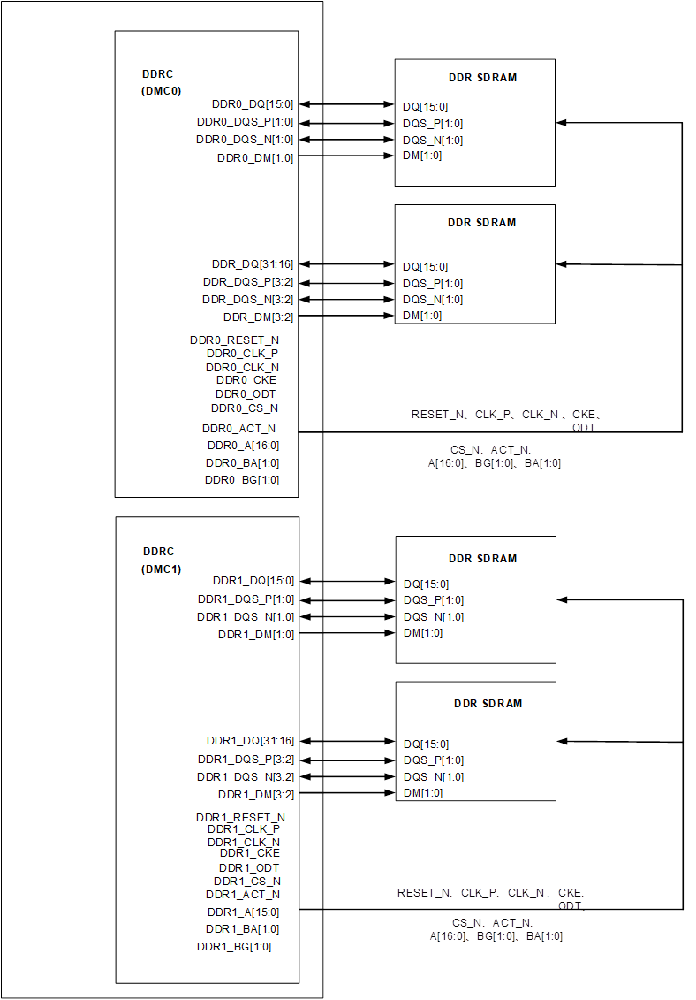
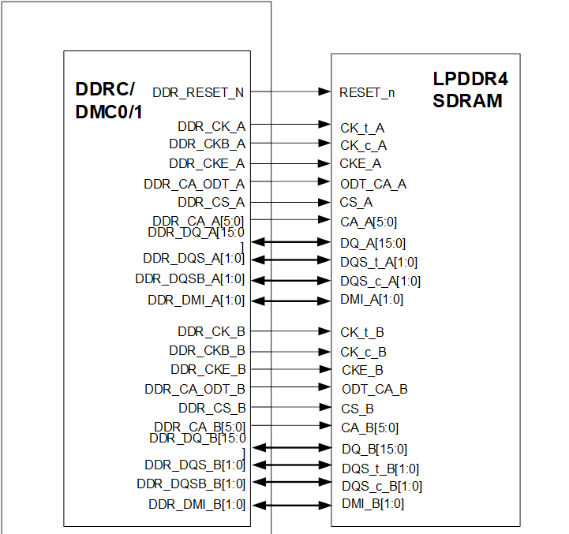

目 录

[4 DDR控制器 4-1](#_Toc119936997)

[4.1 概述 4-1](#_Toc119936998)

[4.2 特点 4-1](#_Toc119936999)

[4.3 功能描述 4-2](#_Toc119937000)

[4.3.1 应用框图 4-2](#_Toc119937001)

[4.3.2 功能原理 4-5](#_Toc119937002)

[4.4 工作方式 4-8](#_Toc119937003)

[4.4.1 软复位 4-8](#_Toc119937004)

[4.4.2 DDR初始化配置流程 4-8](#_Toc119937005)

插图目录

[图4-1 DDRC双通道模式下，通道与四片16bit 位宽DDR4 SDRAM的互联示意图 4-3](#_Toc110600683)

[图4-2 DDRC四通道模式下，两个通道与一片LPDDR4 SDRAM的互联示意图 4-4](#_Toc110600684)

表格目录

[表4-1 DDR4命令真值表 4-5](#_Toc110600685)

[表4-2 LPDDR4命令真值表 4-6](#_Toc110600686)

# DDR控制器

## 概述

DDRC（DDR SDRAM Controller）实现对动态存储器DDR4/LPDDR4/LPDDR4X SDRAM的存取控制。

<strong><big>说明</big></strong>

LPDDR4X相关描述与LPDDR4一致。

## 特点

DDRC的功能特点：

- 支持最大存储空间为8GB。
- 仅支持小端存储模式。
- 支持DDR4 SDRAM接口最高工作频率为1600MHz，即数据速率为3.2Gbps，此时DDRC工作在1:2模式下，频率为800MHz。
- 支持LPDDR4 SDRAM接口最高工作频率为1866MHz，即数据速率为3.733Gbps，此时DDRC工作在1:4模式下，频率为466MHz。
- 支持DDR4/LPDDR4 SDRAM的Power Down低功耗模式。
- DDRC最大支持DDR4双通道单rank，LPDDR4四通道双rank，DDR SDRAM数据总线位宽最大为64bit。

## 功能描述

### 应用框图

DDRC实现了SoC系统中的CPU等主设备对DDR4/LPDDR4 SDRAM的数据访问。通过CPU配置DDRC的时序参数寄存器，可以支持符合JEDEC标准的DDR4/LPDDR4 SDRAM器件。

DDRC在DDR4应用时为双通道64bit（每个通道32bit），连接示意图如图4-1所示。

DDRC双通道模式下，通道与四片16bit 位宽DDR4 SDRAM的互联示意图

连接说明：

双通道模式下，64bit DDR4 SDRAM由四片数据总线宽度为16bit的存储器件组成。DDRC/DMC 对应的命令控制信号：DDR\_CS\_N、DDR\_CLK\_P、DDR\_CLK\_N、DDR\_CKE、DDR\_RESET\_N、DDR\_ACT\_N、DDR\_BG[1:0]、DDR\_A[16:0]、DDR\_BA[1:0]，与DDR4 SDRAM颗粒的命令控制信号相连，DDRC的命令控制总线是1驱2的连接模式。

对接LPDDR4时DDRC为四通道模式，每个通道支持16bit互联，每两个通道对接1片LPDDR4。连接示意图如图4-2所示。

DDRC四通道模式下，两个通道与一片LPDDR4 SDRAM的互联示意图

连接说明：

通道0和通道1对接一片LPDDR4 SDRAM。其中通道0与LPDDR4 SDRAM的A通道对接，通道1与LPDDR4 SDRAM的B通道对接。

通道2和通道3对接另外一片LPDDR4 SDRAM。其中通道2与LPDDR4 SDRAM的A通道对接，通道3与LPDDR4 SDRAM的B通道对接。

注意：图4-1与图4-2中的管脚连接仅为示意图，与DDR4/LPDDR4颗粒的详细管脚连接关系请参见《XXXX DDR SWAP 场景详细说明》。

### 功能原理

DDRC接口时序满足JEDEC标准，通过发送DDR4/LPDDR4 SDRAM的命令字，完成对DDR4/LPDDR4 SDRAM的数据访问和状态控制。包括DDR4/LPDDR4 SDRAM的读写访问、自动刷新、低功耗控制等功能。

#### 命令真值表

DDRC支持DDR4/LPDDR4 SDRAM的读写和控制命令字。

DDR4 SDRAM的命令真值表如表4-1所示。更加详细的信息请参阅JEDEC标准和器件手册。

DDR4命令真值表

| FUNCTION | CKE | CSN | ACTN | RASN/ADR16 | CASN/ADR15 | WEN/ADR14 | ADDR | | | BG | BA |
| --- | --- | --- | --- | --- | --- | --- | --- | --- | --- | --- | --- |
| 13:11 | AP(10) | 9:0 |
| DESELECT | H | H | X | X | X | X | X | X | X | X | X |
| ACTIVE | H | L | L | Row address | | | V | V | V | BG | BA |
| READ | H | L | H | H | L | H | V | V | V | BG | BA |
| WRITE | H | L | H | H | L | L | V | V | V | BG | BA |
| PRECHARGE | H | L | H | L | H | L | V | L | V | BG | BA |
| PRECHARGE ALL | H | L | H | L | H | L | V | H | V | V | V |
| AUTO REFRESH | H | L | H | L | L | H | V | V | V | V | V |
| SELF REFRESH ENTRY | H->L | L | H | L | L | H | V | V | V | V | V |
| SELF REFRESH EXIT | L->H | L | H | H | H | H | V | V | V | V | V |
| MODE REGISTER SET | H | L | H | L | L | L | V | V | V | V | V |
| ZQCL | H | L | H | H | H | L | V | H | V | V | V |
| ZQCS | H | L | H | H | H | L | V | L | V | V | V |

LPDDR4 SDRAM的命令真值表如表4-2所示。更加详细的信息请参阅JEDEC标准和器件手册。

LPDDR4命令真值表

| FUNCTION | CS | CA0 | CA1 | CA2 | CA3 | CA4 | CA5 | CK\_t edge |
| --- | --- | --- | --- | --- | --- | --- | --- | --- |
|
| DESELECT | L | X | X | X | X | X | X | R1 |
| MPC | H | L | L | L | L | L | OP6 | R1 |
| L | OP0 | OP1 | OP2 | OP3 | OP4 | OP5 | R2 |
| PRECHARGE | H | L | L | L | L | H | AB | R1 |
| L | BA0 | BA1 | BA2 | V | V | V | R2 |
| REFRESH | H | L | L | L | H | L | AB | R1 |
| L | BA0 | BA1 | BA2 | V | V | V | R2 |
| SELF REFRESH ENTRY | H | L | L | L | H | H | V | R1 |
| L | V | V | V | V | V | V | R2 |
| SELF REFRESH EXIT | H | L | L | H | L | H | V | R1 |
| L | V | V | V | V | V | V | R2 |
| WRITE-1 | H | L | L | H | L | L | BL | R1 |
| L | BA0 | BA1 | BA2 | V | C9 | AP | R2 |
| MASK WRITE-1 | H | L | L | H | H | L | L | R1 |
| L | BA0 | BA1 | BA2 | V | C9 | AP | R2 |
| READ-1 | H | L | H | L | L | L | BL | R1 |
| L | BA0 | BA1 | BA2 | V | C9 | AP | R2 |
| CAS-2  (WRITE-2, MASK WRITE-2, READ-2, MRR2,MPC) | H | L | H | L | L | H | C8 | R1 |
| L | C2 | C3 | C4 | C5 | C6 | C7 | R2 |
| MODE REGISTER WRITE -1 | H | L | H | H | L | L | OP7 | R1 |
| L | MA0 | MA1 | MA2 | MA3 | MA4 | MA5 | R2 |
| MODE REGISTER WRITE -2 | H | L | H | H | L | H | OP6 | R1 |
| L | OP0 | OP1 | OP2 | OP3 | OP4 | OP5 | R2 |
| MODE REGISTER READ-1 | H | L | H | H | H | L | V | R1 |
| L | MA0 | MA1 | MA2 | MA3 | MA4 | MA5 | R2 |
| ACTIVATE-1 | H | H | L | R12 | R13 | R14 | R15 | R1 |
| L | BA0 | BA1 | BA2 | R16 | R10 | R11 | R2 |
| ACTIVATE-2 | H | H | H | R6 | R7 | R8 | R9 | R1 |
| L | R0 | R1 | R2 | R3 | R4 | R5 | R2 |

H：表示高电平；L：表示低电平；V：表示有效；X：表示不关心。

#### 自动刷新

DDRC自动产生周期性AUTO REFRESH命令，完成对DDR4/LPDDR4 SDRAM的刷新操作。常温下，DDR4 SDRAM自动刷新操作的周期为7.8us，LPDDR4为3.9us。

不同温度下SDRAM器件对刷新周期要求可能不同，实际配置值请参见SDRAM器件手册。

#### 低功耗管理

DDRC支持两种模式的低功耗管理：普通低功耗模式和自刷新低功耗模式。

使能SDRAM自动低功耗后，系统处于空闲状态时（DDRC总线接口一定时间内无读写DDR访问），自动控制DDR4/LPDDR4 SDRAM进入到普通低功耗模式。

当系统需要进入到待机模式时，可控制DDR4/LPDDR4 SDRAM进入到自刷新低功耗模式。该模式下可以将DDR4/LPDDR4 SDRAM的功耗降至最低，同时保持DDR4/LPDDR4 SDRAM中的数据，但是此时系统不能访问DDR4/LPDDR4 SDRAM。

#### 安全功能

DDRC支持安全功能，安全功能使能时，对于越权的读写访问总线会返回BUS ERROR，同时保护DDR数据不被改写/读出。

DDRC支持安全功能寄存器读写保护，只有安全CPU才可以读写寄存器，非安全CPU无法对安全相关寄存器进行读写。

详见软件中《安全子系统使用说明》。

#### 流量统计和命令latency统计功能

DDRC支持流量统计功能：可以统计接口读写流量。可以对指定ID访问读/写流量单独统计。可以对总体读/写流量统计。支持DDR接口利用率统计，统计计数器支持连续统计和单次统计，当为连续统计时计数器为非饱和计数器，计数器记到最大值后会卷绕，方便系统进行连续统计，所以需要系统在计数器未卷绕之前将计数器值读出。当为单次统计时，统计计数器在进行统计时间到达后停止统计，系统可以用此功能可以统计瞬时的流量以及latency。

## 工作方式

### 软复位

DDRC不能进行单独的复位操作。只有在全局软复位时，才能复位DDRC。复位之后，需要按照初始化流程进行重新初始化DDR4/LPDDR4 SDRAM。

### DDR初始化配置流程

系统上电之后，必须先完成DDR4/LPDDR4 SDRAM的初始化操作，系统才能访问DDR SDRAM。在进行初始化之前需要注意以下几点：

- 对DDR4/LPDDR4 SDRAM进行上电操作时，需要遵循JEDEC 标准。
- 该初始化过程需要在系统进入NORMAL模式后进行。

整个DDR子系统的初始化步骤如下：

配置DDR的地址区域映射，地址区域属性。

配置DMC的工作模式，时钟频率，时序参数等。

配置DDRPHY的工作模式，时序参数，DDRPHY IO驱动和ODT阻抗，读写命令通路的delay参数等。

启动DDRPHY进行初始化。

等待DDRPHY初始化完成。

配置DMC使能auto refresh命令发送功能。

----结束

完成以上步骤以后，DDR4/LPDDR4 SDRAM就可以正常工作。

**说明：针对不同的DDR颗粒，所配置的寄存器的值可能会有部分不同，但配置过程需按上述步骤进行。**

