目 录

[5 Flash Memory控制器 5-1](#_Toc110351609)

[5.1 概述 5-1](#_Toc110351610)

[5.2 特点 5-1](#_Toc110351611)

[5.3 功能描述 5-3](#_Toc110351612)

[5.3.1 接口描述 5-3](#_Toc110351613)

[5.3.2 SPI接口时序说明 5-7](#_Toc110351614)

[5.3.3 SPI NAND FLASH地址说明 5-7](#_Toc110351615)

[5.3.4 NAND Flash Asynchronous Interface模式 5-8](#_Toc110351616)

[5.3.5 Boot功能 5-9](#_Toc110351617)

[5.3.6 寄存器方式操作 5-10](#_Toc110351618)

[5.3.7 内置DMA操作方式 5-10](#_Toc110351619)

[5.3.8 ECC校验功能 5-11](#_Toc110351620)

[5.3.9 TIMEOUT功能 5-11](#_Toc110351621)

[5.4 工作流程 5-12](#_Toc110351622)

[5.4.1 初始化流程 5-12](#_Toc110351623)

[5.4.2 FMC\_OP操作流程（寄存器操作方式） 5-12](#_Toc110351624)

[5.4.3 读器件状态寄存器操作 5-13](#_Toc110351625)

[5.4.4 SPI NOR Flash地址模式切换流程 5-13](#_Toc110351626)

[5.4.5 擦除操作流程（SPI NAND Flash和SPI NOR Flash） 5-13](#_Toc110351627)

[5.4.6 FMC\_OP擦除（NAND Flash） 5-14](#_Toc110351628)

[5.4.7 内置DMA读操作流程（FMC\_OP\_CTRL读操作） 5-15](#_Toc110351629)

[5.4.8 内置DMA写操作流程（FMC\_OP\_CTRL写操作） 5-16](#_Toc110351630)

[5.4.9 其它注意事项 5-18](#_Toc110351631)

[5.5 数据结构(NAND Flash/SPI NAND Flash) 5-18](#_Toc110351632)

[5.5.1 4bit ECC模式(纠错8bit/1KB) 5-20](#_Toc110351633)

[5.5.2 8bit ECC模式(纠错16bit/1KB) 5-20](#_Toc110351634)

[5.5.3 24bit ECC模式(纠错24bit/1KB) 5-21](#_Toc110351635)

[5.5.4 28bit ECC模式(28bit/1KB) 5-22](#_Toc110351636)

[5.5.5 40bit ECC模式(40bit/1KB) 5-23](#_Toc110351637)

[5.5.6 64bit ECC模式(64bit/1KB) 5-23](#_Toc110351638)

[5.6 ECC模式选择说明 5-24](#_Toc110351639)

[5.7 FMC寄存器概览 5-25](#_Toc110351640)

[5.8 FMC寄存器描述 5-27](#_Toc110351641)

插图目录

[图5-1 Standard SPI接口模式写操作时序图 5-3](#_Toc110351642)

[图5-2 Standard SPI接口模式读操作时序图。 5-3](#_Toc110351643)

[图5-3 Dual-Output/Dual-Input SPI接口时序图 5-4](#_Toc110351644)

[图5-4 Dual I/O SPI模式STR时序图 5-4](#_Toc110351645)

[图5-5 Dual I/O SPI模式DTR时序图 5-5](#_Toc110351646)

[图5-6 Quad-Output/Quad-Input SPI模式时序图 5-5](#_Toc110351647)

[图5-7 Quad-I/O SPI模式接口时序图 5-6](#_Toc110351648)

[图5-8 Quad-I/O SPI模式DTR接口时序图 5-6](#_Toc110351649)

[图5-9 SPI输出时序图 5-7](#_Toc110351650)

[图5-10 Asynchronous Interface NAND 模式接口时序图 5-8](#_Toc110351651)

[图5-11 Asynchronous Interface NAND 模式接口时序 5-9](#_Toc110351652)

[图5-12 擦除操作流程图 5-14](#_Toc110351653)

[图5-13 4bit ECC模式2K page\_size的数据结构 5-20](#_Toc110351654)

[图5-14 4bit ECC模式4K page\_size的数据结构 5-20](#_Toc110351655)

[图5-15 8bit ECC模式2K page\_size的数据结构 5-21](#_Toc110351656)

[图5-16 8bit ECC模式4K page\_size的数据结构 5-21](#_Toc110351657)

[图5-17 24bit ECC模式2K page-size的数据结构 5-21](#_Toc110351658)

[图5-18 24bit ECC模式4K page\_size的数据结构 5-21](#_Toc110351659)

[图5-19 24bit ECC模式8K Page-size的数据结构 5-22](#_Toc110351660)

[图5-20 28bit ECC模式2K Page-size的数据结构 5-22](#_Toc110351661)

[图5-21 28bit ECC模式4K Page-size的数据结构 5-22](#_Toc110351662)

[图5-22 28bit ECC模式8K Page-size的数据结构 5-23](#_Toc110351663)

[图5-23 40bit ECC模式8K Page-size的数据结构 5-23](#_Toc110351664)

[图5-24 40bit ECC模式16K Page-size的数据结构 5-23](#_Toc110351665)

[图5-25 64bit ECC模式8K Page-size的数据结构 5-24](#_Toc110351666)

[图5-26 64bit ECC模式16K Page-size的数据结构 5-24](#_Toc110351667)

表格目录

[表5-1 FLASH地址分配表 5-8](#_Toc119074499)

[表5-2 非ECC0模式数据结构长度 5-20](#_Toc119074500)

[表5-3 FMC寄存器概览（基址是0x0\_1000\_0000） 5-26](#_Toc119074501)

# Flash Memory控制器

## 概述

FMC（Flash Memory Controller）提供存储控制器接口连接片外SPI NAND Flash、SPI NOR Flash、NAND Flash，从而完成数据的存取。

## 特点

FMC的主要特点如下：

- 支持SPI NOR Flash、SPI NAND Flash、NAND Flash三种类型的器件。
- 支持Standard SPI、Dual-Output/Dual-Input SPI、Quad-Output/Quad-Input SPI、Dual I/O SPI、Quad I/O SPI五种SPI接口类型。
- 支持最多2片SPI Flash组合（2片SPI Nor Flash、1片 SPI Nor Flash+1片SPI Nand Flash）
- 支持多种规格的SPI NOR Flash器件。
- 支持SPI NOR DTR STR模式的读数据；
- 支持地址为3Byte、4Byte模式；
- 支持多种规格的SPI NAND Flash器件。
- 支持页大小2K、4K的器件。
- 支持块大小64 Pages/Block、128 Pages/Block的器件。
- 支持多种规格的NAND Flash器件；
- 支持页大小2K、4K、8K、16K的异步器件。
- 支持块大小64、128、256Pages/Block的器件。
- 支持8bit 数据接口位宽的器件。
- 支持异步接口器件（Toggle DDR除外）。
- 支持SPI NOR Flash、SPI NAND Flash、NAND Flash的CS0的BOOT功能；
- 支持1MB的Boot空间。
- 支持Boot模式下，控制器先自动发送器件的复位命令再进行读数据操作（仅在SPI NAND Flash和NAND Flash模式下发送复位命令）。
- 支持自动跳坏块功能（SPI NAND Flash和NAND Flash），最大可以跳过连续4个坏块。
- 支持自适应Boot功能（SPI NAND Flash和NAND Flash），控制器自动找到正确的Page-size、ECC类型、Block-size配置。
- 对SPI NAND Flash支持1线和4线Boot；对SPI NOR Flash仅支持1线Boot。
- 对SPI NOR Flash支持3Byte地址器件和4Byte地址器件的Boot。
- 支持SPI NOR Flash、SPI NAND Flash、NAND Flash的DMA读写功能；
- 对SPI NAND Flash和NAND Flash支持内置DMA模式读写操作。写操作都是以整个page为单位进行；读操作则支持读整个page、只读控制信息（只读OOB(Out Of Band)）。
- 对SPI NOR Flash支持DMA读写操作，读写长度可配置。
- 支持手动配置命令组合，从而完成各种命令。（仅支持在ECC0模式下的手动配置操作）。
- 支持8K/16KPage-size NAND Flash的Randomizer功能，仅在非ECC0模式下开启有效，其他模式配置无效。
- 支持MLC NAND的readretry功能。
- 支持ECC功能（仅对SPI NAND Flash和NAND Flash）。

支持8bit/1KB、16bit/1KB、24bit/1KB、28bit/1KB、40bit/1KB、64bit/1KB的BCH码ECC校验和纠错（1KB指1KB数量级，并不是严格意义上的1024Byte）。

- 支持7种中断：操作完成、编程操作失败、ECC校验可纠错、ECC校验告警、ECC校验不可纠错、总线操作错误、DMA传输错误。
- 支持低功耗模式，自动时钟门控。

## 功能描述

### 接口描述

FMC可以支持五种SPI接口类型，五种类型分别为Standard SPI、Dual-Output/Dual-Input SPI、Quad-Output/Quad-Input SPI、Dual I/O SPI、Quad I/O SPI类型，Standard SPI、Dual I/O SPI、Quad I/O SPI类型支持STR、DTR模式。

#### Standard SPI模式

Standard SPI接口模式具有1bit数据输入线和1bit数据输出线。图5-1为Standard SPI接口模式写操作时序图。

Standard SPI接口模式写操作时序图

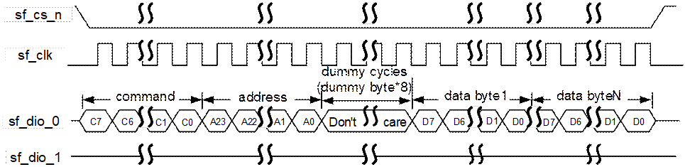

时序说明：

- command/address/dummy cycles以单bit串行方式在sf\_dio\_0线上输出；
- Data以单bit串行方式在sf\_dio\_0线上输出。

图5-2为Standard SPI接口模式读操作时序图。

Standard SPI接口模式读操作时序图。

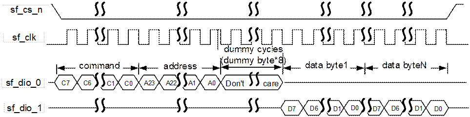

时序说明：

- command/address/dummy cycles以单bit串行方式在sf\_dio\_0线上输出。
- Data以单bit串行方式在sf\_dio\_1线上输入。
#### Dual-Output /Dual-Input SPI模式

Dual-Output /Dual-Input SPI接口时序图5-3所示。

Dual-Output/Dual-Input SPI接口时序图

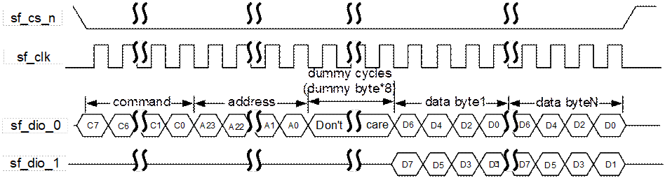

时序说明：

- command/address/dummy cycles以单Bit串行方式在sf\_dio\_0线上输出。
- Data以2 Bits方式在sf\_dio\_0/sf\_dio\_1线上输出（写）或输入（读）。
#### Dual I/O SPI模式

Dual I/O时序图为图5-4和图5-5所示。

Dual I/O SPI模式STR时序图

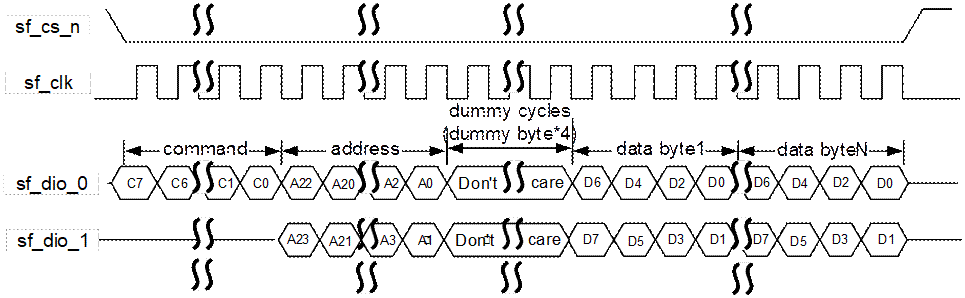

时序说明：

- command以单Bit串行方式在sf\_dio\_0线上输出。
- address/dummy cycles以2 Bits方式在sf\_dio\_0/sf\_dio\_1线上输出。
- Data以2 Bits方式在sf\_dio\_0/sf\_dio\_1线上输出（写）或输入（读）。

Dual I/O SPI模式DTR时序图

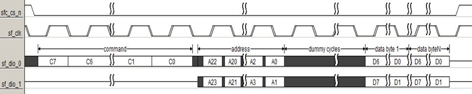

时序说明：

- command以单Bit串行方式在sf\_dio\_0线上输出。
- address/dummy cycles以2 Bits 双沿有效方式在sf\_dio\_0/sf\_dio\_1线上输出。
- Data以2 Bits双沿有效方式在sf\_dio\_0/sf\_dio\_1线上输入（读）。
- DTR模式只支持读。
#### Quad-Output /Quad-Input SPI

Quad-Output / Quad-Input SPI时序图为图5-6所示。

Quad-Output/Quad-Input SPI模式时序图

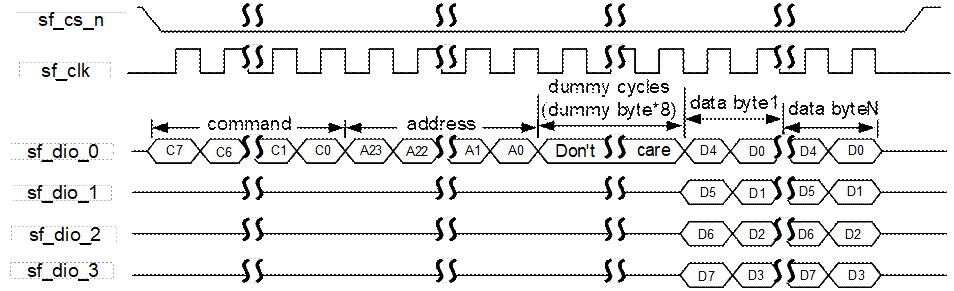

时序说明：

- command/address/dummy cycles以单Bit串行方式在sf\_dio\_0线上输出。
- Data以4 Bits方式在sf\_dio\_0/sf\_dio\_1/sf\_dio\_2/sf\_dio\_3线上输出（写）或输入（读）。
#### Quad I/O SPI模式

Quad I/O SPI模式时序图如图5-7和图5-8所示。

Quad-I/O SPI模式接口时序图

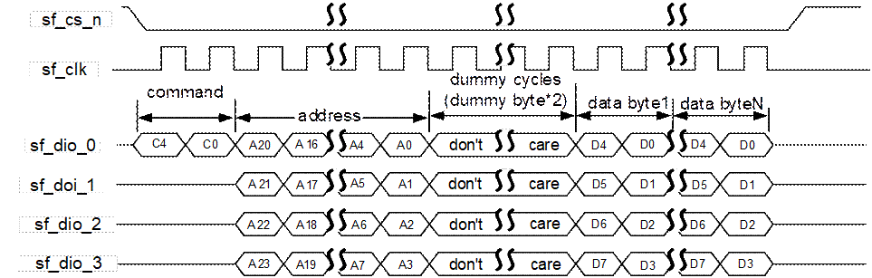

时序说明：

- command以单Bit串行方式在sf\_dio\_0线上输出。
- address/dummy cycles以4 Bits方式在sf\_dio\_0/sf\_dio\_1/sf\_dio\_2/sf\_dio\_3线上输出。
- Data以4 Bits方式在sf\_dio\_0/sf\_dio\_1/sf\_dio\_2/sf\_dio\_3线上输出（写）或输入（读）。

Quad-I/O SPI模式DTR接口时序图

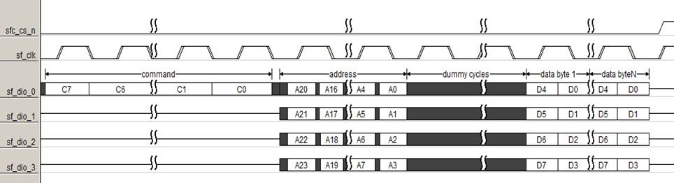

时序说明：

- command以单Bit 单沿数据串行方式在sf\_dio\_0线上输出。
- address/dummy cycles以4 Bits双沿方式在sf\_dio\_0/sf\_dio\_1/sf\_dio\_2/sf\_dio\_3线上输出。
- Data以4 Bits双沿采数方式在sf\_dio\_0/sf\_dio\_1/sf\_dio\_2/sf\_dio\_3线上输入。

### SPI接口时序说明

SPI接口时序以及参数说明如图5-9所示。

SPI输出时序图

<strong><big>须知</big></strong>

注：时序配置对应TIMING\_SPI\_CFG寄存器。

tcsh：sf\_cs\_n hold time。

tcss：sf\_cs\_nsetup time。

tshsl：sf\_cs\_n deselect time。

### SPI NAND FLASH地址说明

对于SPI NAND Flash器件地址，如表5-1。其中1st Byte和2nd Byte为列地址，3rd Byte，4th Byte和5th Byte为行地址。

FLASH地址分配表

| Byte数 | Bit0 | Bit1 | Bit2 | Bit3 | Bit4 | Bit5 | Bit6 | Bit7 |
| --- | --- | --- | --- | --- | --- | --- | --- | --- |
| 1st Byte | A0 | A1 | A2 | A3 | A4 | A5 | A6 | A7 |
| 2nd Byte | A8 | A9 | A10 | A11 | A12\* | A13\* | 0 | 0 |
| 3rd Byte | A12 | A13 | A14 | A15 | A16 | A17 | A18 | A19 |
| 4th Byte | A20 | A21 | A22 | A23 | A24 | A25 | A26 | A27 |
| 5th Byte\* | A28\* | A29\* | 0 | 0 | 0 | 0 | 0 | 0 |

<strong><big>说明</big></strong>

- A0-A11位对2KB page\_size配置为有效列地址，A0-A12对4KB page\_size配置为有效列地址。
- A12位（2KB page\_size），A13位（4KB page\_size），对于Micron器件为plane地址，但对于其他厂家没有plane地址的概念。
- A28和A29位，需要根据具体器件看是否需要，如果没有的话，输出为0。

在下发SPI NAND Flash的读写操作时，操作时根据具体的操作下发行列地址。

- 写操作在LOAD操作时配置列地址，在PROGRAM操作时配置行地址；
- 读操作在PAGE READ TO CACHE操作时配置行地址，在READ操作时配置列地址。

内置DMA操作，地址下发由控制器完成。

<strong><big>说明</big></strong>

- 对于2KB page\_size配置，A12位当成plane地址，不支持A12有其他含义，影响读写结果的器件。
- 对于4KB page\_size配置，A13位当成plane地址，不支持A13有其他含义，影响读写结果的器件。

### NAND Flash Asynchronous Interface模式

Asynchronous Interface NAND模式时序图如图5-10、图5-11所示。

Asynchronous Interface NAND 模式接口时序图

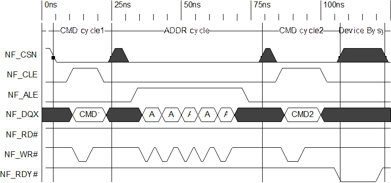

Asynchronous Interface NAND 模式接口时序

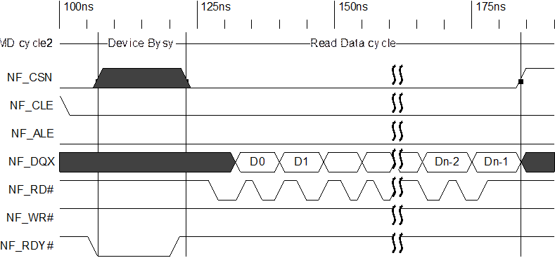

### Boot功能

FMC默认处于Boot模式，可支持直接从FLASH中读取数据进行启动。CPU可以直接读取0x00\_0000～0x0F\_FFFF地址范围的数据，整个空间大小为1MB。

#### SPI NOR Flash的Boot功能

由于SPI NOR Flash的地址空间是连续的，因此1MB的Boot数据直接映射到SPI NOR Flash的地址空间0x00\_0000~0x0F\_FFFF。

开始boot之前，当CPU第一次读取boot空间数据时。FMC会通过Read Status 命令获取器件的WIP，若WIP为1，则FMC会继续获取，直到WIP返回值为0。FMC才开始向Flash发送读操作。

#### SPI NAND Flash和NAND Flash的Boot功能

对于SPI NAND Flash和NAND Flash，由于其地址空间不连续且存在坏块的可能，因此1M的Boot数据并不能直接映射到Flash中，并且Boot还需要page\_size、block\_size信息进行地址译码。

FMC支持自适应Boot功能，能够根据Block0的数据自动适配器件的ecc\_type、page\_size、block\_size信息。控制器要求物理Block0必须为好块，其他块为坏块则可以自动跳过。

FMC在Boot时，遇到坏块之后能够自动跳过坏块去寻找好块并读取Boot信息。每次跳坏块过程最大可以连续跳过4个坏块，若在一次跳坏块的过程中连续出现5个物理坏块，则Boot失败。整个Boot过程可以出现若干次跳坏块过程，当遇到好块时，此次跳坏块过程结束，若再次遇到坏块，则开始一次新的跳坏块过程。

FMC逻辑对坏块的判定条件有三个：

- 当前物理块的第一个页和最后一个页坏块标记位标记位0xff。
- 当前物理块的第一个页和最后一个页空块标记位标记位0x00。
- 当前物理块的第一个页和最后一个页的OOB所在纠错单元ECC可纠错。

只有以上三个条件同时满足，FMC逻辑才能判定这个快为好块，否则判定为坏块。

### 寄存器方式操作

软件配置操作相关寄存器，如操作命令、地址等，最后配置FMC\_OP寄存器下发操作，控制器根据软件配置值，下发操作给器件。如果还需要向器件传输数据，那会使用内部的buffer来传输数据。

read id，set feature，erase等操作都是通过此种方式下发操作。

寄存器操作方式可以组合出所有的器件操作，可以单独下发指令、地址、传输数据等。

### 内置DMA操作方式

FMC支持使用内置DMA模式进行读写操作以提高访问速度。通过此种方式，FMC可以通过总线直接访问DDR。

- DMA写操作：SPI NOR Flash支持从DDR的任意地址搬运任意长度的数据写到器件的任意地址，对于SPI NAND Flash和NAND Flash，只支持按page的写操作。
- DMA读操作：和写操作相同，SPI NOR Flash支持从器件的任意地址搬运任意长度的数据写到DDR的任意地址。对于SPI NAND Flash和NAND Flash支持读整个page，只读OOB操作。
- 只读OOB操作：当软件只需要软件管理信息（如坏块标记，空块标记等）时，不需要读取整个page的数据出来，只需要读取控制信息部分，使用只读OOB方式就能完成此目的。

### ECC校验功能

对于SPI NAND Flash与NAND Flash，FMC支持ECC校验纠错功能。支持的最大纠错能力有三种分别为：8bit /1KB、16bit /1KB和24bit /1KB。以8bit ECC为例，表示的含义为1KB1数据中最大能纠正8bit错误。

<strong><big>说明</big></strong>

注1：1KB纠错单元包括ECC保护数据、OOB信息以及ECC码。纠错算法按纠错单元进行计算。可以认为DATA+OOB为计算ECC的数据，对于2KB page\_size，每个纠错单元数据大小为（DATA+OOB）/2，对于4KB page\_size，每个纠错单元数据大小为（DATA+OOB）/4。因此纠错单元实际大小大于1KB。

- OOB为软件管理信息部分，具体见数据结构描述。
- DATA为真实数据，2KB page\_size为2048Byte，4KB page\_size为4096Byte。

当超过最大纠错能力时，可以上报不可纠错中断。FMC提供告警中断，当一次纠错过程错误位数等于或大于配置的错误阈值（FMC\_ERR\_THD [fmc\_err\_thd]），则会上报错误告警，提示软件此次操作错误位数已经达到预设值。若有一个或多个纠错单元出现错误bit，并且所有纠错单元的错误bit数均未达到错误阈值和不可纠错值，则可纠错中断标志FMC\_INT[err\_val\_int]会变成1。

当读取一个page数据时，若所有纠错单元中存在某个纠错单元出现不可纠错，则上报不可纠错中断状态；否则如果存在错误告警纠错单元，则上报纠错告警状态；如果有纠错，但纠错位数没有达到错误阈值，则可以上报可纠错中断状态。

工作在SPI NOR Flash模式下，不使能ECC校验功能。当配置FMC\_CFG [ecc\_type]为零，对于SPI NAND Flash工作在无ECC校验功能模式，控制器搬运数据不做数据结构处理，直接进行flash数据的搬运。

### TIMEOUT功能

FMC为DMA写操作提供TIMEOUT机制，控制器在等待DMA写操作结束期间，会不断的发送GET FEATURE操作来查询写操作是否结束；对于SPI NOR Flash，控制器则会在等待器件发送RDSR操作来查询操作是否结束；对于NAND Flash，控制器则等待RB拉高。FMC等待的时间若超过寄存器FMC\_TIMEOUT\_WR [timeout\_wr]的配置值，则结束DMA写操作，并上报FMC\_INT[op\_fail]中断。

对于NAND Flash，在DMA写操作中，即使RB在TIMEOUT时间之前拉高，控制器会自动下发一次读状态寄存器操作，将读到的值存放在FMC\_FLASH\_INFO [flash\_status]中，若其bit0为1，则表示此次DMA写操作失败，控制器同样会上报FMC\_INT[op\_fail]中断。

## 工作流程

### 初始化流程

初始化流程如下：

（如果需要调整Timing参数）根据器件配置寄存器TIMING\_SPI\_CFG（SPI NAND Flash或者SPI NOR Flash）、寄存器PND\_PWIDTH\_CFG（NAND Flash）。

根据对接的FLASH器件手册，配置FMC配置寄存器（FMC\_CFG）。主要配置有器件接口类型，ecc\_type、page\_size等。

对于SPI NOR Flash，如果器件是4Byte地址器件，而默认是3Byte地址模式，则参考5.4.4 SPI NOR Flash地址模式切换流程完成4Byte地址模式切换。

初始化完成，可根据具体的操作配置寄存器下发操作。

----结束

### FMC\_OP操作流程（寄存器操作方式）

对器件的寄存器操作（如读ID或者配置器件寄存器）使用配置FMC\_OP下发操作的方式完成。操作步骤如下：

配置FMC\_CFG的ecc\_type为0。

如果是写寄存器操作（如配置FLASH的配置寄存器），先从Buffer访问起始地址开始写入期望的操作数据。

根据器件操作需要，配置操作命令FMC\_CMD，器件操作地址FMC\_ADDRL，读写数据个数FMC\_DATA\_NUM等操作类寄存器。

根据下发的器件操作，匹配FMC\_OP配置FMC\_OP\_CFG寄存器。

配置FMC\_OP寄存器下发操作，具体配置值参考FMC\_OP寄存器描述。

如果使用查询方式，查询FMC\_OP [0]位为0表示操作完成；如果使用中断方式，检测到FMC\_INT [op\_done\_init]，表示操作完成。

对于读寄存器操作（如读ID操作），在步骤 6完成后读出的寄存器存放在buffer中，软件可以从中读出器件寄存器值。

----结束

### 读器件状态寄存器操作

如果想要读取器件的状态寄存器，提供一种简易操作方法。具体如下：

配置FMC\_OP寄存器下发操作（配置FMC\_OP [read\_status\_en]和FMC\_OP [reg\_op\_start]为1）。

读出的状态寄存器存放在FMC\_FLASH\_INFO寄存器中。

----结束

### SPI NOR Flash地址模式切换流程

对于SPI NOR Flash器件，支持3Byte与4Byte两种Flash地址模式，可通过将管脚上下拉来选择初始默认地址模式，也可以在芯片启动起来之后通过配置寄存器动态切换地址模式。

如果默认是3Byte模式启动，但器件是4Byte地址模式器件，在芯片启动起来之后切换Flash地址模式的步骤如下：

无Flash操作或保证之前Flash操作完成。

根据器件要求，用寄存器操作方式配置器件的相关寄存器发特定命令配置Flash进入4B模式。

配置FMC的FMC\_CFG [spi\_nor\_addr\_mode]式为4B模式，完成3Byte模式到4Byte模式切换。

----结束

<strong><big>说明</big></strong>

具体SPI NOR Flash地址模式切换的命令，请查找相关器件手册。

### 擦除操作流程（SPI NAND Flash和SPI NOR Flash）

对于flash操作，在编程操作前，都必须进行擦除，在擦除操作前还必须完成WREN操作。擦除操作参考流程（查询方式）为图5-12。

擦除操作流程图

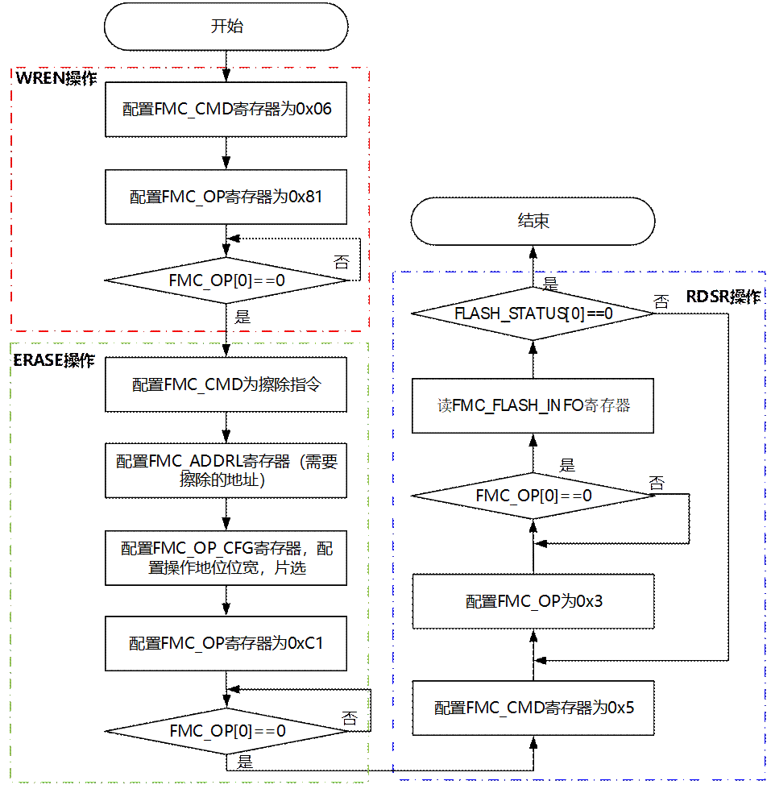

<strong><big>说明</big></strong>

- 上图中为查询方式，如果使用中断方式，查询FMC\_OP [0]操作变成中断处理方式，检测到FMC\_INT [op\_done\_init]，表示操作完成。
- ERASE操作过程，配置的擦除指令及操作地址需要根据具体器件手册进行配置。

### FMC\_OP擦除（NAND Flash）

NAND Flash模式下，FMC\_OP方式的擦除CS0的操作流程如下：

配置寄存器FMC\_CFG [op\_mode]为1，确保控制器处于NORMAL模式。

配置寄存器FMC\_ADDRL写入需要擦除Block地址，向寄存器FMC\_CMD写入擦除命令0xD060。

配置寄存器FMC\_OP\_CFG写入0x30，配置为CS0，表示需要发送3Byte地址。

配置寄存器FMC\_OP写入0xDB，启动CS0的擦除操作（附加自动读状态寄存器操作）。

查询方式下，检测FMC\_OP [reg\_op\_start]，如果为0，则表示操作结束；若使用中断方式，则检测FMC\_INT [op\_done\_int]，如果为1，则表示操作结束。否则，在本步骤循环。

读取FMC\_FLASH\_INFO [flash\_status]的状态值，判断擦除是否成功。

----结束

### 内置DMA读操作流程（FMC\_OP\_CTRL读操作）

使用内置DMA方式进行读数据的操作流程如下：

配置寄存器FMC\_CFG [op\_mode]为1，确保控制器处于NORMAL模式。

配置FMC\_ADDRL和FMC\_ADDRH，配置器件操作地址。对于SPI NOR Flash只需要配置FMC\_ADDRL。

<strong><big>须知</big></strong>

对于SPI NOR Flash，DMA操作时地址周期数由FMC\_CFG[spi\_nor\_addr\_mode]决定：支持3Byte地址模式和4Byte地址模式选择。对于SPI NAND Flash和NAND Flash，控制器默认为5Byte地址模式，且不可配置。

配置FMC\_DMA\_SADDR\_D0、FMC\_DMA\_SADDRH\_D0、FMC\_DMA\_SADDR\_OOB和FMC\_DMA\_SADDRH\_OOB寄存器，配置在DDR中存放数据的起始地址。

- 对于SPI NOR FLASH不需要配置FMC\_DMA\_SADDR\_OOB、FMC\_DMA\_SADDRH\_OOB寄存器；
- 对于SPI Nand Flash和NAND Flash的只读OOB操作，只需配置FMC\_DMA\_SADDR\_OOB、FMC\_DMA\_SADDRH\_OOB寄存器。

<strong><big>须知</big></strong>

- 对于SPI NAND Flash和NAND Flash，配置DDR地址时，要求4Byte地址对齐。
- 对于SPI NAND Flash和NAND Flash的ECC0模式，FMC\_DMA\_LEN需要4Byte对齐。
- FMC\_DMA\_SADDR\_\*表示目的ddr地址的低32bit。FMC\_DMA\_SADDRH\_\*表示目的ddr地址的高32bit。

配置FMC\_DMA\_LEN寄存器。在SPI NOR Flash模式下，需要配置FMC\_DMA\_LEN为读取数据的长度；在SPI NAND Flash和NAND Flash的ECC0模式下，则需要配置spare区数据长度；其他操作中则不需要配置此寄存器。

配置FMC\_OP\_CFG寄存器，根据下发的读操作要求进行配置。

- 对于SPI NAND Flash和SPI NOR Flash，要根据器件读操作时序中dummy周期数以及SPI接口类型，配置FMC\_OP\_CFG [dummy\_num] 和FMC\_OP\_CFG [mem\_if\_type]。
- 配置FMC\_OP\_CFG [fm\_cs]，选择操作片选。

配置FMC\_OP\_CTRL寄存器，配置FMC\_OP\_CTRL [0]为1，下发FMC读FLASH操作。

- 配置FMC\_OP\_CTRL [rw\_op]为零，表示DMA读操作。
- 对于SPI NAND Flash和NAND Flash的只读OOB操作，需配置FMC\_OP\_CTRL [rd\_op\_sel]。
- 对于SPI NAND Flash和SPI NOR Flash，需要配置FMC\_OP\_CTRL [rd\_opcode]，根据器件READ操作指令进行配置。

使用查询方式，检测到FMC\_OP\_CTRL [0]变低，表示读操作已经完成，数据已经写入DDR中；使用中断方式，检测到FMC\_INT [op\_done\_int]变高，表示读操作已经完成，数据已经写入DDR中。

----结束

### 内置DMA写操作流程（FMC\_OP\_CTRL写操作）

使用内置DMA方式进行写FLASH的操作，流程如下：

配置寄存器FMC\_CFG [op\_mode]为1，确保控制器处于NORMAL模式。

配置FMC\_ADDRL和FMC\_ADDRH，配置器件操作地址。对于SPI NOR FLASH只需要配置FMC\_ADDRL。

<strong><big>须知</big></strong>

对于SPI NOR Flash，DMA操作时地址周期数由FMC\_CFG[spi\_nor\_addr\_mode]决定：支持3Byte地址模式和4Byte地址模式选择。对于SPI NAND Flash和NAND Flash，控制器默认为5Byte地址模式，且不可配置。

配置FMC\_DMA\_SADDR\_D0、FMC\_DMA\_SADDRH\_D0、FMC\_DMA\_SADDR\_OOB和FMC\_DMA\_SADDRH\_OOB寄存器，配置从DDR中搬运数据的起始地址。SPI NOR Flash不需要配置FMC\_DMA\_SADDR\_OOB寄存器。

<strong><big>须知</big></strong>

- 对于SPI NAND Flash和NAND Flash，配置DDR地址时，要求4Byte地址对齐。
- 对于SPI NAND Flash和NAND Flash的ECC0模式，FMC\_DMA\_LEN需要4Byte对齐。
- FMC\_DMA\_SADDR\_\*表示目的ddr地址的低32bit。FMC\_DMA\_SADDRH\_\*表示目的ddr地址的高32bit。

配置FMC\_DMA\_LEN寄存器。在SPI NOR Flash模式下，需要配置FMC\_DMA\_LEN为读取数据的长度；在SPI NAND Flash和NAND Flash的ECC0模式下，则需要配置spare区数据长度；其他操作中则不需要配置此寄存器。

配置FMC\_OP\_CFG寄存器，根据下发的写操作要求配置

- 对于SPI NAND Flash和SPI NOR Flash，根据所需写操作SPI接口选择，配置FMC\_OP\_CFG [mem\_if\_type]。
- FMC\_OP\_CFG [fm\_cs] ，选择操作片选。

配置FMC\_OP\_CTRL寄存器下发操作，

- 配置rw\_op信息为写（配置为1），表示DMA写操作。
- 对于SPI NAND Flash和SPI NOR Flash，需要配置FMC\_OP\_CTRL [wr\_opcode]，根据器件PROGRAM操作指令进行配置。

使用查询方式，检测到FMC\_OP\_CTRL [0]变低，表示一次DMA写操作已经完成，数据已经写入FLASH中；使用中断方式，检测到FMC\_INT [op\_done\_int]变高，表示数据已经写入FLASH中。

----结束

### 其它注意事项

其它注意事项如下：

- 对于SPI NAND Flash和NAND Flash器件，在使用之前或者异常复位后必须先进行器件的Reset操作。
- 在FMC\_OP\_CTRL [dma\_op\_ready]或者FMC\_OP[reg\_op\_start]为1过程中（控制器操作进行中），不进行相关操作寄存器的配置，否则可能导致操作不正常。
- 软件配置需要保证在正确合理的原则下进行，否则乱配置寄存器可能会导致FMC挂死。例如NAND Flash不支持dummy\_en，在NAND Flash的FMC\_OP操作中，若配置此使能且FMC\_OP\_CFG [dmmy\_num]不为0，则会导致控制器挂死。

## 数据结构(NAND Flash/SPI NAND Flash)

FMC的数据结构分成两种，一种是用户原始数据，另一种是在非ECC0模式下，经过FMC转化，存放在NAND Flash上的数据结构。在非ECC0模式下，原始用户数据和经过FMC转化的数据都具有固定的数据结构，各个数据成员的长度和位置均严格固定。而在ECC0模式下，用户数据原封不动的写入/读出，FMC不对用户数据做任何改变。

对于ECC0模式，FMC对数据进行透传处理：写操作时，控制器将Buffer中的数据不作处理直接写入Flash；读操作时，控制器把从Flash中读取的数据不作处理直接写入到Buffer。

在非ECC0模式下，对Flash进行写操作时，FMC对用户数据进行两次处理：生成ECC码和重组。控制器在内部Buffer进行ECC编码，并生成ECC码，然后将Buffer中的数据进行重组之后再写入Flash。对Flash进行读操作时，FMC同样要进行两次处理：重组Flash数据和ECC纠错。FMC把从Flash中读到的数据重组后写入内部Buffer，然后在Buffer中对数据进行ECC纠错。

在非ECC0模式下，Buffer中的数据和Flash中的数据被划分成不同的结构。不同的配置下，各数据段的长度参考表5-2。

非ECC0模式数据结构长度

| ECCa(bit) | ecc\_lenb(byte) | Page\_size(byte) | oob\_lenc(byte) | sec\_lend(byte) |
| --- | --- | --- | --- | --- |
| 4/512B  (8/1K) | 14 | 2048 | 30+2 | 1040 |
| 4096 | 1032 |
| 8/512B  (16/1K) | 28 | 2048 | 6+2 | 1028 |
| 4096 | 14+2 |
| 24/1K | 42 | 2048 | 30+2 | 1040 |
| 4096 | 1032 |
| 8192 | 1028 |
| 28/1K | 50 | 2048 | 30+2 | 1040 |
| 4096 | 1032 |
| 8192 | 1028 |
| 40/1K | 70 | 8192 | 30+2 | 1028 |
| 16384 | 1026 |
| 64/1Ke | 112 | 8192 | 30+2 | 1028 |
| 16384 | 1026 |

<strong><big>说明</big></strong>

a：4bit/512B等价于8bit/1K，8bit/512B等价于16bit/1K。

b：ecc\_len表示每个纠错单元生成的ECC码的长度。

c：oob\_len表示上层软件可见的冗余区长度，由CTRL+BB组成。

d：sec\_len表示每个纠错单元的数据区长度，sec\_len=1024+(oob\_len\*1024)/page\_size

e：ECC的每个纠错单元为1K，此处1K并不是严格意义上的1024Byte，而是指长度处于1K这一数量级。例如表中纠错单元长度sec\_len从1026-1040不等，统称为1K。

下面结合写操作的过程说明各个数据段的构成。

FMC将数据写入到Flash中时，会按照DATA+ECC的格式交替连续存放，但OOB区数据需要进行特殊处理：

- BB标识需要放在Flash页中page\_size的地方，即对于2K、4K、8K、16K的配置，BB数据将被放置到2048、4096 、8192、16384 Byte Byte开始的两个字节。这样会打断原有的DATA或ECC数据。
- CTRL数据需要放置在有效数据的末尾，这样最后一个数据段在Flash中的存放形式为：DATA(不含BB和CTRL)+ECC+CTRL。
- EB作为标记空块的标记位，固定放置在CTRL最后2Byte。

### 4bit ECC模式(纠错8bit/1KB)

#### 2KB page\_size

对2KB page\_size的配置，软件可用的冗余区大小为32Byte。数据在Buffer和Flash中的结构如图5-13所示。

4bit ECC模式2K page\_size的数据结构

#### 4KB page\_size

对4KB page\_size的配置，软件可用的冗余区大小为32Byte。数据在Buffer和Flash中的结构如图5-14所示。

4bit ECC模式4K page\_size的数据结构

### 8bit ECC模式(纠错16bit/1KB)

#### 2KB page\_size

对2KB page\_size的配置，软件可用的冗余区大小为8Byte。数据在Buffer和Flash中的结构如图5-15所示。

8bit ECC模式2K page\_size的数据结构

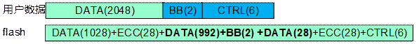

#### 4KB page\_size

对4KB page\_size的配置，软件可用的冗余区大小为16Byte。数据在Buffer和Flash中的结构如图5-16所示。

8bit ECC模式4K page\_size的数据结构

### 24bit ECC模式(纠错24bit/1KB)

#### 2KB page-size

对2KB page-size的配置，软件可用的冗余区大小为32Byte。数据在Buffer和Flash中的结构如图5-17所示。

24bit ECC模式2K page-size的数据结构

#### 4KB page\_size

对4KB page\_size的配置，软件可用的冗余区大小为32Byte。数据在Buffer和Flash中的结构如图5-18所示。

24bit ECC模式4K page\_size的数据结构

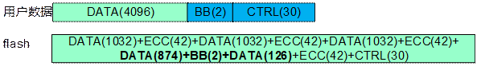

#### 8KB Page-size

对8KB Page-size的配置，软件可用的冗余区大小为32byte。数据在Buffer和Flash中的结构如图5-19所示。

24bit ECC模式8K Page-size的数据结构

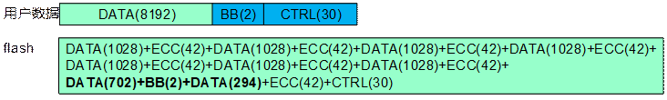

### 28bit ECC模式(28bit/1KB)

#### 2KB Page-size

对2KB Page-size的配置，软件可用的冗余区大小为32byte。数据在Buffer和Flash中的结构如图5-20所示。

28bit ECC模式2K Page-size的数据结构

#### 4KB Page-size

对4KB Page-size的配置，软件可用的冗余区大小为32byte。数据在Buffer和Flash中的结构如图5-21所示。

28bit ECC模式4K Page-size的数据结构

#### 8KB Page-size

对8KB Page-size的配置，软件可用的冗余区大小为32byte。数据在Buffer和Flash中的结构如图5-22所示。

28bit ECC模式8K Page-size的数据结构

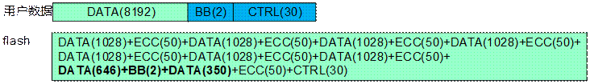

### 40bit ECC模式(40bit/1KB)

#### 8KB Page-size

对8KB Page-size的配置，软件可用的冗余区大小为32byte。数据在Buffer和Flash中的结构如图5-23所示。

40bit ECC模式8K Page-size的数据结构

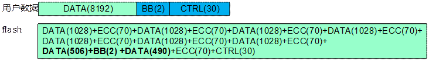

#### 16KB Page-size

对16KB Page-size的配置，软件可用的冗余区大小为32byte。数据在Buffer和Flash中的结构如图5-24所示。

40bit ECC模式16K Page-size的数据结构

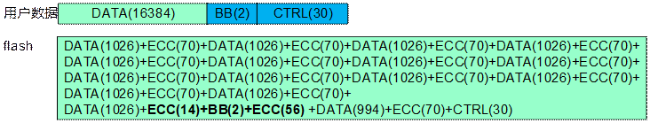

### 64bit ECC模式(64bit/1KB)

#### 8KB Page-size

对8KB Page-size的配置，软件可用的冗余区大小为32byte。数据在Buffer和Flash中的结构如图5-25所示。

64bit ECC模式8K Page-size的数据结构

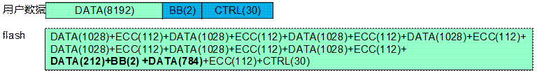

#### 16KB Page-size

对16KB Page-size的配置，软件可用的冗余区大小为32byte。数据在Buffer和Flash中的结构如图5-26所示。

64bit ECC模式16K Page-size的数据结构

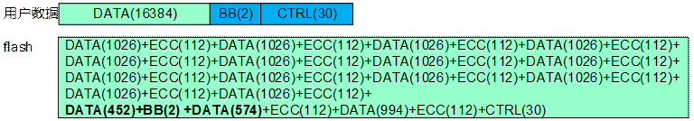

## ECC模式选择说明

因为控制器使用的“ECC纠错IP”在处理数据时是“基于1KB的数据块”进行处理的，所以描述控制器的ECC纠错性能时是这么写的：8bit/1KByte、24bit/1KByte等。为了可靠地使用器件，器件datasheet往往会给出建议的ECC纠错性能，如1bit/512Byte、4bit/512Byte、8bit/512Byte等。8bit/1KByte 与 4bit/512Byte 描述的纠错性能其实是一样的。使用控制器时，ECC模式选择需遵循以下2条准则：

- 控制器的ECC纠错性能 >= 器件建议的ECC纠错性能

比如说，如果器件建议1bit/512Byte或者4bit/512Byte，那么控制器可以选择8bit/1KByte纠错性能的ECC模式。

- 器件的页大小 >= 控制器ECC模式所需的存储大小

比如说，如果器件页大小是2K+64Byte，那么控制器不能选择24bit/1KByte纠错性能的ECC模式，因为这种ECC模式所需的存储大小为2K+116Byte，ECC模式所需的存储大小请参考“5.5 数据结构(NAND Flash/SPI NAND Flash)”一章节。

<strong><big>须知</big></strong>

**boot启动时，芯片会自动关闭器件内部的ECC功能，使用控制器的ECC功能，需要关闭flash器件内部的ECC。**

## FMC寄存器概览

FMC寄存器概览如表5-3所示。

FMC寄存器概览（基址是0x0\_1000\_0000）

| 偏移地址 | 名称 | 描述 | 页码 |
| --- | --- | --- | --- |
| 0x0000 | FMC\_CFG | 器件配置寄存器 | 5-27 |
| 0x0004 | GLOBAL\_CFG | 全局配置寄存器 | 5-29 |
| 0x0008 | TIMING\_SPI\_CFG | SPI Timing配置寄存器 | 5-31 |
| 0x000C | PND\_PWIDTH\_CFG | 读写脉冲宽度配置寄存器 | 5-32 |
| 0x0010 | PND\_OPIDLE\_CFG | 操作间隔配置寄存器 | 5-32 |
| 0x0018 | FMC\_INT | 中断状态寄存器 | 5-33 |
| 0x001C | FMC\_INT\_EN | 中断使能寄存器 | 5-35 |
| 0x0020 | FMC\_INT\_CLR | 中断清除寄存器 | 5-36 |
| 0x0024 | FMC\_CMD | 命令字配置寄存器 | 5-37 |
| 0x0028 | FMC\_ADDRH | 器件地址配置寄存器高byte | 5-37 |
| 0x002C | FMC\_ADDRL | 器件地址配置寄存器低4byte | 5-37 |
| 0x0030 | FMC\_OP\_CFG | 操作配置寄存器 | 5-37 |
| 0x0034 | SPI\_OP\_ADDR | 操作地址配置寄存器 | 5-38 |
| 0x0038 | FMC\_DATA\_NUM | 数据长度寄存器 | 5-39 |
| 0x003C | FMC\_OP | 操作寄存器 | 5-39 |
| 0x0040 | FMC\_DMA\_LEN | DMA操作长度寄存器 | 5-41 |
| 0x0048 | FMC\_DMA\_AHB\_CTRL | DMA AHB总线操作控制寄存器 | 5-41 |
| 0x004C | FMC\_DMA\_SADDR\_D0 | DMA操作DDR起始地址寄存器0 | 5-42 |
| 0x005C | FMC\_DMA\_SADDR\_OOB | DMA操作DDR存放OOB信息起始地址寄存器 | 5-42 |
| 0x0068 | FMC\_OP\_CTRL | 操作控制寄存器 | 5-42 |
| 0x006C | FMC\_TIMEOUT\_WR | 写操作TIMEOUT时间寄存器 | 5-43 |
| 0x0070 | FMC\_OP\_PARA | OP操作参数选择寄存器 | 5-44 |
| 0x0074 | FMC\_BOOT\_SET | BOOT设定寄存器 | 5-44 |
| 0x0078 | FMC\_LP\_CTRL | 低功耗控制寄存器 | 5-45 |
| 0x00A8 | FMC\_ERR\_THD | ECC告警阈值寄存器 | 5-46 |
| 0x00AC | FMC\_FLASH\_INFO | 器件状态寄存器值 | 5-47 |
| 0x00BC | FMC\_VERSION | 版本寄存器 | 5-47 |
| 0x00C0 | FMC\_ERR\_NUM0\_BUF0 | spinand flash和nandflash第一次buffer纠错信息0统计寄存器 | 5-47 |
| 0x00D0 | FMC\_ERR\_ALARM\_ADDRH | ECC告警flash地址高byte寄存器 | 5-48 |
| 0x00D4 | FMC\_ERR\_ALARM\_ADDRL | ECC告警flash地址低byte寄存器 | 5-48 |
| 0x00D8 | FMC\_ECC\_INVALID\_ADDRH | ECC不可纠错地址高byte寄存器 | 5-48 |
| 0x00DC | FMC\_ECC\_INVALID\_ADDRL | ECC不可纠错地址低4byte寄存器 | 5-49 |
| 0x0100 | FMC\_EXP\_OP\_CTRL | 扩展操作控制寄存器 | 5-49 |
| 0x0104 | FMC\_EXP\_ADDRH | 扩展操作器件地址配置寄存器高byte | 5-50 |
| 0x0108 | FMC\_EXP\_ADDRL | 扩展操作器件地址配置寄存器低4byte | 5-50 |
| 0x010C | FMC\_EXP\_DMA\_SADDR\_D0 | 扩展DMA操作DDR起始地址寄存器0 | 5-50 |
| 0x011C | FMC\_EXP\_DMA\_SADDR\_OOB | 扩展DMA操作DDR存放OOB信息起始地址寄存器 | 5-51 |
| 0x0120 | FMC\_EXP\_INT | 扩展操作中断状态寄存器 | 5-51 |
| 0x0124 | FMC\_EXP\_INT\_EN | 扩展操作中断使能寄存器 | 5-52 |
| 0x0128 | FMC\_EXP\_INT\_CLR | 扩展操作中断清除寄存器 | 5-53 |
| 0x012C | FMC\_EXP\_ERR\_NUM0\_BUF0 | 扩展操作第一次buffer纠错信息0统计寄存器 | 5-54 |
| 0x0200 | FMC\_DMA\_SADDRH\_D0 | DMA操作DDR起始地址高32位寄存器0 | 5-54 |
| 0x0210 | FMC\_DMA\_SADDRH\_OOB | DMA操作DDR存放OOB信息起始地址高32位寄存器 | 5-55 |
| 0x0300 | FMC\_EXP\_DMA\_SADDRH\_D0 | 扩展操作DMA操作DDR起始地址高23位寄存器0 | 5-55 |
| 0x0310 | FMC\_EXP\_DMA\_SADDRH\_OOB | 扩展操作DMA操作DDR存放OOB信息起始地址高23位寄存器 | 5-55 |

## FMC寄存器描述

#### FMC\_CFG

FMC\_CFG为器件配置寄存器。

Offset Address：0x0000 Total Reset Value：0x0000\_1820

| Bits | Access | Name | Description | Reset |
| --- | --- | --- | --- | --- |
| [31:13] | - | reserved | 保留。 | 0x00000 |
| [12:11] | RW | spi\_nand\_plane\_en | Plane bit功能使能（发送地址时，附带发送Plane地址位信息，SPI NAND模式下有效）  11：使能；  其他：不使能。 | 0x3 |
| [10] | RW | spi\_nor\_addr\_mode | SPI地址模式 (只对 SPI NOR 有效)  0：3Bytes address mode (default)；  1：4Bytes address mode。  复位值由管脚决定。 | 0x0 |
| [9:8] | RW | block\_size | NAND Flash的块大小。  00：64 page；  01：128 page；  10：256 page；  11：512 page。 | 0x0 |
| [7:5] | RW | ecc\_type | 配置控制器的ECC类型。  000：无ECC；  001：8bit ECC；  010：16bit ECC；  011：24bit ECC；  100：28bit ECC；  101：40bit ECC；  110：64bit ECC；  111：保留。 | 0x1 |
| [4:3] | RW | page\_size | SPI NAND/NAND Flash的页大小。  00：2KB page\_size；  01：4KB page\_size；  10：8KB page\_size；（仅NAND Flash支持）  11：16KB page\_size。（仅NAND Flash支持） | 0x0 |
| [2:1] | RW | flash\_sel | Flash类型选择。  00：SPI NOR FLASH；  01：SPI NAND FLASH；  10：NAND FLASH；  11：保留。  复位值由管脚决定。 | 0x0 |
| [0] | RW | op\_mode | FMC操作模式选择。  0：Boot模式；  1：Normal模式。 | 0x0 |

#### GLOBAL\_CFG

GLOBAL\_CFG为全局配置寄存器。

Offset Address：0x0004 Total Reset Value：0x0000\_00C4

| Bits | Access | Name | Description | Reset |
| --- | --- | --- | --- | --- |
| [31:16] | - | reserved | 保留。 | 0x0000 |
| [15:12] | RW | sample\_point | DDR模式时根据不同器件不同延时参数选择采样点。采样时钟频率4倍于接口读写时钟。  0x0延时最小，0xB延时最大。  0x0：采样点在有效沿后2个采样时钟周期。  0x1：采样点在有效沿后2.5个采样时钟周期。  0x2：采样点在有效沿后3个采样时钟周期。  0x3：采样点在有效沿后3.5个采样时钟周期。  0x4：采样点在有效沿后4个采样时钟周期。  0x5：采样点在有效沿后4.5个采样时钟周期。  0x6：采样点在有效沿后5个采样时钟周期。  0x7：采样点在有效沿后5.5个采样时钟周期。  0x8：采样点在有效沿后6个采样时钟周期。  0x9：采样点在有效沿后6.5个采样时钟周期。  0xA：采样点在有效沿后7个采样时钟周期。  0xB：采样点在有效沿后7.5个采样时钟周期。  其他：保留。 | 0x0 |
| [11] | RW | ddr\_mode | DDR模式使能控制。  0：正常SDR模式；  1：DDR模式。 | 0x0 |
| [10] | RO | reserved | 保留。 | 0x0 |
| [9] | RW | edo\_mode | 对于NAND器件读数据操作是否使用EDO(Extended Data Out)模式，如果器件切换成EDO模式，则控制器需要配置成EDO模式。  0：非EDO模式；  1：EDO模式。 | 0x0 |
| [8] | RW | rb\_sel | 当外接多个NAND Flash器件(多个片选)时有效。  0：NAND Flash器件共用同一个ready/busy信号；  1：NAND Flash器件使用各自独立的ready/busy信号。  当只接一个NAND Flash器件时，只用片选信号ce0和ready\_busy0。 | 0x0 |
| [7] | RW | cs\_ctrl | 片选控制。  0：始终保持cs有效；  1：当rb信号拉低，器件工作状态时，cs拉高。(spi接口无rb信号，对spi接口配置无效)。 | 0x1 |
| [6] | RW | wp\_en | 写保护使能(WP管脚)。当使能时，芯片对WP管脚输出为0。  0：不使能；  1：使能。 | 0x1 |
| [5:3] | RW | rd\_delay | SPI读出数据延迟周期个数。(SDR模式下)  000：读数据延迟0个时钟周期；(Default)  001：读数据延迟0.5个器件工作时钟周期；  010：读数据延迟1个器件工作时钟周期；  011：读数据延迟1.5个器件工作时钟周期；  100：读数据延迟2个器件工作时钟周期；  101：读数据延迟2.5个器件工作时钟周期；  110：读数据延迟3个器件工作时钟周期；  111：读数据延迟3.5个器件工作时钟周期。 | 0x0 |
| [2] | RW | randomizer\_en | randomizer功能使能。默认值为1，但对于配置为2KB或者4KB配置时，逻辑自动关闭randomizer功能。当使能时，对写读到flash的数据进行加解扰处理。  0：不使能；  1：使能。 | 0x1 |
| [1:0] | RO | reserved | 保留。 | 0x0 |

#### TIMING\_SPI\_CFG

TIMING\_SPI\_CFG为SPI Timing配置寄存器。

Offset Address：0x0008 Total Reset Value：0x0000\_006F

| Bits | Access | Name | Description | Reset |
| --- | --- | --- | --- | --- |
| [31:8] | - | reserved | 保留。 | 0x000000 |
| [7:4] | RW | tcss | CS setup time。  000～111：n+1个接口时钟周期。n为0、1、2、……、7。 | 0x6 |
| [3:0] | RW | tshsl | 设置片选的Deselect time，相当于两次Flash操作之间的时间间隔。  0000～1111：n+1个接口时钟周期。n为0、1、2、……、15。 | 0xF |

#### PND\_PWIDTH\_CFG

PND\_PWIDTH\_CFG为读写脉冲宽度配置寄存器。

Offset Address：0x000C Total Reset Value：0x0000\_0333

| Bits | Access | Name | Description | Reset |
| --- | --- | --- | --- | --- |
| [31:12] | - | reserved | 保留。 | 0x00000 |
| [11:8] | RW | rw\_hcnt | NAND Flash读/写信号高电平宽度。  0x1～0xF：2～16个接口时钟周期。 | 0x3 |
| [7:4] | RW | r\_lcnt | NAND Flash读信号低电平宽度。  0x1～0xF：2～16个接口时钟周期。 | 0x3 |
| [3:0] | RW | w\_lcnt | NAND Flash写信号低电平宽度。  0x1～0xF：2～16个接口时钟周期。 | 0x3 |

#### PND\_OPIDLE\_CFG

PND\_OPIDLE\_CFG为操作间隔配置寄存器。

Offset Address：0x0010 Total Reset Value：0x0008\_8880

| Bits | Access | Name | Description | Reset |
| --- | --- | --- | --- | --- |
| [31:20] | - | reserved | 保留。 | 0x000 |
| [19:16] | RW | frb\_wait | 发出读写命令后，先延时一段时间，然后再检测ready信号是否变为高电平。延时的接口时钟周期数为：frb\_wait\*8。 | 0x8 |
| [15:12] | RW | cmd1\_wait | 发送完command1之后的等待周期数。  延时的接口时钟周期数为：cmd1\_wait\*8。 | 0x8 |
| [11:8] | RW | addr\_wait | 发送完address之后的等待周期数。  0x0～0xF：配置值。延时的接口时钟周期数为：addr\_wait\*8。 | 0x8 |
| [7:4] | RW | cmd2\_wait | 发送完command2之后的等待周期数。  延时的接口时钟周期数为：cmd2\_wait\*8。 | 0x8 |
| [3:0] | RW | wait\_ready\_wait | NAND Flash的ready信号变高之后，延时一段时间,之后才能发出读信号读数据。  延时的周期数为：frb\_idle\*2。 | 0x0 |

#### FMC\_INT

FMC\_INT为中断状态寄存器。

Offset Address：0x0018 Total Reset Value：0x0000\_0000

| Bits | Access | Name | Description | Reset |
| --- | --- | --- | --- | --- |
| [31:9] | - | reserved | 保留。 | 0x000000 |
| [8] | RO | cache\_page\_done\_int | FMC对NAND FLASH进行cache操作时，每完成一个page的数据读后，产生中断。  0：无中断；  1：有中断。 | 0x0 |
| [7] | RO | ahb\_op\_int | FMC对Flash进行数据操作期间，cpu读写内部buffer。  0：无中断；  1：有中断。 | 0x0 |
| [6] | RO | wr\_lock\_int | 对lock地址进行写操作。  0：无中断；  1：有中断。 | 0x0 |
| [5] | RO | dma\_err\_int | DMA传输总线出现错误中断。  0：无中断；  1：有中断。 | 0x0 |
| [4] | RO | err\_alarm\_int | ECC校验告警中断。当错误的bit达到设定的阈值，产生中断。  0：无中断；  1：有中断。 | 0x0 |
| [3] | RO | err\_inval\_int | ECC校验不可纠正的错误。  8bit纠错模式下，校验1024byte数据中出现8bit以上错误，产生中断。  16bit纠错模式下，校验1024byte数据中出现16bit以上错误，产生中断。  24bit纠错模式下，校验1024byte数据中出现24bit以上错误，产生中断。  0：无中断；  1：有中断。 | 0x0 |
| [2] | RO | err\_val\_int | ECC校验可纠正的错误。  8bit纠错模式下，校验1024byte数据中出现1－8bit错误，产生中断。  16bit纠错模式下，校验1024byte数据中出现1—16bit错误，产生中断。  24bit纠错模式下，校验1024byte数据中出现1－24bit错误，产生中断。  0：无中断；  1：有中断。 | 0x0 |
| [1] | RO | op\_fail\_int | 编程操作失败，上报中断。  0：无中断；  1：有中断。 | 0x0 |
| [0] | RO | op\_done\_int | controller本次操作结束中断。  写operation寄存器后，该标志自动清零。  0：无中断；  1：有中断。 | 0x0 |

#### FMC\_INT\_EN

FMC\_INT\_EN为中断使能寄存器。

Offset Address：0x001C Total Reset Value：0x0000\_0000

| Bits | Access | Name | Description | Reset |
| --- | --- | --- | --- | --- |
| [31:9] | - | reserved | 保留。 | 0x000000 |
| [8] | RW | cache\_page\_done\_int\_en | FMC对NAND Flash进行cache操作时，每完成一个page的数据读后，产生中断使能。  0：禁止；  1：使能。 | 0x0 |
| [7] | RW | ahb\_op\_int\_en | FMC读写Flash数据期间，cpu读写内部buffer错误中断使能。  0：禁止；  1：使能。 | 0x0 |
| [6] | RW | wr\_lock\_int\_en | 对lock地址进行写操作错误中断使能。  0：禁止；  1：使能。 | 0x0 |
| [5] | RW | dma\_err\_int\_en | DMA传输总线出现错误中断使能。  0：禁止；  1：使能。 | 0x0 |
| [4] | RW | err\_alarm\_int\_en | ECC校验告警中断。当错误的bit达到设定的阈值，产生中断。  0：禁止；  1：使能。 | 0x0 |
| [3] | RW | err\_inval\_int\_en | ECC校验不可纠正错误，产生中断。  0：禁止；  1：使能。 | 0x0 |
| [2] | RW | err\_val\_int\_en | ECC校验可纠正的错误，产生中断。  0：禁止；  1：使能。 | 0x0 |
| [1] | RW | op\_fail\_int\_en | 编程操作失败中断使能。  0：禁止；  1：使能。 | 0x0 |
| [0] | RW | op\_done\_int\_en | FMC本次操作结束中断。  0：禁止；  1：使能。 | 0x0 |

#### FMC\_INT\_CLR

FMC\_INT\_CLR为中断清除寄存器。

Offset Address：0x0020 Total Reset Value：0x0000\_0000

| Bits | Access | Name | Description | Reset |
| --- | --- | --- | --- | --- |
| [31:9] | - | reserved | 保留。 | 0x000000 |
| [8] | WO | cache\_page\_done\_int\_clr | 清除cache\_page\_done 中断，写1清除。 | 0x0 |
| [7] | WO | ahb\_op\_int\_clr | 清除ahb\_op\_err 中断，写1清除。 | 0x0 |
| [6] | WO | wr\_lock\_int\_clr | 清除wr\_lock\_err中断，写1清除。 | 0x0 |
| [5] | WO | dma\_err\_int\_clr | 清除DMA传输总线错误中断，写1清除。 | 0x0 |
| [4] | WO | err\_alarm\_int\_clr | 清除err\_alarm中断，写1清楚。 | 0x0 |
| [3] | WO | err\_inval\_int\_clr | 清除err\_invalid中断，写1清除。 | 0x0 |
| [2] | WO | err\_val\_int\_clr | 清除err\_valid中断，写1清除。 | 0x0 |
| [1] | WO | op\_fail\_int\_clr | 清除op\_fail中断，写1清除。 | 0x0 |
| [0] | WO | op\_done\_int\_clr | 清除op\_done中断，写1清除。 | 0x0 |

#### FMC\_CMD

FMC\_CMD为命令字配置寄存器。

Offset Address：0x0024 Total Reset Value：0x0000\_3000

|  |  |  |  |  |
| --- | --- | --- | --- | --- |
| Bits | Access | Name | Description | Reset |
| [31:16] | - | reserved | 保留。 | 0x0000 |
| [15:8] | RW | cmd2 | Controller发给NAND Flash的第2个命令。 | 0x30 |
| [7:0] | RW | cmd1 | Controller发给NAND Flash的第1个命令，或发给SPI NOR/NAND Flash的操作命令。 | 0x00 |

#### FMC\_ADDRH

FMC\_ADDRH为器件地址配置寄存器高byte。

Offset Address：0x0028 Total Reset Value：0x0000\_0000

|  |  |  |  |  |
| --- | --- | --- | --- | --- |
| Bits | Access | Name | Description | Reset |
| [31:8] | - | reserved | 保留。 | 0x000000 |
| [7:0] | RW | addrh | 对于SPI NAND Flash，配置Flash的操作高byte地址。 | 0x00 |

#### FMC\_ADDRL

FMC\_ADDRL为器件地址配置寄存器低4byte。

Offset Address：0x002C Total Reset Value：0x0000\_0000

|  |  |  |  |  |
| --- | --- | --- | --- | --- |
| Bits | Access | Name | Description | Reset |
| [31:0] | RW | addrl | 配置Flash器件的操作地址的低4byte。对于SPI NOR Flash，配置器件地址。 | 0x00000000 |

#### FMC\_OP\_CFG

FMC\_OP\_CFG为操作配置寄存器。

Offset Address：0x0030 Total Reset Value：0x0000\_0000

|  |  |  |  |  |
| --- | --- | --- | --- | --- |
| Bits | Access | Name | Description | Reset |
| [31:14] | - | reserved | 保留。 | 0x00000 |
| [13] | RW | multi\_cycle\_en | SPI 接口冗余周期使能。  0：不使能；  1：使能。  输出时钟超过50MHz时必须配置为1。 | 0x0 |
| [12] | - | reserved | 保留。 | 0x0 |
| [11] | RW | fm\_cs | 选择操作的Flash器件。  0：cs0；  1：cs1。 | 0x0 |
| [10] | RW | force\_cs\_en | cs片选强制使能选择。  0：不使能；  1：使能。 | 0x0 |
| [9:7] | RW | mem\_if\_type | 读操作，SPI FLASH接口类型选择。  000：Standard SPI接口类型  001：Dual-Input/Dual-Output SPI  010：Dual-I/O SPI  011：Quad-Input/Dual-Output SPI  100：Quad-I/O SPI  101-111：保留。 | 0x0 |
| [6:4] | RW | addr\_num | 发给Flash的地址Byte数。 | 0x0 |
| [3:0] | RW | dummy\_num | 对于dummy\_en的操作Byte个数。  (1Byte=4线2时钟周期=2线4时钟周期=1线8时钟周期) | 0x0 |

#### SPI\_OP\_ADDR

SPI\_OP\_ADDR为操作地址配置寄存器。

Offset Address：0x0034 Total Reset Value：0x0000\_0000

|  |  |  |  |  |
| --- | --- | --- | --- | --- |
| Bits | Access | Name | Description | Reset |
| [31:0] | RW | spi\_op\_addr | 配置SPI NOR/NAND Flash的操作地址。每次操作下发器件的操作地址。不同于FMC\_ADDRL和FMC\_ADDRH。 | 0x0000\_0000 |

#### FMC\_DATA\_NUM

FMC\_DATA\_NUM为数据长度寄存器。

Offset Address：0x0038 Total Reset Value：0x0000\_0000

|  |  |  |  |  |
| --- | --- | --- | --- | --- |
| Bits | Access | Name | Description | Reset |
| [31:14] | - | reserved | 保留。 | 0x00000 |
| [13:0] | RW | op\_data\_num | 一次操作所需要处理的数据长度。在有数据传输的操作时需要配置，对于DMA操作或AHB总线直接访问时不需要配置。仅对于ECC0有效。 | 0x0000 |

#### FMC\_OP

FMC\_OP为操作寄存器。

Offset Address：0x003C Total Reset Value：0x0000\_0000

| Bits | Access | Name | Description | Reset |
| --- | --- | --- | --- | --- |
| [31:9] | - | reserved | 保留。 | 0x000000 |
| [8] | RW | dummy\_en | 传输dummy byte使能。  0：禁止；  1：使能。  同时使能dummy byte和地址时，dummy 在地址操作后发出。 | 0x0 |
| [7] | RW | cmd1\_en | 向flash发command1命令使能。  0：禁止；  1：使能。 | 0x0 |
| [6] | RW | addr\_en | 向FLASH写操作地址使能。  0：禁止；  1：使能。 | 0x0 |
| [5] | RW | write\_data\_en | 向Flash写数据使能。  read\_data\_en和write\_data\_en 不能同时为1。  0：禁止；  1：使能。 | 0x0 |
| [4] | RW | cmd2\_en | 向NAND Flash发command2命令使能。  0：禁止；  1：使能。 | 0x0 |
| [3] | RW | wait\_ready\_en | 对于NAND Flash，等待ready/busy信号变高使能。  0：禁止；  1：使能。 | 0x0 |
| [2] | RW | read\_data\_en | 从Flash读数据使能。  read\_data\_en和write\_data\_en不能同时为1。  0：禁止；  1：使能。 | 0x0 |
| [1] | RW | read\_status\_en | 读器件状态寄存器使能。当值设为1时，向NAND发出读status的0x70命令，并从NAND Flash读取状态数据，返回的数据写入NANDC状态寄存器的FMC\_FLASH\_INFO.flash\_status域中（而不写入内部buffer）。  0：禁止；  1：使能。 | 0x0 |
| [0] | RWSC | reg\_op\_start | 下发OP操作控制器状态。  0：控制器就绪；(软件下发操作时只能将该位域配置为1，使能逻辑)  1：控制器忙。(控制器操作完成后会自动将这个bit设置为0，表示逻辑完成) | 0x0 |

#### FMC\_DMA\_LEN

FMC\_DMA\_LEN为DMA操作长度寄存器。

Offset Address：0x0040 Total Reset Value：0x0000\_0000

|  |  |  |  |  |
| --- | --- | --- | --- | --- |
| Bits | Access | Name | Description | Reset |
| [31:28] | - | reserved | 保留。 | 0x0 |
| [27:0] | RW | dma\_len | DMA操作数据搬运长度，以byte为单位。  用于spi NAND ECC0和NAND ECC0时，配置为spare区域数据长度。  用于SPI NOR的DMA读写操作时，配置为dma所需数据长度。 | 0x0000000 |

#### FMC\_DMA\_AHB\_CTRL

FMC\_DMA\_AHB\_CTRL为DMA AHB总线操作控制寄存器。

Offset Address：0x0048 Total Reset Value：0x0000\_0007

| Bits | Access | Name | Description | Reset |
| --- | --- | --- | --- | --- |
| [31:3] | - | reserved | 保留。 | 0x00000000 |
| [2] | RW | burst16\_en | BURST16使能。  0：禁止；  1：使能。 | 0x1 |
| [1] | RW | burst8\_en | BURST8使能。  0：禁止；  1：使能。 | 0x1 |
| [0] | RW | burst4\_en | BURST4使能。  0：禁止；  1：使能。 | 0x1 |

#### FMC\_DMA\_SADDR\_D0

FMC\_DMA\_SADDR\_D0为DMA操作DDR起始地址寄存器0。

Offset Address：0x004C Total Reset Value：0x0000\_0000

| Bits | Access | Name | Description | Reset |
| --- | --- | --- | --- | --- |
| [31:0] | RW | dma\_mem\_saddr\_d0 | 对于SPI NOR Flash，指示DMA操作DDR起始地址寄存器。对于SPI NAND Flash，指示DMA操作，DDR操作数据基地址。 | 0x0000\_0000 |

#### FMC\_DMA\_SADDR\_OOB

FMC\_DMA\_SADDR\_OOB为DMA操作DDR存放OOB信息起始地址寄存器。

Offset Address：0x005C Total Reset Value：0x0000\_0000

|  |  |  |  |  |
| --- | --- | --- | --- | --- |
| Bits | Access | Name | Description | Reset |
| [31:0] | RW | dma\_mem\_saddr\_oob | 读写OOB区数据的DDR基地址。 | 0x0000\_0000 |

#### FMC\_OP\_CTRL

FMC\_OP\_CTRL为操作控制寄存器。

Offset Address：0x0068 Total Reset Value：0x0003\_0200

| Bits | Access | Name | Description | Reset |
| --- | --- | --- | --- | --- |
| [31:24] | - | reserved | 保留。 | 0x00 |
| [23:16] | RW | rd\_opcode | SPI NAND/NOR Flash，非总线方式，DMA 读操作命令。(FAST\_READ/READ/DUAL\_READ) | 0x03 |
| [15:8] | RW | wr\_opcode | 对于SPI NAND/NOR Flash，非总线方式，DMA 写操作命令。 | 0x02 |
| [7:6] | - | reserved | 保留。 | 0x0 |
| [5:4] | RW | rd\_op\_sel | 读操作时，读数据区域选择。  00：读整个page；  01：只读OOB操作；  其他：保留。 | 0x0 |
| [3:2] | - | reserved | 保留。 | 0x0 |
| [1] | RW | rw\_op | DMA读写模式选择。  0：DMA读；  1：DMA写。 | 0x0 |
| [0] | RWSC | dma\_op\_ready | 下发操作控制器状态。  0：控制器就绪；(软件只能配置为1，使能逻辑)  1：控制器忙。(逻辑只能配置为0，表示逻辑完成) | 0x0 |

#### FMC\_TIMEOUT\_WR

FMC\_TIMEOUT\_WR为写操作TIMEOUT时间寄存器。

Offset Address：0x006C Total Reset Value：0x00FF\_FFFF

|  |  |  |  |  |
| --- | --- | --- | --- | --- |
| Bits | Access | Name | Description | Reset |
| [31:24] | - | reserved | 保留。 | 0x00 |
| [23:0] | RW | timeout\_wr | 编程操作busy等待期间，timeout时间长度。(器件响应超时时间)其单位为1个接口时钟周期。  (NAND/SPI NAND/SPI NOR Flash) | 0x000000 |

#### FMC\_OP\_PARA

FMC\_OP\_PARA为OP操作参数选择寄存器。

Offset Address：0x0070 Total Reset Value：0x0000\_0000

| Bits | Access | Name | Description | Reset |
| --- | --- | --- | --- | --- |
| [31:2] | - | reserved | 保留。 | 0x00000000 |
| [1] | RW | rd\_oob\_only | OP下发寄存器读flash操作时，只读OOB(Out Of Band)相关的sector。  0：读page；  1：只读OOB。 | 0x0 |
| [0] | - | reserved | 保留。 | 0x0 |

#### FMC\_BOOT\_SET

FMC\_BOOT\_SET为BOOT设定寄存器。

Offset Address：0x0074 Total Reset Value：0x0000\_0005

| Bits | Access | Name | Description | Reset |
| --- | --- | --- | --- | --- |
| [31:5] | - | reserved | 保留。 | 0x0000000 |
| [4] | RW | boot\_otp\_cfg | 器件配置信息，使用OTP直接配置FMC\_CFG寄存器的方式。  0：使用自适应Boot模式；  1：使用OTP模式。 | 0x0 |
| [3] | - | reserved | 保留。 | 0x0 |
| [2] | - | reserved | 保留。 | 0x1 |
| [1] | RW | boot\_quad\_mode | 对于SPI NAND FLASH，BOOT是否使用四线模式启动。复位值由管脚决定。  0：不使用，使用单线模式启动；  1：使用。 | 0x0 |
| [0] | RW | boot\_page0\_cfg | Boot模式选择(SPI NAND/NAND Flash)。  0：默认启动方式；  1：省管脚启动方式。 | 0x1 |

#### FMC\_LP\_CTRL

FMC\_LP\_CTRL为低功耗控制寄存器。

Offset Address：0x0078 Total Reset Value：0x0000\_0000

|  |  |  |  |  |
| --- | --- | --- | --- | --- |
| Bits | Access | Name | Description | Reset |
| [31:1] | - | reserved | 保留。 | 0x00000000 |
| [0] | RW | clk\_gate\_en | 时钟门控选择。打开此功能，使用低功耗设计，逻辑选择关闭模块工作时钟。  0：时钟全部使能；  1：根据低功耗设计，关闭时钟。 | 0x0 |

#### FMC\_EXPCMD

FMC\_EXPCMD为扩展页命令寄存器。

Offset Address：0x00A0 Total Reset Value：0x8080\_8080

| Bits | Access | Name | Description | Reset |
| --- | --- | --- | --- | --- |
| [31:24] | RW | ex\_pcmd3 | Flash扩展页写操作命令3 | 0x80 |
| [23:16] | RW | ex\_pcmd2 | Flash扩展页写操作命令2。 | 0x80 |
| [15:8] | RW | ex\_pcmd1 | Flash扩展页写操作命令1。 | 0x80 |
| [7:0] | RW | ex\_pcmd0 | Flash扩展页写操作命令0。 | 0x80 |

#### FMC\_EXBCMD

FMC\_EXBCMD为扩展块命令寄存器。

Offset Address：0x00A4 Total Reset Value：0x0000\_6060

|  |  |  |  |  |
| --- | --- | --- | --- | --- |
| Bits | Access | Name | Description | Reset |
| [31:16] | - | reserved | 保留。 | 0x0000 |
| [15:8] | RW | ex\_bcmd1 | Flash扩展块写操作命令1。 | 0x60 |
| [7:0] | RW | ex\_bcmd0 | Flash扩展块写操作命令0。 | 0x60 |

#### FMC\_ERR\_THD

FMC\_ERR\_THD为ECC告警阈值寄存器。

Offset Address：0x00A8 Total Reset Value：0x0000\_00FF

| Bits | Access | Name | Description | Reset |
| --- | --- | --- | --- | --- |
| [31:8] | - | reserved | 保留。 | 0x000000 |
| [7:0] | RW | fmc\_err\_thd | ECC校验告警阈值配置寄存器。当错误bit达到此阈值时，触发ECC校验告警中断。  注：  1. 不可纠错时，无论此寄存器值是多少，都上报为不可纠错中断；  2. 设置为0和1等价，即只要有错误发生，都上报为告警中断；  3. 设置值大于可纠错范围时，不论出现多少bit错误，告警中断均不上报，只有可纠错和不可纠错中断产生。 | 0xFF |

#### FMC\_FLASH\_INFO

FMC\_FLASH\_INFO为器件状态寄存器值。

Offset Address：0x00AC Total Reset Value：0x0000\_0000

| Bits | Access | Name | Description | Reset |
| --- | --- | --- | --- | --- |
| [31:24] | RO | exp\_bb\_flag | 扩展操作下发的只读OOB或者读page时，当前页坏块标志对应的未纠错数据 | 0x00 |
| [23:16] | RO | bb\_flag | 只读OOB或者读page时，当前页坏块标志对应的未纠错数据 | 0x00 |
| [15:8] | RO | exp\_flash\_status | 扩展操作，控制器从器件读状态寄存器值。 | 0x00 |
| [7:0] | RO | flash\_status | 器件读状态寄存器值。(比特含义详见各flash器件手册) | 0x00 |

#### FMC\_VERSION

FMC\_VERSION为版本寄存器。

Offset Address：0x00BC Total Reset Value：0x0000\_0100

|  |  |  |  |  |
| --- | --- | --- | --- | --- |
| Bits | Access | Name | Description | Reset |
| [31:0] | RO | version | FMC版本V100。 | 0x0000\_0100 |

#### FMC\_ERR\_NUM0\_BUF0

FMC\_ERR\_NUM0\_BUF0为SPI NAND Flash和Nand Flash第一次buffer纠错信息0统计寄存器。

Offset Address：0x00C0 Total Reset Value：0x0000\_0000

| Bits | Access | Name | Description | Reset |
| --- | --- | --- | --- | --- |
| [31:0] | RO | err\_num0\_buf0 | 对于2KB，4KB，8KB及16KB page\_size第一次buffer操作，前4KB数据错误统计寄存器。  bit[31:24]：第四KB数据纠错，错误数据统计寄存器。  bit[23:16]：第三KB数据纠错，错误数据统计寄存器。  bit[15:8]：第二KB数据纠错，错误数据统计寄存器。  bit[7:0]：第一KB数据纠错，错误数据统计寄存器。 | 0x0000\_0000 |

#### FMC\_ERR\_ALARM\_ADDRH

FMC\_ERR\_ALARM\_ADDRH为ECC告警Flash地址高byte寄存器。

Offset Address：0x00D0 Total Reset Value：0x0000\_0000

|  |  |  |  |  |
| --- | --- | --- | --- | --- |
| Bits | Access | Name | Description | Reset |
| [31:8] | - | reserved | 保留。 | 0x000000 |
| [7:0] | RO | fmc\_err\_alarm\_addrh | 当出现ECC告警中断时，最后一次触发中断的Flash操作地址高byte寄存器。 | 0x00 |

#### FMC\_ERR\_ALARM\_ADDRL

FMC\_ERR\_ALARM\_ADDRL为ECC告警flash地址低byte寄存器。

Offset Address：0x00D4 Total Reset Value：0x0000\_0000

|  |  |  |  |  |
| --- | --- | --- | --- | --- |
| Bits | Access | Name | Description | Reset |
| [31:0] | RO | fmc\_err\_alarm\_addrl | 当出现ECC告警中断时，最后一次触发中断的Flash操作地址低4byte寄存器。 | 0x0000\_0000 |

#### FMC\_ECC\_INVALID\_ADDRH

FMC\_ECC\_INVALID\_ADDRH为ECC不可纠错地址高byte寄存器。

Offset Address：0x00D8 Total Reset Value：0x0000\_0000

|  |  |  |  |  |
| --- | --- | --- | --- | --- |
| Bits | Access | Name | Description | Reset |
| [31:8] | - | reserved | 保留。 | 0x000000 |
| [7:0] | RO | fmc\_ecc\_invalid\_addrh | 当出现ECC不可纠错时，最后一次触发中断的Flash操作地址高byte寄存器。 | 0x00 |

#### FMC\_ECC\_INVALID\_ADDRL

FMC\_ECC\_INVALID\_ADDRL为ECC不可纠错地址低4byte寄存器。

Offset Address：0x00DC Total Reset Value：0x0000\_0000

|  |  |  |  |  |
| --- | --- | --- | --- | --- |
| Bits | Access | Name | Description | Reset |
| [31:0] | RO | fmc\_ecc\_invalid\_addrl | 当出现ECC不可纠错时，最后一次触发中断的Flash操作地址低4byte寄存器。 | 0x0000\_0000 |

#### FMC\_EXP\_OP\_CTRL

FMC\_EXP\_OP\_CTRL为扩展操作控制寄存器。

Offset Address：0x0100 Total Reset Value：0x0000\_0000

| Bits | Access | Name | Description | Reset |
| --- | --- | --- | --- | --- |
| [31:6] | - | reserved | 保留。 | 0x0000000 |
| [5:4] | RW | exp\_rd\_op\_sel | 扩展操作，读操作时，读数据区域选择。  00：读整个page；  01：只读OOB操作；  其他：保留。 | 0x0 |
| [3:2] | - | reserved | 保留。 | 0x0 |
| [1] | RW | exp\_rw\_op | 扩展操作，下发器件的操作读写类型。  0：DMA读；  1：DMA写。 | 0x0 |
| [0] | RWSC | exp\_dma\_op\_ready | 逻辑操作下发使能寄存器。  0：控制器就绪；(控制器自动清0)  1：控制器忙。(由软件配置为1)  软件下发操作时，配置为1，控制器操作完成后将自动清零。软件只能配置1，不能配置0。 | 0x0 |

#### FMC\_EXP\_ADDRH

FMC\_EXP\_ADDRH为扩展操作器件地址配置寄存器高byte。

Offset Address：0x0104 Total Reset Value：0x0000\_0000

|  |  |  |  |  |
| --- | --- | --- | --- | --- |
| Bits | Access | Name | Description | Reset |
| [31:8] | - | reserved | 保留。 | 0x000000 |
| [7:0] | RW | exp\_addrh | 扩展操作，配置Flash的操作高byte地址。 | 0x00 |

#### FMC\_EXP\_ADDRL

FMC\_EXP\_ADDRL为扩展操作器件地址配置寄存器低4byte。

Offset Address：0x0108 Total Reset Value：0x0000\_0000

|  |  |  |  |  |
| --- | --- | --- | --- | --- |
| Bits | Access | Name | Description | Reset |
| [31:0] | RW | exp\_addrl | 扩展操作，配置Flash器件的操作地址的低4byte。 | 0x0000\_0000 |

#### FMC\_EXP\_DMA\_SADDR\_D0

FMC\_EXP\_DMA\_SADDR\_D0为扩展操作DMA操作DDR起始地址寄存器0。

Offset Address：0x010C Total Reset Value：0x0000\_0000

|  |  |  |  |  |
| --- | --- | --- | --- | --- |
| Bits | Access | Name | Description | Reset |
| [31:0] | RW | exp\_dma\_mem\_saddr\_d0 | 扩展操作，对于SPI NAND Flash，指示DMA操作，DDR操作数据基地址。 | 0x0000\_0000 |

#### FMC\_EXP\_DMA\_SADDR\_OOB

FMC\_EXP\_DMA\_SADDR\_OOB为扩展操作DMA操作DDR存放OOB信息起始地址寄存器。

Offset Address：0x011C Total Reset Value：0x0000\_0000

|  |  |  |  |  |
| --- | --- | --- | --- | --- |
| Bits | Access | Name | Description | Reset |
| [31:0] | RW | exp\_dma\_mem\_saddr\_oob | 扩展操作，读写OOB区数据的DDR基地址。 | 0x0000\_0000 |

#### FMC\_EXP\_INT

FMC\_EXP\_INT为扩展操作中断状态寄存器。

Offset Address：0x0120 Total Reset Value：0x0000\_0000

| Bits | Access | Name | Description | Reset |
| --- | --- | --- | --- | --- |
| [31:6] | - | reserved | 保留。 | 0x0000000 |
| [5] | RO | exp\_dma\_err\_int | DMA传输总线出现错误中断。  0：无中断；  1：有中断。 | 0x0 |
| [4] | RO | exp\_err\_alarm\_int | ECC校验告警中断。当错误的bit达到设定的阈值，产生中断。  0：无中断；  1：有中断。 | 0x0 |
| [3] | RO | exp\_err\_inval\_int | ECC校验不可纠正的错误。  8bit纠错模式下，校验1024byte数据中出现8bit以上错误，产生中断。  16bit纠错模式下，校验1024byte数据中出现16bit以上错误，产生中断。  24bit纠错模式下，校验1024byte数据中出现24bit以上错误，产生中断。  0：无中断；  1：有中断。 | 0x0 |
| [2] | RO | exp\_err\_val\_int | ECC校验可纠正的错误。  8bit纠错模式下，校验1024byte数据中出现1－8bit错误，产生中断。  16bit纠错模式下，校验1024byte数据中出现1—16bit错误，产生中断。  24bit纠错模式下，校验1024byte数据中出现1－24bit错误，产生中断。  0：无中断；  1：有中断。 | 0x0 |
| [1] | RO | exp\_op\_fail\_int | 编程操作失败，上报中断。  0：无中断；  1：有中断。 | 0x0 |
| [0] | RO | exp\_op\_done\_int | controller本次扩展操作结束中断。  写operation寄存器后，该标志自动清零。  0：无中断；  1：有中断。 | 0x0 |

#### FMC\_EXP\_INT\_EN

FMC\_EXP\_INT\_EN为扩展操作中断使能寄存器。

Offset Address：0x0124 Total Reset Value：0x0000\_0000

| Bits | Access | Name | Description | Reset |
| --- | --- | --- | --- | --- |
| [31:6] | - | reserved | 保留。 | 0x0000000 |
| [5] | RW | exp\_dma\_err\_int\_en | DMA传输总线出现错误中断使能。  0：禁止；  1：使能。 | 0x0 |
| [4] | RW | exp\_err\_alarm\_int\_en | ECC校验告警中断。当错误的bit达到设定的阈值，产生中断。  0：禁止；  1：使能。 | 0x0 |
| [3] | RW | exp\_err\_inval\_int\_en | ECC校验不可纠正错误，产生中断。  0：禁止；  1：使能。 | 0x0 |
| [2] | RW | exp\_err\_val\_int\_en | ECC校验可纠正的错误，产生中断。  0：禁止；  1：使能。 | 0x0 |
| [1] | RW | exp\_op\_fail\_int\_en | 编程操作失败中断使能。  0：禁止；  1：使能。 | 0x0 |
| [0] | RW | exp\_op\_done\_int\_en | FMC本次扩展操作结束中断。  0：禁止；  1：使能。 | 0x0 |

#### FMC\_EXP\_INT\_CLR

FMC\_EXP\_INT\_CLR为扩展操作中断清除寄存器。

Offset Address：0x0128 Total Reset Value：0x0000\_0000

| Bits | Access | Name | Description | Reset |
| --- | --- | --- | --- | --- |
| [31:6] | - | reserved | 保留。 | 0x0000000 |
| [5] | WO | exp\_dma\_err\_int\_clr | 清除DMA传输总线错误中断，写1清除。 | 0x0 |
| [4] | WO | exp\_err\_alarm\_int\_clr | 清除exp\_err\_alarm中断，写1清除。 | 0x0 |
| [3] | WO | exp\_err\_inval\_int\_clr | 清除exp\_err\_invalid中断，写1清除。 | 0x0 |
| [2] | WO | exp\_err\_val\_int\_clr | 清除exp\_err\_valid中断，写1清除。 | 0x0 |
| [1] | WO | exp\_op\_fail\_int\_clr | 清除exp\_op\_fail中断，写1清除。 | 0x0 |
| [0] | WO | exp\_op\_done\_int\_clr | 清除exp\_op\_done中断，写1清除。 | 0x0 |

#### FMC\_EXP\_ERR\_NUM0\_BUF0

FMC\_EXP\_ERR\_NUM0\_BUF0为扩展操作第一次buffer纠错信息0统计寄存器。

Offset Address：0x012C Total Reset Value：0x0000\_0000

| Bits | Access | Name | Description | Reset |
| --- | --- | --- | --- | --- |
| [31:0] | RO | exp\_err\_num0\_buf0 | 对于2KB，4KB，8KB及16KB page\_size第一次buffer操作，前4KB数据错误统计寄存器。  bit[31:24]：第四KB数据纠错，错误数据统计寄存器。  bit[23:16]：第三KB数据纠错，错误数据统计寄存器。  bit[15:8]：第二KB数据纠错，错误数据统计寄存器。  bit[7:0]：第一KB数据纠错，错误数据统计寄存器。 | 0x0000\_0000 |

#### FMC\_DMA\_SADDRH\_D0

FMC\_DMA\_SADDRH\_D0为DMA操作DDR起始地址高32位寄存器0。

Offset Address：0x0200 Total Reset Value：0x0000\_0000

|  |  |  |  |  |
| --- | --- | --- | --- | --- |
| Bits | Access | Name | Description | Reset |
| [31:0] | RW | dma\_mem\_saddrh\_d0 | 对于SPI NOR Flash，指示DMA操作DDR起始地址高32位。对于SPI NAND Flash，指示DMA操作，DDR操作数据基地址。 | 0x0000\_0000 |

#### FMC\_DMA\_SADDRH\_OOB

FMC\_DMA\_SADDRH\_OOB为DMA操作DDR存放OOB信息起始地址高32位寄存器。

Offset Address：0x0210 Total Reset Value：0x0000\_0000

|  |  |  |  |  |
| --- | --- | --- | --- | --- |
| Bits | Access | Name | Description | Reset |
| [31:0] | RW | dma\_mem\_saddrh\_oob | 读写OOB区数据的DDR基地址高32位。 | 0x0000\_0000 |

#### FMC\_EXP\_DMA\_SADDRH\_D0

FMC\_EXP\_DMA\_SADDRH\_D0为扩展操作DMA操作DDR起始地址高23位寄存器0。

Offset Address：0x0300 Total Reset Value：0x0000\_0000

|  |  |  |  |  |
| --- | --- | --- | --- | --- |
| Bits | Access | Name | Description | Reset |
| [31:0] | RW | exp\_dma\_mem\_saddrh\_d0 | 扩展操作，对于SPI NAND Flash，指示DMA操作，DDR操作数据基地址的高32位。 | 0x0000\_0000 |

#### FMC\_EXP\_DMA\_SADDRH\_OOB

FMC\_EXP\_DMA\_SADDRH\_OOB为扩展操作DMA操作DDR存放OOB信息起始地址高23位寄存器。

Offset Address：0x0310 Total Reset Value：0x0000\_0000

|  |  |  |  |  |
| --- | --- | --- | --- | --- |
| Bits | Access | Name | Description | Reset |
| [31:0] | RW | exp\_dma\_mem\_saddrh\_oob | 扩展操作，读写OOB区数据的DDR基地址的高32位。 | 0x0000\_0000 |

