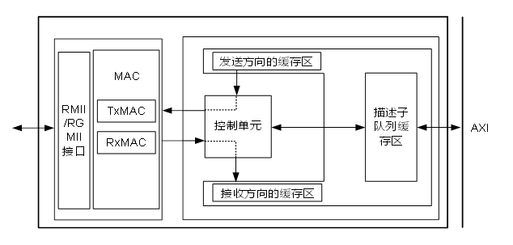

目 录

插图目录

[图6-1 GMAC总体数据流 6-2](#_Toc220675707)

表格目录

[表6-1 GMAC寄存器概览（GMAC0基址是0x0\_1029\_0000；GAMC1基地址是0x0\_102A\_0000） 6-6](#_Toc220675709)

# GMAC

## 概述

千兆以太网模块实现网络接口数据的接收和发送，支持10/100/1000Mbit/s工作模式可配置，支持全双工、半双工工作模式。可实现和CPU端口间的数据通信。

Hi3403V100支持2个GMAC模块。

## 功能描述

千兆以太网模块有如下功能特点：

- 支持10/100/1000Mbit/s速率。
- 支持全双工或半双工工作模式。
- 支持RMII/RGMII（Reduced Gigabit Media Independent Interface）接口。
- 提供MDIO接口。
- 支持帧长有效性检测，丢弃超长帧和超短帧。
- 支持对输入帧进行CRC校验，可丢弃校验错的帧。
- 支持对输出帧添加CRC校验。
- 支持短帧填充功能。
- 支持对接收和发送帧进行统计计数。
- 支持广播帧、组播帧和单播帧过滤。
- 支持IP报文、广播或多播报文限速处理功能可配置。
- 支持非法包过滤功能。
- 支持入队中断和超时中断两种中断方式。
- 支持收发包缓存。

## 总体数据流

GMAC千兆以太网交换接口的总体数据流如图6-1所示。

GMAC总体数据流

## 单网口功能配置描述

### 以太网收发帧管理功能

CPU通过配置描述子队列缓存区，对Ethernet进行收发帧地址管理：

- 接收时，Ethernet分辨从外网收到的各种数据包，并根据CPU配置的报文缓存信息，包括报文缓存起始地址、报文缓存深度等，将收到的合法包通过总线存放到DDR中。
- 发送时，Ethernet根据CPU配置的报文缓存信息，包括报文缓存起始地址、报文长度以及其他的报文信息等，通过总线，将存于DDR的报文搬运过来，自行组装成包，然后发送到网络接口上。

### 以太网收包中断管理功能

#### 中断产生

配置接收方向入队中断使能以及上报入队中断的水线，当逻辑回写到DDR中的描述子个数达到配置水线时，则产生一个接收入队中断。

配置ENA\_PMU\_INT bit[17] rx\_bq入队中断使能；

配置ENA\_PMU\_INT bit[28] rx\_bq入队超时中断使能。

----结束

#### 中断清除

CPU收到接收入队中断或者接收超时中断后，写1清除接收入队中断和接收超时中断。

### 配置PHY芯片工作状态

以太网交换模块提供MDIO接口实现对PHY芯片的管理。MDIO分为读操作和写操作，下面分别介绍两者的操作步骤。

读操作的配置步骤如下：

CPU向MDIO\_SINGLE\_CMD bit[12:8]写入PHY芯片地址，向bit[4:0]写入PHY内部寄存器地址，同时配置寄存器MDIO\_SINGLE\_CMD bit[20]为1，配置bit[17:16]为2’b10，启动MDIO读操作；

MDIO将从外部PHY芯片读回的数据写到MDIO\_SINGLE\_DATA bit[31:16]，并同时将MDIO\_SINGLE\_CMD bit[20]配置为0；

CPU查询MDIO\_SINGLE\_DATA bit[31:16]得到MDIO从外部PHY芯片读回的数据。

----结束

写操作的配置步骤如下：

CPU将发送给外部PHY芯片的数据写入MDIO\_SINGLE\_DATA bit[15:0]；

向MDIO\_SINGLE\_CMD bit[9:8]写入PHY芯片地址，向bit[4:0]写入PHY内部寄存器地址，同时配置bit[20]为1，配置bit[17:16]为1，启动MDIO写操作；

MDIO将MDIO\_SINGLE\_DATA bit[15:0]的值写入相应的PHY内部寄存器中，完成MDIO的写操作，并自动将MDIO\_SINGLE\_CMD bit[20]配置为0x0。

----结束

### 工作模式切换

千兆以太网的工作模式。

- RMII（10M/100M）
- RGMII（10M/100M/1000M）

上述模式根据单板硬件连接确认。

下面介绍速率双工切换步骤。

配置MAC\_IF\_STAT\_CTRL bit[8:0](0网口MAC\_IF状态控制寄存器)；

配置PERI\_CRG3568/PERI\_CRG3584 bit[0]（GMAC CRG控制寄存器）为1进行复位，然后再配置为0撤销复位，使配置的工作模式生效；

配置PORT\_MODE（MAC端口速率模式寄存器）。

<strong><big>说明</big></strong>

芯片正常工作时不可进行此项配置，建议在初始化时进行配置。

----结束

## 典型应用

### 以太网限速功能

以太网交换模块具有对接收报文进行限速的功能，即在某段时间内，当通过的报文数超过设定的最大数量时，后续报文将被丢弃。

以太网交换模块对报文限速分为以下两种。

- 对IP报文的限速
- 对广播或多播报文的限速
#### 对IP报文的限速

IP报文的限速以1μs为单位进行计数，在限速时间内，当通过的报文达到限速个数时，后续报文被丢弃。

对IP报文进行限速时，需要做如下配置。

配置CONTROL\_WORD bit[21]为1。

配置FLOW\_CTRL\_PKG\_THRSLD。

配置CRF\_FLOW\_TIME\_THRSLD。

----结束

#### 对广播或多播报文的限速

广播或多播报文的限速时间以1μs为单位进行计数，在限速时间内，当通过的报文达到限速个数时，后续报文被丢弃。

对广播或者多播报文进行限速时，需要做如下配置。

配置CONTROL\_WORD bit[16]为1。

配置CRF\_BM\_PKT\_THRSLD。

配置CRF\_BM\_PKT\_THRSLD。

----结束

### 寄存器偏移地址说明

GMAC偏移地址共占用16bit地址空间，其中：

- 0x0000~0x0fff：用于GMAC以太网口；
- 0x300c：MAC\_IF状态控制寄存器。

## GMAC寄存器

### 概览

GMAC寄存器概览如表6-1所示。

GMAC寄存器概览（GMAC0基址是0x0\_1029\_0000；GAMC1基地址是0x0\_102A\_0000）

| 偏移地址 | 名称 | 描述 | 页码 |
| --- | --- | --- | --- |
| 0x0000 | STATION\_ADDR\_LOW | 本机MAC地址寄存器 | 6-8 |
| 0x0004 | STATION\_ADDR\_HIGH | 本机MAC地址寄存器 | 6-8 |
| 0x0008 | DUPLEX\_SEL\_RGMII | 半双工选择寄存器 | 6-8 |
| 0x000C | FD\_FC\_TYPE | 流控帧类型域寄存器 | 6-9 |
| 0x0014 | COL\_DISTANCE | 单次重传包长水线寄存器 | 6-9 |
| 0x0038 | PAUSE\_THR | 发送流控帧间隙寄存器 | 6-9 |
| 0x003C | MAX\_FRM\_SIZE | 最大帧长寄存器 | 6-10 |
| 0x0040 | PORT\_MODE | 端口状态寄存器 | 6-10 |
| 0x0044 | PORT\_EN | 通道使能寄存器 | 6-11 |
| 0x0048 | PAUSE\_EN | 流控使能寄存器 | 6-11 |
| 0x0050 | SHORT\_RUNTS\_THR | 超短帧界限寄存器 | 6-11 |
| 0x0054 | DROP\_UNK\_CTL\_FRM | 未知控制帧丢弃使能寄存器 | 6-12 |
| 0x0060 | TRANSMIT\_CONTROL | 常用配置寄存器 | 6-12 |
| 0x0064 | REC\_FILT\_CONTROL | 接收帧过滤控制寄存器 | 6-13 |
| 0x0080 | RX\_OCTETS\_OK\_CNT | 接收有效帧的字节统计寄存器 | 6-14 |
| 0x0084 | RX\_OCTETS\_BAD\_CNT | 接收错误帧字节统计寄存器 | 6-14 |
| 0x0088 | RX\_UC\_PKTS | MAC接收单播帧数统计寄存器 | 6-14 |
| 0x008C | RX\_MC\_PKTS | 接收多播帧数统计寄存器 | 6-14 |
| 0x0090 | RX\_BC\_PKTS | 接收的广播帧数统计寄存器 | 6-15 |
| 0x00B0 | RX\_FCS\_ERRORS | 接收CRC检验错误的帧数统计寄存器 | 6-15 |
| 0x0100 | OCTETS\_TRANSMITTED\_OK | 发送成功的好包字节数统计寄存器 | 6-15 |
| 0x0104 | OCTETS\_TRANSMITTED\_BAD | 发送成功的错包字节数统计寄存器 | 6-15 |
| 0x0108 | TX\_UC\_PKTS | 发送的单播帧数统计寄存器 | 6-16 |
| 0x010C | TX\_MC\_PKTS | 发送的多播帧数统计寄存器 | 6-16 |
| 0x0110 | TX\_BC\_PKTS | 发送的广播帧数统计寄存器 | 6-16 |
| 0x0158 | TX\_CRC\_ERROR | 发送帧长正确CRC错误的帧数统计寄存器 | 6-16 |
| 0x01B0 | CF\_CRC\_STRIP | CRC剥离使能寄存器 | 6-17 |
| 0x01B4 | MODE\_CHANGE\_EN | 端口模式改变使能寄存器 | 6-17 |
| 0x01C0 | COL\_SLOT\_TIME | 半双工冲突重传间隔时间计数器寄存器 | 6-17 |
| 0x01E0 | RECV\_CONTROL | 接收控制寄存器 | 6-18 |
| 0x01E8 | VLAN\_CODE | VLAN Code寄存器 | 6-18 |
| 0x020C | CRF\_MAX\_PACKET | 最大过滤包长寄存器 | 6-19 |
| 0x0210 | CRF\_MIN\_PACKET | 最小过滤包长寄存器 | 6-19 |
| 0x0214 | CONTROL\_WORD | 控制寄存器 | 6-19 |
| 0x0218 | FLOW\_CTRL\_PKG\_THRSLD | 限速包个数寄存器 | 6-20 |
| 0x021C | CRF\_FLOW\_TIME\_THRSLD | 限速时间寄存器 | 6-21 |
| 0x0358 | CRF\_BM\_PKT\_THRSLD | 广播和多播报文的限速处理包个数寄存器 | 6-21 |
| 0x02E8 | TSO\_COE\_CTRL | TSO开关和COE过滤开关寄存器 | 6-21 |
| 0x035C | CRF\_BM\_TIME\_THRSLD | 广播和多播报文的限速时间计数寄存器 | 6-22 |
| 0x03C0 | MDIO\_SINGLE\_CMD | MDIO单次操作寄存器 | 6-23 |
| 0x03C4 | MDIO\_SINGLE\_DATA | MDIO读写数据寄存器 | 6-23 |
| 0x05C4 | ENA\_PMU\_INT | PMU模块原始中断使能寄存器 | 6-24 |
| 0x05C8 | STATUS\_PMU\_INT | PMU模块中断状态寄存器 | 6-28 |
| 0x05CC | DESC\_WR\_RD\_ENA | CFF读写描述子使能寄存器 | 6-32 |
| 0x300C | MAC\_IF\_STAT\_CTRL | MAC\_IF模式控制寄存器 | 6-33 |

### GMAC寄存器描述

#### STATION\_ADDR\_LOW

STATION\_ADDR\_LOW为本机MAC地址寄存器。

Offset Address: 0x0000 Total Reset Value: 0x0000\_0000

|  |  |  |  |  |
| --- | --- | --- | --- | --- |
| Bits | Access | Name | Description | Reset |
| [31:0] | RW | station\_addr\_low | MAC\_CORE的MAC源地址低32bit。 | 0x00000000 |

#### STATION\_ADDR\_HIGH

STATION\_ADDR\_HIGH为本机MAC地址寄存器。

Offset Address: 0x0004 Total Reset Value: 0x0000\_0000

|  |  |  |  |  |
| --- | --- | --- | --- | --- |
| Bits | Access | Name | Description | Reset |
| [31:16] | - | reserved | 保留。 | 0x0000 |
| [15:0] | RW | station\_addr\_high | MAC\_CORE的MAC源地址高16bit，可默认。 | 0x0000 |

#### DUPLEX\_SEL\_RGMII

DUPLEX\_SEL\_RGMII为半双工选择寄存器。

Offset Address: 0x0008 Total Reset Value: 0x0000\_0001

|  |  |  |  |  |
| --- | --- | --- | --- | --- |
| Bits | Access | Name | Description | Reset |
| [31:1] | - | reserved | 保留。 | 0x00000000 |
| [0] | RW | duplex\_sel\_rgmii | 半双工选择信号。  0：半双工；  1：全双工。 | 0x1 |

#### FD\_FC\_TYPE

FD\_FC\_TYPE为流控帧类型域寄存器。

Offset Address: 0x000C Total Reset Value: 0x0000\_8808

|  |  |  |  |  |
| --- | --- | --- | --- | --- |
| Bits | Access | Name | Description | Reset |
| [31:16] | - | reserved | 保留。 | 0x0000 |
| [15:0] | RW | fd\_fc\_type | 全双工模式下流控帧TYPE域。 | 0x8808 |

#### COL\_DISTANCE

COL\_DISTANCE为单次重传包长水线寄存器。

Offset Address: 0x0014 Total Reset Value: 0x0000\_0043

|  |  |  |  |  |
| --- | --- | --- | --- | --- |
| Bits | Access | Name | Description | Reset |
| [31:10] | - | reserved | 保留。 | 0x000000 |
| [9:0] | RW | col\_distance | 单次重传包长水线。 | 0x043 |

#### PAUSE\_THR

PAUSE\_THR为发送流控帧间隙寄存器。

Offset Address: 0x0038 Total Reset Value: 0x0000\_002F

| Bits | Access | Name | Description | Reset |
| --- | --- | --- | --- | --- |
| [31:16] | RO | reserved | 保留。 | 0x0000 |
| [15:0] | RW | pause\_thr | 流控帧间隔时间，若流控时间大于间隔时间，MAC自动发送流控帧。以512bit为时间单位。 | 0x002F |

#### MAX\_FRM\_SIZE

MAX\_FRM\_SIZE为最大帧长寄存器。

Offset Address: 0x003C Total Reset Value: 0x0000\_05EE

| Bits | Access | Name | Description | Reset |
| --- | --- | --- | --- | --- |
| [31:14] | - | reserved | 保留。 | 0x00000 |
| [13:0] | RW | max\_frm\_size | MAC部分允许的最大帧长。  当接收到大于该帧长的帧时，将该帧认为超长错误帧；当发送帧超过该帧长的帧时，将发送帧截断后做为错帧发送。 | 0x05EE |

#### PORT\_MODE

PORT\_MODE为端口状态寄存器。

Offset Address: 0x0040 Total Reset Value: 0x0000\_0001

|  |  |  |  |  |
| --- | --- | --- | --- | --- |
| Bits | Access | Name | Description | Reset |
| [31:3] | - | reserved | 保留。 | 0x00000000 |
| [2:0] | RW | port\_mode | 指示当前MAC端口工作的模式。  000：10Mbps；  001：100Mbps；  101：1000Mbps；  其他：保留。 | 0x1 |

#### PORT\_EN

PORT\_EN为通道使能寄存器。

Offset Address: 0x0044 Total Reset Value: 0x0000\_0006

| Bits | Access | Name | Description | Reset |
| --- | --- | --- | --- | --- |
| [31:3] | - | reserved | 保留。 | 0x00000000 |
| [2] | RW | tx\_en | 发送通道使能位。  0：不使能；  1：使能。 | 0x1 |
| [1] | RW | rx\_en | 接收通道使能位。  0：不使能；  1：使能。 | 0x1 |
| [0] | - | reserved | 保留。 | 0x0 |

#### PAUSE\_EN

PAUSE\_EN为流控使能寄存器。

Offset Address: 0x0048 Total Reset Value: 0x0000\_0007

|  |  |  |  |  |
| --- | --- | --- | --- | --- |
| Bits | Access | Name | Description | Reset |
| [31:2] | RO | reserved | 保留。 | 0x00000001 |
| [1] | RW | tx\_fdfc | 全双工模式下发送流控帧使能。  0：不使能；  1：使能。 | 0x1 |
| [0] | RW | rx\_fdfc | 全双工模式下响应流控帧使能。  0：不使能；  1：使能。 | 0x1 |

#### SHORT\_RUNTS\_THR

SHORT\_RUNTS\_THR为超短帧界限寄存器。

Offset Address: 0x0050 Total Reset Value: 0x0000\_000C

|  |  |  |  |  |
| --- | --- | --- | --- | --- |
| Bits | Access | Name | Description | Reset |
| [31:5] | RO | reserved | 保留。 | 0x0000000 |
| [4:0] | RW | short\_runts\_thr | 短帧、超短帧界限(只用于统计短帧、超短帧计数)。 | 0x0C |

#### DROP\_UNK\_CTL\_FRM

DROP\_UNK\_CTL\_FRM为未知控制帧丢弃使能寄存器。

Offset Address: 0x0054 Total Reset Value: 0x0000\_0001

|  |  |  |  |  |
| --- | --- | --- | --- | --- |
| Bits | Access | Name | Description | Reset |
| [31:1] | RO | reserved | 保留。 | 0x00000000 |
| [0] | RW | drop\_unk\_ctl\_frm | 未知控制帧处理位。  0：正常转发未知控制帧；  1：丢弃未知控制帧。 | 0x1 |

#### TRANSMIT\_CONTROL

TRANSMIT\_CONTROL为常用配置寄存器。

Offset Address: 0x0060 Total Reset Value: 0x0000\_00C0

| Bits | Access | Name | Description | Reset |
| --- | --- | --- | --- | --- |
| [31:8] | - | reserved | 保留。 | 0x000000 |
| [7] | RW | pad\_enable | 发送添加PAD使能。  0：不使能；  1：使能。 | 0x1 |
| [6] | RW | crc\_add | 发送添加FCS使能。  0：不使能；  1：使能。 | 0x1 |
| [5:0] | - | reserved | 保留。 | 0x00 |

#### REC\_FILT\_CONTROL

REC\_FILT\_CONTROL为接收帧过滤控制寄存器。

Offset Address: 0x0064 Total Reset Value: 0x0000\_0000

| Bits | Access | Name | Description | Reset |
| --- | --- | --- | --- | --- |
| [31:6] | - | reserved | 保留。 | 0x0000000 |
| [5] | RW | crc\_err\_pass | 过滤CRC错误帧使能。  0：不使能；  1：使能，表示把CRC错误帧丢弃。 | 0x0 |
| [4] | RW | pause\_frm\_pass | 过滤流控帧使能。  0：不使能，流控使能有效才起作用，要上传至软件；  1：使能，流控使能有效才起作用，不上传至软件。 | 0x0 |
| [3] | RW | vlan\_drop\_en | 过滤VLAN帧使能。  0：不使能；  1：使能。 | 0x0 |
| [2] | RW | bc\_drop\_en | 过滤广播帧使能。  0：不使能；  1：使能。 | 0x0 |
| [1] | RW | mc\_match\_en | 过滤DA不匹配的多播帧使能。  0：不使能；  1：使能。 | 0x0 |
| [0] | RW | uc\_match\_en | 过滤DA不匹配的单播帧使能。  0：不使能；  1：使能。 | 0x0 |

#### RX\_OCTETS\_OK\_CNT

RX\_OCTETS\_OK\_CNT为接收有效帧的字节统计寄存器。

Offset Address: 0x0080 Total Reset Value: 0x0000\_0000

|  |  |  |  |  |
| --- | --- | --- | --- | --- |
| Bits | Access | Name | Description | Reset |
| [31:0] | RC | rx\_octets\_ok\_cnt | 接收有效帧字节统计，范围包括DA～FCS。 | 0x00000000 |

#### RX\_OCTETS\_BAD\_CNT

RX\_OCTETS\_BAD\_CNT为接收错误帧字节统计寄存器。

Offset Address: 0x0084 Total Reset Value: 0x0000\_0000

|  |  |  |  |  |
| --- | --- | --- | --- | --- |
| Bits | Access | Name | Description | Reset |
| [31:0] | RC | rx\_octets\_bad\_cnt | 接收错帧字节统计，包括CRC错误，对齐错误等。 | 0x00000000 |

#### RX\_UC\_PKTS

RX\_UC\_PKTS为MAC接收单播帧数统计寄存器。

Offset Address: 0x0088 Total Reset Value: 0x0000\_0000

|  |  |  |  |  |
| --- | --- | --- | --- | --- |
| Bits | Access | Name | Description | Reset |
| [31:0] | RC | rx\_uc\_pkts\_cnt | 接收单播帧数统计(不包括错帧)。 | 0x00000000 |

#### RX\_MC\_PKTS

RX\_MC\_PKTS为接收多播帧数统计寄存器。

Offset Address: 0x008C Total Reset Value: 0x0000\_0000

|  |  |  |  |  |
| --- | --- | --- | --- | --- |
| Bits | Access | Name | Description | Reset |
| [31:0] | RC | rx\_mc\_pkts\_cnt | 接收多播帧数统计(不包括错帧)。 | 0x00000000 |

#### RX\_BC\_PKTS

RX\_BC\_PKTS为接收的广播帧数统计寄存器。

Offset Address: 0x0090 Total Reset Value: 0x0000\_0000

|  |  |  |  |  |
| --- | --- | --- | --- | --- |
| Bits | Access | Name | Description | Reset |
| [31:0] | RC | rx\_bc\_pkts\_cnt | 接收广播帧数统计(不包括错帧)。 | 0x00000000 |

#### RX\_FCS\_ERRORS

RX\_FCS\_ERRORS为接收CRC检验错误的帧数统计寄存器。

Offset Address: 0x00B0 Total Reset Value: 0x0000\_0000

|  |  |  |  |  |
| --- | --- | --- | --- | --- |
| Bits | Access | Name | Description | Reset |
| [31:0] | RC | rx\_fcs\_errors | CRC检测错误的帧数统计(不包括短帧)。 | 0x00000000 |

#### OCTETS\_TRANSMITTED\_OK

OCTETS\_TRANSMITTED\_OK为发送成功的好包字节数统计寄存器。

Offset Address: 0x0100 Total Reset Value: 0x0000\_0000

|  |  |  |  |  |
| --- | --- | --- | --- | --- |
| Bits | Access | Name | Description | Reset |
| [31:0] | RC | octets\_transmitted\_ok | 发送成功的好包字节数(不包括前导码和SFD)。 | 0x00000000 |

#### OCTETS\_TRANSMITTED\_BAD

OCTETS\_TRANSMITTED\_BAD为发送成功的错包字节数统计寄存器。

Offset Address: 0x0104 Total Reset Value: 0x0000\_0000

|  |  |  |  |  |
| --- | --- | --- | --- | --- |
| Bits | Access | Name | Description | Reset |
| [31:0] | RC | octets\_transmitted\_bad | 发送成功的错包的字节数。 | 0x00000000 |

#### TX\_UC\_PKTS

TX\_UC\_PKTS为发送的单播帧数统计寄存器。

Offset Address: 0x0108 Total Reset Value: 0x0000\_0000

|  |  |  |  |  |
| --- | --- | --- | --- | --- |
| Bits | Access | Name | Description | Reset |
| [31:0] | RC | tx\_uc\_pkts | 发送的单播帧数统计(不包括错包)。 | 0x00000000 |

#### TX\_MC\_PKTS

TX\_MC\_PKTS为发送的多播帧数统计寄存器。

Offset Address: 0x010C Total Reset Value: 0x0000\_0000

|  |  |  |  |  |
| --- | --- | --- | --- | --- |
| Bits | Access | Name | Description | Reset |
| [31:0] | RC | tx\_mc\_pkts | 发送的多播帧数统计(不包括错包)。 | 0x00000000 |

#### TX\_BC\_PKTS

TX\_BC\_PKTS为发送的广播帧数统计寄存器。

Offset Address: 0x0110 Total Reset Value: 0x0000\_0000

|  |  |  |  |  |
| --- | --- | --- | --- | --- |
| Bits | Access | Name | Description | Reset |
| [31:0] | RC | tx\_bc\_pkts | 发送的广播帧数(不包括错包)。 | 0x00000000 |

#### TX\_CRC\_ERROR

TX\_CRC\_ERROR为发送帧长正确CRC错误的帧数统计寄存器。

Offset Address: 0x0158 Total Reset Value: 0x0000\_0000

| Bits | Access | Name | Description | Reset |
| --- | --- | --- | --- | --- |
| [31:0] | RC | tx\_crc\_error | 发送帧长正确而CRC错误的帧数目统计。 | 0x00000000 |

#### CF\_CRC\_STRIP

CF\_CRC\_STRIP为CRC剥离使能寄存器。

Offset Address: 0x01B0 Total Reset Value: 0x0000\_0001

|  |  |  |  |  |
| --- | --- | --- | --- | --- |
| Bits | Access | Name | Description | Reset |
| [31:1] | - | reserved | 保留。 | 0x00000000 |
| [0] | RW | cf\_crc\_strip | MAC剥离接收方向CRC使能。  0：不使能，上报包长包括CRC的4字节；  1：使能，剥离后上报包长不包括CRC的4字节。 | 0x1 |

#### MODE\_CHANGE\_EN

MODE\_CHANGE\_EN为端口模式改变使能寄存器。

Offset Address: 0x01B4 Total Reset Value: 0x0000\_0000

|  |  |  |  |  |
| --- | --- | --- | --- | --- |
| Bits | Access | Name | Description | Reset |
| [31:1] | - | reserved | 保留。 | 0x00000000 |
| [0] | RW | mode\_change\_en | port\_mode改变生效使能。  0：不使能；  1：使能。 | 0x0 |

#### COL\_SLOT\_TIME

COL\_SLOT\_TIME为半双工冲突重传间隔时间计数器寄存器。

Offset Address: 0x01C0 Total Reset Value: 0x0000\_40FF

|  |  |  |  |  |
| --- | --- | --- | --- | --- |
| Bits | Access | Name | Description | Reset |
| [31:24] | RO | reserved | 保留。 | 0x00 |
| [23:8] | RW | cf2bc\_slottime | 半双工冲突重传单位间隔时间。 | 0x0040 |
| [7:0] | RW | cf2bc\_random\_seed | 半双工冲突重传随机倍数基数。 | 0xFF |

#### RECV\_CONTROL

RECV\_CONTROL为接收控制寄存器。

Offset Address: 0x01E0 Total Reset Value: 0x0000\_0000

|  |  |  |  |  |
| --- | --- | --- | --- | --- |
| Bits | Access | Name | Description | Reset |
| [31:5] | - | reserved | 保留。 | 0x0000000 |
| [4] | RW | runt\_pkt\_en | 接收超短帧透穿功能。  0：丢弃，不上传给软件；  1：上传给软件。 | 0x0 |
| [3] | RW | strip\_pad\_en | 剥离接收帧的PAD使能。  0：不使能；  1：使能。 | 0x0 |
| [2:0] | - | reserved | 保留。 | 0x0 |

#### VLAN\_CODE

VLAN\_CODE为VLAN Code寄存器。

Offset Address: 0x01E8 Total Reset Value: 0x0000\_8100

|  |  |  |  |  |
| --- | --- | --- | --- | --- |
| Bits | Access | Name | Description | Reset |
| [31:16] | RO | reserved | 保留。 | 0x00000 |
| [15:0] | RW | cf\_vlan\_code | Ethernet Type域配置。 | 0x8100 |

#### CRF\_MAX\_PACKET

CRF\_MAX\_PACKET为最大过滤包长寄存器。

Offset Address: 0x020C Total Reset Value: 0x05EE\_0000

|  |  |  |  |  |
| --- | --- | --- | --- | --- |
| Bits | Access | Name | Description | Reset |
| [31:27] | RO | reserved | 保留。 | 0x0 |
| [26:16] | RW | crf\_tx\_max\_packet | PMU中允许的normal包和SG包最大长度。 | 0x5EE |
| [15:0] | RO | reserved | 保留。 | 0x0000 |

#### CRF\_MIN\_PACKET

CRF\_MIN\_PACKET为最小过滤包长寄存器。

Offset Address: 0x0210 Total Reset Value: 0x0000\_0F2A

|  |  |  |  |  |
| --- | --- | --- | --- | --- |
| Bits | Access | Name | Description | Reset |
| [31:14] | - | reserved | 保留。 | 0x00000 |
| [13:8] | RW | crf\_tx\_min\_packet | 发送方向配置的最小发送包长度，默认为15byte。 | 0x0F |
| [7:6] | - | reserved | 保留。 | 0x0 |
| [5:0] | RW | crf\_rx\_min\_packet | 接收方向配置的最小发送包长度，默认为42byte。 | 0x2A |

#### CONTROL\_WORD

CONTROL\_WORD为控制寄存器。

Offset Address: 0x0214 Total Reset Value: 0x0000\_0640

| Bits | Access | Name | Description | Reset |
| --- | --- | --- | --- | --- |
| [31:26] | - | reserved | 保留。 | 0x00 |
| [25] | RW | crf\_tx\_standard | 发送FIFO的发送水线设置标准。  0：按包和将空水线设置。当发送FIFO中有一个完整的包，或者发送FIFO中的有效数据个数大于等于4倍的发送水线时，即向MAC发送读请求；  1：按包设置；当发送FIFO中有一个完整的包时，才向MAC发送读请求。 | 0x0 |
| [24:22] | - | reserved | 保留。 | 0x0 |
| [21] | RW | crf\_ip\_flow\_ctrl | IP报文限速使能。  0：不限速；  1：限速。 | 0x0 |
| [20] | - | reserved | 保留。 | 0x0 |
| [19:18] | - | reserved | 保留。 | 0x0 |
| [17] | RW | crf\_filt\_unused\_pkg | 过滤非法报文控制。  0不过滤；  1：过滤。 | 0x0 |
| [16] | RW | crf\_bm\_flow\_ctrl | 对广播或多播报文流控控制。  0：不流控；  1：流控。 | 0x0 |
| [15:14] | - | reserved | 保留。 | 0x0 |
| [13:0] | RW | crf\_large\_packet | 配置的最大包长度，默认为1600byte(PMU使用的最大包长)。 | 0x0640 |

#### FLOW\_CTRL\_PKG\_THRSLD

FLOW\_CTRL\_PKG\_THRSLD为限速包个数寄存器。

Offset Address: 0x0218 Total Reset Value: 0xFFFF\_0000

|  |  |  |  |  |
| --- | --- | --- | --- | --- |
| Bits | Access | Name | Description | Reset |
| [31:16] | RW | crf\_ip\_pkg\_thrsld | IP报文的包上限，当在T时间内接收的IP报文超过该数，则进行限速，否则，不限速。 | 0xFFFF |
| [15:0] | - | reserved | 保留。 | 0x0000 |

#### CRF\_FLOW\_TIME\_THRSLD

CRF\_FLOW\_TIME\_THRSLD为限速时间寄存器。

Offset Address: 0x021C Total Reset Value: 0x0000\_00FF

|  |  |  |  |  |
| --- | --- | --- | --- | --- |
| Bits | Access | Name | Description | Reset |
| [31:8] | - | reserved | 保留。 | 0x000000 |
| [7:0] | RW | crf\_flow\_time\_thrsld | 限速处理的时间，以125μs为单位。  限速时间T=(crf\_flow\_time\_thrsld+1)(125μs) | 0xFF |

#### CRF\_BM\_PKT\_THRSLD

CRF\_BM\_PKT\_THRSLD为广播和多播报文的限速处理包个数寄存器。

Offset Address: 0x0358 Total Reset Value: 0x0000\_0001

|  |  |  |  |  |
| --- | --- | --- | --- | --- |
| Bits | Access | Name | Description | Reset |
| [31:16] | - | reserved | 保留。 | 0x0000 |
| [15:0] | RW | crf\_bm\_pkt\_thrsld | 广播和多播报文的包上限，当在限速单位时间内接收的广播或多播报文超过该数，则进行限速，否则不限速。 | 0x0001 |

#### TSO\_COE\_CTRL

TSO\_COE\_CTRL为TSO开关和COE过滤开关寄存器。

Offset Address: 0x02E8 Total Reset Value: 0x8000\_0081

| Bits | Access | Name | Description | Reset |
| --- | --- | --- | --- | --- |
| [31:16] | - | reserved | 保留。 | 0x8000 |
| [15:8] | - | reserved | 保留。 | 0x00 |
| [7] | RW | coe\_drop\_cnt\_en | 接收报文统计计数使能。  0：关闭；  1：打开。 | 0x1 |
| [6] | RW | coe\_ipv6udp\_zero\_drop | 接收报文IPv6 UDP checksum为0的包是否配置丢弃。  0：关闭；  1：打开。 | 0x0 |
| [5] | RW | coe\_payload\_drop | 接收报文TCP/UDP checksum错误的包是否配置丢弃。  0：关闭；  1：打开。 | 0x0 |
| [4] | RW | coe\_iphead\_drop | 接收报文IPv4头checksum错误的包是否配置丢弃。  0：关闭；  1：打开。 | 0x0 |
| [3:0] | - | reserved | 保留。 | 0x1 |

#### CRF\_BM\_TIME\_THRSLD

CRF\_BM\_TIME\_THRSLD为广播和多播报文的限速时间计数寄存器。

Offset Address: 0x035C Total Reset Value: 0x0000\_2710

|  |  |  |  |  |
| --- | --- | --- | --- | --- |
| Bits | Access | Name | Description | Reset |
| [31:20] | RO | reserved | 保留。 | 0x000 |
| [19:0] | RW | crf\_bm\_time\_thrsld | 广播和多播报文的限速时间上限，以1us为单位进行计数，当等于该计数值时，为一个限速单位时间。 | 0x02710 |

#### MDIO\_SINGLE\_CMD

MDIO\_SINGLE\_CMD为MDIO单次操作寄存器。

Offset Address: 0x03C0 Total Reset Value: 0x0001\_0000

| Bits | Access | Name | Description | Reset |
| --- | --- | --- | --- | --- |
| [31:21] | - | reserved | 保留。 | 0x000 |
| [20] | RW | mdio\_cmd | MDIO操作完成指示。  0：MDIO操作完成；  1：启动MDIO操作。 | 0x0 |
| [19:18] | - | reserved | 保留。 | 0x0 |
| [17:16] | RW | op\_code | MDIO操作类型。  00：保留；  01：写操作；  10：读操作；  11：保留。 | 0x1 |
| [15:13] | - | reserved | 保留。 | 0x0 |
| [12:8] | RW | phy\_addr | 配置外部PHY地址的5bit。 | 0x00 |
| [7:5] | - | reserved | 保留。 | 0x0 |
| [4:0] | RW | reg\_addr | PHY器件内部的寄存器地址。 | 0x00 |

#### MDIO\_SINGLE\_DATA

MDIO\_SINGLE\_DATA为MDIO读写数据寄存器。

Offset Address: 0x03C4 Total Reset Value: 0x0000\_0000

|  |  |  |  |  |
| --- | --- | --- | --- | --- |
| Bits | Access | Name | Description | Reset |
| [31:16] | RO | mdio\_rd\_data | MDIO从外部PHY器件回读的数据。 | 0x0000 |
| [15:0] | RW | mdio\_wr\_data | MDIO写数据。 | 0x0000 |

#### ENA\_PMU\_INT

ENA\_PMU\_INT为PMU模块原始中断使能寄存器。

Offset Address: 0x05C4 Total Reset Value: 0x0000\_0000

| Bits | Access | Name | Description | Reset |
| --- | --- | --- | --- | --- |
| [31] | RO | reserved | 保留。 | 0x0 |
| [30] | RW | ena\_mac\_fifo\_err\_int | MAC内部FIFO错误中断使能。  0：不使能；  1：使能。 | 0x0 |
| [29] | RW | ena\_tx\_rq\_in\_timeout\_int | 发送方向的RQ队列描述子入队超时中断使能。  0：不使能；  1：使能。 | 0x0 |
| [28] | RW | ena\_rx\_bq\_in\_timeout\_int | 接收方向的BQ队列描述子入队超时中断使能。  0：不使能；  1：使能。 | 0x0 |
| [27] | RW | ena\_txoutcff\_full\_int | 发送方向DESC\_OUTCFF满中断使能。  0：不使能；  1：使能。 | 0x0 |
| [26] | RW | ena\_txoutcff\_empty\_int | 发送方向DESC\_OUTCFF空中断使能。  0：不使能；  1：使能。 | 0x0 |
| [25] | RW | ena\_txcff\_full\_int | 发送方向DESC\_FIFO满中断使能。  0：不使能；  1：使能。 | 0x0 |
| [24] | RW | ena\_txcff\_empty\_int | 发送方向DESC\_FIFO空中断使能。  0：不使能；  1：使能。 | 0x0 |
| [23] | RW | ena\_rxoutcff\_full\_int | 接收方向DESC\_OUTCFF满中断使能。  0：不使能；  1：使能。 | 0x0 |
| [22] | RW | ena\_rxoutcff\_empty\_int | 接收方向DESC\_OUTCFF空中断使能。  0：不使能；  1：使能。 | 0x0 |
| [21] | RW | ena\_rxcff\_full\_int | 接收方向DESC\_FIFO满中断使能。  0：不使能；  1：使能。 | 0x0 |
| [20] | RW | ena\_rxcff\_empty\_int | 接收方向DESC\_FIFO空中断使能。  0：不使能；  1：使能。 | 0x0 |
| [19] | RW | ena\_tx\_rq\_in\_int | 发送方向tx\_rq队列的描述子入队(多个或者单个描述子入队)中断使能。  0：不使能；  1：使能。 | 0x0 |
| [18] | RW | ena\_tx\_bq\_out\_int | 发送方向tx\_bq队列的描述子出队(多个或者单个描述子出队)中断使能。  0：不使能；  1：使能。 | 0x0 |
| [17] | RW | ena\_rx\_bq\_in\_int | 接收方向rx\_bq队列的描述子入队(多个或者单个描述子入队)中断使能。  0：不使能；  1：使能。 | 0x0 |
| [16] | RW | ena\_rx\_fq\_out\_int | 接收方向rx\_fq队列的描述子出队(多个或者单个描述子出队)中断使能。  0：不使能；  1：使能。 | 0x0 |
| [15] | RW | ena\_tx\_rq\_empty\_int | 发送方向的回收描述子队列空中断使能。  0：不使能；  1：使能。 | 0x0 |
| [14] | RW | ena\_tx\_rq\_full\_int | 发送方向的回收描述子队列满中断使能。  0：不使能；  1：使能。 | 0x0 |
| [13] | RW | ena\_tx\_rq\_alempty\_int | 发送方向的回收描述子队列几乎空中断使能。  0：不使能；  1：使能。 | 0x0 |
| [12] | RW | ena\_tx\_rq\_alfull\_int | 发送方向的回收描述子队列几乎满中断使能。  0：不使能；  1：使能。 | 0x0 |
| [11] | RW | ena\_tx\_bq\_empty\_int | 发送方向的buff描述子队列空中断使能。  0：不使能；  1：使能。 | 0x0 |
| [10] | RW | ena\_tx\_bq\_full\_int | 发送方向的buff描述子队列满中断使能。  0：不使能。  1：使能 | 0x0 |
| [9] | RW | ena\_tx\_bq\_alempty\_int | 发送方向的buff描述子队列几乎空中断使能。  0：不使能；  1：使能。 | 0x0 |
| [8] | RW | ena\_tx\_bq\_alfull\_int | 发送方向的buff描述子队列几乎满中断使能。  0：不使能；  1：使能。 | 0x0 |
| [7] | RW | ena\_rx\_bq\_empty\_int | 接收方向的buff描述子队列空中断使能。  0：不使能；  1：使能。 | 0x0 |
| [6] | RW | ena\_rx\_bq\_full\_int | 接收方向的buff描述子队列满中断使能。  0：不使能；  1：使能。 | 0x0 |
| [5] | RW | ena\_rx\_bq\_alempty\_int | 接收方向的buff描述子队列几乎空中断使能。  0：不使能；  1：使能。 | 0x0 |
| [4] | RW | ena\_rx\_bq\_alfull\_int | 接收方向的buff描述子队列几乎满中断使能。  0：不使能；  1：使能。 | 0x0 |
| [3] | RW | ena\_rx\_fq\_empty\_int | 接收方向的空闲描述子队列空中断使能。  0：不使能；  1：使能。 | 0x0 |
| [2] | RW | ena\_rx\_fq\_full\_int | 接收方向的空闲描述子队列满中断使能。  0：不使能；  1：使能。 | 0x0 |
| [1] | RW | ena\_rx\_fq\_alempty\_int | 接收方向的空闲描述子队列几乎空中断使能。  0：不使能；  1：使能。 | 0x0 |
| [0] | RW | ena\_rx\_fq\_alfull\_int | 接收方向的空闲描述子队列几乎满中断使能。  0：不使能；  1：使能。 | 0x0 |

#### STATUS\_PMU\_INT

STATUS\_PMU\_INT为PMU模块中断状态寄存器。

Offset Address: 0x05C8 Total Reset Value: 0x0000\_0000

| Bits | Access | Name | Description | Reset |
| --- | --- | --- | --- | --- |
| [31] | - | reserved | 保留。 | 0x0 |
| [30] | RW | status\_mac\_fifo\_err\_int | MAC内部FIFO又空又满错误中断状态。  0：无中断；  1：有中断。 | 0x0 |
| [29] | RW | status\_tx\_rq\_in\_timeout\_int | 发送方向的RQ队列描述子入队超时中断状态。  0：无中断；  1：有中断。 | 0x0 |
| [28] | RW | status\_rx\_bq\_in\_timeout\_int | 接收方向的BQ队列描述子入队超时中断状态。  0：无中断；  1：有中断。 | 0x0 |
| [27] | RW | status\_txoutcff\_full\_int | 发送方向DESC\_OUTCFF满中断状态。  0：无中断；  1：有中断。 | 0x0 |
| [26] | RW | status\_txoutcff\_empty\_int | 发送方向DESC\_OUTCFF空中断状态。  0：无中断；  1：有中断。 | 0x0 |
| [25] | RW | status\_txcff\_full\_int | 发送方向DESC\_FIFO满中断状态。  0：无中断；  1：有中断。 | 0x0 |
| [24] | RW | status\_txcff\_empty\_int | 发送方向DESC\_FIFO空中断状态。  0：无中断；  1：有中断。 | 0x0 |
| [23] | RW | status\_rxoutcff\_full\_int | 接收方向DESC\_OUTCFF满中断状态。  0：无中断；  1：有中断。 | 0x0 |
| [22] | RW | status\_rxoutcff\_empty\_int | 接收方向DESC\_OUTCFF空中断状态。  0：无中断；  1：有中断。 | 0x0 |
| [21] | RW | status\_rxcff\_full\_int | 接收方向DESC\_FIFO满中断状态。  0：无中断；  1：有中断。 | 0x0 |
| [20] | RW | status\_rxcff\_empty\_int | 接收方向DESC\_FIFO空中断状态。  0：无中断；  1：有中断。 | 0x0 |
| [19] | RW | status\_tx\_rq\_in\_int | 发送方向tx\_rq队列的描述子入队(多个或者单个描述子入队)中断状态。  0：无中断；  1：有中断。 | 0x0 |
| [18] | RW | status\_tx\_bq\_out\_int | 发送方向tx\_bq队列的描述子出队(多个或者单个描述子出队)中断状态。  0：无中断；  1：有中断。 | 0x0 |
| [17] | RW | status\_rx\_bq\_in\_int | 接收方向rx\_bq队列的描述子入队(多个或者单个描述子入队)中断状态。  0：无中断；  1：有中断。 | 0x0 |
| [16] | RW | status\_rx\_fq\_out\_int | 接收方向rx\_fq队列的描述子出队(多个或者单个描述子出队)中断状态。  0：无中断；  1：有中断。 | 0x0 |
| [15] | RW | status\_tx\_rq\_empty\_int | 发送方向的回收描述子队列空中断状态。  0：无中断；  1：有中断。 | 0x0 |
| [14] | RW | status\_tx\_rq\_full\_int | 发送方向的回收描述子队列满中断状态。  0：无中断；  1：有中断。 | 0x0 |
| [13] | RW | status\_tx\_rq\_alempty\_int | 发送方向的回收描述子队列几乎空中断状态。  0：无中断；  1：有中断。 | 0x0 |
| [12] | RW | status\_tx\_rq\_alfull\_int | 发送方向的回收描述子队列几乎满中断状态。  0：无中断；  1：有中断。 | 0x0 |
| [11] | RW | status\_tx\_bq\_empty\_int | 发送方向的buff描述子队列空中断状态。  0：无中断；  1：有中断。 | 0x0 |
| [10] | RW | status\_tx\_bq\_full\_int | 发送方向的buff描述子队列满中断状态。  0：无中断；  1：有中断。 | 0x0 |
| [9] | RW | status\_tx\_bq\_alempty\_int | 发送方向的buff描述子队列几乎空中断状态。  0：无中断；  1：有中断。 | 0x0 |
| [8] | RW | status\_tx\_bq\_alfull\_int | 发送方向的buff描述子队列几乎满中断状态。  0：无中断；  1：有中断。 | 0x0 |
| [7] | RW | status\_rx\_bq\_empty\_int | 接收方向的buff描述子队列空中断状态。  0：无中断；  1：有中断。 | 0x0 |
| [6] | RW | status\_rx\_bq\_full\_int | 接收方向的buff描述子队列满中断状态。  0：无中断；  1：有中断。 | 0x0 |
| [5] | RW | status\_rx\_bq\_alempty\_int | 接收方向的buff描述子队列几乎空中断状态。  0：无中断；  1：有中断。 | 0x0 |
| [4] | RW | status\_rx\_bq\_alfull\_int | 接收方向的buff描述子队列几乎满中断状态。  0：无中断；  1：有中断。 | 0x0 |
| [3] | RW | status\_rx\_fq\_empty\_int | 接收方向的空闲描述子队列空中断状态。  0：无中断；  1：有中断。 | 0x0 |
| [2] | RW | status\_rx\_fq\_full\_int | 接收方向的空闲描述子队列满中断状态。  0：无中断；  1：有中断。 | 0x0 |
| [1] | RW | status\_rx\_fq\_alempty\_int | 接收方向的空闲描述子队列几乎空中断状态。  0：无中断；  1：有中断。 | 0x0 |
| [0] | RW | status\_rx\_fq\_alfull\_int | 接收方向的空闲描述子队列几乎满中断状态。  0：无中断；  1：有中断。 | 0x0 |

#### DESC\_WR\_RD\_ENA

DESC\_WR\_RD\_ENA为cff读写描述子使能寄存器。

Offset Address: 0x05CC Total Reset Value: 0x0000\_0000

| Bits | Access | Name | Description | Reset |
| --- | --- | --- | --- | --- |
| [31:4] | RO | reserved | 保留。 | 0x0000000 |
| [3] | RW | rx\_outcff\_wr\_desc\_ena | 接收方向的RX\_OUTCFF向RX\_BQ中写入desc使能。  0：不使能；  1：使能。 | 0x0 |
| [2] | RW | rx\_cff\_rd\_desc\_ena | 接收方向的RX\_CFF从空闲描述子队列中读取desc使能。  0：不使能；  1：使能。 | 0x0 |
| [1] | RW | tx\_outcff\_wr\_desc\_ena | 发送方向的TX\_OUTCFF向TX\_RQ中写入desc使能。  0：不使能；  1：使能。 | 0x0 |
| [0] | RW | tx\_cff\_rd\_desc\_ena | 发送方向的TX\_CFF从TX\_BQ中读取desc使能。  0：不使能；  1：使能。 | 0x0 |

#### MAC\_IF\_STAT\_CTRL

MAC\_IF\_STAT\_CTRL为MAC\_IF模式控制寄存器寄存器。

Offset Address: 0x300C Total Reset Value: 0x0000\_003F

| Bits | Access | Name | Description | Reset |
| --- | --- | --- | --- | --- |
| [31:8] | - | reserved | 保留。 | 0x000000 |
| [7:5] | RW | phy\_select | PHY接口模式。  001：RGMII mode；  100：RMII mode；  其他：保留。 | 0x1 |
| [4] | RW | duplex\_mode | PHY双工模式。  0：半双工模式；  1：全双工模式。 | 0x1 |
| [3] | RW | tx\_config | 发送配置使能信号。  0：Tx Config Disable；  1：Tx Config Enable。 | 0x1 |
| [2] | RW | link\_status | PHY连接状态控制。  0：Link Down；  1：Link Up。 | 0x1 |
| [1] | RW | mac\_speed | 10/100Mbps模式。  0：10Mbps；  1：100Mbps。 | 0x1 |
| [0] | RW | port\_select | 网口模式选择。  0：1000Mbps；  1：10/100Mbps。 | 0x1 |

