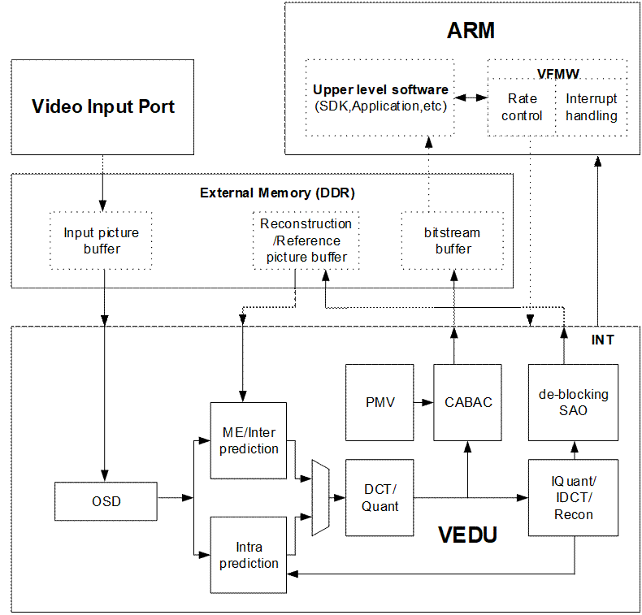
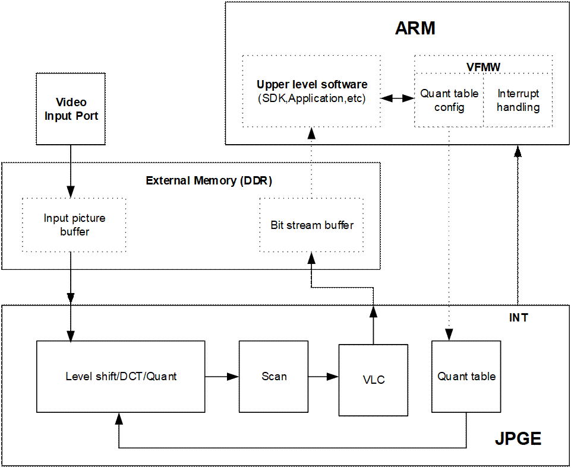

目 录

[7 视频编码 7-1](#_Toc110601409)

[7.1 总概述 7-1](#_Toc110601410)

[7.2 VEDU 7-1](#_Toc110601411)

[7.2.1 概述 7-1](#_Toc110601412)

[7.2.2 特点 7-1](#_Toc110601413)

[7.2.3 功能描述 7-3](#_Toc110601414)

[7.3 JPGE 7-4](#_Toc110601415)

[7.3.1 概述 7-4](#_Toc110601416)

[7.3.2 特点 7-4](#_Toc110601417)

[7.3.3 功能描述 7-5](#_Toc110601418)

插图目录

[图7-1 VEDU编码功能框图 7-4](#_Toc110355311)

[图7-2 JPGE功能框图 7-6](#_Toc110355312)

# 视频编码

## 总概述

视频编码器是一个支持H.265/H.264/JPEG/MJPEG的多协议编码器，包括VEDU和JPGE两部分，其中，VEDU实现H.265和H.264协议的编码，JPGE实现JPEG/MJPEG协议的编码。

## VEDU

### 概述

VEDU（Video Encode Unit）是一个硬件实现的支持H.265/H.264视频标准的编码器。VEDU具有CPU占用率低、总线带宽占用小、低延时、低功耗等优点。

### 特点

VEDU编码器具有以下特点：

- 支持ITU-T H.265Main Profile @Level 5 Main Tier编码
- 支持1/2、1/4像素精度运动补偿
- 支持I、P帧
- 支持最多两个参考帧，支持长期参考帧
- 帧间预测支持32x32、16x16、8x8三种PU类型
- 帧内预测支持32x32、16x16、8x8、4x4四种PU类型
- 支持最多候选数目为2的Merge/SKIP模式
- 支持32x32、16x16、8x8、4x4四种TU类型
- 支持CABAC熵编码
- 支持De-blocking滤波
- 支持SAO
- 支持QPMap/SkipMap
- 支持ITU-T H.264 High Profile/Main Profile/Baseline Profile@Level 5.1编码
- 支持1/2、1/4像素精度运动补偿
- 支持I、P帧
- 支持最多两个参考帧，支持长期参考帧
- 支持帧间预测16x16、8x8两种子块类型
- 支持所有Intra4x4、Intra8x8、Intra16x16预测模式
- 支持Trans4x4、Trans8x8
- 支持CABAC、CAVLC熵编码
- 支持De-blocking滤波
- 支持QPMap/SkipMap
- 支持H.264 SVC时域分层（SVC-T）
- 支持如下输入图像格式
- Semi-Planar YCbCr4:2:0
- H.265/H.264多码流编码性能：
- 支持3840x2160@60fps+1280x720@30fps编码
- 支持7680x4320@15fps编码
- 支持图像分辨率可配置
- 最小图像分辨率：114x114
- 最大图像分辨率：8192x8192
- 图像宽度/高度的配置步长为2
- 支持感兴趣区域编码
- 支持最多8个区域的感兴趣区域编码
- 每个感兴趣区域编码功能可独立使能/禁止
- 支持OSD区域编码保护

OSD区域编码保护功能可使能/禁止

- 支持视频前端OSD叠加处理
- 支持最多8个区域的编码前OSD叠加
- 支持任意大小，任意位置（不超出图像大小和位置）OSD叠加
- 支持129级的alpha叠加
- OSD叠加功能可使能/禁止
- 支持OSD ARGB1555、ARGB4444、CLUT2、CLUT4格式
- 支持彩转灰编码功能
- 支持CBR/VBR/AVBR/FIXQP/QPMAP/CVBR/QVBR七种码率控制模式
- 输出码率最高160Mbps。

<strong><big>须知</big></strong>

VEDU的区域编码保护功能只对VEDU叠加的OSD起作用。

### 功能描述

VEDU功能框图如图7-1所示。

VEDU编码实现了运动估计/帧间预测、帧内预测、运动矢量预测、变换/量化、反量化/反变换、熵编码及码流生成、de-blocking滤波、SAO（H.265）等协议/算法处理，ARM软件则完成码率控制和中断处理等编码控制处理。

在启动VEDU进行视频编码前，软件需要为其在外部存储器（DDR SDRAM）中分配以下三种类型的缓冲区。

- 输入图像缓冲区

VEDU在编码过程中会从该缓冲区读取待编码的原始图像。该缓冲区通常由视频输入单元写入。

- 重构图像/参考图像缓冲区

VEDU在编码过程中会向该缓冲区中写入重构图像、以作为后续图像的参考图像，在进行P帧编码时会从该缓冲区读取参考图像。

- 码流缓冲区

该缓冲区用于存放编码输出的码流。VEDU在编码过程中会将码流写入该缓冲区。该缓冲区通常由软件读取。

VEDU编码功能框图

## JPGE

### 概述

JPGE是一个硬件实现的高性能Jpeg编码器，可实现图片抓拍、高清图像MJPEG编码业务。

### 特点

JPGE具有以下特点：

- 支持ISO/IEC 10918-1(CCITT T.81) Baseline (DCT Sequential)编码
- 支持Semi-PlanarYCbCr4:2:0一种色度采样格式的图像编码
- 支持彩转灰功能
- 支持如下输入图像格式

Semi-Planar YCbCr4:2:0

Semi-Planar YCbCr4:2:2

- 编码性能

支持3840x2160@60fps(YUV420)编码

- 支持的图像分辨率

最小图像分辨率：32x32

最大图像分辨率：16384x16384

图像宽度/高度的配置步长为2

- 支持视频前端OSD叠加处理

支持最多8个区域的编码前OSD叠加

支持任意大小，任意位置（不超出图像大小和位置）OSD叠加

支持129级的alpha叠加

OSD叠加功能可使能/禁止

支持OSD ARGB1555、ARGB4444、CLUT2、CLUT4格式

- MJPEG输出码率范围：2kbps～60Mbps

### 功能描述

JPGE功能如图7-2所示。

由图可见，JPGE硬件实现了OSD、level shift、DCT、量化、扫描、VLC编码及码流生成等运算量较大的协议处理，而ARM软件则完成量化表配置和中断处理等编码控制处理。

在启动JPGE进行视频编码前，软件需要为其在外部存储器（DDR SDRAM）中分配以下两种类型的缓冲区：

- 输入图像缓冲区

JPGE在编码过程中会从该缓冲区读取待编码的原始图像。该缓冲区通常由视频输入单元写入。

- 码流缓冲区

该缓冲区用于存放编码输出的码流。JPGE在编码过程中会将码流写入该缓冲区。该缓冲区通常由软件读取。

JPGE功能框图

