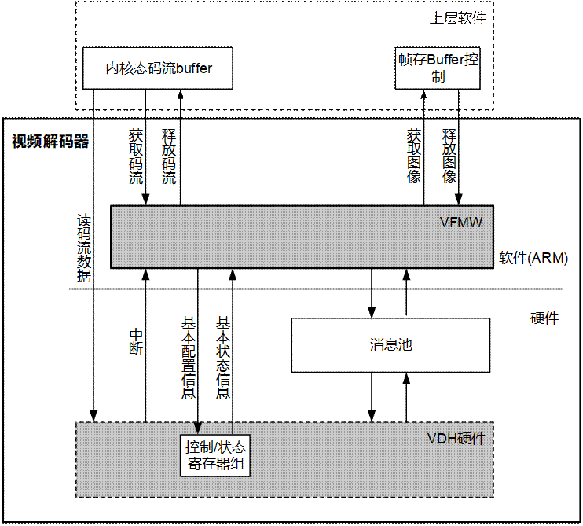
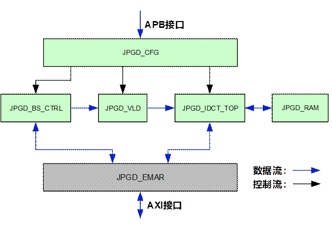
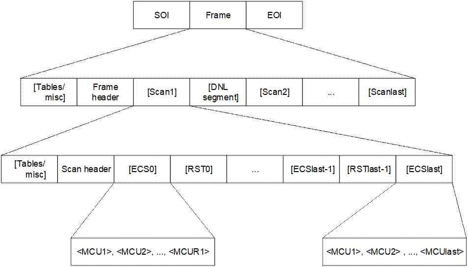

目 录

[8 视频解码 8-1](#_Toc110601638)

[8.1 VDH 8-1](#_Toc110601639)

[8.1.1 概述 8-1](#_Toc110601640)

[8.1.2 功能描述 8-1](#_Toc110601641)

[8.1.3 工作方式 8-2](#_Toc110601642)

[8.2 JPGD 8-3](#_Toc110601643)

[8.2.1 概述 8-3](#_Toc110601644)

[8.2.2 特点 8-3](#_Toc110601645)

[8.2.3 功能描述 8-4](#_Toc110601646)

[8.2.4 工作方式 8-5](#_Toc110601647)

插图目录

[图8-1 视频解码器架构 8-2](#_Toc82023454)

[图8-2 JPGD总体结构图 8-4](#_Toc82023455)

[图8-3 JPEG码流结构图 8-5](#_Toc82023456)

表格目录

[表8-1 JPGD内部模块说明 8-4](#_Toc82023457)

# 视频解码

## VDH

### 概述

视频解码器由运行于ARM处理器的VFMW（Video Firmware）和内嵌的硬件视频解码引擎VDH构成，VFMW从上层软件获得码流，对码流进行解析并调用VDH，产生解码图像序列。解码图像序列在上层软件的控制下，由VDP输出到显示器或其它设备。

### 功能描述

视频解码器有以下特点：

- 支持 ITU-T H.265 Main Profile@Level 5.1 High-tier（及以下）
- 最大码率为120Mbit/s
- 支持 ITU-T H.264 High Profile@Level 5.2（及以下）
- 最大码率为120Mbit/s
- 支持ISO/IEC 14496-2 （MPEG-4）Advanced Simple Profile @ Level 0～5，兼容短头格式以及 ISO/IEC 14496-2 Simple Profile @ Level 0～3。
- 最大可达4096×4096视频分辨率
- 最大解码速率为120Mbit/s
- 视频解码性能：
- 3840 x 2160@60fps + 1920x1080@60fps解码
- 支持图像分辨率
- 最小图像分辨率：H.265为96x96；H.264为96x96；MPEG4为64x64
- 最大图像分辨率：H.265为8192x8192；H.264为8192x8192；MPEG4为4096x4096.

### 工作方式

视频解码器架构如图8-1所示。

视频解码器架构

VDH：Video Decoding Module For High Definition，高清视频解码模块。

VFMW：Video Firmware，视频固件，实为运行在主处理器上的一个软件组件，负责调度视频解码引擎完成视频解码。

消息池：VFMW和VDH进行信息交互的存储空间，是在外部SDRAM存储器中开辟的，可被VDH和VFMW共同读写的存储区域。

VDH与VFMW交互模式：

H.265/H.264/MPEG4协议按一批slice进行交互完成解码，VFMW完成slice header及以上的解码，VDH硬件完成slice data及以下的解码；

视频解码步骤如下：

创建、初始化解码器。

向码流buffer中存入码流。

通过VFMW的图像输出接口获取图像。

图像显示完成后，通过VFMW的图像回收接口释放图像。

反复执行步骤2～步骤4，直到码流解码结束。

播放完毕，销毁解码器。

----结束

## JPGD

### 概述

JPGD（JPEG Decoder）模块是JPEG（Joint Photographic Experts Group）静态数字图像解码模块，该模块在高清芯片中的作用是支持JPEG/Motion-JPEG图像的解码。

### 特点

JPGD模块具有以下功能特点：

- 部分支持ITU-T81 Baseline profile解码。即：
- 支持YUV三分量的JPEG图像解码，支持YUV 4:0:0、YUV4:2:0、YUV4:2:2 1x2、YUV4:2:2 2x1、YUV 4:4:4五种输入格式。
- 最多支持4张Huffman表，其中包括2张DC表和2张AC表。
- 最多支持3张量化表。
- 支持sequential格式解码。
- 支持基于DCT变换的JPEG格式解码。
- 支持8bit采样精度。
- 支持交织的扫描方式。
- 输入输出最大支持分辨率为16384x16384大小的静态图像解码，最小支持分辨率为8 x 8大小的静态图像解码。
- 支持semi-planar420的输出。
- 解码性能：3840x2160@75fps（YUV420格式）。

### 功能描述

JPGD总体结构如图8-2所示。

JPGD总体结构图

JPGD内部模块说明如表8-1所示。

JPGD内部模块说明

| 模块名称 | 功能 |
| --- | --- |
| JPGD\_BS\_CTRL | 码流的读取和移位处理，内含一个Barrel-Shift，将有效码流送给下游模块进行解码。 |
| JPGD\_VLD | Huffman变长码解码，同时将解码后的系数进行反扫描和反量化。 |
| JPGD\_IDCT\_TOP | 进行IDCT变换。 |
| JPGD\_CFG | 接收HOST的配置信息，并将配置信息配置给各功能模块。同时负责整个解码器的启动、中断的产生以及向HOST反馈解码器的内部状态。 |
| JPGD\_EMAR | 与AXI总线相关的接口IP，完成总线异步处理，数据存取等。 |

### 工作方式

#### 软硬件划分

JPEG码流结构如图8-3所示。

JPEG码流结构图

图8-3为广义结构图，对于JPEG码流，由软件解析Scan header及其以上部分，硬件解析ECS层和RSTn标志。

#### 软硬件交互

JPEG解码由软硬件共同完成，所以在解码中存在软硬件交互。

- 软硬件的交互以帧级进行：
- 对于JPEG图像，每帧图像交互一次。
- 对于Motion-JPEG，每帧图像交互一次。
- 软硬件可以通过查询和中断两种方式进行交互，中断产生方式有如下几种：
- 当前图像解码完成产生的中断，表示当前图像已经全部解码完成并写入DDR中，JPEG解码工作结束（因为Baseline图像只有一个扫描层，因此一个扫描层解码结束也表示一幅图像解码结束）。
- 当前图像解码错误中断，表示当前图像解码过程中发生了错误，JPGD无法继续解码，工作结束。

