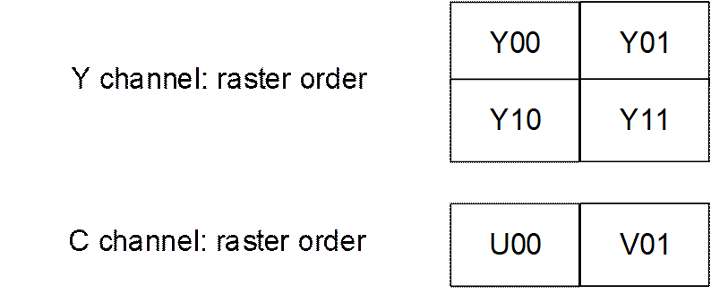
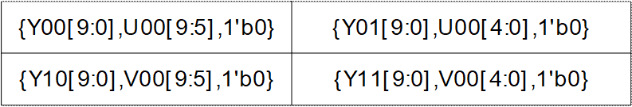
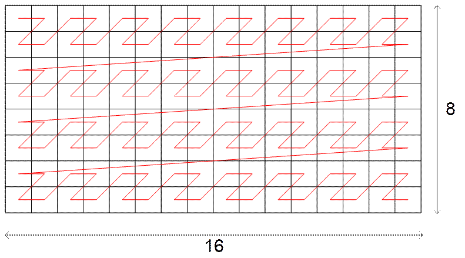
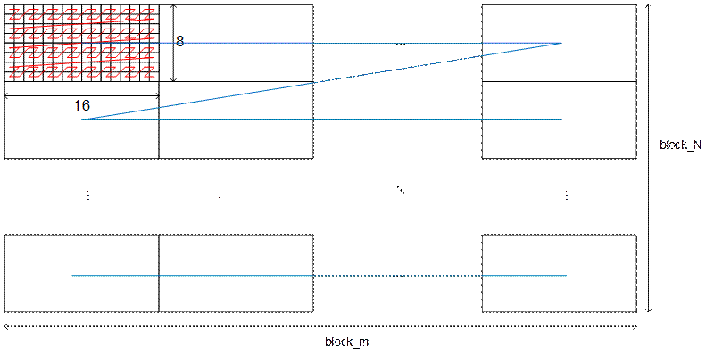

目 录

[9 视频及图形处理 9-1](#_Toc110604526)

[9.1 TDE 9-1](#_Toc110604527)

[9.1.1 概述 9-1](#_Toc110604528)

[9.1.2 功能描述 9-1](#_Toc110604529)

[9.2 VPSS 9-2](#_Toc110604530)

[9.2.1 概述 9-2](#_Toc110604531)

[9.2.2 功能描述 9-3](#_Toc110604532)

[9.3 VGS 9-6](#_Toc110604533)

[9.3.1 概述 9-6](#_Toc110604534)

[9.4 GDC 9-7](#_Toc110604535)

[9.4.1 概述 9-7](#_Toc110604536)

[9.5 AVSP 9-8](#_Toc110604537)

[9.5.1 概述 9-8](#_Toc110604538)

[9.5.2 功能描述 9-8](#_Toc110604539)

# 视频及图形处理

## TDE

### 概述

2D图形加速引擎TDE（Two Dimensional Engine）利用硬件进行图形绘制，可以大大减少对CPU的占用，同时提高了内存带宽的资源利用率。

图形数据接口包括两条通路，其功能如下：

- 通路1在单源操作时完成直接拷贝与直接填充的功能。
- 通路2在单源操作时可完成各种复杂的操作，如图像缩放等。
- 通路1与通路2协同工作时可以完成颜色混合等操作。

### 功能描述

TDE模块有以下功能特点：

- 源位图1支持输入格式：ARGB4444、ARGB1555、ARGB8888、RGB444、RGB565、RGB888、ARGB8565、CLUT1、CLUT2、CLUT4、CLUT8、A1、A8。
- 源位图2支持输入格式：ARGB4444、ARGB1555、ARGB8888、RGB444、RGB565、RGB888、ARGB8565、CLUT1、CLUT2、CLUT4、CLUT8、A1、A8、semi-planner 420。
- 输出图像支持ARGB4444、ARGB1555、ARGB8888、RGB444、RGB565、RGB888、ARGB8565、CLUT1、CLUT4、CLUT8、A1、A8、packge422（YUYV、VYUY）的格式。
- 像素大于等于1byte的只支持小端系统，像素小于1byte的大小端都支持。
- 支持源位图1、源位图2和输出位图格式分别可配。
- 支持Gamma校正、亮度对比度的调节。
- 支持直接拷贝。
- 支持直接填充。
- 支持角框。
- 支持2D-resize操作。
- 支持clip操作。
- 支持alpha blending操作。
- 支持colorkey操作。
- 支持clip mask功能。
- 支持旋转功能(90º、180º、270º)。
- 支持mirror、flip。
- 最大分辨率支持到4096x4096。

## VPSS

### 概述

视频处理子系统VPSS（Video Processing Sub System）实现视频处理功能。支持在线（VICAP-VIPROC-VPSS全在线）和离线（VPSS离线或VIPROC-VPSS之间在线）两种工作模式。包含视频遮挡、3D降噪、视频马赛克处理、视频裁剪、缩放、亮度单分量处理、压缩、解压缩、mirror、flip功能。

VPSS特性如下：

- 最大分辨率8192x8192（水平分辨率超过4096需工作在stripping模式）。
- 支持最大宽度4096的视频源。
- 支持最多4个通道视频输出。
- 支持3D降噪功能。
- 输出支持4个区域的马赛克处理。
- 输出支持8个区域的视频任意四边形实心遮挡，其中凹四边形处理成三角形。
- 输出支持8个区域的视频矩形实心遮挡。
- 支持4个输出通道的视频裁剪和mirror/flip功能。
- 支持视频数据压缩/解压缩。
- 输入数据为YUV420 semi-planar/ YUV422 semi-planar/单分量。
- 输入数据支持linear格式。
- 输出数据为YUV420 semi-planar/ YUV422 semi-planar/单分量。
- 输出数据支持linear格式和yuv420 16x8tile格式（仅CH(Channel)1支持，对接AVSP）。
- 支持亮度单分量处理。
- 支持输入、输出通道低延时模式。
- 支持安全特性。
- 支持安全CPU操作（寄存器隔离）。
- 支持安全的DDR读写操作。

### 功能描述

- 缩放功能：输入输出分辨率不同的低频滤波处理。
- 离线模式下：CH(Channel)0-CH3同时支持1-1/15倍缩小。CH0-CH3支持任意1个通道16倍放大。
- 在线模式下，CH0~CH3支持1~1/15倍缩小。
- semi-planar 420 16x8 tile格式存储

semi-planar 420 16x8 tile格式为AVSP拼接模块输入所需求的格式。该格式下仅支持YUV420 10bit图像数据。

先通过将2x2块图像亮色数据打包成4x16bit像素。打包方式为将10bit亮度分量、5bit色度分量和1bit 0分量组成1个16bit像素，总的存储空间比原图像大1/16。如图9-1所示。

YUV420 semi-planar 420 16x8打包格式

2行4个像素组成一个2X2小块，小块内像素按Z格式存储，8X4个小块组一个tile块，tile块内按Z格式存储，即一个tile块由16x8个像素组成。如图9-2所示。

Tile块存储方式

一个semi-planar 420 16x8 Super block Tile 宏块的数据按Z方式存放，如图9-3所示。

semi-planar 420 16x8 Super block Tile宏块（MxN）存储方式

一帧图像数据即将整帧的Super block Tile宏块按Z方式存储，如图9-4所示。

一帧图像数据存储方式

## VGS

### 概述

视频图形系统VGS（Video Graphics System）实现视频及图形处理功能。包含OSD叠加、缩放、区域亮度和统计、旋转、多区域拼接、视频裁剪、视频遮挡、角框、画点画线功能。

VGS特性如下：

- 最大分辨率8192x8192（水平分辨率超过4096需工作在stripping模式）。
- VGS0支持一个通道视频输出，VGS1支持三个通道视频输出。
- 支持1个区域的OSD与视频叠加，支持OSD反色。
- OSD的输入格式为ARGB1555/ ARGB4444/ ARGB8888/CLUT2/CLUT4
- 输入数据支持YUV420 semi-planar/ YUV422 semi-planar/单分量/tile(仅VGS1支持)/YUV422 package格式。
- 输出数据支持YUV420 semi-planar/ YUV422 semi-planar 单分量/ YUV422 package格式。
- 输入/输出支持视频数据压缩解压缩。
- 支持1区域的视频遮挡，遮挡形状可支持实心或空心的任意四边形，凹四边形处理成三角形。
- 输出支持4个区域的马赛克处理。
- 输出支持8个区域的视频矩形实心遮挡，支持视频裁剪。
- 支持区域亮度和统计。
- 支持单分量处理。
- 支持多区域拼接。
- 支持90度、180度、270度旋转。
- 支持缩放：输入输出分辨率不同的低频滤波处理。缩放倍数支持1/30~16倍。
- 支持特征点检测和全局运动估计(仅VGS0支持)。
- 支持输入、输出通道低延时模式。
- 支持安全CPU。
- 支持安全DDR属性可配置。

## GDC

### 概述

几何畸变矫正GDC（Geometric Distortion Correction）实现图像畸变矫正功能。

GDC特性如下：

- 支持最大输入宽度8192的视频源。
- 支持YUV420 semi-planar格式输入输出图像。
- 支持单分量图像处理。
- 支持任意角度旋转。
- 支持鱼眼矫正
- 支持360、180、normal三种模型
- 支持顶装，壁装，桌装三种安装方式
- 支持鱼眼三种矫正方式下的PTZ功能
- 支持180/normal壁装模式下的俯仰角矫正功能
- 支持180模式下的扇形矫正功能
- 支持桶形和枕形畸变矫正。
- 支持最大40%的桶形镜头畸变矫正
- 支持最大20%的枕形镜头畸变矫正
- 支持桶形展宽功能
- 支持防抖矫正。
- 支持6个自由度，其中4个自由度校准参数可配
- 支持平行四边形及拉伸形变的畸变矫正
- 支持陀螺仪（Gyro）、数字模式
- 输入/输出数据支持linear格式。
- 支持非压缩图像输入，支持压缩图像数据输出。
- 支持输入、输出通道低延时模式。
- 支持安全CPU。
- 支持安全DDR属性可配置。

## AVSP

### 概述

全景拼接AVSP（Any View Stitching Processing）实现最多四个镜头的拼接功能，包括720度全景、360度全景及非全景拼接都可实现。

AVSP特性如下：

- 支持最多四路图像输入；
- 最大输入性能 18Mpixel 30fps，等同于2路3K\*3K(3000x3000) 30fps输入；
- 最大输入分辨率为8192x8192，最大输出分辨率为8192x8192；
- 支持8bit YUV420 16x8 tile格式输入；
- 支持8bit semi-planar420格式输出；
- 支持Equirectangular, Cylindrical, Rectilinear三种投影模式输出；
- 支持各种投影模式的PTZ功能(对于全景投影，缩放功能只支持ZoomIn)；
- 拼接模式主要包括：
- 支持2~4路非鱼眼镜头水平环绕拼接
- 支持4路非鱼眼镜头立方体结构全景拼接
- 支持2~4路鱼眼镜头水平全景拼接
- 支持4路鱼眼镜头正四面体结构全景拼接
- 支持亮度实时（滞后一帧）矫正功能。

### 功能描述

- 重叠区采用多频融合技术，使相邻图像的过渡区颜色过渡渐变自然，同时减少视角差带来的错位、重影范围；
- 支持多种结构拼接；
- 支持全景及非全景拼接，三种投影模式输出FOV可调，而且投影输出都支持PTZ功能，用户可根据需要进行调整，如将关注区域移至中心位置、相机颠倒时保持物体正向等等。

