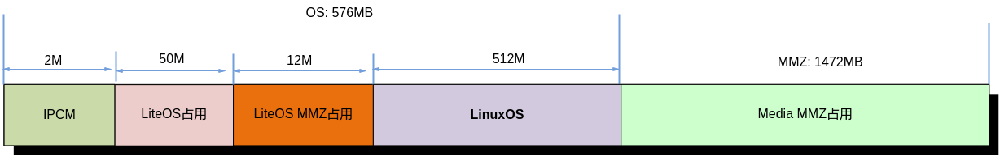

# 前言<a name="ZH-CN_TOPIC_0000002424361074"></a>

**概述<a name="section4537382116410"></a>**

本文为进行小型化开发的程序员而写，目的是介绍在单板上进行Linux开发、裁剪、优化及使用注意事项等内容。

> **说明：** 
>未有特殊说明，SS927V100与SS928V100内容完全一致。

**产品版本<a name="section25718263411"></a>**

与本文档相对应的产品版本如下。

|产品名称|产品版本|
|--|--|
|SS626|V100|
|SS928|V100|
|SS927|V100|


**读者对象<a name="section51625422047"></a>**

本文档（本指南）主要适用于以下工程师：

-   技术支持工程师
-   软件开发工程师

**修改记录<a name="section2467512116410"></a>**

|**文档版本**|**发布日期**|**修改说明**|
|--|--|--|
|00B01|2025-09-15|第1次临时版本发布。|


# 综述<a name="ZH-CN_TOPIC_0000002424361086"></a>

DDR小型化可以从多个方向入手：uboot、kernel、filesys、SDK、APP都可以在内存使用上做一定程度的优化。本文主要是对SDK和APP的小型化进行简单的说明。

基于 SS626V100的SDK目前支持运行Linux和liteos双系统或单linux系统，如业务场景只需运行单linux系统，可参考《内存布局调整指南》3.2章节裁剪liteos系统相关MMZ占用。本文中默认以Linux和liteos双系统为基础进行描述。SS626V100的系统小型化基于DEMO单板实现，以容量为2G Bytes的DDR内存为例。

**图 1**  DEMO板中Linux系统内存分配图（仅供参考）<a name="fig58516719710"></a>  


其中基于SS626V100典型场景业务的MMZ内存占用数据，请参考《SS626V100 Memory Usage Statistics Report》。此外，客户业务的具体内存占用，需结合具体场景进行分析，下文介绍各模块MMZ内存占用及小型化可优化手段。

# 主要模块工作占用MMZ情况<a name="ZH-CN_TOPIC_0000002424201206"></a>

一般业务中MMZ的占用往往是内存消耗的很大一部分，本章节主要介绍一般业务场景中几个主要模块工作时占用MMZ的情况。

-   **[VI](#ZH-CN_TOPIC_0000002424361046)**  

-   **[VDEC](#ZH-CN_TOPIC_0000002424201210)**  

-   **[VPSS](#ZH-CN_TOPIC_0000002457879933)**  

-   **[VGS](#ZH-CN_TOPIC_0000002457879973)**  

-   **[VENC](#ZH-CN_TOPIC_0000002457879945)**  

-   **[VO](#ZH-CN_TOPIC_0000002424201194)**  

-   **[GFBG](#ZH-CN_TOPIC_0000002457839817)**  

-   **[AUDIO](#ZH-CN_TOPIC_0000002424201218)**  

-   **[REGION](#ZH-CN_TOPIC_0000002457879941)**  

-   **[TDE](#ZH-CN_TOPIC_0000002457839825)**  

-   **[SVP](#ZH-CN_TOPIC_0000002457839801)**  

-   **[PCIV](#ZH-CN_TOPIC_0000002457839793)**  

-   **[GDC](#ZH-CN_TOPIC_0000002424361082)**  

-   **[CIPHER](#ZH-CN_TOPIC_0000002457879957)**  

-   **[DCC](#ZH-CN_TOPIC_0000002424361058)**  

-   **[VDA](#ZH-CN_TOPIC_0000002457879965)**  

-   **[ISP](#ZH-CN_TOPIC_0000002457839813)**  

-   **[HNR](#ZH-CN_TOPIC_0000002424201214)**  

## VI<a name="ZH-CN_TOPIC_0000002424361046"></a>

VI采集状态下最多会占用三个视频帧VB。一个用于当前帧采集，一个用于准备给下一帧采集，一个在轮转流程中（主要是后级模块占用）。

SS928V100中 MMZ占用：

-   vi\(%d\)\_model\_%d：每路pipe需占用两个一定大小模板MMZ内存，大小与通路宽度相关，宽度小于等于4096时大小为16KB。
-   vi\(%d\)\_lmf：每路pipe开启LMF功能时占用MMZ内存，用于存放LMF的系数，固定值4K。
-   vi\(%d\)\_bnr\_mot：每路pipe开启Bayer NR功能时需要占用的motion buffer内存，大小由处理图像大小的宽高决定。
-   vi\(0\)\_bnr\_rnt：每路pipe开启Bayer NR功能时需要占用的rnt内存，大小由处理图像大小的宽高决定；离线时个数由ss\_mpi\_vi\_set\_pipe\_bnr\_buf\_num。
-   接口设置，默认为40块。
-   vi\(0\)\_bnr\_ref%d：每路pipe开启Bayer NR功能时需要占用的时域参考内存，大小由处理图像大小的宽高决定。

## VDEC<a name="ZH-CN_TOPIC_0000002424201210"></a>

VDEC MMZ占用分为buffer占用、轮转占用和设备占用。

**Buffer占用<a name="section389732110912"></a>**

-   vdec\(%d\)\_stream：解码码流Buffer相关内存，为用户指定大小和驱动内部分配之和。SS626V100包括PTS数据存放内存。
-   vfmw\(%d\)\_usd\_buf：用户数据Buffer内存，大小根据用户指定的进行分配。
-   vdec\(%d\)\_adp\_ref：用于存储通道使用vb的相关信息。
-   vdec\(%d\)\_adp\_event：用于存储解码过程中产生的event信息。
-   vfmw\(%d\)\_shr\_img：用于存储解码出图像的相关信息。
-   vdec\_adp\_proc：用于存储mdc侧vdec产生的proc信息。
-   vfmw\_mdc\_shr：用于存储mdc侧vfmw产生的proc信息。

**设备占用<a name="section172822554102"></a>**

-   vfmw\(%d\)\_seg\_buf：SCD切码流后存放内存，与分辨率相关，与协议无关。
-   vfmw\_scd\_msg：SCD逻辑工作时需要的内存，固定值为44Kbytes。
-   vfmw\(%d\)\_vdh\_msg：VDH逻辑工作时需要的内存，与模块参数中设置最大slice个数相关，默认模块参数（slice 600个）时大小为616KBytes。SS626V100此块内存名称为vfmw\_vdh\_msg。
-   vfmw\_vdh\_ext：VDH逻辑工作时需要的内存，与模块参数中设置的最大宽高相关。SS626V100默认模块参数（宽高8192x8192）时大小572KBytes。
-   vfmw\_mdma\_msg：VDH逻辑工作时需要的内存，固定值44KBytes。

**轮转占用<a name="section32020161117"></a>**

-   vdec\(%d\)\_pic\_vb：vb大小和个数都由用户配置。私有vb模式下，大小根据用户配置通道属性中frame\_buf\_size确定，个数根据用户配置通道属性中frame\_buf\_cnt确定。
-   vdec\(%d\)\_tmv\_vb：vb大小和个数都由用户配置。私有vb模式下，大小根据用户配置通道属性中tmv\_buf\_size确定，个数为 “参考帧+1”，其中参考帧个数根据用户配置通道属性中ref\_frame\_num确定。

## VPSS<a name="ZH-CN_TOPIC_0000002457879933"></a>

-   vb\_pool: Group占用两块VB \(前级模块送来：当前工作VB+Backup 帧\)，每个使能通道会获取通道大小的VB（通道模式为Auto时，为后端模块获取），硬件处理完成后会发送到后端绑定模块。如果需要做旋转/二级缩放功能，还需申请中间的临时VB（公共VB）。
-   vpss\(%d\)\_src：每组需占用亮度和MMZ内存资源，约4K大小。
-   vpss\(%d\)\_dci：每组开启DCI功能时占用MMZ内存，约4K大小。
-   vpss\(%d\)\_model：每组需占用一定大小模板MMZ内存。大小与模块参数中的split\_node\_num以及组的max\_width有关。split\_node\_num和max\_width越大，占用大小越大。
-   vpss\(%d\)\_lmf：每组开启LMF功能时占用MMZ内存，用于存放LMF的系数，固定值4K。
-   vpss\(%d\)\_rgn\_luma：每组开启通道亮度和功能时占用MMZ内存，用于存放亮度和统计信息，固定值4K。
-   vmallocinfo：每组上下文需占用一定大小OS内存。总大小与组数量相关，组越多占用越大。

## VGS<a name="ZH-CN_TOPIC_0000002457879973"></a>

VGS模块根据job、node、task数目，分配固定的MMZ内存。

-   vmallocinfo:根据job、task数目及上下文占用OS内存。数目越多占用越大。
-   vgs\_node\_buf:根据node数目，占用一定大小的MMZ内存。数目越多占用越大。

## VENC<a name="ZH-CN_TOPIC_0000002457879945"></a>

-   硬件相关：

    vedu\_hal\_\(%d\)：硬件需要使用的内存，与IP个数相关。

-   通道相关内存（以H264为例，H265则前缀为h265e）：
    -   h264e\(%d\)\_node：寄存器节点配置内存，每个通道一块。
    -   h264e\(%d\)\_str0：码流buffer，每个通道一块。
    -   h264e\(%d\)\_rcn\(%d\)：参考帧重构帧内存，个数与编码参考帧个数相关。
    -   h264e\(%d\)\_info\(%d\)：参考帧重构帧信息内存，个数与编码参考帧个数相关。
    -   h264e\(%d\)\_deblur：通过ss\_mpi\_venc\_set\_deblur 使能去模糊后，需要相应去模糊处理内存。
    -   h264e\(%d\)\_md：通过ss\_mpi\_venc\_set\_md使能MD检测，需要相应的MD检测内存。
    -   venc\(%d\)\_svc：通过ss\_mpi\_venc\_enable\_svc使能SVC，需要相应的SVC内存。
    -   jpege\(%d\)\_stm：jpege码流buffer，每个通道一块。
    -   jpege\(%d\)\_roi\_map：通过ss\_mpi\_venc\_set\_jpeg\_roi\_attr使能roi\_map，为jpege的roi\_map分配内存。
    -   vmallocinfo：各个通道的通道上下文内存；UserData数据；码率控制相关内存。

## VO<a name="ZH-CN_TOPIC_0000002424201194"></a>

VO MMZ占用分为系数MMZ占用、获取亮度和MMZ占用，VB轮转MMZ占用。

-   系数MMZ占用：

    vo\_coef\_buf：回写缩放系数\(128KB\)和多区域配置系数\(8KB\)的内存存放占用, 共计136KB。如果芯片不支持回写缩放，则不会申请对应系数，一个多区域占用4KB内存，两个多区域占用8KB.

-   获取亮度和MMZ占用：

    vo\(%d,%d\)\_luma：VO模块获取视频层和通道亮度和时动态申请MMZ内存占用，某个通道固定占用4KB。如果芯片不支持获取亮度和，则不申请此内存。

-   VB轮转MMZ占用：

    vo\(%d\)\_disp\_buf：vb大小和个数都由用户配置。大小根据用户配置视频层属性img\_size确定，个数根据用户配置视频层属性中display\_buf\_len确定。Single模式下VO会占用3块私有VB用来显示轮转。

    Multi模式下，如果前端绑定VPSS为auto模式，VO会占用4块私有VB用来显示轮转；如果前端为User模式，VO可以不分配VB，此时占用前端模块发送过来的VB，显示完后释放。

## GFBG<a name="ZH-CN_TOPIC_0000002457839817"></a>

加载ko时，用户指定图形层、鼠标层的显示buf大小。支持的图层均可指定，图层id号与vram id号需保证匹配。

例如：insmod gfbg.ko video="gfbg:vram0\_size:32400,vram1\_size:32400,vram2\_size:256,vram3\_size:4052".

-   vram0\_size: 对应gfbg0图形层内存大小，单位KB，对应mmz name= gfbg\_layer0。
-   vram1\_size: 对应gfbg1图形层内存大小，单位KB，对应mmz name= gfbg\_layer1。
-   vram2\_size: 对应gfbg2图形层内存大小，单位KB，对应mmz name= gfbg\_layer2。
-   vram3\_size: 对应gfbg3图形层内存大小，单位KB，对应mmz name= gfbg\_layer3。

## AUDIO<a name="ZH-CN_TOPIC_0000002424201218"></a>

**AI<a name="section1478714716237"></a>**

-   ai\(%d\)\_frm：AI的通道buffer根据chn\_cnt、frame\_num和point\_num\_per\_frame分配。
-   ai\(%d\)\_dma：AI的DMA缓冲区根据chn\_cnt和point\_num\_per\_frame分配。

**AO<a name="section20436157192318"></a>**

-   ao\(%d\)\_dma&frm：AO的DMA缓冲区和通道buffer根据chn\_cnt、frame\_num和point\_num\_per\_frame分配。
-   ao\(%d, %d\)\_cir：音频帧buffer根据frame\_num和point\_num\_per\_frame分配。

**AENC<a name="section339816212241"></a>**

-   aenc\(%d\)\_strm：码流buffer根据buf\_size分配。
-   aenc\(%d\)\_cir：环形缓冲区根据编码通道数分配。

## REGION<a name="ZH-CN_TOPIC_0000002457879941"></a>

**区域信息上下文节点<a name="section15813751132413"></a>**

去掉不必要的模块可以减少内存的占用，如：

-   模块加载时分配的1024个区域信息上下文节点，占用os内存4kb。区域信息上下文在创建区域时动态分配。
-   如果是overlay或者是overlayex类型的区域，还会创建乒乓buff用于存放位图数据。
-   rgn\_pin\_pon\_\(%d\)：乒乓buff的大小由用户设置的width，height，canvas\_num和颜色格式决定，占用MMZ内存。

**通道管理信息节点<a name="section16571145662413"></a>**

其他模块调用REGION的函数向REGION注册信息时动态分配，占用MMZ内存。

## TDE<a name="ZH-CN_TOPIC_0000002457839825"></a>

通道使用MMZ，为固定值总大小：\(OT\_TDE\_CMD\_NUM\) \* 64 + \(OT\_TDE\_JOB\_NUM\) \* 96 + \(OT\_TDE\_NODE\_NUM\) \* 256 +\(OT\_TDE\_FILTER\_NUM\) \* 1024。

## SVP<a name="ZH-CN_TOPIC_0000002457839801"></a>

**SVP\_NNN<a name="section14631148142915"></a>**

SVP\_NNN内存占用分为MMZ内存和os内存，其中MMZ内存包括任务节点和推理内容内存。

-   节点MMZ占用：

    内核态节点的大小，默认值100KB；

    用户态节点的大小，默认值80KB。

-   推理MMZ占用（Resnet50 Batch 1典型场景）：

    OM内存大小，值50828KB；

    输入输出数据内存大小，值8596KB；

    模型信息内存大小，值12KB。

-   OS内存占用：

    OS内存主要包括两部分：静态全局变量的内存，大小大约5.6KB；动态内存，大小大约0.594KB。

    > **说明：** 
    >SS927V100不支持SVP\_NNN模块。

**IVE<a name="section8594155332913"></a>**

IVE内存占用分为MMZ内存和os内存，其中MMZ内存包括任务链表和辅助内存。

-   任务链表MMZ占用：

    ive\_queue: IVE任务链表的大小，默认为212KB。

-   辅助MMZ内存占用：
    -   ive\_tmp\_node: IVE的多算子组合任务需要的临时节点，固定值4KB。
    -   Md\_proc: MDproc信息需要的MMZ内存，固定值8KB。
    -   ive\_resize\_param: resize算子计算需要的辅助内存，固定值9264Byte.
    -   ive\_yuv\_to\_hsv\_table: ive颜色空间转换存放table的辅助内存，固定值2048Byte
    -   ive\_yuv\_to\_lab\_table: ive颜色空间转化存放table的辅助内存，固定值6656Byte

-   OS内存占用：

    ive占用的OS内存主要分为kmalloc开辟的内存和静态全局变量占用内存，OS内存加mmz内存不超过235KB。

**KCF<a name="section1226215919298"></a>**

KCF内存占用分为MMZ内存和OS内存，其中MMZ内存包括任务链表和辅助内存。

-   任务链表MMZ占用：

    kcf\_queue: KCF任务链表的大小，固定值106688Byte。

-   辅助MMZ内存占用：

    kcf\_param: KCF计算需要的辅助内存，固定值45328Byte。

-   OS内存占用：

    KCF占用的OS内存主要分为kmalloc开辟的内存和静态全局变量占用内存，OS内存加mmz内存不超过150KB。

**MAU<a name="section4581452303"></a>**

MAU内存主要分为MMZ内存和OS内存，其中MMZ内存为任务链表的内存。

-   任务链表占用：

    svp\_mau\_queue: MAU任务链表的大小，默认160KB。

-   OS内存占用：

    MAU 占用的os内存主要有mem\_info链表内存使用os内存，mem\_info链表内存占用\(40 \* mau\_max\_mem\_info\_num\)Byte，以及mau上下文的静态全局变量占用的内存。os内存加mmz内存总共不超过163KB。

## PCIV<a name="ZH-CN_TOPIC_0000002457839793"></a>

PCIV MMZ占用分为pcie-mcc消息池占用、window占用、VB轮转占用。

-   pcie-mcc消息池占用：

    用于pcie-mcc消息通信，在加载从片pcie驱动时指定位置与大小，大小固定为1M。

-   window占用：

    主片发起DMA操作时，从片空间只能在窗口上读写，加载osal驱动时指定mmz名为window，默认大小7M，起始位置紧跟pcie-mcc消息池之后\(pcie-mcc消息池+window连续空间最大8M\)。

-   VB轮转占用：
    -   主片轮转VB：VB大小和个数由用户配置，大小必须保证能接收完整图像，一般根据通道属性中的图像宽高，格式属性等确定；分配释放由用户调用接口控制；接收从片图像时，轮转VB往后传，通过查询后端占用情况决定是否接收下一次轮转。
    -   从片轮转VB：从片接收前端图像，如果是VPSS使用auto模式送帧，则由pciv获取VB，其他模式则接受图像时占用VB；直通模式\(PCIV透传\)则DMA发送完成释放VB;非直通模式\(OSD、缩放等操作\)，需要获取VGS写出VB，并释放接收图像VB，DMA发送完成后，释放VGS写出VB。

## GDC<a name="ZH-CN_TOPIC_0000002424361082"></a>

GDC模块根据job、node、task数目，分配固定的MMZ内存。

-   vmallocinfo:根据job、task数目及上下文占用OS内存。数目越多占用越大。
-   gdc\_node\_buf:根据node数目，占用一定大小的MMZ内存。数目越多占用越大。
-   gdc\_int\_pole\_coef:存储插值系数需要的MMZ内存，固定值4KB。

## CIPHER<a name="ZH-CN_TOPIC_0000002457879957"></a>

固定大小（驱动内部确定申请的MMZ内存的长度）

-   Hash初始化：给SHA节点链表分配内存，固定值28 \*255\* 1=7KB；255作为链表最大深度，最小深度为2；HASH消息的DMA内存：逻辑只识别物理内存，需要申请最大的64KB物理内存存储hash消息。
-   Cipher驱动模块初始化：给CIPHER节点链表分配内存entry list size（20KB），用来存放16个通道每个通道CCM GCM aad的物理内存padding buffer（2KB），固定值22KB。

非固定大小（由用户层接口传入的MMZ内存申请的长度）。

cipher加解密：依赖虚拟地址/物理地址加解密接口的参数byte\_len。

## DCC<a name="ZH-CN_TOPIC_0000002424361058"></a>

dcc\_msg\_buf：SS626V100使用，用于双核通信任务。

## VDA<a name="ZH-CN_TOPIC_0000002457879965"></a>

vda\(%d\)：通道内部计算结果存储相关内存，主要包括SAD结果内存、RGN运动区域信息内存和背景。

## ISP<a name="ZH-CN_TOPIC_0000002457839813"></a>

-   isp\[%d\].vreg\[%d\]：外部虚拟寄存器内存。
-   isp\[%d\].proc：用户态算法proc调试信息。
-   isp\[%d\].trans：dng, dcf, colorgammut等信息内存。
-   isp\[%d\].ldci：ldci算法内存。
-   isp\[%d\].clut：clut算法内存。
-   be\_lut\_stt\[%d\]：be lut信息内存。
-   pre\_on\_lut\_stt\[%d\]：在线通路ADVANCED模式be lut信息内存。
-   isp\[%d\].stat：统计信息（FE,BE）内存。
-   isp\[%d\].fe\_stat：FE统计信息内存。
-   isp\[%d\].wdr：wdr算法内存。
-   isp\[%d\].drc：drc算法内存。
-   isp\[%d\].be\_cfg：离线通路be config buffer。
-   isp\[%d\].be\_stt\_on：在线通路be统计信息内存。
-   isp\[%d\].fe\_stt：fe统计信息内存。
-   isp\[%d\].be\_stt：离线通路be统计信息内存。
-   isp\[%d\].stit\_fe：拼接通路fe统计信息内存。
-   isp\[%d\].stit\_be：拼接通路be统计信息内存。

## HNR<a name="ZH-CN_TOPIC_0000002424201214"></a>

-   hnr\_pqp\_buf\[%d\]：hnr模型文件内存。
-   hnr\_ping\_pong\_buf：hnr模型推理使用的工作内存。

    开启HNR功能参考帧模式需要多占用4\~6个视频帧VB，无参考帧模式需要多占用1个视频帧VB。

# 各模块内存相关可优化配置<a name="ZH-CN_TOPIC_0000002424201226"></a>

-   **[VB](#ZH-CN_TOPIC_0000002424201202)**  

-   **[SYS](#ZH-CN_TOPIC_0000002457879949)**  

-   **[VI](#ZH-CN_TOPIC_0000002457879929)**  

-   **[VDEC](#ZH-CN_TOPIC_0000002457839809)**  

-   **[VPSS](#ZH-CN_TOPIC_0000002424201190)**  

-   **[VGS](#ZH-CN_TOPIC_0000002424361078)**  

-   **[VENC](#ZH-CN_TOPIC_0000002424361070)**  

-   **[VO](#ZH-CN_TOPIC_0000002424361042)**  

-   **[GFBG](#ZH-CN_TOPIC_0000002457839797)**  

-   **[AUDIO](#ZH-CN_TOPIC_0000002457879961)**  

-   **[REGION](#ZH-CN_TOPIC_0000002457879937)**  

-   **[SVP](#ZH-CN_TOPIC_0000002457839821)**  

-   **[VDA](#ZH-CN_TOPIC_0000002424361054)**  

-   **[PCIV](#ZH-CN_TOPIC_0000002424201186)**  

-   **[GDC](#ZH-CN_TOPIC_0000002424201222)**  

-   **[CIPHER](#ZH-CN_TOPIC_0000002424361050)**  

-   **[ISP](#ZH-CN_TOPIC_0000002457839833)**  

-   **[HNR](#ZH-CN_TOPIC_0000002457879953)**  

## VB<a name="ZH-CN_TOPIC_0000002424201202"></a>

|措施|相关模块参数/接口|收益|影响|注意|proc信息|
|--|--|--|--|--|--|
|检查是否有vb池的vb个数设置过多|略|mini_free不为0的pool id里的VB块个数设置过多，可以再减去mini_free个。|-|公共VB池、模块VB池、UserVB池的个数设置参见《MPP 媒体处理软件 V5.0 开发参考》“系统控制章节”的VB相关接口。PrivateVB池的个数设置需要到相关模块的接口里找到对应的参数。|mini_free：vb个数的历史最小余量|
|检查是否有VB块size设置过大|略|free_bytes不为0的VB块size分大了，可以再减去free_bytes。|-|公共VB池、模块VB池、UserVB池的VB块大小设置参见《MPP 媒体处理软件 V5.0 FAQ》“系统控制章节”的VB相关接口。PrivateVB池的个数设置需要到相关模块的接口里找到对应的参数。|free_bytes：vb块的实时剩余bytesget：获取vb块的模块，通过此信息可以判断具体哪个模块的VB块size分大了|


## SYS<a name="ZH-CN_TOPIC_0000002457879949"></a>

|措施|相关模块参数/接口|收益|影响|注意|proc信息|
|--|--|--|--|--|--|
|设置调度模式为OT_SCHEDULE_QUICK|ss_mpi_sys_set_schedule_mode|加速vb轮转，可以减少vb分配|-|具体操作和注意事项请参考《MPP 媒体处理软件 V5.0 FAQ》的“1.9 Quick schedule”注意事项|-|
|关闭logmpp_mdc|g_mdc_log_enable|节省logmpp_mdc日志68K|-|在插入xx_base.ko时设置模块参数g_mdc_log_enable=0SS626V100 支持|-|
|去除MDC侧内存分配|-|不需要加载：xx_dcc.ko、xx_vdec_adapt.ko|-|参考文档《内存布局调整指南》ss_mpi_vdec_set_chn_config：deployment_mode设置为OT_VDEC_DEPLOYMENT_MODE0SS626V100 支持|-|


## VI<a name="ZH-CN_TOPIC_0000002457879929"></a>

|措施|相关接口|收益|影响|注意|proc信息|
|--|--|--|--|--|--|
|开启 Early/Early_end机制|ss_mpi_vi_set_pipe_frame_interrupt_attr|线性或者在线WDR，节省一个VB；离线WDR(2路)，节省两个VB|VI采集响应的中断数翻倍|-|vi pipe frame interrupt attr:interrupt_type|
|chn输出设置压缩|ss_mpi_vi_set_chn_attr|压缩比不压缩情况要更节省内存和带宽|-|-|SS928V100：vi phys chn attr1:compress_mode其他：vi phychn attr 2:compress_mode|
|在线WDR行模式卷绕|ss_mpi_vi_set_wdr_fusion_grp_attr|默认不卷绕，根据配置的cache_line节省内存|cache_line配置过小时可能导致图像分层|SS928V100支持|vi wdr fusion grp attr：cache_line|
|pipe设置压缩输出|ss_mpi_vi_set_pipe_attr|压缩比不压缩情况要更节省内存和带宽|-|SS928V100支持|vi pipe attr1:compress_mode|
|调整VI_VPSS在离线模式|ss_mpi_sys_set_vi_vpss_mode|在线/在离线/离在线通路比全离线通路节省1-2个VB;|VI在线只能处理一路，VPSS在线无法在VI_CHN做通道后处理相关功能|SS928V100支持|vi vpss mode & vi video mode：vi_vpss_mode|
|调整VI_VIDEO模式|ss_mpi_sys_set_vi_video_mode|normal模式，比advanced模式可节省2块VB|normal模式 HNR功能在BE前面|SS928V100支持|vi vpss mode & vi video mode：vi_vpss_mode|
|调整BayerNR buf_num个数|ss_mpi_vi_set_pipe_bnr_buf_num|默认个数为40个，可根据需离线缓存的YUV调整个数，节省部分内存|bnr_buf_num主要影响VI连续缓存不释放的YUV个数|SS928V100支持|vi pipe bnr buf num:bnr_buf_num|
|手动关闭 ISP BayerNR功能|ss_mpi_isp_set_nr_attr|关闭BayerNR可节省参考帧等内存和带宽|影响效果|SS928V100支持|bayernr info: enable|


## VDEC<a name="ZH-CN_TOPIC_0000002457839809"></a>

|措施|相关模块参数/接口|收益|影响|注意|proc信息|
|--|--|--|--|--|--|
|解码码流buffer使用省内存模式分配|ss_mpi_vdec_set_mod_param：mini_buf_mode|可以把码流buffer设置小一些。可以减少vfmw(%d)_seg_buf内存|-|-|module param：mini_buf_mode|
|控制用户数据user data buffer大小|ss_mpi_vdec_set_user_data_attr：enablemax_user_data_len|不申请或者少申请user data buffer|-|-|etail user_data state：enablemax_user_data_len|
|控制jpeg解码progressive_buffer|ss_mpi_vdec_set_mod_param：progressive_en|不申请progressive_buffer|使用JPEGD progressive功能时，设置dynamic_alloc_en为TD_TRUE，可以动态分配progressive_buffer，减少progressive_buffer内存占用|-|module param：progressive_en|
|按场景设置解码器最大能力集|ss_mpi_vdec_set_mod_param：video_mod_parampic_mod_param|可节省部分MMZ和OS内存|VDH相关的内存分配的内存少了可能会导致解码性能下降，但是不影响功能。JPEGD的相关配置可以节省OS内存。|-|module param：max_video_widthmax_video_heightmax_slice_numvdh_msg_nummax_pic_widthmax_pic_heightprogressive_endynamic_alloc_encapacity_strategy|
|按场景设置解码通道能力集|ss_mpi_vdec_set_protocol_param|可节省部分OS内存|-|-|chn video attr & params：max_vps_nummax_sps_nummax_pps_nummax_slice_segment_num|
|H264解码无B帧码流时可关闭Tmv开关|ss_mpi_vdec_create_chn：temporal_mvp_en|可节省Tmv buffer|-|-|chn video attr & params：tmv_en|
|解码模块最大支持的通道数|g_vdec_max_chn_num  g_vfmw_max_chn_num|可节省部分OS内存|-|-|module param：g_vdec_max_chn_num|
|只解码I帧的通道把参考帧设置为0|ss_mpi_vdec_create_chn：ref_frame_num|减少pic_vb、tmv_vb分配个数|-|把通道解码模式设置为I模式，否则logmpp会报错。|chn video attr & params：ref_num|
|设置快速释放参考帧模式为自适应模式或者强制模式|ss_mpi_vdec_set_chn_param：quick_mark_mode|加速vb轮转，可以减少pic_vb、tmv_vb分配个数|-|-|chn video attr & params：quick_mark_mode|
|根据实际应用的宽高尽量小的创建通道|ss_mpi_vdec_create_chn|可以减少vfmw(%d)_seg_buf内存|-|-|chn comm attr & params：max_wmax_h|


> **说明：** 
>具体参见《MPP媒体处理软件V5.0开发参考》"视频解码”章节。

## VPSS<a name="ZH-CN_TOPIC_0000002424201190"></a>

|措施|相关模块参数/接口|收益|影响|注意|proc信息|
|--|--|--|--|--|--|
|关闭backup帧|ss_mpi_vpss_enable_backup_framess_mpi_vpss_disable_backup_frame|每个VPSS GROUP少占用1帧输入源的buffer。|VO暂停情况下放大或切换画面时显示设备背景色。|-|vpss grp attr1：backup|
|不同时开启nr、dei功能|ss_mpi_vpss_create_grp|每个VPSS GROUP少分配两帧buffer（参考帧和重构帧）。|影响图像效果。|nr、dei中只要有一个功能开启，都会分配参考帧和重构帧buffer。|vpss grp attr：nrdei_mode|
|CH0输出YUV压缩|ss_mpi_vpss_set_chn_attr：compress_mode|比不压缩情况要更节省内存和带宽|-|-|vpss chn output status：compress_mode|
|开启 Early/Early_end机制|ss_mpi_vpss_set_grp_frame_interrupt_attr|全在线模式下每个通道节省一帧buffer|-|-|frame interrupt attr: int_type|
|减小模块参数split_node_num|ss_mpi_vpss_set_mod_param|减小每组寄存器模板所占用的mmz内存|-|split_node_num与输入分辨率的宽成正比，默认为3。当场景固定且为小分辨率时，可调小其值；超大分辨率时，选择合适的取值，避免浪费内存。|vpss module param:split_node_num|


> **说明：** 
>具体使用方法及限制参见《MPP媒体处理软件V5.0开发参考》“视频处理子系统”章节。

## VGS<a name="ZH-CN_TOPIC_0000002424361078"></a>

|措施|相关模块参数|收益|影响|注意|proc信息|
|--|--|--|--|--|--|
|设置VGS支持的最大job数|g_max_vgs_job|默认值128，按需减小可节省内存|job数量过少会限制VGS性能。|-|module params：g_max_job_num|
|设置VGS支持的最大task数|g_max_vgs_task|默认值200，按需减小可节省内存|task数量过少会限制VGS性能|-|module params：g_max_task_num|
|设置VGS支持的最大node数|g_max_vgs_node|默认值200，按需减小可节省内存|node数量过少会限制VGS性能|-|module params：g_max_node_num|


VGS模块主要是OS内存和node用的mmz。考虑场景的减小最大job数、最大task数和最大node数可以降低些OS占用内存以及node占用的MMZ内存。

> **说明：** 
>具体使用方法及限制参见《MPP媒体处理软件V5.0开发参考》“视频图形子系统”章节。

## VENC<a name="ZH-CN_TOPIC_0000002424361070"></a>

|措施|相关模块参数/接口|收益|影响|注意|proc信息|
|--|--|--|--|--|--|
|动态切换编码分辨率|ss_mpi_venc_set_chn_attrss_mpi_venc_get_chn_attr|切换编码分辨率时不销毁通道，减少内存碎片，如使用NormalP，可比SmartP和DualP减少参考帧/重构帧占用帧存的总大小|无|切换分辨率后所有参数恢复默认值。|-|
|编码码流buffer使用省内存模式分配|ss_mpi_venc_set_mod_param：mini_buf_mode|可以把码流buffer设置小一些。|此模式需要用户保证码流buffer大小设置合理，在码率较高或客户获取码流不及时情况下出现码流buffer不足而不断重编或者丢帧的情况。|-|h265e/h264e/jpege模块都有module param：mini_buf_mode|
|参考帧重构帧buffer复用|ss_mpi_venc_create_chn：rcn_ref_share_buf_en|大约可节省（ref_num+1-1.2* ref_num）帧buffer|超大帧、码率过冲、码率buffer满等异常情况导致的丢帧或者重编，下一帧只能插入I帧|-|h265e/h264e模块的ref_param info：rcn_ref_share_buf_en|
|参考帧重构帧buffer比例调节|ss_mpi_venc_set_chn_attrss_mpi_venc_get_chn_attrframe_buf_ratio|若设置为80，则帧buffer为原始大小的80%。|P帧刷I slice可能会出现整帧刷成I块且提前结束刷I slice；去呼吸效应在某些帧上可能会失效；QPMAP表不能强制指定skip块，SkipWeight表不能强制指定skip块ROI背景低帧率编码可能会出现部分帧的非ROI区域不能编码为p_skip块某些场景指定为p_skip帧的情况下可能会失效，如编码瞬时码率超过阈值时丢帧策略。skip倾向性可能会失效|-|h265e/h264e模块的ref_param info：frame_buf_ratio|
|动态回收参考帧buffer|ss_mpi_venc_set_mod_param：frame_buf_recycle|当编码切换GOP模式，参考帧由多变少时，可动态释放多出来的参考帧buffer|-|-|venc 模块的module param：frame_buf_recycle|
|编码模块支持的最大通道数|模块参数：g_venc_max_chn_num|可节省部分OS内存|-|-|venc模块的module param：venc_max_chn_num|
|相同分辨率多通道编码使用UserVB模式节省内存|ss_mpi_venc_set_mod_param：vb_src|比PrivateVB模式节省更多帧存buffer|-|仅h265e/h264e支持|h265e模块的module param：h265_vb_src；h264e模块的module param：h264_vb_src|


> **说明：** 
>具体参见《MPP媒体处理软件V5.0开发参考》"视频编码”章节。

## VO<a name="ZH-CN_TOPIC_0000002424361042"></a>

|措施|相关接口|收益|影响|注意|proc信息|
|--|--|--|--|--|--|
|VO水线设置为2|ss_mpi_vo_set_chn_recv_threshold|减少通道VB的积累|可能出现少量丢帧|-|vo chn play info 1：threshold|
|回放模式显示队列长度设置最小值3|ss_mpi_vo_set_video_layer_attr|高清设备可节省1帧buffer。|影响VO显示流畅性。|-|vo video layer status 2：disp_buf_len|
|直通模式DispBufLen可以设置为0|ss_mpi_vo_set_video_layer_attr|可不用分配Display Buffer|-|-|vo video layer status 2：disp_buf_len|
|多区域聚集模式|ss_mpi_vo_set_video_layer_attrss_mpi_vo_set_chn_display_pos|可节省部分MMZ内存|聚集模式VO不支持缩放|SS626V100支持|vo video layer status 2：cluster_mode_envo chn basic info：disp_x disp_y|
|单区域模式VO省buffer方案|ss_mpi_vo_set_video_layer_attrss_mpi_vo_set_vtthss_mpi_vo_set_less_buf_attr|单区域模式非直通时可设置显示buff最小为2|减少了一块用于显示的buffer|SS626V100支持|vo video layer status 2：disp_buf_lenvo interface status:vtth less_buf_enableless_buf_vtth|
|多区域模式VO省buffer方案|ss_mpi_vo_set_video_layer_attrss_mpi_vo_set_vtthss_mpi_vo_set_less_buf_attr|多区域模式下减少一块显示buffer|可能出现显示卡顿|-|vo video layer status 2：disp_buf_lenvo interface status:vtth less_buf_enableless_buf_vtth|


> **说明：** 
>具体参见《MPP媒体处理软件V5.0开发参考》"视频输出”章节。

## GFBG<a name="ZH-CN_TOPIC_0000002457839797"></a>

加载ko时，叠加图形层的显存大小根据像素格式、分辨率大小、buf模式算出，用户可以根据实际使用场景来得出需要的显存大小。

非压缩：按实际UI大小，像素格式，单双BUF计算分配：

例：1080P argb8888 双buf模式，

```
buf_size = 1920 * 4 * 1080 * 2 / 1024 = 16200KB
```

压缩：argb8888像素格式，宽\>=320的情况下，相对于非压缩情况可节省内存45%：

例：1080P argb8888 双buf模式，

```
buf_size = （1920 * 4 * 1080 * 2 / 1024）* 55% = 8910KB
```

SS626V100在线画框可节省G3的MMZ内存, 若仅G3用作在线画框时可以不分配G3的MMZ。 G4用作在线画框时也一样。

|措施|相关模块参数/接口|收益|影响|注意|proc信息|
|--|--|--|--|--|--|
|设置合适的图形层物理显存|video|根据实际分辨率设置合适的图形层物理显存避免内存浪费。|无|-|mem_size|
|图形层缩放|FBIOPUT_SCREENSIZE|可节省部分MMZ内存。|-|-|-|
|在线画框|FBIO_DRAW_SMART_RECT|可节省G3的MMZ内存。|G3用作标清层显示，需要重新加载KO，分配足够的内存。|仅G3用作在线画框时可以不分配G3的MMZ内存；SS626V100支持|mem_size|


## AUDIO<a name="ZH-CN_TOPIC_0000002457879961"></a>

|措施|相关接口/参数|收益|影响|注意|proc信息|
|--|--|--|--|--|--|
|按场景合理设置通道数量、AI缓存音频帧数量、一帧采样点数。|ss_mpi_ai_set_pub_attr：chn_cnt、frame_num、point_num_per_frame|可节省部分OS内存|需要用户保证buffer大小设置合理，否则可能会出现采集丢帧等异常。|-|cat /proc/umap/aiai dev attr：chn_cnt、frame_num、point_num|
|按场景合理设置AENC缓存音频帧大小|ss_mpi_aenc_create_chn：buf_size|可节省部分OS内存|需要用户保证buffer大小设置合理，否则可能会出现采集丢帧等异常。|-|cat /proc/umap/aencaenc chn attr：buf_size|
|按场景合理设置ADEC缓存音频帧大小|ss_mpi_adec_create_chn：buf_size|可节省部分OS内存|需要用户保证buffer大小设置合理，否则可能会出现采集丢帧等异常。|-|cat /proc/umap/adecadec chn attr：buf_size|
|按场景合理设置通道数量、AO缓存音频帧数量，一帧采样点数。|ss_mpi_ao_set_pub_attr：chn_cnt、frame_num、point_num_per_frame|可节省部分OS内存|需要用户保证buffer大小设置合理，否则可能会出现采集丢帧等异常。|-|cat /proc/umap/aoao dev attr：chn_cnt、frame_num、point_num|


> **说明：** 
>参考文档《MPP 媒体处理软件 V5.0 开发参考》“音频”章节。

## REGION<a name="ZH-CN_TOPIC_0000002457879937"></a>

-   用户分配乒乓buff指定的width，height按需要尽可能小。
-   当区域类型为overlay/overlayex格式时，可以设置pixel\_format为CLUT2/CLUT4，CLUT2相比ARGB1555可节省7/8的内存，CLUT4相比1555可节省3/4内存。此方法会降低图像质量。
-   overlay/overlayex可采用单buff模式，方法为把区域属性中的canvas\_num设置为1，当图像需要频繁刷新时可能会出现撕裂效果。
-   参考文档《MPP 媒体处理软件 V5.0 开发参考》“区域管理”章节，proc信息查看命令cat /proc/umap/rgn。

|措施|相关模块参数/接口|收益|影响|注意|proc信息|
|--|--|--|--|--|--|
|使用ARGB CLUT2 OVERLAY和OVERLAYEX_RGN|ss_mpi_rgn_create: pixel_format 设置为OT_PIXEL_FORMAT_ARGB_CLUT2|ARGB CLUT2是 ARGB 1555的1/8，是ARGB 8888的 1/16。|只能显示4种颜色|多个OSD叠加有重叠区域时， Layer层次高的OSD会覆盖Layer层次低的OSD。|region status of overlay: pixel_format;region status of overlayex: pixel_format|
|使用ARGB CLUT4 OVERLAY和OVERLAYEX_RGN|ss_mpi_rgn_create: pixel_format 设置为OT_PIXEL_FORMAT_ARGB_CLUT4|ARGB CLUT4是 ARGB 1555的1/4，是ARGB 8888的 1/8。|只能显示16种颜色|多个OSD叠加有重叠区域时， Layer层次高的OSD会覆盖Layer层次低的OSD。|region status of overlay: pixel_format;region status of overlayex: pixel_format|


## SVP<a name="ZH-CN_TOPIC_0000002457839821"></a>

**SVP\_NNN<a name="section72111374332"></a>**

1.  转换模型时配置参数
    -   ATC --batch\_num参数配置1，可以减少输入输出及workbuf的内存占用。
    -   ATC --online\_model\_type参数配置为0，此配置使转换的模型不带调试相关信息，减少模型占用内存。

2.  量化参数配置

    -   activation\_quant\_params - num\_bits配置为8
    -   weight\_quant\_params - num\_bits配置为4

    备注：该配置参数会影响模型精度。

3.  KO模块参数

    可以通过模块参数svp\_nnn\_max\_task\_node\_num来更改任务节点个数，从而减少任务节点占用mmz内存。

4.  workbuf共享

    同一条流上的多个模型之间可以使用同一块workbuf，从而减少mmz内存占用。

    > **说明：** 
    >SS927V100不支持SVP\_NNN模块

**NNN<a name="section1727814121310"></a>**

1.  转换模型时配置参数：ATC -enable\_single\_stream=true，使能一个模型使用一条流。
2.  多个模型串行推理时，使用aclmdlLoadFromFileWithMem或者aclmdlLoadFromMemWithMem加载方式，手动分配workbuf内存，然后多模型共享同一块工作内存，从而减少mmz内存占用。

**IVE<a name="section151011750183319"></a>**

1.  MD的proc信息的内存只有在支持MD的时候才会进行分配。
2.  用户不调用IVE的resize，kcf和csc这3个算子不会开辟resize，kcf和csc对应的辅助内存。
3.  可以通过配置模块参数max\_node\_num来控制链表节点个数，减小链表节点占用的MMZ内存。

**KCF<a name="section1668375619333"></a>**

可以减少使用核数，从而减小内存。

**MAU<a name="section15117207183413"></a>**

1.  用户不调用ss\_mpi\_svp\_mau\_add\_mem\_info接口记录mem\_info时，不会分配mem\_info链表内存，如果用户需要调用ss\_mpi\_svp\_mau\_add\_mem\_info接口记录men\_info，可以通过配置模块参数mau\_max\_mem\_info\_num来控制存储mem\_info内存大小。
2.  可以通过配置模块参数mau\_max\_node\_num来控制链表节点个数，减小链表节点占用的MMZ内存。

## VDA<a name="ZH-CN_TOPIC_0000002424361054"></a>

加载vda模块ko时设置模块参数最大通道数g\_vda\_max\_chn\_num，省OS内存。

## PCIV<a name="ZH-CN_TOPIC_0000002424201186"></a>

-   window占用：如果不涉及主片发起的DMA任务，window空间可不用分配，需要注意，如果不分配window空间，需要留意mmz空间完整性，不要被pcie\_mcc的空间分割。
-   VB轮转占用：
    -   主片轮转VB：用于接收绑定图像，如果只用DMA功能，可不分配；如果传输效率够\(图像小，帧率低\)，可使用单buff，个数只分配一个。
    -   从片轮转VB：接收绑定图像时，尽量使用直通模式；仅用户DMA传输时，不占用和分配轮转VB。

## GDC<a name="ZH-CN_TOPIC_0000002424201222"></a>

GDC模块主要是OS内存和node用的mmz。考虑场景的减小最大job数、最大task数和最大node数可以降低些OS占用内存以及node占用的MMZ内存。

## CIPHER<a name="ZH-CN_TOPIC_0000002424361050"></a>

|措施|相关模块参数|收益|影响|注意|proc信息|
|--|--|--|--|--|--|
|Hash初始化内部固定内存大小配置|HASH_MAX_DEPTH；ss_mpi_cipher_hash_updata/in_data_lenss_mpi_cipher_hash_final/out_hash_len|驱动内部确定申请的MMZ内存的长度节省|可减小链表深度来减小链表内存总大小；也可根据实际场景修改HASH消息的长度，减小申请的物理内存。|-|cat/proc/umap/cipher|
|Cipher驱动模块初始化内部固定内存大小配置|SYMC_MAX_LIST_NUM；CHIP_AES_CCM_GCM_SUPPORT宏关闭|驱动内部确定申请的MMZ内存的长度节省|可减小链表深度减少链表的内存总大小；可根据实际场景不适用CCM/GCM就删除给CCM/GCM申请的padding buffer|-|cat/proc/umap/cipher|
|按场景合理设计cipher加解密时内存长度|ss_mpi_cipher_encrypt/byte_lenss_mpi_cipher_decrypt/byte_len|由用户层接口传入的MMZ内存申请的长度节省|由用户层接口根据实际场景传入合适的MMZ内存申请的长度，可节省部分MMZ内存|-|cat/proc/umap/cipher|


## ISP<a name="ZH-CN_TOPIC_0000002457839833"></a>

|措施|相关接口/参数|收益|影响|注意|proc信息|
|--|--|--|--|--|--|
|离线通路时，按场景合理设置be config bufer个数。|ss_mpi_isp_set_ctrl_param：be_buf_num|可节省部分MMZ内存|需要用户保证buffer大小设置合理，否则可能会出现获取be config buffer异常。|-|cat/proc/umap/ispmodule/control param：be_buf_num|


## HNR<a name="ZH-CN_TOPIC_0000002457879953"></a>

|措施|相关接口/参数|收益|影响|注意|proc信息|
|--|--|--|--|--|--|
|VI stagger输入场景且VI视频模式为OT_VI_VIDEO_MODE_NORM时|ss_mpi_hnr_attach_out_vb_pool: ot_vb_pool|可节省MMZ内存|需要用户保证VB大小,个数设置合理，|-|cat/proc/umap/vb|


# 其它措施<a name="ZH-CN_TOPIC_0000002424201198"></a>

-   **[限制栈大小](#ZH-CN_TOPIC_0000002457879969)**  

-   **[优化代码中内存使用](#ZH-CN_TOPIC_0000002457839805)**  

-   **[应用程序中禁用fork、system等进程创建函数](#ZH-CN_TOPIC_0000002457839829)**  

-   **[根据场景去掉不必要的模块](#ZH-CN_TOPIC_0000002424361062)**  

## 限制栈大小<a name="ZH-CN_TOPIC_0000002457879969"></a>

默认的栈大小为8192KB，如果内存较小时，会导致线程创建不成功。根据实际的业务需要的栈空间，修改栈的限制大小为1024KB，如果业务更少则可以改成512KB或者更小。

有两种方法可以修改栈大小：

-   使用 ulimit –s 1024 命令，在应用程序启动之前调用一次；
-   在main函数最开始调用函数 pthread\_attr\_setstacksize 也可实现对单个应用程序修改栈空间的目的。

## 优化代码中内存使用<a name="ZH-CN_TOPIC_0000002457839805"></a>

优化代码中内存使用，特别是对栈、堆、常量、全局变量的使用，主要需要注意：

-   避免应用程序代码中申请后不用的变量；
-   不要随意申请大块的内存，够用即可；
-   冗余的内存使用还包含不用的功能模块的初始化。

## 应用程序中禁用fork、system等进程创建函数<a name="ZH-CN_TOPIC_0000002457839829"></a>

由于主进程的数据段占用内存已经很多，如果fork子进程必定消耗大量内存而且会有大概率失败，那么应用程序中应该禁用fork、system等进程创建函数：如bspmm调用、mkfs.vfat调用等。

## 根据场景去掉不必要的模块<a name="ZH-CN_TOPIC_0000002424361062"></a>

去掉不必要的模块可以减少内存的占用，如：

-   使用gfbg 0buffer或者标准模式，TDE可不加载，如果TDE未加载，则REGION使用memcpy进行Overlay/OverlayEx的拷贝；
-   无需音频输入、编码场景，AI、VENC可不加载；
-   无需使用REGION的场景，REGION可不加载；
-   无需使用JPEGE场景，jpege模块可不加载。

