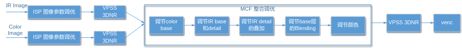
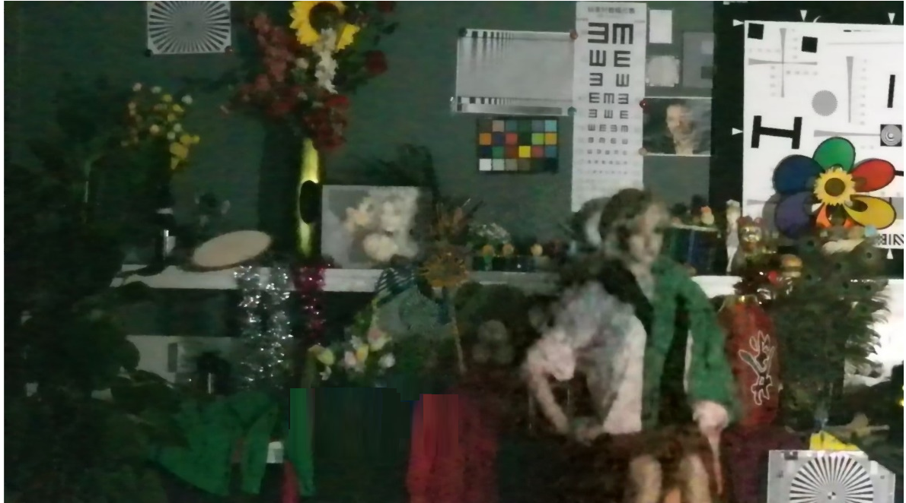

# 前言<a name="ZH-CN_TOPIC_0000002424202046"></a>

**概述<a name="section143mcpsimp"></a>**

本文为应用黑白彩色双路融合（MCF）调试方案而写，目的是介绍MCF的基本原理、操作步骤及调优方法等内容。

> **说明：** 
>本文以SS928V100描述为例，未有特殊说明，SS927V100与SS928V100内容一致。

**产品版本<a name="section146mcpsimp"></a>**

与本文档相对应的产品版本如下。

|产品名称|产品版本|
|--|--|
|SS928|V100|
|SS927|V100|


**读者对象<a name="section165mcpsimp"></a>**

本文档（本指南）主要适用于以下工程师：

-   技术支持工程师
-   软件开发工程师


**修改记录<a name="section214mcpsimp"></a>**

修订记录累积了每次文档更新的说明。最新版本的文档包含以前所有文档版本的更新内容。

|**文档版本**|**发布日期**|**修改说明**|
|--|--|--|
|00B01|2025-09-15|第1次临时版本发布。|


# 功能描述<a name="ZH-CN_TOPIC_0000002424361894"></a>

在低照度场景下，RGB Sensor捕获的图像往往信噪比非常差，细节丢失严重。基于RGB + Mono双Sensor的新型结构，RGB Sensor获取的彩色图像充分保留了颜色信息，而Mono Sensor配合红外补光技术，获取的红外图像有相对较高的信噪比，且细节表现较好。

黑白彩色双路融合技术（简称MCF技术，即Mono-Color-Fusion技术）用于融合上述彩色图像和红外图像，既保留颜色信息，同时充分提升图像的细节表现和信噪比，从而提高低照度场景下的图像质量。

MCF模块的基本原理图如[图1](#fig1275217156391)所示。

**图 1**  MCF模块基本原理图<a name="fig1275217156391"></a>  


# 关键参数<a name="ZH-CN_TOPIC_0000002424202082"></a>

|模块|参数|描述|取值范围|
|--|--|--|--|
|IR Filter|mono_flt_radius|红外图像的亮度滤波窗口半径。半径增大则提取的detail更强，而base层相应变模糊。可以针对红外图像的高频、中频和低频分别配置该滤波窗口半径。|[1,2]|
|mono_flt_bias_lut[9]|该查找表用来控制在不同亮度下，从红外图像中提取的detail强度。该值增大，则提取的detail更强。可以针对高频、中频和低频分别配置该查找表。|[1,128]|
|Color Filter|color_flt_radius|彩色图像的亮度滤波窗口半径。半径越大，彩色图像的亮度base层越模糊。可以针对彩色图像的高频、中频和低频分别配置该滤波窗口半径。|[1,4]|
|color_flt_sgms|用于生成彩色图像滤波器的空域参数，实际值为color_flt_sgms/10.0。该值越大，滤波强度越大，图像越模糊。可以针对彩色图像的高频、中频和低频分别配置该参数。|[1,50]|
|color_flt_sgmr|用于生成彩色图像滤波器的值域参数。该值越大，滤波强度越大，图像越模糊。可以针对彩色图像的高频、中频和低频分别配置该参数。|[1,255]|
|color_hf_en|用于提取彩色图像高频信息的使能信号，仅在彩色图像高频层生效。|[0,1]|
|color_hf_gain|用于控制彩色图像高频信息叠加强度，当且仅当color_hf_en=1时生效。|[0,255]|
|color_med_en|用于对彩色图像进行中值滤波的使能信号，仅在彩色图像高频层生效。|[0,1]|
|Hist Proc|hist_adj_en|直方图校正使能信号。|[0,1]|
|hist_adj_mode|直方图校正使能模式。0：不校正；1：校正彩色图像；2：校正红外图像。|[0,2]|
|hist_adj_str|直方图校正强度。|[0,255]|
|Detail Gain|fusion_det_gain|红外图像detail的全局叠加强度，实际叠加强度为fusion_det_gain/128。可以针对红外图像的高频、中频和低频分别配置该参数。|[0,255]|
|fusion_mono_det_adap_en|红外图像detail叠加强度自适应调整的使能信号。可以针对图像的高频、中频和低频分别配置该参数。|[0,1]|
|fusion_mono_det_lut[33]|该查找表根据红外图像和彩色图像亮度的差异，自适应调整红外细节叠加强度。实际的调整增益为fusion_mono_det_lut/128。可以针对图像的高频、中频和低频分别配置。当且仅当fusion_mono_det_adap_en=1时生效。|[0,255]|
|Blending|fusion_alpha_mode|彩色图像和红外图像的亮度base层融合模式。0：全局alpha融合；1：自适应alpha融合。可以针对图像的高频、中频和低频分别配置该参数。|[0,1]|
|fusion_global_alpha|彩色图像和红外图像的亮度base层融合的全局alpha值，fusion_global_alpha为可见光亮度base层的融合权重，（255- fusion_global_alpha）为红外亮度base层的融合权重。可以针对图像的高频、中频和低频分别配置该参数。当且仅当fusion_alpha_mode=0时生效。|[0,255]|
|fusion_ratio_scale|红外图像和彩色图像的亮度比值的比例参数，默认值为255。该值越小，比值将会变大。当且仅当fusion_alpha_mode=1时生效。|[0,255]|
|fusion_ratio_bias_lut[9]|根据红外图像的亮度，自适应调节亮度比值大小；表中值越大，计算出来的亮度比值增大。可以针对图像的高频、中频和低频分别配置。当且仅当fusion_alpha_mode=1时生效；|[1,127]|
|fusion_mono_ratio_en|根据红外图像的亮度，自适应调节亮度比值的使能信号。可以针对图像的高频、中频和低频分别配置。当且仅当fusion_alpha_mode=1时生效。|[0,1]|
|fusion_mono_ratio_lut[33]|根据红外图像的亮度，控制不同亮度下对亮度比值的调节增益，实际调节增益为fusion_mono_ratio_lut/128。可以针对图像的高频、中频和低频分别配置。当且仅当fusion_mono_ratio_en=1时生效。|[0,255]|
|fusion_mono_flat_en|根据红外图像的区域平坦程度，自适应调节亮度比值的使能信号。可以针对图像的高频、中频和低频分别配置。当且仅当fusion_alpha_mode=1时生效。|[0,1]|
|fusion_mono_flat_bias_lut[9]|根据红外图像的区域平坦程度，自适应调节亮度比值大小；表中值越大，计算出来的亮度比值增大；可以针对图像的高频、中频和低频分别配置。当且仅当fusion_mono_flat_en=1时生效。|[1,255]|
|fusion_mono_flat_lut[33]|根据红外图像的区域平坦程度查表获取增益值，用来调整亮度比值大小，实际增益值为fusion_mono_flat_lut/8。可以针对图像的高频、中频和低频分别配置。当且仅当fusion_mono_flat_en=1时生效。|[0,255]|
|fusion_color_ratio_en|根据彩色图像的亮度，自适应调节亮度比值的使能信号。可以针对图像的高频、中频和低频分别配置。当且仅当fusion_alpha_mode=1时生效。|[0,1]|
|fusion_color_ratio_lut[33]|根据彩色图像的亮度，控制不同亮度下对亮度比值的调节增益，实际调节增益为fusion_color_ratio_lut/128。可以针对图像的高频、中频和低频分别配置。当且仅当fusion_color_ratio_en=1时生效。|[0,255]|
|fusion_alpha_lut[33]|根据红外图像和彩色图像的亮度比值，查表计算两者的base层的融合alpha值。表中的值越大，则红外图像base层的融合权重alpha越大，彩色图像base层的融合权重(255-alpha)越小。可以针对图像的高频、中频和低频分别配置该查找表。当且仅当fusion_alpha_mode=1时生效。|[0,255]|
|Color Correct|color_correct_en|颜色校正使能信号。|[0,1]|
|cc_uv_gain_lut[255]|颜色校正系数表，根据融合后图像的亮度和彩色图像的亮度之间的比值，对色度的饱和度进行增益处理。实际校正系数为cc_uv_gain_lut/128，即当表中某一比值对应的系数配置为128时，表示该比值下不对色度的饱和度做任何处理。当且仅当color_correct_en=1时生效。|[0,511]|
|cc_thd_y|该参数为1到127时，表示当可见光图像的亮度低于该阈值时，会从该阈值开始到亮度为0的区间，逐步减小颜色校正的强度；该参数为0时，表示上述功能不使能。|[0,127]|


# 调试说明<a name="ZH-CN_TOPIC_0000002457880785"></a>

-   **[MCF端到端调试流程图](#ZH-CN_TOPIC_0000002457840741)**  

-   **[ISP基础图像质量调优](#ZH-CN_TOPIC_0000002457840693)**  

-   **[黑白彩色双路融合调节](#ZH-CN_TOPIC_0000002457840725)**  

-   **[融合后3DNR调节](#ZH-CN_TOPIC_0000002424361910)**  

## MCF端到端调试流程图<a name="ZH-CN_TOPIC_0000002457840741"></a>

**图 1**  4K@30fps MCF端到端调试流程图<a name="fig498963145116"></a>  


**图 2**  4M@30fps MCF端到端调试流程图<a name="fig082311423517"></a>  


## ISP基础图像质量调优<a name="ZH-CN_TOPIC_0000002457840693"></a>

正常照度下全部或者主要使用可见光分量，可以不用融合和少量融合红外成分，融合强度调低，ISP、3DNR与单通路调节相同，本文不再描述。

此处假设设备有补光或黑白感光性能优异，即红外通路增益明显比彩色通路低，否则由于各种材质对红外反射率问题，没有必要融合红外通路。

红外、可见光在存在补光灯时，曝光差异较大，曝光测量分开调节，原则上尽量包含更多场景细节。由于红外补光灯的存在，可见光通路尽量使用红外截止滤光片，滤除红外分量，减少可见光的偏色。

低照环境下主要使用黑白彩色融合，这个时候需要配合调节ISP、3DNR，使得进入黑白彩色融合的图像包含足够多的有效图像信息。调节分为红外通路（红外图像）和彩色通路。

-   **[红外通路](#ZH-CN_TOPIC_0000002424202090)**  

-   **[彩色通路](#ZH-CN_TOPIC_0000002424361870)**  

### 红外通路<a name="ZH-CN_TOPIC_0000002424202090"></a>

1.  红外通路必须启用Demosaic，否则可能出现格子等问题。其他清晰度、对比度调节方法与普通图像调节方法类似。由于红外容易过曝，可以使用LDCI、Dehaze模块适当增加亮处内容层次。
2.  由于红外、彩色通路增益差异明显，如果关注融合后图像的柔和自然，则需要红外通路的高频细节\(边缘\)不要与彩色通路差异太大，细节主要通过红外图像的中低频细节来体现。高频适当与彩色通路相当。如果主要关注锐度而不关注自然性，则可以使用步骤1的结果。
3.  由于不少材质对红外、可见光反光特性差异巨大，如果不关注此类物质的色彩\(如布料、染料、金属\)表现，则使用步骤1的结果。如果比较关注整体物体的色彩表现，则尽量让红外图像的亮暗分布接近彩色图像，红外亮度信息利用率可以变高。
4.  针对4K@30fps MCF通路，受限于VPSS总体性能的约束，当前红外通路无法过VPSS 3DNR，在红外通路噪声不大，或对融合图像的柔和自然不太关注时，当前使用BayerNR时域压制噪声，并调试融合后的3DNR的亮噪去噪，压制静止区域和平坦区域的颗粒感。针对4M@30fps MCF通路，当前红外路可以过VPSS 3DNR，当前可以联合BayerNR和3DNR进行去噪处理。

### 彩色通路<a name="ZH-CN_TOPIC_0000002424361870"></a>

**清晰度<a name="section1711111269321"></a>**

由于微弱纹理或中高频细节主要由红外通路补充，彩色通路尽量避免使用增强高频噪声的方法，如Demosaic的nddm\_mf\_detail\_strength、nddm\_hf\_detail\_strength、Sharpen的texture\_freq及texturestr的最后一个点，这些值均需要尽量设小。LDCI、DRC根据实际噪声情况适当减小，平衡对比度和噪声。调试BayerNR，当前需要重点使用user\_define\_md、user\_define\_slope、user\_define\_dark\_thresh、user\_define\_color\_thresh，需要注意的是彩色路的user\_define\_md保持常开，否则彩色图像的动静判决会出现异常。当前彩色通路BayerNR的动静判决需要参考红外通路的信息，这样可以减轻极低照度下，彩色通路本身噪声过大而引起的动静判决不准。部分物体边缘在红外通路因过曝或反射率无法体现内容，此时物体边缘需要使用彩色通路物体边缘，因此彩色通路也需要较强的物体边缘。此时建议Demosaic的nddm\_strength在32左右，避免格子噪声出现的同时使边缘强度、噪声得到一定体现。Sharpen则减小texture\_freq，建议小于100，texturestr最后点小于128，edge\_filt\_strength设为63，尽量让物体被当做边缘而非纹理进行增强，避免噪声明显增加。Sharpen的detail\_ctrl可以适当降低，判断准则为边缘清晰度为可接受状态。为了尽量压低噪声，此处3DNR的调节需要和BayerNR进行配合，当前BayerNR和3DNR都包含时域处理，可以优先使用BayerNR的时域处理，3DNR的时域辅助处理。

**色彩维度<a name="section191131126193210"></a>**

由于融合图像仍需要保证一定的色彩饱和度，但同时色彩噪声又较大，因此需要进行一定处理。首先调节AWB，如果需要较正为准确光源，则无处理，否则可以适当保留光源色，降低低色温时带来的明显色噪。CCM中适当降低红、蓝分量的系数，即R、B主系数降低。CA模块尽量开启，降低暗处的饱和度、提升亮处饱和度。可用CLUT，原则与CA类似，保证高信噪比的颜色、降低低信噪比的颜色饱和度。当前3DNR的去色噪的调试建议为，nr\_c0级的sfc调试为31，tfc调为31，压制画面的闪烁的色噪；nr\_c1级的前景和背景的sfn都选择为7，差异在于前景的sf7混合滤波器更倾向于5号滤波器，背景的sf7混合滤波器更倾向于6号滤波器。当前需要注意的是5号滤波器去除色噪的同时也会损失正常的彩色，存在权衡。具体参数如[图1](#fig13993142443410)所示。

**图 1**  彩色路3DNR色噪调试建议参数图<a name="fig13993142443410"></a>  


彩色通路经过调优后，整体效果如[图2](#fig9166426103219)所示。

**图 2**  彩色通路调优效果图<a name="fig9166426103219"></a>  


**对比度<a name="section1120026183211"></a>**

可以根据实际应用调节gamma、LDCI、Dehaze与普通低照调试方法类似，主要需要关注暗处噪声平衡。同时由于红外通路辅助，尽量减少可见光通路、红外通路的对比度差异。

## 黑白彩色双路融合调节<a name="ZH-CN_TOPIC_0000002457840725"></a>

-   单独调节彩色图像base层
    -   通过调节滤波器半径color\_flt\_radius、滤波器系数控制参数color\_flt\_sgms和color\_flt\_sgmr来控制可见光亮度的滤波强度，半径设置的越大、控制参数的值设置的越大，则滤波强度越强，获得的base层越模糊。
    -   彩色图像的高频、中频和低频均有各自的base层，可分别调节上述参数。

-   单独调节红外图像base层和detail层
    -   通过调节滤波器半径mono\_flt\_radius 来控制滤波强度。半径越大，则相应的base层整体越模糊，detail层整体强度越大，因此细节变得越明显且越粗。
    -   查找表mono\_flt\_bias\_lut\[9\]可用来控制不同亮度下的detail的强度，表中值越大，则对应亮度的detail越强。查找表只有9个值，相当于把像素亮度值域范围（如\[0,255\]）平均分成8段，通过线性运算得到任意亮度下的detail强度。强度越大，细节越明显且越粗。
    -   红外图像的高频、中频和低频均有各自的base层和detail层，可分别调节上述参数。

-   调节红外图像的detail叠加强度
    -   红外图像的detail叠加支持全局强度可调，可通过设置fusion\_det\_gain参数来控制全局叠加强度。fusion\_det\_gain为128表示直接叠加detail层，而不做叠加强度的增益调整。
    -   红外图像的detail叠加支持自适应强度可调，fusion\_mono\_det\_adap\_en为1即可使能自适应调节功能。查找表fusion\_mono\_det\_lut\[33\]中有33个增益值，相当于把红外图像和彩色图像的像素亮度差异值的值域范围平均分成32段，则通过线性运算可得到任意亮度差异下的detail叠加强度增益。
    -   红外图像的高频、中频和低频均有各自的detail层，可分别调节上述参数。

-   调节彩色图像和红外图像的base层融合权重
    -   当fusion\_alpha\_mode为0时，彩色图像和红外图像的base层为全局alpha融合模式，参数fusion\_global\_alpha用于设置彩色图像base层的全局融合权重，红外图像base层的权重则为（255-fusion\_global\_alpha）。参数的默认值为255，若配置值过小，则会由于融合太多红外图像的base成分而影响整体的颜色表现。
    -   当fusion\_alpha\_mode为1时，彩色图像和红外图像的base层为自适应alpha融合模式，将根据红外图像和彩色图像的亮度比值Ry来自适应的计算融合alpha值。
    -   查找表fusion\_ratio\_bias\_lut\[9\] 用于根据红外图像的亮度来调节上述亮度比值Ry的大小；表中的值越大，则计算出来的亮度比值增大。查找表fusion\_ratio\_bias\_lut\[9\]中有9个偏移值，相当于把红外图像亮度值的值域范围平均分成8段，则通过线性运算可得到任意亮度下的偏移值。
    -   当fusion\_mono\_flat\_en为1时，使用查找表fusion\_mono\_flat\_bias\_lut\[9\]根据红外图像的区域平坦度来调节上述亮度比值Ry的大小，表中的值越大，则计算出来的亮度比值增大。查找表fusion\_mono\_flat\_bias\_lut \[9\]中有9个偏移值，相当于把红外图像区域平坦度的值域范围平均分成8段，则通过线性运算可得到任意平坦度下的偏移值。另外，也可使用查找表fusion\_mono\_flat\_lut\[33\]根据红外图像的区域平坦度来对上述亮度比值Ry进行增益控制，表中有33个增益值，相当于把红外图像区域平坦度的值域范围平均分成32段，则通过线性运算可得到任意平坦度下的增益值。
    -   当fusion\_mono\_ratio\_en为1时，使用查找表fusion\_mono\_ratio\_lut\[33\]根据红外图像的亮度来对上述亮度比值Ry进行增益控制。表中有33个增益值，相当于把红外图像亮度的值域范围平均分成32段，则通过线性运算可得到任意亮度下的增益值。
    -   当fusion\_color\_ratio\_en为1时，使用查找表fusion\_color\_ratio\_lut\[33\]根据彩色图像的亮度来对上述亮度比值Ry进行增益控制。表中有33个增益值，相当于把彩色图像亮度的值域范围平均分成32段，则通过线性运算可得到任意亮度下的增益值。
    -   根据上述经过偏移值和增益值调整后的Ry，查表得到红外图像和彩色图像的融合alpha值。查找表fusion\_alpha\_lut\[33\]中有33个权重值，相当于把Ry的值域范围平均分成32段，则通过线性运算可得到任意Ry对应的红外图像融合alpha，彩色图像的融合权重则为\(255-alpha\)。
    -   高频、中频和低频段，可分别调节上述参数。

-   调节融合后图像的颜色
    -   当color\_correct\_en为1时，使能颜色校正功能。cc\_uv\_gain\_lut\[255\]为颜色校正系数表，根据融合后图像的亮度和彩色图像的亮度之间的比值，对图像的色度饱和度进行增益处理。融合前后的亮度比值范围为0-255，实际的饱和度增益为cc\_uv\_gain\_lut/128。
    -   为了避免低照下色噪的饱和度被拉大，可以设置cc\_thd\_y。当彩色图像的亮度低于阈值cc\_thd\_y时，会从该阈值到亮度为0的区间，逐步减小色度饱和度的补偿程度。

        **图 1**  MCF调试风格示例图<a name="fig2192183017464"></a>  
        

## 融合后3DNR调节<a name="ZH-CN_TOPIC_0000002424361910"></a>

融合后过VPSS 3DNR的目的主要是为了去除由于MCF模块中的uvgain曲线提升整体色彩饱和度而引起的色噪，以及由于IR图像没有经过3DNR引起的静止区域和运动区域的颗粒感。调试的方法与调试彩色图像的方法一致。

# 标定<a name="ZH-CN_TOPIC_0000002457840705"></a>

-   **[标定环境和标定方法](#ZH-CN_TOPIC_0000002424361950)**  

-   **[标定库的使用](#ZH-CN_TOPIC_0000002457840713)**  

## 标定环境和标定方法<a name="ZH-CN_TOPIC_0000002424361950"></a>

-   **[标定目的和方法](#ZH-CN_TOPIC_0000002424202066)**  

-   **[标定环境要求](#ZH-CN_TOPIC_0000002424202026)**  

### 标定目的和方法<a name="ZH-CN_TOPIC_0000002424202066"></a>

标定的目的是估计镜头外部参数，即双镜头/双Sensor之间的相对位置以及双镜头/双Sensor间的重叠有效区域。算法将会根据标定得到的外部参数对双路图像进行对齐，方便后续进行双路融合处理。

标定是基于全局配准来实现的，因此针对双镜头的结构，并不能解决同一场景内不同深度下的视差问题。所以，需要提前确定设备的关注距离。在标定并配准后，两路图像在关注距离及其附近的视差会相对较小。

在标定时，假定关注距离为5米，则将设备放置于离标定场景5米的地方，正对标定场景中心，同时采集两路图像。

### 标定环境要求<a name="ZH-CN_TOPIC_0000002424202026"></a>

双镜头的视角相近，标定前需要主观确定两路画面取景基本相当；

环境光线必须充足、均匀，保证采集的双路图像无明显噪声，无反光，亮度/对比度差异小，否则可能造成全局配准失效。

标定场景不需要制作特殊的pattern，但是必须具备非常丰富的细节，这样才能保证场景中包含足够充分和明显的特征点，否则可能造成全局配准失效。

标定场景尽量为平面，例如细节丰富的海报，也可以为实际场景，但实际场景中不要包含太多的深度。

标定时，应避免场景中出现运动物体或变化的光线，避免由于运动而影响标定；

标定采集的双路图像中，标定场景要充满整个画面。

下面给出标定场景的示意图以供参考，具体参考[图1](#_fig26861861)所示。

**图 1**  MCF标定场景推荐示例图<a name="_fig26861861"></a>  


> **说明：** 
>MCF标定的视场角矫正和防抖都使用了GDC，如果开启了视场角矫正和两路及以上陀螺仪防抖功能，可能会性能不足。

## 标定库的使用<a name="ZH-CN_TOPIC_0000002457840713"></a>

-   **[函数接口描述](#ZH-CN_TOPIC_0000002457880833)**  

-   **[使用说明](#ZH-CN_TOPIC_0000002424361858)**  

-   **[使用限制](#ZH-CN_TOPIC_0000002424361922)**  

### 函数接口描述<a name="ZH-CN_TOPIC_0000002457880833"></a>

请参考《黑白彩色双路融合开发参考》。

### 使用说明<a name="ZH-CN_TOPIC_0000002424361858"></a>

1.  进入代码路径：./sample/mcf/
2.  执行 ./sample\_mcf  0
3.  输出标定结果如下所示：

    ```
    show matrix of calibration: 
    1052905,         657,   -13045049, 
    -2007,     1051702,    11698003, 
    1,           0,    1048576, 
    show crop region of calibration： 
    x:16,  y:0,  width:1904,  height:1056 
    num of refer feature:   968 
    num of register feature: 771 
    num of match feature:  100
    ```

4.  分别为镜头矫正矩阵和双镜头/双Sensor间的重叠有效区域。以及标定返回的特征点信息，包括基准图像、待校正图像、匹配的特征点数量。

### 使用限制<a name="ZH-CN_TOPIC_0000002424361922"></a>

标定函数的输入图像，分辨率不能大于4096\*2160。输入的两路图像大小必须相同。并且输入图像的宽高、stride以及图像有效区域ROI即图像顶部、底部、左侧、右侧剪裁宽度必须8对齐。

下面举例说明。

1.  若实际分辨率为4096x2160，则对两路标定图像分别进行水平4倍和垂直4倍下采样，得到两路分辨率为1024x540的标定图像；
2.  将两个分辨率为1024x540的标定图像作为标定库的输入图像，输入分辨率配置为1024x540，运行标定库程序进行标定；
3.  对得到的标定参数进行处理。

    若标定后的矩阵系数为：

    

    则实际用于矫正的矩阵系数修正为：

    

    若标定后的有效区域参数为\[x, y, w, h\]，则实际用于矫正的有效区域参数修正为\[x\*4, y\*4, w\*4, h\*4\]。

    其中，4即为图像水平和垂直下采样的倍数。

# 常见现象的调优方法<a name="ZH-CN_TOPIC_0000002424361934"></a>

-   **[彩色图像在极低照度的拖尾问题](#ZH-CN_TOPIC_0000002457880769)**  

-   **[红外图像和彩色图像亮度差异过大，引起融合效果异常](#ZH-CN_TOPIC_0000002457880821)**  

-   **[融合后的运动区域模糊、有噪声黑斑等](#ZH-CN_TOPIC_0000002457880809)**  

-   **[融合后偏色](#ZH-CN_TOPIC_0000002457880845)**  

-   **[融合后车牌表现不佳](#ZH-CN_TOPIC_0000002424202102)**  

-   **[标定效果不佳](#ZH-CN_TOPIC_0000002457840669)**  

## 彩色图像在极低照度的拖尾问题<a name="ZH-CN_TOPIC_0000002457880769"></a>

-   确认红外图像关于运动区域的动静判决阈值调试合理，即运动区域以空域为主，避免红外图像产生拖尾。
-   确认当前彩色通路，Bayer3D使用用户自定义模式，即调试参数user\_define\_md、user\_define\_slope、user\_define\_dark\_thresh、user\_define\_color\_thresh。
-   确认当前彩色通路图像3DNR时域参数如tfs、math等参数合理，以抑制不产生大颗粒的雨点噪声为合理，避免3DNR时域参数调试不合理引起彩色图像在极低照度产生运动拖尾。
-   当彩色路使用HNR和BNR模块时，当前确保优先使用MCF预处理，即ot\_mcf\_vi\_attr的enable为true，此时，当前HNR的模式为advance模式时，HNR和BNR模块为并列模块，HNR和BNR不做融合处理。此时BNR的动静判决受到user\_define\_md、user\_define\_slope、user\_define\_dark\_thresh、user\_define\_color\_thresh等参数影响。

## 红外图像和彩色图像亮度差异过大，引起融合效果异常<a name="ZH-CN_TOPIC_0000002457880821"></a>

-   确认红外图像的曝光是否合理，当前由于融合后的图像清晰度来源于红外图像，可见光图像可以适当地限制曝光时间，来提升运动图像的清晰度。
-   确认彩色的图像的亮度是否合理，当前如果彩色图像的亮度不够，可以适当补偿IspDgain，但需要注意的是极低照度下，IspDgain使用过大，会带来彩色图像的色噪难以去除。

## 融合后的运动区域模糊、有噪声黑斑等<a name="ZH-CN_TOPIC_0000002457880809"></a>

-   确认彩色图像和红外图像在运动区域的表现，模糊、噪声等问题应该主要来自于彩色图像，尽量保证红外图像的运动区域表现良好。
-   在全局alpha融合模式下，降低fusion\_global\_alpha的值，或者在自适应alpha融合模式下，拉高fusion\_alpha\_lut\[33\]曲线的值，从而提高红外图像的融合权重，提升融合后图像效果。但是融合后的颜色表现将会下降，需要根据需要进行权衡。

## 融合后偏色<a name="ZH-CN_TOPIC_0000002457880845"></a>

-   由于彩色图像和红外图像的亮度和对比度的分布差异巨大，因此融合后若红外图像的信息占比较多，会显著影响融合后的颜色表现，出现偏色、饱和度降低等问题。需通过调试前端ISP通路，尽量确保彩色通路和红外通路在亮度和对比度表现上尽可能接近。
-   确认color\_correct\_en是否配置为1，并根据需要调节cc\_uv\_gain\_lut\[255\]曲线。需要注意的是，曲线的值调节得越高，颜色饱和度补偿得越强，同时也会造成色噪更加明显，需进行权衡。
-   若需要抑制暗区色噪，则可以对暗区降低颜色饱和度的补偿，通过设置阈值cc\_thd\_y，降低cc\_thd\_y以下亮度区域的饱和度补偿强度。

## 融合后车牌表现不佳<a name="ZH-CN_TOPIC_0000002424202102"></a>

-   确认彩色图像的车牌表现是否正常，ISP彩色通路的调试尽量保证彩色图像的车牌的颜色和清晰度正常。
-   确认红外图像的车牌表现，可通过ISP红外通路的调试使红外车牌过曝或接近过曝。
-   当红外车牌过曝或接近过曝时，确认是否设置fusion\_mono\_ratio\_en参数为1。根据红外车牌过曝的程度，调节查找表fusion\_mono\_ratio\_lut\[33\]，该查找表一般设置为递减的形式，在接近红外车牌高亮值的附近，迅速将查找表对应的值降低为0。
-   注意在非交通抓拍场景，如夜晚黑光场景，彩色的曝光时间接近40ms，当红外只有10ms左右，当前红外图像无法精准控制过曝区域，fusion\_mono\_ratio\_en为1，往往导致红外图像在过曝区域强制选择彩色图像，而彩色图像的亮度往往较暗，从而出现图像分层的问题，此时建议fusion\_mono\_ratio\_en设置为0，来避免图像分层。

## 标定效果不佳<a name="ZH-CN_TOPIC_0000002457840669"></a>

-   检查标定环境是否合理。
-   对于双镜头结构，天然地存在视差问题，基于全局配准的标定算法无法解决。此时，可以设置感兴趣区域例如画面的中间区域，则标定算法会首先确保感兴趣区域的标定效果。双镜头结构建议使用projective投影模式。
-   对于分光结构，理论上不存在视差，可根据需要设置感兴趣区域，同时建议使用affine投影模式。

