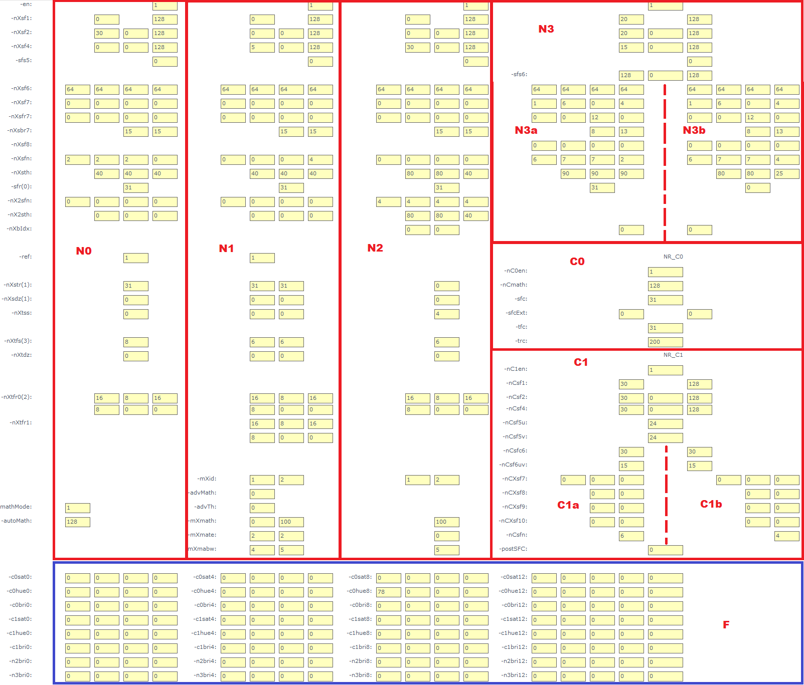

# 前言<a name="ZH-CN_TOPIC_0000002457880765"></a>

**产品版本<a name="section138mcpsimp"></a>**

与本文档相对应的产品版本如下。

|产品名称|产品版本|
|--|--|
|SS928|V100|
|SS927|V100|


> **说明：** 
>本文以SS928V100描述为例，未有特殊说明，SS927V100与SS928V100内容一致。

**读者对象<a name="section76301743411"></a>**

本文档（本指南）主要适用于以下工程师：

-   技术支持工程师
-   软件开发工程师

**修改记录<a name="section2467512116410"></a>**

|**文档版本**|**发布日期**|**修改说明**|
|--|--|--|
|00B01|2025-09-15|第1次临时版本发布。|


# 接口及参数说明<a name="ZH-CN_TOPIC_0000002424201998"></a>

-   **[ot\_vpss\_nrx\_v2的参数说明](#ZH-CN_TOPIC_0000002457880753)**  

-   **[默认参数](#ZH-CN_TOPIC_0000002424361866)**  

## ot\_vpss\_nrx\_v2的参数说明<a name="ZH-CN_TOPIC_0000002457880753"></a>

下面介绍3DNR的接口及参数。

-   [ot\_vpss\_nrx\_v2](#ZH-CN_TOPIC_0000002457840685)：定义3DNR X接口版本V2的参数。
-   [ot\_vpss\_nrx\_v2\_iey](#ZH-CN_TOPIC_0000002457840633)：3DNR增强模块参数。
-   [ot\_vpss\_nrx\_v2\_sfy](#ZH-CN_TOPIC_0000002457840665)：3DNR空域滤波参数。
-   [ot\_vpss\_nrx\_v2\_mdy](#ZH-CN_TOPIC_0000002457880749)：3DNR运动检测参数。
-   [ot\_vpss\_nrx\_v2\_tfy](#ZH-CN_TOPIC_0000002424361842)：3DNR时域滤波参数。
-   [ot\_vpss\_nrx\_v2\_nrc0](#ZH-CN_TOPIC_0000002424202038)：3DNR视频色度C0级滤波参数。
-   [ot\_vpss\_nrx\_v2\_nrc1](#ZH-CN_TOPIC_0000002424361850)：3DNR视频色度C1级滤波参数。


### ot\_vpss\_nrx\_v2<a name="ZH-CN_TOPIC_0000002457840685"></a>

【说明】

定义3DNR X接口版本V2的参数。

【定义】

```
typedef struct {
    ot_vpss_nrx_v2_iey  iey[5];
    ot_vpss_nrx_v2_sfy  sfy[5];
    ot_vpss_nrx_v2_mdy  mdy[2];
    ot_vpss_nrx_v2_tfy  tfy[3];
    ot_vpss_nrx_v2_nrc0 nrc0;
    ot_vpss_nrx_v2_nrc1 nrc1;
    struct {
        td_u16 limit_range_en  : 1;
        td_u16 nry0_en         : 1;
        td_u16 nry1_en         : 1;
        td_u16 nry2_en         : 1;
        td_u16 nry3_en         : 1;
        td_u16 nrc0_en         : 1;
        td_u16 nrc1_en         : 1;
        td_u16 _rb_            : 9;
        };
```

```
} ot_vpss_nrx_v2;
```

【成员】

|成员名称|描述|
|--|--|
|iey|亮度滤波增强模块参数。|
|sfy|亮度滤波空域滤波参数。|
|mdy|亮度滤波运动检测参数。|
|tfy|亮度滤波时域滤波参数。|
|nrc0|色度滤波C0级参数。|
|nrc1|色度滤波C1级参数。|
|limit_range_en|Limit range模式开关。|
|nry0_en|亮度滤波N0级使能开关。|
|nry1_en|亮度滤波N1级使能开关。|
|nry2_en|亮度滤波N2级使能开关。|
|nry3_en|亮度滤波N3级使能开关。|
|nrc0_en|色度滤波C0级使能开关。|
|nrc1_en|色度滤波C1级使能开关。|
|_rb_|保留。|


### ot\_vpss\_nrx\_v2\_iey<a name="ZH-CN_TOPIC_0000002457840633"></a>

【说明】

3DNR增强模块参数。

【定义】

```
typedef struct { 
     td_u8   ies0, ies1, ies2, ies3; 
     td_u16  iedz; 
 } ot_vpss_nrx_v2_iey;
```

【成员】

|成员名称|描述|
|--|--|
|ies0、ies1、ies2、ies3|边缘的绝对增强强度，0~3对应不同频段。取值范围：[0, 255]。|
|iedz|噪声控制阈值。不建议调试，默认为0。取值范围：[0, 999]。|


【3DNR X接口与MPI接口的对应关系】

-   N0级的nXsf6 对应于iey\[0\].ies0、iey\[0\].ies1、iey\[0\].ies2、iey\[0\].ies3；
-   N1级的nXsf6 对应于iey\[1\].ies0、iey\[1\].ies1、iey\[1\].ies2、iey\[1\].ies3；
-   N2级的nXsf6 对应于iey\[2\].ies0、iey\[2\].ies1、iey\[2\].ies2、iey\[2\].ies3；
-   N3级的nXsf6a和nXsf6b 接口
    -   nXsf6a对应于iey\[3\].ies0、iey\[3\].ies1、iey\[3\].ies2、iey\[3\].ies3；
    -   nXsf6b对应于iey\[4\].ies0、iey\[4\].ies1、iey\[4\].ies2、iey\[4\].ies3。

-   N0\~N3级iedz未在3DNR X接口开放。不建议调试，默认为0。

### ot\_vpss\_nrx\_v2\_sfy<a name="ZH-CN_TOPIC_0000002457840665"></a>

【说明】

3DNR空域滤波参数。

【定义】

```
typedef struct {
    struct {
        td_u16 spn    : 4;
        td_u16 sbn    : 4;
        td_u16 pbr    : 5;
        td_u16 j_mode : 3;
    };
    td_u8   sfr7[4],  sbr7[2];
    td_u8   sfs1,  sbr1;
    td_u8   sfs2,  sft2,  sbr2;
    td_u8   sfs4,  sft4,  sbr4;
    struct {
        td_u16 sth1_0 : 9;
        td_u16 sf5_md : 1;
        td_u16 _rb1_  : 6;
    };
    struct {
        td_u16 sth2_0   : 9;
        td_u16 sf8_idx0 : 3;
        td_u16 bri_idx0 : 4;
    };
    struct {
        td_u16 sth3_0   : 9;
        td_u16 sf8_idx1 : 3;
        td_u16 bri_idx1 : 4;
    };
    td_u16  sth1_1, sth2_1, sth3_1;
    struct {
        td_u16 sfn0_0 : 4;
        td_u16 sfn1_0 : 4;
        td_u16 sfn2_0 : 4;
        td_u16 sfn3_0 : 4;
    };
    struct {
        td_u16 sfn0_1 : 4;
        td_u16 sfn1_1 : 4;
        td_u16 sfn2_1 : 4;
        td_u16 sfn3_1 : 4;
    };
    td_u8   sf8_tfr, sf8_thrd, sfr;
    td_u8   bri_str[OT_VPSS_S_IDX_LEN];
} ot_vpss_nrx_v2_sfy;
```

【成员】

|成员名称|描述|
|--|--|
|j_mode|空域混合模式。取值范围：[0,4]。|
|spn、sbn|混合模式滤波器选择。取值范围：[0, 7]。|
|pbr|表示spn和sbn滤波结果的混合比例，当混合模式j_mode为1时生效。取值范围 [0,16]。|
|sfr7|表示由sbn选择的滤波器产生的结果和spn融合后的相对强度。取值范围 [0, 31]。|
|sfr|纯空域滤波器强度控制。取值范围：[0,31]。|
|sfs1、sfs2、sfs4|表示1~4号滤波器强度（3和4号滤波器强度一样）。取值范围：[0,255]。|
|sft2、sft4|表示2~4号滤波器附加强度。取值范围：[0,255]。|
|sbr1、sbr2、sbr4、sbr7|表示1~4、6号滤波器的滤波的不对称强度。sbr1、sbr2、sbr4取值范围：[0,255]。sbr7取值范围：[0,15]。|
|sf5_md|表示5号滤波器的强度。取值范围：[0, 1]。|
|sth1_0、sth2_0、sth3_0sth1_1、sth2_1、sth3_1|运动前景和背景区域的保边阈值。值越小，越多的边缘被保留，噪声也会越大；值越大，保留的边缘越少，只有很强的边缘被保留住。取值范围：[0,511]。|
|sfn0_0、sfn1_0、sfn2_0、sfn3_0sfn0_1、sfn1_1、sfn2_1、sfn3_1|根据sth保边阈值，不同图像特性选择不同滤波器的类型（编号）。取值范围：[0,8]。|
|sf8_idx0、sf8_idx1|选择用于混合的滤波器号。取值范围：[0,7]|
|sf8_tfr、sf8_thrd|表示8号滤波器阈值上下限，用于确定混合比例。取值范围：[0,255]|
|bri_idx0、bri_idx1|表示分别为运动前景和背景选择滤波器，根据亮度进行混合。取值范围：[0,8]|
|bri_str|根据亮度配置bri_idx0, bri_idx1与空域结果的混合比例。OT_VPSS_S_IDX_LEN用于定义YUV 3DNR亮度和饱和度表格调试的可设置的最大个数，取值为17|
|_rb1_|保留。|


【3DNR X接口与MPI接口的对应关系】

-   sf8\_idx0、sf8\_idx1、sf8\_tfr和sf8\_thrd仅在N3级有效。
-   bri\_idx0、bri\_idx1和bri\_str仅在N2和N3级有效。
-   sth1\_1、sth2\_1、sth3\_1、sfn0\_1、sfn1\_1、sfn2\_1和sfn3\_1在N0\~N2级有效。
-   N0级的nXsf1 对应于 sfy\[0\].sfs1、sfy\[0\].sbr1；
-   N0级的nXsf2 对应于 sfy\[0\].sfs2、sfy\[0\].sft2、sfy\[0\].sbr2；
-   N0级的nXsf4 对应于 sfy\[0\].sfs4、sfy\[0\].sft4、sfy\[0\].sbr4；
-   N0级的nXsf5 对应于 sfy\[0\].sf5\_md；
-   N0级的nXsf7 对应于 sfy\[0\].spn、sfy\[0\].sbn、sfy\[0\].pbr、sfy\[0\].j\_mode；
-   N0级的nXsfr7 对应于sfy\[0\].sfr7\[0\]、sfy\[0\].sfr7\[1\]、sfy\[0\].sfr7\[2\]、sfy\[0\].sfr7\[3\]；
-   N0级的nXsbr7 对应于sfy\[0\].sbr7\[0\]、sfy\[0\].sbr7\[1\]；
-   N0级的sfr对应于sfy\[0\].sfr；
-   N0级的nXsfn对应于 sfy\[0\].sfn0\_0、sfy\[0\].sfn1\_0、sfy\[0\].sfn2\_0、sfy\[0\].sfn3\_0；
-   N0级的nXsth对应于 sfy\[0\].sth1\_0、sfy\[0\].sth2\_0、sfy\[0\].sth3\_0；
-   N0级的nX2sfn对应于 sfy\[0\].sfn0\_1、sfy\[0\].sfn1\_1、sfy\[0\].sfn2\_1、sfy\[0\].sfn3\_1；
-   N0级的nX2sth对应于 sfy\[0\].sth1\_1、sfy\[0\].sth2\_1、sfy\[0\].sth3\_1。
-   N1级的nxsf1 对应于 sfy\[1\].sfs1、sfy\[1\].sbr1；
-   N1级的nxsf2 对应于 sfy\[1\].sfs2、sfy\[1\].sft2、sfy\[1\].sbr2；
-   N1级的nxsf4 对应于 sfy\[1\].sfs4、sfy\[1\].sft4、sfy\[1\].sbr4；
-   N1级的nXsf5 对应于 sfy\[1\].sf5\_md；
-   N1级的nxsf7 对应于 sfy\[1\].spn、sfy\[1\].sbn、sfy\[1\].pbr；sfy\[1\].j\_mode；
-   N1级的nxsfr7 对应于sfy\[1\].sfr7\[0\]、sfy\[1\].sfr7\[1\]、sfy\[1\].sfr7\[2\]、sfy\[1\].sfr7\[3\]；
-   N1级的nxsbr7 对应于sfy\[1\].sbr7\[0\]、sfy\[1\].sbr7\[1\]；
-   N1级的sfr对应于sfy\[1\].sfr；
-   N1级的nXsfn对应于 sfy\[1\].sfn0\_0、sfy\[1\].sfn1\_0、sfy\[1\].sfn2\_0、sfy\[1\].sfn3\_0；
-   N1级的nXsth对应于 sfy\[1\].sth1\_0、sfy\[1\].sth2\_0、sfy\[1\].sth3\_0；
-   N1级的nX2sfn对应于 sfy\[1\].sfn0\_1、sfy\[1\].sfn1\_1、sfy\[1\].sfn2\_1、sfy\[1\].sfn3\_1；
-   N1级的nX2sth对应于 sfy\[1\].sth1\_1、sfy\[1\].sth2\_1、sfy\[1\].sth3\_1。
-   N2级的nXsf1 对应于 sfy\[2\].sfs1、sfy\[2\].sbr1；
-   N2级的nXsf2 对应于 sfy\[2\].sfs2、sfy\[2\].sft2、sfy\[2\].sbr2；
-   N2级的nXsf4 对应于 sfy\[2\].sfs4、sfy\[2\].sft4、sfy\[2\].sbr4；
-   N2级的nXsf5 对应于 sfy\[2\].sf5\_md；
-   N2级的nXsf7 对应于 sfy\[2\].spn、sfy\[2\].sbn、sfy\[2\].pbr、sfy\[2\].j\_mode；
-   N2级的nXsfr7 对应于sfy\[2\].sfr7\[0\]、sfy\[2\].sfr7\[1\]、sfy\[2\].sfr7\[2\]、sfy\[2\].sfr7\[3\]；
-   N2级的sfr对应于sfy\[2\].sfr；
-   N2级的nXsfn对应于 sfy\[2\].sfn0\_0、sfy\[2\].sfn1\_0、sfy\[2\].sfn2\_0、sfy\[2\].sfn3\_0；
-   N2级的nXsth对应于 sfy\[2\].sth1\_0、sfy\[2\].sth2\_0、sfy\[2\].sth3\_0；
-   N2级的nX2sfn对应于 sfy\[2\].sfn0\_1、sfy\[2\].sfn1\_1、sfy\[2\].sfn2\_1、sfy\[2\].sfn3\_1；
-   N2级的nX2sth对应于 sfy\[2\].sth1\_1、sfy\[2\].sth2\_1、sfy\[2\].sth3\_1；
-   N2级的nXbIdx对应于 sfy\[2\]. bri\_idx0、sfy\[2\]. bri\_idx1；
-   表格n2bri0 \~ n2bri12 对应于 sfy\[2\].bri\_str\[OT\_VPSS\_S\_IDX\_LEN\];
-   N3级的nXsf1对应于 sfy\[3\].sfs1、sfy\[3\].sbr1；
-   N3级的nXsf2对应于 sfy\[3\].sfs2、sfy\[3\].sft2、sfy\[3\].sbr2；
-   N3级的nXsf4对应于 sfy\[3\].sfs4、sfy\[3\].sft4、sfy\[3\].sbr4；
-   N3级的nXsf5 对应于 sfy\[3\].sf5\_md；
-   N3级的sfs6对应于 sfy\[4\].sfs4、sfy\[4\].sft4和sfy\[4\].sbr4；
-   N3级的nxsf7a和nxsf7b分别对应于 sfy\[3\].spn、sfy\[3\].sbn、sfy\[3\].pbr、sfy\[3\].j\_mode和sfy\[4\].spn、sfy\[4\].sbn、sfy\[4\].pbr、sfy\[4\].j\_mode；
-   N3级的nxsfr7a和nxsfr7b 分别对应于sfy\[3\].sfr7\[0\]、sfy\[3\].sfr7\[1\]、sfy\[3\].sfr7\[2\]、sfy\[3\].sfr7\[3\]和sfy\[4\].sfr7\[0\]、sfy\[4\].sfr7\[1\]、sfy\[4\].sfr7\[2\]、sfy\[4\].sfr7\[3\]；
-   N3级的nxsbr7a和nxsbr7b 分别对应于sfy\[3\].sbr7\[0\]、sfy\[3\].sbr7\[1\]和sfy\[4\].sbr7\[0\]、sfy\[4\].sbr7\[1\]；
-   N3级的nxsfna和nxsfnb分别对应于sfy\[3\].sfn0\_0、sfy\[3\].sfn1\_0、sfy\[3\].sfn2\_0、sfy\[3\].sfn3\_0和sfy\[4\].sfn0\_0、sfy\[4\].sfn1\_0、sfy\[4\].sfn2\_0、sfy\[4\].sfn3\_0；
-   N3级的nxstha和nxsthb分别对应于 sfy\[3\].sth1\_0、sfy\[3\].sth2\_0、sfy\[3\].sth3\_0和sfy\[4\].sth1\_0、sfy\[4\].sth2\_0、sfy\[4\].sth3\_0；
-   N3级的sfra和sfrb分别对应于sfy\[3\].sfr和sfy\[4\].sfr；
-   N3级的nXsf8a和nXsf8b分别对应于 sfy\[3\]. sf8\_idx0、sfy\[3\]. sf8\_idx1、sfy\[3\]. sf8\_tfr、sfy\[3\]. sf8\_thrd和sfy\[4\]. sf8\_idx0、sfy\[4\]. sf8\_idx1、sfy\[4\]. sf8\_tfr、sfy\[4\]. sf8\_thrd；
-   N3级的nXbIdx对应于 sfy\[3\]. bri\_idx0、sfy\[3\]. bri\_idx1；
-   表格n3bri0 \~ n3bri12 对应于 sfy\[3\].bri\_str\[OT\_VPSS\_S\_IDX\_LEN\];

### ot\_vpss\_nrx\_v2\_mdy<a name="ZH-CN_TOPIC_0000002457880749"></a>

【说明】

3DNR运动检测参数。

【定义】

```
typedef struct {
    struct {
        td_u16 math0 : 10;
        td_u16 mate0 : 4;
        td_u16 mai00 : 2;
    };
    struct {
        td_u16 math1 : 10;
        td_u16 mate1 : 4;
        td_u16 mai02 : 2;
    };
    struct {
        td_u16 adv_math : 1;
        td_u16 adv_th   : 12;
        td_u16 _rb_     : 3;
    };
} ot_vpss_nrx_v2_mdy;
```

【成员】

|成员名称|描述|
|--|--|
|mai00、mai02|选择采用哪种时域滤波器和空域的滤波器进行混合取值范围：[0, 3]。|
|math0、math1|表示通路0，1中动静判决阈值。取值范围：[0, 999]。|
|mate0、mate1|表示通路0，1中平坦区域运动检测指数。取值范围：[0, 8]|
|adv_math|增强型math模式开关。0：关闭，1：打开。|
|adv_th|控制增强型math的效果。取值范围：[0, 999]。|
|_rb_|保留。|


【3DNR X接口与MPI接口的对应关系】

-   adv\_math、adv\_th对应于N1级；
-   mXid、mXmath、mXmate、mXmabw对应于N1、N2级。
-   N1级的mXid 对应于 mdy\[0\].mai00、mdy\[0\].mai01、mdy\[0\].mai02；
-   N1级的mXmath对应于 mdy\[0\].math0、mdy\[0\].math1；
-   N1级的mXmate对应于 mdy\[0\].mate0、mdy\[0\].mate1；
-   N1级的mXmabw对应于 mdy\[0\].mabw0、mdy\[0\].mabw1；
-   N1级的advMath对应于mdy\[0\].adv\_math；
-   N1级的advTh对应于mdy\[0\].adv\_th；
-   N2级的mXid 对应于 mdy\[1\].mai00、mdy\[1\].mai02；
-   N2级的mXmath对应于 mdy\[1\].math0；
-   N2级的mXmate对应于 mdy\[1\].mate0；
-   N2级的mXmabw对应于 mdy\[1\].mabw0；

### ot\_vpss\_nrx\_v2\_tfy<a name="ZH-CN_TOPIC_0000002424361842"></a>

【说明】

3DNR时域滤波参数。

【定义】

```
typedef struct {
    struct {
        td_u16 tfs0  : 4;
        td_u16 tdz0  : 10;
        td_u16 _rb0_ : 2;
    };
    struct {
        td_u16 tfs1      : 4;
        td_u16 tdz1      : 10;
        td_u16 math_mode : 2;
    };
    struct {
        td_u16 sdz0   : 10;
        td_u16 str0   : 5;
        td_u16 ref_en : 1;
    };
    struct {
        td_u16 sdz1  : 10;
        td_u16 str1  : 5;
        td_u16 _rb1_ : 1;
    };
    td_u8   tss0,   tss1;
    td_u16  auto_math;
    td_u8   tfr0[6], tfr1[6];
} ot_vpss_nrx_v2_tfy;
```

【成员】

|成员名称|描述|
|--|--|
|tfs0、tfs1|通路0，1中时域滤波绝对强度。|
|tdz0、tdz1|保护运动区域的纹理不受时域滤波影响，将tdz调大时，运动区域的纹理可以得到保护，同时也会带来时域滤波强度的削弱。取值范围：[0, 999]。|
|str0、str1|通路0，1中滤波器作用后叠加在结果的比例，值越大比例越高。取值范围：[0, 31]。|
|tfr0、tfr1|通路0，1中静止区域时域滤波的相对强度。取值范围：[0, 31]。|
|tss0、tss1|通路0，1中时域静止区域混入空域的比例。取值范围：[0, 15]。|
|ref_en|参考帧开关。0：关闭1：打开|
|sdz0、sdz1|通路0，1中约束滤波器作用强度，值越小，作用强度越低。取值范围：[0, 999]。|
|math_mode|运动判决模式。取值范围：[0, 2]。|
|auto_math|第0级的运动判决阈值。取值范围：[0, 999]。|
|_rb0_、_rb1_|保留。|


【3DNR X接口与MPI接口的对应关系】

-   ref对应于tfy\[0\].ref\_en以及tfy\[1\].ref\_en，分别用于控制N0级的时域开关和总的时域开关。
-   nXstr、nXsdz、nXtss、nXtfs、nXtfr0、nXtdz对应于N0、N1和N2级；mathMode、autoMath仅对应于N0级。
-   N0级的nXstr对应于tfy\[0\].str0；
-   N0级的nXsdz对应于tfy\[0\].sdz0；
-   N0级的nXtss对应于tfy\[0\].tss0；
-   N0级的nXtfs对应于tfy\[0\].tfs0；
-   N0级的nXtdz对应于tfy\[0\].tdz0；
-   N0级的nXtfr0对应于tfy\[0\].tfr0\[0\]、tfy\[0\].tfr0\[1\]、tfy\[0\].tfr0\[2\]、tfy\[0\].tfr0\[3\]、tfy\[0\].tfr0\[4\]、tfy\[0\].tfr0\[5\]；
-   N0级的mathMode对应于tfy\[0\].math\_mode；
-   N0级的autoMath对应于tfy\[0\].auto\_math。
-   N1级的nXstr对应于tfy\[1\].str0；
-   N1级的nXsdz对应于tfy\[1\].sdz0；
-   N1级的nXtss对应于tfy\[1\].tss0、tfy\[1\].tss1；
-   N1级的nXtfs对应于tfy\[1\].tfs0、tfy\[1\].tfs1；
-   N1级的nXtdz对应于tfy\[1\].tdz0、tfy\[1\].tdz1；
-   N1级的nXtfr0对应于tfy\[1\].tfr0\[0\]、tfy\[1\].tfr0\[1\]、tfy\[1\].tfr0\[2\]、tfy\[1\].tfr0\[3\]、tfy\[1\].tfr0\[4\]、tfy\[1\].tfr0\[5\]；
-   N1级的nXtfr1对应于tfy\[1\].tfr1\[0\]、tfy\[1\].tfr1\[1\]、tfy\[1\].tfr1\[2\]、tfy\[1\].tfr1\[3\]、tfy\[1\].tfr1\[4\]、tfy\[1\].tfr1\[5\]；
-   N2级的nXstr对应于tfy\[2\].str0；
-   N2级的nXsdz对应于tfy\[2\].sdz0；
-   N2级的nXtss对应于tfy\[2\].tss0；
-   N2级的nXtfs对应于tfy\[2\].tfs0；
-   N2级的nXtdz对应于tfy\[2\].tdz0；
-   N2级的nXtfr0对应于tfy\[2\].tfr0\[0\]、tfy\[2\].tfr0\[1\]、tfy\[2\].tfr0\[2\]、tfy\[2\].tfr0\[3\]、tfy\[2\].tfr0\[4\]、tfy\[2\].tfr0\[5\]；

### ot\_vpss\_nrx\_v2\_nrc0<a name="ZH-CN_TOPIC_0000002424202038"></a>

【说明】

3DNR视频色度滤波C0级参数。

【定义】

```
typedef struct {
    td_u8   sfc;
    td_u8   sfc_enhance, sfc_ext, trc;
    struct {
        td_u16 auto_math : 10;
        td_u16 tfc       : 6;
    };
} ot_vpss_nrx_v2_nrc0;
```

【成员】

|成员名称|描述|
|--|--|
|sfc|空域强度参数。取值范围：[0, 31]。|
|sfc_enhance|空域增强强度粗调参数。取值范围：[0, 255]。|
|sfc_ext|空域增强强度细调参数。取值范围：[0, 255]。|
|trc|用于抑制运动区域的色彩侵染现象。取值范围：[0, 255]。|
|tfc|表示色度时域滤波强度。取值范围：[0, 32]。|
|auto_math|色度运动判断阈值。取值范围：[0, 999]。|


【3DNR X接口与MPI接口的对应关系】

-   sfc 对应于nrc0.sfc
-   tfc对应于nrc0.tfc
-   trc 对应于 nrc0.trc
-   nCmath对应于nrc0.auto\_math
-   sfcExt对应于nrc0.sfc\_enhance和nrc0. sfc\_ext

### ot\_vpss\_nrx\_v2\_nrc1<a name="ZH-CN_TOPIC_0000002424361850"></a>

【说明】

3DNR视频色度滤波C1级参数。

【定义】

```
typedef struct {
    td_u8   sfs1, sbr1;
    td_u8   sfs2, sft2, sbr2;
    td_u8   sfs4, sft4, sbr4;
    td_u8   sfc6, sfc_ext6;
    struct {
        td_u8 sfr6_u : 4;
        td_u8 sfr6_v : 4;
    };
    struct {
        td_u16 sf5_str_u : 5;
        td_u16 sf5_str_v : 5;
        td_u16 post_sfc  : 5;
        td_u16 _rb0_     : 1;
    };
    struct {
        td_u16 spn0 : 3;
        td_u16 sbn0 : 3;
        td_u16 pbr0 : 4;
        td_u16 spn1 : 3;
        td_u16 sbn1 : 3;
    };
    struct {
        td_u8 pbr1  : 4;
        td_u8 _rb1_ : 4;
    };
    struct {
        td_u8 sat0_l_sfn8 : 4;
        td_u8 sat1_l_sfn8 : 4;
    };
    struct {
        td_u8 sat0_h_sfn8 : 4;
        td_u8 sat1_h_sfn8 : 4;
    };
    struct {
        td_u8 hue0_l_sfn9 : 4;
        td_u8 hue1_l_sfn9 : 4;
    };
    struct {
        td_u8 hue0_h_sfn9 : 4;
        td_u8 hue1_h_sfn9 : 4;
    };
    struct {
        td_u8 bri0_l_sfn10 : 4;
        td_u8 bri1_l_sfn10 : 4;
    };
    struct {
        td_u8 bri0_h_sfn10 : 4;
        td_u8 bri1_h_sfn10 : 4;
    };
    struct {
        td_u8 sfn0 : 4;
        td_u8 sfn1 : 4;
    };
    td_u8   bak_grd_sat[OT_VPSS_S_IDX_LEN], for_grd_sat[OT_VPSS_S_IDX_LEN];
    td_u8   bak_grd_hue[OT_VPSS_S_IDX_LEN], for_grd_hue[OT_VPSS_S_IDX_LEN];
    td_u8   bak_grd_bri[OT_VPSS_S_IDX_LEN], for_grd_bri[OT_VPSS_S_IDX_LEN];
} ot_vpss_nrx_v2_nrc1;
```

【成员】

|成员名称|描述|
|--|--|
|sfs1、sfs2、sfs4|表示1~4号滤波器强度（3和4号滤波器强度一样）。取值范围：[0,255]。|
|sft2、sft4|表示2~4号滤波器附加强度。取值范围：[0,255]。|
|sbr1、sbr2、sbr4|表示1~4、6号滤波器的滤波的不对称强度。取值范围：[0,255]。|
|sf5_str_u、sf5_str_v|分别为5号大窗滤波器对U和V分量的滤波强度。取值范围：[0,31]。|
|sfc6、sfc_ext6|表示6号滤波器的粗调强度和精调强度。取值范围：[0,255]。|
|sfr6_u、sfr6_v|表示6号滤波器作用于U和V分量的强度。取值范围：[0,15]。|
|spn0、sbn0、pbr0spn1、sbn1|spn0、sbn0 和spn1、sbn1分别表示运动前景区域和背景区域混合滤波器的选择。取值范围：[0,6]。pbr0和pbr1分别表示运动前景和背景的滤波混合比例。取值范围：[0,15]。|
|sat0_l_sfn8、sat0_h_sfn8sat1_l_sfn8、sat1_h_sfn8|表示根据saturation混合的滤波器选择。sat0和sat1分别表示作用于运动前景和背景。取值范围：[0, 7]。|
|hue0_l_sfn9、hue0_h_sfn9hue1_l_sfn9、hue1_h_sfn9|表示根据hue混合的滤波器选择。hue0和hue1分别表示作用于运动前景和背景。取值范围：[0, 8]。|
|bri0_l_sfn10、bri0_h_sfn10bri1_l_sfn10、bri1_h_sfn10|表示根据brightness混合的滤波器选择。bri0和bri1分别表示作用于运动前景和背景。取值范围：[0, 9]。|
|sfn0、sfn1|表示作用于运动前景和背景的混合滤波器。|
|bak_grd_satfor_grd_sat|根据saturation配置混合比例。（分别作用于前景和背景）取值范围：[0, 255]。|
|bak_grd_huefor_grd_hue|根据hue配置混合比例。（分别作用于前景和背景）取值范围：[0, 255]。|
|bak_grd_brifor_grd_bri|根据brightness配置混合比例。（分别作用于前景和背景）取值范围：[0, 255]。|


【3DNR X接口与MPI接口的对应关系】

-   nCsf1对应于nrc1.sfs1和nrc1.sbr1；
-   nCsf2对应于nrc1.sfs2、nrc1.sft2和nrc1.sbr2；
-   nCsf4对应于nrc1.sfs4、nrc1.sft4和nrc1.sbr4；
-   nCsf5u对应于nrc1.sf5\_str\_u；
-   nCsf5v对应于nrc1.sf5\_str\_v；
-   nCsfc6对应于nrc1.sfc6和nrc1.sfc\_ext6；
-   nCsf6uv对应于nrc1.sfr6\_u和nrc1.sfr6\_v；
-   nCXsf7对应于nrc1.spn0、nrc1.sbn0、nrc1.pbr0、nrc1.spn1、nrc1.sbn1和nrc1.pbr1；
-   nCXsf8对应于nrc1.sat0\_l\_sfn8、nrc1.sat0\_h\_sfn8、nrc1.sat1\_l\_sfn8和nrc1.sat1\_h\_sfn8；
-   nCXsf9对应于nrc1.hue0\_l\_sfn9、nrc1.hue0\_h\_sfn9、nrc1.hue1\_l\_sfn9和nrc1.hue1\_h\_sfn9；
-   nCXsf10对应于nrc1.bri0\_l\_sfn10、nrc1.bri0\_h\_sfn10、nrc1.bri1\_l\_sfn10和nrc1.bri1\_h\_sfn10；
-   nCsfn对应于nrc1.sfn0和nrc1.sfn1；
-   表格c0sat0\~c0sat12对应于for\_grd\_sat\[OT\_VPSS\_S\_IDX\_LEN\]
-   表格c1sat0\~c1sat12对应于bak\_grd\_sat\[OT\_VPSS\_S\_IDX\_LEN\]
-   表格c0hue0\~c0hue12对应于for\_grd\_hue\[OT\_VPSS\_S\_IDX\_LEN\]
-   表格c1hue0\~c1hue12对应于bak\_grd\_hue\[OT\_VPSS\_S\_IDX\_LEN\]
-   表格c0bri0\~c0bri12对应于for\_grd\_bri\[OT\_VPSS\_S\_IDX\_LEN\]
-   表格c1bri0\~c1bri12对应于bak\_grd\_bri\[OT\_VPSS\_S\_IDX\_LEN\]

**注意：MPI接口未与调试界面接口对应的参数，建议设置为默认值为0。**

## 默认参数<a name="ZH-CN_TOPIC_0000002424361866"></a>

SS928V100 YUV 3DNR参数的接口默认参数，如[图1](#ref515453020)所示。

**图 1**  3DNR参数的接口参数界面<a name="ref515453020"></a>  


3DNR的亮度去噪（NRy）由四级串联去噪功能组成，按如下分为4级，编号为N0，N1，N2，N3，不同级之间的同样编号、类型滤波器效果由于实现差异、串联效应等，导致不同级结果并不完全一样。

N0\~N2可以选择时域滤波和空域滤波、N3为纯空域滤波器（带时域辅助）。色彩滤波器独立于亮度滤波器，分为两级C1和C2，如[图2](#ref515443368)所示。

**图 2**  3DNR参数编号示意图<a name="ref515443368"></a>  


> **说明：** 
>-   nX\*\*,mX\*\*参数里面的X的均指级数，代指第n级。如n0sf2特指nXsf2系列参数里的N0级对应参数，m1id0特指mXid0系列里第一级对应参数。
>-   \[en\] 使能该级去噪功能，0时表示此级功能关闭，1则表示此级功能生效。以红色字体标识的参数为不建议调试的参数。
>-   N3级空域滤波器参数\[nXsf6\]、\[nXsf7\]、\[nXsfr7\]、\[nXsbr7\]、\[nXsf8\]、\[nXsfn\]、\[nXsth\]和\[sfr\]分别有两套接口（如[图2](#ref515443368)中的N3a和N3b区域），作用于运动区域（N3a）和静止区域（N3b），实现不同的处理效果。N3级使能，需要N2级使能并且打开时域参考，否则N3级无实际效果。
>-   色度分为C0和C2两级，分别由nC0en和 nC1en开关控制。\[nCsfc6\]、\[nCsfc6uv\]、\[nCXsf7\]、 \[nCXsf8\]、\[nCXsf9\]和\[nCXsf10\]分别有两套接口（如[图2](#ref515443368)中的C3a和C3b区域），作用于运动区域（C3a）和静止区域（C3b），实现不同的处理效果。
>-   F区域是表格区域。

# 接口空域滤波器参数说明<a name="ZH-CN_TOPIC_0000002424202006"></a>

空域滤波包含0\~5号基础滤波器即nXsf0、nXsf1、nXsf2、nXsf3、nXsf4、sfs5。不同级采用了不同类型的空域滤波器，N0和N1采用的滤波器去噪保边的能力较强，但易出现条状噪声（称为SFi滤波器组）。N2和N3的滤波器去噪保边的能力稍弱，但副作用较小（称为SFk滤波器组）。（注：SFi 和SFk滤波器组参数功能基本相同，但由于滤波器特性差异，去噪表现上有所不同。nX\*\*参数里面的X的均指级数，代指第n级。）

-   **\[nXsf1\] \[nXsf2\] \[nXsf4\]**  分别用于调试一号，二号滤波器和四号滤波器（三种不同特性的空域滤波器）。
    -   一号和二号滤波器的特点对于图像强边缘的去噪能力较强，但是对于平坦区域的去噪能力较弱（相对于四号滤波器，平坦区域的颗粒感强一些）。
    -   四号滤波器的特点是对于平坦区域的去噪能力强，可以很好的去除平坦区域的颗粒感。保边的能力强（图像强边缘更加锐利），但边缘去噪能力相对较弱。
    -   N2中的SFk滤波器组，一号滤波器和二号滤波器共用二号强度参数。

-   每级的\[nXsf1\] 有两个参数, 依次为sfs和sbr,  \[nXsf2\]和\[nXsf4\] 接口有三个参数, 依次为sfs、sft和sbr.
    -   参数sfs用于调节滤波器强度，设置范围均为\[0,255\]。参数sft为滤波强度的补充。通常只需要调节sfs（sft设置为0）；然而在sfs设定较大的时候，仍需要加强去噪强度，可调节sft作为补充。
    -   参数sbr用于调试“亮暗不对称”去噪模式：设置为128时表示亮暗对称去噪模式（默认模式）；设置为小于128时倾向去亮噪声，设置为大于128时倾向去暗噪声。该参数偏离128值越大，表示不对称强度越大。取值范围 \[0, 255\]。

-   **\[nXsf0、nXsf3\]**  非显性可调参数的两个滤波器，分别为零号和三号滤波器。
    -   其中零号滤波器为该级输入的原始像素。
    -   三号滤波器效果介于二号和四号滤波器之间。
    -   nXsf3与nXsf4共用相同配置参数。

-   **\[sfs5\]**  该5号滤波器用于去除大颗粒噪声，滤波强度的取值范围：\[0, 1\]，取1强度会更强一些，但也容易丢失细节。
-   **\[nXsf6\]**：该接口用于调试六号滤波器，是一号至五号滤波器的混合结果，用于组合不同频段的降噪或者细节增强。其中四个参数分别用于配置四组滤波器结果，第一个参数用于配置一号滤波器结果，以此类推。
    -   当 \[**nXsf6**\]接口中对于某滤波器的参数小于64的时候，该滤波器结果用于去噪，值越小去噪的强度就越大；
    -   当该参数大于64的时候，滤波器结果用于细节增强，值越大增强的效果越强；
    -   当该参数等于64时，相当于关闭该滤波器对于最后组合结果的影响。取值范围为 \[0,255\]；
    -   此接口最终输出是四组滤波器混合的结果。如果四个参数的平均值大于64，最终输出倾向于增强的结果；如果小于64，最终输出倾向于去噪的结果。
    -   此接口取值有一定的限制：对于所有小于64的取值，它们到64的距离累加和要小于64。

-   **\[sfs6\]**  该接口用于N3级，设置六号滤波中四组滤波器的强度，三个参数依次为sfs、sft和sbr（其意义参考\[nXsf1\] \[nXsf2\] \[nXsf4\]接口），取值范围：\[0, 255\].
-   **\[nXsf7\]**  该接口配置七号滤波器结果，为两组滤波器的混合结果。该接口的四个参数依次为spn、sbn、pbr和j\_mode。其中spn和sbn为参与混合滤波器号码（可以从0\~6号滤波器中选择）。j\_mode则为混合方式，取值范围：\[0, 4\]。该参数取0的时候输出是原始值，其他表示四种不同的混合方式：

    第一种是按比例混合，混合权重由pbr决定（取值范围为\[0,15\]），混合权重越大，越倾向于sbn滤波器的结果。

    该值为2\~4时混合方式为选择输出sbn的结果为输出结果，但是会倾向靠近第一个滤波器spn的结果。

-   **\[nXsfr7\]**  该接口在\[nXsf7\]接口的j\_mode选择4的时候生效。用于该模式约束的四种检查机制，值越大倾向选择\[nXsf7\]的sbn，取值范围均为\[0,31\]。最终结果为四种方式中最靠近sbn的值。
-   **\[nXsbr7\]**  该接口用于七号滤波器的亮暗非对称调节。该参数只在\[nXsf7\]的j\_mode选择4的时候生效，两个参数用于分别控制\[nXsf7\]的spn和sbn混合比例，可以配置在亮和暗的两个结果采用不同的混合比例。
-   **\[nXsf8\]**  该接口用于配置八号滤波器，为两组滤波器根据图像纹理特征的混合结果，四组参数依次为sf8\_idx0、sf8\_idx1、sf8\_thrd和sf8\_tfr。前两个参数sf8\_idx0和sf8\_idx1为参与混合滤波器号码（可以从0\~7号滤波器中选择）。后两个参数sf8\_tfr和sf8\_thrd为混合阈值，分别为上限和下限。混合方式如下：

    -   当特征小于阈值下限sf8\_thrd，输出sf8\_idx1的结果；
    -   当特征大于阈值上限sf8\_tfr，输出sf8\_idx0的结果；

    否者，输出sf8\_idx0和sf8\_idx1的混合结果；

    注意，仅在\[n3sfn\]和\[n4sfn\]接口中的第三个参数可以配置使用八号滤波器；设置sf8\_tfr应大于或者等于sf8\_thrd。

-   **\[nXsfn/nX2sfn\] \[nXsth/nX2sth\]**：\[nXsfn/ nX2sfn\]表示不同图像特征区域选择不同滤波器的类型，取值\[0,8\]，与 \[nXsth/nX2sth\] 接口配合使用，nXsth/nX2sth则表示不同区域的特征区分阈值的上下限，取值为\[0,511\]。N0\~N2级中的nXsfn, nXsth和nX2sfn, nX2sth分别对应前景和背景的滤波器和阈值的选择。**注意，背景的滤波依赖于时域的开启，若使用纯空域模式，nX2sfn, nX2sth将不生效，强度也同时由\[nXtss\]接口决定，该接口取值越大，背景滤波强度越大。**

    nXsfn /nXsth 参数分别为 sfn0、sfn1、sfn2、sfn3和sth1、sth2、sth3，按照以下方式混合：

    -   第三个特征小于sth3 时选择sfn3的结果；
    -   大于等于sth3且第二个特征小于sth2时则选择sfn2结果；
    -   大于等于sth2且第一个特征小于sth1时则选择sfn1结果；
    -   第一个特征大sth1选择sfn0的结果。

    此方法可实现在不同区域需要不同处理效果。sth1、sth2、sth3分别使用不同滤波器的特征阈值，度量存在差异，不能直接进行对比。

-   **\[sfr\]**  整个空域滤波结果控制，取值\[0,31\]，值越大空域作用程度越强，当N为0，则空域滤波关闭，该接口只有在ref打开后才生效。
-   **\[nXbIdx\]**  用于选择从0\~8号滤波器中选择一个结果，根据图像亮度跟空域结果做混合。该接口的两个参数分别对应前景和背景的去噪 \(N3级只有一个参数，前景背景共用\)。可以根据SFY\_BRI表格确定混合的比例。表格的横坐标表示亮度的指数，纵坐标表示混合比例，比例越高，越倾向于选择该接口选择的滤波器的结果。

# 时域接口参数说明<a name="ZH-CN_TOPIC_0000002424202054"></a>

每一级均包含了时域的信息用于图像处理。N1级的时域可采用分层处理结构（第0层和第1层），其中每个时域的接口都有两套分别对应于两层（如果接口有多个参数，接口带上后缀0,1来区分层级，例如nXtfr0, nXtfr1）。针对录像机应用场景一般建议采用分层处理，将第1层设置为背景层，将第0层设置为前景层分开处理。其他三级采用了单层结构，其中N3级采用了利用时域信息的空域处理方式。

-   **\[ref\]**：该接口表示参考帧开关。N1级ref 为时域参考的总开关，设置为0时参考帧不载入，时域滤波无效；设置为1时，时域滤波参数才能生效。当N0级ref 为1时，N0级可以使用参考帧进行时域滤波。**注意**：只有在黑白融合场景，将BNR时域和VB的OT\_VB\_SUPPLEMENT\_BNR\_MOT\_MASK打开，N0级的ref和mathMode才能设置为1（但是要求VI模块不能有mirror或者裁剪的操作），其他场景N0级ref和mathMode会默认关闭。
-   **\[nXstr\]**：时空域滤波处理，减小噪声，但可能引入一定的蒙纱噪声。值越大去噪噪声越好，蒙纱噪声出现概率越高，取值：\[0,31\]。针对录像机应用场景一般建议选择默认值，不建议调试。

-   **\[nXsdz\]**：用于配合nXstr接口对应的空域滤波器的限制，参数取值为\[0,999\]，值越小nXstr作用越明显，取值999相当于该级的空域滤波器关闭。针对录像机应用场景一般建议选择默认值，不建议调试。
-   **\[nXtss\]**：值越大静止区域越光滑，但静止区域图像内容可能越模糊。取值范围：\[0,15\]。该参数的两个值表示分别作用不同区域。
    -   如果不采取分区处理模式，调试该参数可以让背景光滑。
    -   如果采取分区处理模式，可以适当调大第一个参数，作用于在运动相对不明显的区域防止前景的虚化问题。第二个参数作用于背景。

-   **\[nXtfs\]**：时域滤波强度，当前滤波区域使用时域时，此参数表示时域作用强度，值越大强度越大。该接口的取值范围：\[0, 15\]。
-   **\[nXtfr\]**：拖尾、去噪平衡控制参数。总共6种处理方式，每个值越小可以控制拖尾越小，但去噪能力减弱。结果取6种方式中去噪效果最明显的一种。取值范围均为\[0,31\]。
-   **\[nXtdz\]**：用于保护纹理，将tdz调大时，运动区域的纹理可以得到保护，但同时去噪效果减弱，取值范围：\[0, 999\]。
-   **\[mXmath\]**：动静判决阈值。其值越大，被运动检测单元判定为“静止”的像素越多，因而被实施时域滤波的像素也越多，画面当然也越安静，一般情况下，将TFS调最大，将mXmath调到刚好抑制雨点现象，这时再适当调低TFS，直到没有雨点；N1级采用分层应用，系统会先根据该接口的第二个值划分出图像的静止区域，作为图像的背景层（即绝对静止区域）。剩余图像作为前景层，将会根据第一个参数继续划分出相对静止区域和运动区域，做分别处理。
-   **\[autoMath\]**：N0的运动判决阈值。与\[mXmath\]接口定义类似。取值范围：\[0, 999\], 推荐调试值为128左右。
-   **\[mathMode\]**：运动判决模式，取值范围：\[0, 1\]。
    -   设置为0时，N0的运动判决\[autoMath\]失效, 为纯时域的效果，运动区域容易出现拖尾；
    -   设置为1时，开启N0的运动判决，静止区域有时域效果，可以调试\[autoMath\]控制运动区域的拖尾；

-   **\[mXid\]**：根据\[mXmath\]的结果分为不同区域，分别选择采用哪种输出效果。每个参数的取值为\[0,3\]，分别表示\[sfr\]、\[nXstr\]、\[nXtfr\]、\[nXtfs\]的输出结果，取值越大，时域参数作用越强。
    -   该接口的第一个参数对应被判断到运动区域（特征大于或等于math的区域）处理选择，建议在0，1之间选择。
    -   第二个参数对应被判断到静止区域（特征小于math的区域）的处理选择，建议在2，3之间选择。
    -   第一级的分层处理，mXid接口用于调试前景层的效果。

-   **\[AdvMath\]**  开关用于选择普通型动静判决接口math还是增强型动静判决接口，建议在分层处理时开启该开关，增强模式只作用于第一级的前景层。当采用增强型接口，前景层的math设置的值通常小于普通型接口的值。取值范围：\[0, 1\]。0为普通模式，1为增强模式。如果不分区域，该接口取值为0。
-   **\[AdvTh\]**  该接口决定增强型math的作用强度。值越小，作用越强。
-   **\[mXmate\]**：表示平坦区域运动检测指数，其值越大，被平坦运动检测单元判定为“静止”的像素越多，因而被实施时域滤波的像素也越多，画面当然也越安静；一般需要先将math调试到合适，再微调mate，以平衡雨点噪声和运动拖尾为合适，其取值范围为\[0, 8\]。
-   **\[mXmabw\]**：运动检测内容窗口大小的选择，主要配合math使用，值越大，窗口越大。当在低照度下math调大还不能抑制雨点，建议将mabw调试到7以上，从而可以减轻math抑制雨点的负担，降低时域滤波的副作用，取值范围为\[0, 9\]。N1级采用分层处理，背景层（第1层）的mabw的取值范围为\[5, 9\]；前景层（第0层）的取值为\[0, 9\]，但推荐使用\[0, 4\]以防止拖尾。N2级不分层，mabw的取值范围为\[5, 9\]。

# 色度去噪参数说明<a name="ZH-CN_TOPIC_0000002424361886"></a>

色度去噪分为两级，NRc0和NRc1，开关分别为nC0en和nC1en。NRc0为时空域处理；NRc1为时域辅助的空域处理。

NRc0的参数接口：

-   **\[nCmath\]**：色度的运动判决阈值。与\[autoMath\]接口定义类似。取值范围：\[0, 999\], 推荐调试值为128左右。在以下几种情况下，该接口会默认设置为999（注意：此时C1色度参数将不区分前景和背景）：
    -   N1级时域关闭或者BNR的时域关闭。
    -   VI模块有裁剪，缩放或者LDC等操作。
    -   分块场景。
    -   VB的OT\_VB\_SUPPLEMENT\_BNR\_MOT\_MASK未打开。

-   **\[sfc\]**：空域滤波强度，取值范围：\[0, 31\]。
-   **\[sfcExt\]**：sfc空域滤器的附加强度，在sfc的结果的基础上，进一步提高滤波强度。该参数的两个接口均表示滤波强度的大小，取值范围：\[0, 255\]。第一个参数是粗调强度，第二个参数为精调强度。该参数强度调试大，滤波强度越大，但是容易损失高饱和度颜色，建议在低照度下适当使用。
-   **\[tfc\]**：当nCmath为999时，该接口生效。表示色度时域滤波强度，一般建议tfc在低照度下调试不超过15，否则会出现色彩拖尾等副作用，取值范围：\[0, 32\]。

-   **\[trc\]**：当nCmath为999时，该接口生效，取值范围：\[0, 255\]。用于抑制运动区域的色噪，但参数调大容易发生色彩侵染现象，当出现色彩浸染**trc**调为10以内。

NRc1的参数接口：

NRc1中的空域滤波包含0\~6号基础滤波器对应接口nCsf0、nCsf1、nCsf4、nCsf5u、nCsf5v、nCsfc6、nCsfc6。其他的为混合滤波器，每个混合滤波器接口分为两组，分别处理图像的运动的前景和背景。

-   **\[nCsf1\] \[nCsf2\] \[nCsf4\]**  分别用于调试1号，2号滤波器和4号滤波器（三种不同特性的空域滤波器）。和亮度接口\[nXsf1\] \[nXsf2\] \[nXsf4\]定义一致。
-   **\[nCsf5u\] \[nCsf5v\]**  5号滤波器参数表示滤波强度，取值范围：\[0, 31\]。分别作用于色度UV分量，主要去除低频色噪，但容易损失颜色，推荐中低照度使用。
-   **\[nCsfc6\]**  在4号滤波器的基础上的附加滤波强度。该参数的两个接口均表示滤波强度的大小，取值范围：\[0, 255\]。第一个参数是粗调强度，第二个参数为精调强度。效果类似\[sfcExt\]接口。
-   **\[nCsfc6uv\]**  该接口的两个参数用于分别控制6号滤波器在UV分量的滤波强度。取值范围：\[0, 15\]。设置值越大，滤波强度越大。
-   **\[nCsf7\]**  色度的混合滤波器，该接口的两组参数（左右每组3个）中的第一个和第二个参数表示用于混合的滤波器（可以选择0\~6号滤波器），第三个参数表示混合比例，取值范围：\[0, 15\]。取值越大结果越偏向第一参数的结果。
-   **\[nCsf8\] \[nCsf9\] \[nCsf10\]**  分别表示跟据饱和度，色度和亮度的混合滤波器，该接口的两组参数（左右每组2个）中的两个参数表示用于混合的滤波器。根据表格SAT，HUE，BRI确定混合的比例。表格的横坐标表示色度，饱和度和亮度的指数，纵坐标表示混合比例。比例越高，越倾向于选择第二个滤波器的结果。
-   **\[nCsfn\]**  该接口两个参数分别选择前景和背景分别生效的滤波器。取值范围：\[0, 10\]
-   **\[postSFC\]**  空域滤波器，作用于最后，参数为滤波器强度，取值：\[0, 31\]。生成最终效果。该滤波器不区分前景和背景。

# 典型场景下的3DNR接口调试指南<a name="ZH-CN_TOPIC_0000002457840645"></a>

-   **[录像机类非人脸抓拍的普通应用场景](#ZH-CN_TOPIC_0000002424202022)**  

## 录像机类非人脸抓拍的普通应用场景<a name="ZH-CN_TOPIC_0000002424202022"></a>

与之前芯片调优类似，主要依赖时域去噪，空域去噪作为补充。和之前主要区别在于亮度去噪和色度去噪的第零级支持时域处理，可以与BNR配合调试动静判决和时域降噪。

1.  建议N0级的参考帧打开，mathMode模式设置为1，autoMath设置到128左右。可适当调试BNR时域参数tfs和tfr，配合调试整体时域强度，控制抑制背景画面的雨点噪声。然后调试中间两级的时域去噪参数，包括mXtfs、mXmath、mXmabw、mXmate。
    -   N1的第0,1层可以分别作为前景层和背景层。调试背景层的m1math，以抑制背景画面的雨点噪声为合适。然后调试前景层的m1math, 控制一部分前景运动的噪声。
    -   调试第一级的n1tfs以抑制画面的整体噪声水平为合适，需要兼顾时域去噪效果和画面运动的拖尾；通常前景层的tfs需要调的比背景小，防止运动物体的拖尾现象。
    -   调试第二级的m2math 和 n2tfs，控制整体噪声的安静水平和噪声的幅度。第二级的m2math通常要比第一级的m1math配置的小，来防止拖尾现象。
    -   低照度下，为了减轻math的负担，可以适当调试mabw参数，极低照度下，可以适当调试mate参数来获得画面整体噪声的抑制。对于分层模式下，前景层的mabw的窗口推荐使用小窗口0\~4，如果是AdvMath模式，前景层的mabw窗口只能为4。
    -   中间两级的空域滤波器的类型这里建议均使用6号滤波器，但是第一级增加二号滤波器权重，倾向去噪能力，放弃部分保边能力。第二级则增加四号滤波器权重，倾向保边能力，去除非边缘部分噪声。
    -   对于第一级的分层模式，可以通过调高前景层的n1tss在前景层混入一定比例的空域滤波结果，来增强运动物体的去噪效果。

2.  调试前3级的空域参数，每一级均可以分开前景和背景，分别调试空域效果。可以调试7号滤波器作为混合滤波器。根据当前噪声特性，通过调节2、4滤波器强度及0\~6号滤波器的混合权重，做到尽量不损失关系内容区域的前提下压低噪声。建议小窗去噪权重大些，但滤波强度小些。
3.  最后一级为纯空域滤波器。可以静止区域和运动区域分开调试，分别配置不同的空域参数。建议使用 6号滤波器做增强处理，同时利用7号滤波器控制6号滤波器的作用强度和范围。增加4号滤波器的权重。通过调节合理4号滤波器参数，获得平坦区域颗粒感的改善和画面的清晰度为平衡。最后通过sth 和 sfn 混合输出。
4.  在亮噪调试合理的基础上，最后调试色度去噪NRc接口。
5.  调试色噪N0级参数。色噪的动静判决阈值nCmath设置到128左右，调试到背景色噪不跳动为止。建议设置sfc到31，控制运动区域噪声。
6.  调试色噪N1级参数。可以分开运动背景和运动前景分别使用不同的空域滤波器。使用4号或者6滤波器，采用saturation，hue和brightness的表格调试，进行滤波器混合，达到空域的去色噪效果。在低照度可使用大窗的5号滤波器，用于控制低频噪声。

