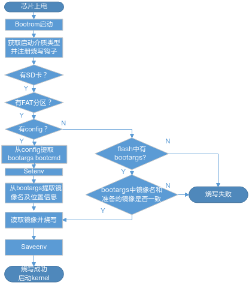
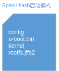
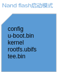
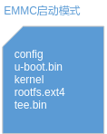
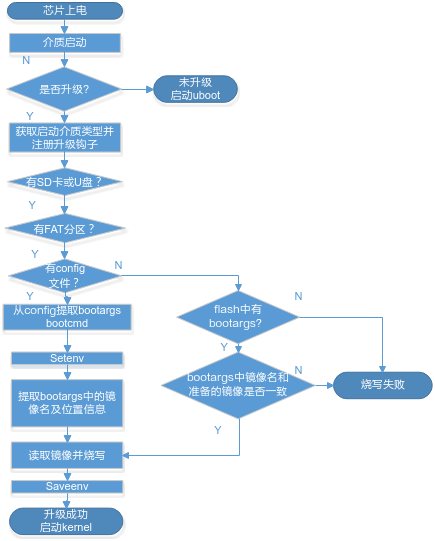
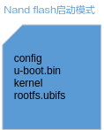
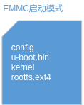
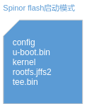
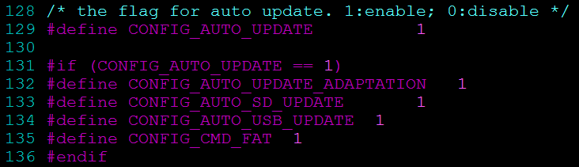

# 前言<a name="ZH-CN_TOPIC_0000002523511050"></a>

**概述<a name="section296mcpsimp"></a>**

本文档用于指导调试裸烧及非裸烧升级。

> **说明：** 
>
>-   下文描述均以SS928V100产品为例，在实际操作中，如无特殊说明，只需替换产品名和工具链名称；

**产品版本<a name="section300mcpsimp"></a>**

与本文档相对应的产品版本如下。

<a name="table303mcpsimp"></a>
<table><thead align="left"><tr id="row308mcpsimp"><th class="cellrowborder" valign="top" width="45%" id="mcps1.1.3.1.1"><p id="p310mcpsimp"><a name="p310mcpsimp"></a><a name="p310mcpsimp"></a>产品名称</p>
</th>
<th class="cellrowborder" valign="top" width="55.00000000000001%" id="mcps1.1.3.1.2"><p id="p312mcpsimp"><a name="p312mcpsimp"></a><a name="p312mcpsimp"></a>产品版本</p>
</th>
</tr>
</thead>
<tbody><tr id="row314mcpsimp"><td class="cellrowborder" valign="top" width="45%" headers="mcps1.1.3.1.1 "><p id="p316mcpsimp"><a name="p316mcpsimp"></a><a name="p316mcpsimp"></a>SS928</p>
</td>
<td class="cellrowborder" valign="top" width="55.00000000000001%" headers="mcps1.1.3.1.2 "><p id="p318mcpsimp"><a name="p318mcpsimp"></a><a name="p318mcpsimp"></a>V100</p>
</td>
</tr>
<tr id="row4483100111611"><td class="cellrowborder" valign="top" width="45%" headers="mcps1.1.3.1.1 "><p id="p8622349102117"><a name="p8622349102117"></a><a name="p8622349102117"></a>SS927</p>
</td>
<td class="cellrowborder" valign="top" width="55.00000000000001%" headers="mcps1.1.3.1.2 "><p id="p9185184311112"><a name="p9185184311112"></a><a name="p9185184311112"></a>V100</p>
</td>
</tr>
</tbody>
</table>

**读者对象<a name="section673315410274"></a>**

本文档（本指南）主要适用于以下工程师：

-   技术支持工程师
-   软件开发工程师

**修改记录<a name="section2467512116410"></a>**

<a name="table1557726816410"></a>
<table><thead align="left"><tr id="row2942532716410"><th class="cellrowborder" valign="top" width="20.72%" id="mcps1.1.4.1.1"><p id="p3778275416410"><a name="p3778275416410"></a><a name="p3778275416410"></a><strong id="b5687322716410"><a name="b5687322716410"></a><a name="b5687322716410"></a>文档版本</strong></p>
</th>
<th class="cellrowborder" valign="top" width="26.119999999999997%" id="mcps1.1.4.1.2"><p id="p5627845516410"><a name="p5627845516410"></a><a name="p5627845516410"></a><strong id="b5800814916410"><a name="b5800814916410"></a><a name="b5800814916410"></a>发布日期</strong></p>
</th>
<th class="cellrowborder" valign="top" width="53.16%" id="mcps1.1.4.1.3"><p id="p2382284816410"><a name="p2382284816410"></a><a name="p2382284816410"></a><strong id="b3316380216410"><a name="b3316380216410"></a><a name="b3316380216410"></a>修改说明</strong></p>
</th>
</tr>
</thead>
<tbody><tr id="row5947359616410"><td class="cellrowborder" valign="top" width="20.72%" headers="mcps1.1.4.1.1 "><p id="p1564572014209"><a name="p1564572014209"></a><a name="p1564572014209"></a>00B01</p>
</td>
<td class="cellrowborder" valign="top" width="26.119999999999997%" headers="mcps1.1.4.1.2 "><p id="p126451920132014"><a name="p126451920132014"></a><a name="p126451920132014"></a>2026-03-15</p>
</td>
<td class="cellrowborder" valign="top" width="53.16%" headers="mcps1.1.4.1.3 "><p id="p1664582017209"><a name="p1664582017209"></a><a name="p1664582017209"></a>第1次临时版本发布。</p>
</td>
</tr>
</tbody>
</table>

# 裸烧使用说明<a name="ZH-CN_TOPIC_0000002554590981"></a>

-   **[操作准备](#ZH-CN_TOPIC_0000002523471060)**  

-   **[裸烧流程](#ZH-CN_TOPIC_0000002554590983)**  

-   **[操作过程](#ZH-CN_TOPIC_0000002523471062)**  

-   **[操作示例](#ZH-CN_TOPIC_0000002523511056)**  

-   **[操作中需要注意的问题](#ZH-CN_TOPIC_0000002554510949)**  

-   **[设置eMMC扩展CSD寄存器](#ZH-CN_TOPIC_0000002523471064)**  

## 操作准备<a name="ZH-CN_TOPIC_0000002523471060"></a>

操作准备如下：

-   编译镜像，如[表1](#_Ref67494299)所示；
-   制作升级包；
-   存储介质准备（FAT32格式的SD卡）。

**表 1**  升级所需的镜像

<a name="_Ref67494299"></a>
<table><thead align="left"><tr id="row227mcpsimp"><th class="cellrowborder" valign="top" width="35%" id="mcps1.2.3.1.1"><p id="p229mcpsimp"><a name="p229mcpsimp"></a><a name="p229mcpsimp"></a>启动方案</p>
</th>
<th class="cellrowborder" valign="top" width="65%" id="mcps1.2.3.1.2"><p id="p231mcpsimp"><a name="p231mcpsimp"></a><a name="p231mcpsimp"></a>镜像</p>
</th>
</tr>
</thead>
<tbody><tr id="row233mcpsimp"><td class="cellrowborder" valign="top" width="35%" headers="mcps1.2.3.1.1 "><p id="p235mcpsimp"><a name="p235mcpsimp"></a><a name="p235mcpsimp"></a>快速启动</p>
</td>
<td class="cellrowborder" valign="top" width="65%" headers="mcps1.2.3.1.2 "><p id="p237mcpsimp"><a name="p237mcpsimp"></a><a name="p237mcpsimp"></a>u-boot-ss928v100.bin、uImage_ss928v100(kernel)、rootfs</p>
</td>
</tr>
<tr id="row238mcpsimp"><td class="cellrowborder" valign="top" width="35%" headers="mcps1.2.3.1.1 "><p id="p240mcpsimp"><a name="p240mcpsimp"></a><a name="p240mcpsimp"></a>非安全启动</p>
</td>
<td class="cellrowborder" rowspan="2" valign="top" width="65%" headers="mcps1.2.3.1.2 "><p id="p242mcpsimp"><a name="p242mcpsimp"></a><a name="p242mcpsimp"></a>boot_image.bin、uImage_ss928v100(kernel)、rootfs</p>
</td>
</tr>
<tr id="row243mcpsimp"><td class="cellrowborder" valign="top" headers="mcps1.2.3.1.1 "><p id="p245mcpsimp"><a name="p245mcpsimp"></a><a name="p245mcpsimp"></a>Non-TEE安全启动</p>
</td>
</tr>
<tr id="row246mcpsimp"><td class="cellrowborder" valign="top" width="35%" headers="mcps1.2.3.1.1 "><p id="p248mcpsimp"><a name="p248mcpsimp"></a><a name="p248mcpsimp"></a>TEE安全启动</p>
</td>
<td class="cellrowborder" valign="top" width="65%" headers="mcps1.2.3.1.2 "><p id="p250mcpsimp"><a name="p250mcpsimp"></a><a name="p250mcpsimp"></a>boot_image.bin、uImage_ss928v100(kernel)、rootfs、tee_image.bin</p>
</td>
</tr>
</tbody>
</table>

## 裸烧流程<a name="ZH-CN_TOPIC_0000002554590983"></a>

裸烧流程如[图1](#fig9770124917379)所示。

**图 1**  裸烧流程图<a name="fig9770124917379"></a>  


## 操作过程<a name="ZH-CN_TOPIC_0000002523471062"></a>

操作过程如下：

1.  根据[表1](#_Ref67494299)编译镜像，非安全启动和安全启动镜像的编译方法请参考《SS928V100/SS927V100 安全启动使用指南》，有如下注意事项。
    -   编译u-boot镜像时，需进入u-boot源码目录下，执行 make menuconfig

        根据实际情况使用的介质，开启sd卡或者usb的更新：

        Product  ---\>

        \[\*\] Auto update

        \[\*\]   Auto sd update

        \[ \]   Auto usb update

    -   编译GSL时，需进入gsl源码目录，在文件boot/ss928v100/main.c中打开SD升级宏开关，并关闭USB烧写宏开关（快速启动镜像不需要编译gsl）：

        ```
        #define CONFIG_AUTO_SD_UPDATE     1
        #define CONFIG_TOOLPLATFORM_USB_UPDATE  0
        ```

2.  根据使用的启动方案制作升级包。
    -   快速启动、非安全启动和Non-TEE安全启动升级包制作方法

        创建config文本文件，并把和镜像匹配的bootargs和bootcmd拷贝至其中，格式如下：

        -   SPI NOR Flash

            ```
            setenv bootargs 'mem=128M console=ttyAMA0,115200 clk_ignore_unused rw root=/dev/mtdblock2 rootfstype=jffs2 mtdparts=sfc:1M(u-boot.bin),12M(kernel),18M(rootfs.jffs2)';sa
            setenv bootcmd 'sf probe 0;sf read 0x42000000 0x100000 0xc00000;bootm 0x42000000';sa
            ```

        -   SPI NAND Flash:

            ```
            setenv bootargs 'mem=128M console=ttyAMA0,115200 clk_ignore_unused ubi.mtd=2 root=ubi0:ubifs rootfstype=ubifs rw mtdparts=nand:1M(u-boot.bin),12M(kernel),32M(rootfs.ubifs)';sa
            setenv bootcmd 'nand read 0x42000000 0x100000 0xc00000;bootm 0x42000000';sa
            ```

        -   eMMC:

            ```
            setenv bootargs 'mem=128M console=ttyAMA0,115200 clk_ignore_unused rw rootwait root=/dev/mmcblk0p3 rootfstype=ext4 blkdevparts=mmcblk0:1M(u-boot.bin),12M(kernel),96M(rootfs.ext4)';sa
            setenv bootcmd 'mmc read 0 0x42000000 0x800 0x6000; bootm 0x42000000';sa
            ```

        升级包参考如下：

          

        -   kernel为ATF + Linux Kernel镜像；
        -   对于快速启动，u-boot.bin为单独编译的u-boot-ss928v100.bin镜像；
        -   对于非安全启动和Non-TEE安全启动，u-boot.bin为image\_map脚本生成的boot\_image.bin镜像。

    -   TEE安全启动升级包制作方法

        创建config文本文件，并把和镜像匹配的bootargs和bootcmd拷贝至其中，格式如下：

        -   SPI NOR Flash

            ```
            setenv bootargs 'mem=128M console=ttyAMA0,115200 tee_enable root=/dev/mtdblock2 rw rootfstype=jffs2 mtdparts=sfc:1M(u-boot.bin),12M(kernel),18M(rootfs.jffs2),1M(tee.bin)';sa
            setenv bootcmd 'sf probe 0;sf read 0x42000000 0x100000 0xc00000;sf read 0x43000000 0x1f00000 0x100000;bootm 0x42000000 0x43000000';sa
            ```

        -   SPI NAND Flash:

            ```
            setenv bootargs 'mem=128M console=ttyAMA0,115200 tee_enable clk_ignore_unused ubi.mtd=2 root=ubi0:ubifs rootfstype=ubifs rw mtdparts=nand:1M(u-boot.bin),12M(kernel),32M(rootfs.ubifs),1M(tee.bin)';sa
            setenv bootcmd 'nand read 0x42000000 0x100000 0xc00000;nand read 0x43000000 0x2d00000 0x100000;bootm 0x42000000 0x43000000';sa
            ```

        -   eMMC:

            ```
            setenv bootargs 'mem=128M console=ttyAMA0,115200 tee_enable clk_ignore_unused rw rootwait root=/dev/mmcblk0p3 rootfstype=ext4 blkdevparts=mmcblk0:1M(u-boot.bin),12M(kernel),96M(rootfs.ext4),1M(tee.bin)';sa
            setenv bootcmd 'mmc read 0 0x42000000 0x800 0x6000; mmc read 0 0x43000000 0x36800 0x800; bootm 0x42000000 0x43000000';sa
            ```

        升级包参考如下：

          

        -   kernel为Linux Kernel镜像；
        -   u-boot.bin为image\_map脚本生成的boot\_image.bin镜像；
        -   tee.bin为image\_map脚本生成的tee\_image.bin镜像。

3.  插入存放有升级包的FAT32格式的SD卡至SDIO0卡槽，按住UPDATE按键，启动单板。

    > **说明：** 
    >-   Vendor作为TEE Owner的情况下不支持SD卡升级。
    >-   把升级包放置在SD卡前，请先把SD卡进行格式化操作。
    >-   升级包里的u-boot或boot\_image镜像名必须为u-boot.bin，镜像名必须和config中的bootargs一致，如10M\(sample.bin\)，则kernel的镜像名应为sample.bin；
    >-   可烧写多个文件系统镜像；
    >-   ubifs文件系统镜像的文件名中必须包含ubifs字符串，其他镜像的文件名中必须不能包含ubifs字符串。
    >-   ext4文件系统镜像的文件名中必须包含ext4字符串，其他镜像的文件名中必须不能包含ext4字符串。
    >-   由于LiteOS 启动bootcmd设置与Linux不同处，可参考如下命令设置：

    ```
    SPI NOR Flash: setenv bootcmd 'sf probe 0;sf read 0x44000000 0x1f00000 0x100000;go_riscv 0x44000000; sf read 0x50000000 0x100000 0xc00000;bootm 0x50000000;sa
    SPI NAND Flash: setenv bootcmd 'nand read 0x44000000 0x2d00000 0x100000;go_riscv 0x44000000; nand read 0x50000000 0x100000 0xc00000;bootm 0x50000000;sa。
    eMMC: setenv bootcmd ' mmc read 0 0x44000000 0x36000 0x800;go_riscv 0x44000000;mmc read 0 0x50000000 0x800 0x6000; bootm 50000000';sa
    ```

## 操作示例<a name="ZH-CN_TOPIC_0000002523511056"></a>

-   **[裸烧示例](#ZH-CN_TOPIC_0000002523471066)**  

### 裸烧示例<a name="ZH-CN_TOPIC_0000002523471066"></a>

-   格式化SD卡为FAT32格式；
-   将[操作过程](#ZH-CN_TOPIC_0000002523471062)中制作的升级包拷贝到格式化好的SD卡中。格式化SD卡具体方法请参考《外围设备驱动 操作指南》附录；
-   裸烧打印以及打印说明如下（以SPI NOR Flash非安全启动举例）：

    ```
    //bootrom读取u-boot.bin至内存并执行此u-boot
    //读取升级配置文件
    [0]=u-boot.bin       start=0x00000000 end=0x000fffff size=0x00100000
    [1]=kernel           start=0x00100000 end=0x00cfffff size=0x00c00000
    [2]=rootfs.jffs2     start=0x00d00000 end=0x01efffff size=0x01200000
    //读取并烧写u-boot.bin
    spinor erase...
    spinor write...
    //读取并烧写kernel
    spinor erase...
    spinor write...
    //读取并烧写rootfs.jffs2
    spinor erase...
    spinor write...
    //保存环境变量
    Saving Environment to SPI Flash... Erasing SPI flash...Writing to SPI flash...done
    OK
    //接下来将自动启动新系统
    ```

## 操作中需要注意的问题<a name="ZH-CN_TOPIC_0000002554510949"></a>

-   SD卡必须格式化成FAT32格式；
-   若SD卡有多个分区时，升级包必须放在第一个分区，否则扫描不到升级包；
-   u-boot或boot\_image镜像名称必须为u-boot.bin；
-   裸烧会自动保存config中的bootargs和bootcmd环境变量；
-   没有config文件时，仅会烧写bootrom读取的u-boot.bin镜像。

## 设置eMMC扩展CSD寄存器<a name="ZH-CN_TOPIC_0000002523471064"></a>

如果用SD卡裸烧的方式烧写，u-boot会利用自带的eMMC驱动对eMMC扩展CSD寄存器进行设置，不需要额外设置。但如果使用烧录器方式进行烧写，则需要烧录器配置eMMC扩展CSD寄存器。此部分主要说明在烧录器操作界面上，需要配置 eMMC 的哪些寄存器及寄存器的值。

eMMC 器件包含有BOOT1、BOOT2和 USER DATA分区，同时支持 n\_RST 管脚和下电复位。boot 从 USER DATA区启动，所有镜像数据都烧录到 USER DATA分区，同时只支持 n\_RST 管脚复位器件，因此，烧录器必须按下表配置寄存器的值，否则单板无法启动。

<a name="table427mcpsimp"></a>
<table><thead align="left"><tr id="row433mcpsimp"><th class="cellrowborder" valign="top" width="19%" id="mcps1.1.4.1.1"><p id="p435mcpsimp"><a name="p435mcpsimp"></a><a name="p435mcpsimp"></a>寄存器编号</p>
</th>
<th class="cellrowborder" valign="top" width="14.000000000000002%" id="mcps1.1.4.1.2"><p id="p437mcpsimp"><a name="p437mcpsimp"></a><a name="p437mcpsimp"></a>寄存器值</p>
</th>
<th class="cellrowborder" valign="top" width="67%" id="mcps1.1.4.1.3"><p id="p439mcpsimp"><a name="p439mcpsimp"></a><a name="p439mcpsimp"></a>说明</p>
</th>
</tr>
</thead>
<tbody><tr id="row440mcpsimp"><td class="cellrowborder" valign="top" width="19%" headers="mcps1.1.4.1.1 "><p id="p442mcpsimp"><a name="p442mcpsimp"></a><a name="p442mcpsimp"></a>179</p>
</td>
<td class="cellrowborder" valign="top" width="14.000000000000002%" headers="mcps1.1.4.1.2 "><p id="p444mcpsimp"><a name="p444mcpsimp"></a><a name="p444mcpsimp"></a>0x38</p>
</td>
<td class="cellrowborder" valign="top" width="67%" headers="mcps1.1.4.1.3 "><p id="p446mcpsimp"><a name="p446mcpsimp"></a><a name="p446mcpsimp"></a>此寄存器用于配置 boot分区，默认从 USER DATA区开始配置。</p>
</td>
</tr>
<tr id="row1034915471012"><td class="cellrowborder" valign="top" width="19%" headers="mcps1.1.4.1.1 "><p id="p1311121781010"><a name="p1311121781010"></a><a name="p1311121781010"></a>177</p>
</td>
<td class="cellrowborder" valign="top" width="14.000000000000002%" headers="mcps1.1.4.1.2 "><p id="p143117173108"><a name="p143117173108"></a><a name="p143117173108"></a>0x2</p>
</td>
<td class="cellrowborder" valign="top" width="67%" headers="mcps1.1.4.1.3 "><p id="p1931171718103"><a name="p1931171718103"></a><a name="p1931171718103"></a>此寄存器用于配置 eMMC 在 boot 模式下的总线宽度。用户需要根据硬件设计使用的总线宽度进行设置（0x1：4-bit  0x2：8-bit）。</p>
</td>
</tr>
<tr id="row447mcpsimp"><td class="cellrowborder" valign="top" width="19%" headers="mcps1.1.4.1.1 "><p id="p449mcpsimp"><a name="p449mcpsimp"></a><a name="p449mcpsimp"></a>167</p>
</td>
<td class="cellrowborder" valign="top" width="14.000000000000002%" headers="mcps1.1.4.1.2 "><p id="p451mcpsimp"><a name="p451mcpsimp"></a><a name="p451mcpsimp"></a>0x1f</p>
</td>
<td class="cellrowborder" valign="top" width="67%" headers="mcps1.1.4.1.3 "><p id="p453mcpsimp"><a name="p453mcpsimp"></a><a name="p453mcpsimp"></a>此寄存器用于配置 eMMC 器件的写可靠性。该寄存器需配置成 0x1f。</p>
</td>
</tr>
<tr id="row454mcpsimp"><td class="cellrowborder" valign="top" width="19%" headers="mcps1.1.4.1.1 "><p id="p456mcpsimp"><a name="p456mcpsimp"></a><a name="p456mcpsimp"></a>162</p>
</td>
<td class="cellrowborder" valign="top" width="14.000000000000002%" headers="mcps1.1.4.1.2 "><p id="p458mcpsimp"><a name="p458mcpsimp"></a><a name="p458mcpsimp"></a>0x1</p>
</td>
<td class="cellrowborder" valign="top" width="67%" headers="mcps1.1.4.1.3 "><p id="p460mcpsimp"><a name="p460mcpsimp"></a><a name="p460mcpsimp"></a>此寄存器用于配置 eMMC 器件的 n_RST 管脚是否有效。默认使用 n_RST 管脚，该寄存器必须配置成 0x1。</p>
</td>
</tr>
</tbody>
</table>

177寄存器配置如[表1](#_Ref19884834)所示。

**表 1**  177寄存器配置说明

<a name="_Ref19884834"></a>
<table><thead align="left"><tr id="row469mcpsimp"><th class="cellrowborder" valign="top" width="14.000000000000002%" id="mcps1.2.4.1.1"><p id="p471mcpsimp"><a name="p471mcpsimp"></a><a name="p471mcpsimp"></a>寄存器域</p>
</th>
<th class="cellrowborder" valign="top" width="51%" id="mcps1.2.4.1.2"><p id="p473mcpsimp"><a name="p473mcpsimp"></a><a name="p473mcpsimp"></a>寄存器域说明</p>
</th>
<th class="cellrowborder" valign="top" width="35%" id="mcps1.2.4.1.3"><p id="p475mcpsimp"><a name="p475mcpsimp"></a><a name="p475mcpsimp"></a>配置值</p>
</th>
</tr>
</thead>
<tbody><tr id="row477mcpsimp"><td class="cellrowborder" valign="top" width="14.000000000000002%" headers="mcps1.2.4.1.1 "><p id="p479mcpsimp"><a name="p479mcpsimp"></a><a name="p479mcpsimp"></a>Bit[4:3]</p>
</td>
<td class="cellrowborder" valign="top" width="51%" headers="mcps1.2.4.1.2 "><p id="p15267833114712"><a name="p15267833114712"></a><a name="p15267833114712"></a>BOOT_MODE(nonvolatile)</p>
<p id="p187712369473"><a name="p187712369473"></a><a name="p187712369473"></a>00：单沿 DS模式；</p>
<p id="p481mcpsimp"><a name="p481mcpsimp"></a><a name="p481mcpsimp"></a>01：单沿 HS模式；</p>
<p id="p17572638104711"><a name="p17572638104711"></a><a name="p17572638104711"></a>10：双沿boot模式；</p>
<p id="p482mcpsimp"><a name="p482mcpsimp"></a><a name="p482mcpsimp"></a>11：保留。</p>
</td>
<td class="cellrowborder" valign="top" width="35%" headers="mcps1.2.4.1.3 "><p id="p484mcpsimp"><a name="p484mcpsimp"></a><a name="p484mcpsimp"></a>0x0</p>
</td>
</tr>
<tr id="row485mcpsimp"><td class="cellrowborder" valign="top" width="14.000000000000002%" headers="mcps1.2.4.1.1 "><p id="p487mcpsimp"><a name="p487mcpsimp"></a><a name="p487mcpsimp"></a>Bit[2]</p>
</td>
<td class="cellrowborder" valign="top" width="51%" headers="mcps1.2.4.1.2 "><p id="p489mcpsimp"><a name="p489mcpsimp"></a><a name="p489mcpsimp"></a>RESET_BOOT_BUS_CONDITIONS(nonvolatile)</p>
<p id="p490mcpsimp"><a name="p490mcpsimp"></a><a name="p490mcpsimp"></a>0：boot之后，复位BOOT_BUS_WIDTH为x1，单沿，DS模式；</p>
<p id="p491mcpsimp"><a name="p491mcpsimp"></a><a name="p491mcpsimp"></a>1：boot之后，保留BOOT_BUS_WIDTH。</p>
</td>
<td class="cellrowborder" valign="top" width="35%" headers="mcps1.2.4.1.3 "><p id="p493mcpsimp"><a name="p493mcpsimp"></a><a name="p493mcpsimp"></a>默认值：0；</p>
<p id="p494mcpsimp"><a name="p494mcpsimp"></a><a name="p494mcpsimp"></a>必须配置为默认值</p>
</td>
</tr>
<tr id="row495mcpsimp"><td class="cellrowborder" valign="top" width="14.000000000000002%" headers="mcps1.2.4.1.1 "><p id="p497mcpsimp"><a name="p497mcpsimp"></a><a name="p497mcpsimp"></a>Bit[1:0]</p>
</td>
<td class="cellrowborder" valign="top" width="51%" headers="mcps1.2.4.1.2 "><p id="p499mcpsimp"><a name="p499mcpsimp"></a><a name="p499mcpsimp"></a>BOOT_BUS_WIDTH</p>
<p id="p1980384324718"><a name="p1980384324718"></a><a name="p1980384324718"></a>00：x1 (单沿) or x4 (双沿)总线boot；</p>
<p id="p10348194654718"><a name="p10348194654718"></a><a name="p10348194654718"></a>01：x4 (单沿/双沿)总线boot；</p>
<p id="p135201715485"><a name="p135201715485"></a><a name="p135201715485"></a>10：x8 (单沿/双沿)总线boot；</p>
<p id="p500mcpsimp"><a name="p500mcpsimp"></a><a name="p500mcpsimp"></a>11：保留。</p>
</td>
<td class="cellrowborder" valign="top" width="35%" headers="mcps1.2.4.1.3 "><p id="p502mcpsimp"><a name="p502mcpsimp"></a><a name="p502mcpsimp"></a>用户需要根据硬件设计使用的总线宽度进行设置：</p>
<p id="p503mcpsimp"><a name="p503mcpsimp"></a><a name="p503mcpsimp"></a>单板4线：0x1</p>
<p id="p504mcpsimp"><a name="p504mcpsimp"></a><a name="p504mcpsimp"></a>单板8线：0x2</p>
</td>
</tr>
</tbody>
</table>

> **说明：** 
>-   必须在烧录之前完成eMMC 扩展寄存器的配置。
>-   部分烧录器可能不支持设置扩展CSD寄存器的功能，需烧录器厂家支持。

具体的设置由于各厂家的eMMC烧录器不同而存在差异，请参考烧录器手册来配置。

# 非裸烧升级使用说明<a name="ZH-CN_TOPIC_0000002554590979"></a>

-   **[操作准备](#ZH-CN_TOPIC_0000002554590977)**  

-   **[升级流程](#ZH-CN_TOPIC_0000002554510953)**  

-   **[操作过程](#ZH-CN_TOPIC_0000002523511048)**  

-   **[操作示例](#ZH-CN_TOPIC_0000002554590985)**  

-   **[操作中需要注意的问题](#ZH-CN_TOPIC_0000002523511052)**  

## 操作准备<a name="ZH-CN_TOPIC_0000002554590977"></a>

升级操作准备如下：

-   编译镜像，参考[表1](#_Ref67494299)；
-   制作升级包；
-   存储介质准备（FAT32格式的SD卡或U盘）；

## 升级流程<a name="ZH-CN_TOPIC_0000002554510953"></a>

升级流程如[图1](#fig389214715210)所示。

**图 1**  升级流程图<a name="fig389214715210"></a>  


## 操作过程<a name="ZH-CN_TOPIC_0000002523511048"></a>

操作过程如下：

1.  根据[表1](#_Ref67494299)编译镜像，非安全启动和安全启动镜像的编译方法请参考《SS928V100/SS927V100 安全启动使用指南》，有如下注意事项。
    -   编译u-boot镜像时，需进入u-boot源码目录下，执行 make menuconfig

        根据实际情况使用的介质，开启sd卡或者usb的更新：

        Product  ---\>

        \[\*\] Auto update

        \[\*\]   Auto sd update

        \[ \]   Auto usb update

    -   编译GSL时，需进入gsl源码目录，在文件boot/ss928v100/main.c中打开SD升级宏开关，并关闭USB烧写宏开关（快速启动镜像不需要编译gsl）：

        ```
        #define CONFIG_AUTO_SD_UPDATE     1
        #define CONFIG_TOOLPLATFORM_USB_UPDATE  0
        ```

2.  根据使用的启动方案制作升级包。
    -   快速启动、非安全启动和Non-TEE安全启动升级包制作方法。

        创建config文本文件，并把和镜像匹配的bootargs和bootcmd拷贝至其中，格式如下：

        -   SPI NOR Flash

            ```
            setenv bootargs 'mem=128M console=ttyAMA0,115200 clk_ignore_unused rw root=/dev/mtdblock2 rootfstype=jffs2 mtdparts=sfc:1M(u-boot.bin),12M(kernel),18M(rootfs.jffs2)';sa
            setenv bootcmd 'sf probe 0;sf read 0x42000000 0x100000 0xc00000;bootm 0x42000000';sa
            ```

        -   SPI NAND Flash

            ```
            setenv bootargs 'mem=128M console=ttyAMA0,115200 clk_ignore_unused ubi.mtd=2 root=ubi0:ubifs rootfstype=ubifs rw mtdparts=nand:1M(u-boot.bin),12M(kernel),32M(rootfs.ubifs)';sa
            setenv bootcmd 'nand read 0x42000000 0x100000 0xc00000;bootm 0x42000000';sa
            ```

        -   eMMC

            ```
            setenv bootargs 'mem=128M console=ttyAMA0,115200 clk_ignore_unused rw rootwait root=/dev/mmcblk0p3 rootfstype=ext4 blkdevparts=mmcblk0:1M(u-boot.bin),12M(kernel),96M(rootfs.ext4)';sa
            setenv bootcmd 'mmc read 0 0x42000000 0x800 0x6000; bootm 0x42000000';sa
            ```

        升级包参考如下：

          

        -   kernel为ATF + Linux Kernel镜像；
        -   对于快速启动，u-boot.bin为单独编译的u-boot-ss928v100.bin镜像；
        -   对于非安全启动和Non-TEE安全启动，u-boot.bin为image\_map脚本生成的boot\_image.bin镜像。

    -   TEE安全启动升级包制作方法

        创建config文本文件，并把和镜像匹配的bootargs和bootcmd拷贝至其中，格式如下：

        -   SPI NOR Flash

            ```
            setenv bootargs 'mem=128M console=ttyAMA0,115200 tee_enable root=/dev/mtdblock2 rw rootfstype=jffs2 mtdparts=sfc:1M(u-boot.bin),12M(kernel),18M(rootfs.jffs2),1M(tee.bin)';sa
            setenv bootcmd 'sf probe 0;sf read 0x42000000 0x100000 0xc00000;sf read 0x43000000 0x1f00000 0x100000;bootm 0x42000000 0x43000000';sa
            ```

        -   SPI NAND Flash

            ```
            setenv bootargs 'mem=128M console=ttyAMA0,115200 tee_enable clk_ignore_unused ubi.mtd=2 root=ubi0:ubifs rootfstype=ubifs rw mtdparts=nand:1M(u-boot.bin),12M(kernel),32M(rootfs.ubifs),1M(tee.bin)';sa
            setenv bootcmd 'nand read 0x42000000 0x100000 0xc00000;nand read 0x43000000 0x2d00000 0x100000;bootm 0x42000000 0x43000000';sa
            ```

        -   eMMC

            ```
            setenv bootargs 'mem=128M console=ttyAMA0,115200 tee_enable clk_ignore_unused rw rootwait root=/dev/mmcblk0p3 rootfstype=ext4 blkdevparts=mmcblk0:1M(u-boot.bin),12M(kernel),96M(rootfs.ext4),1M(tee.bin)';sa
            setenv bootcmd 'mmc read 0 0x42000000 0x800 0x6000; mmc read 0 0x43000000 0x36800 0x800; bootm 0x42000000 0x43000000';sa
            ```

        升级包参考如下：

          

        -   kernel为Linux Kernel镜像；
        -   u-boot.bin为image\_map脚本生成的boot\_image.bin镜像；
        -   tee.bin为image\_map脚本生成的tee\_image.bin镜像。

3.  插入存放有升级包的FAT32格式的SD卡（SDIO0）或U盘，按住UPDATE按键，启动单板，升级系统。

    > **说明：** 
    >-   Vendor作为TEE Owner的情况下不支持SD卡升级。
    >-   把升级包放置在SD卡或U盘前，请先把SD卡或U盘进行格式化操作。
    >-   升级包里的镜像名必须和bootargs一致，如9M\(sample.bin\)，则kernel的镜像名应为sample.bin；
    >-   如果镜像文件不存在则不升级对应项；
    >-   支持升级多个文件系统镜像；
    >-   如果想继续使用u-boot中的环境变量bootargs和bootcmd，则不需要准备config文件；
    >-   ubifs文件系统镜像的文件名中必须包含ubifs字符串，其他镜像的文件名中必须不能包含ubifs字符串。
    >-   ext4文件系统镜像的文件名中必须包含ext4字符串，其他镜像的文件名中必须不能包含ext4字符串。
    >-   由于LiteOS 启动bootcmd设置与Linux不同处，可参考如下命令设置：

    ```
    SPI NOR Flash: setenv bootcmd 'sf probe 0;sf read 0x44000000 0x1f00000 0x100000;go_riscv 0x44000000; sf read 0x50000000 0x100000 0xc00000;bootm 0x50000000;sa
    SPI NAND Flash: setenv bootcmd 'nand read 0x44000000 0x2d00000 0x100000;go_riscv 0x44000000; nand read 0x50000000 0x100000 0xc00000;bootm 0x50000000;sa。
    eMMC: setenv bootcmd ' mmc read 0 0x44000000 0x36000 0x800;go_riscv 0x44000000;mmc read 0 0x50000000 0x800 0x6000; bootm 50000000';sa
    ```

## 操作示例<a name="ZH-CN_TOPIC_0000002554590985"></a>

-   **[分段升级](#ZH-CN_TOPIC_0000002554510955)**  

-   **[升级示例](#ZH-CN_TOPIC_0000002554510951)**  

### 分段升级<a name="ZH-CN_TOPIC_0000002554510955"></a>

分段升级适用于低内存芯片平台，当内存较小且升级的文件系统较大时可考虑打开此选项，打开此选项时只需要使用16M大小的内存 buffer，反之升级文件将占用文件大小的内存。

操作过程如下：

1.  打开分段升级宏\(CONFIG\_VENDOR\_UPGRADE\_BY\_SEGMENT\)

    ```
    vendor_setup     --->
    [*] Upgrade by segment write
    ```

2.  在代码中打开升级开关，如[图1](#_Ref19023871)所示。

    **图 1**  打开升级宏操作<a name="_Ref19023871"></a>  
    

    备注：其他操作和  [操作过程](#ZH-CN_TOPIC_0000002523511048)章节一致，在此不作赘述。

### 升级示例<a name="ZH-CN_TOPIC_0000002554510951"></a>

-   将u-boot镜像烧写到flash（spinor或nand）中或直接下载到内存中运行；
-   格式化SD卡或U盘为FAT格式；
-   将[操作过程](#ZH-CN_TOPIC_0000002523511048)中制作的升级包拷贝到格式化好的SD卡或U盘中。格式化SD卡或U盘具体方法请参考《外围设备驱动 操作指南》附录；
-   开发板上电，u-boot启动，开始自动升级。
-   升级打印以及打印说明如下（以SPI NOR Flash非安全启动举例）：

    ```
    //读取升级配置文件
    [0]=u-boot.bin       start=0x00000000 end=0x000fffff size=0x00100000
    [1]=kernel           start=0x00100000 end=0x00cfffff size=0x00c00000
    [2]=rootfs.jffs2     start=0x00d00000 end=0x01efffff size=0x01200000
    //读取并烧写u-boot.bin
    spinor erase...
    spinor write...
    //读取并烧写kernel
    spinor erase...
    spinor write...
    //读取并烧写rootfs.jffs2
    spinor erase...
    spinor write...
    //保存环境变量
    Saving Environment to SPI Flash... Erasing SPI flash...Writing to SPI flash...done
    OK
    //接下来将自动启动新系统
    ```

## 操作中需要注意的问题<a name="ZH-CN_TOPIC_0000002523511052"></a>

-   SD卡或U盘必须格式化成FAT格式；
-   若SD卡或U盘有多个分区时，升级包必须放在第一个分区，否则扫描不到升级包；
-   升级u-boot会自动保存config中的bootargs和bootcmd环境变量。

